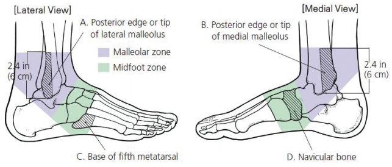
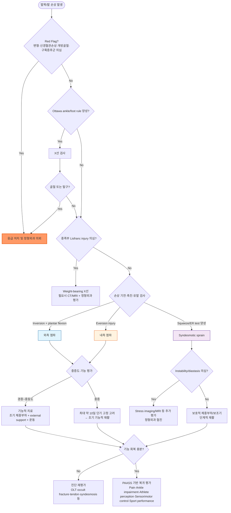

# 발/발목 염좌 Foot & Ankle Sprain

## <mark style="color:green;">일반 사항</mark>

* 발목 관절을 지지하는 인대 구조의 손상
* 정의 : inversion/eversion 등 정상 관절 가동 범위를 벗어나는 외력에 의한 인대 부분 또는 완전 파열
* 역학 (Waterman, JBJS 2010) : 미국 응급실 기반 연구에서 인구 1,000명당 연간 2.15건 발생; 15\~19세에서 발생률 최고(1,000명당 7.2건); 전체 인구 대상 연구에서는 측정 집단에 따라 1,000명-년당 5\~58.4건까지 다양하게 보고
* 합병증 : 급성 염좌 후 일부에서 통증·부종·불안정감이 지속될 수 있으며, 반복적인 giving-way와 재발성 염좌가 만성 발목 불안정성(chronic ankle instability, CAI)으로 이어질 수 있음; 반복 손상 시 외상후 발목 관절염 위험 증가
* 경과 : 대부분 수주 내 호전되지만 손상 정도·활동 수준에 따라 회복 기간은 다양함; syndesmotic injury(고위 염좌)는 일반적인 외측 염좌보다 회복이 더 오래 걸리는 경향

### <mark style="color:orange;">분류</mark>

#### <mark style="color:$primary;">외측 염좌 Lateral ankle sprain</mark>

* 발목 염좌의 약 85% 차지
* 손상 기전 : inversion & plantar flexion
* 손상 인대 : ant. talofibular lig.(ATFL, 가장 흔히 이환), calcaneofibular lig.(CFL), post. talofibular lig.(PTFL)
* 유발 검사 : anterior drawer test(ATFL), talar tilt test(CFL) (☞ 상세 방법은 [진단](#진단) 참조)

#### <mark style="color:$primary;">내측 염좌 Medial ankle sprain</mark>

* 손상 기전 : 강한 eversion ± external rotation
* 손상 인대 : deltoid lig.(medial collateral lig.)
* 외측 염좌보다 빈도는 낮으나 골절·syndesmosis 손상 등 **동반 손상이 많아 주의 필요**; 동반 비골 골절 여부 확인 필요(☞ Maisonneuve fracture, [진단](#진단) 참조)

#### <mark style="color:$primary;">High ankle(Syndesmotic) sprain</mark>

* 손상 기전 : 심한 dorsiflexion(경골 internal rotation을 동반한 외회전력)
* 손상 인대 : ant. inf./post. inf. tibiofibular lig., interosseous membrane & lig., inf. transverse lig.
* 유발 검사 : squeeze test, external rotation test, crossed-leg test
* 회복 기간이 외측/내측 염좌보다 길고(8\~9주), 불안정성이 확인되면 수술적 고정이 필요할 수 있어 조기 인지가 중요

### <mark style="color:orange;">손상 정도 Grading</mark>

<table><thead><tr><th width="90">등급</th><th width="220">임상 소견</th><th>기능</th></tr></thead><tbody><tr><td>Grade I</td><td>경증 부종/압통, laxity 없음</td><td>경미한 기능 제한; 보행 가능</td></tr><tr><td>Grade II</td><td>중등증 부종/압통, partial tear, mild laxity(firm end point)</td><td>보행·활동 시 통증과 기능 제한</td></tr><tr><td>Grade III</td><td>중증 부종/압통/반상출혈, complete tear 의심, 현저한 laxity/no firm end point</td><td>현저한 기능 제한; 체중부하가 매우 어렵거나 불가능할 수 있음</td></tr></tbody></table>


급성기에는 통증·부종·근육 경직 때문에 stress test와 임상 grading의 정확도가 떨어질 수 있으므로, **보행 가능 여부만으로 Grade III를 단정하지 않는다.** 필요하면 수일 후 재평가한다.


## <mark style="color:green;">원인 및 위험 인자</mark>

* 과거 발목 염좌 병력(가장 강력한 위험 인자) — 불충분한 재활 후 조기 복귀 시 재발률 상승
* 고유수용감각(proprioception) 저하, 자세 불안정, 보행 이상
* 근력 저하(비골근 등 외재근), 부적절한 준비운동
* 지면·신발 요인 : 고르지 않은 지면, 부적절한 신발(단, 특정 신발이 예방 효과가 입증되지는 않음)
* 스포츠 종목 : 방향 전환이 많고 접촉이 있는 종목(농구, 배구, 축구 등)에서 발생률 높음

## <mark style="color:green;">임상 양상</mark>

* 증상 : 부종, 혈종, 압통, 체중 부하 시 통증
* 손상 초기에는 통증/부종/근육 경직으로 인하여 정확한 판정이 어려움 — 발생 4\~7일째의 지연 진찰이 손상 정도 평가에 더 정확할 수 있음 (AFP 2025;112(6):609)
* 만성 불안정성(CAI) 시 : 반복적인 "giving-way"(꺾임) 감각, 운동 중 불안, 부종 재발

### <mark style="color:$danger;">🚩 Red Flags!</mark>

<mark style="color:$danger;">**즉각 조치 또는 의뢰**</mark>

* 명백한 변형/탈구 소견 (→ 골절-탈구 의심, 정복 및 정형외과 응급 의뢰)
* 원위부 맥박 소실, 감각 이상, 창백·냉감 등 신경혈관 손상 징후
* 손상 부위 대비 불균형하게 심한 통증 + 팽팽한 부종 + 수동 신전 시 극심한 통증 (→ 구획증후군 의심)
* 개방골절이 의심되는 상처(골 노출, 깊은 창상, 심한 변형 동반 등) — 응급 창상 처치·항생제·파상풍 예방 및 정형외과 의뢰

<mark style="color:$warning;">**당일 또는 조기 의뢰**</mark>

* Ottawa ankle/foot rule 양성(해당 골 압통 또는 **손상 직후와 진료 시 모두 4걸음 체중부하 불가**) → 당일 X선 검사
* 고에너지 외상(교통사고, 고소 낙상 등)을 동반한 손상
* squeeze test/external rotation test 양성 등 syndesmotic(high ankle) sprain 의심 소견 — instability/diastasis 여부에 따라 치료가 달라지므로 조기 추가 평가 및 정형외과 협진 고려
* 중족부 심한 통증·부종, plantar ecchymosis, tarsometatarsal joint 압통 또는 forefoot stress pain 등 Lisfranc injury 의심 소견 — weight-bearing X선 우선 고려, 의심이 높으면 CT/MRI 및 정형외과 평가
* Achilles tendon rupture 의심 — 갑작스러운 후방 통증/파열감("뒤에서 차인 듯한" 느낌), plantar flexion 현저한 약화, single-leg heel raise 불가, Thompson test 양성 → 조기 정형외과 평가
* 심한 부종·반상출혈과 현저한 기능 제한으로 체중부하가 거의 불가능한 경우 — 골절·중증 인대 손상 동반 여부 확인 및 초기 보호/고정 방침 결정

<mark style="color:$info;">**외래 추적 / 추가 평가 계획**</mark> <mark style="color:$info;">- 즉각 위험 낮으나 호전 없으면 의뢰</mark>

* 표준 치료 수주 후에도 통증·부종·기능 제한이 지속되면 진단을 재평가 — osteochondral lesion, **talar fracture**, peroneal tendon injury, syndesmotic injury, impingement, 중족부 증상 시 Lisfranc injury 등을 고려하고 의심 병변에 따라 MRI/CT/초음파 선택(예상 경과를 벗어나는 경우 특히 talar fracture·peroneal tendon injury 배제 목적의 MRI 고려, AFP 2025)
* 반복적인 "giving-way"·재발성 염좌 또는 불안정감이 지속되면 즉시 구조화된 균형·근력·고유수용감각 재활을 시행; 수개월의 적절한 재활에도 지속되면 CAI 평가 및 정형외과/스포츠의학 의뢰
* 골다공증 위험이 있는 고령 환자의 반복 손상 (→ 골밀도 평가 고려)

## <mark style="color:green;">진단</mark>

✽ [Foot anatomy](https://www.orthopaedia.com/anatomy-of-the-foot-ankle/), [Foot muscle(3D)](https://www.innerbody.com/anatomy/muscular/leg-foot)

### <mark style="color:orange;">유발 검사</mark>

* anterior drawer test : 무릎 굴곡 및 발목을 약간(15°) plantar-flex한 자세에서 검사자는 한쪽 손으로 경골을 고정하고 다른 손으로 뒤꿈치를 잡고 앞으로 당김; 건측에 비하여 전방 이동(＞1 ㎝)이 있으면 양성 — ATFL 평가
* talar tilt test : 검사대에 걸터앉아 발을 늘어뜨리고 약간 ankle plantar-flex 자세에서 검사자는 한쪽 손으로 경골을 고정하고 다른 손으로 calcaneus를 잡고 발목을 inversion시킴; 건측에 비하여 움직임이 크면(＞15°) 양성 — CFL 평가✽전통적으로 저굴 자세에서 시행하며 이 경우 ATFL을 1차적으로, CFL을 2차적으로 반영함; CFL을 보다 선택적으로 평가하려면 중립 또는 약간의 배굴(dorsiflexion) 자세가 이론적으로 더 적절함
* manual squeeze test : supine position에서 검사자가 환자의 아래쪽에 위치하여 양손을 종아리 중간 ⅓ 측부에 놓고 압박; 경비골 원위부(발목 관절 바로 위)에서 통증 발생 시 양성 — ankle syndesmosis 평가
* external rotation test : 무릎 90° 굴곡, 발목 중립 자세에서 발을 외회전; 경비골 원위부 통증 유발 시 양성 — syndesmosis 평가
* crossed-leg test : 환자가 건측 무릎 위에 환측 종아리 중간 부위를 가로질러 얹고, 검사자가 환측 무릎 내측을 아래로 눌러 경비골 원위부 통증 유발 여부 확인 — syndesmosis 손상 평가
* **Maisonneuve fracture 스크리닝** : syndesmotic injury 또는 medial ankle injury(내측 압통·eversion 기전)가 의심되면 **근위 비골까지 반드시 촉진**한다. 근위 비골 자체의 통증은 경미할 수 있으므로 압통이 있으면 tibia/fibula 전체 영상 평가를 고려한다


**International Ankle Consortium ROAST(2019)** 는 급성 외측 염좌 환자에서 손상 기전, 골·인대 촉진, 기능 평가를 포함한 표준화된 임상 평가를 권고하며, 만성 발목 불안정성 이행을 조기에 선별할 것을 강조함


### <mark style="color:orange;">만성 발목 불안정성(CAI) 선별 — CAIT</mark>

* **CAIT(Cumberland Ankle Instability Tool)** : 반복적인 giving-way, 불안정감, 운동 중 자신감 저하를 겪는 환자에서 CAI 선별에 사용하는 검증된 자가 설문지(9문항, 총점 0\~30점)
* 채점/판정 : 총점 **&lt;24점** — CAI를 시사하는 대표적 cut-off(International Ankle Consortium 연구 기준). 단, CAIT 단독으로 CAI를 확진하지 않으며 병력·giving-way·기능 제한과 함께 평가
* 초기 급성 염좌에서는 필수 검사는 아니나, 반복 손상이나 지속되는 giving-way 호소 시 시행하여 구조화된 재활 필요성을 객관화하는 데 도움

### <mark style="color:orange;">영상 검사</mark>

* X선, MRI, CT, 초음파
* 일률적 검사는 권고하지 않음 — 검사 대상 : 골절 의심(Ottawa rule에서 골절 의심), 치료에 호전 없음, syndesmotic injury 의심(불안정성 평가)
* MRI는 ATFL/CFL 파열 확인에 유용하나 급성기 일률적 시행은 권장되지 않음; osteochondral lesion, 힘줄 손상, syndesmosis 손상이 의심될 때 고려; 충분한 재활에도 반응하지 않는 만성 발목 불안정성(CAI) 평가에서도 구조적 원인(인대 상태, 동반 병변) 확인 목적의 보조 검사로 사용 가능

### <mark style="color:orange;">골절 감별 : Ottawa ankle rules</mark>

* 민감도 : 98.5%; 외상 48시간 내 진찰 시 99.6%
* 적용 시 주의 : 감각 저하/neuropathy, 의사소통·협조가 어려운 환자, 임신 등에서는 임상 판단을 우선; 소아에서는 주로 **5세 이상**에서 유용성이 검증됨
* 고령자에서는 민감도는 유지되나 특이도가 낮아 방사선 촬영 비율이 증가하는 경향이 보고됨 (Seyhan et al. 2024)

#### <mark style="color:$primary;">Ankle 골절 가능성(X선 검사 대상)</mark>

* malleolar zone에 통증이 있고 다음 중 하나 이상에 해당
  1. 가쪽 복사뼈의 tip 또는 비골 원위부 뒤 가장자리 6 ㎝ 부위의 골 압통
  2. 안쪽 복사뼈의 tip 또는 경골 원위부 뒤 가장자리 6 ㎝ 부위의 골 압통
  3. **손상 직후와 진료 시 모두 4걸음 체중부하가 불가능**

<figure><figcaption></figcaption></figure>

Ottawa ankle rules\
_<mark style="color:$info;">Ref. Update on Acute Ankle Sprains. AFP 2012;85(12). Fig 2</mark>_

#### <mark style="color:$primary;">Foot 골절 가능성(X선 검사 대상)</mark>

* midfoot zone에 통증이 있고 다음 중 하나 이상에 해당
  1. 5번째 metatarsal base 부위의 골 압통
  2. navicular bone 골 압통
  3. **손상 직후와 진료 시 모두 4걸음 체중부하가 불가능**

### <mark style="color:orange;">감별 진단</mark>

* 부종·압통이 유사하게 나타날 수 있는 발목·발 주변 손상의 감별; 특히 **Lisfranc injury는 단순 염좌로 오인하기 쉬워 놓치지 말아야 할 foot injury**로 항상 염두에 둔다

<table><thead><tr><th width="150">질환</th><th width="230">감별 포인트</th><th>비고</th></tr></thead><tbody><tr><td>Lisfranc injury</td><td>중족부 통증·부종, plantar ecchymosis, TMT joint 압통, forefoot abduction/pronation stress 통증</td><td>단순 염좌로 오인 가능; weight-bearing X선 우선, 의심 높고 X선 음성이면 CT/MRI 고려</td></tr><tr><td>Achilles tendon rupture</td><td>갑작스러운 후방 발목/종아리 통증, "뒤에서 차인 듯한" 느낌, plantar flexion 약화, single-leg heel raise 불가, Thompson test 양성</td><td>임상적으로 명확하면 진단 가능; 불확실하면 초음파/MRI 고려, 조기 정형외과 평가</td></tr><tr><td>Maisonneuve fracture</td><td>medial ankle injury 또는 syndesmosis 손상 + proximal fibula fracture; 근위 비골 압통이 경미할 수도 있음</td><td>syndesmotic/medial injury에서 근위 비골까지 촉진 필수; 의심 시 tibia/fibula 전체 영상</td></tr><tr><td>비골건 아탈구/파열(Peroneal tendon subluxation)</td><td>가쪽 복사뼈 후방 압통, 저항성 eversion 시 통증·아탈구 재현</td><td>염좌로 오인되기 쉬움; 반복 손상 시 의심</td></tr><tr><td>거골 골연골 병변(Osteochondral lesion of talus)</td><td>수주 후에도 지속되는 심부 통증, 부종, mechanical locking/catching</td><td>MRI 고려</td></tr><tr><td>제5중족골 기저부 골절(Jones fracture 포함)</td><td>midfoot 외측 골압통, Ottawa foot rule 양성</td><td>X선으로 평가</td></tr><tr><td>Occult fracture</td><td>예상보다 심하거나 지속되는 국소 골압통·체중부하 통증</td><td>초기 X선 음성이라도 임상적 의심이 높으면 재촬영/CT/MRI 고려</td></tr><tr><td>과사골(Os trigonum) 증후군</td><td>발목 후방 통증, 강한 plantar flexion 시 악화</td><td>과거력·측면 X선 참고</td></tr><tr><td>만성 발목 불안정성(CAI)</td><td>반복적인 giving-way·재발성 염좌·불안정감, 기능 저하</td><td>CAIT 등 검증된 설문지로 평가; IAC의 12개월 기준은 주로 연구 대상 선정 기준이며 임상적 재활을 12개월까지 미루지 않음</td></tr><tr><td>발목 관절염/류마티스 관절염</td><td>외상력 불분명, 아침 강직, 다관절 침범</td><td>영상·혈액 검사</td></tr></tbody></table>

***


```mermaid
graph TD
    A([발목/발 손상 발생]) --> B{Red Flag?<br/>변형·신경혈관손상·개방골절·구획증후군 의심}
    B -- Yes --> B1[응급 처치 및 정형외과 의뢰]
    B -- No --> C{Ottawa ankle/foot rule 양성?}
    C -- Yes --> D[X선 검사]
    D --> D1{골절 또는 탈구?}
    D1 -- Yes --> B1
    D1 -- No --> E{중족부 Lisfranc injury 의심?}
    C -- No --> E
    E -- Yes --> E1["Weight-bearing X선<br/>필요시 CT/MRI + 정형외과 평가"]
    E -- No --> F{손상 기전·촉진·유발 검사}
    F -- Inversion + plantar flexion --> G[외측 염좌]
    F -- Eversion injury --> H[내측 염좌]
    F -- Squeeze/ER test 양성 --> I[Syndesmotic sprain]
    G --> J{중증도·기능 평가}
    H --> J
    J -- 경증~중등도 --> K["기능적 치료<br/>조기 체중부하 + external support + 운동"]
    J -- 중증 --> L["최대 약 10일 단기 고정 고려<br/>→ 조기 기능적 재활"]
    I --> M{Instability/diastasis 의심?}
    M -- Yes --> M1["Stress imaging/MRI 등 추가 평가<br/>정형외과 협진"]
    M -- No --> M2["보호적 체중부하/보조기<br/>단계적 재활"]
    K --> N{기능 회복 충분?}
    L --> N
    M2 --> N
    N -- No --> O["진단 재평가<br/>OLT·occult fracture·tendon·syndesmosis 등"]
    N -- Yes --> P["PAASS 기반 복귀 평가<br/>Pain·Ankle impairment·Athlete perception·Sensorimotor control·Sport performance"]
    style B1 fill:#f96,stroke:#e65100,stroke-width:2px
    style I fill:#f3e5f5,stroke:#4a148c
    style G fill:#e1f5fe,stroke:#01579b
    style H fill:#fff3e0,stroke:#e65100
```

<p align="center"><strong>발/발목 염좌 진단 및 치료 알고리듬</strong></p>

<p align="center"><em><mark style="color:$info;">Ref. Ottawa ankle rules(AFP 2012), International Ankle Consortium ROAST(2019), JOSPT CPG Revision(2021), Smith et al. PAASS framework(BJSM 2021), Wu et al. Management of Acute Ankle Sprains(AFP 2025)</mark></em></p>

***

## <mark style="background-color:$warning;">Management</mark>


**치료 원칙 : 기능적 치료를 중심으로, PEACE & LOVE는 보조 개념으로 활용**\
JOSPT CPG(2021)는 급성 외측 발목 염좌에서 **external support와 통증이 허용하는 조기 체중부하, 단계적 운동 재활**을 핵심으로 권고함. PEACE & LOVE(Dubois & Esculier, BJSM 2020)는 초기 과도한 안정과 불필요한 처치를 줄이고 능동적 회복을 강조하는 임상적 framework이다. NSAID는 통증·기능 개선 효과가 있으나 조직 치유에 미치는 장기 영향에 대한 우려가 제기되어 있으므로 **고용량·장기간의 일률적 사용은 피하고 필요 최소 기간 사용**한다. 냉찜질은 주로 단기 진통 목적으로 선택적으로 사용할 수 있으며 회복 촉진 효과에 대한 근거는 제한적이다.


### <mark style="color:orange;">치료 방침</mark>

* Grade I\~II sprain(대부분) : 고정보다 **기능적 치료**(통증이 허용하는 조기 체중부하 + external support + 단계적 운동)가 표준
* Grade III/severe sprain : 초기 **단기 고정(최대 약 10일)** 을 고려할 수 있으나, 이후 가능한 빨리 기능적 재활로 전환
* Syndesmotic sprain : 일반적인 외측 염좌보다 회복이 더 오래 걸리는 경향. **stable injury**는 보호적 체중부하·보조기/필요시 단기 고정 후 단계적 재활; **instability 또는 diastasis 의심** 시 stress imaging/MRI 등 추가 평가 및 정형외과 협진
* External support : lace-up 또는 semirigid brace 등 기능적 지지 장구를 손상 정도·부종·활동 수준·환자 선호에 따라 선택. 일부 연구에서 lace-up/semirigid brace가 elastic bandage 단독보다 단기 기능 회복에 유리할 수 있으나 고정된 우열로 적용하지 않음. 급성기 착용 기간은 통상 **5\~10일**을 권장하며(AFP 2025, Grade C), 이후 통증·기능 회복에 따라 조정
* 스포츠·고강도 활동 복귀 시점은 **경과 주수만으로 결정하지 않고 기능 회복을 기준으로 판단**하며, 기존 grade별 주수는 대략적인 참고 범위로만 사용

## <mark style="color:green;">비-약물 치료 및 예방</mark>

### <mark style="color:orange;">급성기 (PEACE, 손상 후 1~3일)</mark>

* Protection(보호) : 통증을 유발하는 부하를 며칠간 제한; 단, 완전한 안정은 조직 강도 저하를 초래하므로 지양
* Elevation(거상) : 부종 감소에 도움
* Avoid anti-inflammatories(항염증제 최소화) : PEACE & LOVE에서는 항염증 치료가 최적의 조직 회복에 미칠 잠재적 영향을 우려하나 임상적 유해성이 확립된 것은 아님. NSAID는 통증 조절이 필요할 때 **최소 유효용량·단기간** 사용하고, 냉찜질은 주로 단기 진통 목적으로 선택적으로 사용(☞ [약물 치료](#약물-치료))
* Compression(압박) : elastic bandage/taping을 부종 조절과 편안함을 위해 선택적으로 사용할 수 있음; 과도한 압박은 피함(단, 압박 스타킹 착용 자체는 회복에 도움되지 않음)
* Education(교육) : 과잉 진료(불필요한 영상 검사·반복 수동 치료)를 피하고 능동적 회복의 중요성을 설명

### <mark style="color:orange;">아급성기 이후 (LOVE, 수일~수주)</mark>

* Load(부하) : 통증이 허용하는 범위에서 조기 체중 부하·능동 운동 재개 — 통증 감소 및 회복에 유효
* Optimism(낙관) : 회복에 대한 긍정적 기대가 예후와 연관됨; catastrophizing·불안은 회복 지연과 관련
* Vascularisation(혈류 증진) : 통증 없는 범위의 유산소 운동으로 혈류 촉진, 동기 부여 및 복귀 촉진
* Exercise(운동) : 통증과 부종이 허용하는 범위에서 조기에 ROM 운동을 시작하고, 이후 균형·근력·고유수용감각 운동을 단계적으로 추가; 물리치료(physical therapy) 병행 고려

### <mark style="color:orange;">예방/재활 운동</mark>

* 균형 : 한쪽 다리로 서 있기(1분), 한쪽 다리로 서서 공받기, 흔들리는 판 위에 서 있기
* 근력 강화 : band 운동, 앞쪽 발로 낮은 계단 끝에 서서 뒤꿈치 올리고 내리기
* Plyometrics : 쪼그려 앉았다 점프하기, 가위뛰기(앞뒤로 다리 벌리고 교차 뛰기), bounding(최대 속도의 50%로 큰 보폭으로 튀어 오르며 달리기)
* 표적화된 신경근육 재활 프로그램은 통상 **8\~12주**간 시행 (AFP 2025)
* 운동 시 발목 보호 장구(브레이스/테이핑) 적용 — 재발 방지에 근거 있음(특히 기존 손상력 있는 경우); 복귀 후에도 활동 시 **최대 12개월**까지 브레이스 착용을 지속하는 것이 재발 방지에 도움이 될 수 있음(Grade B, AFP 2025). 실제 착용 기간·강도는 활동 수준과 재발 위험에 따라 개별적으로 조정
* 발목 인대 부상 또는 재발을 방지할 수 있는 효과가 입증된 신발 종류는 없음

### <mark style="color:orange;">스포츠 복귀 Return to Sport — PAASS framework</mark>


**PAASS framework (Smith et al., BJSM 2021)** — 급성 외측 발목 염좌 후 복귀는 단순한 경과 기간보다 다음 5개 영역의 회복을 종합하여 판단한다.


<table><thead><tr><th width="180">영역</th><th>평가 항목</th></tr></thead><tbody><tr><td><strong>P</strong>ain</td><td>스포츠 중 및 최근 24시간의 통증</td></tr><tr><td><strong>A</strong>nkle impairments</td><td>발목 ROM, 근력, endurance, power</td></tr><tr><td><strong>A</strong>thlete perception</td><td>발목 안정감·자신감, 심리적 준비도</td></tr><tr><td><strong>S</strong>ensorimotor control</td><td>고유수용감각, 동적 균형, 자세 조절</td></tr><tr><td><strong>S</strong>port/functional performance</td><td>hop/jump/agility, sport-specific drill 수행 및 full training session 완료 능력</td></tr></tbody></table>

* 통증이 적다는 이유만으로 조기 복귀시키지 말고, 발목 기능·균형·자신감·종목별 수행능력까지 확인
* PAASS는 **평가해야 할 영역에 대한 합의 framework**이며, 개별 검사별 보편적 cut-off를 제시하는 도구는 아님
* Sensorimotor control 평가 예 : Star Excursion Balance Test(SEBT) 등 동적 균형 검사 활용 가능

## <mark style="color:green;">약물 치료</mark>

### <mark style="color:orange;">진통제</mark>

(☞ [통증](../220_/001_-pain.md#management))


구두 진통제(acetaminophen, NSAID, 아편유사제)는 급성 발목 염좌에서 통증 조절 효과가 대체로 유사하다고 보고된다(AFP 2025). PEACE & LOVE에서는 항염증제가 조직 회복에 미칠 잠재적 영향을 우려하지만, 발목 염좌에서 임상적으로 의미 있는 치유 지연이 확립된 것은 아니다. 따라서 환자의 통증 정도와 금기사항을 고려하여 **acetaminophen을 우선 고려할 수 있고, NSAID는 최소 유효용량으로 단기간 사용**한다.


* acetaminophen : 650\~1,300 ㎎ tid <mark style="color:blue;">\[타이레놀]</mark>; **아세트아미노펜 성분 총 일일 최대 4,000 ㎎**을 초과하지 않도록 함(간질환·과다 음주자는 감량); 국내 8시간 서방정(650 ㎎)은 통상 1회 2정 q8h, 24시간 6정(3,900 ㎎) 초과 금지
* ibuprofen : 400 ㎎ tid 필요시; 중등도 이상 통증에서 단기간 사용, 고용량은 환자 위험도·필요성에 따라 제한적으로 고려 <mark style="color:blue;">\[부루펜]</mark>
* naproxen : 275 ㎎ tid\~500 ㎎ bid <mark style="color:blue;">\[낙센]</mark>
* tramadol : acetaminophen ± NSAID로 조절되지 않는 **예외적인 심한 급성 통증**에서만 단기간 고려; 50 ㎎ bid\~qid 필요시 <mark style="color:blue;">\[트리돌]</mark>
* 파스, 겔 : ketoprofen <mark style="color:blue;">\[케토톱]</mark>, piroxicam <mark style="color:blue;">\[트라스트]</mark>

## <mark style="color:green;">시술 및 기타 처치</mark>

* platelet-rich plasma(PRP) injection : 염좌 회복에 도움이 될 가능성이 제시되나 현재까지 연구가 불충분하여 통상적 시행은 권장되지 않음; ankle arthritis에 대해서는 이득이 없다는 보고
* **개방골절이 의심되는 경우** 조기 항생제 투여, 창상 처치, 파상풍 예방접종 상태 확인 및 필요시 예방조치 후 응급 정형외과 의뢰
* 골다공증 관리(특히 반복 손상을 겪는 고령 환자)

### <mark style="color:orange;">수술적 치료</mark>


과거에는 Grade III sprain·운동선수·젊은 연령에서 급성기 수술적 인대 봉합을 고려하기도 했으나, 최근 RCT 및 메타분석들은 고강도 활동군을 포함하여 **급성 외측 인대 손상에서 조기 기능적 재활이 수술적 봉합과 기능적 결과 면에서 유사**함을 보고함. **젊은 운동선수에서도 급성기 보존적(기능적) 치료가 우선**이며, 이에 따라 현재는 **급성 손상 시 수술을 1차로 권장하지 않으며**, 충분한 기간(수개월)의 구조화된 재활에도 반응하지 않는 **만성 발목 불안정성(CAI)** 에서 선택적으로 고려하는 것이 일반적 흐름임


* 수술 고려 상황 : 충분한 보존적 재활(균형·근력 훈련 포함) 후에도 기계적 불안정성이 지속되는 CAI, 관절 내 유리체·연골 손상 동반이 의심되는 경우, 불안정 syndesmotic injury
* 술식 예 : 변형 Broström 술식(외측 인대 해부학적 봉합)

***

### <mark style="color:red;">질병코드</mark>

S93.4 발목의 염좌 및 긴장

S93.6 발의 기타 및 상세불명 부위의 염좌 및 긴장

S96 발목 및 발 부위의 근육 및 힘줄의 손상 — **동반 근·힘줄 손상 시**

***

## <mark style="color:purple;">처방례</mark>

> **처방례 1. 경증(Grade I)**
>
> ```
> 부루펜정 400 ㎎/T  1T tid  5일분
> ```
>
> _✽경증에서는 조기 보행 및 지지 테이핑/보조기만으로도 충분한 경우가 많으며, 진통제는 필요시에 한해 단기간 사용_

> **처방례 2. 중등도(Grade II)**
>
> ```
> 낙센정 500 ㎎/T  1T bid  7일분
> ```
>
> _✽semirigid 또는 lace-up brace 등 external support 병용 고려; 통증이 허용하는 범위에서 조기 체중부하와 단계적 재활 시작. 스포츠 복귀는 주수보다 PAASS 기능 기준으로 결정. 국소 통증 조절이 필요하면 topical NSAID(예: 케토톱)를 경구 NSAID의 대안 또는 보조적으로 선택할 수 있으나, 경구 NSAID와의 일률적인 병용은 권하지 않으며 환자의 총 NSAID 노출과 이상반응 위험을 고려한다_

> **처방례 3. 중증(Grade III/severe sprain), 통증 조절이 필요한 경우**
>
> ```
> 타이레놀정 650 ㎎/T  1T tid  필요시
> ```
>
> _✽초기 단기 고정(최대 약 10일)을 고려할 수 있으나 이후 조기에 기능적 재활로 전환. acetaminophen 총 일일 최대 용량은 [약물 치료](#약물-치료) 참조; acetaminophen ± NSAID로 조절되지 않는 예외적인 심한 급성 통증에서만 tramadol을 매우 단기간 고려_

> **처방례 4. Syndesmotic(High ankle) sprain 의심**
>
> ```
> 낙센정 500 ㎎/T  1T bid  7일분
> ```
>
> _✽squeeze test/external rotation test 양성 시 stable vs unstable injury를 구분. stable injury는 보호적 체중부하·보조기 및 단계적 재활, instability/diastasis 의심 시 stress imaging/MRI 등 추가 평가와 정형외과 협진 권고_

***

### <mark style="color:$success;">핵심 복약 지도</mark>

> **NSAID·냉찜질, 급성기에는 "적당히"**
>
> * NSAID는 통증·기능 개선에 도움이 될 수 있으나 불필요한 고용량·장기 사용은 피하고, 환자의 위장관·신장·심혈관 위험과 금기사항을 고려하여 최소 유효용량으로 단기간 사용하도록 안내
> * 얼음찜질은 회복을 촉진하기 위한 필수 치료가 아니라 **단기 통증 완화 목적**으로 선택적으로 사용; 피부 손상을 피하도록 한 번에 약 10\~20분 이내 적용

> **보조기(Brace)·테이핑 착용**
>
> * 활동 중에는 lace-up 또는 semirigid brace 착용을 권장하며, 착용감이 불편하더라도 재발 방지 효과가 있음을 설명
> * 압박 스타킹은 회복 촉진 효과가 입증되지 않았음을 안내(과도한 기대 방지)

> **조기 보행·재활 운동의 중요성**
>
> * 통증이 허용하는 범위에서 조기에 체중부하와 보행을 시작합니다. 초기 통증이 심하거나 정상 보행이 어려우면 목발 등을 사용하여 부분 체중부하로 시작한 뒤 단계적으로 늘립니다.
> * 완전히 나은 후에도 균형·근력 운동을 수 주간 지속해야 재발 위험을 낮출 수 있음

> **언제 다시 병원을 방문해야 하나요?**
>
> * 감각 이상, 창백, 냉감, 극심한 통증이 동반되는 경우 — 즉시 내원
> * 48\~72시간 이상 보존적 치료에도 통증·부종이 악화되는 경우
> * 4\~6주 후에도 호전이 없거나 정상적으로 걷기 어려운 경우
> * "발목이 자꾸 꺾인다(giving-way)"는 느낌이 반복되는 경우 — 만성 발목 불안정성 평가 필요

***

### <mark style="color:blue;">환자 안내서</mark>


**발/발목 염좌는 초기에 잘 보호하고, 가능한 범위에서 단계적으로 움직이는 것이 중요합니다**

발목 염좌는 대부분 수주 내 호전되지만 손상 정도에 따라 회복 기간이 다릅니다. 처음에는 통증을 유발하는 활동을 줄이고, 이후 통증이 허락하는 범위에서 걷기와 재활 운동을 단계적으로 늘리는 것이 중요합니다.


#### <mark style="color:$primary;">왜 발목을 삐게 되나요?</mark>

* 발목을 지지하는 인대가 정상 범위를 넘어서 늘어나거나 찢어지면서 발생합니다
* 발을 헛디디거나 고르지 않은 바닥을 밟을 때, 운동 중 방향을 급하게 바꿀 때 흔히 생깁니다
* 예전에 발목을 삔 적이 있다면 재발 위험이 더 높습니다

#### <mark style="color:$primary;">다친 직후에는 어떻게 해야 하나요?</mark>

* **무리한 체중 부하는 며칠간 피하십시오.** 다만 완전히 안 움직이는 것도 회복에 좋지 않으니, 통증이 없는 범위에서는 가볍게 움직여도 됩니다.
* **다리를 심장보다 높게 올려두십시오.** 부기를 줄이는 데 도움이 됩니다.
* **소염진통제는 필요한 최소 기간만 사용하십시오.** 얼음찜질은 필수 치료는 아니며, 통증을 줄이는 데 도움이 될 때 짧게 사용할 수 있습니다.
* **탄력붕대나 테이핑으로 압박해 주십시오.** 부기와 멍을 줄이는 데 도움이 됩니다.

#### <mark style="color:$primary;">며칠 지난 후에는 어떻게 관리하나요?</mark>

* **통증이 허락하는 범위에서 걷고 움직이십시오.** 무조건 쉬는 것보다 적절히 움직이는 것이 회복에 더 도움이 됩니다.
* **회복에 대해 너무 불안해하지 마십시오.** 대부분 잘 회복되며, 지나친 걱정이 오히려 회복을 늦출 수 있습니다.
* **통증 없는 범위의 가벼운 유산소 운동**(걷기, 실내 자전거 등)이 혈액순환과 회복에 도움이 됩니다.
* **균형·근력 운동을 꾸준히 하십시오.** 한쪽 다리로 서 있기 연습 등은 재발 방지에 중요합니다.

#### <mark style="color:$primary;">약은 어떻게 써야 하나요?</mark>

* 통증이 심하지 않다면 진통제 없이도 회복될 수 있습니다
* 통증이 있을 때는 타이레놀 계열 또는 소염진통제를 사용할 수 있으며, 소염진통제는 위장·신장·심혈관 질환 등 개인 위험을 고려해 필요한 최소 기간만 사용하십시오
* 처방받은 약 외에 임의로 용량을 늘리거나 장기간 복용하지 마십시오

#### <mark style="color:$primary;">이럴 때는 즉시 병원을 방문하세요</mark>

* 발이 차갑거나 창백해지고 감각이 이상한 경우
* 다친 직후부터 체중을 거의 실을 수 없거나, 통증·부종이 매우 심한 경우
* 48시간 이상 통증과 부기가 오히려 심해지는 경우
* 수주가 지나도 잘 낫지 않거나, 발목이 자꾸 "꺾이는" 느낌이 반복되는 경우
* 발바닥 중간에 멍이 들거나 발등·중족부가 심하게 붓고 아픈 경우 — Lisfranc injury 등 중족부 손상 평가 필요
