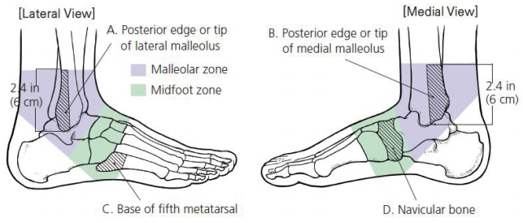

# 발/발목 염좌 Foot & Ankle Sprain

## <mark style="color:green;">일반 사항</mark>

* 발·발목 관절을 지지하는 인대 구조의 손상; 본 장은 급성 외상성 염좌, 특히 외측 발목 염좌를 중심으로 다룸(비외상성 발 통증은 발 통증 챕터 참조)
* 정의 : inversion/eversion 등 정상 관절 가동 범위를 벗어나는 외력에 의한 인대의 과신장, 부분 또는 완전 파열
* 역학 (Waterman, JBJS 2010) : 미국 응급실 기반 연구에서 인구 1,000명당 연간 2.15건 발생; 15\~19세에서 발생률 최고(1,000명당 7.2건); 연구 집단과 손상 포착 방법에 따라 발생률이 달라짐. 58.4건/1,000명-년은 미국 육군사관학교 생도 코호트의 수치로 일반 인구의 발생률과 구분함(Waterman, Am J Sports Med 2010)
* 합병증 : 급성 염좌 후 일부에서 통증·부종·불안정감이 지속될 수 있으며, 반복적인 giving-way와 재발성 염좌가 만성 발목 불안정성(chronic ankle instability, CAI)으로 이어질 수 있음; 반복 손상 시 외상후 발목 관절염 위험 증가
* 경과 : 대부분 수주 내 호전되지만 손상 정도·활동 수준에 따라 회복 기간은 다양함; syndesmotic injury(고위 염좌)는 일반적인 외측 염좌보다 회복이 더 오래 걸리는 경향

### <mark style="color:orange;">분류</mark>

#### <mark style="color:$primary;">외측 염좌 Lateral ankle sprain</mark>

* 발목 염좌의 약 85% 차지
* 손상 기전 : inversion & plantar flexion
* 손상 인대 : ant. talofibular lig.(ATFL, 가장 흔히 이환), calcaneofibular lig.(CFL), post. talofibular lig.(PTFL)
* 유발 검사 : anterior drawer test(ATFL), talar tilt test(CFL) (☞ 상세 방법은 [진단](#진단) 참조)

#### <mark style="color:$primary;">내측 염좌 Medial ankle sprain</mark>

* 손상 기전 : 강한 eversion ± external rotation
* 손상 인대 : deltoid lig.(medial collateral lig.)
* 외측 염좌보다 빈도는 낮으나 골절·syndesmosis 손상 등 **동반 손상이 많아 주의 필요**; 동반 비골 골절 여부 확인 필요(☞ Maisonneuve fracture, [진단](#진단) 참조)

#### <mark style="color:$primary;">High ankle(Syndesmotic) sprain</mark>

* 손상 기전 : 발이 지면에 고정된 상태에서 발목 배굴(dorsiflexion)과 발의 강제 외회전이 흔함; 발에 대한 경골의 상대적 내회전으로도 같은 외회전력이 발생할 수 있음
* 손상 인대 : ant. inf./post. inf. tibiofibular lig., interosseous membrane & lig., inf. transverse lig.
* 유발 검사 : squeeze test, external rotation test; crossed-leg test는 보조 검사로 활용 가능. 단일 검사 음성으로 손상을 배제하거나 양성만으로 불안정성을 확정하지 않음
* 회복은 일반적인 외측 염좌보다 오래 걸리는 경향; 손상 안정성·동반 병변·복귀 목표에 따라 수주~수개월로 다양함. 불안정성이 확인되면 수술적 고정이 필요할 수 있어 조기 평가가 중요함

### <mark style="color:orange;">손상 정도 Grading</mark>

<table><thead><tr><th width="90">등급</th><th width="220">임상 소견</th><th>기능</th></tr></thead><tbody><tr><td>Grade I</td><td>경증 부종/압통, laxity 없음</td><td>경미한 기능 제한; 보행 가능</td></tr><tr><td>Grade II</td><td>중등증 부종/압통, partial tear, mild laxity(firm end point)</td><td>보행·활동 시 통증과 기능 제한</td></tr><tr><td>Grade III</td><td>중증 부종/압통/반상출혈, complete tear 의심, 현저한 laxity/no firm end point</td><td>현저한 기능 제한; 체중부하가 매우 어렵거나 불가능할 수 있음</td></tr></tbody></table>


급성기에는 통증·부종·근육 경직 때문에 stress test와 임상 grading의 정확도가 떨어질 수 있으므로, **보행 가능 여부만으로 Grade III를 단정하지 않음.** 골절·탈구·신경혈관 손상 등은 초진 때 평가하고, 인대 손상 정도는 필요하면 4~7일째 재평가함.


## <mark style="color:green;">원인 및 위험 인자</mark>

* 과거 발목 염좌 병력(가장 강력한 위험 인자) - 불충분한 재활 후 조기 복귀 시 재발률 상승
* 고유수용감각(proprioception) 저하, 자세 불안정, 보행 이상
* 근력 저하(비골근 등 외재근), 부적절한 준비운동
* 지면·신발 요인 : 고르지 않은 지면, 부적절한 신발(단, 특정 신발이 예방 효과가 입증되지는 않음)
* 스포츠 종목 : 방향 전환이 많고 접촉이 있는 종목(농구, 배구, 축구 등)에서 발생률 높음

## <mark style="color:green;">임상 양상</mark>

* 증상 : 부종, 혈종, 압통, 체중 부하 시 통증
* 손상 초기에는 통증·부종·근육 방어로 인대 손상 정도 판정이 어려움; 초진에서 골절·응급 손상을 먼저 평가하고, 보호 치료 후 발생 4~7일째 지연 진찰로 인대 손상을 재평가하면 정확도가 높아질 수 있음(AFP 2025;112(6):609–617)
* 만성 불안정성(CAI) 시 : 반복적인 "giving-way"(꺾임) 감각, 운동 중 불안, 부종 재발

### <mark style="color:$danger;">🚩 Red Flags!</mark>

<mark style="color:$danger;">**즉각 조치 또는 의뢰**</mark>

* 명백한 변형·탈구, 피부 긴장이나 피부 괴사 위험 소견 → 신경혈관 상태 확인, 적절한 초기 보호 및 응급 정형외과 의뢰; 혈행 장애가 있으면 숙련된 의료진의 긴급 정복 필요
* 원위부 맥박 소실, 감각 이상, 창백·냉감 등 신경혈관 손상 징후
* 손상 정도에 비해 불균형하게 심하거나 빠르게 악화되는 통증, 팽팽한 부종, 발가락 수동 신전 시 심한 통증 등 → 구획증후군 의심. 모든 징후가 갖추어질 때까지 기다리지 않으며 원위부 맥박이 정상이어도 배제되지 않음
* 개방골절이 의심되는 상처(골 노출, 깊은 창상, 심한 변형 동반 등) - 응급 창상 처치·항생제·파상풍 예방 및 정형외과 의뢰

<mark style="color:$warning;">**당일~수일 내 평가**</mark>

* Ottawa ankle/foot rule 양성(해당 통증 영역에서 규정된 골 압통 또는 손상 직후와 진료 시 모두 4걸음 체중부하 불가) → 당일 X선 검사; 신경병증·고에너지 외상 등 적용이 부적절한 상황에서는 rule 음성이어도 임상적으로 판단함
* 고에너지 외상(교통사고, 고소 낙상 등)을 동반한 손상
* syndesmotic(high ankle) sprain 의심(경비골 원위부 압통, squeeze/external rotation test 양성 등) → 초기 보호·고정 및 목발로 체중부하 제한, 발목 X선과 필요시 추가 영상·정형외과 평가로 안정성 확인; 심한 체중부하 장애·관절 이개 의심 시 당일 평가
* 중족부 심한 통증·부종, plantar ecchymosis, TMT joint 압통 또는 forefoot stress pain 등 Lisfranc injury 의심 → 당일 평가. 체중부하를 중단하고 고정; 통증이 허용하면 체중부하 X선, 불가능하면 강요하지 말고 비체중부하 X선 후 필요시 CT/MRI 및 정형외과 평가
* Achilles tendon rupture 의심(갑작스러운 후방 통증·파열감, single-leg heel raise 불가, Thompson test 양성 등) → 당일 평가·조기 정형외과 의뢰. 초기에는 발목을 족저굴곡 상태로 보호·고정하고 체중부하를 제한하며 강제 배굴·스트레칭을 피함; 능동 족저굴곡이 일부 가능해도 파열이 배제되지 않음
* 심한 부종·반상출혈과 현저한 기능 제한으로 체중부하가 거의 불가능한 경우 - 골절·중증 인대 손상 동반 여부 확인 및 초기 보호/고정 방침 결정

<mark style="color:$info;">**조기 평가 및 추적**</mark> <mark style="color:$info;">- 즉각 위험 낮으나 호전 없으면 의뢰</mark>

* 초기 X선이 정상이더라도 국소 골압통·체중부하 장애가 지속되거나 경과가 예상보다 나쁘면 조기 재평가함. 특히 손상 후 1주 초과~3주 미만의 지속 통증에서 잠복골절·골연골·힘줄 손상 등이 의심되면 비조영 MRI 또는 CT를 고려함(ACR Acute Trauma to the Ankle). 수주 후에도 통증·부종·기능 제한이 남으면 OLT, 거골 골절, 비골건 손상, syndesmotic injury, impingement 및 중족부 Lisfranc injury를 재평가하며 4~6주까지 일률적으로 기다리지 않음
* 반복적인 "giving-way"·재발성 염좌 또는 불안정감이 지속되면 즉시 구조화된 균형·근력·고유수용감각 재활을 시행; 수개월의 적절한 재활에도 지속되면 CAI 평가 및 정형외과/스포츠의학 의뢰
* 고령자의 저에너지 외상에서는 골절과 낙상 위험을 함께 평가; 골다공증 검사는 연령·취약골절 병력·기타 위험인자에 따라 결정하며 반복 염좌 자체를 검사 적응증으로 삼지 않음

## <mark style="color:green;">진단</mark>

✽ [Foot anatomy](https://www.orthopaedia.com/anatomy-of-the-foot-ankle/), [Foot muscle(3D)](https://www.innerbody.com/anatomy/muscular/leg-foot)

### <mark style="color:orange;">유발 검사</mark>

* anterior drawer test : 무릎을 굴곡하고 발목을 약 10~20° 족저굴곡한 자세에서 경골을 고정한 뒤 뒤꿈치·거골을 앞으로 당겨 ATFL을 평가함. 건측보다 증가한 전방 이동과 종말감(end point)의 감소·소실을 종합해 해석함; 도수 진찰에서는 이동량의 고정된 수치보다 건측과의 차이 및 종말감을 평가함
* talar tilt test : 경골을 고정하고 뒤꿈치를 잡아 발목을 내번시킴. CFL 평가에는 중립 또는 약간 배굴 자세를 사용하며, 족저굴곡 자세에서는 ATFL의 영향이 커짐. 건측과 비교한 내번 이완성과 종말감을 평가하고, 도수 진찰에서는 각도의 고정된 수치보다 건측과의 차이 및 종말감을 평가함; stress X선의 측정 기준과 구분함
* manual squeeze test : supine position에서 검사자가 환자의 아래쪽에 위치하여 양손을 종아리 중간 ⅓ 측부에 놓고 압박; 경비골 원위부(발목 관절 바로 위)에서 통증 발생 시 양성 - ankle syndesmosis 평가
* external rotation test : 무릎 90° 굴곡, 발목 중립 자세에서 발을 외회전; 경비골 원위부 통증 유발 시 양성 - syndesmosis 평가
* crossed-leg test : 환자가 건측 무릎 위에 환측 종아리 중간 부위를 가로질러 얹고, 검사자가 환측 무릎 내측을 아래로 눌러 경비골 원위부 통증 유발 여부 확인 - syndesmosis 손상 평가
* **Maisonneuve fracture 스크리닝** : syndesmotic injury 또는 medial ankle injury가 의심되면 근위 비골까지 촉진하고 무릎·하퇴도 평가함. 근위 비골 압통이나 손상 기전·발목 영상상 의심 소견이 있으면 무릎과 발목을 포함한 경골·비골 전장 X선을 고려함; 근위 비골 통증이 뚜렷하지 않다는 이유만으로 배제하지 않음


**International Ankle Consortium ROAST(2019)** 는 손상 기전·병력, 골·인대 촉진과 함께 통증·부종·관절가동범위·근력·균형·보행·환자 보고 기능을 포함한 임상 평가를 제안함. 단일 유발 검사보다 병력·촉진·여러 검사와 기능을 종합해 판단함


### <mark style="color:orange;">만성 발목 불안정성(CAI) 선별 - CAIT</mark>

* **CAIT(Cumberland Ankle Instability Tool)** : 반복적인 giving-way, 불안정감, 운동 중 자신감 저하를 겪는 환자에서 CAI 선별에 사용하는 검증된 자가 설문지(9문항, 총점 0\~30점)
* 채점/판정 : 총점이 낮을수록 불안정성이 심함. **&lt;24점**은 International Ankle Consortium의 대표적 연구 대상 선정 기준이며 보편적 임상 확진 기준은 아님; 언어판·검증 집단에 따라 cut-off가 다를 수 있어 CAIT 단독으로 확진하지 않고 병력·giving-way·기능 제한과 함께 평가함
* 초기 급성 염좌에서는 필수 검사는 아니나, 반복 손상이나 지속되는 giving-way 호소 시 시행하여 구조화된 재활 필요성을 객관화하는 데 도움

### <mark style="color:orange;">영상 검사</mark>

* 초기 골절 평가 : 발목 X선은 AP·lateral·mortise, 발 X선은 AP·oblique·lateral view를 기본으로 함. 통증 영역이 둘 다 해당하면 발목·발 각각의 촬영 필요성을 판단함
* 영상검사를 일률적으로 시행하지 않음. X선은 Ottawa rule 양성 또는 rule 적용이 부적절하거나 rule이 다루지 않는 부위의 골절이 의심될 때 시행함; 초음파·MRI·CT는 의심 병변과 결과가 치료를 바꿀 가능성에 따라 선택함
* MRI : 인대·syndesmosis·골연골·힘줄 및 잠복골절 평가에 유용하나 단순 외측 염좌에서 일률적으로 시행하지 않음. 초기 X선 음성 후 1주 초과~3주 미만의 지속 통증이나 임상적 의심이 높은 경우 비조영 MRI 또는 CT를 고려함; 골절 형태·전위 평가에는 CT, 연부조직·골연골 평가에는 MRI가 유리함. 비골건 아탈구 등 동적 힘줄 평가에는 초음파를 활용할 수 있음
* Syndesmosis : 발목 X선상 경비골·내측 관절 간격과 정렬을 확인함. X선이 정상이어도 손상이 배제되지 않으며 필요시 stress X선·MRI 등으로 추가 평가함; MRI상 인대 파열과 기계적 불안정성을 동일시하지 않고 전문의가 임상·영상 소견을 종합함

### <mark style="color:orange;">골절 감별 : Ottawa ankle rules</mark>

* 민감도는 높으나 완벽하지 않음. Bachmann 등(BMJ 2003)의 메타분석에서는 전체 97.6%, 손상 48시간 이내 평가 연구에서 99.6%로 보고되었으며, 연구 집단·검사 시점에 따라 달라짐; rule 음성으로 모든 발·발목 손상을 배제하지 않음
* 적용 시 주의 : 감각 저하·신경병증, 의사소통·협조가 어려운 환자, 고에너지 외상, 임신 등에서는 rule만으로 영상검사를 결정하지 않음. 소아에서는 주로 **5세 이상이며 진찰에 협조하고 손상 전 정상 보행이 가능했던 경우**에 활용함; 임신 중에도 골절이 의심되면 필요한 영상검사를 지연하지 않음
* 고령자에서는 민감도는 유지되나 특이도가 낮아 방사선 촬영 비율이 증가하는 경향이 보고됨 (Seyhan et al. 2024)

#### <mark style="color:$primary;">Ankle 골절 가능성(X선 검사 대상)</mark>

* malleolar zone에 통증이 있고 다음 중 하나 이상에 해당
  1. 가쪽 복사뼈의 tip 또는 비골 원위부 뒤 가장자리 6 ㎝ 부위의 골 압통
  2. 안쪽 복사뼈의 tip 또는 경골 원위부 뒤 가장자리 6 ㎝ 부위의 골 압통
  3. **손상 직후와 진료 시 모두 4걸음 체중부하가 불가능**(절뚝거리더라도 양발에 번갈아 체중을 실어 총 4걸음을 걸으면 보행 가능으로 평가)

<figure><figcaption></figcaption></figure>

Ottawa ankle rules\
_<mark style="color:$info;">Ref. Update on Acute Ankle Sprains. AFP 2012;85(12). Fig 2</mark>_

#### <mark style="color:$primary;">Foot 골절 가능성(X선 검사 대상)</mark>

* midfoot zone에 통증이 있고 다음 중 하나 이상에 해당
  1. 5번째 metatarsal base 부위의 골 압통
  2. navicular bone 골 압통
  3. **손상 직후와 진료 시 모두 4걸음 체중부하가 불가능**(절뚝거리더라도 양발에 번갈아 체중을 실어 총 4걸음을 걸으면 보행 가능으로 평가)


Ottawa rules는 복사뼈·중족부의 특정 골절을 선별하는 도구임. 발가락·중족골 간부·종골 등 rule이 다루지 않는 부위의 골절, Lisfranc 인대 손상, 아킬레스건 파열, syndesmotic injury는 음성이라도 별도로 평가함.


### <mark style="color:orange;">감별 진단</mark>

* 부종·압통이 유사하게 나타날 수 있는 발목·발 주변 손상의 감별; 특히 **Lisfranc injury는 단순 염좌로 오인하기 쉬워 놓치지 말아야 할 foot injury**로 항상 염두에 둔다

<table><thead><tr><th width="150">질환</th><th width="230">감별 포인트</th><th>비고</th></tr></thead><tbody><tr><td>Lisfranc injury</td><td>중족부 통증·부종, plantar ecchymosis, TMT joint 압통, forefoot abduction/pronation stress 통증</td><td>단순 염좌로 오인 가능; 체중부하 중단·고정; 통증이 허용하면 weight-bearing X선, 불가능하거나 X선 정상·불명확해도 의심이 높으면 CT/MRI와 정형외과 평가</td></tr><tr><td>Achilles tendon rupture</td><td>갑작스러운 후방 발목/종아리 통증, "뒤에서 차인 듯한" 느낌, plantar flexion 약화, single-leg heel raise 불가, Thompson test 양성</td><td>능동 족저굴곡이 가능해도 파열 배제 불가; 초기 족저굴곡 고정·체중부하 제한 및 당일 평가, 불확실하면 초음파 등 고려</td></tr><tr><td>Maisonneuve fracture</td><td>medial ankle injury 또는 syndesmosis 손상 + proximal fibula fracture; 근위 비골 압통이 경미할 수도 있음</td><td>syndesmotic/medial injury에서 근위 비골까지 촉진 필수; 의심 시 tibia/fibula 전체 영상</td></tr><tr><td>비골건 아탈구·파열(Peroneal tendon subluxation/tear)</td><td>가쪽 복사뼈 후방 압통, 저항성 eversion 시 통증·아탈구 재현</td><td>염좌로 오인되기 쉬움; 반복 손상 시 의심</td></tr><tr><td>거골 골연골 병변(Osteochondral lesion of talus)</td><td>수주 후에도 지속되는 심부 통증, 부종, mechanical locking/catching</td><td>MRI 고려</td></tr><tr><td>제5중족골 근위부 골절</td><td>기저부 견열골절(zone 1)과 골간단–골간 이행부의 Jones 골절(zone 2)을 구분; 기저부 및 그 원위부까지 촉진</td><td>X선으로 위치·전위 평가; Jones 골절은 불유합 위험이 높아 정형외과 평가, 기저부 압통만으로 선별하면 놓칠 수 있음</td></tr><tr><td>Occult fracture</td><td>예상보다 심하거나 지속되는 국소 골압통·체중부하 통증</td><td>초기 X선 음성이라도 임상적 의심이 높으면 재촬영/CT/MRI 고려</td></tr><tr><td>삼각골(Os trigonum) 증후군</td><td>발목 후방 통증, 강한 plantar flexion 시 악화</td><td>과거력·측면 X선 참고</td></tr><tr><td>만성 발목 불안정성(CAI)</td><td>반복적인 giving-way·재발성 염좌·불안정감, 기능 저하</td><td>CAIT 등 검증된 설문지로 평가; IAC의 12개월 기준은 주로 연구 대상 선정 기준이며 임상적 재활을 12개월까지 미루지 않음</td></tr><tr><td>발목 관절염/류마티스 관절염</td><td>외상력 불분명, 아침 강직, 다관절 침범</td><td>영상·혈액 검사</td></tr></tbody></table>

***

### <mark style="color:orange;">발/발목 염좌 진단 및 치료 알고리듬</mark>

<table><thead><tr><th width="320">판단·분기</th><th>조치·다음 단계</th></tr></thead><tbody><tr><td>① 변형·탈구, 신경혈관 손상, 개방골절, 구획증후군 의심</td><td>즉각 보호·응급 처치 및 응급 정형외과 의뢰</td></tr><tr><td>② 응급 소견 없음 → Ottawa ankle/foot rule 양성 또는 rule 밖 골절 의심·적용 부적절</td><td>해당 부위 X선. 골절이 확인되면 고정·체중부하 제한 후 당일 치료 방침 결정; 개방·혈행 장애·불안정 골절은 응급 의뢰</td></tr><tr><td>③ X선 음성 또는 촬영 불필요 → Lisfranc·아킬레스건 손상 의심 여부 확인</td><td>의심되면 체중부하 제한·손상에 맞는 고정 및 당일 평가. Lisfranc은 가능한 경우 체중부하 X선, 필요시 CT/MRI; 아킬레스건은 임상 평가와 필요시 초음파</td></tr><tr><td>④ 경비골 원위부 압통·외회전 기전·유발 검사 등 syndesmotic injury 의심</td><td>초기 고정·체중부하 제한 후 X선과 필요시 추가 영상·정형외과 평가. 안정성 확인 전 일반 외측 염좌처럼 조기 보행을 적용하지 않음; 불안정 손상은 수술 평가, 안정 손상은 개별 보호 기간 후 단계적 부하·재활</td></tr><tr><td>⑤ 동반 손상 배제 후 외측 염좌의 중증도·기능 평가</td><td>경증~중등도: 보조기·통증이 허용하는 조기 체중부하·운동. 중증: 최대 약 10일 단기 고정 고려 후 기능적 재활. 내측 염좌는 골절·syndesmosis 등 동반 손상을 충분히 평가한 후 방침 결정</td></tr><tr><td>⑥ 초기 통증·부종으로 인대 평가 불확실</td><td>보호 치료 후 4~7일째 재진찰. 악화·응급 소견이 생기면 예정일을 기다리지 않고 평가</td></tr><tr><td>⑦ 지속 골압통·보행 장애 또는 예상 경과를 벗어나는 회복</td><td>진단 재평가. 초기 X선 음성 후 1주 초과~3주 미만의 지속 통증에서 비조영 MRI/CT 고려; OLT·잠복골절·힘줄·syndesmosis 손상 등을 평가</td></tr><tr><td>⑧ 일상 기능 회복 → 스포츠 복귀 평가</td><td>외측 발목 염좌는 PAASS의 통증·발목 기능·자신감·균형·종목별 수행을 종합. 복귀 후에도 균형·근력 운동과 활동 중 보조기로 재발 예방; 반복 giving-way는 CAI 평가</td></tr></tbody></table>

_Ref. JOSPT CPG 2021; ACR Acute Trauma to the Ankle/Foot; ESSKA-AFAS syndesmosis consensus 2016; PAASS consensus 2021; AFP 2025._

***

## <mark style="background-color:$warning;">Management</mark>


**치료 원칙 : 기능적 치료를 중심으로, PEACE & LOVE는 보조 개념으로 활용**\
JOSPT CPG(2021)는 급성 외측 발목 염좌에서 **external support, 통증이 허용하는 조기 체중부하 및 단계적 운동 재활**을 권고함. PEACE & LOVE(Dubois & Esculier, BJSM 2020)는 능동적 회복을 강조하는 **논설에서 제안된 개념**이며, 모든 항목이 임상시험으로 검증된 치료지침은 아님. NSAID는 최소 유효용량으로 단기간 사용할 수 있고, 냉찜질은 피부를 보호하며 단기 진통 목적으로 선택적으로 사용함. 항염증제나 냉찜질을 일률적으로 금지하지 않음


### <mark style="color:orange;">치료 방침</mark>

* Grade I\~II sprain(대부분) : 고정보다 **기능적 치료**(통증이 허용하는 조기 체중부하 + external support + 단계적 운동)가 표준
* Grade III/severe sprain : 초기 **단기 고정(최대 약 10일)** 을 고려할 수 있으나, 이후 가능한 빨리 기능적 재활로 전환
* Syndesmotic sprain : **안정성 확인 전에는 고정·목발 및 체중부하 제한**을 우선함. 안정 손상은 보존적 치료가 원칙이지만 초기 비체중부하·고정 기간은 전문의와 결정하고 이후 통증·안정성에 따라 보호적 부분 체중부하 및 재활로 전환함; ESSKA-AFAS(2016)는 안정 손상에서 약 3주 비체중부하를 제안함. 불안정 또는 diastasis 손상은 수술적 고정 평가가 필요하며, 외측 염좌의 최대 10일 고정·조기 보행 원칙을 그대로 적용하지 않음
* External support : lace-up 또는 semirigid brace 등 기능적 지지를 손상 정도·부종·활동 수준에 따라 선택함. AFP 2025의 초기 5~10일 지지를 회복 전 기간의 최대 착용 기간으로 해석하지 않음; 이후에도 보행·활동 중 사용을 조정하며, 2018 근거 기반 지침에서는 기능적 지지를 대체로 4~6주 사용하도록 권고함. 중증 외측 염좌의 단기 고정과 활동 중 기능적 보조기를 구분함
* 발 염좌 : 중족부·발가락 등 손상 위치와 안정성을 확인해 보호·부하·재활을 결정함. Lisfranc 손상이나 골절이 의심되는 발에 외측 발목 염좌의 조기 체중부하 원칙을 그대로 적용하지 않음
* 추적 : 초진 평가가 불확실하거나 중등도 이상 손상이면 4~7일째 재평가를 계획함; 지속 골압통·보행 장애, 잠김 또는 악화 시 더 일찍 진단·영상 필요성을 재검토함
* 스포츠·고강도 활동 복귀 시점은 **경과 주수만으로 결정하지 않고 기능 회복을 기준으로 판단**하며, 손상 등급별 기간은 대략적인 참고 범위로만 사용함

## <mark style="color:green;">비-약물 치료 및 예방</mark>

### <mark style="color:orange;">급성기 (PEACE, 손상 후 1~3일)</mark>

* Protection(보호) : 통증을 유발하는 부하를 며칠간 제한; 단, 완전한 안정은 조직 강도 저하를 초래하므로 지양
* Elevation(거상) : 휴식 시 다리를 심장보다 높게 올리는 방법을 부종 조절에 사용할 수 있음; 회복을 촉진하는 효과의 근거는 제한적임
* Avoid anti-inflammatories(항염증제 최소화) : PEACE & LOVE에서는 항염증 치료가 최적의 조직 회복에 미칠 잠재적 영향을 우려하나 임상적 유해성이 확립된 것은 아님. NSAID는 통증 조절이 필요할 때 **최소 유효용량·단기간** 사용하고, 냉찜질은 주로 단기 진통 목적으로 선택적으로 사용(☞ [약물 치료](#약물-치료))
* Compression(압박) : 탄력붕대 등을 부종 조절과 편안함을 위해 선택적으로 사용함; 회복 촉진 효과는 일관되게 확립되지 않았으며 과도한 압박을 피함. 압박붕대·스타킹은 불안정한 발목을 지지하는 기능적 보조기를 대체하지 못함
* Education(교육) : 과잉 진료(불필요한 영상 검사·반복 수동 치료)를 피하고 능동적 회복의 중요성을 설명

### <mark style="color:orange;">아급성기 이후 (LOVE, 수일~수주)</mark>

* Load(부하) : 통증이 허용하는 범위에서 조기 체중 부하·능동 운동 재개 - 통증 감소 및 회복에 유효
* Optimism(낙관) : 현실적인 회복 전망과 재활 계획을 설명하고 불안·두려움을 줄이도록 도움; 회복 지연을 환자의 심리 문제로 단정하지 않고 동반 손상을 재평가함
* Vascularisation(혈류 증진) : 통증 없는 범위의 유산소 운동으로 혈류 촉진, 동기 부여 및 복귀 촉진
* Exercise(운동) : 통증과 부종이 허용하는 범위에서 조기에 ROM 운동을 시작하고, 이후 균형·근력·고유수용감각 운동을 단계적으로 추가; 물리치료(physical therapy) 병행 고려

### <mark style="color:orange;">예방/재활 운동</mark>

* 초기 운동 : 골절·불안정 손상을 배제한 뒤 통증이 허용하는 ROM 및 보행 훈련부터 시작함; 통증·부종이 뚜렷하게 늘면 부하를 줄이고 재평가함
* 균형 : 안전한 지지물을 잡고 한쪽 다리 서기부터 시작해 유지 시간을 점차 늘림; 이후 공받기·불안정한 지지면 등으로 진행함
* 근력 강화 : 저항밴드 운동, 양발 뒤꿈치 들기에서 한발 뒤꿈치 들기로 진행함; 계단 끝에서 뒤꿈치를 내리는 운동은 가동범위·통증과 동반 아킬레스건 손상 여부를 고려해 선택함
* 후기 운동 : 통증 없는 정상 보행·기본 근력·균형을 확보한 뒤 점프·착지·방향 전환·종목별 훈련으로 진행함. 점프나 bounding을 급성기 운동으로 일률적으로 처방하지 않음
* 표적화된 신경근육 재활 프로그램은 통상 **8\~12주**간 시행 (AFP 2025)
* 운동 시 발목 보호 장구(브레이스/테이핑) 적용 - 재발 방지에 근거 있음(특히 기존 손상력 있는 경우); 복귀 후에도 활동 시 **최대 12개월**까지 브레이스 착용을 지속하는 것이 재발 방지에 도움이 될 수 있음(Grade B, AFP 2025). 실제 착용 기간·강도는 활동 수준과 재발 위험에 따라 개별적으로 조정
* 특정 신발 높이·종류만으로 염좌 예방을 권고할 근거는 충분하지 않음; 잘 맞는 신발과 지면·활동에 맞는 장비를 선택하고 보조기·균형 훈련을 중심으로 예방함

### <mark style="color:orange;">스포츠 복귀 Return to Sport - PAASS framework</mark>


**PAASS framework (Smith et al., BJSM 2021)** - 급성 외측 발목 염좌 후 복귀는 단순한 경과 기간보다 다음 5개 영역의 회복을 종합하여 판단함.


<table><thead><tr><th width="180">영역</th><th>평가 항목</th></tr></thead><tbody><tr><td><strong>P</strong>ain</td><td>스포츠 중 및 최근 24시간의 통증</td></tr><tr><td><strong>A</strong>nkle impairments</td><td>발목 ROM, 근력, endurance, power</td></tr><tr><td><strong>A</strong>thlete perception</td><td>발목 안정감·자신감, 심리적 준비도</td></tr><tr><td><strong>S</strong>ensorimotor control</td><td>고유수용감각, 동적 균형, 자세 조절</td></tr><tr><td><strong>S</strong>port/functional performance</td><td>hop/jump/agility, sport-specific drill 수행 및 full training session 완료 능력</td></tr></tbody></table>

* 통증이 적다는 이유만으로 조기 복귀시키지 말고, 발목 기능·균형·자신감·종목별 수행능력까지 확인
* PAASS는 **평가해야 할 영역에 대한 합의 framework**이며, 개별 검사별 보편적 cut-off를 제시하는 도구는 아님
* Sensorimotor control 평가 예 : Star Excursion Balance Test(SEBT) 등 동적 균형 검사 활용 가능

## <mark style="color:green;">약물 치료</mark>

### <mark style="color:orange;">진통제</mark>

(☞ [통증](../220_/001_-pain.md#management))


경구 acetaminophen과 NSAID는 급성 연부조직 손상의 단기 진통에 사용할 수 있으나, 진통 효과가 비슷하다는 이유로 아편유사제를 동등한 선택지로 두지 않음. ACP/AAFP(2020)는 성인의 급성 비요통성 근골격 손상에서 **국소 NSAID를 1차 약물 선택**으로 권고하고 tramadol을 포함한 아편유사제의 통상적 사용을 권고하지 않음. 약물은 손상 범위·통증·피부 상태·금기와 환자 선호에 따라 선택하며 PEACE & LOVE의 항염증제 회피를 절대 금기로 해석하지 않음


* acetaminophen 일반정 : 성인 500~1,000 ㎎을 4~6시간 간격으로 필요시, 1일 3~4회 범위에서 사용 <mark style="color:blue;">[타이레놀정 500 ㎎]</mark>; 성분 총량 **1일 최대 4,000 ㎎**을 초과하지 않음. 간질환·과다 음주·영양불량 등에서는 적합성과 감량을 개별 평가하며 중증 간장애에서는 사용하지 않음
* acetaminophen 서방정 : <mark style="color:blue;">[타이레놀8시간이알서방정 650 ㎎]</mark>의 국내 허가 용법은 **1회 2정, 매 8시간마다, 24시간 최대 6정(3,900 ㎎)**임. 일반정과 구분하고 으깨거나 씹지 않고 삼킴; 감기약·복합진통제의 acetaminophen 중복을 피함
* ibuprofen : 성인 200~400 ㎎, 1일 3~4회 범위에서 필요시 단기간 사용 <mark style="color:blue;">[부루펜정 200 ㎎]</mark>; 염좌에 고용량을 일률적으로 사용하지 않음
* naproxen : <mark style="color:blue;">[낙센정 250 ㎎ / 낙센에프정 500 ㎎]</mark>. 국내 염좌 등 골격근장애 허가 용법은 초회 500 ㎎, 이후 6~8시간 간격으로 250 ㎎, 1일 총량 최대 1,250 ㎎임(연령·증상에 따라 조절). naproxen sodium 275 ㎎ 제형은 naproxen 250 ㎎에 해당하며 제품·염형을 구분해 표기함
* tramadol : 단순 염좌에서 통상 사용하지 않음. 비아편유사제 치료가 부적절하거나 조절되지 않는 예외적인 심한 급성 통증에서는 골절·구획증후군 등 누락 손상을 먼저 재평가하고, 필요성이 명확할 때만 개별적으로 최소량·최단기간 고려함; 졸림·낙상·호흡억제·의존성 및 SSRI/SNRI 등과의 세로토닌증후군·경련 위험을 확인함
* 국소 NSAID : 국한된 통증에서는 경구제에 앞서 고려 가능. ketoprofen <mark style="color:blue;">[케토톱플라스타]</mark>는 환부에 1일 2회 부착함; piroxicam <mark style="color:blue;">[트라스트]</mark> 등은 해당 제형 허가 용법에 따름. 상처·습진 부위에는 사용하지 않으며, 경구 NSAID와의 일률적 병용을 피함
* ketoprofen 외용제 : 광과민반응에 주의하여 사용 중과 중단 후 **2주간** 적용 부위를 옷으로 가리고 햇빛·자외선 노출을 피함; 발진·물집 등이 생기면 중단함
* 경구 NSAID 공통 주의 : 소화성궤양·위장관 출혈, 신장기능 저하·탈수, 심부전·심혈관 위험, 항응고제 병용 및 임신 여부 등을 확인하고 최소 유효용량·최단기간 사용함; 다른 경구 NSAID를 중복하지 않음

## <mark style="color:green;">시술 및 기타 처치</mark>

* platelet-rich plasma(PRP) injection : 급성 염좌의 회복 촉진 효과를 뒷받침하는 근거가 충분하지 않아 통상적으로 권고하지 않음
* **개방골절이 의심되는 경우** 조기 항생제 투여, 창상 처치, 파상풍 예방접종 상태 확인 및 필요시 예방조치 후 응급 정형외과 의뢰
* 고령 환자의 낙상 원인·신발·균형·복용 약물 등을 평가하고, 골다공증은 취약골절 여부와 일반 위험 기준에 따라 관리함

### <mark style="color:orange;">수술적 치료</mark>


급성 외측 염좌는 Grade III에서도 보호·단기 고정과 구조화된 기능적 재활을 우선함. 급성 수술과 보존적 치료 비교 연구의 결과는 이질적이며, 모든 운동선수에서 두 치료의 결과가 동일하다고 단정하지 않음. 급성기 인대 봉합을 일률적으로 권고하지 않고, 특수한 고강도 활동 요구·동반 손상·불안정성은 전문의가 개별 평가함. 충분한 수개월의 재활 후에도 증상을 동반한 불안정성이 지속되는 CAI에서는 선택적으로 수술을 고려함


* 수술 고려 상황 : 적절한 재활 후에도 증상과 객관적 불안정성이 지속되는 CAI, 불안정 syndesmotic injury, 수술이 필요한 동반 골연골·유리체 병변 등. 단순히 MRI에서 인대 파열이나 연골 손상이 의심된다는 이유만으로 수술을 결정하지 않음
* 술식 예 : 변형 Broström 술식(외측 인대 해부학적 봉합)

***

### <mark style="color:red;">질병코드</mark>

* S93.4 발목의 염좌 및 긴장 Sprain and strain of ankle

* S93.5 발가락의 염좌 및 긴장 Sprain and strain of toe

* S93.6 발의 기타 및 상세불명 부분의 염좌 및 긴장 Sprain and strain of other and unspecified parts of foot

* S96 발목 및 발 부위의 근육 및 힘줄의 손상 Injury of muscle and tendon at ankle and foot level — 동반 근·힘줄 손상 시 해당 세부코드 선택; 단순 인대 염좌에 사용하지 않음. 아킬레스건 손상은 S96에 포함하지 않고 S86.0 분류를 확인함

✽위 항목은 대표 범주이며 실제 기록·청구에서는 손상 구조와 현재 분류의 해당 세부코드를 확인함.

***

## <mark style="color:purple;">처방례</mark>

✽성인 예시이며 등급만으로 약물·용량을 결정하지 않음. 각 약은 대안으로 선택하고, 통증이 줄면 중단함; 소아·고령자·간/신장질환·임신 등에서는 개별 조정함.

> **처방례 1. 경증(Grade I)**
>
> ```
> 부루펜정 200 ㎎/T  1~2T tid 필요시  3일분
> ```
>
> _✽경증에서는 조기 보행 및 지지 테이핑/보조기만으로도 충분한 경우가 많으며, 진통제는 필요시에 한해 단기간 사용_

> **처방례 2. 중등도(Grade II)**
>
> ```
> 낙센정 250 ㎎/T  초회 2T, 이후 1T를 6~8시간 간격 필요시  3일분
> ```
>
> _✽semirigid 또는 lace-up brace 등 external support 병용 고려; 통증이 허용하는 범위에서 조기 체중부하와 단계적 재활 시작. 스포츠 복귀는 주수보다 PAASS 기능 기준으로 결정. 국소 NSAID를 경구제에 앞서 고려할 수 있으며 경구제와 일률적으로 병용하지 않음. naproxen은 1일 총량 1,250 ㎎ 이하; 약물보다 보조기·부하·재활이 회복의 중심임_

> **처방례 3. 중증(Grade III/severe sprain), 통증 조절이 필요한 경우**
>
> ```
> 타이레놀정 500 ㎎/T  1~2T를 4~6시간 간격 필요시(1일 3~4회 이내)  3일분
> ```
>
> _✽초기 단기 고정(최대 약 10일)을 고려할 수 있으나 이후 조기에 기능적 재활로 전환. acetaminophen 총 일일 최대 용량은 [약물 치료](#약물-치료) 참조; 심한 통증이 지속되면 누락 손상과 구획증후군 등을 먼저 재평가하며 tramadol을 통상적으로 추가하지 않음_

> **처방례 4. Syndesmotic(High ankle) sprain 의심**
>
> ```
> 낙센정 250 ㎎/T  초회 2T, 이후 1T를 6~8시간 간격 필요시  3일분
> ```
>
> _✽유발 검사만으로 안정성을 판정하지 않음. 초기 고정·목발 및 체중부하 제한 후 영상·정형외과 평가로 stable/unstable injury를 구분함; 안정 손상도 초기 보호 기간을 개별 결정하고, 불안정 손상은 수술 평가가 필요함. 진통제 처방만으로 평가를 미루지 않음; naproxen 1일 총량 1,250 ㎎ 이하_

***

### <mark style="color:$success;">핵심 복약 지도</mark>

> **NSAID·냉찜질, 급성기에는 "적당히"**
>
> * NSAID는 통증·기능 개선에 도움이 될 수 있으나 불필요한 고용량·장기 사용은 피하고, 환자의 위장관·신장·심혈관 위험과 금기사항을 고려하여 최소 유효용량으로 단기간 사용하도록 안내
> * 냉찜질은 단기 통증 완화 목적으로 선택적으로 사용함; 얼음을 수건으로 감싸 한 번에 약 10~20분 이내 적용하고 감각 저하·혈액순환 장애가 있으면 피하거나 의료진과 상의함
> * 타이레놀은 일반정·서방정의 용법을 구분하고 감기약·복합진통제와 성분 중복을 피함. ketoprofen 파스는 사용 중과 중단 후 2주간 적용 부위의 햇빛·자외선 노출을 피함

> **보조기(Brace)·테이핑 착용**
>
> * 활동 중 lace-up 또는 semirigid brace가 재발 예방에 도움이 될 수 있음을 설명함; 통증·저림·피부 손상·과도한 압박이 생기면 착용 상태를 조정함
> * 압박붕대·스타킹의 회복 촉진 효과는 일관되게 확립되지 않았으며 기능적 보조기를 대체하지 못함

> **조기 보행·재활 운동의 중요성**
>
> * 통증이 허용하는 범위에서 조기에 체중부하와 보행을 시작함. 초기 통증이 심하거나 정상 보행이 어려우면 목발 등을 사용하여 부분 체중부하로 시작한 뒤 단계적으로 늘림.
> * 회복 후에도 균형·근력 운동을 지속함; 중족부·아킬레스건·고위 발목 손상 의심 시에는 평가 전 조기 보행·스트레칭을 적용하지 않음

> **언제 다시 병원을 방문해야 하나요?**
>
> * 감각 이상, 창백, 냉감, 극심한 통증이 동반되는 경우 - 즉시 내원
> * 48\~72시간 이상 보존적 치료에도 통증·부종이 악화되는 경우
> * 1주가 지나도 국소 뼈 통증이 뚜렷하거나 걷기 어렵고 경과가 좋지 않으면 조기 재평가함; 수주간 지속 통증·잠김·부종이 남아도 다시 평가함
> * "발목이 자꾸 꺾인다(giving-way)"는 느낌이 반복되는 경우 - 만성 발목 불안정성 평가 필요

***

## <mark style="color:blue;">환자 안내서</mark>


**발/발목 염좌는 초기에 잘 보호하고, 가능한 범위에서 단계적으로 움직이는 것이 중요합니다**

발목 염좌는 대부분 수주 내 호전되지만 손상 정도에 따라 회복 기간이 다릅니다. 처음에는 통증을 유발하는 활동을 줄이고, 이후 통증이 허락하는 범위에서 걷기와 재활 운동을 단계적으로 늘리는 것이 중요합니다.


### <mark style="color:$primary;">왜 발목을 삐게 되나요?</mark>

* 발목을 지지하는 인대가 정상 범위를 넘어서 늘어나거나 찢어지면서 발생합니다
* 발을 헛디디거나 고르지 않은 바닥을 밟을 때, 운동 중 방향을 급하게 바꿀 때 흔히 생깁니다
* 예전에 발목을 삔 적이 있다면 재발 위험이 더 높습니다

### <mark style="color:$primary;">다친 직후에는 어떻게 해야 하나요?</mark>

* **골절이나 불안정한 손상이 배제된 일반 발목 염좌에서는 통증이 허용하는 범위에서 움직이십시오.** 초기에는 목발·보조기로 보호하면서 걷는 양을 늘립니다. 발바닥 중간 멍, 발등 심한 통증, 뒤꿈치 힘줄 파열 또는 고위 발목 손상이 의심되면 평가 전 체중을 싣지 마십시오.
* **다리를 심장보다 높게 올려두십시오.** 부기를 줄이는 데 도움이 됩니다.
* **소염진통제는 필요한 최소 기간만 사용하십시오.** 얼음찜질은 필수 치료는 아니며, 통증을 줄이는 데 도움이 될 때 짧게 사용할 수 있습니다.
* **탄력붕대는 너무 조이지 않게 사용하십시오.** 편안함과 부기 조절에 사용할 수 있지만 회복을 빠르게 한다는 근거는 일정하지 않습니다. 저리거나 발이 차갑고 창백해지면 즉시 풀고 진료를 받으십시오.

### <mark style="color:$primary;">며칠 지난 후에는 어떻게 관리하나요?</mark>

* **통증이 허락하는 범위에서 걷고 움직이십시오.** 무조건 쉬는 것보다 적절히 움직이는 것이 회복에 더 도움이 됩니다.
* **회복 계획에 따라 조금씩 활동을 늘리십시오.** 대부분 잘 회복되지만, 통증이 악화되거나 걷기 어렵다면 다른 손상 여부를 다시 확인해야 합니다.
* **통증 없는 범위의 가벼운 유산소 운동**(걷기, 실내 자전거 등)이 혈액순환과 회복에 도움이 됩니다.
* **균형·근력 운동을 꾸준히 하십시오.** 한쪽 다리로 서 있기 연습 등은 재발 방지에 중요합니다.

### <mark style="color:$primary;">약은 어떻게 써야 하나요?</mark>

* 통증이 심하지 않다면 진통제 없이도 회복될 수 있습니다
* 통증이 있을 때는 타이레놀 계열 또는 소염진통제를 사용할 수 있으며, 소염진통제는 위장·신장·심혈관 질환 등 개인 위험을 고려해 필요한 최소 기간만 사용하십시오
* 처방받은 약 외에 임의로 용량을 늘리거나 장기간 복용하지 마십시오. 감기약·복합진통제와 타이레놀 성분이 겹치지 않게 확인하십시오
* 케토프로펜 파스는 사용 중과 중단 후 2주간 붙였던 부위를 옷으로 가려 햇빛·자외선 노출을 피하십시오

### <mark style="color:$primary;">이럴 때는 진료를 받으세요</mark>

* **즉시 응급 진료** : 발이 차갑거나 창백해지고 감각이 이상해짐, 눈에 띄는 변형·깊은 상처, 매우 심하거나 빠르게 악화되는 통증
* **당일 평가** : 다친 직후와 현재 모두 몇 걸음 걷기 어려움, 발바닥 중간 멍·심한 발등 통증, 뒤에서 차인 듯한 느낌과 뒤꿈치 들기 어려움
* **조기 재진** : 48~72시간 동안 통증·부기가 악화됨, 1주가 지나도 뼈의 특정 부위가 뚜렷하게 아프고 걷기 어려움; 예정된 진료일까지 기다리지 마십시오
* **추적 평가** : 수주가 지나도 통증·부종이 지속되거나, 잠김 또는 발목이 반복해서 꺾이는 느낌이 남음

***

### 참고문헌

* Waterman BR, et al. The epidemiology of ankle sprains in the United States. J Bone Joint Surg Am. 2010;92:2279–2284. [doi:10.2106/JBJS.I.01537](https://doi.org/10.2106/JBJS.I.01537).
* Waterman BR, et al. Epidemiology of ankle sprain at the United States Military Academy. Am J Sports Med. 2010;38:797–803. [doi:10.1177/0363546509350757](https://doi.org/10.1177/0363546509350757).
* Martin RL, et al. Ankle Stability and Movement Coordination Impairments: Lateral Ankle Ligament Sprains Revision 2021. J Orthop Sports Phys Ther. 2021;51(4):CPG1–CPG80. [doi:10.2519/jospt.2021.0302](https://doi.org/10.2519/jospt.2021.0302).
* Vuurberg G, et al. Diagnosis, treatment and prevention of ankle sprains: update of an evidence-based clinical guideline. Br J Sports Med. 2018;52:956. [doi:10.1136/bjsports-2017-098106](https://doi.org/10.1136/bjsports-2017-098106).
* Wu V, Padilla CA, Smith NA. Management of Acute Ankle Sprains: Common Questions and Answers. Am Fam Physician. 2025;112(6):609–617. [원문](https://www.aafp.org/afp/2025/1200/acute-ankle-sprains).
* ACR Appropriateness Criteria®. [Acute Trauma to the Ankle](https://acsearch.acr.org/docs/69436/Narrative/); [Acute Trauma to the Foot](https://acsearch.acr.org/docs/70546/Narrative/).
* van Dijk CN, et al. Conservative and surgical management of acute isolated syndesmotic injuries: ESSKA-AFAS consensus and guidelines. Knee Surg Sports Traumatol Arthrosc. 2016;24:990–995. [doi:10.1007/s00167-016-4017-1](https://doi.org/10.1007/s00167-016-4017-1).
* Delahunt E, et al. Clinical assessment of acute lateral ankle sprain injuries (ROAST): 2019 consensus statement and recommendations of the International Ankle Consortium. Br J Sports Med. 2018;52:1304–1310. [doi:10.1136/bjsports-2017-098885](https://doi.org/10.1136/bjsports-2017-098885). ✽문서명은 2019 consensus이며 학술지 발행은 2018년임.
* Smith MD, et al. Return to sport decisions after an acute lateral ankle sprain injury: introducing the PAASS framework—an international multidisciplinary consensus. Br J Sports Med. 2021;55:1270–1276. [doi:10.1136/bjsports-2021-104087](https://doi.org/10.1136/bjsports-2021-104087).
* Gribble PA, et al. Selection Criteria for Patients With Chronic Ankle Instability in Controlled Research: A Position Statement of the International Ankle Consortium. J Athl Train. 2014;49:121–127. [원문](https://pmc.ncbi.nlm.nih.gov/articles/PMC3917288/).
* Netterström-Wedin F, Matthews M, Bleakley C. Diagnostic Accuracy of Clinical Tests Assessing Ligamentous Injury of the Talocrural and Subtalar Joints: A Systematic Review With Meta-Analysis. Sports Health. 2022;14:336–347. [doi:10.1177/19417381211029953](https://doi.org/10.1177/19417381211029953).
* Bachmann LM, et al. Accuracy of Ottawa ankle rules to exclude fractures of the ankle and mid-foot: systematic review. BMJ. 2003;326:417. [doi:10.1136/bmj.326.7386.417](https://doi.org/10.1136/bmj.326.7386.417).
* Qaseem A, et al. Nonpharmacologic and Pharmacologic Management of Acute Pain From Non–Low Back, Musculoskeletal Injuries in Adults: A Clinical Guideline From the American College of Physicians and American Academy of Family Physicians. Ann Intern Med. 2020;173:739–748. [doi:10.7326/M19-3602](https://doi.org/10.7326/M19-3602).
* Dubois B, Esculier JF. Soft-tissue injuries simply need PEACE and LOVE. Br J Sports Med. 2020;54:72–73. [doi:10.1136/bjsports-2019-101253](https://doi.org/10.1136/bjsports-2019-101253). ✽논설(editorial)임.
* 국내 제품 정보: 식품의약품안전처 [타이레놀정 500 ㎎](https://nedrug.mfds.go.kr/pbp/CCBBB01/getItemDetail?itemSeq=202106092), [타이레놀8시간이알서방정](https://nedrug.mfds.go.kr/pbp/CCBBB01/getItemDetail?itemSeq=202200407); 종근당 [낙센정 250 ㎎](https://www.ckdpharm.com/product/productView.do?prodCode=CKD0000002), [낙센에프정 500 ㎎](https://www.ckdpharm.com/product/productView.do?prodCode=CKD0000003); 한독 [케토톱](https://www.handok.co.kr/page/ketotop). 제품 정보 확인일: 2026-10-03.

* Ketoprofen 광과민 경고: European Medicines Agency, [Ketoprofen topical formulations: product information](https://www.ema.europa.eu/en/documents/referral/ketoprofen-article-107-referral-annex-iii_en.pdf).
