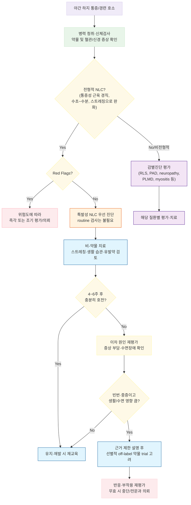

# 야간 하지 경련 Nocturnal Leg Cramp (NLC)

## <mark style="color:green;">일반 사항</mark>

* 취침 중 또는 안정 시 갑자기 발생하여 수 초\~수 분간 지속되는 다리 및/또는 발의 불수의적 근육 긴장 또는 경련
* 다른 이름 : nocturnal leg cramps(NLC), rest cramps, charley horse
* 정의 : 통증을 동반한 불수의적 근육 수축으로, 대개 비복근(gastrocnemius)이나 발의 소근육을 침범
* 유병률 : 성인의 약 50%가 경험하며, 50세 이상에서는 매달 최소 1회 이상 경험하는 경우가 흔함(Am Fam Physician 2012;86(4))
* 통증으로 잠에서 깨어나며, 빈번히 반복되는 경우 수면의 질 저하 및 만성 피로로 이어질 수 있음
* 임신부(특히 임신 후반기)에서도 흔히 발생

***

## <mark style="color:green;">원인 및 위험 인자</mark>

* 대부분 특발성(원인 불명)
* 전형적인 특발성 NLC는 단순한 탈수나 전해질 이상으로 설명되는 경우가 대부분은 아니며, 병력·진찰에서 단서가 있을 때 이차 원인을 평가

#### <mark style="color:$primary;">구조적·물리적 요인</mark>

* 연관성이 보고된 요인 : 근육 피로/과도한 운동, 평발, genu recurvatum, hypermobility syndrome 등
* 나쁜 자세, 장시간 앉아 있거나 단단한 바닥에서 장시간 서 있는 생활

#### <mark style="color:$primary;">전해질·대사 이상 및 전신 질환</mark>

* 전해질 이상(저칼슘혈증, 저마그네슘혈증 등), 신부전/혈액투석, 간경화 등은 임상적으로 의심될 때 감별
* 당뇨병, 갑상선기능저하증, 말초혈관질환, 중추/말초 신경질환 등과 동반될 수 있음
* 임신, 특히 임신 후반기에서 흔함
* 일반 성인과 달리 임신부 대상 개별 연구에서는 magnesium·calcium 등 경구 보충제가 낮은 확실성 수준에서 증상 완화 신호를 보인 바 있으나, Cochrane 종합 리뷰는 어떤 경구 보충제도 효과·안전성에 대한 근거가 명확하지 않다고 결론지음(Cochrane review); 확인된 결핍이 있으면 교정

#### <mark style="color:$primary;">약물 연관성</mark>

* 비교적 연관성이 보고된 약물 : IV iron sucrose, conjugated estrogen, raloxifene, naproxen, teriparatide
* 그 외 이뇨제, statin, 흡입 β2-agonist(LABA) 등도 보고되어 있으나 인과성은 상대적으로 불확실
* 새로운 약물 시작 또는 용량 변경 후 경련이 악화되었다면 약물 연관성을 검토하고, 가능하면 원인 약물의 중단·대체를 고려

***

## <mark style="color:green;">임상 양상</mark>

* 취침 중 또는 안정 시 갑자기 발생하는 하지(주로 비복근, 때로 발의 소근육)의 통증성 근육 긴장/경련
* 편측 또는 양측으로 발생할 수 있음
* 지속 시간 : 수 초\~수 분(드물게 10분 이상)
* 경련 소실 후에도 국소 압통이 수 시간\~하루 지속되기도 함
* 수동적 신전, 스트레칭 또는 마사지로 대개 완화됨
* 반복되는 경우 수면의 질 저하, 주간 피로로 이어질 수 있음

***

### <mark style="color:$danger;">🚩 Red Flags!</mark>

<mark style="color:$danger;">**즉각 조치 또는 의뢰**</mark>

* 급성 편측 하지 부종 ± 통증/압통/열감(특히 최근 수술·부동·장거리 이동, 암, 과거 VTE 등 위험인자) → 심부정맥혈전증(DVT) 감별
* 갑작스러운 심한 하지 통증 + 창백, 냉감, 맥박 감소/소실, 감각이상 또는 운동마비 → 급성 하지 허혈 의심
* 외상·압박 등 이후 예상보다 심한 통증, 수동적 신전 시 통증, 팽팽한 부종/구획, 진행하는 감각·운동 이상 → 구획증후군(compartment syndrome) 의심
* 심한 요통/양측 하지 증상 + 안장부 감각저하(saddle anesthesia), 배뇨·배변 장애 또는 급속 진행 근력저하 → cauda equina syndrome 감별
* 저칼슘혈증/저마그네슘혈증 등 의심 소견(Chvostek/Trousseau 징후 등 tetany) + 부정맥 또는 심전도 이상

<mark style="color:$warning;">**당일 또는 조기 의뢰**</mark>

* 새롭게 발생하거나 진행하는 객관적 근력저하 또는 뚜렷한 신경학적 결손 → 신경근병증, 척추관협착증, 말초신경병증 등 평가
* 보행 시 반복적으로 유발되고 휴식으로 호전되는 파행(claudication) → 말초동맥질환 평가
* 임신 중 심한 하지부종·두통·고혈압 등 동반 → 자간전증 등 산과적 질환 감별

<mark style="color:$info;">**외래 추적 / 추가 평가 계획**</mark> <mark style="color:$info;">- 즉각 위험 낮으나 호전 없으면 의뢰</mark>

* 하룻밤에 수회 반복되거나 수면을 현저히 방해하는 경우
* 전형적 NLC와 달리 통증이 지속적이거나 비정상적으로 심한 경우
* 신체 다른 부위의 반복적 경련이 동반되는 경우
* 안정된 만성 감각저하·저림 등 신경병증성 증상이 동반되는 경우
* 간경화, 말기신질환/혈액투석 환자에서 새롭게 발생하거나 현저히 악화된 경련 → volume status, 투석 관련 요인, 전해질 이상 및 기저질환 악화 여부 평가; 전신상태 불량 또는 중대한 전해질 이상이 의심되면 조기 평가
* 4\~6주간의 비-약물 치료에도 충분히 호전되지 않는 경우

***

## <mark style="color:green;">진단</mark>

* 병력 청취와 신체검사만으로 대개 진단 가능하며, 전형적인 특발성 NLC에서는 routine laboratory test가 필요하지 않음
* 발병 양상, 경련 부위·지속시간·빈도, 수면과의 관계, 실제 근육 경직 여부, 유발/완화 요인, 최근 약물 변경, 말초혈관·신경학적 증상을 확인
* 신체검사 : 하지 부종·피부/정맥 변화, 말초맥박, 감각, 근력, 심부건반사, 보행을 확인하고, 방사통·신경학적 이상이 있으면 요추 및 신경근 진찰을 추가
* 이차 원인이 의심되는 경우에만 해당 질환에 맞춰 전해질, 신기능, 갑상선기능, 혈당 등의 검사를 선택적으로 고려; CK는 근염·근육손상이 의심될 때 추가

### <mark style="color:orange;">감별 진단</mark>

* NLC는 통증을 동반한 급성·일시적 근육 수축/경직이라는 점에서 아래 질환들과 구분됨

<table><thead><tr><th width="150">질환</th><th width="260">NLC와의 차이점</th><th>핵심 감별 포인트</th></tr></thead><tbody><tr><td>하지불안증후군(RLS) (☞ <a href="036_-restless-legs-syndrome.md">하지불안증후군</a>)</td><td>안정 시 다리를 움직이고 싶은 불쾌한 충동감이 핵심이며 움직이면 호전; 실제 근육 경련은 없음</td><td>"움직이고 싶은 충동" 중심 vs NLC는 "통증을 동반한 근육 경직"</td></tr><tr><td>말초동맥질환/간헐성 파행</td><td>보행·운동 시 유발되고 휴식 시 수분 내 호전</td><td>운동 유발성, 말초맥박 저하, ABI 이상 가능</td></tr><tr><td>말초신경병증</td><td>화끈거림, 저림, 감각저하가 지속적이거나 야간에 악화; 실제 근육 수축은 없음</td><td>감각증상 중심, 신경학적 진찰 이상 가능</td></tr><tr><td>만성 정맥부전</td><td>다리의 무거움·부종·둔통이 장시간 서 있을 때 악화</td><td>부종, 피부 변화, 정맥류; 급성 근육 경직과 구별</td></tr><tr><td>근육통/근염(Myositis, myalgia)</td><td>급성 경련성 통증보다 지속적 통증·근력저하가 흔함; CK 상승 가능</td><td>통증의 지속성, 근력저하, 검사 소견</td></tr><tr><td>주기성 사지운동증(PLMD)</td><td>수면 중 반복적·상동적인 다리 움직임; 통증 없이 본인이 인지하지 못하는 경우가 많음</td><td>수면다원검사로 확인; 통증성 경련 여부로 감별</td></tr><tr><td>Hypnic myoclonus (입면기 근경련)</td><td>잠들 무렵 순간적인 전신 또는 사지의 튐; 통증이 일반적이지 않음</td><td>매우 짧은 지속시간, 통증성 지속 경직 없음</td></tr><tr><td>척추관협착증/신경근병증</td><td>보행·기립 또는 특정 자세에서 악화되는 통증·저림; 허리 굴곡으로 호전될 수 있음</td><td>자세 의존성, 방사통·감각저하·근력저하 동반 가능</td></tr></tbody></table>

***



<p align="center"><strong>야간 하지 경련의 평가 및 치료 알고리듬</strong></p>

<p align="center"><em><mark style="color:$info;">Ref. Allen RE, Kirby KA. Nocturnal Leg Cramps. Am Fam Physician. 2012;86(4):350-355; Kaufman N, et al. Am Fam Physician. 2023;108(6):619-620 반영 수정</mark></em></p>

***

## <mark style="background-color:$warning;">Management</mark>


**단계별 치료 전략 (Step-wise Approach)**

Red Flags가 없는 특발성 NLC는 비-약물 치료가 1차입니다. 전형적인 경우 routine 검사나 약물 처방이 필요하지 않으며, 스트레칭·생활 습관 교정과 유발 가능 약물 검토를 우선합니다. 4\~6주 후에도 빈번한 경련으로 수면이나 일상생활에 상당한 지장이 지속될 때에만, 이차 원인을 재평가한 뒤 제한된 근거를 설명하고 선별적으로 off-label 약물 trial을 고려합니다.


***

## <mark style="color:green;">비-약물 치료 및 예방</mark>

* 경련 발생 시 : 무릎을 펴고 발목을 발등굽힘(dorsiflexion)하여 침범 근육을 수동적으로 신전; 일어나 걷거나 가볍게 마사지
* 온찜질 또는 따뜻한 목욕은 근육 이완에 도움이 될 수 있으며, 일부 환자는 냉찜질에서 증상 완화를 느낌
* 탈수 위험이 있거나 수분 섭취가 부족한 경우에는 적절한 수분 섭취를 권고하되, 심부전·신부전 등 수분 제한이 필요한 환자는 개별 조정
* 과도한 운동·장시간의 같은 자세 등 개인별 유발 요인을 줄이고, 무리가 없는 수준의 규칙적 신체활동 유지
* 취침 전 calf + hamstring stretching : 근거 확실성은 낮으나 일부 RCT에서 경련 빈도·강도 감소가 보고되었고 위험이 낮아 우선 시도. 종아리는 무릎을 편 상태에서 발목을 발등굽힘(dorsiflexion)하여 비복근을 신전하고, 햄스트링(허벅지 뒤쪽)도 함께 규칙적으로 스트레칭
* 취침 전 수 분간 가벼운 고정식 자전거 운동 등을 시도할 수 있음
* Compression stockings(무릎 아래 압박스타킹) : 2026년 50\~85세 121명 대상 3군 RCT에서 4주간 관찰(run-in) 후 4주간 착용 시 placebo 대비 주당 경련 빈도가 유의하게 감소(보정 평균차 −1.43회/주; 95% CI −2.36\~−0.50; *P*=.001)하였고, 통증·야간 각성도 함께 감소함. 4명이 이상반응으로 착용을 중단했으나 serious adverse event는 없었음. 다만 말초동맥질환(의심 포함), 중증 말초신경병증, 심부전으로 인한 심한 하지부종, 활동성 하지 피부병변 등이 있는 환자는 해당 연구에서 제외되었으므로 적용 전 적합성을 평가; 단일 RCT로 routine 표준치료로 권고하기에는 추가 연구가 필요함(*Trials* 2026;27:216)

<figure><figcaption></figcaption></figure>

종아리 스트레칭\
Ref. Navigate Health [Cramps in the Leg](https://patient.info/bones-joints-muscles/cramps-in-the-leg)

***

## <mark style="color:green;">약물 치료</mark>

* 특발성 NLC에서 약물치료의 효과를 뒷받침하는 근거는 전반적으로 제한적이며, routine pharmacotherapy는 권장되지 않음
* 비-약물 치료 후에도 빈번하고 심한 경련으로 수면·삶의 질이 현저히 저하된 경우, 이차 원인과 유발 약물을 다시 확인한 뒤 환자와 근거의 한계를 공유하고 개별적으로 단기간 trial을 고려
* 효과가 불분명하거나 부작용이 발생하면 지속하지 않음

### <mark style="color:orange;">Mg 제제</mark>

* 특발성 NLC → routine 권장하지 않음 : 일반 인구 대상 단기간(<60일) magnesium supplementation의 유의한 효과는 확인되지 않음(Am Fam Physician 2023;108(6):619-620; Cochrane review). 60일 이상 투여에서 효과를 시사한 단일 RCT가 있으나 근거는 제한적이며, 특정 Mg 제형을 표준적으로 권고할 근거는 부족
* 2026년 발표된 3군 RCT(compression stockings vs magnesium vs placebo, 50\~85세 121명)에서도 magnesium은 placebo 대비 유의한 차이가 없어(보정 평균차 −0.20; 95% CI −1.49\~1.09; *Trials* 2026;27:216) 동일한 결론이 재확인됨
* 저마그네슘혈증 교정 목적 → 결핍이 확인되거나 강하게 의심되는 경우에는 원인 교정의 일부로 보충 가능
* 신기능 저하에서는 Mg 축적 위험이 있으므로 주의

### <mark style="color:orange;">Vit B 복합체</mark>

* 일부 소규모 RCT에서 효과 가능성이 보고되었으나 근거 수준은 낮아 routine 치료로 권고하기 어려움
* 비-약물 치료에 반응하지 않는 환자에서 근거의 한계를 설명한 뒤 제한적으로 trial을 고려할 수 있음
* 비타민 결핍 위험(영양불량, 과도한 음주, 위축성 위염, 위절제술 등)이 있으면 해당 결핍 여부를 별도로 평가

### <mark style="color:orange;">non-DHP CCB</mark>

* Diltiazem : 극소규모 이중맹검 crossover 연구(N=13, 2주)에서 경련 빈도 감소가 보고되었으나(경련 강도에는 효과 없음) 표본이 매우 작고 방법론적 세부사항이 부족하여, 근거가 매우 제한적인 off-label 선택지
* Verapamil : idiopathic NLC 발생을 감소시킨다는 근거가 확인되지 않아 routine 치료로 권고하기 어려움
* 빈번하고 심한 NLC가 비-약물 치료에 반응하지 않을 때, 2주간의 diltiazem trial 후 경련 빈도·강도로 재평가
* 저혈압, 서맥, 방실전도장애 및 병용 약물을 확인
* 예 : diltiazem 30 ㎎ 취침 전 <mark style="color:blue;">\[헤르벤]</mark>

### <mark style="color:orange;">Gabapentin</mark>

* **순수 특발성 NLC에는 사용하지 않음 — routine 2차 약물로 권고할 근거가 없음**
* 신경병증성 통증·신경근병증 등 gabapentin의 별도 적응증이 동반된 환자에서만 해당 질환 치료의 일부로 고려
* 고령자는 졸림·어지럼·낙상 위험을 고려해 저용량에서 시작하고, 신기능에 따라 용량 조절

### <mark style="color:orange;">근이완제</mark>

* carisoprodol, orphenadrine 등은 NLC 치료 근거가 제한적이며 진정·어지럼·인지저하·낙상 등의 위험 때문에 routine 사용을 권하지 않음
* 국내에서 자주 처방되는 eperisone(에페리손), afloqualone(아플로쿠알론), chlorzoxazone(클로르조사존) 등의 중추성 근이완제 역시 특발성 NLC에 대한 치료 근거는 미흡하므로 routine 처방을 지양
* 특히 고령자에서는 가급적 피하고, 불가피한 경우에도 최소 용량·단기간 사용

### <mark style="color:orange;">Quinine</mark>


**⚠️ Quinine, 야간 하지 경련에 사용하지 말 것 (FDA Boxed Warning)**\
Quinine은 경련 빈도를 감소시킬 수 있으나 혈소판감소증, HUS/TTP, 과민반응, QT 연장 및 심각한 부정맥 등 중대한 이상반응 때문에, 임신 여부와 관계없이 야간 하지 경련이라는 양성 질환의 치료·예방 목적으로는 사용하지 않는 것이 원칙입니다(FDA는 NLC 적응증에서 risk가 potential benefit을 능가한다고 명시). Tonic water 등 quinine 함유 음료도 과민반응을 일으킬 수 있어 치료 목적으로 권하지 않습니다.


### <mark style="color:orange;">기타</mark>

* botulinum toxin 국소 주사 등은 근거가 제한적이며, 매우 빈번하고 중증인 난치성 경련에서 전문과 평가 후 선별적으로 고려

***

## <mark style="color:green;">시술 및 기타 처치</mark>

* 약물·비-약물 치료에도 지속되는 중증 경련에서는 진단을 재평가하고, 필요 시 신경과·재활의학과 등 관련 진료과 의뢰
* botulinum toxin 국소 주사는 routine 치료가 아니며 전문과에서 선별적으로 고려

***

### <mark style="color:red;">질병코드</mark>

R25.2 경련 및 연축

***

## <mark style="color:purple;">처방례</mark>

> **처방례 1. 전형적 특발성 NLC — 기본 치료**
>
> ```
> 약물 처방 없음
> ```
>
> _✽경련 발생 시 수동적 신전, 취침 전 규칙적인 종아리 및 햄스트링 스트레칭, 유발 요인 및 최근 약물 변경 검토가 1차 치료입니다. 전형적인 NLC에서는 routine laboratory test나 routine magnesium 처방이 필요하지 않습니다._

> **처방례 2. 비-약물 치료에 반응하지 않는 중증·난치성 NLC — 예외적으로 고려하는 off-label trial**
>
> ```
> 헤르벤정 30 ㎎  1T  취침 전
> ```
>
> _✽Diltiazem의 효과 근거는 N=13의 극소규모 이중맹검 crossover 연구(2주)에 주로 기반하므로 매우 제한적입니다. 저혈압·서맥·방실전도장애 및 병용 약물을 확인하고, 2주간의 단기 trial 후 효과가 없으면 중단합니다._

> **처방례 3. 신경병증성 통증 또는 신경근병증이 동반된 경우**
>
> ```
> Gabapentin 100\~300 ㎎  1T  취침 전  (증상·신기능에 따라 개별 조절)
> ```
>
> _✽Gabapentin은 순수 특발성 NLC의 routine 2차 치료가 아니라, 신경병증성 통증 등 별도 적응증이 동반된 경우 해당 질환 치료의 일부로 사용합니다. 고령자는 졸림·어지럼·낙상 위험에 특히 주의합니다._

***

### <mark style="color:$success;">핵심 복약 지도</mark>

> **약물치료를 시작하는 경우**
>
> * 야간 하지 경련에 사용하는 대부분의 약물은 효과 근거가 제한적이므로, 정해진 기간 trial 후 경련 빈도·강도·수면 방해 정도를 재평가합니다.
> * 효과가 뚜렷하지 않으면 약을 계속 복용하기보다 중단하고 진단 및 유발 요인을 다시 평가합니다.

> **마그네슘**
>
> * 특발성 NLC에서 routine 복용의 효과는 확실하지 않으며, 특히 단기간 사용은 유의한 이득이 확인되지 않았습니다.
> * 신장기능이 저하된 환자는 마그네슘 축적 위험이 있으므로 임의 복용을 피하고 의료진과 상의합니다.

> **Diltiazem**
>
> * 어지럼, 저혈압, 서맥 등이 나타날 수 있으므로 복용 후 증상을 관찰합니다.
> * 심장 전도장애가 있거나 다른 심박수 저하 약물을 복용 중인 경우 처방 전 확인이 필요합니다.

> **Quinine**
>
> * 야간 하지 경련 치료 목적으로 사용하지 않습니다. Tonic water 등 quinine 함유 음료도 치료 목적으로 권하지 않습니다.

> **언제 다시 병원을 방문해야 하나요?**
>
> * 4\~6주간의 비-약물 치료에도 경련 빈도·강도가 호전되지 않는 경우
> * 새롭게 다리에 힘이 빠지거나 감각이 둔해지는 경우
> * 한쪽 다리가 갑자기 붓고 통증·열감이 동반되는 경우 — **즉시 평가**
> * 다리가 갑자기 매우 아프고 창백하거나 차가워지는 경우 — **즉시 평가**
> * 새로운 약물 복용 시작 또는 용량 변경 후 경련이 심해진 경우

***

### <mark style="color:blue;">환자 안내서</mark>


**야간 하지 경련, 대부분 걱정할 필요 없는 흔한 증상입니다**

밤에 자다가 갑자기 종아리나 발이 뻣뻣해지면서 심한 통증이 생기는 것을 야간 하지 경련이라고 합니다. 대부분 특별한 원인 없이 발생하며, 반복되면 잠을 깨우고 다음 날 피로를 유발할 수 있습니다.


#### <mark style="color:$primary;">왜 다리에 쥐가 나나요?</mark>

* 정확한 원인은 대부분 알 수 없습니다. 근육 피로, 오래 같은 자세로 있는 생활, 일부 약물 등이 관련될 수 있습니다.
* 탈수나 전해질 이상이 원인인 경우도 있지만, 모든 야간 하지 경련이 수분 부족이나 마그네슘 부족 때문인 것은 아닙니다.
* 임신 중이거나 나이가 많을수록 더 자주 발생할 수 있습니다.

#### <mark style="color:$primary;">경련이 났을 때는 어떻게 하나요?</mark>

* **무릎을 펴고 발끝을 몸 쪽으로 천천히 당겨 종아리 근육을 늘리십시오.**
* **일어나서 걷거나 경련 부위를 가볍게 마사지하십시오.**
* **따뜻한 수건이나 온찜질로 근육을 이완시키면 도움이 될 수 있습니다.**

#### <mark style="color:$primary;">일상생활에서 어떻게 예방하나요?</mark>

* **자기 전 종아리 및 허벅지 뒤쪽(햄스트링) 스트레칭을 규칙적으로 시행하십시오.**
* 탈수가 의심되거나 평소 수분 섭취가 적다면 적절한 수분을 섭취하십시오. 다만 심장·신장 질환으로 수분 제한이 있는 경우 담당의와 상의하십시오.
* 과도한 운동이나 오랜 시간 같은 자세로 있는 것이 경련을 유발한다면 이를 줄이십시오.
* 최근 새로 시작했거나 용량을 변경한 약이 있다면 의료진에게 알리십시오.

#### <mark style="color:$primary;">약은 꼭 먹어야 하나요?</mark>

* 대부분은 약보다 스트레칭과 생활 습관 조절이 먼저입니다.
* **마그네슘은 특발성 야간 하지 경련에서 효과가 확실하지 않아 모든 환자에게 routinely 권하지 않습니다.** 결핍이 확인되거나 의심되는 경우에는 별도로 보충할 수 있습니다.
* 반복적인 경련으로 수면이 심하게 방해되고 비-약물 치료로도 호전되지 않을 때에는 의료진이 제한적인 근거를 설명한 뒤 약물 치료를 선별적으로 고려할 수 있습니다.
* **퀴닌(quinine) 성분은 심각한 혈액 이상과 부정맥 등의 위험 때문에 야간 하지 경련 치료 목적으로 사용하지 않습니다.**

#### <mark style="color:$primary;">이럴 때는 즉시 병원을 방문하세요</mark>

* 한쪽 다리가 갑자기 붓고 아프거나 열감이 생길 때
* 다리가 갑자기 매우 아프면서 창백하거나 차가워질 때
* 다리에 힘이 빠지거나 감각이 급격히 둔해질 때
* 심한 허리 통증과 함께 회음부 감각이 둔해지거나 소변·대변 조절에 문제가 생길 때
