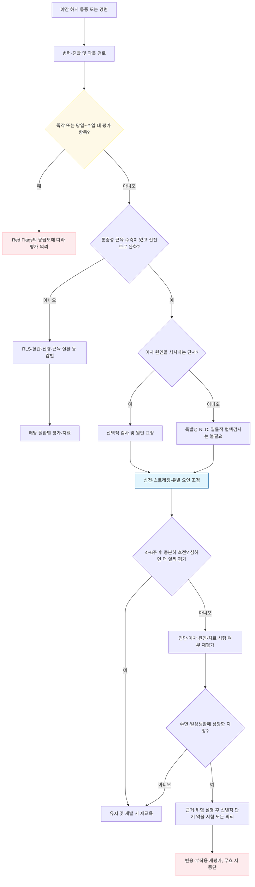
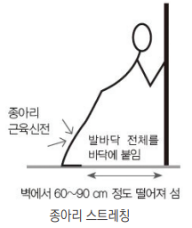

# 야간 하지 경련 Nocturnal Leg Cramps (NLC)

## <mark style="color:green;">일반 사항</mark>

* 취침 중 또는 안정 시 갑자기 발생하여 수 초\~수 분간 지속되는 다리 및/또는 발의 불수의적 근육 긴장 또는 경련
* 다른 이름 : sleep-related leg cramps, rest cramps, charley horse
* 정의 : 통증을 동반한 불수의적 근육 수축으로, 대개 비복근(gastrocnemius)이나 발의 소근육을 침범하며 때로 허벅지에서도 발생
* 이 챕터는 야간 하지 통증 중 통증성 근육 경련을 다룸; 실제 근육 수축 없이 지속되는 통증은 혈관·신경·근골격 질환 등 다른 원인을 평가
* 유병률 : 성인의 약 50~60%가 일생 중 경험하며, 나이가 들수록 흔해짐; 조사 기간·증상 정의에 따라 유병률이 달라짐
* 통증으로 잠에서 깨어나며, 빈번히 반복되는 경우 수면의 질 저하 및 만성 피로로 이어질 수 있음
* 임신부(특히 임신 후반기)에서도 흔히 발생

***

## <mark style="color:green;">원인 및 위험 인자</mark>

* 대부분 특발성(원인 불명)
* 전형적인 특발성 NLC는 단순한 탈수나 전해질 이상으로 설명되는 경우가 대부분은 아니며, 병력·진찰에서 단서가 있을 때 이차 원인을 평가

#### <mark style="color:$primary;">구조적·물리적 요인</mark>

* 연관성이 보고된 요인 : 근육 피로/과도한 운동, 평발, genu recurvatum, hypermobility syndrome 등
* 장시간 같은 자세로 앉아 있거나 서 있는 생활 등은 개인별 유발 단서로 확인하되, 확립된 원인으로 단정하지 않음

#### <mark style="color:$primary;">전해질·대사 이상 및 전신 질환</mark>

* 전해질 이상(저칼슘혈증, 저마그네슘혈증 등), 신부전/혈액투석, 간경화 등은 임상적으로 의심될 때 감별
* 당뇨병, 갑상선기능저하증, 말초혈관질환, 중추/말초 신경질환 등과 동반될 수 있음
* 임신, 특히 임신 후반기에서 흔함
* 일반 성인과 달리 임신부 대상 개별 연구에서는 magnesium·calcium 등 경구 보충제가 낮은 확실성 수준에서 증상 완화 신호를 보인 바 있으나, Cochrane 종합 리뷰는 어떤 경구 보충제도 효과·안전성에 대한 근거가 명확하지 않다고 결론지음(Cochrane review); 확인된 결핍이 있으면 교정

#### <mark style="color:$primary;">약물 연관성</mark>

* 임상시험의 이상반응 보고 등에서 연관성이 보고된 약물 : IV iron sucrose, conjugated estrogen, raloxifene, naproxen, teriparatide; 보고만으로 인과관계가 확립되는 것은 아님
* 이뇨제, statin, 흡입 β2-agonist(LABA)도 검토; 처방자료 관찰연구에서는 특히 LABA, 칼륨보존 이뇨제 및 thiazide 유사 이뇨제 시작 후 경련 치료 처방의 증가가 보고됨. Statin 관련 근육통·근육손상은 전형적 NLC와 구분
* 새로운 약물 시작 또는 용량 변경 후 경련이 악화되었다면 약물 연관성을 검토하고, 치료 필요성을 고려하여 처방의와 감량·중단·대체를 검토; 환자가 임의로 중단하지 않도록 안내

***

## <mark style="color:green;">임상 양상</mark>

* 취침 중 또는 안정 시 갑자기 발생하는 하지(주로 비복근, 때로 발의 소근육)의 통증성 근육 긴장/경련
* 편측 또는 양측으로 발생할 수 있음
* 지속 시간 : 수 초\~수 분(드물게 10분 이상)
* 경련 소실 후에도 국소 압통이 수 시간\~하루 지속되기도 함
* 경련 시 침범 근육이 단단하게 수축하여 만져지는 경우가 흔하며, 해당 근육을 늘리면 대개 완화됨
* 반복되는 경우 수면의 질 저하, 주간 피로로 이어질 수 있음

***

### <mark style="color:$danger;">🚩 Red Flags!</mark>

<mark style="color:$danger;">**즉각 조치 또는 의뢰**</mark>

* 갑작스러운 심한 하지 통증과 창백·냉감·맥박 감소/소실, 감각이상 또는 운동마비 → 급성 하지 허혈 의심; 전형적인 모든 징후가 갖춰질 때까지 기다리지 않음
* 외상·압박 또는 격한 운동 이후 예상보다 심한 통증, 수동적 신전 시 통증, 팽팽한 구획/부종, 진행하는 감각·운동 이상 → 급성 구획증후군 의심; 말초맥박이 유지되어도 배제할 수 없음
* 새로운 요폐·배뇨감각 변화, 안장부 감각저하, 배변 조절 장애 또는 급속 진행 근력저하 → 말총증후군(cauda equina syndrome) 등 감별; 심한 요통이나 양측 하지 증상이 반드시 동반되는 것은 아님
* DVT 의심 소견과 함께 호흡곤란·흉통·실신·저산소증이 있거나, 한쪽 다리 전체의 심한 부종·청색증이 발생 → 폐색전증 또는 중증 정맥폐쇄 의심
* 전신성 강직/테타니와 부정맥·심전도 이상, 후두경련 또는 의식 변화 → 중대한 전해질 이상 등 평가
* 임신·산후에 심한 두통, 시각 증상, 명치/우상복부 통증, 호흡곤란 또는 중증 고혈압(수축기 ≥160 또는 이완기 ≥110 mmHg) → 자간전증 등 즉시 산과 평가
* 심한 근육통·근력저하와 짙은 소변 또는 소변량 감소 → 횡문근융해증 의심

<mark style="color:$warning;">**당일~수일 내 평가**</mark>

* 급성 편측 하지 부종 ± 통증/압통/열감(특히 최근 수술·부동, 암, 과거 VTE 등) → DVT 감별 **(당일)**; 응급 소견은 위 항목에 따라 즉각 조치
* 새로 발생하거나 진행하는 객관적 근력저하 또는 뚜렷한 신경학적 결손 → **당일 평가**; 급속 진행은 즉각 조치
* 발/발가락의 지속적 안정 시 통증, 다리를 올리면 악화되고 아래로 내리면 완화되는 야간 통증, 치유되지 않는 궤양 → 중증 하지 허혈 평가 **(당일)**
* 보행 시 반복적으로 유발되고 휴식으로 호전되는 안정된 파행 → 말초동맥질환 평가 계획; 급성 악화·안정 시 통증은 위 기준 적용
* 임신 중 새 고혈압(≥140/90 mmHg) 또는 갑작스러운 부종과 함께 산과적 이상 소견 → **당일 산과 평가**; 하지부종만으로 자간전증을 진단하지 않음

<mark style="color:$info;">**외래 추적 / 추가 평가 계획**</mark>

* 하룻밤에 수회 반복되거나 수면을 현저히 방해하는 경우
* 경련 사이에도 통증이 지속되는 경우 → NLC만으로 설명하지 않고 재평가; 매우 심한 지속 통증은 즉시 위험도 평가
* 신체 다른 부위의 반복적 경련 또는 안정된 만성 감각저하·저림이 동반되는 경우
* 간경화, 말기신질환/혈액투석 환자에서 새롭게 발생하거나 현저히 악화된 경련 → 체액 상태, 투석 관련 요인, 전해질 이상 및 기저질환 악화 여부 평가; 전신상태 불량이나 중대한 전해질 이상이 의심되면 당일 또는 즉각 평가
* 4~6주간의 비약물 치료에도 충분히 호전되지 않는 경우; 증상이 심하면 이 기간을 기다리지 않고 재평가

***

## <mark style="color:green;">진단</mark>

* 병력 청취와 신체검사만으로 대개 진단 가능하며, 전형적인 특발성 NLC에서는 일률적 혈액검사가 필요하지 않음
* 발병 양상, 경련 부위·지속시간·빈도, 수면과의 관계, 실제 근육 수축/경직 여부, 유발/완화 요인, 최근 약물 변경, 말초혈관·신경학적 증상을 확인
* 반복되는 경우 경련 일지에 주당 횟수, 통증 강도, 야간 각성 및 치료 반응을 기록하여 재평가에 활용
* 신체검사 : 하지 부종·피부/정맥 변화, 말초맥박, 감각, 근력, 심부건반사, 보행을 확인하고, 방사통·신경학적 이상이 있으면 요추 및 신경근 진찰을 추가
* 이차 원인이 의심되는 경우에만 해당 질환에 맞춰 전해질(Na·K·Ca·Mg), 신기능, TSH, 혈당 등의 검사를 선택적으로 고려; CK는 지속적 근육통·근력저하·짙은 소변 등 근육손상 단서가 있을 때 추가. 신경병증이 의심되면 상황에 따라 vitamin B12 등 검사; 혈관 소견이 있으면 ABI 또는 혈관초음파, 신경학적 이상이 있으면 신경전도/근전도·영상검사를 선택

### <mark style="color:orange;">감별 진단</mark>

* NLC는 통증을 동반한 급성·일시적 근육 수축/경직이라는 점에서 아래 질환들과 구분됨

<table><thead><tr><th width="150">질환</th><th width="260">NLC와의 차이점</th><th>핵심 감별 포인트</th></tr></thead><tbody><tr><td>하지불안증후군(RLS) (☞ <a href="036_-restless-legs-syndrome.md">하지불안증후군</a>)</td><td>안정 시 다리를 움직이고 싶은 충동이 핵심이며 움직이는 동안 호전되고 저녁/밤에 악화; 통증성 근육 수축은 진단 특징이 아님</td><td>"움직이고 싶은 충동" 중심 vs NLC는 "통증성 근육 경직"; 두 질환은 동반 가능</td></tr><tr><td>말초동맥질환/간헐성 파행</td><td>간헐성 파행은 보행·운동 시 유발되고 휴식 시 수분 내 호전; 중증 허혈은 안정 시/야간에도 통증 가능</td><td>운동 유발성, 말초맥박 저하, ABI 이상 가능</td></tr><tr><td>말초신경병증</td><td>화끈거림, 저림, 감각저하가 지속적이거나 야간에 악화; 별도의 근육 경련이 동반될 수도 있음</td><td>감각증상 중심, 신경학적 진찰 이상 가능</td></tr><tr><td>만성 정맥부전</td><td>다리의 무거움·부종·둔통이 장시간 서 있을 때 악화</td><td>부종, 피부 변화, 정맥류; 급성 근육 경직과 구별</td></tr><tr><td>근육통/근염(Myositis, myalgia)</td><td>급성 경련성 통증보다 지속적 통증·근력저하가 흔함; CK 상승 가능</td><td>통증의 지속성, 근력저하, 검사 소견</td></tr><tr><td>주기성 사지운동증(PLMD)</td><td>수면 중 반복적·상동적인 다리 움직임; 통증 없이 본인이 인지하지 못하는 경우가 많음</td><td>사지운동 자체(PLMS)와 PLMD를 구분; PLMD는 수면다원검사 소견과 임상적 수면/주간 기능장애를 확인하고 다른 원인을 배제</td></tr><tr><td>Hypnic myoclonus (입면기 근경련)</td><td>잠들 무렵 순간적인 전신 또는 사지의 튐; 통증이 일반적이지 않음</td><td>매우 짧은 지속시간, 통증성 지속 경직 없음</td></tr><tr><td>척추관협착증/신경근병증</td><td>보행·기립 또는 특정 자세에서 악화되는 통증·저림; 허리 굴곡으로 호전될 수 있음</td><td>자세 의존성, 방사통·감각저하·근력저하 동반 가능</td></tr></tbody></table>

***


```mermaid
graph TD
    A["야간 하지 통증 또는 경련"] ---> B["병력·진찰 및 약물 검토"]
    B ---> D{"즉각 또는 당일~수일 내 평가 항목?"}
    D --->|예| F["Red Flags의 응급도에 따라 평가·의뢰"]
    D --->|아니오| C{"통증성 근육 수축이 있고 신전으로 완화?"}
    C --->|아니오| E["RLS·혈관·신경·근육 질환 등 감별"]
    E ---> O["해당 질환별 평가·치료"]
    C --->|예| G{"이차 원인을 시사하는 단서?"}
    G --->|예| P["선택적 검사 및 원인 교정"]
    G --->|아니오| H["특발성 NLC: 일률적 혈액검사는 불필요"]
    P ---> Q["신전·스트레칭·유발 요인 조정"]
    H ---> Q
    Q ---> I{"4~6주 후 충분히 호전? 심하면 더 일찍 평가"}
    I --->|예| J["유지 및 재발 시 재교육"]
    I --->|아니오| K["진단·이차 원인·치료 시행 여부 재평가"]
    K ---> L{"수면·일상생활에 상당한 지장?"}
    L --->|아니오| J
    L --->|예| M["근거·위험 설명 후 선별적 단기 약물 시험 또는 의뢰"]
    M ---> N["반응·부작용 재평가; 무효 시 중단"]

    style D fill:#fef9e7,stroke:#fff59d
    style F fill:#fdebed,stroke:#ffcdd2,stroke-width:2px
    style Q fill:#e1f5fe,stroke:#01579b
    style N fill:#fdebed,stroke:#ffcdd2
```

<p align="center"><strong>야간 하지 경련의 평가 및 치료 알고리듬</strong></p>

<p align="center"><em><mark style="color:$info;">병력·진찰 기반 평가와 치료 근거를 반영하여 작성한 진료 알고리듬; 원문 지침의 검증된 의사결정 도구는 아님</mark></em></p>

***

## <mark style="background-color:$warning;">Management</mark>


**단계별 치료 전략 (Step-wise Approach)**

Red Flags가 없는 특발성 NLC는 비약물 치료가 1차입니다. 전형적인 경우 일률적 혈액검사나 약물 처방이 필요하지 않으며, 스트레칭·생활 습관 교정과 유발 가능 약물 검토를 우선합니다. 4\~6주 후에도 빈번한 경련으로 수면이나 일상생활에 상당한 지장이 지속될 때에만, 이차 원인을 재평가한 뒤 제한된 근거를 설명하고 선별적으로 off-label 약물 trial을 고려합니다.


***

## <mark style="color:green;">비약물 치료 및 예방</mark>

* 경련 발생 시 : 침범 근육을 천천히 늘림. 종아리 경련은 무릎을 펴고 발목을 발등굽힘(dorsiflexion)하여 신전; 안전하게 설 수 있으면 가볍게 걷거나 마사지. 급성 혈관질환·구획증후군이 의심되면 마사지보다 평가를 우선
* 온찜질 또는 따뜻한 목욕은 근육 이완에 도움이 될 수 있으며, 일부 환자는 냉찜질에서 증상 완화를 느낌
* 탈수 위험이 있거나 수분 섭취가 부족한 경우에는 적절한 수분 섭취를 권고하되, 심부전·신부전 등 수분 제한이 필요한 환자는 개별 조정
* 과도한 운동·장시간의 같은 자세 등 개인별 유발 요인을 줄이고, 무리가 없는 수준의 규칙적 신체활동 유지
* 취침 전 calf + hamstring stretching : Cochrane 2021에서는 강도 감소의 근거 확실성은 낮고, 빈도 감소의 근거 확실성은 매우 낮음; 위험이 낮아 우선 시도하되 효과를 보장하지 않음. 종아리는 무릎을 편 상태에서 발목을 발등굽힘(dorsiflexion)하여 비복근을 신전하고, 햄스트링(허벅지 뒤쪽)도 함께 규칙적으로 스트레칭
* 취침 전 수 분간 가벼운 고정식 자전거 운동 등을 시도할 수 있음
* Compression stockings(무릎 아래 의료용 압박스타킹) : 2026년 50~85세 121명 대상 3군 RCT에서 4주 관찰 후 4주간 **기상 직후부터 취침 전까지 주간 착용** 시 placebo 대비 경련 빈도 감소(보정 평균차 −1.43회/주; 95% CI −2.36~−0.50); 통증·경련 관련 야간 각성도 감소. 취침 중 착용 요법을 평가한 연구가 아님. 4명이 이상반응으로 중단하였으며 중대한 이상반응은 없었음
* 압박스타킹의 적용 제한 : 말초동맥질환(의심 포함), 중증 신경병증/감각장애, eGFR <30 mL/min, 폐부종·심부전에 의한 심한 하지부종, 활동성 피부병변 등은 연구에서 제외됨. 적합성·규격·압박 강도를 개별 평가; 연구 제외가 곧 모든 상황에서 절대금기를 뜻하지는 않음. 착용군 눈가림이 불가능한 단일 단기 연구이므로 일률적 표준치료로 권고하기에는 근거가 부족함([Trials 2026;27:216](https://doi.org/10.1186/s13063-025-09370-z))

<figure><figcaption></figcaption></figure>

종아리 스트레칭\
Ref. Patient.info [Cramps in the Leg](https://patient.info/bones-joints-muscles/cramps-in-the-leg)

***

## <mark style="color:green;">약물 치료</mark>

* 특발성 NLC에서 약물치료의 효과를 뒷받침하는 근거는 전반적으로 제한적이며, 일률적 약물치료는 권장되지 않음
* 비약물 치료 후에도 빈번하고 심한 경련으로 수면·삶의 질이 현저히 저하된 경우, 이차 원인과 유발 약물을 다시 확인한 뒤 환자와 근거의 한계를 공유하고 개별적으로 단기간 trial을 고려
* 효과가 불분명하거나 부작용이 발생하면 지속하지 않음

### <mark style="color:orange;">Mg 제제</mark>

* 특발성 NLC → 일률적 투여를 권장하지 않음 : 비임신 성인, 주로 고령자 대상 연구에서 일관된 유의한 예방 효과는 확인되지 않음(Cochrane 2020). Magnesium oxide monohydrate를 **60일** 투여한 단일 RCT에서는 빈도 감소가 보고되었으나 30일에는 유의한 차이가 없었으며, 이를 60일 이상 장기투여의 효과가 확립된 것으로 해석하지 않음; 특정 Mg 제형을 표준적으로 권고할 근거는 부족([Nutr J 2021;20:90](https://doi.org/10.1186/s12937-021-00747-9))
* 2026년 발표된 3군 RCT(compression stockings vs magnesium vs placebo, 50\~85세 121명)에서도 magnesium은 placebo 대비 유의한 차이가 없어(보정 평균차 −0.20; 95% CI −1.49\~1.09; *Trials* 2026;27:216) 해당 연구에서도 예방 효과를 입증하지 못함
* 저마그네슘혈증 교정 목적 → 결핍이 확인되거나 강하게 의심되는 경우에는 원인 교정의 일부로 보충 가능
* 신기능 저하에서는 Mg 축적 위험이 있으므로 주의

### <mark style="color:orange;">Vit B 복합체</mark>

* 일부 소규모 RCT에서 효과 가능성이 보고되었으나 근거 수준은 낮아 일률적 치료로 권고하기 어려움
* 비약물 치료에 반응하지 않는 환자에서 근거의 한계를 설명한 뒤 제한적으로 trial을 고려할 수 있음
* 비타민 결핍 위험(영양불량, 과도한 음주, 위축성 위염, 위절제술 등)이 있으면 해당 결핍 여부를 별도로 평가
* B6(pyridoxine) 함유 제품은 여러 보충제의 중복 복용과 장기 고용량 사용에 따른 말초신경병증 위험을 확인; NLC 치료 목적으로 고용량을 장기간 투여하지 않음

### <mark style="color:orange;">non-DHP CCB</mark>

* Diltiazem : 극소규모 이중맹검 crossover 연구(N=13, 2주)에서 경련 빈도 감소가 보고되었으나(경련 강도에는 효과 없음) 표본이 매우 작고 방법론적 세부사항이 부족하여, 근거가 매우 제한적인 허가 외 선택지([Age Ageing 2001;30:91-92](https://doi.org/10.1093/ageing/30.1.91))
* Verapamil : 신뢰할 만한 무작위 대조 근거가 부족하여 일률적 치료로 권고하지 않음
* 빈번하고 심한 NLC가 비약물 치료에 반응하지 않을 때, 2주간의 diltiazem trial 후 경련 빈도·강도로 재평가
* 저혈압, 서맥, 동기능부전/방실전도장애 및 심부전을 확인. 중증 울혈성 심부전, 수축기혈압 <90 mmHg, 박동기 없는 동기능부전·2/3도 방실차단, 임신·임신 가능성 및 ivabradine 병용은 국내 허가상 금기; 수유 중에는 투여를 피함
* β차단제·digoxin 등 심박수 저하 약물과 CYP3A4 관련 상호작용을 확인하고, 투여 전·중 혈압과 맥박을 평가; 전도장애 단서가 있으면 심전도 확인
* 연구 용량의 예 : diltiazem 30 ㎎ 취침 전 <mark style="color:blue;">[헤르벤정]</mark>; 국내 허가 효능은 협심증·본태성고혈압이며, **NLC 치료와 이 용법은 허가 외 사용**. 헤르벤서방정 90 ㎎·서방캡슐 180 ㎎으로 대체하여 동일한 시험 용법으로 간주하지 않음

### <mark style="color:orange;">Gabapentin</mark>

* **순수 특발성 NLC에는 사용하지 않음 - 일률적 2차 약물로 권고할 근거가 없음**
* 당뇨병성 신경병증성 통증·대상포진 후 신경통 등 gabapentin 치료가 적절한 별도 신경병증성 통증이 동반된 경우에만 해당 질환 치료로 고려
* 단순히 신경근병증/좌골신경통이 있다는 이유만으로 사용하지 않음; NICE NG59는 좌골신경통에 gabapentinoid를 권고하지 않음
* 고령자는 졸림·어지럼·낙상 위험과 신기능을 고려하여 용량·증량 속도 조절; opioid 등 중추신경 억제제 병용 또는 호흡기질환에서는 호흡억제 위험에 주의
* 지속 복용 후 감량·중단은 적어도 1주 이상에 걸쳐 점진적으로 시행

### <mark style="color:orange;">근이완제</mark>

* carisoprodol, orphenadrine 등은 NLC 치료 근거가 제한적이며 진정·어지럼·인지저하·낙상 등의 위험 때문에 일률적 사용을 권하지 않음
* 국내에서 자주 처방되는 eperisone(에페리손), afloqualone(아플로쿠알론), chlorzoxazone(클로르조사존) 등의 중추성 근이완제 역시 특발성 NLC에 대한 치료 근거는 미흡하므로 일률적 처방을 지양
* 특히 고령자에서는 가급적 피하고, 불가피한 경우에도 최소 용량·단기간 사용

### <mark style="color:orange;">Quinine</mark>


**⚠️ Quinine, 야간 하지 경련에 사용하지 말 것 (FDA Boxed Warning)**\
Quinine은 경련 빈도를 감소시킬 수 있으나 혈소판감소증, HUS/TTP, 과민반응, QT 연장 및 심각한 부정맥 등 중대한 이상반응 때문에, 임신 여부와 관계없이 야간 하지 경련이라는 양성 질환의 치료·예방 목적으로는 사용하지 않는 것이 원칙입니다(FDA는 NLC 적응증에서 risk가 potential benefit을 능가한다고 명시). Tonic water 등 quinine 함유 음료도 과민반응을 일으킬 수 있어 치료 목적으로 권하지 않습니다.


### <mark style="color:orange;">기타</mark>

* Vitamin K₂(MK-7) : 65세 이상 대상 8주 RCT에서 180 ㎍/일 투여로 경련 빈도·강도·지속시간 감소가 보고됨. **210명이 무작위 배정되고 주 분석에는 199명이 포함**되었으며, 무작위 배정 후 탈락자 처리·분석 설명 등의 문제로 2025년 5월 철회 후 수정 재출판됨. 단일 단기 연구로 표준치료로 권고하지 않으며, 젊은 성인·임신부·중증 난치성 NLC에 일반화하지 않음. Warfarin 등 vitamin K 길항제의 항응고 효과를 저해할 수 있어 해당 환자에게 NLC 목적으로 사용하지 않음([JAMA Intern Med 2024, 수정본](https://doi.org/10.1001/jamainternmed.2024.5726); [2025 철회·대체 공지](https://doi.org/10.1001/jamainternmed.2025.2160))

***

## <mark style="color:green;">시술 및 기타 처치</mark>

* 약물·비약물 치료에도 지속되는 중증 경련에서는 진단을 재평가하고, 필요 시 신경과·재활의학과 등 관련 진료과 의뢰
* Botulinum toxin 국소 주사 : 국내 요추관협착증 동반 야간 종아리 경련 환자 50명 대상 연구에서 효과가 보고되었으나, 특발성 NLC 전체에 일반화하지 않음. NLC 목적은 허가 외 사용이며 일률적 치료가 아님; 해당 기저질환 평가 후 전문과에서 제한적으로 검토([Arch Phys Med Rehabil 2017;98:957-963](https://doi.org/10.1016/j.apmr.2017.01.017))

***

### <mark style="color:red;">질병코드</mark>

* R25.2 경련 및 연축 Cramp and spasm

***

## <mark style="color:purple;">처방례</mark>

> **처방례 1. 전형적 특발성 NLC - 기본 치료**
>
> ```
> 약물 처방 없음
> ```
>
> _✽경련 발생 시 수동적 신전, 취침 전 규칙적인 종아리 및 햄스트링 스트레칭, 유발 요인 및 최근 약물 변경 검토가 1차 치료입니다. 전형적인 NLC에서는 일률적 혈액검사나 마그네슘 처방이 필요하지 않습니다._

> **처방례 2. 비약물 치료에 반응하지 않는 중증·난치성 NLC - 예외적으로 고려하는 off-label trial**
>
> ```
> 헤르벤정 30 ㎎  1T  취침 전  14일 시험 후 재평가 (허가 외 사용)
> ```
>
> _✽Diltiazem의 효과 근거는 N=13의 극소규모 이중맹검 crossover 연구(2주)에 주로 기반하므로 매우 제한적입니다. 본문의 국내 금기·심부전·병용 약물을 확인하고, 혈압·맥박 및 경련 일지로 2주 후 재평가하여 효과가 없으면 중단합니다. 2주는 연구 기간에 따른 평가 시점이며 표준치료 기간이 확립된 것은 아닙니다._

> **처방례 3. 별도의 신경병증성 통증이 동반된 경우 — NLC 처방이 아님**
>
> ```
> 뉴론틴캡슐 300 ㎎  1C  취침 전 (신경병증성 통증 치료 시작 첫날의 예)
> ```
>
> _✽국내 허가상 신경병증성 통증의 적정 예는 첫날 300 ㎎ 1회, 둘째 날 300 ㎎ 2회, 셋째 날부터 300 ㎎ 3회입니다. 이는 NLC 예방 용법이 아니며, 고령·허약·신기능 저하에서는 용량과 증량 간격을 개별 조절합니다. 단순 좌골신경통에 일률적으로 사용하지 않습니다. 졸림·어지럼·낙상 및 중추신경 억제제 병용 시 호흡억제에 주의하고, 지속 복용 후 중단 시 적어도 1주 이상 점진적으로 감량합니다._

***

### <mark style="color:$success;">핵심 복약 지도</mark>

> **약물치료를 시작하는 경우**
>
> * 야간 하지 경련에 사용하는 대부분의 약물은 효과 근거가 제한적이므로, 정해진 기간 trial 후 경련 빈도·강도·수면 방해 정도를 재평가합니다.
> * 효과가 뚜렷하지 않으면 약을 계속 복용하기보다 중단하고 진단 및 유발 요인을 다시 평가합니다.

> **마그네슘**
>
> * 특발성 NLC에서 routine 복용의 효과는 확실하지 않으며, 특히 단기간 사용은 유의한 이득이 확인되지 않았습니다.
> * 신장기능이 저하된 환자는 마그네슘 축적 위험이 있으므로 임의 복용을 피하고 의료진과 상의합니다.

> **Diltiazem**
>
> * 어지럼, 저혈압, 서맥 등이 나타날 수 있으므로 복용 후 증상을 관찰합니다.
> * 심장 전도장애·심부전, 임신 가능성·수유 여부와 다른 심박수 저하 약물 복용을 처방 전에 알립니다.
> * 일반적인 경련 치료제가 아니며, 효과가 확인되지 않으면 정해진 평가 시점에 중단합니다.

> **Quinine**
>
> * 야간 하지 경련 치료 목적으로 사용하지 않습니다. Tonic water 등 quinine 함유 음료도 치료 목적으로 권하지 않습니다.

> **언제 다시 병원을 방문해야 하나요?**
>
> * 4\~6주간의 비약물 치료에도 경련 빈도·강도가 호전되지 않는 경우
> * 새롭게 다리에 힘이 빠지거나 감각이 둔해지는 경우
> * 한쪽 다리가 갑자기 붓고 통증·열감이 동반되는 경우 - **당일 평가**; 호흡곤란·흉통·실신 또는 다리의 심한 청색증이 있으면 **즉시 응급 평가**
> * 다리가 갑자기 매우 아프고 창백하거나 차가워지는 경우 - **즉시 평가**
> * 새로운 약물 복용 시작 또는 용량 변경 후 경련이 심해진 경우

***

## <mark style="color:blue;">환자 안내서</mark>


**야간 하지 경련, 대부분 걱정할 필요 없는 흔한 증상입니다**

밤에 자다가 갑자기 종아리나 발이 뻣뻣해지면서 심한 통증이 생기는 것을 야간 하지 경련이라고 합니다. 대부분 특별한 원인 없이 발생하며, 반복되면 잠을 깨우고 다음 날 피로를 유발할 수 있습니다.


#### <mark style="color:$primary;">왜 다리에 쥐가 나나요?</mark>

* 정확한 원인은 대부분 알 수 없습니다. 근육 피로, 오래 같은 자세로 있는 생활, 일부 약물 등이 관련될 수 있습니다.
* 탈수나 전해질 이상이 원인인 경우도 있지만, 모든 야간 하지 경련이 수분 부족이나 마그네슘 부족 때문인 것은 아닙니다.
* 임신 중이거나 나이가 많을수록 더 자주 발생할 수 있습니다.

#### <mark style="color:$primary;">경련이 났을 때는 어떻게 하나요?</mark>

* **무릎을 펴고 발끝을 몸 쪽으로 천천히 당겨 종아리 근육을 늘리십시오.**
* **넘어질 위험이 없다면 가볍게 걷거나 경련 부위를 마사지하십시오.** 갑자기 붓거나 창백하고 차가워진 다리는 마사지보다 진료가 먼저입니다.
* **따뜻한 수건이나 온찜질로 근육을 이완시키면 도움이 될 수 있습니다.**

#### <mark style="color:$primary;">일상생활에서 어떻게 예방하나요?</mark>

* **자기 전 종아리 및 허벅지 뒤쪽(햄스트링) 스트레칭을 규칙적으로 시행하십시오.**
* 탈수가 의심되거나 평소 수분 섭취가 적다면 적절한 수분을 섭취하십시오. 다만 심장·신장 질환으로 수분 제한이 있는 경우 담당의와 상의하십시오.
* 과도한 운동이나 오랜 시간 같은 자세로 있는 것이 경련을 유발한다면 이를 줄이십시오.
* 최근 새로 시작했거나 용량을 변경한 약이 있다면 의료진에게 알리십시오.

#### <mark style="color:$primary;">약은 꼭 먹어야 하나요?</mark>

* 대부분은 약보다 스트레칭과 생활 습관 조절이 먼저입니다.
* **마그네슘은 특발성 야간 하지 경련에서 효과가 확실하지 않아 모든 환자에게 일률적으로 권하지 않습니다.** 결핍이 확인되거나 의심되는 경우에는 별도로 보충할 수 있습니다.
* 반복적인 경련으로 수면이 심하게 방해되고 비약물 치료로도 호전되지 않을 때에는 의료진이 제한적인 근거를 설명한 뒤 약물 치료를 선별적으로 고려할 수 있습니다.
* **퀴닌(quinine) 성분은 심각한 혈액 이상과 부정맥 등의 위험 때문에 야간 하지 경련 치료 목적으로 사용하지 않습니다.**

#### <mark style="color:$primary;">이럴 때는 당일 진료 또는 즉시 응급 평가를 받으세요</mark>

* 한쪽 다리가 갑자기 붓고 아프거나 열감이 생길 때 → 당일 진료; 숨참·흉통·실신 또는 다리의 심한 청색증이 동반되면 즉시 응급 평가
* 다리가 갑자기 매우 아프면서 창백하거나 차가워질 때
* 다리에 힘이 빠지거나 감각이 급격히 둔해질 때
* 회음부 감각이 둔해지거나 갑자기 소변이 나오지 않거나 소변·대변 조절에 문제가 생길 때(허리 통증이 심하지 않아도 해당)
* 임신·출산 후 심한 두통, 시야 이상, 명치/오른쪽 윗배 통증 또는 숨참이 생길 때


***

### 참고문헌

* Garrison SR, et al. Nocturnal leg cramps and prescription use that precedes them: a sequence symmetry analysis. Arch Intern Med. 2012;172:120-126. [PubMed](https://pubmed.ncbi.nlm.nih.gov/22157068/)
* Garrison SR, et al. Magnesium for skeletal muscle cramps. Cochrane Database Syst Rev. 2020;9:CD009402. [Cochrane](https://www.cochrane.org/evidence/CD009402_magnesium-muscle-cramps)
* Luo L, et al. Interventions for leg cramps in pregnancy. Cochrane Database Syst Rev. 2020;12:CD010655. [Cochrane](https://www.cochrane.org/evidence/CD010655_interventions-leg-cramps-during-pregnancy)
* Hawke F, et al. Non-drug therapies for the secondary prevention of lower limb muscle cramps. Cochrane Database Syst Rev. 2021;5:CD008496. [Cochrane](https://www.cochrane.org/evidence/CD008496_non-drug-treatments-leg-and-foot-cramps)
* Barna O, et al. A randomized, double-blind, placebo-controlled, multicenter study assessing the efficacy of magnesium oxide monohydrate in the treatment of nocturnal leg cramps. Nutr J. 2021;20:90. [원문](https://doi.org/10.1186/s12937-021-00747-9)
* Kuusipalo A, et al. Secondary prevention of leg cramps using compression stockings or magnesium supplements: a three-arm randomized clinical trial. Trials. 2026;27:216. [원문](https://doi.org/10.1186/s13063-025-09370-z)
* Voon WC, Sheu SH. Diltiazem for nocturnal leg cramps. Age Ageing. 2001;30:91-92. [원문](https://doi.org/10.1093/ageing/30.1.91)
* Tan J, et al. Vitamin K₂ in Managing Nocturnal Leg Cramps: A Randomized Clinical Trial. JAMA Intern Med. 2024;184:1443-1448. 2025년 수정 재출판본 기준. [원문](https://doi.org/10.1001/jamainternmed.2024.5726)
* Tan J, Zhu R. Notice of Retraction and Replacement. JAMA Intern Med. 2025;185:904. [공지](https://doi.org/10.1001/jamainternmed.2025.2160)
* Park SJ, et al. Botulinum Toxin Treatment for Nocturnal Calf Cramps in Patients With Lumbar Spinal Stenosis: A Randomized Clinical Trial. Arch Phys Med Rehabil. 2017;98:957-963. [원문](https://doi.org/10.1016/j.apmr.2017.01.017)
* NICE. Low back pain and sciatica in over 16s: assessment and management (NG59). [권고](https://www.nice.org.uk/guidance/ng59/chapter/recommendations)
* NICE. Venous thromboembolic diseases: diagnosis, management and thrombophilia testing (NG158). [권고](https://www.nice.org.uk/guidance/ng158/chapter/Recommendations)
* NICE. Hypertension in pregnancy: diagnosis and management (NG133). [권고](https://www.nice.org.uk/guidance/ng133/chapter/Recommendations)
* HK이노엔. [헤르벤정 제품정보](https://www.inno-n.com/business/medicine/view?bpc_cd=P107&no=193); 국내 허가사항 전재: [약학정보원](https://health.kr/searchDrug/result_drug.asp?drug_cd=A11A0100A0199)
* 비아트리스코리아. [뉴론틴캡슐 국내 제품설명서](https://www.viatris.co.kr/-/media/project/common/viatriscokr/pdf/product-chart/updated-pdfs/neurontin-cap_20240513.pdf)
* TGA. [Peripheral neuropathy with supplementary vitamin B6 (pyridoxine)](https://www.tga.gov.au/news/safety-updates/peripheral-neuropathy-supplementary-vitamin-b6-pyridoxine)
* FDA/DailyMed. [Quinine sulfate boxed warning 및 사용상 주의사항](https://dailymed.nlm.nih.gov/dailymed/drugInfo.cfm?setid=f567d5c7-ea5d-49a7-a035-b47208135f73)
