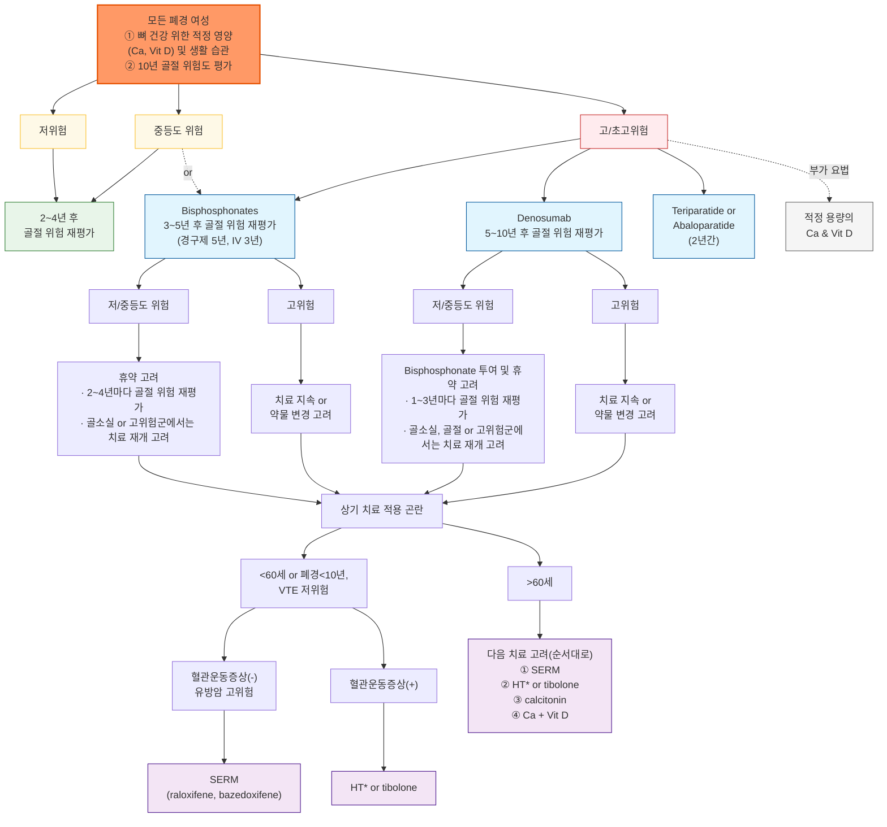
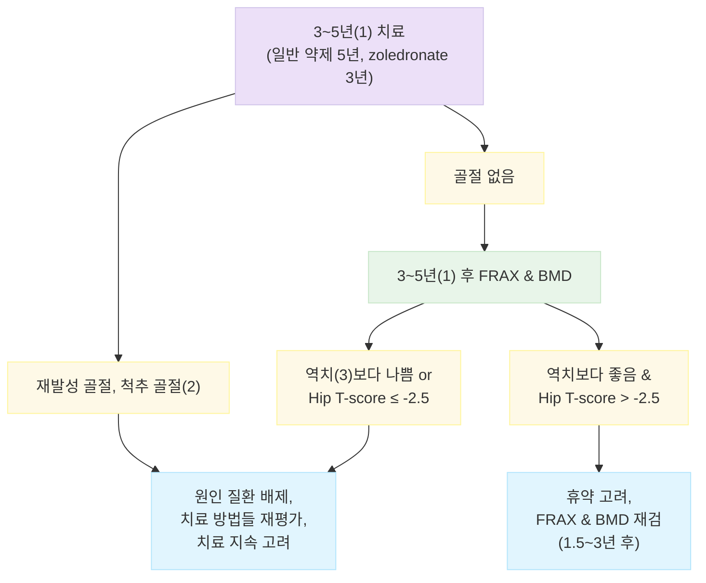

# 골다공증 Osteoporosis

## <mark style="color:green;">일반 사항</mark>

* 골 형성과 골 흡수의 불균형에 의해 야기되는 골 질량(골밀도) 감소와 미세 구조 이상(골 조직 약화)을 특징으로 하는 전신적인 골격계 질환; 골 강도의 약화로 골절 위험성이 증가
* 분류 : 원발성(제1형-폐경후 골다공증, 제2형-노인성 골다공증), 이차성(기저질환 또는 약물에 의한 골소실)
* 유병률
  * osteoporosis : ＞50세 여성- 15%, 남성- 4%
  * osteopenia : ＞50세 여- 50%, 남- 35%
  * 우리나라(2011년) : ＞50세 여 37.3%, 남 7.5%; 50대 15.4%, 60대 36.6%, ≥70세 68.5%
  * 우리나라(2024년, ≥65세) : 18.0%(남 3.8%, 여 31.6%) [2024년 국민건강영양조사]
  * 폐경 여성의 ½에서 골다공증과 관련된 골절 발생. 그 중 15%는 고관절 골절
* 합병증 : 골절(특히 척추·고관절), 만성 통증, 신장 감소·척추 후만증, 기능 저하 및 삶의 질 저하
  * ✽고관절 골절은 1년 내 사망률이 약 20\~24%에 이르고 생존자의 상당수가 이전 수준의 보행·일상생활 기능을 회복하지 못한다는 보고가 있음
* 골다공증은 장기간 관리가 필요한 만성질환으로, 골절 발생 전 예방과 조기 진단·치료가 중요. 특히 성장기의 적절한 영양 섭취와 신체 활동은 최대 골량 형성에 중요

- [ ] 골다공증 위험도 평가 툴 : [SCORE](https://www.medicalalgorithms.com/simplified-calculated-osteoporosis-risk-estimation-tool)(Simple calculated osteoporosis risk estimation) tool

## <mark style="color:green;">원인 및 위험 인자</mark>

* 고령
* 여성. 특히 폐경기, estrogen 수준이 낮은 여성
* 흡연, 음주(＞3 SD/d) (☞ p.995)
* 저체중 : ＜58 ㎏, BMI ＜21
* 적은 신체 활동, 근력 저하
* 취약 골절 병력(fragility fracture. 일반적으로는 골절이 일어나지 않을 약한 외상에 의한 골절)
* 골다공증 또는 대퇴 골절 가족력
* 칼슘 섭취↓, Vit D 섭취↓, 카페인 섭취↑, 염분 섭취↑
* 흡수 장애, 당뇨병, 쿠싱증후군, 갑상선/부갑상선항진증, 백혈병, RA, 신부전, 심부전, 우울
* 약물 장기 복용 : steroid(prednisone ≥5 ㎎/d ×≥3개월), PPI, SSRI, barbiturate, 이뇨제, 갑상선 호르몬제, 항응고제, 면역억제제, 항전간제, 항암제

#### <mark style="color:$primary;">당뇨병과 골절 위험(역설적 골 취약성)</mark>

* 2형 당뇨병 환자는 BMD가 정상이거나 오히려 정상보다 높게 측정되는 경우가 많음에도 골절 위험은 증가하는 역설을 보임 — 골량이 아닌 골질(bone quality/microarchitecture) 저하가 주된 기전으로 추정됨
* DXA만으로는 골절 위험이 과소평가될 수 있어, 당뇨병 동반 환자에서는 임상 위험 인자(낙상력, 신경병증, 망막병증 등)를 함께 고려하고 가능하면 TBS 등 미세구조 보정 도구 병용을 고려
* FRAX는 당뇨병을 입력 변수로 직접 반영하지 않으므로, 당뇨병 환자에서 FRAX 산출값은 실제 골절 위험을 과소평가할 수 있음을 감안하여 임상적으로 보정 필요
* \[대한골대사학회 골다공증 진료지침 2024, 11판]에서 당뇨병성 골절 관리 관련 단원이 신설됨

## <mark style="color:green;">임상 양상</mark>

* 무증상 : 골절이 발생하기 전까지 골다공증 자체는 증상이 없음
* 통증, 변형, 기능 상실, 신장 감소; 골절이 발생하면 이에 따른 증상 발생
* 척추 골절 : 자각 증상이 없는 경우가 많음; 신장 감소(＞2 ㎝), 요통, 측만증

### <mark style="color:$danger;">🚩 Red Flags!</mark>

<mark style="color:$danger;">**즉각 조치 또는 의뢰**</mark>

* 척추 골절 후 하지 위약감·감각 저하·배뇨 또는 배변 장애 (→ 척수/마미총 압박 의심), 응급 의뢰
* 외상 후 고관절 통증 + 보행 불능 또는 하지 단축·외회전 (→ 대퇴골 골절 의심), 응급실 이송
* 급성 심한 요통 + 발열 (→ 화농성 척추염 등 감별 필요), 응급 평가

<mark style="color:$warning;">**당일 또는 조기 의뢰**</mark>

* 새로 발생한 급성 요통 + 신장 감소 또는 후만증 진행 (→ 척추 압박골절 의심), 영상 검사 위해 당일 의뢰
* 골흡수억제제(bisphosphonate, denosumab) 장기 투여 중 새로 생긴 대퇴부·서혜부 통증 (→ 비정형 대퇴골 골절 의심), 당일 X-ray
* 골흡수억제제 장기 투여 중 발치 등 침습적 치과 시술 예정 (→ 턱뼈 괴사 위험 평가), 치과-내분비 협진
* Romosozumab 투여 중 흉통·호흡곤란 등 심혈관 증상 (→ 심혈관계 평가), 당일 의뢰
* 매우 낮은 Z-score(＜-2.0) 또는 젊은 연령의 골다공증 (→ 2차성 원인 감별), 조기 의뢰

<mark style="color:$info;">**외래 추적 / 추가 평가 계획**</mark> <mark style="color:$info;">- 즉각 위험 낮으나 호전 없으면 의뢰</mark>

* 치료 시작 1년 후 골밀도 반응이 기준에 못 미침 (→ 순응도 및 2차성 원인 재확인 후 치료 변경 고려)
* Denosumab 투여를 지연하거나 중단할 예정 (→ 반동 골절 예방을 위한 후속 항흡수제 계획 확인)
* 만성 요통이 지속되나 급성 신경학적 징후는 없음 (→ 정형외과/재활의학과 외래 추적)

## <mark style="color:green;">진단</mark>

### <mark style="color:orange;">골밀도 검사 (Bone mineral density, BMD)</mark>

(☞ [급여기준](https://www.hira.or.kr/rc/insu/insuadtcrtr/InsuAdtCrtrPopup.do?mtgHmeDd=20231229\&sno=6\&mtgMtrRegSno=0031))

#### <mark style="color:$primary;">측정 장치</mark>

* central dual-energy X선 absorptiometry(DXA/DEXA) : 골다공증 진단의 표준 측정법으로 척추 &/or 대퇴골 측정; 체구가 작은 사람은 실제보다 낮게 측정될 수 있음
* peripheral DXA/QUS : 전완 또는 종골 등 말초 골을 평가하여 골절 위험 예측이나 선별에 활용할 수 있으나 central DXA와 직접 호환되지 않으며, 일반적인 말초 측정치에 WHO T-score 진단 기준을 그대로 적용해서는 안 됨
* 단일에너지 X선 흡수계측(SXA) : DXA에 비하여 변동성이 큼
* 정량적 CT(QCT) : trabecular bone과 cortical bone 측정; 방사선 노출량 많음
* quantitative ultrasound(QUS) : 말초 골 측정(예: calcaneus). 방사선 노출 없음. 상대적으로 정확도가 낮음. 예비 검사로 사용
* Trabecular bone score(TBS) : 요추 DXA 영상을 이용해 골 미세구조(texture)를 반영하는 보조 지표; T-score와 독립적인 골절 위험 정보를 제공하며, 당뇨병 등 BMD로는 골절 위험이 과소평가될 수 있는 상황에서 특히 유용

#### <mark style="color:$primary;">측정 부위</mark>

* 척추(L1\~L4)와 고관절(total hip, femoral neck)을 기본 측정 부위로 사용
* 고관절에서는 total hip 또는 femoral neck 중 더 낮은 T-score를 진단에 사용
* 고령자에서 척추는 압박 골절과 퇴행성 변화(골극) 등으로 실제보다 높게 평가될 수 있으므로 고관절 수치를 함께 해석
* 33% radius(1/3 radius) : 척추/고관절을 측정·해석할 수 없는 경우, 부갑상선기능항진증, DXA table 한계를 초과하는 심한 비만 등에서 측정 고려

#### <mark style="color:$primary;">판정</mark>

* L1\~L4 평균치로 판정
* 제외 : 국소 구조적 이상 또는 artifact가 있는 요추(예: 수술 부위 등), 해당 척추의 T-score가 인접 척추와 >1.0 차이 나는 경우 등
* 평가에 적합한 요추가 최소 두 부위는 되어야 진단할 수 있음

**T-score**

* 젊은 정상 성인의 평균 BMD와 비교한 표준 편차; ＞50세 또는 폐경 후 여성에 적용. ISCD에서는 대퇴경부/total hip T-score 산출 시 NHANES III의 20\~29세 여성 기준자료를 사용하도록 권고
* 정상 : -1.0 ≤ T-score
* 골감소증(osteopenia) 또는 낮은 골량 : -2.5 ＜ T-score ＜ -1.0
* 골다공증(osteoporosis) : T-score ≤-2.5
* 중증 골다공증(severe/established osteoporosis) : T-score ≤-2.5이면서 골다공증성(취약) 골절이 1개 이상 동반된 경우
  * ✽이는 전통적인 WHO의 established/severe osteoporosis 정의이며, 하단 "골절 초고위험군(Very-High-Risk)"에서 사용하는 최근 골절·다발골절·매우 낮은 T-score 등 임상 위험도 기반 분류와는 동일한 개념이 아님

**Z-score**

* 동년배의 평균 BMD와 비교한 표준 편차; 폐경 전 여성 및 ＜50세 남성에서 주로 사용
* Z-score ≤-2.0 시 '연령 기대치보다 낮음(below the expected range for age)'으로 판정하고 2차성 원인 평가를 고려. **폐경 전 여성 및 ＜50세 남성은 BMD만으로 골다공증을 진단하지 않음**

#### <mark style="color:$primary;">척추 골절 평가 (Vertebral Fracture Assessment, VFA) [ISCD]</mark>

* 무증상 척추 골절은 흔하며 발견 시 골절 위험도와 치료 전략이 달라질 수 있으므로, DXA 시행 시 lateral spine imaging/VFA 적응증을 함께 평가
* T-score ＜-1.0이면서 다음 중 하나 이상이면 VFA 또는 측면 척추 영상검사를 고려
  1. 여성 ≥70세 또는 남성 ≥80세
  2. 과거 최고 신장 대비 ＞4 ㎝의 신장 감소
  3. 환자가 보고한 척추 골절 병력이 있으나 이전 영상으로 확인되지 않은 경우
  4. prednisone ≥5 ㎎/d 상당량을 ≥3개월 사용 중이거나 사용한 경우

#### <mark style="color:$primary;">검사 주기</mark>

* 반복 DXA 간격은 기저 BMD, 연령, 골절 위험, 치료 여부, 골소실을 가속하는 임상 상태 등에 따라 개별화하는 것이 원칙(ISCD). 아래는 국내 임상에서 흔히 참고하는 일반적 간격이며, 개별 환자 상황에 맞게 조정
* 치료 시작 또는 치료 방법 변경 1년 후 측정, 치료 효과가 확립되면 더 긴 간격 적용
* 이전 검사에서 T-score -2\~ -2.49 또는 지속되는 골 소실 위험(예: steroid 복용)이 있는 경우에는 2년 후
* 이전 검사에서 T-score -1.5\~ -1.99이고 골 소실 위험이 없는 경우에는 3\~5년 후
* 골밀도가 낮고 골절 위험이 높은 골다공증 치료를 받고 있는 폐경 여성에서 치료 반응을 평가하기 위하여 1\~3년마다 척추와 고관절에 대한 DXA 검사를 고려 \[미국/유럽내분비학회]

#### <mark style="color:$primary;">골밀도 선별 검사 대상</mark>

**\[대한골대사학회 골다공증 진료지침 2024, 11판]**

1. ≥6개월 무월경인 폐경 전 여성
2. 골다공증 위험 인자가 있는 폐경 이행기 여성
3. 폐경 여성
4. 골다공증 위험 인자가 있는 ＜70세 남성
5. ≥70세 남성
6. 골다공증 골절의 과거력
7. 2차성 골다공증 의심
8. 영상의학적 검사에서 척추 골절 또는 골다공증
9. 골다공증 약물 치료 시작
10. 골다공증 치료를 받거나 중단한 모든 환자의 경과 추적

✽2024년 개정판(11판)에서 골밀도·골표지자, 치료 목표, 치료 실패 시 약제 변경 기준 등이 업데이트되었으므로 세부 항목은 최신판 원문 확인 권장

**USPSTF 권고안** (2025)

1. ≥65세 여성 : DXA를 이용한 골다공증 선별검사 권고 (Grade B)
2. ＜65세 폐경 여성 : 1개 이상의 골다공증 위험 인자가 있으면 임상 위험평가도구로 위험도를 평가하고, 골절 위험이 증가되어 있으면 DXA 시행 (Grade B)
3. 남성 : 선별검사의 이득과 위해를 판단하기에 근거 불충분 (I statement)

- [ ] 10년 골절 확률 계산 tool : [FRAX tool](https://www.sheffield.ac.uk/FRAX/tool.aspx?country=25)

### <mark style="color:orange;">실험실 검사</mark>

* 2차성 골다공증 감별을 위한 검사 고려
* 대상 : 젊은 연령 또는 남성에서의 골다공증, 매우 낮은 Z-score
* 혈액 : CBC, LFT, RFT, TSH, iron/ferritin, Vit D\[25(OH)D], Ca, testosterone, cortisol(쿠싱증후군 의심 시)
* 소변 : 24시간 Ca
* bone turnover marker : 치료 반응이 나쁘거나 순응도가 낮을 때 고려
  1. antiresorptive therapy에 대하여 C-terminal crosslinking telopeptide
  2. bone anabolic therapy에 대하여 procollagen type 1 N-terminal propeptide (☞ [급여기준](https://www.hira.or.kr/rc/insu/insuadtcrtr/InsuAdtCrtrPopup.do?mtgHmeDd=20190628\&sno=3\&mtgMtrRegSno=0002))

### <mark style="color:orange;">감별 진단</mark>

* 통증성 골절이나 현저한 골밀도 저하 소견에서는 아래 질환들과의 감별이 필요

<table><thead><tr><th width="150">질환</th><th width="230">골다공증과의 차이점</th><th>핵심 감별 포인트</th></tr></thead><tbody><tr><td>골연화증(Osteomalacia)</td><td>골 기질의 무기질화 장애(정상 골량, 무기질 부족)</td><td>혈청 Ca/P/ALP 이상, 심한 Vit D 결핍, Looser zone(가성골절)</td></tr><tr><td>다발골수종(Multiple myeloma)</td><td>형질세포 종양에 의한 국소·전신 골파괴</td><td>동통성 골용해성 병변, 빈혈, 신기능 저하, M-단백, 혈청/요 면역전기영동</td></tr><tr><td>전이성 골질환</td><td>원발암의 골전이(유방암, 전립선암, 폐암 등)</td><td>국소 통증·병적골절, 골스캔/영상에서 다발성 병변, 원발암 병력</td></tr><tr><td>원발성 부갑상선기능항진증</td><td>PTH 과다에 의한 골흡수 항진</td><td>고칼슘혈증, PTH↑, 피질골 우세 골소실</td></tr><tr><td>Paget병</td><td>국소적 골 재형성 이상(과대 성장)</td><td>혈청 ALP 현저히 상승, 특징적 영상 소견(국소성)</td></tr><tr><td>골형성부전증(경증 성인형)</td><td>제1형 콜라겐 유전자 이상에 의한 선천성 골취약성</td><td>소아기부터의 반복 골절력, 청색 공막, 가족력</td></tr></tbody></table>

***



<p align="center"><strong>폐경 여성 골다공증 위험도 기반 치료·재평가 알고리듬</strong></p>

<p align="center"><em><mark style="color:$info;">Ref. ESE. Pharmacological Management of Osteoporosis in Postmenopausal Women. 2019. Fig 2.</mark></em></p>


**이 알고리듬은 ESE 2019 원형을 바탕으로 한 전체 치료 흐름입니다. 이후 가이드라인에서는 골절 초고위험군에서 teriparatide/abaloparatide 또는 romosozumab 등 골형성 중심 치료를 초기부터 고려하는 전략이 강화되었으므로, 실제 약제 선택은 아래 최신 위험도별 원칙과 함께 해석합니다.**


***

## <mark style="background-color:$warning;">Management</mark>


**치료 시작 여부는 BMD, 임상 위험인자 및 FRAX 등을 종합한 골절 위험도에 따라 결정하고, 위험도에 맞춰 정기적으로 재평가·약물 변경을 고려합니다.**


### <mark style="color:orange;">치료 방침</mark>

* 원인 질환 치료
* 식이/영양 : 적절한 영양 섭취(단백질, 무기질, 비타민), Ca/ Vit D 섭취
* 생활 습관 개선 : 금연, 음주 제한, 낙상 예방, 체중 부하 운동
* 약물 치료 : bisphosphonate, denosumab, PTH, SERM, estrogen/tibolone

## <mark style="color:green;">비-약물 치료 및 예방</mark>

#### <mark style="color:$primary;">금연, 음주 제한</mark>

* (≤2 SD/d) (☞ [음주](../230_/189_-alcohol-use-disorder-aud.md))

#### <mark style="color:$primary;">낙상 예방</mark>

* 시력 교정, 보행 교정, 균형 훈련, 어지럼 치료
* 안전 장비 설치 : 손잡이 설치
* 환경 개선 : 밝은 조명, 평평한 바닥
* 낙상 위험 선별 도구 : CDC STEADI(Stopping Elderly Accidents, Deaths & Injuries) 등 표준화된 도구로 최근 1년 낙상력·보행/균형 이상·낙상 두려움을 정기 선별

#### <mark style="color:$primary;">운동</mark>

* 종류 : 체중 부하 운동 선택; 걷기, 달리기, 계단 오르내리기, 댄스
* 강도 : ≥30분/일, ≥5일/주; 규칙적으로 지속하는 것이 중요
* 효과 : 성장기에서는 최대 골량 형성에 기여. 성인에서는 골 소실을 억제하고 일부 체중부하·저항 운동은 부위별 BMD를 소폭 증가시킬 수 있으며, 근력·균형 개선과 낙상 예방 효과도 중요

- [ ] 요추 및 대퇴경부의 BMD 증가에는 mind-body exercise(예: yoga, tai chi, qigong)가, 전체 고관절의 BMD 증가에는 resistance exercise가 가장 효과적이었다는 보고가 있음

#### <mark style="color:$primary;">식이</mark>

* 균형 있는 식사
* 칼슘/Vit D가 많은 식품 섭취
* 권장 음식 : 저지방 우유, 요구르트, 생선, 해조류, 콩, 두부, 두유, 들깨, 참깨, 달래, 무청, 귤
* 제한 음식 : 짠 음식, 인스턴트 식품, 가공 식품, 과량의 육류, 과량의 곡류나 섬유질 섭취, 시금치, 음주, 흡연, 탄산음료, 카페인(하루 커피 ＜3컵, 차 ＜5컵)

## <mark style="color:green;">약물 치료</mark>

### <mark style="color:orange;">Ca, Vit D (기초 보충 요법)</mark>

#### <mark style="color:$primary;">칼슘</mark>

**권고 섭취량**

* 한 번에 많은 섭취는 흡수 저하를 초래하므로 1회 섭취량은 ≤600 ㎎을 권고
* Ca 권장섭취량(RNI, ㎎/d) \[2025 한국인 영양소 섭취기준, 보건복지부]

<table><thead><tr><th width="100">연령(세)</th><th width="120">남자</th><th>여자</th></tr></thead><tbody><tr><td>19–29</td><td>800</td><td>650</td></tr><tr><td>30–49</td><td>800</td><td>650</td></tr><tr><td>50–64</td><td>800</td><td>750</td></tr><tr><td>65–74</td><td>800</td><td>750</td></tr><tr><td>≥75</td><td>800</td><td>750</td></tr></tbody></table>

* 상한섭취량 : 남 19\~29세 3,000 ㎎/d, 남 ≥30세 2,500 ㎎/d, 여 19\~29세 2,500 ㎎/d, 여 ≥30세 2,000 ㎎/d
* ✽임신·수유 시 칼슘 추가 권장량은 없으며, 상한섭취량은 해당 연령 여성 기준과 동일

- [ ] 폐경기 여성에서 칼슘만 섭취하는 것은 BMD 증가에 효과가 없다는 보고가 있음

**칼슘 보충제**

* 제제별 칼슘 함량 : Ca carbonate 40%, Ca citrate 24%, Ca lactate 13%, Ca gluconate 8%
* Ca carbonate : 산성에서 용해되므로 보통 아침에 식사와 함께 복용 권고; 장기간 PPI 등 제산제 사용 환자에서는 위산 저하로 흡수가 저해될 수 있어 Ca citrate 고려; 철분 제제 등과는 상호 흡수 간섭을 피하기 위해 복용 간격을 둠
* Ca citrate : 공복 상태에서 흡수 증가
* 부작용 : 변비, 위장 장애, 신결석
* 음식을 통한 칼슘 섭취에 의한 신결석 증가 가능성은 증거가 부족하며 반대로 칼슘 섭취가 부족할 경우에 신결석이 증가할 가능성이 있음; 보충제를 통한 칼슘 섭취 시 감수성이 있는 사람에서 신결석 증가 위험이 있음(특히 식간 또는 취침 전 복용 시)
* Ca 1000\~1500 ㎎/d 보충이 정상 혈압인 사람들의 고혈압 발생을 예방해 준다는 메타분석 보고가 있음

#### <mark style="color:$primary;">Vit D</mark>

* 골 석회화 촉진, 혈청 칼슘/인산 농도 조절, 골 흡수 억제; 근육/신경 기능에도 관여
* 혈중 25(OH)D : 과거에는 ＜20 ng/㎖를 결핍, 20\~29 ng/㎖를 부족으로 흔히 분류하였으나, Endocrine Society 2024는 기저질환이 없는 일반 건강 성인의 질병 예방을 위한 보편적 sufficiency/insufficiency cut-off를 제시하지 않음. 골다공증 환자에서는 치료 전 Vit D 결핍 여부를 평가하고 결핍 시 교정하며, 임상에서는 25(OH)D ≥20 ng/㎖를 실무적 목표치로 사용하는 경우가 많음
* ≥50세 남, ≥55여에서 Vit D 2000 IU/d 5년 보충이 (25(OH)D 수준이 낮은 경우에도) 골절 발생률을 줄이지 못했다는 보고가 있음(VITAL trial 골 건강 하위연구)
* 일반 건강 성인에서 암·자가면역질환 등 골격 외 효과를 목적으로 한 고용량 Vit D 보충을 일률적으로 권고할 만한 근거는 부족함(Endocrine Society 2024)

**권고 섭취량** (cholecalciferol로서)

* 일반 영양섭취기준(충분섭취량, 2025 한국인 영양소 섭취기준, 보건복지부) : 19\~64세 400 IU/d(10 ㎍/d), ≥65세 600 IU/d(15 ㎍/d); 임신·수유 시 별도 부가량 없음; 성인 상한섭취량 4,000 IU/d(100 ㎍/d)
* 골다공증 환자의 임상적 보충(대한골대사학회) : ≥50세 남성 또는 폐경 여성에서 통상 800 IU/d 권고 — 일반 영양섭취기준과는 목적이 달라 병기함

**형태**

* cholecalciferol(D3) : UVB를 쪼임으로서 피부에서 합성 → 간/신장에서 활성형(1, 25-(OH)2D3)으로 전환
  * 햇빛에 의한 충분한 Vit D 합성 조건 : 봄\~가을의 경우 10\~14시, 20분/회, 3\~4회/주, 신체 40% 노출
* ergocalciferol(D2) : 효모와 식물 스테롤인 에르고스테롤로부터 합성
* calcitriol (1, 25-(OH)2D3) : 활성형 Vit D; 0.25 ㎍ <mark style="color:blue;">\[로이칼 연질캅셀]</mark>, <mark style="color:blue;">\[네오본 주]</mark>
* alfacalcidol(1-α-(OH)D3) : 체내에서 calcitriol로 전환됨; 0.5 ㎍ <mark style="color:blue;">\[알파본]</mark>
* 고용량 cholecalciferol 주사제 : 혈중 농도가 초기에는 높고 이후에는 낮음. 연 50\~60만 IU 이상의 고용량 간헐적(annual bolus) 투여는 오히려 낙상·골절 위험을 높인다는 보고가 있어, 반복적인 고용량 bolus 투여는 지양; 경구제 투여가 어렵거나 순응도가 현저히 낮은 경우에 한해 제품 허가사항에 따라 선택; 필요시 또는 3개월마다 20만 IU IM(연간 상한 60만 IU) <mark style="color:blue;">\[비오엔 주]</mark>

#### <mark style="color:$primary;">칼슘 & Vit D 보충제</mark>

<table><thead><tr><th width="140">상품명</th><th width="260">성분 [Elemental Ca, mg]</th><th>용법</th></tr></thead><tbody><tr><td><mark style="color:blue;">칼디텍 츄어블</mark></td><td>Ca carbonate 1,500 ㎎, cholecalciferol 400 IU [Ca 600]</td><td>식사 시 1\~2T</td></tr><tr><td><mark style="color:blue;">애드칼</mark></td><td>Ca carbonate 240 ㎎, Ca lactate 271.8 ㎎, Ca gluconate 240 ㎎, ergocalciferol 118 ㎍ [Ca 150]</td><td>취침 시 2T</td></tr><tr><td><mark style="color:blue;">프러스칼 디</mark></td><td>Ca citrate 750 ㎎ [Ca 180]</td><td>1T qd</td></tr><tr><td><mark style="color:blue;">헬스칼</mark></td><td>Oyster shell powder 1.29 g [Ca 500]</td><td>1T bid-tid</td></tr></tbody></table>

* USPSTF에서는 골절 예방을 위한 남성 및 폐경 전 여성에서의 Vit D와 Ca 보충, 폐경 후 여성에서의 Vit D 400 IU/Ca 1000 ㎎ 이상 보충하는 것의 유익성과 위해성을 평가하기에는 증거가 불충분하다고 발표\[2018]

### <mark style="color:orange;">Antiresorptive/Anabolic 약물 개관</mark>

* Antiresorptive drug(골 흡수 억제제): bisphosphonates, RANK ligand inhibitor
* Anabolic drug(골 형성 촉진제) : PTH-related protein, PTH, sclerostin inhibitor
* Estrogen agonist: SERM, estrogen/tibolone

#### <mark style="color:$primary;">대상</mark>

* 다음에 해당되는 폐경 후 여성 및 ≥50세 남성
  1. 고관절 또는 척추 골절력
  2. 다른 원인이 배제된 대퇴 경부 또는 척추 골다공증
  3. 낮은 골량(대퇴경부 또는 척추 골감소증)에서 FRAX에 따른 치료 역치를 넘는 경우. 미국 BHOF 기준은 10년 주요 골다공증성 골절 확률 ≥20% 또는 고관절 골절 확률 ≥3%를 사용하며, 국내에서는 국내 지침 및 보험 급여 기준을 함께 적용

- [ ] 보험기준: DXA T-score ≤-2.5인 경우 등 (☞ [급여기준](https://www.hira.or.kr/rc/insu/insuadtcrtr/InsuAdtCrtrPopup.do?mtgHmeDd=20260301\&sno=1\&mtgMtrRegSno=0001))


**골절 초고위험군(Very-High-Risk) 및 골형성치료제 급여 현황 (2026.3 기준)**\
국제 가이드라인은 최근 골절, 다발성 골절, 매우 낮은 T-score, 치료 중 골절, 높은 낙상 위험 등 다양한 요소를 이용해 골절 초고위험군을 정의하며 세부 기준은 가이드라인마다 다름. 초고위험군에서는 teriparatide·abaloparatide 또는 romosozumab 등 골형성 중심 치료를 초기부터 고려한 뒤 항흡수제로 순차 치료하는 전략이 권고됨. 약제별 통상 치료 기간은 teriparatide 18\~24개월(국내 급여는 최대 24개월), abaloparatide 18개월(NOGG 2024 기준; 국가별 허가사항 확인), romosozumab 12개월이며 이후 항흡수제로 전환. 국내 급여 기준은 국제적인 위험도 분류와 별개의 기준으로 적용하며, 2026.3 HIRA 기준에서 teriparatide는 기존 골흡수억제제 중 한 가지 이상에 효과가 없거나 사용할 수 없는 환자 중 65세 이상 + central DXA T-score ≤-2.5 + 골다공증성 골절 2개 이상을 모두 만족하는 경우 최대 24개월 인정. 약제별 세부 급여 기준은 처방 전 최신 HIRA 고시 확인 필요.


#### <mark style="color:$primary;">선택 tips</mark>

* 고위험군의 일반적인 1차 선택 → bisphosphonate 또는 denosumab 등 항흡수제(환자 선호도, 비용, 투여 방법, 신기능, 순응도 등을 고려)
* 폐경 후 ＜10년의 골다공증 여성 환자 → bisphosphonate가 우선 고려되며, ＜60세 또는 폐경 후 ＜10년이면서 혈관운동증상이 있고 VTE·유방암·심혈관질환 위험이 낮고 다른 골다공증 약제가 부적절한 경우에 한해 MHT/tibolone 고려(하단 "Menopausal hormone therapy & tibolone" 참고)
* 폐경 전 여성, 폐경 ≥10년 여성, 남성 환자 → bisphosphonate
* 골흡수억제제 사용이 어렵거나 치료 중에도 골절이 발생하는 고위험 환자 → teriparatide 등 골형성제 고려
* 골절 초고위험군 → teriparatide(통상 18\~24개월), abaloparatide(18개월; NOGG 2024 기준, 국가별 허가사항 확인) 또는 romosozumab(12개월) 등 골형성 중심 치료 우선 고려 → 이후 bisphosphonate 또는 denosumab 등 항흡수제로 전환(국내 급여 기준은 상단 hint 참고)
* 취약 골절 병력이 없는 유방암 위험 여성 : raloxifene <mark style="color:blue;">\[에비스타]</mark>
* bisphosphonate 경구제로 골밀도 회복 안 됨 → (다른 요인이 없는 경우) 다른 종류의 bisphosphonate로 교체, 다른 계열 약제(예: denosumab, teriparatide) 고려
* 경구제 복용이 곤란한 경우, 경구제 복용 순응도가 좋지 않은 경우 → 주사제 고려

### <mark style="color:orange;">Bisphosphonate</mark>

* 작용 : osteoclast의 골 흡수 억제(파골세포의 동원, 분화 및 작용 억제); 뼈 속에 10년간 잔류
* 적용 : 폐경 후 여성과 남성의 골다공증 치료(ibandronate는 여성만 적용)
  * ibandronate는 비척추 또는 고관절 골절 위험 감소 목적으로는 권하지 않음
* 부작용 : 위장관 증상(복통, 소화불량, 식도/위궤양), 시각 장애, 턱뼈 괴사(특히 암환자에서 주사제 등 고용량 사용 시), 장기(＞5년) 사용 시 대퇴골 간부 골절 위험 증가
  * 장기 사용에 따른 atypical femur Fx 위험 증가보다 골절 예방 이득이 유의미하게 크다는 보고가 있음
  * 약물 중단 시 atypical femur Fx 위험은 빠르게 줄어듬
  * IV bisphosphonate는 특히 초회 투여 후 일시적인 급성기 반응(acute-phase reaction : 발열, 근육통, 관절통 등)이 흔히 발생할 수 있음
  * 경구제 식도염 부작용 예방법 : 아침 식사 최소 30분 전에 한 컵(200 ㎖) 이상의 물로 복용, 복용 후 최소 30분간 눕지 않음
* 주의/금기 : 식도 이상, 30분간 기립 자세를 유지할 수 없는 환자, 저칼슘혈증, 심한 신장애, 소화성 궤양
  * alendronate/zoledronate는 CrCl ≥35 ㎖/min, risedronate/ibandronate는 ≥30 시 투여 가능
* 치료 기간(휴약) : 장기 투여 후 모든 환자에서 일률적으로 중단하는 것이 아니라 골절 위험도를 재평가하여 지속 여부를 결정
  * 경구 bisphosphonate는 보통 5년, 연 1회 IV zoledronate는 3년 투여 후 골절 위험도를 재평가 → 고위험이 지속되면 치료를 계속하고, 저·중등도 위험이면 bisphosphonate holiday(\~5년까지)를 고려
  * bisphosphonate holiday 시 2\~4년 간격으로 골절 위험도를 재평가하며 골밀도 또는 위험 인자의 유의미한 악화가 있는 경우 5년 이내라도 치료 재개를 고려
  * 치과 시술(발치, 임플란트) 시 주의 : 약제 종류, 투여 기간, 골절 위험 및 MRONJ 위험 인자를 종합하여 치과의사와 협의. 예방적 bisphosphonate drug holiday가 MRONJ 위험을 감소시키는지는 근거가 확립되지 않았으므로 중단 여부는 개별적으로 결정하며, denosumab은 반동성 골소실·척추골절 위험 때문에 임의로 중단하지 않음

#### <mark style="color:$primary;">Alendronate</mark>

* 용법 : 10 ㎎ qd 또는 70 ㎎ qwk <mark style="color:blue;">\[포사맥스]</mark>, <mark style="color:blue;">\[마시본 액]</mark>, <mark style="color:blue;">\[포사맥스 플러스]</mark>(Vit D 복합제)

#### <mark style="color:$primary;">Ibandronate</mark>

* 비척추 부위의 골절 감소 효과 없음
* 경구제 : 150 ㎎ qmo <mark style="color:blue;">\[본비바]</mark>, <mark style="color:blue;">\[본비바 플러스]</mark>(Vit D 복합제)
  * 복용 예정일을 지나친 경우의 대처 : 다음 정기 복용일이 ≥1주일 남았으면 즉시 복용 후 다음 예정일에 복용, 다음 정기 복용일이 ＜1주일 남았으면 다음 예정일에 복용
* 주사제 : 3 ㎎ 3개월마다, 15\~30초간 IV <mark style="color:blue;">\[본비바 주]</mark>

#### <mark style="color:$primary;">Pamidronate</mark>

* 국내에서 경구제·주사제가 유통 중이나, 현재 주요 국제 가이드라인의 표준 1차 bisphosphonate는 alendronate·risedronate·zoledronate가 중심이며 pamidronate는 1차 선택제로 흔히 권고되지 않음
* 경구제 : 200 ㎎ qd, 식전 1시간 복용 <mark style="color:blue;">\[파노린]</mark>
* 주사제 : 30 ㎎ 3개월마다, 생리 식염주사액 희석 1\~4시간 IV <mark style="color:blue;">\[파노린 주]</mark>
* 부작용 : 발열(보통 자연 소실), 주사 부위 통증/정맥염, 근골격 통증, 위장관 증상, 두통, 어지럼

#### <mark style="color:$primary;">Risedronate</mark>

* 용법 : 5 ㎎ qd, 35 ㎎ qwk, 75 ㎎ 2회/mo, 150 ㎎ qmo <mark style="color:blue;">\[악토넬]</mark>, <mark style="color:blue;">\[리세넥스엠]</mark>(Vit D 복합제)

#### <mark style="color:$primary;">Zoledronate</mark>

* 주사제 : 5 ㎎ 1년마다, 15분 이상 IV <mark style="color:blue;">\[졸레드론산 주]</mark>
* 부작용 : 심방세동, 발열, 두통, 관절통, 근육통; 초회 주사에서 보다 흔히 발생

***


**아래 알고리듬은 상단의 전체 치료 흐름 중, 이미 bisphosphonate를 사용 중인 환자에서 장기 치료 지속 여부와 drug holiday를 판단하기 위한 하위 단계입니다.**




(1) zoledronate는 3년, 다른 BP들은 5년\
(2) 경구 BP 복용 환자 중 지속 투여 고려 대상 : ＞75세, 고관절 골절력, 현재 스테로이드 복용 Pred ≥7.5 mg/d\
(3) FRAX에서 도출된 주요 골절 및 둔부 골절의 확률에 기초하여 작성.

<p align="center"><strong>Bisphosphonate 장기 치료 모니터링 알고리듬</strong></p>

<p align="center"><em><mark style="color:$info;">Ref. NOGG. Clinical guideline for the prevention and treatment of osteoporosis. 2017(NOGG 2024에서는 장기치료 대상과 재평가 시기를 보다 구체화하였으므로 최신판 기준으로 해석 권장).</mark></em></p>

***

### <mark style="color:orange;">RANK ligand 억제제</mark>

#### <mark style="color:$primary;">Denosumab</mark>

* 작용 : RANKL(receptor activator of nuclear factor kappa B ligand)에 결합하는 단클론 항체로서, RANKL이 osteoclast의 생성, 분화 및 활성을 조절하는 RANK 수용체에 결합하는 것을 방해 → osteoclast 형성 억제 → 골 소실 감소
* 효과(3년 치료) : 골밀도 척추 9.2%, 대퇴 6%↑; 골절 척추-69%, 비척추-20%, 대퇴-40% ↓
* 허가 사항 : 폐경 후 여성 골다공증 치료, 남성 골다공증의 골밀도 증가를 위한 치료, glucocorticoid 유발성 골다공증 치료, androgen 차단 요법을 받는 비전이성 전립선암의 골 소실 치료, 아로마타제 저해제 보조 요법을 받고 있는 여성 유방암의 골 소실 치료
* 대사 : reticuloendothelial system에 의해 제거; 신장을 통해 배설되지 않아 신기능에 따른 용량 조절은 불필요
* 주의 : 중단 시 급격한 골 소실(잔류 효과 없음) 및 반동 골절 위험
  * 골절의 위험성이 적은 젊은 환자에 있어서는 투여를 시작하지 않음
* 용법 : 60 ㎎ 피하주사 ×매 6개월 <mark style="color:blue;">\[프롤리아 프리필드]</mark>
* 치료 기간
  * denosumab을 투여받는 골다공증이 있는 폐경 여성에서 5\~10년 후 골절 위험도를 재평가하여 높은 골절 위험도가 지속되는 경우 투여를 지속하거나 다른 골다공증 요법을 시행할 것을 고려
  * denosumab 투여를 지연하거나 중단할 때에는 무치료 상태가 지속되지 않도록 마지막 투여 약 6개월 후 zoledronate 5 ㎎ IV 등 후속 antiresorptive 치료로 전환하여 반동성 bone turnover, 빠른 골밀도 감소 및 다발성 척추 골절 위험을 줄여야 함


**Denosumab 중단 시 후속 요법 (NOGG 2024)**\
마지막 denosumab 투여 약 6개월 후 zoledronate 5 ㎎ IV 투여가 강력 권고되며(Strong recommendation), 이후 CTX 등 골표지자를 이용해 추가 투여 필요성을 평가. CTX 모니터링이 어려우면 첫 zoledronate 투여 6개월 후 추가 투여를 고려.



**⚠️ 진행성 만성신질환 환자의 중증 저칼슘혈증 위험 (FDA Boxed Warning, 2024)**\
Denosumab은 진행성 CKD(eGFR ＜30 ㎖/min/1.73m² 또는 투석 환자, 특히 CKD-MBD 동반 시)에서 중증·치명적 저칼슘혈증을 유발할 수 있음(입원, 생명을 위협하는 사건, 사망 보고 포함). 투여 전 저칼슘혈증을 교정하고, 진행성 CKD 환자에서는 투여 후 첫 1개월간 매주, 이후 매월 혈청 칼슘을 모니터링하며, 충분한 칼슘·활성형 Vit D 보충을 병행함.


### <mark style="color:orange;">PTH</mark>

* 재조합 부갑상선 호르몬(teriparatide), PTH–related protein analog(abaloparatide)
* 작용 : 골 형성 자극; bisphosphonate 등 골 흡수 억제제와의 병용에 따른 효과 상승은 불확실
* 적용 : 골절의 고위험군 또는 골 흡수 억제제 치료에도 골절이 계속 발생할 경우, 골 흡수 억제제 투여가 어렵거나 금기인 경우
* 허가 사항 : 폐경기 이후 여성 및 골절의 위험이 높은 남성에 대한 골다공증, 골절의 위험이 높은 여성 및 남성에 있어서 지속적인 glucocorticoid 요법과 관련된 골다공증의 치료
* 부작용 : 근육통, 현훈, 구역, 두통
* 금기 : 골육종, 고칼슘혈증, 골암
* 치료 기간 : 일반적으로 18\~24개월 사용 후 항흡수제로 전환. 미국 FDA는 2020년 라벨 개정으로 골육종 위험 관련 박스경고 및 "평생 2년" 절대 제한을 삭제하였고, 환자가 여전히 또는 다시 고골절위험 상태이면 2년 초과 사용도 고려할 수 있음을 명시하나, 국내 허가·급여 인정 기간은 이와 별도이므로 처방 전 반드시 확인 필요
* teriparatide : <mark style="color:blue;">\[포스테오 주]</mark> 20 ㎍ 매일 피하주사; <mark style="color:blue;">\[테리본 주]</mark> 56.5 ㎍ 주 1회 SC, 투여 직전 N/S 1㎖에 용해하여 조제. 국내 급여 인정 기간은 위 hint(골절 초고위험군 급여 현황) 참고

### <mark style="color:orange;">Sclerostin inhibitor</mark>

#### <mark style="color:$primary;">Romosozumab</mark>

* sclerostin(골 형성 신호 체계 억제)에 대한 단클론 항체; 골 형성 촉진, 골 흡수 억제(일시적); 12개월 사용 후 골 형성 효과가 사라짐
* 용법 : 210 ㎎(105 ㎎ 씩 다른 부위), 월 1회, 총 12회 피하 주사 <mark style="color:blue;">\[이베니티 프리필드]</mark>; 칼슘, Vit D 보조제 추가 복용 필요
* 투여 종료 후 골밀도 검사를 실시하여 기저치 대비 동일 또는 개선이 확인되는 경우에 마지막 투여일로부터 1개월 이내에 골 흡수 억제제로 전환 투여(최대 12개월까지 보험 인정)
* 주의/금기 : 심근경색/뇌졸중 병력 시 사용 제한(FDA Boxed Warning: MACE 위험 증가 가능성), 심한 신장애
* 약물의 지속 효과가 없어 투여 중단 시 다른 약제 사용을 고려해야 함


**⚠️ Romosozumab 심혈관 위험 경고 (FDA Boxed Warning)**\
ARCH 연구에서 alendronate 대비 주요 심혈관 사건(심근경색, 뇌졸중, 심혈관 사망) 발생이 증가하는 경향이 관찰됨. 최근 1년 이내 심근경색·뇌졸중 병력이 있는 환자에서는 투여를 시작하지 않으며, 심혈관 위험 인자가 있는 환자에서는 투여 여부를 신중히 판단.


### <mark style="color:orange;">SERM (Selective estrogen receptor modulator)</mark>

* estrogen receptor에 결합하여 일부 조직에서는 작용제로, 일부에서는 억제제로 작용
* 대상 : 골절 위험도가 높은 골다공증이 있으며, bisphosphonates 또는 denosumab를 적용할 수 없고 심부정맥혈전의 위험이 낮거나 유방암 위험이 높은 폐경 여성

#### <mark style="color:$primary;">Raloxifene</mark>

* 효과 : 골밀도↑, 척추 골절↓
  * 3년 투여 시 골밀도 2.1%(대퇴)\~2.6%(척추)↑, 척추 골절 50%↓ 효과가 있다는 보고가 있음
  * 비척추골이나 고관절의 골절 감소 효과는 없음
  * 8년 투여 시 척추 골절이 있었던 고위험군에서 비척추 골절을 36% 감소시켰다는 보고가 있음
  * 골다공증 외 영향 : 자궁암 증가 없음, LDL-C↓, 침윤성 유방암↓
* 적용 : 유방암 위험이 높은 폐경 후 여성에서의 골다공증 예방 및 치료
* 부작용 : 감염, flu-like Sx, 안면 홍조, sinusitis, 하지 통증; **정맥혈전색전증(VTE) 위험 증가**(주요 안전성 이슈로, VTE 병력·고위험 환자에서는 피함), 치명적 뇌졸중 위험 증가(✽관상동맥병 위험이 높은 경우)
* 용법 : 60 ㎎ qd <mark style="color:blue;">\[에비스타]</mark>

#### <mark style="color:$primary;">Bazedoxifene</mark>

* 3년 투여 시 골밀도 1.1%(대퇴)\~2.3%(척추)↑, 척추 골절 42%↓, 비척추 골절 영향 없음의 보고가 있음
* 부작용 : 안면 홍조, 근육 경련, 졸음, 어지럼, 입마름, 말초 부종, 설사, 구역; 혈전색전증
* 용법 : 20 ㎎ qd <mark style="color:blue;">\[비비안트]</mark>; Vit D 복합제 <mark style="color:blue;">\[바펜디]</mark>

### <mark style="color:orange;">Menopausal hormone therapy & tibolone</mark>

* 적용 : 골절 위험도가 높은, 아래 특성의 폐경 여성에서 ① 모든 종류의 골절을 예방하기 위하여 자궁적출술을 받은 여성에서는 estrogen 단독 호르몬 투여를, ② 척추 및 비척추 골절을 예방하기 위하여 tibolone 투여를 고려
  * ＜60세 또는 폐경 후 ＜10년, DVT 위험이 낮음, bisphosphonates 또는 denosumab를 적용할 수 없음, vasomotor symptom으로 고통 받음, 추가의 갱년기 증상이 있음, estrogen 치료에 금기가 아님, MI 또는 뇌졸중 병력이 없음, 유방암이 없음, 이 치료를 받을 의향이 있음

✽구체적인 위험도 기반 치료 흐름은 상단 [진단 및 치료 알고리듬](#진단) 참고

#### <mark style="color:$primary;">Estrogen</mark>

* 작용 : osteoclastogenesis 억제
* 골다공증 예방만을 위한 경우에는 estrogen 외의 약제를 우선 권고
* 약제 (☞ p.597)

#### <mark style="color:$primary;">Tibolone</mark>

* 작용 : 조직 특이적인 estrogen 유사 효과, 약한 androgen 효과
* 효과 : 골 소실 예방, 폐경 증상 감소; 유방·자궁내막에 대한 영향이 기존 estrogen-progestogen therapy와는 다르나, 유방암·자궁내막 관련 위험이 전혀 없는 것은 아니므로 개별 위험도 평가 필요
* 부작용 : 하복부 통증, 비정상적 체모 증가, 질 분비물, 질 출혈, 유방 압통, 체중 증가
* 용법 : 2.5 ㎎ qd <mark style="color:blue;">\[리비알]</mark>(일부 연구에서는 1.25 ㎎/d도 사용; 국내 허가사항 확인)

\*HT(Hormonal therapy): uterus(-) 시 estrogen, uterus(+) 시 estrogen + progestin

### <mark style="color:orange;">기타</mark>

#### <mark style="color:$primary;">Testosterone</mark>

* 적용 : hypogonadism이 있는 남성 골다공증
* 금기 : 전립선암, 유방암
* <mark style="color:blue;">\[테스토 겔]</mark> : 1% 50 ㎎/5g/p : 어깨, 팔, 복부 피부에 1일 1회(오전) 5 g 적용 (☞ p.709)

#### <mark style="color:$primary;">Strontium ranelate</mark>

* 작용 : 골 흡수 방해, 골 형성 증가
* 용법 : 2 g qd (✽FDA 미승인)

#### <mark style="color:$primary;">Calcitonin</mark>

* 작용 : osteoclast 작용 억제
* 효과 : 골 통증에 대한 약간의 진통 효과; 다른 제제보다 골 소실 예방/골절 감소 효과 적음
* 적용 : 골절 위험도가 높은 골다공증이 있는 폐경 여성에서 다른 치료(예: raloxifene, bisphosphonates, estrogen, denosumab, tibolone, abaloparatide, teriparatide)를 적용할 수 없는 경우 nasal spray calcitonin 투여를 고려; 남성, 다른 치료제를 사용할 수 없는 폐경 5년 이후 여성에 적용
* 주의 : 장기간 사용 시 내성 발생; 6개월 이내 사용 후 수개월간의 휴약을 요함
* 주사제 : 구역, 안면 홍조 부작용
* 비강 분무제 : 200 IU/d
* elcatonin : calcitonin derivative; 10 IU ×2회/주 또는 20 IU ×1회/주 주사 <mark style="color:blue;">\[엘시토닌]</mark>
* salcatonin(salmon calcitonin) : 암 발생 증가 문제로 사용 중지

### <mark style="color:orange;">모니터링</mark>

**\[대한골대사학회 골다공증 진료지침 2024, 11판]** (치료 목표·치료 실패 세부 기준은 원문 확인 권장)

* 치료 목표 : 대퇴골 전체 골밀도 T-score -2.0 제안
* 골다공증 치료제의 효과를 확인하기 위해 골밀도 및 생화학적 골표지자를 추적 평가
* 치료 시작 1년 후 치료제 효과기준을 만족하지 못하는 경우 순응도, 2차 골다공증 원인 등 확인 → 치료 실패 시 치료 변경 고려
* 치료 실패 : 순응도 개선 및 2차성 골다공증 배제 후에도 ① 2개 이상의 골다공증 골절 발생, ② 1개의 골절이 있으면서 골표지자의 예상되는 변화가 없거나 골밀도의 유의한 감소가 있음, ③ 골표지자의 예상되는 변화가 없으면서 골밀도가 유의하게 감소

### <mark style="color:orange;">약제별 효능 비교</mark>

<table><thead><tr><th width="176">성분명 [상품명]</th><th width="158">용량</th><th>척추1)</th><th>고관절1)</th><th>비척추1)</th></tr></thead><tbody><tr><td>alendronate²⁾ [포사맥스]</td><td>10 mg/d, 70 mg/wk PO</td><td>+</td><td>+</td><td>+</td></tr><tr><td>risedronate²⁾ [악토넬]</td><td>5 mg/d, 35 mg/wk PO</td><td>+</td><td>+</td><td>+</td></tr><tr><td>ibandronate [본비바]</td><td>150 mg/m PO, 3 mg/3m IV</td><td>+</td><td>-</td><td>-</td></tr><tr><td>zoledronate²⁾ [졸레드론산]</td><td>5 mg/y IV</td><td>+</td><td>+</td><td>+</td></tr><tr><td>denosumab²⁾ [프롤리아]</td><td>60 mg/6mo SC</td><td>+</td><td>+</td><td>+</td></tr><tr><td>teriparatide²⁾ [포스테오]</td><td>20 µg/d SC</td><td>+</td><td>+3)</td><td>+</td></tr><tr><td>abaloparatide (국내 미허가)</td><td>80 µg/d SC</td><td>+</td><td>근거 제한</td><td>+</td></tr><tr><td>romosozumab [이베니티]</td><td>210 mg/mo SC ×12개월</td><td>+</td><td>+</td><td>+</td></tr><tr><td>raloxifene [에비스타]</td><td>60 mg/d PO</td><td>+</td><td>-</td><td>-</td></tr><tr><td>bazedoxifene [비비안트]</td><td>20 mg/d PO</td><td>+</td><td>-</td><td>-</td></tr><tr><td>결합 estrogen [프레미나]</td><td>0.625 mg/d PO</td><td>+</td><td>+</td><td>NR</td></tr></tbody></table>

1\) 효능의 임상 근거 부위

²⁾ 남성 골다공증에 대하여 허가. NR=not reported; 근거 제한=고관절 골절 감소 근거가 제한적. 각 약제 세부 용법은 상단 개별 항목 참고.

Ref. NOGG 2024 Table 6 및 각 약제 주요 임상시험/메타분석을 바탕으로 정리. '+'는 골절 감소 효과를 지지하는 임상 근거가 있음을 의미하며, 근거의 직접성·수준은 약제별로 다름.

3\) Teriparatide의 고관절 골절 감소 효과는 고관절 골절을 1차 평가변수로 한 RCT가 아니라 체계적 문헌고찰·메타분석 근거(위약 대비 OR 0.44, 95% CI 0.22\~0.87)에 기반함(NOGG 2024).

## <mark style="color:green;">시술 및 기타 처치</mark>

### <mark style="color:orange;">경피적 척추성형술 / 후만풍선복원술 (Vertebroplasty/Kyphoplasty)</mark>

* 대상 : 보존적 치료(진통제, 안정, 보조기)에도 호전되지 않는 통증성 골다공증성 척추 압박골절
* 방법 : 골시멘트를 경피적으로 골절 척추체에 주입(vertebroplasty), 또는 풍선으로 척추체 높이를 회복시킨 후 시멘트 주입(kyphoplasty)
* 효과 : 현재 근거는 통증성 골다공증성 척추 골절에서 vertebroplasty/balloon kyphoplasty의 일상적(routine) 시행을 지지하지 않음(NOGG 2024) — 위약(sham) 시술과 비교한 RCT에서 일관된 이득이 확인되지 않음. 다만 적절한 보존적 치료(진통제, 안정, 보조기)에도 심한 통증과 기능 저하가 지속되는 선별 환자에서는 척추 전문의와 개별적으로 고려
* 합병증 : 시멘트 누출, 인접 척추체 골절 위험 증가


**이차골절예방(Fracture Liaison Service, FLS)**\
고관절·척추 등 취약 골절로 내원한 환자는 퇴원 또는 외래 종료 시 골다공증 평가·치료로 자동 연계되지 않으면 후속 골절 예방 기회를 놓치기 쉬움. IOF의 "Capture the Fracture" 등 국제 캠페인은 골절 환자를 체계적으로 선별해 골밀도 검사·치료 시작·추적까지 연결하는 다학제 FLS 모델을 권고하며, 1차 진료에서도 골절 병력이 확인되면 별도의 예방 접종처럼 재골절 예방 치료 시작 여부를 routine하게 점검하는 것이 권장됨.


***

### <mark style="color:red;">질병코드</mark>

M80 병적 골절을 동반한 골다공증

M80.0 병적 골절을 동반한 폐경후 골다공증

M80.9 병적 골절을 동반한 상세불명 골다공증

M81 병적 골절이 없는 골다공증

M81.0 폐경후골다공증

M81.5 특발성 골다공증

M81.9 상세불명의 골다공증

***

## <mark style="color:purple;">처방례</mark>

> **처방례 1. 예방 목적 / 저위험군**
>
> ```
> 칼디텍 츄어블  1T  qd  식사 시 또는 식사 직후 씹어서 복용
> ※ 예방 목적에서는 1일 1정으로 충분; 치료 목적에서는 2정(분2)까지 증량
> ```

> **처방례 2. 폐경 후 골다공증, 경구 bisphosphonate 표준 요법**
>
> ```
> 포사맥스 플러스(alendronate 70 ㎎ + Vit D)  1T  주 1회
> ※ 아침 식사 최소 30분 전, 충분한 물(200 ㎖ 이상)과 함께 복용
> ※ 복용 후 최소 30분간 눕지 않음
> ```

> **처방례 3. 경구제 복용 곤란 또는 순응도 저하, 폐경 후 고위험군**
>
> ```
> 프롤리아 프리필드시린지 60 ㎎  피하주사  6개월마다
> ※ 투여 전 혈청 칼슘 확인, 저칼슘혈증 교정 후 투여
> ※ 투여 중단 시 반드시 bisphosphonate 등 후속 항흡수제로 연계(반동 골절 예방)
> ```

> **처방례 4. 골절 초고위험군(최근 골절, T-score ≤-3.0 등)**
>
> ```
> 포스테오 주 20 ㎍  매일  피하주사(국내 급여 최대 24개월)
> ※ 최초 투여는 앉거나 누운 자세에서(기립성 저혈압 가능)
> ※ 치료 종료 후 반드시 항흡수제로 전환하여 획득된 골밀도 유지
> ```

> **처방례 5. 취약 골절 병력 없고 유방암 위험이 높은 폐경 여성**
>
> ```
> 에비스타 60 ㎎  1T  qd
> ※ 정맥혈전색전증 병력·위험이 있으면 금기; 안면홍조 등 갱년기 증상을 악화시킬 수 있음을 설명
> ```

***

### <mark style="color:$success;">핵심 복약 지도</mark>

> **경구 bisphosphonate, 이렇게 복용하세요**
>
> 1. 아침 기상 직후, 공복 상태에서 물 200 ㎖ 이상과 함께 복용합니다.
> 2. 복용 후 최소 30분간(가능하면 식사 전까지) 눕지 않고 앉거나 서 있는 자세를 유지합니다.
> 3. 다른 약물이나 음식(특히 칼슘, 철분, 제산제)과는 최소 30분 이상 간격을 두고 복용합니다.
> 4. 삼킴 장애, 식도 질환, 30분간 기립 자세 유지가 어려운 환자에게는 주사제 전환을 고려합니다.

> **칼슘·비타민D 보충제 복용 원칙**
>
> * 칼슘은 1회 ≤600 ㎎씩 나누어 복용해야 흡수율이 높습니다(하루 총량을 한 번에 복용하지 않도록 지도).
> * Ca carbonate 제제는 식사 중/직후에, Ca citrate 제제는 공복에도 복용 가능함을 안내합니다.
> * 변비, 신결석 병력이 있는 환자에서는 복용 후 증상을 모니터링합니다.

> **골흡수억제제 장기 사용 시 주의사항 (턱뼈 괴사·비정형 대퇴골 골절)**
>
> * 발치, 임플란트 등 침습적 치과 시술 전에는 반드시 골다공증 약물 복용 사실을 알리도록 안내합니다.
> * 예방적 bisphosphonate 휴약이 턱뼈 괴사 위험을 줄이는지는 근거가 확립되지 않았습니다. 약제 종류·투여 기간·골절 위험·MRONJ 위험 인자를 고려하여 치과의사와 중단 여부를 개별적으로 결정하며, denosumab은 임의로 중단하지 않습니다.
> * 서혜부·대퇴부의 새로운 둔통이 나타나면 즉시 보고하도록 교육합니다(비정형 대퇴골 골절의 전조 증상일 수 있음).

> **Denosumab 중단 시 반드시 후속 약제를 연계하세요**
>
> * denosumab을 지연하거나 중단할 때는 반동성 골소실 및 다발성 척추 골절 위험이 있으므로, 마지막 투여 약 6개월 후 zoledronate IV 등 후속 항흡수제로 전환하는 계획을 미리 세웁니다. 예정된 6개월 투여 일정을 지키도록 리마인드 시스템 활용을 권장합니다.
> * 진행성 만성신질환(특히 투석) 환자에서는 중증 저칼슘혈증 위험이 높으므로, 투여 전 혈청 칼슘을 교정하고 투여 후 정기적으로 모니터링합니다.

> **언제 다시 병원을 방문해야 하나요?**
>
> * 골흡수억제제 복용 중 새로 생긴 대퇴부/서혜부 통증이 있는 경우
> * 발치 등 치과 시술을 계획 중인 경우 — 사전에 반드시 내원
> * 낙상 후 심한 요통, 고관절통, 보행 장애가 있는 경우 — 즉시 내원
> * denosumab 투여 예정일을 2주 이상 넘긴 경우

***

### <mark style="color:blue;">환자 안내서</mark>


**골다공증, 소리 없이 진행되지만 골절은 막을 수 있습니다**

골다공증은 뼈의 양이 줄고 뼈 속 구조가 약해지는 질환으로, 그 자체로는 아픈 증상이 없습니다. 하지만 뼈가 약해지면 작은 충격에도 골절이 생길 수 있어, 미리 진단하고 관리하는 것이 중요합니다.


#### <mark style="color:$primary;">왜 골다공증이 생기나요?</mark>

* 나이가 들면서, 그리고 여성은 폐경 이후 여성호르몬이 줄면서 뼈가 만들어지는 속도보다 없어지는 속도가 빨라집니다.
* 흡연, 음주, 운동 부족, 마른 체형, 칼슘/비타민D 섭취 부족도 뼈를 약하게 만드는 원인이 됩니다.
* 스테로이드제 등 특정 약물을 오래 복용하거나 갑상선 질환 등이 있으면 골다공증 위험이 높아집니다.

#### <mark style="color:$primary;">일상생활에서 어떻게 관리하나요?</mark>

* **매일 30분 이상, 주 5일 이상 걷기·계단 오르기 등 체중이 실리는 운동을 하십시오.** 뼈에 적당한 자극을 주어야 뼈가 약해지는 것을 늦출 수 있습니다.
* **금연하고 술은 하루 2잔 이하로 줄이십시오.** 흡연과 과음은 뼈를 직접 약하게 만듭니다.
* **저지방 우유, 두부, 생선, 나물류 등 칼슘이 풍부한 음식을 매일 드십시오.** 짠 음식, 인스턴트식품, 카페인은 칼슘 배출을 늘릴 수 있어 줄이는 것이 좋습니다.
* **집 안의 낙상 위험을 줄이십시오.** 문턱을 없애고, 화장실에 손잡이를 설치하고, 바닥의 물기·전선을 정리하십시오.
* **시력이 나쁘거나 어지럼이 있다면 안과·이비인후과 진료를 받으십시오.** 낙상 예방에 큰 도움이 됩니다.

#### <mark style="color:$primary;">약은 어떻게 써야 하나요?</mark>

* **경구 골다공증약(알렌드로네이트 등)은 아침 공복에, 물 한 컵 이상과 함께 삼키고, 복용 후 30분간 눕지 마십시오.** 식도 자극을 예방하기 위한 필수 수칙입니다.
* **주사제(데노수맙 등)는 정해진 날짜를 지켜 맞으십시오.** 특히 데노수맙은 중단하면 오히려 골절 위험이 급격히 높아질 수 있어, 다음 치료 계획 없이 임의로 중단해서는 안 됩니다.
* **칼슘제와 비타민D제는 처방된 대로 꾸준히 복용하십시오.** 한 번에 너무 많이 먹으면 흡수가 잘 안 되므로 나누어 복용하는 것이 좋습니다.
* **치과에서 이를 뽑거나 임플란트를 하기 전에는 반드시 골다공증 약을 복용 중이라고 알리십시오.**

#### <mark style="color:$primary;">이럴 때는 즉시 병원을 방문하세요</mark>

* 넘어진 후 고관절이나 척추 부위가 심하게 아프고 걷기 힘든 경우
* 갑자기 키가 줄거나 등이 굽으면서 허리 통증이 심해지는 경우
* 다리에 힘이 빠지거나 대소변 조절이 어려워지는 경우
* 골다공증 약을 복용하는 중 허벅지나 사타구니에 새로운 통증이 생긴 경우
