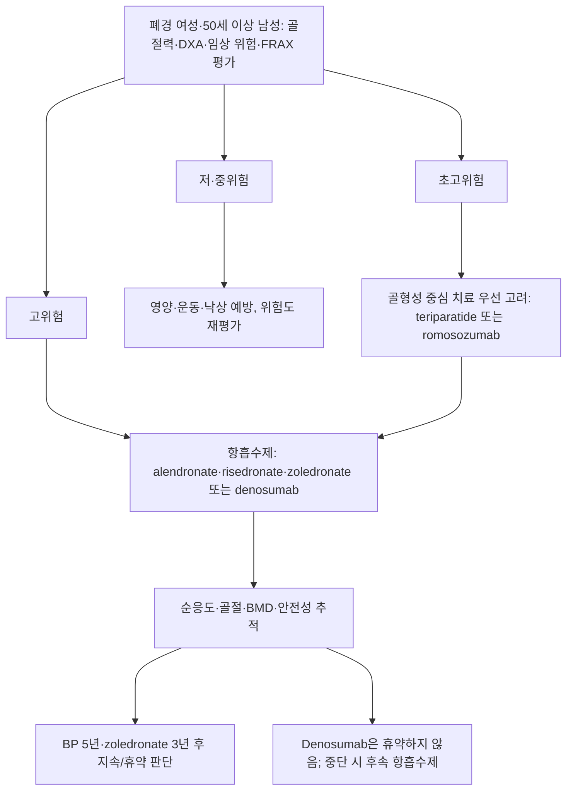
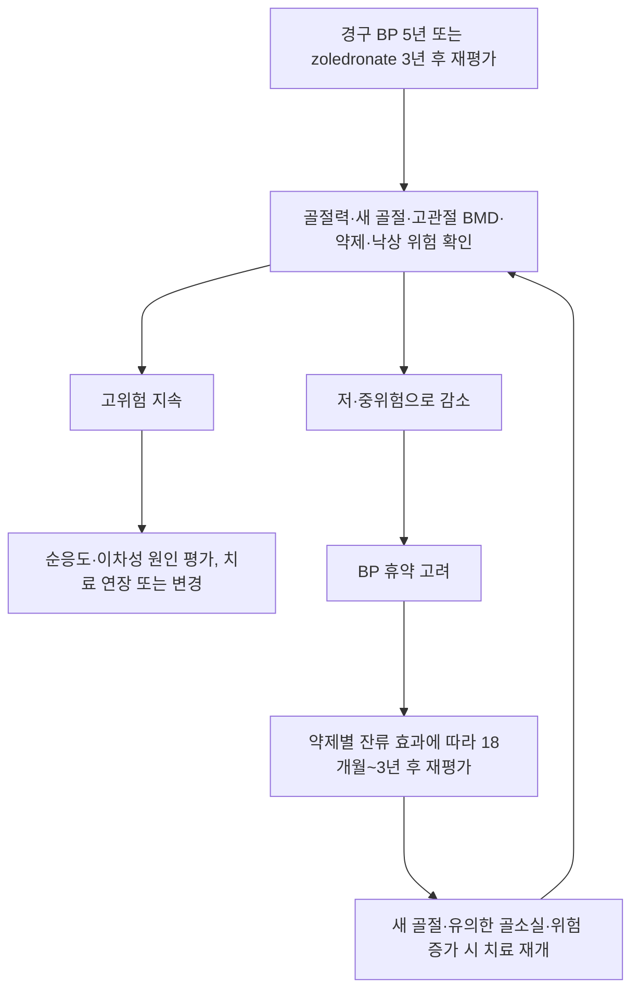

# 골다공증 Osteoporosis

## <mark style="color:green;">일반 사항</mark>

* 골 형성과 골 흡수의 불균형에 의해 야기되는 골 질량(골밀도) 감소와 미세 구조 이상(골 조직 약화)을 특징으로 하는 전신적인 골격계 질환; 골 강도의 약화로 골절 위험성이 증가
* 분류 : 원발성(제1형-폐경후 골다공증, 제2형-노인성 골다공증), 이차성(기저질환 또는 약물에 의한 골소실)
* 유병률 : 대상 연령, 측정 부위와 진단 방법에 따라 달라짐
  * 우리나라(2008\~2011년 국민건강영양조사, ≥50세 남성·폐경 여성, DXA 기준) : 골다공증 여성 38.0%, 남성 7.3%; 골감소증 여성 48.7%, 남성 46.5% \[Park 등, Yonsei Med J 2014]
  * 우리나라(2024년 국민건강영양조사, ≥65세; 2025.10.1 질병관리청 보도자료의 잠정치) : 골다공증 18.0%(남 3.8%, 여 31.6%). 대상 연령·측정 부위·조사 조건을 확인해야 하며, 위 DXA 조사 수치와 직접 비교하여 유병률 추세를 판단하지 않음
* 합병증 : 골절(특히 척추·고관절), 만성 통증, 신장 감소·척추 후만증, 기능 저하 및 삶의 질 저하
  * ✽고관절 골절 후 1년 내 사망 위험이 높으며 생존자의 상당수가 이전 수준의 보행·일상생활 기능을 회복하지 못함; 사망률은 연령·성별·기저질환·조사집단에 따라 달라짐
* 골다공증은 장기간 관리가 필요한 만성질환으로, 골절 발생 전 예방과 조기 진단·치료가 중요. 특히 성장기의 적절한 영양 섭취와 신체 활동은 최대 골량 형성에 중요
* 골밀도 선별 대상 선정 도구(SCORE, OSTA 등)와 10년 골절 확률 평가 도구(FRAX)는 용도가 다름; 약물 치료 결정에는 골절 병력·DXA·임상 위험 인자와 FRAX를 종합함

## <mark style="color:green;">원인 및 위험 인자</mark>

* 고령
* 여성. 특히 폐경기, estrogen 수준이 낮은 여성
* 흡연, 과음(FRAX에서는 알코올 ≥3단위/일을 위험 인자로 입력; 잔 크기·알코올 함량에 따라 실제 섭취량이 달라짐)
* 저체중, 특히 BMI ＜18.5 ㎏/m²; 특정 체중 수치를 모든 성별·체격에 일률적으로 적용하지 않음
* 적은 신체 활동, 근력 저하
* 취약 골절 병력(fragility fracture; 서 있는 높이 이하에서의 낙상처럼 정상 뼈에서는 골절을 일으키기 어려운 작은 외상에 의한 골절)
* 골다공증 가족력, 특히 부모의 고관절 골절력(FRAX 입력 항목)
* 칼슘 섭취↓, Vit D 섭취↓, 카페인 섭취↑, 염분 섭취↑
* 흡수 장애, 당뇨병, 쿠싱증후군, 갑상선/부갑상선항진증, 백혈병, RA, 신부전, 심부전, 우울
* 약물 : 전신 glucocorticoid, 아로마타제 억제제, androgen 차단 요법, 일부 항전간제, thiazolidinedione, 과량의 갑상선 호르몬제, 장기간 heparin 등; PPI·SSRI 등은 골절 위험과의 연관성이 보고됨
  * 모든 이뇨제·항응고제를 같은 위험군으로 묶지 않음; loop 이뇨제는 칼슘 배설을 늘리지만 thiazide는 칼슘 배설을 줄임
  * prednisone 상당량 ≥2.5 ㎎/d를 ＞3개월 사용할 예정이면 조기에 골절 위험 평가를 시행함(ACR 2022 glucocorticoid 유발 골다공증 지침); ≥5 ㎎/d부터만 위험이 생기는 것은 아님

#### <mark style="color:$primary;">당뇨병과 골절 위험(역설적 골 취약성)</mark>

* 2형 당뇨병 환자는 BMD가 정상이거나 오히려 정상보다 높게 측정되는 경우가 많음에도 골절 위험은 증가하는 역설을 보임 - 골량이 아닌 골질(bone quality/microarchitecture) 저하가 주된 기전으로 추정됨
* DXA만으로는 골절 위험이 과소평가될 수 있어, 당뇨병 동반 환자에서는 임상 위험 인자(낙상력, 신경병증, 망막병증 등)를 함께 고려하고 가능하면 TBS 등 미세구조 보정 도구 병용을 고려
* 표준 FRAX에는 2형 당뇨병을 직접 입력하는 항목이 없어 골절 위험을 과소평가할 수 있음; TBS 보정 FRAX 등을 고려하되 여러 보정 방법을 중복 적용하지 않음. 1형 당뇨병은 이차성 골다공증 항목에 포함됨
* \[대한골대사학회 골다공증 진료지침 2024, 11판]에서 당뇨병성 골절 관리 관련 단원이 신설됨

## <mark style="color:green;">임상 양상</mark>

* 무증상 : 골절이 발생하기 전까지 골다공증 자체는 증상이 없음
* 통증, 변형, 기능 상실, 신장 감소; 골절이 발생하면 이에 따른 증상 발생
* 척추 골절 : 무증상인 경우가 많음; 신장 감소, 요통, 후만증. 추적 측정에서 ≥2 ㎝ 또는 과거 최고 신장 대비 ＞4 ㎝ 감소 시 척추 영상검사 필요성을 평가함

### <mark style="color:$danger;">🚩 Red Flags!</mark>

<mark style="color:$danger;">**즉각 조치 또는 의뢰**</mark>

* 새로 발생한 요통·척추 골절 의심과 함께 하지 위약감·감각 저하·배뇨 또는 배변 장애 (→ 척수/마미총 압박 의심), 응급 의뢰
* 외상 후 고관절 통증 + 보행 불능 또는 하지 단축·외회전 (→ 대퇴골 골절 의심), 응급실 이송
* 급성 심한 요통 + 발열·전신 상태 악화 (→ 척추 감염 등 감별), 응급 평가
* Romosozumab 투여 중 새로 생긴 흉통·호흡곤란 또는 편측 위약·언어장애 (→ 심근경색·뇌졸중 의심), 즉시 응급 평가
* 골흡수억제제 투여 후 경련·의식 변화·심한 근육 경련·부정맥 증상 (→ 중증 저칼슘혈증 의심), 응급 평가

<mark style="color:$warning;">**당일\~수일 내 평가**</mark>

* 새로 발생한 급성 요통 + 신장 감소 또는 후만증 진행 (→ 척추 압박골절 의심), 영상 검사 위해 당일 의뢰
* 골흡수억제제(bisphosphonate, denosumab) 투여 중 새로 생긴 대퇴부·서혜부 통증 (→ 비정형 대퇴골 골절 의심), 양측 대퇴골 전체 X-ray(당일); 정상 영상이어도 의심이 지속되면 MRI 등 추가 검사
* Denosumab 다음 주사 일정이 지났거나 중단 예정인데 후속 요법이 없는 경우, 신속하게 투여·전환 계획 확인(급성 심한 요통이 동반되면 척추 골절 평가)
* 골흡수억제제 사용 중 구강의 노출 뼈·지속되는 누공·감염·치유 지연 (→ 약제관련악골괴사 의심), 치과/구강악안면외과 평가

<mark style="color:$info;">**외래 추적 / 추가 평가 계획**</mark> <mark style="color:$info;">- 즉각 위험 낮으나 호전 없으면 의뢰</mark>

* 치료 중 골절 또는 LSC를 초과하는 골밀도 감소 (→ 순응도·측정 조건·이차성 원인 재평가)
* Z-score ≤-2.0 또는 젊은 연령의 낮은 골밀도 (→ 이차성 원인 평가)
* 발치·임플란트 등 침습적 치과 시술 예정 (→ 시술 전 치과와 골다공증 담당의가 약제·시기 협의); 시술 예정만으로 응급 의뢰 대상은 아님
* 만성 요통이 지속되나 급성 신경학적 징후는 없음 (→ 정형외과/재활의학과 외래 추적)

## <mark style="color:green;">진단</mark>

### <mark style="color:orange;">골밀도 검사 (Bone mineral density, BMD)</mark>

(☞ [급여기준](https://www.hira.or.kr/rc/insu/insuadtcrtr/InsuAdtCrtrPopup.do?mtgHmeDd=20231229\&sno=6\&mtgMtrRegSno=0031))

#### <mark style="color:$primary;">측정 장치</mark>

* central dual-energy X선 absorptiometry(DXA/DEXA) : 골다공증 진단의 표준 측정법으로 척추 &/or 대퇴골 측정; 체구가 작은 사람은 실제보다 낮게 측정될 수 있음
* peripheral DXA/QUS : 말초 골 평가·선별에 활용할 수 있으나 central DXA와 직접 호환되지 않음. 종골 QUS 등에 WHO T-score 기준을 적용하지 않음; 예외적으로 적절한 기준자료를 사용한 DXA 33% radius는 지정된 상황에서 진단에 사용 가능
* 단일에너지 X선 흡수계측(SXA) : DXA에 비하여 변동성이 큼
* 정량적 CT(QCT) : trabecular bone과 cortical bone 측정; 방사선 노출량 많음
* quantitative ultrasound(QUS) : 종골 등에서 평가, 방사선 노출 없음. 일부 기기는 골절 위험 예측에 활용할 수 있으나 DXA를 대체하는 확진 검사나 치료 반응 추적검사는 아님
* Trabecular bone score(TBS) : 요추 DXA 영상을 이용해 골 미세구조(texture)를 반영하는 보조 지표; T-score와 독립적인 골절 위험 정보를 제공하며, 당뇨병 등 BMD로는 골절 위험이 과소평가될 수 있는 상황에서 특히 유용

#### <mark style="color:$primary;">측정 부위</mark>

* 척추(L1\~L4)와 고관절(total hip, femoral neck)을 기본 측정 부위로 사용
* 고관절에서는 total hip 또는 femoral neck 중 더 낮은 T-score를 진단에 사용
* 고령자에서 척추는 압박 골절과 퇴행성 변화(골극) 등으로 실제보다 높게 평가될 수 있으므로 고관절 수치를 함께 해석
* 33% radius(1/3 radius) : 척추/고관절을 측정·해석할 수 없는 경우, 부갑상선기능항진증, DXA table 한계를 초과하는 심한 비만 등에서 측정 고려

#### <mark style="color:$primary;">판정</mark>

* 해석 가능한 L1\~L4의 통합 BMD로 판정하며 각 척추 T-score의 단순 산술평균이나 가장 낮은 단일 척추값을 사용하지 않음; 유효 요추·대퇴경부·total hip 중 가장 낮은 T-score를 진단에 사용함
* 제외 : 국소 구조적 이상 또는 artifact가 있는 요추(예: 수술 부위 등), 해당 척추의 T-score가 인접 척추와 >1.0 차이 나는 경우 등
* 평가에 적합한 요추가 최소 두 부위는 되어야 진단할 수 있음

**T-score**

* 젊은 정상 성인의 평균 BMD와 비교한 표준 편차; **폐경 후 여성 및 ≥50세 남성**에 적용. ISCD에서는 대퇴경부/total hip T-score 산출 시 NHANES III의 20\~29세 여성 기준자료를 사용하도록 권고
* 정상 : T-score ≥-1.0
* 골감소증(osteopenia) 또는 낮은 골량 : -2.5 ＜ T-score ＜ -1.0
* 골다공증(osteoporosis) : T-score ≤-2.5
* 중증 골다공증(severe/established osteoporosis) : T-score ≤-2.5이면서 골다공증성(취약) 골절이 1개 이상 동반된 경우
  * ✽이는 전통적인 WHO의 established/severe osteoporosis 정의이며, 하단 "골절 초고위험군(Very-High-Risk)"에서 사용하는 최근 골절·다발골절·매우 낮은 T-score 등 임상 위험도 기반 분류와는 동일한 개념이 아님

**Z-score**

* 동년배의 평균 BMD와 비교한 표준 편차; 폐경 전 여성 및 ＜50세 남성에서 주로 사용
* Z-score ≤-2.0 시 '연령 기대치보다 낮음(below the expected range for age)'으로 판정하고 2차성 원인 평가를 고려. **폐경 전 여성 및 ＜50세 남성은 BMD만으로 골다공증을 진단하지 않음**

#### <mark style="color:$primary;">척추 골절 평가 (Vertebral Fracture Assessment, VFA) \[ISCD]</mark>

* 무증상 척추 골절은 흔하며 발견 시 골절 위험도와 치료 전략이 달라질 수 있으므로, DXA 시행 시 lateral spine imaging/VFA 적응증을 함께 평가
* T-score ＜-1.0이면서 다음 중 하나 이상이면 VFA 또는 측면 척추 영상검사를 고려
  1. 여성 ≥70세 또는 남성 ≥80세
  2. 과거 최고 신장 대비 ＞4 ㎝의 신장 감소
  3. 환자가 보고한 척추 골절 병력이 있으나 이전 영상으로 확인되지 않은 경우
  4. prednisone ≥5 ㎎/d 상당량을 ≥3개월 사용 중이거나 사용한 경우

#### <mark style="color:$primary;">검사 주기</mark>

* 반복 DXA 간격은 기저 BMD, 연령, 골절 위험, 치료 여부, 골소실을 가속하는 임상 상태 등에 따라 개별화하는 것이 원칙(ISCD). 아래는 국내 임상에서 흔히 참고하는 일반적 간격이며, 개별 환자 상황에 맞게 조정
* 치료 시작 또는 치료 방법 변경 1년 후 측정, 치료 효과가 확립되면 더 긴 간격 적용
* 미치료 골감소증 : T-score가 -2.5에 가깝거나 위험 인자가 많으면 대체로 1\~2년, 경한 골감소증이면서 위험 인자가 적으면 더 긴 간격을 고려함. 급격한 골소실이 예상되는 전신 glucocorticoid 사용 등에서는 일률적으로 2년을 기다리지 않음
* 치료 중 고위험 폐경 여성에서는 1\~3년마다 척추·고관절 DXA를 고려 \[Endocrine Society]
* 가능하면 같은 기관·장비에서 추적하고 BMD(g/㎠) 변화가 해당 기관의 최소유의변화(least significant change, LSC)를 넘는지 확인함; 비교 가능한 교차 보정 없이 다른 장비의 수치를 직접 비교하지 않음

#### <mark style="color:$primary;">골밀도 선별 검사 대상</mark>

**\[대한골대사학회 골다공증 진료지침 2024, 11판]**

1. ≥6개월 무월경인 폐경 전 여성
2. 골다공증 위험 인자가 있는 폐경 이행기 여성
3. 폐경 여성
4. 골다공증 위험 인자가 있는 ＜70세 남성
5. ≥70세 남성
6. 골다공증 골절의 과거력
7. 2차성 골다공증 의심
8. 영상의학적 검사에서 척추 골절 또는 골다공증
9. 골다공증 약물 치료 시작
10. 골다공증 치료를 받거나 중단한 모든 환자의 경과 추적

✽2024년 개정판(11판)에서 골밀도·골표지자, 치료 목표, 치료 실패 시 약제 변경 기준 등이 업데이트되었으므로 세부 항목은 최신판 원문 확인 권장

**USPSTF 권고안** (2025)

* 알려진 골다공증·취약 골절이 없는 무증상 성인의 선별검사 권고임; 이차성 골다공증이나 만성 glucocorticoid 사용자의 평가에는 별도 지침을 적용함

1. ≥65세 여성 : DXA를 이용한 골다공증 선별검사 권고 (Grade B)
2. ＜65세 폐경 여성 : 1개 이상의 골다공증 위험 인자가 있으면 임상 위험평가도구로 위험도를 평가하고, 골절 위험이 증가되어 있으면 DXA 시행 (Grade B)
3. 남성 : 선별검사의 이득과 위해를 판단하기에 근거 불충분 (I statement)

* 10년 골절 확률 : [FRAX](https://frax.shef.ac.uk/FRAX/tool.aspx?country=25)에서 대한민국 모델 선택; 주요 골다공증성 골절은 임상적 척추·고관절·원위 전완·근위 상완골 골절을 포함함
* BMD 입력 시 **대퇴경부 BMD**를 사용하며 요추·total hip BMD를 대신 넣지 않음. 낙상, 최근·다발 골절, 2형 당뇨병 등은 표준 FRAX에 충분히 반영되지 않으므로 임상적으로 함께 판단함; FRAX 변화 자체를 약제 치료 반응 지표로 사용하지 않음

### <mark style="color:orange;">실험실 검사</mark>

* 치료 전 골다공증 환자에서 이차성 원인 및 약제 안전성을 평가함; 젊은 연령, 남성, Z-score ≤-2.0, 급격한 골소실·반복 골절에서는 특히 중요
* 기본 검사 : CBC, 혈청 Ca·albumin(보정 칼슘), 인, ALP, 간기능, creatinine/eGFR, 25(OH)D; 임상 상황에 따라 TSH 등 추가
* 선택 검사 : PTH(고/저칼슘혈증·CKD·부갑상선 질환 의심), 아침 testosterone(남성 성선기능저하 의심), 단백전기영동·면역고정·혈청 유리경쇄(골수종 의심), celiac 항체(흡수 장애 의심), cortisol 검사(쿠싱증후군 의심) 등
* 24시간 소변 Ca : 고칼슘뇨·결석·칼슘 대사/흡수 이상 등이 의심되면 시행; iron/ferritin·cortisol·testosterone 등을 모든 환자에게 일률적으로 검사하지 않음
* 골교체표지자(bone turnover marker) : 치료 전 기저치와 치료 후 반응·순응도 평가에 활용할 수 있음
  * 골흡수표지자 : 혈청 β-CTX(C-terminal telopeptide of type I collagen)
  * 골형성표지자 : P1NP(procollagen type I N-terminal propeptide); 골흡수억제제 치료에서도 감소하는 반응을 평가할 수 있음
  * CTX는 일중 변동·식사의 영향을 받으므로 같은 검사법으로 아침 공복 채혈. 최근 골절·신장애 등은 해석에 영향을 줌

### <mark style="color:orange;">감별 진단</mark>

* 통증성 골절이나 현저한 골밀도 저하 소견에서는 아래 질환들과의 감별이 필요

<table><thead><tr><th width="150">질환</th><th width="230">골다공증과의 차이점</th><th>핵심 감별 포인트</th></tr></thead><tbody><tr><td>골연화증(Osteomalacia)</td><td>골 기질의 무기질화 장애; 골밀도도 낮게 측정될 수 있음</td><td>혈청 Ca/P/ALP 이상, 심한 Vit D 결핍, Looser zone(가성골절)</td></tr><tr><td>다발골수종(Multiple myeloma)</td><td>형질세포 종양에 의한 국소·전신 골파괴</td><td>동통성 골용해성 병변, 빈혈, 신기능 저하, M-단백, 혈청/요 면역전기영동</td></tr><tr><td>전이성 골질환</td><td>원발암의 골전이(유방암, 전립선암, 폐암 등)</td><td>국소 통증·병적골절, 골스캔/영상에서 다발성 병변, 원발암 병력</td></tr><tr><td>원발성 부갑상선기능항진증</td><td>PTH 과다에 의한 골흡수 항진</td><td>고칼슘혈증, PTH↑, 피질골 우세 골소실</td></tr><tr><td>Paget병</td><td>국소적 골 재형성 이상(과대 성장)</td><td>혈청 ALP 현저히 상승, 특징적 영상 소견(국소성)</td></tr><tr><td>골형성부전증(경증 성인형)</td><td>제1형 콜라겐 유전자 이상에 의한 선천성 골취약성</td><td>소아기부터의 반복 골절력, 청색 공막, 가족력</td></tr></tbody></table>

***


```mermaid
graph TD
    A["폐경 여성·50세 이상 남성: 골절력·DXA·임상 위험·FRAX 평가"]
    A ---> L["저·중위험"]
    A ---> H["고위험"]
    A ---> V["초고위험"]
    L ---> N["영양·운동·낙상 예방, 위험도 재평가"]
    H ---> R["항흡수제: alendronate·risedronate·zoledronate 또는 denosumab"]
    V ---> B["골형성 중심 치료 우선 고려: teriparatide 또는 romosozumab"]
    B ---> R
    R ---> F["순응도·골절·BMD·안전성 추적"]
    F ---> C["BP 5년·zoledronate 3년 후 지속/휴약 판단"]
    F ---> D["Denosumab은 휴약하지 않음; 중단 시 후속 항흡수제"]
```

<p align="center"><strong>골절 위험도에 따른 치료·재평가 알고리듬</strong></p>

* 최근 골절·다발 골절·매우 낮은 T-score 등은 초고위험 판단에 반영하며, 구체적인 기준은 아래 항목 참고
* 모든 군에서 적정 칼슘·Vit D 섭취와 낙상 예방을 병행함; 골형성 중심 치료 종료 후 항흡수제로 전환함
* 임상적 치료 적응증, 국내 허가와 보험 급여 기준을 각각 확인함. 폐경 전 여성은 이 알고리듬을 그대로 적용하지 않음; 남성의 romosozumab 국내 허가는 골밀도 증가이며 국내 급여 대상과는 다름
* SERM·폐경호르몬요법은 환자 특성에 따라 선택함(아래 세부 항목 참고); 60세 초과라는 이유만으로 HT·calcitonin을 정해진 순서로 선택하지 않음

Ref. 대한골대사학회 2024 치료 전략, Endocrine Society 2019/2020, NOGG 2024 및 국내 허가사항을 반영한 재구성.

***

## <mark style="background-color:$warning;">Management</mark>


**치료 시작 여부는 BMD, 임상 위험인자 및 FRAX 등을 종합한 골절 위험도에 따라 결정하고, 위험도에 맞춰 정기적으로 재평가·약물 변경을 고려합니다.**


### <mark style="color:orange;">치료 방침</mark>

* 원인 질환 치료
* 식이/영양 : 적절한 영양 섭취(단백질, 무기질, 비타민), Ca/ Vit D 섭취
* 생활 습관 개선 : 금연, 음주 제한, 낙상 예방, 체중 부하 운동
* 약물 치료 : bisphosphonate, denosumab, teriparatide, romosozumab, SERM; 선별 환자에서 폐경호르몬요법/tibolone

## <mark style="color:green;">비-약물 치료 및 예방</mark>

#### <mark style="color:$primary;">금연, 음주 제한</mark>

* (≤2 SD/d) (☞ [음주](../230_/189_-alcohol-use-disorder.md))

#### <mark style="color:$primary;">낙상 예방</mark>

* 시력 교정, 보행 교정, 균형 훈련, 어지럼 치료
* 안전 장비 설치 : 손잡이 설치
* 환경 개선 : 밝은 조명, 평평한 바닥
* 낙상 위험 선별 도구 : CDC STEADI(Stopping Elderly Accidents, Deaths & Injuries) 등 표준화된 도구로 최근 1년 낙상력·보행/균형 이상·낙상 두려움을 정기 선별

#### <mark style="color:$primary;">운동</mark>

* 체중 부하 운동(걷기 등), 점진적 저항 운동(주 2\~3회), 균형 훈련을 함께 시행; 신체 기능·골절 위험에 따라 개별화함
* 일반적으로 하루 약 30분, 주 5일의 활동을 목표로 하되 짧게 나누어 시작 가능; 걷기만으로 충분한 근력·균형 훈련을 대체하지 않음
* 척추 골절·초고위험 환자는 반복적이거나 하중이 실리는 척추 굴곡·비틀기, 점프·고충격 운동을 피하고 운동 처방을 받음; yoga도 과도한 전굴·비틀기 자세는 조정함
* 운동은 골소실 억제, 근력·균형 개선과 낙상 예방에 기여함; 특정 운동이 모든 부위의 BMD 증가에 가장 우수하다고 단정하지 않음

#### <mark style="color:$primary;">식이</mark>

* 균형 있는 식사
* 칼슘/Vit D가 많은 식품 섭취
* 권장 음식 : 저지방 우유, 요구르트, 생선, 해조류, 콩, 두부, 두유, 들깨, 참깨, 달래, 무청, 귤
* 충분한 단백질과 적정 에너지 섭취를 유지하고 과도한 염분·음주·카페인을 줄임. 육류·통곡류·섬유질·시금치를 일률적으로 금지하지 않음; 시금치는 oxalate 함량 때문에 주요 칼슘 공급원으로는 적합하지 않음

## <mark style="color:green;">약물 치료</mark>

### <mark style="color:orange;">Ca, Vit D (기초 보충 요법)</mark>

#### <mark style="color:$primary;">칼슘</mark>

**권고 섭취량**

* 식품을 우선으로 하고 보충제는 부족한 양만 보충함. 골다공증 관리에서는 식사+보충제를 합한 원소 칼슘 약 800~~1,000 ㎎/d를 국내에서 흔히 권고하며, 일부 국제 지침은 1,000~~1,200 ㎎/d를 사용함; 아래 일반 영양섭취기준과 목적이 다름
* 보충제 1회 원소 칼슘은 500~~600 ㎎ 이하로 나누어 복용; 1,000~~1,200 ㎎ 전량을 보충제로 추가하는 뜻이 아님
* Ca 권장섭취량(RNI, ㎎/d) \[2025 한국인 영양소 섭취기준, 보건복지부]

<table><thead><tr><th width="100">연령(세)</th><th width="120">남자</th><th>여자</th></tr></thead><tbody><tr><td>19–29</td><td>800</td><td>650</td></tr><tr><td>30–49</td><td>800</td><td>650</td></tr><tr><td>50–64</td><td>800</td><td>750</td></tr><tr><td>65–74</td><td>800</td><td>750</td></tr><tr><td>≥75</td><td>800</td><td>750</td></tr></tbody></table>

* 상한섭취량 : 남 19\~29세 3,000 ㎎/d, 남 ≥30세 2,500 ㎎/d, 여 19\~29세 2,500 ㎎/d, 여 ≥30세 2,000 ㎎/d
* ✽임신·수유 시 칼슘 추가 권장량은 없으며, 상한섭취량은 해당 연령 여성 기준과 동일
* 칼슘·Vit D 보충은 기초 요법이며 골절 고위험 환자에서 골다공증 치료 약제를 대신하지 못함

**칼슘 보충제**

* 원소 칼슘 함량 : Ca carbonate 약 40%, 통상 Ca citrate(수화물) 약 21%, Ca lactate 약 13%, Ca gluconate 약 9%; 염·수화 형태에 따라 달라 제품의 **원소 칼슘 표시량**으로 계산함
* Ca carbonate : 산성에서 용해되므로 식사 중 또는 식후 복용 권고; 장기간 PPI 등 제산제 사용 환자에서는 위산 저하로 흡수가 저해될 수 있어 Ca citrate 고려; 철분 제제 등과는 상호 흡수 간섭을 피하기 위해 복용 간격을 둠
* Ca citrate : 위산 의존도가 낮아 식사와 관계없이 복용 가능; 공복 복용이 더 유리하다고 일률적으로 권하지 않음
* 부작용 : 변비, 위장 장애, 신결석
* 음식을 통한 칼슘 섭취에 의한 신결석 증가 가능성은 증거가 부족하며 반대로 칼슘 섭취가 부족할 경우에 신결석이 증가할 가능성이 있음; 보충제를 통한 칼슘 섭취 시 감수성이 있는 사람에서 신결석 증가 위험이 있음(특히 식간 또는 취침 전 복용 시)
* Levothyroxine과는 최소 4시간, 철분·tetracycline·quinolone 등과는 해당 약제 허가사항에 따른 간격을 둠; 경구 bisphosphonate와 동시에 복용하지 않음

#### <mark style="color:$primary;">Vit D</mark>

* 골 석회화 촉진, 혈청 칼슘/인산 농도 조절, 골 흡수 억제; 근육/신경 기능에도 관여
* 혈중 25(OH)D : 과거에는 ＜20 ng/㎖를 결핍, 20\~29 ng/㎖를 부족으로 흔히 분류하였으나, Endocrine Society 2024는 기저질환이 없는 일반 건강 성인의 질병 예방을 위한 보편적 sufficiency/insufficiency cut-off를 제시하지 않음. 골다공증 환자에서는 치료 전 Vit D 결핍 여부를 평가하고 결핍 시 교정하며, 임상에서는 25(OH)D ≥20 ng/㎖를 실무적 목표치로 사용하는 경우가 많음
* VITAL 연구에서는 골다공증·Vit D 결핍을 기준으로 선별하지 않은 중·노년 성인에게 Vit D 2,000 IU/d를 투여해도 골절 감소가 확인되지 않음; 이 결과를 골다공증 환자의 결핍 교정이나 치료제 병용 보충이 불필요하다는 근거로 일반화하지 않음
* 일반 건강 성인에서 암·자가면역질환 등 골격 외 효과를 목적으로 한 고용량 Vit D 보충을 일률적으로 권고할 만한 근거는 부족함(Endocrine Society 2024)

**권고 섭취량** (cholecalciferol로서)

* 일반 영양섭취기준(충분섭취량, 2025 한국인 영양소 섭취기준, 보건복지부) : 19\~64세 400 IU/d(10 ㎍/d), ≥65세 600 IU/d(15 ㎍/d); 임신·수유 시 별도 부가량 없음; 성인 상한섭취량 4,000 IU/d(100 ㎍/d)
* 골다공증 환자의 임상적 보충(대한골대사학회) : ≥50세 남성 또는 폐경 여성에서 통상 800\~1,000 IU/d를 사용하며 결핍·흡수 장애 등에서는 검사 결과에 따라 조정 - 일반 영양섭취기준과는 목적이 달라 병기함

**형태**

* cholecalciferol(D3) : UVB를 쪼임으로서 피부에서 합성 → 간/신장에서 활성형(1, 25-(OH)2D3)으로 전환
  * 피부 합성은 계절·위도·연령·노출 부위 등에 따라 달라 특정 노출 시간으로 충분한 합성을 보장할 수 없음; Vit D 보충을 위해 과도한 자외선 노출을 권하지 않음
* ergocalciferol(D2) : 효모와 식물 스테롤인 에르고스테롤로부터 합성
* calcitriol (1,25-(OH)2D3) : 활성형 Vit D; 경구 0.25 ㎍ 제제 등. 일반적인 cholecalciferol 영양 보충을 대체하는 1차 선택은 아니며 CKD 등 특정 상황에서 사용; 고칼슘혈증·고칼슘뇨 위험 때문에 모니터링 필요
* alfacalcidol(1-α-(OH)D3) : 간에서 calcitriol로 전환됨; 0.5 ㎍ <mark style="color:blue;">\[알파본]</mark>. 활성형 Vit D와 같은 모니터링 주의 필요
* 고용량 간헐적 투여 : 고령 여성에게 **연 1회 500,000 IU를 한 번에 경구 투여**한 RCT에서 낙상·골절 증가가 관찰됨(Sanders 등, JAMA 2010). 이를 '연간 누적 500,000\~600,000 IU 이상이면 위험'이라는 기준으로 바꾸거나 모든 주사 용법의 결과로 일반화하지 않음. 보통 매일 경구 보충을 우선하며, 경구 투여가 어려워 주사제를 고려할 때에는 제제별 허가 용량·간격과 혈중 25(OH)D·칼슘을 확인함

#### <mark style="color:$primary;">칼슘 & Vit D 보충제</mark>

<table><thead><tr><th width="140">상품명</th><th width="260">1정 성분 및 원소 칼슘</th><th>허가 용법 및 선택 원칙</th></tr></thead><tbody><tr><td><mark style="color:blue;">칼디텍츄어블정</mark></td><td>Ca carbonate 1,500 ㎎ + cholecalciferol 400 IU<br>원소 Ca 600 ㎎</td><td>성인 1일 1회 1~2정, 녹이거나 씹어서 복용<br>식사+보충제 총 섭취량을 계산하여 필요한 양만 선택</td></tr><tr><td><mark style="color:blue;">애드칼정</mark></td><td>Ca carbonate 240 ㎎ + Ca lactate hydrate 271.8 ㎎ + Ca gluconate hydrate 240 ㎎<br>총 원소 Ca 152.88 ㎎ + Vit D2 100 IU</td><td>보통 저녁 식후 바로 2정; 부족 시 아침·점심 식후 각각 1정 추가, 최대 4정/d<br>건조에르고칼시페롤 원료 0.118 ㎎을 순수 Vit D2 118 ㎍으로 환산하지 않음</td></tr></tbody></table>

Ref. 각 제품설명서. 보충량은 식사·다른 복합제의 Ca/Vit D까지 합산하여 결정하며, 제품 허가와 실제 공급 여부는 별도로 확인함.

* 건강한 일반 성인의 일차 골절 예방에 관한 보충제 연구·권고와, 골다공증 환자의 결핍 교정 및 치료제 보조요법을 구분함

### <mark style="color:orange;">Antiresorptive/Anabolic 약물 개관</mark>

* 골흡수억제제 : bisphosphonate, denosumab, SERM, estrogen/tibolone
* 골형성촉진제 : teriparatide(PTH), abaloparatide(PTHrP 유사체; 이 챕터에서는 국외 지침의 참고 약제로 제시하며 국내 허가·공급 별도 확인)
* 이중 작용 : romosozumab(sclerostin 억제, 골형성 촉진+골흡수 억제)

#### <mark style="color:$primary;">대상</mark>

* 다음에 해당되는 폐경 후 여성 및 ≥50세 남성
  1. 고관절 또는 척추 취약 골절력(BMD와 관계없이 치료 고려); 다른 부위의 취약 골절도 위험도·BMD에 따라 치료 평가
  2. 다른 원인이 배제된 유효 요추·대퇴경부·total hip T-score ≤-2.5(특정 상황에서는 33% radius)
  3. 낮은 골량(대퇴경부 또는 척추 골감소증)에서 FRAX에 따른 치료 역치를 넘는 경우. 미국 BHOF 기준은 10년 주요 골다공증성 골절 확률 ≥20% 또는 고관절 골절 확률 ≥3%를 사용하며, 국내에서는 국내 지침 및 보험 급여 기준을 함께 적용
* 국내 급여 : 중심골 DXA T-score ≤-2.5, QCT ≤80 ㎎/㎤ 또는 영상으로 확인된 인정 부위의 골다공증성 골절 등. 약제별 세부 기준은 별도로 적용함(☞ [HIRA 일반원칙, 2026.3.1](https://www.hira.or.kr/rc/insu/insuadtcrtr/InsuAdtCrtrPopup.do?mtgHmeDd=20260301\&sno=1\&mtgMtrRegSno=0001))
* BP·SERM 등의 치료로 -2.5＜T-score≤-2.0으로 개선된 경우에는 정해진 추적검사·기간 조건에 따라 추가 급여가 가능함; T-score가 -2.5를 넘었다는 이유만으로 치료를 임의 중단하지 않음. FRAX 고위험만으로 모든 약제가 자동 급여되는 것은 아님
* Glucocorticoid 관련 denosumab 치료 종료 후 alendronate 또는 risedronate 경구제로 전환하는 경우에는 **마지막 denosumab 투여일로부터 7개월 이내 시작 시 최대 12개월** 급여 인정 조건이 있음(HIRA 일반원칙, 2026.3.1). 이는 해당 급여 조건이며, 임상적으로 7개월까지 의도적으로 지연하라는 뜻은 아님

#### <mark style="color:$primary;">골감소증(osteopenia)군에서의 약물치료 근거</mark>

* 골감소증은 BMD에 따른 분류이며, 골다공증 진단 역치에 이르지 않아도 골절 위험이 높을 수 있어 FRAX 등 임상 위험도구를 병용하여 치료 대상을 선별함(대한폐경학회 골다공증 가이드라인, 2024)
* 골감소증군을 대상으로 한 대표적 약물 근거
  * zoledronate 5 ㎎ 18개월 간격 6년 투여(≥65세, 골감소증) : 취약골절·증상 동반 골절·척추골절·비척추골절 유의하게 감소
  * risedronate 3년 투여(척추골절 병력 없는 골감소증 폐경 여성, 기존 시험의 사후 통합 분석) : 취약골절 73%↓ \[Siris 등, Osteoporos Int 2008]
  * raloxifene 3년 투여(척추골절 병력 없는 골감소증 폐경 여성, MORE 재분석) : 신규 영상학적 척추골절 47%↓, 임상적 척추골절 75%↓ \[Kanis 등, Bone 2003]
  * 연구 투여 간격·사후 분석의 효과 크기를 국내 허가 용법 또는 모든 골감소증 환자의 기대 효과로 그대로 일반화하지 않음
* 골감소증이라도 골절 위험이 높다고 판단되면(FRAX 등) 골다공증에 준하여 치료를 시작하는 것이 바람직함


**골절 초고위험군(Very-High-Risk)**\
대한골대사학회 2024 치료 전략에서는 최근 12개월 내 취약 골절, 치료 중 골절, 다발 골절, 골에 해로운 약제 사용 중 골절, T-score ＜-3.0, 높은 낙상 위험/손상을 동반한 낙상, 매우 높은 FRAX 확률(고관절 ≥4.5% 또는 주요 골다공증성 골절 ≥30%) 등을 초고위험 판단에 사용함. 세부 정의는 지침마다 다르며, 전통적 'T-score ≤-2.5+골절' 중증 골다공증 정의와 구분함. 초고위험군에서는 골형성 중심 치료를 우선 고려하고 치료 종료 후 항흡수제로 전환함.



**국내 골형성치료제 급여는 임상 위험도 분류와 별도**\
HIRA 고시 제2026-42호(2026.3.1 시행)에서 포스테오 등 teriparatide 주사제는 기존 골흡수억제제 중 한 가지 이상에 효과가 없거나 사용할 수 없고, **≥65세 + 중심골 DXA T-score ≤-2.5 + 골다공증성 골절 ≥2개** 조건을 모두 충족해야 함. '효과 없음'은 1년 이상 충분한 투여에도 새 골절이 발생한 경우이며, 선행 SERM이 인정되는 상황에도 제한이 있음. 포스테오 등은 **최대 24개월(일생 중 과정 반복 불가)**, 테리본은 **≥65세 폐경 여성에서 최대 72주**로 구분하며 두 제제 간 급여 교체투여는 인정되지 않음. Romosozumab도 약제별 선행치료·연령·골절·기간 조건을 별도로 확인함. 임상적으로 초고위험이라는 이유만으로 초치료 급여가 자동 인정되는 것은 아님.


#### <mark style="color:$primary;">선택 tips</mark>

* 고위험군의 일반적인 1차 선택 → bisphosphonate 또는 denosumab 등 항흡수제(환자 선호도, 비용, 투여 방법, 신기능, 순응도 등을 고려)
* 폐경 후 ＜10년의 골다공증 여성 환자 → bisphosphonate가 우선 고려되며, ＜60세 또는 폐경 후 ＜10년이면서 혈관운동증상이 있고 VTE·유방암·심혈관질환 위험이 낮고 다른 골다공증 약제가 부적절한 경우에 한해 MHT/tibolone 고려(하단 "Menopausal hormone therapy & tibolone" 참고)
* 남성과 폐경 ≥10년 여성 : 골절 위험과 금기에 따라 BP·denosumab 등 선택
* 폐경 전 여성 : 이차성 원인 치료가 우선; 낮은 BMD만으로 BP를 일률 처방하지 않음. 취약 골절·지속적 골소실·glucocorticoid 사용 등에서는 임신 계획과 약제의 장기 잔류를 고려하여 전문의와 개별 결정
* 골흡수억제제 사용이 어렵거나 치료 중에도 골절이 발생하는 고위험 환자 → teriparatide 등 골형성제 고려
* 골절 초고위험군 → teriparatide(통상 18\~24개월), abaloparatide(18개월; NOGG 2024 기준, 국가별 허가사항 확인) 또는 romosozumab(12개월) 등 골형성 중심 치료 우선 고려 → 이후 bisphosphonate 또는 denosumab 등 항흡수제로 전환(국내 급여 기준은 상단 hint 참고)
* 척추 골절 예방이 주목적이고 VTE 위험이 낮으며 유방암 위험 감소의 이득이 있는 폐경 여성 : raloxifene <mark style="color:blue;">\[에비스타]</mark>
* BMD가 증가하지 않았다는 이유만으로 치료 실패로 판단하지 않음; 골절 여부, LSC를 초과한 BMD 감소, 순응도·흡수·이차성 원인을 평가한 뒤 필요 시 약제 변경
* 경구제 복용이 곤란한 경우, 경구제 복용 순응도가 좋지 않은 경우 → 주사제 고려
* 골형성제(teriparatide 등)와 denosumab의 순차 치료를 고려하는 경우 → **PTH 선투여 후 denosumab 순서**가 권장되며, denosumab 선투여 후 PTH로 전환하는 순서는 급격한 골소실 위험으로 피함(하단 PTH 항목 hint 참고)

### <mark style="color:orange;">Bisphosphonate</mark>

* 작용 : osteoclast의 골 흡수 억제(파골세포의 동원, 분화 및 작용 억제); 골에 장기간 잔류하며 잔류 효과는 약제별로 다름
* 적용 : 폐경 후 여성과 남성의 골다공증 치료(ibandronate는 여성만 적용)
  * ibandronate는 비척추 또는 고관절 골절 위험 감소 목적으로는 권하지 않음
* 부작용 : 위장관 증상(복통, 소화불량, 식도/위궤양), 시각 장애, 턱뼈 괴사(특히 암환자에서 주사제 등 고용량 사용 시), 장기(＞5년) 사용 시 대퇴골 간부 골절 위험 증가
  * MRONJ 병기설정(AAOMS 2022) : 0기(임상적 괴사 병변은 없으나 비특이적 소견·증상), 1기(무증상 골 노출/누공), 2기(감염·통증·발적 동반), 3기(감염 소견이 주위 조직으로 확대, 병적 골절 등) - 의심 시 병기에 관계없이 치과/구강악안면외과 평가
  * 장기 사용에 따른 atypical femur Fx 위험 증가보다 골절 예방 이득이 유의미하게 크다는 보고가 있음
  * 약물 중단 시 atypical femur Fx 위험은 빠르게 줄어듦
  * IV bisphosphonate는 특히 초회 투여 후 일시적인 급성기 반응(acute-phase reaction : 발열, 근육통, 관절통 등)이 흔히 발생할 수 있음
  * 경구제 식도염 부작용 예방법 : 아침 식사 최소 30분 전에 한 컵(200 ㎖) 이상의 물로 복용, 복용 후 최소 30분 및 첫 식사 전까지 눕지 않음(alendronate·일반 risedronate). **Ibandronate는 음식·다른 약제까지 ≥60분 간격 및 60분간 직립 자세 유지**
* 금기/주의 : 저칼슘혈증 교정 후 사용; 식도 배출 지연(협착·이완불능증)이나 정해진 시간의 앉기/서기가 불가능하면 경구제 금기. 활동성 상부 위장관 질환은 신중 투여; 임신·수유 및 중증 신장애에서는 제품별 금기·비권고 확인
  * 신기능 기준 : alendronate는 CrCl ＜35 ㎖/min에서 비권고, zoledronate는 CrCl ＜35 ㎖/min 또는 급성 신손상 시 금기; risedronate/ibandronate는 CrCl ＜30 ㎖/min에서 금기/비권고(제품별 확인). 기준 이상이어도 탈수·급성 신손상·CKD-MBD 등 평가 필요
* 치료 기간(휴약) : 장기 투여 후 모든 환자에서 일률적으로 중단하는 것이 아니라 골절 위험도를 재평가하여 지속 여부를 결정
  * 경구 BP 약 5년, 연 1회 IV zoledronate 약 3년 후 재평가; 고위험이 지속되면 연장하거나 변경하고, 저·중위험으로 낮아졌으면 휴약 고려
  * NOGG 2024 장기치료 고려 : 치료 시작 당시 ≥70세, 고관절/척추 골절력, prednisolone ≥7.5 ㎎/d 상당량 사용, 치료 중 취약 골절 등. 경구 BP 약 10년·zoledronate 약 6년까지의 연장 전략을 고려하되 개별 판단
  * 휴약 후 새 골절이 없으면 risedronate/ibandronate 약 18개월, alendronate 약 2년, zoledronate 약 3년 후 위험도 재평가(NOGG 2024). 새 골절·LSC를 초과한 BMD 감소·위험도 증가 시 더 일찍 치료 재개; 일률적인 장기 휴약은 피함
  * 치과 시술(발치, 임플란트) 시 주의 : 약제 종류, 투여 기간, 골절 위험 및 MRONJ 위험 인자를 종합하여 치과의사와 협의. 예방적 bisphosphonate drug holiday가 MRONJ 위험을 감소시키는지는 근거가 확립되지 않았으므로 중단 여부는 개별적으로 결정하며, denosumab은 반동성 골소실·척추골절 위험 때문에 임의로 중단하지 않음
  * 국내 2025 다학제 MRONJ 입장문은 장기 BP 사용·추가 위험 인자가 있으면 alendronate/risedronate/ibandronate의 시술 전 약 2개월 휴약을 고려하고, IV zoledronate는 예정된 침습 시술을 마지막 투여 후 약 6~~12개월에 계획하는 등 약제별 전략을 제안함. Denosumab은 마지막 투여 3~~4개월 후 시술 및 약 6\~8주 치유를 통해 가능한 6개월 투여 간격 안에 맞추는 전략을 제안함. 이는 제한된 근거·전문가 합의에 따른 개별화 전략이며, 모든 환자의 일률적인 중단 기준으로 적용하지 않음

#### <mark style="color:$primary;">Alendronate</mark>

* 용법 : 10 ㎎ qd 또는 70 ㎎ qwk <mark style="color:blue;">\[포사맥스]</mark>, <mark style="color:blue;">\[마시본 액]</mark>, <mark style="color:blue;">\[포사맥스 플러스]</mark>(Vit D 복합제)

#### <mark style="color:$primary;">Ibandronate</mark>

* 척추 골절 감소 근거가 확립됨. 고관절 골절 감소는 입증되지 않았고 비척추 골절은 일부 고위험 하위군·사후 분석 근거가 있어, 고관절/비척추 골절 예방의 우선 약제로 선택하지 않음
* 경구제 : 150 ㎎ qmo <mark style="color:blue;">\[본비바]</mark>, <mark style="color:blue;">\[본비바 플러스]</mark>(Vit D 복합제)
  * 복용법 : 밤 동안 ≥6시간 공복 후 물 180\~240 ㎖와 함께 복용, 음식·음료(물 제외)·다른 약까지 ≥60분 간격 및 복용 후 60분간 눕지 않음
  * 누락 시 : 다음 예정일까지 **7일 초과** 남았으면 기억한 다음 날 아침 1정 복용 후 원래 일정 유지; **7일 이내**이면 다음 예정일에 복용. 같은 주에 2정을 복용하지 않음
* 주사제 : 3 ㎎ 3개월마다, 15\~30초간 IV <mark style="color:blue;">\[본비바 주]</mark>

#### <mark style="color:$primary;">Pamidronate</mark>

* 국내에서 경구제·주사제가 유통 중이나, 현재 주요 국제 가이드라인의 표준 1차 bisphosphonate는 alendronate·risedronate·zoledronate가 중심이며 pamidronate는 1차 선택제로 흔히 권고되지 않음
* 경구제 : 200 ㎎ qd, 식전 1시간 복용 <mark style="color:blue;">\[파노린]</mark>
* 주사제 : 30 ㎎ 3개월마다, 생리 식염주사액 희석 1\~4시간 IV <mark style="color:blue;">\[파노린 주]</mark>
* 부작용 : 발열(보통 자연 소실), 주사 부위 통증/정맥염, 근골격 통증, 위장관 증상, 두통, 어지럼

#### <mark style="color:$primary;">Risedronate</mark>

* 용법 : 5 ㎎ qd, 35 ㎎ qwk, 75 ㎎을 매월 같은 날짜부터 연속 2일, 150 ㎎ qmo <mark style="color:blue;">\[악토넬]</mark>, <mark style="color:blue;">\[리세넥스엠]</mark>(Vit D 복합제)

#### <mark style="color:$primary;">Zoledronate</mark>

* 골다공증 치료 : 5 ㎎/100 ㎖를 연 1회, ≥15분간 IV <mark style="color:blue;">\[대웅졸레드론산주사액 등 5 ㎎/100 ㎖ 제제]</mark>; 종양용 4 ㎎ 제제의 용법과 혼동하지 않음
* 매 투여 전 혈청 creatinine·CrCl, 칼슘·Vit D 상태 확인; 탈수 교정 및 충분한 수분 섭취. CrCl ＜35 ㎖/min 또는 급성 신손상에서는 금기
* 부작용 : 심방세동, 발열, 두통, 관절통, 근육통; 초회 주사에서 보다 흔히 발생

***


```mermaid
graph TD
    A["경구 BP 5년 또는 zoledronate 3년 후 재평가"]
    A ---> B["골절력·새 골절·고관절 BMD·약제·낙상 위험 확인"]
    B ---> H["고위험 지속"]
    B ---> L["저·중위험으로 감소"]
    H ---> C["순응도·이차성 원인 평가, 치료 연장 또는 변경"]
    L ---> D["BP 휴약 고려"]
    D ---> E["약제별 잔류 효과에 따라 18개월~3년 후 재평가"]
    E ---> R["새 골절·유의한 골소실·위험 증가 시 치료 재개"]
    R ---> B
```

* 고위험 판단과 약제별 재평가 시점은 위 BP 항목 참고; 휴약 중 새 골절이 발생하면 정기 재평가일까지 기다리지 않음
* 이 알고리듬은 **bisphosphonate**에만 적용하며 denosumab·골형성제의 무치료 휴약에 적용하지 않음

<p align="center"><strong>Bisphosphonate 장기 치료·휴약 알고리듬</strong></p>

Ref. NOGG 2024, Section 7을 반영하여 재구성.

***

### <mark style="color:orange;">RANK ligand 억제제</mark>

#### <mark style="color:$primary;">Denosumab</mark>

* 작용 : RANKL(receptor activator of nuclear factor kappa B ligand)에 결합하는 단클론 항체로서, RANKL이 osteoclast의 생성, 분화 및 활성을 조절하는 RANK 수용체에 결합하는 것을 방해 → osteoclast 형성 억제 → 골 소실 감소
* 효과(3년 치료) : 골밀도 척추 9.2%, 대퇴 6%↑; 골절 신규 영상학적 척추-68%, 비척추-20%, 대퇴-40% ↓
* 허가 사항 : 폐경 후 여성 골다공증 치료, 남성 골다공증의 골밀도 증가를 위한 치료, glucocorticoid 유발성 골다공증 치료, androgen 차단 요법을 받는 비전이성 전립선암의 골 소실 치료, 아로마타제 저해제 보조 요법을 받고 있는 여성 유방암의 골 소실 치료
* 대사 : reticuloendothelial system에 의해 제거; 신장을 통해 배설되지 않아 신기능에 따른 용량 조절은 불필요
* 주의 : 중단 시 급격한 골 소실(잔류 효과 없음) 및 반동 골절 위험
  * 저위험군에는 일반적으로 약물 치료가 불필요함; 젊은 환자라는 이유만으로 금기인 것은 아니지만 시작 전 장기 유지·중단 계획을 특히 신중히 마련함
* 용법 : 60 ㎎ 피하주사, 6개월마다 <mark style="color:blue;">\[프롤리아프리필드시린지]</mark>; 매 투여 전 칼슘 확인, 저칼슘혈증 교정 및 적정 Ca/Vit D 확보
* 치료 기간
  * denosumab을 투여받는 골다공증이 있는 폐경 여성에서 5\~10년 후 골절 위험도를 재평가하여 높은 골절 위험도가 지속되는 경우 투여를 지속하거나 다른 골다공증 요법을 시행할 것을 고려
  * denosumab 투여를 지연하거나 중단할 때에는 무치료 상태가 지속되지 않도록 마지막 투여 약 6개월 후 zoledronate 5 ㎎ IV 등 후속 antiresorptive 치료로 전환하여 반동성 bone turnover, 빠른 골밀도 감소 및 다발성 척추 골절 위험을 줄여야 함


**Denosumab 중단 시 후속 요법 (NOGG 2024)**\
신기능·금기가 허용하면 마지막 denosumab 투여 약 6개월 후 zoledronate 5 ㎎ IV를 고려하고, 이후 CTX·BMD로 추가 치료를 판단함. CTX 측정이 불가능할 때 첫 zoledronate 6개월 후 재투여를 고려하는 국제 지침이 있으나, 이는 국내 연 1회 표준 허가 용법·급여와 별도로 전문의가 판단할 사항임. Zoledronate 1회로 반동성 골소실이 완전히 방지되는 것은 아님. 경구 alendronate 등도 환자에 따라 선택 가능. CrCl ＜35 ㎖/min 등으로 BP가 부적절하면 임의로 중단하거나 zoledronate를 투여하지 말고 신장/내분비 전문의와 전환 전략을 마련함.



**⚠️ 진행성 만성신질환 환자의 중증 저칼슘혈증 위험 (FDA 2024 경고 및 국내 허가사항)**\
Denosumab은 진행성 CKD(eGFR ＜30 ㎖/min/1.73m² 또는 투석 환자, 특히 CKD-MBD 동반 시)에서 중증·치명적 저칼슘혈증을 유발할 수 있음(입원, 생명을 위협하는 사건, 사망 보고 포함). 투여 전 저칼슘혈증 교정 및 iPTH·Ca·25(OH)D·1,25(OH)2D 등으로 CKD-MBD를 평가하고 관련 전문의의 감독하에 사용함. 진행성 CKD 환자에서는 투여 후 첫 1개월간 매주, 이후 매월 혈청 칼슘을 모니터링하며, 칼슘·Vit D(필요 시 활성형) 보충은 CKD-MBD 상태에 따라 개별 조정함.


### <mark style="color:orange;">PTH</mark>

* 재조합 부갑상선 호르몬(teriparatide), PTH–related protein analog(abaloparatide)
* 작용 : 골 형성 자극; bisphosphonate 등 골 흡수 억제제와의 병용에 따른 효과 상승은 불확실
* 적용 : 골절의 고위험군 또는 골 흡수 억제제 치료에도 골절이 계속 발생할 경우, 골 흡수 억제제 투여가 어렵거나 금기인 경우
* 국내 허가 : 포스테오(teriparatide 20 ㎍/일)는 폐경 후 여성·골절 고위험 남성의 골다공증 및 골절 고위험 여성·남성의 지속적 glucocorticoid 관련 골다공증 치료. **테리본(teriparatide acetate 56.5 ㎍/주)은 골절 고위험 폐경 후 여성의 골다공증**으로 구분함
* 부작용 : 근육통, 현훈, 구역, 두통
* 금기/회피 대상 : 고칼슘혈증, 골 악성종양·골전이, 골격 방사선 치료 병력, Paget병·설명되지 않는 ALP 상승, 성장판 미폐쇄, 임신·수유 등; 제제별 국내 금기 및 중증 신장애 주의 확인
* 치료 기간 : 일반적으로 18\~24개월 사용 후 항흡수제로 전환함. 국내 포스테오 허가·급여는 최대 24개월이며 일생 중 24개월 과정의 반복은 인정되지 않음; 국외의 치료 기간 규정을 국내 허가·급여에 그대로 적용하지 않음
* teriparatide : <mark style="color:blue;">\[포스테오 주]</mark> 20 ㎍ 매일 피하주사; <mark style="color:blue;">\[테리본 주]</mark> 56.5 ㎍ 주 1회 SC, 투여 직전 N/S 1㎖에 용해하여 조제. **테리본 허가 최대 24개월(104주), 급여 최대 72주**로 구분함; 포스테오와 동일 제제·동일 허가 범위로 취급하지 않음


**⚠️ Denosumab → PTH 단독 전환을 피함 (대한폐경학회 골다공증 가이드라인, 2024)**\
Denosumab 투여 후 이어서 teriparatide 등 PTH 제제로 전환하면, 억제되어 있던 파골세포 전구세포(osteoclast precursor)가 활성화되면서 일시적이지만 급격한 골소실이 유발될 수 있어 이 순서는 피해야 함. 반대로 **PTH 선투여 후 denosumab으로 전환**하는 순서는 척추·고관절 골밀도의 추가 상승에 유리함. Bisphosphonate를 먼저 장기간 사용한 경우에는 골격 내 장기 침착으로 인한 골흡수 억제 지속 효과 때문에 이후 PTH 투여 시 골형성 반응이 둔화(blunting)될 수 있음(골격 반감기가 긴 bisphosphonate일수록 뚜렷).


### <mark style="color:orange;">Sclerostin inhibitor</mark>

#### <mark style="color:$primary;">Romosozumab</mark>

* sclerostin(골 형성 신호 체계 억제)에 대한 단클론 항체; 골형성 촉진과 골흡수 억제의 이중 작용; 골형성 자극은 시간에 따라 감소하므로 12개월 치료 후 항흡수제로 전환함
* 국내 허가 : 골절 고위험 폐경 후 여성 골다공증 치료 및 **골절 고위험 남성 골다공증의 골밀도 증가**; 남성에서의 골절 감소 근거와 보험 급여는 별도로 해석함
* 용법 : 210 ㎎(105 ㎎씩 다른 부위), 월 1회, 총 12회 피하 주사 <mark style="color:blue;">\[이베니티 프리필드]</mark>; 칼슘, Vit D 보조제 추가 복용 필요
* 임상 원칙 : 총 12회 종료 후 지체 없이 항흡수제로 연계하여 획득한 골량을 유지함. 국내 급여의 종료 후 BMD 평가·전환 시점·후속 약제 인정 기간은 별도 고시 조건이며, 평가 수치가 나쁘다는 이유만으로 후속 치료를 생략하지 않음
* 국내 금기 : **지난 1년 이내 심근경색·뇌졸중**, 저칼슘혈증, 성분 과민반응. 심혈관 고위험 및 eGFR ＜30 ㎖/min/1.73 m²·투석은 신중 투여(저칼슘혈증 위험); 중증 신장애 자체를 절대 금기로 묶지 않음
* 종료 후 항흡수제 연계를 사전에 계획함; MRONJ·비정형 대퇴골 골절도 드물게 보고되므로 증상 교육 필요


**⚠️ Romosozumab 심혈관 위험 경고 (FDA Boxed Warning)**\
ARCH 연구에서 alendronate 대비 주요 심혈관 사건(심근경색, 뇌졸중, 심혈관 사망) 발생이 증가하는 경향이 관찰됨. 최근 1년 이내 심근경색·뇌졸중 병력이 있는 환자에서는 투여를 시작하지 않으며, 심혈관 위험 인자가 있는 환자에서는 투여 여부를 신중히 판단. 치료 중 심근경색·뇌졸중 발생 시 투여를 중단함.


### <mark style="color:orange;">SERM (Selective estrogen receptor modulator)</mark>

* estrogen receptor에 결합하여 일부 조직에서는 작용제로, 일부에서는 억제제로 작용
* 대상 : 골절 위험도가 높은 골다공증이 있으며, bisphosphonates 또는 denosumab를 적용할 수 없고 심부정맥혈전의 위험이 낮거나 유방암 위험이 높은 폐경 여성

#### <mark style="color:$primary;">Raloxifene</mark>

* 효과 : 골밀도↑, 척추 골절↓
  * 3년 투여 시 골밀도 2.1%(대퇴)\~2.6%(척추)↑, 척추 골절 50%↓ 효과가 있다는 보고가 있음
  * 비척추·고관절 골절 감소는 일관되게 입증되지 않음; 일부 사후 하위군 결과를 일반적인 효능으로 제시하지 않음
  * 골다공증 외 영향 : 자궁암 증가 없음, LDL-C↓, 침윤성 유방암↓
* 적용 : 폐경 후 여성 골다공증 예방·치료. 유방암 위험 감소가 추가 이득이 될 수 있으나 유방암 치료 약제는 아니며, 고관절 골절 위험이 높은 환자에서는 다른 약제 우선 고려
* 부작용 : 감염, flu-like Sx, 안면 홍조, sinusitis, 하지 통증; **정맥혈전색전증(VTE) 위험 증가**(주요 안전성 이슈로, VTE 병력·고위험 환자에서는 피함), 치명적 뇌졸중 위험 증가(✽관상동맥병 위험이 높은 경우)
* 용법 : 60 ㎎ qd <mark style="color:blue;">\[에비스타]</mark>
* 수술 등으로 장기간 부동이 예상되면 최소 72시간 전부터 중단하고 완전히 보행 가능해진 뒤 재개; 과거 VTE는 금기

#### <mark style="color:$primary;">Bazedoxifene</mark>

* 3년 투여 시 골밀도 1.1%(대퇴)\~2.3%(척추)↑, 척추 골절 42%↓, 비척추 골절 영향 없음의 보고가 있음
* 부작용 : 안면 홍조, 근육 경련, 말초 부종, 혈전색전증 등; 과거 VTE가 있으면 금기. Raloxifene의 유방암 예방 근거를 bazedoxifene에 그대로 적용하지 않음
* 용법 : 20 ㎎ qd <mark style="color:blue;">\[비비안트]</mark>; Vit D 복합제 <mark style="color:blue;">\[바펜디]</mark>

### <mark style="color:orange;">Menopausal hormone therapy & tibolone</mark>

* 적용 : 아래 특성을 가진 폐경 여성에서 증상 완화와 골보호 효과를 함께 고려하여 estrogen ± progestogen 또는 tibolone 선택. 자궁이 있으면 전신 estrogen에 적절한 자궁내막 보호가 필요하며, 자궁절제 후에는 estrogen 단독 사용 가능
  * ＜60세 또는 폐경 후 ＜10년, DVT 위험이 낮음, bisphosphonates 또는 denosumab를 적용할 수 없음, vasomotor symptom으로 고통 받음, 추가의 갱년기 증상이 있음, estrogen 치료에 금기가 아님, MI 또는 뇌졸중 병력이 없음, 유방암이 없음, 이 치료를 받을 의향이 있음

✽구체적인 위험도 기반 치료 흐름은 상단 [진단 및 치료 알고리듬](149_-osteoporosis.md#진단) 참고

#### <mark style="color:$primary;">Estrogen</mark>

* 작용 : osteoclastogenesis 억제
* 골다공증 예방만을 위한 경우에는 estrogen 외의 약제를 우선 권고
* 약제 (☞ p.597)

#### <mark style="color:$primary;">Tibolone</mark>

* 작용 : 조직 특이적인 estrogen 유사 효과, 약한 androgen 효과
* 효과 : 골 소실 예방, 폐경 증상 감소; 유방·자궁내막에 대한 영향이 기존 estrogen-progestogen therapy와는 다르나, 유방암·자궁내막 관련 위험이 전혀 없는 것은 아니므로 개별 위험도 평가 필요
* 부작용 : 하복부 통증, 비정상적 체모 증가, 질 분비물, 질 출혈, 유방 압통, 체중 증가
* 용법 : 2.5 ㎎ qd <mark style="color:blue;">\[리비알]</mark>(일부 연구에서는 1.25 ㎎/d도 사용; 국내 허가사항 확인)

\*HT(Hormonal therapy): uterus(-) 시 estrogen, uterus(+) 시 estrogen + progestin

### <mark style="color:orange;">기타</mark>

#### <mark style="color:$primary;">Testosterone</mark>

* 적용 : 증상과 반복된 아침 저testosterone으로 확인된 성선기능저하증의 치료; 골절 고위험 남성에서는 BP 등 골절 예방 약제를 별도로 사용하며 testosterone만으로 대체하지 않음
* TRAVERSE 골절 하위시험(2024)에서는 심혈관질환이 있거나 고위험인 45~~80세 성선기능저하 남성에서 testosterone이 임상 골절을 감소시키지 못했으며, 오히려 3.50% 대 2.46%(HR 1.43, 95% CI 1.04~~1.97)로 증가함; BMD 증가를 골절 예방 효과와 동일시하지 않음
* 금기 : 전립선암, 유방암
* <mark style="color:blue;">\[테스토 겔]</mark> : 1% 50 ㎎/5g/p : 어깨, 팔, 복부 피부에 1일 1회(오전) 5 g 적용 (☞ p.709)

#### <mark style="color:$primary;">Strontium ranelate</mark>

* 작용 : 골 흡수 방해, 골 형성 증가
* 국외 일부 지침에서 다른 약제 사용이 불가능한 선별 환자에게 언급됨; 심혈관질환·VTE 위험과 DXA 수치의 인위적 상승에 주의. 국내 통상 처방 선택지로 제시하지 않음(FDA 미승인)

#### <mark style="color:$primary;">Calcitonin</mark>

* 파골세포 억제제이나 장기 골절 예방 효과가 제한적이며, salmon calcitonin의 장기 사용은 암 위험 신호 때문에 국가별 허가 제한/변경이 있었음
* 국내에서 비강 calcitonin을 표준 골다공증 예방·치료제로 제시하지 않음; '6개월 사용 후 휴약'을 반복하는 정형화된 장기 요법을 권하지 않음
* 급성 척추 압박골절 통증에서 단기간의 보조 진통요법을 고려할 수 있으나 골절 예방 치료를 대체하지 않음; 제제별 허가·공급 및 투여 기간 확인
* elcatonin : calcitonin 유사체 <mark style="color:blue;">\[엘시토닌]</mark>; salmon calcitonin과 동일한 제제로 취급하거나 모든 calcitonin이 일괄 사용 중지된 것으로 기술하지 않음

### <mark style="color:orange;">모니터링</mark>

**\[대한골대사학회 골다공증 진료지침 2024, 11판]** (치료 목표·치료 실패 세부 기준은 원문 확인 권장)

* 치료 목표 : 골절 예방과 위험도 감소; total hip T-score 약 -2.0을 목표로 제안하는 치료 전략이 있으나 환자별 골절력·낙상·위험 인자에 따라 개별화함. 이 수치는 진단 또는 보험 급여를 종료하는 일률적인 기준이 아님
* 골다공증 치료제의 효과를 확인하기 위해 골밀도 및 생화학적 골표지자를 추적 평가
* 치료 시작 약 1년 후 골절 여부, 비교 가능한 DXA의 LSC 초과 변화와 골표지자 반응을 평가함; BMD 유지도 치료 반응일 수 있음. 새 골절 1개만으로 자동 실패로 판정하지 않으나 순응도·이차성 원인·위험도 재평가 필요
* 치료 실패 : 순응도 개선 및 2차성 골다공증 배제 후에도 ① 2개 이상의 골다공증 골절 발생, ② 1개의 골절이 있으면서 골표지자의 예상되는 변화가 없거나 골밀도의 유의한 감소가 있음, ③ 골표지자의 예상되는 변화가 없으면서 골밀도가 유의하게 감소

#### <mark style="color:$primary;">골표지자를 이용한 치료 반응 판정</mark>

* 골흡수억제제는 치료 전 및 시작 약 3~~6개월 후 CTX/P1NP 감소를, 골형성촉진제는 시작 약 1~~3개월 후 P1NP 증가를 비교함
* 유의한 변화는 검사법·생물학적 변동과 LSC를 반영하여 판단함; 25% 변화 등의 실무 기준을 모든 약제·검사법에 적용하는 절대 실패 기준으로 사용하지 않음
* **IOF/ECTS 2017 경구 bisphosphonate 순응도 평가** : 치료 전 및 3개월 후 비교하여 **CTX ＞56% 감소 또는 P1NP ＞38% 감소**가 있으면 유의한 반응으로 봄. P1NP 38% '증가'는 이 기준의 의미가 아니며, 골형성촉진제의 증가 기준으로 바꾸어 적용하지 않음
* 기저치가 없으면 검사실의 젊은 건강한 폐경 전 여성 참고치 및 약제별 기대 변화로 해석; 일률적인 P1NP·CTX 절대 수치를 모든 검사법에 적용하지 않음
* 최근 골절, CKD, 채혈 시간·공복 여부, 약제 투여 간격을 함께 고려함; 골표지자 단독으로 골절 예방 효과를 확정하지 않음

### <mark style="color:orange;">약제별 효능 비교</mark>

<table><thead><tr><th width="176">성분명 [상품명]</th><th width="158">용량</th><th>척추1)</th><th>고관절1)</th><th>비척추1)</th></tr></thead><tbody><tr><td>alendronate²⁾ [포사맥스]</td><td>10 ㎎/d, 70 ㎎/wk PO</td><td>+</td><td>+</td><td>+</td></tr><tr><td>risedronate²⁾ [악토넬]</td><td>5 ㎎/d, 35 ㎎/wk PO</td><td>+</td><td>+</td><td>+</td></tr><tr><td>ibandronate [본비바]</td><td>150 ㎎/월 PO, 3 ㎎/3개월 IV</td><td>+</td><td>미입증</td><td>제한적 근거⁴⁾</td></tr><tr><td>zoledronate²⁾ [졸레드론산]</td><td>5 ㎎/년 IV</td><td>+</td><td>+</td><td>+</td></tr><tr><td>denosumab²⁾ [프롤리아]</td><td>60 ㎎/6개월 SC</td><td>+</td><td>+</td><td>+</td></tr><tr><td>teriparatide²⁾ [포스테오]</td><td>20 ㎍/d SC</td><td>+</td><td>+³⁾</td><td>+</td></tr><tr><td>abaloparatide (국외 지침 참고)</td><td>80 ㎍/d SC</td><td>+</td><td>근거 제한</td><td>+</td></tr><tr><td>romosozumab²⁾ [이베니티]</td><td>210 ㎎/월 SC ×12개월</td><td>+</td><td>+</td><td>+</td></tr><tr><td>raloxifene [에비스타]</td><td>60 ㎎/d PO</td><td>+</td><td>-</td><td>-</td></tr><tr><td>bazedoxifene [비비안트]</td><td>20 ㎎/d PO</td><td>+</td><td>-</td><td>-</td></tr><tr><td>결합 estrogen [프레미나]</td><td>0.625 ㎎/d PO⁵⁾</td><td>+</td><td>+</td><td>+</td></tr></tbody></table>

1\) 효능의 임상 근거 부위

²⁾ 국내 남성 골다공증 허가가 있는 성분(제형·복합제별 적응증 확인); romosozumab은 남성의 골밀도 증가 적응증임. 표의 골절 감소 효능은 주로 폐경 여성 연구에 근거하며, 국내 남성 허가가 남성의 모든 부위 골절 감소를 직접 입증했다는 뜻은 아님. '-'/미입증은 일관된 감소 효과가 입증되지 않았다는 의미, 근거 제한은 연구의 직접성이 제한적이라는 의미임.

Ref. NOGG 2024 Table 6 및 각 약제 주요 임상시험/메타분석을 바탕으로 정리. '+'는 골절 감소 효과를 지지하는 임상 근거가 있음을 의미하며, 근거의 직접성·수준은 약제별로 다름.

³⁾ Teriparatide 고관절 효과는 고관절 골절을 1차 평가변수로 한 RCT가 아니라 메타분석 근거(위약 대비 OR 0.44, 95% CI 0.22\~0.87)에 기반함(NOGG 2024).

⁴⁾ Ibandronate의 비척추 골절 감소는 일부 고위험 하위군/사후 분석 근거; 고관절 골절 예방 근거는 없음.

⁵⁾ WHI의 결합 estrogen 단독 또는 medroxyprogesterone 병용 연구 용량이며, 모든 MHT 제형·저용량의 골절 감소 효과가 동일하다는 뜻은 아님. 자궁이 있는 환자에게 estrogen 단독 처방하지 않음.

## <mark style="color:green;">시술 및 기타 처치</mark>

### <mark style="color:orange;">경피적 척추성형술 / 후만풍선복원술 (Vertebroplasty/Kyphoplasty)</mark>

* 대상 : 보존적 치료(진통제, 가능한 조기 보행·재활, 필요 시 단기간 보조기)에도 호전되지 않는 통증성 골다공증성 척추 압박골절
* 방법 : 골시멘트를 경피적으로 골절 척추체에 주입(vertebroplasty), 또는 풍선으로 척추체 높이를 회복시킨 후 시멘트 주입(kyphoplasty)
* 효과 : 현재 근거는 통증성 골다공증성 척추 골절에서 vertebroplasty/balloon kyphoplasty의 일상적(routine) 시행을 지지하지 않음(NOGG 2024) - 위약(sham) 시술과 비교한 RCT에서 일관된 이득이 확인되지 않음. 다만 적절한 보존적 치료(진통제, 가능한 조기 보행·재활, 필요 시 단기간 보조기)에도 심한 통증과 기능 저하가 지속되는 선별 환자에서는 척추 전문의와 개별적으로 고려
* 합병증 : 시멘트 누출, 신경 손상·시멘트 색전 등; 인접 척추 골절과의 인과관계는 일관되게 확정되지 않음. 장기간 침상 안정은 근감소·낙상 위험을 악화시키므로 피함


**이차골절예방(Fracture Liaison Service, FLS)**\
고관절·척추 등 취약 골절로 내원한 환자는 퇴원 또는 외래 종료 시 골다공증 평가·치료로 자동 연계되지 않으면 후속 골절 예방 기회를 놓치기 쉬움. IOF의 "Capture the Fracture" 등 국제 캠페인은 골절 환자를 체계적으로 선별해 골밀도 검사·치료 시작·추적까지 연결하는 다학제 FLS 모델을 권고하며, 1차 진료에서도 골절 병력이 확인되면 재골절 예방 치료 시작 여부와 낙상 위험·순응도를 정기적으로 점검함.


***

### <mark style="color:red;">질병코드</mark>

M80 병적 골절을 동반한 골다공증

M80.0 병적 골절을 동반한 폐경후 골다공증

M80.9 병적 골절을 동반한 상세불명 골다공증

M81 병적 골절이 없는 골다공증

M81.0 폐경후골다공증

M81.5 특발성 골다공증

M81.9 상세불명의 골다공증

***

## <mark style="color:purple;">처방례</mark>

> **처방례 1. 식사만으로 칼슘 섭취가 부족한 경우의 보충 예**
>
> ```
> 칼디텍 츄어블  1T  qd  식사 시 또는 식사 직후 씹어서 복용
> ※ 원소 칼슘 600 ㎎ + Vit D3 400 IU/정; 식사와 다른 제제를 합산해 보충량 결정
> ※ 이 처방만으로 골다공증 치료를 대신하지 않음; Vit D 총 섭취량도 별도 확인
> ```

> **처방례 2. 폐경 후 골다공증, 경구 bisphosphonate 표준 요법**
>
> ```
> 포사맥스플러스정(alendronate 70 ㎎ + cholecalciferol 2,800 IU)  1T  주 1회
> ※ 아침 식사 최소 30분 전, 충분한 물(200 ㎖ 이상)과 함께 복용
> ※ 복용 후 최소 30분 및 첫 식사 전까지 눕지 않음
> ```

> **처방례 3. 경구제 복용 곤란 또는 순응도 저하, 폐경 후 고위험군**
>
> ```
> 프롤리아 프리필드시린지 60 ㎎  피하주사  6개월마다
> ※ 투여 전 혈청 칼슘 확인, 저칼슘혈증 교정 후 투여
> ※ 투여 중단 시 반드시 bisphosphonate 등 후속 항흡수제로 연계(반동 골절 예방)
> ```

> **처방례 4. 골절 초고위험군(최근·다발 골절, T-score ＜-3.0 등)**
>
> ```
> 포스테오주 20 ㎍  매일  피하주사(국내 허가·급여 최대 24개월)
> ※ 초고위험군과 국내 급여 대상은 다름; 선행치료·연령·골절 조건 확인
> ※ 최초 투여는 앉거나 누운 자세에서(기립성 저혈압 가능)
> ※ 치료 종료 후 반드시 항흡수제로 전환하여 획득된 골밀도 유지
> ```

> **처방례 5. 척추 골절 예방이 주목적이며 유방암 위험이 높은 폐경 여성**
>
> ```
> 에비스타 60 ㎎  1T  qd
> ※ 정맥혈전색전증 병력은 금기, 고위험이면 회피; 안면홍조 등 갱년기 증상을 악화시킬 수 있음을 설명
> ```

***

### <mark style="color:$success;">핵심 복약 지도</mark>

> **경구 bisphosphonate, 이렇게 복용하세요**
>
> 1. 아침 기상 직후, 공복 상태에서 물 200 ㎖ 이상과 함께 복용합니다.
> 2. Alendronate·일반 risedronate는 복용 후 최소 30분, alendronate는 첫 식사 전까지도 눕지 않습니다. **Ibandronate는 최소 60분** 앉거나 서 있어야 합니다.
> 3. 음식·다른 약(칼슘, 철분, 제산제 포함)은 alendronate·일반 risedronate 복용 후 최소 30분, **ibandronate는 최소 60분** 뒤 복용합니다. 제형별 별도 지시가 있으면 그 지시를 따릅니다.
> 4. 삼킴 장애·식도 배출 이상이 있거나 정해진 시간 동안 앉거나 서 있기 어려우면 처방의와 다른 제제를 상담합니다. 삼킴통·흉골 뒤 통증·새로 악화된 속쓰림이 생기면 복용을 중단하고 평가받습니다.

> **칼슘·비타민D 보충제 복용 원칙**
>
> * 칼슘은 1회 ≤600 ㎎씩 나누어 복용해야 흡수율이 높습니다(하루 총량을 한 번에 복용하지 않도록 지도).
> * Ca carbonate 제제는 식사 중/직후에, Ca citrate 제제는 공복에도 복용 가능함을 안내합니다.
> * 변비, 신결석 병력이 있는 환자에서는 복용 후 증상을 모니터링합니다.

> **골흡수억제제 장기 사용 시 주의사항 (턱뼈 괴사·비정형 대퇴골 골절)**
>
> * 발치, 임플란트 등 침습적 치과 시술 전에는 반드시 골다공증 약물 복용 사실을 알리도록 안내합니다.
> * 예방적 bisphosphonate 휴약이 턱뼈 괴사 위험을 줄이는지는 근거가 확립되지 않았습니다. 약제 종류·투여 기간·골절 위험·MRONJ 위험 인자를 고려하여 치과의사와 중단 여부를 개별적으로 결정하며, denosumab은 임의로 중단하지 않습니다.
> * 서혜부·대퇴부의 새로운 둔통이 나타나면 즉시 보고하도록 교육합니다(비정형 대퇴골 골절의 전조 증상일 수 있음).
> * 약제관련악골괴사(Medication-related Osteonecrosis of the Jaw, MRONJ) 위험 인자(AAOMS 2022; 국내 2025 다학제 MRONJ 입장문)

<table><thead><tr><th width="160">구분</th><th>위험 인자</th></tr></thead><tbody><tr><td>전신적 위험 인자</td><td>골흡수억제제·혈관생성억제제 종류 및 사용 기간, 스테로이드제 사용, 고령, 당뇨, 흡연, 유전성</td></tr><tr><td>국소적 위험 인자</td><td>발치 등 악골을 침범하는 치과적 치료, 틀니 사용, 동반 치과질환(치주질환, 치아 치주 농양), 국소해부학적 요인</td></tr></tbody></table>

> **Denosumab 중단 시 반드시 후속 약제를 연계하세요**
>
> * denosumab을 지연하거나 중단할 때는 반동성 골소실 및 다발성 척추 골절 위험이 있으므로, 마지막 투여 약 6개월 후 zoledronate IV 등 후속 항흡수제로 전환하는 계획을 미리 세웁니다. 예정된 6개월 투여 일정을 지키도록 리마인드 시스템 활용을 권장합니다.
> * 진행성 만성신질환(특히 투석) 환자에서는 중증 저칼슘혈증 위험이 높으므로, 투여 전 혈청 칼슘을 교정하고 투여 후 정기적으로 모니터링합니다.

> **언제 다시 병원을 방문해야 하나요?**
>
> * 골흡수억제제 복용 중 새로 생긴 대퇴부/서혜부 통증이 있는 경우
> * 발치 등 치과 시술을 계획 중인 경우 - 사전에 반드시 내원
> * 낙상 후 심한 요통, 고관절통, 보행 장애가 있는 경우 - 즉시 내원
> * denosumab 투여 예정일을 놓쳤거나 다음 주사를 맞기 어려운 경우 - 2주를 기다리지 말고 즉시 치료기관에 연락

***

## <mark style="color:blue;">환자 안내서</mark>


**골다공증, 소리 없이 진행되지만 골절은 막을 수 있습니다**

골다공증은 뼈의 양이 줄고 뼈 속 구조가 약해지는 질환으로, 그 자체로는 아픈 증상이 없습니다. 하지만 뼈가 약해지면 작은 충격에도 골절이 생길 수 있어, 미리 진단하고 관리하는 것이 중요합니다.


#### <mark style="color:$primary;">왜 골다공증이 생기나요?</mark>

* 나이가 들면서, 그리고 여성은 폐경 이후 여성호르몬이 줄면서 뼈가 만들어지는 속도보다 없어지는 속도가 빨라집니다.
* 흡연, 음주, 운동 부족, 마른 체형, 칼슘/비타민D 섭취 부족도 뼈를 약하게 만드는 원인이 됩니다.
* 스테로이드제 등 특정 약물을 오래 복용하거나 갑상선 질환 등이 있으면 골다공증 위험이 높아집니다.

#### <mark style="color:$primary;">일상생활에서 어떻게 관리하나요?</mark>

* **걷기와 근력·균형 운동을 꾸준히 하십시오.** 하루 약 30분, 주 5일을 목표로 하되 체력에 맞춰 나누어 시작할 수 있습니다. 척추 골절이 있으면 허리를 깊이 굽히거나 비트는 동작, 점프 운동은 의료진과 상의하여 조정하십시오.
* **금연하고 술은 하루 2잔 이하로 줄이십시오.** 흡연과 과음은 뼈를 직접 약하게 만듭니다.
* **저지방 우유, 두부, 생선, 나물류 등 칼슘이 풍부한 음식을 매일 드십시오.** 짠 음식, 인스턴트식품, 카페인은 칼슘 배출을 늘릴 수 있어 줄이는 것이 좋습니다.
* **집 안의 낙상 위험을 줄이십시오.** 문턱을 없애고, 화장실에 손잡이를 설치하고, 바닥의 물기·전선을 정리하십시오.
* **시력이 나쁘거나 어지럼·보행 불안정이 있으면 진료를 받으십시오.** 원인과 복용약을 점검하고 낙상을 예방합니다.

#### <mark style="color:$primary;">약은 어떻게 써야 하나요?</mark>

* **경구 골다공증약은 제제별 공복·자세 유지 시간을 지키십시오.** 알렌드로네이트·일반 리세드로네이트는 최소 30분, 이반드로네이트는 최소 60분 동안 눕지 않고 음식·다른 약을 기다립니다. 알렌드로네이트는 첫 식사 전까지도 눕지 마십시오. 물 한 컵과 함께 복용하고 처방된 제형의 복약지도를 따릅니다.
* **주사제(데노수맙 등)는 정해진 날짜를 지켜 맞으십시오.** 특히 데노수맙은 중단하면 오히려 골절 위험이 급격히 높아질 수 있어, 다음 치료 계획 없이 임의로 중단해서는 안 됩니다.
* **칼슘·비타민D는 식사와 다른 영양제의 섭취량을 합쳐 부족한 양만 보충하십시오.** 칼슘은 한 번에 많이 먹기보다 처방된 양을 나누어 복용합니다.
* **치과에서 이를 뽑거나 임플란트를 하기 전에는 반드시 골다공증 약을 복용 중이라고 알리십시오.**

#### <mark style="color:$primary;">이럴 때는 즉시 병원을 방문하세요</mark>

* 넘어진 후 고관절이나 척추 부위가 심하게 아프고 걷기 힘든 경우
* 갑자기 키가 줄거나 등이 굽으면서 허리 통증이 심해지는 경우
* 다리에 힘이 빠지거나 대소변 조절이 어려워지는 경우
* 골다공증 약을 복용하는 중 허벅지나 사타구니에 새로운 통증이 생긴 경우

***

## <mark style="color:green;">주요 참고문헌 및 확인 자료</mark>

* 검토일 : 2026.10.3. 임상 권고, 국내 허가사항과 급여 조건을 구분하여 적용함. 급여 내용은 아래에서 확인한 **2026.3.1 시행 고시**를 기준으로 기술하였으며, 이후 변경 여부와 실제 제품 공급은 처방 시 별도 확인함

1. ISCD. [2023 Official Adult Positions](https://iscd.org/official-positions-2023/) — DXA 측정부위·T/Z-score·VFA·LSC 및 추적검사 원칙
2. NOGG. [Full Guideline](https://www.nogg.org.uk/full-guideline) — 특히 Section 5(비약물요법), [Section 6](https://www.nogg.org.uk/full-guideline/section-6-pharmacological-treatment-options)(약물·순차치료), [Section 7](https://www.nogg.org.uk/full-guideline/section-7-strategies-management-osteoporosis-and-fracture-risk)(장기치료·휴약), Section 8(척추 골절 관리)
3. Endocrine Society. [Pharmacological Management of Osteoporosis in Postmenopausal Women, 2019/2020](https://www.endocrine.org/clinical-practice-guidelines/osteoporosis-in-postmenopausal-women)
4. 대한골대사학회. 골다공증 진료지침 2024, 11판; [대한내분비학회 2024 지침 개정 소개](https://www.endocrinology.or.kr/webzine/202412/sub03.html) — 국내 골절 위험군 분류·치료 전략. 비공개 책자 세부 문구는 해당 원문 확인 필요
5. 대한폐경학회. The 2024 Guidelines for Osteoporosis: [Part I](https://e-jmm.org/DOIx.php?id=10.6118/jmm.24000), [Part II](https://e-jmm.org/DOIx.php?id=10.6118/jmm.300001)
6. USPSTF. [Osteoporosis to Prevent Fractures: Screening, 2025](https://www.uspreventiveservicestaskforce.org/uspstf/recommendation/osteoporosis-screening)
7. Humphrey MB, et al. [2022 ACR Guideline for Glucocorticoid-Induced Osteoporosis](https://acrjournals.onlinelibrary.wiley.com/doi/10.1002/art.42646). Arthritis Rheumatol. 2023 — ≥2.5 ㎎/d, ＞3개월 glucocorticoid 사용자의 조기 위험평가
8. 건강보험심사평가원. [골다공증치료제 일반원칙](https://www.hira.or.kr/rc/insu/insuadtcrtr/InsuAdtCrtrPopup.do?mtgHmeDd=20260301\&sno=1\&mtgMtrRegSno=0001), [teriparatide 주사제](https://www.hira.or.kr/rc/insu/insuadtcrtr/InsuAdtCrtrPopup.do?mtgHmeDd=20260301\&sno=1\&mtgMtrRegSno=0006), [teriparatide acetate 주사제](https://www.hira.or.kr/rc/insu/insuadtcrtr/InsuAdtCrtrPopup.do?mtgHmeDd=20260301\&sno=1\&mtgMtrRegSno=0007) — 고시 제2026-42호, 2026.3.1 시행
9. 식품의약품안전처 의약품안전나라. [프롤리아 허가사항](https://nedrug.mfds.go.kr/pbp/CCBBB01/getItemDetailCache?cacheSeq=201404452aupdateTs2024-03-17+01:19:13.0b), [이베니티 허가사항](https://nedrug.mfds.go.kr/pbp/CCBBB01/getItemDetailCache?cacheSeq=201903599aupdateTs2024-03-17+01:16:10.0b); 국내 포스테오·테리본 품목 허가사항 — 실제 처방은 해당 제형의 최신 허가사항 적용
10. FDA. [Prolia prescribing information, 2024](https://www.accessdata.fda.gov/drugsatfda_docs/label/2024/125320s216lbl.pdf) — 진행성 CKD의 중증 저칼슘혈증 경고
11. Diez-Perez A, et al. [IOF/ECTS recommendations for screening adherence to oral bisphosphonates, 2017](https://discovery.ucl.ac.uk/1547595/1/Horne_International%20Osteoporosis%20Foundation%20and%20European%20Calcified%20Tissue%20Society%20Working%20Group%20-%20Recommendations%20for%20the%20screening%20of%20adherence%20to%20oral%20bisphosphonates.pdf) — CTX ＞56% 또는 P1NP ＞38% 감소 기준
12. Siris ES, et al. [Effects of risedronate on fracture risk in postmenopausal women with osteopenia](https://link.springer.com/article/10.1007/s00198-007-0493-y). Osteoporos Int. 2008;19:681–686
13. Kanis JA, et al. [Raloxifene in women with osteopenia or osteoporosis: MORE reanalysis](https://pubmed.ncbi.nlm.nih.gov/13678769/). Bone. 2003;33:293–300
14. Reid IR, et al. [Fracture Prevention with Zoledronate in Older Women with Osteopenia](https://www.nejm.org/doi/full/10.1056/NEJMoa1808082). N Engl J Med. 2018;379:2407–2416
15. Sanders KM, et al. [Annual high-dose oral vitamin D and falls and fractures in older women](https://pubmed.ncbi.nlm.nih.gov/20460620/). JAMA. 2010;303:1815–1822 — 연 1회 500,000 IU 경구 투여 시험
16. 국내 다학제 위원회. [Medication-related osteonecrosis of the jaw: 2025 position statement](https://synapse.koreamed.org/upload/synapsexml/2008enm/pdf/enm-2025-2712.pdf) — 약제별 치과 시술 시기·휴약의 개별화
17. 보건복지부. [2025 한국인 영양소 섭취기준 활용](https://health.seoulmc.or.kr/uploadFiles/2025_%ED%95%9C%EA%B5%AD%EC%9D%B8%EC%98%81%EC%96%91%EC%86%8C%EC%84%AD%EC%B7%A8%EA%B8%B0%EC%A4%80_%ED%99%9C%EC%9A%A9.pdf) — 칼슘·Vit D 섭취기준 및 상한섭취량
18. [칼디텍츄어블정 제품설명서](https://common.health.kr/shared/images/insert_pdf/IN_A11AOOOOO6082_00.pdf), [종근당 애드칼정 제품정보](https://www.ckdpharm.com/product/productView.do?prodCode=CKD0000051) — 성분·원소 칼슘·Vit D 함량 및 복용법
19. 질병관리청. [2024년 국민건강영양조사 결과 발표, 2025.10.1](https://m.korea.kr/briefing/pressReleaseView.do?endDate=2025-10-21\&newsId=156720998\&pageIndex=1\&period=\&repCode=B00023\&repCodeType=%EC%A0%95%EB%B6%80%EB%B6%80%EC%B2%98\&srchWord=\&startDate=2025-10-21) — ≥65세 골다공증 유병률 잠정치
20. Park EJ, et al. [Prevalence of Osteoporosis in the Korean Population Based on KNHANES, 2008–2011](https://www.ymj.or.kr/DOIx.php?id=10.3349/ymj.2014.55.4.1049). Yonsei Med J. 2014;55:1049–1057
21. Endocrine Society. [Vitamin D for the Prevention of Disease, 2024](https://www.endocrine.org/clinical-practice-guidelines/vitamin-d-for-prevention-of-disease) — 일반 건강인의 질병 예방 지침으로 골다공증·저칼슘혈증 등의 임상 보충 적응증과 구분
22. Snyder PJ, et al. [Testosterone Treatment and Fractures in Men with Hypogonadism](https://pubmed.ncbi.nlm.nih.gov/38231621/). N Engl J Med. 2024;390:203–211
23. LeBoff MS, et al. [Supplemental Vitamin D and Incident Fractures in Midlife and Older Adults](https://www.nejm.org/doi/10.1056/NEJMoa2202106). N Engl J Med. 2022;387:299–309 — VITAL 골절 보조시험
