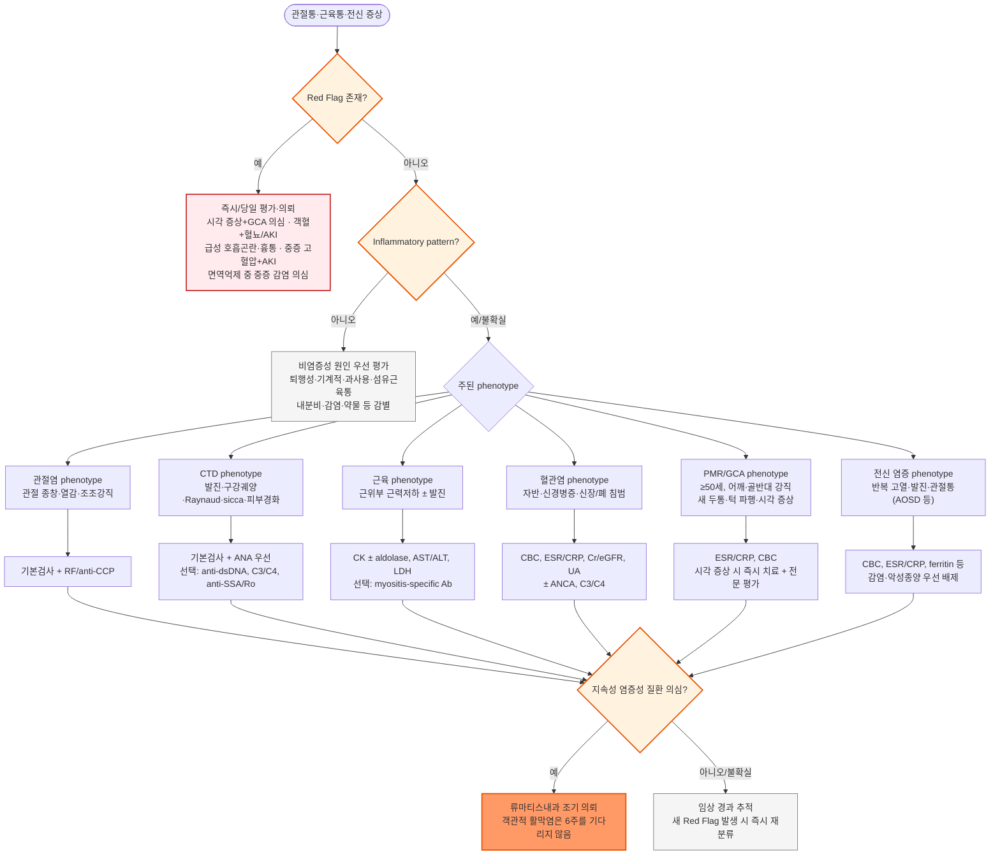

# 류마티스 질환 Rheumatic Diseases

## <mark style="color:green;">일반 사항</mark>

* 류마티스 질환은 관절·근육·결합조직 및 혈관 등을 침범하는 다양한 염증성·자가면역성 질환군으로, 피부·폐·신장·신경계 등 여러 장기에 전신 증상이 나타날 수 있음
* 주요 범주 : 염증성 관절염(류마티스관절염, 척추관절염 등), 전신 결합조직질환(SLE, Sjögren disease, systemic sclerosis, inflammatory myopathy 등), 혈관염, 자가염증질환 등
  * 이 챕터는 위와 같은 면역매개 염증성 류마티스 질환을 중심으로 다루며, 골관절염·결정유발관절염 등 다른 근골격계·관절질환은 별도 챕터에서 다룸
* 흔한 증상 : 관절통·관절 부종, 조조강직, 피로, 발열, 발진, 근력저하, Raynaud 현상, 안구·구강 건조 등
* 한 환자에서 둘 이상의 결합조직질환 특징이 함께 나타날 수 있음(overlap syndrome)
* 류마티스 질환 전체를 확진하는 단일 검사는 없으며, 임상 양상과 혈액검사·자가항체·영상검사 및 필요 시 조직검사를 종합하여 진단
* 자가항체는 건강인이나 다른 질환에서도 양성일 수 있으므로 **검사 결과 자체가 아니라 임상적 사전확률(pretest probability)에 따라 해석**
* 감염, 악성 종양, 내분비·대사 질환, 퇴행성·기계적 근골격계 질환, 약물, 만성 통증질환 등이 류마티스 질환과 유사하게 나타날 수 있음
* 류마티스관절염의 진단·치료는 별도 챕터 참조 (☞ [류마티스관절염](151_-rheumatoid-arthritis.md))

***

### <mark style="color:$danger;">🚩 Red Flags!</mark>

<mark style="color:$danger;">**즉각 조치 또는 의뢰**</mark>

* 새로 발생한 시력저하·복시 또는 일과성 시각증상 + 새로운 두통·두피 압통·턱 파행(특히 ≥50세) → **거대세포동맥염(GCA) 의심**, 비가역적 시력소실 위험
* 급성 호흡곤란·저산소증·객혈 + 혈뇨·단백뇨 또는 급성 신기능 악화 → **pulmonary-renal syndrome / ANCA-associated vasculitis 등 의심**
* 알려진 또는 의심되는 전신 자가면역질환에서 경련·의식 변화·급성 신기능 악화·심한 흉통/호흡곤란 → 중추신경계, 신장, 심장·폐의 장기 위협 침범 평가
* Systemic sclerosis 의심/진단 환자에서 갑작스러운 중증 고혈압 + 두통·시야 이상·급성 신기능 악화 → **scleroderma renal crisis 의심**
* 면역억제제·고용량 steroid·생물학적 제제 치료 중 고열, 저혈압, 의식 변화, 호흡곤란 등 → **중증 감염/sepsis 우선 배제**
* 갑자기 심하게 붓고 뜨거운 단일 관절 ± 발열·오한 → **화농성 관절염 우선 배제**, 필요 시 즉시 관절천자 및 응급 평가
* 전신적으로 빠르게 진행하는 자반/출혈성 발진 + 발열·전신 상태 불량 → 수막알균혈증 등 중증 감염 또는 전신 혈관염 감별
* 잠에서 깰 정도의 지속적 심한 골·관절통 + 혈소판 감소, 백혈구 감소 또는 현저한 증가 → 혈액·종양 질환 감별

<mark style="color:$warning;">**당일 또는 조기 의뢰**</mark>

* 객관적인 관절 종창/활막염이 지속되고 염증성 관절염이 의심되는 경우 → **6주를 기다리지 말고 조기 류마티스내과 의뢰**
* 광과민 발진·뺨 발진, 반복 구강궤양, Raynaud 현상 + 피부경화, Gottron papule, 객관적 근위부 근력저하 등 특징적 전신 소견
* 설명되지 않는 cytopenia, 지속적 단백뇨/혈뇨, 반복 장막염 등 전신 자가면역질환의 장기 침범 의심
* ≥50세에서 양측 어깨/골반대 통증과 현저한 조조강직 → polymyalgia rheumatica(PMR) 고려; 두통·턱 파행·시각증상이 있으면 즉시 GCA 경로로 격상
* 반복 혈전 또는 특징적인 임신 합병증 병력 + antiphospholipid syndrome(APS) 의심
* 반복 구강궤양 + 생식기 궤양·안구염·혈관 또는 신경계 증상 → Behçet disease 의심
* 소아에서 지속되는 객관적 관절염, 근력저하 + 특징적 발진, 원인불명 지속 발열 등 → JIA/JDM/자가염증질환 감별을 위해 소아청소년과·소아류마티스 전문 평가

<mark style="color:$info;">**외래 추적 / 추가 평가 계획**</mark> <mark style="color:$info;">- 즉각 위험 낮으나 지속·진행 시 의뢰</mark>

* ANA 등 자가항체가 우연히 양성이지만 관련 임상 증상·징후가 없는 경우 → 무분별한 추가 자가항체 panel보다 임상적 추적 및 필요 시 선택적 재평가
* 섬유근육통 등 nociplastic pain syndrome이 의심되고 객관적 염증 소견이 없는 경우 → 해당 질환 평가·관리 (☞ [섬유근육통](153_-fibromyalgia.md))
* 갑상선 질환, patellofemoral pain syndrome, 퇴행성·과사용 질환 등 류마티스 유사 질환이 의심되는 경우 → 해당 원인 평가 우선

***

## <mark style="color:green;">진단</mark>

### <mark style="color:orange;">일차진료 접근</mark>

* **Inflammatory pattern** : 객관적 관절 종창·열감, 장시간의 조조강직 또는 휴식 후 강직, 전신 염증 증상 동반 → 염증성 관절염·결합조직질환 우선 고려
* **Mechanical/non-inflammatory pattern** : 사용 시 악화, 휴식 시 호전, 국소 압통이나 특정 동작에서 통증, 객관적 염증 소견 없음 → 퇴행성·과사용·연부조직 질환 고려
* 관절 증상은 monoarthritis / oligoarthritis / polyarthritis, 급성 / 만성, 대칭 / 비대칭, 소관절 / 대관절 분포를 함께 평가
* 관절 외 증상(피부·점막, 눈·입 건조, Raynaud 현상, 근력저하, 폐·신장·신경계 증상, 혈전·임신력)이 진단 방향을 결정하는 중요한 단서
* 급성 단관절염에서는 자가면역질환보다 **감염과 결정유발관절염을 우선 배제**

### <mark style="color:orange;">증상·징후 기반 초고속 감별</mark>

<table><thead><tr><th width="190">임상 단서</th><th width="220">우선 고려</th><th>확인할 추가 소견 / 주요 감별</th></tr></thead><tbody><tr><td>대칭적 소관절 종창 + 조조강직</td><td>류마티스관절염(RA)</td><td>RF, anti-CCP; 감염후 관절염, PsA 등 감별 (☞ <a href="151_-rheumatoid-arthritis.md">류마티스관절염</a>)</td></tr><tr><td>광과민 발진·뺨 발진 + 구강궤양 ± cytopenia·단백뇨</td><td>전신홍반루푸스(SLE)</td><td>ANA, anti-dsDNA, C3/C4, CBC, Cr, UA/단백뇨 평가</td></tr><tr><td>안구·구강 건조 ± 이하선 종창·관절통</td><td>Sjögren disease</td><td>객관적 건조 평가, anti-SSA/Ro 등; 약물·갑상선질환·탈수 감별</td></tr><tr><td>Raynaud 현상 + 손가락 부종·피부경화·digital ulcer</td><td>Systemic sclerosis</td><td>폐·심장·신장·위장관 침범 확인; 갑작스러운 고혈압/AKI는 응급</td></tr><tr><td>객관적 근위부 근력저하 ± Gottron papule/heliotrope rash</td><td>Inflammatory myopathy / dermatomyositis</td><td>CK, AST/ALT, LDH 등; 약물·갑상선·신경근육질환 감별</td></tr><tr><td>Palpable purpura ± 혈뇨·신기능저하·폐/신경 증상</td><td>전신 혈관염, IgA vasculitis 등</td><td>CBC, Cr, UA, 염증표지자; 임상 phenotype에 따라 ANCA 등 선택</td></tr><tr><td>새로운 두통 + 턱 파행·두피 압통 ± 시각증상, ≥50세</td><td>거대세포동맥염(GCA)</td><td>ESR/CRP; 시각증상은 즉시 응급 평가</td></tr><tr><td>양측 어깨/골반대 통증 + 현저한 조조강직, ≥50세</td><td>Polymyalgia rheumatica(PMR)</td><td>ESR/CRP; GCA 동반 증상 반드시 확인</td></tr><tr><td>반복 혈전 또는 특징적 임신 합병증</td><td>Antiphospholipid syndrome(APS)</td><td>임상 기준 + 지속적인 antiphospholipid antibodies 평가</td></tr><tr><td>반복 구강궤양 + 생식기 궤양 ± 안구염</td><td>Behçet disease</td><td>피부·혈관·신경·위장관 침범 확인; HSV 등 감별</td></tr><tr><td>고열(spiking fever) + 관절통/관절염 + 일과성 연어색 발진 ± 현저한 ferritin 상승</td><td>성인스틸병(Adult-onset Still disease, AOSD)</td><td>감염·혈액종양 우선 배제; ferritin은 보조 소견으로 단독 진단 기준으로 사용하지 않음</td></tr><tr><td>수면 장애·광범위 통증·피로, 객관적 염증 소견 없음</td><td>Pain syndrome(예: 섬유근육통)</td><td>염증성 질환·내분비질환 등 배제 후 임상 진단</td></tr></tbody></table>

_✽원인불명의 다장기 종대·종괴성 병변(췌장, 침샘·눈물샘, 후복막, 신장 등)이 있으면 IgG4-related disease도 감별에 포함할 수 있음; 혈청 IgG4 상승은 보조 소견으로 정상일 수 있어 단독으로 배제하지 않음_

### <mark style="color:orange;">류마티스 유사 질환 감별</mark>

* 피부 건조, 탈모, 피로, 성장 장애, 추위 불내성 → 갑상선 질환 (☞ [갑상선저하증](../226_/105_-hypothyroidism.md), [항진증](../226_/106_-hyperthyroidism.md))
* 잠에서 깰 정도의 지속적 심한 통증, Plt↓, WBC↓ 또는 현저한↑ → 혈액·종양 질환
* 계단 오르기·쪼그려 앉기 등으로 악화되는 전방 무릎 통증 → patellofemoral pain syndrome
* 바이러스 감염 전후 발생한 급성 다발관절통/관절염 → viral arthritis 고려
* 선행 group A streptococcal infection 후 발열과 **이동성 대관절염(migratory polyarthritis)** ± 심염 등 → 급성 류마티스열 고려
* 야외 활동·진드기 노출력 + 발열·근육통·관절통 ± 발진, 혈소판/백혈구 감소 → 쯔쯔가무시병, SFTS 등 국내 진드기 매개 감염병 고려
* 심한 피로가 만성적으로 지속되면서 객관적 염증성 질환 근거가 부족한 경우 → [만성피로증후군](../230_/194_.md), [섬유근육통](153_-fibromyalgia.md) 등 감별

### <mark style="color:orange;">소아에서 놓치지 말아야 할 류마티스/유사 질환</mark>

<table><thead><tr><th width="180">단서</th><th width="210">우선 고려</th><th>주의 사항</th></tr></thead><tbody><tr><td>지속되는 객관적 관절염</td><td>JIA</td><td>감염·외상·악성 종양 등을 배제하면서 조기 전문 평가; 특정 기간을 기다렸다가 의뢰하지 않음</td></tr><tr><td>근위부 근력저하 + Gottron papule/heliotrope rash</td><td>Juvenile dermatomyositis(JDM)</td><td>CK 등 근육효소, 연하·호흡근 침범 평가</td></tr><tr><td>하지 중심 palpable purpura + 복통·관절통 ± 신장소견</td><td>IgA vasculitis(IgAV; 구 HSP)</td><td>혈압, UA 및 신장 침범 추적</td></tr><tr><td>고열 지속(≥5일) + 결막충혈·구강 변화·발진 등</td><td>가와사키병</td><td>관상동맥 합병증 예방을 위해 신속한 소아 평가</td></tr><tr><td>심한 야간 골·관절통 + 혈구수 이상·전신 증상</td><td>백혈병 등 악성 종양</td><td>류마티스 질환으로 오인하지 않도록 CBC/말초혈액 등 신속 평가</td></tr><tr><td>주기적 발열 + 아프타성 구내염·인두염·경부 림프절염</td><td>PFAPA syndrome</td><td>감염 및 다른 주기성 발열질환과 감별</td></tr></tbody></table>

_JDM=juvenile dermatomyositis; JIA=juvenile idiopathic arthritis; PFAPA=periodic fever, aphthous stomatitis, pharyngitis and adenitis_

### <mark style="color:orange;">실험실 검사</mark>

#### <mark style="color:$primary;">기본 검사</mark>

* **CBC** : 빈혈, leukopenia/lymphopenia, thrombocytopenia, 감염·악성 종양 단서 및 치료 전 baseline 확인
* **ESR, CRP** : 전신 염증의 보조 지표. 정상이라고 류마티스 질환을 배제할 수 없으며 질환별 disease activity와의 상관성이 다름
  * 특히 SLE에서는 CRP가 순수 disease flare와 반드시 비례하지 않으며, 현저한 상승 시 감염이나 장막염 등 동반 상황도 고려
* **Cr/eGFR, AST/ALT** : 장기 침범 및 향후 약물치료 baseline 평가
* **Urinalysis ± urine protein quantification** : 혈뇨·단백뇨·원주 등 신장 침범 선별에 중요

#### <mark style="color:$primary;">임상적으로 의심되는 질환에 따라 선택</mark>

<table><thead><tr><th width="210">임상 상황</th><th width="230">주요 선택 검사</th><th>해석 원칙</th></tr></thead><tbody><tr><td>SLE/결합조직질환 의심</td><td>ANA</td><td>임상적 의심이 있을 때 우선 검사; 양성만으로 질환을 진단하지 않음</td></tr><tr><td>ANA 양성 + SLE 임상소견</td><td>anti-dsDNA, anti-Sm, C3/C4</td><td>임상소견·소변검사·장기 침범과 함께 해석</td></tr><tr><td>염증성 다발관절염/RA 의심</td><td>RF, anti-CCP</td><td>음성도 초기 RA를 배제하지 않음; 상세 해석은 RA 챕터 참조</td></tr><tr><td>Sicca/특정 CTD 의심</td><td>anti-SSA/Ro ± 관련 항체</td><td>자가항체만으로 Sjögren disease를 확진하지 않음</td></tr><tr><td>근위부 근력저하/근염 의심</td><td>CK ± myositis-specific/associated antibodies</td><td>우선 객관적 근력과 근육효소 평가; 항체 panel은 선택적으로 시행</td></tr><tr><td>전신 혈관염 phenotype</td><td>ANCA</td><td>무증상 screening이 아니라 compatible clinical phenotype에서 시행</td></tr><tr><td>반복 혈전/특징적 임신 합병증</td><td>lupus anticoagulant, anticardiolipin Ab, anti-β2GPI Ab</td><td>APS 진단에는 임상 소견과 항체의 지속성 확인이 필요</td></tr></tbody></table>


**일차진료에서 흔한 함정**

* 자가항체 panel을 증상 없이 일괄 screening하지 않는다 — ANA, RF 등은 건강인·감염·다른 질환에서도 양성일 수 있으므로(예: ANA 양성만으로 SLE를 진단하지 않음) 임상 phenotype에 맞추어 선택하고 결과를 해석한다
* 정상 ESR/CRP가 류마티스 질환을 배제하지 않는다
* Classification criteria(분류기준)는 연구·분류 목적으로 검증된 것으로 개별 환자의 진단기준과 동일하지 않다 (예: 2023 ACR/EULAR APS classification criteria, 2022 ACR/EULAR GCA classification criteria)
* 객관적인 활막염이 확인되면 6주가 될 때까지 기다리지 말고 조기 의뢰한다
* 원인이 불명확한 발열이나 급성 단관절염에서는 감염을 충분히 배제하기 전에 glucocorticoid부터 투여하지 않는다
* GCA가 의심되면서 시각 증상이 있으면 검사 결과나 전원을 기다리며 치료를 지연하지 않는다 (☞ Management의 즉시 고용량 glucocorticoid 시작 원칙 참조)


***

<strong>류마티스 질환 일차진료 Triage 알고리듬</strong>

<em><mark style="color:$info;">확진이 아닌 진입 경로(phenotype) 결정을 위한 알고리듬이며, 세부 질환 감별은 위 증상·징후 기반 표를 참고</mark></em>

***

## <mark style="background-color:$warning;">Management</mark>

### <mark style="color:orange;">치료 방침</mark>

* 류마티스 질환의 치료는 **질환 종류, disease activity, 장기 침범 여부와 중증도**에 따라 크게 다름
* 일차진료의 핵심은 장기 위협·감염을 신속히 구분하고, 지속성 염증성 질환이 의심되면 조기에 류마티스 전문의와 협진하는 것
* 원인 질환이 확정되지 않은 상태에서 일률적으로 DMARD나 면역억제제를 시작하지 않음
* 급성 단관절염이나 원인불명 발열에서 **감염이 충분히 배제되지 않은 상태의 경험적 steroid 투여는 화농성 관절염·감염을 가릴 수 있으므로 주의**
* NSAID는 일부 염증성 관절·근골격계 증상의 단기 완화에 사용할 수 있으나 disease-modifying effect는 없으며 원인 질환의 평가·치료를 지연시켜서는 안 됨; 고령·심혈관질환 기저 환자에서는 심혈관 위험 증가 가능성을 고려해 최소 유효 용량·최단 기간 사용 (☞ [진통제](../220_/001_-pain.md#nsaid))

### <mark style="color:orange;">질환조절 및 면역억제 치료의 원칙</mark>

#### <mark style="color:$primary;">DMARD / 면역조절 치료</mark>

* csDMARD, bDMARD, tsDMARD 및 기타 면역억제제는 **질환별 적응증과 장기 침범에 따라 선택**
* RA에서는 조기 DMARD 치료가 중요하며 상세 내용은 별도 챕터 참조 (☞ [류마티스관절염](151_-rheumatoid-arthritis.md))
* SLE, systemic vasculitis, inflammatory myopathy, systemic sclerosis 등에서는 치료 목표와 약제 선택이 서로 다르므로 전문의 협진 하에 시행
* 치료 전후 감염 위험, CBC/LFT/신기능 등 약제별 모니터링, 잠복결핵·B형간염 등 필요한 감염 screening을 고려

#### <mark style="color:$primary;">Glucocorticoid</mark>

* 적응증과 용량은 질환과 장기 침범 중증도에 따라 크게 다름
  * PMR 등에서는 비교적 저용량 경구 치료가 사용될 수 있음
  * 장기 위협 SLE, ANCA-associated vasculitis, 중증 inflammatory myopathy 등에서는 고용량 치료가 필요할 수 있음
  * 일부 생명·장기 위협 상황에서는 IV pulse therapy가 고려됨
* 총론에서 하나의 mg/kg 용량을 모든 류마티스 질환에 적용하지 않으며, **질환별 권고와 전문의 판단에 따라 용량·감량 계획을 결정**
* 가능한 최소 유효 용량과 기간을 사용하고 장기 투여 시 당뇨, 고혈압, 감염, 백내장/녹내장, 부신억제 등 합병증을 예방·모니터링
* 장기간 사용한 steroid는 임의로 갑자기 중단하지 않음
* GCA가 의심되고 일과성 흑암시, 복시, 시력저하 등 cranial ischemic/시각 증상이 있으면 검사·생검 결과를 기다리며 치료를 지연하지 않음. 시력소실 위험이 있는 경우 IV methylprednisolone pulse를 우선 고려하고 즉시 안과·류마티스 전문 평가를 시행하며, 시각 허혈 증상이 없는 GCA에서는 high-dose oral glucocorticoid가 일반적인 초기 치료

#### <mark style="color:$primary;">Glucocorticoid-induced osteoporosis(GIOP) 예방</mark>

* 장기간 glucocorticoid(대략 prednisolone equivalent ≥2.5 ㎎/day를 ≥3개월) 사용이 예상되거나 지속되는 성인에서는 초기 골절 위험을 평가
* calcium/vitamin D 섭취, 체중부하 운동, 금연 등 기본 예방을 시행
* 골절 위험이 높은 환자에서는 bisphosphonate 등 골다공증 약물치료를 고려 (ACR GIOP guideline)

#### <mark style="color:$primary;">Pneumocystis jirovecii pneumonia(PJP) 예방</mark>

* 중등도–고용량 glucocorticoid를 수 주 이상 사용하는 경우, 특히 다른 면역억제제 병용·림프구감소·고령·기저 폐질환 등 추가 위험인자가 있으면 PJP 예방(TMP-SMX 등)을 고려
  * 대략 prednisolone equivalent >15\~30 ㎎/day를 >2\~4주 사용하는 환자에서 PJP prophylaxis가 유익할 수 있다는 근거가 있으며(EULAR 2022), 절대적인 시작 cutoff가 아니라 개별 위험도 판단의 참고 범위로 활용
  * 위 범위보다 낮은 용량이라도 고령, 병용 면역억제제, 기저 폐질환 등 위험인자가 여러 개 겹치면 예방을 고려할 수 있음

#### <mark style="color:$primary;">예방접종</mark>

* 면역억제 치료 전 가능한 예방접종 상태를 확인하고, 불활성화 백신은 질환 상태와 치료약제에 따라 적절한 시기에 시행
* **생백신은 면역억제 치료 중 일반적으로 피하며**, 불가피한 경우 약제 종류·용량·투여 간격과 질환 활성도에 따라 중단 시기가 다르므로 전문의와 접종 계획을 조정
* 모든 DMARD에 동일하게 “접종 2주 전~6주 후 중단”하는 식의 획일적 규칙을 적용하지 않음

#### <mark style="color:$primary;">임신 계획</mark>

* 가임기 환자는 임신 전 반드시 항류마티스 약물을 검토
* methotrexate, mycophenolate 등 임신 중 금기/부적합 약물은 계획임신 전에 중단·전환; hydroxychloroquine 등 임신 중 유지가 권장되는 약물은 임의로 중단하지 않음
* SLE, APS 등 임신 합병증 위험이 높은 질환은 임신 전 류마티스내과·산부인과 협진을 권장

***

### <mark style="color:red;">질병코드</mark>

M05 혈청반응 양성 류마티스 관절염

M06 기타 류마티스 관절염

M08 소아기 특발성 관절염

M32 전신 홍반 루푸스

M33 피부다발근육염

M34 전신 경화증(Systemic sclerosis)

M35.0 건조증후군[Sjögren]

M35.2 베체트병

M35.3 류마티스성 다발근육통

M30-M31 결절다발동맥염 및 관련 병태(혈관염)

M31.5 거대세포동맥염을 동반한 류마티스성 다발근통

M31.6 기타 거대세포동맥염

D69.0 알레르기성 자반증(Henoch-Schönlein purpura; 임상적으로 IgA vasculitis)

***

### <mark style="color:$success;">핵심 복약 지도</mark>

> **면역조절제·DMARD 복용 시 안전 관리**
>
> * 처방된 면역조절제는 임의로 중단하거나 용량을 변경하지 않도록 안내
> * methotrexate를 복용하는 환자에서는 **주 1회 복용**임을 반드시 확인하고, 복용 요일을 정해 매일 복용하는 투약 오류를 예방
> * 약제에 따라 CBC, LFT, 신기능 등의 정기 모니터링이 필요하므로 검사 일정을 지키도록 안내
> * 새로운 약·건강기능식품을 시작하거나 수술·시술·예방접종 예정이 있으면 담당 의료진과 상의

> **NSAID·Steroid 복용 시 주의사항**
>
> * NSAID 복용 중 심한 복통, 흑색변·토혈, 부종·소변 감소 등 부작용이 의심되면 진료
> * Steroid는 임의로 갑자기 중단하지 말고 의사의 감량 계획에 따름
> * 장기간 steroid 사용 시 골다공증·고혈당·고혈압·감염 위험 등에 대한 예방과 모니터링 필요

> **면역억제 치료 중 감염 경고**
>
> * 면역억제제·생물학적 제제·고용량 steroid 치료 중에는 감염 위험이 증가할 수 있음
> * 발열, 오한, 지속적인 기침·호흡곤란, 배뇨통, 피부 감염 등 새로운 감염 징후가 나타나면 조기에 의료진에게 알림
> * 중증 감염이 의심되면 단순한 류마티스 질환 flare로 판단하지 말고 신속히 평가

> **즉시 평가가 필요한 증상**
>
> * 갑작스러운 시력저하·복시 또는 심한 새로운 두통
> * 객혈·심한 호흡곤란, 흉통
> * 소변량 감소·혈뇨와 함께 전신 상태가 급격히 악화되는 경우
> * 관절 하나가 갑자기 매우 붓고 뜨거우며 움직이기 어려운 경우
> * 고열·저혈압·의식 변화 등 중증 감염이 의심되는 경우

***

### <mark style="color:blue;">환자 안내서</mark>


**류마티스 질환은 관절뿐 아니라 여러 장기에 영향을 줄 수 있습니다**

류마티스 질환은 면역계 이상과 염증으로 관절·근육·피부·혈관뿐 아니라 폐, 신장, 눈, 신경계 등 여러 장기에 문제가 생길 수 있는 다양한 질환군입니다. 질환에 따라 증상과 치료법이 다르며, 조기에 정확한 진단을 받고 필요한 경우 꾸준히 추적 관찰하는 것이 중요합니다.


#### <mark style="color:$primary;">어떤 증상이 나타날 수 있나요?</mark>

* 관절이 붓고 아프거나 아침에 오래 뻣뻣할 수 있습니다.
* 피부 발진, 반복되는 입안 궤양, 손가락이 추울 때 하얗거나 파랗게 변하는 현상, 눈·입의 심한 건조, 근력저하 등이 나타날 수 있습니다.
* 일부 질환은 폐·신장·혈관 등 내부 장기를 침범할 수 있으므로 관절 증상만으로 판단하지 않습니다.

#### <mark style="color:$primary;">검사에서 자가항체가 양성이면 류마티스 질환인가요?</mark>

* 아닙니다. ANA, RF 같은 자가항체는 류마티스 질환이 없는 사람에서도 양성으로 나올 수 있습니다.
* 검사 결과는 증상, 진찰 소견, 다른 혈액·소변검사와 함께 해석해야 합니다.
* 증상이 없는데 여러 자가항체 검사를 반복하는 것은 도움이 되지 않을 수 있습니다.

#### <mark style="color:$primary;">약은 어떻게 써야 하나요?</mark>

* 류마티스 질환마다 사용하는 약과 용량이 다르므로 처방된 약을 임의로 중단하거나 다른 사람의 약을 복용하지 마십시오.
* 특히 steroid를 장기간 복용한 경우 갑자기 끊으면 위험할 수 있으므로 반드시 의료진의 감량 계획을 따르십시오.
* 면역을 억제하는 약을 사용하는 동안에는 감염에 더 취약할 수 있으므로 발열이나 몸 상태 변화가 생기면 의료진에게 알려 주십시오.
* 예방접종이 필요한 경우 현재 복용하는 면역억제제에 따라 접종 시기를 조정할 수 있으므로 미리 상의하십시오.

#### <mark style="color:$primary;">일상생활에서 어떻게 관리하나요?</mark>

* 질환 상태에 맞게 규칙적으로 움직이고 근력과 관절 기능을 유지하십시오.
* 흡연은 일부 류마티스 질환과 심혈관·폐 합병증 위험을 높일 수 있으므로 금연하십시오.
* 충분한 수면과 균형 잡힌 식사를 유지하고, 처방약과 정기 검사 일정을 지키십시오.
* 손 씻기 등 기본 감염 예방수칙을 지키고 필요한 예방접종은 의료진과 상의하십시오.

#### <mark style="color:$primary;">이럴 때는 즉시 병원을 방문하세요</mark>

* 갑자기 시력이 떨어지거나 새로운 심한 두통이 발생한 경우
* 숨이 매우 차거나 객혈·심한 흉통이 생긴 경우
* 관절 하나가 갑자기 매우 붓고 뜨거우며 움직이기 어려운 경우
* 혈뇨·소변량 감소, 심한 부종과 함께 몸 상태가 급격히 나빠지는 경우
* 면역억제 치료 중 고열·오한·의식 변화 등 심한 감염이 의심되는 경우
* 자반이나 피부 발진이 빠르게 넓어지면서 발열·전신 상태 불량이 동반되는 경우
