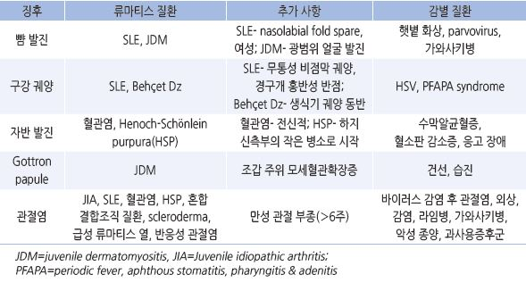

# 류마티스 질환 Rheumatoid Disease


## 일반 사항

* 자가면역 체계의 이상으로 자신의 면역 세포가 자신의 조직을 침범하여 발생하는 전신적 만성 염증성 자가면역 질환
* 흔한 증상 : 관절통, 발열, 피로, 발진
* 시간이 지남에 따라 때때로 복수의 류마티스 질환 양상을 보임(Overlap syndrome)
* 진단 도구 : 진찰, 자가면역 표지자, 혈청 검사, 조직 검사, 영상 검사
* 확진 방법은 없음; 다른 질환을 배제한 후 류마티스 질환이 의심되는 경우 의뢰 고려
* 류마티스 질환이 없는 경우에도 검사에서 양성으로 나타날 수 있음
* 류마티스 유사 질환 : 감염, 악성 종양, 대사 질환, 골격 질환, 만성 통증

## 동반 증상 또는 관절통 발생에 따른 감별

* 수면 장애, 일상 활동으로 악화되는 관절통, 신체/실험실 검사상 정상 소견 → Pain syndrome(예; 섬유근육통)
* 피부 건조, 탈모, 피로, 성장 장애, 추위 못 견딤 → 갑상선 질환 (☞ p.578, 583)
* 잠에서 깰 정도의 심한 통증, Plt↓, WBC↓or 심한↑ → 혈액 종양(예: ALL), Neuroblastoma
* 사춘기 여성, 계단 오름으로 악화되는 무릎 통증 → Patellofemoral pain syndrome (☞ p.786)
* 관절통을 일으키는 열성 질환, 체온 정상화와 함께 호전 → 급성 류마티스열
*   직장을 못 갈 정도의 심한 피로감, 만성 경과 → 만성피로증후군(☞ p.1031), 섬유근육통(☞ p.834)

    

## 실험실 검사

* 류마티스 질환에 대한 특이 검사는 없음
* 1차 의료기관에서는 선별 검사(specific autoantibody) 시행, 추가 검사는 의뢰
* ESR, CRP : 질병의 활동성과 관련
* CBC : 만성 질환 상태, 빈혈, 질병 활동성, 치료 부작용 관련
* antinuclear antibody(ANA) : 민감도와 특이도가 낮아 선별 검사로는 권하지 않음

#### RA 검사 항체들의 정확도

```

```

***

## Management

### 치료 방침

* 조기 치료가 중요. 발생 6개월 이내 적절한 치료를 하는 것이 예후에 큰 차이를 보임
* 1차 진료 주치의 및 류마티스 전문의를 포함한 협력 치료가 필요
* 조기 DMARD 투여 고려
* 항염제(NSAID)

## 치료 약물

### DMARD (Disease-modifying antirheumatic drug)

```
(☞ p.820)
```

* 질병의 경과를 변화시킴
* 류마티스 전문의와의 협력 하에 투여
* 생백신 접종 때는 접종 2주 전\~6주 후 동안 투여 중단 (✽중단 필요에 대한 증거는 없음)
* methotrexate, leflunomide, hydroxychloroquine, sulfasalazine

### NSAID

* 항염, 진통 작용; 질병의 경과를 변화시키지는 못함
* COX-1 및 COX-2 억제제의 효과 및 불내성 차이는 없음
*   관절염 반응 정도는 개인차가 있으므로 여러 종류의 약제로 치료를 시도함; JIA(Juvenile idiopathic arthritis) 환자의

    40\~60%에서 완화
* 규칙적으로 투여; JIA의 경우 평균 4\~6주 투여
* 투여 횟수가 적은 것이 순응도가 좋음
*   부작용 : 위장관 장애(예: 복통, 구역, 위염), 간염, 흥분, 집중력 장애, 이명, 빈혈, 가성포르피린증(naproxen),

    무균성 뇌막염(ibuprofen), 두통, 신질환
* 독성에 대한 모니터링 : CBC, Cr, LFT, UA; 매 6\~12개월
* ibuprofen : 40 ㎎/㎏/d #3, 최대 2400 ㎎/d \[부루펜]
* naproxen : 15 ㎎/㎏/d #2, 최대 1,000 ㎎/d \[낙센]
* celecoxib : 100 ㎎ bid \[쎄레브렉스]

### Steroid

* 부작용 : 쿠싱증후군, 골다공증, 체중 증가, striae, 고혈압, 고혈당, 감염, 무혈성 괴사, HPA axis 억제
* prednisolone : 0.5~~2 ㎎/㎏/d PO #1~~4, 최대 80 ㎎/d \[소론도]
* methylprednisolone : 0.5~~1.7 ㎎/㎏/d IM/IV #2~~4 최대 1 g/d(5일 이내) \[메치론]

### 기타

*   Tumor necrosis factor-α(TNF-α) antagonist : adalimumab \[휴미라 주], certolizumab \[퍼스티맙 주], etanercept \[엔브렐 주],

    golimumab \[심퍼니 주],infliximab \[램시마 주]
* T-cell costimulatory inhibitor : abatacept \[오렌시아 주]
* anti-CD20 (B-cell) antibody : rituximab \[트룩시마 주]
* anti-BLyS antibody : belimumab \[벤리스타 주]
* Interleukin-1 antagonist : anakinra \[키너렛 주], canakinumab \[일라리스 주]
* Interleukin-6 antagonist : sarilumab, tocilizumab \[악템라 주]
* Cytotoxic : cyclophosphamide \[알키록산]
* Immunosuppressive : mycophenolate mofetil \[마이렙트]
