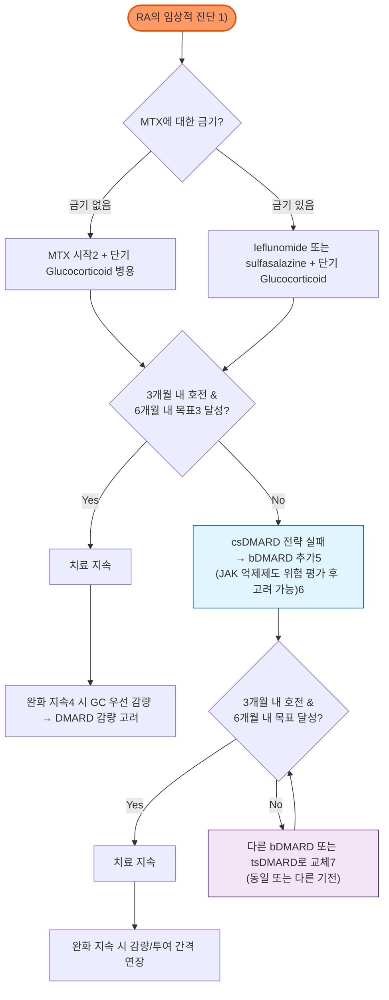

# 류마티스 관절염 Rheumatoid Arthritis (RA)

## <mark style="color:green;">일반 사항</mark>

* 자신의 관절 조직을 공격하는 항체를 생성하는 자가면역 질환에 의한 만성, 염증성, 대칭적, 다발성 관절염
* 급성 경과를 보이기도 하지만 보통 비특이적인 관절통 또는 강직으로 시작하여 서서히 진행
* 호발 : 30\~40대 여성(남성의 약 3배), 40\~70대 남성
* 유병률 : 성인의 약 0.5\~1%(국내 약 0.5% 내외로 추정); 여성이 남성보다 2\~3배 흔함
* 관절 및 연조직이 파괴되어 관절의 만성적이고 비가역적인 장애 발생; 조기 사망률 증가와 관련
* 질병 초기(특히 발병 후 3\~6개월, "window of opportunity")에 적극적인 치료를 시작할수록 관해 도달률과 장기 예후가 우수함

***

## <mark style="color:green;">원인 및 위험 인자</mark>

* 원인 : 유전적 소인이 있는 개체에서 환경 인자에 의해 자가면역 반응이 촉발되는 것으로 추정되나 정확한 기전은 불명
* 관련(위험) 인자 : 유전(HLA-DRB1 "shared epitope"), 흡연, 치주염(Porphyromonas gingivalis 등), 비만, 외상, 여성 호르몬, 낮은 사회경제적 수준

### <mark style="color:orange;">나쁜 예후 인자 (Poor Prognostic Factors)</mark>

* csDMARD 치료에도 지속되는 중등증 이상의 disease activity, 크게 부어오른 관절의 숫자 및 높은 급성기 반응 물질 수치
* RF 그리고/또는 ACPA 양성, 특히 높은 역가
* 조기 골미란(early erosion)
* 2개 이상의 csDMARD 치료 실패


**Difficult-to-treat RA (D2T RA)**\
≥2가지의 서로 다른 기전의 b/tsDMARD를 (csDMARD 병용 포함하여) 충분한 기간·용량으로 사용했음에도 치료 목표에 도달하지 못하고 활성 질환의 징후·증상이 지속되는 경우를 지칭하는 개념. 순수한 염증 활성 외에 섬유근육통 동반, 진단 재확인, 약물 순응도, 관절 손상에 의한 통증 등을 감별해야 함 → 류마티스내과 협진


***

## <mark style="color:green;">임상 양상</mark>

### <mark style="color:orange;">관절 증상</mark>

* 초기에는 비특이적 관절통·강직으로 시작할 수 있으며, 전형적으로 MCP·PIP·손목·MTP 등 작은 관절의 대칭성 활막염으로 진행; 일부에서는 단관절 또는 소수관절 형태로 시작할 수 있음
* 통증, 부종, 압통, 동작 시 통증; 보통 대칭적 분포 (✽부종은 synovial 비대 또는 삼출에 기인함)
* 강직 : 30분 이상 지속되고 신체 활동으로 호전, 특히 조조강직이 심함(OA의 조조강직 &#x3C;30분과 감별점)
* 경추 외의 척추와 sacroiliac joint 이환은 드묾

**작은 관절의 임상 양상**

* 손(MCP, PIP), 손목 → Swan neck 변형, Boutonniere 변형, MCP 관절 척골측 편위, 방아쇠 수지, 수근관증후군
* 발(MTP, talonavicular), 발목 → 발바닥 작열감, 보행 장애
* 진행 시 거의 모든 말초 관절로 이환 확대 가능

**큰 관절의 임상 양상**

* 큰 관절의 가동 범위 감소
* 팔꿈치 : 척골신경 압박증후군(4, 5번째 손가락의 감각 이상, 약화)
* 무릎 : Baker's cyst(파열 시 하지 심부정맥혈전증과 임상적으로 혼동될 수 있음)
* 축성 골격 침범은 드물지만, 오래된 중증 RA에서는 경추 침범이 임상적으로 중요함
* **경추(C1-C2) 아탈구** : 만성·중증 RA에서 발생 가능; 새로운 신경학적 증상(사지 위약, 보행 장애, 배뇨장애) 동반 시 즉시 평가 필요 (☞ 하단 Red Flags)

### <mark style="color:orange;">관절 외 증상</mark>

* 피하 결절 : firm, non-tender; 대부분 뼈의 돌출부 또는 아래팔·엉덩이·아킬레스건 등 반복적인 자극·압력을 받는 부위의 골막, 힘줄, 점액낭에 붙어 있음
* Entrapment syndrome : 특히 손목 터널의 정중 신경
* 전신 증상 : 피로, malaise, 식욕 부진, 체중 감소, 발열, 우울, 불쾌감
  * 고열이 발생한 경우에는 전신 혈관염 또는 감염 의심
* 관련 질환 : 2차성 Sjögren 증후군(건성 각결막염, 입마름), 신장 질환, 심장 질환(심막염, 결절, **동맥경화성 심혈관질환 위험 증가**), **간질성 폐질환(RA-ILD)**·결절·늑막 삼출·늑막염, 비장 비대(Felty 증후군), 말초 신경병증, 혈관염, 만성 질환 빈혈, 림프절병증, 감염 위험 증가, 골다공증
  * ✽RA-ILD는 예후에 큰 영향을 미치는 동반 질환으로, 새로 발생한 마른기침·호흡곤란은 반드시 확인


**RA-ILD 선별 및 모니터링 (2023 ACR/CHEST guideline)**\
고령, 남성, 흡연력, 높은 RA 질병활성도, 고역가 RF/ACPA 등 위험 인자를 가진 RA 환자는 무증상이어도 폐기능검사(PFT: spirometry, lung volume, DLCO) + 흉부 HRCT를 이용한 초기 선별검사를 고려하고, 위험 인자가 지속되는 경우 대략 연 1회 PFT 재선별을 고려한다.\
확진된 RA-ILD는 첫 1년간 3\~12개월 간격으로 PFT를 추적하고 안정화 후 간격을 늘리며, HRCT는 정기 반복 검사가 아니라 증상 악화·PFT 변화 등 임상적으로 필요한 경우에 시행한다.


***

### <mark style="color:$danger;">🚩 Red Flags!</mark>

<mark style="color:$danger;">**즉각 조치 또는 의뢰**</mark> <mark style="color:$danger;">- 생명 위협 또는 즉각적 위해 가능성</mark>

* **발열 유무와 무관하게** 급성 단관절의 심한 통증·부종·열감 또는 현저한 관절운동 제한(특히 관절 내 스테로이드 주사 후, 인공관절, 면역억제제 사용 중) → 화농성 관절염 우선 배제 → 긴급 관절천자 및 적절한 항균 치료
* 새로 발생한 사지 위약감, 보행 장애, 배뇨 장애를 동반한 경부 통증 → 환축추 아탈구에 의한 척수병증 의심 → 응급 영상(경추 MRI) 및 신경외과/정형외과 의뢰
* 흉통·호흡곤란 + 저혈압, 경정맥 확장 → 심낭 삼출/압전 의심
* 급격한 시력 저하 또는 심한 안구통 → 공막염(scleritis), 말초성 궤양성 각막염(peripheral ulcerative keratitis) 의심 → 안과 응급
* 손·발가락의 급성 허혈성 변화(청색증, 궤양, 괴사) → 류마티스 혈관염에 의한 digital ischemia 의심

<mark style="color:$warning;">**당일 또는 조기 의뢰**</mark>

* 발열 + bDMARD/tsDMARD/고용량 스테로이드 등 면역억제제 사용 중 → 기회 감염·패혈증 의심
* 새로 발생한 호흡곤란, 마른기침, 저산소증 → RA-ILD 또는 MTX 폐렴 의심 → 흉부 영상, 류마티스내과/호흡기내과 협진
* 다발성 피하결절 급속 증가, 자반, 다발성 단신경병증(mononeuritis multiplex) 소견 → 전신 혈관염 의심
* 신경학적 결손이 없는 새로운 경부 통증·뻣뻣함 → 경추 불안정성 평가를 위한 영상 검사 필요
* MTX·leflunomide 등 임신 중 사용이 부적절한 약물을 복용 중인 여성 환자에서 임신이 확인된 경우 → 즉시 약물 재평가 및 산과·류마티스내과 상담 (☞ 하단 약물치료 '가임기 여성 및 임신 계획')

<mark style="color:$info;">**외래 추적 / 추가 평가 계획**</mark> <mark style="color:$info;">- 즉각 위험 낮으나 호전 없으면 의뢰</mark>

* 표준 csDMARD 치료 3개월 내 임상적 호전이 없거나 6개월 내 치료 목표(관해 또는 저활동도)에 도달하지 못한 경우
* 적절히 최적화한 csDMARD 전략에도 치료 목표에 도달하지 못한 경우 → bDMARD 추가(JAK 억제제는 위험 평가 후 고려)를 위한 류마티스내과 의뢰
* bDMARD/tsDMARD 시작 전 잠복결핵, B형간염 스크리닝 필요
* 심혈관 위험 인자를 가진 환자에서 JAK 억제제 사용을 고려할 때 위험-이익 재평가 필요

***

## <mark style="color:green;">진단</mark>

<table><thead><tr><th width="213">구분</th><th width="365">항목</th><th>배점</th></tr></thead><tbody><tr><td><strong>A. 관절 이환</strong></td><td>'큰 관절'1) 1개 이환</td><td>0</td></tr><tr><td></td><td>'큰 관절' 2~10개 이환</td><td>1</td></tr><tr><td></td><td>'작은 관절'2) 1~3개 이환 (큰 관절 침범 여부 무관)</td><td>2</td></tr><tr><td></td><td>'작은 관절' 4~10개 이환 (큰 관절 침범 여부 무관)</td><td>3</td></tr><tr><td></td><td>'관절'3) ≥11개 이환 ('작은 관절' 적어도 1개 이환)</td><td>5</td></tr><tr><td><strong>B. 혈청 검사</strong></td><td>RF 음성 &#x26; ACPA 음성</td><td>0</td></tr><tr><td>(적어도 1개 검사 결과 필요)</td><td>'낮은 양성'4) RF 또는 '낮은 양성' ACPA</td><td>2</td></tr><tr><td></td><td>'높은 양성'5) RF 또는 '높은 양성' ACPA</td><td>3</td></tr><tr><td><strong>C. 급성기 반응 물질</strong></td><td>정상 CRP &#x26; 정상 ESR</td><td>0</td></tr><tr><td>(적어도 1개 검사 결과 필요)</td><td>비정상 CRP 또는 비정상 ESR</td><td>1</td></tr><tr><td><strong>D. 증상 지속 기간6)</strong></td><td>&#x3C;6주</td><td>0</td></tr><tr><td></td><td>≥6주</td><td>1</td></tr></tbody></table>

_1) 큰 관절 : shoulder, elbow, hip, knee, ankle_\
_2) 작은 관절 : MCPJ, PIPJ, thumb IPJ, 2nd-5th MTPJ, wrist_\
_3) 턱관절 등 특별히 언급되지 않은 관절들도 해당될 수 있음_\
_4) '낮은 양성' = 정상 상한값의 ≤3배 상승; RF 정성 검사를 한 경우에는 '양성'을 '낮은 양성'으로 취급_\
_5) '높은 양성' = 정상 상한값의 ＞3배_\
_6) 증상 기간은 윤활막염의 소견(통증, 부종, 압통)에 대한 환자의 설명을 참조함_\
_\*관절 이환은 진찰 소견상 관절의 부종 또는 압통으로 판단하며 X선 검사로 윤활막염을 확인할 수도 있음_\
_\*류마티스 결절 또는 방사선학적 관절 손상은 초기 RA에서는 드물기 때문에 기준에서 제외_

* 총점 **≥6점** : RA로 분류(단, 진단 자체는 임상적 판단이 우선이며 이 기준은 주로 임상연구용 분류 기준임)
* ACPA=Anti-citrullinated peptide/protein Ab

_Ref. 2010 ACR/EULAR. Rheumatoid arthritis classification criteria. Arthritis Rheum 2010;62(9):2569-2581._

### <mark style="color:orange;">영상 검사</mark>

* 단순 X선은 초기 RA에서 정상일 수 있어 진단 민감도가 낮지만, 기저 관절 손상·미란 확인 및 추적 비교에 유용
* X선 : 기저 관절 손상 평가 및 추적을 위해 시행; 초기 손, 손목, 발 촬영 고려
  * 초기 : 연조직 swelling, juxta-articular demineralization
  * 진행 : 관절 미란, 관절 간격 감소
* 초음파, MRI : 활막염·건초염 및 초기 골미란 확인에 X선보다 민감; 임상적으로 활막염 여부가 불확실하거나 조기 병변 확인이 필요한 경우 유용하나 모든 환자에서 일상적으로 시행할 필요는 없음

### <mark style="color:orange;">실험실 검사</mark>

* RA가 의심되면 RF, ACPA, ESR/CRP를 기본적으로 평가하며, CBC·Cr/eGFR·LFT 등은 감별진단 및 DMARD 시작 전 기저 검사로 시행
* 혈청음성 RA(RF·ACPA 모두 음성)는 전체 RA 환자의 약 20\~30%를 차지하며, 2010 ACR/EULAR 분류기준상 혈청검사 항목 점수를 얻지 못해 진단이 지연될 수 있음 → 이 경우 관절 초음파·MRI 등 영상 검사와 임상 양상이 진단에 핵심적 역할을 함

#### <mark style="color:$primary;">Anti-citrullinated peptide/protein antibody(ACPA)</mark>

* 양성 질환 : RA를 포함한 자가면역 질환, 활동성 결핵
* 특이도 약 95%, 민감도 약 69%; RF보다 특이도 높음, 조기 진단·예후 예측(나쁜 예후 인자)에 유용

#### <mark style="color:$primary;">Rheumatoid factor(RF)</mark>

* RF 증가 상황 : 만성 감염(아급성 세균성 심내막염, 결핵, 매독), 바이러스 감염(전염성 단핵구증, 거대세포바이러스, 인플루엔자), 기생충 감염, 사르코이드증, 간질성 폐질환, 비감염성 간염, 정상 고령 인구의 일부
* 민감도는 대략 70\~80% 전후이며 초기 RA에서는 더 낮을 수 있음
* 역가와 질병 활성도·진행 정도의 상관관계는 뚜렷하지 않음
* 일단 양성이면 추적을 위한 반복 검사는 필요 없음

#### <mark style="color:$primary;">기타</mark>

* ANA : 20\~30%에서 양성
* ESR, CRP : 비특이적이나 질병 활성도 평가·모니터링에 사용
* Complement(CH50, C3, C4) : SLE 또는 immune-complex disease 등 다른 자가면역질환 감별이 필요한 경우 고려
* Synovial fluid analysis : 염증성 관절액(WBC 상승, 호중구 우세) 확인, 감염·통풍과의 감별
* CBC : 경증 정상구성 정상색소 빈혈, 반응성 혈소판증가증 소견
* 전해질, Cr, LFT, U/A : 동반 질환 및 약물 시작 전 기저치 평가를 위해 시행

#### RA 검사 항체들의 정확도

☞ [류마티스질환](150_-rheumatoid-disease.md#undefined-6)

### <mark style="color:orange;">감별 진단</mark>

* 대칭적 다발관절통·조조강직으로 내원하는 경우 아래 질환들과의 감별이 필요

<table><thead><tr><th width="140">질환</th><th width="260">RA와의 차이점</th><th>핵심 감별 포인트</th></tr></thead><tbody><tr><td>골관절염(OA)</td><td>염증보다 퇴행성 변화가 주 기전</td><td>DIPJ·CMC 관절 호발, 조조강직 &#x3C;30분, 전신 증상 없음, RF/ACPA 음성</td></tr><tr><td>전신홍반루푸스(SLE)</td><td>비미란성 관절염, 다장기 침범</td><td>피부발진, 광과민성, 신장·혈액학적 이상, ANA 고역가, anti-dsDNA</td></tr><tr><td>건선성 관절염</td><td>비대칭성, 축성 침범 흔함</td><td>DIPJ 침범, 손발톱 병변, dactylitis, 건선 피부병변, RF/ACPA 대개 음성</td></tr><tr><td>결정관절병증(통풍, CPPD)</td><td>결정 유발 급성 단관절염 반복</td><td>급성 발적·심한 통증(특히 1st MTP), 관절액 결정 확인, 고요산혈증</td></tr><tr><td>반응성/바이러스성 관절염</td><td>선행 감염 후 자연 호전 경향</td><td>선행 위장관·비뇨생식기 감염 또는 파보바이러스 B19·간염 병력, 자가항체 대개 음성</td></tr><tr><td>다발근육통(PMR)</td><td>관절 자체보다 근위부 통증·강직</td><td>50세 이상, 어깨·골반대 통증, ESR/CRP 현저히 상승, 저용량 스테로이드에 극적 반응</td></tr><tr><td>섬유근육통</td><td>중추성 통증 증후군, 활막염 없음</td><td>압통점, 정상 염증수치·영상, 피로·수면장애 동반</td></tr></tbody></table>

#### <mark style="color:$primary;">RA vs OA 비교</mark>

<table><thead><tr><th width="90">구분</th><th width="260"><strong>RA</strong></th><th>OA</th></tr></thead><tbody><tr><td>기전</td><td>자가면역 질환에 의한 관절의 염증</td><td>관절 연골의 마모/찢어짐</td></tr><tr><td>위험 인자</td><td>유전, 환경, 흡연, 비만</td><td>고령, 반복 동작(직업/운동), 과거 손상, 유전</td></tr><tr><td>초발 관절</td><td>MCPJ, PIPJ</td><td>DIPJ, Carpometacarpal</td></tr><tr><td>관절 증상</td><td>반복성, 대칭성; 손·손가락·팔꿈치·무릎·엉덩이 등 전신 관절 이환 가능</td><td>한 구역, 소수 관절; 체중 부하 또는 반복 사용 관절 위주</td></tr><tr><td>관절 강직</td><td>휴식 후 악화, 부종 동반, 조조강직 &#x3E;30분</td><td>활동 후 악화, 조조강직 &#x3C;30분</td></tr><tr><td>관절 소견</td><td>soft, warm, tender</td><td>hard, bony</td></tr><tr><td>동반 증상</td><td>피로, 발열, 체중 감소, 식욕 감퇴</td><td>전신 증상 없음</td></tr><tr><td>진단</td><td>가족력, RF(+), ACPA(+), ESR/CRP↑, 영상 검사(미란/염증)</td><td>영상 검사(퇴행성 변화, 진행성 손상)</td></tr><tr><td>치료</td><td>질병 조절 면역치료(DMARD) + 대증 치료</td><td>대증 치료, 관절 보호(운동, 체중 관리, NSAID)</td></tr><tr><td>경과</td><td>수 주 내 급격히 악화 가능</td><td>수년에 걸쳐 서서히 악화</td></tr><tr><td>예후</td><td>예측 어려움; 전신 침범 가능</td><td>적절한 치료로 반응 양호</td></tr></tbody></table>

MCP=metacarpophalangeal, PIP=proximal interphalangeal, DIP=distal interphalangeal\
✽압통 및 팽창된 관절이 많을수록, 신체 장애가 심할수록 RA 가능성이 높음

***



1) 2010 ACR-EULAR classification criteria 참조\
2) MTX는 여전히 1차 선택 약제(금기·조기 불내약 시 leflunomide 또는 sulfasalazine)\
3) 치료 목표는 지속적 관해, 또는 최소한 저질병활성도(low disease activity); 3개월 내 개선이 없거나 6개월 내 목표 미달성 시 치료 조정\
4) 관해 지속 : Boolean 또는 index(SDAI 등) 기반 관해가 일정 기간 유지되는 상태\
5) bDMARD는 csDMARD와 병용이 원칙; csDMARD 병용이 어려운 경우 IL-6 경로 억제제·JAK 억제제가 상대적 이점을 가질 수 있음\
6) JAK 억제제는 심혈관·혈전·악성종양 위험 인자를 반드시 확인 후 사용 (☞ 하단 Management의 안전성 경고 참조)\
7) 1개의 TNF 억제제 또는 IL-6R 억제제 실패 시 다른 기전 제제 또는 동일 계열 2차 제제 모두 고려 가능

<p align="center"><strong>RA 관리 알고리듬 (2025년 개정판 반영, 2019년 판 알고리듬 대체)</strong></p>

<p align="center"><em><mark style="color:$info;">Ref. Smolen JS, et al. EULAR recommendations for the management of rheumatoid arthritis with synthetic and biologic DMARDs: 2025 update. Ann Rheum Dis 2026.</mark></em></p>

***

## <mark style="background-color:$warning;">Management</mark>


**Treat-to-target 원칙**\
치료 목표는 모든 환자에서 지속적인 임상적 관해이며, 특히 조기 RA에서 중요함. 이미 1개 이상의 DMARD 치료에 실패한 오래된 병력의 환자에서는 저질병활성도가 대안적 목표가 될 수 있음. 저질병활성도 미만의 상태는 원칙적으로 받아들이지 않음(EULAR 2025 update, Recommendation 2).


### <mark style="color:orange;">치료 방침</mark>

* 진단 즉시 DMARD 치료 시작(EULAR 2025 Recommendation 1) - 빠른 진단, 빠른 활성도 파악, 빠른 염증 관리
* 활동성 질환에서는 1\~3개월 간격으로 자주 모니터링; 늦어도 치료 시작 후 3개월 내 개선이 없거나 6개월 내 목표에 도달하지 못하면 치료 조정, 목표 유지 시에는 모니터링 간격을 늘릴 수 있음
* MTX가 1차 치료 전략의 핵심; MTX 금기 또는 조기 불내약 시 leflunomide 또는 sulfasalazine 고려
* csDMARD 시작·변경 시 단기 Glucocorticoid 병용을 고려할 수 있으나, 가능한 한 신속히 감량·중단
* csDMARD 전략으로 목표에 도달하지 못하면 bDMARD를 추가; JAK 억제제도 심혈관·혈전·악성종양 위험 인자를 신중히 고려한 후 선택지가 될 수 있음
* b/tsDMARD는 csDMARD와 병용이 원칙; csDMARD 병용이 어려운 환자에서는 IL-6 경로 억제제·JAK 억제제가 다소 유리할 수 있음
* 첫 b/tsDMARD 실패 시 다른 기전의 b/tsDMARD 또는 동일 계열의 다른 약제로 교체; TNF 또는 IL-6R 억제제 1회 실패 후에는 다른 기전 제제 또는 동일 계열 2차 제제 모두 선택 가능
* 지속적 관해 상태에서 Glucocorticoid를 우선 중단한 이후에도 관해가 유지되면 DMARD(b/tsDMARD 그리고/또는 csDMARD)는 계속 유지하되 감량을 고려; 완전 중단은 대개 권장되지 않음(재발 흔함)
* 관절 외 질환·동반 질환 관리 : 빈혈, 죽상경화성 심혈관질환, 이상지질혈증, 고혈압, 골다공증, 흡연, 비활동 생활 습관에 대한 적극적 관리 - RA 자체가 심혈관질환의 독립적 위험 인자
* RA-ILD 동반 시 약제 선택 : ACR/CHEST 2023 SARD-ILD 치료 가이드라인은 leflunomide, MTX, TNF 억제제, abatacept를 **RA-ILD 자체의 1차 치료제로는 권장하지 않음**(조건부 반대); ILD 치료가 필요하면 mycophenolate, rituximab, cyclophosphamide, azathioprine을 1차 옵션으로 조건부 권고(그중 mycophenolate 선호도가 상대적으로 높음)하고, 첫 치료 후에도 진행하면 mycophenolate, rituximab, cyclophosphamide, nintedanib을 조건부 권고하며 장기 스테로이드는 권장하지 않음
  * ✽관절 질환 조절 목적으로 이미 사용 중인 MTX가 안정된 RA-ILD를 반드시 악화시키는 것은 아니므로, 안정 상태에서는 일률적 중단보다 개별 판단; 활동성 관절염과 ILD가 함께 치료를 요하는 경우 rituximab은 두 질환을 함께 고려할 수 있는 선택지이며, first-line ILD 치료 후에도 RA-ILD가 진행하는 경우 tocilizumab도 조건부로 고려 가능 → 류마티스내과·호흡기내과 협진
* 면역 조절제(특히 b/tsDMARD, 고용량 스테로이드) 사용 중에는 생백신 접종을 피하고, 접종이 필요하면 접종 전후 일정 기간 약물 중단을 고려 (개별 백신·약제별 권고가 다르므로 상세 일정은 관련 지침 확인)

### <mark style="color:orange;">완화(remission) 판정</mark>

* Active한 기간이 없는 것으로 임상적으로 판정하거나 다음의 정의를 사용

#### <mark style="color:$primary;">Boolean-based definition (ACR/EULAR 2022 revision; Boolean 2.0)</mark>

* 다음 모두를 동시에 충족
  1. 압통 관절수 ≤1개
  2. 팽창 관절수 ≤1개
  3. CRP ≤1 ㎎/㎗
  4. 환자의 전반적 평가(PtGA) 0\~10점 스케일에서 ≤2점

#### <mark style="color:$primary;">Index-based definition : SDAI(simplified disease activity index)</mark>

* 다음 항목 총점 ≤3.3
  1. CRP 수치(㎎/㎗)
  2. 28개 관절\* 중 압통 관절 수
  3. 28개 관절\* 중 팽창 관절 수
  4. 0\~10점 스케일의 환자의 전반적 평가 점수
  5. 0\~10점 스케일의 의사의 전반적 평가 점수

  \*28개 관절 : MCP(10개), PIP(8개), thumb IP(2개), shoulder(2개), elbow(2개), wrist(2개), knee(2개)


**⚠️ JAK 억제제(tofacitinib, baricitinib, upadacitinib, filgotinib) 계열 경고 (FDA Boxed Warning, ORAL Surveillance 근거)**\
50세 이상이면서 심혈관 위험 인자를 ≥1개 가진 RA 환자를 대상으로 한 ORAL Surveillance 연구(tofacitinib vs TNF 억제제, NEJM 2022)에서 tofacitinib군의 주요 심혈관 사건(MACE), 악성종양(특히 폐암·림프종), 정맥혈전색전증, 전체 사망률이 TNF 억제제군보다 높게 나타남. 이에 근거하여 미국 FDA는 baricitinib·upadacitinib을 포함한 JAK 억제제 계열 전체에 Boxed Warning(중증 감염, 사망률 증가, 악성종양, MACE, 혈전증)을 부여함.\
✽처방 전 연령, 흡연력, 심혈관 위험 인자, 정맥혈전색전증 병력, 악성종양 병력을 반드시 확인하고, 해당 위험이 있는 환자에서는 다른 기전의 b/tsDMARD를 우선 고려


***

## <mark style="color:green;">비-약물 치료 및 예방</mark>

* 금연(질병 활성도·치료 반응·심혈관 위험 모두와 관련)
* 충분한 활동 및 적당한 휴식, 규칙적인 운동
* 체중 조절 - 비만은 치료 반응 저하 및 심혈관 위험 증가와 관련
* 정신적·사회적으로 건강한 생활 유지; 만성 통증·기능 장애에 따른 우울·불안에 대한 스크리닝
* 심혈관 위험 인자(고혈압, 이상지질혈증, 당뇨병) 적극적 선별·관리
* 접종 : 비생백신(인플루엔자, 폐렴구균, 대상포진 재조합 백신 등)은 권장; 생백신은 면역억제제 사용 중에는 원칙적으로 피함
  * JAK 억제제는 대상포진 위험을 증가시키므로, 가능하면 치료 시작 전 재조합 대상포진 백신(RZV; 생백신 아님) 접종 여부를 확인
  * 인플루엔자 백신(BSR 2025는 COVID-19 백신도 포함) 접종 후에는 질병활성도가 허락하는 한 MTX를 최대 2주간 보류하면 항체 형성률이 향상됨(다른 비생백신에는 이 원칙이 적용되지 않음); rituximab 투여 환자는 가능하면 투여 시작 전 접종을 완료하고, 이미 치료 중이면 다음 투여 예정일에 맞춰 접종 후 최소 2주간 rituximab 보류
* 음식, 허브, 기타 대체 요법 : 효과가 명확히 입증된 방법은 없음
  * 지중해식 식단은 여전히 근거 수준이 제한적이나, 일부 관찰 연구에서 염증 지표 개선과의 관련성이 보고됨; 확정적 근거는 부족하여 보조적 선택지 수준으로 고려
  * 관련 동반 질환 관리를 위해 gluten-free diet, 채식 등을 개별적으로 권고하는 경우가 있으나 RA 자체에 대한 근거는 부족

#### <mark style="color:$primary;">운동</mark>

* 관절 운동 범위 유지를 위한 스트레칭, 근육 강화, 유산소 운동
* 이환 관절뿐 아니라 관련된 모든 근육 운동을 함께 시행
* 관절(특히 목, 무릎, 손가락)을 심하게 움직이거나 압력이 가해지는 동작은 피함
* 활성기에는 심한 활동·운동을 피함
* 조조강직 : 스트레칭, 따뜻한 샤워, 워밍업 운동, (취침 전) 유연성 운동
* 손/손목 운동 : 설거지 또는 샤워 직후 시행 권장(손이 따뜻하고 유연해져 있음)
* 유산소 운동 : 걷기, 수영, 사이클 등을 낮은 강도로 시행

***

## <mark style="color:green;">약물 치료</mark>

* 금기가 없는 한 MTX로 시작, 필요시 단기 steroid 또는 진통제 병용
* MTX 금기 시 leflunomide 또는 sulfasalazine을 1차 선택제로 고려
* MTX를 포함한 csDMARD 전략을 적절히 최적화하였음에도 치료 목표에 도달하지 못하면 bDMARD를 추가; JAK 억제제는 심혈관·혈전·악성종양 위험 인자를 평가한 후 고려
* Active Dz 상태에서는 자주 모니터링(매 1\~3개월)
* 3개월 내 호전되지 않거나 6개월 내 목표치에 도달하지 못하면 치료 방법 조정
* 완화 상태가 지속되는 경우 감량(tapering) 고려; 완전 중단 시 재발이 흔하므로 신중히 결정

### <mark style="color:orange;">conventional synthetic DMARD(csDMARD)</mark>

* 작용 : 과잉 면역·염증 반응 체계를 억제하여 질병 경과를 늦추고 관해 도달률을 높임
* 효과 발현까지 수 주\~수개월 소요
* MTX를 충분한 용량·투여경로로 신속히 최적화; 3개월 내 임상적 개선이 없거나 6개월 내 치료 목표에 도달하지 못하면 치료 전략을 조정하고, 적절한 csDMARD 전략 실패 시 bDMARD 추가를 고려
* 모니터링 : 활성 RA 환자의 초기 치료 기간 중 매 4\~8주마다 약물 효과 및 독성 평가

#### <mark style="color:$primary;">Methotrexate(MTX)</mark>

* 1차 선택제
* 장점 : 빠른 작용(2\~6주 후 효과 발현), 효과 및 장기 순응도 우수, 상대적으로 적은 독성
* 용법 : 보통 10\~15 ㎎ **주 1회(qwk)** PO로 시작하여 내약성과 환자 특성에 따라 조절하되, 가능한 경우 **4\~6주 이내 최소 15 ㎎/wk에 도달하도록 신속히 증량**; 반응에 따라 20\~25 ㎎/wk까지 증량 가능 <mark style="color:blue;">\[메토트렉세이트]</mark>
  * 경구 MTX의 반응이 불충분하거나 위장관 부작용이 있는 경우 분할 복용 또는 SC 전환을 고려
  * 지속적 관해 후의 감량은 MTX 고유의 고정 감량 스케줄이 아니라 전체 DMARD tapering 전략에 따라 개별화
  * ✽**매일 복용이 아닌 주 1회 복용**임을 반드시 강조·확인(과다 복용 시 심각한 골수 억제·간독성 위험) - 처방전·복약 라벨에 요일 명시 권장
* 부작용 : 간 손상(LFT↑; 약 15%), 위장관 자극(구역, 구토; 약 13%), 구내염(약 3%), 두통(1\~2%), 골수 억제(WBC↓/Plt↓; 발열, 림프절 비대, 멍/출혈, 기회감염), 폐 손상(과민성 폐렴)
  * 간독성은 누적 사용량과 관련; pancytopenia는 c-Cr &#x3E;2 ㎎/㎗ 시 보다 흔함
  * folate 1 ㎎/d 또는 5 ㎎/wk <mark style="color:blue;">\[폴산]</mark>, 또는 leucovorin calcium 2.5\~5 ㎎(MTX 투여 24시간 후)을 공급하면 부작용이 감소됨
* 약물 상호작용·독성 주의
  * **TMP/SMX 또는 trimethoprim**은 folate 길항 및 골수억제 위험 때문에 가능하면 병용을 피함
  * 고용량 salicylate, 신배설을 저해하거나 신기능을 악화시키는 약물은 MTX 농도·독성을 높일 수 있어 주의
  * 일반적인 저용량 MTX와 NSAID는 RA에서 병용할 수 있으나, 고령·신기능 저하·탈수 등에서는 신기능 및 MTX 독성을 면밀히 관찰
* 금기/피해야 하는 상황 : 임신, 중증 간질환, 중증 신기능 저하, 중증 골수억제 등
* 주의 및 개별 위험평가 : 과도한 음주, 비만·당뇨·MASLD 등 간독성 위험 인자, 활동성 감염, 기존 폐질환 등
  * 여성은 임신 전 MTX 중단이 필요함. 남성이 임신을 계획하는 경우 ACR은 MTX 지속을 조건부 권고하므로 일률적 중단은 필요하지 않으나, 제품 허가사항·지침 간 차이를 고려하여 개별 상담
* 모니터링
  * 투여 전 호흡기 증상·기저 폐질환 위험을 문진·진찰로 평가; 폐질환이 의심되거나 RA-ILD 고위험군(☞ 상단 RA-ILD 선별 hint)에서는 폐기능검사 및 적절한 흉부 영상(X선/HRCT)을 시행(모든 환자에서 일률적 흉부 X선을 요구하지는 않음, BSR 2025); B형간염 등 기저 감염 선별
  * 첫 3(\~6)개월간 매달, 이후 3개월마다 CBC/LFT; 간헐적 U/A; 필요시 hCG
  * LFT 정상 상한치의 2\~3배 증가 시 2\~4주마다 재검, 필요시 MTX 감량 → 지속되면 중단

#### <mark style="color:$primary;">Leflunomide(LEF)</mark>

* 작용 : 피리미딘 합성 억제를 통한 활성화 림프구 증식 억제
* 부작용 : 발진, 설사, 구역, 탈모(가역적), 간 손상, 복통, 체중 감소, 고혈압
* 용법 : 초기부터 유지용량 10\~20 ㎎ qd <mark style="color:blue;">\[아라바]</mark>로 시작하는 것을 흔히 권장
  * ✽과거에는 loading dose(100 ㎎ qd ×3d)를 시행했으나, 위장관·간 부작용 위험 증가로 최근에는 생략하고 유지용량으로 바로 시작하는 경우가 흔함
* 반감기가 매우 길어(약 2주) 임신 계획·중대한 부작용 발생 시 cholestyramine 8 g tid ×11일 washout 요법을 시행(활성대사물 혈중농도를 2주 간격으로 측정하여 &#x3C;0.02 ㎎/L 2회 확인이 목표); 대안으로 activated charcoal 50 g qid도 가능
* 모니터링 : 첫 6개월간 매달 CBC, LFT; 이후 정기 추적; ALT가 정상 상한값의 &#x3E;3배 시 중단

#### <mark style="color:$primary;">Sulfasalazine(SSZ)</mark>

* 대상 : RA, 강직성 척추염, 염증성 장질환
* 부작용 : WBC↓/Plt↓(10\~25%), 구역/구토, 광과민, 발진, 두통, 가려움, oligospermia
* 주의 : 오렌지색 소변/눈물/땀이 발생할 수 있으며 옷·콘택트렌즈에 착색될 수 있음
* 금기 : sulfonamide 알레르기, aspirin 과민, G6PD 결핍
* 용법 : 1주차 0.5 g qd → 매주 0.5 g/d씩 증량 → 4주차 1 g bid, 최대 3 g/d <mark style="color:blue;">\[사라조피린]</mark>
  * 충분한 물과 함께 섭취; 공복 복용 또는 제산제와의 병용은 피함
* 모니터링 : 투여 전 G6PD 결핍 검사; CBC/U/A는 3개월간 매 2\~4주, 이후 3개월마다

#### <mark style="color:$primary;">Hydroxychloroquine(HCQ)</mark>

* 대상 : RA(주로 경증 또는 병용요법), SLE
* 일부 환자에서는 반응하기까지 3\~6개월 소요; 종종 MTX·sulfasalazine과 병용(3제 병합요법)
* 부작용 : DMARD 중 가장 적은 편; **망막병증**, 피부염, 근육 약화, hypoactive DTR, QT 연장(드묾)
* 용법 : **실제 체중(actual body weight) 기준 ≤5 ㎎/㎏/d**을 초과하지 않도록 용량 설정, 통상 200\~400 ㎎/d #1\~2, 식사 또는 우유와 함께 복용 <mark style="color:blue;">\[할록신]</mark>
  * ✽2016년 개정된 미국안과학회(AAO) 권고에 따라 과거 통용되던 6.5 ㎎/㎏/d(이상체중 기준) 대신 실제체중 기준 ≤5 ㎎/㎏/d를 권장
* 모니터링(AAO 2025 개정 권고) : 투여 직후 baseline 검사(안저, OCT, wide-field 자동형광 FAF)를 시행하여 기저 이상 여부 확인 및 추후 비교 기준 마련; 이후 **매년 OCT + wide-field FAF를 1차 선별검사**로 시행하되, 위험 인자가 없으면 첫 5년간은 연례 선별을 유예 가능; 시야검사·mfERG는 2차 확인 검사로 위치 변경; 신기능 저하, tamoxifen 병용, 고용량, 고령에서 치료 시작 등이 위험 인자로 조기·집중 선별 필요; 신경 근육 검진, CBC, Plt, U/A

### <mark style="color:orange;">targeted synthetic DMARD(tsDMARD) : Janus kinase(JAK) 억제제</mark>

* 대상 : csDMARD에 반응이 불충분한 RA; JAK 억제제도 EULAR 2025 update상 csDMARD 실패 후 bDMARD와 함께 선택 가능한 옵션에 포함되나, 처방 전 심혈관·혈전·악성종양 위험 인자 확인이 필수 (☞ 상단 Management 안전성 경고 참조)
* 투여 전 잠복결핵, B형간염 검사를 요함
* tofacitinib 5 ㎎ bid <mark style="color:blue;">\[젤잔즈]</mark>
* baricitinib 2\~4 ㎎ qd <mark style="color:blue;">\[올루미언트]</mark>
* upadacitinib 15 ㎎ qd <mark style="color:blue;">\[린버크]</mark>
* filgotinib 100\~200 ㎎ qd <mark style="color:blue;">\[지셀레카]</mark> (국내에서는 RA 적응증으로만 허가)

### <mark style="color:orange;">biological originator DMARD, biosimilar DMARD(bDMARD)</mark>

* 병의 진행을 완화 또는 예방; 보통 csDMARD(특히 MTX)와 병용

#### <mark style="color:$primary;">Tumor necrosis factor(TNF) 억제제</mark>

* 투여 전 반드시 결핵 검사 시행 및 치료 중 결핵 발병 여부 관찰
* infliximab : 0, 2, 6주 및 이후 8주마다 3\~10 ㎎/㎏ IV <mark style="color:blue;">\[램시마 주]</mark>
* etanercept : 매주 50 ㎎ 또는 주 2회 25 ㎎씩 SC <mark style="color:blue;">\[엔브렐 주]</mark>
* adalimumab : 매주\~격주 40 ㎎ SC <mark style="color:blue;">\[휴미라 주]</mark>
* certolizumab pegol : 0, 2, 4주 400 ㎎ 부하 후 2\~4주마다 200\~400 ㎎ SC <mark style="color:blue;">\[심지아 주]</mark>
* golimumab : 매달 50 ㎎ SC 또는 0, 4주 및 이후 8주마다 2 ㎎/㎏ IV <mark style="color:blue;">\[심퍼니 주]</mark>

#### <mark style="color:$primary;">IL-6 receptor 억제제</mark>

* tocilizumab : 4주마다 4\~8 ㎎/㎏ IV 또는 매주\~2주마다 162 ㎎ SC <mark style="color:blue;">\[악템라]</mark>
* sarilumab : 2주마다 200 ㎎ SC <mark style="color:blue;">\[케브자라]</mark>
* ✽csDMARD 병용이 어려운 환자에서 단독요법 시 상대적으로 유리할 수 있음; 호중구 감소, 이상지질혈증, 장천공(게실염 병력 시 주의) 모니터링 필요

#### <mark style="color:$primary;">T-cell costimulatory 억제제</mark>

* abatacept : 500\~1,000 ㎎(약 10 ㎎/㎏) 0, 2, 4주 및 이후 4주마다 IV, 또는 매주 125 ㎎ SC <mark style="color:blue;">\[오렌시아 주]</mark>

#### <mark style="color:$primary;">anti-B cell(CD20)</mark>

* 대상 : 중등증 이상의 RA에서 다른 치료에 반응하지 않을 때 고려(특히 RF/ACPA 양성 환자에서 반응 양호)
* rituximab : 1 g을 2주 간격으로 2회 점적 IV; 이후 6개월(24주) 이후 재치료 고려 <mark style="color:blue;">\[트룩시마 주]</mark>(biosimilar)
* 투여 전 B형간염 재활성화 위험 선별 필수

### <mark style="color:orange;">가임기 여성 및 임신 계획</mark>

* 임신 가능성이 있는 여성 환자는 DMARD 선택 시 임신 계획·피임 여부를 정기적으로 확인
* MTX, leflunomide 등 임신 중 사용이 부적절한 약물은 임신 전 중단 필요; leflunomide는 반감기가 길어 필요시 cholestyramine washout 요법으로 신속 제거 (☞ 상단 Leflunomide 항목)
* 임신 중 비교적 사용 가능한 DMARD로 HCQ, sulfasalazine 등이 있으며 개별 상담 필요
* 남성 환자의 MTX 사용은 임신 계획 시 일률적 중단이 필요하지는 않으며(ACR 조건부 권고), 제품 허가사항·최신 지침 간 차이를 고려하여 개별 상담
* 임신을 확인한 경우 임의로 약을 중단하지 말고 즉시 담당의와 상의 (☞ 상단 Red Flags)

### <mark style="color:orange;">Steroid</mark>

#### <mark style="color:$primary;">경구제</mark>

* csDMARD 효과 발현 전 가교요법 또는 flare 조절 목적으로 prednisolone 저용량을 고려하되, **최저 유효 용량을 최단기간 사용하고 가능한 한 신속히 감량·중단** <mark style="color:blue;">\[소론도]</mark>
* 중증 또는 NSAID 반응 부족 시 prednisolone 중/저용량 단기 투여 고려 : 15\~30 ㎎/d
* ＞3개월 장기 투여 시 골다공증 예방(칼슘·비타민D 보충, 위험도에 따라 bisphosphonate 병용 고려) 필요

#### <mark style="color:$primary;">관절 내 주사</mark>

* 소수 관절에서의 활성기(flare) 시 고려
* 시술 전 관절 내 감염 배제 필요
* triamcinolone 10\~40 ㎎ <mark style="color:blue;">\[트리암시놀론 주]</mark>; 동일 관절 연간 4회 이내로 제한

### <mark style="color:orange;">진통제</mark>

☞ [통증](../220_/001_-pain.md#management)

#### <mark style="color:$primary;">NSAID</mark>

* 위궤양·심혈관 위험 등 부작용을 고려하여 선택
* 일반적인 소염 진통 목적 용량보다 고용량 투여가 필요할 수 있음
* 투여 2주 후 반응 없으면 다른 종류로 교체
* naproxen : 500 ㎎ bid <mark style="color:blue;">\[낙센]</mark>
* ibuprofen : 600\~800 ㎎ tid <mark style="color:blue;">\[부루펜]</mark>
* celecoxib : 200 ㎎ qd <mark style="color:blue;">\[쎄레브렉스]</mark>

#### <mark style="color:$primary;">기타 진통제</mark>

* acetaminophen : 650\~1,300 ㎎ tid <mark style="color:blue;">\[타이레놀]</mark>
* tramadol : 50\~100 ㎎ bid\~tid <mark style="color:blue;">\[트리돌]</mark>
* capsaicin 크림 : 1일 3\~4회; 효과 발현까지 2\~4주 소요, 초기 피부 작열감 <mark style="color:blue;">\[다이악센]</mark>

***

## <mark style="color:green;">시술 및 기타 처치</mark>

* 심한 관절 손상, 기능 장애에 대하여 고려
* joint replacement(인공관절 치환술)
* joint fusion(관절 유합술)
* tendon repair(건 재건술)

***

### <mark style="color:red;">질병코드</mark>

M05 혈청검사양성 류마티스관절염

M05.9 상세불명의 혈청검사양성 류마티스관절염

M06 기타 류마티스관절염

M06.9 상세불명의 류마티스관절염

***

## <mark style="color:purple;">처방례</mark>

> **처방례 1. 초기, 경증\~중등증**
>
> ```
> 메토트렉세이트 2.5 ㎎/T  6T  주 1회(요일 지정) (총 15 ㎎/wk)
> 폴산 1 ㎎/T  1T  qd (MTX 투여일 제외)
> 쎄레브렉스 200 ㎎/C  1C  qd
> ```
>
> _✽대표 성인 초기 처방 예로 15 ㎎/wk를 제시함. 고령·frailty·신기능 저하 등에서는 더 낮은 용량으로 시작하여 개별 증량 가능. MTX는 반드시 주 1회 복용임을 환자에게 재확인·문서화; 통증 조절을 위해 NSAID 단기 병용_

> **처방례 2. MTX 금기 시**
>
> ```
> 사라조피린 EN 500 ㎎/T  1T  bid (증량 스케줄 적용)
> 타이레놀 이알 650 ㎎/T  3T  #3
> ```
>
> _✽MTX 금기(예: 중증 간질환, 임신 중 또는 임신 계획 여성 등) 시 sulfasalazine을 1차 선택제로 고려; 진통은 acetaminophen 우선_

> **처방례 3. 활동기, 단기 스테로이드 병용**
>
> ```
> 메토트렉세이트 2.5 ㎎/T  6T  주 1회 (총 15 ㎎/wk)
> 폴산 1 ㎎/T  1T  qd (MTX 투여일 제외)
> 소론도 5 ㎎/T  1T  qd 아침
> ```
>
> _✽DMARD 효과 발현(2\~6주)까지의 가교 치료로 저용량 스테로이드 단기 병용; 호전 시 신속히 감량·중단_

> **처방례 4. csDMARD 전략 실패 → bDMARD 추가 (전문의 의뢰 후)**
>
> ```
> 메토트렉세이트 2.5 ㎎/T  6T  주 1회 (총 15 ㎎/wk, 기존 유지)
> 휴미라 주 40 ㎎  격주 SC
> ```
>
> _✽적절히 최적화한 csDMARD 전략에도 치료 목표에 도달하지 못한 경우 bDMARD 추가; JAK 억제제는 위험 평가 후 고려. 투여 전 잠복결핵·B형간염 선별 필수(류마티스내과 협진)_

***

### <mark style="color:$success;">핵심 복약 지도</mark>

> **Methotrexate는 '주 1회' 약입니다**
>
> * 요일을 지정하여(예: 매주 수요일) 1회만 복용하도록 반복 확인
> * 매일 복용 시 심각한 골수 억제·간독성·점막염이 발생할 수 있음
> * 폴산은 MTX 복용일을 피해서 복용
> * 음주는 가능한 한 최소화; 간질환·비만·당뇨·MASLD 등 간독성 위험 인자가 있으면 금주 또는 더 엄격한 제한 권장

> **NSAID·스테로이드 병용 시 주의**
>
> * NSAID는 공복 장기 복용 시 위장관 출혈 위험이 있어 위장관 보호제 병용을 고려
> * 스테로이드는 임의로 용량을 늘리거나 갑자기 중단하지 말고, 의사가 정한 스케줄대로 서서히 감량
> * 3개월 이상 스테로이드 복용 시 골밀도 검사 및 칼슘·비타민D 보충 필요

> **생물학적 제제/JAK 억제제 사용 시**
>
> * 자가주사제는 투여 전 실온에 미리 꺼내두고, 매번 주사 부위를 바꿔가며 투여
> * 발열, 오한, 상처가 잘 낫지 않음 등 감염 징후가 있으면 즉시 병원 방문 및 다음 투여 보류
> * 수술 예정 시 최소 1\~2 투여 주기 전(약제별로 다름) 중단 여부를 담당의와 상의
> * JAK 억제제 복용 환자는 새로운 흉통, 호흡곤란, 하지 부종·통증(혈전 의심 소견) 발생 시 즉시 내원
> * JAK 억제제는 대상포진 위험을 높이므로, 치료 시작 전 재조합 대상포진 백신(RZV; 생백신 아님) 접종 여부를 확인

> **임신 계획이 있다면**
>
> * **여성 환자**는 임신을 계획할 때 MTX, leflunomide 등 임신 중 사용이 부적절한 약물을 미리 중단·전환하도록 담당의와 상담
> * **남성 환자**의 MTX는 임신 계획 시 일률적으로 중단할 필요는 없으며, 지침·제품 허가사항과 개별 상황을 고려하여 담당의와 상담
> * 임신을 확인한 경우 임의로 약을 중단하지 말고 즉시 담당의와 상의

> **언제 다시 병원을 방문해야 하나요?**
>
> * 관절 하나가 갑자기 심하게 붓고 뜨겁고 아픈 경우(열이 없어도 해당) - 즉시 내원
> * 손발가락 색이 변하거나 궤양이 생기는 경우 - 즉시 내원
> * 숨이 차거나 마른기침이 지속되는 경우 - 조기 내원
> * 목 통증과 함께 팔다리 힘이 빠지거나 걸음이 이상해지는 경우 - 즉시 내원
> * 치료에도 불구하고 3개월 이상 증상 호전이 없는 경우

***

### <mark style="color:blue;">환자 안내서</mark>


**류마티스 관절염, 조기에 적극적으로 치료할수록 관절을 지킬 수 있습니다**

류마티스 관절염은 우리 몸의 면역 체계가 자신의 관절을 잘못 공격해서 생기는 만성 염증성 질환입니다. 방치하면 관절이 서서히 파괴되어 변형과 장애가 남을 수 있지만, 진단 초기에 약물 치료를 시작하면 관절 손상을 막고 정상적인 생활을 유지할 수 있습니다.


#### <mark style="color:$primary;">왜 류마티스 관절염이 생기나요?</mark>

* 정확한 원인은 아직 밝혀지지 않았지만, 유전적 소인이 있는 사람에게 흡연, 감염, 스트레스 등 환경 요인이 겹쳐 면역 체계가 관절을 공격하게 되는 것으로 추정됩니다
* 30\~40대 여성에서 특히 흔하지만 남녀노소 누구에게나 발생할 수 있습니다

#### <mark style="color:$primary;">일상생활에서 어떻게 관리하나요?</mark>

* **담배를 끊으십시오.** 흡연은 병을 악화시키고 약물 효과를 떨어뜨립니다
* **꾸준히, 하지만 무리하지 않게 운동하십시오.** 걷기, 수영처럼 관절에 부담이 적은 운동이 좋으며, 관절이 많이 부어 있는 시기에는 심한 운동을 피하십시오
* **아침에 관절이 뻣뻣하면 따뜻한 샤워나 스트레칭으로 풀어주십시오.**
* **적정 체중을 유지하십시오.** 체중이 많이 나가면 관절 부담과 약물 반응 모두에 나쁜 영향을 줍니다
* 혈압, 콜레스테롤, 혈당도 함께 관리하십시오. 류마티스 관절염 자체가 심장 혈관 질환의 위험을 높입니다

#### <mark style="color:$primary;">약은 어떻게 써야 하나요?</mark>

* 가장 많이 쓰이는 메토트렉세이트(MTX)는 **매일이 아니라 일주일에 한 번만** 복용하는 약입니다. 요일을 정해두고 복용하십시오
* 효과가 나타나기까지 몇 주에서 몇 달이 걸릴 수 있으므로, 효과가 바로 느껴지지 않는다고 임의로 중단하지 마십시오
* 생물학적 제제나 JAK 억제제를 사용 중이라면 열이 나거나 감염 증상이 있을 때는 투여를 미루고 병원에 문의하십시오
* 임신 계획이 있으면 반드시 미리 담당의와 상의하여 약을 안전한 것으로 바꾸십시오

#### <mark style="color:$primary;">이럴 때는 즉시 병원을 방문하세요</mark>

* 관절 하나가 갑자기 심하게 붓고 뜨겁고 아플 때(열이 없어도 해당)
* 손발가락 색이 파랗게 변하거나 상처가 잘 낫지 않을 때
* 숨이 차거나 기침이 계속될 때
* 목이 아프면서 팔다리에 힘이 빠지거나 걸음이 이상해질 때
* 치료를 받아도 3개월 이상 증상이 좋아지지 않을 때
