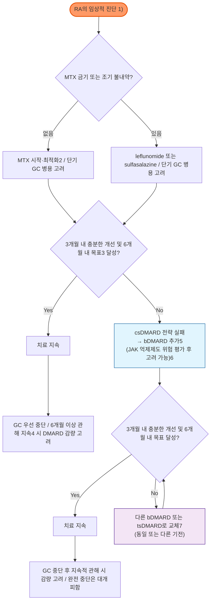

# 류마티스 관절염 Rheumatoid Arthritis (RA)

## <mark style="color:green;">일반 사항</mark>

* 만성 활막염과 관절 손상을 일으키는 전신 자가면역 질환; 전형적으로 대칭성 다발관절염을 보이나 초기에는 비대칭·소수관절염도 가능하며, RF·ACPA가 모두 음성인 RA도 있음
* 급성 경과를 보이기도 하지만 보통 비특이적인 관절통 또는 강직으로 시작하여 서서히 진행
* 호발 : 여성이 남성보다 2\~3배 흔하며, 발병 정점은 55\~75세
* 유병률 : 성인의 약 0.5\~0.7%(전 세계 0.53%, 미국 0.74%; 국내 약 0.5% 내외로 추정)
* 관절 및 연조직이 파괴되어 관절의 만성적이고 비가역적인 장애 발생; 조기 사망률 증가와 관련
* 질병 초기(특히 발병 후 3\~6개월, "window of opportunity")에 적극적인 치료를 시작할수록 관해 도달률과 장기 예후가 우수함; 이상적으로는 증상 발현 6주 이내 진단 후 즉시 DMARD 시작
* 예후 : 조기 DMARD 치료와 treat-to-target으로 관해·저활동도 도달 가능성이 높아지나, 관해율은 대상군·관해 정의·치료 전략·평가 시점에 따라 달라짐
  * 고역가 RF/ACPA, 높은 질병활성도 및 조기 골미란은 구조적 손상 위험과 관련
  * 지속적 염증, 심혈관질환, 폐질환, 감염 등은 초과 사망 위험과 관련; 질병활성도 조절과 동반 질환 관리가 중요함

***

## <mark style="color:green;">원인 및 위험 인자</mark>

* 원인 : 유전적 소인이 있는 개체에서 환경 인자에 의해 자가면역 반응이 촉발되는 것으로 추정되나 정확한 기전은 불명
* 관련 위험 인자 : 유전(HLA-DRB1 shared epitope 등), 흡연, 실리카 분진 노출, 여성, 비만 등; 치주염·대기오염 등과도 관련성이 보고되나, 모든 연관 인자가 확정된 직접 원인은 아님


**Pre-RA**\
임상적 관절염이 나타나기 전 자가면역·관절통 등의 위험 단계가 존재할 수 있음. RF/ACPA 양성만으로 RA 또는 향후 RA 발생을 확정하지 않으며, 혈청음성 위험 단계도 가능함. 2025 EULAR/ACR 위험 계층화 기준은 2차 진료에서 RA 위험이 있다고 판단된 관절통 환자를 대상으로 개발된 것으로, 무증상 일반 인구 선별 또는 RA 확진 기준이 아님.


### <mark style="color:orange;">나쁜 예후 인자 (Poor Prognostic Factors)</mark>

* csDMARD 치료에도 지속되는 중등증 이상의 disease activity, 크게 부어오른 관절의 숫자 및 높은 급성기 반응 물질 수치
* RF 그리고/또는 ACPA 양성, 특히 높은 역가
* 조기 골미란(early erosion)
* 2개 이상의 csDMARD 치료 실패
  * ✽이 인자들은 예후 평가에 유용하나, EULAR 2025는 첫 csDMARD 전략 실패 후 bDMARD 추가 여부를 별도의 나쁜 예후 인자 유무로 나누지 않음; 초기 전략의 불충분 반응 자체가 불량 예후의 단서임


**Difficult-to-treat RA (D2T RA)**\
다음 3요건을 모두 충족하는 개념: ① csDMARD 실패 후(금기이면 예외) 서로 다른 기전의 b/tsDMARD ≥2개 실패, ② 중등도 이상 활성도·활동성 질환 소견·prednisone 환산 7.5 ㎎/d 미만으로 GC 감량 불가·빠른 영상 진행·삶의 질을 낮추는 잔존 증상 중 ≥1개, ③ 환자 또는 류마티스내과 의사가 증상 관리를 어렵다고 판단함. 염증이 지속되는 경우에만 국한되지 않음. 진단 오류, 섬유근육통, 비염증성 통증, 순응도, 동반 질환을 재평가한 후 치료를 조정함.


***

## <mark style="color:green;">임상 양상</mark>

### <mark style="color:orange;">관절 증상</mark>

* 초기에는 비특이적 관절통·강직으로 시작할 수 있으며, 전형적으로 MCP·PIP·손목·MTP 등 작은 관절의 대칭성 활막염으로 진행; 일부에서는 단관절 또는 소수관절 형태로 시작할 수 있음
* 통증, 부종, 압통, 동작 시 통증; 보통 대칭적 분포 (✽부종은 synovial 비대 또는 삼출에 기인함)
* 조조강직 : 흔히 30분 이상이며 활동 후 호전; 시간 기준만으로 RA/OA를 확진·배제할 수 없음
* 경추 외의 척추와 sacroiliac joint 이환은 드묾
* 손목·MCP·PIP·MTP 침범이 흔함; DIP 침범은 비전형적이며 OA·건선성 관절염 동반 여부를 우선 고려하되, RA에서 절대 발생하지 않는다고 단정하지 않음
* 활막 부종은 부드럽고 파동성(fluctuant)으로 OA의 단단한 골성 부종과 구별되나, 일부는 뚜렷한 부종 없이 통증·압통만 호소
* 척측수근신근(ECU) 등 건초염으로 손목 부종·통증이 나타날 수 있음

**작은 관절의 임상 양상**

* 손(MCP, PIP), 손목 → Swan neck 변형, Boutonniere 변형, MCP 관절 척골측 편위, 방아쇠 수지, 수근관증후군
* 발(MTP, talonavicular), 발목 → 발바닥 작열감, 보행 장애
* 진행 시 거의 모든 말초 관절로 이환 확대 가능

**큰 관절의 임상 양상**

* 큰 관절의 가동 범위 감소
* 팔꿈치 : 척골신경 압박증후군(4, 5번째 손가락의 감각 이상, 약화)
* 무릎 : Baker's cyst(파열 시 하지 심부정맥혈전증과 임상적으로 혼동될 수 있음)
* 축성 골격 침범은 드물지만, 오래된 중증 RA에서는 경추 침범이 임상적으로 중요함
* **경추(C1-C2) 아탈구** : 만성·중증 RA에서 발생 가능; 새로운 신경학적 증상(사지 위약, 보행 장애, 배뇨장애) 동반 시 즉시 평가 필요 (☞ 하단 Red Flags)

### <mark style="color:orange;">관절 외 증상</mark>

* 피하 결절 : firm, non-tender; 대부분 뼈의 돌출부 또는 아래팔·엉덩이·아킬레스건 등 반복적인 자극·압력을 받는 부위의 골막, 힘줄, 점액낭에 붙어 있음
* Entrapment syndrome : 특히 손목 터널의 정중 신경
* 전신 증상 : 피로, malaise, 식욕 부진, 체중 감소, 발열, 우울, 불쾌감
  * 고열이 발생한 경우에는 전신 혈관염 또는 감염 의심
* 관련 질환 : 2차성 Sjögren 증후군(건성 각결막염, 입마름), 신장 질환, 심장 질환(심막염, 결절, **동맥경화성 심혈관질환 위험 증가**), **간질성 폐질환(RA-ILD)**·결절·늑막 삼출·늑막염, Felty 증후군(RA·호중구감소증, 흔히 비장 비대 동반), 말초 신경병증, 혈관염, 만성 질환 빈혈, 림프절병증, 감염 위험 증가, 골다공증
  * ✽RA-ILD는 예후에 큰 영향을 미치는 동반 질환으로, 새로 발생한 마른기침·호흡곤란은 반드시 확인
* ✽관절 외 침범은 오래된 고활동도·혈청양성 RA에서 더 흔하지만, RA-ILD 등은 관절염보다 먼저 또는 질병 초기에 나타날 수도 있음


**RA-ILD 선별 및 모니터링 (2023 ACR/CHEST guideline)**\
고령, 남성, 흡연력, 높은 RA 질병활성도, 고역가 RF/ACPA 등 위험 인자를 가진 RA 환자는 무증상이어도 폐기능검사(PFT: spirometry, lung volume, DLCO) + 흉부 HRCT를 이용한 초기 선별검사를 고려하고, 위험 인자가 지속되는 경우 대략 연 1회 PFT 재선별을 고려함.\
확진된 RA-ILD는 첫 1년간 3\~12개월 간격으로 PFT를 추적하고 안정화 후 간격을 늘리며, HRCT는 정기 반복 검사가 아니라 증상 악화·PFT 변화 등 임상적으로 필요한 경우에 시행함.


***

### <mark style="color:$danger;">🚩 Red Flags!</mark>

<mark style="color:$danger;">**즉각 조치 또는 의뢰**</mark> <mark style="color:$danger;">- 생명 위협 또는 즉각적 위해 가능성</mark>

* **발열 유무와 무관하게** 급성 단관절의 심한 통증·부종·열감 또는 현저한 관절운동 제한(특히 관절 내 스테로이드 주사 후, 인공관절, 면역억제제 사용 중) → 화농성 관절염 우선 배제 → 긴급 관절천자 및 적절한 항균 치료
* 새로운 사지 위약, 보행 장애, 배뇨 장애 등 척수병증 소견(경부 통증이 없어도 해당) → 환축추 아탈구 등 경추 병변 의심 → 목의 과도한 움직임·교정을 피하고 응급 영상(경추 MRI) 및 신경외과/정형외과 의뢰
* 흉통·호흡곤란 + 저혈압, 경정맥 확장 → 심낭 삼출/압전 의심
* 급격한 시력 저하 또는 심한 안구통 → 공막염(scleritis), 말초성 궤양성 각막염(peripheral ulcerative keratitis) 의심 → 안과 응급
* 손·발가락의 급성 허혈성 변화(청색증, 궤양, 괴사) → 류마티스 혈관염에 의한 digital ischemia 의심
* 면역억제 치료 중 감염 의심 + 의식 변화·저혈압·호흡곤란, 또는 새로 발생한 심한 호흡곤란·저산소증 → 패혈증·중증 폐렴·ILD 급성 악화·폐색전증 등 응급 평가
* MTX를 실수로 매일 복용하거나 예정량보다 과량 복용 → 증상 유무와 무관하게 추가 MTX를 중단하고 즉시 응급 평가(골수억제·점막염이 지연 발생할 수 있음)

<mark style="color:$warning;">**당일~수일 내 평가**</mark>

* 면역억제제 사용 중 발열·오한 또는 국소 감염 증상 → 당일 평가; 패혈증 소견이면 즉각 조치. IL-6 억제제 사용 시 발열·CRP 상승이 약할 수 있어 정상 CRP로 감염을 배제하지 않음
* 새로 발생한 마른기침·경증 호흡곤란(심한 호흡곤란·저산소증은 즉각 조치) → RA-ILD, 약물유발 폐렴, 감염 등 감별을 위해 당일 평가 및 적절한 흉부 영상·협진
* 다발성 피하결절 급속 증가, 자반, 다발성 단신경병증(mononeuritis multiplex) 소견 → 전신 혈관염 의심
* 신경학적 결손이 없는 새로운 경부 통증·뻣뻣함 → 경추 불안정성 평가를 위한 영상 검사 필요
* MTX·leflunomide 복용 중 임신 확인 → 해당 약물을 즉시 중단하고 당일 산과·류마티스내과 상담; MTX 노출 시 폴산 보충·태아 위험 평가, leflunomide 노출 시 신속 제거 요법 평가

<mark style="color:$info;">**외래 추적 / 추가 평가 계획**</mark> <mark style="color:$info;">- 즉각 위험 낮으나 호전 없으면 의뢰</mark>

* 표준 csDMARD 치료 3개월 내 임상적 호전이 없거나 6개월 내 치료 목표(관해 또는 저활동도)에 도달하지 못한 경우
* 적절히 최적화한 csDMARD 전략에도 치료 목표에 도달하지 못한 경우 → bDMARD 추가(JAK 억제제는 위험 평가 후 고려)를 위한 류마티스내과 의뢰
* bDMARD/tsDMARD 시작 전 잠복결핵, B형간염 스크리닝 필요
* 심혈관 위험 인자를 가진 환자에서 JAK 억제제 사용을 고려할 때 위험-이익 재평가 필요

***

## <mark style="color:green;">진단</mark>

* 원인 불명의 지속적 활막염이 의심되면 류마티스내과로 신속히 의뢰; 특히 손·발 작은 관절 또는 여러 관절 침범 시 항체 음성·정상 ESR/CRP라도 의뢰를 늦추지 않음. 검사 결과나 3개월 경과를 기다리지 않음

**2010 ACR/EULAR 분류기준의 적용 전제**

* 적어도 1개 관절에 진찰로 확인되는 명확한 활막염(부종)이 있고, 다른 질환으로 더 잘 설명되지 않는 환자에 적용
* DIP, 제1 CMC, 제1 MTP는 관절 점수 평가에서 제외
* RF/ACPA 양성 + 관절통만 있는 환자에게 점수를 적용하여 RA로 확진하지 않음

<table><thead><tr><th width="213">구분</th><th width="365">항목</th><th>배점</th></tr></thead><tbody><tr><td><strong>A. 관절 이환</strong></td><td>'큰 관절'1) 1개 이환</td><td>0</td></tr><tr><td></td><td>'큰 관절' 2~10개 이환</td><td>1</td></tr><tr><td></td><td>'작은 관절'2) 1~3개 이환 (큰 관절 침범 여부 무관)</td><td>2</td></tr><tr><td></td><td>'작은 관절' 4~10개 이환 (큰 관절 침범 여부 무관)</td><td>3</td></tr><tr><td></td><td>'관절'3) ≥11개 이환 ('작은 관절' 적어도 1개 이환)</td><td>5</td></tr><tr><td><strong>B. 혈청 검사</strong></td><td>RF 음성 &#x26; ACPA 음성</td><td>0</td></tr><tr><td>(적어도 1개 검사 결과 필요)</td><td>'낮은 양성'4) RF 또는 '낮은 양성' ACPA</td><td>2</td></tr><tr><td></td><td>'높은 양성'5) RF 또는 '높은 양성' ACPA</td><td>3</td></tr><tr><td><strong>C. 급성기 반응 물질</strong></td><td>정상 CRP &#x26; 정상 ESR</td><td>0</td></tr><tr><td>(적어도 1개 검사 결과 필요)</td><td>비정상 CRP 또는 비정상 ESR</td><td>1</td></tr><tr><td><strong>D. 증상 지속 기간6)</strong></td><td>&#x3C;6주</td><td>0</td></tr><tr><td></td><td>≥6주</td><td>1</td></tr></tbody></table>

_1) 큰 관절 : shoulder, elbow, hip, knee, ankle_\
_2) 작은 관절 : MCPJ, PIPJ, thumb IPJ, 2nd-5th MTPJ, wrist_\
_3) 턱관절 등 특별히 언급되지 않은 관절들도 해당될 수 있음_\
_4) '낮은 양성' = 정상 상한값 초과~상한값의 3배 이하; RF 정성 검사만 있는 경우 '양성'은 '낮은 양성'으로 취급_\
_5) '높은 양성' = 정상 상한값의 ＞3배_\
_6) 현재 진찰에서 이환된 관절의 통증·부종·압통 등 증상의 지속 기간에 대한 환자 설명을 참조함_\
_\*관절 이환은 진찰 소견상 관절의 부종 또는 압통으로 판단하며, 초음파·MRI의 활막염 소견으로 확인할 수 있음_\
_\*2013 EULAR 골미란 정의: 양손·양발 단순 X선에서 PIP·MCP·손목(각 손목은 1개 관절로 계산)·MTP 중 서로 다른 ≥3개 관절의 전형적 피질 단절. 임상 병력·감별진단을 함께 판단하며, 퇴행성 또는 다른 질환의 미란만으로 RA를 분류하지 않음_\
_\*류마티스 결절 또는 방사선학적 관절 손상은 초기 RA에서는 드물기 때문에 기준에서 제외_

* 총점 **≥6점** : 적용 전제를 충족하면 RA로 분류; 6점 미만이어도 RA를 배제하지 않으며 추적 중 재평가 가능. 진단과 DMARD 시작은 임상 판단에 따름
* ACPA=Anti-citrullinated peptide/protein Ab

_Ref. 2010 ACR/EULAR. Rheumatoid arthritis classification criteria. Arthritis Rheum 2010;62(9):2569-2581._

### <mark style="color:orange;">영상 검사</mark>

* 단순 X선은 초기 RA에서 정상일 수 있어 진단 민감도가 낮지만, 기저 관절 손상·미란 확인 및 추적 비교에 유용
* X선 : 기저 관절 손상 평가 및 추적을 위해 시행; 초기 손, 손목, 발 촬영 고려
  * 초기 : 연조직 swelling, juxta-articular demineralization
  * 진행 : 관절 미란, 관절 간격 감소
* 초음파, MRI : 활막염·건초염 및 초기 골미란 확인에 X선보다 민감; 임상적으로 활막염 여부가 불확실하거나 조기 병변 확인이 필요한 경우 유용하나 모든 환자에서 일상적으로 시행할 필요는 없음
* 추적 X선은 손·발의 손상 진행, 활성도 및 치료 변경 필요성에 따라 개별화; 초기·활동성 RA에서 약 1년 간격 평가를 고려할 수 있으나 모든 이환 부위를 매년 의무적으로 촬영하는 것은 아님
* 초음파·MRI를 추가하여 영상학적 관해를 일률적으로 치료 목표로 삼는 전략은 임상 treat-to-target보다 우월함이 확립되지 않음; 염증과 비염증성 통증 구분 등 불확실한 경우 선택적으로 활용

### <mark style="color:orange;">실험실 검사</mark>

* RA가 의심되면 RF, ACPA, ESR/CRP를 기본적으로 평가하며, CBC·Cr/eGFR·LFT 등은 감별진단 및 DMARD 시작 전 기저 검사로 시행
* 진단 시 RF 그리고/또는 ACPA 양성률은 대상군에 따라 다르며, 조기 RA에서는 혈청음성이 적지 않음; 음성 항체 및 정상 ESR/CRP는 RA를 배제하지 않음
* 혈청음성 RA(RF·ACPA 모두 음성)는 2010 ACR/EULAR 분류기준상 혈청검사 항목 점수를 얻지 못해 진단이 지연될 수 있음 → 관절 초음파·MRI 등 영상 검사와 임상 양상이 진단에 핵심적 역할을 함
  * 항체의 양전은 가능하나 일률적 주기 재검은 권장되지 않음; 초기 검사 결과와 임상상이 불일치하거나 새로운 진단 단서가 있을 때 선택적으로 재검

#### <mark style="color:orange;">Anti-citrullinated peptide/protein antibody(ACPA)</mark>

* RA 진단을 지지하나 다른 자가면역 질환·일부 감염에서도 양성 가능; 양성만으로 확진하지 않음
* 특이도 약 95%, 민감도 약 69%; RF보다 특이도 높음, 조기 진단·예후 예측(나쁜 예후 인자)에 유용

#### <mark style="color:orange;">Rheumatoid factor(RF)</mark>

* RF 증가 상황 : 만성 감염(아급성 세균성 심내막염, 결핵, 매독), 바이러스 감염(전염성 단핵구증, 거대세포바이러스, 인플루엔자), 기생충 감염, 사르코이드증, 간질성 폐질환, 비감염성 간염, 정상 고령 인구의 일부
* 민감도는 대략 70\~80% 전후이며 초기 RA에서는 더 낮을 수 있음
* 고역가는 불량 예후와 관련될 수 있으나 역가 변화는 질병활성도 추적 지표로 적절하지 않음
* 일단 양성이면 추적을 위한 반복 검사는 필요 없음

#### <mark style="color:orange;">기타</mark>

* ANA : 20\~30%에서 양성
* ESR, CRP : 비특이적이나 질병 활성도 평가·모니터링에 사용
* Complement(CH50, C3, C4) : SLE 또는 immune-complex disease 등 다른 자가면역질환 감별이 필요한 경우 고려
* Synovial fluid analysis : 염증성 관절액(WBC 상승, 호중구 우세) 확인, 감염·통풍과의 감별
* CBC : 경증 정상구성 정상색소 빈혈, 반응성 혈소판증가증 소견
* 전해질, Cr, LFT, U/A : 동반 질환 및 약물 시작 전 기저치 평가를 위해 시행

#### RA 검사 항체들의 정확도

☞ [류마티스질환](150_-rheumatoid-disease.md)

### <mark style="color:orange;">감별 진단</mark>

* 대칭적 다발관절통·조조강직으로 내원하는 경우 아래 질환들과의 감별이 필요

<table><thead><tr><th width="140">질환</th><th width="260">RA와의 차이점</th><th>핵심 감별 포인트</th></tr></thead><tbody><tr><td>골관절염(OA)</td><td>염증보다 퇴행성 변화가 주 기전</td><td>DIPJ·CMC 관절 호발, 조조강직 &#x3C;30분, 전신 증상 없음, RF/ACPA 음성</td></tr><tr><td>전신홍반루푸스(SLE)</td><td>비미란성 관절염, 다장기 침범</td><td>피부발진, 광과민성, 신장·혈액학적 이상, ANA 고역가, anti-dsDNA</td></tr><tr><td>건선성 관절염</td><td>비대칭성, 축성 침범 흔함</td><td>DIPJ 침범, 손발톱 병변, dactylitis, 건선 피부병변, RF/ACPA 대개 음성</td></tr><tr><td>결정관절병증(통풍, CPPD)</td><td>급성 발작 또는 만성 다발관절염 가능</td><td>통풍은 제1 MTP 발작이 흔하고 CPPD는 무릎·손목 침범이 흔함; 관절액 결정·배양검사. 정상 요산으로 통풍을 배제하거나 결정 존재로 감염을 배제하지 않음</td></tr><tr><td>반응성/바이러스성 관절염</td><td>선행 감염 후 자연 호전 경향</td><td>선행 위장관·비뇨생식기 감염 또는 파보바이러스 B19·간염 병력, 자가항체 대개 음성</td></tr><tr><td>다발근육통(PMR)</td><td>관절 자체보다 근위부 통증·강직</td><td>50세 이상, 어깨·골반대 통증, ESR/CRP 현저히 상승, 저용량 스테로이드에 극적 반응</td></tr><tr><td>섬유근육통</td><td>중추성 통증 증후군, 활막염 없음</td><td>전신 통증·피로·수면장애, 객관적 활막염 없음; 압통점 개수는 필수 진단요건이 아님, RA와 동반 가능</td></tr></tbody></table>

#### <mark style="color:orange;">RA vs OA 비교</mark>

<table><thead><tr><th width="90">구분</th><th width="260"><strong>RA</strong></th><th>OA</th></tr></thead><tbody><tr><td>기전</td><td>자가면역 질환에 의한 관절의 염증</td><td>연골·연골하골·활막 등 관절 전체의 변화</td></tr><tr><td>위험 인자</td><td>유전, 환경, 흡연, 비만</td><td>고령, 반복 동작(직업/운동), 과거 손상, 유전</td></tr><tr><td>초발 관절</td><td>MCPJ, PIPJ</td><td>DIPJ, Carpometacarpal</td></tr><tr><td>관절 증상</td><td>반복성, 대칭성; 손·손가락·팔꿈치·무릎·엉덩이 등 전신 관절 이환 가능</td><td>손·무릎·고관절 등, 여러 부위 이환 가능; 활동 시 통증 악화가 흔함</td></tr><tr><td>관절 강직</td><td>휴식 후 악화, 부종 동반, 조조강직 &#x3E;30분</td><td>휴식 후 짧은 강직, 조조강직은 흔히 &#x3C;30분; 통증은 활동 시 악화</td></tr><tr><td>관절 소견</td><td>soft, warm, tender</td><td>hard, bony</td></tr><tr><td>동반 증상</td><td>피로, 발열, 체중 감소, 식욕 감퇴</td><td>전신 증상 없음</td></tr><tr><td>진단</td><td>객관적 활막염·분포·경과와 감별진단; RF/ACPA 음성 또는 정상 ESR/CRP에서도 가능</td><td>임상 양상으로 진단 가능; 비전형적이거나 다른 질환 의심 시 영상 검사</td></tr><tr><td>치료</td><td>질병 조절 면역치료(DMARD) + 대증 치료</td><td>대증 치료, 관절 보호(운동, 체중 관리, NSAID)</td></tr><tr><td>경과</td><td>수 주 내 급격히 악화 가능</td><td>수년에 걸쳐 서서히 악화</td></tr><tr><td>예후</td><td>예측 어려움; 전신 침범 가능</td><td>구조적 변화는 비가역적이나 통증·기능은 치료로 개선 가능</td></tr></tbody></table>

MCP=metacarpophalangeal, PIP=proximal interphalangeal, DIP=distal interphalangeal\
✽압통 및 팽창된 관절이 많을수록, 신체 장애가 심할수록 RA 가능성이 높음

***


```mermaid
graph TD
    A(["RA의 임상적 진단 1)"]) --> B{"MTX 금기 또는 조기 불내약?"}
    B -->|없음| C["MTX 시작·최적화2 / 단기 GC 병용 고려"]
    B -->|있음| D["leflunomide 또는 sulfasalazine / 단기 GC 병용 고려"]
    C --> E{"3개월 내 충분한 개선 및 6개월 내 목표3 달성?"}
    D --> E
    E -->|Yes| F[치료 지속]
    F --> G["GC 우선 중단 / 6개월 이상 관해 지속4 시 DMARD 감량 고려"]
    E -->|No| H["csDMARD 전략 실패\n→ bDMARD 추가5\n(JAK 억제제도 위험 평가 후 고려 가능)6"]
    H --> I{"3개월 내 충분한 개선 및 6개월 내 목표 달성?"}
    I -->|Yes| J[치료 지속]
    J --> K["GC 중단 후 지속적 관해 시 감량 고려 / 완전 중단은 대개 피함"]
    I -->|No| L["다른 bDMARD 또는 tsDMARD로 교체7\n(동일 또는 다른 기전)"]
    L --> I

    style A fill:#f96,stroke:#e65100,stroke-width:2px
    style H fill:#e1f5fe,stroke:#01579b
    style L fill:#f3e5f5,stroke:#4a148c
```

1) 분류기준 적용 전제와 다른 질환의 배제 확인; 점수만으로 확진하지 않음\
2) MTX는 여전히 1차 선택 약제(금기·조기 불내약 시 leflunomide 또는 sulfasalazine)\
3) 치료 목표는 지속적 관해, 또는 최소한 저질병활성도(low disease activity); 3개월 내 개선이 없거나 6개월 내 목표 미달성 시 치료 조정\
4) 관해를 객관적 지표로 확인하고 적어도 6개월 유지한 후 감량 고려; 지속적 저활동도만으로 일률적 감량하지 않음\
5) bDMARD는 csDMARD와 병용이 원칙; csDMARD 병용이 어려운 경우 IL-6 경로 억제제·JAK 억제제가 상대적 이점을 가질 수 있음\
6) JAK 억제제는 심혈관·혈전·악성종양 위험 인자를 반드시 확인 후 사용 (☞ 하단 Management의 안전성 경고 참조)\
7) 1개의 TNF 억제제 또는 IL-6R 억제제 실패 시 다른 기전 제제 또는 동일 계열 2차 제제 모두 고려 가능

<p align="center"><strong>RA 관리 알고리듬 (2025년 개정판 반영, 2019년 판 알고리듬 대체)</strong></p>

<p align="center"><em>Ref. EULAR RA management recommendations: 2025 update (Ann Rheum Dis 2026; doi:10.1016/j.ard.2026.01.023). JAMA 2026 review는 보조 문헌임.</em></p>

***

## <mark style="background-color:$warning;">Management</mark>


**Treat-to-target 원칙**\
치료 목표는 모든 환자에서 지속적인 임상적 관해이며, 특히 조기 RA에서 중요함. 이미 1개 이상의 DMARD 치료에 실패한 오래된 병력의 환자에서는 저질병활성도가 대안적 목표가 될 수 있음. 저질병활성도 미만의 상태는 원칙적으로 받아들이지 않음(EULAR 2025 update, Recommendation 2).


### <mark style="color:orange;">치료 방침</mark>

* 진단 즉시 DMARD 치료 시작(EULAR 2025 Recommendation 1) - 빠른 진단, 빠른 활성도 파악, 빠른 염증 관리
* 활동성 질환에서는 1\~3개월 간격으로 CDAI 등 표준 지표를 이용해 자주 모니터링(☞ 하단 질병활성도 평가); 늦어도 치료 시작 후 3개월 내 개선이 없거나 6개월 내 목표에 도달하지 못하면 치료 조정, 목표 유지 시에는 모니터링 간격을 늘릴 수 있음
* MTX가 1차 치료 전략의 핵심; MTX 금기 또는 조기 불내약 시 leflunomide 또는 sulfasalazine 고려
* csDMARD 시작·변경 시 단기 Glucocorticoid 병용을 고려할 수 있으나, 가능한 한 신속히 감량하여 3개월 이내 중단(☞ 하단 Steroid)
* csDMARD 전략으로 목표에 도달하지 못하면 bDMARD를 추가; JAK 억제제도 심혈관·혈전·악성종양 위험 인자를 신중히 고려한 후 선택지가 될 수 있음
* b/tsDMARD는 csDMARD와 병용이 원칙; csDMARD 병용이 어려운 환자에서는 IL-6 경로 억제제·JAK 억제제가 다소 유리할 수 있음
* 첫 b/tsDMARD 실패 시 다른 기전의 b/tsDMARD 또는 동일 계열의 다른 약제로 교체; TNF 또는 IL-6R 억제제 1회 실패 후에는 다른 기전 제제 또는 동일 계열 2차 제제 모두 선택 가능; 동일 기전 2번째 약제에도 반응이 없으면 다른 기전으로 교체
* 지속적 관해 상태에서 GC를 중단하고, 적어도 6개월 관해 유지 후 공유 의사결정으로 DMARD 용량 감량·투여 간격 연장을 고려; 완전 중단은 대개 권장되지 않으며 재발 시 신속히 기존 유효 치료로 복귀
* 관절 외 질환·동반 질환 관리 : 빈혈, 죽상경화성 심혈관질환, 이상지질혈증, 고혈압, 골다공증, 흡연, 비활동 생활 습관에 대한 적극적 관리 - RA 자체가 심혈관질환의 독립적 위험 인자
* RA-ILD 동반 시 약제 선택 : ACR/CHEST 2023 SARD-ILD 치료 가이드라인은 leflunomide, MTX, TNF 억제제, abatacept를 **RA-ILD 자체의 1차 치료제로는 권장하지 않음**(조건부 반대); ILD 치료가 필요하면 mycophenolate, rituximab, cyclophosphamide, azathioprine을 1차 옵션으로 조건부 권고(그중 mycophenolate 선호도가 상대적으로 높음)하고, 첫 치료 후에도 진행하면 mycophenolate, rituximab, cyclophosphamide, nintedanib을 조건부 권고하며 장기 스테로이드는 권장하지 않음
  * ✽관절 질환 조절 목적으로 이미 사용 중인 MTX가 안정된 RA-ILD를 반드시 악화시키는 것은 아니므로, 안정 상태에서는 일률적 중단보다 개별 판단; 활동성 관절염과 ILD가 함께 치료를 요하는 경우 rituximab은 두 질환을 함께 고려할 수 있는 선택지이며, first-line ILD 치료 후에도 RA-ILD가 진행하는 경우 tocilizumab도 조건부로 고려 가능 → 류마티스내과·호흡기내과 협진
* 면역 조절제(특히 b/tsDMARD, 고용량 스테로이드) 사용 중에는 생백신 접종을 피하고, 접종이 필요하면 접종 전후 일정 기간 약물 중단을 고려 (개별 백신·약제별 권고가 다르므로 상세 일정은 관련 지침 확인)

### <mark style="color:orange;">질병활성도 평가</mark>

* 활동성 RA는 1\~3개월마다 표준화 지표로 평가; 1차 진료에서는 검사실 수치가 필요 없는 **CDAI**가 가장 실용적
* CDAI = SJC28 + TJC28 + 환자 전반 평가(0~10) + 의사 전반 평가(0~10), 범위 0~76; SDAI = CDAI + CRP(㎎/㎗). 검사 결과가 ㎎/L이면 10으로 나누어 환산

<table><thead><tr><th width="140">지표</th><th width="110">관해</th><th width="120">저활동도</th><th width="120">중등도</th><th>고활동도</th></tr></thead><tbody><tr><td>CDAI</td><td>≤2.8</td><td>&#x3E;2.8~10</td><td>&#x3E;10~22</td><td>&#x3E;22</td></tr><tr><td>SDAI</td><td>≤3.3</td><td>&#x3E;3.3~11</td><td>&#x3E;11~26</td><td>&#x3E;26</td></tr><tr><td>DAS28-CRP</td><td>&#x3C;2.6</td><td>2.6~3.2</td><td>&#x3E;3.2~5.1</td><td>&#x3E;5.1</td></tr></tbody></table>

_✽DAS28-CRP는 DAS28-ESR 절단값을 준용한 것으로 실제 값이 낮게 나와 관해를 과대평가할 수 있음_

* 3개월까지 질병활성도 약 50% 이상의 개선을 지향; 개선 정도·절대 활성도·내약성을 함께 평가하여 치료 조정. CDAI 반응 범주와 ACR20/50/70 반응은 다른 지표임
* 28개 관절 지표에는 발목·발 관절이 포함되지 않으므로 별도 진찰; IL-6 억제제 등으로 CRP가 낮아져도 잔존 활막염이 있는지 확인

### <mark style="color:orange;">관해(remission) 판정</mark>

* 단순히 통증이 없거나 flare가 없다는 의미가 아니라 아래 객관적 기준으로 평가; 잔존 발목·발 관절염 및 관절 외 질환도 별도로 확인

#### <mark style="color:orange;">Boolean-based definition (ACR/EULAR 2022 revision; Boolean 2.0)</mark>

* 다음 모두를 동시에 충족
  1. 압통 관절수 ≤1개
  2. 팽창 관절수 ≤1개
  3. CRP ≤1 ㎎/㎗
  4. 환자의 전반적 평가(PtGA) 0\~10점 스케일에서 ≤2점

* ✽CRP를 사용하지 않는 경우 SJC28 ≤1, TJC28 ≤1, PtGA ≤2로 판정(clinical Boolean)

#### <mark style="color:orange;">Index-based definition : SDAI / CDAI</mark>

* SDAI(simplified disease activity index) : 다음 항목 총점 ≤3.3
  1. CRP 수치(㎎/㎗)
  2. 28개 관절\* 중 압통 관절 수
  3. 28개 관절\* 중 팽창 관절 수
  4. 0\~10점 스케일의 환자의 전반적 평가 점수
  5. 0\~10점 스케일의 의사의 전반적 평가 점수

  \*28개 관절 : MCP(10개), PIP(8개), thumb IP(2개), shoulder(2개), elbow(2개), wrist(2개), knee(2개)

* CDAI(clinical disease activity index) : 위 항목 중 CRP를 제외한 4개 항목 총점 ≤2.8


**⚠️ JAK 억제제 계열 안전성 경고**\
ORAL Surveillance(50세 이상 + 심혈관 위험 인자 ≥1개; tofacitinib vs TNF 억제제, NEJM 2022)에서 tofacitinib군의 MACE(3.4% vs 2.5%, HR 1.33)와 악성종양(비흑색종 피부암 제외 4.2% vs 2.9%, HR 1.48)이 모두 비열등성 경계를 넘었음. 정맥혈전색전증 위험도 증가.\
미국 FDA는 tofacitinib·baricitinib·upadacitinib에 중증 감염·사망·악성종양·MACE·혈전증 경고를 적용하고 RA 사용 대상을 TNF 억제제 ≥1개에 불충분 반응 또는 불내약인 환자로 제한함. 이는 미국 규정이며 국내 처방 순서와 동일하지 않음. EULAR 2025는 csDMARD 실패 후 JAK 억제제를 위험 평가에 따라 고려함. 국내 제품 허가사항에도 고령·심혈관 및 악성종양 고위험군에 대한 사용 제한이 있으므로 확인해야 함.\

✽65세 이상, 현재 또는 과거 흡연, 심혈관 위험, VTE·악성종양 병력 등을 확인하고 고위험군에서는 적합한 대체 치료를 우선 검토; 서로 다른 JAK 억제제의 위험 크기가 같거나 특정 약제가 안전하다고 단정하지 않음


***

## <mark style="color:green;">비-약물 치료 및 예방</mark>

* 금연 : RA 발생 위험, 치료 반응 및 심혈관·폐질환 위험 관리에 중요; 금연만으로 이미 발생한 RA의 활성도 감소를 보장하지 않음
* 충분한 활동 및 적당한 휴식, 규칙적인 운동
* 체중 조절 - 비만은 치료 반응 저하 및 심혈관 위험 증가와 관련
* 정신적·사회적으로 건강한 생활 유지; 만성 통증·기능 장애에 따른 우울·불안에 대한 스크리닝, 필요시 상담·항우울 치료
* 물리치료, 작업치료(관절 정렬 이상 예방·교정을 위한 보조기 포함)
* 심혈관 위험 인자(고혈압, 이상지질혈증, 당뇨병) 적극적 선별·관리
* 접종 : 비생백신(인플루엔자, 폐렴구균, 대상포진 재조합 백신 등)은 권장; 생백신은 면역억제제 사용 중에는 원칙적으로 피함
  * 면역억제 치료 중에는 폐렴구균·재조합 대상포진 백신을 권고하고 인플루엔자 등 연령·위험에 맞는 접종 시행. 국내 접종 일정·허가 연령 적용. COVID-19 접종·약물 보류는 별도 최신 권고에 따름(ACR 2022 일반 백신 지침의 직접 대상이 아님)
  * JAK 억제제는 대상포진 위험을 증가시키므로, 가능하면 치료 시작 전 재조합 대상포진 백신(RZV; 생백신 아님) 접종 여부를 확인
  * ACR 2022: 질병활성도가 허락하면 인플루엔자 접종 후 MTX 2주 보류; 다른 비생백신 접종 시는 통상 유지. Rituximab 사용 중 인플루엔자는 시기를 놓치지 않고 접종하고 가능하면 다음 투여를 ≥2주 연기; 다른 비생백신은 가능하면 마지막 rituximab 후 ≥6개월·다음 투여 직전에 접종하고 이후 투여를 ≥2주 연기
* 음식, 허브, 기타 대체 요법 : 효과가 명확히 입증된 방법은 없음
  * ACR 2022 통합 치료 지침은 지중해식 식단을 조건부 권고; DMARD를 대체하지 않으며 영양·심혈관 관리의 보조 수단으로 활용
  * 관련 동반 질환 관리를 위해 gluten-free diet, 채식 등을 개별적으로 권고하는 경우가 있으나 RA 자체에 대한 근거는 부족

#### <mark style="color:orange;">운동</mark>

* 관절 운동 범위 유지를 위한 스트레칭, 근육 강화, 유산소 운동
* 이환 관절뿐 아니라 관련된 모든 근육 운동을 함께 시행
* 관절 손상·활성도에 맞게 부하를 조절하며 통증·부종을 악화시키는 동작은 피함; 경추 불안정성이 의심되면 과도한 목 회전·신전 및 경추 교정을 피함
* 활성기에는 심한 활동·운동을 피함
* 조조강직 : 스트레칭, 따뜻한 샤워, 워밍업 운동, (취침 전) 유연성 운동
* 손/손목 운동 : 설거지 또는 샤워 직후 시행 권장(손이 따뜻하고 유연해져 있음)
* 유산소 운동 : 걷기·수영·사이클 등으로 시작하여 상태에 따라 강도·시간을 점진적으로 늘림; 모든 RA 환자에게 저강도 운동만 제한하지 않음

***

## <mark style="color:green;">약물 치료</mark>


**용량과 국내 허가·급여의 구분**\
아래는 성인 RA의 대표 용법임. 국제 지침 용량이 국내 제품 허가 용량과 다를 수 있으므로 차이를 별도 표기함. b/tsDMARD 추가의 지침상 시점과 국내 급여 요건은 같지 않을 수 있으며, 제품별 선행 치료·질병활성도·반응 평가 요건을 확인함. 투여 전후 안전성 평가는 류마티스내과와 협력함.


* 금기가 없는 한 MTX로 시작, 필요시 단기 steroid 또는 진통제 병용
* MTX 금기 시 leflunomide 또는 sulfasalazine을 1차 선택제로 고려
* MTX를 포함한 csDMARD 전략을 적절히 최적화하였음에도 치료 목표에 도달하지 못하면 bDMARD를 추가; JAK 억제제는 심혈관·혈전·악성종양 위험 인자를 평가한 후 고려
* Active Dz 상태에서는 자주 모니터링(매 1\~3개월)
* 3개월 내 호전되지 않거나 6개월 내 목표치에 도달하지 못하면 치료 방법 조정
* GC 중단 후 관해가 ≥6개월 유지되면 감량(tapering) 고려; 완전 중단 시 재발이 흔하므로 신중히 결정

### <mark style="color:orange;">conventional synthetic DMARD(csDMARD)</mark>

* 작용 : 과잉 면역·염증 반응 체계를 억제하여 질병 경과를 늦추고 관해 도달률을 높임
* 효과 발현까지 수 주\~수개월 소요
* MTX를 충분한 용량·투여경로로 신속히 최적화; 3개월 내 임상적 개선이 없거나 6개월 내 치료 목표에 도달하지 못하면 치료 전략을 조정하고, 적절한 csDMARD 전략 실패 시 bDMARD 추가를 고려
* MTX·LEF·SSZ의 효과 평가는 질병활성도로, 독성 평가는 CBC·간기능·신기능 등으로 각각 시행; 시작·증량 후에는 유지기보다 촘촘히 검사

#### <mark style="color:orange;">Methotrexate(MTX)</mark>

* 1차 선택제
* 경구 1차 선택; 효과 발현은 수 주 소요하며, 신기능·간질환·상호작용에 따라 중대한 독성 발생 가능
* 용법 : 7.5~10 ㎎ **주 1회(qwk)** PO로 시작하여 반응·내약성에 따라 신속히 증량 <mark style="color:blue;">[유한메토트렉세이트정 2.5㎎]</mark>
  * **국내 이 경구 제품의 RA 허가 용량은 7.5~20 ㎎/wk, 주 최대 20 ㎎임.** 국제 지침의 4~8주 내 20~25 ㎎/wk 목표에서 경구 25 ㎎/wk는 이 제품의 허가 범위를 초과함. SC 제형으로 전환할 때도 해당 제품의 허가 상한을 확인
  * ✽아시아 환자, 고령·저체중·신기능 저하 환자는 더 낮은 용량에서도 반응하거나 내약성이 제한될 수 있어 개별 조절
  * 경구제로 시작하되 불내약·불충분 반응 시 주 1회 용량의 24시간 내 분할 또는 SC 전환 고려. 경구와 SC가 항상 동등하거나 비열등하다고 단정하지 않음; 비교 RCT에서는 SC의 반응률이 더 높았음
  * 지속적 관해 후의 감량은 MTX 고유의 고정 감량 스케줄이 아니라 전체 DMARD tapering 전략에 따라 개별화
  * ✽**매일 복용이 아닌 주 1회 복용**임을 반드시 강조·확인(과다 복용 시 심각한 골수 억제·간독성 위험) - 처방전·복약 라벨에 요일 명시 권장
* 부작용 : 구역·구토·구내염, 간효소 상승, 골수억제·범혈구감소증, 감염, 약물유발 폐렴 등; 빈도는 용량·환자군에 따라 다름
  * 간독성은 비만·당뇨·MASLD·음주 등과 함께 평가; 신기능 저하·탈수·상호작용은 MTX 축적·골수억제 위험을 높임. 혈청 Cr의 단일 절단값 대신 CrCl/eGFR 평가
  * 폴산 ≥5 ㎎/wk를 MTX 투여일을 피하여 보충(예: 1 ㎎/d, MTX 투여일 제외 또는 5 ㎎/wk) <mark style="color:blue;">[폴산]</mark>; 부작용 지속 시 용량 조정 또는 MTX 투여 ≥24시간 후 folinic acid 보충을 전문의와 검토
* 약물 상호작용·독성 주의
  * **TMP/SMX 또는 trimethoprim**은 folate 길항 및 골수억제 위험 때문에 가능하면 병용을 피함
  * 고용량 salicylate, 신배설을 저해하거나 신기능을 악화시키는 약물은 MTX 농도·독성을 높일 수 있어 주의
  * 일반적인 저용량 MTX와 NSAID는 RA에서 병용할 수 있으나, 고령·신기능 저하·탈수 등에서는 신기능 및 MTX 독성을 면밀히 관찰
* 금기/피해야 하는 상황 : 임신, 중증 간질환·골수억제, 중증 신기능 저하 등; CrCl <30 mL/min에서는 통상 피하고 30~59 mL/min에서는 감량 필요성을 제품 허가사항과 함께 판단
* 주의 및 개별 위험평가 : 과도한 음주, 비만·당뇨·MASLD 등 간독성 위험 인자, 활동성 감염, 기존 폐질환 등
  * 여성은 임신 전 MTX 중단이 필요함. 남성이 임신을 계획하는 경우 ACR은 MTX 지속을 조건부 권고하므로 일률적 중단은 필요하지 않으나, 제품 허가사항·지침 간 차이를 고려하여 개별 상담
* 모니터링
  * 투여 전 호흡기 증상·기저 폐질환 위험을 문진·진찰로 평가; 폐질환이 의심되거나 RA-ILD 고위험군(☞ 상단 RA-ILD 선별 hint)에서는 폐기능검사 및 적절한 흉부 영상(X선/HRCT)을 시행(모든 환자에서 일률적 흉부 X선을 요구하지는 않음, BSR 2025); B형간염 등 기저 감염 선별
  * CBC·혈소판, AST/ALT·albumin, Cr/eGFR을 시작 전 및 시작 약 2주 후 확인; 이후 첫 3~6개월 매달, 안정 유지기 통상 3개월마다. 증량 약 2주 후 추가 검사, 고령·신기능 저하·병용 위험이면 더 자주 시행(BSR 2025)
  * 간효소의 의미 있는 상승(예: 정상 상한의 >2배 또는 빠른 증가)은 재검만 기다리지 말고 MTX 보류·원인 평가 및 전문의 상담; 경미한 이상도 추세·병용약·증상을 고려하여 재검·감량 판단

#### <mark style="color:orange;">Leflunomide(LEF)</mark>

* 작용 : 피리미딘 합성 억제를 통한 활성화 림프구 증식 억제
* 부작용 : 발진, 설사, 구역, 탈모(가역적), 간 손상, 복통, 체중 감소, 고혈압
* 용법 : 통상 20 ㎎ qd, 내약성이 좋지 않으면 10 ㎎ qd <mark style="color:blue;">[아라바]</mark>; 부하용량을 생략하여 시작할 수 있음
  * ✽과거에는 loading dose(100 ㎎ qd ×3d)를 시행했으나, 위장관·간 부작용 위험 증가로 최근에는 생략하고 유지용량으로 바로 시작하는 경우가 흔함
* 반감기가 길어(약 2주) 중단 후에도 활성대사물이 오래 남음. 임신 계획·임신 노출·중대한 독성 시 중단 후 cholestyramine 8 g tid ×11일 신속 제거 요법을 전문의 감독하에 시행; 혈중 활성대사물 <0.02 ㎎/L를 ≥14일 간격으로 2회 확인하고, 기준 미달이면 제거 요법 반복 검토
* 모니터링 : 시작 전 CBC·LFT·신기능·혈압, 이후 첫 6개월 적어도 매달 CBC/LFT, 유지기 6~8주 간격 등을 제품 허가사항·위험도에 따라 적용; ALT >3배 상승 시 중단하고 약제 관련성이 의심되면 신속 제거 검토
* 임신·수유, 중증 간질환·중증 감염·심한 혈구감소 등 금기 확인; 신기능 저하 및 MTX 병용에서는 간·혈액 독성에 특히 주의

#### <mark style="color:orange;">Sulfasalazine(SSZ)</mark>

* 대상 : RA 및 궤양성대장염; 척추관절염의 말초관절염에 사용 가능하나 순수 축성 증상에 대한 효과는 제한적이며 국내 허가·급여 범위를 별도로 확인
* 부작용 : 구역·복통·발진·두통·가역적 정자감소증, 간손상, 백혈구·혈소판 감소, 드문 중증 혈액장애·SJS/TEN·DRESS 등. 혈구감소·간독성에 대한 정기 검사 필요
* 주의 : 오렌지색 소변/눈물/땀이 발생할 수 있으며 옷·콘택트렌즈에 착색될 수 있음
* 금기 : sulfonamide·salicylate 과민반응, G6PD 결핍, 중증 간·신부전, 조혈기관 질환, 장폐색·요로협착 등; **아래 국내 조피린장용정 허가사항은 임신·수유도 금기**로 기재함(국제 지침과 차이, ☞ 임신 항목)
* 용법 : <mark style="color:blue;">[조피린장용정 500㎎]</mark> 국내 RA 허가상 500 ㎎ qd로 시작, 매주 500 ㎎/d씩 증량하여 유지 500 ㎎씩 1일 2~4회(총 1~2 g/d). 국외 2~3 g/d 또는 최대 4 g/d 요법을 이 국내 제품의 RA 허가 용법으로 제시하지 않음
  * 장용정을 씹거나 부수지 말고 식후 충분한 물과 함께 복용; 제산제 등 병용은 제형 특성과 상호작용을 확인
* 모니터링 : 시작 전 CBC·LFT·신기능, 첫 3개월 2주마다, 다음 3개월 매달, 이후 3개월마다(국내 제품 설명서). G6PD 결핍 의심 병력·가족력·위험 배경이 있으면 검사; 모든 환자에서 일률적 필수 검사로 단정하지 않음

#### <mark style="color:orange;">Hydroxychloroquine(HCQ)</mark>

* 대상 : RA(주로 경증 또는 병용요법), SLE
* 일부 환자에서는 반응하기까지 3\~6개월 소요; 종종 MTX·sulfasalazine과 병용(3제 병합요법)
  * MTX + SSZ + HCQ 3제 병합은 MTX 불충분 반응 후 비용·선호·동반 질환에 따라 선택 가능; 효과·독성·순응도를 평가하며 b/tsDMARD 추가 전략과 비교하여 결정
* 부작용 : DMARD 중 가장 적은 편; **망막병증**, 피부염, 근육 약화, hypoactive DTR, QT 연장(드묾)
* 용법 : **실제 체중(actual body weight) 기준 ≤5 ㎎/㎏/d**을 초과하지 않도록 용량 설정, 통상 200\~400 ㎎/d #1\~2, 식사 또는 우유와 함께 복용 <mark style="color:blue;">\[할록신]</mark>
  * ✽AAO 2025 개정 권고도 실제체중 기준 ≤5 ㎎/㎏/d를 유지; 심한 비만에서는 체중 계산만으로 고용량을 정하지 말고 통상 400 ㎎/d 이하에서 개별 조절
* 모니터링(AAO 2025 개정 권고) : 투여 직후 baseline 검사(안저, OCT, wide-field 자동형광 FAF)를 시행하여 기저 이상 여부 확인 및 추후 비교 기준 마련; 이후 **매년 OCT + wide-field FAF를 1차 선별검사**로 시행하되, 위험 인자가 없으면 첫 5년간은 연례 선별을 유예 가능; 시야검사·mfERG는 2차 확인 검사로 위치 변경; 신기능 저하, tamoxifen 병용, 고용량, 고령에서 치료 시작 등이 위험 인자로 조기·집중 선별 필요; 한국인을 포함한 동아시아 환자는 주변중심부(pericentral) 독성도 평가하도록 검사 범위를 확보. 순수 HCQ 단독 사용에서 CBC·U/A를 다른 csDMARD와 같은 간격으로 일률적 반복할 필요는 없으며 임상 상황에 따라 시행

### <mark style="color:orange;">targeted synthetic DMARD(tsDMARD) : Janus kinase(JAK) 억제제</mark>

* 대상 : csDMARD에 반응이 불충분한 RA; JAK 억제제도 EULAR 2025 update상 csDMARD 실패 후 bDMARD와 함께 선택 가능한 옵션에 포함되나, 처방 전 심혈관·혈전·악성종양 위험 인자 확인이 필수 (☞ 상단 Management 안전성 경고 참조)
* 시작 전 CBC·혈소판, LFT·신기능·지질, 잠복결핵 및 HBV 등 평가; 치료 중 CBC/LFT·지질·신기능을 약제별 허가 일정에 따라 추적
* 대상포진 위험 증가 → 재조합 대상포진 백신 접종 여부 확인; 특정 JAK 억제제가 더 안전하다고 일반화하지 않음
* IL-6R 억제제와 마찬가지로 게실염·장천공 위험 증가 → 게실염 병력 환자에서 주의
* tofacitinib 5 ㎎ bid <mark style="color:blue;">\[젤잔즈]</mark>
* baricitinib : 통상 4 ㎎ qd; 고령·위험 인자·신기능 등에 따라 2 ㎎ qd <mark style="color:blue;">[올루미언트]</mark>; eGFR <30 mL/min/1.73㎡에서는 사용하지 않으며 감량은 제품 허가사항 적용
* upadacitinib 15 ㎎ qd <mark style="color:blue;">\[린버크]</mark>
* filgotinib : 통상 200 ㎎ qd, 고령·신기능·위험 인자에 따라 100 ㎎ qd <mark style="color:blue;">[지셀레카]</mark>; 국내에 RA와 궤양성대장염 적응증이 있음
* 신·간기능 저하, CYP 관련 상호작용 및 임신·수유 금기를 약제별 확인; bDMARD·다른 JAK 억제제와 병용하지 않음

### <mark style="color:orange;">b/tsDMARD 시작 전 감염 평가</mark>

* 결핵: 병력·증상, IGRA(필요시 TST) 및 흉부 영상으로 활동성 결핵·잠복결핵을 평가; 활동성 결핵이면 치료를 우선하고 면역억제제 시작 시점을 감염 전문의와 결정
* HBV: HBsAg·anti-HBc·anti-HBs; 양성이면 HBV DNA 등 추가 평가. Rituximab은 anti-HBc 양성만으로도 재활성화 고위험이므로 예방 항바이러스 치료를 계획; 다른 약제는 HBsAg·HBV DNA·약제 위험에 따라 예방 또는 면밀한 추적
* HCV 검사 및 위험에 따른 HIV 검사, 반복·현재 감염, 예방접종 상태 확인

### <mark style="color:orange;">biological originator DMARD, biosimilar DMARD(bDMARD)</mark>

* 병의 진행을 완화 또는 예방; 임상 증상이 남아 있어도 관절 손상 진행을 억제함
* 대체로 MTX 등 csDMARD 병용을 우선하며, MTX는 면역원성 감소와 효과 유지에 유용; 모든 bDMARD에서 병용의 이점이 같거나 SSZ·LEF 병용이 MTX와 동등하다고 단정하지 않음
* MTX 불충분 반응 후 내약성이 허락하면 bDMARD 추가를 우선 고려; csDMARD 병용이 어렵다면 일부 bDMARD 단독요법 가능. CRP 억제의 영향을 받는 관해율을 모든 약제에 일반화하지 않음
* bDMARD 선택은 기전·동반 질환·안전성·비용·환자 선호를 함께 고려; MTX가 부적절한 환자의 단독요법 비교에서 tocilizumab이 adalimumab보다 우수한 반응을 보였음(ADACTA)
* 허가된 biosimilar는 originator와 효능·안전성에 임상적으로 의미 있는 차이가 없으며 비용 절감 가능
* 중증 감염 위험은 연령·동반 질환·GC 용량·약제 등에 따라 달라짐. 활동성 감염을 배제하고 잠복결핵 치료·HBV 재활성화 예방 계획을 세운 후 시작; bDMARD끼리 또는 bDMARD와 JAK 억제제를 병용하지 않음

#### <mark style="color:orange;">Tumor necrosis factor(TNF) 억제제</mark>

* 시작 전 결핵 선별 및 치료 중 감염 관찰; 중등도~중증 심부전(NYHA III/IV)·탈수초질환에서는 비-TNF 치료를 우선 검토
* infliximab : **3 ㎎/㎏ IV, 0·2·6주 및 이후 8주마다**, MTX 병용 <mark style="color:blue;">[램시마 주]</mark>. 불충분 반응·반응 소실 시 국내 RA 허가상 8주마다 약 1.5 ㎎/㎏씩 증량하여 최대 7.5 ㎎/㎏ 또는 3 ㎎/㎏를 4주마다 투여 고려. 국내 허가 용법에 10 ㎎/㎏를 일률적으로 포함하지 않음
* etanercept : 매주 50 ㎎ 또는 주 2회 25 ㎎씩 SC <mark style="color:blue;">\[엔브렐 주]</mark>
* adalimumab : **40 ㎎ 격주 SC** <mark style="color:blue;">[휴미라 주]</mark>; MTX를 병용하지 않는 단독요법에서 반응 감소 시 제품 허가사항에 따라 40 ㎎ 매주 또는 80 ㎎ 격주 증량을 고려
* certolizumab pegol : 국외 용법 참고—0·2·4주 400 ㎎ SC 후 **200 ㎎ 2주마다 또는 400 ㎎ 4주마다**; Cimzia는 국내 사용 가능한 제품으로 확인되지 않아 국내 제품명 목록과 구분
* golimumab : 50 ㎎ 매달 SC <mark style="color:blue;">[심퍼니프리필드시린지주]</mark>, 또는 **2 ㎎/㎏ IV, 0·4주 및 이후 8주마다** <mark style="color:blue;">[심퍼니주]</mark>; RA에서는 MTX 병용, 두 제형의 투여경로 혼동 주의

#### <mark style="color:orange;">IL-6 receptor 억제제</mark>

* tocilizumab : 국내 RA 용법 **8 ㎎/㎏ IV 4주마다(1회 최대 800 ㎎)** <mark style="color:blue;">[악템라주]</mark>, 또는 **162 ㎎ SC 2주마다**, 효과 불충분 시 매주로 단축 <mark style="color:blue;">[악템라피하주사]</mark>; 검사치 이상 발생 시 허가사항에 따라 감량·보류
* sarilumab : 국외 용법 참고—200 ㎎ SC 2주마다, 검사치 이상 시 150 ㎎로 감량 등; Kevzara는 국내 사용 가능한 제품으로 확인되지 않아 국내 제품명 목록과 구분
* ✽csDMARD 병용이 어려운 환자에서 단독요법 시 상대적으로 유리할 수 있음; 호중구 감소, 이상지질혈증, 장천공(게실염 병력 시 주의) 모니터링 필요
* IL-6 억제 시 CRP·발열 반응이 둔화될 수 있음; 낮은 CRP로 중증 감염을 배제하거나 DAS28 관해만으로 염증 소실을 단정하지 않음

#### <mark style="color:orange;">T-cell costimulatory 억제제</mark>

* abatacept : IV는 체중 <60 ㎏ 500 ㎎, 60~100 ㎏ 750 ㎎, >100 ㎏ 1,000 ㎎를 0·2·4주 및 이후 4주마다; SC는 125 ㎎ 매주 <mark style="color:blue;">[오렌시아 주]</mark>

#### <mark style="color:orange;">anti-B cell(CD20)</mark>

* 대상 : 국내 RA에서는 TNF 억제제 ≥1개에 불충분 반응 또는 불내약인 성인의 중등도~중증 활동성 RA에 MTX와 병용; 특히 RF/ACPA 양성에서 반응이 더 좋을 수 있음
* rituximab : 1,000 ㎎를 2주 간격으로 2회 점적 IV; 약 24주 이후 재치료 필요성 평가 <mark style="color:blue;">[트룩시마 주]</mark>. 주입반응 예방을 위한 항히스타민제·해열제 및 methylprednisolone 100 ㎎ IV 전처치 등을 제품 허가사항에 따라 시행
* HBV 선별(HBsAg·anti-HBc·anti-HBs) 필수; HBsAg 또는 anti-HBc 양성이면 예방 항바이러스 치료를 간 전문의와 계획. 투여 전·반복 치료 시 면역글로불린·감염 위험도 확인

### <mark style="color:orange;">가임기 여성 및 임신 계획</mark>

* 임신 가능성이 있는 여성 환자는 DMARD 선택 시 임신 계획·피임 여부를 정기적으로 확인
* MTX·LEF·JAK 억제제는 임신 전 안전한 치료로 전환; 중단 시점·피임 기간은 제품 허가사항과 지침을 대조하여 결정. LEF는 신속 제거 및 혈중농도 확인이 필요하며, 단순히 몇 주 중단하는 것만으로 충분하지 않음
* HCQ는 임신에 적합한 선택지임. **SSZ는 EULAR 2024 update 등에서 임신 적합 약제로 권고하나, 국내 조피린장용정 허가사항은 임신·수유 금기임.** 임신 중 사용을 일반 허가 처방으로 제시하지 않고 산과·류마티스내과에서 근거·허가 차이를 설명한 후 결정; 선택 시 임신 전~초기 폴산 보충(예: 5 ㎎/d) 필요
* 최신 EULAR는 개별 이익·위험 평가에 따라 TNF 억제제의 임신 중 사용 및 bDMARD의 수유 중 사용을 인정; 국내 제품 허가사항, 태반 통과, 노출 영아 생백신 계획을 함께 검토
* 남성 환자의 MTX 사용은 임신 계획 시 일률적 중단이 필요하지는 않으며(ACR 조건부 권고), 제품 허가사항·최신 지침 간 차이를 고려하여 개별 상담
* MTX·LEF 복용 중 임신 확인 시 해당 약을 즉시 중단하고 당일 상담; 다른 RA 약물을 모두 중단하라는 의미는 아님. 임신 노출만으로 임신 중절을 일률적으로 결정하지 않고 약제·용량·노출 시기별 평가

### <mark style="color:orange;">Steroid</mark>

#### <mark style="color:orange;">전신 투여</mark>

* csDMARD 시작 시 가교요법을 선택하면 최소 유효 용량으로 시작(예: prednisolone 5~7.5 ㎎/d)하고 빠르게 감량하여 **3개월 이내 중단** <mark style="color:blue;">[소론도]</mark>; 시작 시 중단 계획을 정함. 경구 투여가 어려우면 전문의가 주사제 대안을 검토하되 제형·국내 허가 용법을 확인(EULAR 2025)
  * ✽GC는 DMARD 효과가 나타날 때까지 증상·염증을 조절하는 가교요법이며, 장기 RA 조절을 위한 DMARD 대체제가 아님
  * ✽감량 중 flare 시 감염·순응도·잔존 활막염을 확인하고 csDMARD 최적화 또는 b/tsDMARD 추가·변경 검토; 일시적 flare마다 곧바로 생물학적 제제를 추가하는 것은 아님
  * ✽ACR 2021은 단기 GC 병용 없이 csDMARD를 시작하도록 조건부 권고(매우 낮은 근거 수준)하여 EULAR와 입장이 다름
* flare 조절을 위한 중등용량(15\~30 ㎎/d) 단기 투여는 류마티스내과 판단하에 제한적으로 시행
* prednisone 환산 ≥2.5 ㎎/d를 >3개월 사용할 예정이면 조기에 골절 위험·BMD·척추골절 평가 및 칼슘·비타민D 섭취 최적화; 위험도에 따라 골다공증 약물 치료(☞ 골다공증)

#### <mark style="color:orange;">관절 내 주사</mark>

* 소수 관절에서의 활성기(flare) 시 고려
* 시술 전 관절 내 감염 배제 필요
* triamcinolone : 관절 크기·제형에 따라 용량 개별화(큰 관절 10~40 ㎎ 등) <mark style="color:blue;">[트리암시놀론 주]</mark>. 동일 관절의 반복 주사는 효과·부작용·간격을 평가; 통상 연 3~4회 이상 피하나 이를 근거가 확립된 일률적 안전 상한으로 해석하지 않음

### <mark style="color:orange;">진통제</mark>

☞ [통증](../220_/001_-pain.md#management)

* NSAID·진통제는 치료 목표 도달 전까지의 보조 요법 또는 목표 도달 후 잔존 통증 조절용이며, 질병 진행을 막지 못하므로 DMARD를 대체할 수 없음

#### <mark style="color:orange;">NSAID</mark>

* 위궤양·심혈관 위험 등 부작용을 고려하여 선택
* 최소 유효 용량을 최단기간 사용; 충분한 NSAID 반응이 없어도 고용량을 지속하기보다 RA 염증 조절과 다른 통증 원인을 재평가
* 투여 2주 후 반응 없으면 다른 종류로 교체
* naproxen : 500 ㎎ bid <mark style="color:blue;">\[낙센]</mark>
* ibuprofen : 600\~800 ㎎ tid <mark style="color:blue;">\[부루펜]</mark>
* celecoxib : RA 국내 용법 100~200 ㎎ bid <mark style="color:blue;">[쎄레브렉스]</mark>; 필요 최소량을 선택

#### <mark style="color:orange;">기타 진통제</mark>

* acetaminophen : 일반정은 500~1,000 ㎎를 필요시 4~6시간 간격(1회 최대 1,000 ㎎), **국내 타이레놀 650㎎ 서방정 허가 용법은 1,300 ㎎(2정)을 8시간 간격** <mark style="color:blue;">[타이레놀 / 타이레놀 이알]</mark>; 일반정 성인 허가 최대 4 g/d, 650㎎ 서방정 최대 3,900 ㎎/d. 서방정은 부수거나 씹지 않음. 만성 사용·고령·간독성 위험이면 더 낮은 일일 상한(예: 3 g/d 이하)을 설정하고 복합제 총량 포함
* tramadol : RA에서 일상적·장기 사용은 피하고 선택된 잔존 중증 통증에 단기간 고려; 50~100 ㎎/회, 신·간기능·연령에 따라 간격·상한 조정 <mark style="color:blue;">[트리돌]</mark>. 낙상·의존·경련·항우울제 병용 시 serotonin syndrome 위험 확인
* capsaicin 크림 : 잔존 국소 통증의 보조 옵션이나 RA 특이 근거는 제한적; 제품 농도·허가 용법 확인. 활성 활막염 치료를 대체하지 않음

***

## <mark style="color:green;">시술 및 기타 처치</mark>

* 심한 관절 손상, 기능 장애에 대하여 고려
* joint replacement(인공관절 치환술)
* joint fusion(관절 유합술)
* tendon repair(건 재건술)

***

### <mark style="color:orange;">수술 전후 약물 관리</mark>

* 선택적 고관절·무릎 인공관절 치환술에 대한 ACR/AAHKS 2022: MTX·LEF·SSZ·HCQ는 통상 유지; bDMARD는 다음 예정 투여를 보류하고 해당 투여 주기가 지난 후 수술 계획(예: adalimumab 격주 투여 후 3주째 수술)
* Tofacitinib·baricitinib·upadacitinib은 수술 전 3일 보류(마지막 투여 후 4일째 수술); 모든 JAK 억제제·모든 수술에 동일하게 적용하지 않고 약제·감염·혈전 위험을 개별 평가
* 보류한 약은 창상 치유·봉합사 제거, 부종·발적·배액 및 감염이 없음을 확인 후 재개(통상 약 14일); 응급 수술·다른 시술은 별도 판단

### <mark style="color:red;">질병코드</mark>

M05 혈청검사양성 류마티스관절염

M05.9 상세불명의 혈청검사양성 류마티스관절염

M06 기타 류마티스관절염

M06.9 상세불명의 류마티스관절염

***

## <mark style="color:purple;">처방례</mark>

> **처방례 1. 초기 RA, MTX 기반 치료(전문 진료와 협력)**
>
> ```
> 유한메토트렉세이트정 2.5 ㎎/T  6T  주 1회(요일 지정) (총 15 ㎎/wk)
> 폴산 1 ㎎/T  1T  qd (MTX 투여일 제외)
> 쎄레브렉스 100 ㎎/C  1C  bid (통증 시 단기간)
> ```
>
> _✽성인 초기 처방 예(15 ㎎/wk); 7.5~10 ㎎/wk로 더 낮게 시작한 뒤 증량할 수도 있음. 이 경구 제품의 국내 RA 허가 상한은 20 ㎎/wk이며 국제 지침의 25 ㎎/wk와 구분. 기저 CBC·LFT·신기능 확인 및 시작·증량 후 추적. 쎄레브렉스 200 ㎎/d는 국내 RA 용법 100 ㎎ bid로 표기; 장기 자동 유지 없이 필요 기간만 병용_

> **처방례 2. MTX 불내약, SSZ 금기가 없는 경우**
>
> ```
> 조피린장용정 500 ㎎/T  1T  qd 시작 → 매주 일일 총량 500 ㎎씩 증량
> 타이레놀정 500 ㎎/T  1T  필요시 4~6시간 간격 (이 예에서는 1일 최대 6T)
> ```
>
> _✽이 예는 임신·중증 간/신부전·G6PD 결핍 등 SSZ 금기가 없는 MTX 불내약 환자 대상. 국내 조피린장용정 RA 유지 용법은 500 ㎎씩 1일 2~4회. MTX 금기 원인이 SSZ의 금기에도 해당하면 다른 약제 선택; 임신 환자에게 그대로 적용하지 않음_

> **처방례 3. 활동기, 단기 스테로이드 병용**
>
> ```
> 유한메토트렉세이트정 2.5 ㎎/T  6T  주 1회(요일 지정) (총 15 ㎎/wk)
> 폴산 1 ㎎/T  1T  qd (MTX 투여일 제외)
> 소론도 5 ㎎/T  1T  qd 아침
> ```
>
> _✽DMARD 효과 발현 전 선택적 가교 치료; 시작할 때부터 감량 계획을 정하고 호전 시 신속히 감량하여 3개월 이내 중단. 모든 환자에게 GC 병용이 필수는 아님_

> **처방례 4. csDMARD 전략 실패 → bDMARD 추가 (전문의 의뢰 후)**
>
> ```
> 유한메토트렉세이트정 2.5 ㎎/T  6T  주 1회(요일 지정) (총 15 ㎎/wk, 기존 유지)
> 폴산 1 ㎎/T  1T  qd (MTX 투여일 제외)
> 휴미라 주 40 ㎎  격주 SC
> ```
>
> _✽적절히 최적화한 csDMARD 전략에도 치료 목표에 도달하지 못한 경우 bDMARD 추가; JAK 억제제는 위험 평가 후 고려. 투여 전 잠복결핵·B형간염 선별 필수(류마티스내과 협진)_

***

### <mark style="color:$success;">핵심 복약 지도</mark>

> **Methotrexate는 '주 1회' 약입니다**
>
> * 요일을 지정하여(예: 매주 수요일) 1회만 복용하도록 반복 확인
> * 매일 복용 시 심각한 골수 억제·간독성·점막염이 발생할 수 있음
> * 폴산은 MTX 복용일을 피해서 복용
> * 음주는 가능한 한 최소화; 간질환·비만·당뇨·MASLD 등 간독성 위험 인자가 있으면 금주 또는 더 엄격한 제한 권장

> **NSAID·스테로이드 병용 시 주의**
>
> * NSAID의 출혈 위험은 식후 복용만으로 없어지지 않음; 궤양 병력·고령·항응고제·스테로이드 병용 등 위험에 따라 PPI 병용 고려
> * 스테로이드는 임의로 용량을 늘리거나 갑자기 중단하지 말고, 의사가 정한 스케줄대로 서서히 감량
> * 장기 스테로이드가 예상되면 복용 초기에 골절 위험·골밀도와 칼슘·비타민D 섭취를 평가하고 예방 치료 상담

> **생물학적 제제/JAK 억제제 사용 시**
>
> * 자가주사제는 투여 전 실온에 미리 꺼내두고, 매번 주사 부위를 바꿔가며 투여
> * 발열, 오한, 상처가 잘 낫지 않음 등 감염 징후가 있으면 즉시 병원 방문 및 다음 투여 보류
> * 수술 예정 시 약제별 중단·재개 계획을 담당의와 미리 정함; 생물학적 제제와 JAK 억제제의 중단 기간은 다름(☞ 시술 및 기타 처치)
> * JAK 억제제 복용 환자는 새로운 흉통, 호흡곤란, 하지 부종·통증(혈전 의심 소견) 발생 시 즉시 내원
> * JAK 억제제는 대상포진 위험을 높이므로, 치료 시작 전 재조합 대상포진 백신(RZV; 생백신 아님) 접종 여부를 확인

> **임신 계획이 있다면**
>
> * **여성 환자**는 임신을 계획할 때 MTX, leflunomide 등 임신 중 사용이 부적절한 약물을 미리 중단·전환하도록 담당의와 상담
> * **남성 환자**의 MTX는 임신 계획 시 일률적으로 중단할 필요는 없으며, 지침·제품 허가사항과 개별 상황을 고려하여 담당의와 상담
> * MTX 또는 leflunomide 복용 중 임신이 확인되면 해당 약은 즉시 중단하고 당일 담당의에게 연락; 다른 약물은 개별 지시를 따름

> **언제 다시 병원을 방문해야 하나요?**
>
> * 관절 하나가 갑자기 심하게 붓고 뜨겁고 아픈 경우(열이 없어도 해당) - 즉시 내원
> * 손발가락 색이 변하거나 궤양이 생기는 경우 - 즉시 내원
> * 새로 숨이 차거나 마른기침이 생기면 당일 평가; 숨이 심하게 차거나 입술이 파래지면 즉시 응급 진료
> * 새로 팔다리 힘이 빠지거나 걸음이 이상해지는 경우(목 통증이 없어도 해당) - 즉시 내원
> * 치료에도 불구하고 3개월 이상 증상 호전이 없는 경우
> * MTX를 실수로 매일 또는 과량 복용했으면 증상이 없어도 추가 복용을 중단하고 즉시 응급 진료

***

## <mark style="color:blue;">환자 안내서</mark>


**류마티스 관절염, 조기에 적극적으로 치료할수록 관절을 지킬 수 있습니다**

류마티스 관절염은 우리 몸의 면역 체계가 자신의 관절을 잘못 공격해서 생기는 만성 염증성 질환입니다. 방치하면 관절이 서서히 파괴되어 변형과 장애가 남을 수 있지만, 진단 초기에 약물 치료를 시작하면 관절 손상을 줄이고 일상생활을 유지하는 데 도움이 됩니다.


### <mark style="color:orange;">왜 류마티스 관절염이 생기나요?</mark>

* 정확한 원인은 아직 밝혀지지 않았지만, 유전적 소인이 있는 사람에게 흡연 등 환경 요인이 함께 작용하여 면역 체계가 관절을 공격하게 되는 것으로 추정됩니다
* 여성에서 남성보다 2\~3배 흔하고 50\~70대에 가장 많이 생기지만, 어느 연령에서나 발생할 수 있습니다

### <mark style="color:orange;">일상생활에서 어떻게 관리하나요?</mark>

* **담배를 끊으십시오.** 흡연은 병을 악화시키고 약물 효과를 떨어뜨립니다
* **꾸준히, 하지만 무리하지 않게 운동하십시오.** 걷기, 수영처럼 관절에 부담이 적은 운동이 좋으며, 관절이 많이 부어 있는 시기에는 심한 운동을 피하십시오
* **아침에 관절이 뻣뻣하면 따뜻한 샤워나 스트레칭으로 풀어주십시오.**
* **적정 체중을 유지하십시오.** 체중이 많이 나가면 관절 부담과 약물 반응 모두에 나쁜 영향을 줍니다
* 혈압, 콜레스테롤, 혈당도 함께 관리하십시오. 류마티스 관절염 자체가 심장 혈관 질환의 위험을 높입니다

### <mark style="color:orange;">약은 어떻게 써야 하나요?</mark>

* 가장 많이 쓰이는 메토트렉세이트(MTX)는 **매일이 아니라 일주일에 한 번만** 복용하는 약입니다. 요일을 정해두고 복용하십시오
* 효과가 나타나기까지 몇 주에서 몇 달이 걸릴 수 있으므로, 효과가 바로 느껴지지 않는다고 임의로 중단하지 마십시오
* 생물학적 제제나 JAK 억제제를 사용 중이라면 열이 나거나 감염 증상이 있을 때는 투여를 미루고 병원에 문의하십시오
* 임신 계획이 있으면 반드시 미리 담당의와 상의하여 약을 안전한 것으로 바꾸십시오

### <mark style="color:orange;">이럴 때는 즉시 병원을 방문하세요</mark>

* 관절 하나가 갑자기 심하게 붓고 뜨겁고 아플 때(열이 없어도 해당)
* 손발가락 색이 파랗게 변하거나 상처가 잘 낫지 않을 때
* 새로 숨이 차거나 마른기침이 생기면 당일 진료; 숨이 심하게 차거나 입술이 파래지면 즉시 응급 진료
* 새로 팔다리에 힘이 빠지거나 걸음이 이상해질 때(목 통증이 없어도 해당)
* 치료를 받아도 증상이 좋아지지 않으면 예약일을 앞당겨 상담(응급 증상과는 구분)
* MTX를 실수로 매일 또는 과량 복용했다면 증상이 없어도 더 복용하지 말고 즉시 응급 진료
* MTX 또는 leflunomide 복용 중 임신이 확인되면 해당 약을 중단하고 당일 담당의에게 연락

***

### 주요 참고문헌

* 검토 기준일: 2026-10-03; 국제 지침과 국내 제품별 허가사항을 구분하여 반영함

* Smolen JS, et al. EULAR recommendations for the management of rheumatoid arthritis with synthetic and biologic disease-modifying antirheumatic drugs: 2025 update. Ann Rheum Dis. 2026. [doi:10.1016/j.ard.2026.01.023](https://doi.org/10.1016/j.ard.2026.01.023).
* Smolen JS, et al. Rheumatoid Arthritis in Adults: A Review. JAMA. 2026 Sep 10. [doi:10.1001/jama.2026.15455](https://doi.org/10.1001/jama.2026.15455).
* Aletaha D, et al. 2010 Rheumatoid arthritis classification criteria: an ACR/EULAR collaborative initiative. [doi:10.1002/art.27584](https://doi.org/10.1002/art.27584).
* van der Heijde D, et al. EULAR definition of erosive disease in light of the 2010 ACR/EULAR rheumatoid arthritis classification criteria. Ann Rheum Dis. 2013;72:479-481. [원문](https://www.lacohorteespoir.fr/pages/articles/ESPOIR%2039.pdf).
* Studenic P, et al. American College of Rheumatology/EULAR remission criteria for rheumatoid arthritis: 2022 revision. [doi:10.1136/ard-2022-223413](https://doi.org/10.1136/ard-2022-223413).
* Nagy G, et al. EULAR definition of difficult-to-treat rheumatoid arthritis. [원문](https://pmc.ncbi.nlm.nih.gov/articles/PMC7788062/).
* Bechman K, et al. The 2025 British Society for Rheumatology guideline for the prescription and monitoring of conventional synthetic disease-modifying anti-rheumatic drugs. [doi:10.1093/rheumatology/keaf522](https://doi.org/10.1093/rheumatology/keaf522).
* Fraenkel L, et al. 2021 American College of Rheumatology Guideline for the Treatment of Rheumatoid Arthritis. [doi:10.1002/acr.24596](https://doi.org/10.1002/acr.24596).
* 2023 ACR/CHEST guidelines for screening/monitoring and treatment of SARD-associated ILD. [학회 원문·요약](https://rheumatology.org/interstitial-lung-disease-guideline).
* Bass AR, et al. 2022 ACR Guideline for Vaccinations in Patients With Rheumatic and Musculoskeletal Diseases. [원문](https://pmc.ncbi.nlm.nih.gov/articles/PMC10291822/).
* Rüegg L, et al. EULAR recommendations for use of antirheumatic drugs in reproduction, pregnancy, and lactation: 2024 update. Ann Rheum Dis. 2025;84:910-926. [doi:10.1016/j.ard.2025.02.023](https://doi.org/10.1016/j.ard.2025.02.023).
* BSR guideline on prescribing drugs in pregnancy and breastfeeding: immunomodulatory anti-rheumatic drugs and corticosteroids. [원문](https://pmc.ncbi.nlm.nih.gov/articles/PMC10070073/).
* Goodman SM, et al. 2022 ACR/AAHKS Guideline for the Perioperative Management of Antirheumatic Medication in Patients With Rheumatic Diseases Undergoing Elective Total Hip or Total Knee Arthroplasty. [doi:10.1002/acr.24893](https://doi.org/10.1002/acr.24893).
* Marmor MF, et al. Special AAO Report: Recommendations on Screening for Hydroxychloroquine Retinopathy (2025 Revision). Ophthalmology. 2026;133:439-450. [학회 권고](https://aao.org/education/clinical-statement/revised-recommendations-on-screening-chloroquine-h).
* Braun J, et al. Comparison of the clinical efficacy and safety of subcutaneous versus oral administration of methotrexate in patients with active rheumatoid arthritis. Arthritis Rheum. 2008;58:73-81. [doi:10.1002/art.23144](https://doi.org/10.1002/art.23144).
* 국내 제품별 용법·주의사항: [유한메토트렉세이트정](https://www.yuhan.co.kr/Mobile/Products/List/?Category=308&YPRD_IDX=2482&cid=176&mode=view&p=1&sf=YPRD_SORT&sm=-1), [램시마주](https://www.celltrionph.com/ko-kr/product/introducedetail?modify_key=228), [조피린장용정 설명서](https://www.hanlim.com/_ce/data/product/201208/1795430658.pdf), [아라바정](https://www.whanin.com/_product/view.php?item=496), [의약품안전나라](https://nedrug.mfds.go.kr/searchDrug).

* van Steenbergen HW, et al. EULAR/ACR risk stratification criteria for development of rheumatoid arthritis in the risk stage of arthralgia. [doi:10.1002/art.43218](https://doi.org/10.1002/art.43218); [2026 정정문](https://doi.org/10.1002/art.70270).
* NICE NG100. Rheumatoid arthritis in adults: management. [조기 의뢰·진단 권고](https://www.nice.org.uk/guidance/ng100/chapter/Recommendations).
* England BR, et al. 2022 ACR Guideline for Exercise, Rehabilitation, Diet, and Additional Integrative Interventions for Rheumatoid Arthritis. [원문](https://pmc.ncbi.nlm.nih.gov/articles/PMC10947582/).
* Humphrey MB, et al. 2022 ACR Guideline for the Prevention and Treatment of Glucocorticoid-Induced Osteoporosis. [doi:10.1002/acr.25240](https://doi.org/10.1002/acr.25240).
* 추가 국내 허가자료: [쎄레브렉스 100·200㎎](https://www.viatris.co.kr/-/media/project/common/viatriscokr/pdf/product-chart/celebrex100mg-200mg_20250602.pdf), [오렌시아 정맥주사](https://www.bms.com/assets/bms/korea/documents/pi_pdfs/orencia_iv-pi.pdf), [타이레놀8시간이알서방정](https://nedrug.mfds.go.kr/pbp/CCBBB01/getItemDetail?itemSeq=202200407), [심퍼니주](https://nedrug.mfds.go.kr/pbp/CCBBB01/getItemDetail?itemSeq=201500861).
