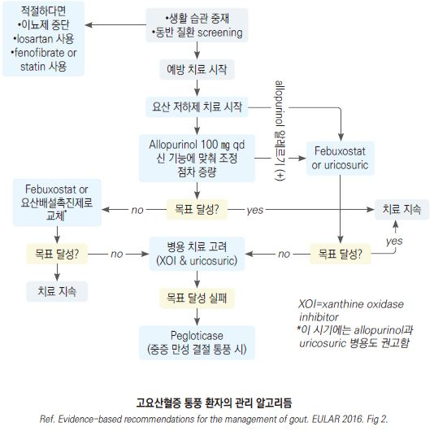
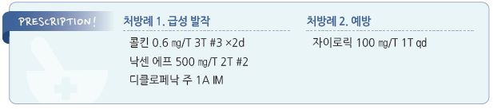

# 통풍 Gout


## 일반 사항

*   고요산혈증(＞6.8 ㎎/㎗) 등의 요인에 의하여 monosodium urate(MSU) 결정체가 관절에 축적되어 염증성 관절염이 발생하는

    대사 질환
*   초기에는 보통 단일 관절에 발생하며 첫 발작은 치료에 잘 반응함

    •증상 지속 기간 : 치료하는 경우 5\~8일, 치료하지 않는 경우 \~10일
*   발작 후 고요산혈증이 지속되면 빈번히 재발하고 통증이 심해지며 치료에 대한 반응이 나빠지고 여러 관절이 이환되고

    요산염 결정체가 tophi를 만들어 관절의 영구적 손상을 일으킬 수 있음
* 재발 : 첫 증상 발생 후 1년 내 60%, 2년 내 80%에서 재발
* serum urate(SU) 수준에 따른 연간 통풍 발작 발생률 : 7.0\~8.9 ㎎/㎗- 0.5%, ＞9 ㎎/㎗- 4.5%
*   SU 수치 수준과 통풍 발병 및 증상 수준이 일치하지는 않음; 급성 발작 중 25\~40%에서 SU 수치가 정상이며 만성적으로

    고요산혈증이 있는 사람의 ⅔에서 증상이 발생하지 않음
* SU 수준의 급격한 변동(증가 또는 감소)이 증상 발생과 관련이 있음
*   요산 결정은 신장에도 생길 수 있으며 uric acid kindey stone을 일으킬 수 있음

    •통풍 관절염 환자의 5\~10%에서 신결석이 발생하며, 결석 발생은 SU 수준과 상관관계가 있음

## 원인

*   고요산혈증 : 요산염의 과잉 생산 &/or 과소 배출

    •생산 증가 : 골수 증식 이상, 적혈구증가증, 용혈 질환, 종양, 건선, 임신중독증, Vit B12 결핍, 알코올, 비만,

    과도한 퓨린/과당 섭취, nicotinic acid, cytotoxic drug

    •배출 감소 : 신부전, 심부전, 체액 소실, 갑상선저하증, 부갑상선항진증, 케톤산증, 전자간증, 건선, 비만, 소금 섭취 제한,

    알코올, 이뇨제, ethambutol, pyrazinamide, levodopa, aspirin
* 요산염 용해도의 일시적 변화 : 국소 체온 하강, 외상, 산혈증

### 위험 인자

* purine(붉은 고기, 해산물), 알코올(특히 맥주, 위스키, 진, 보드카, 럼), 과당, 청량음료
* 비만(특히 BMI ＞30), 과식 또는 금식, 스트레스
* ＞40세, 남성, 흡연, 가족력
* 외상, 감염, 수술, 다제약물 복용(특히 이뇨제, 저용량 aspirin, cyclosporine, tacrolimus)
* 이상지질혈증, 고혈압, 당뇨병, 고인슐린혈증, 관상동맥병, CHF, 만성 신질환, 장기 이식
* SU 강하 요법 치료 시작 시기(발작의 위험이 있음)

## 임상 양상

*   갑작스런 극심한 관절 통증(“스치기만 해도 아프다”), 주로 이른 아침 발생(“아파서 잠에서 깨어났다”)

    → 12\~24시간 동안 빠르게 진행

    •주요 이환 관절 : 1st toe MTP 관절(가장 흔함), 발, 발목, 팔꿈치, 손가락; 고관절, 어깨는 드묾
* 통증 외 국소 증상 : 부종, 발적, 발열, 관절 변형(치료하지 않은 만성 통풍 환자에서 발생)
* 전신 증상 : 간혹 전신 발열, 오한
* tophi(요산 결절) : 첫 발생 수년 후 귓바퀴, olecranon process, Achilles tendon 등에 발생

## 진단

*   synovial fluid analysis로 진단하며(모든 통풍 의심 환자에서 검사 권고) 이것이 어려운 경우 임상적으로 판단;

    SU 수준만으로 진단하지 않음 \[EULAR]

### Gout classification criteria

Step 1 : 말초 관절 또는 bursa에서의 부종, 통증, 또는 압통이 ≥1 episode

Step 2 : 증상이 있는 관절이나 윤활낭에 MSU crystal 존재 또는 tophus 관찰 시 통풍 진단

Step 3 : Step 2에 해당되지 않거나 적용하지 않는 경우 다음 평가에서 ≥8점 시 통풍 진단

```

```

### 실험실 검사

* 혈청 요산(SU) : 요산 저하제 사용 전 및 발작 ＞4주 후 또는 무증상기에 측정
* WBC, ESR : 급성 발작 중 상승함
* synovial fluid or tophus analysis : MSU 결정체 확인; WBC 관찰, 필요시 배양 검사
* 24시간 소변 요산 : 검사 대상- ＜25세에서 발생, 요로 결석 병력이 있는 경우
* Hb, WBC, LFT, s-Cr, 지질, U/A : 통풍 후유증/동반 질환 감시를 위해 진단 시 및 추적 검사
*   HLA-B\*5801 allele 선별 검사 (이 유전 형질은 allopurinol hypersensitivity syndrome 위험 증가와 관련이 있으며 한국인

    등에서는 보유율이 높음- 7.4%)

### 영상 검사

* X선 검사 : 초기에는 보통 정상; 만성의 경우 석회화 결절, 골극, 관절 가장자리 침식 발생
* 초음파 검사 : tophi 관찰(신체검사에서 발견되지 않는 작은 tophi도 관찰 가능)

## 무증상 고요산혈증 (Asymptomatic Gout)

* 선별 검사 : 권하지 않음
*   치료 : 다음의 이유로 권하지 않음

    •대부분의 고요산혈증 환자에서 통풍이 발생하지 않음

    •급성 발작이 일어나기 전까지는 신장의 손상이 발생하지 않음

    •증상이 없는 고요산혈증에 의해서는 신부전이 일어나지 않음

    •SU를 낮추는 것으로 통풍성 신장염의 발생을 감소시키지 못함

    •신질환 환자에서 고요산혈증을 교정해도 신 기능이 회복되지 않음
* acute urate nephropathy의 예방 목적으로 요산 저하제 투여를 고려

***

## 급성기(flare) Management

### 치료 방침

* 급성 발작기에는 염증을 줄이는 것이 목표임

## 비-약물 치료

* 냉찜질
* 휴식

## 약물 치료

* 가능한 한 24시간 내 치료 시작
* 1차 선택제 : colchicine, NSAID, steroid; 우선 순위 없음. 환자 선호, 동반 질환에 따라 선택
* 대체 : IL-1 inhibitor(anakinra, canakinumab) 고려
* 중등증 이하의 증상에 대하여 단일 제제 투여, 반응하지 않는 경우 약제 추가
* 초기 복합 치료 대상 : 급성 중증 발작, 여러 관절(≥4개 관절 또는 ≥3개 큰 관절) 이환
* 복합 치료 조합; NSAID+colchicine, colchicine+경구 steroid, 관절 내 steroid+다른 치료
*   요산 저하제(ULT) : 이미 투여 중이었던 경우 유지;

    발작 기간 중 새로이 투여를 시작하는 경우에는 NSAID를 병용 \[KCR(2023)]

    •발작 기간 중에도 새로이 투여를 시작할 수 있음

> ✽기존에는 발작 기간 중 ULT를 시작하는 것이 증상을 악화시킬 수 있으므로 피하도록 하였으나, 근래의 연구들에서 이러한 치료가

> ```
> 유의미한 통증 악화를 일으키지 않는 것으로 나타났으며 증상이 있을 때 환자의 치료 의지가 강한 점을 감안하여 변경됨 [ACR. 2020]
> ```

#### Colchicine

* 발작 즉시(늦어도 36시간 내) 투여 시 효과
*   용법 : 초회 1.2 ㎎ → 1시간 후 0.6 ㎎ → 12시간 후부터 0.6 ㎎ qd~~bid ×1~~2d

    •용량 조절이 어려운 경우에는 초기부터 0.6 ㎎ tid ×1\~2d \[콜킨]
* 부작용 : 소화기 증상(구역, 구토, 복통, 설사), 신경근육병증, 재생불량빈혈, 간/신 기능 저하
* 주의 : 간/신 기능 장애, CRF, CYP450 3A4 억제제 약물

#### NSAID

```
(☞ p.15)
```

* 최대 용량으로 2일간 투여, 이후 감량, 증상 회복까지 투여(보통 5\~10일)
* 약제간의 일반적인 효과 차이는 없음
* 주의 : 소화성 궤양, 신 기능 저하
* naproxen : 초회 750 ㎎ 이후 250 ㎎ tid, 또는 500 ㎎ bid \[아나프록스, 낙센]
* ibuprofen : 600 ㎎ qid 또는 800 ㎎ tid, 최대 3.2 g/d \[부루펜]

#### Steroid

* 타약제로 호전되지 않거나 사용할 수 없는 경우 고려
* 경구 투여 후 갑작스런 중단 시 rebound attack을 초래할 수 있으므로 tapering
* prednisolone : 30~~40 ㎎(0.5 ㎎/㎏)/d ×5~~10d → 7\~10일에 걸쳐 tapering \[소론도]
* methylprednisolone : 40 ㎎ 또는 0.5\~2.0 ㎎/㎏ IV/IM 1회 \[솔루메드롤 주]
*   triamcinolone 관절 내 주사 : 큰 관절 1~~2개 침범 시 10~~40 ㎎, 주사 후 경구 steroid 투여

    •패혈성 관절염의 감별을 위하여 관절 내 주사 시 윤활액 흡인 그람/배양 검사 시행 고려

    ```
      
    ```

***

## 만성기 Management

### 치료 방침

* 예방 조치 : 충분한 수분 섭취, 식사 관리
*   필요시 요산 저하제 치료(ULT) 시행

    • ULT 투여 시 요산 목표- ＜6 ㎎/㎗; 통풍 증상 개선을 위해서는 ＜5 ㎎/㎗
* 항고혈압제 투여가 필요한 경우 hydrochlorothiazide 회피; losartan 선호
* 무증상 고요산혈증 환자에서는 치료 권고 안 함
* 신장 기능에 추가 이득이 있는 경우에, 금기가 아닌 한 ULT를 투여

## 예방

* 충분한 수분 섭취 : 목표 소변량- ＞2 L/d; 음식을 통한 섭취(0.5~~1 L/d)를 감안하여 음료로서 ＞1~~1.5 L/d 섭취 권고
*   식사 관리(퓨린/과당 함유 식품, 소금 제한), 적정 체중 유지, 규칙적 운동, 금연, 금주(주종에 관계없이 금주 또는

    남성 ≤2 SD/d, 여성 ≤1 SD/d) (☞ p.995)
* 약물 주의 : 이뇨제, (저용량) aspirin

#### 식사 관리

* 금지 : 내장(예: 간, 콩팥, 위, 곱창), 육즙, 고과당 음료
*   제한 : 소/돼지/양/닭/오리 고기, 등 푸른 생선(예: 멸치, 정어리, 청어, 참치, 송어), 굴/조개/갑각류(예: 가재, 게, 새우),

    설탕 및 함유 식품/음료, 소금
* 권장 : 저지방 유제품, 채소

## 약물 치료

### 요산 저하제 (urate lowering therapy, ULT)

* ULT 시행 대상 : 재발성 통풍(≥2회/년), ≥1개의 피하 요산 결절, 영상 검사에서 나타나는 통풍에 의한 손상
* ULT 고려 대상 : 드물게 발생하는 통풍 발작(＜1회/2년);
* 첫 번째 통풍 발작 환자는 다음에 해당되는 경우 치료 권고 : SU ＞9 ㎎/㎗, CKD stage ≥3, 요로 결석 존재 시 치료 권고
* 저용량에서 시작하여 점차 증량
* ULT 투여 초기의 통풍 발작 발생에 대비하여 또는 지속되는 통증 발작에 대하여 항염제(colchicine) 병용을 고려
* 투여 기간 : 치료 결과 및 순응도에 문제가 없는 경우 지속 치료를 권고 (✽중단 시 SU가 상승함)
* 임상적 중단 고려 대상 : ≥1년 발작 없음, tophi 없음
*   종류

    •요산 합성 억제제 (xanthine oxidase inhibitors, XOI) : 1차 선택; allopurinol, febuxostat

    •요산 배설 촉진제 (uricosuric drugs) : probenecid, sulfinpyrazone, benzbromarone, losartan

    •요산 분해제 (Uricolytic drugs) : pegloticase, uricozyme, rasburicase
*   적절한 XOI 투여에도 불구하고 SU가 높은 상태(＞6 ㎎/㎗) 지속 및 투여 중 통풍 발작이 반복(＞2회/년)되는 경우,

    OR 피하 tophi가 해결되지 않는 경우 다른 XOI로의 교체를 고려
*   모니터링

    •목표 도달까지 2\~4주마다 검사 및 용량 조절: 검사 항목- SU, CBC, LFT, RFT, U/A

    •용량이 정해지면 1\~2회/년 주기로 검사

#### 요산 합성 억제제

\*\* Allopurinol\*\*

* 1차 선택제
* 작용 : xanthine oxidase 억제
* 부작용 : 발진, 가려움, 간 효소 수치 증가, eosinophilia; 이뇨제, Pc 계열 병용 시 증가
* 주의 : warfarin과 상호 작용
*   용법 : 시작 100 ㎎ qd (CKD stage 4,5 시 50 ㎎) → 2\~4주마다 증량, 최대 800 ㎎/d

    → 유지 100\~300 ㎎/d; HLA-B\*5801 allele 보유 환자에서 특히 저용량으로 시작 \[자이로릭]

    ※ 부작용을 최소화하기 위하여 ≤100 ㎎/d, 및 eGFR이 낮은 환자에서는 ≤50 ㎎/d로 시작 \[ACR]

    (CKD 환자에서 >100 ㎎/d으로 투여를 시작하는 것은 Stevens-Johnson syndrome, toxic epidermal necrolysis 등의

    중증 피부 부작용 위험 증가와 관련이 있음)
* colchicine과 병용 가능

\*\* Febuxostat\*\*

* 작용 : 선택적 xanthine oxidase 억제, nonpurine analogue
* 장점 : 신장 배설이 거의 없음; 중등증 이하의 간/신 장애 환자에서 용량 조절 필요 없음
* CVD 병력 환자에서는 주의를 요함
* 용법 : 40 ㎎ qd → (2주 후 목표 도달하지 않으면) 80 ㎎ qd, 최대 120 ㎎/d \[페브릭]

> ✽통풍 발작 예방에 있어 allopurinol이 febuxostat에 비하여 열등하지 않다는 보고가 있음 ✽심혈관 사고 위험이 allopurinol보다 약간 더 높다는 보고가 있으나 관련성이 명확하지 않음

#### 요산 배설 촉진제

\*\* Probenecid\*\*

* 작용 : 여과된 urate의 재흡수를 차단함으로써 요산 배설 촉진
* 대상 : xanthine oxidase 억제제 투여 곤란 또는 효과 부족 시 대체 또는 추가 투여
* 주의/금기 : 신 기능 저하(CrCl ＜50), 저용량 aspirin 투여, 요로 결석 병력
* 부작용 : 요로 결석; 예방을 위하여 알칼리화제(예: 구연산칼륨 30\~80 mEq/d) 투여 고려
* 용법 : 500 ㎎ qd\~bid로 시작, 최대 3 g/d

#### 요산 분해제

\*\* Pegloticase\*\*

* 작용 : 요산의 수용성 purine 분해 산물인 allantoin으로의 전환을 촉진
* 대상 : 다른 치료로 SU 목표 달성 실패 및 잦은 재발(≥2/년), 해결되지 않는 피하 tophi
* 부작용 : anaphylaxis
* 용법 : 8 ㎎ IV 격주

### 항염제

* 요산 저하제 투여 초기의 통풍 발작 발생에 대비하여 항염제 병용 투여를 고려
*   투여 기간 : 최소 6개월, 또는 요산 결절이 있는 경우에는 목표 SU 도달 후

    6개월, 요산 결절이 없는 경우에는 목표 SU 도달 후 3개월
* 통풍 발작이 계속될 경우 필요에 따라 3\~6개월 동안 항염증 예방 투여를 권고
* 저용량 colchicine : 0.6 ㎎ qd\~bid; 신부전 시 감량 \[콜킨]
* 저용량 NSAID : naproxen 250 ㎎ bid \[아나프록스]
*   저용량 steroid : colchicine 및 NSAID를 사용할 수 없거나 효과 부족 시 고려

    •prednisolone : 5\~10 ㎎ qd 아침 \[소론도]\\

    

##

## ￭ 가성통풍 Pseudogout, Ca pyrophosphate deposition disease

## 일반 사항

* 관절에서의 Ca pyrophosphate 결정체 침착에 의해 유발되는 자가 염증 질환
* 원인 : 특발성, 유전, 외상, 고령
* 발생 부위 : 무릎(가장 흔함), 발(1st toe MTP); 일부에서 대칭적으로 다수 관절 이환
* 관련 질환 : 갑상선저하증, 부갑상선항진증, Mg↓, P↓, 혈색소침착증, 아밀로이드증
* 일반적인 퇴행성 관절 질환의 형태를 보이지 않는 관절염에 대하여 가성통풍 의심

## 임상 양상

* 잠행성 진행
* 급성 통풍과 유사한 갑작스런 관절 통증 및 부종, 조조강직

## 진단

* 윤활막액 검사
* ＜50세에서 발생한 경우 대사, 전해질 검사 시행
* X선 검사 : 비특이적
* 초음파 검사 : X선 검사보다 유용(양성 예측률 92%, 음성 예측률 93%)

## 치료

### 급성

* 휴식(하중 부하를 피함), 이환 관절 거상, 냉찜질
* 결정체 제거(관절 흡인), 관절 고정
* steroid 관절 내 주사 : 1\~2개 관절 이환 시 고려
* NSAID, colchicine, steroid : 통풍에 준한 치료
* naproxen : 500 ㎎ bid \[낙센]
* ibuprofen : 600 ㎎ qid 또는 800 ㎎ tid \[부루펜]
* colchicine : 초회 1.2 ㎎ → 1시간 후 0.6 ㎎ → 12시간 후부터 0.6 ㎎ bid \[콜킨]
* prednisolone : 30~~50 ㎎/d → flare가 완화된 후 7~~10일 동안 tapering \[소론도]
* triamcinolone : 관절 내 주사 10\~40 ㎎ 1회 \[트리암시놀론]

### 만성

* NSAID, colchicine, hydroxychloroquine, 저용량 steroid, methotrexate

### 예방

* 재발(3회 이상 발작) 시 colchicine 0.6 ㎎ bid

> **질병코드** M10 통풍

M11.2 기타 연골석회증


