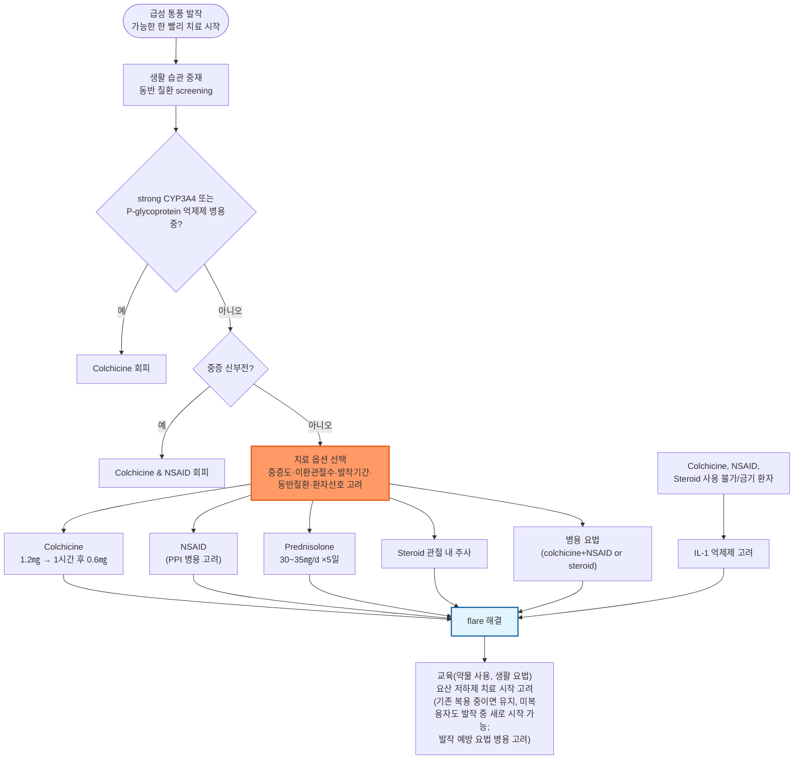
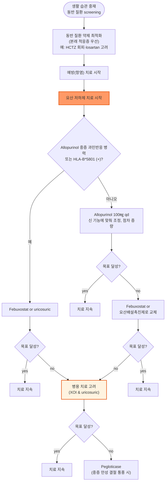

# 통풍 Gout

## <mark style="color:green;">일반 사항</mark>

* 고요산혈증(＞6.8 ㎎/㎗) 등의 요인에 의하여 monosodium urate(MSU) 결정체가 관절에 축적되어 염증성 관절염이 발생하는 대사 질환
* 유병률 : 국내 40대 이상 남성에서 3% 이상, 최근 서구화된 식습관·비만·고령화로 증가 추세
* 초기에는 보통 단일 관절에 발생하며 첫 발작은 치료에 잘 반응함
  * 증상 지속 기간 : 치료하는 경우 5\~8일, 치료하지 않는 경우 \~10일
* 발작 후 고요산혈증이 지속되면 빈번히 재발하고 통증이 심해지며 치료에 대한 반응이 나빠지고 여러 관절이 이환되고 요산염 결정체가 tophi를 만들어 관절의 영구적 손상을 일으킬 수 있음
* 재발 : 첫 증상 발생 후 1년 내 60%, 2년 내 80%에서 재발
* serum urate(SU) 수준에 따른 연간 통풍 발작 발생률 : 7.0\~8.9 ㎎/㎗ - 0.5%, ＞9 ㎎/㎗ - 4.5%
* SU 수치 수준과 통풍 발병 및 증상 수준이 일치하지는 않음 ; 급성 발작 중 25\~40%에서 SU 수치가 정상이며 만성적으로 고요산혈증이 있는 사람의 ⅔에서 증상이 발생하지 않음
* SU 수준의 급격한 변동(증가 또는 감소)이 증상 발생과 관련이 있음
* 요산 결정은 신장에도 생길 수 있으며 uric acid kidney stone을 일으킬 수 있음
  * 통풍 관절염 환자의 5\~10%에서 신결석이 발생하며, 결석 발생은 SU 수준과 상관관계가 있음

## <mark style="color:green;">원인 및 위험 인자</mark>

* 고요산혈증 : 요산염의 과잉 생산 &/or 과소 배출
  * 생산 증가 : 골수 증식 이상, 적혈구증가증, 용혈 질환, 종양, 건선, 임신중독증, Vit B12 결핍, 알코올, 비만, 과도한 퓨린/과당 섭취, nicotinic acid, cytotoxic drug
  * 배출 감소 : 신부전, 심부전, 체액 소실, 갑상선저하증, 부갑상선항진증, 케톤산증, 전자간증, 건선, 비만, 소금 섭취 제한, 알코올, 이뇨제, ethambutol, pyrazinamide, levodopa, aspirin
* 요산염 용해도의 일시적 변화 : 국소 체온 하강, 외상, 산혈증

### <mark style="color:orange;">위험 인자</mark>

* purine(붉은 고기, 해산물), 알코올(특히 맥주, 위스키, 진, 보드카, 럼), 과당, 청량음료
* 비만(특히 BMI ＞30), 과식 또는 금식, 스트레스
* ＞40세, 남성, 흡연, 가족력
* 외상, 감염, 수술, 다제약물 복용(특히 이뇨제, 저용량 aspirin, cyclosporine, tacrolimus)
* 이상지질혈증, 고혈압, 당뇨병, 고인슐린혈증, 관상동맥병, CHF, 만성 신질환, 장기 이식
* 요산 저하제(ULT) 치료 시작 시기 - 급격한 SU 변동으로 오히려 발작 위험이 일시적으로 증가할 수 있음

## <mark style="color:green;">임상 양상</mark>

* 갑작스런 극심한 관절 통증("스치기만 해도 아프다"), 주로 이른 아침 발생("아파서 잠에서 깨어났다") → 12\~24시간 동안 빠르게 진행
  * 주요 이환 관절 : 1st toe MTP 관절(가장 흔함), 발, 발목, 팔꿈치, 손가락 ; 고관절, 어깨는 드묾
* 통증 외 국소 증상 : 부종, 발적, 발열, 관절 변형(치료하지 않은 만성 통풍 환자에서 발생)
* 전신 증상 : 간혹 전신 발열, 오한
* tophi(요산 결절) : 첫 발생 수년 후 귓바퀴, olecranon process, Achilles tendon 등에 발생

### <mark style="color:$danger;">🚩 Red Flags!</mark>

<mark style="color:$danger;">**즉각 조치 또는 의뢰**</mark>

* 발열, 관절 부종·발적·열감을 동반한 급성 단관절염 → **패혈성 관절염** 감별 필요 ; 통풍과 패혈성 관절염은 동시 발생 가능하므로 통풍 병력만으로 배제하지 말고 관절 천자(활액 그람염색·배양) 우선 시행
* 급성 단관절염 + 전신 독성 징후(고열, 저혈압, 빈맥, 의식 변화) → 패혈증 의심, 응급 이송
* 면역저하 상태(고용량 steroid, 생물학적제제, 장기 이식, 조절되지 않는 당뇨병)에서 발생한 급성 관절염 → 감염 위험이 높아 패혈성 관절염 배제 우선

<mark style="color:$warning;">**당일 또는 조기 의뢰**</mark>

* 인공 관절(prosthetic joint) 주변의 급성 관절염 → 정형외과·감염내과 협진
* 진단이 불명확한 다관절염(대칭성, 소관절 침범 등) → RA 등 감별을 위해 류마티스내과 협진 고려
* 진행성 신기능 저하(CKD stage ≥3) 환자에서 급성 발작 약물 선택이 어려운 경우 → 신장내과 자문 고려
* Tophi 파열·궤양 또는 국소 감염 징후 동반 → 외과적 평가 고려

<mark style="color:$info;">**외래 추적 / 추가 평가 계획**</mark> <mark style="color:$info;">- 즉각 위험 낮으나 호전 없으면 의뢰</mark>

* 충분한 용량의 1차 치료(colchicine/NSAID/steroid)에도 5\~7일 이상 반응 없음 → 진단 재평가, 류마티스내과 의뢰
* 요산 저하제 치료 중임에도 목표 SU 미도달 또는 연 ≥2회 재발 지속 → 약제 변경·병용 고려
* Tophi가 요산 저하제 치료에도 해결되지 않음 → 치료 강화 또는 pegloticase 고려

## <mark style="color:green;">진단</mark>

* synovial fluid analysis로 진단하며(모든 통풍 의심 환자에서 검사 권고) 이것이 어려운 경우 임상적으로 판단 ; SU 수준만으로 진단하지 않음 \[EULAR, 2018년 개정 진단 권고]

### <mark style="color:orange;">Gout classification criteria</mark>


2015 ACR/EULAR gout 분류 기준 - 역학·임상시험 목적의 분류 기준이며 개별 환자 진단을 대체하지 않음


* Step 1 : 말초 관절 또는 bursa에서의 부종, 통증, 또는 압통이 ≥1 episode
* Step 2 : 증상이 있는 관절이나 윤활낭에 MSU crystal 존재 또는 tophus 관찰 시 통풍 진단
* Step 3 : Step 2에 해당되지 않거나 적용하지 않는 경우 다음 평가에서 ≥8점 시 통풍 진단
  1. ankle 또는 midfoot(하나 또는 소수의 관절) 이환 : 1st MTPJ 미포함 시 1점, 1st MTPJ 포함 시 2점
  2. 다음 중 해당되는 증상 개수 ① 이환부위 홍반, ② 접촉 또는 압박을 참을 수 없음, ③ 이환된 관절을 사용하여 걷거나 활동할 수 없음 : 1개 - 1점, 2개 - 2점, 3개 - 3점
  3. 다음 중 ≥2개 해당되는 전형적인 episode의 발생 횟수 ① 최대 통증 지속 시간이 ＜24시간, ② ≤14일 증상 소멸, ③ 증상 삽화 사이에 전혀 증상이 없는 시기가 있음(NSAID 투여 무관) : 1회 - 1점, 반복 - 2점
  4. tophus의 임상적 소견¹⁾ 양성 시 4점
  5. 혈청 urate 수준²⁾ : ＜4 ㎎/㎗ - -4점, ＜6 ㎎/㎗ - 0점, ＜8 ㎎/㎗ - 2점, ＜10 ㎎/㎗ - 3점, ≥10 ㎎/㎗ - 4점
  6. 증상이 있는 관절 또는 bursa synovial fluid 분석 MSU (-) 시 -2점
  7. urate deposition(초음파 또는 DECT) (+) 시 4점
  8. 통풍 관련 관절 손상(손/발에 대한 전통적인 영상 검사) (+) 시 4점

_¹⁾ Draining or chalk-like subcutaneous nodule under transparent skin, often with overlying vascularity, located in typical locations: joints, ears, olecranon bursae, finger pads, tendons (e.g., Achilles)_\
_²⁾ 요산 저하제 사용 전 및 발작＞4주 후(무증상기)에 측정_

### <mark style="color:orange;">실험실 검사</mark>

* 혈청 요산(SU) : 요산 저하제 사용 전 및 발작 ＞4주 후 또는 무증상기에 측정
* WBC, ESR, CRP : 급성 발작 중 상승함
* synovial fluid or tophus analysis : MSU 결정체 확인 ; WBC 관찰, 필요시 배양 검사(패혈성 관절염 감별)
* 24시간 소변 요산 : routine 검사는 권하지 않으며, 젊은 연령에서 매우 심한 고요산혈증, 반복적 요산 결석, 유전성 질환 또는 요산 과잉생성 상태가 의심되는 경우 선택적으로 고려
* Hb, WBC, LFT, s-Cr, 지질, U/A : 통풍 후유증/동반 질환 감시를 위해 진단 시 및 추적 검사
* HLA-B\*5801 allele 선별 검사 : allopurinol hypersensitivity syndrome 위험 증가와 관련 ; 한국인을 포함한 동아시아인에서 보유율이 높음(문헌에 따라 4\~12%대로 보고, 백인 1\~2%) - allopurinol 투여 전 검사 권고 \[ACR 2020, CPIC]

### <mark style="color:orange;">영상 검사</mark>

* X선 검사 : 초기에는 보통 정상 ; 만성의 경우 석회화 결절, 골극, 관절 가장자리 침식 발생
* 초음파 검사 : tophi 관찰(신체검사에서 발견되지 않는 작은 tophi도 관찰 가능), double contour sign

### <mark style="color:orange;">감별 진단</mark>

* 급성 단관절염으로 내원한 경우 감별해야 할 주요 질환들 - 특히 패혈성 관절염은 반드시 배제

<table><thead><tr><th width="140">질환</th><th width="260">통풍과의 차이점</th><th>핵심 감별 포인트</th></tr></thead><tbody><tr><td>패혈성 관절염</td><td>세균 감염에 의한 관절염 ; 통풍과 동시 발생 가능하며 임상 양상만으로 완전히 구분 어려움</td><td>발열·전신 독성 징후 ; 활액 그람염색/배양 (+) ; 지연 시 관절 파괴·패혈증 위험 → 감별 우선</td></tr><tr><td>가성통풍(CPPD)</td><td>Ca pyrophosphate 결정에 의한 관절염 ; 통풍과 임상상 매우 유사</td><td>호발 부위(무릎 등), 고령, X선 연골석회화 ; 편광현미경에서 양성 복굴절 결정 (☞ 가성통풍 참조)</td></tr><tr><td>봉와직염</td><td>피부·연부조직 감염 ; 관절강 침범 없음</td><td>관절보다 넓은 경계 불명확한 발적 ; 관절 운동 범위는 비교적 유지</td></tr><tr><td>류마티스 관절염</td><td>자가면역성 만성 다발 관절염</td><td>대칭적 소관절 침범, 조조강직 ＞1시간, RF/anti-CCP 양성</td></tr><tr><td>건선성 관절염/반응성 관절염</td><td>혈청음성 척추관절병증</td><td>건선 병력, 부착부염, 손발가락염(dactylitis)</td></tr><tr><td>골관절염 급성 악화</td><td>퇴행성 관절 질환</td><td>서서히 진행, 사용 시 악화, 발적·발열 상대적으로 경미</td></tr></tbody></table>

## <mark style="color:green;">무증상 고요산혈증 (Asymptomatic Hyperuricemia)</mark>

* 선별 검사 : 권하지 않음
* 치료 : 무증상 고요산혈증 자체만을 이유로 일률적인 요산 저하제 치료를 시행하는 것은 일반적으로 권하지 않음
  * 대부분의 고요산혈증 환자에서 통풍이 발생하지 않음
  * CKD 진행 억제만을 목적으로 요산 저하제를 투여했을 때의 임상적 이득은 확립되어 있지 않으며, 무증상 고요산혈증의 신장 보호 목적 치료에 대해서는 근거가 불충분함 [KCR 2023]
  * 심혈관 질환과의 연관성도 관찰연구에서 반복적으로 보고되나, 멘델리안 무작위화(Mendelian randomization) 연구들은 요산치와 심혈관 위험 사이의 인과관계를 뒷받침하지 못하고 있어 심혈관 예방 목적의 요산 저하 치료는 아직 근거가 불충분함
* 예외 : acute urate nephropathy(예 : 종양용해증후군 위험군) 예방 등 별도의 적응증이 있는 경우에는 요산 저하 치료를 고려

***


```mermaid
graph TD
    Start(["급성 통풍 발작<br/>가능한 한 빨리 치료 시작"]) --> Habit["생활 습관 중재<br/>동반 질환 screening"]
    Habit --> CYP{"strong CYP3A4 또는<br/>P-glycoprotein 억제제 병용중?"}
    CYP -->|예| AvoidColch["Colchicine 회피"]
    CYP -->|아니오| Renal{"중증 신부전?"}
    Renal -->|예| AvoidBoth["Colchicine & NSAID 회피"]
    Renal -->|아니오| Options["치료 옵션 선택<br/>중증도·이환관절수·발작기간·동반질환·환자선호 고려"]
    Contra["Colchicine, NSAID,<br/>Steroid 사용 불가/금기 환자"] --> IL1["IL-1 억제제 고려"]
    Options --> Colch["Colchicine<br/>1.2㎎ → 1시간 후 0.6㎎"]
    Options --> NSAIDopt["NSAID<br/>(PPI 병용 고려)"]
    Options --> Pred["Prednisolone<br/>30~35㎎/d ×5일"]
    Options --> IAsteroid["Steroid 관절 내 주사"]
    Options --> Combo["병용 요법<br/>(colchicine+NSAID or steroid)"]
    Colch --> Resolve["flare 해결"]
    NSAIDopt --> Resolve
    Pred --> Resolve
    IAsteroid --> Resolve
    Combo --> Resolve
    IL1 --> Resolve
    Resolve --> Edu["교육(약물 사용, 생활 요법)<br/>요산 저하제 치료 시작 고려<br/>(기존 복용 중이면 유지, 미복용자도 발작 중 새로 시작 가능;<br/>발작 예방 요법 병용 고려)"]
    style Options fill:#f96,stroke:#e65100,stroke-width:2px
    style Resolve fill:#e1f5fe,stroke:#01579b,stroke-width:2px
```

<p align="center"><strong>급성 통풍 발작의 관리 알고리듬</strong></p>

<p align="center"><em><mark style="color:$info;">Ref. Evidence-based recommendations for the management of gout. EULAR 2016. Fig 1.</mark></em></p>

***

## <mark style="background-color:$warning;">Management</mark>


**급성기-만성기는 별개의 결정** - 급성 발작 치료(항염증)와 요산 저하제(ULT) 치료(요산 조절)는 각각 독립적으로 판단하며, 이미 ULT를 투여 중이던 환자는 발작 중에도 **중단하지 않고 유지**한다.


### <mark style="color:orange;">치료 방침</mark>

* 급성 발작기에는 염증 조절이 목표, 만성기에는 SU 강하를 통한 재발·합병증 예방이 목표
* 가능한 한 24시간 내(늦어도 36시간 내) 급성기 치료 시작
* 1차 선택제 : colchicine, NSAID, steroid ; 우선순위 없음, 환자 선호·동반 질환에 따라 선택
* 대체 : Colchicine, NSAID, steroid 사용이 모두 어려운 경우 IL-1 억제제(anakinra, canakinumab) 고려
* 중등증 이하의 증상에 대하여 단일 제제 투여, 반응하지 않는 경우 약제 추가
* 초기 복합 치료 대상 : 급성 중증 발작, 여러 관절(≥4개 관절 또는 ≥3개 큰 관절) 이환
* 복합 치료 조합 : NSAID+colchicine, colchicine+경구 steroid, 관절 내 steroid+다른 치료


**발작 중 요산 저하제(ULT) 시작 가능 여부**\
과거에는 발작 기간 중 ULT를 새로 시작하면 증상이 악화될 수 있다고 보아 회피하였으나, 근래 연구들에서 유의미한 통증 악화를 일으키지 않는 것으로 나타났고 증상이 있을 때 환자의 치료 의지가 강한 점을 감안하여 **발작 기간 중에도 새로이 ULT를 시작할 수 있는 것으로 변경**됨 \[ACR 2020]. 다만 새로 시작하는 경우 NSAID 등 항염제를 병용 \[KCR 2023]


***

## <mark style="color:green;">비-약물 치료 및 예방</mark>

### <mark style="color:orange;">급성기</mark>

* 냉찜질
* 휴식(이환 관절 부하 회피), 필요시 거상

### <mark style="color:orange;">예방(만성기)</mark>

* 충분한 수분 섭취 : 목표 소변량 - ＞2 L/d ; 음식을 통한 섭취(0.5\~1 L/d)를 감안하여 음료로서 ＞1\~1.5 L/d 섭취 권고
* 적정 체중 유지, 규칙적 운동, 금연
* 금주(주종에 관계없이 금주 또는 남성 ≤2 SD/d, 여성 ≤1 SD/d)
* 적절한 심혈관 적응증으로 복용 중인 저용량 aspirin은 요산 상승만을 이유로 중단하지 않음 \[ACR 2020, 근거 수준 매우 낮음]
* 동반 질환약제(항고혈압제, SGLT2 억제제 등) 최적화는 요산 저하제 항목의 "동반 질환에 따른 약제 선택 최적화" 참조(☞ 하단)

#### <mark style="color:$primary;">식사 관리</mark>

<table><thead><tr><th width="110">구분</th><th>내용</th></tr></thead><tbody><tr><td>금지</td><td>내장(예: 간, 콩팥, 위, 곱창), 육즙, 고과당 음료</td></tr><tr><td>제한</td><td>소/돼지/양/닭/오리 고기, 등 푸른 생선(예: 멸치, 정어리, 청어, 참치, 송어), 굴/조개/갑각류(예: 가재, 게, 새우), 설탕 및 함유 식품/음료, 소금</td></tr><tr><td>권장</td><td>저지방 유제품, 채소, 커피(적정량)</td></tr></tbody></table>

_✽채소류의 퓨린 함량은 육류·해산물과 달리 통풍 위험 증가와 뚜렷한 관련이 없다는 보고가 있어, 퓨린이 있다는 이유만으로 채소 섭취를 과도하게 제한할 필요는 없음_

## <mark style="color:green;">약물 치료</mark>

### <mark style="color:orange;">급성 발작 치료</mark>


**⚠️ Colchicine 중독 위험 - 좁은 치료 지수, 해독제 없음**\
Colchicine은 치료 용량과 중독 용량의 차이가 작고 특이 해독제가 없어 과량 복용 또는 병용금기 약물과의 상호작용으로 사망 사례가 보고되어 있음. Strong CYP3A4/P-당단백 억제제(예: clarithromycin, itraconazole, ketoconazole, ritonavir, cyclosporine)와의 병용은 **회피**하고, 신/간 기능 저하 환자에서는 반드시 감량 투여


#### <mark style="color:$primary;">Colchicine</mark>

* 발작 즉시(늦어도 36시간 내) 투여 시 효과
* 용법 : 초회 1.2 ㎎ → 1시간 후 0.6 ㎎ → 12시간 후부터 0.6 ㎎ qd\~bid ×1\~2d
* 부작용 : 소화기 증상(구역, 구토, 복통, 설사), 신경근육병증, 재생불량빈혈, 간/신 기능 저하
* 주의 : 간/신 기능 장애, CRF, CYP450 3A4 억제제·P-당단백 억제제 병용(상단 경고 참조)

#### <mark style="color:$primary;">NSAID</mark>

* 최대 용량으로 2일간 투여, 이후 감량, 증상 회복까지 투여(보통 5\~10일)
* 약제간의 일반적인 효과 차이는 없음
* 주의 : 소화성 궤양, 신 기능 저하 ; CKD 또는 심부전 환자에서는 회피 고려
* naproxen : 초회 750 ㎎ 이후 250 ㎎ tid, 또는 500 ㎎ bid <mark style="color:blue;">\[아나프록스, 낙센]</mark>
* ibuprofen : 600 ㎎ qid 또는 800 ㎎ tid, 최대 3.2 g/d <mark style="color:blue;">\[부루펜]</mark>

#### <mark style="color:$primary;">Steroid</mark>

* 타약제로 호전되지 않거나 사용할 수 없는 경우(예 : 신기능 저하로 colchicine·NSAID 회피 대상) 고려
* 짧은 단기요법은 tapering 없이 종료할 수 있으며, 발작이 심하거나 치료기간을 연장하는 경우 임상 경과에 따라 tapering 고려
* prednisolone : 30\~40 ㎎(약 0.5 ㎎/㎏)/d ×3\~5d ; 반응이 불충분하거나 치료기간이 길어진 경우 필요에 따라 감량 <mark style="color:blue;">\[소론도]</mark>
* methylprednisolone : 40 ㎎ 또는 0.5\~2.0 ㎎/㎏ IV/IM 1회 <mark style="color:blue;">\[솔루메드롤 주]</mark>
* triamcinolone 관절 내 주사 : 큰 관절 1\~2개 침범 시 10\~40 ㎎ ; 단관절/소수관절 발작에서 독립적인 1차 치료 선택지로 고려하며, 다관절 또는 중증 발작에서는 필요에 따라 다른 항염증 치료와 병용
  * 패혈성 관절염이 의심되면 관절 내 steroid 주사 전에 윤활액을 흡인하여 그람염색·배양 등으로 감염을 우선 배제

#### <mark style="color:$primary;">IL-1 억제제</mark>

* 대상 : colchicine, NSAID, steroid 모두 사용 불가하거나 반응하지 않는 난치성 발작
* anakinra, canakinumab : 국내 통풍 적응증으로는 허가되어 있지 않음(오프라벨, 제한적 사용 - 처방 전 급여·허가 상태 확인 필요)
  * anakinra 참고 용법(문헌 기준, 국내 허가 용법 아님) : 100 ㎎ SC qd ×3\~5일 ; 류마티스내과 자문 하에 병원 내 사용 상황에 한해 고려

### <mark style="color:orange;">요산 저하제 (Urate Lowering Therapy, ULT)</mark>

* ULT 시행 대상 : 재발성 통풍(≥2회/년), ≥1개의 피하 요산 결절, 영상 검사에서 나타나는 통풍에 의한 손상
* ULT 고려 대상 : 이전 통풍 발작이 ≥1회 있으나 빈도가 연 2회 미만인 경우 - 환자 선호·동반 질환·재발 위험을 고려하여 개별적으로 결정 [ACR 2020]
* 첫 번째 통풍 발작 환자는 다음에 해당되는 경우 치료 권고 : SU ＞9 ㎎/㎗, CKD stage ≥3, 요로 결석 존재 시
* 목표 SU : ＜6 ㎎/㎗ ; tophi, 만성 통풍성 관절병증, 잦은 발작 등 중증 통풍에서는 결정 침착 해소를 촉진하기 위해 ＜5 ㎎/㎗를 고려 [EULAR]
* 저용량에서 시작하여 점차 증량(treat-to-target) \[ACR 2020 Strong recommendation]


**동반 질환에 따른 약제 선택 최적화**\
· 고혈압 : hydrochlorothiazide 회피, losartan 우선 고려(경미한 uricosuric 효과)\
· 이상지질혈증 : statin 대비 fenofibrate로 교체를 목적으로 처방하지는 않음(요산 저하 효과가 있으나 이상지질혈증 1차 치료 원칙이 우선) ; 이미 fenofibrate가 적응증에 맞는 경우 부가적 요산 저하 효과 기대 가능\
· 당뇨병·심부전·CKD 동반 시 : SGLT2 억제제는 본래 적응증에 따라 선택하되, 부가적으로 혈청 요산 감소 및 통풍 위험 감소 효과가 보고됨(ULT 대체 목적 아님) [JACC 2024]


* 투여 기간 : 목표 SU를 유지하면서 장기간 지속하는 것이 원칙이며, 특별한 부작용이나 치료 부담이 없다면 무기한 지속을 권고 [KCR 2023, ACR 2020]
* 장기간 임상적 관해(예 : ≥1년 발작 없음, tophi 없음)에 도달한 일부 환자에서 감량·중단을 개별적으로 논의할 수 있으나, 중단 후 재발 위험이 높고 이를 지지하는 근거가 매우 제한적이므로 routine discontinuation은 권하지 않음
* 종류
  * 요산 합성 억제제(xanthine oxidase inhibitors, XOI) : 1차 선택 ; allopurinol, febuxostat
  * 요산 배설 촉진제(uricosuric drugs) : benzbromarone, probenecid, losartan(보조적)
  * 요산 분해제(uricolytic drugs) : pegloticase
* 적절한 XOI 투여에도 불구하고 SU가 높은 상태(＞6 ㎎/㎗) 지속 및 투여 중 통풍 발작이 반복(＞2회/년)되는 경우, OR 피하 tophi가 해결되지 않는 경우 다른 계열로의 교체 또는 병용을 고려
* 모니터링
  * 목표 도달까지 2\~4주마다 검사 및 용량 조절 : 검사 항목 - SU, CBC, LFT, RFT, U/A
  * 용량이 정해지면 1\~2회/년 주기로 검사

***


```mermaid
graph TD
    Start2(["생활 습관 중재<br/>동반 질환 screening"]) --> Adjust["동반 질환 약제 최적화<br/>(본래 적응증 우선)<br/>예: HCTZ 회피·losartan 고려"]
    Adjust --> PreventStart["예방(항염) 치료 시작"]
    PreventStart --> ULTstart["요산 저하제 치료 시작"]
    ULTstart --> AlloAllergy{"Allopurinol 중증 과민반응 병력<br/>또는 HLA-B*5801 (+)?"}
    AlloAllergy -->|아니오| Allo["Allopurinol 100㎎ qd<br/>신 기능에 맞춰 조정, 점차 증량"]
    AlloAllergy -->|예| FebOrUric["Febuxostat or uricosuric"]
    Allo --> Goal1{"목표 달성?"}
    Goal1 -->|yes| Cont1["치료 지속"]
    Goal1 -->|no| Switch["Febuxostat or<br/>요산배설촉진제로 교체"]
    FebOrUric --> Goal2{"목표 달성?"}
    Goal2 -->|yes| Cont2["치료 지속"]
    Goal2 -->|no| Combo2["병용 치료 고려<br/>(XOI & uricosuric)"]
    Switch --> Goal3{"목표 달성?"}
    Goal3 -->|yes| Cont3["치료 지속"]
    Goal3 -->|no| Combo2
    Combo2 --> Goal4{"목표 달성?"}
    Goal4 -->|yes| Cont4["치료 지속"]
    Goal4 -->|no| Peg["Pegloticase<br/>(중증 만성 결절 통풍 시)"]
    style ULTstart fill:#f96,stroke:#e65100,stroke-width:2px
    style Combo2 fill:#fff3e0,stroke:#e65100,stroke-width:2px
```

<p align="center"><strong>고요산혈증 통풍 환자의 관리 알고리듬</strong></p>

<p align="center"><em><mark style="color:$info;">Ref. Evidence-based recommendations for the management of gout. EULAR 2016. Fig 2.</mark></em></p>

***

#### <mark style="color:$primary;">요산 합성 억제제 (XOI)</mark>

**Allopurinol**

* 1차 선택제
* 작용 : xanthine oxidase 억제
* 부작용 : 발진, 가려움, 간 효소 수치 증가, eosinophilia ; 이뇨제, Pc 계열 병용 시 증가
* 주의 : warfarin과 상호 작용
* 용법 : 시작 100 ㎎ qd(CKD stage 4,5 시 50 ㎎) → 2\~4주마다 증량, 최대 800 ㎎/d\
  → 유지 100\~300 ㎎/d ; HLA-B\*5801 양성인 경우 allopurinol은 회피하고 대체 약제를 선택 <mark style="color:blue;">\[자이로릭]</mark>\
  ※ 부작용을 최소화하기 위하여 ≤100 ㎎/d, eGFR이 낮은 환자에서는 ≤50 ㎎/d로 시작 \[ACR 2020]
  ※ 위 저용량 시작 원칙은 **초기 투여 시** 안전성을 위한 것이며 평생 용량 상한이 아님 ; 발진 등 과민반응 징후가 없다면 CKD 환자에서도 목표 SU(＜6 ㎎/㎗) 도달을 위해 2\~4주 간격으로 신중히 증량 가능(treat-to-target) \[ACR 2020]
* colchicine과 병용 가능


**⚠️ Allopurinol 과민반응 증후군(AHS) / SCAR**\
CKD 환자에서 ＞100 ㎎/d으로 투여를 시작하는 것은 Stevens-Johnson syndrome, toxic epidermal necrolysis 등 중증 피부 부작용 위험 증가와 관련이 있음. HLA-B\*5801 양성인 경우 allopurinol을 피하고 대체 약제(febuxostat, 요산배설촉진제)를 선택 \[CPIC, ACR 2020]


**Febuxostat**

* 작용 : 선택적 xanthine oxidase 억제, nonpurine analogue
* 장점 : 경증\~중등도 신장애(CrCl ≥30)에서는 일반적으로 용량 조절이 필요하지 않음 ; 중증 신장애(CrCl ＜30)에서는 임상 자료가 제한적이므로 40 ㎎/d로 제한하고 신중히 사용(허가사항에 따라 차이 있어 처방 전 확인 필요)
* 용법 : 40 ㎎ qd → 목표 SU 미도달 시 80 ㎎ qd <mark style="color:blue;">\[페브릭]</mark> ; 국내 허가 최대 용량 80 ㎎/d
* 통풍 발작 예방 효과는 allopurinol에 열등하지 않다는 보고가 있음


**⚠️ 심혈관 사망 위험 경고 (CARES trial, FDA Boxed Warning)**\
기존 심혈관 질환 병력이 있는 통풍 환자에서 febuxostat이 allopurinol 대비 심혈관 사망률을 높였다는 CARES trial(NEJM, 2018) 결과로 FDA가 boxed warning을 부여함(2019). 이후 EMA 의무 후속 연구 및 FAST trial 등에서는 두 약제 간 심혈관 사건·전체 사망률에 유의한 차이가 없었다는 상반된 보고도 있어 논란이 있으나, ACR 2020은 **이미 febuxostat을 복용 중인 환자가 심혈관 질환 병력이 있거나 새로 심혈관 사건이 발생한 경우 다른 ULT로 교체할 것을 조건부 권고**함 \[ACR 2020, Conditional]. 같은 맥락에서 **심혈관 질환 기왕력이 있는 환자는 allopurinol을 1차로 사용**하고 febuxostat은 allopurinol에 반응이 없거나 불내약성인 경우로 제한하는 것이 신중함


#### <mark style="color:$primary;">요산 배설 촉진제</mark>

**Benzbromarone**

* 작용 : 신세뇨관에서 urate 재흡수 차단(URAT1 억제)으로 요산 배설 촉진
* 국내에서 실제로 가장 흔히 사용되는 요산배설촉진제 <mark style="color:blue;">\[유리논, 날카리신]</mark>
* 대상 : XOI 투여 곤란 또는 효과 부족 시 대체 또는 추가 투여
* 주의/금기 : 간독성(드물지만 치명적 간부전 보고 - 정기적 LFT 모니터링 필요), 신 기능 저하(CrCl ＜20), 요로 결석 병력
* 부작용 : 광과민 반응, 위장 장애, 설사
* 용법 : 25\~50 ㎎ qd로 시작, 유지 50 ㎎ qd\~tid

**Probenecid**

* 국내 유통·처방 빈도는 낮음(도입·유통 상태 처방 전 확인 필요)
* 대상 : XOI 투여 곤란 또는 효과 부족 시 대체 또는 추가 투여
* 주의/금기 : 신 기능 저하(CrCl ＜50), 요로 결석 병력 ; 저용량 aspirin 병용 시 uricosuric 효과가 감소할 수 있으나, 적절한 심혈관 적응증으로 복용 중인 aspirin을 이를 이유로 중단하지 않음
* 부작용 : 요로 결석 ; 예방을 위하여 알칼리화제(예 : 구연산칼륨 30\~80 mEq/d) 투여 고려
* 용법 : 500 ㎎ qd\~bid로 시작, 최대 3 g/d

#### <mark style="color:$primary;">요산 분해제</mark>

**Pegloticase**

* 작용 : 요산의 수용성 purine 분해 산물인 allantoin으로의 전환을 촉진
* 대상 : 다른 치료로 SU 목표 달성 실패 및 잦은 재발(≥2/년), 해결되지 않는 피하 tophi
* 부작용 : anaphylaxis, infusion reaction ; **국내 미도입 - 현재 국내에서는 처방이 사실상 불가능**(해외 진료·특례수입 등 예외적 경로 확인 필요)
* 용법 : 8 ㎎ IV 격주

### <mark style="color:orange;">발작 예방 항염 요법 (Anti-inflammatory Prophylaxis)</mark>

* 요산 저하제 투여 초기의 통풍 발작 발생에 대비하여 항염제 병용 투여를 고려 \[ACR 2020 Strong recommendation]
* 투여 기간 : 최소 3\~6개월 [ACR 2020]
* 이후 최근 flare 발생 여부, tophi 및 목표 SU 도달 여부를 평가하여 예방 요법 연장을 고려
* 저용량 colchicine : 0.6 ㎎ qd\~bid ; 신부전 시 감량 <mark style="color:blue;">\[콜킨]</mark>
* 저용량 NSAID : naproxen 250 ㎎ bid <mark style="color:blue;">\[아나프록스]</mark>
* 저용량 steroid : colchicine 및 NSAID를 사용할 수 없거나 효과 부족 시 고려
  * prednisolone : 5\~10 ㎎ qd 아침 <mark style="color:blue;">\[소론도]</mark>

***

### <mark style="color:red;">질병코드</mark>

M10 통풍

M10.0 특발성 통풍

M10.9 상세불명의 통풍

***

## <mark style="color:purple;">처방례</mark>

> **처방례 1. 급성 발작 - 경증/중등도**
>
> ```
> 콜킨 0.6 ㎎/T 2T stat → 1시간 후 1T  (급성기 loading)
> 낙센 에프 500 ㎎/T 2T #2
> ```
>
> _✽Colchicine은 발작 초기에 저용량 loading regimen(1.2 ㎎ → 1시간 후 0.6 ㎎)으로 사용 ; NSAID와의 병용 여부는 발작 중증도와 동반 질환을 고려하여 결정_

> **처방례 2. 급성 발작 - 중증 또는 다관절 이환**
>
> ```
> 소론도정(prednisolone 5 ㎎) 6T qd  ×3~5d  (필요 시 임상 경과에 따라 감량)
> 콜킨 0.6 ㎎/T 2T #2  ×3d
> ```
>
> _✽초기 복합 치료 대상(≥4개 관절 또는 ≥3개 큰 관절 이환)에서 경구 steroid + 저용량 colchicine 병용_

> **처방례 3. 신기능 저하 환자의 급성 발작**
>
> ```
> 소론도정(prednisolone 5 ㎎) 6T qd  ×3~5d
> 또는 트리암시놀론 관절강내 주사 10~40 ㎎  (1~2개 관절 이환 시, 감염 배제 후)
> ```
>
> _✽CKD stage ≥3 등 신기능 저하 환자에서는 NSAID·고용량 colchicine을 회피하고 steroid(경구/근주/관절강내)를 우선 고려_

> **처방례 4. 요산 저하제 치료 시작(예방 요법 병용)**
>
> ```
> 자이로릭 100 ㎎/T 1T qd
> 콜킨 0.6 ㎎/T 1T qd  (예방 요법, 최소 3~6개월)
> ```
>
> _✽ULT 시작 시 초기 발작 예방을 위해 저용량 colchicine을 최소 3\~6개월 병용 ; 2\~4주마다 SU 확인 후 증량_

> **처방례 5. Allopurinol 알레르기 또는 HLA-B\*5801 양성 환자**
>
> ```
> 페브릭 40 ㎎/T 1T qd
> ```
>
> _✽HLA-B\*5801 양성이거나 allopurinol 과민반응 병력이 있는 경우 febuxostat으로 대체 ; 심혈관 질환 기왕력이 있으면 위험-이익을 재평가_

***

### <mark style="color:$success;">핵심 복약 지도</mark>

> **Colchicine 복용 시 주의**
>
> * 발작 시작 후 가능한 한 빨리(늦어도 36시간 내) 복용을 시작해야 효과가 좋습니다.
> * 구역, 구토, 설사 등 소화기 증상이 나타나면 용량 조절 또는 중단이 필요할 수 있으므로 알려주세요.
> * clarithromycin, itraconazole 등 특정 항생제·항진균제와 병용하면 중독 위험이 높아지므로 새로운 약 처방 시 반드시 colchicine 복용 사실을 알려야 합니다.

> **Allopurinol 시작 시 발진 교육**
>
> * 복용 시작 후 수 주 이내 피부 발진, 가려움, 발열이 나타나면 **즉시 복용을 중단**하고 병원에 방문하도록 안내합니다. 중증 피부 부작용(SJS/TEN)의 초기 징후일 수 있습니다.
> * 신기능에 따라 저용량으로 시작하여 서서히 증량함을 설명합니다.

> **요산 저하제 시작 초기의 발작 증가 가능성**
>
> * 요산 저하제를 새로 시작하면 오히려 일시적으로 발작이 증가할 수 있음을 미리 설명하고, 예방을 위한 저용량 colchicine/NSAID를 함께 처방한 이유를 안내합니다.
> * 임의로 요산 저하제를 중단하지 않도록 하며, 발작이 있어도 이미 복용 중인 요산 저하제는 유지해야 함을 강조합니다.

> **NSAID·Steroid 단기 사용 시 주의**
>
> * NSAID는 위장관 출혈·궤양 위험이 있으므로, 필요시 PPI 병용을 고려하고 흑색변·토혈 등 출혈 징후 발생 시 즉시 알리도록 안내합니다.
> * 경구 steroid는 며칠간의 단기 사용이라도 일시적 혈당 상승을 일으킬 수 있어, 당뇨병 환자는 복용 기간 중 혈당을 더 자주 확인하도록 안내합니다.

> **언제 다시 병원을 방문해야 하나요?**
>
> * 발열과 함께 관절이 심하게 붓고 아픈 경우 - 즉시 내원(감염 감별 필요)
> * 1차 치료 후 5\~7일 이상 증상 호전이 없는 경우
> * Allopurinol 복용 후 피부 발진, 가려움, 발열이 발생하는 경우 - 즉시 내원 및 복용 중단
> * Colchicine 복용 후 심한 설사, 근육통, 저림 등이 발생하는 경우

***

### <mark style="color:blue;">환자 안내서</mark>


**통풍, 요산 수치 관리가 재발을 막는 핵심입니다**

통풍은 혈액 속 요산이 오래 쌓여 관절에 결정을 만들면서 생기는 관절염입니다. 한번 발작을 겪으면 재발하기 쉬우므로, 급성 통증을 가라앉히는 치료와 함께 평소 요산 수치를 관리하는 것이 중요합니다.


#### <mark style="color:$primary;">왜 통풍이 생기나요?</mark>

* 혈액 속 요산이 오랫동안 높게 유지되면 바늘 모양의 결정이 관절에 쌓이고, 이 결정에 대한 염증 반응으로 갑작스러운 통증이 발생합니다.
* 붉은 고기, 내장, 등 푸른 생선, 술(특히 맥주), 과당이 많은 음료가 요산을 높이는 대표적인 원인입니다.

#### <mark style="color:$primary;">발작이 왔을 때 어떻게 하나요?</mark>

* **처방받은 약을 최대한 빨리 복용하십시오.** 발작 초기(36시간 이내)에 약을 시작할수록 효과가 좋습니다.
* 이환된 관절은 얼음찜질을 하고, 최대한 부하를 주지 않도록 쉬어 주십시오.
* 이미 요산 저하제(예 : 자이로릭, 페브릭)를 복용 중이라면 **발작이 있어도 임의로 중단하지 마십시오.**

#### <mark style="color:$primary;">일상생활에서 어떻게 관리하나요?</mark>

* **물을 충분히 드십시오.** 하루 2리터 이상의 소변량을 목표로 물을 자주 마시면 요산 배출에 도움이 됩니다. ☕🍷
* **술, 특히 맥주를 피하십시오.** 술은 요산을 높이고 배출을 방해합니다.
* **내장, 육즙, 등 푸른 생선, 단 음료를 줄이십시오.** 저지방 유제품과 채소는 상대적으로 안심하고 드실 수 있습니다.
* **적정 체중을 유지하고 규칙적으로 운동하십시오.** 다만 급격한 체중 감량이나 과도한 금식은 오히려 발작을 유발할 수 있으니 서서히 조절하십시오.

#### <mark style="color:$primary;">약은 어떻게 써야 하나요?</mark>

* 요산 저하제(자이로릭, 페브릭 등)는 매일 꾸준히 복용해야 효과가 있으며, 임의로 중단하면 요산이 다시 올라가 재발할 수 있습니다.
* **자이로릭(알로푸리놀) 복용 후 피부 발진, 가려움, 열이 나면 즉시 복용을 중단하고 병원에 오십시오.** 드물지만 심각한 피부 부작용의 신호일 수 있습니다.
* 콜킨(콜히친)을 복용 중에는 새로운 약(특히 항생제)을 처방받을 때 반드시 콜히친 복용 사실을 알려 주십시오.

#### <mark style="color:$primary;">이럴 때는 즉시 병원을 방문하세요</mark>

* 열이 나면서 관절이 심하게 붓고 아픈 경우
* 약을 먹어도 5일 이상 통증이 나아지지 않는 경우
* 자이로릭 복용 후 피부 발진이나 발열이 생긴 경우

***

## ￭ 가성통풍 Pseudogout, Calcium Pyrophosphate Deposition Disease (CPPD)


2023년 ACR/EULAR CPPD 분류 기준이 발표되면서 "가성통풍"보다 **CPPD(calcium pyrophosphate deposition disease)**라는 포괄적 명칭이 국제적으로 선호되는 추세임. 급성 CPP 결정 유발 관절염을 특히 지칭할 때 "가성통풍"이라는 용어를 사용


## <mark style="color:green;">일반 사항</mark>

* 관절에서의 Ca pyrophosphate 결정체 침착에 의해 유발되는 자가 염증 질환
* 원인 : 특발성, 유전, 외상, 고령
* 발생 부위 : 무릎(가장 흔함), 손목이 전형적이며 어깨, 팔꿈치, 발목 등도 침범 가능 ; 1st MTP 단관절염은 CPPD보다 통풍이 더 전형적
* 관련 질환 : 갑상선저하증, 부갑상선항진증, Mg↓, P↓, 혈색소침착증, 아밀로이드증
* 일반적인 퇴행성 관절 질환의 형태를 보이지 않는 관절염에 대하여 가성통풍 의심

## <mark style="color:green;">임상 양상</mark>

* 임상 phenotype은 다양하며 무증상 연골석회화, 급성 CPP 결정 유발 관절염, CPPD를 동반한 골관절염, 만성 CPP 염증성 관절염 등으로 나타남
* 급성 CPP 결정 유발 관절염은 급성 통풍과 유사한 갑작스런 관절 통증·부종·열감으로 나타날 수 있음

### <mark style="color:$danger;">🚩 Red Flags!</mark>

* 급성 CPP 관절염 역시 통풍과 마찬가지로 **패혈성 관절염과의 감별이 최우선**이며, 발열·전신 독성 징후 동반 시 즉시 관절 천자 및 응급 평가가 필요함(☞ 상단 통풍 Red Flags 참조)
* 젊은 연령에서 발생한 CPPD(특히 ＜60세) 또는 재발성·다관절성 CPPD → 부갑상선기능항진증, 혈색소침착증, 저마그네슘혈증 등 기저 대사 질환 감별을 위해 관련 검사 및 전문과 의뢰 고려

## <mark style="color:green;">진단</mark>

* 윤활막액 검사 : 편광현미경에서 양성 복굴절(positive birefringence) CPP 결정 확인
* 젊은 연령에서 발생한 경우(특히 ＜60세) 대사·전해질 검사 시행(갑상선기능, Ca/Mg/P, 철대사 등)
* X선 검사 : 비특이적, 연골석회화(chondrocalcinosis) 소견이 도움될 수 있음
* 초음파 검사 : 연골 내 CPP 침착을 확인하는 데 유용하며, 일부 상황에서는 단순 X선보다 민감할 수 있음

## <mark style="background-color:$warning;">Management</mark>

### <mark style="color:orange;">급성</mark>

* 휴식(하중 부하를 피함), 이환 관절 거상, 냉찜질
* 결정체 제거(관절 흡인), 관절 고정
* steroid 관절 내 주사 : 1\~2개 관절 이환 시 고려
* NSAID, colchicine, steroid : 통풍에 준한 치료
* naproxen : 500 ㎎ bid <mark style="color:blue;">\[낙센]</mark>
* ibuprofen : 600 ㎎ qid 또는 800 ㎎ tid <mark style="color:blue;">\[부루펜]</mark>
* colchicine : 초회 1.2 ㎎ → 1시간 후 0.6 ㎎ → 12시간 후부터 0.6 ㎎ bid <mark style="color:blue;">\[콜킨]</mark>
* prednisolone : 30\~50 ㎎/d → flare가 완화된 후 7\~10일 동안 tapering <mark style="color:blue;">\[소론도]</mark>
* triamcinolone : 관절 내 주사 10\~40 ㎎ 1회 <mark style="color:blue;">\[트리암시놀론]</mark>

### <mark style="color:orange;">만성</mark>

* 우선 : 저용량 colchicine 또는 필요 시 NSAID
* 지속성 만성 염증성 CPPD가 난치성인 경우 저용량 steroid 또는 hydroxychloroquine 등을 전문의와 상의하여 고려
* methotrexate는 근거가 제한적이며 선택적인 난치 사례에서 고려

### <mark style="color:orange;">예방</mark>

* 재발(3회 이상 발작) 시 colchicine 0.6 ㎎ bid

***

### <mark style="color:red;">질병코드</mark>

M11.2 기타 연골석회증

***

## <mark style="color:purple;">처방례</mark>

> **처방례 1. 급성 발작**
>
> ```
> 콜킨 0.6 ㎎/T 2T stat → 1시간 후 1T  (급성기 loading)
> 낙센 에프 500 ㎎/T 2T #2  (NSAID 선택 시)
> ```
>
> _✽NSAID는 한 가지 제제만 사용하며, colchicine·NSAID·steroid 중 환자의 동반 질환과 발작 중증도에 따라 선택 또는 병용_

> **처방례 2. 재발 예방**
>
> ```
> 콜킨 0.6 ㎎/T 2T #2
> ```
>
> _✽3회 이상 재발한 경우 예방적 저용량 colchicine 유지 투여_
