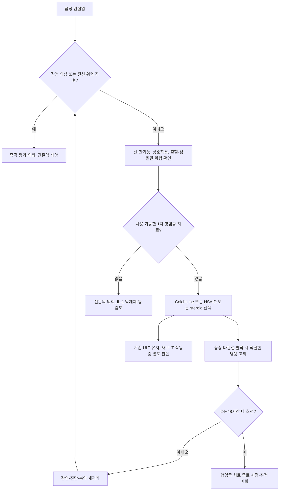
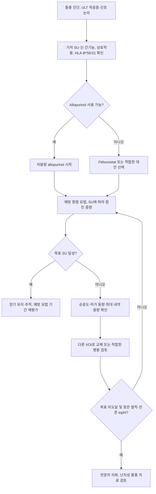

# 통풍 Gout

## <mark style="color:green;">일반 사항</mark>

* 요산나트륨(monosodium urate, MSU) 결정 침착에 대한 염증 반응으로 발생하는 결정 유발 관절염 ; 혈청 요산(SU)이 생리적 용해도(약 6.8 ㎎/㎗)를 지속적으로 초과하면 결정 침착 위험이 증가하지만 고요산혈증 자체가 통풍을 의미하지는 않음
* 국내에서 유병률이 증가하는 추세이며 남성, 고령자, 비만·만성콩팥병 환자에서 흔함 ; 유병률은 조사 연도·연령·진단 방식에 따라 달라 특정 연령군 수치를 전체 인구에 적용하지 않음
* 초기에는 보통 단일 관절에 발생하며 첫 발작은 치료에 잘 반응함
  * 치료하지 않은 급성 발작도 대개 1~2주 내 가라앉지만 기간은 다양하며, 항염증 치료를 조기에 시작하면 통증과 염증을 더 빨리 조절할 수 있음
* 발작 후 고요산혈증이 지속되면 빈번히 재발하고 통증이 심해지며 치료에 대한 반응이 나빠지고 여러 관절이 이환되고 요산염 결정체가 tophi를 만들어 관절의 영구적 손상을 일으킬 수 있음
* 첫 발작 후 재발이 흔하며, 요산 침착이 지속되면 발작 빈도·이환 관절 수가 증가하고 만성 통풍성 관절염으로 진행할 수 있음
* SU가 높을수록 향후 통풍의 최초 발생 위험이 증가함 ; 무증상 고요산혈증 코호트의 최초 통풍 발생률과 이미 통풍이 있는 환자의 재발률을 구분하여 해석함
  * 역사적 남성 코호트(Normative Aging Study, 1987)의 연간 **최초 통풍 발생률** : SU 7.0~8.9 ㎎/㎗에서 0.5%, ≥9 ㎎/㎗에서 **4.9%** ; 기존 통풍 환자의 연간 재발률이나 현재 국내 인구의 발생률로 해석하지 않음
* SU와 임상 증상이 일대일로 일치하지는 않음 ; 급성 발작 중 SU가 정상 범위로 낮아질 수 있으며 고요산혈증 환자 모두에서 통풍이 발생하는 것은 아님
* SU 수준의 급격한 변동(증가 또는 감소)이 증상 발생과 관련이 있음
* 통풍 환자는 요로 결석 위험도 증가함 ; 요산 결석은 산성 소변·소변량 감소·고요산뇨 등이 관련되며, 관절의 MSU 결정 침착과 결석의 형성 기전은 구분함
  * 결석 병력이 있으면 요산 저하제 선택에 반영하고, 결석 종류·소변 pH 등에 따라 별도의 결석 예방 치료를 고려함

## <mark style="color:green;">원인 및 위험 인자</mark>

* 고요산혈증 : 요산염의 과잉 생산 &/or 과소 배출
  * 생산 증가 : 골수증식성 질환, 용혈, 종양 및 종양용해, 광범위한 건선 등 세포 회전 증가, 과도한 퓨린·과당 섭취, 알코올
  * 배출 감소 : 만성콩팥병, 체액 소실, 심부전, 케톤산증, 알코올 ; thiazide·loop 이뇨제, 저용량 aspirin, cyclosporine·tacrolimus, pyrazinamide·ethambutol 등
* 요산염 용해도의 일시적 변화 : 국소 체온 하강, 외상, 산혈증

### <mark style="color:orange;">위험 인자</mark>

* purine(붉은 고기, 해산물), 알코올(특히 맥주, 위스키, 진, 보드카, 럼), 과당, 청량음료
* 비만(특히 BMI ＞30), 과식 또는 금식, 스트레스
* 나이 증가, 남성, 폐경 후 여성, 가족력·유전적 소인
* 외상, 감염, 수술, 다제약물 복용(특히 이뇨제, 저용량 aspirin, cyclosporine, tacrolimus)
* 이상지질혈증, 고혈압, 당뇨병, 고인슐린혈증, 관상동맥병, CHF, 만성 신질환, 장기 이식
* 요산 저하제(ULT) 치료 시작 시기 - 급격한 SU 변동으로 오히려 발작 위험이 일시적으로 증가할 수 있음

## <mark style="color:green;">임상 양상</mark>

* 갑작스런 극심한 관절 통증("스치기만 해도 아프다"), 주로 이른 아침 발생("아파서 잠에서 깨어났다") → 12\~24시간 동안 빠르게 진행
  * 주요 이환 관절 : 1st toe MTP 관절(가장 흔함), 발, 발목, 팔꿈치, 손가락 ; 고관절, 어깨는 드묾
* 통증 외 국소 증상 : 부종, 발적, 발열, 관절 변형(치료하지 않은 만성 통풍 환자에서 발생)
* 전신 증상 : 간혹 전신 발열, 오한
* tophi(요산 결절) : 첫 발생 수년 후 귓바퀴, olecranon process, Achilles tendon 등에 발생

### <mark style="color:$danger;">🚩 Red Flags!</mark>

<mark style="color:$danger;">**즉각 조치 또는 의뢰**</mark>

* 심한 통증·부종·열감을 보이는 급성 관절염에서 감염이 의심되는 경우 → **패혈성 관절염**에 대한 즉각 평가 또는 응급 의뢰 ; **발열이 없어도 배제할 수 없으며**, 통풍 병력이나 MSU 결정 확인만으로 동반 감염을 배제하지 않음
* 급성 단관절염 + 전신 독성 징후(고열, 저혈압, 빈맥, 의식 변화) → 패혈증 의심, 응급 이송
* 면역저하 상태, 최근 관절 수술·주사, 인공 관절에서 발생한 급성 관절염 → 감염 가능성을 적극적으로 평가하고 즉각 의뢰 고려

<mark style="color:$warning;">**당일~수일 내 평가**</mark>

* 새로 발생한 급성 단관절염으로 통풍·감염 여부가 불명확함 → 당일 평가·관절 천자 고려 ; 감염이 의심되면 상단 즉각 조치에 따름
* 진단이 불명확한 다관절염(대칭성, 소관절 침범 등) → RA 등 감별을 위해 류마티스내과 협진 고려
* CKD stage ≥3 또는 진행성 신기능 저하 환자에서 급성 발작 약물 선택이 어려운 경우 → 신장내과 자문 고려
* Tophi 파열·궤양, 피부 발적·배액 등 국소 감염 의심 → 당일 평가 ; 전신 증상이나 관절 감염 의심 시 즉각 의뢰

<mark style="color:$info;">**외래 추적 / 추가 평가 계획**</mark> <mark style="color:$info;">- 즉각 위험 낮으나 호전 없으면 의뢰</mark>

* 적절한 1차 항염증 치료 후 **24~48시간 내 뚜렷한 호전이 없거나 악화** → 복약·용량·진단을 조기에 재평가 ; 감염 가능성이 있으면 당일 또는 즉각 평가하고 5~7일까지 기다리지 않음
* 요산 저하제 치료 중임에도 목표 SU 미도달 또는 연 ≥2회 재발 지속 → 약제 변경·병용 고려
* 목표 SU 유지에도 tophi·잦은 발작이 지속되면 복약순응도·치료 기간·투여 용량을 확인하고 류마티스내과에서 치료 강화 고려

## <mark style="color:green;">진단</mark>

* 관절액 또는 결절에서 MSU 결정을 확인하는 것이 확진의 기준이며, 가능하면 통풍 의심 환자에서 시행함 ; 천자가 어렵고 전형적 임상상 또는 특이적 초음파·DECT 소견이 있는 경우 임상적으로 진단할 수 있으나 SU만으로 진단하지 않음 [EULAR 진단 2018 개정, 영상 권고 2023(2024 출판)]
* 감염 의심 시 관절액 세포수·백혈구분획, 그람염색·배양을 시행함 ; 결정이 검출되거나 관절액 백혈구가 낮아도 감염을 완전히 배제할 수 없음. 가능한 경우 항생제 전에 천자·배양하되, 패혈증·쇼크에서는 검체 채취 때문에 항생제·이송을 지연하지 않음 [SANJO 2023]

### <mark style="color:orange;">Gout classification criteria</mark>


2015 ACR/EULAR gout 분류 기준 - 역학·임상시험 목적의 분류 기준이며 개별 환자 진단을 대체하지 않음


* Step 1 : 말초 관절 또는 bursa에서의 부종, 통증, 또는 압통이 ≥1 episode
* Step 2 : 증상이 있는 관절·윤활낭의 관절액 또는 요산 결절에서 **MSU 결정이 확인되면** 충분 기준 충족 → 추가 점수 계산 없이 통풍으로 분류 ; 육안으로 결절을 관찰한 것만으로는 충분 기준에 해당하지 않음
* Step 3 : 충분 기준이 충족되지 않거나 결정 검사를 시행하지 못한 경우 다음 점수의 합계가 ≥8점이면 통풍으로 분류함
  1. 단관절 또는 소수관절 발작에서 1st MTPJ 침범 - 2점 ; 1st MTPJ 침범 없이 ankle 또는 midfoot 침범 - 1점 ; 그 외 양상 - 0점(한 영역에서 가장 높은 점수만 적용)
  2. 다음 중 해당되는 증상 개수 ① 이환부위 홍반, ② 접촉 또는 압박을 참을 수 없음, ③ 이환된 관절을 사용하여 걷거나 활동할 수 없음 : 1개 - 1점, 2개 - 2점, 3개 - 3점
  3. 다음 중 ≥2개를 만족하는 전형적 삽화 ① 증상 시작부터 **최대 통증에 도달하기까지 ＜24시간**, ② ≤14일 내 증상 소멸, ③ 삽화 사이 기저 상태로 완전히 회복(항염증 치료 여부 무관) : 1회 - 1점, 반복 - 2점
  4. tophus의 임상적 소견¹⁾ 양성 시 4점
  5. 혈청 urate²⁾ : ＜4 ㎎/㎗ - −4점 ; 4~＜6 - 0점 ; 6~＜8 - 2점 ; 8~＜10 - 3점 ; ≥10 - 4점
  6. 증상이 있는 관절·윤활낭의 관절액에서 숙련된 검사자가 MSU 결정 음성으로 판정 - −2점 ; 미검사·결과 불명 - 0점
  7. urate deposition(초음파 또는 DECT) (+) 시 4점
  8. 손·발 단순 X선에서 경화성 가장자리와 overhanging edge를 가진 피질 단절(통풍성 골미란) ≥1개 - 4점 ; DIP 관절 및 gull-wing 모양은 제외

_¹⁾ Draining or chalk-like subcutaneous nodule under transparent skin, often with overlying vascularity, located in typical locations: joints, ears, olecranon bursae, finger pads, tendons (e.g., Achilles)_\
_²⁾ 가능하면 ULT 미투여 상태에서 발작 시작 ＞4주 후 측정한 값을 사용하되, 재검사 가능 시 시행하며 확인된 가장 높은 값을 적용 ; 임상 진료의 SU 재검 시점과 분류 기준의 측정 조건은 구분함_

### <mark style="color:orange;">실험실 검사</mark>

* 혈청 요산(SU) : 진료 시 측정하되, 발작 중 ＜6 ㎎/㎗이고 통풍이 강하게 의심되면 발작이 가라앉은 뒤 **최소 2주 후 재검** ; 정상 수치만으로 통풍을 배제하지 않음 [NICE NG219]
* WBC, ESR, CRP : 급성 발작 중 상승함
* 관절액·결절 분석 : 바늘 모양의 강한 **음성 복굴절(negative birefringence)** MSU 결정 확인 ; 감염 의심 시 그람염색·배양을 함께 시행
* 24시간 소변 요산 : routine 검사는 권하지 않으며, 젊은 연령에서 매우 심한 고요산혈증, 반복적 요산 결석, 유전성 질환 또는 요산 과잉생성 상태가 의심되는 경우 선택적으로 고려
* Hb, WBC, LFT, s-Cr, 지질, U/A : 통풍 후유증/동반 질환 감시를 위해 진단 시 및 추적 검사
* HLA-B\*58:01 선별 검사 : 한국인에서 allopurinol 시작 전 검사 권고(ACR 2020 조건부 권고) ; 양성이면 회피하며 음성이어도 중증 과민반응 위험이 완전히 없어지는 것은 아니므로 발진 교육·저용량 시작을 시행

### <mark style="color:orange;">영상 검사</mark>

* X선 검사 : 초기에는 정상일 수 있음 ; 만성 통풍에서는 punched-out erosion, 경화성 가장자리·overhanging edge와 연부조직 결절이 특징적이며 관절 간격은 진행기까지 비교적 보존될 수 있음
* 초음파 : tophi, double contour sign ; DECT : 요산 침착 확인에 유용하나 초기·침착량이 적은 통풍에서는 민감도가 떨어질 수 있음
* 임상상에 부합하는 특이적 초음파·DECT 소견이 있으면 통풍 확인을 위한 천자를 생략할 수 있지만, **감염 의심 시에는 영상 양성과 무관하게 천자 필요** [EULAR 영상 권고 2023]

### <mark style="color:orange;">감별 진단</mark>

* 급성 단관절염으로 내원한 경우 감별해야 할 주요 질환들 - 특히 패혈성 관절염은 반드시 배제

<table><thead><tr><th width="140">질환</th><th width="260">통풍과의 차이점</th><th>핵심 감별 포인트</th></tr></thead><tbody><tr><td>패혈성 관절염</td><td>세균 감염에 의한 관절염 ; 통풍과 동시 발생 가능하며 임상 양상만으로 완전히 구분 어려움</td><td>발열이 없어도 가능 ; 활액 그람염색·배양 시행(음성 그람염색만으로 배제 불가) ; 지연 시 관절 파괴·패혈증 위험 → 감별 우선</td></tr><tr><td>가성통풍(CPPD)</td><td>Ca pyrophosphate 결정에 의한 관절염 ; 통풍과 임상상 매우 유사</td><td>호발 부위(무릎 등), 고령, X선 연골석회화 ; 편광현미경에서 양성 복굴절 결정 (☞ 가성통풍 참조)</td></tr><tr><td>봉와직염</td><td>피부·연부조직 감염 ; 관절강 침범 없음</td><td>관절보다 넓은 경계 불명확한 발적 ; 관절 운동 범위는 비교적 유지</td></tr><tr><td>류마티스 관절염</td><td>자가면역성 만성 다발 관절염</td><td>대칭적 소관절 침범, 조조강직 ＞1시간, RF/anti-CCP 양성</td></tr><tr><td>건선성 관절염/반응성 관절염</td><td>혈청음성 척추관절병증</td><td>건선 병력, 부착부염, 손발가락염(dactylitis)</td></tr><tr><td>골관절염 급성 악화</td><td>퇴행성 관절 질환</td><td>서서히 진행, 사용 시 악화, 발적·발열 상대적으로 경미</td></tr></tbody></table>

## <mark style="color:green;">무증상 고요산혈증 (Asymptomatic Hyperuricemia)</mark>

* 선별 검사 : 권하지 않음
* 치료 : 무증상 고요산혈증 자체만을 이유로 일률적인 요산 저하제 치료를 시행하는 것은 일반적으로 권하지 않음
  * 대부분의 고요산혈증 환자에서 통풍이 발생하지 않음
  * 무증상 고요산혈증에서 CKD 진행 지연만을 목적으로 ULT를 투여하는 것은 권하지 않음 [KDIGO 2024, 권고 3.14.2(2D)] ; KCR 2023은 이 질문에 대해 이득·위해가 불명확하여 권고를 제시하지 못함
  * 심혈관 질환과의 연관성도 관찰연구에서 반복적으로 보고되나, 멘델리안 무작위화(Mendelian randomization) 연구들은 요산치와 심혈관 위험 사이의 인과관계를 뒷받침하지 못하고 있어 심혈관 예방 목적의 요산 저하 치료는 아직 근거가 불충분함
* 예외 : acute urate nephropathy(예 : 종양용해증후군 위험군) 예방 등 별도의 적응증이 있는 경우에는 요산 저하 치료를 고려

***


```mermaid
graph TD
    A["급성 관절염"] ---> B{"감염 의심 또는 전신 위험 징후?"}
    B --->|예| C["즉각 평가·의뢰, 관절액 배양"]
    B --->|아니오| D["신·간기능, 상호작용, 출혈·심혈관 위험 확인"]
    D ---> E{"사용 가능한 1차 항염증 치료?"}
    E --->|있음| F["Colchicine 또는 NSAID 또는 steroid 선택"]
    E --->|없음| G["전문의 의뢰, IL-1 억제제 등 검토"]
    F ---> H["중증·다관절 발작 시 적절한 병용 고려"]
    H ---> I{"24~48시간 내 호전?"}
    I --->|아니오| J["감염·진단·복약 재평가"]
    J ---> B
    I --->|예| K["항염증 치료 종료 시점·추적 계획"]
    F ---> L["기존 ULT 유지, 새 ULT 적응증 별도 판단"]
```

<p align="center"><strong>급성 통풍 발작의 관리 알고리듬</strong></p>

<p align="center"><em>Ref. EULAR 2016, ACR 2020, KCR 2023, SANJO 2023을 종합하여 재구성함. 약제별 금기·용량 및 ULT 시작 시 국내 허가사항의 차이는 본문 참조.</em></p>

***

## <mark style="background-color:$warning;">Management</mark>


**급성기-만성기는 별개의 결정** - 급성 발작 치료(항염증)와 요산 저하제(ULT) 치료(요산 조절)는 각각 독립적으로 판단하며, 이미 ULT를 투여 중이던 환자는 발작 중에도 **중단하지 않고 유지**함.


### <mark style="color:orange;">치료 방침</mark>

* 급성 발작기에는 염증 조절이 목표, 만성기에는 SU 강하를 통한 재발·합병증 예방이 목표
* 항염증 치료는 가능한 한 빨리 시작함 ; colchicine은 특히 발작 초기(가능하면 12~24시간 내)에 효과가 좋지만 36시간을 모든 급성기 치료의 절대적 마감 시점으로 적용하지 않음
* 1차 선택제 : colchicine, NSAID, steroid ; 우선순위 없음, 환자 선호·동반 질환에 따라 선택
* 대체 : Colchicine, NSAID, steroid 사용이 모두 어려운 경우 IL-1 억제제(anakinra, canakinumab) 고려
* 중등증 이하의 증상에 대하여 단일 제제 투여, 반응하지 않는 경우 약제 추가
* 초기 복합 치료 고려 대상 : 통증이 매우 심하거나 다관절 발작인 경우 ; 관절 수만으로 병용을 일률적으로 결정하지 않음
* 복합 치료 조합 : NSAID+colchicine, colchicine+경구 steroid, 관절 내 steroid+다른 항염증 치료 ; **NSAID+전신 steroid는 위장관 독성 증가 때문에 일반적으로 회피**


**발작 중 요산 저하제(ULT) 시작 가능 여부**\
ULT 적응증이 있으면 급성 발작 중에도 항염증 치료를 병용하면서 새 ULT를 시작할 수 있음 [ACR 2020·KCR 2023, 조건부 권고]. 모든 약제의 국내 허가사항이 이 권고와 일치하는 것은 아님 ; **페브릭 국내 허가사항은 발작이 진정된 뒤 시작하도록 명시**하므로 febuxostat 처방 시 이를 구분함. 이미 복용 중인 ULT는 유지함


***

## <mark style="color:green;">비-약물 치료 및 예방</mark>

### <mark style="color:orange;">급성기</mark>

* 냉찜질
* 휴식(이환 관절 부하 회피), 필요시 거상

### <mark style="color:orange;">예방(만성기)</mark>

* 탈수를 피하고 수분을 적절히 섭취함 ; 통풍 환자 모두에게 일정한 소변량·음료량을 처방하지 않음. 요로 결석 동반 시 수분 목표는 별도로 정하며, 심부전·진행된 CKD 등에서는 수분 제한 여부를 우선 확인
* 적정 체중 유지, 규칙적 운동, 금연
* 음주는 줄이고 특히 발작기·반복 발작 시 금주 권고 ; 폭음은 피하며 남성 2잔·여성 1잔을 통풍에 안전한 음주량으로 제시하지 않음
* 적절한 심혈관 적응증으로 복용 중인 저용량 aspirin은 요산 상승만을 이유로 중단하지 않음 \[ACR 2020, 근거 수준 매우 낮음]
* 동반 질환약제(항고혈압제, SGLT2 억제제 등) 최적화는 요산 저하제 항목의 "동반 질환에 따른 약제 선택 최적화" 참조(☞ 하단)

#### <mark style="color:$primary;">식사 관리</mark>

<table><thead><tr><th width="110">구분</th><th>내용</th></tr></thead><tbody><tr><td>피하거나 크게 줄임</td><td>내장(예: 간, 콩팥, 위, 곱창), 육즙, 고과당 음료</td></tr><tr><td>제한</td><td>소/돼지/양/닭/오리 고기, 등 푸른 생선(예: 멸치, 정어리, 청어, 참치, 송어), 굴/조개/갑각류(예: 가재, 게, 새우), 설탕 및 함유 식품/음료, 소금</td></tr><tr><td>권장</td><td>저지방 유제품, 채소, 균형 잡힌 식사</td></tr></tbody></table>

* 식사·체중 관리는 보조적 치료이며 적응증이 있는 ULT를 대체하지 못함 ; 식사만으로 SU가 충분히 낮아지지 않을 수 있음을 설명

_✽채소류의 퓨린 함량은 육류·해산물과 달리 통풍 위험 증가와 뚜렷한 관련이 없다는 보고가 있어, 퓨린이 있다는 이유만으로 채소 섭취를 과도하게 제한할 필요는 없음_

## <mark style="color:green;">약물 치료</mark>

### <mark style="color:orange;">급성 발작 치료</mark>


**⚠️ Colchicine 중독 위험 - 좁은 치료 지수, 해독제 없음**\
Colchicine은 과량 복용·상호작용 시 치명적 독성이 발생할 수 있음. 강력한 CYP3A4 또는 P-glycoprotein 억제제와의 병용은 회피하며, **신·간장애 환자가 이러한 억제제를 투여 중이면 병용금기**. 국내 콜킨 허가사항상 중증 간·신·심·혈액·위장관 질환 및 임신·수유도 금기이므로 단순 감량으로 해결하지 않음


#### <mark style="color:$primary;">Colchicine</mark>

* 발작 초기에 투여할수록 효과가 좋으며, 늦게 내원한 경우 중증도·안전성을 평가하여 다른 항염증제도 고려함
* 국내 급성 통풍 허가 용법 : 초회 1.2 ㎎ → 1시간 후 0.6 ㎎(초기 총 1.8 ㎎) ; 고용량 반복 loading은 시행하지 않음 <mark style="color:blue;">[콜킨]</mark>
* 이후 지속 치료가 필요하면 저용량 0.6 ㎎ qd~bid를 임상 경과·신기능에 따라 개별 결정(급성기 지속 요법은 지침·문헌 용법) ; 예방 복용 중 발생한 발작에서는 국내 허가사항에 따라 초기 요법 후 **최소 12시간 뒤** 예방 용량 재개. 예방 용량과 초기 용량이 중복되지 않도록 복용 계획을 명시
* 부작용 : 소화기 증상(구역, 구토, 복통, 설사), 신경근육병증, 재생불량빈혈, 간/신 기능 저하
* 주의 : 고령·경증~중등도 신·간장애에서는 독성 모니터링과 감량·투여 간격 조절을 검토 ; clarithromycin·azole 항진균제·ritonavir·cyclosporine 외 verapamil·diltiazem 등과도 상호작용 확인. Statin·fibrate 병용 시 근육병증 위험에 주의

#### <mark style="color:$primary;">NSAID</mark>

* 유효 항염증 용량을 가능한 짧게 사용하고 호전 시 감량·종료 ; 모든 환자에게 최대 용량 2일을 일률적으로 적용하지 않음
* 약제간의 일반적인 효과 차이는 없음
* 주의 : 소화성 궤양, 신 기능 저하 ; CKD 또는 심부전 환자에서는 회피 고려
* naproxen 국내 급성 통풍 허가 용법 : 초회 750 ㎎ → 발작 소실 시까지 250 ㎎ q8h <mark style="color:blue;">[낙센]</mark> ; naproxen sodium은 초회 825 ㎎ → 275 ㎎ q8h <mark style="color:blue;">[아나프록스]</mark>
* naproxen 500 ㎎ bid는 급성 통풍 연구·지침에서 사용하는 대안 요법이며 위 국내 적응증별 허가 용법과 구분 <mark style="color:blue;">[낙센에프]</mark>
* ibuprofen : 국내 허가상 1회 200~600 ㎎, 1일 3~4회 ; 급성기에는 예를 들어 400~600 ㎎ tid~qid를 위험도에 따라 선택. 허가상 최고 3.2 g/d이나 이를 목표 용량으로 삼지 않으며 고용량의 심혈관·위장관·신장 위험에 주의 <mark style="color:blue;">[부루펜]</mark>

#### <mark style="color:$primary;">Steroid</mark>

* NSAID·colchicine과 함께 독립적인 1차 선택제 ; 특히 신기능 저하 등으로 다른 약제의 위험이 큰 경우 고려
* 짧은 단기요법은 tapering 없이 종료할 수 있으며, 발작이 심하거나 치료기간을 연장하는 경우 임상 경과에 따라 tapering 고려
* prednisolone : 30\~40 ㎎(약 0.5 ㎎/㎏)/d ×3\~5d ; 반응이 불충분하거나 치료기간이 길어진 경우 필요에 따라 감량 <mark style="color:blue;">\[소론도]</mark>
* 경구 투여가 불가능하면 근주 또는 정주 steroid를 환자 상태·제형별 허가사항에 따라 고려 ; 외래에서 광범위한 체중당 정주 용량을 일률적으로 제시하지 않음
* triamcinolone 관절 내 주사 : 큰 관절 1\~2개 침범 시 10\~40 ㎎ ; 단관절/소수관절 발작에서 독립적인 1차 치료 선택지로 고려하며, 다관절 또는 중증 발작에서는 필요에 따라 다른 항염증 치료와 병용
  * 패혈성 관절염 의심 시 관절액 그람염색·배양 등으로 우선 평가하며, 단순히 천자했거나 그람염색이 음성이라는 이유만으로 관절 내 steroid를 주사하지 않음

#### <mark style="color:$primary;">IL-1 억제제</mark>

* 대상 : colchicine, NSAID, steroid 모두 사용 불가하거나 반응하지 않는 난치성 발작
* anakinra·canakinumab : 통상적인 국내 일차진료 처방 대안으로 제시하지 않음 ; 전문의가 감염을 배제하고 국내 적응증·공급 경로·허가 외 사용 가능성을 확인한 뒤 제한적으로 검토
  * anakinra 참고 용법(문헌 기준, 국내 허가 용법 아님) : 100 ㎎ SC qd ×3\~5일 ; 류마티스내과 자문 하에 병원 내 사용 상황에 한해 고려

### <mark style="color:orange;">요산 저하제 (Urate Lowering Therapy, ULT)</mark>

* ACR 2020의 ULT 강한 권고 대상 : 재발성 통풍(≥2회/년), ≥1개의 피하 요산 결절, 영상 검사에서 나타나는 통풍에 의한 손상
* ULT 고려 대상 : **통풍 발작이 과거 총 2회 이상**이지만 연 2회 미만인 경우 → ACR 2020 조건부 권고 ; 첫 발작은 아래 예외와 구분하여 논의
* 첫 발작에서 CKD stage ≥3, SU ＞9 ㎎/㎗ 또는 요로 결석이 있으면 ULT 시작을 조건부 권고 [ACR 2020]
* 지침 간 차이 : KCR 2023은 금기가 없는 모든 통풍 환자에 ULT를 더 넓게 권고함 ; 위 발작 횟수별 기준은 ACR 기준이며 국내 지침·재발 위험·환자 선호를 함께 고려하여 결정
* 목표 SU : ＜6 ㎎/㎗ ; tophi, 만성 통풍성 관절병증, 잦은 발작 등 중증 통풍에서는 결정 침착 해소를 촉진하기 위해 ＜5 ㎎/㎗를 고려 [EULAR]
* 저용량에서 시작하여 점차 증량(treat-to-target) \[ACR 2020 Strong recommendation]


**동반 질환에 따른 약제 선택 최적화**\
· 고혈압 : hydrochlorothiazide 회피, losartan 우선 고려(경미한 uricosuric 효과)\
· 이상지질혈증 : statin 대비 fenofibrate로 교체를 목적으로 처방하지는 않음(요산 저하 효과가 있으나 이상지질혈증 1차 치료 원칙이 우선) ; 이미 fenofibrate가 적응증에 맞는 경우 부가적 요산 저하 효과 기대 가능\
· 당뇨병·심부전·CKD 동반 시 : SGLT2 억제제는 본래 적응증에 따라 선택하되, 부가적으로 혈청 요산 감소 및 통풍 위험 감소 효과가 보고됨(ULT 대체 목적 아님) [EMPEROR-Preserved 후속 분석, JACC Heart Fail 2024]


* 투여 기간 : 목표 SU를 유지하면서 장기간 지속하는 것이 원칙이며, 특별한 부작용이나 치료 부담이 없다면 무기한 지속을 권고 [KCR 2023, ACR 2020]
* 장기간 임상적 관해(예 : ≥1년 발작 없음, tophi 없음)에 도달한 일부 환자에서 감량·중단을 개별적으로 논의할 수 있으나, 중단 후 재발 위험이 높고 이를 지지하는 근거가 매우 제한적이므로 routine discontinuation은 권하지 않음
* 종류
  * 요산 합성 억제제(xanthine oxidase inhibitors, XOI) : 1차 선택 ; allopurinol, febuxostat
  * 요산 배설 촉진제(uricosuric drugs) : benzbromarone, probenecid, losartan(보조적)
  * 요산 분해제(uricolytic drugs) : pegloticase
* 목표 SU 미도달 시 복약순응도와 현재 용량을 먼저 확인하고 허가 용량·최대 내약 용량까지 신중히 증량 ; 충분한 XOI에도 목표 미도달 및 잦은 발작·잔존 tophi가 있으면 다른 XOI로 교체를 우선 고려 [ACR 2020 조건부]. 필요 시 적절한 환자에서 XOI+요산배설촉진제 병용을 전문의와 상의하며 **allopurinol+febuxostat 병용은 권하지 않음**
* 모니터링
  * 목표 도달까지 2~4주 간격으로 SU 확인·용량 조절 ; CBC·간·신기능 검사는 기저 상태·약제·증량 단계에 맞춰 시행하고 모든 검사·U/A를 매번 일률적으로 반복하지 않음
  * 용량이 정해지면 1\~2회/년 주기로 검사

***


```mermaid
graph TD
    A2["통풍 진단, ULT 적응증·선호 논의"] ---> B2["기저 SU·신·간기능, 상호작용, HLA-B*58:01 확인"]
    B2 ---> C2{"Allopurinol 사용 가능?"}
    C2 --->|예| D2["저용량 allopurinol 시작"]
    C2 --->|아니오| E2["Febuxostat 또는 적합한 대안 선택"]
    D2 ---> F2["예방 항염 요법, SU에 따라 점진 증량"]
    E2 ---> F2
    F2 ---> G2{"목표 SU 달성?"}
    G2 --->|예| H2["장기 유지·추적, 예방 요법 기간 재평가"]
    G2 --->|아니오| I2["순응도·허가 용량·최대 내약 용량 확인"]
    I2 ---> J2["다른 XOI로 교체 또는 적합한 병용 검토"]
    J2 ---> K2{"목표 미도달 및 잦은 발작·잔존 tophi?"}
    K2 --->|예| L2["전문의 의뢰, 난치성 통풍 치료 검토"]
    K2 --->|아니오| F2
```

<p align="center"><strong>고요산혈증 통풍 환자의 관리 알고리듬</strong></p>

<p align="center"><em>Ref. EULAR 2016, ACR 2020, KCR 2023을 종합하여 재구성함. 목표 SU·약제별 국내 허가사항은 본문 참조.</em></p>

***

#### <mark style="color:$primary;">요산 합성 억제제 (XOI)</mark>

**Allopurinol**

* 1차 선택제
* 작용 : xanthine oxidase 억제
* 부작용 : 발진, 가려움, 간 효소 수치 증가, eosinophilia ; 이뇨제, Pc 계열 병용 시 증가
* 주의 : warfarin 병용 시 INR 모니터링 ; **azathioprine·6-mercaptopurine 병용은 치명적 골수억제 위험 때문에 회피**. 불가피한 병용은 해당 약제를 통상 용량의 약 1/4로 감량하고 전문의 감독 아래 빈번한 혈액검사를 시행(국내 허가사항)
* 시작 : ≤100 ㎎ qd, CKD에서는 더 낮게(예 : 50 ㎎/d) 시작 → SU·안전성을 보며 2~4주마다 증량 [ACR 2020] <mark style="color:blue;">[자이로릭]</mark>
* 국내 허가상 최대 800 ㎎/d, 1회 최대 300 ㎎이며 고용량은 분할·식후 투여 ; 경증의 100~300 ㎎/d만을 모든 환자의 유지 용량으로 제한하지 않음
* **신부전에서 지침과 국내 허가 용량을 구분** : 자이로릭 허가사항은 CrCl 10~20 ㎖/min에서 100~200 ㎎/d, ＜10에서 ≤100 ㎎/d 또는 더 긴 간격을 명시함. ACR의 CKD에서도 SU 목표에 따라 증량하는 원칙은 이 허가 제한과 항상 일치하지 않으므로, 제한을 넘는 증량은 전문의 자문과 허가 외 사용 검토가 필요
* 자이로릭 허가사항의 성별 목표치와 별개로, 현행 통풍 지침의 치료 목표는 SU ＜6 ㎎/㎗를 적용
* colchicine과 병용 가능


**⚠️ Allopurinol 과민반응 증후군(AHS) / SCAR**\
CKD 환자에서 ＞100 ㎎/d으로 투여를 시작하는 것은 Stevens-Johnson syndrome, toxic epidermal necrolysis 등 중증 피부 부작용 위험 증가와 관련이 있음. HLA-B\*58:01 양성인 경우 allopurinol을 피하고 대체 약제(febuxostat, 요산배설촉진제)를 선택 \[CPIC, ACR 2020]


**Febuxostat**

* 작용 : 선택적 xanthine oxidase 억제, nonpurine analogue
* 신장애 : 경증~중등도에서는 일반적으로 감량 불필요 ; 국내 페브릭 허가사항은 CrCl ＜30 ㎖/min에서 안전성·유효성이 충분히 평가되지 않았다고 명시함. 미국의 중증 신장애 최대 40 ㎎/d 제한을 국내 허가 용량으로 단정하지 말고 전문의와 상의
* 용법 : 40 ㎎ qd → 목표 SU 미도달 시 80 ㎎ qd <mark style="color:blue;">\[페브릭]</mark> ; 국내 허가 최대 용량 80 ㎎/d
* 부작용 : 간기능 이상, 발진·드문 중증 과민반응 ; 기저·추적 간기능 검사와 발진 교육 시행
* **azathioprine·6-mercaptopurine 투여 환자는 국내 허가상 병용금기**
* 국내 허가사항 : 급성 발작이 진정된 뒤 새로 시작 ; 예방 항염제를 최소 6개월 이상 병용하도록 권장(ACR의 일반적 3~6개월과 구분). 임신·수유 중 복용하지 않음


**⚠️ 심혈관 사망 위험 경고 (CARES trial, FDA Boxed Warning)**\
기존 심혈관 질환 병력이 있는 통풍 환자에서 febuxostat이 allopurinol 대비 심혈관 사망률을 높였다는 CARES trial(NEJM, 2018) 결과로 FDA가 boxed warning을 부여함(2019). FAST trial에서는 심혈관 복합 결과의 비열등성이 확인되고 사망 위험 증가가 관찰되지 않았으나 최근 심근경색·뇌졸중, 중증 심부전·중증 신장애 환자는 제외되어 CARES와 대상군·설계가 다름. 국내 허가사항도 주요 심혈관질환에서 다른 적절한 치료가 가능하면 회피하도록 명시하며, ACR 2020은 **이미 febuxostat을 복용 중인 환자가 심혈관 질환 병력이 있거나 새로 심혈관 사건이 발생한 경우 다른 ULT로 교체할 것을 조건부 권고**함 \[ACR 2020, Conditional]. 같은 맥락에서 **심혈관 질환 기왕력이 있는 환자는 allopurinol을 1차로 사용**하고 febuxostat은 allopurinol에 반응이 없거나 불내약성인 경우로 제한하는 것이 신중함


#### <mark style="color:$primary;">요산 배설 촉진제</mark>

**Benzbromarone**

* 작용 : 신세뇨관에서 urate 재흡수 차단(URAT1 억제)으로 요산 배설 촉진
* 국내 요산배설촉진제의 대표 약제 <mark style="color:blue;">[유리논]</mark>
* 대상 : XOI 투여 곤란 또는 효과 부족 시 대체 또는 추가 투여
* 국내 유리논 허가상 금기 : **신기능 장애, 신장 결석의 병적 소인, 간장애, 임신 가능 여성·임부** ; CrCl ＜20만을 금기 경계로 제시하지 않음
* 간독성 : 급성 중증 간염·치명적 간부전 가능 ; **적어도 시작 후 6개월 동안 반드시 정기적 간기능 검사**, 이후에도 추적. 식욕부진·구역·권태감·진한 소변·황달 시 즉시 중단·평가
* 부작용 : 광과민 반응, 위장 장애, 설사
* 용법 : 25\~50 ㎎ qd로 시작, 유지 50 ㎎ qd\~tid

**Probenecid**

* 국외 참고 약제 ; 국내 처방 시 공급·허가 경로 확인이 필요하므로 일차진료의 일반적 처방례에는 포함하지 않음
* 대상 : XOI 투여 곤란 또는 효과 부족 시 대체 또는 추가 투여
* 요산 결석에서는 회피 ; CKD stage ≥3에서는 XOI 우선 선택이며 CrCl ＜50을 일률적인 절대금기로 표현하지 않음(신기능 저하 시 효과 감소, 국외 허가상 GFR ≤30 ㎖/min에서는 효과가 없을 수 있음) ; 저용량 aspirin의 적절한 심혈관 적응증은 유지
* 요로 결석 위험에 대해 적절한 수분 섭취 교육 ; 요산배설촉진제 복용만을 이유로 구연산칼륨을 일률적으로 추가하지 않음 [ACR 2020 조건부 비권고]. 국내 유리논·국외 probenecid 설명서의 알칼리화 관련 안내와는 차이가 있으므로, 실제 요산 결석·낮은 소변 pH 등 별도 적응증이 있으면 결석 전문 진료에 따라 결정
* 국외 허가 참고 용법 : 250 ㎎ bid ×1주 → 500 ㎎ bid ; 필요 시 증량하되 통상 최대 2 g/d [DailyMed]

#### <mark style="color:$primary;">요산 분해제</mark>

**Pegloticase**

* 작용 : 요산의 수용성 purine 분해 산물인 allantoin으로의 전환을 촉진
* 대상 : 충분한 경구 ULT 등에도 SU 목표 달성 실패 및 **잦은 재발(≥2회/년) 또는 해결되지 않는 피하 tophi**가 있는 경우
* anaphylaxis·주입 반응 위험이 큰 전문 치료제로 국내 일반 처방 알고리듬의 직접적인 다음 단계로 제시하지 않음 ; 실제 접근 가능 여부는 전문기관에서 확인
* 국외 참고 용법 : 8 ㎎ IV 격주 ; 투여 전 G6PD 결핍 확인(결핍 시 금기), 매 주입 전 SU·주입 반응 모니터링 및 면역조절제 병용 여부 등은 전문의가 결정

### <mark style="color:orange;">발작 예방 항염 요법 (Anti-inflammatory Prophylaxis)</mark>

* 요산 저하제 투여 초기에는 금기·내약성을 확인하여 예방 항염 요법을 병용하도록 권고 \[ACR 2020 Strong recommendation]
* ACR 2020 : 3~6개월 동안 예방 항염 요법을 유지하고 이후 발작 여부에 따라 연장 ; EULAR 2016은 첫 6개월, 국내 페브릭 허가사항은 최소 6개월 이상 권장
* 이후 최근 flare 발생 여부, tophi 및 목표 SU 도달 여부를 평가하여 예방 요법 연장을 고려
* 저용량 colchicine : 0.6 ㎎ qd\~bid ; 경증~중등도 신장애에서 감량·간격 조절 검토, 중증 신장애는 국내 허가상 금기 <mark style="color:blue;">\[콜킨]</mark>
* 저용량 NSAID 지침 예 : naproxen 250 ㎎ bid <mark style="color:blue;">[낙센]</mark> ; naproxen sodium 제형은 275 ㎎ bid <mark style="color:blue;">[아나프록스]</mark>. 장기 예방 요법은 국내 급성 통풍 치료 용법과 구분하고 위장관·심혈관·신장 위험 평가
* 저용량 steroid : colchicine 및 NSAID를 사용할 수 없거나 효과 부족 시 고려
  * prednisolone : 5\~10 ㎎ qd 아침 <mark style="color:blue;">\[소론도]</mark>

***

### <mark style="color:red;">질병코드</mark>

M10 통풍 Gout

M10.0 특발성 통풍 Idiopathic gout

M10.9 상세불명의 통풍 Gout, unspecified

***

## <mark style="color:purple;">처방례</mark>

> **처방례 1. 급성 발작 - 경증/중등도**
>
> ```
> 콜킨 0.6 ㎎/T 2T stat → 1시간 후 1T  (급성기 loading)
> 또는 낙센에프정 500 ㎎/T 2T #2  (지침·문헌 대안 용법)
> ```
>
> _✽경증/중등도에서는 위 두 약제 중 한 가지를 선택 ; 병용은 중증도·반응에 따라 결정. Colchicine 금기·상호작용 및 NSAID 국내 급성 통풍 허가 용법은 본문 참조_

> **처방례 2. 급성 발작 - 중증 또는 다관절 이환**
>
> ```
> 소론도정(prednisolone 5 ㎎) 6T qd  ×5d  (경과에 따라 조정)
> 필요 시 콜킨 0.6 ㎎/T 1T qd 또는 1T bid  (저용량 지속 요법, 개별 결정)
> ```
>
> _✽매우 심하거나 다관절 발작 시 선택적으로 병용 ; 발작 초기에 colchicine을 처음 사용하는 경우 초기 요법은 본문 참조. 신·간기능 및 이미 복용한 colchicine 양을 확인하고 일률적 병용·중복 투여를 피함_

> **처방례 3. 신기능 저하 환자의 급성 발작**
>
> ```
> 소론도정(prednisolone 5 ㎎) 6T qd  ×5d
> 또는 트리암시놀론 관절강내 주사 10~40 ㎎  (1~2개 관절 이환 시, 감염 배제 후)
> ```
>
> _✽CKD에서는 NSAID 위험이 증가하며 중증 신장애에서 국내 colchicine은 금기 ; CKD stage 3 자체를 모든 colchicine 사용의 절대금기로 간주하지 않음. 감염을 배제하고 steroid를 우선 고려하되 당뇨병에서는 혈당 확인_

> **처방례 4. 요산 저하제 치료 시작(예방 요법 병용)**
>
> ```
> 자이로릭 100 ㎎/T 1T qd
> 콜킨 0.6 ㎎/T 1T qd  (예방 요법, 최소 3~6개월)
> ```
>
> _✽HLA-B\*58:01 음성·중증 과민반응 병력 없음과 병용약을 확인한 뒤 시작 ; CKD에서는 더 낮은 시작 용량 검토. ULT 시작 시 초기 발작 예방을 위해 저용량 colchicine을 최소 3\~6개월 병용 ; 2\~4주마다 SU 확인 후 증량_

> **처방례 5. Allopurinol 알레르기 또는 HLA-B\*58:01 양성 환자**
>
> ```
> 페브릭 40 ㎎/T 1T qd
> ```
>
> _✽발작이 진정된 뒤 시작(국내 허가사항) ; azathioprine·6-mercaptopurine 병용금기, 주요 심혈관질환·신·간기능을 평가. 예방 항염 요법을 적절히 병용하고 국내 페브릭은 최소 6개월 이상 권장_

***

### <mark style="color:$success;">핵심 복약 지도</mark>

> **Colchicine 복용 시 주의**
>
> * 발작이 시작되면 처방받은 계획에 따라 가능한 한 빨리 복용하십시오. 처음 복용한 용량을 임의로 반복하거나 예방 용량과 겹쳐 먹지 마십시오.
> * 구역, 구토, 설사 등 소화기 증상이 나타나면 용량 조절 또는 중단이 필요할 수 있으므로 알려주세요.
> * clarithromycin, itraconazole 등 특정 항생제·항진균제와 병용하면 중독 위험이 높아지므로 새로운 약 처방 시 반드시 colchicine 복용 사실을 알려야 합니다.

> **Allopurinol 시작 시 발진 교육**
>
> * 복용 중 새 피부 발진, 가려움, 발열이 나타나면 **즉시 복용을 중단**하고 병원에 방문하도록 안내합니다. 중증 피부 부작용(SJS/TEN)의 초기 징후일 수 있습니다.
> * 신기능에 따라 저용량으로 시작하여 서서히 증량함을 설명합니다.

> **요산 저하제 시작 초기의 발작 증가 가능성**
>
> * 요산 저하제를 새로 시작하면 오히려 일시적으로 발작이 증가할 수 있음을 미리 설명하고, 예방을 위한 저용량 colchicine/NSAID를 함께 처방한 이유를 안내합니다.
> * 임의로 요산 저하제를 중단하지 않도록 하며, 발작이 있어도 이미 복용 중인 요산 저하제는 유지해야 함을 강조합니다.

> **NSAID·Steroid 단기 사용 시 주의**
>
> * NSAID는 위장관 출혈·궤양 위험이 있으므로, 필요시 PPI 병용을 고려하고 흑색변·토혈 등 출혈 징후 발생 시 즉시 알리도록 안내합니다.
> * 경구 steroid는 며칠간의 단기 사용이라도 일시적 혈당 상승을 일으킬 수 있어, 당뇨병 환자는 복용 기간 중 혈당을 더 자주 확인하도록 안내합니다.

> **언제 다시 병원을 방문해야 하나요?**
>
> * 관절이 심하게 붓고 아프면서 열·오한·전신 쇠약이 있거나 평소 발작과 다른 경우 - 즉시 내원 ; 열이 없어도 감염 가능성은 있습니다.
> * 처방받은 급성기 치료 후 24~48시간이 지나도 통증·부종이 뚜렷하게 줄지 않거나 악화하는 경우 - 조기 재평가
> * Allopurinol 복용 후 피부 발진, 가려움, 발열이 발생하는 경우 - 즉시 내원 및 복용 중단
> * Colchicine 복용 후 심한 설사, 근육통, 저림 등이 발생하는 경우

***

## <mark style="color:blue;">환자 안내서</mark>


**통풍, 요산 수치 관리가 재발을 막는 핵심입니다**

통풍은 혈액 속 요산이 오래 쌓여 관절에 결정을 만들면서 생기는 관절염입니다. 한번 발작을 겪으면 재발하기 쉬우므로, 급성 통증을 가라앉히는 치료와 함께 평소 요산 수치를 관리하는 것이 중요합니다.


#### <mark style="color:$primary;">왜 통풍이 생기나요?</mark>

* 혈액 속 요산이 오랫동안 높게 유지되면 바늘 모양의 결정이 관절에 쌓이고, 이 결정에 대한 염증 반응으로 갑작스러운 통증이 발생합니다.
* 유전적 소인과 콩팥의 요산 배출 능력이 크게 관여합니다. 술·과당 음료·과도한 육류 및 해산물 섭취, 비만, 일부 약물도 영향을 줍니다.

#### <mark style="color:$primary;">발작이 왔을 때 어떻게 하나요?</mark>

* **처방받은 약을 최대한 빨리 복용하십시오.** 발작 초기에 치료할수록 좋지만 늦게 시작했더라도 진료를 받아 치료할 수 있습니다.
* 이환된 관절은 얼음찜질을 하고, 최대한 부하를 주지 않도록 쉬어 주십시오.
* 이미 요산 저하제(예 : 자이로릭, 페브릭)를 복용 중이라면 **발작이 있어도 임의로 중단하지 마십시오.**

#### <mark style="color:$primary;">일상생활에서 어떻게 관리하나요?</mark>

* **탈수를 피하십시오.** 탈수를 피하도록 물을 적절히 마시되 심부전·콩팥병으로 수분 제한을 안내받은 경우에는 그 지침을 따르십시오.
* **술, 특히 맥주를 피하십시오.** 술은 요산을 높이고 배출을 방해합니다.
* **내장, 육즙, 등 푸른 생선, 단 음료를 줄이십시오.** 저지방 유제품과 채소는 상대적으로 안심하고 드실 수 있습니다.
* **적정 체중을 유지하고 규칙적으로 운동하십시오.** 다만 급격한 체중 감량이나 과도한 금식은 오히려 발작을 유발할 수 있으니 서서히 조절하십시오.

#### <mark style="color:$primary;">약은 어떻게 써야 하나요?</mark>

* 요산 저하제(자이로릭, 페브릭 등)는 매일 꾸준히 복용해야 효과가 있으며, 임의로 중단하면 요산이 다시 올라가 재발할 수 있습니다.
* **자이로릭(알로푸리놀) 복용 후 피부 발진, 가려움, 열이 나면 즉시 복용을 중단하고 병원에 오십시오.** 드물지만 심각한 피부 부작용의 신호일 수 있습니다.
* 콜킨(콜히친)을 복용 중에는 새로운 약(특히 항생제)을 처방받을 때 반드시 콜히친 복용 사실을 알려 주십시오.

#### <mark style="color:$primary;">이럴 때는 병원을 방문하세요</mark>

* 열·오한과 함께 관절이 심하게 붓고 아픈 경우, 또는 열이 없어도 평소 발작과 다르게 심하거나 빠르게 악화하는 경우
* 처방약을 복용해도 24~48시간 내 뚜렷한 호전이 없거나 악화하는 경우(조기 재평가)
* 자이로릭 복용 후 피부 발진이나 발열이 생긴 경우

***

## ￭ 가성통풍 Pseudogout, Calcium Pyrophosphate Deposition Disease (CPPD)


**CPPD(calcium pyrophosphate deposition disease)**는 여러 임상 양상을 포함하는 포괄적 명칭이며, "가성통풍"은 그중 급성 CPP 결정 유발 관절염을 지칭하는 전통적 용어임. EULAR 2011 용어 권고에 이어 2023 ACR/EULAR은 증상이 있는 CPPD의 연구용 분류 기준을 제시함


## <mark style="color:green;">일반 사항</mark>

* 칼슘 피로인산염(calcium pyrophosphate, CPP) 결정 침착과 관련된 질환군 ; 침착 자체는 무증상일 수 있고 염증이 생기면 급성 또는 만성 관절염으로 나타남
* 원인 : 특발성, 유전, 외상, 고령
* 발생 부위 : 무릎(가장 흔함), 손목이 전형적이며 어깨, 팔꿈치, 발목 등도 침범 가능 ; 1st MTP 단관절염은 CPPD보다 통풍이 더 전형적
* 주요 관련 대사 질환 : 원발성 부갑상선기능항진증, 혈색소침착증, 저마그네슘혈증(Gitelman 증후군 포함), **저인산분해효소증(hypophosphatasia)** ; 저인산혈증과 혼동하지 않음 [ACR/EULAR 2023]
* 일반적인 퇴행성 관절 질환의 형태를 보이지 않는 관절염에 대하여 가성통풍 의심

## <mark style="color:green;">임상 양상</mark>

* 임상 phenotype은 다양하며 무증상 연골석회화, 급성 CPP 결정 유발 관절염, CPPD를 동반한 골관절염, 만성 CPP 염증성 관절염 등으로 나타남
* 급성 CPP 결정 유발 관절염은 급성 통풍과 유사한 갑작스런 관절 통증·부종·열감으로 나타날 수 있음

### <mark style="color:$danger;">🚩 Red Flags!</mark>

* 급성 CPP 관절염도 패혈성 관절염을 우선 감별 ; 발열이 없어도 감염이 가능하고 CPP 결정 확인만으로 동반 감염을 배제하지 않음. 감염 의심 시 즉각 천자·배양 및 응급 평가(☞ 상단 통풍 Red Flags 참조)
* 젊은 연령에서 발생한 CPPD(특히 ＜60세) 또는 재발성·다관절성 CPPD → 부갑상선기능항진증, 혈색소침착증, 저마그네슘혈증 등 기저 대사 질환 감별을 위해 관련 검사 및 전문과 의뢰 고려

## <mark style="color:green;">진단</mark>

* 관절액 검사 : 보상 편광현미경에서 마름모형·짧은 막대형 CPP 결정과 약한 **양성 복굴절** 확인 ; 일부 결정은 복굴절이 약하거나 관찰되지 않아 음성 검사만으로 CPPD를 배제하지 않음. 감염 의심 시 그람염색·배양 병행
* ＜60세, 반복 발작 또는 대사 질환 의심 시 Ca, Mg, P, ALP, ferritin·TSAT 등을 평가 ; 고칼슘혈증이면 PTH, 임상 단서가 있으면 TSH 추가. 지속적 ALP 저하는 저인산분해효소증 평가 단서
* X선 검사 : 비특이적, 연골석회화(chondrocalcinosis) 소견이 도움될 수 있음
* 초음파 검사 : 연골 내 CPP 침착을 확인하는 데 유용하며, 일부 상황에서는 단순 X선보다 민감할 수 있음

## <mark style="background-color:$warning;">Management</mark>

### <mark style="color:orange;">급성</mark>

* 휴식(하중 부하를 피함), 이환 관절 거상, 냉찜질
* 관절 흡인 : 관절액 제거에 따른 압력·통증 완화 및 진단에 도움 ; 결정 침착 전체를 제거하는 치료로 설명하지 않음. 장기간 관절 고정은 피함
* 관절 내 steroid : 1~2개 관절 이환에서 감염 배제 후 고려
* NSAID·colchicine·steroid 중 동반 질환·신기능에 따라 선택 ; 고령자가 많으므로 병용을 일률적으로 처방하지 않음. **CPPD에서 colchicine은 국내 통풍 적응증에 포함되지 않는 허가 외 사용**
* naproxen : 예를 들어 250~500 ㎎ bid 단기 사용(문헌 용법), 안전성에 따라 선택 <mark style="color:blue;">[낙센]</mark>
* ibuprofen : 예를 들어 400~600 ㎎ tid 단기 사용, 고용량 필요성·위험을 평가 <mark style="color:blue;">[부루펜]</mark>
* colchicine : 0.6 ㎎ qd~bid 등 저용량을 개별 선택(허가 외) ; 초기 loading은 모든 고령 CPPD 환자에 일률적으로 적용하지 않으며 신·간기능·상호작용에 따라 회피 또는 조정 <mark style="color:blue;">[콜킨]</mark>
* prednisolone : 예를 들어 30 ㎎/d 단기 투여 후 반응에 따라 종료·조정 ; 모든 환자에게 7~10일 감량을 의무화하지 않음 <mark style="color:blue;">[소론도]</mark>
* COLCHICORT 2023 : ≥65세 급성 CPP 관절염에서 저용량 colchicine과 prednisone의 24시간 통증 감소가 동등했고 이상반응 양상은 달랐음(설사 vs 혈압·혈당 상승) ; 환자별 선택을 지지하는 근거이며 고령 환자에 대한 용량·금기 확인이 필요
* triamcinolone : 관절 내 주사 10\~40 ㎎ 1회 <mark style="color:blue;">\[트리암시놀론]</mark>

### <mark style="color:orange;">만성</mark>

* 만성 염증성 CPPD : 저용량 colchicine(허가 외) 또는 필요 시 NSAID
* 지속성 만성 염증성 CPPD가 난치성인 경우 저용량 steroid 또는 hydroxychloroquine(허가 외) 등을 전문의와 상의하여 고려
* methotrexate는 소규모 무작위시험에서 명확한 이득을 입증하지 못하여 routine 사용은 권하지 않으며, 난치성 증례에서 전문의가 검토(허가 외)

### <mark style="color:orange;">예방</mark>

* 잦은 재발에서 colchicine 0.6 ㎎ qd~bid를 개별 고려(허가 외) ; 3회 이상이라는 횟수를 절대 기준으로 삼지 않으며 고령·신기능·상호작용·내약성에 따라 조절
* 무증상 연골석회화는 약물 치료가 필요하지 않으며, CPP 침착을 제거하는 ULT는 없음 ; 통풍을 동반하지 않으면 allopurinol·febuxostat을 CPPD 치료로 사용하지 않음

***

### <mark style="color:red;">질병코드</mark>

M11.2 기타 연골석회증 Other chondrocalcinosis

***

## <mark style="color:purple;">처방례</mark>

> **처방례 1. 급성 CPP 관절염 - 단일 약제 선택**
>
> ```
> 소론도정 5 ㎎/T 6T qd  ×3~5d  (반응에 따라 조정)
> 또는 콜킨 0.6 ㎎/T 1T qd 또는 1T bid  (허가 외, 환자별 조절)
> ```
>
> _✽감염을 배제한 뒤 한 가지를 선택 ; 고령·신기능 저하에서는 특히 colchicine 금기·상호작용을 확인. 1~2개 관절이면 관절 흡인·관절 내 steroid도 고려_

> **처방례 2. 재발 예방**
>
> ```
> 콜킨 0.6 ㎎/T 1T qd 또는 1T bid  (허가 외, 환자별 조절)
> ```
>
> _✽재발 빈도·기능 저하·내약성을 고려하여 예방 여부 결정 ; 최저 유효 용량을 선택하고 주기적으로 지속 필요성 평가_


***

## 참고 지침 및 주요 근거

* ACR. [2012 Guidelines for Management of Gout. Part 2: Therapy and Antiinflammatory Prophylaxis of Acute Gouty Arthritis](https://doi.org/10.1002/acr.21773). 급성기 반응 평가·병용·용량에 대한 보조 근거이며 ULT 결정·예방 기간은 2020 권고를 우선 적용.
* 대한류마티스학회. [Korean guidelines for the management of gout](https://pmc.ncbi.nlm.nih.gov/articles/PMC10493448/). 2023.
* ACR. [2020 American College of Rheumatology Guideline for the Management of Gout](https://rheumatology.org/gout-guideline).
* EULAR. [2016 updated EULAR evidence-based recommendations for the management of gout](https://doi.org/10.1136/annrheumdis-2016-209707). 2017 출판.
* EULAR. [2018 updated EULAR evidence-based recommendations for the diagnosis of gout](https://doi.org/10.1136/annrheumdis-2019-215315). 2020 출판.
* ACR/EULAR. [2015 Gout Classification Criteria](https://pmc.ncbi.nlm.nih.gov/articles/PMC4566153/).
* NICE. [Gout: diagnosis and management (NG219)](https://www.nice.org.uk/guidance/ng219/chapter/Recommendations). 2022.
* EULAR. [2023 EULAR recommendations on imaging in diagnosis and management of crystal-induced arthropathies in clinical practice](https://pmc.ncbi.nlm.nih.gov/articles/PMC11103298/). 2024 출판.
* EBJIS. [Guideline for management of septic arthritis in native joints (SANJO)](https://jbji.copernicus.org/articles/8/29/2023/index.html). 2023.
* KDIGO. [2024 Clinical Practice Guideline for the Evaluation and Management of Chronic Kidney Disease](https://kdigo.org/wp-content/uploads/2024/03/KDIGO-2024-CKD-Guideline.pdf). 무증상 고요산혈증 권고 3.14.2.
* ACR/EULAR. [The 2023 ACR/EULAR Classification Criteria for Calcium Pyrophosphate Deposition Disease](https://doi.org/10.1002/art.42619).
* EULAR. [EULAR recommendations for calcium pyrophosphate deposition. Part II: management](https://pubmed.ncbi.nlm.nih.gov/21257614/). 2011.
* Pascart T, et al. [COLCHICORT 무작위시험](https://pubmed.ncbi.nlm.nih.gov/38251496/). Lancet Rheumatol. 2023.
* 국내 약제 : 식약처 허가정보를 수록한 제품별 자료([콜킨](https://health.kr/searchDrug/result_drug.asp?drug_cd=A11A1291A0210), [자이로릭](https://health.kr/searchDrug/result_drug.asp?drug_cd=A11A0500A0069), [페브릭](https://health.kr/searchDrug/result_drug.asp?drug_cd=2013060300005), [유리논](https://health.kr/searchDrug/result_drug.asp?drug_cd=A11A3780A0272), [부루펜](https://health.kr/searchDrug/result_drug.asp?drug_cd=A11A0500A0097), [아나프록스](https://health.kr/searchDrug/result_drug.asp?drug_cd=A11ABBBBB2070)) 및 [종근당 낙센에프 제품정보](https://www.ckdpharm.com/product/productView.do?prodCode=CKD0000003). 국내 허가 용법과 지침·문헌 용법이 다른 부분은 본문에서 구분함.
* Probenecid : [DailyMed 국외 허가사항](https://dailymed.nlm.nih.gov/dailymed/drugInfo.cfm?setid=ab497fd8-00c3-4364-b003-b39d21fbdf38).

* Finckh A, et al. [Methotrexate in chronic-recurrent calcium pyrophosphate deposition disease: no significant effect in a randomized crossover trial](https://pubmed.ncbi.nlm.nih.gov/25315665/). 2014.
* Doehner W, et al. [Uric Acid and SGLT2 Inhibition With Empagliflozin in Heart Failure With Preserved Ejection Fraction: The EMPEROR-Preserved Trial](https://pubmed.ncbi.nlm.nih.gov/39453357/). JACC Heart Fail. 2024.
* Pegloticase : [KRYSTEXXA 제조사 투여·안전성 안내](https://www.krystexxahcp.com/rheumatology/dosing-and-infusing/dosing-and-preparation), 국외 참고용.
* Campion EW, et al. [Asymptomatic hyperuricemia. Risks and consequences in the Normative Aging Study](https://pubmed.ncbi.nlm.nih.gov/3826098/). Am J Med. 1987.
