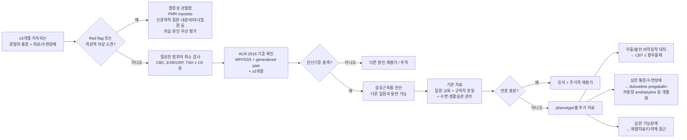

# 섬유근육통 (섬유근통) Fibromyalgia (FM)

## <mark style="color:green;">일반 사항</mark>

* **만성 광범위 통증**과 피로, 수면 장애, 인지 증상 등이 함께 나타날 수 있는 만성 통증 질환으로, 현재는 대표적인 **nociplastic pain(통각가소성 통증)** 질환으로 이해됨 (ACR 2016; IASP terminology)
* 다른 이름 : 섬유근통(fibromyalgia syndrome, FMS)
* 적은 활동도 통증과 피로를 악화시킴; 통증의 질, 강도, 부위 변화가 있을 수 있음
* 유병률 : 일반 인구에서 약 2\~4%로 보고되며, 적용한 진단기준과 연구집단에 따라 차이가 있음
* 20\~50대 여성에서 흔하고, 객관적 소견이 모호하며, 진단적 실험실 검사법이 없음

### <mark style="color:orange;">핵심 병태생리 - 중추 감작(Central Sensitization)</mark>

* 현재는 대표적인 **nociplastic pain(통각가소성 통증)** 질환으로 이해되며, 중추 감작(central sensitization)을 포함한 통증 조절·처리의 이상이 핵심 기전으로 제시됨
* 통증 역치 저하, 통각과민(hyperalgesia), 이질통(allodynia)이 흔하며, 정상적으로는 통증을 유발하지 않는 자극에도 통증을 느낄 수 있음
* 류마티스 질환처럼 관절·연부조직의 구조적 손상이 아니라 **통증 신호 처리 자체의 이상**이 핵심이라는 점이 다른 근골격계 질환과의 근본적 차이
* 일부 환자에서는 피부생검·신경생리 연구에서 **small-fiber pathology(소섬유 이상)**가 보고되며, 최근 연구에서는 상당수 환자에서 이러한 소견이 관찰됨. 이는 병태생리가 중추 감작만으로 설명되지 않을 가능성을 시사하지만, **전형적인 small fiber neuropathy와 동일한 질환이라는 의미는 아니며 임상적 의미는 아직 확립되지 않음**

***

## <mark style="color:green;">원인 및 위험 인자</mark>

* 원인 불명; 유전적 소인이 있는 사람이 감염, 외상, 심리적 스트레스 등 환경 인자에 노출될 때 발생하는 것으로 추정

### <mark style="color:orange;">위험 인자</mark>

* 여성
* 부적절한 수면, 수면 장애
* 스트레스, 외상(신체적/정서적)
* 비만
* 낮은 사회 경제적 상태

✽ 갑상선저하증은 위험 인자라기보다 **감별 또는 동반질환**으로 평가하며, 객관적 근력 저하는 myopathy 등 다른 질환을 우선 감별

***

## <mark style="color:green;">임상 양상</mark>

* 지속 증상 : 전신, 특히 목, 어깨, 허리, 엉덩이의 경직 및 통증, 피로, 수면 장애
* 종종 발생하는 증상
  * 기분 장애 : 우울, 불안, 공황 증상
  * 인지 장애(fibro fog) : 집중력/기억력 장애, 혼돈
  * 두통 : 긴장형 두통, 편두통
  * 운동 능력 저하, 사회적/직업적 기능 저하
  * 감각 이상(둔감)
  * 호흡 곤란, 두근거림
  * 눈/입마름
  * 약물에 대한 반응 증가
  * 소화기/비뇨기 장애 : 복통, 배변 이상(변비 or 설사), 배뇨 이상(절박뇨, 방광 통증), 성 기능 장애
* 동반 통증 증후군 : IBS, 만성피로증후군, 턱관절증후군, 골반통증증후군, 방광통증증후군, 사이질 방광염, 하지불안증후군

***

### <mark style="color:$danger;">🚩 Red Flags!</mark>

<mark style="color:$danger;">**즉각 조치 또는 의뢰**</mark>

* 새로 발생한 국소 신경학적 결손(근력 저하, 감각 소실, 반사 이상) — 섬유근육통의 통증 양상과 불일치 → 신경과 즉각 의뢰
* 급성 관절 종창·발적·발열을 동반한 통증 → 감염성 관절염·결정성 관절염 의심, 즉각 응급 평가
* 구체적 자살 사고 또는 자해 시도 → 즉각 정신건강의학과 의뢰/응급 평가
* 원인 불명의 급격한 체중 감소, 발열, 야간 발한 동반 → 악성종양·감염·전신 염증성 질환 배제 필요

<mark style="color:$warning;">**당일 또는 조기 의뢰**</mark>

* 대칭적 다발 관절 부종, 조조강직 1시간 이상 지속, ESR/CRP 상승 → RA 등 염증성 관절염 의심, 류마티스내과 의뢰
* 50세 이상에서 새로 발생한 양측 어깨/골반대 통증·현저한 조조강직 + ESR/CRP 상승 → polymyalgia rheumatica 의심
* 근력 약화 동반 + CPK 상승 → myositis 의심, 신경과/류마티스내과 의뢰
* 중등도 이상의 우울·불안 증상이 기능에 뚜렷한 영향을 줄 때 → 정신건강의학과 협진

<mark style="color:$info;">**외래 추적 / 추가 평가 계획**</mark> <mark style="color:$info;">- 즉각 위험 낮으나 호전 없으면 의뢰</mark>

* 교육·운동·수면/생활관리 중심의 기본 치료에 필요시 개별화 약물치료를 병행하여 8\~12주 평가했음에도 반응이 불충분한 경우 → 진단·동반질환·치료 순응도 재평가 및 병용 요법 고려
* 심한 기능 장애로 직장 근무가 곤란한 경우 → 재활의학과 또는 통증클리닉 의뢰 고려
* Fibro fog(인지 장애)가 일상·직업 기능에 지속적 영향을 줄 경우 → 신경심리 평가 고려

***

## <mark style="color:green;">진단</mark>

* 특이적 진단 검사나 biomarker는 없으며, **섬유근육통은 배제진단이 아니다.** 병력과 진찰, ACR 기준에 따라 임상적으로 진단하되 다른 질환이 의심되는 소견이 있으면 필요한 범위에서 감별 평가
* 섬유근육통은 다른 질환과 **동시에 존재할 수 있으며**, 진단 자체가 다른 임상적으로 중요한 질환의 존재를 배제하지 않음
* 50세 이상에서 새롭게 발생한 광범위 통증은 PMR, 염증성 질환, 악성종양, 내분비·대사질환 등 다른 원인을 특히 주의하여 평가

### <mark style="color:orange;">검사</mark>

* 모든 환자에서 광범위한 검사를 일률적으로 시행할 필요는 없음
* 기본적으로 CBC, ESR/CRP, TSH 등을 고려하고, 근력 저하가 있으면 CK 등 임상적으로 필요한 검사를 선택
* Vit D, Vit B12, folate, Mg 등은 결핍을 의심할 병력·진찰 소견이나 위험요인이 있을 때 선택적으로 시행
* ANA, RF 등 자가항체 검사는 류마티스 질환이 임상적으로 의심되는 경우에만 시행
* 영상 검사는 구조적·염증성 질환 등 다른 원인의 배제가 필요한 경우 시행

### <mark style="color:orange;">질병 영향 평가 : Fibromyalgia Impact Questionnaire(FIQ)</mark>

**1. 다음을 할 수 있습니까?** (답변하지 않는 항목 허용)\
각 항목에 대하여 '항상' 0점, '대부분' 1점, '가끔' 2점, '절대 못함' 3점

1. 장보기, 쇼핑
2. 세탁기로 빨래하기
3. 식사 준비하기
4. 설거지
5. 진공청소기로 청소하기
6. 잠자리 준비, 침대 정리
7. 1 ㎞ 정도 걷기, 동네 걷기
8. 친구 또는 친척 방문하기
9. 정원 일하기
10. 자동차나 자전거 운전하기
11. 계단 오르내리기

**2. 지난 일주일 동안 좋게 느껴진 날이 며칠인가요?** (계산 : 점수 × 1.43)

* 0일(7점), 1일(6점), 2일(5점), 3일(4점), 4일(3점), 5일(2점), 6일(1점), 7일(0점)

**3. 지난 일주일 동안 섬유근육통 때문에 일을 못나간 것은 며칠이었습니까?** (밖에서 하는 일이 없으면 집안일을 기준으로 답변) (계산 : 점수 × 1.43)

* 0일(0점), 1일(1점), 2일(2점), 3일(3점), 4일(4점), 5일(5점), 6일(6점), 7일(7점)

**4. 지난 한 주간 다음 각 항목** (‘전혀 없었으면’ 0점 \~ ‘매우 심하거나 힘들었으면’ 10점, 각 항목 원 점수 합산 : 총 0\~70점)

1. 집안일을 포함하여 일을 할 때 통증 또는 다른 증상으로 얼마나 지장이 있었습니까?
2. 통증은 얼마나 심했습니까?
3. 얼마나 피곤했습니까?
4. 아침에 일어날 때 기분이 어떠했습니까?
5. 뻣뻣함이 얼마나 심했습니까?
6. 긴장되거나 신경이 예민해지거나 또는 불안해하는 것을 얼마나 느꼈습니까?
7. 우울하거나 기분이 언짢은 것은 얼마나 느꼈습니까?

▶중증도 분류(연구에서 제안된 구간) : 0\~＜39점=mild effect, 39\~＜59점=moderate effect, 59\~100점=severe effect\
✽보험기준 : FIQ ≥40점 및 시각적 아날로그 통증 스케일 ≥40 ㎜ (☞ [통증](../220_/001_-pain.md))


**FIQ와 FIQR**\
FIQ는 2009년 **FIQR(Revised Fibromyalgia Impact Questionnaire)**로 개정되어 기능·전반적 영향·증상의 3영역, 총 21개 항목을 0\~100점으로 평가하는 방식이 임상연구 등에서 널리 활용됨. 다만 국내 pregabalin 급여기준의 **FIQ ≥40점**은 원판 FIQ를 기준으로 하므로 본 챕터에서는 급여 적용과의 연계를 위해 원판 FIQ를 제시함


### <mark style="color:orange;">1차진료 선별 : Fibromyalgia Rapid Screening Tool(FiRST)</mark>

* 광범위 만성 통증 환자에서 섬유근육통 가능성을 빠르게 선별하기 위해 개발된 **6문항 yes/no 자가설문**
* 원 개발 연구에서 **5점 이상(6문항 중 ≥5개 양성)**을 cut-off로 사용했으며, 민감도 약 90%, 특이도 약 86%를 보였음
* **FiRST는 진단 기준이 아니라 선별도구**이므로 양성이라고 섬유근육통으로 확진하지 않으며, 병력·진찰 및 ACR 2016 WPI/SSS/generalized pain 기준으로 확인
* RA, 척추관절염, 골관절염 등 다른 만성 광범위 통증 질환에서도 양성이 가능하므로 red flag 및 객관적 염증·신경학적 이상 여부를 함께 평가

### <mark style="color:orange;">미국류마티스학회(ACR) 진단 Criteria (2016 개정)</mark>


1990년의 tender-point 중심 기준은 2010년 이후 WPI/SSS 기반의 증상 중심 기준으로 대체되었으며, 2016년 개정에서는 **generalized pain(5개 영역 중 ≥4개)** 요건과 동반질환 관련 문구가 보완됨. 임상 진단은 의사의 병력·진찰과 기준 적용을 바탕으로 하며, 단순 자가보고 설문만으로 다른 질환 평가를 생략해서는 안 됨


**1. SSS(Symptom Severity Scale) score** \[총 0\~12점]

1. 지난 1주일 동안 다음 3가지 각 항목에 대하여 '문제없음' 0점, '약간(경도, 간헐적)' 1점, '중간(중등도, 자주 발생)' 2점, '심함(지속적, 삶에 지장)' 3점 \[총 0\~9점]
   * ① 피로, ② 기상 시 기력이 회복되지 못한 느낌, ③ 인지 증상
2. 지난 6개월 동안 다음 3가지 각 증상이 환자를 괴롭힌 적이 '없음' 0점, '있음' 1점 \[총 0\~3점]
   * ① 두통, ② 하복부 통증 또는 경련, ③ 우울

**2. WPI(Widespread Pain Index)**

* 지난 7일 동안 다음 19곳 중 통증이 있었던 곳의 개수. 개당 1점 \[총 0\~19점]
  * Left upper region (Region 1) : Jaw, left\* / Shoulder girdle, left / Upper arm, left / Lower arm, left
  * Right upper region (Region 2) : Jaw, right\* / Shoulder girdle, right / Upper arm, right / Lower arm, right
  * Axial region (Region 5) : Neck / Upper back / Lower back / Chest\* / Abdomen\*
  * Left lower region (Region 3) : Hip (buttock, trochanter), left / Upper leg, left / Lower leg, left
  * Right lower region (Region 4) : Hip (buttock, trochanter), right / Upper leg, right / Lower leg, right
  * \*Not included in generalized pain definition

▶판정 : 다음 3가지 모두를 충족하면 섬유근육통으로 진단

1. { WPI ≥7점 & SSS 점수 ≥5점 } 또는 { WPI 4\~6점 & SSS ≥9점 }
2. 5개 부위(left & right upper, left & right lower, axial region) 중 ≥4개 부위에 통증이 있는 것으로 정의하는 'generalized pain'이 존재
3. ≥3개월 비슷한 수준으로 증상 존재

* fibromyalgia 진단은 다른 진단 유무와 관계없이 붙여질 수 있으며 다른 임상적으로 중요한 질병의 존재를 배제하지 않음

### <mark style="color:orange;">감별</mark>

<table><thead><tr><th width="140">질환</th><th width="230">섬유근육통과의 차이점</th><th>핵심 감별 포인트</th></tr></thead><tbody><tr><td>만성피로증후군</td><td>무기력이 우세</td><td>섬유근육통은 근육-골격 통증이 우세</td></tr><tr><td>Myofascial pain</td><td>국소성</td><td>trigger point 존재; 섬유근육통은 전신성</td></tr><tr><td>RA 또는 SLE</td><td>염증성 관절염/전신 질환</td><td>대칭적 다발성 관절염, 전신 증상(피부염, 신장염), ESR↑, RF/anti-DNA Ab 양성</td></tr><tr><td>Ankylosing spondylitis</td><td>척추 관절의 만성 진행성 염증</td><td>척추 통증·강직·움직임 감소, X선 이상(섬유근육통은 보통 정상)</td></tr><tr><td>Polymyalgia rheumatica</td><td>어깨/골반 근위부 강직 우세</td><td>통증보다 강직, ＞50세 이환, 빈혈, ESR↑, steroid에 반응</td></tr><tr><td>Myositis</td><td>근육에 국한된 증상</td><td>근력 약화, 근육 효소 수치↑</td></tr><tr><td>갑상선저하증</td><td>대사성 질환</td><td>TFT 이상</td></tr><tr><td>신경병증</td><td>말초신경 병변</td><td>신경병증적 분포의 임상 양상, 신경전도검사 이상</td></tr></tbody></table>

***



<p align="center"><strong>섬유근육통 관리 알고리듬</strong></p>

<p align="center"><em><mark style="color:$info;">Ref. Macfarlane GJ, et al. EULAR revised recommendations for the management of fibromyalgia. Ann Rheum Dis 2017;76:318–328.</mark></em></p>

***

## <mark style="background-color:$warning;">Management</mark>

### <mark style="color:orange;">치료 방침</mark>

* 안심시킴, 병에 대하여 이해시킴 : 퇴행성 질환이 아니며 생명을 위협하지 않음. 치료가 어렵고 빠른 치료법은 없지만 증상을 완화시키고 삶의 질을 향상시킬 수 있음
* **기본 치료** : 질환 교육 + 규칙적 운동 + 수면·생활습관 관리
* 반응이 불충분하면 통증·수면장애·우울/불안·기능장애 등 phenotype에 따라 인지행동치료(CBT), 약물, 재활치료를 개별적으로 추가
* EULAR 2017 권고 : 비약물 치료(환자 교육, 유산소 운동)를 먼저 시행하고, 반응이 불충분할 때 개별화된 추가 치료(약물·심리·재활)를 단계적으로 병행 \[EULAR 2017]

***

## <mark style="color:green;">비-약물 치료 및 예방</mark>

* 운동, 수면 환경 개선, 적정 체중 유지
* 인지행동 요법, 바이오피드백, 이완 요법(예: 스트레스 감소 프로그램, 최면)

### <mark style="color:orange;">운동</mark>

* 장기간(6\~12개월), 지속적 시행 필요
* 유산소 운동과 근육 강화 운동을 기본으로 하며, 환자의 선호·관절 부담·체력에 따라 **수중 운동(aquatic exercise)**을 대안으로 고려
* **Tai chi** 등 mind-body exercise도 선택 가능한 비약물치료로 고려할 수 있으며, 지속 가능성과 환자 선호를 중시
* 증상을 악화시키는 과도한 운동은 피하고, 낮은 강도/짧은 시간으로 시작하여 점차 강하게/길게 : 매일 5분씩 → 점차 늘림, 30\~60분/회

### <mark style="color:orange;">대체 요법</mark>

* 요가 : 수면, 피로, 삶의 질에 도움; 통증 완화 효과는 입증 안 됨
* 침 : 일부 환자에서 단기적 증상 개선 가능성이 있으나 근거는 제한적
* 카이로프랙틱 : 권고하지 않음
* 마사지, 전기 요법, 초음파, TPI : 일관된 효과 근거가 부족하여 routine 치료로 권고하지 않음

***

## <mark style="color:green;">약물 치료</mark>

### <mark style="color:orange;">진통제</mark>

(☞ [통증](../220_/001_-pain.md#undefined-8))

* acetaminophen : 섬유근육통 자체의 nociplastic pain에 대한 효과는 제한적이며, 다른 nociceptive pain이 동반된 경우 보조적으로 고려 <mark style="color:blue;">\[타이레놀]</mark>
* tramadol : 50\~100 ㎎ q6h <mark style="color:blue;">\[트리돌]</mark>; 선별된 환자에서 **단기간 rescue option**으로만 고려
  * 부작용 : 구역, 어지럼, 졸음, 변비 등. SNRI/SSRI/TCA 등 serotonergic 약물과 병용 시 serotonin syndrome 및 경련 위험에 주의
  * EULAR 2017 : 약한 조건부 권고(weak recommendation) — 통증이 심할 때 단기간 사용 고려
* NSAID : 섬유근육통 자체에는 효과가 제한적이며, 골관절염 등 다른 nociceptive/inflammatory pain이 동반된 경우에만 고려
  * ibuprofen : 400\~800 ㎎ tid\~qid <mark style="color:blue;">\[부루펜]</mark>
  * naproxen : 500 ㎎ bid <mark style="color:blue;">\[낙센]</mark>
* 강오피오이드(strong opioid) : EULAR 2017 강한 반대 권고(strong recommendation against) — 근거 부족, 장기 사용 시 오·남용 위험

### <mark style="color:orange;">항우울제</mark>

(☞ [항우울제](../231_/213_-antidepressants-and-anxiolytics.md))

* 작용 : 통증, 피로, 기분, 수면 개선(특히 TCA)
* TCA + SSRI/SNRI 병용은 일부 환자에서 고려될 수 있으나 **routine 섬유근육통 치료 전략은 아니며**, serotonin syndrome, QT 연장, 항콜린 부작용 및 CYP2D6 억제에 따른 TCA 혈중농도 상승 가능성에 주의 (보험기준 ☞ p.1177)
* 용량 : 저용량으로 시작 → 효과와 부작용을 감안하여 점차 증량; 중단 시 tapering


**섬유근육통 관련 급여 기준 (HIRA) — 약제별 구분**\
* **duloxetine** : 섬유근육통으로 확진되고 TCA 또는 허가사항상 근골격계 질환의 동통에 사용할 수 있는 근이완제를 적어도 1개월 사용한 후에도 효과가 불충분한 경우 급여 인정. **pregabalin과의 병용투여는 인정하지 않음**\
* **pregabalin** : 위와 같은 선행 치료 후 효과가 불충분한 경우 급여 인정. **duloxetine과의 병용투여는 인정하지 않음**\
* **duloxetine·pregabalin** : 급여기준상 섬유근육통 확진은 **2010 ACR 진단기준에 부합하고 FIQ ≥40점, pain VAS ≥40 ㎜**인 경우이며, 투여개시 **13주 후 Pain VAS와 FIQ의 호전이 없으면 투여중단을 고려**\
* **milnacipran** : 국내 허가사항에 **섬유근육통 치료** 적응증이 있으며, 현재 확인 가능한 HIRA 공개 세부기준상 **허가사항 범위 내 투여 시 요양급여를 원칙**으로 함. duloxetine/pregabalin에 적용되는 위의 TCA·근이완제 선행치료, FIQ/VAS 및 13주 반응평가 조건은 별도로 명시되어 있지 않음\
* **gabapentin** : HIRA gabapentin 경구제 급여기준에는 섬유근육통이 급여 인정 상병으로 열거되어 있지 않음. FM에 사용할 때는 국내 허가 및 비급여 여부를 별도로 확인\
✽ 임상 진단은 ACR 2016 기준을 사용할 수 있으나, **보험 급여 판정에는 HIRA가 명시한 별도 기준**이 적용됨\
✽ 급여기준은 변경될 수 있으므로 처방 시점의 최신 HIRA 고시를 반드시 확인


#### <mark style="color:$primary;">SNRI</mark>

* 부작용 : 구역, 어지럼
* duloxetine : 30 ㎎/d ×1주, 이후 60 ㎎/d <mark style="color:blue;">\[심발타]</mark>
* milnacipran : 1일째 12.5 ㎎, 2\~3일째 12.5 ㎎ bid, 4\~7일째 25 ㎎ bid, 8일째부터 50 ㎎ bid(1일 100 ㎎, **권장 유지 용량**); 반응·내약성에 따라 100 ㎎ bid(1일 200 ㎎)까지 증량 가능 <mark style="color:blue;">\[익셀]</mark>
  * ✽위약대조시험에서 3개월을 초과한 장기 시험에서는 유효성이 관찰되지 않음; 정기적으로 효과 재평가 필요

#### <mark style="color:$primary;">SSRI</mark>

* **SSRI는 섬유근육통의 통증 자체를 위한 routine 치료로 권고하지 않으며(EULAR 2017), 동반 우울·불안장애의 적응증이 있을 때 고려**
* 부작용 : 구역, 설사, 성욕 감소, 두통, 불면증/졸림, serotonin syndrome, CYP450 효소 억제
* fluoxetine : 10\~80 ㎎/d <mark style="color:blue;">\[푸로작]</mark>
* paroxetine CR : 12.5\~62.5 ㎎/d <mark style="color:blue;">\[팍실 CR]</mark>
* sertraline : 50\~100 ㎎ qd <mark style="color:blue;">\[졸로푸트]</mark>

#### <mark style="color:$primary;">TCA</mark>

* 부작용 : 입마름, 체액 저류, 체중 증가, 변비, 졸음, 집중력 저하
* amitriptyline : 10 ㎎ hs → 필요시 2주 간격으로 5 ㎎씩 증량, 유지 25 ㎎ hs <mark style="color:blue;">\[에트라빌]</mark>
* nortriptyline : 10 ㎎ hs → 점차 증량, 유지 25 ㎎ hs <mark style="color:blue;">\[센시발]</mark>

#### <mark style="color:$primary;">기타</mark>

* trazodone : 25\~400 ㎎/d 저녁(취침 2시간 전) 또는 분할 투여 <mark style="color:blue;">\[트리티코]</mark>

### <mark style="color:orange;">항경련제</mark>

* 작용 : 통증, 피로, 수면 개선
* 부작용 : 졸음, 어지럼, 체중 증가, 하지 부종
* pregabalin : 75 ㎎ bid → 필요시 1주 간격 증량, 유지 150 ㎎ bid, 최대 450 ㎎/d <mark style="color:blue;">\[리리카]</mark> (HIRA 급여기준 : 위 항우울제 항목 hint 참조)
* gabapentin : 300 ㎎ hs → 1,200\~2,400 ㎎/d #2\~3 <mark style="color:blue;">\[뉴론틴]</mark>

### <mark style="color:orange;">수면제</mark>

* 최소 유효 용량 사용
* 급성 불면증 : 최대 2\~4주 사용
* 만성 불면증 : 간헐적 사용. 지속 사용은 피해야 함
* zolpidem : 섬유근육통 자체의 치료제로 routine 권고하지 않음. 별도의 불면장애가 진단되고 비약물치료만으로 불충분한 경우에 한해 최소 유효 용량·단기간 사용을 고려 <mark style="color:blue;">\[스틸녹스]</mark>

### <mark style="color:orange;">근이완제</mark>

* 졸음 주의
* cyclobenzaprine : 저용량 취침 전 투여를 고려; 제형·국내 허가용법에 따라 용량 확인 <mark style="color:blue;">\[본렉스]</mark>
* tizanidine, baclofen : 근긴장·근경련이 동반된 일부 환자에서 경험적으로 고려할 수 있으나, **섬유근육통 자체에 대한 근거는 제한적이며 routine 치료로 권고하지 않음**

### <mark style="color:orange;">특수 환자군의 약물치료 주의</mark>


**임신·수유**\
가임기 여성에서 장기 약물치료를 시작하기 전 임신 계획·임신 가능성·수유 여부를 확인한다. 임신·수유 중에는 TCA, SNRI, pregabalin/gabapentin 등 약제별 태아·영아 위해성과 산모의 치료 필요성을 개별적으로 재평가하고, 불필요한 다약제 병용을 피한다. 임의 중단보다 **약제별 최신 허가사항과 임신·수유 안전성 자료를 확인하여 위해-편익을 판단**한다.



**고령자**\
저용량에서 시작하여 천천히 증량한다. TCA의 항콜린성 부작용·기립성 저혈압, pregabalin/gabapentin의 졸음·어지럼·보행 불안정·부종에 특히 주의하고, **낙상 위험·인지기능·다약제 복용·신기능**을 함께 평가한다.


### <mark style="color:orange;">기타</mark>

* Vit D(예: cholecalciferol) : Vit D가 부족한 환자에서 고려 <mark style="color:blue;">\[칼디텍 츄어블]</mark>
* 일반적으로 효과적이지 않은 약제 : steroid, melatonin, opioid, benzodiazepine, Mg 단독, DHEA

#### <mark style="color:$primary;">연구 단계 / 근거 불충분 치료</mark>

* **acetyl-L-carnitine, S-adenosyl-L-methionine(SAMe)** : 일부 소규모 연구에서 효과 신호가 보고되었으나 근거가 제한적이며 routine 치료로 권고하기 어려움
* **Mg + malic acid** : 초기 소규모 연구가 있었으나 후속 체계적 문헌고찰에서 일관된 임상적 효과가 확인되지 않아 routine 사용을 권고하지 않음
* **Low-dose naltrexone(LDN)** : 소규모 임상시험에서 통증 감소 신호가 보고되었으나 표준 치료로 권고할 근거가 아직 부족함. **국내 섬유근육통 적응증 미허가·off-label**로 routine 처방하지 않음
* **Cannabinoid** : 소규모 연구가 있으나 효과와 안전성에 대한 근거가 불충분하고 표준 치료로 확립되지 않음. routine 치료로 권고하지 않음

***

### <mark style="color:red;">질병코드</mark>

M79.7 섬유근통

***

## <mark style="color:purple;">처방례</mark>

> **처방례 1. 경증 — 통증 + 수면 장애 위주**
>
> ```
> 에트라빌(amitriptyline) 10 ㎎/T  1T  취침 시
> ※ 2\~4주 간격으로 효과·부작용을 보며 저용량 범위에서 증량 고려
> ```
>
> _✽ 비약물치료(교육·운동·수면관리)를 병행하면서 저용량 TCA로 시작하여 통증과 수면을 동시에 개선. 최소 4주 이상 치료 후 효과와 내약성을 평가_

> **처방례 2. 중등도\~중증 — 우울 동반**
>
> ```
> 심발타(duloxetine) 30 ㎎/C  1C  아침
> ※ 1주 후 60 ㎎/d로 증량 고려
> ```
>
> _✽ 우울·불안이 동반되거나 통증 phenotype상 SNRI가 적합할 때 고려. 급여 적용 여부는 duloxetine 최신 HIRA 고시를 확인하고, pregabalin과의 병용 급여 제한에 유의_

> **처방례 3. 심한 통증 + 수면 장애 우세**
>
> ```
> 리리카(pregabalin) 75 ㎎/C  1C  bid
> ※ 1주 간격으로 증량, 유지 150 ㎎ bid, 최대 450 ㎎/d
> ※ 졸음·어지럼·체중 증가·하지 부종 모니터링
> ※ duloxetine과 병용 시 HIRA 기준상 병용 급여 불인정
> ```
>
> _✽ 야간 통증·불면이 두드러질 때 pregabalin 야간 용량을 우선 증량하는 전략 고려_

***

### <mark style="color:$success;">핵심 복약 지도</mark>

> **항우울제·항경련제, 저용량에서 시작하는 이유**
>
> * 섬유근육통에서는 우울증·신경병증성 통증 치료 용량보다 **훨씬 낮은 용량**에서 시작합니다(예: amitriptyline 10\~25 ㎎, 우울증 상용량의 1/5\~1/10 수준)
> * 효과는 약제별로 수 주에 걸쳐 나타날 수 있으며, 충분한 용량과 기간을 확보한 뒤 효과·기능·부작용을 함께 평가합니다
> * 임의로 중단하지 말고, 효과가 부족하거나 부작용이 있으면 반드시 진료 시 상의하도록 안내

> **약물 병용 시 급여 제한**
>
> * duloxetine과 pregabalin은 HIRA 기준상 섬유근육통에서 **병용 급여가 인정되지 않음**을 처방 전 확인·고지
> * duloxetine과 pregabalin의 FM 급여는 TCA 또는 허가된 근이완제 1개월 이상 선행 치료 후 효과 불충분, 2010 ACR 기준, FIQ ≥40점, pain VAS ≥40 ㎜ 등 HIRA 기준을 충족해야 함
> * milnacipran은 국내 FM 적응증이 허가되어 있으며, 현재 확인 가능한 HIRA 공개 세부기준상 허가사항 범위 내 급여를 원칙으로 함
> * gabapentin은 FM 급여 인정 상병으로 열거되어 있지 않으므로 국내 허가 및 비급여 여부를 별도로 확인

> **부작용 모니터링**
>
> * TCA : 입마름, 변비, 체중 증가, 기립성 저혈압 — 고령자는 더 낮은 용량에서 시작
> * pregabalin/gabapentin : 졸음, 어지럼, 하지 부종, 체중 증가 — 운전·기계 조작 시 주의 고지
> * duloxetine/milnacipran : 초기 구역, 혈압 상승 가능 — 치료 전후 혈압 확인

> **언제 다시 병원을 방문해야 하나요?**
>
> * 8\~12주 표준 치료(운동+약물)에도 증상 호전이 없는 경우
> * 새로운 관절 부종, 발열, 급격한 체중 감소가 동반되는 경우 — 즉시 내원
> * 약물 복용 후 심한 어지럼, 실신, 심한 부종이 발생하는 경우 — 즉시 내원
> * 자살 사고나 심한 우울감이 생기는 경우 — 즉시 내원 또는 정신건강 위기상담(1577-0199)

***

### <mark style="color:blue;">환자 안내서</mark>


**섬유근육통, 관절이나 근육이 상한 병이 아닙니다**

섬유근육통은 몸의 통증을 느끼고 조절하는 신경계 자체가 예민해져서 생기는 만성 통증 질환입니다. 관절이나 근육 조직이 손상되거나 염증이 생긴 것은 아니며, 생명을 위협하거나 관절을 변형시키지 않습니다.


#### <mark style="color:$primary;">왜 온몸이 아픈가요?</mark>

* 정상적으로는 아프지 않을 정도의 자극에도 통증을 느끼는 것은, 뇌와 척수에서 통증 신호를 처리하는 방식이 예민해져 있기 때문입니다
* 스트레스, 수면 부족, 외상 등이 이러한 예민함을 악화시킬 수 있습니다

#### <mark style="color:$primary;">일상생활에서 어떻게 관리하나요?</mark>

* **꾸준히 몸을 움직이십시오.** 처음에는 하루 5분씩 가벼운 걷기부터 시작하여 서서히 늘려가면 통증과 피로가 오히려 줄어듭니다 🚶
* **규칙적인 수면 습관을 지키십시오.** 매일 같은 시간에 자고 일어나는 것이 통증 조절에 큰 도움이 됩니다 🛏️
* **급격한 활동 변화를 피하십시오.** 무리한 날과 전혀 안 움직이는 날이 반복되면 증상이 오히려 심해질 수 있습니다
* **스트레스 관리 방법을 찾으십시오.** 이완 요법, 명상, 요가 등이 도움이 될 수 있습니다
* 걷기나 근력운동이 부담스럽다면 **수중 운동이나 타이치**처럼 관절 부담이 적고 지속하기 쉬운 운동을 선택할 수 있습니다

#### <mark style="color:$primary;">약은 어떻게 복용하나요?</mark>

* 처방된 약은 통증을 완전히 없애기보다 **참을 수 있는 수준으로 줄이고 기능을 회복**시키는 것이 목표입니다
* 효과는 서서히 나타나므로 최소 2\~4주는 꾸준히 복용해 보십시오
* 졸음, 어지럼이 있는 초기에는 운전이나 위험한 작업을 피하십시오
* 임신을 계획 중이거나 임신·수유 중이라면 약을 임의로 중단하지 말고, 복용 중인 약의 지속·변경 여부를 의료진과 상의하십시오

#### <mark style="color:$primary;">이럴 때는 즉시 병원을 방문하세요</mark>

* 관절이 붓고 열이 나면서 아플 때
* 갑자기 살이 많이 빠지거나 열이 계속될 때
* 죽고 싶다는 생각이 들 때 — 정신건강 위기상담 **1577-0199** 또는 자살예방상담전화 **109**로도 도움을 받을 수 있습니다
