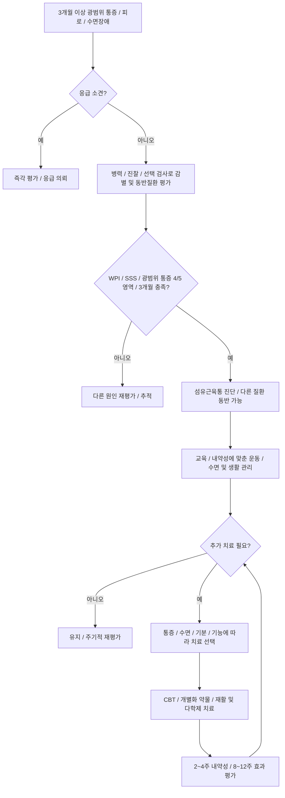

# 섬유근육통 (섬유근통) Fibromyalgia (FM)

## <mark style="color:green;">일반 사항</mark>

* **만성 광범위 통증**과 피로, 수면 장애, 인지 증상 등이 함께 나타날 수 있는 만성 통증 질환으로, 현재는 대표적인 **nociplastic pain(통각가소성 통증)** 질환으로 이해됨 (IASP terminology)
* 다른 이름 : 섬유근통(fibromyalgia syndrome, FMS)
* 활동 후 통증·피로가 일시적으로 악화될 수 있으며, 통증의 강도·부위는 변동할 수 있음. 활동을 피하기보다 환자의 내약성에 맞춰 활동량을 조절함
* 유병률 : 일반 인구에서 약 2\~4%로 보고되며, 적용한 진단기준과 연구집단에 따라 차이가 있음
* 여성에서 더 흔하지만 남성·청소년·고령자에서도 발생할 수 있음. 여성 우세 정도는 진단기준과 진료집단에 따라 달라짐
* 광범위 압통은 흔하나 관절염·객관적 근력 저하·국소 신경학적 결손은 전형적 소견이 아니며, 확진을 위한 특이적 실험실 검사는 없음

### <mark style="color:orange;">핵심 병태생리 - 중추 감작(Central Sensitization)</mark>

* 현재는 대표적인 **nociplastic pain(통각가소성 통증)** 질환으로 이해되며, 중추 감작(central sensitization)을 포함한 통증 조절·처리의 이상이 핵심 기전으로 제시됨
* 통증 역치 저하, 통각과민(hyperalgesia), 이질통(allodynia)이 흔하며, 정상적으로는 통증을 유발하지 않는 자극에도 통증을 느낄 수 있음
* 섬유근육통에서는 관절·연부조직의 구조적 손상이나 염증만으로는 통증을 설명하기 어려우며 **통증 조절·처리의 이상**이 중요한 기전임. 염증성·퇴행성 질환과 함께 존재할 수 있음
* 일부 환자에서는 피부생검·신경생리 연구에서 **small-fiber pathology(소섬유 이상)**가 보고되며, 최근 연구에서는 상당수 환자에서 이러한 소견이 관찰됨. 이는 병태생리가 중추 감작만으로 설명되지 않을 가능성을 시사하지만, **전형적인 small fiber neuropathy와 동일한 질환이라는 의미는 아니며 임상적 의미는 아직 확립되지 않음**. 전형적인 섬유근육통에서 피부생검·소섬유 검사를 일률적으로 시행하지 않으며, 화끈거림·통증/온도 감각 저하·자율신경 증상 등 신경병증이 의심될 때 별도로 평가함

***

## <mark style="color:green;">원인 및 위험 인자</mark>

* 원인 불명; 유전적 소인이 있는 사람이 감염, 외상, 심리적 스트레스 등 환경 인자에 노출될 때 발생하는 것으로 추정

### <mark style="color:orange;">위험 인자</mark>

* 여성
* 부적절한 수면, 수면 장애
* 스트레스, 외상(신체적/정서적)
* 비만
* 낮은 사회 경제적 상태

✽ 갑상선저하증은 위험 인자라기보다 **감별 또는 동반질환**으로 평가하며, 객관적 근력 저하는 myopathy 등 다른 질환을 우선 감별

***

## <mark style="color:green;">임상 양상</mark>

* 지속 증상 : 전신, 특히 목, 어깨, 허리, 엉덩이의 경직 및 통증, 피로, 수면 장애
* 종종 발생하는 증상
  * 기분 장애 : 우울, 불안, 공황 증상
  * 인지 장애(fibro fog) : 집중력/기억력 저하, 사고 속도 저하. 급성 혼돈·의식 변화는 전형적인 fibro fog가 아니므로 다른 원인을 평가함
  * 두통 : 긴장형 두통, 편두통
  * 운동 능력 저하, 사회적/직업적 기능 저하
  * 감각 이상(저림, 따끔거림 등); 객관적 감각 소실이 있으면 신경병증 등을 평가함
  * 호흡 곤란, 두근거림
  * 눈/입마름
  * 일부 환자에서 약물 부작용에 대한 민감성 증가
  * 소화기/비뇨기 장애 : 복통, 배변 이상(변비 or 설사), 배뇨 이상(절박뇨, 방광 통증), 성 기능 장애
* 동반질환·증후군 : 과민성 장증후군(IBS), 근육통성 뇌척수염/만성피로증후군(ME/CFS), 턱관절장애, 골반통증증후군, 방광통증증후군/간질성 방광염, 하지불안증후군, 폐쇄성 수면무호흡증

***

### <mark style="color:$danger;">🚩 Red Flags!</mark>

<mark style="color:$danger;">**즉각 조치 또는 의뢰**</mark>

* 갑작스러운 편측 근력 저하·언어장애, 급성 의식 변화 → 뇌졸중 등 응급질환 평가
* 빠르게 진행하는 근력 저하, 새로 발생한 요폐/대소변 조절 장애 또는 회음부 감각 저하 → 척수압박·마미증후군 등 응급 평가
* 급성으로 심하게 아프고 붓는 관절, 발적·열감 또는 운동 제한(발열 유무와 무관) → 감염성 관절염 배제를 위한 즉각 평가; 결정성 관절염도 감별
* 구체적인 자살 계획·의도, 최근 자해/자살 시도 또는 안전 확보가 어려운 상태 → 혼자 두지 않고 즉각 응급 평가/119 연계
* 50세 이상에서 새 두통·두피 압통·턱 파행, 특히 시력 저하/복시가 동반됨 → 거대세포동맥염 의심, 즉각 평가
* 심한 근력 저하에 연하곤란·호흡곤란이 동반되거나, 심한 근육통과 짙은 소변/소변량 감소가 나타남 → 중증 근질환·횡문근융해증 응급 평가

<mark style="color:$warning;">**당일~수일 내 평가**</mark>

* 원인 불명의 뚜렷한 체중 감소, 지속 발열 또는 야간 발한 → 악성종양·감염·전신 염증성 질환 평가; 활력징후 불안정 등 전신 상태가 나쁘면 즉각 조치
* 지속적인 관절 종창 또는 현저한 조조강직 → 염증성 관절염 평가. ESR/CRP 정상만으로 배제하지 않음
* 50세 이상에서 새로 발생한 양측 어깨/골반대 통증·현저한 조조강직 → 류마티스성 다발근통(PMR) 평가; ESR/CRP 확인
* 객관적 근력 저하·국소 감각 소실·반사 이상 → CK 등 선택 검사 및 신경과/류마티스내과 평가. CK 정상만으로 근질환을 배제하지 않음
* 자살사고가 있으나 즉각 위험은 낮다고 판단되는 경우 → 당일 자살위험 평가·안전계획 수립 및 정신건강의학과 연계

<mark style="color:$info;">**외래 추적 / 추가 평가 계획**</mark>

* 치료 시작·변경 후 2~4주에 내약성·수면·기능을 확인하고, 적절한 치료를 8~12주 시행했음에도 반응이 불충분하면 진단·동반질환·치료 순응도를 재평가함
* 중등도 이상의 우울·불안이 지속되어 기능을 저해하거나, 심한 기능 장애로 일상·직장 생활이 곤란함 → 정신건강의학과·재활의학과·통증클리닉 협진 고려
* 인지 증상이 지속되면 수면장애·우울·약물 영향을 먼저 평가하고, 진행성 인지 저하·객관적 이상이 있으면 신경과/신경심리 평가 고려

***

## <mark style="color:green;">진단</mark>

* 특이적 진단 검사나 biomarker는 없으며, **섬유근육통은 배제진단이 아니다.** 병력과 진찰, ACR 기준에 따라 임상적으로 진단하되 다른 질환이 의심되는 소견이 있으면 필요한 범위에서 감별 평가
* 섬유근육통은 다른 질환과 **동시에 존재할 수 있으며**, 진단 자체가 다른 임상적으로 중요한 질환의 존재를 배제하지 않음
* 50세 이상에서 새롭게 발생한 광범위 통증은 PMR, 염증성 질환, 악성종양, 내분비·대사질환 등 다른 원인을 특히 주의하여 평가

### <mark style="color:orange;">검사</mark>

* 모든 환자에서 광범위한 검사를 일률적으로 시행할 필요는 없음
* 기본적으로 CBC, ESR/CRP, TSH 등을 고려함. 신장·간기능, 전해질 등은 감별 필요성과 약물치료 계획에 따라 선택하며, 근력 저하가 있으면 CK 등을 확인함
* Vit D, Vit B12, folate, Mg 등은 결핍을 의심할 병력·진찰 소견이나 위험요인이 있을 때 선택적으로 시행
* ANA, RF, anti-CCP 등 자가항체 검사는 류마티스 질환이 임상적으로 의심되는 경우에만 시행
* Statin 등 근육 증상을 유발할 수 있는 약물을 확인하고, 코골이·무호흡·주간 졸림, 하지불안 증상 등 치료 가능한 수면장애를 평가함
* 영상 검사는 구조적·염증성 질환 등 다른 원인의 배제가 필요한 경우 시행

### <mark style="color:orange;">질병 영향 평가 : Fibromyalgia Impact Questionnaire(FIQ)</mark>

* 아래 문항은 FIQ의 내용을 설명하기 위한 요약임. 실제 점수 기록·급여 청구에는 검증된 한국어 FIQ 양식과 해당 양식의 채점 지침을 사용함

**1. 지난 1주일 동안 다음을 할 수 있었습니까?** (평소 하지 않는 활동은 해당 없음으로 처리)\
각 항목에 대하여 '항상' 0점, '대부분' 1점, '가끔' 2점, '절대 못함' 3점\
**기능영역 점수 = 응답한 항목의 점수 합 ÷ 응답한 항목 수 × 3.33** (약 0~10점). 해당 없음/미응답을 0점으로 넣지 않음

1. 장보기, 쇼핑
2. 세탁기로 빨래하기
3. 식사 준비하기
4. 설거지
5. 진공청소기로 청소하기
6. 잠자리 준비, 침대 정리
7. 1 ㎞ 정도 걷기, 동네 걷기
8. 친구 또는 친척 방문하기
9. 정원 일하기
10. 자동차나 자전거 운전하기
11. 계단 오르내리기

**2. 지난 일주일 동안 좋게 느껴진 날이 며칠인가요?** (계산 : 점수 × 1.43)

* 0일(7점), 1일(6점), 2일(5점), 3일(4점), 4일(3점), 5일(2점), 6일(1점), 7일(0점)

**3. 지난 일주일 동안 섬유근육통 때문에 일을 못나간 것은 며칠이었습니까?** (밖에서 하는 일이 없으면 집안일을 기준으로 답변) (계산 : 점수 × 1.43)

* 0일(0점), 1일(1점), 2일(2점), 3일(3점), 4일(4점), 5일(5점), 6일(6점), 7일(7점)

**4. 지난 한 주간 다음 각 항목** (‘전혀 없었으면’ 0점 \~ ‘매우 심하거나 힘들었으면’ 10점, 각 항목 원 점수 합산 : 총 0\~70점)

1. 집안일을 포함하여 일을 할 때 통증 또는 다른 증상으로 얼마나 지장이 있었습니까?
2. 통증은 얼마나 심했습니까?
3. 얼마나 피곤했습니까?
4. 아침에 일어날 때 얼마나 피곤했습니까?
5. 뻣뻣함이 얼마나 심했습니까?
6. 긴장되거나 신경이 예민해지거나 또는 불안해하는 것을 얼마나 느꼈습니까?
7. 우울하거나 기분이 언짢은 것은 얼마나 느꼈습니까?

**총점 = 기능영역(0~10점) + 좋지 않았던 날(0~10점) + 일을 못한 날(0~10점) + 7개 증상 항목(0~70점)** → 0~100점, 높을수록 질병 영향이 큼. 미응답 영역이 있으면 공식 양식의 결측값 처리 지침을 따름

▶중증도 분류(연구에서 제안된 구간) : 0\~＜39점=mild effect, 39\~＜59점=moderate effect, 59\~100점=severe effect\
✽ duloxetine·pregabalin 및 허가 외 TCA의 섬유근육통 급여기준에 FIQ ≥40점 및 시각적 아날로그 통증 스케일(pain VAS) ≥40 ㎜가 포함됨. 세부 조건은 아래 급여기준 참조 (☞ [통증](../220_/001_-pain.md))


**FIQ와 FIQR**\
FIQ는 2009년 **FIQR(Revised Fibromyalgia Impact Questionnaire)**로 개정되어 기능·전반적 영향·증상의 3영역, 총 21개 항목을 0\~100점으로 평가하는 방식이 임상연구 등에서 널리 활용됨. 다만 HIRA 급여기준은 **FIQ ≥40점**으로 명시되어 있으므로 FIQR 점수를 그대로 대체 적용하지 않음. 본 챕터의 FIQ 요약은 검증된 평가 양식을 대신하지 않음


### <mark style="color:orange;">1차진료 선별 : Fibromyalgia Rapid Screening Tool(FiRST)</mark>

* 광범위 만성 통증 환자에서 섬유근육통 가능성을 빠르게 선별하기 위해 개발된 **6문항 yes/no 자가설문**
* 원 개발 연구에서 **5점 이상(6문항 중 ≥5개 양성)**을 cut-off로 사용했으며, 민감도 90.5%, 특이도 85.7%를 보였음 [Perrot 등, 2010]
* **FiRST는 진단 기준이 아니라 선별도구**이므로 양성이라고 섬유근육통으로 확진하지 않으며, 병력·진찰 및 ACR 2016 WPI/SSS/generalized pain 기준으로 확인
* RA, 척추관절염, 골관절염 등 다른 만성 광범위 통증 질환에서도 양성이 가능하므로 red flag 및 객관적 염증·신경학적 이상 여부를 함께 평가

### <mark style="color:orange;">ACR 2010/2011 기준의 2016 개정 진단기준(Wolfe 등)</mark>


1990년의 tender-point 중심 분류기준 이후 2010년에는 WPI/SSS 기반의 진단기준이 제안되었으며, 압통점 11/18개 이상은 현재 임상 진단의 필수요건이 아님. 2016년 개정에서는 **generalized pain(5개 영역 중 ≥4개)** 요건과 동반질환 관련 문구가 보완됨. 임상 진단은 의사의 병력·진찰과 기준 적용을 바탕으로 하며, 단순 자가보고 설문만으로 다른 질환 평가를 생략해서는 안 됨


**1. SSS(Symptom Severity Scale) score** \[총 0\~12점]

1. 지난 1주일 동안 다음 3가지 각 항목에 대하여 '문제없음' 0점, '약간(경도, 간헐적)' 1점, '중간(중등도, 자주 발생)' 2점, '심함(지속적, 삶에 지장)' 3점 \[총 0\~9점]
   * ① 피로, ② 기상 시 기력이 회복되지 못한 느낌, ③ 인지 증상
2. 지난 6개월 동안 다음 3가지 각 증상이 환자를 괴롭힌 적이 '없음' 0점, '있음' 1점 \[총 0\~3점]
   * ① 두통, ② 하복부 통증 또는 경련, ③ 우울

**2. WPI(Widespread Pain Index)**

* 지난 7일 동안 다음 19곳 중 통증이 있었던 곳의 개수. 개당 1점 \[총 0\~19점]
  * Left upper region (Region 1) : Jaw, left\* / Shoulder girdle, left / Upper arm, left / Lower arm, left
  * Right upper region (Region 2) : Jaw, right\* / Shoulder girdle, right / Upper arm, right / Lower arm, right
  * Axial region (Region 5) : Neck / Upper back / Lower back / Chest\* / Abdomen\*
  * Left lower region (Region 3) : Hip (buttock, trochanter), left / Upper leg, left / Lower leg, left
  * Right lower region (Region 4) : Hip (buttock, trochanter), right / Upper leg, right / Lower leg, right
  * \*Not included in generalized pain definition

▶판정 : 다음 3가지 모두를 충족하면 섬유근육통으로 진단

1. { WPI ≥7점 & SSS 점수 ≥5점 } 또는 { WPI 4\~6점 & SSS ≥9점 }
2. 5개 부위(left & right upper, left & right lower, axial region) 중 ≥4개 부위에 통증이 있는 것으로 정의하는 'generalized pain'이 존재
3. 증상이 전반적으로 ≥3개월 지속됨(기간 중 증상 강도는 변동할 수 있음)

* fibromyalgia 진단은 다른 진단 유무와 관계없이 붙여질 수 있으며 다른 임상적으로 중요한 질병의 존재를 배제하지 않음
* 턱·가슴·복부 통증은 **WPI 점수에는 포함**하지만 **generalized pain의 영역 판정에는 제외**함. 각 영역에서 이들을 제외한 부위 중 ≥1곳에 통증이 있어야 해당 영역을 양성으로 셈
* 2016 개정 기준은 성인 임상 진단에 적용함. 소아·청소년에서는 소아류마티스 등 전문 평가를 고려함

### <mark style="color:orange;">감별</mark>

<table><thead><tr><th width="140">질환</th><th width="230">섬유근육통과의 차이점</th><th>핵심 감별 포인트</th></tr></thead><tbody><tr><td>ME/CFS</td><td>활동 후 증상 악화(PEM)와 현저한 활동 능력 저하</td><td>신체·인지 활동 뒤 지연되어 나타나 오래 지속되는 증상 악화가 핵심 단서. 단순 무기력만으로 구분하지 않으며 FM과 동반 가능</td></tr><tr><td>근막통증증후군</td><td>국소·영역성 통증이 주로 나타남</td><td>팽팽한 근육띠의 통증유발점과 연관통; FM과 동반 가능</td></tr><tr><td>RA 또는 SLE</td><td>객관적 관절염·전신 염증 소견</td><td>활막염, 발진, 신장 이상 등 임상 소견에 따라 RF/anti-CCP 또는 ANA/anti-dsDNA 등을 선택. 정상 ESR/CRP·음성 항체만으로 배제하지 않음</td></tr><tr><td>축성 척추관절염</td><td>염증성 요통·부착부염 등이 단서</td><td>휴식 시 악화·운동 시 호전, 야간통, 포도막염·건선·IBD 병력. 단순 X선이 정상인 비방사선학적 질환도 있음</td></tr><tr><td>PMR</td><td>50세 이상, 양측 어깨/골반대 통증·조조강직</td><td>ESR/CRP 상승이 흔함. Steroid 반응만으로 확진하지 않으며 거대세포동맥염 증상 확인</td></tr><tr><td>근염·기타 근병증</td><td>객관적인 근력 저하가 중요</td><td>근위부 근력 저하, CK 상승, 발진·연하곤란 등. CK 정상인 근병증도 있음</td></tr><tr><td>갑상선저하증</td><td>내분비 질환</td><td>TSH ± free T4 이상; 추위 민감성·변비·체중 증가 등</td></tr><tr><td>신경병증</td><td>신경병증적 분포·객관적 감각 이상</td><td>신경전도검사/근전도 등 선택 평가. 소섬유신경병증에서는 일반 신경전도검사가 정상일 수 있음</td></tr></tbody></table>

***


```mermaid
flowchart TD
    A["3개월 이상 광범위 통증 / 피로 / 수면장애"] ---> B{"응급 소견?"}
    B --->|"예"| C["즉각 평가 / 응급 의뢰"]
    B --->|"아니오"| D["병력 / 진찰 / 선택 검사로 감별 및 동반질환 평가"]
    D ---> E{"WPI / SSS / 광범위 통증 4/5 영역 / 3개월 충족?"}
    E --->|"아니오"| F["다른 원인 재평가 / 추적"]
    E --->|"예"| G["섬유근육통 진단 / 다른 질환 동반 가능"]
    G ---> H["교육 / 내약성에 맞춘 운동 / 수면 및 생활 관리"]
    H ---> I{"추가 치료 필요?"}
    I --->|"아니오"| J["유지 / 주기적 재평가"]
    I --->|"예"| K["통증 / 수면 / 기분 / 기능에 따라 치료 선택"]
    K ---> L["CBT / 개별화 약물 / 재활 및 다학제 치료"]
    L ---> M["2~4주 내약성 / 8~12주 효과 평가"]
    M ---> I
```

<p align="center"><strong>섬유근육통 관리 알고리듬</strong></p>

<p align="center"><em><mark style="color:$info;">ACR 2010/2011 기준의 2016 개정 및 EULAR 2017 권고를 참고하여 구성; 추적 시점은 임상 실무 제안임.</mark></em></p>

***

## <mark style="background-color:$warning;">Management</mark>

### <mark style="color:orange;">치료 방침</mark>

* 안심시킴, 병에 대하여 이해시킴 : 퇴행성 질환이 아니며 생명을 위협하지 않음. 치료가 어렵고 빠른 치료법은 없지만 증상을 완화시키고 삶의 질을 향상시킬 수 있음
* **기본 치료** : 질환 교육 + 규칙적 운동 + 수면·생활습관 관리
* 통증·수면장애·우울/불안·기능장애 등 주된 증상에 따라 인지행동치료(CBT), 약물, 재활치료를 개별적으로 추가함. 초기부터 증상·기능 저하가 심하면 기본 치료와 함께 병행 가능
* 치료 목표는 통증·수면·일상 기능의 개선으로 합의함. 약물은 한 가지씩 평가하고, 효과가 없거나 부작용이 이득을 넘으면 감량·변경함
* EULAR 2017 권고 : 비약물 치료(환자 교육, 유산소 운동)를 먼저 시행하고, 반응이 불충분할 때 개별화된 추가 치료(약물·심리·재활)를 단계적으로 병행 \[EULAR 2017]

***

## <mark style="color:green;">비-약물 치료 및 예방</mark>

* 운동, 수면 환경 개선, 적정 체중 유지
* 인지행동치료(CBT) : 통증 대처·기능 개선 및 동반 우울·불안에 활용
* 이완·마음챙김 등은 보조적으로 고려하되 효과의 크기와 지속성에 한계가 있음. 바이오피드백·최면을 운동/CBT와 동등한 표준치료로 제시하지 않음

### <mark style="color:orange;">운동</mark>

* 운동은 EULAR 2017에서 치료 항목 중 유일한 **강한 찬성 권고(strong for)**임. 수주~수개월에 걸쳐 효과를 평가하고, 지속 가능한 활동을 장기적으로 유지함
* 유산소 운동과 근육 강화 운동을 기본으로 하며, 환자의 선호·관절 부담·체력에 따라 **수중 운동(aquatic exercise)**을 대안으로 고려
* **Tai chi** 등 mind-body exercise도 선택 가능한 비약물치료로 고려할 수 있으며, 지속 가능성과 환자 선호를 중시
* 낮은 강도·짧은 시간(예: 걷기 5~10분)으로 시작하여 통증·피로·회복 시간을 보며 서서히 늘림. 주 2~3회 등 가능한 빈도로 시작하고 시간을 나눠 시행할 수 있으며, 30~60분/회를 모든 환자의 목표로 강제하지 않음
* 활동 후 다음 날 이후까지 심한 피로·인지 증상 등이 지연되어 오래 지속되는 **PEM**이 있으면 ME/CFS 동반 여부를 평가함. 동반 ME/CFS에서는 증상과 무관한 고정 증량 운동을 피하고, 에너지 한계 안에서 활동을 조절함 [NICE NG206]

### <mark style="color:orange;">대체 요법</mark>

* 요가·타이치 등 : 일부 연구에서 통증·수면·피로·기능 개선이 보고되었으나 근거의 질과 효과는 다양함. 환자 선호에 따라 보조적으로 고려
* 침 : 일부 환자에서 단기적 증상 개선 가능성이 있으나 근거는 제한적
* 카이로프랙틱 : 권고하지 않음
* 마사지, 전기 요법, 초음파, TPI : 일관된 효과 근거가 부족하여 routine 치료로 권고하지 않음

***

## <mark style="color:green;">약물 치료</mark>

### <mark style="color:orange;">진통제</mark>

(☞ [통증](../220_/001_-pain.md#undefined-8))

* acetaminophen : 섬유근육통 자체의 nociplastic pain에 대한 효과는 제한적이며, 다른 nociceptive pain이 동반된 경우 보조적으로 고려 <mark style="color:blue;">\[타이레놀]</mark>
* tramadol <mark style="color:blue;">\[트리돌]</mark> : 통상적인 1차 치료로 사용하지 않음. 다른 치료에도 심한 통증이 지속되는 선별된 환자에서 이득·위험을 평가하여 제한적으로 고려; 의존·금단 및 장기 사용 위험에 유의
  * 부작용 : 구역, 어지럼, 졸음, 변비 등. SNRI/SSRI/TCA 등 serotonergic 약물과 병용 시 serotonin syndrome 및 경련 위험에 주의
  * EULAR 2017 : 약한 찬성 권고(weak for). 해당 권고가 단기간 구조요법의 기간·용량을 정한 것은 아니며, 본 챕터에서는 장기 정규 처방보다 제한적 사용과 조기 재평가를 권함
* NSAID : 섬유근육통 자체에는 효과가 제한적이며, 골관절염 등 다른 nociceptive/inflammatory pain이 동반된 경우에만 고려
  * 동반질환에 필요한 경우 ibuprofen <mark style="color:blue;">\[부루펜]</mark>, naproxen <mark style="color:blue;">\[낙센]</mark> 등을 최소 유효 용량·최단 기간 사용하며, 신장·위장관·심혈관 위험을 평가함(용법은 통증 챕터 참조)
* 강오피오이드(strong opioid) : EULAR 2017 강한 반대 권고(strong recommendation against) - 근거 부족, 장기 사용 시 오·남용 위험

### <mark style="color:orange;">항우울제</mark>

(☞ [항우울제](../231_/213_-antidepressants-and-anxiolytics.md))

* 약제별로 효과가 다름. SNRI는 주로 통증 및 동반 기분 증상에, 저용량 amitriptyline은 통증·수면 증상에 고려하며, 모든 항우울제가 피로·수면을 개선하는 것은 아님
* TCA + SSRI/SNRI 병용은 일부 환자에서 고려될 수 있으나 **routine 섬유근육통 치료 전략은 아니며**, serotonin syndrome, QT 연장, 항콜린 부작용 및 CYP2D6 억제에 따른 TCA 혈중농도 상승 가능성에 주의
* 용량 : 저용량으로 시작 → 효과와 부작용을 감안하여 점차 증량; 중단 시 tapering


**섬유근육통 관련 급여 기준 (HIRA) - 약제별 구분**\
* **TCA(amitriptyline·nortriptyline 등)** : 섬유근육통 치료는 허가 외 사용이나, 2010 ACR 기준 + FIQ ≥40점 + pain VAS ≥40 ㎜의 확진 조건을 충족하면 허가사항 초과 급여 인정. duloxetine·pregabalin의 1개월 선행치료 조건과 구분함 [고시 제2018-18호]\
* **duloxetine** : 섬유근육통으로 확진되고 TCA 또는 허가사항상 근골격계 질환의 동통에 사용할 수 있는 근이완제를 적어도 1개월 사용한 후에도 효과가 불충분한 경우 급여 인정. **pregabalin과의 병용투여는 인정하지 않음**\
* **pregabalin** : 위와 같은 선행 치료 후 효과가 불충분한 경우 급여 인정. **duloxetine과의 병용투여는 인정하지 않음**\
* **duloxetine·pregabalin** : 급여기준상 섬유근육통 확진은 **2010 ACR 진단기준에 부합하고 FIQ ≥40점, pain VAS ≥40 ㎜**인 경우이며, 투여개시 **13주 후 Pain VAS와 FIQ의 호전이 없으면 투여중단을 고려**\
* **milnacipran** : 국내 허가사항에 **섬유근육통 치료** 적응증이 있으며, 현재 확인 가능한 HIRA 공개 세부기준상 **허가사항 범위 내 투여 시 요양급여를 원칙**으로 함. duloxetine/pregabalin에 적용되는 위의 TCA·근이완제 선행치료, FIQ/VAS 및 13주 반응평가 조건은 별도로 명시되어 있지 않음\
* **gabapentin** : HIRA gabapentin 경구제 급여기준에는 섬유근육통이 급여 인정 상병으로 열거되어 있지 않음. FM 치료는 **허가 외 사용이며 근거가 제한적**임. 허가 외 처방의 급여·약값 부담 처리와 관련 절차를 확인\
✽ 임상 진단은 ACR 2016 기준을 사용할 수 있으나, **보험 급여 판정에는 HIRA가 명시한 별도 기준**이 적용됨\
✽ 급여기준은 변경될 수 있으므로 처방 시점의 최신 HIRA 고시를 반드시 확인


#### <mark style="color:$primary;">SNRI</mark>

* 부작용 : 구역, 어지럼
* duloxetine : 30 ㎎ qd ×1주 → 60 ㎎ qd <mark style="color:blue;">\[드록틴]</mark>
  * FM에서 60 ㎎/d 초과는 추가 이득의 근거가 없고 이상반응이 증가하므로 권하지 않음
  * 간질환, CrCl ＜30 ㎖/분 또는 투석 환자에서는 사용하지 않음. 과음, 조절되지 않는 고혈압 및 상호작용 약물도 확인함
* milnacipran : 1일째 12.5 ㎎, 2\~3일째 12.5 ㎎ bid, 4\~7일째 25 ㎎ bid, 8일째부터 50 ㎎ bid(1일 100 ㎎, **권장 유지 용량**); 반응·내약성에 따라 100 ㎎ bid(1일 200 ㎎)까지 증량 가능 <mark style="color:blue;">\[익셀]</mark>
  * 국내 허가문서에는 3개월 초과 위약대조시험에서 유효성이 관찰되지 않았다는 문구가 있음. 이를 모든 환자에서 3개월 후 효과가 사라진다는 뜻으로 해석하지 않으며, duloxetine도 같은 취지의 문구가 있어 장기 유지 여부를 반응·내약성으로 재평가함
  * 혈압·맥박, 배뇨곤란 및 신기능을 확인함. 국내 허가상 CrCl 30~＜60 ㎖/분은 25 ㎎ bid, 10~＜30 ㎖/분은 25 ㎎ qd로 감량; 더 심한 신장애는 허가사항을 확인하여 전문 평가함

#### <mark style="color:$primary;">SSRI</mark>

* **SSRI는 섬유근육통의 통증 자체를 위한 routine 치료로 권고하지 않으며(EULAR 2017), 동반 우울·불안장애의 적응증이 있을 때 고려**
* 부작용 : 구역, 설사, 성욕 감소, 두통, 불면증/졸림, serotonin syndrome, CYP450 효소 억제
* 예 : fluoxetine <mark style="color:blue;">\[푸록틴]</mark>, paroxetine CR <mark style="color:blue;">\[팍실 CR]</mark>, sertraline <mark style="color:blue;">\[졸로푸트]</mark>
* 용량·증량·최대량은 동반 우울/불안장애의 진단과 약제별 허가사항에 따름(항우울제 챕터 참조). FM 진통 목적의 공통 용량 범위를 제시하지 않음

#### <mark style="color:$primary;">TCA</mark>

* 부작용 : 입마름, 변비, 요폐, 체중 증가, 졸음, 집중력 저하, 기립성 저혈압. 심전도 전도장애·부정맥 위험, 녹내장·배뇨장애 및 고령자의 항콜린 부담을 확인함
* amitriptyline : 10 ㎎ hs → 내약성·효과에 따라 1~2주 이상 간격으로 서서히 증량, 통상 10~25 ㎎ hs 범위에서 평가 <mark style="color:blue;">\[에트라빌]</mark> (**FM 허가 외 사용·조건 충족 시 급여 인정**)
* nortriptyline : 10 ㎎ hs → 효과·내약성에 따라 점차 증량 <mark style="color:blue;">\[센시발]</mark> (**FM 허가 외 사용·조건 충족 시 급여 인정**). FM에 대한 근거는 amitriptyline보다 제한적이며 동일한 효과로 간주하지 않음

#### <mark style="color:$primary;">기타</mark>

* trazodone <mark style="color:blue;">\[트리티코]</mark> : FM의 표준 진통치료로 권하지 않음. 동반 우울증 치료는 허가 용법에 따르며, 불면 목적으로 사용하는 저용량 요법은 별도의 허가 외 사용임. 기립성 저혈압·낙상·지속발기증 등에 주의하고 불면증 챕터 참조

### <mark style="color:orange;">항경련제</mark>

* pregabalin은 일부 환자에서 통증·수면을 개선하나, 피로·인지 증상을 악화시키는 졸음이 나타날 수 있음
* 부작용 : 졸음, 어지럼, 체중 증가, 하지 부종
* pregabalin **일반형 캡슐** : 75 ㎎ bid → 약 1주에 걸쳐 150 ㎎ bid, 반응 불충분하고 내약성이 있으면 225 ㎎ bid까지(권장 300~450 ㎎/d, FM 최대 450 ㎎/d) <mark style="color:blue;">\[리리카]</mark> (HIRA 급여기준 : 위 항우울제 항목 hint 참조)
  * 신기능 저하 시 CrCl에 따라 용량을 줄임. 고령자·허약 환자는 더 낮게 시작하여 천천히 증량함. 중단 시 최소 1주 이상 점진적으로 감량하며 장기 복용자는 더 느린 감량이 필요할 수 있음
  * 신경병증성 통증의 최대 600 ㎎/d를 FM에 적용하지 않음. 서방형(CR)은 적응증·용법이 다르므로 일반형과 그대로 대체하지 않음
* gabapentin <mark style="color:blue;">\[뉴론틴]</mark> : **FM 허가 외 사용**. 단일 소규모 시험의 1,200~2,400 ㎎/d 분할 용량이 있으나 근거가 부족하며, EULAR 2017은 연구 목적 사용으로 평가함. pregabalin과 동등한 표준 선택지로 제시하지 않음; 사용 시 신기능별 감량 필요
* 두 약제 모두 opioid·benzodiazepine·다른 진정제 병용, 고령·호흡기 질환에서 과진정·호흡억제 위험에 주의함 [FDA 2019]

### <mark style="color:orange;">수면제</mark>

* 최소 유효 용량 사용
* 급성 불면증 : 최대 2\~4주 사용
* 만성 불면장애 : CBT-I를 우선 고려하며, 수면무호흡·하지불안증후군·우울 등 동반 원인을 치료함. 수면제 지속 여부는 약제별 허가기간, 효과·위험에 따라 재평가함
* zolpidem : 섬유근육통 자체의 치료제로 routine 권고하지 않음. 별도의 불면장애가 진단되고 비약물치료만으로 불충분한 경우에 한해 최소 유효 용량·단기간 사용을 고려 <mark style="color:blue;">\[스틸녹스]</mark>

### <mark style="color:orange;">근이완제</mark>

* 졸음 주의
* cyclobenzaprine : 저용량 경구제의 수면 개선 근거가 있으나 **FM 치료는 국내 허가 외 사용**임. 국내 근골격계 통증 적응증과 FM 자체 적응증을 구분하고, 제형·허가용법·공급 여부를 확인함. 졸음·항콜린 작용 및 serotonergic 약물 병용에 주의함
  * 미국에서는 2025-08-15 cyclobenzaprine **설하정 TONMYA**가 성인 FM 치료제로 FDA 승인됨. 기존 경구/서방형과 제형·용량·투여경로가 다르므로 국내 경구제에 그대로 적용하지 않음. 국내 도입 여부는 처방 시 식약처에서 별도 확인함
* tizanidine, baclofen : 근긴장·근경련이 동반된 일부 환자에서 경험적으로 고려할 수 있으나, **섬유근육통 자체에 대한 근거는 제한적이며 routine 치료로 권고하지 않음**

### <mark style="color:orange;">특수 환자군의 약물치료 주의</mark>


**임신·수유**\
가임기 여성에서 장기 약물치료를 시작하기 전 임신 계획·임신 가능성·수유 여부를 확인함. 임신·수유 중에는 TCA, SNRI, pregabalin/gabapentin 등 약제별 태아·영아 위해성과 산모의 치료 필요성을 개별적으로 재평가하고, 불필요한 다약제 병용을 피함. 임의 중단보다 **약제별 최신 허가사항과 임신·수유 안전성 자료를 확인하여 위해-편익을 판단**함.



**고령자**\
저용량에서 시작하여 천천히 증량함. TCA의 항콜린성 부작용·기립성 저혈압, pregabalin/gabapentin의 졸음·어지럼·보행 불안정·부종에 특히 주의하고, **낙상 위험·인지기능·다약제 복용·신기능**을 함께 평가함.


### <mark style="color:orange;">기타</mark>

* Vit D : 결핍이 확인되면 보충하되, FM 자체의 표준 진통치료로 일률적으로 사용하지 않음. 칼슘 동반 보충은 섭취량·골건강 적응증에 따라 결정함
* 전신 steroid·강오피오이드 : FM 자체 치료로 권하지 않음. 다른 적응증이 있으면 별도로 판단함
* Benzodiazepine, melatonin, Mg 단독, DHEA : FM 자체의 통증·기능 개선을 위한 표준치료 근거가 부족함. 동반질환 치료와 구분하며, 특히 benzodiazepine 장기 사용은 의존·낙상·과진정 위험에 유의함

#### <mark style="color:$primary;">연구 단계 / 근거 불충분 치료</mark>

* **acetyl-L-carnitine, S-adenosyl-L-methionine(SAMe)** : 일부 소규모 연구에서 효과 신호가 보고되었으나 근거가 제한적이며 routine 치료로 권고하기 어려움
* **Mg + malic acid** : 초기 소규모 연구가 있었으나 후속 체계적 문헌고찰에서 일관된 임상적 효과가 확인되지 않아 routine 사용을 권고하지 않음
* **Low-dose naltrexone(LDN)** : 초기 소규모 시험에서는 통증 감소 신호가 있었으나, 2024년 6 ㎎/d·12주 무작위시험에서는 위약보다 통증 감소가 우월하지 않았음. 결과가 일관되지 않아 표준치료로 권고할 근거가 부족함. **국내 섬유근육통 적응증 미허가·off-label**로 routine 처방하지 않음
* **Cannabinoid** : 소규모 연구가 있으나 효과와 안전성에 대한 근거가 불충분하고 표준 치료로 확립되지 않음. routine 치료로 권고하지 않음

***

### <mark style="color:red;">질병코드</mark>

* M79.7 섬유근통 Fibromyalgia (상위 분류)
* M79.70 섬유근통, 여러 부위 Fibromyalgia, multiple sites
* M79.79 섬유근통, 상세불명 부분 Fibromyalgia, site unspecified

✽ 청구에는 진료기록의 부위에 맞는 세부 코드를 적용함. 전신성 FM을 단일 부위의 근막통증과 혼동하지 않으며, 실제 청구 시 시행 중인 분류표를 확인함

***

## <mark style="color:purple;">처방례</mark>

> **처방례 1. 경증 - 통증 + 수면 장애 위주**
>
> ```
> 에트라빌(amitriptyline) 10 ㎎/T  1T  취침 시
> ※ 섬유근육통 허가 외 사용; TCA 급여 확진 조건 확인
> ※ 2\~4주 간격으로 효과·부작용을 보며 저용량 범위에서 증량 고려
> ```
>
> _✽ 비약물치료(교육·운동·수면관리)를 병행하면서 저용량 TCA로 시작하여 통증과 수면을 동시에 개선. 최소 4주 이상 치료 후 효과와 내약성을 평가_

> **처방례 2. 중등도\~중증 - 우울 동반**
>
> ```
> 드록틴(duloxetine) 30 ㎎/C  1C  아침
> ※ 내약성을 확인하여 1주 후 60 ㎎ qd로 증량
> ※ 간질환, CrCl ＜30 ㎖/분에서는 사용하지 않음
> ```
>
> _✽ 우울·불안이 동반되거나 통증 phenotype상 SNRI가 적합할 때 고려. 급여 적용 여부는 duloxetine 최신 HIRA 고시를 확인하고, pregabalin과의 병용 급여 제한에 유의_

> **처방례 3. 심한 통증 + 수면 장애 우세**
>
> ```
> 리리카(pregabalin) 75 ㎎/C  1C  bid
> ※ 1주 간격으로 증량, 유지 150 ㎎ bid, 최대 450 ㎎/d
> ※ 신기능 저하 시 CrCl에 따라 용량 감량
> ※ 졸음·어지럼·체중 증가·하지 부종 모니터링
> ※ duloxetine과 병용 시 HIRA 기준상 병용 급여 불인정
> ```
>
> _✽ 신기능이 정상인 성인의 일반형 캡슐 허가 용법 예시임. 고령·허약·신기능 저하 환자는 시작 용량 및 증량 속도를 조정하고, 야간 졸음 개선을 위해 주간 과진정·낙상 위험을 늘리지 않도록 함_

***

### <mark style="color:$success;">핵심 복약 지도</mark>

> **항우울제·항경련제, 저용량에서 시작하는 이유**
>
> * 약물 부작용을 줄이기 위해 낮게 시작하여 반응·내약성에 맞춰 증량함. 저용량 amitriptyline(통상 10~25 ㎎ hs)은 우울증 치료 용량보다 낮지만, duloxetine·pregabalin도 모두 훨씬 낮은 치료 용량을 쓰는 것은 아님
> * 효과는 약제별로 수주에 걸쳐 나타날 수 있어 적절한 용량·기간 후 기능·통증·수면·부작용을 평가함. 부작용이 심하면 평가 기간을 기다리지 않고 상의함
> * 임의로 중단하지 말고, 효과가 부족하거나 부작용이 있으면 반드시 진료 시 상의하도록 안내

> **약물 병용 시 급여 제한**
>
> * duloxetine과 pregabalin은 HIRA 기준상 섬유근육통에서 **병용 급여가 인정되지 않음**을 처방 전 확인·고지
> * duloxetine과 pregabalin의 FM 급여는 TCA 또는 허가된 근이완제 1개월 이상 선행 치료 후 효과 불충분, 2010 ACR 기준, FIQ ≥40점, pain VAS ≥40 ㎜ 등 HIRA 기준을 충족해야 함
> * TCA의 FM 치료는 허가 외 사용이나 2010 ACR 기준, FIQ ≥40점, pain VAS ≥40 ㎜를 충족하면 급여 인정
> * milnacipran은 국내 FM 적응증이 허가되어 있으며, HIRA 공개 세부기준상 허가사항 범위 내 급여를 원칙으로 함
> * gabapentin은 FM 허가 외 사용이며 FM 급여 인정 상병으로 열거되어 있지 않으므로 약값 부담 처리와 관련 절차를 별도로 확인

> **부작용 모니터링**
>
> * TCA : 입마름, 변비, 체중 증가, 기립성 저혈압 - 고령자는 더 낮은 용량에서 시작
> * pregabalin/gabapentin : 졸음, 어지럼, 하지 부종, 체중 증가 - 운전·기계 조작 시 주의 고지
> * duloxetine/milnacipran : 초기 구역, 혈압·맥박 상승 가능 - 치료 전후 확인
> * 심한 졸음·반응 저하·느린 호흡, 고열·초조·근육 떨림/강직은 응급 평가 필요(호흡억제·세로토닌증후군 가능)

> **언제 다시 병원을 방문해야 하나요?**
>
> * 치료 시작·변경 후 2~4주에 재진하여 내약성을 확인하고, 8~12주 적절한 치료에도 호전이 없으면 재평가함. duloxetine·pregabalin 급여의 13주 평가는 별도로 시행함
> * 새로운 관절 부종, 발열, 급격한 체중 감소가 동반되는 경우 - 즉시 내원
> * 약물 복용 후 심한 어지럼, 실신, 심한 부종이 발생하는 경우 - 즉시 내원
> * 자살사고가 생기면 당일 도움을 요청함. 구체적 계획·의도 또는 자해 위험이 있으면 혼자 있지 않고 119/응급실로 연결; 자살예방상담전화 109도 안내함

***

## <mark style="color:blue;">환자 안내서</mark>


**섬유근육통, 관절이나 근육이 상한 병이 아닙니다**

섬유근육통은 몸의 통증을 느끼고 조절하는 신경계 자체가 예민해져서 생기는 만성 통증 질환입니다. 섬유근육통 자체가 관절을 변형시키거나 조직을 파괴하는 병은 아닙니다. 통증은 실제로 느끼는 증상이며, 염증성 관절염이나 다른 질환이 함께 생길 수 있으므로 새로운 증상은 확인해야 합니다.


### <mark style="color:$primary;">왜 온몸이 아픈가요?</mark>

* 정상적으로는 아프지 않을 정도의 자극에도 통증을 느끼는 것은, 뇌와 척수에서 통증 신호를 처리하는 방식이 예민해져 있기 때문입니다
* 스트레스, 수면 부족, 외상 등이 이러한 예민함을 악화시킬 수 있습니다

### <mark style="color:$primary;">일상생활에서 어떻게 관리하나요?</mark>

* **내 몸에 맞게 꾸준히 움직이십시오.** 가벼운 걷기 5분 정도부터 가능한 수준으로 시작하고, 회복 상태를 보며 천천히 늘리십시오. 운동 뒤 다음 날 이후까지 심하게 지치거나 며칠간 악화되면 양을 무조건 늘리지 말고 의료진과 상의하십시오 🚶
* **규칙적인 수면 습관을 지키십시오.** 매일 같은 시간에 자고 일어나는 것이 통증 조절에 큰 도움이 됩니다 🛏️
* **급격한 활동 변화를 피하십시오.** 무리한 날과 전혀 안 움직이는 날이 반복되면 증상이 오히려 심해질 수 있습니다
* **스트레스 관리 방법을 찾으십시오.** 이완 요법, 명상, 요가 등이 도움이 될 수 있습니다
* 걷기나 근력운동이 부담스럽다면 **수중 운동이나 타이치**처럼 관절 부담이 적고 지속하기 쉬운 운동을 선택할 수 있습니다

### <mark style="color:$primary;">약은 어떻게 복용하나요?</mark>

* 처방된 약은 통증을 완전히 없애기보다 **참을 수 있는 수준으로 줄이고 기능을 회복**시키는 것이 목표입니다
* 효과는 서서히 나타날 수 있으므로 처방대로 복용하고, 보통 2~4주에 효과와 부작용을 확인하십시오. 심한 부작용이 생기면 예정된 재진까지 기다리지 말고 연락하십시오
* 졸음, 어지럼이 있는 초기에는 운전이나 위험한 작업을 피하십시오
* 임신을 계획 중이거나 임신·수유 중이라면 약을 임의로 중단하지 말고, 복용 중인 약의 지속·변경 여부를 의료진과 상의하십시오

### <mark style="color:$primary;">이럴 때는 즉시 병원을 방문하세요</mark>

* 갑자기 관절이 붓고 심하게 아프거나 뜨거울 때(열이 없어도 확인이 필요합니다)
* 갑자기 살이 많이 빠지거나 열이 계속될 때
* 갑자기 한쪽 팔다리에 힘이 빠지거나 말이 어눌해질 때, 약 복용 뒤 깨우기 어렵거나 호흡이 느려질 때는 119 또는 응급실로 연락하십시오
* 죽고 싶다는 생각이 들면 당일 의료진이나 **자살예방상담전화 109**에 도움을 요청하십시오. 구체적인 계획이 있거나 자신을 해칠 위험이 있으면 혼자 있지 말고 119 또는 응급실로 바로 연락하십시오


***

### 주요 근거 및 허가·급여 자료

* Wolfe F, et al. **2016 Revisions to the 2010/2011 fibromyalgia diagnostic criteria.** Semin Arthritis Rheum. 2016;46:319–329. [원문](https://doi.org/10.1016/j.semarthrit.2016.08.012)
* Macfarlane GJ, et al. **EULAR revised recommendations for the management of fibromyalgia.** Ann Rheum Dis. 2017;76:318–328. [원문](https://doi.org/10.1136/annrheumdis-2016-209724)
* Perrot S, et al. **Development and validation of the Fibromyalgia Rapid Screening Tool (FiRST).** Pain. 2010;150:250–256. [PubMed](https://pubmed.ncbi.nlm.nih.gov/20488620/)
* IASP. **Terminology: Nociplastic pain.** [용어 정의](https://www.iasp-pain.org/resources/terminology/)
* Bennett R. **The Fibromyalgia Impact Questionnaire (FIQ): a review of its development, current version, operating characteristics and uses.** Clin Exp Rheumatol. 2005;23(Suppl 39):S154–S162. [PubMed](https://pubmed.ncbi.nlm.nih.gov/16273800/)
* Bennett RM, et al. **Minimal clinically important difference in the fibromyalgia impact questionnaire.** J Rheumatol. 2009;36:1304–1311. [PubMed](https://pubmed.ncbi.nlm.nih.gov/19369473/)
* Bennett RM, et al. **The Revised Fibromyalgia Impact Questionnaire (FIQR): validation and psychometric properties.** Arthritis Res Ther. 2009;11:R120. [원문](https://pmc.ncbi.nlm.nih.gov/articles/PMC2745803/)
* NICE. **Myalgic encephalomyelitis (or encephalopathy)/chronic fatigue syndrome: diagnosis and management.** NG206, 2021. FM에 ME/CFS가 동반된 경우의 활동 조절 근거임. [권고](https://www.nice.org.uk/guidance/ng206/chapter/recommendations)
* Due Bruun K, et al. **Naltrexone 6 mg once daily versus placebo in women with fibromyalgia: a randomised, double-blind, placebo-controlled trial.** Lancet Rheumatol. 2024;6:e31–e39. [원문](https://doi.org/10.1016/S2665-9913(23)00278-3)
* HIRA. **Duloxetine 경구제**, 고시 제2016-263호(2017-01-01 시행). [급여기준](https://www.hira.or.kr/rc/insu/insuadtcrtr/InsuAdtCrtrPopup.do?mtgHmeDd=20170101&mtgMtrRegSno=0003&sno=1)
* HIRA. **Gabapentin 경구제**, 고시 제2019-191호(2019-09-01 시행). [급여기준](https://www.hira.or.kr/rc/insu/insuadtcrtr/InsuAdtCrtrPopup.do?mtgHmeDd=20190901&mtgMtrRegSno=0006&sno=6)
* HIRA. **Pregabalin 일반형 경구제**, 고시 제2019-191호(2019-09-01 시행). [급여기준](https://www.hira.or.kr/rc/insu/insuadtcrtr/InsuAdtCrtrPopup.do?mtgHmeDd=20190901&mtgMtrRegSno=0013&sno=6)
* HIRA. **Amitriptyline·Nortriptyline·Milnacipran 등**, 고시 제2018-18호(2018-02-01 시행). [급여기준](https://www.hira.or.kr/rc/insu/insuadtcrtr/InsuAdtCrtrPopup.do?mtgHmeDd=20180201&mtgMtrRegSno=0006&sno=1)
* 식품의약품안전처. **드록틴캡슐30밀리그램 허가사항**. [의약품안전나라](https://nedrug.mfds.go.kr/pbp/CCBBB01/getItemDetail?itemSeq=201402409)
* 식품의약품안전처 허가정보. **익셀캡슐50㎎**(약학정보원 제공). [허가 용법·주의사항](https://health.kr/searchDrug/result_drug.asp?drug_cd=A11ACCCCC0075)
* 비아트리스코리아. **리리카 일반형 캡슐 국내 제품설명서**. [제품정보 및 최신 설명서](https://www.viatris.co.kr/ko-kr/products/product-details/lyrica-capsule)
* FDA. **TONMYA (cyclobenzaprine hydrochloride sublingual tablets)**, 최초 승인 2025-08-15. [허가문서](https://www.accessdata.fda.gov/drugsatfda_docs/label/2025/219428s000lbl.pdf)
* FDA. **Gabapentin·pregabalin의 심각한 호흡곤란 위험 안전성 공지**, 2019-12-19. [안전성 공지](https://www.fda.gov/safety/medical-product-safety-information/neurontin-gralise-horizant-gabapentin-and-lyrica-lyrica-cr-pregabalin-drug-safety-communication)

✽ 허가·급여 자료는 2026-10-03 검토 시 접근 가능한 공개 자료를 확인한 것임. 고시 게시일이 오래되었다는 이유만으로 폐지된 기준은 아니나, 처방·청구 시 최신 개정 여부와 제품별 허가·공급 상태를 재확인함.
