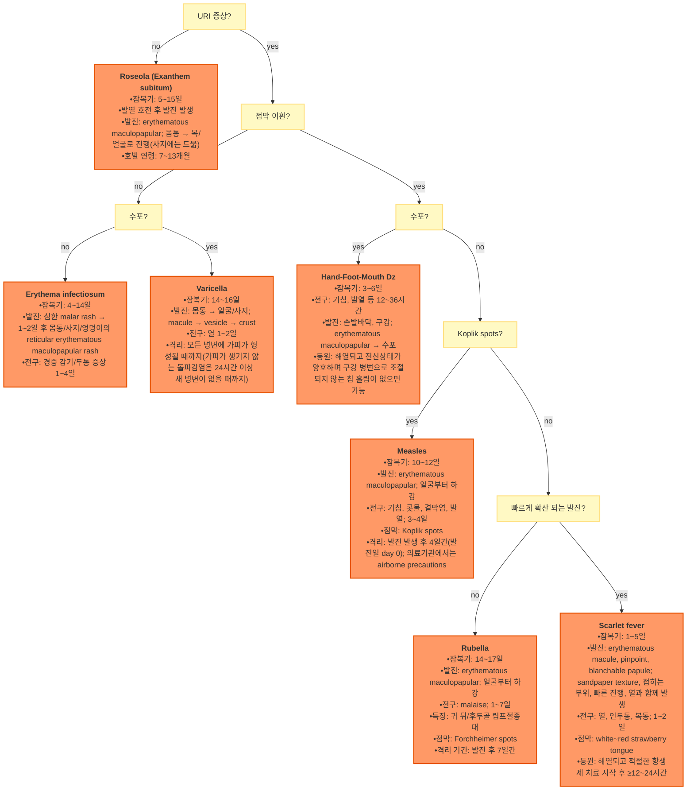

# 발진 Rash

### <mark style="color:$danger;">🚩 Red Flags!</mark>

<mark style="color:$danger;">**즉각 조치 또는 의뢰**</mark>

* Non-blanching petechiae/purpura(유리판으로 눌러도 사라지지 않음) + 발열 → 수막알균혈증 등 패혈증 의심
* 점막 이환(구강·눈·생식기) + 피부 통증 + 표피 박리 또는 Nikolsky 징후 양성 → SJS/TEN 의심
* 두드러기 + 쉰 목소리·협착음·호흡곤란 또는 저혈압 → 아나필락시스
* 급속히 진행하는 홍반·수포 + 발열 + 병변에 비해 불균형적으로 심한 통증 → 괴사성 근막염 의심
* 지속적 고열 + 가와사키병 주요 임상 소견(결막충혈·구강점막 변화·사지말단 변화·다형성 발진·경부 림프절병) → 즉시 평가. 전형적 소견이 충분하면 발열 5일까지 기다리지 않음(≥4개 주요 소견 시 발열 4일째에도 진단 가능, 숙련된 임상의는 3일째도 가능; 관상동맥 합병증 예방 위해 신속한 진단·IVIG 필요)
* 전신 상태 불량(toxic-appearing), 저혈압, 빈맥을 동반한 광범위 홍반 → 독성쇼크증후군 의심

<mark style="color:$warning;">**당일 또는 조기 의뢰**</mark>

* 발열이 지속되며 원인이 불명확한 광범위 발진
* 면역저하자에서 새로 발생한 수포성 또는 괴사성 발진
* 약물 복용력이 있는 광범위 발진(초기 DRESS 등 중증 약물반응 가능성 감시 필요)
* 임신부의 원인 불명 발진(선천성 감염 위험 평가 필요 시)

<mark style="color:$info;">**외래 추적 / 추가 평가 계획**</mark> <mark style="color:$info;">- 즉각 위험 낮으나 호전 없으면 의뢰</mark>

* 4주 이상 지속되며 치료 반응이 불량한 만성 발진
* 전신 증상 없이 국소적으로 재발하는 발진


**Blanching 여부(유리판 압박 검사, diascopy)**\
유리판이나 손가락으로 병소를 눌렀을 때 색이 사라지면 blanching으로 주로 혈관 확장/홍반성 병변을 시사하고, 사라지지 않으면 non-blanching으로 피부 내 출혈(petechiae/purpura) 등을 시사한다. Blanching 여부 자체가 양성·악성을 의미하지는 않는다. Non-blanching 발진에 발열이 동반되면 수막알균혈증 등 패혈증을 우선 배제해야 함.


***

## <mark style="color:green;">진단</mark>

### <mark style="color:orange;">피부 특징에 따른 질환들</mark>

<table><thead><tr><th width="172">피부 특징</th><th>대표 질환</th></tr></thead><tbody><tr><td><a href="ca://s?q=Pigmented_skin_disorders"><strong>Pigmented</strong></a></td><td>freckle, lentigo, seborrheic keratosis, nevus, halo nevus, atypical nevus, melanoma</td></tr><tr><td><a href="ca://s?q=Vesicular_skin_disorders"><strong>Vesicular</strong></a></td><td>herpes simplex, varicella, herpes zoster, pompholyx, vesicular tinea, autoeczematization, dermatitis herpetiformis, miliaria, scabies, photosensitivity, acute contact allergic dermatitis, drug eruption</td></tr><tr><td><a href="ca://s?q=Weepy_encrusted_skin_disorders"><strong>Weepy or encrusted</strong></a></td><td>impetigo, acute contact allergic dermatitis, any vesicular dermatitis</td></tr><tr><td><a href="ca://s?q=Pustular_skin_disorders"><strong>Pustular</strong></a></td><td>acne vulgaris, acne rosacea, folliculitis, candidiasis, miliaria pustulosa, pustular psoriasis, any vesicular dermatitis, drug eruption</td></tr><tr><td><a href="ca://s?q=Figurate_skin_disorders"><strong>Figurate</strong></a></td><td>urticaria, erythema multiforme, erythema migrans, cellulitis, erysipelas, erysipeloid, arthropod bites</td></tr><tr><td><a href="ca://s?q=Bullous_skin_disorders"><strong>Bullous</strong></a></td><td>impetigo, blistering dactylitis, pemphigus, pemphigoid, porphyria cutanea tarda, drug eruptions, erythema multiforme, toxic epidermal necrolysis</td></tr><tr><td><a href="ca://s?q=Papular_skin_disorders"><strong>Papular</strong></a></td><td>Hyperkeratotic: warts, corns, seborrheic keratosis Purple-violet: lichen planus, drug eruption, Kaposi sarcoma, lymphoma cutis, Sweet syndrome Flesh-colored, umbilicated: molluscum contagiosum Pearly: basal cell carcinoma, intradermal nevi Small, red, inflammatory: acne, rosacea, miliaria rubra, candidiasis, scabies, folliculitis</td></tr><tr><td><a href="ca://s?q=Pruritic_skin_disorders"><strong>Pruritus</strong></a></td><td>xerosis, scabies, pediculosis, lichen planus, lichen simplex chronicus, bites, systemic causes, anogenital pruritus</td></tr><tr><td><a href="ca://s?q=Nodular_cystic_skin_disorders"><strong>Nodular, cystic</strong></a></td><td>erythema nodosum, furuncle, cystic acne, follicular inclusion cyst, metastatic tumor to skin</td></tr><tr><td><a href="ca://s?q=Photodermatitis"><strong>Photodermatitis</strong></a></td><td>drug eruption, polymorphic light eruption, lupus erythematosus</td></tr><tr><td><a href="ca://s?q=Morbilliform_rash"><strong>Morbilliform</strong></a></td><td>drug eruption, viral infection, secondary syphilis</td></tr><tr><td><a href="ca://s?q=Erosive_skin_disorders"><strong>Erosive</strong></a></td><td>any vesicular dermatitis, impetigo, aphthae, lichen planus, erythema multiforme, intertrigo</td></tr><tr><td><a href="ca://s?q=Ulcerated_skin_disorders"><strong>Ulcerated</strong></a></td><td>decubiti, herpes simplex, skin cancers, parasitic infections, syphilis(chancre), chancroid, vasculitis, stasis, arterial disease, pyoderma gangrenosum</td></tr></tbody></table>

_Ref. Lange 2020 Current medical diagnosis & treatment 59th Ed. Table 6-1_

### <mark style="color:orange;">발진 평가의 기본 틀</mark>

발진은 단일 특징보다 **primary lesion + secondary change + color + configuration + distribution + 전신 증상**의 조합으로 평가한다.

<table><thead><tr><th width="170">평가 항목</th><th>주요 확인 내용</th></tr></thead><tbody><tr><td><strong>Primary lesion</strong></td><td>macule, papule, plaque, nodule, wheal, vesicle, bulla, pustule 등</td></tr><tr><td><strong>Color</strong></td><td>erythematous, violaceous, hyperpigmented, hypopigmented, purpuric 등</td></tr><tr><td><strong>Configuration</strong></td><td>annular, linear, grouped, discrete/confluent, reticular, targetoid, serpiginous 등</td></tr><tr><td><strong>Distribution</strong></td><td>generalized/localized, flexural/extensor, acral, palm/sole, dermatomal, photodistributed, intertriginous, mucosal</td></tr><tr><td><strong>Secondary change</strong></td><td>scale, crust, erosion, ulcer, fissure, excoriation, lichenification 등</td></tr><tr><td><strong>동반 소견</strong></td><td>발열, 독성 외관, 점막 이환, 관절통, 림프절병, 약물 복용력, 최근 감염·여행·접촉력</td></tr></tbody></table>

### <mark style="color:orange;">흔한 전신 발진</mark>

<table><thead><tr><th width="206">질환명</th><th>주요 임상 특징</th></tr></thead><tbody><tr><td>아토피 피부염 Atopic dermatitis</td><td>광범위; 건조한 피부, 가려움, 홍반, 홍반성 구진, 찰상, 비늘, 태선, 피부선 심화, 습진성 병소; 가족력</td></tr><tr><td>접촉피부염 Contact dermatitis</td><td>국소 홍반, 부종, 소수포, 선상/기하학적 형태의 물집; 접촉력</td></tr><tr><td>약물 발진 Drug eruption</td><td>다양한 형태(주로 반구진성); 약물 복용력(지연 반응도 고려)</td></tr><tr><td>다형홍반 Erythema multiforme</td><td>48시간 내 target lesion으로 진행; 손/발등, 팔/다리 신측부 대칭적 분포; 손/발바닥, 구강 점막, 입술 이환 가능</td></tr><tr><td>모낭염 Folliculitis</td><td>모낭부의 다발성 작은 농포</td></tr><tr><td>물방울건선 Guttate psoriasis</td><td>몸통·사지 작은 비늘성 구진/판; 1\~2주 전 인두염 병력</td></tr><tr><td>곤충 물림 Insect bites</td><td>중앙에 물린 흔적이 있는 구진/판; 여행·야외활동력</td></tr><tr><td>모공각화증 Keratosis pilaris</td><td>상지 후외측, 뺨, 대퇴 전부, 엉덩이; 모낭 중심의 작은 각화성 구진</td></tr><tr><td>편평태선 Lichen planus</td><td>1\~10 ㎜, 명확한 경계, 편평한 보라색 구진/판; Wickham striae; Koebner phenomenon</td></tr><tr><td>적색 땀띠 Miliaria rubra</td><td>홍반성 비모낭성 구진; 열 노출/더위 관련; 등·몸통·목·폐쇄 부위</td></tr><tr><td>동전습진 Nummular eczema</td><td>동전 모양 홍반성 판(2\~10 ㎝), 비늘, 작은 수포/구진; 심한 가려움</td></tr><tr><td>장미색 잔비늘증 Pityriasis rosea</td><td>분홍색 비늘성 둥근/타원형 병소(5\~10 ㎜); herald patch; Christmas tree 형태</td></tr><tr><td>판형건선 Plaque psoriasis</td><td>은색 비늘 덮인 홍반성 구진/판; 손톱 소와; 팔꿈치·무릎·두피·손톱</td></tr><tr><td>옴 Scabies</td><td>burrow, 물집, 구진, 심한 가려움; 손발가락 사이, 사타구니, 겨드랑이</td></tr><tr><td>지루피부염 Seborrheic dermatitis</td><td>황갈색 기름진 비늘, 홍반, 구진; 두피·눈썹·코 주변·외이도; 만성, 겨울철 악화; 영아기에는 두피의 cradle cap 형태로 흔함</td></tr><tr><td>몸백선 Tinea corporis</td><td>점차 커지는 고리 모양의 비늘성 판; 경계 뚜렷하고 활동성 융기 경계(active border), 중심부 clearing</td></tr><tr><td>두드러기 Urticaria</td><td>팽진, 가려움, 반복적 악화/완화; 개별 팽진은 보통 24시간 이내 흔적 없이 소실</td></tr><tr><td>바이러스성 발진 Viral exanthem</td><td>홍역·풍진·돌발진·감염성 홍반 등 특정 질환에 해당하지 않는 비특이적 viral rash; 광범위 반구진성 홍반; 점막 이환(궤양, petechiae, 결막염); 림프절증, 간/비장 비대</td></tr></tbody></table>

_Ref. The generalized rash: Part I. Differential diagnosis. AFP 2010;15;81(6). Table 1._\
_Pityriasis Rosea: Diagnosis and Treatment. AFP 2018;1;97(1). Table 1._

### <mark style="color:orange;">발진 크기가 감별에 도움이 되는 경우</mark>


병소 크기는 morphology·분포·배열(configuration)과 함께 해석하며, 단독 감별 기준으로 사용하지 않는다.


* Pinpoint : 모낭염, 털각화증, 성홍열
* 1 ㎜\~1 ㎝ : 물방울건선, 곤충 물림, 편평태선, 적색 땀띠, 장미진, 풍진, 옴, 수두
* 1\~25 ㎝ : 동전습진, 몸백선, 두드러기
* 다양 : 아토피, 접촉피부염, 약물 발진, 다형홍반, 감염성 홍반, 가와사키, 수막알균혈증, 장미색잔비늘증, 판형건선, 지루피부염, 비특이적 바이러스성 발진

_Ref. The Generalized rash: Part II. Diagnostic approach. AFP 2010;15;81(6)._

### <mark style="color:orange;">열성 발진</mark>

<table><thead><tr><th width="160">질환명</th><th>주요 특징</th></tr></thead><tbody><tr><td>홍역 Rubeola</td><td>• macular-papular rash, 불연속 또는 융합; 얼굴·목·어깨 → 원심성, 하방 확산; 4\~6일 후 쇠퇴 • 전구 증상: 기침, 콧물, malaise, 발열; Koplik's spots; 발열 4일째 발진 발생 • 비면역자 또는 불완전 접종자에서 위험; 유행 시 연령과 무관하게 발생 가능</td></tr><tr><td>풍진 Rubella</td><td>• 분홍색 반·구진; 이마 → 1일 내 몸통·사지; 3일 내 역순으로 쇠퇴 • 연구개 자반 • 특징적 소견: 귀 뒤/후두골 림프절종대(posterior auricular & suboccipital lymphadenopathy) — 홍역·돌발진과의 주요 감별점 • 전구 증상(성인): 식욕 부진, malaise, 결막염, 두통, 가벼운 감기 증상 • 젊은 성인, 면역저하자</td></tr><tr><td>감염성 홍반 Erythema infectiosum</td><td>• 코·눈 주위를 제외한 안면부 선홍색 홍반(Slapped cheek) → 전신 그물형 발진 • 6\~8주간 호전-악화 반복 • 발진은 발열 완화 후 발생 • 3\~12세</td></tr><tr><td>돌발진 Roseola</td><td>• 광범위 반구진성 발진, 보통 얼굴은 이환 안 됨 • 3\~5일의 고열이 갑자기 해열되면서 또는 직후 발진 발생; 수일 내 자연 회복 • 6개월\~3세</td></tr><tr><td>다형홍반 Erythema multiforme</td><td>• 중심에 수포가 있는 암적색 반(과녁 모양); 손·발·손발바닥·팔·무릎·성기; 대칭적 • major form: 점막 이환 동반, 주로 감염(HSV·Mycoplasma) 연관; SJS/TEN은 별도의 중증 약물반응으로 분류됨 • minor form: 점막 이환 없거나 경미, 단순포진 관련 • 20\~30세 남성</td></tr><tr><td>성홍열 Scarlet fever</td><td>• 몸통→사지; punctate erythema→융합; 안면 홍조(perioral pallor); 4\~5일 후 쇠퇴, 벗겨짐 • 피부 또는 편도의 급성 감염, 감염 2\~3일 후 발진 • 초기 white strawberry tongue → 4\~5일째 red strawberry tongue • 팔오금/겨드랑이에 linear petechia(Pastia's sign) • 소아</td></tr><tr><td>가와사키 Kawasaki disease</td><td>• 손·발 발진; 몸통/회음부 morbilliform, scarlatiniform rash; hyperemic lip • 겨울, 봄; 5일 이상 지속되는 고열, 경부 림프절증, 관절염, 점막 이환; 관상동맥 이상 • 대부분 5세 미만; 남아에서 조금 더 흔함</td></tr><tr><td>수두 Chickenpox</td><td>• papule → vesicle → pustule &#x26; crust, 동시에 여러 형태 존재 • 얼굴 → 몸통·사지 • 전구 증상(성인): 두통, 몸살, malaise • 대부분 ＜10세</td></tr><tr><td>수족구병 Hand-Foot-Mouth disease</td><td>• 손발바닥 압통성 물집, 구강 내 미란 • 전구: 열 1\~2일</td></tr><tr><td>쯔쯔가무시 Tsutsugamushi disease</td><td>• 광범위, 반점, 괴사 딱지; 체간</td></tr><tr><td>결절홍반 Erythema nodosum</td><td>• 양측 경골 전면에 주로 발생하는 압통성 홍반성 피하 결절/판; 궤양은 드묾 • 결핵, 사르코이드증, 염증성 장질환, 약물, 연쇄구균 감염 등 다양한 원인과 연관 • 발열, malaise, 관절통 동반 가능 • 젊은 성인 여성에서 흔함</td></tr></tbody></table>

_Ref. Evaluating the Febrile Patient with a Rash. AFP 2000;15;62(4). Table 2._

### <mark style="color:orange;">소아 발진 감별 알고리듬</mark>


아래 알고리듬은 URI 전구 증상을 동반하는 흔한 소아 발진성 감염병 감별에 한정됨. 두드러기, 약물 발진, 가와사키병 등 감염 외 원인은 별도 평가가 필요하며, 이 알고리듬으로 감별되지 않음.


***

<strong>소아 발진 감별 알고리듬</strong>

<em><mark style="color:$info;">Ref. 5minuteconsult.com</mark></em>


수두는 실제로 구강 점막 수포·미란을 동반하는 경우가 드물지 않다. 본 알고리듬은 전신성 수포 진행 양상(macule → vesicle → crust)을 우선 감별 기준으로 삼으므로, 구강 병변이 동반된다고 해서 수족구병 등 "점막 이환 = yes" 경로로 자동 분류하지 않도록 주의한다.


***
