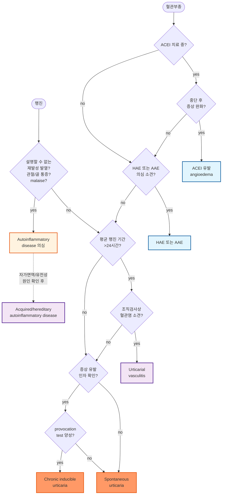

# 두드러기 Urticaria, 혈관부종 Angioedema

## <mark style="color:green;">일반 사항</mark>

* vasoactive mediator의 분비에 의해 야기되는 체액의 extravasation에 의해 피부(skin, mucosa, submucosa)에 발생한 non-pitting 국소 부종(wheal, angioedema, or both)
* 기전 : mast cell & basophil에서 매개 물질(histamine, prostaglandin, leukotriene, bradykinin, cytokine, protease) 방출 → 혈관 팽창, 혈관 투과성 증가, 진피 부종
* 두드러기와 혈관부종은 이환된 부위에 따른 구별이며 기본적인 발생 기전은 동일함
  * 두드러기는 superficial dermis에서, 혈관부종은 deep dermis 또는 피하 조직에서 반응
* 두드러기 환자의 40%가 혈관부종을 동반, 혈관부종 환자의 80%가 두드러기를 동반
* 유병률 : 인구의 10\~25%가 일생 중 두드러기를 경험; 3%가 만성 두드러기를 가짐
* 분류(경과에 따라)
  * 급성 : <6주
  * 만성 : ≥6주, 대부분 ≥주 3회 이상 발생(각 episode는 보통 빠르게 호전); 중년/여성에서 보다 흔함
* 경과 : 만성으로 이행하는 경우가 약 ⅓; 이중 30\~50%가 1년 내 자연 치유, 20%는 5년 이후에도 지속
* 합병증 : 만성 두드러기는 수면장애, 불안/우울, 등교·출근 지장 등 심리/일상 생활 문제를 유발할 수 있으며 이에 대한 평가와 관리가 필요함

## <mark style="color:green;">원인</mark>

### <mark style="color:orange;">급성</mark>

* 약 50%에서 원인 불명
* IgE 매개 반응 : 알려진 원인의 대부분 해당; 음식(예: 견과류, 생선, 우유, 계란, 콩, 밀), 약물(예: 항생제), 곤충
* non-IgE 매개 반응 : 감염(예: Streptococcus, HBV, EBV, rhinovirus, rotavirus, herpes), 약물(예: NSAID, opioid에 의한 비면역학적 mast cell 활성화)

### <mark style="color:orange;">만성</mark>

* 원인 : 80% 이상에서 불명(만성 자발성 두드러기, CSU); 알레르기 반응이 아닌 경우가 많음
* 기전 : perivascular mononuclear cell, mast cell, T-cell 등의 작용 추정; 일부에서 IgG 자가항체가 mast cell/basophil의 FcεRI 또는 IgE를 활성화하는 자가면역 기전(type IIb autoimmunity) 관여
* 관련 인자 : 물리적 자극(예: 추위, 열, 진동, 압력), 만성 감염(예: 기생충, 곰팡이, 간염), 악성 종양, 자가면역 질환(예: Hashimoto 갑상선염, 류마티스, 루푸스, 피부 혈관염), 음식, 약물, 접촉


**NSAID·ACEI는 급성·만성 두드러기 모두에서 흔한 악화 인자**\
Aspirin, NSAID는 비알레르기성 기전(COX-1 억제)으로 기존 두드러기를 악화시킬 수 있고, ACEI는 bradykinin 축적을 통해 팽진 없는 혈관부종을 유발할 수 있음(투여 개시 1개월 내 흔하나 수년 후 지연 발생도 가능)


## <mark style="color:green;">임상 양상</mark>

* 피부 증상 : 홍반, 부종, 통증
* 피부 외 증상 : 호흡 곤란/천명, 흉부 조임감, 구역/구토, 경련성 복통, 관절통, 불면증

### <mark style="color:orange;">두드러기</mark>

* 발생 부위 : 전신
* 피부 병변 형태 : blanchable rash, 뚜렷한 경계, wheal/flare; 간혹 상대적으로 창백한 중심부
  * 두드러기끼리 융합하여 polycyclic, serpiginous, annular pattern을 보일 수 있음
* 부종 외 증상 : 가려움, 작열감
* 경과 : 급속(보통 자극 후 수 분 내) 발생 → 보통 한 부위의 병소는 사라지고 다른 부위에 새로 발생, 개별 병변은 20분\~3시간 정도 지속 → 간혹 1\~2일간 지속, 드물게 3주까지 반복
* 긁음에 의한 상처 외에는 흔적을 남기지 않음(24시간 이상 같은 자리에 남거나 색소·자반을 남기면 두드러기혈관염 의심 — 아래 감별 참조)

### <mark style="color:orange;">혈관부종</mark>

* 발생 부위 : 점막, 연조직; 눈꺼풀, 입술, 혀, 생식기, 손/발등, 기도, 위장관(보통 하중을 받는 부위에는 발생하지 않음)
* 부종 외 증상 : 온감, 통증; 때로 호흡 곤란, 복통, 구역/구토, 설사; 가려움은 없거나 적음(점막에는 mast cell과 감각 신경 말단이 적기 때문)
* 경과 : 보통 72시간 내 회복(수시간\~수일)

## <mark style="color:green;">두드러기 아형 (유발 요인별 분류)</mark>

### <mark style="color:orange;">식품 또는 약물 알레르기</mark>

* 원인/유발 인자
  * 식품 : 조개, 생선, 유제품, 계란, 콩류, 견과류, 과일, 초콜릿, 밀
  * 약물 : 모든 약물이 두드러기를 일으킬 수 있음; aspirin, NSAID, 항생제에서 흔함
* 경과 : 보통 섭취 즉시(1시간 내) 발생; 원인 물질을 제거하면 호전, 재섭취 시 다시 발생(ACEI에 의한 경우는 투여 개시 1개월 내 흔하나 지연 발생도 가능)
* 진단 : 원인 음식에 대한 정보가 없는 경우 skin-prick test는 유용하지 않음

### <mark style="color:orange;">흡입 알레르기</mark>

* 원인 : 꽃가루, 동물 털, 곰팡이 포자; 흔히 발병 시점이 계절과 관련되며 섭취에 의한 두드러기보다 드묾

### <mark style="color:orange;">접촉성 두드러기 (Contact Urticaria)</mark>

* 원인 : 라텍스, 쐐기풀, 화학 물질 등 특정 물질에 대한 직접적 접촉 (☞ p.881)

### <mark style="color:orange;">만성 유발성 두드러기 (Chronic Inducible Urticaria, CIndU)</mark>

* 특정 물리적/환경적 자극에 의해 반복적으로 유발되는 아형들로, 유발 검사로 확진함.

<table><thead><tr><th width="150">아형</th><th width="220">원인/기전</th><th>진단(유발 검사)</th></tr></thead><tbody><tr><td>피부 그림증(피부 묘기증, Dermographism)</td><td>긁힘·압력 자극 → 반사성 혈관 수축 후 2차 반응; 다른 물리 두드러기(콜린성·한랭)를 동반하기도 함</td><td>설압자·손톱 등으로 피부를 긁으면 6\~7분 내 가려운 홍반 발생(15\~30분 후 소실 시작)</td></tr><tr><td>지연 압박 두드러기(Delayed pressure urticaria)</td><td>조이는 옷·오래 앉기·보행 등 압력; 발열·오한·관절통 동반 가능, 가려움보다 통증/압통</td><td>5 ㎏ 추를 폭 3 ㎝ 끈으로 20분간 걸고 6시간 및 24시간 후 관찰</td></tr><tr><td>콜린성 두드러기(Cholinergic urticaria)</td><td>운동·땀·더운물 목욕·매운 음식·심리적 자극에 의한 체온 상승 → 콜린성 신경 매개 histamine 증가; 눈물·침흘림·쌕쌕거림·두통·복통·구토·설사·실신 동반 가능</td><td>운동으로 땀을 낸 후 15분 추가 운동 또는 42℃ 온수에 10분간 신체 일부 담근 후 관찰; 원인 소실 시 30\~60분 내 소멸</td></tr><tr><td>한랭 두드러기(Cold urticaria)</td><td>찬 것에 노출 후 재가온 시 발생; 전신 노출 시 혈관 허탈·실신 위험</td><td>4\~5분간 얼음을 피부에 올린 후 10분 뒤 관찰(ice cube test)</td></tr><tr><td>열 두드러기(Heat urticaria)</td><td>뜨거운 물질 직접 노출; 드묾</td><td>4\~5분간 45℃ 물/물체를 피부에 접촉</td></tr><tr><td>운동 유발 두드러기(Exercise-induced urticaria)</td><td>physical exertion; 드묾(음식 동반 시 food-dependent exercise-induced anaphylaxis 감별)</td><td>treadmill test</td></tr><tr><td>일광 두드러기(Solar urticaria)</td><td>햇빛 노출; 노출 30초\~수 분 후 가려움 → 국한 부종·주변 홍반 → 차단 후 1\~3시간 내 소멸; 드묾</td><td>부분 노출 후 UVA/UVB/가시광선 조사; erythropoietic protoporphyria(porphyrin 검사)와 감별</td></tr><tr><td>수인성 두드러기(Aquagenic urticaria)</td><td>물 온도와 무관하게 접촉으로 발생; 드묾</td><td>35℃ 물 30분 적용 후 관찰; polycythemia vera 등과 관련 있어 매년 CBC 권장</td></tr><tr><td>진동성 두드러기(Vibratory urticaria)</td><td>수년간의 진동 노출(오토바이·승마·산악자전거·진동기계) 또는 특발성; 드묾</td><td>진동 장치로 5\~10분간 자극 후 관찰</td></tr></tbody></table>

### <mark style="color:$danger;">🚩 Red Flags!</mark>

<mark style="color:$danger;">**즉각 조치 또는 의뢰**</mark> <mark style="color:$danger;">- 기도 폐쇄·아나필락시스 위험</mark>

* 두드러기/혈관부종과 함께 호흡곤란, 천명, 협착음(stridor), 삼킴곤란, 음성 변화 → 후두부종·기도 폐쇄 임박
* 피부 증상에 저혈압, 실신, 빈맥, 의식 변화가 동반 → 아나필락시스 의심 → 즉시 epinephrine IM 및 응급 이송
* 급속히 진행하는 혀·구인두·후두 부종(원인이 알레르기성이든 HAE 급성 발작이든 무관)

<mark style="color:$warning;">**당일 또는 조기 의뢰**</mark>

* ACEI 복용 중 팽진을 동반하지 않는 반복적 혈관부종 → ACEI 유발 혈관부종 의심(☞ Red Flags 하단 진단 알고리듬)
* ＜20세 발병, 재발성 혈관부종의 가족력, 원인 불명의 반복적 복통, 팽진 없는 부종, 통상적 치료(항히스타민제·글루코코르티코이드·에피네프린)에 반응하지 않는 부종 → HAE/AAE 의심 → C4, C1 esterase inhibitor 검사 및 알레르기내과·임상면역학과 의뢰(☞ 진단 > 감별 진단 하단 HAE/AAE 항목)
* 개별 병변이 24시간 이상 같은 부위에 지속 + 통증/작열감이 가려움보다 두드러짐 + 색소침착 또는 자반(non-blanchable) 남김 → 두드러기혈관염(urticarial vasculitis) 의심 → 피부 생검 위한 조기 의뢰
* 설명되지 않는 재발성 발열, 관절/골 통증, malaise 동반 → autoinflammatory disease 의심 → 류마티스내과/면역학과 협진
* 발열, 체중감소, 림프절병증 등 전신 증상 동반 → 이차성 원인(감염, 혈액암, 자가면역질환) 감별 위한 조기 평가

<mark style="color:$info;">**외래 추적 / 추가 평가 계획**</mark> <mark style="color:$info;">- 즉각 위험 낮으나 호전 없으면 의뢰</mark>

* 2세대 H1-항히스타민제 표준\~4배 증량 치료에 4주 이상 반응 없는 만성 두드러기 → 2차 치료(omalizumab 등) 논의 위한 의뢰
* 두드러기·혈관부종으로 인한 수면장애, 불안/우울, 등교·출근 지장 등 삶의 질 저하가 뚜렷함
* 유발 요인이 뚜렷한 만성 유발성 두드러기 중 일상생활 지장이 큰 경우 → 유발 검사 및 전문 관리 고려
* NSAID 관련이 의심되나 확진되지 않은 경우 → 알레르기내과 유발 검사 고려

## <mark style="color:green;">진단</mark>

* 대부분 자세한 병력과 신체검사로 진단 가능하며, 검사를 통하여 원인이 밝혀지는 경우는 많지 않음
* 특히 H1-항히스타민제에 반응하는 급성 및 경증 만성 두드러기에서 추가 검사는 보통 필요 없음

### <mark style="color:orange;">병력</mark>

* 발생 시기, wheal 또는 angioedema의 모양·크기·빈도/기간·분포
* 동반 증상 : 뼈/관절 통증, 발열, 복통
* wheal 또는 angioedema와 관련된 개인 및 가족력
* 물리적 인자·운동 관련성; 주중/주말·휴일, 월경, 해외여행 관련성
* 음식·약물(예: NSAID, ACEI) 관련성; 감염·스트레스 관련성
* 이전 또는 현재 알레르기, 감염, 전신·자가면역 질환, 위장관 증상 여부
* 사회/직업/레저 활동 이력, 이전 치료력(방법/기간/결과, 반응 정도)


**증상 일지·척도 활용**\
증상 일지 작성이 진단·경과 파악에 도움이 됨. 증상 정도 및 치료 반응 평가를 위해 Dermatology Life Quality Index(DLQI), weekly Urticaria Activity Score(UAS7), Angioedema Activity Score(AAS), Urticaria Control Test(UCT) 등을 사용할 수 있음


### <mark style="color:orange;">검사</mark>

* (만성 환자에서) 선택적 시행; 혈관염·갑상선 질환 등이 의심될 때 고려
* 검사 전 수일간 항히스타민제, steroid 등의 치료 중단이 필요할 수 있음

> _✽H. pylori 감염이 CSU 위험 증가와 관련이 있을 수 있다는 일부 증거가 있으나 이에 대한 검사는 권하지 않음_
>
> _✽만성 두드러기와 자가면역 질환의 관련성이 있어 보이나, 관련 소견이 없는 경우 선별 검사는 제안하지 않음_

#### <mark style="color:$primary;">skin-prick test (피부단자검사)</mark>

* 민감도가 높고 여러 알레르겐을 동시에 검사할 수 있음
* 두드러기 환자에서는 흔히 피부 그림증이 동반되어 위양성을 유발함

#### <mark style="color:$primary;">실험실 검사</mark>

* CBC(WBC diff count) : eosinophilia — 약물 유발, pemphigoid, 기생충 감염; leucocytosis — 감염, 혈관염, 자가염증 질환; leucopenia — SLE
* ESR/CRP(혈관염, 자가염증 질환), TSH·antithyroglobulin & antimicrosomal Ab(자가면역성 관련), ANA, 혈청 특이 IgE Ab
* C4 & C1 esterase inhibitor : angioedema 의심 시(특히 HAE/AAE 의심 시) 고려
* folate, Vit B12, ferritin, LFT, B형·C형간염 검사

#### <mark style="color:$primary;">피부 생검</mark>

* 대상 : urticarial vasculitis 의심(통증성, 2\~3일 이상 지속, ecchymosis or petechia 동반)

### <mark style="color:orange;">감별 진단</mark>

<table><thead><tr><th width="140">질환</th><th>두드러기와의 차이점</th></tr></thead><tbody><tr><td>벌레 물림</td><td>수일 지속, 벌레 노출 병력</td></tr><tr><td>아토피피부염</td><td>반구진, 비늘, 특징적 분포(굴측부 등)</td></tr><tr><td>접촉피부염</td><td>불분명한 경계, 구진</td></tr><tr><td>고정약진</td><td>약물 노출 병력, 가려움 없음, 과다 색소 침착</td></tr><tr><td>두드러기혈관염(urticarial vasculitis)</td><td>가려움보다 작열감; 색소침착 또는 자반(non-blanchable), 물집, 흉터; 24시간 이상 같은 부위 지속</td></tr><tr><td>Henoch-Schönlein 자반증</td><td>하지 분포, 자색반, 전신 증상</td></tr><tr><td>다형홍삼</td><td>수일 지속, 홍채 모양 구진, 표적판 모양, 발열 동반</td></tr><tr><td>장미색 잔비늘증</td><td>수 주간 지속, herald patch, Christmas tree pattern, 간혹 가려움</td></tr><tr><td>바이러스성 발진</td><td>가려움 없음, 전구 증상, 발열, 반구진, 수일간 지속</td></tr></tbody></table>

#### <mark style="color:$primary;">유전성 혈관부종(Hereditary angioedema, HAE) 및 후천성 혈관부종(AAE)</mark>

* 정의 : C1 esterase inhibitor(C1-INH)의 양적 결핍 또는 기능 이상으로 bradykinin이 과잉 생성되어 발생하는 비-소양성 부종. 두드러기와 달리 histamine 매개가 아니므로 항히스타민제·글루코코르티코이드·에피네프린에 반응이 불량함
* 증상 : 피부(사지·얼굴·생식기) 및 위장관(통증성 복부 경련 — 급성 복증으로 오인되기도 함), 상기도 점막 증상(후두 부종, 치명적 기도 폐쇄 가능)
* 의심 소견 : 반복적인 피부 증상, 재발성 혈관부종 가족력(HAE는 75%에서 가족력 있음), ＜20세 발병, 원인 불명의 반복적 복통이나 상기도 부종, 통상적 혈관부종 치료(항히스타민제·글루코코르티코이드·에피네프린)에 반응하지 않는 부종, 전구 증상(erythema marginatum, 피로·권태감·구역감) 동반, 두드러기를 동반하지 않는 부종

**분류**

* HAE Type I(약 85%) : C1-INH 단백의 양적 결핍(SERPING1 유전자 이형접합 돌연변이)
* HAE Type II(약 15%) : C1-INH 단백량은 정상/증가되어 있으나 기능 이상
* nl-C1INH-HAE(정상 C1-INH 유전성 혈관부종, 과거 Type III) : C4, C1-INH 항원량·기능 모두 정상; factor XII, plasminogen, angiopoietin-1, kininogen-1 등의 유전자 이상과 관련; 여성에서 호발하며 에스트로겐에 의해 악화되는 경향
* 후천성(AAE) : C1-INH에 대한 자가항체 생성 또는 소모 증가(림프증식성 질환·자가면역질환 동반)로 발생; 중년 이후 발병, 가족력 없음이 HAE와의 핵심 감별점

**진단 검사**

<table><thead><tr><th width="150">아형</th><th width="90">C4</th><th width="130">C1-INH 항원량</th><th width="110">C1-INH 기능</th><th>비고</th></tr></thead><tbody><tr><td>HAE Type I</td><td>↓</td><td>↓</td><td>↓</td><td>선별 : C4(발작 간에도 대부분 저하) → 확진 : 항원량+기능</td></tr><tr><td>HAE Type II</td><td>↓</td><td>정상/↑</td><td>↓</td><td>항원량만으로는 놓칠 수 있어 기능 검사 필수</td></tr><tr><td>nl-C1INH-HAE</td><td>정상</td><td>정상</td><td>정상</td><td>임상적 의심이 강할 때 유전자 검사(F12, PLG 등) 고려</td></tr><tr><td>후천성(AAE)</td><td>↓</td><td>↓(또는 정상)</td><td>↓</td><td>C1q 대부분 저하(HAE에서는 C1q 정상 — 핵심 감별점)</td></tr></tbody></table>

* 생후 6개월 미만에서는 보체 수치가 불안정할 수 있어 확진 재검은 이후로 미루는 것이 권장됨
* 유전자 검사(SERPING1 등) : 진단 확정, 무증상 가족 구성원 선별, 산전 상담에 유용

**치료 원칙**

* HAE/AAE 발작은 항히스타민제·스테로이드·에피네프린에 반응하지 않으므로 별도의 bradykinin 표적 치료제가 필요함(☞ 약물 치료 > HAE·AAE 치료)
* ACEI는 HAE/AAE 환자에서 절대 금기(bradykinin 분해 억제로 발작을 중증화시킬 수 있음) — ARB 등 대체 강압제로 전환
* 발치·내시경·삽관·수술 등 침습적 처치 전에는 반드시 단기예방 계획을 수립함

***



<p align="center"><strong>두드러기·혈관부종 병력 기반 감별진단 알고리듬</strong></p>

<p align="center"><em><mark style="color:$info;">HAE=hereditary angioedema; AAE=acquired angioedema due to C1-inh deficiency. 원본 문헌의 각주(1\~11)는 축약하였으므로 세부 근거는 원 출처 확인 권장</mark></em></p>

***

## <mark style="background-color:$warning;">Management</mark>

### <mark style="color:orange;">치료 방침</mark>

* 호흡기 평가(anaphylaxis 배제) — Red Flags Tier 1 소견이 있으면 두드러기 치료보다 아나필락시스 처치 우선
* 원인/악화·유발 인자 회피 : 원인으로 의심되는 행위 회피; 음주, 급격한 온도 변화, 더운 환경 회피
* 기저 감염·전신 질환 치료
* 필요시 불안, 우울증, 심리사회적 영향에 대한 평가 및 치료
* 교육 : 두드러기·혈관부종에 대한 교육 자료 또는 환자 정보 리플릿 제공(☞ 환자 안내서)

## <mark style="color:green;">비-약물 치료 및 예방</mark>

* 확인된 유발/악화 인자 회피(약물, 특정 식품, 물리적 자극 등) — 단, 만성 자발성 두드러기에서 일상적인 식이 배제는 권고하지 않으며 유의미한 영향이 확인된 경우에만 회피
* NSAID 관련이 의심되면 원인 약물 사용 회피; 금기가 아니라면 COX-2 selective inhibitor로 교체 고려
* ACEI 복용 중이면서 팽진이 없는 반복적 혈관부종이 있는 환자는 ACEI 중지(대체 강압제로 전환)
* 국소 항소양제(예: 멘톨 함유 연화제) 사용 고려
* 유발성 두드러기 아형별 예방 : 조이는 옷 피하기(지연압박두드러기), 급격한 체온 상승 회피(콜린성), 방한(한랭두드러기), 자외선 차단(일광두드러기)
* 만성 두드러기의 심리사회적 영향(수면, 불안/우울, 학업/직장) 평가 및 필요시 정신건강의학과 협진

## <mark style="color:green;">약물 치료</mark>

* CSU 환자의 절반이 표준 용량의 H1-항히스타민제에 반응하며, 나머지 절반의 \~⅔가 증량 치료에 반응
* H1-항히스타민제에 반응하지 않는 환자의 ⅔가 omalizumab에 반응, ciclosporin에도 비슷한 정도로 반응

### <mark style="color:orange;">Epinephrine</mark>

(☞ [아나필락시스](../230_/188_-anaphylaxis.md#management))

* 대상 : 심한 급성 두드러기, 기도 폐쇄를 동반한 혈관부종, 아나필락시스
* 용법 : 1:1,000 제제(1 ㎎/㎖), 0.01 ㎖/㎏, 최대 0.5 ㎖ IM(대퇴부 전외측 중간 부위)

#### <mark style="color:$primary;">호흡 곤란 동반 시</mark>

* epinephrine : 1:1,000 0.3 ㎖ IM
* steroid : hydrocortisone 200 ㎎ IV <mark style="color:blue;">\[솔루 코테프 주]</mark>, methylprednisolone 40\~60 ㎎ IV <mark style="color:blue;">\[솔루메드롤 주]</mark>
* diphenhydramine : 50 ㎎ IV

### <mark style="color:orange;">H1-항히스타민제 (H1AH)</mark>

* 두드러기 치료의 1차 선택제; nonhereditary acute angioedema 환자의 >85%에서 증상 호전
* 가려움에 대해서는 진정 작용이 있는 1세대 약제가 효과적이나, 부작용(진정, 인지·정신운동 기능 저하, anticholinergic burden)으로 인해 영국피부과학회(BAD) 등은 1세대 항히스타민제를 1차 선택제에서 제외
* 장기 투여 또는 졸음 부작용을 피하고자 할 때 2세대 약제 선택
* 증상 발생 후 일시적 사용보다는 mast cell을 안정화시키기 위하여 규칙적으로 지속 사용하는 것이 효과적. 특히 만성 두드러기에서는 지속 투여가 유익
* 표준 용량으로 효과 부족 시 증량, 교체, 추가(특히 야간에 1세대 약제 추가) 또는 H2-항히스타민제 추가 고려
* bradykinin-mediated angioedema(예: HAE)에는 효과적이지 않음

#### <mark style="color:$primary;">2세대</mark>

* loratadine : 10 ㎎ qd <mark style="color:blue;">\[클라리틴]</mark>
* desloratadine : 5 ㎎ qd <mark style="color:blue;">\[에리우스]</mark>
* cetirizine : 10 ㎎ qd <mark style="color:blue;">\[지르텍]</mark>
* levocetirizine : 5 ㎎ qd <mark style="color:blue;">\[씨잘]</mark>
* fexofenadine : 180 ㎎ qd <mark style="color:blue;">\[알레그라]</mark>
* bilastine : 20 ㎎ qd <mark style="color:blue;">\[비스텔]</mark>
* acrivastine : 8 ㎎ tid
* mizolastine : 10 ㎎ qd <mark style="color:blue;">\[미졸렌]</mark> _(증량은 회피)_

#### <mark style="color:$primary;">1세대</mark>

* hydroxyzine : 25\~50 ㎎ hs or qid <mark style="color:blue;">\[아디팜]</mark>
* chlorpheniramine : 4 ㎎ q4\~6hr, 최대 24 ㎎/d(고령자 : 12 ㎎/d) <mark style="color:blue;">\[페니라민]</mark>
* cyproheptadine : 4 ㎎ tid, 최대 32 ㎎/d; 한랭 두드러기에 특히 적용
* promethazine : 10\~20 ㎎ bid\~tid

#### <mark style="color:$primary;">H2-항히스타민제 (H2AH)</mark>

* 효과 : H1AH에 병용 시 약간의 효과 증가; H2AH 단독 사용은 오히려 두드러기를 악화시킬 수 있음
* cimetidine : 200 ㎎ tid\~qid <mark style="color:blue;">\[에취투비]</mark>

### <mark style="color:orange;">Steroid</mark>

* 대상 : 혈관부종, 압박두드러기, 두드러기혈관염, 난치성 만성 두드러기의 급성 악화
* 적용 : 심한 증상 또는 H1AH에 반응하지 않는 경우 H1AH에 단기 병용
* 국소제는 효과 없음(✽전신 steroid 역시 만성 두드러기의 장기 증상 완화 효과는 불충분하다는 보고가 있어 급성 악화 시에만 단기 사용 원칙)

#### <mark style="color:$primary;">경구</mark>

* prednisolone : 30\~40 ㎎/d(0.5\~1 ㎎/㎏/d) ×3\~7일 <mark style="color:blue;">\[소론도]</mark>
  * 중등증 이상(≥30 ㎎/d)으로 2주 이상 장기 사용 후 중단 시에는 tapering(3\~5일마다 5\~10 ㎎씩 감량)

#### <mark style="color:$primary;">Parenteral</mark>

* 대상 : 심한 혈관부종; IV 투여 후 경구제 단기 투여로 전환
* hydrocortisone : 200 ㎎ IV <mark style="color:blue;">\[솔루 코테프 주]</mark>
* methylprednisolone : 40\~60 ㎎ IV <mark style="color:blue;">\[솔루메드롤 주]</mark>

### <mark style="color:orange;">HAE·AAE 치료 (Bradykinin 매개 — 항히스타민제·스테로이드·에피네프린 반응 불량)</mark>

* 원칙 : 급성발작치료(on-demand), 시술 전 단기예방, 만성 장기예방의 세 축으로 구성; 발작 초기(전구증상 단계)에 투여할수록 효과적

#### <mark style="color:$primary;">급성발작치료</mark>

* icatibant(bradykinin B2 receptor antagonist) : 30 ㎎ SC, 효과 부족 시 6시간 후 추가(최대 3회/24시간) <mark style="color:blue;">\[피라지르]</mark>; 만 2세 이상 가능; 국내 2014년 허가, 자가주사 가능, 성인 급여는 처방당 최대 4회분
* C1-inhibitor concentrate(혈장유래) : 20 IU/㎏ IV <mark style="color:blue;">\[베리너트]</mark>; 국내 허가되어 있으나 상시 공급이 원활하지 않을 수 있어 처방 전 재고 확인 필요
* C1-inhibitor concentrate(재조합) : <mark style="color:blue;">\[루코네스트]</mark>; 희귀의약품 지정, 만 13세 이상
* ecallantide는 국내 미승인; 상기 약제를 구할 수 없는 응급상황에서는 신선동결혈장(FFP)을 차선책으로 고려할 수 있으나 이론적 악화 가능성 논의가 있어 우선순위는 낮음


**⚠️ 후두부종 의심 시**\
발작치료제 투여와 별개로 기도 확보(삽관·기관절개) 가능성에 대비하고 즉시 이비인후과·응급의학과 협진. 항히스타민제·에피네프린 단독 투여로 안심하고 관찰을 지연하지 않음


#### <mark style="color:$primary;">시술 전 단기예방</mark>

* 1차 : C1-inhibitor concentrate 1,000 IU IV, 시술 1시간 이내 <mark style="color:blue;">\[베리너트]</mark>(공급 여건에 따라 확보 어려울 수 있음)
* 대체 : danazol 2.5\~10 ㎎/㎏/day(최대 600 ㎎/day), 시술 5일 전부터 시술 후 2\~3일까지

#### <mark style="color:$primary;">장기예방</mark>

* 대상 : 발작 빈도가 잦거나(예 : 월 평균 ≥1회), 후두부종 병력이 있거나, 삶의 질에 상당한 영향을 미치는 경우
* lanadelumab(anti-plasma kallikrein monoclonal antibody) : 300 ㎎ SC 2주마다(조절되면 4주 간격 연장 고려) <mark style="color:blue;">\[탁자이로]</mark>; 국내 2021년 허가, 2026년 3월부터 급여 등재 — danazol 6개월 이상 사용 후 실패(최근 6개월 월평균 3회 이상 icatibant 필요) 또는 danazol 금기/부작용 시 급여 인정, 6개월 단위 재평가(발작 50% 이상 감소 시 지속); 급여기준은 변경될 수 있어 HIRA 고시 확인 필요
* danazol(약화 안드로겐) : 200 ㎎/day로 시작, 최저 유효 용량으로 감량; 부작용(체중증가, 남성화, 월경이상, 간효소 상승, 드물게 간선종·간암, 지질이상)으로 6\~12개월마다 간기능·지질·복부초음파 모니터링 필요; 소아·임신부는 원칙적으로 회피 — 국내에서 안정적으로 사용 가능한 사실상 유일한 경구 장기예방제
* tranexamic acid : 안드로겐 사용이 어려운 경우(소아, 임신 등)의 대안이나 예방 효과는 낮음
* berotralstat(경구 kallikrein inhibitor) : 국내 미승인(2026년 기준)

### <mark style="color:orange;">면역 조절제 및 표적 치료제 (CSU)</mark>

* 대상 : 2세대 H1AH 표준\~4배 증량에 반응하지 않는 만성 두드러기(대부분 자가면역 기전 관여 추정)
* 종류 : anti-IgE(omalizumab), IL-4Rα antagonist(dupilumab), BTK inhibitor(remibrutinib), cyclosporine, hydroxychloroquine, sulfasalazine, dapsone, mycophenolate mofetil, azathioprine, 정맥용 면역글로불린(IVIg), 혈장분반술(plasmapheresis)

#### <mark style="color:$primary;">Omalizumab (anti-IgE)</mark>

* H1AH 또는 다른 치료로 조절되지 않는 만성 두드러기의 2차 선택제(강한 권고)
* 용법 : 150\~300 ㎎ 4주마다 SC <mark style="color:blue;">\[졸레어 주]</mark>(☞ 보험주의 — 급여기준은 변경될 수 있어 처방 전 HIRA 고시 확인 필요)

#### <mark style="color:$primary;">Dupilumab</mark>

* 2025년 미국 FDA 승인에 이어 2026년 국내 식약처 허가(H1-항히스타민제로 적절히 조절되지 않는 만 12세 이상 만성 자발성 두드러기)
* 기전 : IL-4Rα 억제를 통한 IL-4/IL-13 signaling 차단(제2형 염증 표적)
* 용법 : 300 ㎎ 2주마다 SC <mark style="color:blue;">\[듀피젠트]</mark>(성인 아토피피부염·천식 등과 동일 제형); _✽2026년 개정 국제 두드러기 가이드라인에서 omalizumab과 함께 2차 치료 표적치료제로 포함됨. 국내 급여 여부는 아직 확인 필요(2026년 기준 CSU 적응증은 최근 허가, 급여기준 미확정 가능)_

#### <mark style="color:$primary;">Remibrutinib (경구 BTK inhibitor)</mark>

* 2025년 미국 FDA 승인, 2026년 4월 국내 식약처 허가(2세대 H1-항히스타민제로 적절히 조절되지 않는 성인 만성 자발성 두드러기)
* 기전 : mast cell 내 Bruton's tyrosine kinase(BTK) 선택적 억제로 histamine 등 염증 매개물질의 방출을 사전 차단(경구, 정기 검사실 모니터링 불필요)
* 용법 : 25 ㎎ bid <mark style="color:blue;">\[랩시도]</mark>; 국내 최초의 경구 CSU 표적치료제로, 주사 치료를 기피하는 환자에서 대안이 될 수 있음
* _✽REMIX-1/2 3상 연구에서 12주째 UAS7 개선, 약 47\~50%에서 증상 조절(UAS7≤6), 28\~31%에서 완전 관해(UAS7=0)_

#### <mark style="color:$primary;">Cyclosporine</mark>

* 고용량 H1AH 또는 H1AH 병용에 반응하지 않는 환자에서 추가 고려(omalizumab과 유사한 반응률)
* 부작용 : 고혈압, 신부전
* 용법 : 2.5\~5 ㎎/㎏/d <mark style="color:blue;">\[산디문]</mark>(☞ p.871); 장기 투여는 회피

#### <mark style="color:$primary;">기타 3차 면역조절제</mark>

* methotrexate : 15 ㎎/wk <mark style="color:blue;">\[메토트렉세이트]</mark> — H1AH 단독/병용에 반응하지 않는 환자에서 제한적 고려
* dapsone : 25\~100 ㎎/d <mark style="color:blue;">\[답손]</mark> — 압박두드러기 등에서 제한적 고려
* tacrolimus : steroid-dependent chronic urticaria에 고려 <mark style="color:blue;">\[프로그랍]</mark>
* azathioprine, hydroxychloroquine(특히 SLE 동반 두드러기), mycophenolate mofetil, sulfasalazine, IVIg : 1·2차 치료에 반응 없거나 사용 불가한 경우 제한적 고려
* tranexamic acid : 혈관부종이 우세한 경우 고려


**투약 반응 예측 표지자(제한적 근거)**\
autologous serum/plasma skin test(ASST/APST)는 일상적으로 시행하지 않음. 총 IgE 및 basophil histamine release assay(BHRA)를 고려할 수 있으며, IgE 높음·BHRA 음성일수록 omalizumab 반응 가능성이, IgE 정상·BHRA 양성일수록 ciclosporin 반응 가능성이 상대적으로 높다고 알려져 있으나 개별 환자 반응을 완전히 예측하지는 못함


### <mark style="color:orange;">항류코트리엔제</mark>

* 효과 : 일부 환자에서 유효, 특히 한랭 두드러기에 효과; 근거 수준은 제한적(2세대 H1AH 표준 용량에 반응 부족 시 추가 고려)
* montelukast : 10 ㎎ hs qd <mark style="color:blue;">\[싱귤레어]</mark>(보험기준 ☞ p.1180)
* pranlukast : 225 ㎎ bid <mark style="color:blue;">\[오논]</mark>
* zafirlukast : 20 ㎎ bid 공복 복용
* zileuton : 600 ㎎ qid

### <mark style="color:orange;">기타 보조 치료</mark>

* Vit D : 4,000 IU/d ×12주; 일부 연구에서 증상 감소 보고
* Narrowband UVB phototherapy : H1AH에 반응하지 않는 환자에서 추가 고려(통상 30회 치료 코스, 필요시 12개월 후 반복)

***

### <mark style="color:orange;">만성 두드러기 단계별 치료 \[KAAACI/KDA, 2020]</mark>

<table><thead><tr><th width="90">단계</th><th>치료 옵션</th></tr></thead><tbody><tr><td>1st line</td><td>Non-sedating(2세대) H1AH 규칙적 투여</td></tr><tr><td>2nd line</td><td>H1AH 증량(표준 용량의 \~4배) 또는 다른 H1AH 병용; H2AH 추가 고려; leukotriene receptor antagonist(LTRA) 추가 고려</td></tr><tr><td>3rd line</td><td>Omalizumab(강한 권고) / Cyclosporine(조건부 권고) / Phototherapy, methotrexate, dapsone(제한적 고려)</td></tr><tr><td>필요시</td><td>경구 스테로이드는 급성 발작 조절 목적으로만 단기 사용</td></tr></tbody></table>

<p align="center"><em><mark style="color:$info;">Ref. KAAACI/KDA. Evidence-Based Practice Guidelines for Chronic Spontaneous Urticaria in Korean Adults and Children: Part 2. 2020. Fig. 5.</mark></em></p>

### <mark style="color:orange;">만성 두드러기 단계별 치료 \[BAD, 2021 / EAACI 계열 국제 가이드라인 준용]</mark>

모든 경우에 공통으로

* 국소 항소양제(예: 멘톨 함유 연화제) 사용 고려
* 알려진 유발/악화 요인(예: 특정 약물) 회피
* ACEI 복용 중, 팽진이 없는 혈관부종 환자는 ACEI 중지

#### <mark style="color:$primary;">만성 자발성 두드러기 (CSU)</mark>

* NSAID 관련 의심 시 : 의심 약물 회피, 금기가 아니면 COX-2 inhibitor로 교체 고려
* 식이 제한 : 일상적인 식이 배제는 권고하지 않으며, 유의미한 영향이 확인된 경우에만 회피

**1st Line**

* 2세대 H1AH 규칙적 투여
* 표준 용량으로 조절되지 않으면 증량(허가 용량의 4배까지); 2\~4주마다(중증 난치성은 2주마다) 치료 옵션 조정
* 반응이 부족하거나 내약성이 없으면 다른 2세대 H1AH로 교체 고려; mizolastine 증량은 회피
* 대체 항히스타민제가 있는 한 1세대 H1AH의 일상적 투여·증량은 회피(CNS 영향 고려)
* 2가지 2세대 H1AH 병용에 대한 근거는 부족함
* 소화불량이 동반된 경우가 아니라면 H2AH(예: cimetidine) 일상적 추가에 대한 근거는 부족함
* montelukast : 2세대 H1AH 증량에도 반응 부족 시 추가 고려
* steroid : 심한 증상의 빠른 조절을 위해 단기간(수일) 고려(예: prednisolone 0.5 ㎎/㎏); 장기 전신 투여는 다른 옵션이 있는 한 회피

**2nd Line**

* omalizumab : 2세대 H1AH에 추가 투여
* ciclosporin : 3\~6개월간 1차 치료에 반응 부족 시 2세대 H1AH에 추가; 장기 투여는 회피
* ASST/APST는 일상적으로 시행하지 않음
* 총 IgE, BHRA는 반응 예측 목적으로 고려 가능하나 모든 환자에서 실제 임상 반응을 반영하지는 않음

**3rd Line**

* 1·2차 치료에 반응이 부족하거나 사용할 수 없는 경우 : azathioprine, dapsone, doxepin(CNS 영향 우려), hydroxychloroquine(특히 SLE 동반), IVIg, methotrexate, mycophenolate mofetil, narrowband UVB(통상 30회 코스, 필요시 12개월 후 반복), oral tacrolimus, sulfasalazine, tranexamic acid(혈관부종 우세 시)

#### <mark style="color:$primary;">만성 유발성 두드러기 (Inducible Urticaria)</mark>

**1st Line** : 2세대 H1AH 규칙적 투여, 표준 용량으로 조절되지 않으면 4배까지 증량(원칙은 CSU와 동일)

**2nd Line** : omalizumab 추가

**3rd Line** : 아형(phenotype)별 치료

<table><thead><tr><th width="180">아형</th><th>3차 치료 옵션</th></tr></thead><tbody><tr><td>콜린성 두드러기</td><td>anticholinergics(예: oxybutynin), beta-blocker(예: propranolol), danazol, phototherapy 고려</td></tr><tr><td>한랭 두드러기</td><td>ciclosporin 고려; 항생제 일상적 사용 근거 부족; cold desensitization은 시행하지 않음</td></tr><tr><td>지연 압박 두드러기</td><td>dapsone 또는 sulfasalazine 고려</td></tr><tr><td>일광 두드러기</td><td>자외선 차단, UV prophylactic phototherapy 고려; plasmapheresis·IVIg는 제한된 근거</td></tr><tr><td>피부그림증</td><td>NB-UVB 또는 PUVA 고려</td></tr></tbody></table>

#### <mark style="color:$primary;">전문의 의뢰 고려</mark>

* 진단이 모호함
* 1st line therapy로 적절히 조절되지 않음
* inflammatory marker(ESR/CRP 등) 수준이 높음
* 현저하거나 지속적인 전신 증상, 전신 상태 불량
* 두드러기로 인해 우울, 불안, 수면장애, 등교/출근 지장 등 삶의 질에 상당한 영향
* 1st line therapy로 조절되지 않는, 팽진 없는 혈관부종

<p align="center"><em><mark style="color:$info;">AAS=Angioedema Activity Score; BHRA=basophil histamine release assay; DLQI=Dermatology Life Quality Index; IVIg=intravenous immunoglobulin; NB-UVB=narrowband ultraviolet B; PIL=patient information leaflet; PUVA=psoralen plus ultraviolet A; UAS7=Urticaria Activity Score summed over 7 days; UCT=Urticaria Control Test</mark></em></p>

<p align="center"><em><mark style="color:$info;">Ref. British Association of Dermatologists guidelines for the management of people with chronic urticaria, 2021; KAAACI/KDA Evidence-Based Practice Guidelines for CSU, 2020; 2025\~2026년 dupilumab·remibrutinib 승인 반영</mark></em></p>

***

### <mark style="color:red;">질병코드</mark>

L50.1 특발성 두드러기(만성 자발성 두드러기)

L50.8 기타 두드러기(만성 유발성 두드러기 등)

T78.3 혈관신경성부종

D84.1 보체계통의 결함(유전성 혈관부종 의심 시)

***

## <mark style="color:purple;">처방례</mark>

> **처방례 1. 급성 두드러기, 경증\~중등도**
>
> ```
> 세티리진 10 ㎎/T   1T   qd
> ※ 야간 가려움이 심하면 취침 전 1세대 항히스타민제(예: hydroxyzine 25 ㎎) 단기 추가 고려
> ※ 원인으로 의심되는 음식·약물 회피 안내
> ```
>
> _✽급성 두드러기는 대부분 자연 소실되며 2세대 H1AH 단독으로 조절됨. 호흡곤란·전신 증상 동반 시 즉시 재내원 교육 필수(☞ Red Flags)_

> **처방례 2. 만성 자발성 두드러기, 1차 치료 반응 부족 → 증량**
>
> ```
> 펙소페나딘 180 ㎎/T   1T   qd (표준 용량)
> ↓ 2\~4주 후에도 미호전 시
> 펙소페나딘 180 ㎎/T   2T   qd (2배 증량)
> ↓ 재평가 후 필요시
> 펙소페나딘 180 ㎎/T   4T   qd (허가 용량의 4배까지 증량)
> ```
>
> _✽mizolastine은 증량 대상에서 제외. 2\~4주 간격으로 단계적으로 조정하며, 심한 난치성인 경우 2주 간격도 가능_

> **처방례 3. 2세대 H1AH 증량에도 반응 부족한 만성 두드러기 → 2차 치료**
>
> ```
> 졸레어 주 300 ㎎   SC   4주마다
> (기존 2세대 H1AH 표준 용량 병용 유지)
> ```
>
> _✽omalizumab은 강한 권고의 2차 치료제. 총 IgE·BHRA로 반응 예측을 시도할 수 있으나 절대적이지 않음. 급여기준은 변경될 수 있어 처방 전 HIRA 고시 확인 필요. 주사 회피 선호 환자에서는 랩시도(remibrutinib) 25 ㎎ bid 경구 대안 고려 가능_

> **처방례 4. 급성 악화기 단기 스테로이드 병용(심한 증상 또는 H1AH 무반응)**
>
> ```
> 소론도 5 ㎎/T   4~6T   qd (아침)   ×5일
> ```
>
> ※ 다른 치료 옵션이 있는 한 장기 전신 스테로이드 투여는 회피; 유효 최소 용량으로 최단 기간만 사용\
> ※ 2주 이상 중등증 이상 용량(≥30 ㎎/d) 사용 시에는 tapering 필요

> **처방례 5. 아나필락시스·중증 기도 부종 동반 시 응급 처치**
>
> ```
> 에피네프린 1:1,000   0.3 ㎖   IM (대퇴부 전외측)
> 하이드로코르티손 200 ㎎   IV
> 디펜히드라민 50 ㎎   IV
> ```
>
> ※ 투여 즉시 응급실 이송; 2상성 반응(biphasic reaction) 가능성으로 최소 4\~6시간 관찰 필요\
> ※ 원인이 ACEI 유발 혈관부종으로 확인되면 ACEI 즉시 중단(에피네프린·항히스타민제 반응이 부족할 수 있음을 사전 인지)

> **처방례 6. HAE 급성 발작(자가주사 가능, 후두부종 없음)**
>
> ```
> 피라지르 프리필드시린지 30 ㎎   SC   즉시 1회
> ```
>
> ※ 6시간 후에도 증상 지속 시 추가 투여 가능(24시간 내 최대 3회)\
> ※ 목 부위 증상(협착음, 쉰 목소리, 삼킴곤란) 동반 시에는 자가주사와 무관하게 즉시 응급실 내원

> **처방례 7. HAE 장기예방 도입(Danazol 실패/금기 시 Lanadelumab 전환)**
>
> ```
> 탁자이로 300 ㎎   SC   2주마다
> ```
>
> ※ danazol 6개월 이상 사용에도 월평균 3회 이상 icatibant 필요, 또는 danazol 금기/부작용 시 급여 인정(급여기준 HIRA 고시 확인)\
> ※ 6개월 후 재평가(발작 50% 이상 감소 시 지속); 반응 양호 시 4주 간격으로 연장 고려

***

### <mark style="color:$success;">핵심 복약 지도</mark>

> **H1-항히스타민제, 왜 매일 규칙적으로 복용해야 하나요**
>
> * 증상이 있을 때만 먹는 것보다 매일 규칙적으로 복용하는 것이 mast cell을 안정시켜 두드러기 재발을 줄이는 데 더 효과적입니다(특히 만성 두드러기)
> * 표준 용량으로 조절되지 않는다고 임의로 자주 바꾸지 마시고, 2\~4주 간격으로 재평가 후 증량 여부를 결정합니다

> **전신 스테로이드, 왜 장기 복용하면 안 되나요**
>
> * 스테로이드는 급성 악화를 빠르게 가라앉히는 용도로만 단기간(보통 3\~7일) 사용합니다
> * 임의로 장기 복용 시 고혈압, 혈당 상승, 골다공증, 부신기능저하 등의 위험이 있으므로 처방된 기간 이상 연장하지 마십시오

> **omalizumab / remibrutinib(랩시도) 등 2차 치료제 안내**
>
> * omalizumab은 4주 간격 피하주사, remibrutinib(랩시도)은 매일 2회 경구 복용하는 약제로, 기존 항히스타민제로 조절되지 않는 환자에서 추가합니다
> * 효과 발현까지 수 주가 걸릴 수 있으므로 임의로 조기 중단하지 않도록 안내합니다
> * 이상반응(주사부위 반응, 두통, 감염 징후 등) 발생 시 병원에 연락하도록 교육합니다

> **HAE로 진단된 경우 — 자가주사, 왜 미루면 안 되나요**
>
> * icatibant, C1-inhibitor concentrate는 발작 초기(전구증상 단계)에 투여할수록 효과가 좋습니다. "좀 더 지켜보다가" 미루면 후두까지 진행할 위험이 커집니다
> * ACEI 계열 혈압약은 절대 금기입니다. 다른 병원에서 새로 약을 처방받을 때도 HAE 진단과 ACEI 금기 사실을 반드시 알리도록 안내합니다
> * danazol 복용 중이라면 6\~12개월마다 간기능·지질·복부초음파 확인이 필요하며, 임의로 증량하지 않도록 교육합니다

> **언제 다시 병원을 방문해야 하나요?**
>
> * 2\~4주간의 표준 치료(항히스타민제 규칙 복용)에도 증상이 호전되지 않는 경우
> * 호흡곤란, 쉰 목소리, 삼킴곤란, 입술·혀·목의 급격한 부종이 동반되는 경우 — **즉시 응급실 내원**
> * 어지럼증, 실신, 전신 두드러기와 함께 속이 메스껍거나 배가 아픈 경우 — **즉시 응급실 내원(아나필락시스 의심)**
> * 개별 팽진이 하루 이상 같은 자리에 남거나 통증·색소침착을 남기는 경우
> * 원인 불명의 발열, 관절통, 체중감소가 함께 있는 경우

***

### <mark style="color:blue;">환자 안내서</mark>


**두드러기·혈관부종, 대부분은 며칠 안에 좋아지지만 원인 확인이 중요합니다**

두드러기는 피부가 갑자기 부풀어 오르며 가려운 질환이고, 혈관부종은 눈꺼풀이나 입술처럼 더 깊은 조직이 붓는 것을 말합니다. 두 가지는 같은 기전에서 시작되며 함께 나타나기도 합니다. 대부분 며칠에서 몇 주 안에 좋아지지만, 6주 이상 반복되면 만성으로 분류되어 원인 파악과 꾸준한 관리가 필요합니다.


#### <mark style="color:$primary;">왜 두드러기·혈관부종이 생기나요?</mark>

* 피부 속 비만세포(mast cell)에서 히스타민 등의 물질이 나오면서 혈관이 넓어지고 물이 새어 나와 부어오릅니다
* 급성(6주 미만)은 음식, 약물, 감염 등이 원인인 경우가 많고, 만성(6주 이상)은 절반 이상에서 뚜렷한 원인을 찾기 어렵습니다
* 추위, 더위, 압박, 운동, 스트레스처럼 특정 자극에 의해서만 생기는 유형도 있습니다
* 매우 드물게, 가려움이나 두드러기 없이 붓기만 반복되고 집안에 비슷한 병력이 있다면 "유전성 혈관부종"이라는 별도의 유전 질환일 수 있으며, 이 경우 일반 알레르기약이 아닌 전용 치료제가 필요하니 담당 의료진과 상의하십시오

#### <mark style="color:$primary;">일상생활에서 어떻게 관리하나요?</mark>

* **증상을 일으키는 요인을 기록해 두십시오.** 음식, 약, 운동, 스트레스 등과 증상 발생 시점을 비교하면 원인을 찾는 데 도움이 됩니다
* **뜨거운 물 샤워, 과도한 음주, 급격한 온도 변화를 피하십시오.** 혈관을 확장시켜 증상을 악화시킬 수 있습니다
* **꽉 끼는 옷이나 벨트, 오래 앉아 있는 자세를 피하십시오.** 압력으로 인한 두드러기가 있는 경우 도움이 됩니다
* **아스피린, 소염진통제(NSAID)는 두드러기를 악화시킬 수 있으므로 복용 전 의료진과 상의하십시오**
* 심한 스트레스, 수면 부족도 악화 요인이 될 수 있으므로 충분한 휴식을 취하십시오

#### <mark style="color:$primary;">약은 어떻게 써야 하나요?</mark>

* **항히스타민제는 가려울 때만 먹는 약이 아니라 매일 정해진 시간에 꾸준히 복용하는 약입니다.** 그래야 재발을 줄이는 효과가 있습니다
* 졸음이 있는 항히스타민제는 취침 전에 복용하면 낮 동안의 불편을 줄일 수 있습니다
* 스테로이드를 처방받았다면 **정해진 기간(보통 며칠)만 복용**하고 임의로 연장하지 마십시오
* 주사제(omalizumab)나 새로운 먹는 약(remibrutinib)을 처방받은 경우, 효과가 나타나기까지 몇 주가 걸릴 수 있으니 정해진 일정대로 꾸준히 사용하십시오

#### <mark style="color:$primary;">이럴 때는 즉시 병원(응급실)을 방문하세요</mark>

* 🫁 숨쉬기 힘들거나 목이 조이는 느낌, 목소리가 변하는 경우
* 😵 어지럽거나 정신을 잃을 것 같은 경우
* 👄 입술, 혀, 목 안쪽이 빠르게 붓는 경우
* 🤢 두드러기와 함께 심하게 메스껍거나 배가 아픈 경우

위 증상들은 아나필락시스 또는 기도가 막힐 수 있는 위험한 상황을 의미할 수 있으므로 지체 없이 응급실을 방문하거나 119에 연락하십시오.
