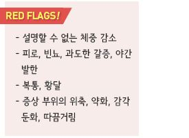
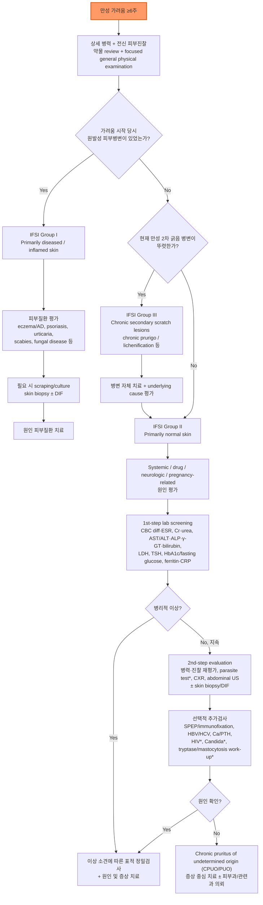

# 만성 가려움증 Chronic Pruritus (CP)


## <mark style="color:green;">일반 사항</mark>

* 정의 : ≥6주간 지속되는 가려움증(긁고 싶은 충동을 일으키는 감각)
* 만성 가려움증은 혈액투석 수준의 삶의 질 저하를 일으킴 \[European S2k Guideline, 2025]
* 유병률 : 고령 인구의 7\~60%
* 위험 인자 : 천식, 피부건조증, 비만, 불안, 간질환
* primary skin lesions/findings : bulla, macular erythema, papule, vesicle, wheal, scale/scaling, xerosis
* 2ndary scratch lesions/skin changes : atrophy, crusting, excoriation, hyper- or hypo-pigmentation, lichenification, necrosis, pruriginous papule/nodule, scar, ulceration
* 만성 가려움-긁기 악순환(itch-scratch cycle)은 수면 장애, 불안·우울, 삶의 질 저하로 이어지므로 신체적 원인 감별과 함께 심리적 부담도 함께 평가

## <mark style="color:green;">원인 (원인에 따른 분류)</mark>

\[International Forum on the Study of Itch, IFSI]

#### <mark style="color:$primary;">Dermatological</mark>

* 건조증, 아토피, 건선, 태선, 접촉피부염, 모낭염, 옴, 진균 감염, 장미색 잔비늘증

#### <mark style="color:$primary;">Systemic</mark>

* 간·신장 : 담즙 정체, 원발성 쓸개관경화증, 임신, 경구 피임제, 간염, 만성콩팥병
* 혈액 : 진성 적혈구증가증, 철결핍빈혈
* 내분비 : 갑상선 질환, carcinoid syndrome
* 감염 : HIV, 기생충(회충 등 장 기생충 포함)
* 악성 종양 : 고형 종양, 림프종, 백혈병

#### <mark style="color:$primary;">Neurological</mark>

* multiple sclerosis, neuromyelitis optica spectrum disorder, small-fiber neuropathy, 뇌·척수 병변, notalgia paresthetica, brachioradial pruritus, postherpetic neuralgia

#### <mark style="color:$primary;">Somatoform (정신적·심리적 요인 관련)</mark>

* IFSI 공식 원인 분류의 용어는 **somatoform**을 사용하며, 임상적으로는 psychogenic/psychosomatic contribution의 개념으로 이해
* 정신적·심리적 요인이 가려움의 발생·악화 또는 지각 강도에 기여하는 경우
* 우울증, 불안장애, obsessive-compulsive & related disorders, delusional infestation, schizophrenia 등과 연관될 수 있음
* 다른 피부·전신·약물·신경학적 원인을 충분히 평가한 뒤 임상적으로 판단

#### <mark style="color:$primary;">Mixed origin</mark>

* 위 범주 중 2가지 이상이 동시에 기여하는 경우

#### <mark style="color:$primary;">Others</mark>

* 약물 : 항고혈압제, 항생제, 소염제 등 거의 모든 약제가 가려움의 원인이 될 수 있음

***

### <mark style="color:$danger;">🚩 Red Flags!</mark>

<mark style="color:$danger;">**즉각 조치 또는 의뢰**</mark> <mark style="color:$danger;">- 생명 위협 또는 즉각적 위해 가능성</mark>

* 두드러기·혈관부종·호흡곤란을 동반한 급성 전신 가려움 → 아나필락시스 의심, 즉시 응급 처치
* 황달과 함께 발열·우상복부 통증·저혈압/의식저하가 동반된 경우 → 급성 담관염/담도 폐쇄 의심, 즉시 응급 평가
* 황달과 함께 의식 변화 또는 명백한 출혈 경향/응고장애가 동반된 경우 → 급성 간부전 가능성, 즉시 응급 평가
* 구체적인 자살 사고 또는 극심한 가려움으로 인한 자해·자살 사고 표현

<mark style="color:$warning;">**당일 또는 조기 의뢰**</mark>

* 황달, 짙은 소변, 회백색 대변을 동반한 가려움 → 담즙 정체 의심, 간담도 평가
* 설명되지 않는 체중 감소, 야간 발한, 림프절병증 또는 비장비대 동반 → 혈액종양 질환(특히 Hodgkin's disease) 의심
* 수포 발생 전 뚜렷한 원발 병변 없이 심한 가려움이 지속되는 고령 환자 → subtle/invisible dermatosis(예: bullous pemphigoid 전구기) 의심, 피부과 의뢰
* 가족·동거인·시설 내 다수에서 동시 발생 → 옴(scabies) 의심, 접촉자 관리 및 피부과 의뢰
* 만성 콩팥병 환자에서 중등도~중증의 가려움이 새로 발생하거나 악화되고, 신기능·투석 적절도·Ca/P/PTH 등 교정 가능한 요인 평가 후에도 지속되는 경우 → 신장내과 협진

<mark style="color:$info;">**외래 추적 / 추가 평가 계획**</mark> <mark style="color:$info;">- 즉각 위험 낮으나 호전 없으면 의뢰</mark>

* 1st-step lab screening에서 이상이 없고, 4\~6주간 원인에 따른 치료와 보습·피부장벽 관리 ± 적응증에 맞는 증상 치료에도 반응하지 않는 경우
* 원인 불명으로 지속되어 chronic prurigo, lichenification 등 2차 긁음 병변으로 진행하는 경우
* 국소·전신 치료에도 불구하고 반복 재발하거나 난치성으로 진행하여 2차 생물학적제제·면역억제제 고려가 필요한 경우

***

## <mark style="color:green;">진단</mark>

### <mark style="color:orange;">검사</mark>

* 목적 : 기저 피부질환뿐 아니라 간·신장·혈액·내분비 질환, 약물, 감염, 신경병증성 원인 등을 감별
* 모든 환자에서 상세 병력(가려움의 시작·기간·부위·강도·양상, 선행 피부병변, 체중감소·발열·야간발한·피로, 여행·성접촉, 직업·동물 노출, 약물·보충제)과 전신 피부진찰을 시행
* 원인 불명의 가려움에서는 림프절을 포함한 focused general physical examination을 시행
* 피부 병변이 뚜렷하지 않아도 xerosis, 잘 드러나지 않는 옴(well-groomed scabies), 수포 발생 전 bullous pemphigoid 등 subtle/invisible dermatosis를 고려
* **1st-step lab screening**
  * CBC with differential, ESR
  * Cr, urea
  * AST, ALT, ALP, γ-GT, total/direct bilirubin
  * LDH, TSH
  * HbA1c 또는 fasting glucose
  * ferritin, CRP
* 검사 이상이 있으면 해당 장기·질환에 따라 표적 정밀검사를 시행
* 1차 평가가 비특이적이면서 가려움이 지속되면 **2nd-step evaluation**
  * 병력 및 전신진찰 재평가
  * 기생충 검사(노출력·호산구증 등 임상적 의심 시 stool microscopy/PCR 또는 serology)
  * 흉부 X선 : 림프절병증, 만성 감염, 종양 등 평가
  * 복부 초음파 : 간담도·신장·췌장·비장 질환, 림프절병증, 종양 등 평가
  * 피부 병변 또는 invisible dermatosis가 의심되면 skin biopsy ± direct immunofluorescence
* **선택적 추가 검사** : 임상상에 따라 serum protein electrophoresis/immunofixation, HBV/HCV, Ca/PTH, HIV, genital/oral pruritus에서 Candida 검사, serum tryptase 및 mastocytosis 관련 검사 등을 시행

### <mark style="color:orange;">중증도 및 치료 반응 평가</mark>

* 초진 시와 추적 시 동일한 척도를 사용하여 가려움 강도를 정량화
* 간단한 방법 : 최근 24시간의 worst itch 또는 average itch를 **NRS 0\~10**으로 기록
* 수면 방해, 일상생활 장애, 우울·불안 등 기능적 영향을 함께 평가
* 필요 시 5-D Itch Scale, DLQI 등 검증된 도구를 추가 사용

### <mark style="color:orange;">감별</mark>

* 가족 내 다수 발생 → 옴 등 기생충
* 신체 활동과 관련하여 발생 → cholinergic pruritus
* 물과의 접촉 수 분 내에 가려움 발생 → aquagenic pruritus
* 야간 발생, 오한, 피로, 체중 감소, 야간 발한 동반 → Hodgkin's disease
* 뚜렷한 피부·전신 원인 없이 스트레스와 증상 변동의 연관성이 반복적으로 관찰됨 → psychogenic/psychosomatic contribution 가능성 고려
* 고령에서 겨울철 악화 → xerosis cutis, asteatotic eczema
* 피부 발진 없는 전신 가려움 → 전신 질환, 정신적 문제, 고령, 약물
* 피부 발진 없는 국소 가려움 → 신경/정신적 문제

***



\* 임상적 의심 또는 위험인자가 있을 때 시행

<p align="center"><strong>만성 가려움증 진단 알고리듬</strong></p>

<p align="center"><em><mark style="color:$info;">Ref. Weisshaar E, et al. European S2k Guideline on Chronic Pruritus. Acta Derm Venereol. 2025;105:adv44220. Fig. 1 및 Tables 3–4를 바탕으로 일차진료용으로 재구성.</mark></em></p>

***

## <mark style="background-color:$warning;">Management</mark>

### <mark style="color:orange;">치료 방침</mark>

* 피부 건조 관리
* 증상에 대한 약물 치료
* 기저 피부 질환이 있으면 이를 치료, 기저 피부 질환이 없으면 전신 질환 감별

### <mark style="color:orange;">단계별 치료 접근 \[European S2k Guideline, 2025]</mark>

* **Step 1. 원인·phenotype에 따른 기본 치료**
  * 원인질환 치료 + 보습·피부장벽 관리 + 악화 인자 회피
  * inflammatory dermatosis → topical corticosteroid 또는 topical calcineurin inhibitor
  * urticaria 등 histaminergic itch → 2세대 non-sedating H1-항히스타민제
  * 감염·기생충·약물 유발 원인이 확인되면 원인 치료/원인 약제 조정
* **Step 2. 원인 치료에도 지속되는 중등도~중증 가려움**
  * neuropathic itch 또는 CKD-associated pruritus → gabapentin/pregabalin
  * 선택된 난치성 CP → 항우울제, opioid-modulating therapy, NB-UVB 등 원인·phenotype에 맞는 치료
* **Step 3. 난치성 또는 질환 특이 치료가 필요한 경우**
  * chronic prurigo/prurigo nodularis, 중등도~중증 아토피피부염 → dupilumab, nemolizumab 등 생물학적제제 고려
  * 원인 불명 CPUO/PUO 또는 복합 원인 → 피부과/관련 전문과 협진 및 multimodal treatment

#### <mark style="color:$primary;">매 단계 동반 치료</mark>

* 충분한 보습, 피부 자극 최소화, 수면·스트레스 관리
* 긁음으로 인한 이차성 피부 손상은 감염 여부를 평가하여 필요 시 국소 치료
* 1세대 진정성 H1-항히스타민제는 야간 수면장애가 심한 선택된 환자에서만 단기간 고려하며, 특히 고령자에서는 항콜린성 부작용·낙상·인지저하에 주의

<table>
<thead>
<tr>
<th>단계</th>
<th>임상 상황</th>
<th>핵심 접근</th>
<th>대표 옵션</th>
</tr>
</thead>
<tbody>
<tr>
<td>Step 1</td>
<td>원인·phenotype 확인</td>
<td>원인 치료 + 피부장벽 회복</td>
<td>보습, topical steroid/TCI, 적응증이 있을 때 2세대 H1-AH</td>
</tr>
<tr>
<td>Step 2</td>
<td>중등도~중증 CP 지속</td>
<td>phenotype-directed therapy</td>
<td>gabapentinoid, 항우울제, opioid-modulating therapy, NB-UVB</td>
</tr>
<tr>
<td>Step 3</td>
<td>난치성/질환 특이 치료 필요</td>
<td>전문치료 및 협진</td>
<td>biologics, JAK inhibitor 등</td>
</tr>
</tbody>
</table>

***

## <mark style="color:green;">비-약물 치료 및 예방</mark>

### <mark style="color:orange;">회피</mark>

* 피부 건조 : 건조한 환경, 열(사우나), 잦은 씻기/목욕, 알코올성 제제 도포
* 비누 : 매일 비누를 사용하는 부위는 서혜부와 겨드랑이로 제한. 알칼리성 비누 사용을 피함
* 매우 뜨겁거나 매운 음식, 과음, 많은 양의 hot drink(예: 차, 커피)
* 흥분, 긴장, negative stress
* 알레르기 유발 또는 자극 물질 : 향료, 방부제, 계면활성제; 먼지, 집먼지진드기

### <mark style="color:orange;">권고</mark>

* 부드러운 중성/약산성/향이 없는 비누, 보습 세제, 샤워/목욕 oil
* 목욕할 때 미지근한 물을 사용하며 20분 이내 시행; 필요 시 colloidal oatmeal bath를 고려
* 수건으로 피부 물기를 닦을 때 문지르지 말고 두들김
* 매일 보습제 적용(특히 샤워/목욕 후)
* 공기가 통하는 부드러운 옷 착용(예: 면 제품); 얇은 옷을 겹쳐 입고 조절하여 땀 나는 것을 피함
* cold wet wrap, fat moist wrap
* 손발톱을 짧게 깎음
* 적절한 실내 습도 유지; 야간에 실내를 낮은 온도로 조절

### <mark style="color:orange;">보습제</mark>

(☞ p.867)

* 도포 시점 : 샤워나 목욕 후(특히 피부 건조증 환자에서), 야간; 하루 한 번 이상 도포
* 도포량 : 성인 250\~500 g/주; 충분한 양 도포 권고(일반적으로 도포량이 부족함)
* 종류 : colloidal starch, oatmeal baths, ammonium lactate \[타로 암모늄락테이트], petroleum jelly \[바셀린], glycerol(20%), hydrophilic base, urea(5\~10%) \[유리아]
  * 겨울철에는 기름기가 많은 제제 선택
* steroid 외용제와 병용 시 도포 방법 : 크림 보습제는 steroid 사용 15분 전, 연고 보습제는 steroid 사용 15분 이후 도포

### <mark style="color:orange;">이완 요법</mark>

* 명상, 요가, 스트레칭, 운동, 심리 상담

***

## <mark style="color:green;">약물 치료</mark>

### <mark style="color:orange;">국소 치료제</mark>

#### <mark style="color:$primary;">Steroid</mark>

(☞ p.1139)

* 대상 : 아토피, 접촉피부염, 건선, 태선 등에 의한 가려움
* 태선화된 병변에 대하여 중등증 이상 역가의 외용제 도포 또는 국소 주사
* 주의 : 부작용, 반동 현상
* 단기(2주 내) 사용
* 고역가 : clobetasol propionate <mark style="color:blue;">\[더모베이트 연고/액]</mark>
* 중간 역가 : mometasone furoate <mark style="color:blue;">\[모리코트 크림/로션]</mark>
* 장기 사용이 필요한 경우 calcineurin 억제제로 대체 고려 (☞ p.1143)
  * tacrolimus <mark style="color:blue;">\[프로토픽]</mark>, pimecrolimus <mark style="color:blue;">\[엘리델]</mark>

#### <mark style="color:$primary;">Capsaicin</mark>

* 작용 : 감각 신경 끝에서의 탈감작 효과. neuropathic itch에 유효
* 효과 발현까지 2주 이상 소요
* 부작용 : 초기 작열감
* 보통 0.025% 제제 사용 <mark style="color:blue;">\[다이악센]</mark> (보험주의; 국내 공식 유통 중이나 수급 불안정)

#### <mark style="color:$primary;">기타 국소제</mark>

* doxepin 5% cream : 졸음 유발 주의 (**국내 미유통**)
* 마취제 : 단기, 부분적 사용; 1일 수회(≤5회/일) 도포
  * xylocaine, benzocaine <mark style="color:blue;">\[벤조카인]</mark>, lidocaine, prilocaine <mark style="color:blue;">\[엠라]</mark>, pramoxine(1%) <mark style="color:blue;">\[프라렉신]</mark>, polidocanol(2%\~10%) <mark style="color:blue;">\[옵티덤]</mark>
* Soaking : cool tap water, Burow's solution(1:40 dilution), 식염수(소금 1 teaspoon/물 0.5 L)
* calamine/zinc oxide <mark style="color:blue;">\[칼라민 로션]</mark>(비급여)
* camphor(2%), menthol(1%)

### <mark style="color:orange;">전신 치료제</mark>

* 대상 : 비-약물 치료로 호전되지 않는 전신 소양증

#### <mark style="color:$primary;">H1-항히스타민제</mark>

(☞ p.1144)

* 대상 : 히스타민 관련 가려움


염증성 피부 질환 관련 가려움을 포함하여 대부분의 만성 가려움은 히스타민에 매개되지 않으므로 항히스타민제에 잘 반응하지 않음


* urticaria 등 histaminergic itch에서는 **2세대 non-sedating H1-항히스타민제**를 우선 사용
* 대부분의 비히스타민성 만성 가려움에서는 효과가 제한적이며, 1세대 제제는 야간 수면장애가 심한 선택된 환자에서 단기간 고려
* 1세대 제제는 항콜린성 부작용·주간 졸림·인지저하·낙상 위험 때문에 특히 고령자에서 신중히 사용
* H2-항히스타민제 병용 효과는 일관되지 않아 만성 가려움의 표준 병용요법으로 권고하기 어려움

**1세대**

* hydroxyzine : 25\~50 ㎎ hs or 50\~100 ㎎/d #3\~4 <mark style="color:blue;">\[아디팜]</mark>
* chlorpheniramine : 4 ㎎ q4\~6hr, 최대 24 ㎎/d <mark style="color:blue;">\[페니라민]</mark>
* diphenhydramine : 25\~50 ㎎ q4\~6hr, 최대 300 ㎎/d <mark style="color:blue;">\[디펜히드라민]</mark>

**2세대**

* loratadine : 10 ㎎ qd <mark style="color:blue;">\[클라리틴]</mark>
* fexofenadine : 180 ㎎ qd <mark style="color:blue;">\[알레그라]</mark>
* cetirizine : 10 ㎎ qd <mark style="color:blue;">\[지르텍]</mark>
* mequitazine : 5 ㎎ bid <mark style="color:blue;">\[프리마란]</mark>

#### <mark style="color:$primary;">항우울제 (TCA, SSRI, NaSSA 등)</mark>

(☞ p.1146)

* 대상 : 원인 치료에도 지속되는 난치성 CP에서 선택적으로 고려; 특히 nocturnal itch, psychogenic/psychosomatic contribution, CKD·담즙정체·악성종양 관련 가려움 등에서 약제별 근거와 환자 특성을 고려 (보험주의)
* amitriptyline : 25\~50 ㎎/d <mark style="color:blue;">\[에트라빌]</mark>
* mirtazapine : 15\~30 ㎎/d <mark style="color:blue;">\[레메론]</mark>
* paroxetine : 20\~40 ㎎/d <mark style="color:blue;">\[세로자트]</mark>

#### <mark style="color:$primary;">전신 Steroid</mark>

* 대상 : 심한 inflammatory dermatosis(예: 중증 아토피피부염·접촉피부염, 일부 bullous dermatosis 등)에서 **원인질환 치료 목적**으로 제한적으로 사용
* 원인불명·신경병증성·CKD-associated·담즙정체성 가려움 자체의 routine antipruritic으로는 사용하지 않음
* **예외적 상황** : severe paraneoplastic pruritus 또는 palliative care에서 다른 치료가 충분하지 않은 경우, 증상 완화를 위해 제한적 단기 사용을 고려할 수 있음
* 가능한 한 단기간(통상 ≤2주) 사용하며, 용량·감량법은 원인질환·완화치료 목표와 환자 상태에 따라 개별화

#### <mark style="color:$primary;">Gabapentinoid</mark>

* 대상 : neuropathic pruritus, CKD-associated pruritus 등 비히스타민성 만성 가려움에서 선택적으로 고려 (보험주의)
* 부작용 : 어지럼, 졸음, 두통, 구역, 말초 부종, 체중 증가, 착란; 고령자에서는 낙상 위험에 특히 주의
* **start low, go slow** : 고령자·신기능 저하 환자에서는 더 낮은 용량으로 시작
* gabapentin : 보통 100\~300 ㎎ hs부터 시작하여 반응·내약성에 따라 qd\~tid로 서서히 증량 <mark style="color:blue;">\[뉴론틴]</mark>
* pregabalin : 보통 25\~75 ㎎ hs 또는 qd부터 시작하여 필요 시 서서히 증량 <mark style="color:blue;">\[리리카]</mark>; 혈액투석 환자에서는 25 ㎎ qd 또는 투석일 중심의 저용량 regimen으로 시작 가능
* 두 약제 모두 신기능과 혈액투석에 따른 용량 조절 필수 (☞ 통증 챕터의 신장애 환자 gabapentinoid 용량 참조)

#### <mark style="color:$primary;">μ-opioid receptor antagonist / κ-opioid receptor agonist</mark>

* 대상 : cholestatic, CKD-associated pruritus
* 부작용 : 구역, 구토, 졸음; opioid analgesics 복용 환자에서 주의
* naltrexone : 25\~50 ㎎/d <mark style="color:blue;">\[레비아]</mark>
* difelikefalin(말초성 κ-opioid receptor agonist) : 혈액투석 관련 중등도\~중증 가려움에서 투석 후 정맥 투여(0.5 ㎍/㎏); **미국 FDA(2021) 및 EU/EMA(2022) 승인, 국내 미허가(2026년 기준)** — 실제 처방 전 최신 국내 허가·유통 여부 확인

#### <mark style="color:$primary;">항류코트리엔제 — 제한적 옵션</mark>

* 일반 만성 가려움의 표준 전신 치료는 아니며, CKD-associated pruritus 등 특정 상황에서 제한적으로 고려
* montelukast : 10 ㎎ hs qd <mark style="color:blue;">\[싱귤레어]</mark>
* pranlukast : 225 ㎎ bid <mark style="color:blue;">\[오논]</mark>

#### <mark style="color:$primary;">면역억제제 (Immunomodulator therapy): Cyclosporine</mark>

(☞ p.871)

* 대상 : 다른 치료로 조절되지 않는 심한 아토피성 피부염
* 작용 : T-lymphocyte 억제
* 부작용 : 고혈압, 부종, 신 손상, 발모 증가, 구역, 설사, 가슴쓰림
* 금기 : 간/신질환, 조절되지 않는 고혈압 또는 당뇨병, 악성 종양, 최근 생백신 접종, 주요 감염
* 모니터링 : 혈압, 신 기능
* 용법 : 2.5\~5 ㎎/㎏/d #1\~2 <mark style="color:blue;">\[산디문]</mark>

#### <mark style="color:$primary;">생물학적제제 (Biologics)</mark>

* 대상 : 국소·전신 1차 치료에 반응하지 않는 아토피피부염 또는 결절성 양진(prurigo nodularis) 동반 중증 만성 가려움; 피부과 의뢰 후 처방
* nemolizumab(IL-31 수용체 α 길항제) <mark style="color:blue;">\[넴루비오]</mark> : 중등도\~중증 아토피피부염 및 결절성 양진 치료제로 국내 허가(2026년); 적응증·연령·체중에 따라 투여 regimen이 다르므로 최신 제품설명서 확인; IL-31 신호 차단을 통해 가려움 유발 감각신경 활성화를 억제
* dupilumab(IL-4Rα 길항제) <mark style="color:blue;">\[듀피젠트]</mark> : 결절성 양진에 대해 국내 첫 승인 생물학적제제(아토피피부염 적응증도 보유)
* ✽아토피피부염·결절성 양진 이외의 전신성·신경인성·특발성 만성 가려움에서의 nemolizumab 사용은 아직 근거 수준이 낮은 사례 보고 위주(2026년 체계적 문헌고찰 기준); 표준 치료로 권고되지 않으며 피부과·해당 전문과 협진 하에 고려

#### <mark style="color:$primary;">JAK 억제제 (Small molecules)</mark>

* 대상 : 국소·전신 1차 치료에 반응하지 않는 **중등도~중증 아토피피부염 동반 만성 가려움**에서 질환 특이 systemic therapy로 고려; 피부과 평가 후 도입
* upadacitinib <mark style="color:blue;">[린버크]</mark>, abrocitinib <mark style="color:blue;">[시빈코]</mark> : 성인 및 만 12세 이상 청소년
* baricitinib <mark style="color:blue;">[올루미언트]</mark> : 성인
* 장점 : 비교적 빠른 itch reduction을 기대할 수 있음
* 주요 부작용/경고 : 대상포진·중증 감염, 정맥혈전색전증(VTE), 주요 심혈관계 이상반응(MACE), 악성종양, 이상지질혈증 등; CBC, 간기능, 지질 등 정기 모니터링 필요
* CPG/CPUO에서 JAK 억제제 사용은 제한된 연구 근거에 기반한 off-label 치료이며, **AD-associated CP에 대한 on-label 사용과 구분**해야 함

* **NB-UVB phototherapy** : CKD-associated pruritus, 아토피피부염, chronic prurigo 및 일부 난치성 만성 가려움에서 고려할 수 있음
  * **장점** : 전신 약물을 추가하지 않고 가려움과 피부 염증을 줄일 수 있어 약물 부작용·상호작용이 우려되는 환자에서 유용
  * **단점** : 반복적인 병원 방문이 필요하고 효과가 즉시 나타나지 않을 수 있음; 일시적 홍반·화끈거림·피부건조가 생길 수 있으며 장기간 누적 UV 노출 시 광노화·피부암 위험 가능성을 고려
  * **의뢰 기준** : 원인 치료와 적절한 국소·전신 치료에도 중등도~중증 가려움이 지속되거나, 전신약 사용이 제한되는 경우 피부과 의뢰 고려

### <mark style="color:orange;">특별한 경우의 치료 옵션</mark>

#### <mark style="color:$primary;">CKD-associated pruritus</mark>

* 기본 : 피부건조 교정, 충분한 보습, 투석 적절도와 Ca/P/PTH 등 교정 가능한 요인 평가·최적화
* **우선 고려**
  * gabapentin : 혈액투석 환자에서는 100 ㎎ 투석 직후 주 3회로 시작하여 반응·내약성에 따라 증량(일반적으로 300 ㎎ post-HD를 넘기지 않도록 신중히 조절)
  * pregabalin : 25\~75 ㎎/d 또는 저용량 post-HD regimen을 고려; 신기능에 따라 조절
  * difelikefalin : 중등도\~중증 혈액투석 관련 가려움에서 투석 후 정맥 투여(0.5 ㎍/㎏); **미국 FDA(2021) 및 EU/EMA(2022) 승인, 국내 미허가(2026년 기준)** — 실제 처방 전 최신 국내 허가·유통 여부 확인
* **대안/보조 옵션**
  * NB-UVB phototherapy
  * 국소 capsaicin 등
* **제한적 또는 과거 근거 기반 옵션**
  * activated charcoal, γ-linolenic acid, montelukast, nalfurafine, thalidomide 등은 연구 근거가 있으나 현재 일차진료의 표준 1차 처방으로 보기는 어려우며 전문과 협진 하에 선택적으로 고려

#### <mark style="color:$primary;">Hepatic & Cholestatic pruritus</mark>

* **1차 antipruritic** : cholestyramine 4\~16 g/d
  * 다른 경구약 흡수를 저해하므로 다른 약제와 최소 4시간 간격을 둠
* **2차 옵션** : rifampicin 300\~600 ㎎/d
  * 간독성, 용혈, 신손상 및 다수의 약물상호작용에 주의하고 치료 전후 간기능 모니터링
  * 중증 황달/고빌리루빈혈증에서는 사용을 피하거나 전문과와 상의
* **opioid-modulating therapy**
  * naltrexone : 보통 저용량으로 시작하여 25\~50 ㎎/d로 증량; 현재 opioid 사용자는 금단 유발 위험 때문에 원칙적으로 피함
  * naloxone : 0.2 ㎍/㎏/min 정맥 투여 등 전문과 환경에서 사용
* **기타 선택적 옵션** : sertraline 75\~100 ㎎/d 등
* **UDCA** : PBC 등 적응 질환에서 기저 담즙정체성 질환 치료 목적으로 사용하며, 가려움 자체의 표준 antipruritic으로 간주하지 않음
* nalmefene, thalidomide 등은 제한적 근거/특수 상황에서 전문과 협진 하에 고려

***

### <mark style="color:red;">질병코드</mark>

L29.0 항문 소양증

L29.1 음낭 소양증

L29.2 외음부 소양증

L29.3 상세불명의 항문생식기 소양증

L29.8 기타 소양증

L29.9 상세불명의 소양증

***

## <mark style="color:purple;">처방례</mark>

> **처방례 1. 경증 — 피부건조증 동반 특발성 만성 가려움**
>
> ```
> 유리아 크림(10%) 1일 2회  전신 도포
> 세티리진 10 ㎎/T  1T  hs
> ```
>
> _✽충분한 양의 보습제를 샤워 직후 도포하는 것이 1차 치료의 핵심; cetirizine은 urticaria 등 histaminergic component가 있거나 야간 증상 완화가 필요한 선택된 경우에 병용하고, 반응이 없으면 반복 증량보다 원인 재평가_

> **처방례 2. 중등도 — 항히스타민제 무반응, 신경병증성 가려움 의심**
>
> ```
> 뉴론틴(gabapentin) 300 ㎎  1캡슐  hs (3일 후 300 ㎎ bid로 증량)
> 유리아 크림(10%) 1일 2회  전신 도포
> ```
>
> _✽어지럼·졸음 발생 가능하므로 저용량에서 시작하여 서서히 증량(start low, go slow); 신기능 저하 시 감량 필요_

> **처방례 3. 만성 콩팥병 관련 가려움 (혈액투석 환자)**
>
> ```
> 뉴론틴(gabapentin) 100 ㎎  1캡슐  주 3회 투석 직후
> 보습제  1일 2회 이상 충분히 전신 도포
> ```
>
> _✽고령자·투석 환자에서는 어지럼·졸림·착란·낙상 위험을 고려하여 저용량으로 시작; 반응과 내약성에 따라 신중히 증량하고, 투석 적절도와 Ca/P/PTH 등 교정 가능한 요인을 함께 평가. 중등도~중증이 지속되면 신장내과 협진_

> **처방례 4. 담즙정체성 가려움**
>
> ```
> 콜레스티라민(cholestyramine) 4 g  1일 1~2회로 시작
> 필요 시 최대 16 g/d 범위에서 분할 증량
> ```
>
> _✽콜레스티라민은 다른 경구 약물의 흡수를 저해하므로 다른 약과 최소 4시간 간격을 둠. UDCA는 PBC 등 적응 질환의 기저질환 치료제로 별도 고려하며, 가려움 자체의 1차 antipruritic은 아님. 황달·간기능 악화 또는 담도 폐쇄 의심 시 간담도 정밀평가_

> **처방례 5. 아토피피부염·결절성 양진 동반 중증 난치성 가려움**
>
> ```
> 모리코트 크림  1일 1~2회  병변부 도포 (2주 이내 단기)
> ```
>
> _✽4\~6주 이상 국소·경구 치료에 반응이 없거나 결절성 양진 병변이 뚜렷한 경우 nemolizumab, dupilumab 등 생물학적제제 도입을 위해 피부과 의뢰; 1차 의료에서 생물학적제제를 직접 시작하지 않음_

***

### <mark style="color:$success;">핵심 복약 지도</mark>

> **보습제, 왜 가장 중요한가**
>
> * 만성 가려움 치료의 근간은 보습제이며, 대부분의 환자에서 도포량이 부족합니다. 성인 기준 주 250\~500 g을 목표로 충분히 도포하도록 안내하십시오.
> * steroid 외용제와 함께 사용할 때는 크림형 보습제는 steroid 15분 전, 연고형은 15분 후 도포하도록 안내합니다.

> **항히스타민제 사용 시 유의점**
>
> * 대부분의 만성 가려움은 히스타민이 주된 기전이 아니므로 반응이 제한적일 수 있음을 미리 설명합니다.
> * 1세대 제제는 졸음 효과 때문에 야간 증상에 유리하나, 고령자에서는 낙상·인지저하 위험(항콜린 부담)을 고려해 신중히 사용합니다.

> **Gabapentinoid 처방 시 유의점**
>
> * 어지럼·졸음·말초부종 등 부작용을 사전에 설명하고, 저용량에서 시작해 서서히 증량합니다.
> * 신기능 저하 환자에서는 반드시 용량을 조절하고, 투석 환자는 투석 직후 복용을 권장합니다.

> **국소·전신 Steroid 사용 시 유의점**
>
> * 원칙적으로 2주 이내 단기 사용으로 제한하며, 장기 사용 시 피부 위축·반동 현상이 발생할 수 있음을 설명합니다.
> * 장기간 조절이 필요한 경우 calcineurin 억제제 또는 생물학적제제로의 전환을 미리 계획합니다.

> **언제 다시 병원을 방문해야 하나요?**
>
> * 4\~6주간 원인에 따른 치료와 보습·피부장벽 관리 ± 적응증에 맞는 증상 치료에도 가려움이 호전되지 않는 경우
> * 황달, 소변 색 변화, 체중 감소, 야간 발한 등 전신 증상이 새로 나타나는 경우 — 즉시 내원
> * 두드러기·호흡곤란 등 알레르기 반응이 동반되는 경우 — 즉시 내원
> * 가려움으로 인한 불면·우울감이 심해지거나 자해·자살 사고가 있는 경우 — 즉시 내원 또는 정신건강의학과 의뢰

***

### <mark style="color:blue;">환자 안내서</mark>


**만성 가려움증, 참고 긁을수록 더 심해집니다**

6주 이상 지속되는 가려움은 단순히 피부가 예민해서가 아니라 피부 건조, 전신 질환, 신경계, 심리적 요인 등 다양한 원인이 관여할 수 있는 증상입니다. 원인을 함께 찾고, 긁는 습관을 줄이는 것이 치료의 핵심입니다.


#### <mark style="color:$primary;">왜 가려움이 생기나요?</mark>

* 피부가 건조해지면 피부 장벽이 약해져 작은 자극에도 가려움을 느끼기 쉬워집니다.
* 간·콩팥·갑상선 질환, 빈혈, 약물, 신경 문제 등 몸의 다른 곳에 원인이 있는 경우도 많습니다.
* 스트레스나 불안이 가려움을 더 심하게 느끼게 하고, 반대로 가려움이 지속되면 불안·불면이 심해지는 악순환이 생길 수 있습니다.

#### <mark style="color:$primary;">일상생활에서 어떻게 관리하나요?</mark>

* **보습제를 충분히, 자주 바르십시오.** 샤워나 목욕 직후 물기가 남아 있을 때 바르면 효과가 좋습니다.
* **미지근한 물로 짧게(20분 이내) 씻으십시오.** 뜨거운 물, 잦은 목욕, 때수건 사용은 피부를 더 건조하게 만듭니다.
* **긁지 말고 두드리거나 차가운 찜질을 하십시오.** 손발톱을 짧게 깎아 긁었을 때 상처가 나지 않도록 합니다.
* **면 소재의 부드러운 옷을 입으십시오.** 땀이 나거나 몸이 뜨거워지면 가려움이 심해질 수 있습니다.
* **매운 음식, 뜨거운 음료, 과음, 실내 과열을 피하십시오.**
* **스트레스·불안이 가려움을 악화시킨다면** 규칙적인 수면, 가벼운 운동, 명상·호흡 훈련 같은 이완요법을 함께 활용하고 필요하면 상담을 받으십시오.

#### <mark style="color:$primary;">약은 어떻게 써야 하나요?</mark>

* 항히스타민제는 두드러기처럼 히스타민이 주된 원인인 가려움에는 효과적이지만, 모든 만성 가려움에 효과가 있는 것은 아닙니다. 효과가 없으면 임의로 증량하지 말고 원인을 다시 평가해야 합니다.
* 항히스타민제, 신경병증 치료제, 항우울제 등은 의사가 처방한 용량과 기간을 지켜서 복용하십시오. 졸음이 있을 수 있으므로 운전이나 기계 조작에 주의합니다.
* 스테로이드 연고는 의사가 안내한 기간만 사용하고 임의로 장기간 바르지 마십시오. 먹는 스테로이드는 대부분의 만성 가려움에서 일반적인 치료제가 아니며, 특정 염증성 질환이나 특별한 상황에서 의사가 필요하다고 판단할 때만 단기간 사용합니다.
* 증상이 좋아졌다고 임의로 중단하지 말고, 다음 진료 때까지 처방된 대로 유지하십시오.

#### <mark style="color:$primary;">광선치료(NB-UVB)는 어떤 치료인가요?</mark>

* 일정한 파장의 자외선을 피부에 조사하여 가려움과 피부 염증을 줄이는 치료입니다.
* 먹는 약을 추가하지 않고 증상을 줄일 수 있다는 장점이 있지만, 여러 차례 병원을 방문해야 하고 효과가 즉시 나타나지 않을 수 있습니다.
* 치료 후 일시적으로 피부가 붉거나 화끈거리거나 건조해질 수 있으며, 장기간 반복 치료에서는 누적 자외선 노출도 고려합니다.
* 일반적인 치료에도 중등도~중증 가려움이 지속되거나 먹는 약의 부작용·상호작용 때문에 치료가 제한되는 경우 피부과에서 상담할 수 있습니다.

#### <mark style="color:$primary;">이럴 때는 즉시 병원을 방문하세요</mark>

* 눈이나 피부가 노랗게 변하거나(황달), 소변 색이 진해지는 경우
* 이유 없이 체중이 줄거나, 밤에 식은땀이 나는 경우
* 두드러기와 함께 숨이 차거나 목이 붓는 경우
* 가려움 때문에 잠을 거의 못 자고 우울하거나 힘든 마음이 심해지는 경우 — 혼자 참지 마시고 병원에 알려주십시오. 위급하다고 느껴지면 자살예방상담전화 109로도 도움을 받을 수 있습니다.

