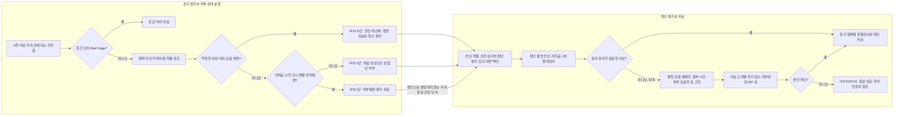

# 만성 가려움증 Chronic Pruritus

## <mark style="color:green;">일반 사항</mark>

* 정의 : 6주 이상 지속되거나 간헐적으로 반복되는 가려움증(피부 또는 인접 점막의 불쾌한 감각으로, 흔히 긁고 싶은 충동을 유발)
* 수면·일상생활·정신건강에 큰 부담을 주며 삶의 질을 현저히 낮출 수 있음 \[European Guideline on Chronic Pruritus, 2025]
* 유병률 : 조사 대상·정의·기간에 따라 차이가 커 단일 수치로 일반화하기 어려움; 고령자는 피부건조증·동반질환·다약제 복용을 함께 평가
* 관련 요인 : 피부건조증, 아토피성 질환, 간·콩팥 질환, 약물, 불안·우울 등; 연관성이 있다고 모두 독립적인 원인 또는 위험 인자는 아님
* 원발 피부병변/소견 : 홍반, 구진, 수포, 팽진, 인설, 피부건조 등; 가려움 시작 전에 있었는지 확인
* 긁음에 따른 이차 병변 : 긁힌 자국(excoriation), 가피, 태선화, 색소 변화, 양진성 구진·결절, 흉터 등
* 피부위축은 약물·기저질환과도 관련될 수 있으며, 괴사·궤양은 단순 긁음으로 단정하지 않고 감염·혈관염 등 별도 원인을 평가
* 만성 가려움-긁기 악순환(itch-scratch cycle)은 수면 장애, 불안·우울, 삶의 질 저하로 이어지므로 신체적 원인 감별과 함께 심리적 부담도 함께 평가

## <mark style="color:green;">원인 (원인에 따른 분류)</mark>

\[International Forum for the Study of Itch, IFSI]

* **피부 상태에 따른 임상 분류** : I군은 원발 피부질환/염증이 있는 피부, II군은 가려움 시작 당시 정상으로 보였던 피부, III군은 뚜렷한 만성 이차 긁음 병변이 있는 경우; 서로 겹칠 수 있으며 III군에서도 피부·전신·신경·약물 등 원인을 계속 찾음
* 아래는 **원인 분류**이며 위 임상 분류와 구분

#### <mark style="color:$primary;">Dermatological</mark>

* 건조증, 아토피, 건선, 태선, 접촉피부염, 모낭염, 옴, 진균 감염, 장미색 잔비늘증

#### <mark style="color:$primary;">Systemic</mark>

* 간·콩팥 : 담즙정체, 원발성 담즙성 담관염(PBC), 간염, 만성콩팥병; 임신 중 간내 담즙정체 및 경구피임제 관련 담즙정체도 고려
* 혈액 : 진성 적혈구증가증 등 골수증식성 질환, 철결핍(빈혈이 없어도 가능)
* 내분비·대사 : 갑상선 질환, 당뇨병, 부갑상선기능항진증 등
* 감염 : HIV, 기생충(회충 등 장 기생충 포함)
* 악성 종양 : 고형 종양, 림프종, 백혈병

#### <mark style="color:$primary;">Neurological</mark>

* multiple sclerosis, neuromyelitis optica spectrum disorder, small-fiber neuropathy, 뇌·척수 병변, notalgia paresthetica, brachioradial pruritus, postherpetic neuralgia

#### <mark style="color:$primary;">Psychiatric / psychosomatic (정신적·심리적 요인 관련)</mark>

* 과거 IFSI 분류에서는 somatoform이라는 용어를 사용했으나, 최근 지침의 정신질환·심리신체적 기여 개념으로 기술; 정상 검사 결과만으로 심인성 가려움으로 진단하지 않음
* 정신적·심리적 요인이 가려움의 발생·악화 또는 지각 강도에 기여하는 경우
* 우울증, 불안장애, obsessive-compulsive & related disorders, delusional infestation, schizophrenia 등과 연관될 수 있음
* 다른 피부·전신·약물·신경학적 원인을 충분히 평가한 뒤 임상적으로 판단

#### <mark style="color:$primary;">Mixed origin</mark>

* 위 범주 중 2가지 이상이 동시에 기여하는 경우

#### <mark style="color:$primary;">약물 및 원인 불명</mark>

* 약물 : opioid, 항고혈압제, 항생제, 소염제 등; 발진 없이 생기거나 약물성 담즙정체를 통해 발생할 수 있어 시작·증량 시점과 증상 발생의 관계를 확인
* 원인 불명 만성 가려움(CPUO/PUO) : 적절한 피부·전신 평가 후에도 원인이 확인되지 않은 경우; 새 증상·진찰·검사 이상이 생기면 원인을 다시 평가

***

### <mark style="color:$danger;">🚩 Red Flags!</mark>


**즉각 조치 또는 의뢰 — 생명 위협 또는 즉각적 위해 가능성**

* 급성 전신 가려움/두드러기·혈관부종과 함께 호흡곤란·쌕쌕거림·후두 증상·저혈압/실신 → 아나필락시스 의심, 즉시 epinephrine 근육주사 및 응급 이송; 피부 증상 없이도 아나필락시스가 가능
* 새 약물 복용 후 피부 통증, 광범위한 수포·박리, 점막 미란 또는 발열·얼굴부종·장기 이상 → 중증 피부약물이상반응 의심, 즉시 응급 평가
* 황달과 함께 발열·우상복부 통증·저혈압/의식저하가 동반된 경우 → 급성 담관염/담도 폐쇄 의심, 즉시 응급 평가
* 황달과 함께 의식 변화 또는 명백한 출혈 경향/응고장애가 동반된 경우 → 급성 간부전 가능성, 즉시 응급 평가
* 자살 계획·의도·수단, 최근 자해 또는 즉각적인 안전 확보가 어려운 경우 → 혼자 두지 않고 응급 정신건강 평가/이송



**당일~수일 내 평가**

* 새 황달, 짙은 소변, 회백색 대변을 동반한 가려움 → 담즙정체 의심, 간담도 평가(당일)
* 임신 중 새로 발생한 전신 또는 손바닥·발바닥 가려움(원발 발진이 없고 특히 밤에 심한 경우; 황달이 없어도 가능) → 임신 중 간내 담즙정체 의심, 산부인과 평가 및 혈청 총담즙산·간효소 검사(당일)
* 자살사고가 있으나 즉각적인 계획·의도가 확인되지 않은 경우에도 당일 위험도 평가 및 안전 계획
* 설명되지 않는 체중 감소, 야간 발한, 림프절병증 또는 비장비대 동반 → 혈액종양 질환(특히 Hodgkin's disease) 의심
* 수포 발생 전 뚜렷한 원발 병변 없이 심한 가려움이 지속되는 고령 환자 → subtle/invisible dermatosis(예: bullous pemphigoid 전구기) 의심, 피부과 의뢰
* 가족·동거인·시설 내 다수에서 동시 발생 → 옴(scabies) 의심, 접촉자 관리 및 피부과 의뢰
* 만성 콩팥병 환자에서 중등도\~중증의 가려움이 새로 발생하거나 악화되고, 신기능·투석 적절도·Ca/P/PTH 등 교정 가능한 요인 평가 후에도 지속되는 경우 → 신장내과 협진



**외래 추적 / 추가 평가 계획 — 호전 없으면 의뢰**

* 1st-step lab screening에서 이상이 없고, 4\~6주간 원인에 따른 치료와 보습·피부장벽 관리 ± 적응증에 맞는 증상 치료에도 반응하지 않는 경우
* 원인 불명으로 지속되어 chronic prurigo, lichenification 등 2차 긁음 병변으로 진행하는 경우
* 국소·전신 치료에도 반복 재발하거나 난치성으로 진행하여 질환 특이 생물학적제제·면역억제제 등을 검토해야 하는 경우
* 심한 수면·기능 장애가 있으면 4\~6주를 기다리지 않고 조기 의뢰


***

## <mark style="color:green;">진단</mark>

### <mark style="color:orange;">검사</mark>

* 목적 : 기저 피부질환뿐 아니라 간·신장·혈액·내분비 질환, 약물, 감염, 신경병증성 원인 등을 감별
* 모든 환자에서 상세 병력(가려움의 시작·기간·부위·강도·양상, 선행 피부병변, 체중감소·발열·야간발한·피로, 여행·성접촉, 직업·동물 노출, 약물·보충제)과 전신 피부진찰을 시행
* 원인 불명의 가려움에서는 림프절을 포함한 focused general physical examination을 시행
* 피부 병변이 뚜렷하지 않아도 xerosis, 잘 드러나지 않는 옴(well-groomed scabies), 수포 발생 전 bullous pemphigoid 등 subtle/invisible dermatosis를 고려
* **1st-step lab screening** : 원인 불명 전신 가려움 또는 전신질환이 의심되는 경우 적용; 원인이 명확한 국소 피부질환에 모든 검사를 일률적으로 시행하지 않음
  * CBC with differential, ESR
  * Cr/eGFR, urea(BUN)
  * AST, ALT, ALP, γ-GT, total/direct bilirubin
  * LDH, TSH
  * HbA1c 또는 fasting glucose
  * ferritin, CRP
* 검사 이상이 있으면 해당 장기·질환에 따라 표적 정밀검사를 시행
* 1차 평가가 비특이적이면서 가려움이 지속되면 **2nd-step evaluation**
  * 병력 및 전신진찰 재평가
  * 기생충 검사(노출력·호산구증 등 임상적 의심 시 stool microscopy/PCR 또는 serology)
  * 흉부 X선 : 림프절병증, 만성 감염, 종양 등 평가
  * 복부 초음파 : 간담도·신장·췌장·비장 질환, 림프절병증, 종양 등 평가
  * 피부 병변 또는 invisible dermatosis가 의심되면 skin biopsy ± direct immunofluorescence
* **선택적 추가 검사** : 임상상에 따라 serum protein electrophoresis/immunofixation, HBV/HCV, Ca/PTH, HIV, genital/oral pruritus에서 Candida 검사, serum tryptase 및 mastocytosis 관련 검사 등을 시행
* 임신 중 담즙정체 의심 시 **혈청 총담즙산·AST/ALT**를 별도로 검사; 초기 수치가 정상이어도 증상이 지속되면 산부인과에서 재검
* 감염·종양 검사는 병력·진찰·기본검사에 따른 표적 검사와 연령에 맞는 국가검진을 우선하며, 가려움만으로 무차별 CT·종양표지자 검사를 시행하지 않음

### <mark style="color:orange;">중증도 및 치료 반응 평가</mark>

* 초진 시와 추적 시 동일한 척도를 사용하여 가려움 강도를 정량화
* 간단한 방법 : 최근 24시간의 worst itch 또는 average itch를 **NRS 0\~10**으로 기록
* 수면 방해, 일상생활 장애, 우울·불안 등 기능적 영향을 함께 평가
* 필요 시 5-D Itch Scale, DLQI 등 검증된 도구를 추가 사용

### <mark style="color:orange;">감별</mark>

* 가족 내 다수 발생 → 옴 등 기생충
* 운동·열·발한으로 발생 → 콜린성 가려움 또는 콜린성 두드러기; 작은 팽진 동반 여부 확인
* 물과의 접촉 후 가려움 발생, 팽진 없음 → aquagenic pruritus; CBC의 Hb/Hct·혈소판 등을 확인하여 진성 적혈구증가증 등 감별(가려움만으로 확진하지 않음)
* 전신 가려움과 함께 원인 불명 체중 감소·발열·야간 발한·림프절병증 → Hodgkin 림프종 등 혈액질환 감별; 야간 악화만으로 림프종을 시사하지 않음
* 뚜렷한 피부·전신 원인 없이 스트레스와 증상 변동의 연관성이 반복적으로 관찰됨 → psychogenic/psychosomatic contribution 가능성 고려
* 고령에서 겨울철 악화 → xerosis cutis, asteatotic eczema
* 원발 발진 없는 전신 가려움 → 피부건조증·미세한 피부질환, 전신 질환, 약물 등을 먼저 평가
* 원발 발진 없는 국소 가려움 → 신경병증성 가려움, 초기/미세 피부질환 등을 평가; 국소 가려움만으로 정신적 원인으로 분류하지 않음

***


```mermaid
flowchart LR
    subgraph S1["초기 평가와 피부 상태 분류"]
        direction TB
        A["6주 이상 지속·반복되는 가려움"] --> R{"즉각 조치 Red Flags?"}
        R -->|예| ER["응급 처치·이송"]
        R -->|아니오| B["병력·전신 피부진찰·약물 검토"]
        B --> C{"뚜렷한 만성 이차 긁음 병변?"}
        C -->|예| III["IFSI III군: 양진·태선화; 병변 치료와 원인 평가"]
        C -->|아니오| P{"가려움 시작 당시 원발 피부병변?"}
        P -->|예| I["IFSI I군: 피부질환 평가·치료"]
        P -->|아니오| II["IFSI II군: 처음 정상으로 보였던 피부"]
    end
    subgraph S2["원인 평가와 치료"]
        direction TB
        G["전신·약물·신경·심리적 원인 평가; 임신 여부 확인"] --> H["원인 불명 전신 가려움: 1차 혈액검사"]
        H --> J{"표적 평가가 필요한 이상?"}
        J -->|예| K["장기·질환별 정밀검사와 원인 치료"]
        J -->|아니오, 지속| L["병력·진찰 재평가; 흉부 X선·복부 초음파 등 고려"]
        L --> M["의심 소견별 추가검사; 피부생검·DIF 등"]
        M --> N{"원인 확인?"}
        N -->|예| K
        N -->|아니오| O["CPUO/PUO: 증상 치료·추적·전문과 협진"]
    end
    III --> G
    II --> G
    I -->|원인으로 설명되지 않는 지속 증상·전신 단서| G
```

* IFSI III군을 II군으로 재분류하지 않음; 원발 피부질환과 만성 긁음 병변이 함께 있으면 임상군이 겹칠 수 있음.
* 모든 단계에서 보습·증상 치료를 병행하며, 당일~수일 내 평가 항목은 해당 시점에 진행.
* 1차 혈액검사 항목은 위 검사 절 참조. 기생충·바이러스·종양 관련 검사는 임상 단서에 따라 선택.

<p align="center"><strong>만성 가려움증 진단 알고리듬</strong></p>

<p align="center"><em>Ref. Weisshaar E, et al. European Guideline on Chronic Pruritus. Acta Derm Venereol. 2025;105:adv44220. Fig. 1 및 Tables 3–4를 참고하여 일차진료용으로 재구성.</em></p>

***

## <mark style="background-color:$warning;">Management</mark>

### <mark style="color:orange;">치료 방침</mark>

* 피부 건조 관리
* 증상에 대한 약물 치료
* 기저 피부 질환이 있으면 이를 치료, 기저 피부 질환이 없으면 전신 질환 감별

### <mark style="color:orange;">단계별 치료 접근</mark>

* 유럽 S2k 지침(2025)의 치료 원칙을 일차진료에 맞게 재구성한 접근이며, 원문 Table 10의 단계·약제 배치를 그대로 옮긴 것은 아님. 원인질환이 확인되면 해당 질환 지침과 국내 허가·급여 기준을 우선 적용.

* **Step 1. 원인·phenotype에 따른 기본 치료**
  * 원인질환 치료 + 보습·피부장벽 관리 + 악화 인자 회피
  * inflammatory dermatosis → topical corticosteroid 또는 topical calcineurin inhibitor
  * urticaria 등 histaminergic itch → 2세대 non-sedating H1-항히스타민제
  * 감염·기생충·약물 유발 원인이 확인되면 원인 치료/원인 약제 조정
* **Step 2. 원인 치료에도 지속되는 중등도\~중증 가려움**
  * neuropathic itch 또는 CKD-associated pruritus → gabapentin/pregabalin
  * 선택된 난치성 CP → 항우울제, opioid-modulating therapy, NB-UVB 등 원인·phenotype에 맞는 치료
* **Step 3. 난치성 또는 질환 특이 치료가 필요한 경우**
  * 전신요법이 필요한 결절성 양진 또는 중등도\~중증 아토피피부염 → 해당 질환의 적응증에 맞는 생물학적제제 등을 고려; 가려움이 심하다는 이유만으로 적응증을 확대하지 않음
  * 원인 불명 CPUO/PUO 또는 복합 원인 → 피부과/관련 전문과 협진 및 multimodal treatment

#### <mark style="color:$primary;">매 단계 동반 치료</mark>

* 충분한 보습, 피부 자극 최소화, 수면·스트레스 관리
* 긁음으로 인한 이차성 피부 손상은 감염 여부를 평가하여 필요 시 국소 치료
* 1세대 진정성 H1-항히스타민제는 야간 수면장애가 심한 선택된 환자에서만 단기간 고려하며, 특히 고령자에서는 항콜린성 부작용·낙상·인지저하에 주의

<table><thead><tr><th width="90">단계</th><th>임상 상황</th><th>핵심 접근</th><th>대표 옵션</th></tr></thead><tbody><tr><td>Step 1</td><td>원인·임상 양상 평가</td><td>원인 치료 + 피부장벽 회복</td><td>보습, 염증성 피부질환의 국소 steroid/TCI, 히스타민성 가려움의 2세대 H1-항히스타민제</td></tr><tr><td>Step 2</td><td>중등도~중증 가려움 지속</td><td>원인·기전에 따른 추가 치료</td><td>gabapentinoid, 선택된 항우울제·opioid 수용체 조절제, NB-UVB</td></tr><tr><td>Step 3</td><td>난치성/질환 특이 치료 필요</td><td>피부과·관련 전문과 협진</td><td>적응 질환의 생물학적제제·JAK 억제제 등</td></tr></tbody></table>

***

## <mark style="color:green;">비-약물 치료 및 예방</mark>

### <mark style="color:orange;">회피</mark>

* 피부 건조 : 건조한 환경, 열(사우나), 잦은 씻기/목욕, 알코올성 제제 도포
* 세정 : 전신에 매일 비누를 사용할 필요는 없으며 겨드랑이·서혜부·오염 부위 등 필요한 곳에 순한 세정제를 사용. 손 위생은 유지하고 알칼리성 비누·과도한 세정을 피함
* 과음·과열을 피하고, 뜨겁거나 매운 음식·음료는 실제 증상 악화와 관련될 때 조절
* 긴장·스트레스가 악화 요인이면 이완요법·상담을 활용
* 개인별 알레르기 유발 또는 자극 물질 : 향료, 일부 방부제·계면활성제 등; 집먼지진드기 회피는 감작과 임상적 관련성이 있을 때 고려하며 모든 만성 가려움에 일률적으로 적용하지 않음

### <mark style="color:orange;">권고</mark>

* 부드러운 중성/약산성/향이 없는 비누, 보습 세제, 샤워/목욕 oil
* 목욕할 때 미지근한 물을 사용하며 20분 이내 시행; 필요 시 colloidal oatmeal bath를 고려
* 수건으로 피부 물기를 닦을 때 문지르지 말고 두들김
* 매일 보습제 적용(특히 샤워/목욕 후)
* 공기가 통하는 부드러운 옷 착용(예: 면 제품); 얇은 옷을 겹쳐 입고 조절하여 땀 나는 것을 피함
* 차가운 습포는 짧게 사용; 보습제 또는 약물을 이용한 wet-wrap은 피부질환·제품별 적응증에 따라 의료진 지도하에 시행(감염·피부 침연 및 steroid 흡수 증가에 주의)
* 손발톱을 짧게 깎음
* 적절한 실내 습도 유지; 야간에 실내를 낮은 온도로 조절

### <mark style="color:orange;">보습제</mark>

(☞ p.867)

* 도포 시점 : 샤워나 목욕 후(특히 피부 건조증 환자에서), 야간; 하루 한 번 이상 도포
* 도포량 : 전신 피부건조증/습진이 있는 성인은 대략 250\~500 g/주를 참고하되 면적·제형·중증도에 따라 조절; 국소 가려움 환자 모두의 고정 목표량은 아님
* 종류 : 무향료 크림/연고, petroleum jelly <mark style="color:blue;">\[바셀린]</mark>, glycerol, urea(5\~10%) <mark style="color:blue;">\[유리아]</mark> 등; urea·lactate는 염증·긁힌 상처에서 따가울 수 있어 이 경우 단순 보습제를 선택
  * 겨울철에는 기름기가 많은 제제 선택
* steroid 외용제와 병용 : 한 제품씩 바르고 다음 제품까지 충분한 간격(실무적으로 20\~30분)을 둠. 보습제의 크림/연고 구분만으로 도포 순서를 일률적으로 정하지 않으며, 제품별 지시를 따름

### <mark style="color:orange;">이완 요법</mark>

* 명상, 요가, 스트레칭, 운동, 심리 상담

***

## <mark style="color:green;">약물 치료</mark>

### <mark style="color:orange;">국소 치료제</mark>

#### <mark style="color:$primary;">Steroid</mark>

(☞ p.1139)

* 대상 : 아토피, 접촉피부염, 건선, 태선 등에 의한 가려움
* 태선화된 병변은 부위·연령에 적합한 중등도 이상 역가의 외용제를 고려; 선택된 양진 결절의 병변 내 주사는 피부과에서 판단
* 염증이 없는 정상 피부의 가려움에 일률적으로 사용하지 않음; 감염·옴이 의심되면 원인 치료 없이 steroid만 도포하지 않음
* 역가·제형·부위·연령에 맞춰 사용 기간을 결정하고 통상 1\~2주 후 반응 재평가; 모든 제제·질환에 일률적인 2주 상한을 적용하지 않음
* clobetasol propionate 0.05%(매우 강한 역가) <mark style="color:blue;">\[더모베이트 연고/액]</mark> : 얼굴·접힘 부위의 무분별한 사용과 장기 연용을 피하고 해당 제품의 용법·기간 준수
* mometasone furoate 0.1% <mark style="color:blue;">\[모리코트 크림/로션]</mark> : 역가는 제형·분류 체계에 따라 달라짐; 크림은 국내 허가상 **1일 1회** 얇게 도포, 밀봉붕대법은 피함
* 재발하는 아토피피부염에서는 조절 후 간헐적 유지요법 또는 TCI 전환을 고려; TCI의 질환·연령 적응증 확인 (☞ p.1143)
  * tacrolimus <mark style="color:blue;">\[프로토픽]</mark>, pimecrolimus <mark style="color:blue;">\[엘리델]</mark>

#### <mark style="color:$primary;">Capsaicin</mark>

* 작용 : 감각 신경 끝에서의 탈감작 효과. neuropathic itch에 유효
* 반복 도포에 따른 탈감작 효과이며, 효과 발현 시점은 농도·사용 빈도·질환에 따라 다름
* 부작용 : 초기 작열감
* 저농도 제제(예: 0.025%)를 선택된 국소 신경병증성 가려움에서 고려(가려움 치료는 허가 외 사용); 손상 피부·점막·눈 주변은 피하고 사용 후 손 씻기. 국내 제제의 허가·실제 공급 여부는 처방 시 확인

#### <mark style="color:$primary;">기타 국소제</mark>

* 국소 마취 성분은 선택된 국소 가려움에서 제한적으로 고려; 성분·제형마다 허가된 도포량·횟수·면적이 달라 공통으로 “하루 5회”를 적용하지 않음
  * pramoxine 1%, polidocanol 함유 제제 등에 해외 연구가 있으나 국내 제품의 성분·허가·공급은 별도 확인
  * lidocaine/prilocaine <mark style="color:blue;">\[엠라]</mark>는 시술 전 피부마취제이며 만성 가려움의 반복·전신 도포용으로 처방하지 않음; 넓은 면적·손상 피부·밀봉 도포 시 전신독성/메트헤모글로빈혈증 위험
* 습포 : 깨끗한 차가운 물을 적신 천 또는 시판 0.9% 생리식염수를 짧게 사용; Burow 용액은 제품별 농도·희석 지시를 따르고 가정용 티스푼으로 식염수를 조제하지 않음
* calamine/zinc oxide <mark style="color:blue;">\[칼라민 로션]</mark>(비급여)
* camphor(2%), menthol(1%)

### <mark style="color:orange;">전신 치료제</mark>

* 대상 : 원인 평가·치료와 보습만으로 조절되지 않는 가려움; 성인 용량 예시이며 소아·고령자·신장애·간장애는 별도 조절
* **허가 외 사용과 급여는 구분** : gabapentin/pregabalin, 항우울제, capsaicin, rifampicin/naltrexone/sertraline 등의 가려움 치료는 대개 국내 허가 외 사용. 효과·위험·대안을 설명하고 해당 적응증의 급여 적용 여부를 따로 확인

#### <mark style="color:$primary;">H1-항히스타민제</mark>

(☞ p.1144)

* 대상 : 히스타민 관련 가려움


염증성 피부 질환 관련 가려움을 포함하여 대부분의 만성 가려움은 히스타민에 매개되지 않으므로 항히스타민제에 잘 반응하지 않음


* urticaria 등 histaminergic itch에서는 **2세대 non-sedating H1-항히스타민제**를 우선 사용
* 대부분의 비히스타민성 만성 가려움에서는 효과가 제한적이며, 1세대 제제는 야간 수면장애가 심한 선택된 환자에서 단기간 고려
* 1세대 제제는 항콜린성 부작용·주간 졸림·인지저하·낙상 위험 때문에 특히 고령자에서 신중히 사용
* H2-항히스타민제 병용 효과는 일관되지 않아 만성 가려움의 표준 병용요법으로 권고하기 어려움

**진정성·항콜린 부담이 있는 제제**

* hydroxyzine <mark style="color:blue;">\[아디팜정 10 ㎎]</mark> : 국내 피부과 영역 허가 용량 30\~60 ㎎/d, 2\~3회 분할; 최소 유효용량·최단 기간 사용
  * 고령자는 사용이 권장되지 않으며, 불가피하면 성인 권장량의 절반으로 시작하고 최대 50 ㎎/d
  * QT 연장/Torsades de pointes 위험 : QT 연장·유의한 서맥·저칼륨/저마그네슘혈증·QT 연장 약제 병용 등 위험 요인을 확인
* chlorpheniramine <mark style="color:blue;">\[페니라민정 2 ㎎]</mark> : 국내 성인 허가 용법 1회 2\~6 ㎎, 1일 2\~4회; 최대 24 ㎎/d

* mequitazine : 5 ㎎ bid <mark style="color:blue;">\[프리마란]</mark>; 세대 분류가 문헌마다 다르지만 졸림·항콜린 작용이 있어 비진정성 제제로 취급하지 않음

**2세대(진정이 상대적으로 적은 제제)**

* loratadine : 10 ㎎ qd <mark style="color:blue;">\[클라리틴]</mark>
* fexofenadine : 180 ㎎ qd <mark style="color:blue;">\[알레그라]</mark>
* cetirizine : 10 ㎎ qd <mark style="color:blue;">\[지르텍]</mark>
* cetirizine도 졸림이 생길 수 있으며 신기능에 따른 감량 필요; fexofenadine도 신장애 시 용량 조절

#### <mark style="color:$primary;">항우울제 (TCA, SSRI, NaSSA 등)</mark>

(☞ p.1146)

* 대상 : 원인 치료에도 지속되는 난치성 CP에서 선택적으로 고려; 특히 nocturnal itch, psychogenic/psychosomatic contribution, CKD·담즙정체·악성종양 관련 가려움 등에서 약제별 근거와 환자 특성을 고려 (보험주의)
* amitriptyline : 10 ㎎ hs 등 낮은 용량에서 시작하여 반응에 따라 25\~50 ㎎/d까지 조절 <mark style="color:blue;">\[에트라빌]</mark>; 항콜린 작용·기립성 저혈압·심장 전도 이상 때문에 고령자에서는 가급적 피함
* mirtazapine : 보통 15 ㎎ hs부터 시작, 선택된 환자에서 30 ㎎/d까지 조절 <mark style="color:blue;">\[레메론]</mark>; 졸림·식욕/체중 증가에 주의
* paroxetine : 저용량으로 시작하여 보통 20 ㎎/d, 필요 시 40 ㎎/d까지 조절 <mark style="color:blue;">\[세로자트]</mark>; 고령자에서 항콜린 부담·저나트륨혈증·중단 증상에 주의
* 모든 약제의 가려움 효과가 동일하지 않으며, 담즙정체에서는 sertraline의 근거를 우선 검토

#### <mark style="color:$primary;">전신 Steroid</mark>

* 대상 : 중증 접촉피부염·일부 자가면역 수포질환 등에서 **원인질환 치료 목적**으로 사용; 아토피피부염에서는 전신 steroid의 통상적 사용을 권고하지 않으며, 예외적인 급성 중증 악화에서 전문과가 단기 가교치료로 판단하는 경우에 한정
* 원인불명·신경병증성·CKD-associated·담즙정체성 가려움 자체의 routine antipruritic으로는 사용하지 않음
* **예외적 상황** : severe paraneoplastic pruritus 또는 palliative care에서 다른 치료가 충분하지 않은 경우, 증상 완화를 위해 제한적 단기 사용을 고려할 수 있음
* 가려움의 증상 완화 목적이라면 가능한 단기간(통상 ≤2주) 사용. 다만 수포성 유사천포창 등 원인질환의 치료 기간은 해당 지침에 따르며 이 문구를 모든 질환의 일률적 상한으로 적용하지 않음; 용량·감량법은 환자별 결정

#### <mark style="color:$primary;">Gabapentinoid</mark>

* 대상 : neuropathic pruritus, CKD-associated pruritus 등 비히스타민성 만성 가려움에서 선택적으로 고려 (보험주의)
* 부작용 : 어지럼, 졸음, 두통, 구역, 말초 부종, 체중 증가, 착란; 고령자에서는 낙상 위험에 특히 주의
* **start low, go slow** : 고령자·신기능 저하 환자에서는 더 낮은 용량으로 시작
* gabapentin : 보통 100\~300 ㎎ hs부터 시작하여 반응·내약성에 따라 qd\~tid로 서서히 증량 <mark style="color:blue;">\[뉴론틴]</mark>
* pregabalin : 보통 25\~75 ㎎ hs 또는 qd부터 시작하여 필요 시 서서히 증량 <mark style="color:blue;">\[리리카]</mark>; 혈액투석 환자에서는 25 ㎎ qd 또는 투석일 중심의 저용량 regimen으로 시작 가능
* 두 약제 모두 신기능과 혈액투석에 따른 용량 조절 필수 (☞ 통증 챕터의 신장애 환자 gabapentinoid 용량 참조)
* opioid·benzodiazepine 등 중추신경억제제 병용, 호흡기질환·고령·신장애에서 호흡억제 위험에 주의; 투여 시작/증량 후 졸림·보행·호흡 상태를 확인
* 갑자기 중단하지 않고, 중단이 필요하면 통상 1주 이상에 걸쳐 감량

#### <mark style="color:$primary;">μ-opioid receptor antagonist / κ-opioid receptor agonist</mark>

* μ-opioid 길항제와 κ-opioid 작용제는 서로 다른 계열이며 적응증·주의사항을 구분
* naltrexone : 주로 선택된 난치성 담즙정체성 가려움에 고려(허가 외); 12.5 ㎎/d 등 저용량에서 시작하여 보통 50 ㎎/d까지 단계적으로 증량 <mark style="color:blue;">\[레비아]</mark>
  * 현재 opioid 사용·의존, 급성 간염/간부전 등 금기와 간기능을 확인; 외인성 opioid를 쓰지 않아도 금단 유사 반응이 생길 수 있음
  * CKD-associated pruritus에서는 효과가 일관되지 않아 표준 우선 약제로 제시하지 않음
* nalfurafine(κ-opioid 작용제) <mark style="color:blue;">\[레밋치구강붕해정 2.5 ㎍]</mark> : 국내 허가된 기존 치료법에 효과가 불충분한 혈액투석 환자의 소양증 치료제; 아래 특별한 경우 참조
* difelikefalin(말초성 κ-opioid receptor agonist) : 성인 혈액투석 관련 중등도\~중증 가려움에서 투석 후 정맥 투여(건체중 기준 0.5 ㎍/㎏, 통상 주 3회); 미국 FDA(2021)·EU(2022) 승인. 국내 처방 가능 여부는 확인되지 않아 해외 치료 옵션으로 구분하고, 최신 국내 허가·공급을 별도 확인

#### <mark style="color:$primary;">항류코트리엔제 - 제한적 옵션</mark>

* montelukast는 CKD-associated pruritus의 소규모 연구가 있으나 근거가 제한되어 일차진료의 통상 치료로 권고하지 않음(가려움 치료는 허가 외)
* montelukast를 선택적으로 사용한다면 신경정신계 이상반응(악몽·불면·기분 변화·자살사고 등)을 설명하고 모니터링
* pranlukast를 같은 계열이라는 이유로 만성 가려움 치료에 대체 적용할 근거는 불충분

#### <mark style="color:$primary;">면역억제제 (Immunomodulator therapy): Cyclosporine</mark>

(☞ p.871)

* 대상 : 다른 치료로 조절되지 않는 심한 아토피성 피부염
* 작용 : T-lymphocyte 억제
* 부작용 : 고혈압, 부종, 신 손상, 발모 증가, 구역, 설사, 가슴쓰림
* 피부질환 치료에서 주요 금기 : 신기능 이상, 조절되지 않는 고혈압·감염, 악성종양 등; 당뇨병 또는 모든 간질환을 일률적인 절대 금기로 묶지 않으며 제품별 허가사항 확인
* 생백신은 치료 중 피하고 접종 시점을 전문과와 조율; CYP3A4 관련 상호작용·신독성 약제 병용 확인
* 모니터링 : 혈압, Cr/eGFR, K/Mg, 간기능 등 기저 검사와 치료 중 정기 추적
* 용법 : 2.5\~5 ㎎/㎏/d를 **1일 2회 분할**; 피부과에서 시작·조절 <mark style="color:blue;">\[산디문 등 cyclosporine 경구제]</mark>. 제형·품목별 아토피피부염 허가 유무와 급여 기준을 따로 확인

#### <mark style="color:$primary;">생물학적제제 (Biologics)</mark>

* 대상 : 국소·전신 1차 치료에 반응하지 않는 아토피피부염 또는 결절성 양진(prurigo nodularis) 동반 중증 만성 가려움; 피부과 의뢰 후 처방
* nemolizumab(IL-31 수용체 α 길항제) <mark style="color:blue;">\[넴루비오]</mark> : 중등도\~중증 아토피피부염 및 결절성 양진 치료제로 국내 허가(2026년); 적응증·연령·체중에 따라 투여 regimen이 다르므로 최신 제품설명서 확인; IL-31 신호 차단을 통해 가려움 유발 감각신경 활성화를 억제
* dupilumab(IL-4Rα 길항제) <mark style="color:blue;">\[듀피젠트]</mark> : 아토피피부염 및 성인 결절성 양진 등의 국내 적응증 보유; 질환별 연령·치료 요건·급여 기준 확인
* ✽아토피피부염·결절성 양진 이외의 전신성·신경병증성·원인 불명 만성 가려움에 이들 약제를 사용하는 것은 허가 외이며, 일반 만성 가려움의 표준 치료로 확대하지 않음

#### <mark style="color:$primary;">JAK 억제제 (Small molecules)</mark>

* 대상 : 국소·전신 1차 치료에 반응하지 않는 **중등도\~중증 아토피피부염 동반 만성 가려움**에서 질환 특이 systemic therapy로 고려; 피부과 평가 후 도입
* upadacitinib <mark style="color:blue;">\[린버크]</mark>, abrocitinib <mark style="color:blue;">\[시빈코]</mark> : 성인 및 만 12세 이상 청소년
* baricitinib <mark style="color:blue;">\[올루미언트]</mark> : 전신요법 대상 **2세 이상 소아 및 성인**의 중등도\~중증 아토피피부염에 국내 허가; 소아 체중·신기능에 따른 용량 확인
* 장점 : 비교적 빠른 itch reduction을 기대할 수 있음
* 주요 부작용/경고 : 대상포진·중증 감염, 정맥혈전색전증(VTE), 주요 심혈관계 이상반응(MACE), 악성종양, 이상지질혈증 등; CBC, 간기능, 지질 등 정기 모니터링 필요
* 치료 전 결핵·HBV/HCV 등 감염 선별과 예방접종 상태를 확인; 65세 이상·심혈관/악성종양 고위험군에서는 국내 허가상 사용 제한을 제품별 검토
* 다른 JAK 억제제·생물학적 면역조절제와 병용하지 않으며, 아토피피부염에서 cyclosporine 등 강력한 면역억제제와의 병용도 권장되지 않음; 임신·수유 금기와 피임 기간은 품목별 확인
* CPG/CPUO에서 JAK 억제제 사용은 제한된 연구 근거에 기반한 off-label 치료이며, **AD-associated CP에 대한 on-label 사용과 구분**해야 함

#### <mark style="color:$primary;">자외선 빛 치료(Phototherapy)</mark>

* **NB-UVB phototherapy** : CKD-associated pruritus, 아토피피부염, chronic prurigo 및 일부 난치성 만성 가려움에서 고려할 수 있음
  * **장점** : 전신 약물을 추가하지 않고 가려움과 피부 염증을 줄일 수 있어 약물 부작용·상호작용이 우려되는 환자에서 유용
  * **단점** : 반복적인 병원 방문이 필요하고 효과가 즉시 나타나지 않을 수 있음; 일시적 홍반·화끈거림·피부건조가 생길 수 있으며 장기간 누적 UV 노출 시 광노화·피부암 위험 가능성을 고려
  * **의뢰 기준** : 원인 치료와 적절한 국소·전신 치료에도 중등도\~중증 가려움이 지속되거나, 전신약 사용이 제한되는 경우 피부과 의뢰 고려

### <mark style="color:orange;">특별한 경우의 치료 옵션</mark>

#### <mark style="color:$primary;">CKD-associated pruritus</mark>

* 기본 : 피부건조 교정, 충분한 보습, 투석 적절도와 Ca/P/PTH 등 교정 가능한 요인 평가·최적화
* **우선 고려**
  * gabapentin : 혈액투석 환자에서는 100 ㎎ 투석 직후 주 3회로 시작하여 반응·내약성에 따라 증량(일반적으로 300 ㎎ post-HD를 넘기지 않도록 신중히 조절)
  * pregabalin : 혈액투석 환자에서는 25 ㎎부터 시작하는 저용량 투석 후 요법 등을 신장내과와 결정; 매일 복용 요법과 투석 후 요법을 임의로 중복하지 않으며 신기능·잔여 신기능에 따라 조절
  * gabapentin/pregabalin은 가려움에 허가 외 사용; 두 약제를 함께 처방하지 않고 졸림·착란·보행 불안정을 확인
* **국내 허가된 난치성 혈액투석 가려움 치료 옵션**
  * nalfurafine <mark style="color:blue;">\[레밋치구강붕해정 2.5 ㎍]</mark> : 기존 치료법에 효과가 불충분한 혈액투석 환자; 성인 2.5 ㎍ 1일 1회 저녁식후, 최대 5 ㎍/d. 불면·졸림·어지럼 및 opioid/CYP3A4 관련 상호작용에 주의하고 신장내과에서 치료 선택
  * 복용 후 다음 혈액투석 개시까지 8시간 이상 간격을 유지; 투석 일정에 맞춰 복용 시점을 확인하고 간기능 이상·황달 및 중추신경계 이상반응을 관찰
* **해외 승인 치료 옵션**
  * difelikefalin : 성인 중등도\~중증 혈액투석 관련 가려움; 건체중 기준 0.5 ㎍/㎏을 투석 종료 후 정맥 투여(통상 주 3회). 국내 허가·공급 확인 전에는 국내 처방례에 포함하지 않음
* **대안/보조 옵션**
  * NB-UVB phototherapy
  * 국소 capsaicin 등
* **제한적 또는 과거 근거 기반 옵션**
  * activated charcoal, γ-linolenic acid, montelukast 등의 근거는 제한적; thalidomide는 기형 유발·말초신경병증 등 위해가 커 일반 외래의 가려움 치료로 사용하지 않음

#### <mark style="color:$primary;">Hepatic & Cholestatic pruritus</mark>

* 아래는 **임신 중 간내 담즙정체를 제외한 성인 담즙정체성 가려움**의 전통적 단계 치료이며 간담도 전문과와 결정; 담도 폐쇄가 있으면 원인 치료 우선
* **1차 antipruritic** : cholestyramine 4 g/d부터 시작하여 필요 시 최대 16 g/d 분할 투여
  * 다른 경구약 흡수를 저해하므로 **다른 약은 cholestyramine 투여 최소 1시간 전 또는 4\~6시간 후**에 복용; 변비·복부팽만과 장기 사용 시 지용성 비타민 결핍에 주의
* **2차 옵션(허가 외)** : rifampicin을 저용량에서 시작하여 보통 300\~600 ㎎/d 범위로 조절
  * 간독성, 용혈, 신손상 및 다수의 약물상호작용에 주의하고 치료 전후 간기능 모니터링
  * 총빌리루빈 >2.5 ㎎/dL 등 유의한 황달에서는 사용을 피함(AASLD); 시작·증량 초기에는 간기능을 더 자주 확인
* **opioid-modulating therapy**
  * naltrexone(허가 외) : 12.5 ㎎/d 등 저용량부터 시작하여 반응에 따라 최대 50 ㎎/d로 단계적 증량; 현재 opioid 사용·의존, 급성 간염/간부전 등 금기 확인
  * naloxone 정맥 투여는 전문과/입원 환경에서 고려하며 일반 외래 처방으로 사용하지 않음
* **기타 선택적 옵션** : sertraline 75\~100 ㎎/d 등
* **UDCA** : PBC 등의 기저질환 치료제이며 PBC/PSC 가려움 자체의 표준 antipruritic은 아님. **임신 중 간내 담즙정체에서는 산부인과가 모체 증상 치료의 1차 약제로 사용**하므로 별도로 구분
* **최신 해외 옵션** : linerixibat(IBAT 억제제; <mark style="color:blue;">\[Lynavoy]</mark>)은 2026년 3월 미국 FDA에서 성인 PBC 관련 담즙정체성 가려움에 승인. 설사·간검사 이상·지용성 비타민 결핍 등에 주의; 국내 허가·공급 확인 전에는 국내 처방 옵션으로 제시하지 않음
* PBC/PSC의 다른 질환 특이 치료는 간담도 전문과에서 결정하며, 일반 만성 가려움 치료로 확대하지 않음

***

### <mark style="color:red;">질병코드</mark>

L29.0 항문 소양증 — Pruritus ani

L29.1 음낭 소양증 — Pruritus scroti

L29.2 외음부 소양증 — Pruritus vulvae

L29.3 상세불명의 항문생식기 소양증 — Anogenital pruritus, unspecified

L29.8 기타 소양증 — Other pruritus

L29.9 상세불명의 소양증 — Pruritus, unspecified

***

## <mark style="color:purple;">처방례</mark>

> **처방례 1. 경증 - 피부건조증 동반 특발성 만성 가려움**
>
> ```
> 유리아 크림(10%) 1일 2회  전신 도포
> ```
>
> _✽보습을 우선하고, urea가 상처·염증 부위에서 따갑다면 무향료 단순 보습제로 변경. 두드러기 등 히스타민성 증상이 함께 있을 때만 cetirizine(지르텍) 10 ㎎ qd 등의 병용을 검토; 신기능·졸림 확인._

> **처방례 2. 중등도 - 항히스타민제 무반응, 신경병증성 가려움 의심**
>
> ```
> 뉴론틴(gabapentin) 100 ㎎  1캡슐  hs로 시작
> 반응·내약성에 따라 수일~1주 간격으로 단계적 증량
> 유리아 크림(10%) 1일 2회  전신 도포
> ```
>
> _✽가려움에는 허가 외 사용. 항히스타민 무반응만으로 신경병증성 가려움을 진단하지 않으며, 분포·화끈거림·감각 이상 등 단서를 확인. 신기능에 따라 용량 조절하고 시작/증량 후 졸림·보행·호흡 상태를 확인._

> **처방례 3. 만성 콩팥병 관련 가려움 (혈액투석 환자)**
>
> ```
> 뉴론틴(gabapentin) 100 ㎎  1캡슐  주 3회 투석 직후
> 보습제  1일 2회 이상 충분히 전신 도포
> ```
>
> _✽가려움에는 허가 외 사용. 주 3회 혈액투석을 받는 환자의 저용량 시작 예시이며, 비투석 CKD 환자에게 이 간헐 요법을 그대로 적용하지 않음. 신장내과와 반응·착란·낙상·호흡억제를 확인하고 투석 적절도와 교정 가능한 요인을 함께 평가._

> **처방례 4. 담즙정체성 가려움**
>
> ```
> 콜레스티라민(cholestyramine) 4 g  1일 1~2회로 시작
> 필요 시 최대 16 g/d 범위에서 분할 증량
> ```
>
> _✽임신 중 간내 담즙정체를 제외한 성인 예시. 다른 경구약은 cholestyramine 복용 최소 1시간 전 또는 4\~6시간 후에 복용. 변비·상호작용과 국내 제품 공급을 확인하며, 황달·담도 폐쇄가 의심되면 원인 평가 우선. 임신 중 담즙정체의 UDCA 치료는 산부인과에서 결정._

> **처방례 5. 아토피피부염 또는 결절성 양진 동반 중증 난치성 가려움**
>
> ```
> 모리코트 크림(0.1%)  1일 1회  몸통·사지의 염증성 병변에 얇게 도포
> 1~2주 후 반응과 부작용 재평가
> ```
>
> _✽피부과 의뢰까지의 국소 보조치료 예시. 얼굴·눈꺼풀·접힘 부위·생식기에 이 처방을 그대로 적용하지 않으며 감염·옴은 먼저 배제. 심한 수면/기능 장애나 뚜렷한 결절성 양진은 4\~6주를 기다리지 않고 의뢰하여 질환 특이 전신치료를 검토._

***

### <mark style="color:$success;">핵심 복약 지도</mark>

> **보습제, 왜 가장 중요한가**
>
> * 특히 피부건조증 동반 환자에서 보습을 충분히 합니다. 전신 건조증/습진이 있는 성인의 주 250\~500 g은 참고량이며 병변 면적·제형에 따라 조절합니다.
> * steroid 외용제와 한꺼번에 섞어 바르지 않고 충분한 간격(실무적으로 20\~30분)을 두며 제품별 지시를 따릅니다.

> **항히스타민제 사용 시 유의점**
>
> * 대부분의 만성 가려움은 히스타민이 주된 기전이 아니므로 반응이 제한적일 수 있음을 미리 설명합니다.
> * 진정성 제제는 수면만 개선하고 원인 가려움에는 효과가 없을 수 있습니다. 고령자에서는 가급적 피하며, hydroxyzine은 QT 연장·부정맥 위험과 고령자 최대 50 ㎎/d 제한을 확인합니다.

> **Gabapentinoid 처방 시 유의점**
>
> * 어지럼·졸음·말초부종 등 부작용을 사전에 설명하고, 저용량에서 시작해 서서히 증량합니다.
> * 신기능에 따라 용량을 조절하고, 투석 후 요법은 정해진 일정에 따릅니다. opioid·수면제와 병용하면 심한 졸림·호흡억제 위험이 커질 수 있습니다.
> * 임의 증량·갑작스러운 중단을 피하고, 중단할 때는 처방의와 감량 계획을 세웁니다.

> **국소·전신 Steroid 사용 시 유의점**
>
> * 국소 steroid는 원인질환·역가·부위에 맞춰 기간을 결정하며 통상 1\~2주 후 재평가합니다. 장기/광범위 사용 시 피부위축 등 위험이 있어 조절 후 간헐 유지 또는 TCI 전환을 검토합니다.
> * 전신 steroid는 만성 가려움 자체의 통상 치료가 아닙니다. 증상 완화 목적의 단기 사용과 원인질환별 치료 기간을 구분합니다.

> **언제 다시 병원을 방문해야 하나요?**
>
> * 4\~6주간 원인에 따른 치료와 보습·피부장벽 관리 ± 적응증에 맞는 증상 치료에도 가려움이 호전되지 않는 경우
> * 새 황달·짙은 소변 또는 임신 중 원발 발진 없는 전신/손발바닥 가려움 - 당일 평가
> * 원인 불명 체중 감소·야간 발한·림프절 종대 - 수일 내 평가
> * 두드러기·혈관부종과 호흡곤란/실신, 광범위 수포·피부박리·점막 미란 - 119/응급실
> * 불면·우울감이 심해지면 조기 상담; 자살사고는 당일 위험도 평가하고, 계획·의도·자해가 있으면 즉각 안전 확보 및 응급 평가

***

## <mark style="color:blue;">환자 안내서</mark>


**만성 가려움증, 긁는 악순환을 줄이고 원인을 함께 찾습니다**

6주 이상 지속되는 가려움은 단순히 피부가 예민해서가 아니라 피부 건조, 전신 질환, 신경계, 심리적 요인 등 다양한 원인이 관여할 수 있는 증상입니다. 원인을 함께 찾고, 긁는 습관을 줄이는 것이 치료의 핵심입니다.


#### <mark style="color:$primary;">왜 가려움이 생기나요?</mark>

* 피부가 건조해지면 피부 장벽이 약해져 작은 자극에도 가려움을 느끼기 쉬워집니다.
* 간·콩팥·갑상선 질환, 빈혈, 약물, 신경 문제 등 몸의 다른 곳에 원인이 있는 경우도 많습니다.
* 스트레스나 불안이 가려움을 더 심하게 느끼게 하고, 반대로 가려움이 지속되면 불안·불면이 심해지는 악순환이 생길 수 있습니다.

#### <mark style="color:$primary;">일상생활에서 어떻게 관리하나요?</mark>

* **보습제를 충분히, 자주 바르십시오.** 샤워나 목욕 직후 물기가 남아 있을 때 바르면 효과가 좋습니다.
* **미지근한 물로 짧게(20분 이내) 씻으십시오.** 뜨거운 물, 잦은 목욕, 때수건 사용은 피부를 더 건조하게 만듭니다.
* **긁지 말고 두드리거나 차가운 찜질을 하십시오.** 손발톱을 짧게 깎아 긁었을 때 상처가 나지 않도록 합니다.
* **면 소재의 부드러운 옷을 입으십시오.** 땀이 나거나 몸이 뜨거워지면 가려움이 심해질 수 있습니다.
* **과음·실내 과열을 피하고**, 음식·음료가 실제로 증상을 악화시키는 경우 조절하십시오. 근거 없이 여러 음식을 제한할 필요는 없습니다.
* **스트레스·불안이 가려움을 악화시킨다면** 규칙적인 수면, 가벼운 운동, 명상·호흡 훈련 같은 이완요법을 함께 활용하고 필요하면 상담을 받으십시오.

#### <mark style="color:$primary;">약은 어떻게 써야 하나요?</mark>

* 항히스타민제는 두드러기처럼 히스타민이 주된 원인인 가려움에는 효과적이지만, 모든 만성 가려움에 효과가 있는 것은 아닙니다. 효과가 없으면 임의로 증량하지 말고 원인을 다시 평가해야 합니다.
* 항히스타민제, 신경병증 치료제, 항우울제 등은 의사가 처방한 용량과 기간을 지켜서 복용하십시오. 졸음이 있을 수 있으므로 운전이나 기계 조작에 주의합니다.
* 스테로이드 연고는 의사가 안내한 부위·횟수·기간에 맞춰 사용하십시오. 먹는 스테로이드는 대부분의 만성 가려움에서 일반적인 치료제가 아닙니다. 특정 염증성 질환 등에 필요할 때 의사가 처방하며, 원인질환에 따라 치료 기간이 달라지므로 임의로 연장하거나 중단하지 마십시오.
* 약마다 사용 기간과 중단 방법이 다릅니다. 필요할 때만 쓰는 약·단기 연고를 증상이 없는데 계속 사용하지 말고, 신경병증 치료제나 항우울제는 갑자기 끊지 말고 처방한 의사와 상의하십시오.

#### <mark style="color:$primary;">자외선 빛 치료(NB-UVB)는 어떤 치료인가요?</mark>

* 일정한 파장의 자외선을 피부에 조사하여 가려움과 피부 염증을 줄이는 치료입니다.
* 먹는 약을 추가하지 않고 증상을 줄일 수 있다는 장점이 있지만, 여러 차례 병원을 방문해야 하고 효과가 즉시 나타나지 않을 수 있습니다.
* 치료 후 일시적으로 피부가 붉거나 화끈거리거나 건조해질 수 있으며, 장기간 반복 치료에서는 누적 자외선 노출도 고려합니다.
* 일반적인 치료에도 중등도\~중증 가려움이 지속되거나 먹는 약의 부작용·상호작용 때문에 치료가 제한되는 경우 피부과에서 상담할 수 있습니다.

#### <mark style="color:$primary;">이럴 때는 빨리 도움을 받으십시오</mark>

* **119/응급실** : 가려움·두드러기와 함께 숨이 차거나 목이 붓고 어지러워 쓰러지는 경우, 피부에 넓게 물집·벗겨짐이 생기거나 입·눈 점막이 헐고 전신 상태가 나쁜 경우
* **당일 진료** : 새로 황달·짙은 소변이 나타나는 경우, 임신 중 발진 없이 온몸이나 손바닥·발바닥이 가려운 경우
* **수일 내 진료** : 이유 없는 체중 감소·야간 발한·림프절 부기가 나타나는 경우
* 가려움 때문에 잠을 거의 못 자거나 우울감이 심해지면 진료를 앞당기십시오. 자살사고가 있으면 당일 도움을 받고, 자해할 계획이나 즉각적인 위험이 있으면 혼자 있지 말고 119/응급실로 도움을 요청하십시오. 자살예방상담전화 109도 이용할 수 있습니다.


***

### 주요 참고자료

* Weisshaar E, et al. European Guideline on Chronic Pruritus: In cooperation with the European Dermatology Forum (EDF). Acta Derm Venereol. 2025;105:adv44220. [원문](https://doi.org/10.2340/actadv.v105.44220)
* 대한아토피피부염학회. Consensus-Based Guidelines for the Treatment of Atopic Dermatitis in Korea (Part I): Basic Therapy, Topical Therapy, and Conventional Systemic Therapy. 2025. [원문](https://pmc.ncbi.nlm.nih.gov/articles/PMC12318780/)
* American Academy of Dermatology. [아토피피부염 진료지침 및 2025 집중 개정](https://www.aad.org/member/clinical-quality/guidelines/atopic-dermatitis)
* SMFM Consult Series #53. Intrahepatic cholestasis of pregnancy. 2021. [권고](https://publications.smfm.org/publications/374-society-for-maternal-fetal-medicine-consult-series-53/)
* AASLD. [담즙정체성 가려움 치료](https://www.aasld.org/liver-fellow-network/core-series/clinical-pearls/scratching-itch-management-pruritus-cholestatic)
* 국내 약제 : [아디팜 제품정보](https://www.taiguk.co.kr/product/view.jsp?pid=AHG72486), [페니라민 제품정보](https://yuhan.co.kr/Products/List/?YPRD_IDX=1865&cid=177&mode=view), [모리코트크림 허가사항](https://nedrug.mfds.go.kr/pbp/CCBBB01/getItemDetail?itemSeq=200300107), [올루미언트 허가사항](https://nedrug.mfds.go.kr/pbp/CCBBB01/getItemDetail?itemSeq=201708280), [레밋치구강붕해정 제품정보](https://www.skchemicals.com/ls/product_view.aspx?serno=953), [갈더마코리아 제품 안내](https://www.galderma.com/kr-kr/korea)
* 안전성 : [EMA hydroxyzine QT 위험](https://www.ema.europa.eu/en/medicines/human/referrals/hydroxyzine), [FDA gabapentinoid 호흡억제](https://www.fda.gov/safety/medical-product-safety-information/neurontin-gralise-horizant-gabapentin-and-lyrica-lyrica-cr-pregabalin-drug-safety-communication)
* 보조자료 : [보습제와 외용제 도포 간격(NHS)](https://www.nhs.uk/tests-and-treatments/emollients/), [FDA montelukast 신경정신계 경고](https://www.fda.gov/drugs/drug-safety-communications/fda-requires-boxed-warning-about-serious-mental-health-side-effects-asthma-and-allergy-drug), [자살예방상담전화 109](https://www.129.go.kr/109)
* 해외 신약 : [difelikefalin 제품설명서](https://www.medicines.org.uk/emc/product/13735/smpc), [linerixibat 미국 허가사항](https://dailymed.nlm.nih.gov/dailymed/drugInfo.cfm?setid=c00317c8-709c-4707-a6d1-632bff123026)
* [레밋치구강붕해정 제품설명서(2026-04 개정)](https://www.skchemicals.com/imgup/ls/products/pdf/ls_35.pdf)

✽검토 기준일: 2026-10-03. 허가와 급여·출시·실제 공급은 별개이며, 국내 확인이 불충분한 해외 약제는 국내 처방 가능성을 단정하지 않음.
