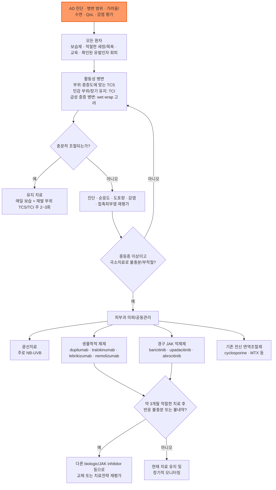
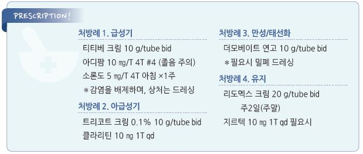

# 아토피 피부염 Atopic Dermatitis, AD


## <mark style="color:green;">일반 사항</mark>

* 만성·재발성 염증성 피부질환으로 **가려움증**, 연령에 따른 특징적인 병변 분포, 피부건조와 피부장벽 기능 이상이 핵심이다.
* 소아기에 시작하는 경우가 흔하지만 성인에서 새로 발생하거나 지속될 수 있다.
* 천식, 알레르기비염, 식품알레르기 등 다른 제2형(type 2) 염증성 질환이 동반될 수 있다.
* 임상 경과는 다양하며, 소아기 발병 환자가 모두 사춘기 전에 자연 소실되는 것은 아니다. 성인기까지 지속하거나 재발할 수 있다.

### <mark style="color:orange;">용어</mark>

* **급성 악화(acute flare)** : 치료 개입이 필요할 정도로 증상·징후가 유의하게 악화된 상태
* **반응 치료(reactive treatment)** : 눈에 보이는 활동성 병변에 시행하는 항염증 치료
* **유지/선제 치료(proactive treatment)** : 병변이 호전된 뒤 재발이 잦았던 부위에 TCS 또는 TCI를 주 2\~3회 간헐적으로 도포하여 재발을 예방하는 치료
* **질환 조절(control)** : 피부 병변, 가려움, 수면 및 삶의 질이 환자가 받아들일 수 있는 수준으로 안정된 상태

## <mark style="color:green;">원인</mark>

### <mark style="color:orange;">기전</mark>

* 피부장벽 기능 이상과 면역 조절 이상이 상호작용하여 발생한다.
* filaggrin 등 피부장벽 관련 유전적 요인과 환경 요인이 관여할 수 있다.
* 제2형 염증 반응에서 IL-4, IL-13 등이 중요한 역할을 하며, 가려움에는 IL-31 등 여러 신경면역 경로가 관여한다.
* 피부장벽 손상은 수분 손실과 자극·알레르겐·미생물의 침투를 증가시키며, 긁음은 다시 장벽 손상과 염증을 악화시킨다.

> **Itch-scratch cycle** : 가려움 → 긁음 → 피부장벽 손상 및 염증 증가 → 가려움 악화

### <mark style="color:orange;">악화 요인</mark>

* 건조한 환경, 과도한 열과 발한, 급격한 온도 변화
* 비누·세제·향료·거친 의복 등 개인별 자극물
* 세균·바이러스·진균 감염
* 수면 부족과 정신적 스트레스
* **확인된 경우에 한하여** 식품 또는 흡입 알레르겐


**알레르겐 감작(sensitization)만으로 원인이라고 판단하지 않는다.** 피부단자검사 또는 특이 IgE 양성은 임상적으로 해당 알레르겐 노출 후 반복적으로 증상이 악화되는 병력과 함께 해석한다.


### <mark style="color:orange;">난치성 또는 치료 불응 시 재평가</mark>

* 진단 오류 또는 접촉피부염·건선·옴·피부 T세포 림프종 등 다른 질환
* 충분하지 않은 TCS/TCI 용량·도포 기간, steroid phobia, 낮은 순응도
* 지속적인 자극물·알레르겐 노출
* 세균 감염, eczema herpeticum, Malassezia 연관 두경부 피부염
* 국소제 성분에 대한 알레르기 접촉피부염

## <mark style="color:green;">임상 양상</mark>

### <mark style="color:orange;">진행 양상</mark>

① **급성** : 홍반, 구진, 수포/삼출, 심한 가려움

② **아급성** : 홍반, 인설, 찰과상

③ **만성** : 태선화, 피부 비후, 색소 변화

* 실제 환자에서는 급성·아급성·만성 병변이 함께 존재할 수 있다.

### <mark style="color:orange;">연령별 주요 분포</mark>

* **영아** : 얼굴(특히 뺨), 두피, 몸통, 사지 신측부; 기저귀 부위는 상대적으로 보존되는 경우가 많음
* **소아** : 목, 팔오금·오금 등 굴측부
* **청소년/성인** : 굴측부, 얼굴·목, 손·발; 만성 손습진 또는 두경부 피부염으로 나타날 수 있음

### <mark style="color:orange;">중증도 평가</mark>

* 객관적 피부 병변뿐 아니라 **가려움, 수면 장애, 일상생활 및 삶의 질**을 함께 평가한다.
* 일차진료에서는 병변 범위(BSA), 가려움 NRS, 수면 장애와 일상생활 지장을 간단히 기록하는 것이 실용적이다.
* 전문적 치료 또는 전신치료를 고려할 때 EASI, SCORAD, DLQI 등을 활용할 수 있다.

#### <mark style="color:$primary;">SCORAD</mark>

* 계산식 : (A÷5) + (B×3.5) + C
* A : 병변 범위(%), B : 6개 객관적 징후, C : 주관적 증상 — 가려움과 수면 장애를 각각 0~10점 VAS로 평가하여 합산(최대 20점)
* 전통적 분류 : **<25 경증, 25\~50 중등증, >50 중증**


**SCORAD 단일 cutoff만으로 전신치료 여부를 결정하지 않는다.** 병변 범위, 가려움·수면, 삶의 질, 국소치료 반응, 치료 부담과 환자 선호를 함께 평가한다.


### <mark style="color:$danger;">🚩 Red Flags!</mark>

<mark style="color:$danger;">**즉각 조치 또는 의뢰**</mark>

* **Eczema herpeticum 의심** : 갑자기 발생한 통증성·단조로운(monomorphic) 수포/미란, punched-out erosion, 발열 또는 전신증상
* 눈 주위 herpes 병변, 안통·시력저하·광과민 등 **안구 침범 의심**
* 광범위한 홍피증, 저혈압·의식 변화 등 전신 불안정

<mark style="color:$warning;">**당일 또는 조기 의뢰**</mark>

* 빠르게 퍼지는 농가진/봉와직염, 발열·오한을 동반한 세균 감염
* 적절한 국소치료에도 급격히 악화하는 광범위 병변
* 중등증\~중증 AD로 전신치료 또는 광선치료가 필요할 가능성이 높은 경우
* 반복적 감염, 성장 장애, 면역결핍이 의심되는 소아

<mark style="color:$info;">**외래 추적 / 추가 평가 계획**</mark> <mark style="color:$info;">- 즉각 위험 낮으나 호전 없으면 의뢰</mark>

* 충분한 국소치료에도 조절이 불충분하거나 진단이 불확실한 경우
* 반복되는 두경부 피부염, 접촉피부염 의심, 광선치료 상담이 필요한 경우

## <mark style="color:green;">진단</mark>

* 임상 진단이 원칙이며 AD 자체를 확진하는 특이 혈액검사는 없다.
* 혈청 총 IgE나 호산구 증가는 흔할 수 있으나 진단에 필수적이지 않고, 수치만으로 중증도 또는 원인 알레르겐을 결정하지 않는다.

### <mark style="color:orange;">알레르기 검사</mark>

* **일률적인 광범위 알레르기 검사는 권장하지 않는다.**
* 즉시형 식품알레르기 또는 흡입 알레르겐과의 임상적 연관성이 뚜렷한 경우 선택적으로 skin-prick test 또는 특이 IgE를 고려한다.
* 반복적으로 특정 국소제·화장품·금속 등에 노출되는 부위가 악화되거나 표준치료에 반응하지 않으면 **patch test**를 고려한다.

### <mark style="color:orange;">한국인 아토피 피부염 진단 기준 [대한아토피피부염학회 2023 Consensus]</mark>

* 최신 한국인 진단 기준은 과거의 “주 진단 기준 ≥2 + 보조 진단 기준 ≥4” 점수식을 사용하지 않고, 아래 **3가지 필수 임상 특징을 모두 만족**하는 것을 기본으로 한다.

**필수 임상 특징**

① **소양증(pruritus)**

② **연령에 맞는 전형적 습진 양상** : 영아에서는 얼굴·목·사지 신측부가 흔하고, 모든 연령에서 현재 또는 과거의 굴측부 병변을 중요하게 평가한다.

③ **만성 또는 재발성 경과(chronic or relapsing history)**

**진단을 보조하는 특징(diagnostic aids)**

* 피부건조증(xerosis)
* IgE 반응성/아토피 소인
* 손·발 습진
* 눈 주위·귀 주위·입 주위 변화
* 유두 습진
* 모공 주위 피부 변화(perifollicular accentuation)
* 아토피 질환의 개인력 또는 가족력 등


**보조 소견은 진단을 뒷받침하지만 단독으로 AD를 확진하지 않는다.** 특히 총 IgE 증가나 알레르겐 감작은 임상 양상과 함께 해석한다.


### <mark style="color:orange;">감별 진단</mark>

* 홍반, 가려움, 인설·삼출 등 습진성 병변을 보이는 질환과 감별한다.

<table><thead><tr><th width="140">감별질환</th><th width="230">AD와의 차이점</th><th>핵심 감별 포인트</th></tr></thead><tbody><tr><td>알레르기 접촉피부염</td><td>특정 부위에 국한, 노출력과 연관</td><td>노출 부위와 병변 분포의 일치, 임상적으로 관련된 patch test 양성</td></tr><tr><td>지루피부염</td><td>피지 분비 부위(두피·비순구·눈썹) 호발</td><td>기름진 노란 인설, 가려움 상대적으로 약함</td></tr><tr><td>건선</td><td>경계가 뚜렷한 은백색 인설 판</td><td>신전측 호발, Auspitz sign, 손발톱 변화</td></tr><tr><td>옴</td><td>가족·집단 내 전파, 야간 심화 소양증</td><td>지간·손목·생식기의 굴서(burrow), 피부경검사</td></tr><tr><td>건조증·어린선</td><td>염증성 병변(홍반·삼출)이 상대적으로 적음</td><td>비늘 양상, 어린선의 가족력</td></tr><tr><td>만성 단순태선</td><td>국한된 소수 부위의 태선화</td><td>반복 긁음 병력, 넓은 굴측부 분포는 아님</td></tr><tr><td>피부 T세포 림프종</td><td>중년 이후 새로 발생, 표준치료 불응</td><td>비전형적 분포·경과 → 조직검사로 확인</td></tr></tbody></table>

***



<p align="center"><strong>진단 및 치료 알고리듬</strong></p>

<p align="center"><em><mark style="color:$info;">Ref. 대한아토피피부염학회 2024 한국 아토피피부염 치료 가이드라인; KADA 2025 Consensus Guideline Part II 및 최신 국내 허가사항 반영</mark></em></p>

***

## <mark style="background-color:$warning;">Management</mark>


**치료 원칙**  모든 중증도에서 보습, 적절한 세정·목욕, 환자 교육을 시행한다. 활동성 병변에는 TCS/TCI를 중심으로 충분한 국소 항염증 치료를 하고, 재발이 잦은 부위는 proactive therapy를 고려한다. 중등증 이상이면서 충분한 국소치료로 조절되지 않거나 국소치료가 권장되지 않는 경우 피부과 의뢰를 통해 광선치료 또는 전신치료를 고려한다.


## <mark style="color:green;">비-약물 치료 및 예방</mark>

### <mark style="color:orange;">보습제</mark>

* **모든 환자에서 기본치료**이며 급성 악화 예방과 국소 corticosteroid 사용량 감소에 도움이 된다.
* 하루 **최소 2회**를 기본으로 하되 피부가 건조하면 더 자주 도포한다.
* 전신 사용량은 성인에서 대략 **주 250 g 이상**이 필요한 경우가 흔하며, 충분한 양을 사용하도록 교육한다.
* 향료·자극성 성분이 적고 환자가 지속적으로 사용할 수 있는 제품을 선택한다.
* 급성 염증 자체를 보습제만으로 치료하지 말고 필요한 항염증제를 병용한다.
* 영아에서 보습제를 일률적으로 사용하여 AD의 **1차 예방**을 할 수 있다는 근거는 일관되지 않으므로 예방 목적으로 보편적으로 권고하지 않는다.

### <mark style="color:orange;">세정과 목욕</mark>

* 미지근한 물(대략 27\~30℃)로 **5\~10분 정도** 목욕 또는 샤워하고, 이후 즉시 보습제를 도포한다.
* 수건으로 문지르지 말고 가볍게 두드려 말린다.
* 비누 사용은 제한하고 필요하면 **중성\~약산성, 무향, 저자극 세정제**를 사용한다.
* 목욕 빈도는 피부 상태와 생활습관에 따라 조정한다. 잦은 세척 후 보습을 하지 않으면 피부장벽이 악화될 수 있다.

#### <mark style="color:$primary;">희석 표백제 목욕</mark>

* 반복되는 세균 감염 또는 중등증\~중증 AD에서 보조적으로 고려할 수 있으나, 일반 물목욕보다 우월한지에 대한 연구 결과는 일관되지 않는다.
* 농도 오류는 화학 화상을 일으킬 수 있으므로 **정확한 희석법을 교육할 수 있을 때만** 사용한다.
* 소금·식초·베이킹소다·oil 등 다양한 목욕 첨가제는 근거가 제한적이므로 일상적 치료로 권하지 않는다.

### <mark style="color:orange;">알레르겐 및 자극 회피</mark>

* **확인된 알레르겐만 회피**한다. 단순한 검사 양성만으로 광범위한 회피를 시행하지 않는다.
* 집먼지진드기 : **감작이 확인되고 노출 후 피부염 악화 병력이 있는 환자**에서 회피 전략을 고려한다.
* 아토피피부염 예방만을 목적으로 모든 가정에서 집먼지진드기 제거 전략을 시행하는 것은 권장하지 않는다.
* 동물털 알레르기가 확인되고 노출 시 악화되는 경우 노출 회피를 권고한다. **AD라는 이유만으로 애완동물을 일률적으로 없앨 필요는 없다.**
* 비누, 세제, 향료, 모직·거친 의복, 심한 열·발한 등은 환자별 악화 여부를 확인하여 조절한다.

### <mark style="color:orange;">음식</mark>

* 전문가가 진단한 식품알레르기가 있는 경우 해당 식품을 회피한다.
* 식품알레르기가 확인되지 않은 환자에서 우유·계란·밀·글루텐 등을 **일률적으로 제한하지 않는다.** 성장기 소아에서는 영양결핍 위험을 특히 고려한다.
* AD 예방을 목적으로 임신·수유 중 산모에게 일률적인 알레르겐 제한식을 권하지 않는다.

## <mark style="color:green;">약물 치료</mark>

### <mark style="color:orange;">국소 corticosteroid (TCS)</mark>

* 활동성 AD의 **1차 항염증 치료**이다.
* 병변의 중증도, 부위, 환자 연령과 피부 두께에 맞추어 적절한 역가와 제형을 선택한다.
* 대부분 **1일 1\~2회** 도포로 충분하며, 충분한 양을 바르도록 FTU(fingertip unit)를 교육한다.
* 얼굴·눈꺼풀·목·굴곡부·서혜부 등 피부가 얇은 부위는 저역가를 짧게 사용하거나 TCI로 전환한다.
* 두껍고 태선화된 병변에는 중등도\~고역가 제제를 제한된 기간 사용할 수 있다.
* 급성 악화가 호전되면 도포 빈도를 줄이거나 낮은 역가로 전환할 수 있다. 재발이 잦은 부위는 proactive therapy를 고려한다.
* 대표 제제 : 중등도 이하(lower-medium potency) hydrocortisone butyrate <mark style="color:blue;">\[로코이드 연고]</mark>, 중등도~강한 역가 mometasone furoate <mark style="color:blue;">\[엘로콘 크림]</mark>, 매우 강한 역가 clobetasol propionate <mark style="color:blue;">\[더모베이트 연고]</mark> (TCS 역가 분류는 국가·분류체계에 따라 다소 차이가 있을 수 있으며, 실제 처방 시 국내 제품 허가사항과 적용 부위를 함께 확인)


**TCS 부작용은 '역가 × 부위 × 사용량 × 기간'에 좌우된다.** 피부 위축, 모세혈관확장, striae, 여드름양 병변 등이 문제이며, 강한 제제를 눈꺼풀/안구 주위에 장기간 사용하는 것은 피한다. 반대로 과도한 steroid phobia로 필요한 치료를 지나치게 줄이면 질환 조절 실패가 흔하다.


### <mark style="color:orange;">국소 칼시뉴린 억제제 (TCI)</mark>

* tacrolimus ointment <mark style="color:blue;">\[프로토픽 연고]</mark>, pimecrolimus cream <mark style="color:blue;">\[엘리델 크림]</mark>
* 얼굴·눈꺼풀·목·굴곡부·서혜부 등 **민감 부위**, TCS 부작용이 우려되는 경우, 장기 steroid-sparing 치료에 유용하다.
* 급성 염증이 심해 작열감이 큰 경우 먼저 TCS로 염증을 가라앉힌 뒤 TCI로 전환할 수 있다. 초기 작열감이 문제되는 경우 약제 튜브를 사용 직전 차갑게 하여 도포하면 자극을 줄이는 데 도움이 될 수 있다.
* 호전된 반복 병변 부위에 **주 2\~3회 proactive treatment**를 시행하면 재발 예방에 도움이 된다.
* tacrolimus 0.03% 및 pimecrolimus 1%는 국내에서 2세 이상에 사용하며, tacrolimus 0.1%는 16세 이상 허가를 기준으로 한다.

### <mark style="color:orange;">기타 국소 항염증제</mark>

* **crisaborole 2% ointment (PDE-4 inhibitor)** : KADA 2024 가이드라인 작성 당시 국내 AD 적응증 미승인. 해외 허가 내용을 국내 처방으로 직접 적용하지 않는다.
* **topical ruxolitinib/delgocitinib** : 해외에서는 사용되는 국소 JAK 억제제이나 국내 AD 허가·유통 여부를 확인한 뒤 사용해야 한다. 이 챕터에서는 표준 국내 처방제로 제시하지 않는다.
* ※ crisaborole 및 국소 JAK 억제제의 국내 허가·유통 상태는 변동될 수 있으므로 실제 처방 전 최신 허가사항을 확인한다.

### <mark style="color:orange;">전신 corticosteroid</mark>


**장기간 경구 corticosteroid는 권고하지 않는다.** 빠른 호전 뒤 rebound가 흔하고 장기 독성이 크다.


* 심한 급성 악화에서 다른 치료로 넘어가기 위한 **rescue/bridge**가 필요한 예외적인 상황에 단기간(대개 1\~2주 이내) 선택적으로 고려한다.
* KADA 가이드라인에서 예시 용량은 prednisolone 약 **0.5 mg/kg/day**이다.
* 사용 시 동시에 적절한 국소치료 및 장기 조절 전략을 마련한다.

### <mark style="color:orange;">기존 전신 면역조절제</mark>

#### <mark style="color:$primary;">Cyclosporine</mark>

* 국소치료로 적절히 조절되지 않거나 권장되지 않는 중등증 이상의 AD에서 사용을 권고한다.
* **2.5\~5 mg/kg/day**, 보통 2회 분할. 빠른 조절이 필요하면 상대적으로 높은 용량으로 시작 후 최소 유효용량으로 감량할 수 있다.
* 혈압과 신기능을 중심으로 CBC, 간기능, 지질 등을 모니터링한다.
* 시작 또는 증량 후 초기 수개월은 대략 **2\~4주 간격**, 안정된 유지기에는 최소 **3개월 간격** 검사하는 접근이 권장된다.
* 장기 사용은 신독성·고혈압 등 누적 독성을 고려하며 피부과 전문의 관리가 필요하다.
* 광선치료와의 병용은 피한다.

#### <mark style="color:$primary;">Methotrexate</mark>

* cyclosporine 또는 표적 전신치료가 적합하지 않은 환자에서 선택적으로 고려할 수 있다.
* 성인 초기 **5\~15 mg/week**, 필요 시 최대 **25 mg/week** 범위가 제시된다.
* 간기능, CBC, 신기능 및 약물상호작용을 모니터링한다.
* 효과 발현이 cyclosporine이나 JAK inhibitor보다 느리므로 급성 조절 목적보다는 장기 조절 옵션이다.

#### <mark style="color:$primary;">Azathioprine / Mycophenolate mofetil / Alitretinoin</mark>

* 현재는 표적 치료제를 우선 고려할 수 있어 일반적인 1차 선택지는 아니며, 특정 환자에서 피부과 전문의가 선택적으로 고려한다.
* azathioprine과 mycophenolate mofetil은 감염·골수억제·간독성 및 임신 관련 위험을 고려해야 한다.
* alitretinoin은 특히 만성 손습진 등 특수 상황에서 고려될 수 있으며 강한 기형유발 위험 때문에 임신 가능성이 있는 여성에서는 엄격한 피임이 필요하다.

### <mark style="color:orange;">표적 전신 치료</mark>

#### <mark style="color:$primary;">생물학적 제제/생물의약품</mark>


임상에서는 흔히 **생물학적 제제(biologics)**라고 부르지만, 식품의약품안전처의 의약품 분류상 dupilumab, tralokinumab, lebrikizumab, nemolizumab은 유전자재조합 **생물의약품**에 해당한다.


<table><thead><tr><th>약제</th><th>표적</th><th>국내 사용 대상</th><th>대표 용법</th><th>주요 주의점</th></tr></thead><tbody><tr><td><strong>Dupilumab</strong><br><mark style="color:blue;">\[듀피젠트]</mark></td><td>IL-4Rα → IL-4/IL-13 억제</td><td>6개월 이상 소아\~성인, 국소치료로 충분히 조절되지 않는 중등증 이상 AD</td><td>성인 : 600 mg loading → 300 mg SC q2wk. 소아·청소년은 체중별 용량</td><td>결막염, 안구 건조, 두경부 홍반. 장기 안전성 자료가 가장 풍부</td></tr><tr><td><strong>Tralokinumab</strong><br><mark style="color:blue;">\[아트랄자]</mark></td><td>IL-13</td><td>12세 이상 청소년·성인</td><td>600 mg loading → 300 mg SC q2wk; 반응 양호 시 16주 이후 q4wk 고려</td><td>상기도 감염, 결막염, 주사부위 반응</td></tr><tr><td><strong>Lebrikizumab</strong><br><mark style="color:blue;">\[엡글리스]</mark></td><td>IL-13</td><td>12세 이상 청소년·성인</td><td>기저 및 2주차 500 mg → 16주까지 250 mg q2wk; 반응 달성 후 q4wk</td><td>결막염, 주사부위 반응 등</td></tr><tr><td><strong>Nemolizumab</strong><br><mark style="color:blue;">\[넴루비오]</mark></td><td>IL-31Rα (가려움 신호 차단)</td><td>2026년 1월 국내 허가. 중등증\~중증 AD(TCS/TCI 병용), 결절성 양진</td><td>60 mg(30 mg×2) loading → 30 mg SC q4wk; 16주 이후 clear/almost clear 시 q8wk 확대 가능</td><td>결막염·아토피 각결막염, 주사부위 반응; 국내 급여·처방 경험 아직 제한적</td></tr></tbody></table>

* **IL-4/IL-13 계열 biologic에서는 JAK inhibitor와 달리 일률적인 CBC·간기능·결핵/간염 정기 screening이 필수는 아니다.** 다만 감염 위험인자와 병력에 따라 치료 전 선별검사를 고려한다.
* dupilumab, tralokinumab, lebrikizumab, nemolizumab 사용 중 지속되는 결막염·안구통·시력 변화는 안과 평가를 고려한다.
* nemolizumab은 2026년 1월 국내 품목허가를 받은 최신 약제로, 가려움을 직접 매개하는 IL-31 신호를 차단하는 기전이 다른 생물학적 제제와 구별되는 특징이다. 국내 처방 경험과 급여 기준이 아직 정립 단계이므로 실제 처방 전 최신 허가사항과 급여 기준을 확인한다.

**Dupilumab 체중별 용량 요약**

<table><thead><tr><th>연령/체중</th><th>초회</th><th>유지</th></tr></thead><tbody><tr><td>성인</td><td>600 mg</td><td>300 mg q2wk</td></tr><tr><td>6\~17세 ≥60 kg</td><td>600 mg</td><td>300 mg q2wk</td></tr><tr><td>6\~17세 30\~<60 kg</td><td>400 mg</td><td>200 mg q2wk</td></tr><tr><td>6\~17세 15\~<30 kg</td><td>600 mg</td><td>300 mg q4wk</td></tr><tr><td>6개월\~5세 15\~<30 kg</td><td>300 mg</td><td>300 mg q4wk</td></tr><tr><td>6개월\~5세 5\~<15 kg</td><td>200 mg</td><td>200 mg q4wk</td></tr></tbody></table>

※ 소아·청소년 용량은 연령·체중 및 자료 출처에 따라 다르게 기재되는 경우가 있으므로 실제 처방 시 최신 국내 허가사항을 확인한다.

#### <mark style="color:$primary;">경구 JAK inhibitor</mark>

* 효과 발현이 빠르고 특히 가려움 개선이 빠른 장점이 있다.
* 반면 감염, 대상포진, 혈구·간기능·지질 변화, CPK 증가 및 고위험군에서 MACE/VTE/악성종양 위험을 고려해야 한다.
* **65세 이상, 심혈관계 고위험군, 악성종양 위험이 높은 환자에서는 다른 치료에 반응하지 않거나 내약성이 없는 경우에 제한하여 신중히 선택**한다.

<table><thead><tr><th>약제</th><th>표적</th><th>국내 사용 대상(2025 KADA 자료)</th><th>대표 용량</th></tr></thead><tbody><tr><td><strong>Baricitinib</strong><br><mark style="color:blue;">\[올루미언트]</mark></td><td>JAK1/2</td><td>2025년 후속 KADA 국내 약물자료에서 만 2세 이상으로 허가 확대가 소개됨 — 처방 전 최신 국내 허가사항 확인</td><td>성인 및 ≥30 kg : 4 mg qd; 65세 이상/고위험군 : 2 mg qd; 10\~<30 kg : 2 mg qd</td></tr><tr><td><strong>Upadacitinib</strong><br><mark style="color:blue;">\[린버크]</mark></td><td>JAK1</td><td>12세 이상 청소년(≥40 kg) 및 성인</td><td>15 mg qd; 성인은 질병 부담에 따라 30 mg qd 고려. ≥65세 : 15 mg qd</td></tr><tr><td><strong>Abrocitinib</strong><br><mark style="color:blue;">\[시빈코]</mark></td><td>JAK1</td><td>12세 이상 청소년(≥40 kg) 및 성인</td><td>200 mg qd; ≥65세/고위험 또는 내약성 낮으면 100 mg qd. 중증 신기능 저하에서는 감량</td></tr></tbody></table>

**JAK inhibitor 시작 전/후 확인**

* 치료 전 : CBC, 간·신기능, lipid profile, CPK, B형·C형 간염, 결핵 선별(필요 시 흉부 X-ray), 임신 가능성 확인
* 예방접종력 확인 : 특히 대상포진 백신 등 필요한 백신은 가능하면 치료 전에 완료
* 치료 후 : 약제별 허가사항에 맞추어 **약 4\~12주에 검사**, 이후 환자 위험도와 약제에 따라 정기 모니터링
* 활동성 중증 감염이 있으면 치료 시작을 미룬다.
* 임신·수유 중에는 사용하지 않는다.
* **baricitinib과 abrocitinib은 신기능에 따라 용량 조절이 필요할 수 있으므로 처방 전 eGFR을 확인하고 최신 국내 허가사항에 따라 감량한다.**

### <mark style="color:orange;">표적 치료의 반응 평가 및 교체</mark>

* KADA 알고리즘은 약 **3개월** 적절한 치료 후 EASI 50 미달, itch NRS ≥4 또는 DLQI ≥6을 반응 불충분의 예로 제시한다.
* 불충분 반응 또는 부작용으로 지속할 수 없는 경우 다른 biologic 또는 oral JAK inhibitor로 변경을 고려할 수 있다.
* 보험·산정특례 기준은 시기별로 바뀔 수 있으므로 실제 처방 시 최신 급여 기준을 확인한다.

### <mark style="color:orange;">항히스타민제</mark>

* AD 가려움의 주된 기전은 histamine만으로 설명되지 않으므로 **항히스타민제는 항염증 치료를 대체하지 못한다.**
* 경구 H1 항히스타민제를 국소치료의 **추가요법으로 선택적으로** 고려할 수 있다.
* 심한 야간 가려움 때문에 단기간 수면 보조가 필요한 경우 진정성 1세대를 제한적으로 사용할 수 있으나, 주간 졸림·인지저하·낙상·항콜린성 부작용을 고려한다.
* 두드러기·알레르기비염 등 histamine-mediated 동반질환이 있으면 2세대 항히스타민제(예: cetirizine <mark style="color:blue;">\[지르텍]</mark>)가 더 적절하다.
* **국소 항히스타민제는 접촉감작 위험 때문에 권장하지 않는다.**

### <mark style="color:orange;">감염 관리</mark>

* AD 피부의 S. aureus 집락화 자체를 치료하기 위해 예방적으로 항생제를 사용하지 않는다.
* **임상적 세균 감염이 동반된 경우에만** 단기간 국소 또는 경구 항생제를 사용한다.
* 반복 감염이나 치료 실패에서는 배양검사와 MRSA 가능성을 고려한다.

#### <mark style="color:$primary;">세균 감염</mark>

* 황색 가피, 농포, 진물 증가, 압통, 급격한 악화가 있으면 impetiginization을 의심한다.
* 국소적인 소수 병변은 국소 항생제를, 광범위하거나 전신증상이 동반되면 경구 항생제를 고려한다.
* 항생제 선택은 농가진/피부연조직감염 원칙과 지역 내성, 배양 결과에 따른다.
* 장기간 또는 반복적인 국소·경구 항생제 사용은 내성 때문에 피한다.

#### <mark style="color:$primary;">Eczema herpeticum</mark>


**임상적으로 의심되면 검사 결과를 기다리지 말고 전신 acyclovir 또는 valacyclovir 치료를 신속히 시작한다.** 눈 주위 병변 또는 안구 증상이 있으면 안과 협진이 필요하다.


* 전형적으로 통증성의 단조로운 수포·미란 또는 punched-out erosion이 갑자기 다발성으로 발생한다.
* 고열, 전신상태 불량, 영아, 광범위 병변에서는 입원 및 정주치료를 고려한다.

#### <mark style="color:$primary;">진균/Malassezia 관련 두경부 피부염</mark>

* 기존 치료로 조절되지 않는 두경부 AD 또는 Malassezia 감작이 의심되는 일부 환자에서 **경구 azole 항진균제의 선택적 사용**을 고려할 수 있다.
* 일반 AD 환자에게 항진균제를 일률적으로 투여하지 않는다.

### <mark style="color:orange;">알레르겐 특이 면역요법 (ASIT) 및 보조요법</mark>

* 흡입 알레르겐, 특히 집먼지진드기에 감작된 **중등증 이상 AD**에서 임상적으로 관련성이 뚜렷한 경우 선택적으로 고려할 수 있다.
* AD만을 이유로 보편적으로 시행하는 치료는 아니며, 알레르기비염/천식 등 동반 적응증과 함께 판단한다.
* **Probiotics/prebiotics, 달맞이꽃 종자유, vitamin D** : KADA 2024는 증상 완화를 위한 사용에 대해 근거가 제한적이므로 약한/제한적 권고 수준이다. 표준 항염증 치료를 대체하지 않는다.
* vitamin D 결핍이 확인된 경우 결핍 교정은 일반적인 건강 관리 차원에서 적절하다.
* Chinese herbal medicine, 다양한 식물추출물, 아로마요법 등은 효능 근거와 품질·안전성 자료가 부족하여 표준치료로 권하지 않는다.

## <mark style="color:green;">시술 및 기타 처치</mark>

### <mark style="color:orange;">Wet wrap therapy</mark>

* 급성으로 심한 병변, 광범위한 악화, 기존 국소치료 반응이 불충분한 경우 **단기간** 고려한다.
* 목욕 후 보습제 또는 적절한 TCS를 도포하고 젖은 면/거즈를 감싼 뒤 마른 층으로 덮는다.
* 감염이 있으면 먼저 평가·치료하며 장기간 또는 무분별한 밀폐는 피한다.

### <mark style="color:orange;">광선 치료</mark>

* **NB-UVB(약 311 nm)**가 가장 흔히 고려되며, 중등증\~중증 AD에서 국소치료가 충분하지 않을 때 선택할 수 있다.
* UVA1도 선택적으로 사용할 수 있으나 국내 일차의료에서 보편적이지 않다.
* 장점 : 비약물 전신치료 옵션, 가려움·염증 개선 가능.
* 단점 : 주 2\~3회 내원 부담, 홍반/화상, 색소침착, 장기 누적 자외선 노출에 따른 광노화·피부암 위험 고려.
* 피부암 병력 또는 고위험군, 광과민 약물 사용 여부를 확인한다.
* **cyclosporine 등 일부 면역억제제와 자외선치료 병용은 피부암 위험 때문에 피한다.**


**일차진료에서의 역할** : NB-UVB를 직접 시행하기보다는, 충분한 국소치료에도 넓은 범위의 병변·가려움·수면장애가 지속하고 전신치료를 원치 않거나 적합하지 않은 환자에게 장단점을 설명하고 피부과 의뢰를 고려한다.


## <mark style="color:green;">특수 환자군</mark>

### <mark style="color:orange;">소아·청소년</mark>

* 충분한 국소치료에도 조절되지 않는 중등증 이상에서는 전신치료를 고려한다.
* 전신 corticosteroid는 가능하면 피하고, 심한 급성 악화에서 다른 전신치료로 넘어가는 짧은 bridge로 제한한다.
* 사용 가능 연령은 약제별로 다르므로 최신 국내 허가사항을 확인한다.
* 2025 KADA 자료 기준 : dupilumab ≥6개월, tralokinumab/lebrikizumab ≥12세, upadacitinib/abrocitinib ≥12세(체중 조건 있음). **Baricitinib은 2025년 후속 KADA 국내 약물자료에서 만 2세 이상으로 허가 확대가 소개됨 — 처방 전 최신 국내 허가사항 확인.** nemolizumab은 2026년 국내 허가 당시 성인·청소년(해외 기준 ≥12세) 대상이며, 소아 적응증 확대 여부는 향후 확인이 필요하다.

### <mark style="color:orange;">고령자</mark>

* 새로 발생한 만성 가려움과 습진에서는 약물, 신장·간질환, 혈액질환, 악성종양 등 다른 원인을 먼저 평가한다.
* 생물학적 제제는 비교적 유리한 선택지가 될 수 있다.
* JAK inhibitor는 감염, MACE, VTE, 악성종양 위험을 고려하여 **저용량/최소 유효용량** 및 엄격한 환자 선택이 필요하다.

### <mark style="color:orange;">임신/수유부</mark>

* **1차** : 보습제 + 필요한 경우 저\~중등도 역가 TCS. 민감 부위에서는 TCI를 선택적으로 고려할 수 있다.
* 광선치료가 필요하면 **NB-UVB**를 우선 고려할 수 있으며 PUVA는 피한다.
* 조절되지 않는 중증 AD에서는 benefit-risk를 평가하여 cyclosporine을 제한적으로 고려할 수 있다.
* systemic corticosteroid는 필요한 경우에만 단기간 사용한다.
* 임신 전부터 azathioprine으로 안정적으로 조절되던 환자는 전문의 판단으로 지속을 고려할 수 있으나 새로 시작하는 것은 신중하다.
* **methotrexate와 mycophenolate mofetil은 임신에 금기**이다.
* dupilumab 등 생물학적 제제는 임신·수유 자료가 제한적이므로 전문의와 개별 benefit-risk 평가 후 결정한다.
* **경구 JAK inhibitor는 임신·수유 중 사용하지 않는다.**

***

### <mark style="color:red;">질병코드</mark>

L20 아토피성 피부염

L20.8 기타 아토피성 피부염

L20.9 상세불명의 아토피성 피부염

***

## <mark style="color:purple;">처방례</mark>

> **처방례 1. 경증~중등증 (몸통·사지 병변)**
>
> ```
> 세라마이드 함유 보습제　　전신　1일 2회 이상
> 로코이드 연고(hydrocortisone butyrate 0.1%)　병변부　1일 2회
> ```
>
> ※ 저역가 TCS는 호전 시 즉시 도포 빈도를 줄이거나 중단; 보습제는 증상 유무와 무관하게 지속\
> ※ 4\~6주 내 호전 없으면 재평가

> **처방례 2. 중등증 급성 악화 (몸통·사지)**
>
> ```
> 엘로콘 크림(mometasone furoate 0.1%)　병변부　1일 1~2회, 최대 2주
> 프로토픽 연고 0.1%(tacrolimus)　호전 후 재발 부위　주 2~3회 (proactive)
> ```
>
> ※ 급성기 TCS로 조절 후 TCI로 전환하여 유지; TCI 초기 며칠 작열감 가능함을 미리 설명\
> ※ FTU 기준 충분량 도포 교육

> **처방례 3. 안면·눈꺼풀 등 민감 부위**
>
> ```
> 프로토픽 연고 0.03%(tacrolimus)　안면·눈꺼풀　1일 1~2회
> ```
>
> ※ 강한 역가 TCS의 안면·눈꺼풀 장기 사용은 피하고 TCI를 우선 고려\
> ※ 2세 이상에서 0.03% 사용 가능; 0.1%는 16세 이상 기준

> **처방례 4. 세균 감염 동반 (농가진화)**
>
> ```
> 무피로신 연고　병변부　1일 3회, 5~7일 (국소 소수 병변)
> 세팔렉신 500 mg　1회 1캡슐 1일 3회, 7일 (광범위/전신증상 동반 시)
> 엘로콘 크림　병변부　1일 1~2회 (감염 조절과 병행)
> ```
>
> ※ 감염 조절과 항염증 치료를 동시에 진행; 장기·반복 항생제 사용은 내성 위험으로 피함\
> ※ 반복 감염 시 배양검사 및 MRSA 가능성 고려

> **처방례 5. 국소치료 불충분 반응 (피부과 의뢰 전 설명용)**
>
> ```
> 듀피젠트 300 mg SC　q2wk (초회 600 mg loading)
> ```
>
> ※ 충분한 국소치료(TCS/TCI)로 조절되지 않거나 국소치료가 적절하지 않은 중등증 이상 AD에서 피부과 의뢰 후 표적 전신치료를 고려\
> ※ 표적치료 시작 후 약 3개월에 EASI 50 미달, itch NRS ≥4 또는 DLQI ≥6이면 반응 불충분으로 평가하여 치료전략 변경을 고려\
> ※ 생물학적 제제·JAK 억제제는 피부과 전문의 처방 및 급여기준 확인이 원칙이며, 1차 의료에서는 의뢰 시점 판단과 환자 설명에 활용

***

### <mark style="color:$success;">핵심 복약 지도</mark>

> **보습제**
>
> * 증상이 없는 날에도 매일 충분량을 도포한다.
> * 목욕·샤워 후 가능한 한 바로(피부가 아직 약간 촉촉할 때) 보습제를 바른다.

> **국소 corticosteroid(TCS)**
>
> * 처방된 역가·부위·기간을 지키고, 임의로 조기 중단하거나 양을 지나치게 줄이지 않는다 — 치료 실패의 흔한 원인이다.
> * FTU(fingertip unit) 기준으로 충분량을 도포하도록 교육한다.
> * 얼굴·눈꺼풀·굴곡부에는 강한 역가 제제를 장기간 바르지 않는다.

> **국소 칼시뉴린 억제제(TCI)**
>
> * 처음 며칠은 작열감·화끈거림이 있을 수 있으나 대개 감소한다. 급성 염증을 먼저 TCS로 조절하거나, 필요 시 약제 튜브를 사용 직전 차갑게 하여 도포하면 초기 자극을 줄이는 데 도움이 될 수 있다.
> * 재발이 잦은 부위에는 호전 후에도 주 2\~3회 유지 도포(proactive)를 지속한다.

> **표적 전신치료(생물학적 제제·JAK 억제제)**
>
> * biologic 사용 중 지속되는 결막염·안구통·시력 변화는 진료가 필요하다.
> * JAK inhibitor 복용 중 발열, 대상포진 의심 수포, 흉통·호흡곤란, 한쪽 다리 부종 등 이상 증상이 발생하면 즉시 의료진과 상의한다.
> * 두 계열 모두 활동성 중증 감염 중에는 사용을 미루고, 예방접종 계획을 미리 확인한다.

> **언제 다시 병원을 방문해야 하나요?**
>
> * 통증성 수포·미란이 갑자기 넓게 번지거나 발열이 동반되는 경우 — 즉시 내원
> * 눈 주위 병변과 함께 안통·시력저하가 있는 경우 — 즉시 내원
> * 적절한 치료에도 4\~6주 내 호전이 없는 경우
> * 반복적인 세균 감염이나 넓은 부위로 급격히 악화되는 경우

***

### <mark style="color:blue;">환자 안내서</mark>


**아토피피부염, 피부장벽과 염증을 함께 관리해야 하는 만성 질환입니다**

단순히 피부가 건조한 것이 아니라, 피부의 보호막(장벽) 기능이 약해지고 그 틈으로 염증이 반복되는 질환입니다. 꾸준한 보습과 조기의 항염증 치료가 증상 조절의 핵심입니다.


#### <mark style="color:$primary;">왜 아토피피부염이 생기나요?</mark>

* 피부 장벽이 약해져 수분이 쉽게 빠져나가고 자극·알레르겐이 쉽게 침투합니다.
* 여기에 몸의 면역 반응이 더해져 가려움과 염증이 반복됩니다.
* **긁을수록 장벽이 더 손상되고 가려움이 심해지는 악순환(itch-scratch cycle)**이 생기므로, 가려움 조절 자체가 치료의 일부입니다.

#### <mark style="color:$primary;">일상생활에서 어떻게 관리하나요?</mark>

* **보습제를 매일, 충분히 바르십시오.** 증상이 없는 날에도 꾸준히 발라야 재발을 줄일 수 있습니다.
* **목욕·샤워 후 가능한 한 바로(피부가 아직 약간 촉촉할 때) 보습제를 바르십시오.**
* **미지근한 물로 짧게 씻으십시오.** 뜨거운 물과 때수건 사용은 피부장벽을 더 손상시킵니다.
* 검사에서 특정 음식이나 집먼지진드기에 양성이 나왔다고 해서 무조건 피할 필요는 없습니다. **실제로 노출 후 반복해서 증상이 나빠지는지**를 확인하는 것이 중요합니다.
* 검증되지 않은 제한식은 특히 자라나는 아이에게 영양 문제를 일으킬 수 있으므로 임의로 시작하지 마십시오.

#### <mark style="color:$primary;">약은 어떻게 써야 하나요?</mark>

* 붉고 가려운 병변은 **처방받은 항염증 연고로 조기에** 치료하는 것이 가장 중요합니다. 스테로이드가 무섭다고 너무 적게 바르면 오히려 치료 기간이 길어집니다.
* 처방받은 기간·부위를 지켜 사용하고, 호전 후 중단 또는 감량 방법은 처방 지시에 따르십시오.
* 국소치료만으로 충분히 조절되지 않는 중등증\~중증 아토피피부염에는 광선치료, 생물학적 제제, 먹는 JAK 억제제 등 효과적인 전신치료가 있습니다. 피부과 전문의와 상담해 보십시오.

#### <mark style="color:$primary;">이럴 때는 즉시 병원을 방문하세요</mark>

* 작은 물집과 동그랗게 파인 상처가 갑자기 넓게 번지면서 아프거나 열이 나는 경우 — **eczema herpeticum**일 수 있습니다.
* 눈 주위에 물집이 생기거나 눈이 아프고 시야가 흐려지는 경우
* 진물, 노란 딱지, 통증이 심해지면서 열이 나는 경우 — 세균 감염이 의심됩니다
* 꾸준히 치료했는데도 4\~6주 이상 증상이 나아지지 않는 경우


