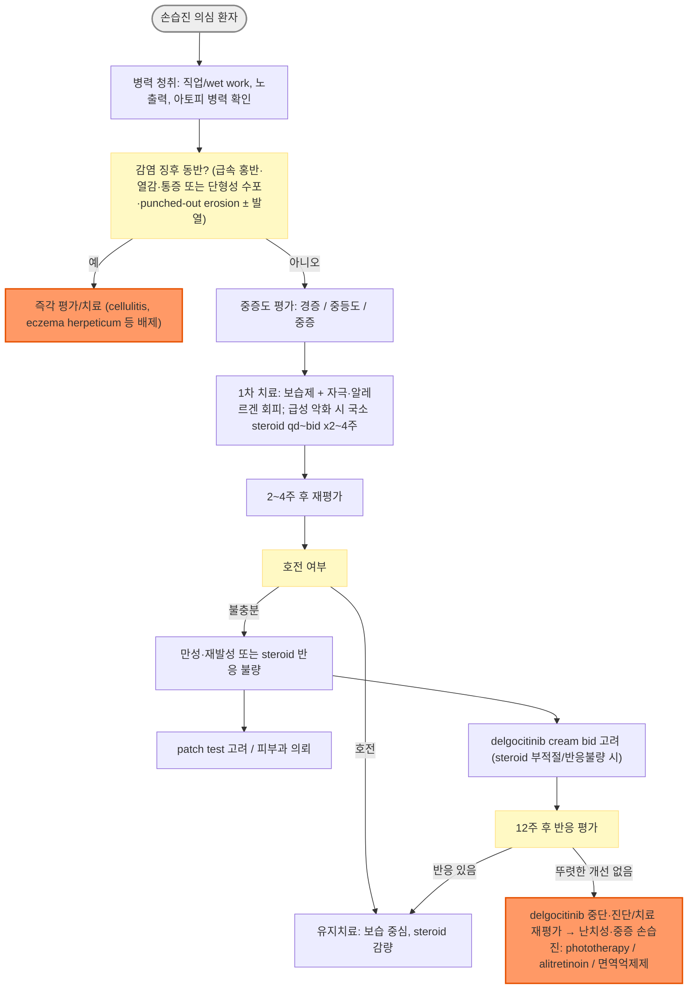
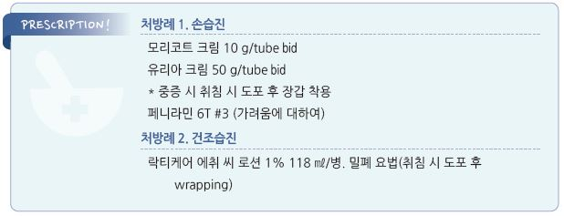

# 습진 Eczema

## <mark style="color:green;">일반 사항</mark>

* 홍반, 가려움, 진물, 딱지 등을 특징으로 하는 비전염성 염증성 피부 질환
* 습진(eczema)은 여러 염증성 피부질환을 포괄하는 임상적 표현으로, 아토피피부염(☞ p.862), 접촉피부염(☞ p.881), 건조습진, 지루피부염(☞ p.886) 등을 포함
* 아토피피부염, 접촉피부염, 지루피부염은 각각 해당 챕터 참조
* 증상
    * 원발 병소 : 홍반성 반점, 구진, 소수포, 반/판으로 융합, 진물, 갈라짐
    * 2차성 병소 : 심한 습진에서 긁음 또는 감염에 의해 삼출성 딱지 등이 발생
    * 만성 습진 : 반복적인 긁음에 의해 태선화
* 항생제 치료 : 임상적 세균감염의 증거가 없는 경우 항생제를 사용하지 않음
    * 단순한 진물·딱지만으로 세균감염을 진단하지 않으며, 농포·화농성 분비물, 빠르게 증가하는 홍반·열감·통증 등 감염 소견이 있을 때 국소 또는 경구 항생제 치료 고려 (☞ p.904)

<table><thead><tr><th width="110">아형</th><th width="180">호발 부위/특징</th><th width="200">주요 악화 인자</th><th>1차 치료</th></tr></thead><tbody><tr><td>손습진</td><td>손, 손가락, 손목</td><td>wet work, 세제·화학물질, 아토피 소인</td><td>보습 + 자극 회피; 급성 악화 시 국소 steroid</td></tr><tr><td>손톱습진</td><td>조갑 및 조갑 주위</td><td>반복적 손톱 손질·외상, 손습진 동반</td><td>고점도 보습제; 필요시 고역가 국소 steroid</td></tr><tr><td>건조습진</td><td>고령자 하지 신측, 겨울철</td><td>저습도, 잦은 비누 사용, 뜨거운 샤워</td><td>보습제, 자극 회피; 필요시 저\~중역가 국소 steroid</td></tr></tbody></table>

***

## ￭ 손습진 Hand eczema

## <mark style="color:green;">일반 사항</mark>

* 자극성·알레르기성 접촉피부염, 아토피 소인 등이 단독 또는 복합적으로 관여하는 다인성 염증성 피부질환
* 물, 세제, 화학물질 등에 대한 반복 노출은 흔한 유발·악화 인자 (☞ p.881)
* 정의 (Bauer 등, S2k Guideline, JDDG 2023) : 손습진(HE)이 3개월 이상 지속되거나 1년 내 2회 이상 재발하는 경우 만성 손습진(Chronic Hand Eczema, CHE)으로 정의
* 분류 : 원인 기전에 따라 자극성, 알레르기성, 아토피성 손습진 등으로 분류; 실제로는 여러 아형이 복합적으로 나타나는 경우가 흔함

### <mark style="color:orange;">위험 인자</mark>

* 다른 피부 질환 : 아토피피부염
* 직업/생활환경 : 주부, 요식업, 의료업, 미용업 등 반복적인 wet work 또는 세제·소독제·화학물질 노출
* 보호장갑의 장시간 착용, 땀·마찰 등도 악화 요인이 될 수 있음

## <mark style="color:green;">임상 양상</mark>

* 가려움, 통증
* 급성 : 손의 홍반, 부종, 진물, 수포
* 만성 : 각질, 갈라짐, 태선화
* 임상 phenotype : 수포성(vesicular; 흔히 한포진/pompholyx로 불림), 과각화성, 지문부(pulp) 습진 등 다양한 형태로 나타날 수 있음

## <mark style="color:green;">진단 및 감별진단</mark>

* 병력 : 직업, wet work, 세제·소독제·고무장갑, 화장품·접착제, 취미 및 반복 노출 여부 확인
* 만성·재발성 또는 원인이 불명확한 경우 알레르기 접촉피부염 평가를 위한 patch test 고려/피부과 의뢰
* 한쪽 손에만 각질성 병변이 지속되거나 경계가 뚜렷한 경우 tinea manuum 감별; 필요시 KOH 검사

### <mark style="color:orange;">감별 진단</mark>

<table><thead><tr><th width="220">질환</th><th>감별 포인트</th></tr></thead><tbody><tr><td>tinea manuum</td><td>대개 편측성, 경계가 뚜렷한 인설성 병변; 양측 tinea pedis와 한쪽 손 병변이 함께 나타나는 two feet–one hand pattern에 유의하여 발·발톱도 확인; 필요시 KOH 검사</td></tr><tr><td>psoriasis / palmoplantar psoriasis</td><td>경계가 뚜렷한 인설성·과각화성 판, 손톱 pitting 동반 가능, 팔꿈치·무릎 등 전형적 부위 동반 병변</td></tr><tr><td>scabies</td><td>야간 소양감 심화, 지문간·손목 굴측 등 호발 부위의 burrow 병변, 동거인 유사 증상</td></tr><tr><td>keratolysis exfoliativa</td><td>손바닥·손가락의 반복적인 표재성 박리와 collarette scale; 소양감·염증이 비교적 경미</td></tr><tr><td>palmoplantar pustulosis</td><td>손바닥·발바닥의 무균성 농포와 홍반·인설; 반복 재발</td></tr></tbody></table>

### <mark style="color:$danger;">🚩 Red Flags!</mark>

<mark style="color:$danger;">**즉각 평가/치료**</mark>

* 급속히 퍼지는 홍반·열감·심한 통증, 발열·전신증상 등 cellulitis 또는 중증 세균감염 의심
* 갑자기 발생한 다수의 단형성(monorphic) 소수포·농포 또는 punched-out erosion, 비례 이상으로 심한 통증 ± 발열·권태감 등 eczema herpeticum이 의심되는 경우

<mark style="color:$warning;">**조기 피부과 의뢰**</mark>

* 적절한 국소 치료에도 2\~4주 내 뚜렷한 호전이 없거나 반복 재발
* 중등도\~중증 만성 손습진
* 직업성 또는 알레르기 접촉피부염 의심, patch test가 필요한 경우

<mark style="color:$info;">**외래 추적**</mark> <mark style="color:$info;">- 즉각 위험 낮으나 호전 없으면 의뢰</mark>

* 치료 반응이 양호한 경증 병변은 보습·노출 회피를 유지하면서 재발 여부 추적

***



<p align="center"><strong>손습진 진단 및 치료 알고리듬</strong></p>

<p align="center"><em><mark style="color:$info;">Ref. Bauer A, et al. S2k Guideline: Diagnosis, prevention and therapy of hand eczema. JDDG. 2023</mark></em></p>

***

## <mark style="background-color:$warning;">치료</mark>

### <mark style="color:orange;">치료 방침</mark>

* 자극 및 알레르겐 회피, wet work 최소화
* 피부 보호 : 작업에 맞는 보호장갑 사용; 장시간 밀폐 장갑 착용을 피하고 필요시 보호장갑 안에 면장갑 착용
* 세척 후 즉시 보습제를 충분히 도포하고 하루 여러 차례 반복
* 백선 등 감염성 질환은 확인 후 치료 (☞ p.899, p.923)

### <mark style="color:orange;">외용 치료</mark>

#### 1차 치료

* 피부 보습제 : 1일 수회 도포; glycerol, petrolatum <mark style="color:blue;">\[바셀린]</mark>, urea <mark style="color:blue;">\[유리아]</mark> (☞ p.867)
* 중/고역가 국소 steroid : 급성 악화 시 단기간 qd\~bid ×2\~4주; mometasone <mark style="color:blue;">\[모리코트]</mark> (☞ p.1139)
    * 필요시 제한적으로 밀폐요법을 고려할 수 있으나 국소 steroid 흡수 및 부작용이 증가하므로 단기간 시행
    * 감염이 의심되는 병변에는 밀폐요법을 피함
* 급성 fissure·미란·진물 부위에서는 urea가 따가움·자극을 유발할 수 있으므로 petrolatum 등 자극이 적은 보습제를 우선 사용

#### Steroid-sparing / 국소 steroid 반응 불충분 시

* Calcineurin inhibitor : steroid-sparing 또는 유지치료로 고려; pimecrolimus <mark style="color:blue;">\[엘리델]</mark>, tacrolimus <mark style="color:blue;">\[프로토픽]</mark> (☞ p.1143)
* delgocitinib 20 ㎎/g cream(국소 pan-JAK 억제제) <mark style="color:blue;">\[앤줍고]</mark> : 국소 steroid 치료에 반응하지 않거나 국소 steroid가 적절하지 않은 성인의 중등도\~중증 만성 손습진에서 고려; 손·손목의 병변에 얇게 bid(약 12시간 간격) 도포
    * 2025년 9월 국내 허가, 국내 비급여로 출시(2026년 기준); 처방 전 최신 급여 기준 확인 필요
* delgocitinib은 12주 치료 후 임상적 개선 여부를 평가하며, 뚜렷한 개선이 없으면 중단하고 진단 및 치료 전략을 재평가; 반응이 있으면 임상 상태에 따라 지속 여부를 판단
* 2\~4주 후 초기 치료 반응 평가
    * 호전 : 국소 steroid 사용 빈도·역가를 줄이고 보습·자극 회피 중심의 유지치료
    * 불충분 : 진단, 순응도, 지속 노출을 재평가하고 patch test/피부과 의뢰 또는 치료 단계 상향 고려

### <mark style="color:orange;">난치성·중증 만성 손습진</mark>

* 대상 : 충분한 회피요법과 적절한 국소 치료에도 반응하지 않는 중등도\~중증 만성 병변
* phototherapy : NB-UVB, PUVA, UVA1 등; 가능한 기관으로 의뢰하여 고려
* alitretinoin(경구 retinoid) : potent 국소 steroid에 충분히 반응하지 않는 중증 만성 손습진에서 고려; 30 ㎎ qd <mark style="color:blue;">\[알리톡]</mark>, 주된 식사와 함께 복용; 이상반응에 따라 10 ㎎ qd로 감량, 보통 12\~24주 치료
    * 가임 여성은 강한 최기형성 위험 때문에 엄격한 임신 예방이 필요하며, 치료 전·중 및 종료 후 1개월간 효과적인 피임 시행
    * 필요시 지질, 간기능, 갑상선기능 등 모니터링
    * 과도한 햇빛·인공 UV 노출을 피하고 필요시 자외선 차단제 사용
* 경구 steroid : 급성 중증 flare에서 예외적으로 단기간 rescue therapy로 고려; 반복·장기 투여는 피함
* 면역억제제 : methotrexate <mark style="color:blue;">\[메토트렉세이트]</mark>, azathioprine, cyclosporine 등은 난치성 중증 환자에서 피부과 전문의 평가 후 제한적으로 고려 (☞ p.820)
* 다한증이 주요 악화 인자인 일부 환자에서는 botulinum toxin 또는 iontophoresis를 제한적으로 고려

***

## <mark style="color:purple;">처방례</mark>

> **처방례 1. 경증 자극성 손습진**
>
> ```
> 바세린 연고  1일 수회 도포
> ```
>
> _✽경증 자극·마찰성 손습진은 보습제만으로 호전되는 경우가 많음; wet work 최소화 및 보호장갑 병행 안내_

> **처방례 2. 중등도 급성 악화**
>
> ```
> 모리코트 연고 0.1%  1일 2회  국소 도포 (2주)
> 바세린 연고  1일 수회 도포
> ```
>
> _✽급성 악화 시 중등도 역가 steroid를 단기간(2\~4주) 사용 후 보습 중심 유지치료로 전환_

> **처방례 3. 만성 재발성 / 국소 스테로이드 반응 불량**
>
> ```
> 앤줍고 크림  손·손목 병변에 얇게  bid (약 12시간 간격)
> ```
>
> _✽국소 steroid에 반응하지 않거나 적절하지 않은 성인 중등도\~중증 만성 손습진에서 고려; 국내 비급여로 비용 부담 사전 안내 필요_

> **처방례 4. 중증 난치성 손습진**
>
> ```
> 알리톡 30 ㎎/캡슐  1캡슐 qd, 주된 식사와 함께 복용 (이상반응 시 10 ㎎으로 감량)
> ```
>
> _✽충분한 국소 steroid 치료(최소 4주)에도 반응 없는 중증 만성 손습진에서 고려; 가임 여성은 치료 전·중·종료 후 1개월간 효과적 피임 필수_

***

### <mark style="color:$success;">핵심 복약 지도</mark>

> **국소 스테로이드, 얼마나 오래 쓰나요?**
>
> * 급성 악화 시에만 중/고역가 스테로이드를 하루 1\~2회, 2\~4주 이내로 단기 사용합니다.
> * 장기간 임의로 연장 사용 시 피부 위축, 모세혈관 확장이 발생할 수 있습니다.
> * 증상이 가라앉으면 보습제 중심 유지치료로 전환하고 스테로이드는 최소 빈도로 줄입니다.

> **delgocitinib 크림(앤줍고), 이렇게 사용하세요**
>
> * 손과 손목의 깨끗하고 건조한 병변 부위에 얇게 도포하며, 하루 2회(약 12시간 간격)를 넘지 않습니다.
> * 국내 비급여로 비용 부담이 있을 수 있음을 처방 전 안내합니다.

> **alitretinoin 복용 시 임신 예방**
>
> * 주된 식사와 함께 하루 1회 복용합니다.
> * 강한 최기형성 위험이 있어 가임 여성은 치료 시작 전 임신 여부를 확인하고, 치료 전·중 및 종료 후 1개월간 효과적인 피임을 반드시 시행해야 합니다.
> * 정기적으로 지질, 간기능, 갑상선기능 검사를 시행합니다.
> * 과도한 햇빛이나 인공 자외선 노출을 피하고 필요시 자외선 차단제를 사용합니다.

> **언제 다시 병원을 방문해야 하나요?**
>
> * 적절한 치료에도 2\~4주 이내에 호전이 없거나 반복 재발하는 경우
> * 급속히 퍼지는 홍반·열감과 심한 통증, 발열 등이 동반되는 경우 — 즉시 내원
> * 광범위한 수포·미란과 통증이 동반되는 경우 — 즉시 내원

***

### <mark style="color:blue;">환자 안내서</mark>


**손습진, 반복되는 원인을 피하는 것이 치료의 시작입니다**

손습진은 물, 세제, 화학물질 등에 반복적으로 노출되면서 피부 장벽이 약해져 생기는 염증성 피부 질환입니다. 보습과 자극 회피만으로도 상당 부분 호전될 수 있습니다.


#### <mark style="color:$primary;">왜 손습진이 생기나요?</mark>

* 물, 세제, 소독제 등에 자주 노출되는 직업(주부, 요식업, 의료업, 미용업 등)에서 흔히 발생합니다.
* 원래 아토피 피부를 가진 분들은 손습진이 더 잘 생기고 잘 낫지 않을 수 있습니다.

#### <mark style="color:$primary;">일상생활에서 어떻게 관리하나요?</mark>

* **물, 세제와의 접촉을 줄이십시오.** 설거지·청소 시 필요하면 면장갑 위에 보호장갑을 착용하고, 장시간 연속 착용하거나 장갑 안에 땀이 차는 것을 피하십시오.
* **손을 씻은 직후 보습제를 충분히 바르십시오.** 하루 여러 차례, 특히 물일을 한 뒤에는 반드시 발라주세요.
* 손 세정·소독을 자주 해야 하는 경우 향료가 적은 제품을 선택하고, 손이 마른 뒤 보습제를 충분히 사용하십시오. 비누 세척과 알코올 손소독을 불필요하게 연속해서 반복하지 마십시오.
* **반지는 물일을 할 때 빼두십시오.** 반지 밑에 세제·물이 고여 자극을 악화시킬 수 있습니다.

#### <mark style="color:$primary;">약은 어떻게 써야 하나요?</mark>

* 스테로이드 연고는 의사가 안내한 기간(보통 2\~4주 이내)만 사용하고, 증상이 좋아지면 보습제 위주로 바꿉니다.
* 새로운 치료제(델고시티닙 크림 등)를 처방받은 경우, 정해진 부위에만 얇게 바르고 사용법을 지켜주세요.

#### <mark style="color:$primary;">이럴 때는 즉시 병원을 방문하세요</mark>

* 손이 갑자기 붉어지고 뜨거워지며 심하게 아픈 경우
* 넓은 부위에 물집이 생기고 통증이 심한 경우
* 열이 나면서 증상이 빠르게 나빠지는 경우

***

## ￭ 손톱습진 Nail eczema

## <mark style="color:green;">원인</mark>

* 손습진과 같은 자극·알레르기 요인이 관여하며, 반복적인 손톱 손질과 외상도 악화 요인

## <mark style="color:green;">임상 양상</mark>

* nail fold 염증성 변화가 흔함
* transverse ridge, 색조 변화, 조갑 박리증
* 많이 사용하는 손에 심할 수 있음

## <mark style="color:green;">진단 및 감별진단</mark>

* 조갑진균증, nail psoriasis, 만성 조갑주위염, 반복 외상에 의한 조갑 변화를 감별
* 조갑박리, 과각화, 변색 등 조갑진균증이 의심되는 경우 KOH 검사 등 진균검사 고려

### <mark style="color:$danger;">🚩 Red Flags!</mark>

<mark style="color:$danger;">**즉각 평가/치료**</mark>

* 조갑 주위 급성 화농성 감염(발적·부종·통증·화농) 의심 — 배농 및 항생제 치료 고려

<mark style="color:$warning;">**조기 피부과 의뢰**</mark>

* 진균검사 음성인데도 병변이 지속되거나 진단이 불확실한 경우
* nail psoriasis 등 다른 조갑 질환과의 감별이 어려운 경우

<mark style="color:$info;">**외래 추적**</mark> <mark style="color:$info;">- 즉각 위험 낮으나 호전 없으면 의뢰</mark>

* 보습·자극 회피에도 수 주 내 호전이 없는 경증 병변

## <mark style="background-color:$warning;">치료</mark>

* 손습진의 원인 회피 및 피부보호 원칙을 동일하게 적용
* 손톱 손질, 손톱에 대한 충격 및 반복 자극을 피함
* 점도가 높은 보습제 사용 <mark style="color:blue;">\[바셀린]</mark>
* 중증도와 병변 위치에 따라 국소 steroid 역가 선택 : clobetasol <mark style="color:blue;">\[더모베이트]</mark> (☞ p.1139); 고역가 steroid는 병변에 국한하여 단기간 사용하며 조갑 주위 피부 위축에 주의
* 조갑주위 감염은 임상적으로 감염이 확인되거나 의심될 때 적절히 치료

***

## ￭ 건조습진 Asteatotic eczema, Xerotic eczema

## <mark style="color:green;">일반 사항</mark>

* 건조한 피부에서 발생하는 경미한 염증성 피부염
* 주로 겨울철(동계 소양증 winter itch), 고령자의 하지 신측에 흔함
* 증상 : 가려움, 건조, 갈라짐, 각질
* 특징적 소견 : eczema craquelé — 건조한 피부에 얕은 균열이 그물망 또는 마른 논바닥처럼 나타남

### <mark style="color:$danger;">🚩 Red Flags!</mark>

<mark style="color:$danger;">**즉각 평가/치료**</mark>

* 광범위한 균열·출혈 부위에 급속 홍반·열감·삼출 등 이차 세균감염이 의심되는 경우

<mark style="color:$warning;">**조기 의뢰**</mark>

* 저역가 국소 steroid 및 보습에도 수 주간 호전 없는 광범위 병변
* 갑상선기능저하증, 신부전, 영양결핍 등 기저 질환 동반이 의심되는 경우; 광범위하거나 설명되지 않는 심한 피부건조가 지속되면 임상 소견에 따라 TSH, 신기능 등 혈액검사 고려

<mark style="color:$info;">**외래 추적**</mark> <mark style="color:$info;">- 즉각 위험 낮으나 호전 없으면 의뢰</mark>

* 치료 반응이 양호한 경증 병변은 보습 유지하며 계절적 재발 추적

## <mark style="background-color:$warning;">치료</mark>

* 피부 자극 및 환부에 대한 비누·강한 세정제 사용을 피함
* 미지근한 물로 짧게 샤워
* 목욕/샤워 후 가능한 한 즉시 충분한 피부 보습제 도포 (☞ p.867)
* 적정 습도 유지(40\~50%)
* 홍반·염증·소양이 뚜렷한 경우 저\~중역가 국소 steroid를 단기간 사용; hydrocortisone <mark style="color:blue;">\[락티케어 HC]</mark>
    * 밀폐요법은 routine으로 시행하지 않으며, 필요한 경우 부작용과 감염 여부를 고려하여 제한적으로 사용
* 필요시 가려움증 치료 (☞ p.857)

***

### <mark style="color:red;">질병코드 (KCD)</mark>

L30.8 기타 명시된 피부염

L60.8 기타 손발톱장애

L85.3 피부건조증


