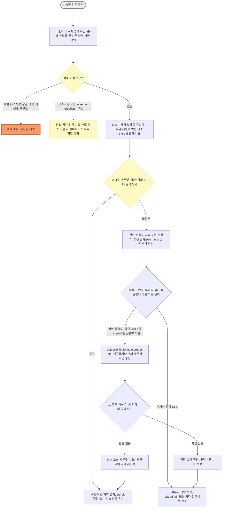

# 습진 Eczema

## <mark style="color:green;">일반 사항</mark>

* 홍반, 가려움, 진물, 딱지 등을 특징으로 하는 비전염성 염증성 피부 질환
* 습진(eczema)은 여러 염증성 피부질환을 포괄하는 임상적 표현으로, 아토피피부염(☞ p.862), 접촉피부염(☞ p.881), 건조습진, 지루피부염(☞ p.886) 등을 포함
* 아토피피부염, 접촉피부염, 지루피부염은 각각 해당 챕터 참조
* 증상
  * 원발 병소 : 홍반성 반점, 구진, 소수포; 병변이 융합하여 판을 형성할 수 있음
  * 2차성 병소 : 수포 파열·긁음에 의한 미란, 진물, 딱지, 인설, 균열; 딱지는 감염 없이도 발생할 수 있음
  * 만성 습진 : 반복적인 긁음에 의해 태선화
* 항생제 치료 : 임상적 세균감염의 증거가 없는 경우 항생제를 사용하지 않음
  * 단순한 진물·딱지만으로 세균감염을 진단하지 않으며, 농포·화농성 분비물, 빠르게 증가하는 홍반·열감·통증 등 감염 소견이 있을 때 감염의 범위·중증도에 따라 치료를 결정함 (☞ p.904)
  * 전신증상 없는 경미한 이차감염에서는 항생제를 일률적으로 추가하지 않음; 국한된 명확한 감염은 국소 항생제 단기 사용, 광범위·중증 감염이나 전신증상이 있으면 경구/정맥 항생제 및 의뢰를 고려함
  * 세균 배양은 초기 경증 병변에서 일률적으로 시행하지 않으며, 감염 치료에 반응하지 않거나 감염이 반복되는 경우 고려함

<table><thead><tr><th width="110">아형</th><th width="180">호발 부위/특징</th><th width="200">주요 악화 인자</th><th>1차 치료</th></tr></thead><tbody><tr><td>손습진</td><td>손, 손가락, 손목</td><td>wet work, 세제·화학물질, 아토피 소인</td><td>보습 + 자극 회피; 급성 악화 시 국소 steroid</td></tr><tr><td>손톱습진<br>(조갑주위 피부염·조갑 변화)</td><td>조갑 및 조갑 주위</td><td>반복적 손톱 손질·외상, 손습진 동반</td><td>보습·자극 회피; 조갑주위 피부에는 중역가 국소 steroid 단기 사용을 고려</td></tr><tr><td>건조습진</td><td>고령자 하지 신측, 겨울철</td><td>저습도, 잦은 비누 사용, 뜨거운 샤워</td><td>보습제, 자극 회피; 필요시 저\~중역가 국소 steroid</td></tr></tbody></table>

***

## ￭ 손습진 Hand eczema

## <mark style="color:green;">일반 사항</mark>

* 자극성·알레르기성 접촉피부염, 아토피 소인 등이 단독 또는 복합적으로 관여하는 다인성 염증성 피부질환
* 물, 세제, 화학물질 등에 대한 반복 노출은 흔한 유발·악화 인자 (☞ p.881)
* 정의 (국내 합의지침 2020, 2021년 출판) : 손습진(HE)이 3개월 이상 지속되거나 1년 내 2회 이상 재발하는 경우 만성 손습진(Chronic Hand Eczema, CHE)으로 정의
* 분류 : 원인 기전에 따라 자극성, 알레르기성, 아토피성 손습진 등으로 분류; 실제로는 여러 아형이 복합적으로 나타나는 경우가 흔함

### <mark style="color:orange;">위험 인자</mark>

* 다른 피부 질환 : 아토피피부염
* 직업/생활환경 : 주부, 요식업, 의료업, 미용업 등 반복적인 wet work 또는 세제·소독제·화학물질 노출
* 보호장갑의 장시간 착용, 땀·마찰 등도 악화 요인이 될 수 있음

## <mark style="color:green;">임상 양상</mark>

* 가려움, 통증
* 급성 : 손의 홍반, 부종, 진물, 수포
* 만성 : 각질, 갈라짐, 태선화
* 임상 phenotype : 수포성(vesicular; 흔히 한포진/pompholyx로 불림), 과각화성, 손끝(pulp) 습진 등 다양한 형태로 나타날 수 있음

## <mark style="color:green;">진단 및 감별진단</mark>

* 병력 : 직업, wet work, 세제·소독제·고무장갑, 화장품·접착제, 취미 및 반복 노출 여부 확인
* 알레르기 접촉피부염이 의심되거나 3개월 이상 지속되는 손습진, 표준 치료에 불충분하게 반응하는 경우 patch test(첩포검사)를 권고/피부과 의뢰
  * 기본 항원군과 직업·생활 노출에 맞는 추가 항원군을 선택하며, 양성 반응과 실제 노출의 임상적 관련성을 확인함; 음성 결과만으로 알레르기 접촉피부염을 완전히 배제하지 않음
  * 피부단자검사·특이 IgE 검사는 첩포검사를 대체하지 않음; 식품·단백질 접촉 직후 두드러기성 반응이 있으면 즉시형 알레르기를 별도로 평가함
* 한쪽 손에만 각질성 병변이 지속되거나 경계가 뚜렷한 경우 tinea manuum 감별; 필요시 KOH 검사

### <mark style="color:orange;">감별 진단</mark>

<table><thead><tr><th width="220">질환</th><th>감별 포인트</th></tr></thead><tbody><tr><td>tinea manuum</td><td>대개 편측성, 경계가 뚜렷한 인설성 병변; 양측 tinea pedis와 한쪽 손 병변이 함께 나타나는 two feet–one hand pattern에 유의하여 발·발톱도 확인; 필요시 KOH 검사</td></tr><tr><td>psoriasis / palmoplantar psoriasis</td><td>경계가 뚜렷한 인설성·과각화성 판, 손톱 pitting 동반 가능, 팔꿈치·무릎 등 전형적 부위 동반 병변</td></tr><tr><td>scabies</td><td>야간 소양감 심화, 손가락 사이·손목 굴측 등 호발 부위의 burrow 병변, 동거인 유사 증상</td></tr><tr><td>keratolysis exfoliativa</td><td>손바닥·손가락의 반복적인 표재성 박리와 collarette scale; 소양감·염증이 비교적 경미</td></tr><tr><td>palmoplantar pustulosis</td><td>손바닥·발바닥의 무균성 농포와 홍반·인설; 반복 재발</td></tr></tbody></table>

### <mark style="color:$danger;">🚩 Red Flags!</mark>

<mark style="color:$danger;">**즉각 조치**</mark>

* 저혈압·의식 변화 등 패혈증 의심, 빠르게 진행하는 병변에 비례하지 않는 극심한 통증·괴사 등 괴사성 연조직감염 의심 → 응급실 의뢰
* eczema herpeticum 의심에 심한 전신증상·급속 확산·안구 증상이 동반됨 → 즉시 응급 평가; 눈 주위 병변은 당일 안과 평가도 필요함

<mark style="color:$warning;">**당일 평가**</mark>

* 퍼지는 홍반·열감·압통 등 cellulitis(연조직염) 의심; 발열이 없어도 당일 평가함
* 갑자기 발생한 다수의 단형성(monomorphic) 소수포 또는 punched-out erosion, 통증 ± 발열·권태감 등 eczema herpeticum 의심 → 당일 피부과/응급 평가 및 신속한 전신 항바이러스 치료; 확진검사 결과를 기다리며 치료를 지연하지 않음

<mark style="color:$info;">**조기 피부과 의뢰 및 외래 추적**</mark>

* 적절한 국소 치료에도 2\~4주 내 뚜렷한 호전이 없거나 반복 재발: 진단·지속 노출·치료 순응도를 재평가하고 피부과 의뢰
* 중등도\~중증 만성 손습진, 직업성 또는 알레르기 접촉피부염 의심, patch test가 필요한 경우 조기 의뢰
* 치료 반응이 양호한 경증 병변은 보습·노출 회피를 유지하면서 재발 여부 추적

***


```mermaid
graph TD
    Start(["손습진 의심 환자"]) ---> Hx["노출력·아토피 병력 확인; 손·발·손발톱 및 다른 피부 병변 확인"]
    Hx ---> Infection{"감염 위험 소견?"}
    Infection --->|"패혈증·괴사성 감염, 중증 전신/안구 증상"| Emergency["즉각 조치: 응급실 의뢰"]
    Infection --->|"연조직염 또는 eczema herpeticum 의심"| SameDay["당일 평가·감염 치료; 헤르페스 의심 시 항바이러스 치료 지연 금지"]
    Infection --->|"없음"| FirstLine["보습 + 자극·알레르겐 회피 + 부위·제형에 맞는 국소 steroid 단기 사용"]
    FirstLine ---> Reassess{"2~4주 후 반응 평가; 악화 시 더 일찍 평가"}
    Reassess --->|"호전"| Maintain["보습·노출 회피 유지; steroid 중단 또는 최소 빈도 유지"]
    Reassess --->|"불충분"| Review["진단·순응도·지속 노출 재평가; 백선 검사/patch test 및 피부과 의뢰"]
    Review ---> Options{"중증도·만성 경과 및 허가 적응증에 따른 치료 선택"}
    Options --->|"성인 중등도~중증 CHE; 국소 steroid 불충분/부적절"| Delgo["delgocitinib 20 mg/g cream bid; 깨끗하거나 거의 깨끗해지면 중단"]
    Options --->|"난치성·중증 CHE"| Specialist["피부과: 광선치료, alitretinoin 또는 기타 전신치료 검토"]
    Delgo ---> Response{"12주 후 개선 여부; 악화 시 더 일찍 평가"}
    Response --->|"개선 없음"| Stop["중단 고려·진단 재평가 및 치료 변경"]
    Stop ---> Specialist
    Response --->|"반응 있음"| Control["병변 소실 시 중단; 재발 시 필요에 따라 재시작"]
    Control ---> Maintain

    style Start fill:#eeeeee,stroke:#888888,stroke-width:2px
    style Infection fill:#fff9c4,stroke:#ffe082
    style Reassess fill:#fff9c4,stroke:#ffe082
    style Emergency fill:#f96,stroke:#e65100,stroke-width:2px
    style SameDay fill:#fff9c4,stroke:#ffe082
```

<p align="center"><strong>손습진 진단 및 치료 알고리듬</strong></p>

<p align="center"><em><mark style="color:$info;">Ref. 국내 만성 손습진 합의지침(2020; Ann Dermatol. 2021), Bauer A, et al. S2k guideline. JDDG. 2023 및 delgocitinib 허가자료를 반영하여 재구성; delgocitinib 실패가 광선치료·alitretinoin 시작의 필수 조건은 아님</mark></em></p>

***

## <mark style="background-color:$warning;">치료</mark>

### <mark style="color:orange;">치료 방침</mark>

* 자극 및 알레르겐 회피, wet work 최소화
* 피부 보호 : 작업에 맞는 보호장갑 사용; 고무 첨가제 알레르기가 확인되면 해당 첨가제가 없는 장갑을 선택함; 장시간 밀폐 장갑 착용을 피하고 필요시 보호장갑 안에 면장갑 착용
* 세척 후 즉시 보습제를 충분히 도포하고 하루 여러 차례 반복
* 백선 등 감염성 질환은 확인 후 치료 (☞ p.899, p.923)

### <mark style="color:orange;">외용 치료</mark>

#### 1차 치료

* 피부 보습제 : 1일 수회 도포; glycerol, petrolatum <mark style="color:blue;">\[바셀린]</mark>, urea <mark style="color:blue;">\[유리아]</mark> (☞ p.867)
* 국소 steroid : 손바닥의 두꺼운 병변은 중\~고역가, 손등·손가락 사이의 얇은 피부는 더 낮은 역가를 고려함; 제품별 허가 용법에 따라 qd\~bid 단기 사용하고 2\~4주 내 재평가 (☞ p.1139)
  * mometasone furoate 0.1% 연고 <mark style="color:blue;">\[모리코트]</mark> : **1일 1회** 얇게 도포; 연고는 고역가에 해당하므로 크림·로션과 역가를 동일하게 간주하지 않음
  * 호전되면 중단하거나 사용 빈도를 줄임; 반복 재발하는 일부 환자는 진료 하에 간헐적 유지치료를 고려함
  * 소아·임신부는 부위·연령·병변 면적을 고려하여 최소 유효 역가·용량·기간을 선택함
  * 필요시 제한적으로 밀폐요법을 고려할 수 있으나 국소 steroid 흡수 및 부작용이 증가하므로 단기간 시행
  * 감염이 의심되는 병변에는 밀폐요법을 피함
* 급성 fissure·미란·진물 부위에서는 urea가 따가움·자극을 유발할 수 있으므로 petrolatum 등 자극이 적은 보습제를 우선 사용

#### Steroid-sparing / 국소 steroid 반응 불충분 시

* Calcineurin inhibitor : steroid-sparing 또는 유지치료로 고려; tacrolimus <mark style="color:blue;">\[프로토픽]</mark>, pimecrolimus <mark style="color:blue;">\[엘리델]</mark> (☞ p.1143)
  * 아토피피부염 적응증·연령·농도별 허가범위를 확인함; **비아토피성 손습진에 사용하면 허가 외 사용**
  * 손등 병변에서 더 유용할 수 있으며 두꺼운 손바닥 병변에서는 침투·효과가 제한적임; pimecrolimus의 손습진 치료 근거는 일관되지 않음
* delgocitinib 20 ㎎/g cream(국소 pan-JAK 억제제) <mark style="color:blue;">\[앤줍고]</mark> : 국소 steroid 치료에 반응하지 않거나 국소 steroid가 적절하지 않은 성인의 중등도\~중증 만성 손습진에서 고려; 손·손목의 병변에 얇게 bid(약 12시간 간격) 도포
  * 피부가 깨끗하거나 거의 깨끗해질 때까지 사용하고, 호전 후 중단하였다가 재발 시 필요에 따라 재시작함; 12주 치료 후 개선이 관찰되지 않으면 중단을 고려하고 진단·치료를 재평가함
  * 손·손목에만 사용하고 눈·입·점막 접촉을 피함; 같은 부위에 다른 치료용 외용제를 동시에 도포하지 않음. 도포 직전·직후 보습제 사용은 피함 (EMA 허가자료: 도포 전후 2시간 이내 보습제 병용은 연구되지 않음)
  * 18세 미만의 안전성·유효성은 확립되지 않음; 임신 중에는 사용을 피하는 것이 바람직함. 수유 중에는 도포한 손·손목이 유두 또는 영아 피부에 직접 닿지 않도록 함 (EMA 허가자료)
  * 도포 부위의 새로운 결절·치유되지 않는 병변 등을 확인하고 정기적으로 피부 상태를 평가함 (EMA 허가자료)
  * 국내 급여: 2026년 9월 3일 약제급여평가위원회에서 급여 적정성이 인정됨. **심의 통과와 실제 급여 시행은 별개**이므로, 처방 시 최신 급여 고시·시행일과 비용을 확인함
* 2\~4주 후 초기 치료 반응 평가
  * 호전 : 국소 steroid 사용 빈도·역가를 줄이고 보습·자극 회피 중심의 유지치료
  * 불충분 : 진단, 순응도, 지속 노출을 재평가하고 patch test/피부과 의뢰 또는 치료 단계 상향 고려

### <mark style="color:orange;">난치성·중증 만성 손습진</mark>

* 대상 : 충분한 회피요법과 적절한 국소 치료에도 반응하지 않는 중등도\~중증 만성 병변
* phototherapy : NB-UVB, 308-nm excimer 등; 가능한 기관으로 의뢰하여 고려. 국외 지침에는 PUVA·UVA1도 포함되지만 국내에서는 장비·광감작제 이용 가능성을 확인함
* alitretinoin(경구 retinoid) : 최소 4주간의 강력한 국소 steroid 치료에도 반응하지 않는 성인의 재발성 만성 중증 손습진에서 고려; 30 ㎎ qd <mark style="color:blue;">\[알리톡]</mark>, 주된 식사와 함께 복용; 이상반응에 따라 10 ㎎ qd로 감량, 보통 12\~24주 치료
  * 가임 여성은 강한 최기형성 위험 때문에 임신 예방 프로그램을 준수함; **치료 시작 1개월 전부터 치료 중 및 종료 후 1개월까지** 효과적인 피임을 유지하고, 치료 전·치료 중 매월·종료 5주 후 임신검사를 시행함 (국내 알리톡 임신 예방 프로그램)
  * 시작 전 및 치료 중 공복 지질·간기능·갑상선기능을 정기적으로 확인함; 12주 후에도 중증 병변이 지속되면 중단/변경을 고려하고, 깨끗하거나 거의 깨끗해지면 치료를 종료함
  * 임신·수유, 간기능부전·중증 신부전, 조절되지 않는 고지혈증·갑상선기능저하증 등 금기사항 확인; tetracycline계 항생제와 병용하지 않으며 비타민 A 보충제·다른 retinoid 병용을 피함
  * 치료 중 및 종료 후 1개월간 헌혈 금지; 두통·오심·시력장애가 함께 발생하면 두개내압 상승 가능성을 고려하여 중단 후 즉시 평가함
  * 과도한 햇빛·인공 UV 노출을 피하고 필요시 자외선 차단제 사용
* 경구 steroid : 급성 중증 flare에서 예외적으로 단기간 rescue therapy로 고려; 반복·장기 투여는 피함
* 면역억제제 : methotrexate <mark style="color:blue;">\[메토트렉세이트]</mark>, azathioprine, cyclosporine 등은 난치성 중증 환자에서 피부과 전문의 평가 후 제한적으로 고려 (☞ p.820)
  * methotrexate·azathioprine의 손습진 치료는 허가 외 사용; cyclosporine도 아토피피부염 등 별도 허가 적응증에 해당하지 않는 손습진에서는 허가 외 사용임. 감염·혈압·신기능·간기능·혈구 수 등 약제별 모니터링이 필요함
* 다한증이 주요 악화 인자인 일부 환자에서는 iontophoresis 등을 제한적으로 고려; botulinum toxin은 손바닥 다한증/손습진에 대한 허가 외 사용 및 제한적인 근거를 설명한 뒤 전문의가 판단함

***

## <mark style="color:purple;">처방례</mark>

> **처방례 1. 경증 자극성 손습진**
>
> ```
> 바셀린  1일 수회 도포
> ```
>
> _✽경증 자극·마찰성 손습진은 보습제만으로 호전되는 경우가 많음; wet work 최소화 및 보호장갑 병행 안내_

> **처방례 2. 중등도 급성 악화**
>
> ```
> 모리코트 연고 0.1%  1일 1회  병변에 얇게 도포 (2주 후 재평가)
> 바셀린  1일 수회 도포
> ```
>
> _✽성인의 두꺼운 손바닥 병변에 고역가 steroid 연고를 단기간 사용하고, 호전 시 중단 또는 빈도를 줄임; 손등·손가락 사이에는 부위에 맞는 더 낮은 역가를 고려함_

> **처방례 3. 성인 중등도\~중증 만성 손습진 / 국소 steroid 불충분·부적절**
>
> ```
> 앤줍고 크림 20 ㎎/g (2%)  손·손목 병변에 얇게  bid (약 12시간 간격)
> ```
>
> _✽국소 steroid에 반응하지 않거나 적절하지 않은 성인 중등도\~중증 만성 손습진에서 고려; 깨끗하거나 거의 깨끗해지면 중단하고 재발 시 필요에 따라 재시작; 12주 후 개선이 없으면 중단 고려; 최신 급여 시행 여부와 비용 확인_

> **처방례 4. 중증 난치성 손습진**
>
> ```
> 알리톡 30 ㎎/캡슐  1캡슐 qd, 주된 식사와 함께 복용 (이상반응 시 10 ㎎으로 감량)
> ```
>
> _✽충분한 국소 steroid 치료(최소 4주)에도 반응 없는 중증 만성 손습진에서 고려; 가임 여성은 치료 시작 1개월 전부터 치료 중 및 종료 후 1개월까지 피임·임신 예방 프로그램 준수_

***

### <mark style="color:$success;">핵심 복약 지도</mark>

> **국소 스테로이드, 얼마나 오래 쓰나요?**
>
> * 급성 악화 시 부위와 제형에 맞는 스테로이드를 정해진 횟수로 단기간 사용합니다. 모리코트 연고는 하루 1회입니다. 보통 2\~4주 안에 효과와 부작용을 재평가합니다.
> * 장기간 임의로 연장 사용 시 피부 위축, 모세혈관 확장이 발생할 수 있습니다.
> * 증상이 가라앉으면 보습제 중심 유지치료로 전환하고 스테로이드는 최소 빈도로 줄입니다.

> **delgocitinib 크림(앤줍고), 이렇게 사용하세요**
>
> * 손과 손목의 깨끗하고 건조한 병변 부위에 얇게 도포하며, 하루 2회(약 12시간 간격)를 넘지 않습니다.
> * 병변이 깨끗하거나 거의 깨끗해지면 중단하고, 재발 시 의사의 안내에 따라 다시 사용합니다.
> * 도포 직전·직후 다른 연고나 보습제를 겹쳐 바르지 말고, 사용 간격은 처방 지시를 따릅니다.
> * 눈·입·점막에 닿지 않게 하며, 수유 중에는 도포한 손이 유두나 아기 피부에 직접 닿지 않도록 합니다.
> * 처방 전에 현재 보험 적용 여부와 본인 부담 비용을 확인합니다.

> **alitretinoin 복용 시 임신 예방**
>
> * 주된 식사와 함께 하루 1회 복용합니다.
> * 태아 기형을 일으킬 위험이 높으므로, 임신 가능한 여성은 치료 시작 **1개월 전부터 복용 중 및 중단 후 1개월까지** 효과적인 피임을 유지해야 합니다. 치료 전과 복용 중 매월, 복용 중단 5주 후에 임신검사를 받습니다.
> * 임신이 의심되면 즉시 복용을 중단하고 의료진에게 알립니다. 임신 중·수유 중에는 복용하지 않습니다.
> * 복용 중 및 중단 후 1개월간 헌혈하지 않으며, 다른 사람에게 약을 주지 않습니다.
> * 정기적으로 지질, 간기능, 갑상선기능 검사를 시행합니다.
> * 과도한 햇빛이나 인공 자외선 노출을 피하고 필요시 자외선 차단제를 사용합니다.

> **언제 다시 병원을 방문해야 하나요?**
>
> * 적절한 치료에도 2\~4주 이내에 호전이 없거나 반복 재발하는 경우
> * 급속히 퍼지는 홍반·열감과 심한 통증, 발열 등이 동반되는 경우 - 즉시 내원
> * 광범위한 수포·미란과 통증이 동반되는 경우 - 즉시 내원

***

## <mark style="color:blue;">환자 안내서</mark>


**손습진, 반복되는 원인을 피하는 것이 치료의 시작입니다**

손습진은 물·세제 등에 의한 자극, 특정 물질에 대한 알레르기, 아토피 소인 등이 함께 작용할 수 있는 염증성 피부 질환입니다. 보습과 자극 회피만으로도 상당 부분 호전될 수 있습니다.


#### <mark style="color:$primary;">왜 손습진이 생기나요?</mark>

* 물, 세제, 소독제 등에 자주 노출되는 직업(주부, 요식업, 의료업, 미용업 등)에서 흔히 발생합니다.
* 원래 아토피 피부를 가진 분들은 손습진이 더 잘 생기고 잘 낫지 않을 수 있습니다.

#### <mark style="color:$primary;">일상생활에서 어떻게 관리하나요?</mark>

* **물, 세제와의 접촉을 줄이십시오.** 설거지·청소 시 필요하면 면장갑 위에 보호장갑을 착용하고, 장시간 연속 착용하거나 장갑 안에 땀이 차는 것을 피하십시오.
* **손을 씻은 직후 보습제를 충분히 바르십시오.** 하루 여러 차례, 특히 물일을 한 뒤에는 반드시 발라주세요.
* 손 세정·소독을 자주 해야 하는 경우 무향 제품을 선택하고, 손이 마른 뒤 보습제를 충분히 사용하십시오. 비누 세척과 알코올 손소독을 불필요하게 연속해서 반복하지 마십시오.
* **반지는 물일을 할 때 빼두십시오.** 반지 밑에 세제·물이 고여 자극을 악화시킬 수 있습니다.

#### <mark style="color:$primary;">약은 어떻게 써야 하나요?</mark>

* 스테로이드 연고는 의사가 안내한 기간(보통 2\~4주 이내)만 사용하고, 증상이 좋아지면 보습제 위주로 바꿉니다.
* 새로운 치료제(델고시티닙 크림 등)를 처방받은 경우, 정해진 부위에만 얇게 바르고 사용법을 지켜주세요.

#### <mark style="color:$primary;">이럴 때는 즉시 병원을 방문하세요</mark>

* 손이 갑자기 붉어지고 뜨거워지며 심하게 아픈 경우
* 넓은 부위에 물집이 생기고 통증이 심한 경우
* 열이 나면서 증상이 빠르게 나빠지는 경우

***

## ￭ 손톱습진 Nail eczema

## <mark style="color:green;">원인</mark>

* 손톱습진은 독립적인 원인 분류라기보다 습진에 동반된 조갑주위 피부염과 조갑 변화를 뜻함; 자극·알레르기 노출로 인한 만성 조갑주위염과 겹칠 수 있음
* 손습진과 같은 자극·알레르기 요인이 관여하며, 반복적인 손톱 손질·큐티클 제거·젤/인조손톱 제품과 외상도 악화 요인

## <mark style="color:green;">임상 양상</mark>

* nail fold 염증성 변화가 흔함
* transverse ridge, 색조 변화, 조갑 박리증
* 많이 사용하는 손에 심할 수 있음
* 피부 염증이 호전되어도 기존 조갑 변화가 새 손톱 성장으로 회복되기까지 수개월이 걸릴 수 있음

## <mark style="color:green;">진단 및 감별진단</mark>

* 조갑진균증, nail psoriasis, 만성 조갑주위염, 반복 외상에 의한 조갑 변화를 감별
* 조갑박리, 과각화, 변색 등 조갑진균증이 의심되는 경우 KOH 검사 등 진균검사 고려

### <mark style="color:$danger;">🚩 Red Flags!</mark>

<mark style="color:$danger;">**즉각 조치**</mark>

* 급속 확산, 심한 전신증상, 괴사 또는 병변에 비례하지 않는 심한 통증 등 중증 감염 의심 → 응급실 의뢰

<mark style="color:$warning;">**당일 평가**</mark>

* 조갑 주위 급성 화농성 감염·농양 의심: 농양이 있으면 배농을 고려함; 연조직염·전신증상·면역저하 등 동반 시 항생제 치료 여부를 결정함
* 손끝의 군집성 수포와 통증은 herpetic whitlow(헤르페스성 손끝염)를 감별함; 의심 시 절개·배농하지 않음

<mark style="color:$info;">**조기 피부과 의뢰 및 외래 추적**</mark>

* 진균검사 음성인데도 병변이 지속되거나 진단이 불확실함, nail psoriasis 등 다른 조갑 질환과 감별이 어려움 → 조기 의뢰
* 한 손가락의 지속적인 비대칭 조갑주위 병변·궤양·출혈·결절 또는 새로운 색소띠는 종양 등 다른 원인을 평가함
* 경증 병변은 수 주 후 조갑주위 피부의 호전 여부를 확인함; 손톱 모양의 회복만으로 단기 치료 실패를 판단하지 않음

## <mark style="background-color:$warning;">치료</mark>

* 손습진의 원인 회피 및 피부보호 원칙을 동일하게 적용
* 손톱 손질, 손톱에 대한 충격 및 반복 자극을 피함
* 점도가 높은 보습제 사용 <mark style="color:blue;">\[바셀린]</mark>
* 조갑주위 피부 염증은 중역가 국소 steroid를 단기간 사용하고 2\~4주 내 재평가함 (☞ p.1139)
* clobetasol <mark style="color:blue;">\[더모베이트]</mark>는 **초고역가**로, 두꺼운 난치 병변 등에 제한하여 짧게 사용함; 얇은 조갑주위 피부에 기본 치료로 일률적으로 적용하지 않으며 피부 위축에 주의함
* 조갑주위 감염은 임상적으로 감염이 확인되거나 의심될 때 적절히 치료; 만성 조갑주위염의 Candida 검출만으로 전신 항진균제를 일률적으로 사용하지 않음

***

## ￭ 건조습진 Asteatotic eczema, Xerotic eczema

## <mark style="color:green;">일반 사항</mark>

* 피부건조와 장벽 손상에 동반되는 염증성 피부염; 경증이 흔하지만 광범위하거나 심한 염증으로 진행할 수도 있음
* 주로 겨울철(동계 소양증 winter itch), 고령자의 하지 신측에 흔함
* 증상 : 가려움, 건조, 갈라짐, 각질
* 특징적 소견 : eczema craquelé - 건조한 피부에 얕은 균열이 그물망 또는 마른 논바닥처럼 나타남

## <mark style="color:green;">진단 및 감별진단</mark>

* 전형적 임상 소견으로 진단하며 대부분 일률적인 혈액검사는 필요하지 않음
* 하지 부종·정맥류·색소침착이 동반되면 정체피부염, 동전 모양 판은 화폐상습진, 환상 병변은 체부백선, 야간 가려움·동거인 증상은 옴을 감별함
* 새로 생긴 광범위한 피부건조·인설에 체중감소·전신증상이 동반되거나 후천성 어린선이 의심되면 기저 질환을 평가함

### <mark style="color:$danger;">🚩 Red Flags!</mark>

<mark style="color:$danger;">**즉각 조치**</mark>

* 패혈증·괴사성 연조직감염 의심 또는 급속한 전신 악화 → 응급실 의뢰

<mark style="color:$warning;">**당일 평가**</mark>

* 확산하는 홍반·열감·압통, 화농 등 연조직염 또는 뚜렷한 이차감염 의심; 단순 진물·균열만으로 감염을 판단하지 않음

<mark style="color:$info;">**조기 의뢰 및 외래 추적**</mark>

* 적절한 국소 steroid 및 보습에도 수 주간 호전 없는 광범위 병변 → 진단 재평가/피부과 의뢰
* 갑상선기능저하증, 신부전, 영양결핍 등 기저 질환이 의심되면 병력·신체 소견에 따라 TSH, 신기능 등 검사를 선택함
* 치료 반응이 양호한 경증 병변은 보습 유지하며 계절적 재발 추적

## <mark style="background-color:$warning;">치료</mark>

* 피부 자극 및 환부에 대한 비누·강한 세정제 사용을 피함
* 미지근한 물로 짧게 샤워
* 목욕/샤워 후 가능한 한 즉시 충분한 피부 보습제 도포 (☞ p.867)
* 적정 습도 유지(40\~50%)
* 홍반·염증·소양이 뚜렷한 경우 저\~중역가 국소 steroid를 단기간 사용; hydrocortisone 1% <mark style="color:blue;">\[락티케어 HC 로션 1%]</mark>; 제품별 용법에 따라 사용하고 1\~2주 내 반응을 평가함
  * 밀폐요법은 routine으로 시행하지 않으며, 필요한 경우 부작용과 감염 여부를 고려하여 제한적으로 사용
* 필요시 가려움증 치료 (☞ p.857)

***

### <mark style="color:red;">질병코드 (KCD)</mark>

L30.8 기타 명시된 피부염 Other specified dermatitis

L30.9 상세불명의 피부염 Dermatitis, unspecified

L60.8 기타 손발톱장애 Other nail disorders

L85.3 피부건조증 Xerosis cutis

* 손습진은 원인이 확인되면 아토피피부염·알레르기성/자극성 접촉피부염 등 해당 원인의 코드를 선택함; 원인·아형이 불명확하면 L30.9 등을 고려함
* L60.8은 동반된 손발톱장애에 해당하며 조갑주위 피부염 자체의 코드와 구분함
* L85.3은 피부건조증 코드로, 염증을 동반한 건조습진과 동일한 진단으로 간주하지 않음

### 주요 참고자료

* [2020 Korean Consensus Guidelines for Diagnosis and Treatment of Chronic Hand Eczema. Ann Dermatol. 2021;33:351–360](https://doi.org/10.5021/ad.2021.33.4.351)
* [Bauer A, et al. S2k guideline diagnosis, prevention, and therapy of hand eczema. JDDG. 2023;21:1054–1074](https://doi.org/10.1111/ddg.15179)
* [NICE NG190. Secondary bacterial infection of eczema: antimicrobial prescribing](https://www.nice.org.uk/guidance/ng190/chapter/Recommendations)
* [Elocon(mometasone furoate 0.1% 연고) SmPC(국외 허가자료)](https://www.medicines.org.uk/emc/product/79/smpc)
* [EMA. Anzupgo 20 mg/g cream: Product information](https://www.ema.europa.eu/en/documents/product-information/anzupgo-epar-product-information_en.pdf)
* [심평원. 2026년 제9차 약제급여평가위원회 심의결과(2026-09-03)](https://www.hira.or.kr/bbsDummy.do?brdBltNo=11898&brdScnBltNo=4&pgmid=HI-RAA020041000100)
* [알리톡 임신 방지 프로그램: 환자 가이드](https://www.toctino.com/assets/pdf/Korea/Patient%20Guide%20for%20PPP_v2.0.pdf), [Toctino SmPC(국외 허가자료)](https://www.medicines.org.uk/emc/product/7543/smpc)
* [British Association of Dermatologists. Chronic paronychia](https://www.bad.org.uk/pils/chronic-paronychia), [DermNet. Herpetic whitlow](https://dermnetnz.org/topics/herpetic-whitlow), [DermNet. Asteatotic eczema](https://dermnetnz.org/topics/asteatotic-eczema)

_✽신약 급여·허가사항은 변경될 수 있으므로 처방 시 최신 국내 자료를 확인함; 국외 허가자료에서 추가한 안전수칙은 본문에 출처를 구분하여 표시함._
