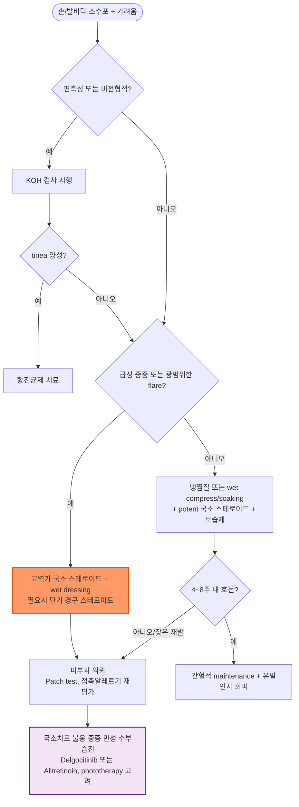

# 한포진 Dyshidrotic eczema (Dyshidrosis, Pompholyx)

## <mark style="color:green;">일반 사항</mark>

* **한포진(dyshidrotic eczema, vesicular hand/foot eczema)**은 손가락 측면, 손바닥 및 발바닥에 깊은 소수포가 반복적으로 발생하는 습진성 피부질환이다.
* 다른 이름 : pompholyx, cheiropompholyx(수부형), podopompholyx(족부형), acute/recurrent vesicular hand eczema
  * ✽용어와 정의에 대해 국제적으로 통일된 기준은 없으며(DermNet, 2024), 만성 수부습진(chronic hand eczema, CHE)의 vesicular phenotype으로 분류되기도 한다.
* 정의 (Weisshaar, *Am J Clin Dermatol* 2024) : CHE는 수부습진이 **3개월 이상 지속**되거나 **1년 내 2회 이상 재발**하는 경우로 정의된다.
* 한포진은 **급성·재발성 수포성 수부습진**으로 나타날 수 있으며, 이러한 경과가 반복되거나 지속되어 CHE의 정의를 충족하면 **CHE의 vesicular phenotype**으로 분류할 수 있다. 즉, 모든 한포진이 곧 CHE를 의미하는 것은 아니다.
* 과거 땀샘 이상과 관련된 것으로 생각하여 *dyshidrosis*라 명명되었으나, **현재는 땀샘 자체의 질환으로 보지 않는다.**
* 유병률 : 수부습진의 1년 유병률은 성인의 약 10%(Coenraads, 2012; Weisshaar 2024 review 인용)이며, 이 중 한포진(dyshidrotic subtype)이 차지하는 비율은 약 5\~20%로 보고된다(DermNet NZ, 2024).
* 개별 episode는 보통 2\~3주에 걸쳐 호전될 수 있으나 재발이 흔하며, 삶의 질에 미치는 부정적 영향이 크다고 보고된다.
* 합병증 : 긁거나 피부장벽이 손상되면 이차 세균감염이 합병될 수 있으며, 반복되는 경과는 만성 수부습진·태선화로 이행할 수 있다.

#### <mark style="color:$primary;">Keratolysis exfoliativa와의 구분</mark>

* 과거 *lamellar dyshidrosis*라고도 불렸던 손발바닥의 표재성 박리성 질환으로, **한포진과는 별개의 감별질환**이다.
* 가려움·염증이 적고 표재성 박리가 주된 소견이며 국소 steroid 반응이 제한적이다 (☞ 아래 감별진단 표 참고).

## <mark style="color:green;">원인</mark>

* 정확한 원인은 불명이며, 땀샘 또는 땀관 폐쇄가 직접적인 원인으로 입증되지는 않았다.

### <mark style="color:orange;">위험 인자 및 연관 요인</mark>

* 아토피 소인, 접촉피부염
* 금속 알레르기(예: nickel, cobalt, chromium) 및 자극성 화합물 노출
* 빈번한 물 접촉, 세정제·용제·시멘트 등 직업성 자극물질 노출
* 장시간 밀폐 장갑 착용, 다한증
* 흡연, 스트레스
* tinea pedis/manuum 등 진균감염과 연관되어 악화되는 경우
* 기온·습도 변화 등 환경 요인
* 유전적 소인 : 가족력이 있는 경우 발생 위험이 높다고 보고됨

## <mark style="color:green;">임상 양상</mark>

* 심한 가려움, 작열감, 통증; 수포 발생 전 가려움이 선행할 수 있다.
* 1\~2 ㎜ 크기의 깊고 맑은 다발성 소수포가 군집하여 발생하며, 이후 건조·박리·균열이 나타날 수 있다.
* 주로 손가락 측면, 손바닥(thenar/hypothenar 포함) 및 발바닥에 발생한다.
* 전형적으로 양측성·대칭성이지만, **편측성 병변은 tinea manuum/pedis 등 다른 원인을 우선 감별**한다.
* 경과 : 소수포 → 건조·표피 탈락 → 반복 시 인설·균열·태선화

***

### <mark style="color:$danger;">🚩 Red Flags!</mark>

<mark style="color:$danger;">**즉각 조치 또는 의뢰**</mark>

* 발열·전신독성을 동반한 급속히 진행하는 홍반·부종·열감 (→ cellulitis·lymphangitis 등 심부감염 의심)
* 심한 통증과 함께 광범위한 괴사·수포 파괴 소견 (→ 중증 이차 세균감염 의심)

<mark style="color:$warning;">**당일 또는 조기 의뢰**</mark>

* 심한 통증을 동반한 군집성 수포로 **herpetic whitlow**가 의심되는 경우
* 광범위하거나 비전형적인 수포성 병변으로 진단이 불확실한 경우
* 비전형적·긴장성 대수포, 반복되는 광범위 수포 또는 다른 부위(구강 등)의 수포를 동반하여 autoimmune bullous disease(예: dyshidrosiform bullous pemphigoid, 특히 고령자)가 의심되는 경우

<mark style="color:$info;">**외래 추적 / 추가 평가 계획**</mark> <mark style="color:$info;">- 즉각 위험 낮으나 호전 없으면 의뢰</mark>

* 4\~8주 적절한 치료에도 조절되지 않는 경우
* 잦은 재발 또는 만성화 경향
* 직업성/알레르기 접촉피부염이 의심되는 경우 (patch test 필요)
* Phototherapy, delgocitinib 등 국소 비스테로이드 치료 또는 alitretinoin 등 전신치료가 필요한 중증 만성 수부습진

***

## <mark style="color:green;">진단</mark>

* 대부분 임상적으로 진단하되, 다른 수포성·감염성·접촉성 피부질환을 배제한다.
* **KOH 직접검사/진균검사** : 편측성 병변, 발백선 동반, 항염증 치료에 반응하지 않는 경우 등에서 고려
* **Patch test** : 3개월 이상 지속, 적절한 치료에도 반응이 불충분, 또는 allergic contact dermatitis가 의심되는 경우 고려
* **세균 배양검사** : 농성 삼출, 딱지, 급속한 홍반·열감·압통 등 이차 세균감염이 의심되는 경우
* 피부생검은 진단이 불명확하거나 다른 수포성 질환이 의심될 때 피부과에서 선택적으로 시행한다 (주된 병리 소견은 spongiosis).

### <mark style="color:orange;">감별 진단</mark>

* 손·발바닥의 가려움·수포·박리를 나타낼 수 있는 질환들의 감별이 중요하며, 특히 **편측성 병변**은 반드시 진균감염을 우선 배제한다.

<table><thead><tr><th width="150">질환</th><th width="230">한포진과의 차이점</th><th>핵심 감별 포인트</th></tr></thead><tbody><tr><td>tinea manuum/pedis</td><td>흔히 편측성, 인설이 두드러짐</td><td>KOH 양성; 손·발바닥 경계가 뚜렷한 인설성 병변</td></tr><tr><td>irritant/allergic contact dermatitis</td><td>노출 부위와 병변 분포가 일치</td><td>직업력·노출력, patch test 양성(알레르기성)</td></tr><tr><td>palmoplantar pustulosis/건선</td><td>수포보다 농포가 특징적</td><td>무균성 농포, 건선 병력·가족력</td></tr><tr><td>herpetic whitlow</td><td>단일 손가락에 국한, 심한 통증</td><td>임상적으로 의심 시 수포액/병변 검체 HSV PCR로 확인</td></tr><tr><td>scabies</td><td>지간·손목 주름 등 특징적 위치</td><td>burrow 소견, 동거인 소양감</td></tr><tr><td>keratolysis exfoliativa</td><td>가려움·염증이 적고 표재성 박리 위주</td><td>steroid 반응 제한적, 소수포 없이 박리 우세</td></tr><tr><td>bullous disease (pemphigus/pemphigoid 등)</td><td>수포가 더 크고 전신에 분포 가능</td><td>Nikolsky sign, 피부생검·면역형광검사</td></tr></tbody></table>

***



<p align="center"><strong>한포진 진단 및 치료 알고리듬</strong></p>

<p align="center"><em><mark style="color:$info;">Ref. Weisshaar E. Chronic Hand Eczema. Am J Clin Dermatol. 2024;25(6):909-926; DermNet NZ, Dyshidrotic Eczema (2024)</mark></em></p>

***

## <mark style="background-color:$warning;">Management</mark>


**단계별 치료 전략 (Step-wise Approach)**

유발·악화 인자 회피와 보습이 모든 단계의 기본이며, 급성기에는 potent\~very potent 국소 스테로이드로 신속히 조절한 뒤 간헐적 유지요법으로 전환한다. 국소치료에 불응하는 **중증 만성** 형태에서는 delgocitinib 등 국소 비스테로이드 치료 또는 alitretinoin 등 전신치료를 고려한다.


### <mark style="color:orange;">비-약물 치료 및 예방</mark>

* 유발·악화 인자 회피 : 물 작업, 세정제·용제, 확인된 allergen/irritant, 과도한 발한 등
* [보습제](158_-atopic-dermatitis-ad.md#undefined-14) : glycerine, petrolatum \[바셀린] 등 fragrance-free emollient를 충분히 자주 사용
* 물 작업 시 보호장갑을 사용하되 장시간 밀폐는 피하고, 필요하면 면장갑을 안쪽에 착용한다.
* 물 작업 시 반지나 팔찌 등을 제거하고, 물 접촉 후 피부를 잘 건조시킨 뒤 보습제를 도포한다.
* 마찰과 잦은 세척을 줄이고, 직업성 노출이 의심되면 작업 환경과 보호구 사용법을 재평가한다.
* 스트레스 및 과도한 발한 조절, 금연 권고

### <mark style="color:orange;">급성기 치료</mark>

* 냉찜질 또는 찬물 soaking
  * 진물이 많은 병변 : **생리식염수 냉습포/습포**를 우선 고려하고, 필요 시 1:10,000 KMnO4 qd\~bid(10\~15분/회) ×5일 이내 또는 Burow solution(알루미늄 아세테이트)을 단기간 사용할 수 있다. KMnO4는 과도한 사용 시 자극·착색에 주의한다.
  * 장력이 심하고 통증을 유발하는 **대수포(tense bulla)**는 수포 지붕을 제거하지 않은 채 무균적으로 천자·배액하여 증상 완화를 고려할 수 있다.
* [국소 steroid](../231_/211_-topical-corticosteroids.md) : 손바닥·발바닥은 피부가 두꺼워 **potent\~very potent 제제**가 필요할 수 있으며, 단기간 qd\~bid 사용 후 반응에 따라 감량/간헐 사용
  * fluocinonide \[나이드], clobetasol \[더모베이트]
* [국소 calcineurin 억제제](../231_/211_-topical-corticosteroids.md#calcineurin-inhibitor) : steroid-sparing therapy가 필요한 경우 고려
  * tacrolimus 0.1% \[프로토픽] bid; pimecrolimus \[엘리델]
  * 비아토피성 hand eczema에서는 허가 범위를 확인하여 사용한다.
* [항히스타민제](../231_/212_-antihistamines.md) : 한포진 자체의 항염증 치료가 아니라 **심한 가려움, 특히 야간 가려움·수면장애의 보조적 증상조절** 목적으로 단기간 고려
  * hydroxyzine \[아디팜], chlorpheniramine \[페니라민] 등 - 진정·졸음 주의

#### <mark style="color:$primary;">급성 중증</mark>

* [wet dressing](158_-atopic-dermatitis-ad.md#wet-wrap-therapy) 또는 습포요법 고려
* 고역가 국소 steroid를 충분히 사용하고, 선택적으로 단기간 occlusion을 고려한다.
* **경구 corticosteroid** : 광범위하거나 기능장애를 유발하는 급성 중증 flare에서만 rescue therapy로 제한적으로 고려하며, 반복 사용은 피한다.
  * 예: prednisolone 약 0.5 ㎎/kg/day로 시작하여 가능한 짧게 사용 후 임상 반응에 따라 신속 감량
  * **2020 Korean Consensus Guidelines for Chronic Hand Eczema:** systemic corticosteroid는 급성 중증 flare에서 단기간 사용하며, ‘short-term’은 약 2주로 정의한다.
* 국소치료에 반응하지 않는 중증 병변은 피부과 의뢰를 고려한다.

### <mark style="color:orange;">만성·재발성 치료</mark>

* 보습제와 피부 보호를 기본으로 하며 potent topical steroid를 단기간 사용한 뒤 필요 시 **간헐적 maintenance therapy**를 고려한다.
* 과각화가 동반된 경우 각질용해제(예: urea 5\~10%, salicylic acid)를 선택적으로 병용할 수 있으나 균열·미란이 심하면 자극에 주의한다.
* **이차 세균감염이 임상적으로 의심/확인된 경우에만** 항생제를 사용한다(S. aureus, S. pyogenes 등) (☞ p.901).
* **tinea manuum/pedis 등 진균감염이 확인된 경우** 항진균제를 치료한다 (☞ p.925).
* 다한증이 중요한 악화 요인인 경우 피부과에서 iontophoresis 또는 botulinum toxin type A를 선택적으로 고려할 수 있다.

#### <mark style="color:$primary;">국소치료 불응 중증 만성 수부습진</mark>


**국내 치료 옵션 업데이트 (2025\~2026)**

바르는 pan-JAK 억제제 **delgocitinib**\[앤줍고]는 2025년 국내 허가되어 2026년 국내 출시되었다. topical corticosteroid에 반응이 불충분하거나 적절하지 않은 성인 중등도\~중증 만성 수부습진에서 고려할 수 있는 **국소 비스테로이드 치료 옵션**이다.


* **Delgocitinib 2% cream** \[앤줍고] : topical corticosteroid에 반응이 불충분하거나 적절하지 않은 성인 중등도\~중증 만성 수부습진에서 고려할 수 있는 비스테로이드 국소 pan-JAK 억제제(JAK1/2/3, TYK2 억제)
  * 용법 : 병변 부위 1일 2회 도포
  * DELTA 1/2 3상 임상(Lancet 2024)에서 위약 대비 우월한 효과가 확인되었으며, head-to-head DELTA FORCE 연구에서는 중증 CHE에서 oral alitretinoin 30 ㎎ 대비 12주 HECSI 개선이 우수했고 24주 전체 안전성도 더 양호했다.
  * 신·간기능에 따른 용량 조절 불필요(전신 흡수 미미)
  * ✽2026년 기준 국내 비급여로 출시된 것으로 확인되나, 급여 여부는 변경될 수 있으므로 처방 전 최신 고시를 확인한다.
* **Alitretinoin** \[알리톡, 팜톡 등] : potent topical corticosteroid 등 적절한 국소치료(최소 4주)에 반응하지 않는 **중증 만성 수부습진**에서 고려하는 경구 retinoid
  * 초기 30 ㎎ qd로 시작; 이상반응으로 견디기 어려우면 10 ㎎ qd로 감량
  * 당뇨, 비만, 심혈관 위험요인, 이상지질혈증이 있는 환자는 초기 10 ㎎부터 시작하여 내약성에 따라 증량 고려
  * **주 식사(main meal)와 함께**, 가능하면 매일 같은 시간에 복용
  * 치료 목표(손이 깨끗해지거나 거의 깨끗해짐, PGA 기준)에 도달하면 즉시 중단; **12주 치료 후에도 중증이면 중단**, **24주까지 목표 미도달 시에도 중단**
  * 주요 이상반응 : 두통, 점막·피부 건조, hyperlipidemia, 간기능 이상, 갑상선기능 변화 등; 혈중 triglyceride > 800 ㎎/dL 시 급성 췌장염 위험 증가
  * 치료 전 및 치료 중 lipid profile, liver function을 정기적으로 확인하고, 임상상황·위험인자에 따라 혈당 및 갑상선기능을 평가한다.
  * **강한 기형유발성 - 임신 절대금기.**
    * **피임 기간** : 임신 가능 여성은 치료 시작 1개월 전부터 치료 중 및 **치료 종료 후 1개월(4주)까지 상호보완적인 2가지 피임법**을 지속한다.
    * **임신검사 일정** : 치료 시작 전에는 생리주기 첫 3일 이내 시행한 임신검사에서 음성을 확인하고, 치료 중에는 매월 임신검사를 시행한다. **치료 종료 후에도 5주 시점까지 정기적인 임신검사와 피임 상담을 지속한다.**
    * **처방 관리** : 1회 처방량은 **30일(1개월)분을 초과하지 않도록** 하며, 국내 임신예방프로그램(RetiCheck) 및 최신 제품 허가사항을 준수한다.
  * CYP3A4/CYP2C9/CYP2C8 강력 억제제(예: ketoconazole, itraconazole) 병용 시 10 ㎎로 감량 고려
  * systemic retinoid 사용 경험이 있는 의사 또는 피부과 진료 하에 사용하는 것이 바람직하다.
* **Phototherapy** : 국소치료 불충분 시 피부과 의뢰하여 NB-UVB 또는 308-nm excimer 등을 보조치료로 고려할 수 있다. 국내에서는 psoralen 이용 제한으로 PUVA 적용이 제한적이다.
* **면역억제제** : cyclosporine, methotrexate, azathioprine 등은 delgocitinib/alitretinoin/phototherapy에도 불응하거나 사용할 수 없는 중증 만성 수부습진에서 피부과 전문치료로 고려한다(일부 off-label) (☞ p.820).

#### <mark style="color:$primary;">재발 시</mark>

* 전구 가려움 또는 초기 소수포 단계에서 보습·피부보호를 강화하고 potent topical steroid를 조기에 재개한다.
* 반복되는 flare마다 경구 steroid를 정형적으로 투여하는 방식은 피하고, 잦은 재발 시 접촉알레르기·직업성 노출·진균감염 등을 재평가한다.

### <mark style="color:orange;">시술 및 기타 처치</mark>

* **Iontophoresis** : 다한증이 동반된 경우 보조적으로 고려, 피부과에서 시행
* **Botulinum toxin type A** : 국소 다한증이 뚜렷한 악화 요인일 때 피부과에서 선택적으로 고려
* **Phototherapy(NB-UVB, 308-nm excimer)** : 국소치료 불충분 시 보조치료로 피부과 의뢰

***

### <mark style="color:red;">질병코드</mark>

L30.1 발한이상\[한포]

***

## <mark style="color:purple;">처방례</mark>

> **처방례 1. 급성 국소 한포진(경증\~중등도)**
>
> ```
> 더모베이트 연고 10 g/tube  qd~bid  단기간
> 아디팜 10 ㎎/T  1T  hs 또는 필요 시 단기간
> ```
>
> _✽손·발바닥은 각질층이 두꺼워 very potent 국소 스테로이드가 필요할 수 있음. 항히스타민제는 야간 가려움 조절 목적의 보조 처방이며 졸음·운전 주의를 안내한다._

> **처방례 2. Steroid-sparing therapy**
>
> ```
> 프로토픽 연고 0.1%  10 g/tube  bid
> 지르텍 10 ㎎/T  1T  저녁 (가려움 증상조절 필요 시)
> ```
>
> _✽국소 스테로이드의 반복·장기 사용을 줄이기 위한 steroid-sparing therapy로 선택적으로 고려한다. 비아토피성 hand eczema에서는 허가 범위를 확인한다._

> **처방례 3. 진물이 많은 급성기**
>
> ```
> 1:10,000 KMnO4 용액  10~15분간 침수  qd~bid × 5일 이내
> 더모베이트 연고 10 g/tube  qd  침수 후 도포
> ```
>
> _✽과도한 사용 시 피부 자극 및 갈색 착색이 있을 수 있음을 사전에 안내한다._

> **처방례 4. 국소치료 불응 중증 만성 수부습진 (피부과 협진 하)**
>
> ```
> 알리톡 연질캡슐 30 ㎎  1cap  qd  주 식사와 함께
> ```
>
> _✽최소 4주간 potent 국소 스테로이드에 반응하지 않는 중증 예에서 고려. 임신 가능 여성은 임신예방프로그램 준수 필수. 국소 delgocitinib\[앤줍고]도 적응증과 환자 특성에 따라 선택할 수 있다._

***

### <mark style="color:$success;">핵심 복약 지도</mark>

> **국소 스테로이드, 손·발바닥이라 세게 써야 합니다**
>
> * 손바닥·발바닥은 각질층이 두꺼워 potent\~very potent 제제가 필요한 경우가 많습니다. 다만 **의사가 안내한 기간(대개 단기간) 이상 임의로 연장하지 마십시오.** 장기 사용 시 피부 위축·모세혈관 확장 등이 생길 수 있습니다.
> * 반응이 좋아지면 매일 사용에서 필요 시 간헐적 사용으로 줄여가는 것이 원칙입니다.

> **항히스타민제는 보조약입니다**
>
> * 가려움, 특히 야간 가려움으로 인한 수면장애를 줄이기 위한 보조적 처방으로, 한포진 자체를 치료하는 약이 아닙니다.
> * 진정 작용이 있는 제제는 복용 후 운전·기계 조작을 피하십시오.

> **경구 retinoid(alitretinoin) 또는 delgocitinib 처방 시**
>
> * Alitretinoin은 기형유발성이 매우 높습니다. 임신 가능 여성은 국내 임신예방프로그램(RetiCheck)과 제품 허가사항을 반드시 준수하십시오. 치료 전·중에는 지질·간기능을 정기적으로 확인하고, 필요한 경우 혈당·갑상선기능을 평가합니다.
> * Delgocitinib(앤줍고)은 2026년 기준 국내 비급여로 출시된 것으로 확인되나, 급여 여부는 변경될 수 있으므로 처방 전 최신 고시와 비용을 확인하십시오.

> **언제 다시 병원을 방문해야 하나요?**
>
> * 적절한 국소치료와 피부보호를 4\~8주 시행해도 충분히 호전되지 않는 경우
> * 급속히 진행하는 홍반·부종·열감, 발열 등 이차 세균감염이 의심되는 경우 - 즉시 내원
> * 심한 통증을 동반한 군집성 수포 (herpetic whitlow 의심) - 즉시 내원
> * 잦은 재발로 접촉알레르기·직업성 노출 재평가가 필요한 경우

***

### <mark style="color:blue;">환자 안내서</mark>


**한포진, 재발이 흔하지만 관리로 조절할 수 있습니다**

한포진(汗疱疹)은 손가락 옆면이나 손바닥·발바닥에 작고 깊은 물집이 생기며 몹시 가려운 습진의 한 종류입니다. 이름과 달리 땀샘 자체의 문제는 아닌 것으로 알려져 있습니다. 급성으로 나타났다가 2\~3주에 걸쳐 좋아지지만, 재발이 흔한 것이 특징입니다.


#### <mark style="color:$primary;">왜 한포진이 생기나요?</mark>

* 정확한 원인은 아직 밝혀지지 않았습니다.
* 아토피 체질, 금속(니켈 등) 알레르기, 잦은 물 접촉이나 세제·용제 노출, 스트레스, 땀이 많이 나는 체질, 흡연 등이 악화 요인으로 알려져 있습니다.
* 발무좀(무좀균 감염)이 동반되어 있으면 한포진이 함께 악화될 수 있습니다.
* 물집 없이 손바닥 피부가 얇게 벗겨지는 증상만 반복되면 한포진이 아닌 다른 질환(예: keratolysis exfoliativa)일 수 있으므로 진료를 받아 확인하는 것이 좋습니다.

#### <mark style="color:$primary;">일상생활에서 어떻게 관리하나요?</mark>

* **물 작업을 할 때는 장갑을 착용하십시오.** 다만 오래 밀폐된 상태로 착용하면 오히려 악화될 수 있으므로, 안에 면장갑을 끼고 겉에 고무장갑을 착용하는 방법을 권합니다.
* **손을 씻거나 물에 닿은 후에는 잘 말리고 보습제를 충분히 발라 주십시오.**
* 반지·팔찌는 물 작업 전에 빼 두어, 물기와 세제 성분이 고이지 않도록 합니다.
* **검사에서 니켈 등 특정 금속 알레르기가 확인된 경우에만** 해당 물질의 노출을 줄이십시오. 근거 없이 특정 음식을 광범위하게 제한할 필요는 없습니다.
* 스트레스 관리와 금연도 재발을 줄이는 데 도움이 됩니다.
* **집에서 물집을 임의로 터뜨리거나 뜯지 마십시오.** 세균 감염 위험이 높아집니다. 큰 물집이 팽팽하고 아프면 의료진이 수포 지붕을 보존한 채 배액할 수 있습니다.

#### <mark style="color:$primary;">약은 어떻게 써야 하나요?</mark>

* 처방받은 연고는 **의사가 안내한 기간만** 사용하십시오. 손·발바닥은 피부가 두꺼워 강한 연고가 필요하지만, 오래 쓰면 부작용이 생길 수 있습니다.
* **가려움 약(특히 진정성 항히스타민제)은 졸릴 수 있으므로 복용 후 운전·기계 조작을 피하십시오.**
* 증상이 심해 먹는 약(경구 retinoid 등)을 처방받은 경우, 정기적인 혈액검사 일정을 반드시 지켜 주십시오.

#### <mark style="color:$primary;">이럴 때는 병원을 방문하세요</mark>

**즉시 진료가 필요한 경우**

* 물집 부위가 갑자기 심하게 붓고 빨개지며 열이 나거나 발열·오한이 동반되는 경우

**빠른 시일 내 진료가 필요한 경우**

* 손가락 한 곳에 몹시 아픈 군집성 물집이 생기는 경우
* 팽팽한 큰 물집이 반복되거나 손·발 이외 부위에도 수포가 생기는 경우
* 적절한 국소치료와 피부보호를 4\~8주 시행해도 충분히 좋아지지 않는 경우
* 자주 재발하여 일상생활(직업, 집안일)에 지장이 큰 경우
