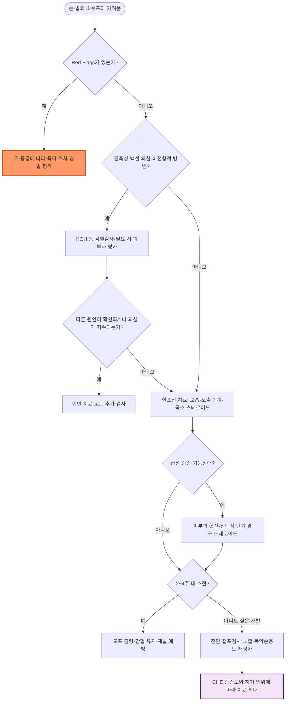

# 한포진 Dyshidrotic eczema (Dyshidrosis, Pompholyx)

## <mark style="color:green;">일반 사항</mark>

* **한포진(dyshidrotic eczema, vesicular hand/foot eczema)**은 손가락 측면, 손바닥 및 발바닥에 깊은 소수포가 반복적으로 발생하는 습진성 피부질환이다.
* 다른 이름 : pompholyx, cheiropompholyx(수부형), podopompholyx(족부형), acute/recurrent vesicular hand eczema
  * ✽용어와 정의에 대해 국제적으로 통일된 기준은 없으며(DermNet, 2023), 만성 수부습진(chronic hand eczema, CHE)의 vesicular phenotype으로 분류되기도 한다.
* 정의 (Weisshaar, *Am J Clin Dermatol* 2024) : CHE는 수부습진이 **3개월 이상 지속**되거나 **1년 내 2회 이상 재발**하는 경우로 정의된다.
* 한포진은 **급성·재발성 수포성 수부습진**으로 나타날 수 있으며, 이러한 경과가 반복되거나 지속되어 CHE의 정의를 충족하면 **CHE의 vesicular phenotype**으로 분류할 수 있다. 즉, 모든 한포진이 곧 CHE를 의미하는 것은 아니다.
* 과거 땀샘 이상과 관련된 것으로 생각하여 *dyshidrosis*라 명명되었으나, **현재는 땀샘 자체의 질환으로 보지 않는다.**
* 유병률 : 수부습진의 성인 1년 유병률은 약 10%(Weisshaar, 2024)이나, **한포진 자체의 정확한 유병률은 알려져 있지 않음.** DermNet(2023)의 약 20%는 수부피부염으로 첩포검사 클리닉에서 평가받은 환자 중 한포진의 비율이며, 일반 인구의 유병률을 의미하지 않음.
* 개별 episode는 보통 2\~3주에 걸쳐 호전될 수 있으나 재발이 흔하며, 삶의 질에 미치는 부정적 영향이 크다고 보고된다.
* 합병증 : 긁거나 피부장벽이 손상되면 이차 세균감염이 합병될 수 있으며, 반복되는 경과는 만성 수부습진·태선화로 이행할 수 있다.

#### <mark style="color:$primary;">Keratolysis exfoliativa와의 구분</mark>

* 과거 *lamellar dyshidrosis*라고도 불렸던 손발바닥의 표재성 박리성 질환으로, **한포진과는 별개의 감별질환**이다.
* 가려움·염증이 적고 표재성 박리가 주된 소견이며 국소 steroid 반응이 제한적이다 (☞ 아래 감별진단 표 참고).

## <mark style="color:green;">원인</mark>

* 정확한 원인은 불명이며, 땀샘 또는 땀관 폐쇄가 직접적인 원인으로 입증되지는 않았다.

### <mark style="color:orange;">위험 인자 및 연관 요인</mark>

* 아토피 소인 및 자극성·알레르기성 접촉피부염의 동반; 아토피와 한포진의 연관성에 대한 연구 결과는 일관되지 않음
* 금속 알레르기(예: nickel, cobalt, chromium) 및 자극성 화합물 노출
* 빈번한 물 접촉, 세정제·용제·시멘트 등 직업성 자극물질 노출
* 장시간 밀폐 장갑 착용, 다한증
* 흡연, 스트레스
* 발백선에 대한 **피부사상균진(dermatophytid, id reaction)**으로 손에 한포진 유사 수포가 생길 수 있음. 수포성 발백선·손백선 자체도 감별 대상임
* 기온·습도 변화 등 환경 요인

## <mark style="color:green;">임상 양상</mark>

* 심한 가려움, 작열감, 통증; 수포 발생 전 가려움이 선행할 수 있다.
* 1\~2 ㎜ 크기의 깊고 맑은 다발성 소수포가 군집하여 발생하며, 이후 건조·박리·균열이 나타날 수 있다.
* 주로 손가락 측면, 손바닥(thenar/hypothenar 포함) 및 발바닥에 발생한다.
* 전형적으로 양측성·대칭성이지만, **편측성 병변은 tinea manuum/pedis 등 다른 원인을 우선 감별**한다.
* 경과 : 소수포 → 건조·표피 탈락 → 반복 시 인설·균열·태선화

***

### <mark style="color:$danger;">🚩 Red Flags!</mark>

<mark style="color:$danger;">**즉각 조치**</mark>

* 발열·전신독성을 동반한 급속히 진행하는 홍반·부종·열감 (→ cellulitis·lymphangitis 등 연조직감염 의심)
* 피부 소견에 비해 극심한 통증, 급속한 진행, 자색 변화·괴사·출혈성 수포 또는 혈역학적 불안정 (→ 괴사성 연조직감염·패혈증 의심; 응급 평가)

<mark style="color:$warning;">**당일 평가**</mark>

* 심한 통증을 동반한 군집성 수포로 **herpetic whitlow**가 의심되는 경우; 절개·배액하지 않고 항바이러스 치료 필요성을 평가
* 발열이 없어도 홍반·열감·압통이 빠르게 퍼져 cellulitis·lymphangitis가 의심되는 경우
* 광범위한 수포·미란으로 손 사용이나 보행이 현저히 제한되거나, 점막 병변을 동반한 비전형적 수포성 질환이 의심되는 경우

<mark style="color:$info;">**외래 추적 / 추가 평가 계획**</mark> <mark style="color:$info;">- 즉각 위험 낮으나 호전 없으면 의뢰</mark>

* 2\~4주 적절한 국소치료·피부보호에도 호전이 불충분한 경우; 악화되거나 기능장애가 크면 더 일찍 의뢰
* 잦은 재발 또는 만성화 경향
* 직업성/알레르기 접촉피부염이 의심되는 경우 (patch test 필요)
* 진단이 불확실한 국한성·비전형적 병변 또는 반복되는 긴장성 대수포; 특히 고령자는 dyshidrosiform bullous pemphigoid 등을 감별하며 조기 피부과 평가를 계획함
* Phototherapy, delgocitinib 등 국소 비스테로이드 치료 또는 alitretinoin 등 전신치료를 검토해야 하는 만성 수부습진

***

## <mark style="color:green;">진단</mark>

* 대부분 임상적으로 진단하되, 다른 수포성·감염성·접촉성 피부질환을 배제한다.
* 병력·진찰 : 직업·취미의 물 작업/자극물·장갑·금속 노출, 사용 중인 외용제, 아토피 병력, 재발 양상과 일상생활·수면·업무 장애를 평가하고 양손·양발 및 다른 부위도 확인함. CHE는 필요 시 PGA·HECSI 등으로 중증도를 기록함
* **KOH 직접검사/진균검사** : 편측성 병변, 발백선 동반, 항염증 치료에 반응하지 않는 경우 등에서 시행. 음성이어도 진균감염 의심이 높으면 재검·배양 등을 고려함
  * 발백선 관련 dermatophytid에서는 손 수포의 진균검사가 음성일 수 있으므로 원발 감염 부위인 발도 검사함
* **Patch test(첩포검사)** : 3개월 이상 지속, 적절한 치료에도 반응이 불충분, 또는 allergic contact dermatitis가 의심되는 경우 고려. 기본 항원 외에 직업·장갑·개인 사용제품 관련 항원을 포함하며, 양성 반응의 실제 노출 관련성을 확인함
* **세균 배양검사** : 초기 경증의 감염 의심만으로 일률적으로 시행하지 않음. 감염의 반복·악화, 항생제 불응 또는 내성균 의심 시 고려하며, 진물·딱지만으로 세균감염을 확정하지 않음
* **HSV PCR** : 심한 통증을 동반한 단일 손가락의 군집성 수포 등 herpetic whitlow가 의심되면 병변 검체로 확인 고려
* 피부생검은 진단이 불명확하거나 다른 수포성 질환이 의심될 때 피부과에서 선택적으로 시행함(주된 병리 소견은 spongiosis). 자가면역 수포성 질환이 의심되면 병변의 조직검사와 병변 주변 피부의 직접면역형광검사를 함께 고려함.

### <mark style="color:orange;">감별 진단</mark>

* 손·발바닥의 가려움·수포·박리를 나타낼 수 있는 질환들의 감별이 중요하며, 특히 **편측성 병변**은 반드시 진균감염을 우선 배제한다.

<table><thead><tr><th width="150">질환</th><th width="230">한포진과의 차이점</th><th>핵심 감별 포인트</th></tr></thead><tbody><tr><td>tinea manuum/pedis</td><td>손백선은 흔히 편측성; 인설·발백선·손발톱백선 동반</td><td>KOH 양성; 손·발바닥 경계가 뚜렷한 인설성 병변</td></tr><tr><td>irritant/allergic contact dermatitis</td><td>노출력과 병변 분포의 관련성; 수포형도 가능</td><td>직업력·노출력, patch test 양성(알레르기성)</td></tr><tr><td>palmoplantar pustulosis/건선</td><td>수포보다 농포가 특징적</td><td>무균성 농포, 건선 병력·가족력</td></tr><tr><td>herpetic whitlow</td><td>단일 손가락에 국한, 심한 통증</td><td>병변 검체 HSV PCR 고려; 절개·배액 금지</td></tr><tr><td>scabies</td><td>지간·손목 주름 등 특징적 위치</td><td>burrow 소견, 동거인 소양감</td></tr><tr><td>keratolysis exfoliativa</td><td>가려움·염증이 적고 표재성 박리 위주</td><td>steroid 반응 제한적; 표재성 공기 함유 수포 뒤 얇은 collarette 박리, 깊은 염증성 수포와 구분</td></tr><tr><td>bullous disease (pemphigus/pemphigoid 등)</td><td>수포가 더 크고 전신에 분포 가능</td><td>병변 조직검사·병변 주변 피부 직접면역형광검사; bullous pemphigoid에서는 Nikolsky sign이 보통 음성</td></tr></tbody></table>

***


```mermaid
graph TD
    A(["손·발의 소수포와 가려움"]) --> B{"Red Flags가 있는가?"}
    B -- "예" --> R["위 등급에 따라 즉각 조치·당일 평가"]
    B -- "아니오" --> C{"편측성·백선 의심·비전형적 병변?"}
    C -- "예" --> D["KOH 등 감별검사·필요 시 피부과 평가"]
    D --> E{"다른 원인이 확인되거나 의심이 지속되는가?"}
    E -- "예" --> X["원인 치료 또는 추가 검사"]
    E -- "아니오" --> F["한포진 치료: 보습·노출 회피·국소 스테로이드"]
    C -- "아니오" --> F
    F --> G{"급성 중증·기능장애?"}
    G -- "예" --> H["피부과 협진·선택적 단기 경구 스테로이드"]
    G -- "아니오" --> I{"2~4주 내 호전?"}
    H --> I
    I -- "예" --> J["도포 감량·간헐 유지·재발 예방"]
    I -- "아니오·잦은 재발" --> K["진단·첩포검사·노출·복약순응도 재평가"]
    K --> L["CHE 중증도와 허가 범위에 따라 치료 확대"]
    style R fill:#f96,stroke:#e65100,stroke-width:2px
    style L fill:#f3e5f5,stroke:#4a148c,stroke-width:2px
```

<p align="center"><strong>한포진 진단 및 치료 알고리듬</strong></p>

<p align="center"><em><mark style="color:$info;">Ref. Weisshaar E. Chronic Hand Eczema. Am J Clin Dermatol. 2024;25(6):909-926; DermNet, Dyshidrotic Eczema (2023); Kim HJ et al. Ann Dermatol. 2021;33:351-360</mark></em></p>

***

## <mark style="background-color:$warning;">Management</mark>


**단계별 치료 전략 (Step-wise Approach)**

유발·악화 인자 회피와 보습이 모든 단계의 기본임. 급성기에는 병변 부위·중증도에 맞는 국소 스테로이드를 단기간 사용하며, 손·발바닥의 두꺼운 피부에는 potent\~very potent 제제가 필요할 수 있음. 국소치료에 불응하는 **성인 중등도\~중증 CHE**는 delgocitinib, **성인 중증 CHE**는 alitretinoin 등을 검토함. **발바닥에만 생긴 한포진은 두 약제의 CHE 허가 적응증에 포함되지 않음.**


### <mark style="color:orange;">비-약물 치료 및 예방</mark>

* 유발·악화 인자 회피 : 물 작업, 세정제·용제, 확인된 allergen/irritant, 과도한 발한 등
* [보습제](158_-atopic-dermatitis-ad.md#undefined-14) : glycerine, petrolatum \[바셀린] 등 fragrance-free emollient를 충분히 자주 사용
* 물 작업 시 작업에 적합한 보호장갑을 사용하되 장시간 밀폐는 피하고, 필요하면 면장갑을 안쪽에 착용함. 젖은 장갑은 교체하며, 장갑 자체의 고무 첨가제 등에 알레르기가 있으면 해당 항원을 피하는 제품을 선택함
* 물 작업 시 반지나 팔찌 등을 제거하고, 물 접촉 후 피부를 잘 건조시킨 뒤 보습제를 도포한다.
* 마찰과 잦은 세척을 줄이고, 직업성 노출이 의심되면 작업 환경과 보호구 사용법을 재평가한다.
* 스트레스 및 과도한 발한 조절, 금연 권고; 한포진 재발 감소에 대한 직접적인 근거는 제한적임
* 금속 감작만으로 저니켈·저코발트 식이를 일률적으로 권하지 않으며, 임상적 관련성이 확인된 난치성 사례에서 전문의와 상의하여 선택적으로 검토함

### <mark style="color:orange;">급성기 치료</mark>

* 짧은 냉습포 : 진물이 많거나 수포가 활발할 때 사용하고, 마른 병변에 반복적인 장시간 침수는 피함
  * 진물이 많은 병변 : **0.9% 생리식염수 냉습포** 10\~15분/회, qd\~bid를 수일간 우선 고려함. 필요 시 1:10,000(0.01%) KMnO4 또는 Burow solution을 단기간 사용할 수 있으나, 제품·조제 가능 여부와 희석법을 확인함. **KMnO4 원액·결정을 직접 사용하지 않으며, 불완전한 희석은 화학화상을, 삼킴은 중독을 유발할 수 있음.** 가정에서 임의 조제하지 않도록 지도함
  * 장력이 심하고 통증을 유발하는 **대수포(tense bulla)**는 수포 지붕을 제거하지 않은 채 진균·HSV 감염 등을 배제한 뒤 의료진이 무균적으로 천자·배액하여 증상 완화를 고려할 수 있음. **Herpetic whitlow가 의심되면 절개·배액하지 않음.**
* [국소 steroid](../231_/211_-topical-corticosteroids.md) : 손바닥·발바닥은 피부가 두꺼워 **potent\~very potent 제제**가 필요할 수 있으며, 단기간 qd\~bid 사용 후 반응에 따라 감량/간헐 사용
  * fluocinonide 0.05% \[나이드], clobetasol propionate 0.05% \[베타베이트] 등
  * Clobetasol은 **2주 이상 연속 치료 및 주 50 g 이상 사용을 피함**(국내 제품 허가사항). 통상 1\~2주 이내 재평가하며, 4\~8주간 같은 초강력 제제를 계속 바르는 방식으로 치료하지 않음
  * 손등·손가락의 얇은 피부와 소아는 역가·기간을 더 신중히 선택함. 진균·HSV 감염이 의심되면 스테로이드 단독치료를 피함
* [국소 calcineurin 억제제](../231_/211_-topical-corticosteroids.md#calcineurin-inhibitor) : steroid-sparing therapy가 필요한 경우 고려
  * tacrolimus 0.1% \[프로토픽] bid; pimecrolimus \[엘리델]
  * Tacrolimus·pimecrolimus는 아토피피부염 허가 약제이며, **한포진 자체에 대한 사용은 허가 외**임. Tacrolimus 0.1%는 만 16세 이상에서 사용하며, 두꺼운 손·발바닥에서는 효과가 제한될 수 있음. 초기 작열감·자극감에 주의하고 감염 부위에는 사용하지 않음
* [항히스타민제](../231_/212_-antihistamines.md) : 한포진 자체의 항염증 치료가 아니라 **심한 가려움, 특히 야간 가려움·수면장애의 보조적 증상조절** 목적으로 단기간 고려
  * hydroxyzine \[아디팜], chlorpheniramine \[페니라민] 등; 졸음·항콜린성 이상반응에 주의하며 고령자에서는 가급적 피함
  * Hydroxyzine은 QT 연장·torsades de pointes 위험이 있으므로 QT 연장, 유의한 서맥·저칼륨혈증, QT 연장 약물 병용 등에서는 사용하지 않음. 항히스타민제의 습진성 가려움 개선 근거는 제한적이며 일률적으로 처방하지 않음

#### <mark style="color:$primary;">급성 중증</mark>

* 진물에는 짧은 냉습포를 고려함. **냉습포와 스테로이드 밀봉요법/습윤밀폐요법(wet-wrap)은 구분함**
* 국소 steroid 밀봉요법은 흡수·감염 위험을 높이므로 전문의 지시 하에 제한적으로 시행하며, 초강력 제제의 밀봉이나 감염 의심 부위의 밀봉은 피함
* **경구 corticosteroid** : 광범위하거나 기능장애를 유발하는 급성 중증 flare에서만 rescue therapy로 제한적으로 고려하며, 반복 사용은 피한다.
  * 예: prednisolone 약 0.5 ㎎/kg/day로 시작하여 보통 1\~2주 이내로 제한; 감량 여부와 속도는 사용 기간·반복 투여 이력·임상 반응에 따라 결정함. 중단 후 반동 악화와 고혈당·혈압 상승·감염 등에 주의함
  * **2020 Korean Consensus Guidelines for Chronic Hand Eczema:** systemic corticosteroid는 급성 중증 flare에서 단기간 사용하며, ‘short-term’은 약 2주로 정의한다.
* 국소치료에 반응하지 않는 중증 병변은 피부과 의뢰를 고려한다.

### <mark style="color:orange;">만성·재발성 치료</mark>

* 보습제와 피부 보호를 기본으로 하며 potent topical steroid를 단기간 사용한 뒤 필요 시 **간헐적 maintenance therapy**를 고려한다.
* 과각화가 동반된 경우 각질용해제(예: urea 5\~10%, salicylic acid)를 선택적으로 병용할 수 있으나 균열·미란이 심하면 자극에 주의한다.
* **이차 세균감염의 범위·중증도와 전신 증상에 따라** 항생제 필요성을 판단함(S. aureus, S. pyogenes 등). 진물·딱지만으로 일률적으로 항생제를 쓰지 않으며, cellulitis·전신 증상에는 전신 항생제와 감염 평가가 필요함 (☞ p.901)
* **tinea manuum/pedis 등 진균감염이 확인된 경우** 항진균제로 치료함. Dermatophytid는 원발 백선 치료와 함께 손의 습진성 반응을 국소 항염증제로 조절하며, 진균이 없는 손 수포 자체에 항진균제를 바르지는 않음 (☞ p.925)
* 다한증이 중요한 악화 요인인 경우 피부과에서 iontophoresis 또는 botulinum toxin type A를 선택적으로 고려할 수 있다.

#### <mark style="color:$primary;">국소치료 불응 중등도\~중증 만성 수부습진</mark>


**국내 치료 옵션 업데이트 (2025\~2026)**

바르는 pan-JAK 억제제 **delgocitinib**\[앤줍고]는 2025년 국내 허가되어 2026년 국내 출시되었다. topical corticosteroid에 반응이 불충분하거나 적절하지 않은 성인 중등도\~중증 만성 수부습진에서 고려할 수 있는 **국소 비스테로이드 치료 옵션**이다.


* **Delgocitinib 2%(20 ㎎/g) cream** \[앤줍고] : topical corticosteroid에 반응이 불충분하거나 적절하지 않은 성인 중등도\~중증 만성 수부습진에서 고려할 수 있는 비스테로이드 국소 pan-JAK 억제제(JAK1/2/3, TYK2 억제)
  * 용법 : **손·손목의 환부**에 약 12시간 간격으로 1일 2회 얇게 도포함. 깨끗해지거나 거의 깨끗해지면 중단하고, 재발 시 필요에 따라 재개함. **12주 치료에도 개선이 없으면 중단을 고려함**
  * 발바닥·다른 신체 부위 및 만 18세 미만의 치료로 일반화하지 않음. 눈·입·점막 접촉을 피하고, 도포 직전·직후 다른 외용제를 겹쳐 바르지 않도록 제품별 지시를 따름
  * DELTA 1/2(Lancet 2024)에서 vehicle 대비 효과가 확인됨. DELTA FORCE(Lancet 2025)에서는 중증 CHE의 12주 HECSI 개선이 oral alitretinoin보다 컸으며, 24주까지 보고된 이상반응 비율이 낮았음. **이 결과를 한포진 단독·발바닥 병변의 비교 효과나 장기 안전성 우월성으로 확대 해석하지 않음**
  * 국외 허가자료상 전신 노출이 낮아 신·간기능에 따른 용량 조절은 권장되지 않으나, 중증 신·간장애 환자에서 연구는 시행되지 않음
  * 국소 자극·접촉피부염에 주의함. 국외 허가자료상 도포 부위의 주기적 피부검사가 권고되며, 임신 중 사용은 가급적 피함. 국내 제품의 최신 주의사항을 함께 확인함
  * ✽2026년 비급여로 국내 출시되었으며, 급여 여부는 변경될 수 있으므로 처방 전 최신 고시를 확인한다.
* **Alitretinoin** \[알리톡, 팜톡 등] : potent topical corticosteroid 등 적절한 국소치료(최소 4주)에 반응하지 않는 **성인의 재발성 만성 중증 손 습진**에서 고려하는 경구 retinoid
  * 초기 30 ㎎ qd로 시작; 이상반응으로 견디기 어려우면 10 ㎎ qd로 감량
  * 당뇨, 비만, 심혈관 위험요인, 이상지질혈증이 있는 환자는 초기 10 ㎎부터 시작하여 내약성·효과에 따라 증량 고려; 투여 금기에 해당하는 지질 이상 여부는 별도 확인함
  * 수포성 CHE에도 사용할 수 있으나, 임상시험에서는 과각화형의 반응이 수포형보다 좋았음. 발바닥 단독 한포진에 대한 사용은 허가 외임
  * **주 식사(main meal)와 함께**, 가능하면 매일 같은 시간에 복용
  * 치료 목표(손이 깨끗해지거나 거의 깨끗해짐, PGA 기준)에 도달하면 즉시 중단; **12주 치료 후에도 중증이면 중단**, **24주까지 목표 미도달 시에도 중단**
  * 주요 이상반응 : 두통, 점막·피부 건조, hyperlipidemia, 간기능 이상, 갑상선기능 변화 등; 혈중 triglyceride > 800 ㎎/dL 시 급성 췌장염 위험 증가
  * 치료 전 및 치료 중 lipid profile, liver function을 정기적으로 확인하고, 임상상황·위험인자에 따라 혈당 및 갑상선기능을 평가한다.
  * **강한 기형유발성 - 임신·수유 중 금기.** 임신 가능 여성은 임신예방프로그램 조건을 모두 충족하는 경우에만 처방함
    * **피임 기간** : 임신 가능 여성은 치료 시작 1개월 전부터 치료 중 및 **치료 종료 후 1개월까지 상호보완적인 2가지 피임법**을 지속한다.
    * **임신검사 일정** : 치료 시작 전에는 국내 허가사항에 따라 임신검사 음성을 확인함(정상 생리주기의 첫 3일 이내 검사; 피임 없이 성관계가 있었다면 그로부터 적어도 3주 이후 검사). 치료 중에는 매 처방 전 매월 임신검사를 시행하고, **치료 종료 후 5주 시점의 임신검사도 확인함.**
    * **처방 관리** : 임신 가능 여성의 1회 처방량은 **30일분을 초과하지 않도록** 하며, 국내 임신예방프로그램(RetiCheck) 및 최신 제품 허가사항을 준수한다.
  * **Tetracycline계(doxycycline 등) 병용 금기**(두개내압 상승 위험); 비타민 A 보충제·다른 전신 retinoid 병용을 피함
  * CYP3A4 억제제(ketoconazole 등), 강력한 CYP2C9/CYP2C8 억제제 병용 시 약물상호작용과 10 ㎎ 감량 필요성을 검토함(국외 SmPC 포함)
  * 간장애·중증 신장애·갑상선기능저하증 및 제품에 명시된 지질 이상·콩/땅콩 알레르기 등 금기를 확인함
  * 치료 전·중 우울증·기분변화·자살사고를 평가함. 심한 두통·구토·시각 이상(두개내압 상승), 췌장염 의심 증상 또는 심한 기분변화가 발생하면 중단하고 평가함
  * 남녀 모두 치료 중 및 종료 후 1개월간 헌혈하지 않으며 약을 타인에게 주지 않도록 지도함
  * 전신 retinoid와 중증 CHE 치료 경험이 있는 의사가 처방·모니터링함.
* **Phototherapy** : 국소치료 불충분 시 피부과 의뢰하여 NB-UVB 또는 308-nm excimer 등을 보조치료로 고려할 수 있다. 국내에서는 psoralen 이용 제한으로 PUVA 적용이 제한적이다.
* **면역억제제** : cyclosporine, methotrexate, azathioprine 등은 표준치료 불응 또는 금기·내약성 문제에 따라 피부과에서 선택적으로 검토함. 한포진/CHE 자체에 대한 사용은 허가 외이며, 약제별 혈압·신기능·혈구·간기능 등 감시가 필요함. 모든 치료를 순서대로 실패한 뒤에만 사용해야 하는 것은 아님 (☞ p.820)
* **Dupilumab** \[듀피젠트] : 난치성 수포성 CHE에 소규모 무작위시험 근거가 있음(BJD 2023). 동반 아토피피부염이 국내 허가 적응증에 해당하면 해당 기준으로 고려할 수 있으나, 한포진/CHE 자체에 대한 치료는 허가 외임

#### <mark style="color:$primary;">재발 시</mark>

* 전구 가려움 또는 초기 소수포 단계에서 보습·피부보호를 강화하고 potent topical steroid를 조기에 재개한다.
* 반복되는 flare마다 경구 steroid를 정형적으로 투여하는 방식은 피하고, 잦은 재발 시 접촉알레르기·직업성 노출·진균감염 등을 재평가한다.

### <mark style="color:orange;">시술 및 기타 처치</mark>

* **Iontophoresis** : 다한증이 동반된 경우 보조적으로 고려, 피부과에서 시행
* **Botulinum toxin type A** : 국소 다한증이 뚜렷한 악화 요인일 때 피부과에서 선택적으로 고려; 손·발바닥 다한증/한포진에 대한 사용은 국내 허가 범위를 확인하며, 효과 근거가 제한적이고 손의 일시적 근력저하 등에 주의함
* **Phototherapy(NB-UVB, 308-nm excimer)** : 국소치료 불충분 시 보조치료로 피부과 의뢰

***

### <mark style="color:red;">질병코드</mark>

L30.1 발한이상\[한포] Dyshidrosis [pompholyx]

***

## <mark style="color:purple;">처방례</mark>

> **처방례 1. 국소 한포진의 염증성 손·발바닥 병변(성인)**
>
> ```
> 베타베이트 연고 0.05% 15 g/tube  환부에 얇게 qd~bid  7~14일 이내 재평가
> 아디팜 10 ㎎/T  1T  hs 또는 필요 시 단기간
> ```
>
> _✽성인의 염증성 손·발바닥 병변에 대한 예시. Clobetasol은 2주 이상 연속 치료·주 50 g 이상 사용을 피함. 손등·소아는 역가를 별도 선택함. 아디팜은 필요한 경우에만 단기간 처방하며 고령자·QT 연장 위험군에서는 피함._

> **처방례 2. Steroid-sparing therapy**
>
> ```
> 프로토픽 연고 0.1%  10 g/tube  bid
> 지르텍 10 ㎎/T  1T  저녁 (가려움 증상조절 필요 시)
> ```
>
> _✽만 16세 이상에서 국소 스테로이드 사용을 줄이기 위해 선택적으로 고려하는 예시. 한포진 자체에 대한 tacrolimus 사용은 허가 외이며, 두꺼운 손·발바닥에서 효과가 제한될 수 있음. 항히스타민제는 필요 시 보조적으로 사용함._

> **처방례 3. 진물이 많은 급성기**
>
> ```
> 0.9% 생리식염수 냉습포  10~15분/회  qd~bid  수일간
> 베타베이트 연고 0.05% 15 g/tube  환부에 얇게 qd  습포 후 도포
> ```
>
> _✽습포 후 가볍게 물기를 제거하고 도포함. 지속적인 침수·밀봉은 피함. KMnO4는 정확한 희석과 삼킴 예방 교육이 가능한 경우에만 대안으로 고려함._

> **처방례 4. 국소치료 불응 중증 만성 수부습진 (피부과 협진 하)**
>
> ```
> 알리톡 연질캡슐 30 ㎎  1cap  qd  주 식사와 함께
> ```
>
> _✽최소 4주간 potent 국소 스테로이드에 반응하지 않는 중증 예에서 고려. 임신 가능 여성은 임신예방프로그램 준수 필수. 국소 delgocitinib\[앤줍고]도 적응증과 환자 특성에 따라 선택할 수 있다._

***

### <mark style="color:$success;">핵심 복약 지도</mark>

> **국소 스테로이드는 부위에 맞는 강도로 짧게 사용합니다**
>
> * 손바닥·발바닥은 각질층이 두꺼워 potent\~very potent 제제가 필요한 경우가 많습니다. 다만 **의사가 안내한 기간(대개 단기간) 이상 임의로 연장하지 마십시오.** 장기 사용 시 피부 위축·모세혈관 확장 등이 생길 수 있습니다.
> * Clobetasol(베타베이트 등)은 2주 이상 연속 사용하지 마십시오. 반응이 좋아지면 도포 횟수를 줄이거나 간헐적 사용으로 전환하고, 1\~2주 내 호전이 없으면 다시 평가받으십시오. 약을 바른 뒤 비닐·밀폐 장갑으로 임의로 덮지 마십시오.

> **항히스타민제는 보조약입니다**
>
> * 가려움, 특히 야간 가려움으로 인한 수면장애를 줄이기 위한 보조적 처방으로, 한포진 자체를 치료하는 약이 아닙니다.
> * 진정 작용이 있는 제제는 복용 후 운전·기계 조작을 피하십시오.

> **경구 retinoid(alitretinoin) 또는 delgocitinib 처방 시**
>
> * Alitretinoin은 기형유발성이 매우 높으며 임신·수유 중 금기입니다. 임신 가능 여성은 국내 임신예방프로그램(RetiCheck)과 제품 허가사항을 반드시 준수하십시오. 치료 전·중에는 지질·간기능을 정기적으로 확인하고, 필요한 경우 혈당·갑상선기능을 평가합니다.
> * Alitretinoin 치료 중 및 종료 후 1개월은 헌혈하지 마십시오. 비타민 A 보충제·다른 retinoid·doxycycline 등의 복용 여부를 알리십시오. 심한 두통·시각 이상 또는 우울·기분변화가 생기면 복용을 멈추고 진료받으십시오.
> * Delgocitinib(앤줍고)은 손·손목 환부에만 안내대로 사용하고, 깨끗해지면 중단하며 재발 시 재개합니다. 발바닥에 임의로 확대 사용하지 마십시오. 2026년 비급여로 국내 출시되었으며, 처방 전 최신 급여 고시와 비용을 확인하십시오.

> **언제 다시 병원을 방문해야 하나요?**
>
> * 1\~2주 치료 후 반응·사용량을 확인하고, 적절한 국소치료와 피부보호를 2\~4주 시행해도 충분히 호전되지 않으면 재평가받으십시오
> * 급속히 진행하는 홍반·부종·열감, 발열 등 이차 세균감염이 의심되는 경우 - 즉시 내원
> * 심한 통증을 동반한 군집성 수포 (herpetic whitlow 의심) - 즉시 내원
> * 잦은 재발로 접촉알레르기·직업성 노출 재평가가 필요한 경우

***

## <mark style="color:blue;">환자 안내서</mark>


**한포진, 재발이 흔하지만 관리로 조절할 수 있습니다**

한포진(汗疱疹)은 손가락 옆면이나 손바닥·발바닥에 작고 깊은 물집이 생기며 몹시 가려운 습진의 한 종류입니다. 이름과 달리 땀샘 자체의 문제는 아닌 것으로 알려져 있습니다. 물집은 흔히 2\~3주에 걸쳐 마르고 벗겨지지만, 재발이 흔한 것이 특징입니다.


#### <mark style="color:$primary;">왜 한포진이 생기나요?</mark>

* 정확한 원인은 아직 밝혀지지 않았습니다.
* 아토피 체질, 금속(니켈 등) 알레르기, 잦은 물 접촉이나 세제·용제 노출, 스트레스, 땀이 많이 나는 체질, 흡연 등이 악화 요인으로 알려져 있습니다.
* 발무좀(무좀균 감염)이 동반되어 있으면 한포진이 함께 악화될 수 있습니다.
* 물집 없이 손바닥 피부가 얇게 벗겨지는 증상만 반복되면 한포진이 아닌 다른 질환(예: keratolysis exfoliativa)일 수 있으므로 진료를 받아 확인하는 것이 좋습니다.

#### <mark style="color:$primary;">일상생활에서 어떻게 관리하나요?</mark>

* **물 작업을 할 때는 장갑을 착용하십시오.** 다만 오래 밀폐된 상태로 착용하면 오히려 악화될 수 있으므로, 안에 면장갑을 끼고 작업에 맞는 방수장갑을 착용하십시오. 젖으면 교체하고, 장갑 때문에 악화되면 고무 첨가제 알레르기 등을 확인하십시오.
* **손을 씻거나 물에 닿은 후에는 잘 말리고 보습제를 충분히 발라 주십시오.**
* 반지·팔찌는 물 작업 전에 빼 두어, 물기와 세제 성분이 고이지 않도록 합니다.
* **검사에서 니켈 등 특정 금속 알레르기가 확인된 경우에만** 해당 물질의 노출을 줄이십시오. 근거 없이 특정 음식을 광범위하게 제한할 필요는 없습니다.
* 스트레스가 악화 요인이라면 관리하고, 전반적인 건강을 위해 금연을 권합니다.
* **집에서 물집을 임의로 터뜨리거나 뜯지 마십시오.** 세균 감염 위험이 높아집니다. 큰 물집이 팽팽하고 아프면 의료진이 수포 지붕을 보존한 채 배액할 수 있습니다.

#### <mark style="color:$primary;">약은 어떻게 써야 하나요?</mark>

* 처방받은 연고는 **의사가 안내한 기간만** 사용하십시오. 손·발바닥은 피부가 두꺼워 강한 연고가 필요하지만, 오래 쓰면 부작용이 생길 수 있습니다.
* **가려움 약(특히 진정성 항히스타민제)은 졸릴 수 있으므로 복용 후 운전·기계 조작을 피하십시오.**
* 증상이 심해 먹는 약(경구 retinoid 등)을 처방받은 경우, 정기적인 혈액검사 일정을 반드시 지켜 주십시오.

#### <mark style="color:$primary;">이럴 때는 병원을 방문하세요</mark>

**즉시 진료가 필요한 경우**

* 빠르게 붓고 빨개지는 부위에 발열·오한·전신 상태 저하가 동반되는 경우
* 피부 모습에 비해 극심하게 아프거나, 검붉은 변색·괴사·피가 찬 물집이 생기는 경우

**당일 진료가 필요한 경우**

* 손가락 한 곳에 몹시 아픈 군집성 물집이 생기는 경우; 터뜨리지 마십시오
* 열이 나지 않더라도 발적·열감·통증이 빠르게 퍼지는 경우
* 넓은 물집·벗겨짐 때문에 손 사용·보행이 어렵거나 입안 등 점막에도 물집이 생기는 경우

**조기 진료·외래 재평가가 필요한 경우**

* 팽팽한 큰 물집이 반복되거나 손·발 이외 부위에도 수포가 생기는 경우
* 적절한 국소치료와 피부보호를 2\~4주 시행해도 충분히 좋아지지 않는 경우
* 자주 재발하여 일상생활(직업, 집안일)에 지장이 큰 경우


***

### 주요 참고 자료

* [2020 Korean Consensus Guidelines for Diagnosis and Treatment of Chronic Hand Eczema. Ann Dermatol. 2021;33:351-360](https://pmc.ncbi.nlm.nih.gov/articles/PMC8273322/)
* [Weisshaar E. Chronic Hand Eczema. Am J Clin Dermatol. 2024;25:909-926](https://doi.org/10.1007/s40257-024-00890-z)
* [DermNet. Dyshidrotic eczema (2023)](https://dermnetnz.org/topics/dyshidrotic-eczema)
* [NICE NG190: 습진의 이차 세균감염과 항생제 사용](https://www.nice.org.uk/guidance/ng190/chapter/Recommendations)
* [베타베이트연고: 고려제약 제품정보](https://nicepharma.com/m/product/v/?p=6&uid=71)
* [알리톡: 국내 제품정보(대웅제약)](https://www.daewoonggroup.com/daewoongkr/popup/product_goods_view_popup.web?sCate=3&srno=474); [Toctino SmPC: 국외 안전성·상호작용 보완 자료](https://www.medicines.org.uk/emc/product/7543/smpc)
* [앤줍고: 국내 약제부 용법·용량 안내](https://www.fatima.or.kr/main/contents.do?a_num=88541066&b_num=3440&prepage=%2Fmain%2Fcontents.do%3Fa_num%3D88541066&proc_type=view); [Anzupgo SmPC: 국외 주의사항 보완 자료](https://www.medicines.org.uk/emc/product/100443/smpc)
* [DELTA FORCE: delgocitinib와 alitretinoin 직접 비교시험. Lancet 2025](https://pubmed.ncbi.nlm.nih.gov/40252681/)
* [Dupilumab의 난치성 CHE 2b상 시험. Br J Dermatol. 2023;189:400-409](https://pubmed.ncbi.nlm.nih.gov/37170922/)
