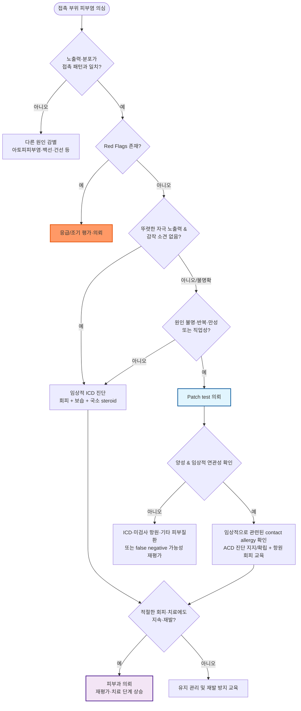

# 접촉피부염 Contact Dermatitis

## <mark style="color:green;">일반 사항</mark>

* 외부 물질과의 접촉에 의해 유발되는 피부의 염증 반응
* 분류 : **자극 접촉피부염(irritant contact dermatitis, ICD)**, **알레르기 접촉피부염(allergic contact dermatitis, ACD)**
  * 광접촉피부염(phototoxic/photoallergic contact dermatitis)도 임상적으로 중요한 아형이며, 광조사 부위에 국한되거나 우세한 분포를 보임(☞ 원인 항목 참조)
  * ICD와 ACD는 임상 양상이 겹칠 수 있으며, 같은 환자·같은 병변에 동시에 존재할 수 있음(mixed/combined contact dermatitis)
    * 예 : 반복적인 세제·습윤 작업에 의한 ICD가 있는 손에 nickel 또는 rubber accelerator ACD가 동반되는 경우
* 역학
  * 접촉피부염은 직업성 피부질환 중 가장 흔한 원인이며, 그중 ICD가 약 70\~80%를 차지하고 ACD가 그 뒤를 이음
  * 습윤 작업(wet work)이 많은 의료·미용·요식업 종사자에서 특히 높은 유병률을 보임
* 합병증 : 태선화 및 만성 습진화, 이차 세균감염(농가진화), 병변부 색소침착 또는 색소탈실, 반복·직업성 피부염으로 인한 업무 지속 곤란

### <mark style="color:orange;">일반적 임상 양상</mark>

* 급성 : 홍반, 구진, 수포, crust, oozing, 부종
* 만성 : 홍반, 건조, scale, fissure, 태선화, 과각화

***

## <mark style="color:green;">원인 및 위험 인자</mark>

* 직업 또는 취미로 물·세제·용제·금속·고무·화장품·식물 등 자극/알레르기 유발 물질에 반복 노출되는 경우
  * 예 : 미용, 의료, 요식·청소, 정비, 금속·건설 작업, 원예
* 아토피피부염 또는 피부장벽 손상 병력
* 잦은 손 씻기, 장시간 장갑 착용 또는 습윤 작업(wet work)
* 여행·야외활동 중 새로운 식물, 화장품, 방충제 등에 노출된 경우

#### <mark style="color:$primary;">자극 접촉피부염 (Irritant contact dermatitis, ICD)</mark>

* 기전 : 화학적·물리적 자극에 의한 피부장벽 손상과 비면역성 염증 반응
* 감작이 필요하지 않으며 누구에게나 발생 가능하나, 자극의 강도·농도·노출 시간·빈도와 개인의 피부장벽 상태에 따라 정도가 달라짐
* 원인 : 물일, 비누, 세제, 세정제, 용제, 산·알칼리, 소독제, 마찰, 밀폐, 침·땀·소변/대변 등
* 호발 부위 : 잦은 노출 부위(특히 손), 얇은 피부 부위(눈꺼풀 등), 겹침·밀폐 부위
* 경과
  * **acute ICD** : 강한 자극제 노출 후 수분\~수시간 내 발생 가능
  * **delayed acute ICD** : 수시간\~24시간 이후 나타날 수 있음
  * **chronic cumulative ICD** : 약한 자극의 반복 노출로 수주\~수개월에 걸쳐 발생할 수 있음
  * 일반적으로 접촉 부위에 우세하지만, 반복 노출과 피부장벽 손상 정도에 따라 범위가 넓어질 수 있음

<table><thead><tr><th width="125">종류</th><th width="230">병력</th><th width="230">임상 양상</th><th>예후</th></tr></thead><tbody><tr><td>Acute</td><td>강산·강알칼리 등 강한 자극에 급성 노출</td><td>홍반, 부종, 수포, 미란/괴사; 따가움·통증</td><td>원인 제거 후 호전 가능</td></tr><tr><td>Delayed acute</td><td>노출 수시간\~24시간 후 발생 가능</td><td>Acute ICD와 유사</td><td>대체로 양호</td></tr><tr><td>Chronic cumulative</td><td>물·세정제·기름 등 약한 자극에 반복 노출; 미용, 의료, 요식·청소, 금속 작업 등</td><td>홍반, 건조, 과각화, 균열, 태선화</td><td>노출 지속 여부에 따라 다양</td></tr><tr><td>Frictional</td><td>반복되는 마찰·미세 손상</td><td>과각화, 태선화, 균열</td><td>다양</td></tr><tr><td>Asteatotic</td><td>고령, 겨울, 건조 환경</td><td>홍반, 건조, 균열, 가려움</td><td>다양</td></tr><tr><td>Subjective/sensory irritation</td><td>화장품·세정제 등에 노출</td><td>외부 소견이 미약하거나 없어도 따가움·작열감·가려움</td><td>대체로 양호</td></tr></tbody></table>

#### <mark style="color:$primary;">알레르기 접촉피부염 (Allergic contact dermatitis, ACD)</mark>

* 기전 : **type IV cell-mediated delayed hypersensitivity reaction**; 항원에 감작된 후 재접촉 시 발생
* 흔한 원인
  * 식물 : 옻(Toxicodendron), 은행 등
  * 금속 : nickel, cobalt, chromate
  * 화장품·향료·방부제 : fragrance, formaldehyde/formaldehyde releaser, **methylisothiazolinone(MI)**, quaternium-15 등
    * MI는 화장품·세정제·생활용품에서 중요한 방부제 알레르겐
  * 염모제 : p-phenylenediamine(PPD)
  * 고무 제품 : **rubber accelerators**(thiuram, carbamate, mercaptobenzothiazole 등)
  * 국소 약물 : 일부 항생제, corticosteroid 자체 또는 제제의 부형제/보존제
* **Natural rubber latex protein**은 전형적인 ACD 원인이라기보다 **type I 즉시형 알레르기(contact urticaria, 드물게 anaphylaxis)**를 일으킬 수 있으므로 고무 첨가제에 의한 ACD와 구분
* **Protein contact dermatitis** : 조리사·식품 취급자 등에서 음식물 단백질 접촉 직후 가려움·두드러기성 반응과 반복 노출에 따른 만성 손습진이 함께 나타날 수 있는 특수한 직업성 피부염 형태
* 호발 부위 : 노출 부위(특히 손, 발, 눈꺼풀, 얼굴, 입술)
* 경과
  * 재노출 후 수시간\~수일에 걸쳐 발생하며 대개 24\~72시간에 뚜렷해질 수 있음
  * 주로 접촉 부위에 발생하나 중증 또는 확산 시 접촉 부위를 넘어 퍼질 수 있음
  * 항원 제거 후에도 염증이 수주간 지속될 수 있음

#### <mark style="color:$primary;">전신 접촉피부염 (Systemic contact dermatitis)</mark>

* **임상에서 흔하지 않은 특수 형태**로, 국소 접촉으로 이미 감작된 알레르겐에 이후 경구·전신 경로로 재노출될 때 전신적 습진성 반응이 나타남
* 예 : nickel 감작 환자가 nickel 함량이 높은 음식을 섭취한 경우, balsam of Peru 감작 환자에서 향신료·감귤류 섭취 후 악화
* 드물게 전신 노출 후 기존 접촉피부염이 재활성화되거나 광범위·대칭성 습진이 발생할 수 있음

***

## <mark style="color:green;">임상 양상</mark>

* 경증 : 홍반, 건조, 갈라짐, 따가움/작열감, 가려움
* 중증 : 부종, 진물, 통증, 압통, 수포, 미란 또는 궤양
* ICD : 따가움·작열감·통증이 비교적 두드러지며 가려움도 동반 가능
* ACD : 가려움이 뚜렷하게 두드러짐; 만성화하면 건조, scale, fissure, 태선화

***

### <mark style="color:$danger;">🚩 Red Flags!</mark>

<mark style="color:$danger;">**즉각 조치 또는 의뢰**</mark>

* 강산·강알칼리 등 화학 화상, 광범위 괴사 또는 심한 수포
* 눈 또는 점막의 화학물질 노출
* 호흡곤란, 천명, 전신 두드러기, 저혈압 등 즉시형 알레르기/anaphylaxis 의심(특히 latex 노출력)
* 광범위 박리, 심한 전신 증상 등 단순 접촉피부염으로 설명하기 어려운 중증 피부반응(SJS/TEN 등 감별 필요)

<mark style="color:$warning;">**당일 또는 조기 의뢰**</mark>

* 광범위 피부염 또는 심한 얼굴·눈꺼풀·생식기 부종
* 발열, 심한 통증, 화농, 빠르게 진행하는 홍반 등 이차 세균감염 의심
* 직업성 피부염으로 업무 지속이 어렵거나 반복 노출 회피가 곤란한 경우

<mark style="color:$info;">**외래 추적 / 추가 평가 계획**</mark> <mark style="color:$info;">- 즉각 위험 낮으나 호전 없으면 의뢰</mark>

* 원인 불명의 반복성·만성 피부염
* patch test가 필요한 경우
* 적절한 항원/자극 회피와 국소 치료에도 지속·재발하거나, 초기부터 ACD·직업성 접촉피부염이 강하게 의심되는 경우
* 중증 만성 손습진 또는 전신 치료를 고려해야 하는 경우
* 반복적인 전신 corticosteroid 투여가 필요하거나 장기 전신치료가 고려되는 경우 - 피부과 조기 의뢰

***

## <mark style="color:green;">진단</mark>

* 노출력 : 새로 사용한 화장품·세정제·의약품, 금속·고무 제품, 식물, 직업/취미, 습윤 작업 여부 확인
* 분포 : 병변의 모양과 위치가 접촉 패턴과 일치하는지 확인
* ICD는 확진 검사가 없는 **임상적·배제적 진단**으로, 노출력·분포와 함께 ACD, 백선, 아토피피부염 등 다른 원인을 배제하며 판단
* ACD가 의심되면 **patch test**가 표준 진단법
  * 고려 대상
    * 원인 항원이 명확하지 않은 반복성·만성 피부염
    * 적절한 회피·치료에도 지속 또는 재발하는 피부염
    * 직업성 접촉피부염
    * 반복되는 손·얼굴·눈꺼풀·발 피부염
    * 국소 치료제 자체 또는 그 성분에 대한 알레르기가 의심되는 경우
  * 일반적으로 patch를 약 48시간 부착한 뒤 제거하고 D2\~D4에 판독하며, 항원에 따라 **D7 전후 late reading**이 도움이 될 수 있음(특히 corticosteroid, PPD, neomycin 등)
  * 표준 항원 시리즈(예: European baseline series에 준한 국내 시리즈)를 기본으로 하고, 표준 series에 포함되지 않은 직업·취미 관련 의심 물질은 **성분 확인 후 적절한 농도·vehicle을 설정하여 환자 자신의 제품 또는 추가 allergen series로 피부과에서 검사**를 고려; 원제품을 임의 농도로 직접 적용하지 않음
  * 판독은 홍반만 있는 반응을 곧바로 양성으로 판단하지 않으며, infiltration·papule·vesicle 여부와 시간 경과를 함께 보아 **doubtful/irritant reaction과 allergic reaction을 구분**
  * 임상적으로 관련 있는 양성 반응인지 환자의 실제 노출력과 함께 해석
  * **검사 전·검사 중 주의** : 검사 부위의 강한 국소 corticosteroid 및 전신 corticosteroid/면역억제 치료는 반응을 약화시킬 수 있으므로 임의 중단하지 말고 의뢰 기관 지시에 따라 조정. patch 부착 중에는 검사 부위를 젖게 하거나 땀이 많이 나는 격렬한 운동·심한 마찰을 피함
* 즉시형 latex allergy가 의심되면 patch test가 아니라 병력에 따라 skin-prick test 또는 specific IgE 등 별도 평가 고려

### <mark style="color:orange;">자극성 접촉피부염 vs 알레르기성 접촉피부염</mark>

<table><thead><tr><th width="110">구분</th><th width="250">ICD</th><th>ACD</th></tr></thead><tbody><tr><td>기전</td><td>비면역성 피부장벽 손상·염증</td><td>Type IV 지연 과민반응</td></tr><tr><td>감작</td><td>불필요</td><td>필요</td></tr><tr><td>위치</td><td>대체로 접촉 부위에 우세</td><td>접촉 부위에서 시작하며 주변으로 확산 가능</td></tr><tr><td>주증상</td><td>따가움·작열감·통증이 비교적 두드러짐; 가려움 가능</td><td>가려움이 두드러짐</td></tr><tr><td>발생 시점</td><td>수분\~수개월까지 노출 형태에 따라 다양</td><td>재노출 후 수시간\~수일</td></tr><tr><td>Patch test</td><td>원인 진단에 사용하지 않음</td><td>원인 항원 확인에 유용</td></tr><tr><td>경과</td><td>자극 제거와 피부장벽 회복에 따라 호전</td><td>항원 제거 후에도 수주간 지속 가능</td></tr></tbody></table>

### <mark style="color:orange;">감별 진단</mark>

* 아토피피부염, tinea/tinea manuum, candidal intertrigo, psoriasis, dyshidrotic eczema, seborrheic dermatitis, scabies, impetigo/cellulitis, photodermatitis, contact urticaria
* 특히 **한쪽 손에만 지속되는 손 피부염**은 tinea manuum을 다시 고려

***



<p align="center"><strong>접촉피부염 진단 및 치료 알고리듬</strong></p>

<p align="center"><em><mark style="color:$info;">Ref. European Society of Contact Dermatitis (ESCD) Guideline for diagnostic patch testing, 2026; American Family Physician, 2010;82(3)</mark></em></p>

***

## <mark style="background-color:$warning;">Management</mark>

### <mark style="color:orange;">치료 방침</mark>

* 가장 중요한 치료는 **원인 자극/항원 확인과 회피**
* 유발 물질 노출 시 가능한 한 신속히 세척하고 오염된 의류·장신구 제거
  * 옻 등 식물 수지 노출은 가능한 한 일찍 비누와 물로 충분히 세척
* 냉찜질, wet dressing, 보습제로 피부장벽 회복
* 국소 corticosteroid가 염증 치료의 기본
* 항히스타민제는 피부염 자체의 염증 치료제가 아니라 **소양증, 특히 야간 소양증의 보조요법**
* 항생제는 **임상적으로 이차 세균감염이 있을 때만** 사용
* 진균감염이 의심되면 접촉피부염의 치료제가 아니라 **감별진단에 따라 확인·치료**

***

## <mark style="color:green;">비-약물 치료 및 예방</mark>

* 냉찜질, soaking(예: cool tap water, Burow's solution)
* 급성 진물·수포 병변 : wet dressing을 15\~30분씩 1일 수 회 고려
* 항소양제 : calamine/zinc oxide \[칼라민](../%EB%B9%84%EB%B3%B4%ED%97%98/), colloidal oatmeal bath (☞ p.857)
* 보습제 : petrolatum \[바셀린] 등 무향·저자극 보습제 (☞ p.867)
  * urea 제제는 건조·과각화 병변에 유용하지만 **균열·미란·급성 염증 부위에서는 따가움/자극**을 유발할 수 있음
* 손 피부염
  * 자극이 적은 세정제를 사용하고 미지근한 물로 씻은 뒤 즉시 보습
  * 습윤 작업 시 적절한 보호장갑 사용; 장시간 밀폐는 피하고 필요하면 면장갑을 안에 착용
  * 개인 보호구 자체의 고무 첨가제 알레르기도 고려
* 예방
  * 불필요한 반복 손 씻기와 강한 세정제 사용을 줄임
  * 습윤 작업·화학물질 노출 시 적절한 장갑과 보호구 사용
  * 손 씻은 직후와 작업 전후 충분한 보습
  * 엉덩이/기저귀 부위의 자극 피부염에서는 피부 보호제/barrier film 고려 \[카빌론]
  * patch test 등으로 확인된 항원과 교차반응 물질 회피, 제품 라벨·성분명을 확인하도록 교육
  * barrier cream은 보조수단이며 **원인 회피와 보호장비를 대체하지 않음**

***

## <mark style="color:green;">약물 치료</mark>

### <mark style="color:orange;">국소 치료제</mark>

* 국소 항히스타민제는 접촉 알레르기를 유발할 수 있어 일반적으로 권고하지 않음

#### <mark style="color:$primary;">[Steroid](../231_/211_-topical-corticosteroids.md)</mark>

* 병변의 부위·두께·중증도에 맞는 역가를 선택
* 대개 **1일 1회** 도포로 충분하며, 제품 허가사항 또는 임상 상황에 따라 1일 2회까지 사용
* 얼굴·눈꺼풀·목·겨드랑이·사타구니 등 얇은/겹치는 부위 : 저역가를 짧게 사용
  * hydrocortisone 1\~2.5% lotion <mark style="color:blue;">\[하티손로션1%, 하티손로션2.5%]</mark>
* 몸통·사지 : 중간 역가
  * triamcinolone acetonide 0.1% <mark style="color:blue;">\[트리코트 등]</mark>
  * mometasone furoate 0.1% <mark style="color:blue;">\[모리코트 등]</mark> - 제형·분류 체계에 따라 역가 분류가 다를 수 있음
* 손바닥·발바닥 또는 심한 태선화 병소 : 중\~고역가를 **단기간만** 고려
  * clobetasol propionate 0.05% <mark style="color:blue;">\[더모베이트]</mark>
  * 얼굴·간찰부에는 사용하지 않음
* 급성기 호전 후에는 도포 횟수·역가를 줄이거나 중단
* 밀폐 요법은 약물 흡수를 크게 증가시키므로 제한적으로 사용하며 모낭염, 위축 등 부작용에 주의 (☞ p.868)
* 만성 반복 병변에서 장기 사용이 필요하면 간헐적/pulse therapy를 고려 (☞ p.869)

#### <mark style="color:$primary;">[Calcineurin 억제제](../231_/211_-topical-corticosteroids.md#calcineurin-inhibitor)</mark>

* 접촉피부염의 표준 1차 약물은 아니며, **steroid-sparing therapy로 선택적으로 고려(off-label)**
* 특히 얼굴·눈꺼풀·간찰부 등 국소 steroid 장기 사용을 피하고 싶은 반복성 병변에서 피부과적 판단 하에 고려
* 도포 초기에 **작열감·따가움(burning/stinging)**이 나타날 수 있으나 대개 며칠간 지속 사용하면서 감소함을 안내
* 접촉피부염에서의 사용은 off-label이며, 특히 소아 접촉피부염에 대한 유효성 근거는 제한적
* tacrolimus 0.1% <mark style="color:blue;">\[프로토픽]</mark>
* pimecrolimus 1% <mark style="color:blue;">\[엘리델]</mark>

#### <mark style="color:$primary;">항생제</mark>

* **routine prophylactic topical antibiotics는 권고하지 않음**
* 국소 농가진성 병변 등 제한적인 이차 세균감염이 명확한 경우에만 고려
  * mupirocin 2% bid\~tid <mark style="color:blue;">\[에스로반]</mark>
* bacitracin, neomycin 등은 자체적으로 ACD를 유발할 수 있어 반복·경험적 사용을 피함
* steroid/항생제 복합제도 명확한 감염이 없는 단순 접촉피부염에 routine으로 사용하지 않음

### <mark style="color:orange;">전신 치료제</mark>

#### <mark style="color:$primary;">[항히스타민](../231_/212_-antihistamines.md)</mark>

* 대상 : 소양증에 대한 **보조요법**
* 피부염 자체의 염증을 치료하는 약은 아님
* 야간 소양증과 수면장애가 심하면 진정성 1세대 항히스타민제를 단기간 고려
  * hydroxyzine : 10\~25 ㎎ hs, 필요시 조절 <mark style="color:blue;">\[아디팜]</mark>
  * chlorpheniramine : 4 ㎎ q4\~6hr, 최대 24 ㎎/d <mark style="color:blue;">\[페니라민]</mark>
  * 고령자, 낙상 위험, 항콜린성 부작용에 주의
* 주간 소양증에는 비진정성/저진정성 2세대 항히스타민제를 고려할 수 있으나, 접촉피부염의 소양증은 주로 histamine-mediated가 아니므로 **효과가 제한적일 수 있음**
  * cetirizine : 10 ㎎ qd <mark style="color:blue;">\[지르텍]</mark>
  * loratadine : 10 ㎎ qd <mark style="color:blue;">\[클라리틴]</mark>
  * fexofenadine : 180 ㎎ qd <mark style="color:blue;">\[알레그라]</mark>
* **doxepin 3\~6 ㎎ \[사일레노]은 불면증 용량의 제제로 접촉피부염 소양증 치료제로 사용하지 않음**

#### <mark style="color:$primary;">Steroid</mark>

* 대상
  * 중증·광범위 ACD
  * 심한 얼굴/생식기 부종
  * 국소 치료로 조절하기 어려운 중증 Toxicodendron(옻 등) 피부염
* prednisolone/prednisone : 대개 **0.5\~1 ㎎/㎏/d (통상 최대 40\~60 ㎎/d 범위)**에서 시작 후 임상 반응과 원인에 따라 감량
* 너무 짧은 5\~7일 투여는 특히 중증 옻 피부염에서 rebound dermatitis를 유발할 수 있으므로, 필요한 경우 **약 10\~21일에 걸친 치료/감량**을 고려
* 당뇨병, 고혈압, 감염 위험, 소화성 궤양, 정신과적 부작용 등을 고려

#### <mark style="color:$primary;">[항생제](165_-skin-and-soft-tissue-infection.md#undefined-5)</mark>

* 접촉피부염 자체가 아니라 **cellulitis, 광범위 impetiginization 등 임상적으로 명확한 이차 세균감염**이 있을 때 치료
* 국소/전신 항생제 선택은 병변 범위, 화농 여부, MRSA 위험, 환자 상태에 따라 [피부·연조직 감염](165_-skin-and-soft-tissue-infection.md#undefined-5) 치료 원칙을 따름
* 단순 홍반·진물만으로 세균감염으로 간주하여 경험적 전신 항생제를 사용하지 않음

### <mark style="color:orange;">난치성·만성 피부염</mark>

* 원인 회피와 적절한 국소 치료에도 지속되는 중증 만성 손습진/광범위 피부염은 피부과 의뢰
* delgocitinib cream(topical pan-JAK inhibitor) - 국소 corticosteroid에 반응이 불충분하거나 사용이 부적절한 성인의 중등증\~중증 **만성 손습진(chronic hand eczema; irritant, allergic, atopic 등 여러 원인·표현형이 포함될 수 있음)** 치료제. 2024년 EMA, 2025년 FDA 승인. **FDA 승인 용법: 2% cream을 손·손목 병변에 bid, 최대 30 g/2주 또는 60 g/월**. 국내 허가·유통·급여 여부는 처방 전 확인
* dupilumab 등 생물학적제제는 표준 1차 치료가 아니며, 회피에도 반응하지 않는 **중증 난치성 ACD**에서 소규모 연구·증례 수준의 근거를 바탕으로 off-label 사용이 시도되고 있음(2026년 기준 대규모 RCT 근거는 부족)
* phototherapy 또는 systemic therapy가 필요한 경우에는 원인·표현형·동반 아토피피부염 여부에 따라 전문적으로 선택
* cyclosporine, methotrexate, azathioprine 등을 **단순 ACD/ICD의 일반적 단계상승 치료로 routine하게 사용하지 않음**

***

### <mark style="color:red;">질병코드</mark>

L23　알레르기성 접촉피부염

L24　자극성 접촉피부염

L25　상세불명의 접촉피부염

***

## <mark style="color:purple;">처방례</mark>

> **처방례 1. 경증 국소 자극 접촉피부염**
>
> ```
> Hydrocortisone 2.5% lotion　[하티손로션2.5%]　환부에 얇게 도포  qd~bid ×5~7일
> Cetirizine 10 ㎎/T　[지르텍]　1T  qd  prn - 의미 있는 가려움이 있는 경우
> ```
>
> _✽경증 자극 접촉피부염은 원인 회피 및 보습만으로도 호전되는 경우가 많으며, 저역가 국소 steroid는 단기간만 사용_

> **처방례 2. 손·몸통의 중등도 접촉피부염**
>
> ```
> Triamcinolone acetonide 0.1% cream　[트리코트 등]　환부에 얇게 도포  qd  ×1~2주
> Cetirizine 10 ㎎/T　[지르텍]　1T  qd  prn
> 야간 소양증 심한 경우 Hydroxyzine 10~25 ㎎　[아디팜]　1T  hs  prn
> ```
>
> _✽습윤 작업 관련이면 보호장갑·보습 등 비약물 조치를 함께 교육; 반응이 불충분하거나 초기부터 ACD·직업성 피부염이 강하게 의심되면 patch test 의뢰를 고려_

> **처방례 3. 안면·눈꺼풀 등 얇은 피부 부위 접촉피부염**
>
> ```
> Hydrocortisone 1% lotion　[하티손로션1%]　환부에 얇게 도포  qd  ×5~7일
> 반응 불충분 또는 반복 시 Tacrolimus 0.1% ointment　[프로토픽]　qd~bid  (steroid-sparing, off-label)
> ```
>
> _✽눈꺼풀·안면은 피부가 얇아 위축·모세혈관확장 위험이 높으므로 고역가 steroid의 장기 사용을 피함. Tacrolimus는 초기에 작열감·따가움이 있을 수 있으나 대개 며칠 내 감소함을 안내_

> **처방례 4. 이차 세균감염이 동반된 접촉피부염**
>
> ```
> Mupirocin 2% ointment　[에스로반]　환부에  bid~tid  ×7일
> 기저 피부염의 항염 치료는 감염 범위·중증도를 평가하여 국소 corticosteroid 병행 고려
> ```
>
> _✽국소적인 농가진화 등 임상적으로 명확한 감염이 있을 때만 항생제를 사용하고, 기저 피부염의 항염 치료를 병행할 수 있음. cellulitis·광범위 impetiginization은 피부·연조직 감염 챕터 원칙에 따라 평가·치료_

> **처방례 5. 중증 광범위 ACD/옻 피부염**
>
> ```
> Prednisolone 0.5~1 ㎎/㎏/d (통상 40~60 ㎎/d 범위)로 시작
> 임상 반응에 따라 총 10~21일에 걸쳐 감량
> 병변 부위에 맞는 국소 corticosteroid 병용
> 야간 소양증 심하면 Hydroxyzine 10~25 ㎎　[아디팜]　hs  prn  병용 고려
> ```
>
> _✽너무 짧은(5~7일) 투여는 특히 중증 Toxicodendron 피부염에서 rebound dermatitis를 유발할 수 있음_

***

### <mark style="color:$success;">핵심 복약 지도</mark>

> **국소 corticosteroid, 부위·기간을 지켜 사용**
>
> * 처방된 역가와 기간을 초과하여 임의로 연장하지 않도록 안내
> * 얼굴·눈꺼풀·간찰부는 저역가만, 짧은 기간만 사용 - 장기 사용 시 피부 위축, 모세혈관확장, 스테로이드 여드름 위험
> * 손바닥·발바닥 등 각질이 두꺼운 부위는 상대적으로 고역가가 필요할 수 있음을 설명

> **원인 회피가 치료의 핵심**
>
> * 국소 치료만으로는 재노출 시 재발하므로, 노출력 문진 결과를 바탕으로 구체적 회피 대상(성분명·제품명)을 안내
> * patch test 양성 결과지를 환자가 보관하고 화장품·세정제 구매 시 성분표를 확인하도록 안내

> **Tacrolimus/Pimecrolimus 초기 자극감 안내**
>
> * 도포 초기에 화끈거림·따가움이 나타날 수 있으며, 대개 며칠간 사용하면서 감소함을 설명하여 임의 중단을 줄임

> **항히스타민제는 보조요법임을 설명**
>
> * 소양증 완화 목적이며 피부염 자체를 치료하지 않음을 명확히 안내
> * 진정성 항히스타민제 처방 시 운전·기계조작·낙상 위험(특히 고령자) 고지

> **이차 감염 징후 모니터링**
>
> * 진물의 색·양 변화, 발열, 통증 악화 시 재내원하도록 안내

> **언제 다시 병원을 방문해야 하나요?**
>
> * 적절한 회피·치료에도 증상이 지속·재발하거나, 초기부터 알레르기성·직업성 접촉피부염이 강하게 의심되는 경우
> * 화농, 발열, 빠르게 번지는 홍반 등 이차 감염이 의심되는 경우 - 조기 내원
> * 호흡곤란, 전신 두드러기 등 즉시형 알레르기 증상이 나타나는 경우 - 즉시 응급 평가
> * 원인이 불분명한 채로 반복·재발하는 경우 - patch test를 위한 피부과 의뢰 논의

***

### <mark style="color:blue;">환자 안내서</mark>


**접촉피부염, 원인을 피하는 것이 가장 좋은 치료입니다**

접촉피부염은 피부에 닿은 물질 때문에 생기는 염증입니다. 자극 때문에 생기기도 하고, 특정 성분에 대한 알레르기 때문에 생기기도 합니다. 연고 치료와 함께 원인이 되는 물질을 피하는 것이 가장 중요합니다.


#### <mark style="color:$primary;">왜 접촉피부염이 생기나요?</mark>

* 비누, 세제, 금속, 화장품, 식물(옻 등) 같은 물질이 피부에 닿아 자극을 주거나, 몸이 특정 성분을 "적"으로 인식해 알레르기 반응을 일으키기 때문입니다.
* 자극 때문에 생긴 경우는 **누구에게나** 생길 수 있고, 알레르기 때문에 생긴 경우는 그 성분에 **이미 감작(민감화)된 사람**에게만 생깁니다.

#### <mark style="color:$primary;">일상생활에서 어떻게 관리하나요?</mark>

* **원인이 되는 물질을 확인하고 피하십시오.** 최근 새로 사용한 화장품, 세제, 금속 액세서리, 식물 접촉 등을 돌이켜보고 의료진에게 알려주십시오.
* **물질이 닿았다면 즉시 비누와 물로 씻어내십시오.** 특히 옻 등 식물에 닿았을 때는 시간이 지날수록 씻어내는 효과가 줄어듭니다.
* **손을 씻은 뒤에는 바로 보습제를 바르십시오.** 무향·저자극 제품을 권장합니다.
* **습윤 작업(설거지, 청소 등)을 할 때는 장갑을 착용**하고, 장갑을 오래 끼기보다는 중간중간 벗어 통풍시키십시오. 장갑 안에 면장갑을 함께 착용하면 도움이 됩니다.
* 진물이 나는 급성 병변에는 시원한 물수건 찜질이 도움이 될 수 있습니다.

#### <mark style="color:$primary;">연고(스테로이드)는 어떻게 써야 하나요?</mark>

* **처방받은 부위에, 처방받은 기간만 얇게 바르십시오.** 증상이 좋아 보여도 임의로 오래 바르면 피부가 얇아지거나 혈관이 도드라져 보일 수 있습니다.
* 얼굴이나 눈꺼풀에는 순한 연고만 짧게 사용해야 하므로, 몸에 남은 다른 연고를 얼굴에 바르지 마십시오.
* 가려움이 심해 잠들기 어려우면 처방받은 항히스타민제를 도와드릴 수 있으나, 이는 가려움을 줄여줄 뿐 피부염 자체를 낫게 하는 약은 아닙니다.

#### <mark style="color:$primary;">이럴 때는 즉시 병원을 방문하세요</mark>

* 숨쉬기가 힘들거나, 온몸에 두드러기가 퍼지거나, 어지러움을 느끼는 경우
* 진물 부위가 노랗게 변하고 열이 나거나, 통증이 점점 심해지는 경우
* 눈에 화학물질이 튄 경우
* 치료에도 좋아지지 않거나 원인 모르게 반복되는 경우, 또는 직업·작업과 연관되어 반복되는 경우 - 알레르기 원인을 찾는 검사(patch test)를 상담하십시오.
* 직업성 피부염 때문에 업무를 계속하기 어렵거나 보호조치만으로 노출을 피하기 어려운 경우 - 조기에 의료진과 작업 조정·전문의 의뢰를 상의하십시오.

***

Ref. European Society of Contact Dermatitis (ESCD). Guideline for diagnostic patch testing. Updated guideline, 2026.
Ref. European Society of Contact Dermatitis (ESCD). Guidelines for diagnosis, prevention and treatment of hand eczema. Contact Dermatitis. 2022.
Ref. Diagnosis and management of contact dermatitis. American Family Physician. 2010;82(3).
Ref. Contact dermatitis. Nature Reviews Disease Primers. 2021;7:38.
Ref. Delgocitinib cream for chronic hand eczema - DELTA 1/2/3 trials; FDA approval, 2025; EMA approval, 2024.
