```mermaid
graph TD
    Start([지루피부염 진단]) --> Area["부위는?"]
    Area -->|두피| ScalpSev["가려움·홍반이 뚜렷한가?"]
    Area -->|얼굴 · 간찰부| FaceSev["가려움·홍반이 뚜렷한가?"]

    ScalpSev -->|경증| ScalpTx1["항진균 샴푸<br/>주 2~3회 ×4주"]
    ScalpSev -->|중등도~중증| ScalpTx2["항진균 샴푸 + 국소 steroid<br/>단기 병용<br/>(심한 flare 시 고역가 7~14일 고려)"]

    FaceSev -->|경증| FaceTx1["항진균 크림<br/>bid ×2~4주"]
    FaceSev -->|중등도~중증| FaceTx2["항진균 크림 + 저역가 steroid<br/>단기 병용"]

    ScalpTx1 --> ScalpResp["4주 내 호전?"]
    ScalpTx2 --> ScalpResp
    FaceTx1 --> FaceResp["2~4주 내 호전?"]
    FaceTx2 --> FaceResp

    ScalpResp -->|호전| Maintain["유지요법<br/>항진균 샴푸 주 1회 또는 1~2주에 1회"]
    FaceResp -->|호전| FaceMaintain["유지요법 또는 필요시 사용"]

    FaceResp -->|얼굴 반복 재발 · steroid 반복 회피 필요| Calcineurin["Calcineurin 억제제 고려<br/>(pimecrolimus/tacrolimus, off-label)"]
    Calcineurin --> FaceResp

    ScalpResp -->|미호전| Reassess["진단·사용법·순응도 재평가<br/>tinea/psoriasis/contact dermatitis 감별"]
    FaceResp -->|미호전| Reassess

    Reassess --> OtherDx{"다른 진단 확인?"}
    OtherDx -->|예| OtherTx["해당 질환에 맞게 치료"]
    OtherDx -->|아니오| Refractory["지루피부염 확실 +<br/>광범위 중등도~중증 또는 난치성"]
    Refractory --> Derm["피부과 의뢰/협진<br/>선별 환자에서 itraconazole 전신치료 고려"]

    classDef startNode fill:#eeeeee,stroke:#888888,stroke-width:2px
    classDef question fill:#fff9c4,stroke:#ffe082
    classDef final fill:#f96,stroke:#e65100,stroke-width:2px
    class Start startNode
    class Area,ScalpSev,FaceSev,ScalpResp,FaceResp,OtherDx question
    class Derm final
```

# 지루피부염 Seborrheic Dermatitis

## <mark style="color:green;">일반 사항</mark>

* 피지 분비가 많은 부위에 홍반과 비늘이 반복되는 만성 재발성 염증성 피부질환
* 비듬(dandruff)은 두피에 국한된 경증형 또는 지루피부염과 연속선상에 있는 상태로 간주
* 만성적으로 경과하면서 간헐적인 악화(active phase)를 보임
* 계절적 변화 : 겨울\~이른 봄에 악화되는 경우가 많고 여름에 호전되는 경향
* 유병률 : 성인에서 수% 정도로 흔하며 연구·진단 기준에 따라 차이가 큼; 비듬 수준의 경증형까지 포함하면 더 흔함; 영아형은 생후 수개월 내 흔함
* 분포
  * 피지 많은 부위 : 두피(가장 흔함), 눈썹, 눈꺼풀, 미간, 코/입술 주름부, 귀, 턱밑, 가슴 중앙부
  * 겹친 부위 : 겨드랑이, 사타구니, 유방 밑 주름, 엉덩이 틈새

## <mark style="color:green;">원인</mark>

* 정확한 원인은 불명확함
* **Malassezia에 대한 비정상적인 숙주 염증반응, 피지 분비 및 조성, 피부장벽 이상, 개인의 면역학적 감수성** 등이 복합적으로 관여

### <mark style="color:orange;">위험 인자</mark>

* 감정적 스트레스, 수면 부족 등
* 파킨슨병 및 기타 신경계 질환/CNS 손상
* HIV 감염, 장기 이식 등 면역저하 상태
* 일부 약물과의 연관성이 보고되어 있으나 드물며 인과관계가 명확하지 않은 경우가 많음

## <mark style="color:green;">임상 양상</mark>

* 비듬 : fine, white scale
* 심한 경우 yellowish, greasy scale 및 각질 아래 붉은 염증성 반/판
* 가려움(보통 경증), 작열감; active phase 시 자각 증상 악화
* 대개 피지 분비가 많은 부위에 대칭적으로 발생
* 피부색이 짙은 환자에서는 홍반이 뚜렷하지 않을 수 있으며, 저색소성 미세 인설 또는 염증 후 색소 변화가 두드러질 수 있음(AFP, 2025)
* 갑자기 매우 심해지거나 광범위하게 발생한 경우에는 면역저하 등 기저질환 가능성을 고려

### <mark style="color:$danger;">🚩 Red Flags!</mark>

<mark style="color:$danger;">**즉각 평가/응급 의뢰**</mark>

* erythroderma 또는 광범위한 피부박리와 전신상태 악화
* 빠르게 진행하는 안면/두피 감염, 고열·심한 통증·전신독성 또는 봉와직염 의심

<mark style="color:$warning;">**당일/조기 추가 평가 또는 피부과 의뢰**</mark>

* 적절한 국소치료에도 4\~8주 이상 지속되거나 반복적으로 악화되는 난치성 병변
* 탈모, broken hair, 국소 림프절병증 등 두부백선 의심
* 갑자기 발생한 중증·광범위 지루피부염 또는 다른 면역저하 소견 동반 → HIV 감염 등 기저질환 평가 고려
* 진단이 불확실하거나 psoriasis, contact dermatitis, lupus 등 다른 질환 감별이 필요한 경우

<mark style="color:$info;">**외래 추적**</mark>

* 반복 재발 환자 : 유지요법, 유발요인 및 사용법 점검

***

## <mark style="color:green;">진단</mark>

* 대부분 전형적인 임상 소견으로 진단하며 지루피부염 진단을 위한 특이 검사는 없음
* 진단이 불확실하거나 비전형적·난치성인 경우 KOH/진균검사 또는 조직검사를 감별 목적으로 고려

### <mark style="color:orange;">감별</mark>

* **건선/지루건선(sebopsoriasis)** : 경계가 비교적 뚜렷하고 두꺼운 인설, hairline 밖으로 확장되는 병변
* **아토피피부염** : 심한 가려움, 삼출/진물, 다른 부위의 전형적 습진 병변
* **두부백선(tinea capitis)/체부백선(tinea faciei)** : 비대칭성 병변, 국소 탈모·broken hair, 동물 접촉력 등이 있으면 의심
* **접촉피부염** : 새 샴푸, 염색제, 화장품 또는 헤어제품 사용과의 시간적 관련
* **주사(rosacea)** : 중앙 안면 홍반과 papule/pustule이 우세한 경우
* **입주위/구주위 피부염(periorificial dermatitis)** : 입·코·눈 주변의 작은 papule/pustule이 우세하고 장기간의 얼굴 steroid 사용력과 연관될 수 있음
* **안검염(blepharitis)** : 눈꺼풀 가장자리 침범이 뚜렷한 경우
* oozing & crusting, 농포, 통증 증가 시 2차 세균감염 감별
* 진단이 불명확하거나 비전형적인 경우 **매우 드물게** cutaneous lupus 등 다른 염증성 피부질환 감별

***



<p align="center"><strong>지루피부염 진단 및 치료 알고리듬</strong></p>

***

## <mark style="background-color:$warning;">Management</mark>

### <mark style="color:orange;">치료 방침</mark>

* **급성기**
  * 경증 : 국소 항진균제(ketoconazole, ciclopirox) 또는 항비듬 샴푸를 우선 사용
  * 염증 및 가려움이 뚜렷한 경우 : 국소 항진균제 + 국소 steroid의 단기간 병용
  * 얼굴/간찰부에서 반복적으로 재발하거나 steroid 반복 사용을 피해야 하는 경우 : topical calcineurin inhibitor를 steroid-sparing option으로 고려(off-label)
* **유지요법**
  * 재발이 잦은 경우 항진균 샴푸/외용제를 주 1회 또는 1\~2주에 1회 등 간헐적으로 지속하여 재발 억제를 고려
* 악화 요인 회피 : 두피에 자극적인 hair spray, hair pomade, 염색제 등과의 관련이 있으면 중단/변경
* 충분한 국소치료에도 반응이 없으면 단순히 약제를 강화하기 전에 진단, 사용법 및 순응도를 재평가

## <mark style="color:green;">비-약물 치료 및 예방</mark>

### <mark style="color:orange;">샴푸</mark>

* 항비듬 샴푸 : 주 2\~3회(비급여); selenium, sulfur, salicylic acid, tar, zinc <mark style="color:blue;">\[아치온]</mark>
* coal tar 샴푸 : 보조적 선택지로 사용할 수 있으나 냄새·자극·착색 등으로 사용이 제한될 수 있음
* 방법 : 머리를 적시고 적량 적용 후 거품이 생기도록 마사지 → 약 5분간 유지 후 완전히 헹굼
* 약 4주간 적절하게 사용해도 호전이 부족하면 사용법·순응도를 확인하고 psoriasis, tinea capitis, contact dermatitis 등 진단을 재평가한 뒤 다른 성분으로 변경하거나 항염증 치료 병용을 고려

## <mark style="color:green;">약물 치료</mark>

### <mark style="color:orange;">국소제</mark>

#### <mark style="color:$primary;">항진균제</mark>

* **크림** : 보통 bid ×2\~4주 또는 임상적으로 호전될 때까지 (☞ p.925)
* **샴푸** : 주 2\~3회 ×4주 또는 호전될 때까지; 재발이 잦으면 호전 후 주 1회 또는 1\~2주에 1회 유지 사용 고려 (비급여)
  * ketoconazole 2% <mark style="color:blue;">\[니조랄]</mark>, ciclopirox 1% <mark style="color:blue;">\[노비프록스]</mark>

#### <mark style="color:$primary;">Steroid</mark>

* 대상 : 항진균 샴푸/외용제만으로 조절되지 않는 뚜렷한 가려움·홍반 또는 급성 악화 (☞ p.1139)
* **두피** : 병변 중증도에 따라 적절한 역가를 단기간 사용
  * 심한 flare에서는 clobetasol propionate 0.05% <mark style="color:blue;">\[더모베이트 액]</mark> 등 고역가 제제를 짧게 사용할 수 있음
* **얼굴, 겹친 부위** : hydrocortisone <mark style="color:blue;">\[락티케어 HC]</mark> 등 저역가 제제를 가능한 짧게 사용
* 일반적으로 병변 부위에 1일 1\~2회 적용하며, 고역가 steroid는 장기 연속 사용을 피함
* 주의 : 장기간·반복 사용 시 피부 위축, 모세혈관확장, steroid rosacea/periorificial dermatitis 등 부작용 위험이 증가하므로 특히 얼굴에는 반복적 장기 사용을 피함

#### <mark style="color:$primary;">Calcineurin 억제제</mark>

* 얼굴 또는 간찰부에서 반복성 병변이 있거나 국소 steroid의 반복 사용을 피해야 할 때 고려하는 **steroid-sparing option** (지루피부염에는 off-label) (☞ p.1143)
* pimecrolimus 1% <mark style="color:blue;">\[엘리델]</mark>, tacrolimus 0.03%, 0.1% <mark style="color:blue;">\[프로토픽]</mark>
* 통상 1일 2회 적용; 초기 작열감/따가움이 있을 수 있음

### <mark style="color:orange;">전신 항진균제</mark>

* **통상적인 1차 치료가 아님**
* **국소치료에 비해 근거가 제한적이며 routine therapy로 사용하지 않음**
* 대상 : 적절한 국소 항진균제와 항염증 치료에도 조절되지 않는 **광범위한 중등도\~중증 또는 난치성 지루피부염**에서 제한적으로 고려
* 전신치료 전에 진단 및 순응도를 재평가하고 psoriasis, tinea, contact dermatitis 등 다른 질환을 배제하며 피부과 협진을 고려
* **itraconazole** : 연구에서 200 ㎎/d ×7일 후 필요 시 월 2일간 200 ㎎/d의 pulse 요법을 2개월 정도 추가한 regimen 등이 사용됨 <mark style="color:blue;">\[스포라녹스]</mark>
  * 간질환, 심부전, 임신 가능성, 주요 CYP3A4 약물상호작용을 확인하고 필요 시 간기능 평가
* **fluconazole** : 150 ㎎ qwk ×4주 등의 regimen이 연구된 바 있으나 위약대조 연구에서 효과가 제한적이어서 routine therapy로 권장하기 어려움
* 장기간의 연속 경구 azole 치료는 지루피부염의 일반적인 치료법으로 사용하지 않음

### <mark style="color:orange;">해외 치료 참고</mark>

* **roflumilast foam 0.3%** : 미국 FDA에서 2023년 12월 9세 이상 지루피부염에 1일 1회 사용으로 승인된 steroid가 아닌 topical PDE-4 inhibitor; 국내 허가·유통 여부는 처방 전 최신 정보 확인 필요

***

### <mark style="color:red;">질병코드</mark>

L21 지루피부염

L21.0 두피지루

L21.1 영아지루피부염

L21.8 기타 지루피부염

L21.9 상세불명의 지루피부염

***

## <mark style="color:purple;">처방례</mark>

> **처방례 1. 경증\~중등도 두피 지루피부염**
>
> ```
> 노비프록스 액 190 g/병  주 2회 샴푸 ×4주
> ```
>
> _✽호전 후 재발이 잦으면 주 1회 또는 1\~2주에 1회 유지 사용 고려_

> **처방례 2. 염증·가려움이 심한 두피 flare**
>
> ```
> 노비프록스 액 190 g/병  주 2회 샴푸 ×4주
> 더모베이트 액 0.05%  병변에 qd ×7\~14일
> ```
>
> _✽호전되면 steroid는 중단하고 항진균 샴푸를 유지요법으로 사용_

> **처방례 3. 반복성 얼굴 지루피부염**
>
> ```
> ketoconazole 2% cream  병변에 bid ×2\~4주
> ```
>
> _✽염증이 뚜렷하면 hydrocortisone 저역가 제제를 단기간 병용; 반복 재발하여 steroid 반복 사용을 피해야 하는 경우 pimecrolimus/tacrolimus를 steroid-sparing option으로 고려(off-label)_

> **처방례 4. 치료 불응성 또는 광범위 중등도\~중증**
>
> ```
> itraconazole 200 ㎎/d  qd ×7일, 이후 필요시 월 2일간 pulse ×2개월(선별된 환자)
> ```
>
> _✽전신치료 전 진단·사용법·순응도 재평가 및 tinea/psoriasis/contact dermatitis 등 감별; 피부과 의뢰/협진 고려_

***

### <mark style="color:$success;">핵심 복약 지도</mark>

> **항진균 샴푸는 정확한 방법으로 사용해야 효과가 있습니다**
>
> * 두피를 충분히 적신 후 샴푸를 도포하고 거품을 낸 상태로 약 5분간 유지한 뒤 완전히 헹구도록 안내하십시오. 바로 헹구면 효과가 떨어집니다.
> * 대개 주 2\~3회 약 4주 사용하여 치료 반응을 평가합니다.
> * 증상이 좋아진 뒤에도 완전히 중단하지 말고 주 1회 또는 1\~2주에 1회로 빈도를 줄여 유지 사용하도록 안내하십시오 - 중단하면 재발이 흔합니다.

> **스테로이드 외용제는 단기간만 사용하도록 안내하십시오**
>
> * 두피는 상대적으로 고역가 제제를 짧게(보통 1\~2주 이내) 사용할 수 있으나, 얼굴·간찰부에는 저역가 제제만 가능한 짧게 사용해야 합니다.
> * 반복적·장기적으로 사용하면 피부 위축, 모세혈관확장, steroid rosacea/periorificial dermatitis가 발생할 수 있음을 설명하고, 임의로 반복 처방을 요청하지 않도록 안내하십시오.
> * 얼굴에 반복 재발하여 steroid 반복 사용을 피해야 하는 경우 calcineurin 억제제(pimecrolimus, tacrolimus) 사용을 고려할 수 있음을 설명하십시오.

> **지루피부염은 재발이 흔하지만 잘 조절할 수 있는 만성 피부질환입니다**
>
> * 계절(겨울\~이른 봄), 스트레스, 수면 부족 등에 따라 악화와 호전을 반복한다는 점을 미리 설명해 불안감을 줄이십시오.
> * 두피 자극 요인(헤어스프레이, 헤어 포마드, 염색제 등)이 확인되면 중단·변경을 권고하십시오.

> **언제 다시 병원을 방문해야 하나요?**
>
> * 적절한 국소치료에도 4\~8주 이상 호전이 없거나 반복적으로 악화되는 경우
> * 병변 부위에 탈모, 국소 림프절병증이 동반되는 경우
> * 갑자기 광범위하고 심하게 악화되는 경우 - 기저 면역저하 질환 감별 필요
> * 얼굴에 스테로이드를 사용한 후 오히려 발적·여드름양 병변이 생기는 경우 - 즉시 중단하고 내원

***

### <mark style="color:blue;">환자 안내서</mark>


**지루피부염은 재발이 흔하지만 잘 조절할 수 있습니다**

지루피부염은 피지가 많이 분비되는 두피, 눈썹, 코 옆, 귀 등에 비듬 같은 각질과 붉은 기가 반복해서 생기는 만성 재발성 피부질환입니다. 증상이 좋아졌다가 다시 나타날 수 있지만, 꾸준히 관리하면 대부분 잘 조절할 수 있습니다.


#### <mark style="color:$primary;">왜 지루피부염이 생기나요?</mark>

* 피부에 정상적으로 존재하는 Malassezia라는 균에 대한 피부 반응과 피지 분비, 피부 장벽 등이 함께 영향을 줍니다.
* 스트레스, 수면 부족, 건조하고 추운 날씨(특히 겨울\~이른 봄)에 악화되는 경향이 있습니다.

#### <mark style="color:$primary;">일상생활에서 어떻게 관리하나요?</mark>

* **자극적인 헤어 제품을 피하십시오.** 헤어스프레이, 포마드, 잦은 염색·펌은 증상을 악화시킬 수 있습니다.
* **두피를 청결하게 유지하십시오.** 항비듬 샴푸를 사용할 때는 거품을 낸 채로 5분 정도 두었다가 헹구어야 효과가 있습니다.
* **증상이 좋아져도 샴푸를 완전히 끊지 마십시오.** 주 1회 정도로 줄여서 계속 사용하면 재발을 줄일 수 있습니다.
* 스트레스 관리와 규칙적인 수면도 증상 조절에 도움이 됩니다.

#### <mark style="color:$primary;">약은 어떻게 써야 하나요?</mark>

* 항진균 샴푸·크림은 처방받은 기간만큼 꾸준히 사용하십시오. 며칠 사용 후 좋아졌다고 바로 중단하면 재발하기 쉽습니다.
* 스테로이드 연고나 액제는 **의사가 안내한 기간(보통 1\~2주 이내)만** 사용하십시오. 오래 바르면 피부가 얇아지거나 실핏줄이 비치거나, 오히려 여드름 같은 발진이 생길 수 있습니다.

#### <mark style="color:$primary;">다시 진료가 필요한 경우</mark>

* 약을 4\~8주 정도 사용해도 좋아지지 않는 경우
* 병변 부위의 머리카락이 빠지거나 목·귀 주변 임파선이 부어오르는 경우
* 얼굴에 바른 연고 때문에 오히려 발진이나 여드름이 심해지는 경우

#### <mark style="color:$primary;">즉시 진료 또는 응급실 방문이 필요한 경우</mark>

* 갑자기 피부 전체가 붉어지고 넓게 벗겨지면서 전신상태가 나빠지는 경우
* 열이 나면서 얼굴이나 두피의 붉은 기·부종·통증이 빠르게 심해지는 경우

***

## <mark style="color:green;">영아 지루피부염(Cradle cap) - 특수 상황</mark>

* 대부분 자연 호전되는 경향이 있으므로 보존적 치료가 우선
* emollient로 두꺼운 인설을 부드럽게 한 뒤 부드러운 솔/빗으로 제거하고 순한 영아용 샴푸로 세정
* 홍반·염증이 뚜렷하거나 지속되는 경우 hydrocortisone 1% 등 저역가 국소 steroid를 짧게 사용할 수 있음
* 광범위하거나 치료에 반응하지 않고 성장부진, 반복감염 등 다른 이상 소견이 동반되면 아토피피부염, 감염, 면역저하 등 다른 질환을 재평가
