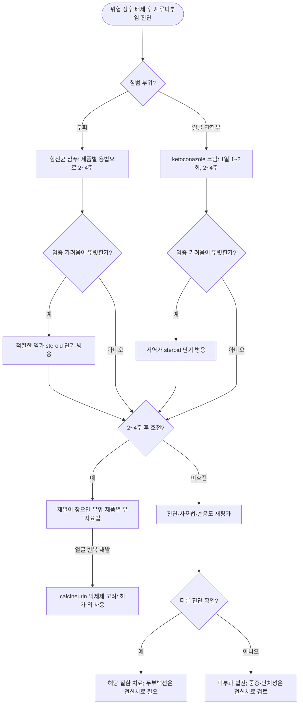

# 지루피부염 Seborrheic Dermatitis

## <mark style="color:green;">일반 사항</mark>

* 피지 분비가 많은 부위에 홍반과 비늘이 반복되는 만성 재발성 염증성 피부질환
* 비듬(dandruff)은 두피에 국한된 경증형 또는 지루피부염과 연속선상에 있는 상태로 간주
* 만성적으로 경과하면서 간헐적인 악화(active phase)를 보임
* 계절적 변화 : 겨울\~이른 봄에 악화되는 경우가 많고 여름에 호전되는 경향
* 유병률 : 성인에서 수% 정도로 흔하며 연구·진단 기준에 따라 차이가 큼; 비듬 수준의 경증형까지 포함하면 더 흔함; 영아형은 생후 수개월 내 흔함
* 분포
  * 피지 많은 부위 : 두피(가장 흔함), 눈썹, 눈꺼풀, 미간, 코/입술 주름부, 귀, 턱밑, 가슴 중앙부
  * 겹친 부위 : 겨드랑이, 사타구니, 유방 밑 주름, 엉덩이 틈새

## <mark style="color:green;">원인</mark>

* 정확한 원인은 불명확함
* **Malassezia에 대한 비정상적인 숙주 염증반응, 피지 분비 및 조성, 피부장벽 이상, 개인의 면역학적 감수성** 등이 복합적으로 관여

### <mark style="color:orange;">위험 인자</mark>

* 감정적 스트레스, 수면 부족 등
* 파킨슨병 및 기타 신경계 질환/CNS 손상
* HIV 감염, 장기 이식 등 면역저하 상태
* 일부 약물과의 연관성이 보고되어 있으나 드물며 인과관계가 명확하지 않은 경우가 많음

## <mark style="color:green;">임상 양상</mark>

* 비듬 : fine, white scale
* 심한 경우 yellowish, greasy scale 및 각질 아래 붉은 염증성 반/판
* 가려움(보통 경증), 작열감; active phase 시 자각 증상 악화
* 대개 피지 분비가 많은 부위에 대칭적으로 발생
* 피부색이 짙은 환자에서는 홍반이 뚜렷하지 않을 수 있으며, 저색소성 미세 인설 또는 염증 후 색소 변화가 두드러질 수 있음(AFP, 2025)
* 갑자기 매우 심해지거나 광범위하게 발생한 경우에는 면역저하 등 기저질환 가능성을 고려; 병력·위험요인과 동반 소견에 따라 HIV 검사 등을 시행하며, 지루피부염만으로 모든 환자에게 HIV 검사를 일률적으로 시행하지는 않음

### <mark style="color:$danger;">🚩 Red Flags!</mark>

<mark style="color:$danger;">**즉각 조치**</mark>

* erythroderma(홍피증) 또는 광범위한 피부박리와 전신상태 악화 → 응급 평가 및 의뢰
* 빠르게 진행하는 안면/두피 감염에 고열·심한 통증·전신독성 동반 → 중증 감염 평가 및 응급 의뢰

<mark style="color:$warning;">**당일 평가**</mark>

* 전신독성은 없더라도 퍼지는 발적·열감·부종·압통 등 봉와직염 의심 소견 → 당일 감염 평가 및 치료
* 탈모·broken hair에 통증성 부종·농포/농성 분비물이 동반된 두피 병변 → kerion(독창) 등 염증성 두부백선 의심; 흉터성 탈모 예방을 위해 당일 평가

<mark style="color:$info;">**조기 평가 및 외래 추적**</mark>

* 국소 탈모, broken hair, 국소 림프절병증 등 비염증성 두부백선 의심 → 조기 진균검사 및 치료 평가; 국소 항진균 샴푸만으로 치료하지 않음
* 갑자기 발생한 중증·광범위 지루피부염 또는 다른 면역저하 소견 동반 → 조기 기저질환 평가; 전신상태 악화 시 즉각 조치
* 적절한 치료에도 약 4주 내 호전이 뚜렷하지 않음 → 진단·사용법·순응도 재평가; 4\~8주 지속되는 난치성 병변은 피부과 의뢰 고려
* 진단이 불확실하거나 psoriasis, contact dermatitis, lupus 등 다른 질환 감별 필요 → 조기 피부과 평가
* 반복 재발 환자 → 유지요법, 유발요인 및 사용법 점검

***

## <mark style="color:green;">진단</mark>

* 대부분 전형적인 임상 소견으로 진단하며 지루피부염 진단을 위한 특이 검사는 없음
* 비대칭성 병변·탈모·broken hair 등 백선 의심 소견이 있으면 KOH 직접검경 및 필요 시 진균배양을 고려; Malassezia는 정상 피부에도 존재하므로 검출만으로 지루피부염을 확진하지 않음
* 비전형적·난치성이거나 다른 염증성 질환/종양이 의심되면 조직검사 등을 감별 목적으로 고려; 접촉알레르기가 의심되면 첩포검사 고려

### <mark style="color:orange;">감별</mark>

* **건선/지루건선(sebopsoriasis)** : 경계가 비교적 뚜렷하고 두꺼운 인설, hairline 밖으로 확장되는 병변
* **아토피피부염** : 심한 가려움, 삼출/진물, 다른 부위의 전형적 습진 병변
* **두부백선(tinea capitis)/얼굴백선(tinea faciei)** : 비대칭성 병변, 국소 탈모·broken hair, 동물 접촉력 등이 있으면 의심
* **접촉피부염** : 새 샴푸, 염색제, 화장품 또는 헤어제품 사용과의 시간적 관련
* **주사(rosacea)** : 중앙 안면 홍반과 papule/pustule이 우세한 경우
* **입주위/구주위 피부염(periorificial dermatitis)** : 입·코·눈 주변의 작은 papule/pustule이 우세하고 장기간의 얼굴 steroid 사용력과 연관될 수 있음
* **안검염(blepharitis)** : 지루피부염과 동반될 수 있으며 눈꺼풀 가장자리 인설·발적, 이물감 등을 확인; 통증·눈부심·시력저하가 있으면 단순 지루피부염으로 판단하지 않고 안과 평가
* oozing & crusting, 농포, 통증 증가 시 2차 세균감염 감별
* 진단이 불명확하거나 비전형적인 경우 **매우 드물게** cutaneous lupus 등 다른 염증성 피부질환 감별

***


```mermaid
graph TD
    Start(["위험 징후 배제 후 지루피부염 진단"]) ---> Area{"침범 부위?"}
    Area --->|두피| Scalp["항진균 샴푸: 제품별 용법으로 2~4주"]
    Area --->|얼굴·간찰부| Face["ketoconazole 크림: 1일 1~2회, 2~4주"]
    Scalp ---> ScalpSev{"염증·가려움이 뚜렷한가?"}
    Face ---> FaceSev{"염증·가려움이 뚜렷한가?"}
    ScalpSev --->|예| ScalpAnti["적절한 역가 steroid 단기 병용"]
    FaceSev --->|예| FaceAnti["저역가 steroid 단기 병용"]
    ScalpSev --->|아니오| Response{"2~4주 후 호전?"}
    FaceSev --->|아니오| Response
    ScalpAnti ---> Response
    FaceAnti ---> Response
    Response --->|예| Maintain["재발이 잦으면 부위·제품별 유지요법"]
    Response --->|미호전| Reassess["진단·사용법·순응도 재평가"]
    Reassess ---> OtherDx{"다른 진단 확인?"}
    OtherDx --->|예| OtherTx["해당 질환 치료; 두부백선은 전신치료 필요"]
    OtherDx --->|아니오| Derm["피부과 협진; 중증·난치성은 전신치료 검토"]
    Maintain --->|얼굴 반복 재발| Calcineurin["calcineurin 억제제 고려: 허가 외 사용"]
```

<p align="center"><strong>지루피부염 진단 및 치료 알고리듬</strong></p>

***

## <mark style="background-color:$warning;">Management</mark>

### <mark style="color:orange;">치료 방침</mark>

* **급성기**
  * 경증 : 국소 항진균제(ketoconazole, ciclopirox) 또는 항비듬 샴푸를 우선 사용
  * 염증 및 가려움이 뚜렷한 경우 : 국소 항진균제 + 국소 steroid의 단기간 병용
  * 얼굴/간찰부에서 반복적으로 재발하거나 steroid 반복 사용을 피해야 하는 경우 : topical calcineurin inhibitor를 steroid-sparing option으로 고려(off-label)
* **유지요법**
  * 두피 : 재발이 잦으면 항진균 샴푸를 간헐적으로 지속; ketoconazole 2%액은 국내 허가에 따라 1\~2주마다 1회 재발방지 용법 사용
  * 얼굴/몸통 : 재발 양상에 따라 항진균 크림을 주 1\~2회 등 간헐적으로 사용하거나 재발 초기에 치료; 샴푸와 크림의 유지 빈도를 일률적으로 동일하게 적용하지 않음
* 악화 요인 회피 : 두피에 자극적인 hair spray, hair pomade, 염색제 등과의 관련이 있으면 중단/변경
* 충분한 국소치료에도 반응이 없으면 단순히 약제를 강화하기 전에 진단, 사용법 및 순응도를 재평가

## <mark style="color:green;">비-약물 치료 및 예방</mark>

### <mark style="color:orange;">피부 관리</mark>

* 순한 세정제로 규칙적으로 세정하며, 뜨거운 물·강한 마찰·각질을 억지로 떼는 행동을 피함
* 얼굴은 자극이 적은 보습제를 사용하고, 피부를 자극하는 알코올 함유 제품·화장품 등은 피함
* 약용 샴푸 사용 횟수와 두피 접촉 시간은 제품별로 확인; 약물 치료 항목 참조

## <mark style="color:green;">약물 치료</mark>

### <mark style="color:orange;">국소제</mark>

#### <mark style="color:$primary;">항진균제</mark>

* **크림** : ketoconazole 2% <mark style="color:blue;">\[코모졸크림]</mark> 등, 보통 1일 1회; 중증도에 따라 1일 2회 사용 가능. 대개 2\~4주 치료하며 증상이 소실된 후에도 수일간 지속 (☞ p.925)
* **항진균 샴푸(일반의약품·비급여)**

| 성분 및 국내 제품 | 급성기 용법 | 재발방지/유지요법 및 사용법 |
| --- | --- | --- |
| ketoconazole 2% <mark style="color:blue;">\[니조랄2%액]</mark> | 주 2회, 2\~4주 | 국내 허가 재발방지 용법: 1\~2주마다 1회; 3\~5분 접촉 후 충분히 헹굼 |
| **ciclopirox olamine 1.5%** <mark style="color:blue;">\[노비프록스액]</mark> | 국내 허가: 주 2\~3회 또는 필요 시 사용; 약 4주 내 반응 평가 | 재발이 잦으면 주 1회 등 간헐적 유지 사용 고려(임상적 유지요법); 3\~5분 접촉 후 충분히 헹굼 |

* 노비프록스의 국내 성분·농도는 **시클로피록스올아민 1.5%**이며, 국외 ciclopirox 1% 샴푸와 구분
* 눈·점막에 닿지 않도록 함; 눈에 들어가면 물로 충분히 씻음. 4주 내 호전이 없거나 사용 중 자극·접촉피부염이 발생하면 재평가
* 기타 항비듬/각질용해 샴푸 : zinc pyrithione <mark style="color:blue;">\[아치온현탁액]</mark>, selenium sulfide, salicylic acid, sulfur, coal tar 등; 제제별 성분·연령·접촉 시간·국내 판매 여부를 확인하여 보조적으로 선택
* coal tar는 냄새·자극·착색, 각질용해제는 자극으로 사용이 제한될 수 있음

#### <mark style="color:$primary;">Steroid</mark>

* 대상 : 항진균 샴푸/외용제만으로 조절되지 않는 뚜렷한 가려움·홍반 또는 급성 악화 (☞ p.1139)
* **두피** : 병변 중증도에 따라 적절한 역가를 단기간 사용
  * 심한 flare에 한해 clobetasol propionate <mark style="color:blue;">\[더모베이트액]</mark> 등 **매우 강한 역가(superpotent)** 제제를 병변에 제한하여 짧게 사용; 경증의 기본 처방으로 사용하지 않음
  * 더모베이트액은 1일 1\~2회 사용하며 **2주 이상 연속 사용 및 주 50 ㎖를 넘는 사용을 피함**; 건조한 두피에 적용하고 얼굴·눈꺼풀·간찰부에는 사용하지 않음
* **얼굴, 간찰부** : hydrocortisone 1% <mark style="color:blue;">\[락티케어에취씨로션1%]</mark> 등 저역가 제제를 얇게 사용; 대개 5\~7일 이내 호전을 확인하고 중단하며, 필요 시 진찰 후 최장 1\~2주 정도로 제한
* 일반적으로 병변 부위에 1일 1\~2회 적용하며, 고역가 steroid는 장기 연속 사용을 피함
* 주의 : 장기간·반복 사용 시 피부 위축, 모세혈관확장, steroid rosacea/periorificial dermatitis 등 부작용 위험이 증가하므로 특히 얼굴에는 반복적 장기 사용을 피함
* 눈꺼풀에는 피부용 약제를 임의로 적용하지 않으며, steroid 반복 사용 시 안압 상승·녹내장·백내장 위험에 주의; 안검염 동반 시 눈꺼풀 위생 관리 및 필요 시 안과 협진

#### <mark style="color:$primary;">Calcineurin 억제제</mark>

* 얼굴 또는 간찰부에서 반복성 병변이 있거나 국소 steroid의 반복 사용을 피해야 할 때 고려하는 **steroid-sparing option** (지루피부염에는 off-label) (☞ p.1143)
* pimecrolimus 1% <mark style="color:blue;">\[엘리델]</mark>, tacrolimus 0.03%, 0.1% <mark style="color:blue;">\[프로토픽]</mark>
* 통상 1일 2회 얇게 적용; 초기 작열감/따가움이 있을 수 있음. 성인 얼굴의 반복 재발 시 호전 후 tacrolimus 0.1%를 주 2회 사용하는 유지요법 등을 피부과와 상의하여 고려(허가 외 사용)
* 제품별 허가 연령과 주의사항을 확인; 영아에게 임의 사용하지 않으며, 감염된 피부·점막에는 적용하지 않고 자외선 노출을 줄이도록 지도

### <mark style="color:orange;">전신 항진균제(지루피부염에는 허가 외 사용)</mark>

* **통상적인 1차 치료가 아님**
* **국소치료에 비해 근거가 제한적이며 routine therapy로 사용하지 않음**
* 대상 : 적절한 국소 항진균제와 항염증 치료에도 조절되지 않는 **광범위한 중등도\~중증 또는 난치성 지루피부염**에서 제한적으로 고려
* 전신치료 전에 진단 및 순응도를 재평가하고 psoriasis, tinea, contact dermatitis 등 다른 질환을 배제하며 피부과 협진을 고려
* **itraconazole** : 200 ㎎/d ×7일 후, 다음 달부터 매월 첫 2일간 200 ㎎/d을 2개월 추가한 공개 연구 및 3개월 추가한 위약대조 연구가 있음; 연구 요법이며 일률적인 표준 유지요법으로 적용하지 않음 <mark style="color:blue;">\[스포라녹스캡슐]</mark>
  * 처방 전 간질환, 심부전/심실기능 저하 병력, 임신·임신 계획, CYP3A4 약물상호작용을 확인; 지루피부염 치료에는 심부전/심실기능 저하 또는 그 병력 환자와 임부에서 사용하지 않음
  * 간기능 검사를 고려하며 반복 pulse·간질환 위험이 있으면 추적 검사 계획; 황달·진한 소변·심한 피로 또는 부종·호흡곤란 발생 시 중단하고 평가
  * simvastatin/lovastatin, 일부 항부정맥제, 경구 midazolam 등 병용금기 약물을 확인. 캡슐은 식사 직후 복용하며 PPI/H2차단제 등 위산 억제제가 흡수를 줄일 수 있음
* **fluconazole** : 위약대조 연구에서는 **300 ㎎을 주 1회 ×2주** 사용했으나 군 간 유의한 차이가 없었음; 일상적 처방이나 표준 대안으로 권장하기 어려움
* 장기간의 연속 경구 azole 치료는 지루피부염의 일반적인 치료법으로 사용하지 않음

### <mark style="color:orange;">해외 치료 참고</mark>

* **roflumilast foam 0.3% \[Zoryve]** : 미국 FDA에서 2023년 12월 **9세 이상** 지루피부염에 1일 1회 사용으로 승인된 국소 PDE-4 억제제; 국내 처방 가능 여부는 최신 허가·유통 정보를 별도로 확인. 경구 roflumilast 또는 다른 농도의 크림 제형으로 대체하지 않음

***

## <mark style="color:red;">질병코드</mark>

| 코드 | 한글 | 영문 |
| --- | --- | --- |
| L21 | 지루피부염 | Seborrhoeic dermatitis |
| L21.0 | 두피지루 | Seborrhoea capitis |
| L21.1 | 영아지루피부염 | Seborrhoeic infantile dermatitis |
| L21.8 | 기타 지루피부염 | Other seborrhoeic dermatitis |
| L21.9 | 상세불명의 지루피부염 | Seborrhoeic dermatitis, unspecified |

***

## <mark style="color:purple;">처방례</mark>

> **처방례 1. 경증\~중등도 두피 지루피부염**
>
> ```
> 노비프록스액(시클로피록스올아민 1.5%) 190 g/병  주 2~3회 샴푸 ×4주
> ```
>
> _✽호전 후 재발이 잦으면 주 1회 또는 1\~2주에 1회 유지 사용 고려_

> **처방례 2. 염증·가려움이 심한 두피 flare**
>
> ```
> 노비프록스액(시클로피록스올아민 1.5%) 190 g/병  주 2~3회 샴푸 ×4주
> 더모베이트액  건조한 두피 병변에 얇게 qd ×7일
> ```
>
> _✽매우 강한 역가 제제이므로 심한 두피 염증에 제한; 호전되면 즉시 중단하고 7일째 재평가. 2주 이상 연속 사용 및 주 50 ㎖ 초과 사용을 피하며 얼굴·눈꺼풀에는 사용하지 않음_

> **처방례 3. 반복성 얼굴 지루피부염**
>
> ```
> 코모졸크림(ketoconazole 2%)  병변에 얇게 qd ×2~4주
> ```
>
> _✽중증도에 따라 크림 bid 사용 가능; 염증이 뚜렷하면 hydrocortisone 1%를 5~7일 정도 단기 병용. 반복 재발 시 pimecrolimus/tacrolimus 고려(지루피부염에는 허가 외 사용)_

> **처방례 4. 치료 불응성 또는 광범위 중등도\~중증**
>
> ```
> 스포라녹스캡슐 100 ㎎  1회 2캡슐 qd 식사 직후 ×7일
> ```
>
> _✽허가 외 사용이며 피부과 협진하에 선별된 성인에게 고려. 반응과 위험을 검토한 뒤 다음 달부터 매월 첫 2일간 200 ㎎/d ×2개월 추가 여부를 개별 결정(공개 연구 요법). 심부전 병력·임신·간기능 및 병용금기 약물 확인_

***

### <mark style="color:$success;">핵심 복약 지도</mark>

> **항진균 샴푸는 정확한 방법으로 사용해야 효과가 있습니다**
>
> * 두피를 충분히 적신 후 샴푸를 도포하고 거품을 낸 상태로 제품 설명서에 따른 시간 동안 유지한 뒤 완전히 헹구도록 안내하십시오. 니조랄2%액과 노비프록스액은 3~5분 접촉 후 헹굽니다. 눈에 들어가지 않도록 주의하십시오.
> * 니조랄2%액은 주 2회 2~4주, 노비프록스액은 주 2~3회 사용하고 약 4주 내 치료 반응을 평가합니다.
> * 재발이 잦은 경우 호전 후 빈도를 줄여 유지 사용을 고려하십시오. 니조랄2%액의 재발방지 용법은 1~2주마다 1회이며, 모든 환자에게 무기한 유지 사용을 일률적으로 권하지는 않습니다.

> **스테로이드 외용제는 단기간만 사용하도록 안내하십시오**
>
> * 두피는 상대적으로 고역가 제제를 짧게(보통 1\~2주 이내) 사용할 수 있으나, 얼굴·간찰부에는 저역가 제제를 보통 5~7일 정도 사용하고 호전을 확인하여 중단합니다.
> * 반복적·장기적으로 사용하면 피부 위축, 모세혈관확장, steroid rosacea/periorificial dermatitis가 발생할 수 있음을 설명하고, 남은 약을 임의로 장기간 사용하지 않도록 안내하십시오.
> * 얼굴에 반복 재발하여 steroid 반복 사용을 피해야 하는 경우 calcineurin 억제제(pimecrolimus, tacrolimus) 사용을 고려할 수 있음을 설명하십시오.

> **지루피부염은 재발이 흔하지만 잘 조절할 수 있는 만성 피부질환입니다**
>
> * 계절(겨울\~이른 봄), 스트레스, 수면 부족 등에 따라 악화와 호전을 반복한다는 점을 미리 설명해 불안감을 줄이십시오.
> * 두피 자극 요인(헤어스프레이, 헤어 포마드, 염색제 등)이 확인되면 중단·변경을 권고하십시오.

> **언제 다시 병원을 방문해야 하나요?**
>
> * 적절한 국소치료에도 약 4주 내 호전이 뚜렷하지 않거나 반복적으로 악화되는 경우
> * 병변 부위에 탈모, 국소 림프절병증이 동반되는 경우
> * 갑자기 광범위하고 심하게 악화되는 경우 - 기저 면역저하 질환 감별 필요
> * 얼굴에 스테로이드를 사용한 후 오히려 발적·여드름양 병변이 생기는 경우 - 추가 사용을 보류하고 내원; 이미 장기간 연용한 경우 감량·중단 방법을 진료 시 결정

***

## <mark style="color:blue;">환자 안내서</mark>


**지루피부염은 재발이 흔하지만 잘 조절할 수 있습니다**

지루피부염은 피지가 많이 분비되는 두피, 눈썹, 코 옆, 귀 등에 비듬 같은 각질과 붉은 기가 반복해서 생기는 만성 재발성 피부질환입니다. 증상이 좋아졌다가 다시 나타날 수 있지만, 꾸준히 관리하면 대부분 잘 조절할 수 있습니다. 전염되는 질환이 아니며, 위생이 나빠서 생기는 병도 아닙니다.


#### <mark style="color:$primary;">왜 지루피부염이 생기나요?</mark>

* 피부에 정상적으로 존재하는 Malassezia라는 균에 대한 피부 반응과 피지 분비, 피부 장벽 등이 함께 영향을 줍니다.
* 스트레스, 수면 부족, 건조하고 추운 날씨(특히 겨울\~이른 봄)에 악화되는 경향이 있습니다.

#### <mark style="color:$primary;">일상생활에서 어떻게 관리하나요?</mark>

* **자극적인 헤어 제품을 피하십시오.** 헤어스프레이, 포마드, 잦은 염색·펌은 증상을 악화시킬 수 있습니다.
* **두피를 부드럽게 세정하십시오.** 손톱으로 긁거나 각질을 억지로 떼지 마십시오. 약용 샴푸는 제품 설명서의 접촉 시간을 지키고 충분히 헹구십시오. 니조랄2%액과 노비프록스액은 3~5분 뒤 헹굽니다.
* **재발이 잦으면 유지 사용을 상의하십시오.** 의사가 권한 빈도로 약용 샴푸를 줄여 사용하면 재발을 줄이는 데 도움이 됩니다.
* 스트레스 관리와 규칙적인 수면도 증상 조절에 도움이 됩니다.

#### <mark style="color:$primary;">약은 어떻게 써야 하나요?</mark>

* 항진균 샴푸·크림은 처방받은 기간만큼 꾸준히 사용하십시오. 며칠 사용 후 좋아졌다고 바로 중단하면 재발하기 쉽습니다.
* 스테로이드 연고나 액제는 **의사가 안내한 부위와 기간만** 사용하십시오. 얼굴은 보통 5~7일, 두피도 대개 1~2주 이내로 짧게 사용합니다. 오래 바르면 피부가 얇아지거나 실핏줄이 비치거나, 오히려 여드름 같은 발진이 생길 수 있습니다. 눈꺼풀에 임의로 바르지 마십시오.

#### <mark style="color:$primary;">다시 진료가 필요한 경우</mark>

* 약을 4주 정도 사용해도 뚜렷하게 좋아지지 않는 경우
* 병변 부위의 머리카락이 빠지거나 목·귀 주변 임파선이 부어오르는 경우
* 얼굴에 바른 연고 때문에 오히려 발진이나 여드름이 심해지는 경우

#### <mark style="color:$primary;">당일 또는 즉시 진료가 필요한 경우</mark>

* 갑자기 피부 전체가 붉어지고 넓게 벗겨지면서 전신상태가 나빠지는 경우
* 얼굴이나 두피의 붉은 기·부종·통증이 퍼지는 경우에는 당일 진료를 받으십시오. 빠르게 심해지면서 고열·심한 통증·전신상태 악화가 동반되면 즉시 응급 진료를 받으십시오.
* 머리카락이 빠지는 부위가 아프게 붓거나 고름이 나는 경우에는 당일 진료를 받으십시오.

***

## <mark style="color:green;">영아 지루피부염(Cradle cap) - 특수 상황</mark>

* 대부분 자연 호전되는 경향이 있으므로 보존적 치료가 우선
* 무향 영아용 샴푸로 세정. 두꺼운 인설에는 소량의 mineral oil 등으로 미리 부드럽게 한 뒤 부드러운 솔/빗으로 느슨해진 각질만 제거하고 샴푸로 잔여 오일을 씻어냄; 각질을 억지로 긁거나 떼지 않음
* 성인용 약용 샴푸·salicylic acid 함유제·강한 steroid를 보호자가 임의로 사용하지 않음
* 홍반·염증이 뚜렷하거나 지속되는 경우 진료 후 hydrocortisone 1% 등 저역가 국소 steroid를 소범위에 5~7일 정도 짧게 고려; 영아에서 제제별 금기·허가사항을 확인하고 기저귀 아래/밀봉 상태·넓은 부위의 장기 사용을 피함
* 항진균 외용제는 진료 후 필요성을 판단하고 영아 허가·안전성 자료가 제한적일 수 있음을 고려
* 광범위하거나 치료에 반응하지 않고 성장부진, 반복감염 등 다른 이상 소견이 동반되면 아토피피부염, 감염, 면역저하 등 다른 질환을 재평가

***

### <mark style="color:blue;">주요 근거 및 제품정보</mark>

* [Seborrheic Dermatitis: Diagnosis and Treatment. AFP 2025;112:166–173](https://www.aafp.org/afp/2025/0800/seborrheic-dermatitis)
* [태극제약: 노비프록스액 제품정보](https://www.taiguk.co.kr/product/view.jsp?pid=AHG72261), [휴온스: 니조랄2%액 설명서](https://huons.com/file/item/329_1/니조랄2%액_insert_201223.pdf), [대화제약: 코모졸크림 제품정보](https://www.dhpharm.co.kr/html/dh/DH_product_detail?idx=208)
* [GSK: 더모베이트액·연고 제품 설명서(약학정보원 제공)](https://common.health.kr/shared/images/insert_pdf/IN_A11A0040B0081_00.pdf) — 오래된 설명서이므로 실제 처방 시 최신 허가사항 확인
* [성인 얼굴 지루피부염의 tacrolimus 0.1% 유지요법: Acta Derm Venereol 2013](https://pubmed.ncbi.nlm.nih.gov/23388687/)
* [Itraconazole 공개 연구: JEADV 2005](https://pubmed.ncbi.nlm.nih.gov/15752285/), [Itraconazole 위약대조 연구: Am J Clin Dermatol 2015](https://pubmed.ncbi.nlm.nih.gov/26016699/)
* [Fluconazole 위약대조 연구: Am J Clin Dermatol 2007](https://pubmed.ncbi.nlm.nih.gov/17645378/)
* [AAD: 영아 cradle cap 관리](https://www.aad.org/public/everyday-care/hair-scalp-care/scalp/treat-cradle-cap)
* [Arcutis: roflumilast foam 0.3%의 미국 지루피부염 승인](https://www.arcutis.com/fda-approves-arcutis-zoryve-roflumilast-topical-foam-0-3-for-the-treatment-of-seborrheic-dermatitis-in-individuals-aged-9-years-and-older/)
