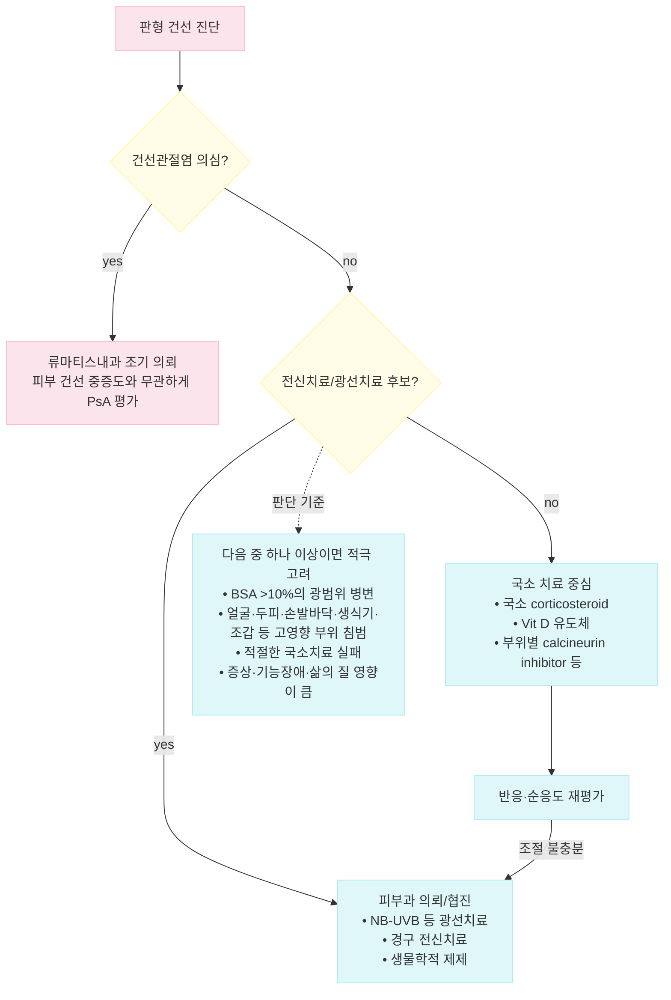

# 건선 Psoriasis

## <mark style="color:green;">일반 사항</mark>

* **정의 (AAD-NPF, 2019)** : T세포 매개 면역 이상을 중심으로 한 만성 재발성 면역매개 염증질환으로, 각질형성세포의 증식·분화가 가속화되어 특징적인 경계 명확한 홍반성 인설성 판을 형성함
* 분포 : 전신, 자극받기 쉬운 부분에 흔함; 팔꿈치, 무릎, 두피, 요천추부, 엉덩이 틈새, 손발바닥, 손발톱, 음경 귀두
* 분류 : 판형건선(가장 흔함), 역위건선, 홍색피부건선, 농포성 건선, 물방울건선, 조갑건선, 건선관절염 (☞ 아래 「종류」 참조)
* 호발 연령 : 이중 정점 분포 - 20\~30대(초발), 50\~60대(만발); 국내 자료에서 평균 발병 연령은 남 35.7세, 여 36.3세로 보고됨(국민건강보험공단, 2014\~2018)
* 유병률 : 전 세계 인구의 약 2\~3%(서구 기준); 한국을 포함한 아시아권에서는 상대적으로 낮게 보고되며, 국내 건강보험 진료인원은 연간 약 16만 명 수준(국민건강보험공단, 2014\~2018)\
  ✽정확한 국내 유병률은 조사마다 차이가 있어 단일 수치로 단정하지 않음
* 경과 : 보통 평생 지속(증상의 변동은 있을 수 있음)
  * 치료에 반응이 있으면 1\~2달 내 호전
  * 오랜 기간 동안 진행되거나 국소 부위에서 갑작스럽게 악화

## <mark style="color:green;">원인</mark>

* 불명; 감염 또는 전염성 질환은 아님
* 유전; 환자의 40%에서 가족력이 있음
* 환경, 면역 관련

### <mark style="color:orange;">위험 인자</mark>

* 국소 외상/자극
* 감염 : Streptococcus, HIV
* 비만, 정신적 스트레스, 흡연, 알코올
* 약물 : lithium, β-차단제, 항말라리아제, interferon, steroid 금단

### <mark style="color:orange;">동반 질환</mark>

* 비만, 당뇨병, 대사증후군, 만성 신질환, 심혈관 질환, 비-알코올 지방간질환
* 자가면역 질환 : 크론병, 원형탈모증
* 일부 연구에서 특히 중증 건선과 림프증식성 질환 위험 증가의 연관성이 보고되었으나 절대위험은 낮고 질환 중증도·치료의 영향이 혼재함
* 우울・불안 등 정신건강 문제, 삶의 질 저하 (☞ Red Flags Tier 3 참조)

## <mark style="color:green;">임상 양상</mark>

* 두꺼운 은색의 비늘로 덮인, 경계가 명확한 홍반성 구진 및 판
* 손발톱 미세 함몰(stippling, pitting)
* 통증(특히 홍색피부건선, 건선관절염 관절통), 가려움(특히 물방울건선), 손발톱 변형(조갑건선)
* 발열 없음(예외 : 홍색피부건선, 농포성 건선)
* Koebner's phenomenon : 피부 손상 부위에 새로운 건선 병소 발생
* Auspitz's sign : 건선 판을 긁어내면 기저부에서 점상 출혈 발생
* Sebopsoriasis : 지루피부염에 건선이 병발하여 기름진 인설 형성; 두피, 눈썹, nasolabial fold, 귀뒤, 흉골 부위 이환

### <mark style="color:$danger;">🚩 Red Flags!</mark>

<mark style="color:$danger;">**즉각 조치 또는 의뢰**</mark>

* **전신 농포성 건선(generalized pustular psoriasis)** : 광범위한 무균성 농포와 고열, 오한, 저혈압, 전신독성, 탈수 또는 전해질 이상 동반
* **홍색피부건선(erythrodermic psoriasis)** : 거의 전신을 침범하는 홍반·박리와 체온조절 장애, 탈수, 저혈압, 심부전 또는 전해질 이상 동반
* **홍색피부건선 또는 전신 농포성 건선에 동반된** 패혈증, 심폐부전 또는 중증 전신상태 악화가 의심되는 경우

<mark style="color:$warning;">**당일 또는 조기 의뢰**</mark>

* 빠르게 진행하거나 광범위한 건선, 적절한 국소 치료에도 조절되지 않는 건선
* 얼굴·생식기·손발바닥·두피·조갑 등 기능 또는 삶의 질에 큰 영향을 주는 부위의 중증 침범
* 건선관절염 의심 : 지속적인 관절통/종창, 아침 강직, dactylitis, enthesitis, 염증성 요통 → **류마티스내과 조기 의뢰**
* 광선치료 또는 전신치료가 필요한 경우 → **피부과 의뢰**

<mark style="color:$info;">**외래 추적 / 추가 평가 계획**</mark> <mark style="color:$info;">- 즉각 위험 낮으나 호전 없으면 의뢰</mark>

* 비만, 고혈압, 당뇨병, 이상지질혈증 등 심혈관·대사 위험인자 - 연령에 관계없이 주기적 평가
* 우울・불안, 흡연, 고위험 음주 등 장기 예후와 삶의 질에 영향을 주는 요인

## <mark style="color:green;">종류</mark>

<table><thead><tr><th width="130">아형</th><th width="80">빈도</th><th width="240">특징적 소견</th><th>호발 부위 / 비고</th></tr></thead><tbody><tr><td>판형건선<br>(Plaque psoriasis)</td><td>80\~90%</td><td>은백색 인설로 덮인 경계 명확한 홍반성 판(1\~10 ㎝)</td><td>두피, 팔꿈치・무릎(신측부), 요천추부, 손발바닥, 엉덩이 틈새</td></tr><tr><td>역위건선<br>(Inverse psoriasis)</td><td>-</td><td>표면이 매끈한 홍반성 판(비늘 없을 수 있음), 짓무름</td><td>겨드랑이, 사타구니, 유방 아래, 배꼽 (마찰・땀 유발)</td></tr><tr><td>홍색피부건선<br>(Erythrodermic)</td><td>1\~2%</td><td>넓은 범위의 진한 홍반, 체온조절 장애 - <strong>생명 위협</strong></td><td>전신치료 급중단, steroid 금단 등이 유발</td></tr><tr><td>농포성 건선<br>(Pustular)</td><td>-</td><td>비감염성 백색 농포 + 주변 발적; 전신형은 고열 동반</td><td>국소(손발) 또는 전신; steroid 금단이 대표 유발인자</td></tr><tr><td>물방울건선<br>(Guttate)</td><td>&lt;2%</td><td>작은(1\~10 ㎜) 둥근 물방울형 구진</td><td>&lt;30세(소아청소년); 몸통・상지・허벅지・두피; 연쇄상구균 인두염 후 호발</td></tr><tr><td>조갑건선<br>(Nail)</td><td>≥50%<br>(건선 환자 중)</td><td>pitting, 조갑 박리, 조갑하 과다각화증</td><td>건선관절염과 연관성 높음</td></tr><tr><td>건선관절염<br>(Psoriatic arthritis)</td><td>~⅓<br>(건선 환자 중)</td><td>관절통/종창, dactylitis, enthesitis, 염증성 요통</td><td>피부 중증도와 무관하게 발생 가능 - 주기적 선별 필요</td></tr></tbody></table>

### <mark style="color:orange;">판형건선 (Plaque psoriasis, Psoriasis vulgaris)</mark>

* 빈도 : 전체 건선 중 80\~90% 차지
* 모양 : 은백색 인설로 덮인 경계가 명확한 다양한 크기(보통 1\~10 ㎝)의 홍반; 천천히 커지거나 오랜 기간 동안 변화 없이 유지
* 증상 : 가려움, 통증, 갈라짐, 출혈
* 부위 : 두피, 사지 신측부(팔꿈치, 무릎), lower back, 얼굴, 손발바닥, 엉덩이 틈새

### <mark style="color:orange;">역위건선 (Inverse psoriasis, Intertriginous psoriasis)</mark>

* 모양 : 경계가 명확한 표면이 매끈한 홍반성 비늘성 판(비늘은 없을 수 있음), 짓무름
* 부위 : 마찰부, 굴곡부; 겨드랑이, 사타구니, 유방 아래, 배꼽
* 유발 인자 : 마찰, 땀

### <mark style="color:orange;">홍색피부건선 (Erythrodermic psoriasis)</mark>

* 빈도 : 1\~2% 해당
* 모양 : 넓은 범위의 진한 홍반(fiery redness)
* 증상 : 심한 가려움, 통증, 피부 벗겨짐, 탈모, 조갑 이상, 체온 오르내림(체온 유지 장애), 오한, 심부전, 탈수, 전해질 이상; 생명 위협
* 유발 인자 : 심한 일광 화상, 알레르기, 전신적 건선 치료 중 갑작스런 중단, 전신 steroid 사용, 감염, 감정적 스트레스, 알코올 남용, 약물(예: lithium, 항말라리아제, coal tar)

### <mark style="color:orange;">고름물집건선, 농포성 건선 (Pustular psoriasis)</mark>

* 모양 : 흰색의 농포(비감염성 고름) 및 주위 발적
* 부위 : 국소(손, 발) 또는 전신
* 전신성 건선의 경과 : 전신적 무균성 농포 → 융합 → 마르면서 얇게 떨어져 나감 → 심한 홍반, 고열 동반(39\~40℃, 수일간 지속); 이 과정이 반복됨. 치료하지 않으면 위험
* 유발 인자 : 감염, 임신, 약물, 스트레스, 과도한 자외선 조사 등; 특히 **전신 corticosteroid의 급격한 감량·중단**이 중요한 유발인자로 알려져 있음

### <mark style="color:orange;">물방울건선 (Guttate psoriasis, Eruptive psoriasis)</mark>

* 빈도 : ＜2% 해당; ＜30세(특히 소아청소년)
* 증상 : 많은 수의 작고(1\~10 ㎜) 둥근 물방울 모양의 홍반성 비늘성 구진
* 부위 : 몸통, 상지, 허벅지, 두피
* 다른 건선(특히 판형 건선)에 동반될 수 있음
* 유발 인자 : GABH Streptococcus 감염(예: 인두염 2\~3주 후), 스트레스, 피부 손상, 약물(예: 항말라리아제, β-차단제)
* 경과 : 상당수는 **수주~수개월 내 자연 관해**하나 일부는 지속되거나 판형건선으로 이행할 수 있음
* 치료 : 보습제·국소 치료를 시행하고, 광범위하거나 지속되는 경우 **NB-UVB**를 고려
* **활동성 연쇄상구균 인두염 등 세균감염이 확인되면 해당 감염의 표준 적응증에 따라 항생제로 치료**하되, 피부 건선을 호전시키기 위한 목적으로 routine antibiotic을 투여하는 근거는 충분하지 않음

### <mark style="color:orange;">조갑건선 (Nail psoriasis)</mark>

* 증상 : 조갑 표면 점상 소와(pit), 갈색 반점, 색깔 변화(yellow-brown), 조갑 박리, 비후, 통증/압통, 조갑하 과다각화증, 손톱 밑 가루 찌꺼기
* 건선 환자의 50% 이상에서 조갑 변화 발생

### <mark style="color:orange;">건선관절염 (Psoriatic arthritis)</mark>

* 빈도 : 건선이 있는 사람들의 \~⅓이 건선관절염을 지님
* 부위 : 주로 손, 발, 무릎 관절
* 증상 : 관절통/종창, 아침 또는 휴식 후 심한 관절 강직, dactylitis(소시지 모양 손발가락), enthesitis, 염증성 요통 등 다양한 형태로 나타남
* 조갑건선은 건선관절염과 연관성이 높음
* 피부 건선의 중증도와 관계없이 발생할 수 있으므로 **연 1회 건선관절염 선별**을 고려하며, 특히 건선 발병 후 첫 10년간 중요함

## <mark style="color:green;">진단</mark>

* 대부분 **임상적으로 진단**하며 건선을 확진하는 특이 혈액검사는 없음
* 비전형적 병변 또는 감별이 필요한 경우 선택적으로 검사
  * KOH/진균검사 : 체부백선, 완선, 조갑백선 등 감별
  * 피부 조직검사 : 임상진단이 불확실하거나 다른 염증성/종양성 피부질환과 감별이 필요한 경우
  * 관절 증상이 있는 경우 : 건선관절염 평가를 위해 필요한 영상검사·혈액검사를 임상상에 따라 시행
* 건선 중증도는 **BSA/PGA, 병변 위치(특수·고영향 부위), 증상, 기능 장애와 삶의 질(DLQI 등)**을 함께 평가; PASI는 주로 임상시험 및 전문진료 영역에서 활용
* 건선 환자에서는 연령에 관계없이 비만, 혈압, 당뇨병, 이상지질혈증 등 심혈관·대사 위험인자를 주기적으로 평가
  * 혈압·체중/BMI는 정기적으로 확인하고, 혈당·지질검사는 연령·위험인자 및 국내 건강검진/관련 지침에 따라 시행; 중증 건선 또는 추가 위험인자가 있으면 더 조기·빈번한 선별을 고려
* **건선관절염 선별** : 연 1회 관절통/종창, 아침 강직, dactylitis, enthesitis, 염증성 요통을 확인하며 PEST 등의 간단한 선별도구를 활용할 수 있음(특히 발병 후 첫 10년간 중요)
  * **PEST가 음성이어도** 염증성 요통(axial symptoms), enthesitis 등 임상적으로 의심되는 소견이 있으면 건선관절염을 배제하지 않음

### <mark style="color:orange;">감별 진단</mark>

* 충혈, 인설, 홍반성 병변이 나타날 수 있는 질환들과의 감별이 필요

<table><thead><tr><th width="140">질환</th><th>건선과의 감별 포인트</th></tr></thead><tbody><tr><td>지루피부염 / sebopsoriasis</td><td>보다 기름진 인설, 두피・눈썹・비순구 등 지루 부위 우세; 건선과 병발(sebopsoriasis) 가능</td></tr><tr><td>체부백선・완선・조갑백선</td><td>진행성 경계와 중심부 치유 경향; KOH 검사로 확진</td></tr><tr><td>화폐상습진・아토피피부염・접촉피부염</td><td>인설이 얇고 은백색이 아님; 소양감이 더 두드러지고 병력(아토피, 접촉원)이 특징적</td></tr><tr><td>장미색비강진</td><td>herald patch 선행, 크리스마스트리 양상 분포, 자연 관해(수 주\~수개월)</td></tr><tr><td>편평태선</td><td>보라색(violaceous) 다각형 구진, Wickham's striae, 점막 침범 흔함</td></tr><tr><td>2기 매독</td><td>손발바닥 침범 시 특히 감별; 성병력 확인, RPR/VDRL 등 비트레포네마 검사 선별 후 treponemal test(TPPA, FTA-ABS 등)로 확인</td></tr><tr><td>Cutaneous T-cell lymphoma</td><td>비전형적이거나 치료 불응성인 경우 고려; 조직검사로 확진</td></tr></tbody></table>

***



_<고영향 부위: 얼굴, 두피, 손/발바닥, 생식기, 조갑 등>_

<p align="center"><strong>판형 건선의 치료 접근</strong></p>

<p align="center"><em><mark style="color:$info;">Ref. JAMA. 2020;323(19); 치료 후보 판단은 AAD-NPF 및 NICE CG153 원칙에 맞추어 BSA 단독 문턱값보다 고영향 부위, 국소치료 실패, 기능·삶의 질 영향을 함께 반영함</mark></em></p>

***

## <mark style="background-color:$warning;">Management</mark>

### <mark style="color:orange;">치료 방침</mark>

* 치료 방법과 예상 경과(완치가 쉽지 않은 만성 질환)에 대하여 설명
* 생활 습관 조정과 동반질환 관리의 중요성을 교육
* **국소 치료 중심** : 제한된 판형건선으로 기능·삶의 질 영향이 크지 않은 경우
* **광선치료/전신치료 또는 피부과 의뢰를 고려하는 경우**
  * BSA ＞10%의 광범위 병변
  * 얼굴·두피·손발바닥·생식기·조갑 등 **특수/고영향 부위** 침범
  * 적절한 국소 치료에 반응하지 않거나 반복 재발하여 일상생활에 큰 지장을 주는 경우
  * **BSA/PGA, 증상, 기능장애 및 DLQI 등에서 질환 부담이 큰 경우**
* BSA가 작더라도 특수부위 침범이나 기능장애가 크면 중증도가 낮다고 판단하지 않음

## <mark style="color:green;">비-약물 치료 및 예방</mark>

* 회피 : 외상, 자극, 일광 화상, 흡연, 음주, 건조, 스트레스, 손에 대한 세제 자극
* 적절한 피부 보습, oatmeal bath (☞ p.866)
* 비만 시 체중 감량
* 조갑을 길지 않게 유지; 매니큐어 등 미용 목적의 조갑 손질을 하지 않음
* 적절한 햇볕 노출 (지나친 노출은 피부암 등의 위험이 있음)

## <mark style="color:green;">약물 치료</mark>

### <mark style="color:orange;">국소 치료제</mark>

#### <mark style="color:$primary;">국소 Steroid</mark>

* 작용 : 항염, 각질 세포 증식 억제, 면역 억제, 혈관 수축
* 고역가제 사용 후 증상 경과에 따라 간헐적 유지요법(예: 주 2회) 또는 저역가제로 전환
* **clobetasol propionate 0.05%** : 보통 qd\~bid, 단기간 사용; 제품별 허가사항의 최대 사용기간·주당 사용량을 확인
* 소아, 얼굴, 겹친 부위는 처음부터 저역가제 선택
* 조갑건선 : 2\~3개월간 nail fold에 도포, 야간 도포; 국소제로 치료 잘 안 됨

#### <mark style="color:$primary;">Calcineurin 억제제</mark>

* 국소 steroid 대체제로 선택. 얼굴, 겹친 부위에 적용; 판형건선에서는 효과 적음
* 부작용 : 작열감, 가려움, 홍반
* pimecrolimus 1% <mark style="color:blue;">\[엘리델]</mark>, tacrolimus 0.03%/0.1% <mark style="color:blue;">\[프로토픽]</mark>; 보통 1일 2회 도포

#### <mark style="color:$primary;">Vit D 유도체</mark>

* 작용 : 각질 세포 증식 억제, 항염
* steroid보다 효과 발현이 늦지만(보통 4주 내 효과 발현) disease-free 기간은 길게 유지됨
* 단독 또는 국소 steroid에 병합, 또는 국소 steroid 중단 기간 중 적용
* 부작용 : 작열감, 가려움, 부종, 건조, 피부 벗겨짐, 홍반; 보통 사용하면서 호전되나 얼굴과 사타구니에는 도포하기 어려움
  * 광범위 도포 시 고칼슘혈증을 유발할 수 있으므로 최대 사용량을 제한함
* calcipotriene(=calcipotriol) : 고역가 steroid와 비슷한 수준의 효과
  * 0.005% qd\~bid, 1주 최대 50 g(청소년)\~100 g(성인) <mark style="color:blue;">\[다이보넥스]</mark>
  * 국소 steroid와의 병용 시 효과 상승; 두 제제를 별도로 적용하는 경우 다른 시간(예: 각각 아침과 저녁)에 도포(halobetasol은 예외); <mark style="color:blue;">\[다이보베트]</mark>(calcipotriol+betamethasone 복합제, qd) (보험주의)
* calcitriol : 정상 피부에 대한 자극이 보다 적음; 0.0003% bid, 최대 200 g/wk <mark style="color:blue;">\[실키스]</mark> (비급여)
* tacalcitol : 0.0002% bid, 최대 70 g/wk <mark style="color:blue;">\[본알파 하이]</mark>
* **salicylic acid, lactic acid 등 산성 제제는 calcipotriol을 불활성화할 수 있으므로 같은 부위에 동시에 혼합·도포하지 않음**
  * 각질 용해가 필요한 경우 시간 간격을 두어 사용하거나, salicylic acid 샴푸/제제를 사용 후 씻어낸 뒤 calcipotriol을 도포

#### <mark style="color:$primary;">Retinoid (Vit A 유도체)</mark>

* 작용 : 각질 세포 증식 억제
* 효과 : 고역가 steroid와 비슷한 수준의 효과; 국소 steroid와의 병용으로 효과 상승
* 부작용 : 자극감, 광과민
* tazarotene : cream or gel 0.05\~0.1% qd (✽다른 retinoid제제들은 건선 치료 효과가 입증 안 됨)

#### <mark style="color:$primary;">각질 용해제</mark>

* 작용 : 각질 완화, 다른 국소 치료제의 침투력을 향상시킴(특히 두피에서 중요)
* salicylic acid <mark style="color:blue;">\[클리어틴]</mark> (비급여), ammonium lactate <mark style="color:blue;">\[타로 암모늄락테이트]</mark>(1일 2회), urea <mark style="color:blue;">\[유리아]</mark>(1일 수회/d), lactic acid

#### <mark style="color:$primary;">타르</mark>

* 작용 : 가려움 감소, 항균, 표피 과증식 억제. 광선 치료 효과 향상
* 적용 : 주 1\~2회, 심한 정도에 따라 매일 또는 필요시 사용

#### <mark style="color:$primary;">광선 치료</mark>

* 작용 : 면역 조절, 각질형성세포 증식 억제
* **NB-UVB(narrowband UVB)**가 판형·물방울건선에서 대표적으로 사용되는 광선치료이며, 국소 치료로 조절되지 않거나 광범위한 경우 피부과에서 고려
* 보통 주 2\~3회 반복 치료가 필요하며 치료 반응에 따라 수주~수개월 시행
* 장점 : 전신 약물 노출을 피할 수 있고 광범위 병변에도 적용 가능
* 단점 : 반복적인 내원 필요, 홍반·화상·광노화가 발생할 수 있으며 누적 자외선 노출을 고려해야 함
* PUVA는 선택된 환자에서 고려할 수 있으나 psoralen 관련 부작용 및 장기 광독성/피부암 위험 등을 고려하여 전문진료 영역에서 시행

### <mark style="color:orange;">전신 치료제</mark>

* 광범위 건선, 특수부위 중증 침범, 국소치료 실패 또는 삶의 질/기능장애가 큰 경우 **피부과에서 광선치료 또는 전신치료를 고려**
* 건선관절염이 의심되거나 확인된 경우 **류마티스내과 조기 의뢰**
* **Systemic corticosteroid는 건선 자체의 통상적 전신치료로 권장하지 않음.** 특히 고용량 사용 후 또는 갑작스러운 중단 뒤 rebound, pustular/erythrodermic flare가 발생할 수 있어 주의
* 전신 면역조절치료 시작 전 **예방접종력과 감염 위험**을 확인
  * 불활성화·재조합 백신(예: influenza, COVID-19, recombinant zoster vaccine)은 일반적으로 투여 가능
  * **생백신(live attenuated vaccine)은 면역억제 정도와 약제에 따라 치료 중 피해야 하며**, 필요한 경우 약제별 반감기·지침에 따라 치료 시작 전 또는 일시 중단 기간을 조정하여 접종

#### <mark style="color:$primary;">전신치료 고려 기준 [NICE CG153]</mark>

다음 **①과 ②를 모두 충족**하면서 **③ 중 하나 이상**에 해당하면 conventional systemic treatment를 고려함.

1. **국소 치료만으로 충분히 조절되지 않음**
2. 건선이 환자의 **신체적·심리적·사회적 안녕에 유의한 영향을 줌**
3. 다음 중 하나 이상
   * **광범위 건선** : 예) BSA ＞10%
   * BSA는 작더라도 **기능장애 또는 심한 고통을 초래하는 국소 중증 건선**(예: 손발톱의 심한 침범, high-impact/difficult-to-treat site)
   * **광선치료가 효과적이지 않거나 사용할 수 없거나 적합하지 않은 경우**

✽ **PASI는 임상시험·전문진료 및 치료반응 평가에서 널리 사용되고 국내 급여 판정에서도 중요한 지표**이나, 일차진료에서 전신치료 후보를 가르는 단독 필수 문턱값으로 사용하지 않음.


전신치료·생물학적 제제의 **HIRA 급여 인정 기준**(BSA·PASI 컷오프, 이전 치료 실패 이력 요건 등)은 약제·적응증별로 상이하며 수시로 개정되므로, 처방 전 최신 HIRA 고시를 반드시 확인할 것


#### <mark style="color:$primary;">비생물학적 제제</mark>

* 종류 : methotrexate, apremilast, acitretin, cyclosporine
* **methotrexate**
  * 중등증~중증 판형건선 및 건선관절염에서 사용할 수 있는 전신치료제
  * 성인에서 보통 **주 1회** 투여하며 용량은 반응·내약성에 따라 조절(일반적으로 7.5~25 ㎎/wk 범위)
  * 매일 복용하는 약이 아님을 명확히 교육
  * folic acid 병용
  * 시작 전 및 치료 중 CBC, AST/ALT, 신기능을 확인하고 임신 가능성, 음주, 비만/당뇨 및 기저 간질환 등 간독성 위험 평가
  * HBV/HCV 등 감염 위험은 환자별 위험도와 치료 계획에 따라 평가
  * TMP/SMX 병용은 골수억제·MTX 독성 위험 때문에 가급적 피함; 신기능 저하 또는 MTX 독성 위험이 있는 환자에서 NSAID 병용에 특히 주의
* **cyclosporine**
  * 효과가 빠르므로 severe/recalcitrant psoriasis, erythrodermic 또는 generalized pustular psoriasis 등에서 유용
  * 보통 2.5~5 ㎎/㎏/d 범위에서 사용하며 혈압·신기능을 면밀히 모니터링
  * 신독성·고혈압 등의 누적 독성 때문에 **장기 연속치료보다는 단기간/간헐적 사용을 선호**
  * 치료 종료 시 재발이 흔하므로 후속 유지치료 계획을 세움. **감량(tapering)은 재발을 약간 지연시키기 위해 고려할 수 있으나 반드시 필요한 중단 원칙은 아님**
* **acitretin**
  * 판형건선, 농포성 건선 등에 사용할 수 있으며 광선치료와 병용 가능
  * **강한 기형유발성**이 있으므로 임신 중에는 금기
  * 임신 가능성이 있는 여성에서는 **치료 1개월 전부터 치료 중 및 복용 중단 후 최소 3년간 효과적인 피임**이 필요함
  * alcohol은 acitretin의 etretinate 전환과 관련될 수 있으므로 치료 중 및 중단 후 일정 기간 음주 회피에 관한 제품 허가사항을 확인
* **apremilast**
  * 경구 PDE-4 억제제로 중등증~중증 판형건선 및 건선관절염에서 장기치료가 가능

#### <mark style="color:$primary;">경구 표적 치료제 - TYK2 억제제</mark>

* **deucravacitinib** <mark style="color:blue;">\[소틱투]</mark>
  * 최초의 경구 선택적·알로스테릭 TYK2(tyrosine kinase 2) 억제제; JAK1/2/3와는 기전이 구분되어 정기적 혈액검사 모니터링 부담이 상대적으로 적음
  * 중등증~중증 판형건선에서 전신치료 또는 광선치료가 필요한 성인 대상
  * 6 ㎎ qd; 국내 2023년 8월 식약처 허가, 2024년 4월부터 건강보험 급여 적용 (☞ 정확한 급여 기준은 HIRA 고시 확인)
  * **미국·EU에서는 2026년 active psoriatic arthritis(PsA) 적응증이 추가됨.** 국내 PsA 적응증은 최신 MFDS 허가사항을 별도로 확인하며, 국내 판형건선 적응증·급여기준과 혼동하지 않음

#### <mark style="color:$primary;">생물학적 제제</mark>

* 중등증~중증 건선 또는 건선관절염의 중요한 **장기 질병조절 치료**이며, 단기 구제치료로 한정하지 않음
* 적응증, 동반질환, 감염 위험, 임신 계획, 이전 치료 반응 등을 고려하여 피부과/류마티스내과에서 선택
* 투여 전 결핵·B형간염 등 필요한 감염 선별과 예방접종 상태를 확인하며, 생백신은 약제별 지침에 따라 피하거나 투여 시점을 조정
* 종류
  * Anti–TNF-α : etanercept, adalimumab, certolizumab pegol, infliximab
  * Anti–IL-17 : secukinumab, ixekizumab, brodalumab, **bimekizumab**<mark style="color:blue;">\[빔젤엑스]</mark>(IL-17A/F 이중 억제; 국내 2024년 8월 판상 건선 적응증으로 식약처 허가)
  * Anti–IL-12/23 : ustekinumab
  * Anti–IL-23 : guselkumab, tildrakizumab, risankizumab

## <mark style="color:green;">부위별 치료 전략</mark> \[PCDS]

### <mark style="color:orange;">몸통, 사지</mark>

* 병변 특징 : 대칭적(주로 신측부)으로 분포하는 다양한 크기의 경계가 명확한 scaly plaque
* 치료
  1. calcipotriol/betamethasone 복합제를 병변이 편평해질 때까지 1일 1회 도포
  2. 8\~12주 치료에 반응이 충분하지 않으면 순응도 검토, 매우 두꺼운 비늘에는 각질 용해제(salicylic acid), or 기름진 연화제로 폐쇄 요법 고려, 타르 고려
  3. 호전 후 적극적인 국소 치료는 줄이고(예: 주 2회) 연화제 지속 사용

### <mark style="color:orange;">두피</mark>

* 병변 특징 : patchy, 비듬, hairline을 넘어 확장(목덜미에서 관찰됨)
* 치료
  * 필요시 각질 용해제 또는 코코넛 기름으로 비늘 제거(비늘이 얇아질 때까지 지속)
  * 고역가 국소 steroid로 염증 치료
  * 주 1\~2회 타르 샴푸, 고역가 국소 steroid 등으로 유지 치료

### <mark style="color:orange;">굴측부, 생식기</mark>

* 병변 특징 : 홍반성 patch, 붉게 빛나는 scale; 종종 칸디다로 오인됨
* 치료
  * 국소 steroid제 : 저역가/중간 역가로 qd 도포, 두꺼운 plaque에는 중간 역가로 1주간 도포 후 중등/저역가로 weaning; 호전 후 2회/wk 도포 유지
  * 국소 Vit D : 국소 steroid와 아침과 저녁에 각각 도포; 호전 후 국소 Vit D qd & steroid 2회/wk 도포
  * 굴측부에는 국소 calcineurin inhibitor를 steroid나 Vit D를 대신하여 사용할 수 있음(포경 남성에서는 주의)

### <mark style="color:orange;">얼굴</mark>

* 병변 특징 : 흔히 발생하는 부위는 아님, 종종 지루성 피부염과 유사
* 치료
  * 중간 역가 steroid를 1주일간 도포 후 calcineurin inhibitor 0.1% qd/bid 도포 및 반응에 따라 감량, 또는 Vit D 주 2회 도포 후 자극 증상을 관찰하면서 qd 도포
  * 지루성 피부에 대하여 저역가 steroid qd\~bid 도포

### <mark style="color:orange;">손발바닥</mark>

* 병변 특징 : creamy sterile pustule → brown macule로 변화; 난치성, 흡연자에서 보다 흔함
* 치료 : 고역가 steroid 야간 폐쇄 요법, 보습제, PUVA, 전신 치료제(예: acitretin)
* 금연

### <mark style="color:orange;">조갑</mark>

* 병변 특징 : pitting, hyperkeratosis, onycholysis
* 치료 : 고역가 steroid 또는 steroid/Vit D 복합제 도포
* 국소치료 반응이 불충분한 중증 조갑건선에서는 **피부과에서 intralesional triamcinolone**을 고려할 수 있으며, 다수 조갑 침범·기능장애가 크거나 피부/관절 질환이 동반되면 **전신치료 또는 생물학적 제제**를 고려
* 관절염, 조갑백선 확인. 조갑백선이 의심되면 KOH/배양 등으로 확인 후 치료하며, terbinafine 등 일부 약물과 건선 악화의 증례 보고만으로 확진된 조갑백선 치료를 일률적으로 피하지는 않음
* 손톱을 짧게 유지

### <mark style="color:orange;">관절</mark>

* 병변 특징 : inflammatory polyarthritis, spondyloarthritis, synovitis, dactylitis, tendinitis
* 치료 : Rheumatology 의뢰

***

### <mark style="color:red;">질병코드</mark>

L40.0　판상건선

L40.1　전신 농포성 건선

L40.3　손발바닥 농포증

L40.4　물방울건선

L40.5†　건선성 관절병증(M07.0\~M07.3\*, M09.0\*)

L40.8　기타 건선

L40.9　상세불명 건선

***

## <mark style="color:purple;">처방례</mark>

> **처방례 1. 제한된 판형건선**
>
> ```
> Clobetasol propionate 0.05% 연고　병변에 qd~bid, 단기간 사용
> Urea cream　건조하고 두꺼운 병변에 bid 또는 필요시
> ```
>
> _✽ 얼굴·굴곡부·생식기에는 고역가 steroid를 routine으로 사용하지 않음; 증상 호전 후 저역가제 또는 간헐적 유지요법(주 2회)으로 전환_

> **처방례 2. 몸통·사지의 중등도 판형건선**
>
> ```
> Calcipotriol/betamethasone 복합제 [다이보베트 연고]　병변에 1일 1회
> ```
>
> _✽ 8\~12주 치료에 반응이 충분하지 않으면 순응도를 재확인하고 각질 용해제 병용 또는 피부과 의뢰를 고려; 제품 허가사항의 1일·주당 최대 사용량과 치료기간 확인_

> **처방례 3. 두피 건선**
>
> ```
> 고역가 국소 steroid 로션/폼　두피에 qd, 증상 조절 후 주 1~2회로 감량
> 타르 함유 샴푸　주 1~2회
> ```
>
> _✽ 두꺼운 인설은 각질 용해제(salicylic acid) 또는 오일류로 먼저 연화시킨 후 도포하면 흡수가 좋아짐_

### <mark style="color:$success;">핵심 복약 지도</mark>

* 국소 steroid는 **병변에만 얇게** 바르고, 얼굴·겨드랑이·사타구니·생식기 등 피부가 얇은 부위에서는 임의로 고역가제를 장기간 사용하지 않습니다.
* 증상이 좋아졌다고 즉시 모든 치료를 중단하기보다, 재발이 잦은 경우에는 의사의 지시에 따라 간헐적 유지요법을 시행할 수 있습니다.
* calcipotriol/betamethasone 복합제는 일반적으로 1일 1회 사용하며 과량 또는 광범위 사용을 피합니다.
* methotrexate는 **주 1회** 복용 약입니다. 매일 복용하면 중대한 독성이 생길 수 있으므로 복용 요일을 명확히 정합니다.
* deucravacitinib 등 경구 표적치료제는 매일 정해진 시간에 복용하며, 임의로 중단하지 않고 정기 진료 일정을 지킵니다.
* 새로운 관절 부종, 아침 강직, 손발가락 전체가 붓는 증상 또는 지속적인 뒤꿈치 통증이 생기면 건선관절염 평가가 필요합니다.

> **언제 다시 병원을 방문해야 하나요?**
>
> * 국소 치료를 4\~8주 이상 사용해도 호전이 없거나 오히려 악화되는 경우
> * 새로운 관절 부종, 아침 강직, 손발가락 전체가 붓는 증상, 지속적인 뒤꿈치 통증이 생긴 경우
> * 전신에 급격히 붉은 반점·고름물집이 퍼지며 발열·오한이 동반되는 경우 - **즉시 내원**
> * 전신 피부가 붉어지며 벗겨지고 오한·체온 조절 이상이 동반되는 경우 - **즉시 내원**
> * methotrexate, cyclosporine 등 전신치료제 복용 중 발열, 심한 인후통, 잦은 멍, 황달 등 이상 증상이 생긴 경우

### <mark style="color:blue;">환자 안내서</mark>


**건선, 좋아졌다 나빠지기를 반복하는 만성 피부병입니다**

건선은 전염되지 않는 만성 염증성 피부병입니다. 완치는 어렵지만 꾸준한 관리로 증상을 잘 조절할 수 있습니다. **재발이 흔하므로 증상이 좋아진 뒤에도 장기적인 피부 관리와 추적이 필요**하며, 스트레스나 생활습관에 따라 다시 나빠질 수 있습니다.


#### <mark style="color:$primary;">왜 건선이 생기나요?</mark>

* 면역계가 과도하게 작동하여 피부 세포가 비정상적으로 빨리 자라면서 붉고 두꺼운 비늘 병변이 생깁니다.
* 유전적 소인이 있는 사람에게 스트레스, 감염, 피부 자극, 특정 약물 등이 겹치면 증상이 나타나거나 악화될 수 있습니다.

#### <mark style="color:$primary;">일상생활에서 어떻게 관리하나요?</mark>

* **보습제를 매일 꾸준히 바르십시오.** 피부가 건조하면 증상이 악화됩니다.
* **피부를 긁거나 세게 문지르지 마십시오.** 작은 상처 부위에도 새로운 병변이 생길 수 있습니다.
* **금연하고 음주를 줄이십시오.** 흡연과 과음은 건선을 악화시키는 대표적인 요인입니다.
* **손발톱은 짧게 유지**하고, 매니큐어 등 미용 시술로 자극하지 마십시오.
* 적당한 햇볕은 도움이 되지만 **일광화상은 피하십시오.**

#### <mark style="color:$primary;">약은 어떻게 사용하나요?</mark>

* 바르는 연고는 처방받은 부위·횟수를 지켜 사용하고, 얼굴이나 접히는 부위에는 임의로 강한 연고를 오래 사용하지 마십시오.
* 먹는 약(methotrexate, deucravacitinib 등)을 처방받은 경우 정해진 용법을 반드시 지키고, 약제별로 필요한 정기 진료·검사 일정을 지키십시오.

#### <mark style="color:$primary;">이럴 때는 즉시 병원을 방문하세요</mark>

* 전신에 갑자기 붉은 반점과 고름물집이 퍼지면서 열이 나고 오한이 드는 경우
* 몸 대부분의 피부가 붉어지고 벗겨지면서 오슬오슬 춥거나 몸 상태가 나빠지는 경우
* 관절이 붓고 아침에 뻣뻣함이 오래가거나, 손발가락 전체가 소시지처럼 붓는 경우
