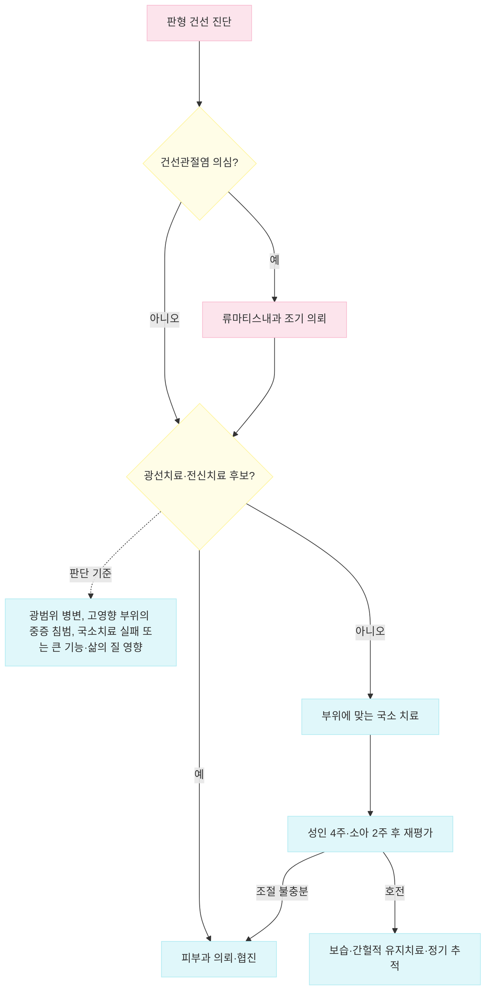

# 건선 Psoriasis

## <mark style="color:green;">일반 사항</mark>

* **정의** : 선천·적응 면역의 이상을 중심으로 한 만성 재발성 면역매개 염증질환으로, 각질형성세포의 증식·분화 이상과 염증이 특징적임. 가장 흔한 판형건선에서는 경계가 명확한 홍반성 인설성 판을 형성함
* 분포 : 전신, 자극받기 쉬운 부분에 흔함; 팔꿈치, 무릎, 두피, 요천추부, 엉덩이 틈새, 손발바닥, 손발톱, 음경 귀두
* 피부 임상형 : 판형건선(가장 흔함), 역위건선, 홍색피부건선, 농포성 건선, 물방울건선, 조갑건선; **건선관절염은 동반될 수 있는 염증성 관절질환**임 (☞ 아래 「종류」 참조)
* 호발 연령 : 어느 연령에서나 발생 가능하며 청년기와 중·장년기의 이중 정점 분포가 보고됨; 발병 연령과 진료 환자의 연령 분포는 구분해야 함
* 유병률 : 서구에서는 인구의 약 2\~3%; 한국을 포함한 아시아권에서는 상대적으로 낮게 보고되며, 국내 건강보험 진료인원은 연간 약 16만 명 수준(국민건강보험공단, 2014\~2018)\
  ✽정확한 국내 유병률은 조사마다 차이가 있어 단일 수치로 단정하지 않음
* 경과 : 만성 재발성 경과이며 관해와 악화를 반복할 수 있음
  * 치료제·임상형·부위에 따라 호전 속도가 다르며, 국소치료는 대개 수주 후 반응을 평가
  * 물방울건선은 자연 관해가 가능하고 조갑건선은 효과 판정에 수개월이 필요

## <mark style="color:green;">원인</mark>

* 불명; 감염 또는 전염성 질환은 아님
* 유전적 소인; 가족력이 흔하나 그 빈도는 인구집단과 발병 연령에 따라 차이가 있음
* 환경, 면역 관련

### <mark style="color:orange;">위험 인자</mark>

* 국소 외상/자극
* 감염 : Streptococcus, HIV
* 비만, 정신적 스트레스, 흡연, 알코올
* 약물 : lithium, β-차단제, 항말라리아제, interferon 등; 전신 corticosteroid의 급격한 감량·중단도 악화와 관련될 수 있음
  * 의심 약물의 필요성과 대체 가능성을 검토하되 환자가 임의로 중단하지 않도록 교육

### <mark style="color:orange;">동반 질환</mark>

* 비만, 당뇨병, 대사증후군, 만성 신질환, 심혈관 질환, 대사이상 관련 지방간질환(MASLD; 과거 NAFLD)
* 자가면역 질환 : 크론병, 원형탈모증
* 일부 연구에서 특히 중증 건선과 림프증식성 질환 위험 증가의 연관성이 보고되었으나 절대위험은 낮고 질환 중증도·치료의 영향이 혼재함
* 우울・불안 등 정신건강 문제, 삶의 질 저하 (☞ Red Flags Tier 3 참조)

## <mark style="color:green;">임상 양상</mark>

* 두꺼운 은색의 비늘로 덮인, 경계가 명확한 홍반성 구진 및 판
* 손발톱 미세 함몰(stippling, pitting)
* 가려움은 여러 임상형에서 흔함; 피부 통증·균열·출혈, 건선관절염의 관절통, 조갑건선의 손발톱 변형이 동반될 수 있음
* 판형건선 자체로는 대개 발열이 없음; 전신 농포성 건선·홍색피부건선 또는 동반 감염에서는 발열이 가능함
* Koebner's phenomenon : 피부 손상 부위에 새로운 건선 병소 발생
* Auspitz's sign : 인설을 제거하면 점상 출혈이 발생할 수 있음; 건선에 특이적이지 않으며 없다고 건선을 배제하지 않음. 진단을 위해 일부러 긁어낼 필요는 없음
* Sebopsoriasis : 건선과 지루피부염의 임상 특징이 겹치는 양상; 두피, 눈썹, 비순구, 귀뒤, 흉골 부위의 홍반과 인설

### <mark style="color:$danger;">🚩 Red Flags!</mark>

<mark style="color:$danger;">**즉각 조치**</mark>

* 전신 농포성 건선 또는 홍색피부건선이 의심되면서 **저혈압, 의식 변화, 호흡곤란, 심한 탈수·전해질 이상, 심부전 또는 패혈증 등 전신상태 악화**가 동반됨 → 응급실 이송·입원 평가
* 자살의도·계획 등 급박한 자해 위험 → 즉시 안전 확보 및 응급 정신건강 평가

<mark style="color:$warning;">**당일 전문 평가**</mark>

* **전신 농포성 건선 의심** : 광범위한 홍반·통증과 무균성 농포가 새로 발생하거나 급격히 확산; **발열이 없어도** 당일 피부과 평가
* **홍색피부건선 의심** : 몸 대부분의 피부에 홍반·박리가 발생; 활력징후가 안정적이어도 당일 피부과 평가
* 전신치료 중 중증 감염 또는 약물독성 의심(발열·심한 인후통, 출혈·잦은 멍, 황달, 심한 근육통·갈색뇨 등) → 당일 평가; 전신상태가 불안정하면 즉각 조치
* 급성으로 심하게 붓고 뜨거운 관절, 특히 발열 또는 보행 불능 동반 → 건선관절염으로 단정하지 말고 감염성 관절염 등을 당일 감별

<mark style="color:$info;">**조기 의뢰 / 외래 추적·추가 평가**</mark>

* 광범위 병변, 적절한 국소 치료에도 조절되지 않는 건선, 광선치료·전신치료가 필요한 경우 → 피부과 조기 의뢰
* 얼굴·생식기·손발바닥·두피·조갑 등 고영향 부위의 중증 침범 → 피부과 조기 의뢰
* 건선관절염 의심 : 지속적인 관절통/종창, 아침 강직, dactylitis, enthesitis, 염증성 요통 → **류마티스내과 조기 의뢰**; 피부 병변이 경미해도 의뢰
* 소아·청소년의 건선 → 진단 시 피부과 의뢰 및 연령·부위에 맞는 치료 계획
* 비만, 고혈압, 당뇨병, 이상지질혈증 등 심혈관·대사 위험인자와 우울·불안, 흡연, 고위험 음주 → 주기적 평가·관리

✽ 전신 농포성 건선과 홍색피부건선은 외래 추적으로 미루지 않음. **당일 전문 평가를 즉시 연결하고**, 전신상태 악화가 있으면 응급실로 이송함. [NICE CG153](https://www.nice.org.uk/guidance/cg153/chapter/Recommendations)

## <mark style="color:green;">종류</mark>

<table><thead><tr><th width="130">아형</th><th width="80">빈도</th><th width="240">특징적 소견</th><th>호발 부위 / 비고</th></tr></thead><tbody><tr><td>판형건선<br>(Plaque psoriasis)</td><td>80\~90%</td><td>은백색 인설로 덮인 경계 명확한 홍반성 판(1\~10 ㎝)</td><td>두피, 팔꿈치・무릎(신측부), 요천추부, 손발바닥, 엉덩이 틈새</td></tr><tr><td>역위건선<br>(Inverse psoriasis)</td><td>-</td><td>표면이 매끈한 홍반성 판(비늘 없을 수 있음), 짓무름</td><td>겨드랑이, 사타구니, 유방 아래, 배꼽 (마찰・땀 유발)</td></tr><tr><td>홍색피부건선<br>(Erythrodermic)</td><td>1\~2%</td><td>넓은 범위의 진한 홍반, 체온조절 장애 - <strong>생명 위협</strong></td><td>전신치료 급중단, steroid 금단 등이 유발</td></tr><tr><td>농포성 건선<br>(Pustular)</td><td>-</td><td>비감염성 백색 농포 + 주변 발적; 전신형은 발열·전신증상을 동반할 수 있음</td><td>국소(손발) 또는 전신; 전신 steroid의 급격한 감량·중단 등이 유발 가능</td></tr><tr><td>물방울건선<br>(Guttate)</td><td>집단별 차이</td><td>작은(1\~10 ㎜) 둥근 물방울형 구진</td><td>&lt;30세(소아청소년); 몸통・상지・허벅지・두피; 연쇄상구균 인두염 후 호발</td></tr><tr><td>조갑건선<br>(Nail)</td><td>약 절반<br>(평생 경과 중 더 증가)</td><td>pitting, 조갑 박리, 조갑하 과다각화증</td><td>건선관절염과 연관성 높음</td></tr><tr><td>건선관절염<br>(Psoriatic arthritis)</td><td>약 10\~30%<br>(집단별 차이)</td><td>관절통/종창, dactylitis, enthesitis, 염증성 요통</td><td>피부 중증도와 무관하게 발생 가능 - 주기적 선별 필요</td></tr></tbody></table>

### <mark style="color:orange;">판형건선 (Plaque psoriasis, Psoriasis vulgaris)</mark>

* 빈도 : 전체 건선 중 80\~90% 차지
* 모양 : 은백색 인설로 덮인 경계가 명확한 다양한 크기(보통 1\~10 ㎝)의 홍반; 천천히 커지거나 오랜 기간 동안 변화 없이 유지
* 증상 : 가려움, 통증, 갈라짐, 출혈
* 부위 : 두피, 사지 신측부(팔꿈치, 무릎), lower back, 얼굴, 손발바닥, 엉덩이 틈새

### <mark style="color:orange;">역위건선 (Inverse psoriasis, Intertriginous psoriasis)</mark>

* 모양 : 경계가 명확한 표면이 매끈한 홍반성 비늘성 판(비늘은 없을 수 있음), 짓무름
* 부위 : 마찰부, 굴곡부; 겨드랑이, 사타구니, 유방 아래, 배꼽
* 유발 인자 : 마찰, 땀

### <mark style="color:orange;">홍색피부건선 (Erythrodermic psoriasis)</mark>

* 빈도 : 1\~2% 해당
* 모양 : 넓은 범위의 진한 홍반(fiery redness)
* 증상 : 심한 가려움, 통증, 피부 벗겨짐, 탈모, 조갑 이상, 체온 오르내림(체온 유지 장애), 오한, 심부전, 탈수, 전해질 이상; 생명 위협
* 유발 인자 : 심한 일광 화상, 알레르기, 전신적 건선 치료 중 갑작스런 중단, 전신 steroid 사용, 감염, 감정적 스트레스, 알코올 남용, 약물(예: lithium, 항말라리아제, coal tar)

### <mark style="color:orange;">고름물집건선, 농포성 건선 (Pustular psoriasis)</mark>

* 모양 : 흰색의 농포(비감염성 고름) 및 주위 발적
* 부위 : 국소(손, 발) 또는 전신
* **전신 농포성 건선의 경과** : 광범위한 무균성 농포 → 융합 → 건조·박리; 홍반·피부 통증과 발열·전신증상을 동반할 수 있음. 재발성 또는 지속성 경과를 보이며 **고열이 없다고 배제하지 않음**
* 약물 유발 급성 전신성 발진성 농포증(AGEP), 감염성 농포 등 감별이 필요하며, 당일 전문 평가를 시행
* 유발 인자 : 감염, 임신, 약물, 스트레스, 과도한 자외선 조사 등; 특히 **전신 corticosteroid의 급격한 감량·중단**이 중요한 유발인자로 알려져 있음

### <mark style="color:orange;">물방울건선 (Guttate psoriasis, Eruptive psoriasis)</mark>

* 빈도는 집단마다 차이가 있으며 소아·청소년과 젊은 성인에서 흔함
* 증상 : 많은 수의 작고(1\~10 ㎜) 둥근 물방울 모양의 홍반성 비늘성 구진
* 부위 : 몸통, 상지, 허벅지, 두피
* 다른 건선(특히 판형 건선)에 동반될 수 있음
* 유발 인자 : A군 β용혈성 연쇄상구균(GAS) 감염(예: 인두염 2\~3주 후), 스트레스, 피부 손상, 약물(예: 항말라리아제, β-차단제)
* 경과 : 상당수는 **수주~수개월 내 자연 관해**하나 일부는 지속되거나 판형건선으로 이행할 수 있음
* 치료 : 보습제·국소 치료를 시행하고, 광범위하거나 지속되는 경우 **NB-UVB**를 고려
* **활동성 연쇄상구균 인두염 등 세균감염이 확인되면 해당 감염의 표준 적응증에 따라 항생제로 치료**하되, 피부 건선을 호전시키기 위한 목적으로 routine antibiotic을 투여하는 근거는 충분하지 않음

### <mark style="color:orange;">조갑건선 (Nail psoriasis)</mark>

* 증상 : 조갑 표면 점상 소와(pit), 갈색 반점, 색깔 변화(yellow-brown), 조갑 박리, 비후, 통증/압통, 조갑하 과다각화증, 손톱 밑 가루 찌꺼기
* 건선 환자의 약 절반에서 조갑 변화가 관찰되며, 평생 경과 중 발생 빈도는 더 높음

### <mark style="color:orange;">건선관절염 (Psoriatic arthritis)</mark>

* 빈도 : 건선 환자의 약 10\~30%에서 보고되며 인구집단·선별방법에 따라 차이가 큼
* 부위 : 주로 손, 발, 무릎 관절
* 증상 : 관절통/종창, 아침 또는 휴식 후 심한 관절 강직, dactylitis(소시지 모양 손발가락), enthesitis, 염증성 요통 등 다양한 형태로 나타남
* 조갑건선은 건선관절염과 연관성이 높음
* 피부 건선의 중증도와 관계없이 발생할 수 있으므로 **연 1회 건선관절염 선별**을 시행하며, 특히 건선 발병 후 첫 10년간 중요함

## <mark style="color:green;">진단</mark>

* 대부분 **임상적으로 진단**하며 건선을 확진하는 특이 혈액검사는 없음
* 비전형적 병변 또는 감별이 필요한 경우 선택적으로 검사
  * KOH/진균검사 : 체부백선, 완선, 조갑백선 등 감별
  * 피부 조직검사 : 임상진단이 불확실하거나 다른 염증성/종양성 피부질환과 감별이 필요한 경우
  * 관절 증상이 있는 경우 : 건선관절염 평가를 위해 필요한 영상검사·혈액검사를 임상상에 따라 시행
* 건선 중증도는 **BSA/PGA, 병변 위치(특수·고영향 부위), 증상, 기능 장애와 삶의 질(DLQI 등)**을 함께 평가; PASI는 주로 임상시험·전문진료 및 국내 급여 판정에서 활용
  * BSA 추정 : **환자 자신의 손가락을 포함한 손바닥 쪽 손 전체 면적이 체표면적의 약 1%**에 해당; 손바닥만을 1%로 계산하지 않음
* 건선 환자에서는 연령에 관계없이 비만, 혈압, 당뇨병, 이상지질혈증 등 심혈관·대사 위험인자를 주기적으로 평가
  * 혈압·체중/BMI는 정기적으로 확인하고, 혈당·지질검사는 연령·위험인자 및 국내 건강검진/관련 지침에 따라 시행; 중증 건선 또는 추가 위험인자가 있으면 더 조기·빈번한 선별을 고려
* **건선관절염 선별** : 연 1회 관절통/종창, 아침 강직, dactylitis, enthesitis, 염증성 요통을 확인하며 PEST 등의 간단한 선별도구를 활용할 수 있음(특히 발병 후 첫 10년간 중요)
  * **PEST가 음성이어도** 염증성 요통(axial symptoms), enthesitis 등 임상적으로 의심되는 소견이 있으면 건선관절염을 배제하지 않음

### <mark style="color:orange;">감별 진단</mark>

* 홍반·인설성 병변을 보이는 질환들과 감별이 필요

<table><thead><tr><th width="140">질환</th><th>건선과의 감별 포인트</th></tr></thead><tbody><tr><td>지루피부염 / sebopsoriasis</td><td>보다 기름진 인설, 두피・눈썹・비순구 등 지루 부위 우세; 건선과 병발(sebopsoriasis) 가능</td></tr><tr><td>체부백선・완선・조갑백선</td><td>체부백선·완선은 진행성 경계와 중심부 치유 경향; 조갑백선은 건선과 동반 가능. KOH/배양 등으로 확인하며 KOH 음성만으로 배제하지 않음</td></tr><tr><td>화폐상습진・아토피피부염・접촉피부염</td><td>인설이 얇고 은백색이 아님; 소양감이 더 두드러지고 병력(아토피, 접촉원)이 특징적</td></tr><tr><td>장미색비강진</td><td>herald patch 선행, 크리스마스트리 양상 분포, 자연 관해(수 주\~수개월)</td></tr><tr><td>편평태선</td><td>보라색(violaceous) 다각형 구진, Wickham's striae, 점막 침범 흔함</td></tr><tr><td>2기 매독</td><td>손발바닥 침범 시 특히 감별; 성병력 확인, RPR/VDRL 등 비트레포네마 검사 선별 후 treponemal test(TPPA, FTA-ABS 등)로 확인</td></tr><tr><td>Cutaneous T-cell lymphoma</td><td>비전형적이거나 치료 불응성인 경우 고려; 조직검사로 확진</td></tr></tbody></table>

***


```mermaid
graph TD
    Start["판형 건선 진단"] ---> Q1{"건선관절염 의심?"}
    Q1 --->|예| PsA["류마티스내과 조기 의뢰"]
    Q1 --->|아니오| Q2{"광선치료·전신치료 후보?"}
    PsA ---> Q2
    Q2 --->|아니오| Local["부위에 맞는 국소 치료"]
    Q2 --->|예| Derm["피부과 의뢰·협진"]
    Q2 -. 판단 기준 .-> Criteria["광범위 병변, 고영향 부위의 중증 침범, 국소치료 실패 또는 큰 기능·삶의 질 영향"]
    Local ---> Reassess["성인 4주·소아 2주 후 재평가"]
    Reassess --->|조절 불충분| Derm
    Reassess --->|호전| Maintain["보습·간헐적 유지치료·정기 추적"]
    classDef pinkNode fill:#fce4ec,stroke:#f8bbd0,stroke-width:1px
    classDef yellowNode fill:#fffde7,stroke:#fff59d,stroke-width:1px
    classDef blueNode fill:#e0f7fa,stroke:#b2ebf2,stroke-width:1px
    class Start,PsA pinkNode
    class Q1,Q2 yellowNode
    class Local,Derm,Criteria,Reassess,Maintain blueNode
```


_<고영향 부위: 얼굴, 두피, 손/발바닥, 생식기, 조갑 등>_

<p align="center"><strong>판형 건선의 치료 접근</strong></p>

<p align="center"><em><mark style="color:$info;">Ref. AAD-NPF, NICE CG153; 판형건선의 외래 치료 접근. 전신 농포성 건선·홍색피부건선 의심 시에는 위 Red Flags에 따라 당일 평가</mark></em></p>

***

## <mark style="background-color:$warning;">Management</mark>

### <mark style="color:orange;">치료 방침</mark>

* 치료 방법과 예상 경과(완치가 쉽지 않은 만성 질환)에 대하여 설명
* 생활 습관 조정과 동반질환 관리의 중요성을 교육
* **국소 치료 중심** : 제한된 판형건선으로 기능·삶의 질 영향이 크지 않은 경우
* **광선치료/전신치료 또는 피부과 의뢰를 고려하는 경우**
  * BSA ＞10%의 광범위 병변
  * 얼굴·두피·손발바닥·생식기·조갑 등 **특수/고영향 부위** 침범
  * 적절한 국소 치료에 반응하지 않거나 반복 재발하여 일상생활에 큰 지장을 주는 경우
  * **BSA/PGA, 증상, 기능장애 및 DLQI 등에서 질환 부담이 큰 경우**
* BSA가 작더라도 특수부위 침범이나 기능장애가 크면 중증도가 낮다고 판단하지 않음

## <mark style="color:green;">비-약물 치료 및 예방</mark>

* 회피 : 외상, 자극, 일광 화상, 흡연, 음주, 건조, 스트레스, 손에 대한 세제 자극
* 매일 보습제를 사용하고 미지근한 물로 짧게 목욕; 인설을 억지로 긁어내지 않음
* 비만 시 체중 감량
* 조갑을 길지 않게 유지; 매니큐어 등 미용 목적의 조갑 손질을 하지 않음
* 일광화상을 피하고 태닝기·임의의 자외선 조사로 치료하지 않음; **의료용 광선치료는 용량을 조절하고 피부 반응을 관찰하면서 시행**

## <mark style="color:green;">약물 치료</mark>

### <mark style="color:orange;">국소 치료제</mark>

* 새 국소 치료를 시작하면 **성인 4주, 소아 2주 후** 효과·순응도·자극·피부 위축 등을 평가; 악화 또는 이상반응 발생 시 더 일찍 평가

#### <mark style="color:$primary;">국소 Steroid</mark>

* 작용 : 항염, 각질형성세포 증식 억제, 면역 억제, 혈관 수축
* 부위·병변 두께·연령에 맞는 역가와 제형을 선택; 호전 후 간헐적 유지요법 또는 비스테로이드제로 전환
* **clobetasol propionate 0.05%는 초강력(very potent) 제제**임. 제한된 두꺼운 몸통·사지 병변에 단기간 사용하고 1\~2주 내 반응·이상반응을 평가; 제품별 용법·최대 사용량·치료기간을 준수
* NICE 기준으로 초강력제 연속 사용은 최대 4주, 강력제는 최대 8주 이내이며, 제품 허가사항이 더 짧으면 그 기간을 따름; 강력·초강력제 치료 과정 사이에는 가능하면 4주 휴지기를 두고 비스테로이드제로 조절. 피부 위축·혈관확장·선조·부신억제 위험을 평가
* 얼굴·굴곡부·생식기는 **저역가제를 우선**, 필요시 중간 역가제를 짧게 사용(보통 1\~2주, 반복치료도 한 달 중 최대 1\~2주); 강력·초강력제를 사용하지 않음
* 소아에서는 초강력제를 피하고 피부과에서 연령·부위·면적에 따라 선택
* 조갑은 침범 부위에 따라 근위 조갑주름 또는 조갑하 부위에 도포하되 효과 판정에 수개월이 필요; 피부 위축을 살피며 재평가
* 폐쇄 요법은 흡수·독성을 증가시키므로 제품별 허용 여부를 확인하고 전문의 지시에 따라 제한적으로 시행

#### <mark style="color:$primary;">Calcineurin 억제제</mark>

* 국소 steroid 대체제로 선택. 얼굴, 겹친 부위에 적용; 판형건선에서는 효과 적음
* 부작용 : 작열감, 가려움, 홍반
* pimecrolimus 1% <mark style="color:blue;">\[엘리델]</mark>, tacrolimus 0.03%/0.1% <mark style="color:blue;">\[프로토픽]</mark>; 보통 1일 2회 도포
* **건선에 대한 사용은 국내 허가 외**임. 연령별 제제 선택과 감염 여부를 확인하고 반응에 따라 간헐적 유지요법을 고려; 눈·점막에는 사용하지 않음

#### <mark style="color:$primary;">Vit D 유도체</mark>

* 작용 : 각질 세포 증식 억제, 항염
* 국소 steroid보다 효과 발현이 늦으며 보통 수주가 필요; steroid 사용량을 줄이는 유지치료에 유용함
* 단독 또는 국소 steroid에 병합, 또는 국소 steroid 중단 기간 중 적용
* 부작용 : 작열감, 가려움, 부종, 건조, 피부 벗겨짐, 홍반; 보통 사용하면서 호전되나 얼굴과 사타구니에는 도포하기 어려움
  * 광범위 도포 시 고칼슘혈증을 유발할 수 있으므로 최대 사용량을 제한함
* calcipotriene(=calcipotriol)
  * **0.005%(50 ㎍/g)**, 성인 1일 1\~2회; <mark style="color:blue;">\[다이보넥스 연고]</mark> 성인 최대 100 g/wk. 다른 calcipotriol 함유 제품을 병용하면 **총 calcipotriol 용량을 합산**하여 제한
  * 해당 국내 제품의 소아 안전성·유효성은 확립되어 있지 않음; 소아 사용은 피부과에서 연령·제품별 허가와 위험·이익을 확인하여 판단
  * steroid와 병용하면 효과가 좋아지며, 별도 제품은 임의로 섞지 않고 제품별 호환성과 용법에 따라 사용
* calcipotriol/betamethasone dipropionate 복합제
  * <mark style="color:blue;">\[다이보베트 연고]</mark> : **1일 1회, 권장 치료기간 4주**; 이후 반복 치료는 의사의 감독하에 시행
  * **최대 15 g/d, 100 g/wk, 도포 면적 BSA 30% 이내**; 얼굴·눈가에는 사용하지 않으며 굴곡부·생식기의 일상적 치료제로 선택하지 않음
  * 연고·겔·폼은 권장 치료기간과 유지요법 허가가 다를 수 있으므로 제형별로 확인; 특정 폼 제제의 주 2회 유지요법을 모든 복합제의 허가 용법으로 간주하지 않음
* calcitriol, tacalcitol : 국외 치료 옵션에도 포함되는 Vit D 유도체; 국내 사용 시 제품의 현행 허가·유통 확인이 필요

* **salicylic acid, lactic acid 등 산성 제제는 calcipotriol을 불활성화할 수 있으므로 같은 부위에 동시에 혼합·도포하지 않음**
  * 각질 용해가 필요한 경우 시간 간격을 두어 사용하거나, salicylic acid 샴푸/제제를 사용 후 씻어낸 뒤 calcipotriol을 도포

#### <mark style="color:$primary;">Retinoid (Vit A 유도체)</mark>

* 작용 : 각질 세포 증식 억제
* 효과 : 국소 steroid와 병용하면 효과와 내약성이 좋아질 수 있음
* 부작용 : 자극감, 광과민
* tazarotene : cream/gel 0.05\~0.1% qd로 사용되는 국외 치료 옵션; **임신 중 금기**, 임신 가능성이 있는 여성은 임신 여부·피임을 확인. 국내 처방 시 제품 허가·유통 확인
* 국소 tretinoin 등 다른 retinoid를 건선의 표준 치료제로 대체하지 않음

#### <mark style="color:$primary;">각질 용해제</mark>

* 작용 : 각질 완화, 다른 국소 치료제의 침투력을 향상시킴(특히 두피에서 중요)
* urea <mark style="color:blue;">\[유리아]</mark>, salicylic acid, ammonium lactate, lactic acid 등; 피부 상태·농도·제형에 맞추어 선택
* **클리어틴 외용액 2%는 여드름 허가 제품**이며 에탄올 등을 함유하므로 건선의 대표 각질 용해제로 제시하지 않음
* salicylic acid는 소아, 넓은 면적, 손상 피부, 신기능 저하에서 전신흡수·독성에 주의; 강한 각질 용해제는 얼굴·굴곡부·생식기를 피함

#### <mark style="color:$primary;">타르</mark>

* 작용 : 가려움 감소, 항균, 표피 과증식 억제. 광선 치료 효과 향상
* 적용 : 주 1\~2회, 심한 정도에 따라 매일 또는 필요시 사용

### <mark style="color:orange;">광선 치료</mark>

* 작용 : 면역 조절, 각질형성세포 증식 억제
* **NB-UVB(narrowband UVB)**가 판형·물방울건선에서 대표적으로 사용되는 광선치료이며, 국소 치료로 조절되지 않거나 광범위한 경우 피부과에서 고려
* 보통 주 2\~3회 반복 치료가 필요하며 치료 반응에 따라 수주~수개월 시행
* 장점 : 전신 약물 노출을 피할 수 있고 광범위 병변에도 적용 가능
* 단점 : 반복적인 내원 필요, 홍반·화상·광노화가 발생할 수 있으며 누적 자외선 노출을 고려해야 함
* PUVA는 선택된 환자에서 고려할 수 있으나 psoralen 관련 부작용 및 장기 광독성/피부암 위험 등을 고려하여 전문진료 영역에서 시행

### <mark style="color:orange;">전신 치료제</mark>

* 광범위 건선, 특수부위 중증 침범, 국소치료 실패 또는 삶의 질/기능장애가 큰 경우 **피부과에서 광선치료 또는 전신치료를 고려**
* 건선관절염이 의심되거나 확인된 경우 **류마티스내과 조기 의뢰**
* **Systemic corticosteroid는 건선 자체의 통상적 전신치료로 권장하지 않음.** 특히 고용량 사용 후 또는 갑작스러운 중단 뒤 rebound, pustular/erythrodermic flare가 발생할 수 있어 주의
* 전신 면역조절치료 시작 전 **예방접종력과 감염 위험**을 확인
  * 불활성화·재조합 백신(예: influenza, COVID-19, recombinant zoster vaccine)은 일반적으로 투여 가능
  * **생백신(live attenuated vaccine)은 면역억제 정도와 약제에 따라 치료 중 피해야 하며**, 필요한 경우 약제별 반감기·지침에 따라 치료 시작 전 또는 일시 중단 기간을 조정하여 접종

#### <mark style="color:$primary;">전신치료 고려 기준 [NICE CG153]</mark>

다음 **①과 ②를 모두 충족**하면서 **③ 중 하나 이상**에 해당하면 conventional systemic treatment를 고려함.

1. **국소 치료만으로 충분히 조절되지 않음**
2. 건선이 환자의 **신체적·심리적·사회적 안녕에 유의한 영향을 줌**
3. 다음 중 하나 이상
   * **광범위 건선** : 예) BSA ＞10%
   * BSA는 작더라도 **기능장애 또는 심한 고통을 초래하는 국소 중증 건선**(예: 손발톱의 심한 침범, high-impact/difficult-to-treat site)
   * **광선치료가 효과적이지 않거나 사용할 수 없거나 적합하지 않은 경우**

✽ **PASI는 임상시험·전문진료 및 치료반응 평가에서 널리 사용되고 국내 급여 판정에서도 중요한 지표**이나, 일차진료에서 전신치료 후보를 가르는 단독 필수 문턱값으로 사용하지 않음.


전신치료·생물학적 제제의 **HIRA 급여 인정 기준**(BSA·PASI 컷오프, 이전 치료 실패 이력 요건 등)은 약제·적응증별로 상이하며 수시로 개정되므로, 처방 전 최신 HIRA 고시를 반드시 확인할 것


#### <mark style="color:$primary;">비생물학적 제제</mark>

* 종류 : methotrexate, apremilast, acitretin, cyclosporine, dimethyl fumarate
* **methotrexate**
  * 중등증~중증 판형건선 및 건선관절염에서 사용할 수 있는 전신치료제
  * 성인에서 보통 **주 1회** 투여하며 용량은 반응·내약성에 따라 조절(일반적으로 7.5~25 ㎎/wk 범위)
  * 매일 복용하는 약이 아님을 명확히 교육
  * folic acid 병용(예: 5 ㎎/wk를 MTX와 다른 날 복용); 기관별 요법과 환자의 위험에 따라 조절
  * **임신·수유 중 금기**; 남녀 모두 임신 계획과 피임을 상담하고 중단 후 피임기간은 해당 제품 허가사항을 따름
  * 시작 전 및 치료 중 CBC, AST/ALT, 신기능을 확인하고 임신 가능성, 음주, 비만/당뇨 및 기저 간질환 등 간독성 위험 평가
  * HBV/HCV 등 감염 선별을 치료 계획에 따라 시행; 간독성 위험이 크면 비침습적 간섬유화 평가를 고려
  * 새로 발생한 마른기침·호흡곤란·발열은 MTX 폐독성 또는 감염 가능성 → 즉시 약을 보류하고 당일 평가
  * TMP/SMX 병용은 골수억제·MTX 독성 위험 때문에 가급적 피함; 신기능 저하 또는 MTX 독성 위험이 있는 환자에서 NSAID 병용에 특히 주의
* **cyclosporine**
  * 효과가 빠르므로 severe/recalcitrant psoriasis, erythrodermic 또는 generalized pustular psoriasis 등에서 유용
  * 보통 2.5\~5 ㎎/㎏/d를 **2회 분복**; 혈압·신기능, 전해질과 약물상호작용을 면밀히 확인
  * 조절되지 않는 고혈압·신기능 저하에서는 부적합할 수 있음; **PUVA/UVB와의 병용은 피부암 위험 때문에 피함**
  * 신독성·고혈압 등의 누적 독성 때문에 **장기 연속치료보다는 단기간/간헐적 사용을 선호**
  * 치료 종료 시 재발이 흔하므로 후속 유지치료 계획을 세움. **감량(tapering)은 재발을 약간 지연시키기 위해 고려할 수 있으나 반드시 필요한 중단 원칙은 아님**
* **acitretin** <mark style="color:blue;">\[네오티가손]</mark>
  * 판형건선, 농포성 건선 등에 사용할 수 있으며 광선치료와 병용 가능
  * **강한 기형유발성**이 있으므로 임신 중에는 금기
  * 임신 가능성이 있는 여성에서는 **치료 1개월 전부터 치료 중 및 복용 중단 후 최소 3년간 효과적인 피임**이 필요함
  * **임신 가능성이 있는 여성은 치료 중 및 중단 후 2개월간 에탄올 함유 음료·식품·약물을 피함**(etretinate 전환 및 장기 잔류 위험); 모든 환자에게 음주 제한을 교육
  * 간기능·공복 지질을 치료 전후 확인; MTX 또는 tetracycline계와 병용하지 않음
  * 치료 중 및 중단 후 **3년간 헌혈 금지**
* **apremilast**
  * 경구 PDE-4 억제제 <mark style="color:blue;">\[오테리아 등]</mark>; 중등증\~중증 판형건선 및 건선관절염에서 사용
  * 성인은 **10 ㎎ qAM으로 시작하여 5일간 단계적으로 증량, 6일째부터 30 ㎎ bid**; 증량표는 제품 허가사항을 따름
  * 국내 오테리아 허가사항상 **CrCl ≤30 mL/min이면 유지용량 30 ㎎ qd**로 감량하고 초기 증량도 조정; 치료 전 신기능 확인
  * 설사·구역, 체중감소, 우울·자살사고를 확인; rifampin 등 강한 효소유도제 병용을 피함
  * **임신·수유 중 금기**; 임신 계획과 피임을 확인
* **dimethyl fumarate** <mark style="color:blue;">\[스킬라렌스 장용정]</mark>
  * 전신치료가 필요한 성인의 중등증\~중증 판형건선에 사용하는 경구 치료제
  * 30 ㎎ qd로 시작하여 매주 단계적으로 증량; 반응·내약성에 따라 조절하며 최대 240 ㎎ tid(720 ㎎/d). 식사 중 또는 직후 통째로 복용
  * CBC·백혈구 감별계산(특히 림프구), 간·신기능을 치료 전 및 치료 중 정기 확인; 림프구 감소 시 검사 간격을 단축하고 허가사항에 따라 감량·중단
  * 홍조·위장관 이상과 지속적 림프구 감소에 따른 기회감염/PML 위험에 주의; 다른 dimethyl fumarate 함유 약과 혼동하지 않음
  * 임신·수유, 중증 간·신장애 및 중증 위장관질환에서는 금기; 임신 가능성이 있으면 피임 상담

#### <mark style="color:$primary;">경구 표적 치료제 - TYK2 억제제</mark>

* **deucravacitinib** <mark style="color:blue;">\[소틱투]</mark>
  * 경구 선택적·알로스테릭 TYK2(tyrosine kinase 2) 억제제; TYK2는 JAK family에 속하나 JAK1/2/3 억제제와 선택성이 구분됨
  * **검사·감염 감시가 필요 없는 약은 아님**. 시작 전 결핵·바이러스간염·예방접종 상태를 확인하고 활동성 중증 감염에서는 투여를 피함; 생백신과 병용하지 않음
  * 중성지방을 주기적으로 확인하고, 간질환이 있거나 의심되면 간효소를 치료 전후 확인. 근육통·근력저하·갈색뇨 발생 시 CPK/횡문근융해 평가
  * 임의로 다른 강한 면역억제제와 병용하지 않음; 임신·수유 및 중증 간장애에서는 전문의와 치료 선택을 재검토
  * 중등증~중증 판형건선에서 전신치료 또는 광선치료가 필요한 성인 대상
  * **6 ㎎ qd**, 음식과 무관하게 복용; 국내 2023년 8월 허가, 2024년 4월 급여 적용
  * 소틱투 급여 요약([HIRA 고시 제2025-88호, 2025.6.1.](https://www.hira.or.kr/rc/insu/insuadtcrtr/InsuAdtCrtrPopup.do?mtgHmeDd=20250601&mtgMtrRegSno=0009&sno=1)) : **18세 이상, 6개월 이상 지속된 만성 중증 판상건선, BSA ≥10% 및 PASI ≥10**, 기존 전신치료 또는 광선치료의 실패·불내약 등 요건. 16주 반응평가·연장·교체투여 및 예외 기준과 이후 개정 여부는 처방 시 원문 확인
  * **미국·EU에서는 2026년 active psoriatic arthritis(PsA) 적응증이 추가됨.** 국내 PsA 적응증은 최신 MFDS 허가사항을 별도로 확인하며, 국내 판형건선 적응증·급여기준과 혼동하지 않음

#### <mark style="color:$primary;">생물학적 제제</mark>

* 중등증~중증 건선 또는 건선관절염의 중요한 **장기 질병조절 치료**이며, 단기 구제치료로 한정하지 않음
* 적응증, 동반질환, 감염 위험, 임신 계획, 이전 치료 반응 등을 고려하여 피부과/류마티스내과에서 선택
* 투여 전 결핵·B형간염 등 필요한 감염 선별과 예방접종 상태를 확인하며, 생백신은 약제별 지침에 따라 피하거나 투여 시점을 조정
* 국내 판형건선 치료에 사용하는 대표 제제(연령·PsA 등 적응증은 제품별 확인)
  * Anti–TNF-α : etanercept <mark style="color:blue;">\[엔브렐 등]</mark>, adalimumab <mark style="color:blue;">\[휴미라 등]</mark>, infliximab <mark style="color:blue;">\[레미케이드 등]</mark>
  * Anti–IL-17 : secukinumab <mark style="color:blue;">\[코센틱스]</mark>, ixekizumab <mark style="color:blue;">\[탈츠]</mark>, bimekizumab <mark style="color:blue;">\[빔젤릭스]</mark>(IL-17A/F 이중 억제)
  * Anti–IL-12/23 : ustekinumab <mark style="color:blue;">\[스텔라라 등]</mark>
  * Anti–IL-23 : guselkumab <mark style="color:blue;">\[트렘피어]</mark>, risankizumab <mark style="color:blue;">\[스카이리치]</mark>
* certolizumab pegol, brodalumab, tildrakizumab 등은 국외 건선 치료 옵션에도 포함되나 **국내 건선 허가·급여를 위 대표 제제와 동일하게 간주하지 않음**
* **동반질환에 따라 계열 선택이 달라짐**
  * 활동성 염증성 장질환이 있으면 IL-17 억제제를 피하거나 신중히 선택; 해당 장질환에도 적응증이 있는 약제를 고려
  * TNF 억제제는 중등도\~중증 심부전·탈수초질환에서 피하거나 신중히 선택
  * IL-17 억제제(특히 bimekizumab)는 점막·피부 칸디다증에 주의

#### <mark style="color:$primary;">전신 농포성 건선의 표적치료</mark>

* **spesolimab** <mark style="color:blue;">\[스페비고주]</mark> : IL-36 수용체 억제제; 국내에서는 **성인 전신 농포성 건선의 급격한 악화 치료**로 허가됨
* 당일 전문 평가·입원 필요성을 판단하고 수액·전해질·감염 평가 등과 함께 피부과에서 치료제를 선택; 일반 판형건선의 생물학적 제제 목록과 구분
* 국외의 예방 유지요법·소아 적응증을 국내 정맥주사 제제의 허가사항으로 확대 적용하지 않음. [식약처 보도자료](https://www.mpm.go.kr/proactivePublicService/local/localNotice/?boardId=bbs_0000000000000192&category=%EC%A4%91%EC%95%99%ED%96%89%EC%A0%95%EA%B8%B0%EA%B4%80&cntId=33123&mode=view&pageIdx=28)

## <mark style="color:green;">부위별 치료 전략</mark> \[PCDS]

### <mark style="color:orange;">몸통, 사지</mark>

* 병변 특징 : 대칭적(주로 신측부)으로 분포하는 다양한 크기의 경계가 명확한 scaly plaque
* 치료
  1. calcipotriol/betamethasone 복합제 1일 1회 또는 부위에 맞는 국소 steroid/Vit D 유도체; **다이보베트 연고는 권장 4주 치료**
  2. **4주 후** 반응·순응도·도포법·부작용을 평가; 두꺼운 인설은 보습제나 적합한 각질 용해제로 연화. 호전이 없으면 진단·치료 전략을 재검토하고 피부과 의뢰 고려
  3. 호전 후 비스테로이드제 또는 의사가 정한 간헐적 국소 치료와 보습으로 유지; 복합제의 반복·유지요법은 제형별 허가와 안전성을 확인

### <mark style="color:orange;">두피</mark>

* 병변 특징 : patchy, 비듬, hairline을 넘어 확장(목덜미에서 관찰됨)
* 치료
  * 필요시 각질 용해제 또는 코코넛 기름으로 비늘 제거(비늘이 얇아질 때까지 지속)
  * 두피에 적합한 로션·액·겔 등의 강력 국소 steroid를 단기간 사용하고 **4주 후 평가**; 연령·제형별 허가 확인
  * calcipotriol/betamethasone 두피용 제제를 대안으로 고려; 귀뒤·이마·얼굴에는 강력제를 묻히지 않음
  * 호전 후 간헐적 도포 등 유지 전략을 개별화; 타르 샴푸는 인설 조절 보조제로 사용 가능

### <mark style="color:orange;">굴측부, 생식기</mark>

* 병변 특징 : 경계가 명확하고 매끈한 홍반성 판; 인설은 적거나 없을 수 있으며 칸디다증·완선·접촉피부염과 감별
* 치료
  * **저역가 국소 steroid**를 우선 사용하며, 필요시 중간 역가제를 **1\~2주 이내**로 제한; 강력·초강력제는 사용하지 않음
  * 반복치료도 한 달 중 최대 1\~2주로 제한하고 지속 치료가 필요하면 steroid 절약 전략을 선택
  * 반복·지속 치료가 필요하면 tacrolimus/pimecrolimus를 steroid 절약제로 고려(**건선 허가 외**)
  * calcipotriol은 자극을 일으킬 수 있어 생식기·굴곡부에 일상적으로 권하지 않음; 선택적 Vit D 유도체 사용은 피부과 판단·제품 허가에 따름
  * 포피·귀두 병변은 진균감염·접촉피부염 등 감별 후 치료하며 약을 점막에 도포하지 않음

### <mark style="color:orange;">얼굴</mark>

* 병변 특징 : 흔히 발생하는 부위는 아님, 종종 지루성 피부염과 유사
* 치료
  * **저역가 steroid를 우선**, 필요시 중간 역가제를 짧게 사용(최대 1\~2주)하고 재평가
  * 반복치료도 한 달 중 최대 1\~2주로 제한
  * 재발이 잦거나 지속 치료가 필요하면 tacrolimus/pimecrolimus를 고려(**건선 허가 외**); 연령별 허용 제형·농도를 확인
  * calcipotriol 및 강력 steroid 복합제를 얼굴의 일상적 치료제로 사용하지 않음

### <mark style="color:orange;">손발바닥</mark>

* **손발바닥 판형건선** : 두꺼운 홍반성 인설·과다각화·균열; 농포가 필수 소견은 아님. 손습진·백선과 감별
* **손발바닥 농포증(palmoplantar pustulosis)** : 무균성 황백색 농포가 갈색 반점으로 변하며 반복; 흡연과 강한 연관성이 있고 판형건선과 동반 가능하나 별도 임상형으로 구분
* 치료 : 보습·각질 연화와 강력 국소 steroid; 난치성이거나 통증·기능장애가 크면 피부과에서 국소 광선치료(PUVA 등)·전신치료를 고려
* 폐쇄 요법은 흡수·독성 위험 때문에 **제형별 허가와 전문의 지시에 따라** 제한적으로 시행
* 금연을 권고하되 금연만으로 반드시 피부 병변이 호전된다고 설명하지 않음

### <mark style="color:orange;">조갑</mark>

* 병변 특징 : pitting, hyperkeratosis, onycholysis
* 치료 : 고역가 steroid 또는 steroid/Vit D 복합제 도포
* 국소치료 반응이 불충분한 중증 조갑건선에서는 **피부과에서 intralesional triamcinolone**을 고려할 수 있으며, 다수 조갑 침범·기능장애가 크거나 피부/관절 질환이 동반되면 **전신치료 또는 생물학적 제제**를 고려
* 관절염, 조갑백선 확인. 조갑백선이 의심되면 KOH/배양 등으로 확인 후 치료하며, terbinafine 등 일부 약물과 건선 악화의 증례 보고만으로 확진된 조갑백선 치료를 일률적으로 피하지는 않음
* 손톱을 짧게 유지

### <mark style="color:orange;">관절</mark>

* 병변 특징 : inflammatory polyarthritis, spondyloarthritis, synovitis, dactylitis, tendinitis
* 치료 : **류마티스내과 조기 의뢰**; 피부 병변 호전만으로 관절염이 치료되었다고 판단하지 않음. 단기 진통·소염치료만으로 질병조절 치료를 지연하지 않음

***

### <mark style="color:red;">질병코드</mark>

L40.0　보통건선　Psoriasis vulgaris

L40.00　중증 보통건선　Severe psoriasis vulgaris

L40.01　중등증 보통건선　Moderate psoriasis vulgaris

L40.02　경증 보통건선　Mild psoriasis vulgaris

L40.08　기타 및 상세불명의 보통건선　Other and unspecified psoriasis vulgaris

L40.1　전신농포건선　Generalized pustular psoriasis

L40.3　손발바닥농포증　Pustulosis palmaris et plantaris

L40.4　물방울건선　Guttate psoriasis

L40.5†　관절병성 건선　Arthropathic psoriasis (M07.0\~M07.3\*, M09.0\*)

L40.8　기타 건선　Other psoriasis

L40.9　상세불명의 건선　Psoriasis, unspecified

✽ L40.0는 상위 분류이며 청구 시 해당 중증도의 세분류를 확인. †는 원인질환, *는 발현질환 코드로 실제 관절 침범 형태에 맞추어 병기하며, 성인에게 소아 관절염 코드 M09.0*를 일률적으로 부여하지 않음. 청구에는 현행 KCD 분류·지침을 적용


***

## <mark style="color:purple;">처방례</mark>

> **처방례 1. 제한된 판형건선**
>
> ```
> Clobetasol propionate 0.05% 연고　두꺼운 몸통·사지 병변에 얇게, 제품 용법에 따라 1일 1~2회
> Urea cream [유리아]　건조하고 두꺼운 병변에 제품 용법에 따라 도포
> ```
>
> _✽ 성인의 제한된 두꺼운 병변에 대한 예시. Clobetasol은 초강력제로 1~2주 내 재평가하며 제품의 최대 사용기간·사용량 준수; 얼굴·굴곡부·생식기에는 사용하지 않음. 호전 후 비스테로이드제 또는 간헐적 유지요법 고려_

> **처방례 2. 몸통·사지의 중등도 판형건선**
>
> ```
> Calcipotriol/betamethasone 복합제 [다이보베트 연고]　병변에 1일 1회
> ```
>
> _✽ 성인 몸통·사지 병변 예시. 권장 치료기간 4주, 최대 15 g/d·100 g/wk, BSA 30% 이내; 4주 후 반응·순응도·부작용 재평가. 반복·유지치료는 의사의 감독하에 결정_

> **처방례 3. 두피 건선**
>
> ```
> 두피용 강력 국소 steroid 로션/액　제품별 용법에 따라 단기간 도포
> 보습·각질 연화제　두꺼운 인설이 있으면 적합한 제형으로 사용
> ```
>
> _✽ 4주 후 재평가하고 조절 후 간헐적 유지 전략을 결정; 제형별 허가기간 준수. Salicylic acid와 calcipotriol은 같은 부위에 동시에 혼합·도포하지 않음_

### <mark style="color:$success;">핵심 복약 지도</mark>

* 국소 steroid는 **병변에만 얇게** 바르고, 얼굴·겨드랑이·사타구니·생식기 등 피부가 얇은 부위에서는 임의로 고역가제를 장기간 사용하지 않습니다.
* 증상이 좋아졌다고 즉시 모든 치료를 중단하기보다, 재발이 잦은 경우에는 의사의 지시에 따라 간헐적 유지요법을 시행할 수 있습니다.
* calcipotriol/betamethasone 복합제는 일반적으로 1일 1회 사용하며 과량 또는 광범위 사용을 피합니다.
* methotrexate는 **주 1회** 복용 약입니다. 매일 복용하면 중대한 독성이 생길 수 있으므로 복용 요일을 명확히 정합니다.
* deucravacitinib 등 경구 표적치료제는 매일 정해진 시간에 복용하며, 임의로 중단하지 않고 정기 진료 일정을 지킵니다.
* 새로운 관절 부종, 아침 강직, 손발가락 전체가 붓는 증상 또는 지속적인 뒤꿈치 통증이 생기면 건선관절염 평가가 필요합니다.

> **언제 다시 병원을 방문해야 하나요?**
>
> * 성인은 치료 시작 4주, 소아는 2주 후 예약된 재평가; 악화·심한 자극·피부 위축이 생기면 더 일찍 방문
> * 새로운 관절 부종, 아침 강직, 손발가락 전체가 붓는 증상, 지속적인 뒤꿈치 통증이 생긴 경우
> * 전신에 급격히 홍반·고름물집이 퍼지는 경우 - **발열이 없어도 당일 진료**, 전신상태 악화 시 즉시 응급실
> * 몸 대부분의 피부가 붉어지고 벗겨지는 경우 - **당일 진료**, 오한·심한 탈수·호흡곤란 등 동반 시 즉시 응급실
> * 전신치료 중 발열, 심한 인후통, 잦은 멍, 황달, 새 기침·호흡곤란, 심한 근육통·갈색뇨가 생기면 **당일 진료**

## <mark style="color:blue;">환자 안내서</mark>


**건선, 좋아졌다 나빠지기를 반복하는 만성 피부병입니다**

건선은 전염되지 않는 만성 염증성 피부병입니다. 완치는 어렵지만 꾸준한 관리로 증상을 잘 조절할 수 있습니다. **재발이 흔하므로 증상이 좋아진 뒤에도 장기적인 피부 관리와 추적이 필요**하며, 스트레스나 생활습관에 따라 다시 나빠질 수 있습니다.


#### <mark style="color:$primary;">왜 건선이 생기나요?</mark>

* 면역계가 과도하게 작동하여 피부 세포가 비정상적으로 빨리 자라면서 붉고 두꺼운 비늘 병변이 생깁니다.
* 유전적 소인이 있는 사람에게 스트레스, 감염, 피부 자극, 특정 약물 등이 겹치면 증상이 나타나거나 악화될 수 있습니다.

#### <mark style="color:$primary;">일상생활에서 어떻게 관리하나요?</mark>

* **보습제를 매일 꾸준히 바르십시오.** 피부가 건조하면 증상이 악화됩니다.
* **피부를 긁거나 세게 문지르지 마십시오.** 작은 상처 부위에도 새로운 병변이 생길 수 있습니다.
* **금연하고 음주를 줄이십시오.** 흡연과 과음은 건선을 악화시키는 대표적인 요인입니다.
* **손발톱은 짧게 유지**하고, 매니큐어 등 미용 시술로 자극하지 마십시오.
* **일광화상을 피하십시오.** 태닝기나 임의의 자외선 조사를 치료 대신 사용하지 말고, 광선치료는 의료진의 계획에 따라 받으십시오.

#### <mark style="color:$primary;">약은 어떻게 사용하나요?</mark>

* 바르는 연고는 처방받은 부위·횟수를 지켜 사용하고, 얼굴이나 접히는 부위에는 임의로 강한 연고를 오래 사용하지 마십시오.
* 먹는 약(methotrexate, deucravacitinib 등)을 처방받은 경우 정해진 용법을 반드시 지키고, 약제별로 필요한 정기 진료·검사 일정을 지키십시오.

#### <mark style="color:$primary;">이럴 때는 당일 진료를 받으세요</mark>

* 전신에 갑자기 붉은 반점과 고름물집이 퍼지거나 몸 대부분의 피부가 붉어지고 벗겨지는 경우에는 **열이 없어도 당일 진료**를 받으십시오. 어지러워 쓰러질 것 같거나 숨이 차고 몸 상태가 나쁘면 즉시 응급실로 가십시오.
* 전신치료 중 열, 심한 인후통, 쉽게 생기는 멍, 황달, 새 기침·호흡곤란, 심한 근육통·갈색뇨가 생기면 당일 진료를 받으십시오.

#### <mark style="color:$primary;">관절 증상이 생기면 조기 평가를 받으세요</mark>

* 관절이 붓고 아침 강직이 오래가거나 손발가락 전체가 소시지처럼 붓는 경우, 지속적인 뒤꿈치 통증·염증성 허리통증이 생기면 조기 평가가 필요합니다.
* 관절이 갑자기 심하게 붓고 뜨거우며 열이 나거나 걷기 어려우면 당일 진료를 받으십시오.


***

### 주요 참고 자료

검토 기준일 : 2026.10.3. 아래 급여 고시는 명시된 시행일의 자료이며 이후 개정 여부는 처방 시 확인함.

* [AAD–NPF psoriasis clinical guidelines](https://www.aad.org/member/clinical-quality/guidelines/psoriasis) : 국소치료, 비생물학적 전신치료, 광선치료, 생물학적 제제 및 동반질환
* [NICE CG153. Psoriasis: assessment and management](https://www.nice.org.uk/guidance/cg153/chapter/Recommendations)
* [PCDS. Psoriasis](https://www.pcds.org.uk/clinical-guidance/psoriasis-an-overview), [Palmoplantar pustulosis](https://pcds.org.uk/clinical-guidance/palmoplantar-pustular-psoriasis)
* [HIRA. Deucravacitinib 경구제 급여기준](https://www.hira.or.kr/rc/insu/insuadtcrtr/InsuAdtCrtrPopup.do?mtgHmeDd=20250601&mtgMtrRegSno=0009&sno=1) : 고시 제2025-88호, 2025.6.1.; 이후 개정 여부 확인
* [BMS. Sotyktu US Prescribing Information](https://packageinserts.bms.com/pi/pi_sotyktu.pdf), [EMA. Sotyktu](https://www.ema.europa.eu/en/medicines/human/EPAR/sotyktu) : 국외 허가·안전성 정보이며 국내 허가와 구분
* [EMA. Skilarence product information](https://www.ema.europa.eu/en/medicines/human/EPAR/skilarence)
* 국내 공개 허가정보(식약처 자료를 제공하는 약학정보원) : [다이보넥스 연고](https://health.kr/searchDrug/result_drug.asp?drug_cd=A11ABBBBB0536), [다이보베트 연고](https://health.kr/searchDrug/result_drug.asp?drug_cd=A11APPPPP2024), [오테리아정](https://health.kr/searchDrug/result_drug.asp?drug_cd=2024110500006), [네오티가손](https://health.kr/searchDrug/result_drug.asp?drug_cd=A11AKP08G2830), [스페비고주](https://health.kr/searchDrug/result_drug.asp?drug_cd=2023081000002)
* [HIRA. 과거 본알파하이연고 급여기준](https://www.hira.or.kr/rc/insu/insuadtcrtr/InsuAdtCrtrPopup.do?mtgHmeDd=20130901&mtgMtrRegSno=0278&sno=1), [식약처 허가정보 재게시본](https://doumdoc.com/User_inform/inform_drug_detail/du01_pk/27031) : 과거 본알파하이는 tacalcitol 20 ㎍/g(0.002%), 1일 1회·최대 10 g/d 제제였음. 현행 처방 품목의 허가·유통 확인과 구분

✽ 국내 약제의 허가 용법·금기·급여는 성분·제품·제형별로 다름. 일부 품목은 식약처 원문 접근이 제한되어 공개된 허가정보를 대조하였으며, 현행 허가·유통이 확인되지 않은 과거 제품은 국내 처방 목록에서 제외함.
