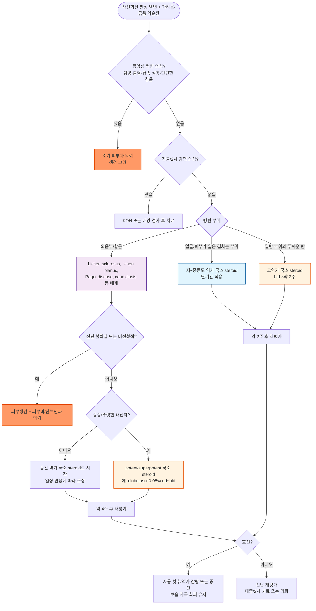

# 만성 단순태선 (신경피부염) Lichen Simplex Chronicus (LSC)

## <mark style="color:green;">일반 사항</mark>

* 반복적인 긁음 또는 문지름 등 물리적 자극에 의해 피부가 가죽처럼 두꺼워진 판
* 다른 이름 : neurodermatitis(신경피부염), circumscribed neurodermatitis
* 가려움 → 긁음 → 염증 및 가려움 유발 → 긁음의 악순환(itch-scratch cycle)이 핵심 병태
* 분류
  * 원발성(primary) : 기저 피부질환 없이 정상 피부에서 반복 자극만으로 발생
  * 속발성(secondary) : 아토피피부염, 접촉피부염, 건선 등 기존 소양성 피부질환 병변 위에 중첩되어 발생
* 흔한 부위 : 목덜미, 전완 외측, 손목 안쪽, 아래 다리/발목 외측, 발등, 엉덩이, 항문, 음문, 음낭
* 2차 감염, 궤양 등이 없는 순수한 태선의 경우 보통 흉터 없이 치유됨
* 치료 후 재발 또는 치료 중 다른 부위에 발생할 수 있음

## <mark style="color:green;">원인 및 위험 인자</mark>

* 건조, 땀
* 벌레 물림
* 정신적 스트레스, 불안
* 여성, 중장년층
* 가려운 습진성 피부염(예: 아토피)
* 무의식적·반복적 긁기가 습관화된 경우 : 강박적 피부뜯기 장애(skin-picking disorder) 등 신체집중반복행동장애(BFRB, body-focused repetitive behavior)가 동반될 수 있어, 치료 반응이 없거나 병식이 부족한 경우 정신건강의학과 평가를 함께 고려

## <mark style="color:green;">임상 양상</mark>

* 국소적으로 시작, 서서히 진행
* 가려움 : 발작적, 특히 밤에 심함
* 비교적 명확한 경계의 피부 병소
* 피부색 변화 : 과다 또는 과소 색소 침착
* 피부 비늘
* (선택적 보조 소견) 피부현미경(dermoscopy) : 백색 인설을 동반한 규칙적 혈관 패턴이 관찰될 수 있음 - 진단이 애매할 때 보조적으로 활용 가능하나 필수 검사는 아님

### <mark style="color:$danger;">🚩 Red Flags!</mark>

<mark style="color:$danger;">**즉각 조치 또는 의뢰**</mark>

* 병변 부위의 심한 발적·부종·통증 + 발열·오한 등 전신 증상 동반 → 봉와직염 등 침습성 2차 감염 의심, 즉시 항생제 치료 또는 응급 평가

<mark style="color:$warning;">**당일 또는 조기 의뢰**</mark>

* 급속히 커지는 궤양성·출혈성 병변, 단단한 침윤 → 종양성 병변(SCC 등) 의심, 조기 피부과 의뢰 및 조직검사 고려
* 진단이 불확실한 비전형적 단일 지속 병변 (mycosis fungoides/CTCL, SCC 등 감별 필요)
* 외음부/항문주위 지속 병변에서 lichen sclerosus, extramammary Paget disease 등을 배제해야 하는 경우
* 반복적인 2차 세균감염 또는 심한 통증·삼출·농포가 동반되는 경우

<mark style="color:$info;">**외래 추적 / 추가 평가 계획**</mark> <mark style="color:$info;">- 즉각 위험 낮으나 호전 없으면 의뢰</mark>

* 적절한 국소 steroid 치료(약 2주)에도 호전이 없거나 반복적으로 재발하는 경우
* 접촉알레르기가 의심되나 응급성은 없어 patch test 또는 피부과 의뢰를 계획하는 경우
* 전신에 광범위한 소양증이 동반되거나 피부 병변으로 설명되지 않아 전신성 소양증 원인 평가가 필요하나 안정적인 경우

## <mark style="color:green;">진단</mark>

* 보통 임상 소견으로 진단
* LSC를 유발하거나 지속시키는 기저 원인(아토피피부염, 접촉피부염, 진균감염, 신경병성 소양증 등)을 함께 평가
  * 전완 외측의 국소적 소양증·작열감은 brachioradial pruritus, 견갑골 내측/등 상부의 국소 소양증·감각이상은 notalgia paresthetica를 감별
  * 두 질환 모두 반복 scratching으로 이차적인 태선화가 생겨 LSC와 유사하게 보일 수 있음
* 진균감염 의심 시 KOH 검사, 2차 세균감염 의심 시 필요에 따라 배양검사 고려
* 접촉알레르기가 의심되면 patch test 또는 피부과 의뢰 고려
* 전신에 광범위한 소양증이 동반되거나 피부 병변으로 설명되지 않으면 전신성 소양증 원인 평가 고려
* 진단이 불확실하거나 비전형적·치료 불응성 병변은 피부생검 및 피부과 의뢰 고려

### <mark style="color:orange;">감별</mark>

* 태선화된 판상 병변을 보일 수 있는 질환들과의 감별

<table><thead><tr><th width="140">질환</th><th width="230">LSC와의 차이점</th><th>핵심 감별 포인트</th></tr></thead><tbody><tr><td>psoriasis</td><td>은백색 비늘이 더 뚜렷하고 특징적 호발 부위가 있음 (☞ p.889)</td><td>팔꿈치, 무릎, 두피, 손톱 침범; 긁는 습관력이 상대적으로 약함</td></tr><tr><td>lichen planus</td><td>일차 병변 자체가 다름</td><td>보라색(violaceous)의 작은 다각형(polygonal) 구진, Wickham striae</td></tr><tr><td>nummular eczema</td><td>병소 모양과 경과가 다름</td><td>동전 모양, 급성기에 삼출·가피 동반 가능</td></tr><tr><td>atopic dermatitis</td><td>흔히 선행 질환으로 LSC와 중첩됨</td><td>소아기 발병력, 굴측부(팔오금·오금) 호발, 개인/가족력</td></tr><tr><td>allergic/irritant contact dermatitis</td><td>유발 노출력이 있음</td><td>노출 부위와 형태 일치, 원인 물질 접촉력, patch test 양성</td></tr><tr><td>tinea corporis/cruris, tinea incognito</td><td>진균 감염이 원인</td><td>KOH 양성, 활동성 변연부의 경계가 뚜렷하고 중심 치유 경향</td></tr><tr><td>prurigo nodularis</td><td>병변 형태가 판(plaque)이 아닌 결절(nodule)</td><td>다발성 결절이 넓은 부위에 산재; LSC와 병태생리 중첩되나 임상형이 다름</td></tr><tr><td>외음부 병변(lichen sclerosus, candidiasis, extramammary Paget disease)</td><td>외음부/항문 특이 질환</td><td>백색 위축성 반(lichen sclerosus), 위성 병변·KOH 양성(candidiasis), 습진양이나 스테로이드 불응(Paget disease) → 감별 어려우면 생검</td></tr><tr><td>비전형적 단일 지속 병변 (mycosis fungoides/CTCL, SCC 등)</td><td>종양성 병변</td><td>표준 치료에 반응하지 않는 단일 병변, 궤양·침윤·급속 성장 시 생검 필수</td></tr></tbody></table>

***



<p align="center"><strong>진단 및 치료 알고리듬</strong></p>

<p align="center"><em><mark style="color:$info;">진료 편의를 위해 본 챕터 임상 내용을 바탕으로 구성한 요약 알고리듬 (외부 학회 공식 알고리듬 아님)</mark></em></p>

***

## <mark style="background-color:$warning;">Management</mark>

### <mark style="color:orange;">치료 방침</mark>

* 긁는 것을 중단하지 않으면 치료될 수 없음을 교육
* 가려움 완화 및 긁지 않도록 치료 (☞ p.857)
* 건조 방지, 피부 보호
* 1차 치료 : 긁기-가려움 악순환 차단 + 보습/자극 회피 + 적절한 역가의 국소 steroid
* 야간 가려움 또는 수면 중 긁기가 심한 경우 진정성 항히스타민제를 단기간 보조적으로 고려

## <mark style="color:green;">비-약물 치료 및 예방</mark>

* 냉찜질(10\~15분) - 미지근한 목욕 및 보습제 도포 (☞ p.866)
* 뜨거운 목욕, 과열, 거친 마찰은 가려움을 악화시킬 수 있어 피함
* 손톱을 짧게 관리 - 인지행동 요법, 스트레스 관리
* 무의식적 긁기를 인지하고 대체 행동을 훈련하는 habit reversal을 고려
* 부드러운 면·실크 등 마찰이 적은 소재의 의류/속옷 착용

## <mark style="color:green;">약물 치료</mark>

### <mark style="color:orange;">항염 : 국소 Steroid</mark>

#### <mark style="color:$primary;">도포제</mark>

(☞ [국소스테로이드](../231_/211_-topical-corticosteroids.md))

* 작용 : 항염, 가려움 완화
* 1차 선택제
* 작은 부위에 대하여 고역가 제제를 bid ×\~2주 적용 → 반응에 따라 낮은 역가로 교체
  * clobetasol propionate 0.05% <mark style="color:blue;">\[더모베이트]</mark>
  * fluocinonide 0.05% <mark style="color:blue;">\[나이드]</mark>
* 얼굴/피부가 얇은 겹치는 부위 : 낮은~중간 역가 제제를 짧게 적용 → 호전 후 감량 또는 중단
  * methylprednisolone aceponate 0.1% <mark style="color:blue;">\[아드반탄]</mark>
  * mometasone furoate 0.1% <mark style="color:blue;">\[모리코트]</mark>
* 외음부 LSC : 병변의 두께와 중증도에 따라 potent/superpotent steroid가 필요할 수 있으므로 해부학적 부위만으로 역가를 일률적으로 낮추지 않음
  * 중증 : clobetasol propionate 0.05% ointment qd~bid로 시작 가능 → 호전 시 서서히 감량
  * potent/superpotent steroid를 사용하는 중증 병변은 약 4주 후 재평가
  * 비전형적 병변·미란·궤양·출혈·침윤이 있거나 적절한 치료에도 의미 있는 호전이 없으면 lichen sclerosus, lichen planus, VIN/Paget disease 등 감별 및 피부과/산부인과 의뢰·생검 고려
  * 근거 : 2021 European guideline for the management of vulval conditions (J Eur Acad Dermatol Venereol. 2022;36:952-972)

#### <mark style="color:$primary;">병소 내 주사</mark>

* 대상 : 다른 치료로 호전되지 않는 심한 증상
* triamcinolone acetonide 5\~10 ㎎/㎖ <mark style="color:blue;">\[트리암시놀론 주]</mark>
* 병변 내 진피층(intradermal)에 정확히 주사하며 피하 주입은 피함; 국소 피부/피하지방 위축 및 저색소침착(hypopigmentation) 위험에 주의

#### <mark style="color:$primary;">밀폐 요법</mark>

* 대상 : 심한 가려움 (☞ [wet dressing](158_-atopic-dermatitis-ad.md#wet-wrap-therapy))
* 방법 : steroid 도포 후 plastic wrap으로 감싸거나 거즈로 덮음
* 부작용 : 자극 증상, 모낭염

#### <mark style="color:$primary;">Calcineurin 억제제</mark>

(☞ [Calcineurin 억제제](../231_/211_-topical-corticosteroids.md#calcineurin-inhibitor))

* 대상 : 국소 steroid를 지속 사용해야 하는 경우의 대체제
* pimecrolimus bid <mark style="color:blue;">\[엘리델]</mark>, tacrolimus bid <mark style="color:blue;">\[프로토픽]</mark>
* 사용 초기에 일시적인 따끔거림·화끈거림(burning/stinging)이 흔하며 대개 지속 사용하면서 감소함을 미리 설명

### <mark style="color:orange;">가려움 대증 치료</mark>

#### <mark style="color:$primary;">경구 항히스타민제</mark>

(☞ [항히스타민제](../231_/212_-antihistamines.md))

* 1세대 항히스타민제의 효과는 항히스타민 작용 자체보다 진정 효과에 의한 야간 scratching 감소 목적이 큼; 주간 사용은 졸음·운전 위험, 고령자에서는 항콜린성 부작용과 낙상에 주의
* 비진정성 2세대 항히스타민제는 두드러기 등 histamine-mediated itch가 동반되지 않은 순수 LSC에서는 효과가 제한적일 수 있음
* diphenhydramine : 25\~50 ㎎ q4\~6hr <mark style="color:blue;">\[디펙타민]</mark>
* hydroxyzine : 25\~50 ㎎ hs or 50\~100 ㎎/d #3\~4 <mark style="color:blue;">\[아디팜]</mark>

#### <mark style="color:$primary;">TCA</mark>

(☞ [TCA](../231_/213_-antidepressants-and-anxiolytics.md#tricyclic-antidepressant-tca))

* amitriptyline : 10\~25 ㎎ hs <mark style="color:blue;">\[에트라빌]</mark>

#### <mark style="color:$primary;">Gabapentinoid</mark>

(☞ [Gabapentinoid](../220_/001_-pain.md#gabapentinoid-a2d-ligands))

* 대상 : 국소 치료, 원인 교정 및 itch–scratch cycle 차단에도 지속되는 중증/난치성 소양증, 특히 neuropathic component가 의심되는 경우 선택적으로 고려
* 저용량으로 시작하여 점차 증량
* gabapentin : 300\~900 ㎎/d <mark style="color:blue;">\[뉴론틴]</mark>
* pregabalin : 150\~300 ㎎/d <mark style="color:blue;">\[리리카]</mark>
* 부작용 : 용량 의존 어지럼/졸음(대처- 저용량 시작 및 주의 깊은 증량); 고령자에서는 낙상·인지기능 저하에 특히 주의, 신기능 저하 시 감량

#### <mark style="color:$primary;">국소 도포제</mark>

* 2차 선택제
* doxepin 5% : 해외 문헌상 선택지이나 국내 미유통
* capsaicin 0.075% : qid; 작열감, 홍반 부작용(초기에 심함) <mark style="color:blue;">\[다이악센]</mark> (☞ p.14)
* pramoxine 1% : 국소 마취성 antipruritic; LSC 피부 병변 사용은 국내 허가 외 사용. 국내 프라목신 단일제는 치질 관련 가려움 완화 적응증이므로 허가사항을 확인하여 사용 <mark style="color:blue;">\[프라렉신]</mark>

#### <mark style="color:$primary;">Hydrocolloid 밀폐 요법</mark>

* 피부 보호, 습윤/가려움 완화
* scratching 차단을 위한 선택적 보조요법으로 사용; 피부 자극, 침윤, 모낭염, 2차 감염 여부를 확인하며 교체 <mark style="color:blue;">\[듀오덤]</mark>

#### <mark style="color:$primary;">기타 난치성 치료</mark>

* 난치성·광범위 병변에서는 피부과 의뢰 후 narrowband UVB(NB-UVB) 또는 targeted phototherapy를 고려할 수 있으나, 일차진료에서 보편적으로 시행하는 치료는 아님
* Botulinum toxin 피내 주사 등 일부 치료가 난치성 LSC에서 보고되었으나 근거가 제한적이며 일차진료에서 일반적으로 권장하지 않음
* LSC와 결절성 양진(prurigo nodularis)은 itch-scratch cycle을 공유하여 임상적으로 중첩될 수 있음. 다발성 결절성 병변으로 양상이 변하거나 PN으로 재분류되는 경우에는 LSC의 난치성 치료로 생물학적 제제를 추가하기보다 결절성 양진의 진단·치료 원칙에 따라 재평가
* 충분한 표준 치료에도 지속되는 중증 난치성 병변은 진단을 재검토하고 피부과 의뢰 후 개별적으로 고려

***

### <mark style="color:red;">질병코드 (KCD)</mark>

L28.0 만성 단순태선

***

## <mark style="color:purple;">처방례</mark>

> **처방례 1. 심한 부위 (팔꿈치 등 두꺼운 판)**
>
> ```
> 더모베이트 연고 10 g/tube  bid ×2주
> 아디팜 10 ㎎/T  3T #3 (졸음 주의)
> 프라렉신 크림 35 g/tube  가려움에 대하여 필요시
> ```
>
> _✽두꺼운 판형 병변은 고역가 steroid로 시작하여 2주 시점에 재평가; 호전되면 저역가로 감량. 주간 졸음 위험 고지._

> **처방례 2. 겹치는 부위, 얼굴**
>
> ```
> 아드반탄 연고 15 g/tube  qd ×1\~2주
> 아디팜 10 ㎎/T  1\~2T  취침 시 (야간 가려움 심한 경우, 단기간)
> ```
>
> _✽재발이 잦거나 steroid 장기 사용이 우려되는 부위이면 tacrolimus/pimecrolimus로 전환 고려._

> **처방례 3. 외음부 LSC - 중증·태선화가 뚜렷한 경우**
>
> ```
> 더모베이트 연고 15 g/tube  qd~bid (병소에 소량 얇게 도포)
> 아디팜 10 ㎎/T  1T  취침 시 (야간 소양감 심할 시, 단기간)
> ```
>
> _✽중증 외음부 LSC에서는 충분한 강도의 국소 steroid로 itch-scratch cycle을 차단하는 것이 중요하다. 약 4주 후 재평가하고 호전되면 사용 횟수·역가를 서서히 감량한다. 비전형적 병변·미란·궤양·출혈·침윤이 있거나 적절한 치료에도 의미 있는 호전이 없으면 lichen sclerosus, lichen planus, VIN/Paget disease 등을 감별하기 위해 피부과/산부인과 의뢰 및 생검을 고려한다. (2021 European guideline for the management of vulval conditions)_

> **처방례 4. 명확한 국소적 2차 세균감염이 동반된 경우**
>
> ```
> fusidic acid 연고  병변에 단기간 도포
> 국소 steroid  기존 LSC 병변의 염증 정도에 따라 병용 또는 순차 사용
> ```
>
> _✽단순 삼출·가피만으로 세균감염을 단정하거나 항생제를 routine하게 사용하지 않는다. 제한된 국소 병변에서 감염이 임상적으로 명확한 경우에만 단기간 국소 항생제를 고려한다. 감염이 광범위하거나 봉와직염, 발열·오한 등 전신증상이 동반되면 배양검사와 전신 항생제 치료를 고려하고, 불안정하거나 빠르게 진행하면 즉시 평가한다. 경구 항생제는 LSC의 고정 처방으로 제시하지 않고 감염 범위·중증도와 환자 위험요인에 따라 선택한다._

> **처방례 5. 재발 반복 / Steroid 장기 사용 우려 시 유지요법**
>
> ```
> 프로토픽 연고(tacrolimus 0.1%)  bid
> ```
>
> _✽steroid로 호전 후에도 재발이 잦거나 장기 사용에 따른 피부 위축이 우려되는 부위(얼굴, 겹치는 부위 등)에서 유지요법으로 전환._

***

### <mark style="color:$success;">핵심 복약 지도</mark>

> **국소 steroid, 이렇게 사용하세요**
>
> 1. 병소에만 얇게 도포하고 문지르지 않습니다(문지르면 자극이 악화될 수 있습니다).
> 2. 고역가 제제는 보통 2주 이내로 단기간만 사용하고, 호전되면 저역가 제제로 교체하거나 사용 간격을 늘립니다.
> 3. 얼굴·겨드랑이·서혜부 등 피부가 얇은 부위는 저~중등도 역가만 짧게 사용합니다.
> 4. 장기간·과다 사용 시 피부 위축, 모세혈관 확장, steroid 여드름이 발생할 수 있음을 설명합니다.
> 5. 외음부 중증 LSC에서 potent/superpotent 국소 steroid를 사용하는 경우에는 처방된 부위·횟수대로 사용하고 약 4주 후 치료 반응과 피부 상태를 반드시 재평가합니다.

> **긁기-가려움 악순환을 끊는 것이 핵심 치료입니다**
>
> * 손톱을 짧게 유지하고, 무의식적으로 긁는 순간을 알아차리는 habit reversal 훈련을 함께 안내합니다.
> * 야간 소양감이 심하면 취침 전 진정성 항히스타민제(예: hydroxyzine, diphenhydramine)를 단기간 사용할 수 있으며, 주간 졸음·낙상 위험(특히 고령자)을 설명합니다.

> **Tacrolimus/pimecrolimus 사용 시**
>
> * 사용 초기에 따끔거리거나 화끈거릴 수 있으나 대개 지속 사용하면서 줄어듭니다. 심한 자극이 지속되면 다시 진료받도록 안내합니다.

> **밀폐 요법(hydrocolloid 등) 사용 시**
>
> * 필요한 경우 hydrocolloid dressing 등으로 병변을 물리적으로 보호하여 scratching을 줄일 수 있습니다. steroid와 함께 밀폐하면 흡수가 증가할 수 있으므로 적용 부위·기간을 제한하고 피부 상태를 재평가합니다.
> * 자극감, 침윤, 모낭염, 2차 감염 징후(발적 증가, 삼출, 통증)가 있으면 즉시 제거하고 내원하도록 안내합니다.

> **언제 다시 병원을 방문해야 하나요?**
>
> * 2주 이상 적절한 국소 steroid 치료에도 호전이 없는 경우
> * 병변이 갑자기 빠르게 커지거나 궤양, 출혈, 단단하게 만져지는 경우 - 즉시 내원
> * 외음부·항문 주위 병변이 지속되며 저절로 좋아지지 않는 경우
> * 진물, 고름, 심한 통증 등 2차 감염이 의심되는 경우 - 즉시 내원

***

### <mark style="color:blue;">환자 안내서</mark>


**만성 단순태선, 반복해서 긁다 보니 피부가 두꺼워진 상태입니다**

가려운 부위를 계속 긁거나 문지르면 피부가 가죽처럼 두껍고 거칠게 변합니다. 이렇게 변한 피부가 다시 가려움을 유발해 "가려움 → 긁음 → 더 가려움"의 악순환이 반복됩니다. 긁는 것을 멈추지 않으면 치료가 어렵습니다.


#### <mark style="color:$primary;">왜 이런 병이 생기나요?</mark>

* 건조한 피부, 땀, 벌레 물린 자리 등을 반복해서 긁거나 문지르면서 시작됩니다.
* 스트레스나 불안이 심할 때 무의식적으로 긁는 습관이 악화 요인이 되기도 합니다.
* 원래 가려움이 잘 생기는 피부(아토피 등)를 가진 분에서 더 잘 생깁니다.

#### <mark style="color:$primary;">일상생활에서 어떻게 관리하나요?</mark>

* **긁지 말고 눌러주세요.** 가려울 때는 긁는 대신 찬 찜질(10\~15분)을 하거나 손으로 살짝 눌러 자극을 줄여주세요.
* **보습을 충분히 하세요.** 미지근한 물로 씻은 직후 보습제를 발라 피부 장벽을 보호합니다.
* **손톱은 짧게 깎으세요.** 자는 동안 무의식적으로 긁어 상처를 내는 것을 줄일 수 있습니다.
* **뜨거운 목욕, 거친 옷은 피하세요.** 마찰이 심한 소재보다 부드러운 면·실크 등 마찰이 적은 소재의 옷과 속옷을 선택하세요.
* **긁는 습관을 알아차리는 연습을 해보세요.** 무의식적으로 손이 갈 때마다 다른 행동(주먹 쥐기 등)으로 바꿔보는 것이 도움이 됩니다.

#### <mark style="color:$primary;">연고(스테로이드)는 어떻게 써야 하나요?</mark>

* 의사가 처방한 기간과 부위에만 얇게 바르십시오. 정해진 기간보다 오래 임의로 바르면 피부가 얇아지거나 붉은 실핏줄이 보일 수 있습니다.
* 얼굴이나 접히는 부위는 특히 짧게, 정해진 대로만 사용하세요.
* 밤에 가려움이 심해 잠을 설칠 때는 처방받은 약을 취침 전 복용하면 도움이 될 수 있습니다(운전·기계 조작 시 졸림 주의).

#### <mark style="color:$primary;">이럴 때는 즉시 병원을 방문하세요</mark>

* 병변이 갑자기 빠르게 커지거나, 헐거나 피가 나는 경우
* 진물, 고름과 함께 심한 통증이 있는 경우 (2차 감염 의심)
* 2주 이상 연고를 발라도 전혀 좋아지지 않는 경우
