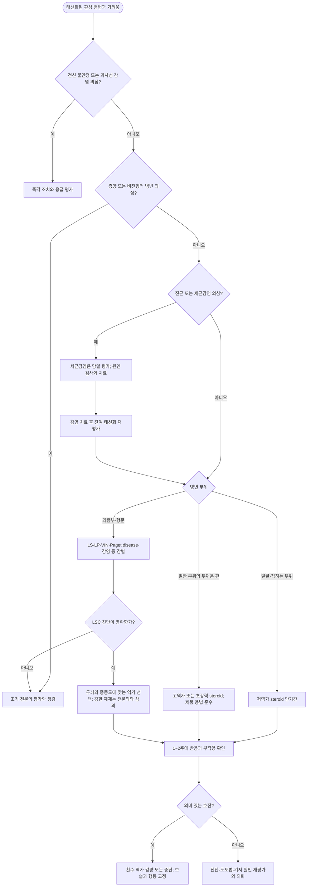

# 만성 단순태선 (신경피부염) Lichen Simplex Chronicus (LSC)

## <mark style="color:green;">일반 사항</mark>

* 반복적인 긁음 또는 문지름 등 물리적 자극에 의해 피부가 가죽처럼 두꺼워지고 피부선이 뚜렷해진 태선화(lichenification) 판
* 다른 이름 : neurodermatitis(신경피부염), circumscribed neurodermatitis
* 가려움 → 긁음 → 염증 및 가려움 유발 → 긁음의 악순환(itch-scratch cycle)이 핵심 병태
* 분류
  * 원발성(primary) : 기저 피부질환 없이 정상 피부에서 반복 자극만으로 발생
  * 속발성(secondary) : 아토피피부염, 접촉피부염, 건선 등 기존 소양성 피부질환 병변 위에 중첩되어 발생
* 흔한 부위 : 목덜미, 전완 외측, 손목 안쪽, 아래 다리/발목 외측, 발등, 엉덩이, 항문, 음문, 음낭
* 2차 감염, 궤양 등이 없는 순수한 태선의 경우 보통 흉터 없이 치유됨
* 치료 후 재발 또는 치료 중 다른 부위에 발생할 수 있음
* LSC 자체가 전암성 병변인 것은 아님; 지속되는 비전형적 병변은 LSC로 오인한 다른 질환이 없는지 확인

## <mark style="color:green;">원인 및 위험 인자</mark>

* 건조, 땀
* 벌레 물림
* 정신적 스트레스, 불안
* 여성, 중장년층
* 가려운 습진성 피부염(예: 아토피)
* 무의식적·반복적 긁기가 습관화될 수 있음; 가려움 때문에 긁는 행동만으로 피부뜯기 장애(skin-picking disorder)를 진단하지 않음
  * 피부뜯기 행동을 줄이려는 시도의 반복적 실패, 뚜렷한 고통·기능 손상 등 별도의 문제가 있거나 불안·우울이 치료에 영향을 주면 정신건강의학과 평가를 고려

## <mark style="color:green;">임상 양상</mark>

* 국소적으로 시작, 서서히 진행
* 가려움 : 발작적, 특히 밤에 심함
* 비교적 명확한 경계의 피부 병소
* 피부색 변화 : 과다 또는 과소 색소 침착
* 피부 비늘, 긁은 자국·찰과상·가피; 두피에서는 모발 절단이 동반될 수 있음
* (선택적 보조 검사) 피부현미경(dermoscopy) : 강조된 피부선, 백색 인설·백색 무구조 영역 등이 보일 수 있으나 특이적이지 않음; 규칙적 혈관 패턴을 LSC의 진단 소견으로 사용하지 않음

### <mark style="color:$danger;">🚩 Red Flags!</mark>

<mark style="color:$danger;">**즉각 조치**</mark>

* 감염 의심 병변과 함께 저혈압·의식 변화 등 전신 불안정, 빠르게 진행하는 부종·발적, 외관에 비해 극심한 통증·괴사 등이 나타나는 경우 → 패혈증·괴사성 연조직감염 의심, 즉시 응급 평가

<mark style="color:$warning;">**당일 평가**</mark>

* 퍼지는 발적·열감·부종·압통, 심한 통증·농포·농성 삼출 등 2차 세균감염 의심 → 봉와직염·농양 여부 평가 및 항균 치료 결정; 발열이 없어도 평가
* 발열·오한 등 전신 증상을 동반한 감염 의심 병변 → 당일 평가; 전신 불안정 또는 급속 진행 시 즉각 조치

<mark style="color:$info;">**조기 평가 및 추적**</mark>

* 급속히 커지는 궤양성·출혈성 병변, 단단한 침윤 → 종양성 병변(SCC 등) 의심, 지체하지 않고 피부과 의뢰 및 생검 계획
* 진단이 불확실한 비전형적 지속 병변 → mycosis fungoides/CTCL, SCC 등 감별; CTCL은 다발성 병변으로도 나타날 수 있음
* 외음부/항문주위 지속 병변에서 lichen sclerosus, lichen planus, VIN, extramammary Paget disease 등을 배제해야 하는 경우
* 적절한 국소 steroid 치료와 자극 회피를 약 2주 시행해도 의미 있는 호전이 없거나, 반복 재발·반복 감염이 있는 경우 → 순응도·도포법·기저 질환 재평가 및 의뢰
* 접촉알레르기가 의심되는 경우 → patch test 계획; 광범위 소양증 또는 피부 병변으로 설명되지 않는 가려움 → 전신성 소양증 원인 평가

## <mark style="color:green;">진단</mark>

* 보통 임상 소견으로 진단
* LSC를 유발하거나 지속시키는 기저 원인(아토피피부염, 접촉피부염, 진균감염, 신경병성 소양증 등)을 함께 평가
  * 전완 외측의 국소적 소양증·작열감은 brachioradial pruritus, 견갑골 내측/등 상부의 국소 소양증·감각이상은 notalgia paresthetica를 감별
  * 두 질환 모두 반복 scratching으로 이차적인 태선화가 생겨 LSC와 유사하게 보일 수 있음
* 진균감염 의심 시 KOH 검사; 임상적으로 의심이 높으면 음성 결과만으로 배제하지 말고 재검·배양 등을 고려
* 농성 삼출·반복 감염·치료 실패 등에서는 세균배양 고려; 명확한 봉와직염의 치료를 검사 결과가 나올 때까지 지연하지 않음
* 야간 가려움과 가족/동거인의 유사 증상, 손가락 사이·손목·생식기 병변 등이 있으면 옴을 감별
* 접촉알레르기가 의심되면 patch test 또는 피부과 의뢰 고려
* 전신에 광범위한 소양증이 동반되거나 피부 병변으로 설명되지 않으면 전신성 소양증 원인 평가 고려
* 진단이 불확실하거나 비전형적·치료 불응성 병변은 피부생검 및 피부과 의뢰 고려

### <mark style="color:orange;">감별</mark>

* 태선화된 판상 병변을 보일 수 있는 질환들과의 감별

<table><thead><tr><th width="140">질환</th><th width="230">LSC와의 차이점</th><th>핵심 감별 포인트</th></tr></thead><tbody><tr><td>psoriasis</td><td>은백색 비늘이 더 뚜렷하고 특징적 호발 부위가 있음 (☞ p.889)</td><td>팔꿈치, 무릎, 두피, 손톱 침범; 건선 병변에도 이차 태선화가 중첩될 수 있음</td></tr><tr><td>lichen planus</td><td>일차 병변 자체가 다름</td><td>보라색(violaceous)의 작은 다각형(polygonal) 구진, Wickham striae</td></tr><tr><td>nummular eczema</td><td>병소 모양과 경과가 다름</td><td>동전 모양, 급성기에 삼출·가피 동반 가능</td></tr><tr><td>atopic dermatitis</td><td>흔히 선행 질환으로 LSC와 중첩됨</td><td>소아기 발병력, 굴측부(팔오금·오금) 호발, 개인/가족력; 성인에서 새로 발병할 수도 있음</td></tr><tr><td>allergic/irritant contact dermatitis</td><td>유발 노출력이 있음</td><td>노출 부위와 형태 일치, 원인 물질 접촉력; patch test는 알레르기접촉피부염 평가용이며 자극접촉피부염의 확진 검사가 아님</td></tr><tr><td>tinea corporis/cruris, tinea incognito</td><td>진균 감염이 원인</td><td>일반 백선은 활동성 변연부·중심 치유 경향; tinea incognito에서는 steroid로 전형적 경계·인설이 흐려질 수 있음; KOH/진균검사로 확인</td></tr><tr><td>prurigo nodularis</td><td>병변 형태가 판(plaque)이 아닌 결절(nodule)</td><td>다발성 결절이 넓은 부위에 산재; LSC와 병태생리 중첩되나 임상형이 다름</td></tr><tr><td>외음부 병변(lichen sclerosus, candidiasis, extramammary Paget disease)</td><td>외음부/항문 특이 질환</td><td>백색 위축성 반(lichen sclerosus), 위성 병변·KOH 양성(candidiasis), 습진양이나 스테로이드 불응(Paget disease) → 감별 어려우면 생검</td></tr><tr><td>비전형적 지속 병변 (mycosis fungoides/CTCL, SCC 등)</td><td>종양성 병변</td><td>표준 치료에 반응하지 않는 지속 병변, 궤양·침윤·급속 성장 시 생검을 적극 시행; CTCL은 다발성도 가능</td></tr><tr><td>옴</td><td>전염성 기생충 감염</td><td>야간 소양증, 동거인의 유사 증상, 굴(burrow); 반복 긁기로 태선화가 중첩될 수 있음</td></tr></tbody></table>

***


```mermaid
graph TD
    A(["태선화된 판상 병변과 가려움"]) ---> B{"전신 불안정 또는 괴사성 감염 의심?"}
    B -- 예 ---> C["즉각 조치와 응급 평가"]
    B -- 아니오 ---> D{"종양 또는 비전형적 병변 의심?"}
    D -- 예 ---> E["조기 전문의 평가와 생검"]
    D -- 아니오 ---> F{"진균 또는 세균감염 의심?"}
    F -- 예 ---> G["세균감염은 당일 평가; 원인 검사와 치료"]
    F -- 아니오 ---> H{"병변 부위"}
    G ---> I["감염 치료 후 잔여 태선화 재평가"]
    I ---> H
    H -- 얼굴·접히는 부위 ---> J["저역가 steroid 단기간"]
    H -- 일반 부위의 두꺼운 판 ---> K["고역가 또는 초강력 steroid; 제품 용법 준수"]
    H -- 외음부·항문 ---> L["LS·LP·VIN·Paget disease·감염 등 감별"]
    L ---> M{"LSC 진단이 명확한가?"}
    M -- 아니오 ---> E
    M -- 예 ---> N["두께와 중증도에 맞는 역가 선택; 강한 제제는 전문의와 상의"]
    J ---> O["1~2주에 반응과 부작용 확인"]
    K ---> O
    N ---> O
    O ---> P{"의미 있는 호전?"}
    P -- 예 ---> Q["횟수·역가 감량 또는 중단; 보습과 행동 교정"]
    P -- 아니오 ---> R["진단·도포법·기저 원인 재평가와 의뢰"]
```

<p align="center"><strong>진단 및 치료 알고리듬</strong></p>

<p align="center"><em><mark style="color:$info;">진료 편의를 위해 본 챕터 임상 내용을 바탕으로 구성한 요약 알고리듬 (외부 학회 공식 알고리듬 아님)</mark></em></p>

***

## <mark style="background-color:$warning;">Management</mark>

### <mark style="color:orange;">치료 방침</mark>

* 긁기-가려움 악순환을 설명하고, 가려움 완화와 긁는 행동의 감소를 함께 치료함; 무의식적 긁기를 환자의 의지 부족으로 해석하지 않음
* 가려움 완화 및 긁지 않도록 치료 (☞ p.857)
* 건조 방지, 피부 보호
* 1차 치료 : 긁기-가려움 악순환 차단 + 보습/자극 회피 + 적절한 역가의 국소 steroid
* 야간 가려움 또는 수면 중 긁기가 심한 경우 진정성 항히스타민제를 단기간 보조적으로 고려

## <mark style="color:green;">비-약물 치료 및 예방</mark>

* 냉찜질(10\~15분) : 얼음은 천으로 감싸고 피부에 직접 대지 않음 - 미지근한 목욕 및 향료가 없는 보습제 도포 (☞ p.866)
* 뜨거운 목욕, 과열, 거친 마찰은 가려움을 악화시킬 수 있어 피함
* 손톱을 짧게 관리 - 인지행동 요법, 스트레스 관리
* 무의식적 긁기를 인지하고 대체 행동을 훈련하는 habit reversal을 고려
* 부드러운 면·실크 등 마찰이 적은 소재의 의류/속옷 착용
* 외음부/항문주위 : 향료·세정제·물티슈·반복 세척 등의 자극과 불필요한 국소 약제를 피하고, 땀·소변·대변 자극 및 동반 질환을 교정

## <mark style="color:green;">약물 치료</mark>

### <mark style="color:orange;">항염 : 국소 Steroid</mark>

#### <mark style="color:$primary;">도포제</mark>

(☞ [국소스테로이드](../231_/211_-topical-corticosteroids.md))

* 작용 : 항염, 가려움 완화
* 1차 선택제
* 일반 부위의 두꺼운 판 : 작은 면적에 고역가 또는 초강력 제제를 단기간 적용 → 1\~2주에 반응·부작용 확인, 호전되면 횟수/역가 감량 또는 중단
  * clobetasol propionate 0.05% : 초강력(very potent) <mark style="color:blue;">\[베타베이트 연고]</mark>, qd\~bid
    * 국내 허가사항상 2주 이상의 연속 치료 및 주 50 g 이상의 사용을 피함; 추가 치료는 재평가 후 결정
    * <mark style="color:blue;">\[더모베이트 연고]</mark>는 공급 중단 공지가 있어 처방례에서는 제외
  * fluocinonide 0.05% : 고역가 <mark style="color:blue;">\[나이드 크림]</mark>; 제품별 도포 횟수를 따름
* 얼굴/피부가 얇은 접히는 부위 : 저역가를 우선 선택하고 짧게 적용; 1\~2주 이내 재평가하며 호전되면 중단
  * hydrocortisone 1% <mark style="color:blue;">\[락티케어에취씨로션1%]</mark>
  * methylprednisolone aceponate 0.1% <mark style="color:blue;">\[아드반탄]</mark>와 mometasone furoate 0.1% <mark style="color:blue;">\[모리코트]</mark>는 저역가 제제가 아님; 분류 체계·제형에 따라 역가가 달라 얼굴/접히는 부위의 일반적 1차 처방으로 제시하지 않음
  * 눈꺼풀·눈 주위에는 특히 주의하고 임의의 강한 제제 사용을 피함
* 외음부 LSC : 병변 두께·중증도에 따라 충분한 역가가 필요할 수 있으므로 부위만으로 일률적으로 저역가를 선택하지 않음
  * 유럽 지침은 중증에서 clobetasol 0.05% ointment qd\~bid와 호전 시 감량, 강한 제제 사용 시 4주 재평가를 제시함
  * 국내 베타베이트 허가사항에는 항문·생식기 가려움 환자 금기와 연속 치료 기간 제한이 있음; 해외 권고를 국내 허가 용법과 동일하게 제시하지 않음. 중증 외음부 LSC에서는 전문의가 진단을 확인하고 제품별 금기·허가 범위 및 대안을 검토하여 치료를 결정
  * 4주 재평가는 동일 초강력 제제를 4주 내내 연속 도포한다는 뜻이 아님; 1\~2주에 반응·피부 상태와 추가 치료 필요성을 확인
  * 비전형적 병변·미란·궤양·출혈·침윤 또는 치료 불응 시 lichen sclerosus, lichen planus, VIN/Paget disease 등을 감별하고 피부과/산부인과 의뢰·생검 고려
  * 근거 : [2021 European guideline for the management of vulval conditions](https://iusti.org/wp-content/uploads/2022/04/epub-vulval-conditions.pdf) (J Eur Acad Dermatol Venereol. 2022;36:952-972)

#### <mark style="color:$primary;">병소 내 주사</mark>

* 대상 : 적절한 국소 치료에도 지속되는 매우 두꺼운 국한성 판; 피부과에서 선택적으로 시행
* triamcinolone acetonide 5\~10 ㎎/㎖ <mark style="color:blue;">\[트리암시놀론 주]</mark>
* 위 수치는 병소 내 주사에 사용하는 농도이며 제품의 원액 농도와 다를 수 있음; 제형·원액 농도와 병소 내 투여 허가 여부를 확인하고 필요 시 무균적으로 희석
* 병변 내 진피층(intradermal)에 정확히 주사하며 피하 주입은 피함; 국소 피부/피하지방 위축 및 저색소침착(hypopigmentation) 위험에 주의

#### <mark style="color:$primary;">밀폐 요법</mark>

* 대상 : 일반 부위의 두꺼운 국한성 판에서 선택적 보조요법; 가려움만을 이유로 일률적으로 시행하지 않음
* steroid와 밀폐를 병용하면 흡수가 증가하므로 역가·면적·시간·기간을 의사가 구체적으로 정함; 얼굴·생식기·접히는 부위·감염 또는 미란 병변에는 피함
* plastic wrap 등 불투과성 재료를 이용한 밀폐와 거즈 보호, wet wrap은 서로 다른 방법임; 거즈만 덮는 것은 밀폐와 같지 않음 (☞ [wet wrap](158_-atopic-dermatitis-ad.md#wet-wrap-therapy))
* 부작용 : 피부위축, 피부 짓무름(maceration), 자극, 모낭염·감염; 넓은 면적·장기간 사용 시 HPA축 억제 위험

#### <mark style="color:$primary;">Calcineurin 억제제</mark>

(☞ [Calcineurin 억제제](../231_/211_-topical-corticosteroids.md#calcineurin-inhibitor))

* 대상 : steroid 불내성, 피부위축 위험이 큰 부위, 반복 재발에서 선택적 2차 치료; LSC 치료는 국내 허가 외 사용
* pimecrolimus 1% cream bid <mark style="color:blue;">\[엘리델]</mark>, 성인 tacrolimus 0.1% ointment bid <mark style="color:blue;">\[프로토픽]</mark>
* 호전 후 도포 횟수 감량 또는 중단; LSC에서 주 2회 등의 장기 유지요법은 근거가 제한적이므로 아토피피부염의 유지요법을 그대로 적용하지 않음
* 점막·감염 부위에는 적용하지 않고 밀폐하지 않음; 소아는 농도·연령별 허가사항을 확인하고 전문의와 상의
* 사용 초기에 일시적인 따끔거림·화끈거림(burning/stinging)이 흔하며 대개 지속 사용하면서 감소함을 미리 설명

### <mark style="color:orange;">가려움 대증 치료</mark>

#### <mark style="color:$primary;">경구 항히스타민제</mark>

(☞ [항히스타민제](../231_/212_-antihistamines.md))

* 1세대 항히스타민제의 효과는 항히스타민 작용 자체보다 진정 효과에 의한 야간 scratching 감소 목적이 큼; 주간 사용은 졸음·운전 위험, 고령자에서는 항콜린성 부작용과 낙상에 주의
* 비진정성 2세대 항히스타민제는 두드러기 등 histamine-mediated itch가 동반되지 않은 순수 LSC에서는 효과가 제한적일 수 있음
* hydroxyzine <mark style="color:blue;">\[아디팜]</mark>
  * 국내 피부과 허가 용량 : 성인 30\~60 ㎎/d #2\~3, 최단 기간·최소 유효 용량 사용
  * 야간 긁기·수면장애에 대한 보조 사용 : 10\~20 ㎎ hs부터 반응과 다음 날 졸음을 확인하여 조정할 수 있음; 취침 시 저용량 요법과 국내 분할투여 용법을 구분
  * 고령자에서는 권장되지 않음; 불가피하면 성인 권장용량의 절반부터 시작, 최대 50 ㎎/d
  * QT 연장·심혈관질환·유의한 서맥·저칼륨/저마그네슘혈증·급성 심장사 가족력 또는 QT 연장 약물 병용 시 금기; 임부·임신 가능 여성 및 수유부에도 금기
* diphenhydramine <mark style="color:blue;">\[디펙타민]</mark> : 국내 제품은 일시적 불면증 완화용으로 성인 50 ㎎ hs, 과도한 진정 시 25 ㎎ hs가 허가 용법임; LSC 소양증 치료는 허가 외 사용이며 q4\~6hr 반복 용법을 적용하지 않음. 본 챕터의 기본 처방례에서는 제외
* 두 진정성 항히스타민제를 함께 사용하지 않음; 음주·다른 진정제 및 항콜린성 약물 병용을 피하고 운전·기계 조작 위험을 설명

#### <mark style="color:$primary;">TCA</mark>

(☞ [TCA](../231_/213_-antidepressants-and-anxiolytics.md#tricyclic-antidepressant-tca))

* amitriptyline : 10\~25 ㎎ hs <mark style="color:blue;">\[에트라빌]</mark>; LSC/소양증에는 국내 허가 외 사용
* 난치성 야간 소양증·신경병성 요소 등에서 선택적으로 고려; 항콜린성 부작용, 기립저혈압, QT 연장·부정맥 및 과량복용 독성에 주의. 고령자는 가급적 피하고 hydroxyzine 등 QT 연장 약물과 병용하지 않음

#### <mark style="color:$primary;">Gabapentinoid</mark>

(☞ [Gabapentinoid](../220_/001_-pain.md#gabapentinoid-a2d-ligands))

* 대상 : 국소 치료, 원인 교정 및 itch–scratch cycle 차단에도 지속되는 중증/난치성 소양증, 특히 neuropathic component가 의심되는 경우 선택적으로 고려
* LSC/소양증에는 국내 허가 외 사용; 아래는 신기능이 정상인 성인의 선택적 사용 예이며 LSC에 확립된 표준 용량은 아님
* gabapentin : 100\~300 ㎎ hs부터 시작, 반응·내약성에 따라 300\~900 ㎎/d를 분할투여하는 등 개별 조정 <mark style="color:blue;">\[뉴론틴]</mark>
* pregabalin : 25\~75 ㎎ hs부터 시작, 필요하면 75 ㎎ bid 등으로 조정; 처음부터 150\~300 ㎎/d를 일률적으로 시작하지 않음 <mark style="color:blue;">\[리리카]</mark>
* 부작용 : 어지럼·졸음·부종; 고령자는 낙상·인지기능 저하에 주의, 신기능에 따라 시작량·투여 간격·유지량을 감량. 다른 진정제 병용 시 주의하고 지속 복용 후에는 서서히 감량

#### <mark style="color:$primary;">국소 도포제</mark>

* 국소 항염 치료에 반응하지 않는 소양증에서 선택적 보조요법; LSC에 대한 근거는 제한적임
* doxepin 5% : 해외 문헌의 선택지; 국내 처방례에는 포함하지 않음
* capsaicin 0.075% : 신경병성 소양증이 의심될 때 선택적 고려; LSC/소양증에는 국내 허가 외 사용. <mark style="color:blue;">\[다이악센]</mark>은 신경통·관절통 등의 일시적 완화용으로 1일 3\~4회(4시간 이상 간격) 도포; 작열감·홍반이 흔하고 얼굴·생식기·점막·상처에는 사용하지 않음 (☞ p.14)
* pramoxine 1% : 해외에서 국소 가려움 완화에 사용하나 국내 <mark style="color:blue;">\[프라렉신]</mark>은 치질 증상 완화용이며 허가사항상 항문 부위에만 사용함; 일반 LSC 피부 병변의 기본 처방으로 제시하지 않음

#### <mark style="color:$primary;">Hydrocolloid 밀폐 요법</mark>

* 피부 보호, 습윤/가려움 완화
* scratching 차단을 위한 선택적 보조요법으로 사용; 피부 자극, 짓무름(maceration), 모낭염, 2차 감염 여부를 확인하며 교체 <mark style="color:blue;">\[듀오덤]</mark>

#### <mark style="color:$primary;">기타 난치성 치료</mark>

* 난치성·광범위 병변에서는 피부과 의뢰 후 narrowband UVB(NB-UVB) 또는 targeted phototherapy를 고려할 수 있으나, 일차진료에서 보편적으로 시행하는 치료는 아님
* Botulinum toxin 피내 주사 등 일부 치료가 난치성 LSC에서 보고되었으나 근거가 제한적이며 일차진료에서 일반적으로 권장하지 않음
* LSC와 결절성 양진(prurigo nodularis)은 itch-scratch cycle을 공유하여 임상적으로 중첩될 수 있음. 다발성 결절성 병변으로 양상이 변하거나 PN으로 재분류되는 경우에는 LSC의 난치성 치료로 생물학적 제제를 추가하기보다 결절성 양진의 진단·치료 원칙에 따라 재평가
* 충분한 표준 치료에도 지속되는 중증 난치성 병변은 진단을 재검토하고 피부과 의뢰 후 개별적으로 고려

***

### <mark style="color:red;">질병코드 (KCD)</mark>

L28.0 만성 단순태선 Lichen simplex chronicus

***

## <mark style="color:purple;">처방례</mark>

> **처방례 1. 심한 부위 (팔꿈치 등 두꺼운 판)**
>
> ```
> 베타베이트 연고 15 g/tube  qd~bid ×7~10일 (병소에 소량 얇게 도포)
> 아디팜 10 ㎎/T  1~2T  취침 시 (야간 가려움 심한 경우, 단기간)
> ```
>
> _✽성인 일반 피부 부위의 국한된 두꺼운 판에 적용함. 베타베이트는 초강력 제제이므로 얼굴·생식기·접히는 부위에는 이 처방례를 적용하지 않음. 1~2주에 재평가하여 호전되면 감량 또는 중단하고 연속 치료 기간·총량은 제품 허가사항을 준수함. 아디팜은 필요 시에만 사용하며 QT 관련 금기·임신/수유 여부와 다음 날 졸음을 확인함._

> **처방례 2. 겹치는 부위, 얼굴**
>
> ```
> 락티케어에취씨로션1%  qd~bid ×5~7일 (병소에 소량 얇게 도포)
> 아디팜 10 ㎎/T  1\~2T  취침 시 (야간 가려움 심한 경우, 단기간)
> ```
>
> _✽저역가 제제로 시작하여 단기간 사용함. 반복 재발 또는 steroid 불내성에서는 tacrolimus/pimecrolimus를 허가 외 2차 치료로 고려함. 눈 주위에는 임의로 도포하지 않음._

> **처방례 3. 외음부 LSC - 중증·태선화가 뚜렷한 경우의 전문의 치료 원칙**
>
> _✽중증 외음부 LSC에서는 병변의 두께·중증도에 맞는 충분한 역가가 필요할 수 있음. 유럽 지침은 clobetasol 0.05% 연고 qd~bid를 선택지로 제시하지만, 국내 베타베이트는 항문·생식기 가려움 관련 금기와 연속 사용 기간 제한이 있어 그대로 대체 처방하지 않음. 피부과/산부인과에서 진단·감염 배제·제품 허가사항 및 대안을 검토한 후 치료를 정하고, 1~2주에 초기 반응을 확인하며 중증은 약 4주에 다시 평가함. 비전형적 병변·미란·궤양·출혈·침윤 또는 불응 시 LS·LP·VIN/Paget disease 감별 및 생검을 고려함._

> **처방례 4. 명확한 국소적 2차 세균감염이 동반된 경우**
>
> ```
> 후시딘 연고(sodium fusidate 2%)  국한된 감염 병변에 1일 1~2회, 5~7일
> 국소 steroid  기존 LSC 병변의 염증 정도에 따라 병용 또는 순차 사용
> ```
>
> _✽단순 삼출·가피만으로 세균감염을 단정하거나 항생제를 일률적으로 사용하지 않음. 국한된 농가진성 감염이 임상적으로 명확한 경우에만 단기간 국소 항생제를 고려하며 반복·장기 사용을 피함. 봉와직염·광범위 감염은 당일 평가하고 전신 항생제 치료를 결정함; 불안정하거나 빠르게 진행하면 즉각 조치함. 배양은 반복·난치성 감염 등 필요 시 시행함. 경구 항생제는 감염 범위·중증도와 환자 위험요인에 따라 선택함. 감염이 확산되면 국소 steroid를 중단하고 재평가함._

> **처방례 5. 재발 반복 / Steroid 불내성 시 2차 치료 (성인, 허가 외)**
>
> ```
> 프로토픽 연고(tacrolimus 0.1%)  bid (병소에 소량 얇게 도포)
> ```
>
> _✽LSC에는 허가 외 사용이며 근거가 제한적임. 얼굴·접히는 부위 등 steroid 위축 위험이 큰 부위에서 선택적으로 고려하고 2~4주에 반응을 확인함. 호전 후 횟수 감량 또는 중단하며 장기 유지요법은 개별 결정함. 점막·감염 부위에는 바르지 않고 밀폐하지 않음._

***

### <mark style="color:$success;">핵심 복약 지도</mark>

> **국소 steroid, 이렇게 사용하세요**
>
> 1. 병소에만 얇게 도포하고 문지르지 않습니다(문지르면 자극이 악화될 수 있습니다).
> 2. 강한 제제는 처방 기간과 제품별 사용 제한을 지키고, 보통 1~2주에 효과·부작용을 확인합니다. 호전되면 사용 횟수·역가를 줄이거나 중단합니다.
> 3. 얼굴·겨드랑이·서혜부 등 피부가 얇은 부위는 저역가를 우선 선택하여 짧게 사용하며, 더 강한 제제의 필요 여부는 진찰 후 결정합니다.
> 4. 장기간·과다 사용 시 피부 위축, 모세혈관 확장, steroid 여드름이 발생할 수 있음을 설명합니다.
> 5. 외음부 중증 LSC의 약제는 전문의와 상의하여 정합니다. 처방된 부위·횟수·기간을 지키며 1~2주에 초기 반응, 약 4주에 치료 경과를 평가합니다. 강한 연고를 임의로 4주 연속 사용하지 않습니다.

> **긁기-가려움 악순환을 끊는 것이 핵심 치료입니다**
>
> * 손톱을 짧게 유지하고, 무의식적으로 긁는 순간을 알아차리는 habit reversal 훈련을 함께 안내합니다.
> * 야간 소양감이 심하면 의사가 정한 취침 전 진정성 항히스타민제(예: hydroxyzine)를 단기간 사용할 수 있으며, 주간 졸음·낙상 위험(특히 고령자)을 설명합니다.

> **Tacrolimus/pimecrolimus 사용 시**
>
> * LSC에는 허가 외 사용임을 설명하고 정한 기간만 사용합니다. 사용 초기에 따끔거리거나 화끈거릴 수 있으나 대개 줄어듭니다. 심한 자극이 지속되면 다시 진료받도록 안내합니다. 점막·감염 부위에는 바르지 않고 밀폐하지 않습니다.

> **밀폐 요법(hydrocolloid 등) 사용 시**
>
> * 필요한 경우 hydrocolloid dressing 등으로 병변을 물리적으로 보호하여 scratching을 줄일 수 있습니다. steroid와 함께 밀폐하면 흡수가 증가할 수 있으므로 적용 부위·기간을 제한하고 피부 상태를 재평가합니다.
> * 자극감, 피부 짓무름, 모낭염, 2차 감염 징후(발적 증가, 삼출, 통증)가 있으면 즉시 제거하고 내원하도록 안내합니다.

> **언제 다시 병원을 방문해야 하나요?**
>
> * 적절한 국소 steroid 치료를 약 2주 시행해도 호전이 없는 경우 - 재평가 예약
> * 병변이 갑자기 빠르게 커지거나 궤양, 출혈, 단단하게 만져지는 경우 - 즉시 내원
> * 외음부·항문 주위 병변이 지속되며 저절로 좋아지지 않는 경우
> * 진물, 고름, 심한 통증 등 2차 감염이 의심되는 경우 - 즉시 내원

***

## <mark style="color:blue;">환자 안내서</mark>


**만성 단순태선, 반복해서 긁다 보니 피부가 두꺼워진 상태입니다**

가려운 부위를 계속 긁거나 문지르면 피부가 가죽처럼 두껍고 거칠게 변합니다. 이렇게 변한 피부가 다시 가려움을 유발해 "가려움 → 긁음 → 더 가려움"의 악순환이 반복됩니다. 가려움을 줄이는 치료와 함께 긁는 행동을 줄이는 연습이 필요합니다. 무의식적으로 긁는 것은 의지 부족 때문이 아닙니다.


#### <mark style="color:$primary;">왜 이런 병이 생기나요?</mark>

* 건조한 피부, 땀, 벌레 물린 자리 등을 반복해서 긁거나 문지르면서 시작됩니다.
* 스트레스나 불안이 심할 때 무의식적으로 긁는 습관이 악화 요인이 되기도 합니다.
* 원래 가려움이 잘 생기는 피부(아토피 등)를 가진 분에서 더 잘 생깁니다.

#### <mark style="color:$primary;">일상생활에서 어떻게 관리하나요?</mark>

* **긁지 말고 눌러주세요.** 가려울 때는 긁는 대신 찬 찜질(10\~15분, 얼음은 천으로 감싸고 피부에 직접 대지 않음)을 하거나 손으로 살짝 눌러 자극을 줄여주세요.
* **보습을 충분히 하세요.** 미지근한 물로 씻은 직후 보습제를 발라 피부 장벽을 보호합니다.
* **손톱은 짧게 깎으세요.** 자는 동안 무의식적으로 긁어 상처를 내는 것을 줄일 수 있습니다.
* **뜨거운 목욕, 거친 옷은 피하세요.** 마찰이 심한 소재보다 부드러운 면·실크 등 마찰이 적은 소재의 옷과 속옷을 선택하세요.
* **긁는 습관을 알아차리는 연습을 해보세요.** 무의식적으로 손이 갈 때마다 다른 행동(주먹 쥐기 등)으로 바꿔보는 것이 도움이 됩니다.

#### <mark style="color:$primary;">연고(스테로이드)는 어떻게 써야 하나요?</mark>

* 의사가 처방한 기간과 부위에만 얇게 바르십시오. 정해진 기간보다 오래 임의로 바르면 피부가 얇아지거나 붉은 실핏줄이 보일 수 있습니다.
* 얼굴이나 접히는 부위는 특히 짧게, 정해진 대로만 사용하세요.
* 밤에 가려움이 심해 잠을 설칠 때는 처방받은 약을 취침 전 복용하면 도움이 될 수 있습니다(운전·기계 조작 시 졸림 주의).

#### <mark style="color:$primary;">언제 다시 진료받아야 하나요?</mark>

* 발적·부종이 빠르게 퍼지고 통증이 매우 심하거나, 어지럽고 의식이 흐려지는 경우에는 즉시 응급 평가를 받으십시오.
* 진물·고름·퍼지는 붉음·열감·통증 등 감염이 의심되면 발열이 없어도 당일 진료받으십시오.
* 병변이 빠르게 커지거나, 낫지 않는 궤양·반복 출혈·단단한 덩어리가 생기면 지체하지 말고 진료받으십시오.
* 약 2주 치료에도 호전이 없거나 외음부·항문주위 병변이 지속되면 재평가를 예약하십시오.


***

### <mark style="color:green;">주요 근거 및 국내 약제 확인 자료</mark>

* [2021 European guideline for the management of vulval conditions](https://iusti.org/wp-content/uploads/2022/04/epub-vulval-conditions.pdf). JEADV 2022;36:952-972. 외음부 LSC 항목의 강한 steroid 선택·4주 추적 및 허가 외 2차 치료를 참조함.
* [European Guideline on Chronic Pruritus, 2025](https://pmc.ncbi.nlm.nih.gov/articles/PMC12529596/). 신경병성·난치성 소양증의 선택적 보조 치료를 참조함; LSC 고유의 표준 용량으로 해석하지 않음.
* [Medsafe: Adverse effects from inappropriate use of topical corticosteroids, 2026](https://www.medsafe.govt.nz/profs/PUArticles/June2026/Adverse-effects-topical-corticosteroids.html). 4단계 역가 분류 및 얇은 피부·밀폐 사용의 위험을 참조함.
* 국내 약제 : [베타베이트 연고, 고려제약](https://www.nicepharma.com/m/product/v/?p=6&uid=71), [아디팜, 태극제약](https://www.taiguk.co.kr/product/view.jsp?pid=AHG72486), [락티케어에취씨로션1%, 한국파마](https://www.koreapharma.co.kr/sub_product/info_view.php?cmode=&p_idx=697).
* [더모베이트 연고 공급 중단 및 대체 공지, 삼성서울병원](https://www.samsunghospital.com/dept/main/bbsView.do?CID=34666&DP_CODE=PH&MENU_ID=006029&cPage=13), [후시딘 제품정보, 동화약품](https://www.dong-wha.co.kr/product/content.asp?t_idx=85).
* 제품별 식약처 허가사항 재게시 자료 : [베타베이트](https://health.kr/searchDrug/result_drug.asp?drug_cd=A11A1590A0045), [디펙타민](https://health.kr/searchDrug/result_drug.asp?drug_cd=A11AKP08K0064), [프라렉신](https://health.kr/searchDrug/result_drug.asp?drug_cd=A11AOOOOO3698), [다이악센](https://health.kr/searchDrug/result_drug.asp?drug_cd=A11AMMMMM0570). 처방 시 최신 제품별 금기·용법을 확인함.
