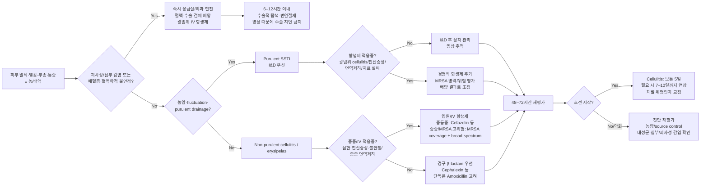

# 피부 및 연조직 감염 Skin and Soft-Tissue Infection (SSTI)


## <mark style="color:green;">일반 사항</mark>

* 농가진 (Impetigo) : 세균성 다발성 표재성 화농성 병변 (☞ p.903)
* 모낭염 (Folliculitis) : 모낭의 표재성 화농성 염증. 표피에 국한된 고름 형성 (☞ p.907)
* 종기 (Furuncle) : 모낭의 심재성 화농성 염증. 피하조직까지 침범하는 작은 농양 형성 (☞ p.915)
* 큰 종기 (Carbuncle) : 여러 모낭에서 기원한 감염이 합쳐져 피하조직까지 침범한 상태. 여러 모낭구에서 고름이 배출될 수 있음
* 얕은연조직염 (Erysipelas, 단독) : 진피 상층부와 표재성 림프관을 침범하며 비교적 경계가 명확한 감염 (☞ p.910)
* 연조직염 (Cellulitis) : 진피층을 넘어 피하조직까지 침범하며 대개 경계가 불명확한 감염 (☞ p.912)
* 피부농양 (Cutaneous abscess) : 진피 또는 피하조직에 고름이 국소적으로 저류된 상태
* 괴사성 근막염 (Necrotizing fasciitis) : 근막을 침범하는 빠르게 진행하는 괴사성 연조직 감염으로, 조기 수술적 처치가 예후를 좌우하는 응급질환


**핵심 구분 (IDSA 2014 SSTI 가이드라인 기준)**

* **화농성 SSTI** : 피부농양, 종기, 큰 종기 등 → **source control(절개·배농)이 치료의 핵심**
* **비화농성 SSTI** : 단독, 연조직염 → **β-hemolytic streptococci 중심의 항생제 치료**
* **괴사성 감염 의심** : 단순한 “중증 cellulitis”로 취급하지 말고 **즉시 응급 수술 평가**


### <mark style="color:orange;">중증도 평가</mark>

#### <mark style="color:$primary;">화농성 SSTI</mark>

* **경증** : 국소 농양/종기이며 혈역학적으로 안정; 적절한 절개·배농이 가능한 상태
* **중등증** : 발열·오한·근육통·전신 무기력 등 전신 감염 증상이 동반되거나, 배농 후에도 상당한 범위의 연조직염이 남아 있는 상태
* **중증** : 혈역학적 불안정, 심한 전신독성, 빠른 진행, 외래 치료 실패, 중등도–중증 면역저하, 심부/괴사성 감염 의심 등

#### <mark style="color:$primary;">비화농성 SSTI</mark>

* **경증** : 전형적인 cellulitis/erysipelas이며 전신 증상 없음
* **중등증** : 전형적인 cellulitis/erysipelas에 발열 등 전신 증상 동반
* **중증** : 혈역학적 불안정, 심한 전신독성, 빠른 진행, 경구 항생제 실패, 중등도–중증 면역저하, 괴사성 감염 또는 심부 감염 의심

## <mark style="color:green;">원인</mark>

### <mark style="color:orange;">원인균</mark>

<table><thead><tr><th>임상형</th><th>주요 원인균</th><th>임상적 단서</th></tr></thead><tbody><tr><td>화농성 피부농양/종기/큰 종기</td><td><em>Staphylococcus aureus</em> (MSSA/MRSA)</td><td>농, fluctuation, purulent drainage</td></tr><tr><td>단독(Erysipelas)</td><td>주로 β-hemolytic streptococci</td><td>경계가 비교적 명확하고 융기된 홍반</td></tr><tr><td>연조직염(Cellulitis)</td><td>β-hemolytic streptococci, 일부 <em>S. aureus</em></td><td>경계가 불명확한 홍반·열감·종창·압통</td></tr><tr><td>당뇨병성 족부 감염</td><td>감염 중증도·만성도·선행 항생제 노출 등에 따라 원인균이 다양</td><td>일반 cellulitis와 별도로 평가하며 당뇨병성 족부궤양/감염 chapter 참조</td></tr><tr><td>괴사성 근막염</td><td>Polymicrobial 또는 <em>S. pyogenes</em>, <em>S. aureus</em>, <em>Clostridium</em> spp. 등</td><td>피부 소견에 비해 극심한 통증, 빠른 진행, 전신독성</td></tr><tr><td>따뜻한 해수/기수 노출, 해산물 섭취 + 간경화/만성 음주</td><td><em>Vibrio vulnificus</em></td><td>수포·출혈성 병변, 빠른 진행 시 응급질환으로 접근</td></tr><tr><td>담수 노출 창상 또는 민물회 관련</td><td><em>Aeromonas hydrophila</em></td><td>빠른 진행 또는 괴사성 감염 가능</td></tr><tr><td>동물/사람 교상</td><td>구강 flora를 포함한 polymicrobial infection</td><td>일반적인 cellulitis와 별도 항생제 선택 필요; 파상풍 예방접종력 확인</td></tr></tbody></table>

_✽당뇨병성 족부 감염은 원인균 구성·항생제 선택·창상 관리가 일반 cellulitis와 다르므로, 궤양이 동반된 당뇨병 환자에서는 **IWGDF/IDSA 감염 중증도 분류** 등 별도 프로토콜로 접근하는 것을 권장_

### <mark style="color:orange;">위험 인자</mark>

* 피부 장벽 파괴
  * 외상, 긁음, 면도, 벌레 물림
  * 피부 스침/마찰
  * 옴, 습진, 아토피피부염 등 가려움 유발 질환
  * 무좀(tinea pedis), interdigital fissure/maceration
* 부종, 림프부종, 만성 정맥부전
* 비만
* 당뇨병
* 면역저하, 항암화학요법, 호중구감소증, 장기 스테로이드 사용
* 심부전, 간부전 등 중증 기저질환
* 피부 감염의 과거력 및 재발성 SSTI

#### <mark style="color:$primary;">MRSA 위험인자</mark>

**역학적 MRSA 감염/집락 위험**
* 과거 MRSA 감염 또는 집락
* 최근 의료기관 노출 또는 반복적 항생제 사용
* 장기요양시설 거주
* 밀집 생활, 접촉 스포츠
* 면도기·수건·스포츠 장비 등의 공동 사용

**현재 cellulitis에서 MRSA coverage를 직접 고려할 임상 단서**
* 관통상(penetrating trauma)
* 다른 부위의 동시 MRSA 감염
* MRSA 비강 집락 또는 과거 MRSA 감염
* 정맥주사 약물사용(injection drug use)
* 화농성 삼출물
* SIRS/중증 전신 감염


**MRSA 위험인자 ≠ 모든 cellulitis에서 MRSA 항생제 필요**

전형적인 **비화농성 cellulitis는 streptococci를 우선 표적**으로 한다. 국내 지역사회 획득 비화농성 cellulitis에서 MRSA 비중은 미국보다 낮게 보고되는 경향이 있어(지역·기관별 편차 있음), routine MRSA coverage보다 **위험인자 기반 선택적 접근**이 합리적이다.\
MRSA-active therapy는 위 급성기 임상 단서, 중증 감염, 1차 치료 실패 등이 있을 때 선택적으로 고려한다.


### <mark style="color:$danger;">🚩 Red Flags!</mark>


**Tier 1 — 즉시 응급실/외과 평가**

* 피부 소견에 비해 **극심한 통증(pain out of proportion)**
* 수시간 단위의 빠른 진행 또는 전신독성과 함께 급격한 악화
* 긴장성 부종(tense edema), 수포/출혈성 수포
* 반상출혈, 피부 괴사
* crepitus
* 국소 피부 감각 저하
* 저혈압, 의식 변화, 장기기능장애 등 혈역학적 불안정
* 간경화/만성 음주 환자에서 해수·기수 노출 또는 해산물 섭취 후 빠르게 진행하는 수포성/괴사성 감염 — <em>V. vulnificus</em> 의심

→ **괴사성 근막염이 의심되면 영상검사 결과를 기다리느라 수술을 지연하지 않는다.**\
→ 응급 외과 평가, 혈액/수술 검체 배양, 광범위 정주 항생제 및 신속한 수술적 탐색·변연절제를 시행한다.



**Tier 2 — 당일 평가/입원 또는 전문진료 고려**

* 전신 증상이 심하거나 고열이 지속
* 중등도–중증 면역저하, 항암화학요법, 호중구감소증
* 간부전·심부전·심한 림프부종 등 중증 진행 위험이 높은 환자
* 외래 경구 항생제 및 적절한 source control에도 악화/치료 실패
* 얼굴/안와 주위, 손, 회음부 등 기능적·해부학적으로 중요한 부위의 중증 감염
* 깊은 농양, 화농성 근육염, 골·관절 침범 의심



**Tier 3 — 외래 추적 강화/재평가**

* 치료 후 48–72시간 내 임상적 호전이 시작되지 않음
* 반복성 cellulitis 또는 반복성 abscess
* 조절되지 않는 edema/lymphedema, venous insufficiency, obesity, eczema, tinea pedis 등 재발 요인


## <mark style="color:green;">진단</mark>

### <mark style="color:orange;">임상 진단</mark>

* 피부의 발적, 열감, 부종, 압통의 범위와 진행 속도를 평가
* 농양이 의심되면 fluctuation, spontaneous drainage를 확인
* 임상적으로 농양과 cellulitis 감별이 애매한 경우 **point-of-care ultrasound(POCUS)**가 fluctuation 촉진보다 민감하게 고름 저류를 확인하는 데 도움이 될 수 있음 (가용한 경우)
* 하지 cellulitis에서는 발가락 사이의 tinea pedis, fissure, maceration을 확인
* 초기 발적 경계를 피부에 표시하거나 사진으로 기록하면 치료 반응 추적에 도움이 됨
* 피부 소견에 비해 통증이 심하거나 빠르게 악화하면 괴사성 근막염/화농성 근육염 등 심부 감염을 우선 배제
  * LRINEC score 등 보조 지표가 제안되어 있으나 민감도가 충분하지 않아 **점수가 낮다는 이유로 임상적 의심을 낮추거나 수술을 지연해서는 안 됨**

### <mark style="color:orange;">감별 진단 (Cellulitis mimics)</mark>

* stasis dermatitis
* contact dermatitis
* deep vein thrombosis
* superficial thrombophlebitis
* gout/pseudogout
* insect-bite inflammatory reaction
* lymphedema
* drug eruption


**양측 하지에 대칭적인 홍반**은 전형적인 세균성 cellulitis보다 stasis dermatitis, edema 등 비감염성 원인을 먼저 고려한다.


### <mark style="color:orange;">배양검사</mark>

* **전형적인 단순 비화농성 cellulitis/erysipelas** : routine blood/skin culture는 필요하지 않음
* **화농성 SSTI** : 절개·배농 검체에서 Gram stain 및 배양을 시행할 수 있으나, 전형적인 경증 병변은 검사 없이 치료 가능
* 다음 상황에서는 혈액, 흡인액, 배농 검체 또는 조직 배양을 적극 고려
  * 중등도–중증 면역저하
  * 항암화학요법 또는 호중구감소증
  * 혈역학적 불안정/중증 전신 감염
  * 괴사성 근막염 의심
  * 물에 잠긴 창상(해수/담수 포함)
  * 동물 교상
  * 반복성 또는 치료 실패 감염

***



<p align="center"><strong>SSTI 일차진료 통합 알고리듬</strong></p>

<p align="center"><em><mark style="color:$info;">Ref. Stevens DL, et al. IDSA Practice Guidelines for SSTI, 2014; 질병관리청 2026 피부·연조직 감염 항생제 적정사용 실무지침</mark></em></p>


**알고리듬의 핵심 순서**\
① 괴사성 감염인가? → ② 고름이 있는가? → ③ 외래 경구치료가 가능한가?\
이 순서가 단순한 “mild–moderate–severe” 분류보다 일차진료 의사결정에 직접적이다.


***

## <mark style="background-color:$warning;">Management</mark>

### <mark style="color:orange;">치료 원칙</mark>

1. **괴사성/심부 감염을 먼저 배제**
2. **화농성 여부 확인**
3. 화농성 SSTI이면 **source control(I\&D)** 우선
4. 비화농성 cellulitis/erysipelas이면 **streptococci를 우선 표적**으로 경험적 항생제 선택
5. 전신 상태, 면역상태, 노출력, MRSA 과거력에 따라 치료 범위 조정
6. 안정적이고 경구 섭취가 가능하면 경구 항생제를 우선하고, 정주 치료 중 호전 시 가능한 조기에 경구로 전환

### <mark style="color:orange;">화농성 SSTI</mark>

* 피부농양, 종기, 큰 종기에서는 **절개·배농(I\&D)이 기본 치료**
* 위험요인이 없는 단순 병변에서 충분히 배농되었다면 **routine 항생제가 반드시 필요한 것은 아니며**, 환자 위험도와 병변 범위에 따라 선택
* 작은 종기처럼 즉시 배농하기 어려운 경우 온찜질이 자발적 배농에 도움이 될 수 있음
* **단순·작은 피부농양에서는 routine packing을 권하지 않으며**, 큰 cavity·지속 출혈·특수 해부학적 위치 등에서는 선택적으로 고려
* 다음은 I\&D 후 항생제 병용을 고려
  * 배농 후에도 광범위한 cellulitis 잔존
  * 발열, 오한, 근육통, 심한 전신 무기력 등 전신 감염 증상
  * 면역저하
  * 혈역학적 불안정 또는 빠른 진행
  * 반복성 감염/치료 실패
* 1차 항생제에 반응이 없을 때는 항생제 escalation 전에 **배농 부족 또는 추가 source control 필요성**을 먼저 재평가

### <mark style="color:orange;">비화농성 cellulitis/erysipelas</mark>

* 경증 cellulitis는 β-hemolytic streptococci와 MSSA를 표적으로 경구 β-lactam을 우선 고려
* 단독(erysipelas)은 streptococci가 주 원인이므로 amoxicillin 등 좁은 범위 항생제로 치료 가능
* 최근 MRSA 감염/집락력이 있는 경우 또는 임상적으로 MRSA 위험이 높은 경우 MRSA-active therapy를 고려
* 전신 상태가 불량하거나 중증 진행 위험이 높은 경우 정주 항생제를 우선하고 입원 치료를 고려
* **비복잡성 cellulitis/erysipelas**에서 임상적으로 호전되고 추가 외과적 처치가 필요하지 않은 경우 **5일 치료를 기본**으로 하며, 호전이 더딘 경우 **7–10일까지 연장**할 수 있음
* 치료 시작 후 5–7일에도 발적이 완전히 소실되지 않을 수 있으므로 육안 소견만으로 치료 실패로 판단하지 않음
* **심부 감염, 균혈증, 중증 면역저하, 불완전한 source control** 등이 동반되면 더 긴 치료가 필요할 수 있으며 감염 부위와 임상 반응에 따라 기간을 개별화

### <mark style="color:orange;">치료 반응 평가</mark>

* 병변의 진행이 중단되는지 확인
* 발적, 종창, 압통, 통증이 호전되는지 확인
* 전신 증상과 활력징후가 안정되는지 확인
* 48–72시간 내 호전이 시작되지 않거나 악화되면 다음을 재평가
  * 진단 오류 또는 cellulitis mimic
  * 배농되지 않은 농양
  * 추가 source control 필요
  * 내성균 또는 부적절한 항생제
  * 괴사성 근막염/화농성 근육염/골수염 등 심부 감염


**전신 corticosteroid는 routine treatment가 아니다.** 선택된 비당뇨 성인에서 염증·통증 감소를 위해 보조적으로 고려할 수 있으나, **괴사성 감염을 충분히 배제한 경우에 한한다.** IDSA 2014의 권고 강도는 **weak**이므로 routine 사용으로 해석하지 않는다.


## <mark style="color:green;">비-약물 치료 및 예방</mark>

### <mark style="color:orange;">일반적인 재발 위험인자 교정</mark>

* 손 위생, 상처 관리, 피부 청결 유지
* 수건, 면도기, 개인위생용품 공동 사용을 피함
* 면도나 접촉 스포츠 등 반복적인 피부 손상 최소화
* 보습제를 사용하여 피부 장벽 유지 (☞ p.867)
* 습진/아토피피부염 및 가려움 조절
* 하지 cellulitis에서는 **tinea pedis와 발가락 사이 fissure/maceration을 적극 치료**
* edema/lymphedema, venous insufficiency, obesity 등 재발 요인 교정
* 만성 부종/림프부종은 **급성 감염기가 가라앉은 뒤** 적절한 압박요법(예: 압박 스타킹), 피부 관리, 필요 시 림프부종 전문치료/물리치료를 고려

### <mark style="color:orange;">반복성 S. aureus SSTI의 선택적 decolonization</mark>

* 모든 SSTI 환자에서 routine하게 시행하지 않음
* 반복성 <em>S. aureus</em> 감염에서 개인위생·상처관리·환경 관리에도 재발하면 선택적으로 고려
  * intranasal mupirocin bid × 5일
  * chlorhexidine body wash를 함께 고려
  * 수건, 침구, 의류 및 자주 접촉하는 개인 물품 세척
* bleach bath는 일부 반복성 감염에서 선택적으로 고려할 수 있으나 근거가 제한적이며, 자극성 피부염·농도 오류에 주의
* **decolonization 목적으로 장기간 경구 clindamycin을 routine하게 사용하지 않음**
* 무증상 가족 구성원에 대한 routine nasal culture도 일반적으로 필요하지 않으며, 반복적 household transmission이 의심될 때 개별적으로 판단

## <mark style="color:green;">시술 및 기타 처치</mark>

### <mark style="color:orange;">절개·배농(I\&D)</mark>

* 국소마취 후 최저점(most fluctuant point) 또는 가장 얇은 피부를 통해 절개
* loculation이 의심되면 blunt dissection으로 격막을 파괴하여 완전 배농
* **단순·작은 농양에서는 routine packing을 권하지 않음**; 큰 cavity·지속 출혈·특수 해부학적 위치 등에서 선택적으로 고려하며 packing은 통증을 증가시킬 수 있음
* 48–72시간 내 재평가하여 잔존 저류·봉와직염 진행 여부 확인
* 반복성이거나 크기가 크고 접근이 어려운 농양(회음부, 유방, 안면 등)은 외과 의뢰 고려

### <mark style="color:orange;">괴사성 근막염 — 수술적 처치</mark>

* **즉시 응급 외과 협진 및 source control**
* 괴사성 근막염이 의심되면 영상검사는 보조적으로 사용하며, 임상적으로 강하게 의심되는 경우 수술을 지연해서는 안 됨
* 가능한 한 신속히, **입원 후 6–12시간 이내 수술적 탐색 및 변연절제**를 목표로 함
* 첫 수술 후 **12–24시간 이내 재수술을 통한 병변 재평가**를 고려 (경험적 항생제는 ☞ 항생제 문단 참조)

## <mark style="color:green;">약물 치료 (항생제)</mark>


아래 성인 용량은 **정상 신기능을 기준**으로 한 지침상 대표 용량이다. 실제 처방에서는 신기능·간기능, 알레르기, 임신 여부, 상호작용, **국내 허가사항·제형 및 지역 antibiogram/내성률**을 확인하여 조정한다. (질병관리청 2026 피부·연조직 감염 항생제 적정사용 실무지침; IDSA 2014 SSTI 가이드라인 참고)


### <mark style="color:orange;">비화농성 연조직염의 경험적 항생제</mark>

<table><thead><tr><th>상황</th><th>경구</th><th>정주/입원</th><th>비고</th></tr></thead><tbody><tr><td>경증 cellulitis</td><td>Cephalexin 500 ㎎ qid<br>또는 Cephradine 500 ㎎ qid<br>또는 Cefadroxil 1,000 ㎎ bid<br>또는 Amoxicillin-clavulanate 500/125 ㎎ tid</td><td>-</td><td>streptococci ± MSSA 표적</td></tr><tr><td>β-lactam 사용이 어려운 경우</td><td>Clindamycin 450 ㎎ qid</td><td>Clindamycin 600–900 ㎎ q8h IV</td><td><em>C. difficile</em> 관련 장염 등 주의; 배양에서 erythromycin-resistant/clindamycin-susceptible <em>S. aureus</em>가 확인되면 inducible clindamycin resistance(D-test) 여부 확인</td></tr><tr><td>중등증 또는 경구치료가 부적절</td><td>-</td><td>Cefazolin 2 g q8h IV<br>또는 Ampicillin-sulbactam 3 g q6h IV<br>또는 Nafcillin 2 g q4h IV</td><td>호전 시 조기 경구 전환 고려</td></tr><tr><td>중증 또는 중증 면역저하</td><td>-</td><td>Vancomycin 등 MRSA-active agent + 필요 시 Piperacillin-tazobactam 또는 carbapenem 등 broad-spectrum coverage</td><td>패혈증/괴사성 감염 가능성과 특수 노출을 함께 평가</td></tr><tr><td>최근 MRSA 감염/집락 등 MRSA 고위험</td><td>감염 부위·중증도 및 감수성에 따라 선택</td><td>Vancomycin 15 ㎎/kg q12h IV로 시작 후 TDM(AUC 기반)으로 조절<br>또는 Teicoplanin/Linezolid 등</td><td>routine cellulitis에 일률적으로 MRSA coverage를 추가하지 않음</td></tr></tbody></table>

### <mark style="color:orange;">단독(Erysipelas)</mark>

* **Amoxicillin 500 ㎎ tid PO**
* 중증 또는 경구 치료가 어려운 경우: **Penicillin G IV 또는 Ampicillin IV**
* 임상 경과가 순조로우면 **5일 치료**, 반응이 불충분하면 7–10일까지 연장 고려

### <mark style="color:orange;">화농성 SSTI에서 항생제가 필요한 경우</mark>

* 충분한 절개·배농 후에도 광범위 cellulitis가 남거나 전신 증상/면역저하가 있으면 항생제를 병용
* **국내 2026 KDCA 기준**에서는 항생제가 필요한 화농성 SSTI에서 **1세대 cephalosporin, amoxicillin-clavulanate 또는 clindamycin** 등 MSSA-active therapy를 우선 고려할 수 있음
* 과거 MRSA 감염/집락 또는 1차 치료 실패에서는 MRSA-active therapy를 고려
* 배양 결과가 확인되면 가능한 좁은 범위로 de-escalation
* 항생제 병용 시 기간은 대개 **5–10일**을 기준으로 임상 반응에 따라 조정

### <mark style="color:orange;">배양 결과에 따른 주요 경구 선택지</mark>

<table><thead><tr><th>원인균</th><th>주요 경구 선택지</th></tr></thead><tbody><tr><td>β-hemolytic streptococci</td><td>Amoxicillin 500 ㎎ tid; Cephalexin 500 ㎎ qid; Cefadroxil 1,000 ㎎ bid; Clindamycin 450 ㎎ qid</td></tr><tr><td>MSSA</td><td>Cephalexin 500 ㎎ qid; Cefadroxil 1,000 ㎎ bid; Clindamycin 450 ㎎ qid; 감수성에 따라 doxycycline 또는 TMP/SMX</td></tr><tr><td>MRSA</td><td>Linezolid 600 ㎎ bid; Clindamycin 450 ㎎ qid; Doxycycline 100 ㎎ bid; TMP/SMX 320/1,600 ㎎ bid(TMP/SMX 성분량 기준; 감수성·신기능에 따라 조정)</td></tr></tbody></table>


**Doxycycline 또는 TMP/SMX를 순수 비화농성 cellulitis의 단독 경험적 치료로 일률적으로 선택하지 않는다.** Streptococcal coverage가 필요한 임상상인지 확인한다. 농양 주변에 **광범위한 비화농성 cellulitis**가 동반되어 streptococcal coverage도 필요한 경우에는 **Cephalexin/Amoxicillin + TMP/SMX 또는 Doxycycline** 병합을 고려할 수 있다.

**TMP/SMX 용량은 TMP/SMX 성분량 기준으로 확인한다.** 제품별 1정 함량이 다를 수 있으므로 처방 시 반드시 실제 제형의 함량을 대조한다.


### <mark style="color:orange;">괴사성 근막염 — 경험적 항생제</mark>

* 경험적 항생제는 MRSA, streptococci, gram-negative bacilli 및 anaerobes를 포함하는 광범위 정주요법
  * **Vancomycin 또는 teicoplanin + Piperacillin-tazobactam 또는 carbapenem + Clindamycin**
  * 또는 **Linezolid + Piperacillin-tazobactam 또는 carbapenem**
  * Linezolid는 독소 억제 효과가 있어 사용하는 경우 **clindamycin을 통상 추가하지 않음**
* 배양 결과에 따라 즉시 de-escalation
* <em>S. pyogenes</em> 확인/강력 의심: **Penicillin G + Clindamycin** — clindamycin은 단백질 합성 억제를 통해 **streptococcal exotoxin 생성 억제(antitoxin effect)**를 기대하여 병용
* <em>Clostridium</em> spp.: **Penicillin + Clindamycin**
* 항생제는 **추가적 변연절제술이 더 이상 필요하지 않고 임상적으로 안정될 때까지** 투여하며, **마지막 괴사조직 제거 수술 후 약 48시간까지 사용을 고려**할 수 있음. Clindamycin은 임상적으로 안정된 뒤 48–72시간 이내 중단을 고려

#### <mark style="color:$primary;">특수 노출</mark>

* **Vibrio vulnificus 의심**
  * 간경화 또는 만성 음주 + 최근 해산물 섭취/따뜻한 연안 해수·기수 노출
  * 3세대 cephalosporin(ceftriaxone/cefotaxime/ceftazidime) + doxycycline
  * 경구 투여가 어려운 경우 ciprofloxacin IV를 대안으로 고려
* **Aeromonas hydrophila 의심**
  * 담수 노출 또는 수산물 관련 노출
  * ceftriaxone/cefotaxime 또는 ciprofloxacin + doxycycline을 고려

***

### <mark style="color:red;">질병코드 (KCD)</mark>

L01.0 농가진

L02 피부농양, 종기 및 큰 종기

L03 연조직염 및 급성 림프관염

A46 단독(Erysipelas)

M72.6 괴사성 근막염

***

## <mark style="color:purple;">처방례</mark>

> **처방례 1. 단순 피부농양 — 절개·배농만으로 충분한 경우**
>
> ```
> 절개·배농(I&D) 시행
> ※ 위험요인 없고 배농 후 광범위 cellulitis가 남지 않으면 **routine 항생제 없이 경과관찰 가능**
> ※ 48~72시간 후 재평가; 상처 관찰 및 청결 유지 교육
> ```
>
> _✽건강한 성인의 단순 농양은 충분한 배농만으로도 치료 성공률이 높으나, 최근 근거에서는 일부 환자에서 보조 항생제가 추가 이득을 줄 수 있으므로 **routine 병용이 반드시 필요한 것은 아니되 개별적으로 판단**_

> **처방례 2. 경증 비화농성 Cellulitis**
>
> ```
> 케파신 500 ㎎/Cap 1Cap qid × 5일
>   → 호전 더디면 7~10일까지 연장
> 또는 오구멘틴 500/125 ㎎/T 1T tid × 5일
> ```
>
> _✽streptococci ± MSSA를 표적으로 하는 경구 β-lactam이 1차 선택; 발적 경계는 5~7일째에도 완전히 없어지지 않을 수 있음을 사전 설명_

> **처방례 3. 단독(Erysipelas)**
>
> ```
> Amoxicillin 500 ㎎/T 1T tid × 5일
> ```
>
> _✽streptococci가 주 원인이므로 좁은 범위 항생제로 충분; 중증이거나 경구 곤란 시 penicillin G/ampicillin IV로 전환_

> **처방례 4. 화농성 SSTI + MRSA 위험 동반 (I\&D 후 항생제 병용)**
>
> ```
> 절개·배농(I&D) 시행 후
> TMP/SMX 320/1,600 ㎎ bid × 5~7일 (TMP/SMX 성분량 기준; 실제 제품의 1정 함량 확인)
>   또는 바이브라마이신(doxycycline) 100 ㎎/Cap 1Cap bid × 5~7일
> ```
>
> _✽과거 MRSA 감염/집락력, 화농성 삼출물, 1차 치료 실패 등 위험인자가 있을 때 선택; 신기능·임신 여부 확인(TMP/SMX), 광과민 반응 주의(doxycycline)_

> **처방례 5. 괴사성 근막염 의심 — 응급 경험적 병합요법**
>
> ```
> [응급 외과 협진 + 즉시 전원/입원]
> Vancomycin 15 mg/kg q12h IV로 시작 후 TDM(AUC 기반)으로 조절
> + Piperacillin-tazobactam 4.5 g q6-8h IV (또는 carbapenem)
> + Clindamycin 900 mg q8h IV
> ※ Linezolid를 선택한 경우에는 piperacillin-tazobactam/carbapenem과 병합하고 clindamycin은 통상 추가하지 않음
> ※ 영상검사 대기로 수술 지연 금지; 배양 결과에 따라 즉시 de-escalation
> ```
>
> _✽1차 진료에서는 처방 자체보다 **즉시 응급 이송·외과 협진**이 핵심이며, 위 처방은 전원 전 초기 대응 참고용_

***

### <mark style="color:$success;">핵심 복약 지도</mark>

> **항생제 복용 안내**
>
> * 처방된 항생제는 **정해진 용량과 기간을 지키고, 임의로 중단하거나 남은 항생제를 추가·연장 복용하지 않습니다.**
> * 치료 시작 후 홍반이 바로 없어지지 않을 수 있으며, 보통 **48–72시간 내 진행이 멈추고 통증·열감·종창이 호전되는지** 확인합니다.
> * clindamycin 복용 중 심한 설사가 생기면 즉시 알리도록 안내합니다(<em>C. difficile</em> 장염 가능성).
> * Doxycycline 복용 시 광과민 반응에 주의하도록 안내합니다.
> * TMP/SMX 복용 중 새로 생긴 심한 발진·점막 병변이 있으면 즉시 진료받도록 하고, 고칼륨혈증·신기능 악화 위험(특히 ACEi/ARB 등 병용 시)을 확인합니다.

> **절개·배농(I\&D) 후 관리**
>
> * 농양은 항생제만으로 해결되지 않을 수 있으며 **절개·배농이 핵심 치료**가 될 수 있습니다.
> * 배농 후 상처는 청결하게 유지하고, packing이 있는 경우 지시된 일정에 맞춰 교체·제거합니다.
> * 배농 후에도 열감·발적 범위가 넓어지면 재진이 필요합니다.

> **언제 다시 병원을 방문해야 하나요?**
>
> * 통증이 갑자기 심해지거나, 수포/피부색 변화/괴사, 어지럼·의식저하, 빠른 병변 확장이 생기면 즉시 응급평가
> * 처방 후 48–72시간이 지나도 호전이 시작되지 않거나 더 빠르게 퍼지면 재진
> * 반복적으로 피부농양·연조직염이 재발하면 재발 위험인자(당뇨, 림프부종, tinea pedis 등) 평가를 위해 내원

### <mark style="color:blue;">환자 안내서</mark>


**피부 감염, 빠른 진행 여부를 지켜보는 것이 중요합니다**

피부가 붉게 붓고 아픈 것은 대부분 세균 감염 때문이며, 적절한 항생제 치료와(필요 시) 절개·배농으로 좋아집니다. 다만 드물게 매우 빠르게 진행하는 위험한 감염도 있으므로, 통증이 피부 모양에 비해 지나치게 심하거나 빠르게 퍼지면 즉시 병원을 찾아야 합니다.


#### <mark style="color:$primary;">왜 피부가 붉게 붓고 아픈가요?</mark>

* 작은 상처, 무좀, 벌레 물린 자리 등을 통해 세균이 피부 속으로 들어가 감염을 일으킵니다.
* 당뇨병, 부종·림프부종, 비만, 면역저하 상태에서는 감염이 더 잘 생기고 재발하기 쉽습니다.

#### <mark style="color:$primary;">일상생활에서 어떻게 관리하나요?</mark>

* **붉게 부은 부위를 깨끗하게 유지하고, 가능하면 해당 부위를 올려** 부종을 줄입니다.
* **붉은 부위의 가장자리를 표시하거나 사진을 남기면** 퍼지는지 확인하는 데 도움이 됩니다.
* **농양을 집에서 바늘로 찌르거나 억지로 짜지 않습니다.**
* 수건, 면도기, 운동 장비 등 피부에 직접 닿는 물품은 다른 사람과 함께 사용하지 않습니다.
* 무좀이 있으면 함께 치료해야 다리 연조직염이 재발하지 않습니다.

#### <mark style="color:$primary;">항생제는 어떻게 복용하나요?</mark>

* 처방된 용량과 기간(보통 5일, 필요 시 7~10일)을 지켜 복용합니다.
* 임의로 중단하거나 남은 항생제를 추가로 복용·연장하지 않습니다.
* 남은 항생제를 보관했다가 다음 감염 때 임의로 재사용하지 않습니다.

#### <mark style="color:$primary;">이럴 때는 즉시 병원을 방문하세요</mark>

* 피부색이 검거나 보라색으로 변하고 물집이 생기거나, 통증이 피부 모양에 비해 지나치게 심한 경우
* 처방 후 2–3일이 지나도 호전이 시작되지 않거나 더 빠르게 퍼지는 경우
* 고열, 오한, 어지럼, 의식이 흐려지는 증상이 동반되는 경우 — 즉시 응급실

***


<!-- 편집 점검: (☞ p.903), (☞ p.907), (☞ p.910), (☞ p.912), (☞ p.915), (☞ p.867) 등 페이지 참조 번호는 최종 합본/출판 단계에서 실제 페이지·하이퍼링크와 대조할 것. -->
