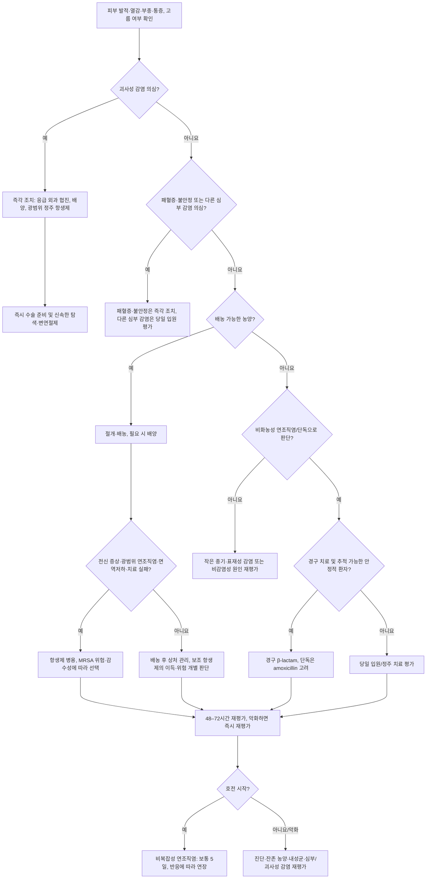

# 피부 및 연조직 감염 Skin and Soft-Tissue Infection

## <mark style="color:green;">일반 사항</mark>

* 본 장의 항생제 용량은 **성인 세균성 SSTI**를 대상으로 함. 국내 2026 실무지침의 적용 대상은 19세 이상이며 병원급 이상 의료기관의 항생제 사용을 중심으로 함. 농가진·모낭염은 해당 장을, 교상·수술부위 감염·당뇨병성 족부 감염은 별도 치료 원칙을 함께 참조함. 소아에게 성인 용량을 그대로 적용하지 않음

* 농가진 (Impetigo) : 세균성 다발성 표재성 화농성 병변 (☞ p.903)
* 모낭염 (Folliculitis) : 모낭의 표재성 염증으로, 세균성인 경우 모낭 중심의 농포를 형성함; 진균성·비감염성 원인도 있음 (☞ p.907)
* 종기 (Furuncle) : 모낭의 심재성 화농성 염증. 피하조직까지 침범하는 작은 농양 형성 (☞ p.915)
* 큰 종기 (Carbuncle) : 여러 모낭에서 기원한 감염이 합쳐져 피하조직까지 침범한 상태. 여러 모낭구에서 고름이 배출될 수 있음
* 얕은연조직염 (Erysipelas, 단독) : 진피 상층부와 표재성 림프관을 침범하며 비교적 경계가 명확한 감염 (☞ p.910)
* 연조직염 (Cellulitis) : 진피층을 넘어 피하조직까지 침범하며 대개 경계가 불명확한 감염 (☞ p.912)
* 피부농양 (Cutaneous abscess) : 진피 또는 피하조직에 고름이 국소적으로 저류된 상태
* 괴사성 근막염 (Necrotizing fasciitis) : 근막을 침범하는 빠르게 진행하는 괴사성 연조직 감염으로, 조기 수술적 처치가 예후를 좌우하는 응급질환


**핵심 구분 (질병관리청 2026 실무지침; IDSA 2014)**

* **화농성 SSTI** : 피부농양, 종기, 큰 종기 등 → **source control(절개·배농)이 치료의 핵심**
* **비화농성 SSTI** : 단독, 농양이 동반되지 않은 연조직염 → **β-hemolytic streptococci 중심의 항생제 치료**
* **괴사성 감염 의심** : 단순한 “중증 cellulitis”로 취급하지 말고 **즉시 응급 수술 평가**


### <mark style="color:orange;">중증도 평가</mark>

#### <mark style="color:$primary;">화농성 SSTI</mark>

* **경증** : 국소 농양/종기이며 혈역학적으로 안정; 적절한 절개·배농이 가능한 상태
* **중등증** : 발열·오한·근육통·전신 무기력 등 전신 감염 증상이 동반되거나, 배농 후에도 상당한 범위의 연조직염이 남아 있는 상태
* **중증** : 혈역학적 불안정, 심한 전신독성, 빠른 진행, 외래 치료 실패, 중등도–중증 면역저하, 심부/괴사성 감염 의심 등

#### <mark style="color:$primary;">비화농성 SSTI</mark>

* **경증** : 전형적인 cellulitis/erysipelas이며 전신 증상 없음
* **중등증** : 전형적인 cellulitis/erysipelas에 발열 등 전신 증상 동반
* **중증** : 혈역학적 불안정, 심한 전신독성, 빠른 진행, 경구 항생제 실패, 중등도–중증 면역저하, 괴사성 감염 또는 심부 감염 의심

## <mark style="color:green;">원인</mark>

### <mark style="color:orange;">원인균</mark>

| 임상형                              | 주요 원인균                                                            | 임상적 단서                                          |
| -------------------------------- | ----------------------------------------------------------------- | ----------------------------------------------- |
| 화농성 피부농양/종기/큰 종기                 | _Staphylococcus aureus_ (MSSA/MRSA)                               | 농, fluctuation, purulent drainage               |
| 단독(Erysipelas)                   | 주로 β-hemolytic streptococci                                       | 경계가 비교적 명확하고 융기된 홍반                             |
| 연조직염(Cellulitis)                 | β-hemolytic streptococci, 일부 _S. aureus_                          | 경계가 불명확한 홍반·열감·종창·압통                            |
| 당뇨병성 족부 감염                       | 감염 중증도·만성도·선행 항생제 노출 등에 따라 원인균이 다양                                | 일반 cellulitis와 별도로 평가하며 당뇨병성 족부궤양/감염 chapter 참조 |
| 괴사성 근막염                          | Polymicrobial 또는 _S. pyogenes_, _S. aureus_, _Clostridium_ spp. 등 | 피부 소견에 비해 극심한 통증, 빠른 진행, 전신독성                   |
| 따뜻한 해수/기수 노출, 해산물 섭취 + 간경화/만성 음주 | _Vibrio vulnificus_                                               | 수포·출혈성 병변, 빠른 진행 시 응급질환으로 접근                    |
| 담수 노출 창상 또는 민물회 관련               | _Aeromonas hydrophila_                                            | 빠른 진행 또는 괴사성 감염 가능                              |
| 동물/사람 교상                         | 구강 flora를 포함한 polymicrobial infection                             | 일반적인 cellulitis와 별도 항생제 선택 필요; 파상풍 예방접종력 확인     |

_✽당뇨병성 족부 감염은 원인균 구성·항생제 선택·창상 관리가 일반 cellulitis와 다르므로, 궤양이 동반된 당뇨병 환자에서는 **IWGDF/IDSA 감염 중증도 분류** 등 별도 프로토콜로 접근하는 것을 권장_

### <mark style="color:orange;">위험 인자</mark>

* 피부 장벽 파괴
  * 외상, 긁음, 면도, 벌레 물림
  * 피부 스침/마찰
  * 옴, 습진, 아토피피부염 등 가려움 유발 질환
  * 무좀(tinea pedis), interdigital fissure/maceration
* 부종, 림프부종, 만성 정맥부전
* 비만
* 당뇨병
* 면역저하, 항암화학요법, 호중구감소증, 장기 스테로이드 사용
* 심부전, 간부전 등 중증 기저질환
* 피부 감염의 과거력 및 재발성 SSTI

#### <mark style="color:$primary;">MRSA 위험인자</mark>

**역학적 MRSA 감염/집락 위험**

* 과거 MRSA 감염 또는 집락
* 최근 의료기관 노출 또는 반복적 항생제 사용
* 장기요양시설 거주
* 밀집 생활, 접촉 스포츠
* 면도기·수건·스포츠 장비 등의 공동 사용

**현재 cellulitis에서 MRSA coverage를 직접 고려할 임상 단서**

* 관통상(penetrating trauma)
* 다른 부위의 동시 MRSA 감염
* MRSA 비강 집락 또는 과거 MRSA 감염
* 정맥주사 약물사용(injection drug use)
* 화농성 삼출물
* SIRS/중증 전신 감염


**MRSA 위험인자 ≠ 모든 cellulitis에서 MRSA 항생제 필요**

전형적인 **비화농성 cellulitis는 streptococci를 우선 표적**으로 한다. 국내 자료에서는 비화농성·화농성 감염 및 배양 시행 여부에 따라 MRSA 분리율이 달라지므로, 화농성 감염이 포함된 배양 양성군의 수치를 전체 cellulitis에 적용하지 않음. 전형적인 비화농성 감염에는 **위험인자 기반 선택적 접근**이 합리적임.\
MRSA-active therapy는 위 급성기 임상 단서, 중증 감염, 1차 치료 실패 등이 있을 때 선택적으로 고려한다.


### <mark style="color:$danger;">🚩 Red Flags!</mark>


**Tier 1 - 즉각 조치**

응급실 이송 및 해당 전문과 협진을 즉시 시행함

* 피부 소견에 비해 **극심한 통증(pain out of proportion)**
* 수시간 단위의 빠른 진행 또는 전신독성과 함께 급격한 악화
* 긴장성 부종(tense edema), 수포/출혈성 수포
* 반상출혈, 피부 괴사
* crepitus
* 국소 피부 감각 저하
* 저혈압, 의식 변화, 장기기능장애 등 패혈증/혈역학적 불안정
* 호중구감소증 환자에서 발열 또는 패혈증 의심
* 안와 주위 감염에 시력 저하·안구운동 통증/제한·안구돌출 동반 - 안와연조직염 의심
* 회음부·생식기의 심한 통증과 빠른 종창/피부색 변화 - Fournier 괴저 의심
* 간경화/만성 음주 환자에서 해수·기수 노출 또는 해산물 섭취 후 빠르게 진행하는 수포성/괴사성 감염 - _V. vulnificus_ 의심

→ **괴사성 근막염이 의심되면 영상검사 결과를 기다리느라 수술을 지연하지 않는다.**\
→ **괴사성 감염 의심 시** 응급 외과 평가, 혈액/수술 검체 배양, 광범위 정주 항생제 및 신속한 수술적 탐색·변연절제를 시행함. 호중구감소성 발열과 안와 감염은 각각의 응급 치료 원칙에 따라 처치함



**Tier 2 - 당일 평가**

당일 평가 후 입원 또는 전문진료 필요성을 결정함

* 전신 증상이 심하거나 고열이 지속
* 중등도–중증 면역저하, 항암화학요법 또는 호중구감소증; 발열/패혈증 의심이 있으면 Tier 1 적용
* 간부전·심부전·심한 림프부종 등 중증 진행 위험이 높은 환자
* 외래 경구 항생제 및 적절한 source control에도 악화/치료 실패
* 얼굴/안와 주위, 손, 회음부 등 기능적·해부학적으로 중요한 부위의 중증 감염
* 깊은 농양, 화농성 근육염, 골·관절 침범 의심



**Tier 3 - 외래 추적 강화/재평가**

* 치료 후 48–72시간 내 임상적 호전이 시작되지 않으나 병변 진행·전신 상태는 안정적임; 악화하면 Tier 1 또는 Tier 2 적용
* 반복성 cellulitis 또는 반복성 abscess
* 조절되지 않는 edema/lymphedema, venous insufficiency, obesity, eczema, tinea pedis 등 재발 요인


## <mark style="color:green;">진단</mark>

### <mark style="color:orange;">임상 진단</mark>

* 피부의 발적, 열감, 부종, 압통의 범위와 진행 속도를 평가
* 농양이 의심되면 fluctuation, spontaneous drainage를 확인
* 임상적으로 농양과 cellulitis 감별이 애매한 경우 **point-of-care ultrasound(POCUS)**가 fluctuation 촉진보다 민감하게 고름 저류를 확인하는 데 도움이 될 수 있음 (가용한 경우)
* 하지 cellulitis에서는 발가락 사이의 tinea pedis, fissure, maceration을 확인
* 초기 발적 경계를 피부에 표시하거나 사진으로 기록하면 치료 반응 추적에 도움이 됨
* 피부 소견에 비해 통증이 심하거나 빠르게 악화하면 괴사성 근막염/화농성 근육염 등 심부 감염을 우선 배제
  * LRINEC score 등 보조 지표가 제안되어 있으나 민감도가 충분하지 않아 **점수가 낮다는 이유로 임상적 의심을 낮추거나 수술을 지연해서는 안 됨**

### <mark style="color:orange;">감별 진단 (Cellulitis mimics)</mark>

* stasis dermatitis
* contact dermatitis
* deep vein thrombosis
* superficial thrombophlebitis
* gout/pseudogout
* insect-bite inflammatory reaction
* lymphedema
* drug eruption


**양측 하지에 대칭적인 홍반**은 전형적인 세균성 cellulitis보다 stasis dermatitis, edema 등 비감염성 원인을 먼저 고려한다.


### <mark style="color:orange;">배양검사</mark>

* **전형적인 단순 비화농성 cellulitis/erysipelas** : routine blood/skin culture는 필요하지 않음
* **화농성 SSTI** : 농양/큰 종기의 배농 검체에서 Gram stain 및 배양을 권장하되, 전형적인 경증 병변은 검사 없이 치료 가능. 반복성 농양은 가능한 조기에 배농·배양함
* 다음 상황에서는 혈액, 흡인액, 배농 검체 또는 조직 배양을 적극 고려
  * 중등도–중증 면역저하
  * 항암화학요법 또는 호중구감소증
  * 혈역학적 불안정/중증 전신 감염
  * 괴사성 근막염 의심
  * 물에 잠긴 창상(해수/담수 포함)
  * 동물/사람 교상
  * 반복성 또는 치료 실패 감염

***


```mermaid
flowchart TD
    A["피부 발적·열감·부종·통증, 고름 여부 확인"] ---> B{"괴사성 감염 의심?"}
    B -- "예" ---> C["즉각 조치: 응급 외과 협진, 배양, 광범위 정주 항생제"]
    C ---> D["즉시 수술 준비 및 신속한 탐색·변연절제"]
    B -- "아니요" ---> E{"패혈증·불안정 또는 다른 심부 감염 의심?"}
    E -- "예" ---> F["패혈증·불안정은 즉각 조치, 다른 심부 감염은 당일 입원 평가"]
    E -- "아니요" ---> G{"배농 가능한 농양?"}
    G -- "예" ---> H["절개·배농, 필요 시 배양"]
    H ---> I{"전신 증상·광범위 연조직염·면역저하·치료 실패?"}
    I -- "예" ---> J["항생제 병용, MRSA 위험·감수성에 따라 선택"]
    I -- "아니요" ---> K["배농 후 상처 관리, 보조 항생제의 이득·위험 개별 판단"]
    G -- "아니요" ---> L{"비화농성 연조직염/단독으로 판단?"}
    L -- "아니요" ---> M["작은 종기·표재성 감염 또는 비감염성 원인 재평가"]
    L -- "예" ---> N{"경구 치료 및 추적 가능한 안정적 환자?"}
    N -- "예" ---> O["경구 β-lactam, 단독은 amoxicillin 고려"]
    N -- "아니요" ---> P["당일 입원/정주 치료 평가"]
    J ---> Q["48–72시간 재평가, 악화하면 즉시 재평가"]
    K ---> Q
    O ---> Q
    P ---> Q
    Q ---> R{"호전 시작?"}
    R -- "예" ---> S["비복잡성 연조직염: 보통 5일, 반응에 따라 연장"]
    R -- "아니요/악화" ---> T["진단·잔존 농양·내성균·심부/괴사성 감염 재평가"]
```

<p align="center"><strong>SSTI 일차진료 통합 알고리듬</strong></p>

<p align="center"><em><mark style="color:$info;">Ref. Stevens DL, et al. IDSA Practice Guidelines for SSTI, 2014; 질병관리청 2026 피부·연조직 감염 항생제 적정사용을 위한 실무지침</mark></em></p>


**알고리듬의 핵심 순서**\
① 괴사성 감염 또는 패혈증/심부 감염인가? → ② 배농 가능한 농양이 있는가? → ③ 외래 경구치료와 추적이 가능한가?\
괴사성 감염은 즉시 수술 평가하며, 다른 심부 감염은 위치와 원인에 맞는 영상검사·배농/수술 필요성을 판단함. 응급 환자의 처치를 48–72시간 재평가까지 미루지 않음


***

## <mark style="background-color:$warning;">Management</mark>

### <mark style="color:orange;">치료 원칙</mark>

1. **괴사성/심부 감염을 먼저 배제**
2. **화농성 여부 확인**
3. 화농성 SSTI이면 **source control(I\&D)** 우선
4. 비화농성 cellulitis/erysipelas이면 **streptococci를 우선 표적**으로 경험적 항생제 선택
5. 전신 상태, 면역상태, 노출력, MRSA 과거력에 따라 치료 범위 조정
6. 안정적이고 경구 섭취가 가능하면 경구 항생제를 우선하고, 정주 치료 중 호전 시 가능한 조기에 경구로 전환

### <mark style="color:orange;">화농성 SSTI</mark>

* 피부농양, 종기, 큰 종기에서는 **절개·배농(I\&D)이 기본 치료**
* 위험요인이 없는 단순 병변에서 충분히 배농되었다면 항생제 없이 추적 가능함. 다만 배농 후 TMP/SMX 또는 clindamycin의 보조 효과가 무작위시험에서 확인되어, 추가 치료의 이득·이상반응·지역 MRSA 역학·환자 선호를 함께 고려함; 해당 국외 연구 결과를 국내 모든 농양에 일률적으로 적용하지 않음
* 작은 종기처럼 즉시 배농하기 어려운 경우 온찜질이 자발적 배농에 도움이 될 수 있음
* **단순·작은 피부농양에서는 routine packing을 권하지 않으며**, 큰 cavity·지속 출혈·특수 해부학적 위치 등에서는 선택적으로 고려
* 다음은 I\&D 후 항생제 병용을 고려
  * 배농 후에도 광범위한 cellulitis 잔존
  * 발열, 오한, 근육통, 심한 전신 무기력 등 전신 감염 증상
  * 면역저하
  * 혈역학적 불안정 또는 빠른 진행
  * 반복성 감염/치료 실패
  * 다발성 병변, 배농이 어렵거나 위험한 위치(얼굴 중앙부 등)
* 1차 항생제에 반응이 없을 때는 항생제 escalation 전에 **배농 부족 또는 추가 source control 필요성**을 먼저 재평가

### <mark style="color:orange;">비화농성 cellulitis/erysipelas</mark>

* 경증 cellulitis는 β-hemolytic streptococci와 MSSA를 표적으로 경구 β-lactam을 우선 고려
* 단독(erysipelas)은 streptococci가 주 원인이므로 amoxicillin 등 좁은 범위 항생제로 치료 가능
* 최근 MRSA 감염/집락력이 있는 경우 또는 임상적으로 MRSA 위험이 높은 경우 MRSA-active therapy를 고려
* 전신 상태가 불량하거나 중증 진행 위험이 높은 경우 정주 항생제를 우선하고 입원 치료를 고려
* 경구 섭취·복약 이행·48–72시간 추적이 어려운 경우에도 입원 또는 관찰 치료를 고려
* **비복잡성 cellulitis/erysipelas**에서 임상적으로 호전되고 추가 외과적 처치가 필요하지 않은 경우 **5일 치료를 기본**으로 하며, 호전이 더딘 경우 **7–10일까지 연장**할 수 있음
* 치료 초기 24–48시간에는 염증 소견이 일시적으로 남거나 일부 확장될 수 있음. 다만 급격한 진행·심한 통증·전신 악화는 즉시 재평가함
* 치료 시작 후 5–7일에도 발적이 완전히 소실되지 않을 수 있으므로 잔존 홍반만으로 항생제를 자동 연장하거나 치료 실패로 판단하지 않음
* **심부 감염, 균혈증, 중증 면역저하, 불완전한 source control** 등이 동반되면 더 긴 치료가 필요할 수 있으며 감염 부위와 임상 반응에 따라 기간을 개별화

### <mark style="color:orange;">치료 반응 평가</mark>

* 병변의 진행이 중단되는지 확인
* 발적, 종창, 압통, 통증이 호전되는지 확인
* 전신 증상과 활력징후가 안정되는지 확인
* 48–72시간 내 호전이 시작되지 않거나 악화되면 다음을 재평가
  * 진단 오류 또는 cellulitis mimic
  * 배농되지 않은 농양
  * 추가 source control 필요
  * 내성균 또는 부적절한 항생제
  * 괴사성 근막염/화농성 근육염/골수염 등 심부 감염


**전신 corticosteroid는 routine treatment가 아니다.** 선택된 비당뇨 성인에서 염증·통증 감소를 위해 보조적으로 고려할 수 있으나, **괴사성 감염을 충분히 배제한 경우에 한한다.** IDSA 2014의 권고 강도는 **weak**이므로 routine 사용으로 해석하지 않는다.


## <mark style="color:green;">비-약물 치료 및 예방</mark>

### <mark style="color:orange;">일반적인 재발 위험인자 교정</mark>

* 손 위생, 상처 관리, 피부 청결 유지
* 수건, 면도기, 개인위생용품 공동 사용을 피함
* 면도나 접촉 스포츠 등 반복적인 피부 손상 최소화
* 보습제를 사용하여 피부 장벽 유지 (☞ p.867)
* 습진/아토피피부염 및 가려움 조절
* 하지 cellulitis에서는 **tinea pedis와 발가락 사이 fissure/maceration을 적극 치료**
* edema/lymphedema, venous insufficiency, obesity 등 재발 요인 교정
* 급성 하지 감염에서는 환부를 올려 부종을 줄임
* 만성 부종/림프부종은 적절한 압박요법(예: 압박 스타킹), 피부 관리, 필요 시 림프부종 전문치료/물리치료를 고려; 급성기에는 통증이 심하면 압박을 일시 중단하고, 항생제 치료 중 견딜 수 있는 시점에 재개를 검토함; 말초 동맥순환 장애·비보상성 심부전 등 금기/주의사항을 확인함

### <mark style="color:orange;">반복성 농양과 연조직염</mark>

* 같은 부위의 반복성 농양에서는 화농성 한선염, 모소낭, 잔존 이물 등 국소 원인을 확인하고 조기에 배농·배양함
* 비화농성 연조직염이 반복되면 부종·정맥부전·습진·무좀 등의 위험인자를 먼저 교정함
* 위험인자 교정에도 **연 3–4회 재발**하면 전문의와 예방 항생제를 고려할 수 있음(IDSA 2014, 약한 권고); 약제·기간은 국내 제형과 알레르기·내성 위험에 따라 결정하고 정기적으로 재평가함

### <mark style="color:orange;">반복성 S. aureus SSTI의 선택적 decolonization</mark>

* 모든 SSTI 환자에서 routine하게 시행하지 않음
* 반복성 _S. aureus_ 감염에서 개인위생·상처관리·환경 관리에도 재발하면 선택적으로 고려
  * 국외 지침 요법: 비강용 mupirocin 2% bid × 5일 + chlorhexidine body wash 1일 1회 × 5일 + 개인 물품 세척
  * **비강용 제형과 피부용 연고를 구분함. 피부용 mupirocin을 비강에 사용하는 것은 허가 외 사용이며, 제품에 따라 점막 사용이 금지되어 있으므로 임의 대체하지 않음**; 국내 가용 제형·허가사항을 확인하고 전문의/기관 프로토콜에 따라 결정함
  * chlorhexidine은 눈·귀·점막 접촉을 피하고 제품별 농도와 사용법을 따름
  * 수건, 침구, 의류 및 자주 접촉하는 개인 물품을 매일 세척함
* bleach bath는 일부 반복성 감염에서 선택적으로 고려할 수 있으나 근거가 제한적이며, 자극성 피부염·농도 오류에 주의
* **decolonization 목적으로 장기간 경구 clindamycin을 routine하게 사용하지 않음**
* 무증상 가족 구성원에 대한 routine nasal culture도 일반적으로 필요하지 않으며, 반복적 household transmission이 의심될 때 개별적으로 판단

## <mark style="color:green;">시술 및 기타 처치</mark>

### <mark style="color:orange;">절개·배농(I\&D)</mark>

* 국소마취 후 **파동이 가장 뚜렷하고 안전하게 접근 가능한 부위**를 선택하여 피부 긴장선과 주변 신경·혈관을 고려해 절개함
* loculation이 의심되면 blunt dissection으로 격막을 파괴하여 완전 배농
* **단순·작은 농양에서는 routine packing을 권하지 않음**; 큰 cavity·지속 출혈·특수 해부학적 위치 등에서 선택적으로 고려하며 packing은 통증을 증가시킬 수 있음
* 배농 후 48–72시간 내 재평가하여 잔존 저류·연조직염 진행 여부 확인; packing을 시행한 경우 대개 24–48시간 내 교체/제거 여부를 확인하며, 악화하면 즉시 재평가함
* 반복성이거나 크기가 크고 접근이 어려운 농양(회음부, 유방, 안면 등)은 외과 의뢰 고려

### <mark style="color:orange;">괴사성 근막염 - 수술적 처치</mark>

* **즉시 응급 외과 협진 및 source control**
* 괴사성 근막염이 의심되면 영상검사는 보조적으로 사용하며, 임상적으로 강하게 의심되는 경우 수술을 지연해서는 안 됨
* **즉시 수술을 준비하고 가능한 한 신속히 시행함**. 질병관리청 2026은 입원 후 **6시간 이내, 늦어도 12시간 이내**를 권고하나, 이를 기다려도 되는 시간으로 해석하지 않음
* 첫 수술 후 **12–24시간 이내 재탐색·추가 변연절제**를 계획하며, 임상적으로 악화하면 더 일찍 시행함; 괴사조직이 더 이상 남지 않을 때까지 반복함 (경험적 항생제는 ☞ 항생제 문단 참조)

## <mark style="color:green;">약물 치료 (항생제)</mark>


아래 성인 용량은 **정상 신기능을 기준**으로 한 지침상 대표 용량이다. 실제 처방에서는 신기능·간기능, 알레르기, 임신 여부, 상호작용, **국내 허가사항·제형 및 지역 antibiogram/내성률**을 확인하여 조정한다. (질병관리청 2026 피부·연조직 감염 항생제 적정사용을 위한 실무지침; IDSA 2014 SSTI 가이드라인 참고)


### <mark style="color:orange;">비화농성 연조직염의 경험적 항생제</mark>

| 상황                       | 경구                                                                                                                              | 정주/입원                                                                                                 | 비고                                                                                                                                                          |
| ------------------------ | ------------------------------------------------------------------------------------------------------------------------------- | ----------------------------------------------------------------------------------------------------- | ----------------------------------------------------------------------------------------------------------------------------------------------------------- |
| 경증 cellulitis            | <p>Cephalexin 500 ㎎ qid<br>또는 Cephradine 500 ㎎ qid<br>또는 Cefadroxil 500 ㎎ bid(주석 참조)<br>또는 Amoxicillin-clavulanate 500/125 ㎎ tid</p> | -                                                                                                     | streptococci ± MSSA 표적; 전형적 경증에서는 좁은 범위의 1세대 cephalosporin을 우선 고려하며 amoxicillin-clavulanate가 반드시 필요한 것은 아님 |
| β-lactam 사용이 어려운 경우      | Clindamycin 450 ㎎ qid                                                                                                           | Clindamycin 600–900 ㎎ q8h IV                                                                          | _C. difficile_ 관련 장염 등 주의; 배양에서 erythromycin-resistant/clindamycin-susceptible _S. aureus_가 확인되면 유도성 clindamycin 내성(D-test) 확인; D-test 양성이면 사용하지 않음 |
| 중등증 또는 경구치료가 부적절         | -                                                                                                                               | <p>Cefazolin 2 g q8h IV<br>또는 Ampicillin-sulbactam 3 g q6h IV<br>또는 Nafcillin 2 g q4h IV</p>          | 호전 시 조기 경구 전환 고려                                                                                                                                            |
| 중증 또는 중증 면역저하            | -                                                                                                                               | Vancomycin 등 MRSA-active agent + 필요 시 Piperacillin-tazobactam 또는 carbapenem 등 broad-spectrum coverage | 패혈증/괴사성 감염 가능성과 특수 노출을 함께 평가                                                                                                                                |
| 최근 MRSA 감염/집락 등 MRSA 고위험 | 감염 부위·중증도 및 감수성에 따라 선택                                                                                                          | <p>Vancomycin 15 ㎎/kg q12h IV는 국내 지침의 초기 예시; 실제 체중·신기능·중증도 및 TDM으로 개별화<br>또는 Teicoplanin/Linezolid 등</p>                | routine cellulitis에 일률적으로 MRSA coverage를 추가하지 않음                                                                                                            |

_✽Cefadroxil은 국내 피부·피부조직 감염 허가 기본 용량(1일 1 g, 1–2회 분복)에 맞춰 500 ㎎ bid로 제시함([제조사 첨부문서 예시](https://common.health.kr/shared/images/insert_pdf/IN_A11AOOOOO4348_01.pdf)). **질병관리청 2026 표의 1,000 ㎎ bid는 지침상 더 높은 용량**으로, 국내 허가 기본 용량과 구분하고 중증도·신기능·제품별 증감 규정에 따라 선택함_

_✽Vancomycin의 AUC 기반 조절은 중증/침습성 MRSA 감염에서 근거가 가장 확실함. MIC 1 ㎎/L 가정 시 AUC₍₂₄₎ 400–600 ㎎·h/L를 목표로 하며, 중환자는 실제 체중에 따른 부하용량 필요성을 평가함; 모든 단순 cellulitis에 일률적으로 적용하지 않음_

### <mark style="color:orange;">단독(Erysipelas)</mark>

* **Amoxicillin 500 ㎎ tid PO**
* 중증 또는 경구 치료가 어려운 경우: **Penicillin G IV 또는 Ampicillin IV**
* 임상 경과가 순조로우면 **5일 치료**, 반응이 불충분하면 7–10일까지 연장 고려

### <mark style="color:orange;">화농성 SSTI에서 항생제가 필요한 경우</mark>

* 충분한 절개·배농 후에도 광범위 cellulitis가 남거나 전신 증상/면역저하가 있으면 항생제를 병용
* **국내 2026 KDCA 기준**에서는 항생제가 필요한 화농성 SSTI에서 **1세대 cephalosporin, amoxicillin-clavulanate 또는 clindamycin** 등 MSSA-active therapy를 우선 고려할 수 있음
* 과거 MRSA 감염/집락, 심한 면역저하, 전신 염증반응과 저혈압, 또는 적절한 배농·1차 치료에도 실패한 경우에는 MRSA-active therapy를 고려; 화농성이라는 사실만으로 MRSA를 확정하지 않음
* 배양 결과가 확인되면 가능한 좁은 범위로 de-escalation
* 항생제 병용 시 기간은 대개 **5–10일**을 기준으로 임상 반응에 따라 조정; 비복잡성 병변이 빠르게 호전되면 5일을 고려하고, TMP/SMX 처방례의 7일은 배농 후 보조 치료 무작위시험의 용법을 참고함

### <mark style="color:orange;">배양 결과에 따른 주요 경구 선택지</mark>

<table><thead><tr><th width="251">원인균</th><th>주요 경구 선택지</th></tr></thead><tbody><tr><td>β-hemolytic streptococci</td><td>Amoxicillin 500 ㎎ tid; Cephalexin 500 ㎎ qid; Cefadroxil 500 ㎎ bid(주석 참조); Clindamycin 450 ㎎ qid</td></tr><tr><td>MSSA</td><td>β-lactam 우선: Cephalexin 500 ㎎ qid; Cefadroxil 500 ㎎ bid(주석 참조); Clindamycin 450 ㎎ qid; 감수성에 따라 doxycycline 또는 TMP/SMX</td></tr><tr><td>MRSA</td><td>감수성과 중증도에 따라 선택: Linezolid 600 ㎎ bid; Clindamycin 450 ㎎ qid; Doxycycline 100 ㎎ bid; TMP/SMX 320/1,600 ㎎ bid(TMP/SMX 성분량 기준; 감수성·신기능에 따라 조정)</td></tr></tbody></table>


**Doxycycline 또는 TMP/SMX를 순수 비화농성 cellulitis의 단독 경험적 치료로 일률적으로 선택하지 않는다.** Streptococcal coverage가 필요한 임상상인지 확인한다. 농양 주변에 **광범위한 비화농성 cellulitis**가 동반되어 streptococcal coverage도 필요한 경우에는 **Cephalexin/Amoxicillin + TMP/SMX 또는 Doxycycline** 병합을 고려할 수 있다.

**TMP/SMX 용량은 TMP/SMX 성분량 기준으로 확인한다.** 제품별 1정 함량이 다를 수 있으므로 처방 시 실제 제형의 함량을 대조함. 예: TMP/SMX 80/400 ㎎/정이면 320/1,600 ㎎은 **1회 4정**, 1일 2회임. 이 고용량은 국내 2026 지침의 예시이며, 환자 상태·신기능에 따라 조정함


#### <mark style="color:$primary;">주요 항생제 사용 시 주의</mark>

* **Clindamycin**: 감수성 및 필요한 경우 D-test 음성을 확인함. 심한 설사·복통이 있으면 C. difficile 감염을 평가함
* **Doxycycline**: 임신·연령 및 국내 허가사항을 확인함. 충분한 물로 복용하고 바로 눕지 않으며, 철분·칼슘·마그네슘·제산제와는 제품별 지시에 따라 간격을 둠; 광과민 반응에 주의함
* **TMP/SMX**: 신기능·혈청 K, sulfonamide 알레르기·임신 여부 및 ACEi/ARB·spironolactone·warfarin·methotrexate 등과의 상호작용을 확인함; 고령자·신장애·고칼륨혈증 위험 환자에서는 투여 후 조기 검사로 추적함
* **Linezolid**: 비용·내성·상호작용을 고려하여 선택함. CBC를 주 1회 확인하고 혈소판감소/골수억제에 주의하며, SSRI/SNRI 등 serotonergic 약물과의 병용 시 serotonin syndrome 위험을 평가함

### <mark style="color:orange;">괴사성 근막염 - 경험적 항생제</mark>

* 경험적 항생제는 MRSA, streptococci, gram-negative bacilli 및 anaerobes를 포함하는 광범위 정주요법
  * **(Vancomycin 또는 teicoplanin) + (Piperacillin-tazobactam 또는 carbapenem) + Clindamycin**
  * 또는 **Linezolid + (Piperacillin-tazobactam 또는 carbapenem)**
  * Linezolid는 독소 억제 효과가 있어 사용하는 경우 **clindamycin을 통상 추가하지 않음**
* 배양 결과에 따라 즉시 de-escalation
* _S. pyogenes_ 확인/강력 의심: **Penicillin G + Clindamycin** - clindamycin은 단백질 합성 억제를 통해 **streptococcal exotoxin 생성 억제(antitoxin effect)**를 기대하여 병용
* _Clostridium_ spp.: **Penicillin + Clindamycin**
* 항생제 종료는 **추가 변연절제 불필요, 임상적 호전, 48–72시간 이상 발열 없음**을 함께 확인하여 결정함(IDSA 2014). 질병관리청 2026의 “마지막 괴사조직 제거 수술 후 약 48시간” 단기 치료는 충분한 source control과 임상 안정이 확보된 경우 고려함; 균혈증·심내막염·골수염·잔존 농양 등이 있으면 해당 감염에 맞게 연장함
* 독소 억제 목적으로 병용한 clindamycin은 임상 안정 후 48–72시간 이내 중단을 고려하되, 확정 원인균과 다른 유효 항생제 유지 여부를 확인함

#### <mark style="color:$primary;">특수 노출</mark>

* **Vibrio vulnificus 의심**
  * 간경화 또는 만성 음주 + 최근 해산물 섭취/따뜻한 연안 해수·기수 노출
  * 3세대 cephalosporin(ceftriaxone/cefotaxime/ceftazidime) + doxycycline
  * 경구 투여 곤란 시 국내 지침에 따라 doxycycline을 ciprofloxacin IV로 대체하여 **3세대 cephalosporin + ciprofloxacin IV**로 병용함
  * 창상/수포 및 혈액 배양을 확보하되 결과를 기다리지 않고 항생제·응급 수술 평가를 시작함; 간질환이 없는 환자에서도 노출력과 임상상에 따라 의심함
* **Aeromonas hydrophila 의심**
  * 담수 노출 또는 수산물 관련 노출
  * **(Ceftriaxone 또는 cefotaxime 또는 ciprofloxacin) + doxycycline**을 고려하고 감수성 결과로 조정함

***

## <mark style="color:red;">질병코드 (KCD)</mark>

| 코드 | 한글 | 영문 |
| --- | --- | --- |
| L01.0 | 농가진 | Impetigo |
| L02 | 피부농양, 종기 및 큰 종기 | Cutaneous abscess, furuncle and carbuncle |
| L03 | 연조직염 및 급성 림프관염 | Cellulitis and acute lymphangitis |
| A46 | 단독 | Erysipelas |
| M72.6 | 괴사성 근막염 | Necrotizing fasciitis |

_✽L02·L03은 범주 코드이므로 실제 진단·청구 시 발생 부위 등에 맞는 KCD 세부 코드를 선택함_

***

## <mark style="color:purple;">처방례</mark>

> **처방례 1. 단순 피부농양 - 절개·배농만으로 충분한 경우**
>
> ```
> 절개·배농(I&D) 시행
> ※ 위험요인 없고 충분히 배농되었으며 광범위 cellulitis가 남지 않으면 항생제 없이 경과관찰 가능
> ※ 48~72시간 후 재평가; 상처 관찰 및 청결 유지 교육
> ```
>
> _✽건강한 성인의 단순 농양은 충분한 배농만으로도 치료 성공률이 높으나, 최근 근거에서는 일부 환자에서 보조 항생제가 추가 이득을 줄 수 있으므로 **routine 병용이 반드시 필요한 것은 아니되 개별적으로 판단**_

> **처방례 2. 경증 비화농성 Cellulitis**
>
> ```
> 케파신 500 ㎎/Cap 1Cap qid × 5일
>   → 호전 더디면 7~10일까지 연장
> 또는 오구멘틴정625밀리그램(amoxicillin/clavulanate 500/125 ㎎) 1T tid × 5일
> ```
>
> _✽streptococci ± MSSA를 표적으로 하는 경구 β-lactam이 1차 선택; 발적 경계는 5\~7일째에도 완전히 없어지지 않을 수 있음을 사전 설명_

> **처방례 3. 단독(Erysipelas)**
>
> ```
> Amoxicillin 500 ㎎ PO tid × 5일 (실제 제품 제형·함량에 맞춰 처방)
> ```
>
> _✽streptococci가 주 원인이므로 좁은 범위 항생제로 충분; 중증이거나 경구 곤란 시 penicillin G/ampicillin IV로 전환_

> **처방례 4. 화농성 SSTI + MRSA 위험 동반 (I\&D 후 항생제 병용)**
>
> ```
> 절개·배농(I&D) 시행 후
> TMP/SMX 320/1,600 ㎎ bid × 7일 (TMP/SMX 성분량 기준; 신기능에 따라 조정)
>   ※ TMP/SMX 80/400 ㎎/정 제품이면 1회 4T, 1일 2회
>   또는 바이브라마이신엔정100㎎(doxycycline) 1T bid × 5~7일
> ```
>
> _✽과거 MRSA 감염/집락 또는 적절한 배농·1차 치료에도 실패한 경우 등에 고려; 화농성 소견만으로 MRSA로 판단하지 않음. 신기능·K·임신 여부 및 상호작용 확인(TMP/SMX), 임신·연령·광과민 및 식도 자극 주의(doxycycline). 광범위 비화농성 cellulitis가 동반되면 streptococcal coverage 병용 여부를 판단함_

> **처방례 5. 괴사성 근막염 의심 - 응급 경험적 병합요법**
>
> ```
> [응급 외과 협진 + 즉시 전원/입원]
> Vancomycin 15 ㎎/kg q12h IV는 국내 지침 초기 예시; 실제 체중·신기능 및 TDM으로 조절
> + Piperacillin-tazobactam 4.5 g q6-8h IV (또는 carbapenem)
> + Clindamycin 900 mg q8h IV
> ※ Linezolid를 선택한 경우에는 piperacillin-tazobactam/carbapenem과 병합하고 clindamycin은 통상 추가하지 않음
> ※ 영상검사 대기로 수술 지연 금지; 배양 결과에 따라 즉시 de-escalation
> ```
>
> _✽1차 진료에서는 **즉시 응급 이송·외과 협진**이 핵심임. 위 처방은 병원급 초기 치료 참고용이며, 외래에서 정주 처방 준비 때문에 이송을 지연하지 않음_

***

### <mark style="color:$success;">핵심 복약 지도</mark>

> **항생제 복용 안내**
>
> * 처방된 항생제는 **정해진 용량과 기간을 지키고, 임의로 중단하거나 남은 항생제를 추가·연장 복용하지 않습니다.**
> * 치료 시작 후 홍반이 바로 없어지지 않을 수 있으며, 보통 **48–72시간 내 진행이 멈추고 통증·열감·종창이 호전되는지** 확인합니다.
> * clindamycin 복용 중 심한 설사가 생기면 즉시 알리도록 안내합니다(_C. difficile_ 장염 가능성).
> * Doxycycline은 충분한 물로 복용하고 바로 눕지 않습니다. 철분·칼슘·제산제와는 지시된 간격을 두고, 햇빛 노출에 주의합니다.
> * TMP/SMX 복용 중 새로 생긴 심한 발진·점막 병변이 있으면 즉시 진료받도록 하고, 고칼륨혈증·신기능 악화 위험(특히 ACEi/ARB 등 병용 시)을 확인합니다.

> **절개·배농(I\&D) 후 관리**
>
> * 농양은 항생제만으로 해결되지 않을 수 있으며 **절개·배농이 핵심 치료**가 될 수 있습니다.
> * 배농 후 상처는 청결하게 유지하고, packing이 있는 경우 지시된 일정에 맞춰 교체·제거합니다.
> * 배농 후에도 열감·발적 범위가 넓어지면 재진이 필요합니다.

> **언제 다시 병원을 방문해야 하나요?**
>
> * 통증이 갑자기 심해지거나, 수포/피부색 변화/괴사, 어지럼·의식저하, 빠른 병변 확장이 생기면 즉시 응급평가
> * 처방 후 48–72시간이 지나도 호전이 시작되지 않으면 재진하며, 계속 퍼지거나 발열이 지속되면 당일 재진합니다.
> * 반복적으로 피부농양·연조직염이 재발하면 재발 위험인자(당뇨, 림프부종, tinea pedis 등) 평가를 위해 내원

## <mark style="color:blue;">환자 안내서</mark>


**피부 감염, 빠른 진행 여부를 지켜보는 것이 중요합니다**

세균성 피부 감염으로 진단된 경우 적절한 항생제 치료와 필요한 경우 절개·배농으로 좋아집니다. 붉고 부은 피부는 습진·정맥부전 등 감염이 아닌 질환에서도 나타날 수 있어 진료를 통해 구분해야 합니다. 다만 드물게 매우 빠르게 진행하는 위험한 감염도 있으므로, 통증이 피부 모양에 비해 지나치게 심하거나 빠르게 퍼지면 즉시 병원을 찾아야 합니다.


#### <mark style="color:$primary;">왜 피부가 붉게 붓고 아픈가요?</mark>

* 작은 상처, 무좀, 벌레 물린 자리 등을 통해 세균이 피부 속으로 들어가 감염을 일으킵니다.
* 당뇨병, 부종·림프부종, 비만, 면역저하 상태에서는 감염이 더 잘 생기고 재발하기 쉽습니다.

#### <mark style="color:$primary;">일상생활에서 어떻게 관리하나요?</mark>

* **붉게 부은 부위를 깨끗하게 유지하고, 가능하면 해당 부위를 올려** 부종을 줄입니다.
* **붉은 부위의 가장자리를 표시하거나 사진을 남기면** 퍼지는지 확인하는 데 도움이 됩니다.
* **농양을 집에서 바늘로 찌르거나 억지로 짜지 않습니다.**
* 수건, 면도기, 운동 장비 등 피부에 직접 닿는 물품은 다른 사람과 함께 사용하지 않습니다.
* 무좀을 함께 치료하면 다리 연조직염의 재발 위험을 줄이는 데 도움이 됩니다.

#### <mark style="color:$primary;">항생제는 어떻게 복용하나요?</mark>

* 처방된 용량과 기간(보통 5일, 필요 시 7\~10일)을 지켜 복용합니다.
* 임의로 중단하거나 남은 항생제를 추가로 복용·연장하지 않습니다.
* 남은 항생제를 보관했다가 다음 감염 때 임의로 재사용하지 않습니다.

#### <mark style="color:$primary;">즉시 응급실로 가야 하는 경우</mark>

* 피부색이 검거나 보라색으로 변하고 물집이 생기거나, 통증이 피부 모양에 비해 지나치게 심한 경우
* 빠르게 퍼지면서 통증이 심해지거나, 어지럼·의식저하·심한 오한 등 전신 상태가 나빠지는 경우
* 눈 주위 감염과 함께 시력이 떨어지거나 눈을 움직일 때 아픈 경우

#### <mark style="color:$primary;">다시 진료받아야 하는 경우</mark>

* 처방 후 2–3일이 지나도 호전이 시작되지 않는 경우
* 발적·열감·부종이 계속 확대되거나 발열이 지속되는 경우에는 당일 재진하며, 빠른 악화나 위 응급 신호가 있으면 즉시 응급실로 갑니다

***

## <mark style="color:green;">주요 참고 자료</mark>

* [질병관리청. 2026 피부·연조직 감염 항생제 적정사용을 위한 실무지침](https://www.kdca.go.kr/bbs/kdca/55/306857/download.do) — 공식 게시본은 2026 실무지침이며 PDF 표지에 2025가 함께 표기되어 있음
* [IDSA. Practice Guidelines for the Diagnosis and Management of Skin and Soft Tissue Infections: 2014 Update](https://www.idsociety.org/practice-guideline/skin-and-soft-tissue-infections/)
* [Talan DA, et al. TMP/SMX versus Placebo for Uncomplicated Skin Abscess. N Engl J Med. 2016](https://pubmed.ncbi.nlm.nih.gov/26962903/)
* [Daum RS, et al. A Placebo-Controlled Trial of Antibiotics for Smaller Skin Abscesses. N Engl J Med. 2017](https://pubmed.ncbi.nlm.nih.gov/28657870/)
* [ASHP/IDSA/PIDS/SIDP. Vancomycin therapeutic monitoring consensus guideline. 2020](https://www.idsociety.org/practice-guideline/vancomycin/)
* [CDC. Clinical Overview of Vibriosis](https://www.cdc.gov/vibrio/hcp/clinical-overview/)
