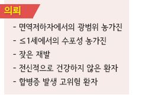
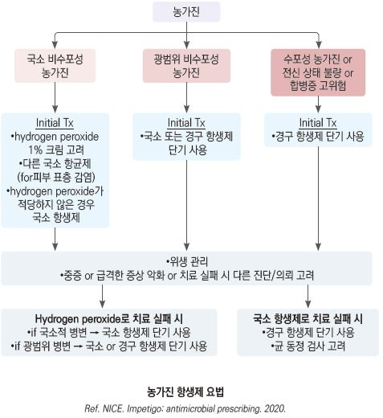
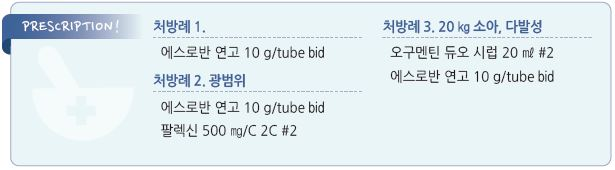

# 농가진 Impetigo


## 일반 사항

* 세균 감염에 의한 다발성 표재성 화농성 병변
* 잠복기 : 4\~10일
* 경과 : 보통 2주 내(평균 10일) 자연 치유
* 전염 : 가벼운 피부 손상(긁힘, 벌레 물림), (손)접촉, 호흡기 전염
* 농창(ecthyma) : 덜 치료되거나 방치된 농가진에서 발생한 깊은 궤양 형태

## 원인

* S. aureus : 온대 지방에서 대부분(수포성 농가진의 100%); 주로 코에서 피부로 퍼짐
* GABH Streptococcus : 열대 지방에서 보다 흔함

### 위험 인자

* 2\~5세
* 여름\~가을
* 덥고 습한 환경
* 상처, 긁힘, 벌레 물림, 화상
* 불결한 위생, 흡연 노출
* 밀집 환경, 보육 시설
* 영양 결핍, 빈혈
* 다른 피부 질환 : 습진, 접촉피부염, 아토피, 옴, 수두
* 피부 손상 가능성이 있는 활동(예: 육체 접촉이 있는 운동)

## 종류

### 비수포성 농가진 (Non-bullous impetigo)

* 빈도 : 전체 농가진의 70% 이상 차지
* 호발 연령 : 학령기 이전 소아
* 형태 : 작은 홍반 → 수포 또는 (각질층하)농포 → 파열 후 진물 → ＜2 ㎝의 노란 딱지(honey-colored crust)
* 부위 : 노출 부위(얼굴, 손, 발, 다리), 손상 부위(상처, 벌레 물림)
* 유발 요인 : 벌레 물림, 찰과상, 열상, 수두, 옴, 이감염증, 화상
* 전파 방법 : 손(손톱), 옷, 수건 등에 의해 다른 부위나 다른 사람에게 전파
* 임상 양상 : 간혹 가려움, 국소 림프절병증(90%); 통증은 거의 없음, 전신 증상 없음
* 경과 : 흉터 없이 치유; 연조직염(＜10%); GABHS 감염 시 림프절염, 사구체신염(드묾)

### 수포성 농가진 (Bullous impetigo)

* 호발 연령 : 영유아
* 형태 : 각질층하 맑은 수포 형성(1\~2 ㎝) → 파열 후 좁은 경계의 비늘이 있는 습한 미란
* 부위 : 손상이 없는 정상 피부에서 발생; 겨드랑이, 사타구니, 손(두피에는 발생하지 않음) → 전신으로 퍼질 수 있음
* 임상 양상 : 수포 통증, 주위 피부 가려움; 홍반이나 국소 림프절병증은 드묾
* 경과 : 빠르게 진행하며 흉터 없이 치유

## 진단

* 전형적인 경우는 검사 없이 치료
* 7\~10일간의 치료에 반응하지 않는 경우 병변 분비물로 그람염색 및 배양 검사

### 감별

* S. aureus : 보다 광범위한 수포성 병소, thin paper-like crust
* GABHS : thick amber crust
* 헤르페스 : 수포 군집, 재발 병력
* 병변 형태로 원인 균주를 감별할 수 없으며 복합 감염이 흔함

***

## Management

### 치료 방침

* 항생제 연고 도포
* crust 제거
* 전신 세척

## 비-약물 치료

* 냉찜질 : 가려움 및 통증 완화에 약간의 효과
* 가피 제거 : 1일 2\~3회; 습윤 드레싱 및 거즈를 이용하여 1일 2회 시행
*   병소 및 전신 세척 : povidone-iodine \[베타딘]\(7\~10배 희석), chlorhexidine \[헥시딘], hexachlorophene;

    가족 모두 표백제 목욕(20 L당 표백제 ¼~~½컵 투여, 15분씩 주 3~~5회 목욕)

## 약물 치료

* 경증 : 국소 항생제 적용; 경증에서는 국소와 경구 항생제간의 유의미한 효과 차이 없음
* 중증 : 경구 항생제 적용
* 경구 및 국소 항생제의 병용은 이득이 없으므로 권고하지 않음

### 국소 항생제

* mupirocin 2%(특히 MRSA에 유효) \[에스로반], fusidic acid 2% [후시딘](../%EB%B9%84%EB%B3%B4%ED%97%98/), bacitracin, retapamulin
* 용법 : bid ×5\~7일(적은 범위 비수포성)\~10일(광범위 또는 수포성)
*   hydrogen peroxide 1% 크림 : 합병증 고위험군이 아닌, 전신 상태가 나쁘지 않은 환자의 국소 비수포성 농가진에 대하여

    항생제 사용 전 적용 (✽시판 제품 없음)

### 전신 항생제

```

```

* 대상 : 중증, 넓은 범위 이환; 다발성, 입 주위 병변, 농창, 연조직염, 종기, 화농성 림프절염
* 투여 기간 : 7일
*   \[대한감염학회] amoxicillin/clav, 1세대 cephalosporin, clindamycin; MRSA 의심/확인 시 doxycycline, clindamycin,

    TMP/SMX (☞ p.901)
*   \[NICE] flucloxacillin 500 ㎎ qid ×5d; 대체 clarithromycin 250 ㎎ bid ×5d, 임신 시 erythromycin 250\~500 ㎎ qid ×5d

    

## 예방 및 관리

### 예방

```
(☞ p.900)
```

* 피부 위생
*   재발 시 S. aureus 의 비강 내 증식이 관련될 수 있으며 양쪽 코 안에 mupirocin 도포(bid ×5d;

    MRSA 균주의 40% 제거 효과) 또는 rifampin 투여 고려(300 ㎎ bid ×5d)

### 사회 격리

*   항생제 투여 후 24시간 동안 출근/등교 제한

    •항생제 투여 24시간 경과 후 새로운 병변이 발생하지 않으면 전염성이 없다고 판단
* 노출된 피부는 드레싱으로 차단

### 접촉자 조치

* 병소 발생 전까지 조치 필요 없음
* 수건 및 침구 공용 사용을 피함

> **질병코드** L01　농가진


