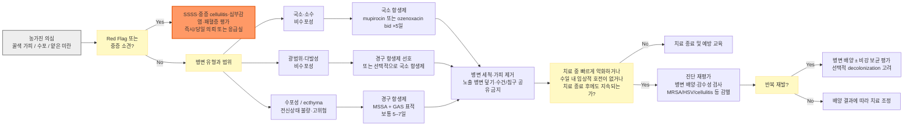

# 농가진 Impetigo

## <mark style="color:green;">일반 사항</mark>

* 세균에 의한 표재성 피부감염(pyoderma)
* 주 원인균 : **Staphylococcus aureus**, **Streptococcus pyogenes (GAS)**
* 잠복기 : GAS 농가진은 약 10일
* 경과 : 치료하지 않아도 자연 호전될 수 있으나, 전파 및 합병증 감소를 위해 항균 치료 권장
* 전파 : 병변과의 **직접 피부 접촉** 또는 수건·의류·침구 등 오염 물품을 통한 간접 접촉
* 피부 장벽 손상(긁힘, 벌레 물림, 찰과상, 습진, 옴 등)이 있으면 발생 위험 증가
* **농창(ecthyma)** : 표피를 넘어 진피까지 침범하는 깊은 궤양성 pyoderma. 농가진보다 깊고 흉터를 남길 수 있으며 **경구 항생제 치료가 필요**

## <mark style="color:green;">원인</mark>

* **S. aureus** : 비수포성 농가진의 주요 원인 중 하나이며, 수포성 농가진은 toxin-producing S. aureus에 의해 발생
* **S. pyogenes (GAS)** : 비수포성 농가진의 원인이 될 수 있으며 S. aureus와 혼합 감염도 가능
* 임상 병변의 형태만으로 원인 균주를 신뢰성 있게 구분하기는 어려움

### <mark style="color:orange;">위험 인자</mark>

* 2\~5세 소아
* 덥고 습한 환경, 여름\~가을
* 상처, 긁힘, 벌레 물림, 화상, 찰과상
* 위생 불량 및 밀집 환경(보육시설, 학교 등)
* 아토피피부염, 습진, 접촉피부염, 옴, 수두 등 피부 장벽 손상 질환
* 피부 접촉이 많은 운동 또는 활동

## <mark style="color:green;">임상 양상</mark>

### <mark style="color:orange;">비수포성 농가진 (Non-bullous impetigo)</mark>

* 전체 농가진의 대부분을 차지
* 호발 연령 : 학령기 이전 소아
* 형태 : 작은 홍반성 구진/수포 또는 농포 → 파열 → 진물 → 특징적인 **노란 꿀색 가피(honey-colored crust)**
* 부위 : 얼굴(특히 코·입 주변), 사지 등 노출 부위 및 손상 피부
* 전파 : 손, 손톱, 옷, 수건 등을 통해 자가접종 또는 타인에게 전파
* 임상 양상 : 가려움이 있을 수 있으며 국소 림프절병증이 동반될 수 있음. 대개 통증과 전신 증상은 경미하거나 없음
* 경과 : 보통 흉터 없이 치유
* 합병증 : 연조직염, 드물게 **post-streptococcal glomerulonephritis (PSGN)**
* 
  **PSGN 예방에 대한 주의** : GAS 농가진의 항생제 치료는 감염 치료와 전파 감소에 중요하지만, **PSGN 발생을 확실히 예방한다는 근거는 불충분**합니다.
  

### <mark style="color:orange;">수포성 농가진 (Bullous impetigo)</mark>

* 주로 영유아에서 발생
* toxin-producing **S. aureus**에 의해 발생
* 형태 : 얇은 지붕의 이완성 수포(flaccid bullae) → 쉽게 파열 → 얕고 습한 미란과 얇은 갈색/황색 가피
* 부위 : 몸통, 겨드랑이, 사타구니·기저귀 부위, 사지 등
* 국소 홍반은 심하지 않을 수 있으며, 병변이 빠르게 퍼질 수 있음
* 영아에서 광범위한 수포·피부 압통·박리가 있으면 **staphylococcal scalded skin syndrome (SSSS)** 감별 필요

### <mark style="color:$danger;">🚩 Red Flags!</mark>

<mark style="color:$danger;">**즉각 조치 또는 의뢰**</mark>

* 빠르게 진행하는 광범위 홍반·부종, 심한 통증, 피부 괴사 또는 심부 감염 소견
* 고열, 저혈압, 의식 변화 등 패혈증/전신 독성 소견
* 영아에서 광범위 수포, 피부 압통·박리 → **SSSS 의심**
* necrotizing soft-tissue infection 또는 중증 cellulitis 의심

<mark style="color:$warning;">**당일 또는 조기 의뢰**</mark>

* **영아(≤1세), 특히 신생아의 수포성 농가진**
* 면역저하자의 광범위 농가진
* 전신 상태 불량
* 광범위 수포성 병변, 농창(ecthyma), 연조직염 동반
* 적절한 치료 중에도 빠르게 악화하거나 치료 종료 후 호전이 없음

<mark style="color:$info;">**외래 추적 / 추가 평가 계획**</mark> <mark style="color:$info;">- 즉각 위험 낮으나 호전 없으면 의뢰</mark>

* 잦은 재발
* MRSA 또는 집단 발생 의심
* 반복적인 피부 장벽 손상 질환(아토피피부염, 옴 등) 동반

## <mark style="color:green;">진단</mark>

* 전형적인 경우는 임상적으로 진단하며 검사 없이 치료 가능
* 다음의 경우 병변의 농/삼출물에서 **배양 및 감수성 검사** 고려
  * 치료 실패 또는 악화
  * 반복 재발
  * MRSA 의심
  * 집단 발생
  * 중증·광범위 또는 비전형적 병변
* 재발이 반복되면 임상 상황에 따라 **S. aureus 비강 보균 평가**를 고려
* 반복 재발 또는 가정 내 반복 전파가 의심되면 **가족·동거인 내 동시/반복 피부감염 여부를 확인**하고, routine 검사는 아니지만 필요 시 접촉자의 보균 가능성 평가 및 decolonization 전략을 개별적으로 고려

### <mark style="color:orange;">감별</mark>

* 병변 형태만으로 S. aureus와 GAS를 구분하지 않음

<table><thead><tr><th width="170">질환</th><th>농가진과의 핵심 감별 포인트</th></tr></thead><tbody><tr><td>접촉피부염/아토피피부염</td><td>소양감과 습진성 병변이 우세</td></tr><tr><td>단순포진(HSV)</td><td>통증을 동반한 군집성 수포, 재발 병력</td></tr><tr><td>수두/대상포진</td><td>다양한 단계의 수포 또는 피부절 분포</td></tr><tr><td>tinea</td><td>환상형 병변, 인설</td></tr><tr><td>SSSS</td><td>영유아, 광범위 압통성 홍반·표피 박리</td></tr><tr><td>cellulitis/erysipelas</td><td>더 깊은 홍반·열감·압통, 전신 증상 가능</td></tr></tbody></table>

***


```mermaid
flowchart LR
    A["농가진 의심<br/>꿀색 가피 / 수포 / 얕은 미란"] --> B["Red Flag 또는<br/>중증 소견?"]

    B -->|Yes| C["SSSS·중증 cellulitis·심부감염·패혈증 평가<br/>즉시/당일 의뢰 또는 응급실"]
    B -->|No| D["병변 유형과 범위"]

    D --> E["국소·소수<br/>비수포성"]
    D --> F["광범위·다발성<br/>비수포성"]
    D --> G["수포성 / ecthyma<br/>전신상태 불량·고위험"]

    E --> H["국소 항생제<br/>mupirocin 또는 ozenoxacin bid ×5일"]
    F --> I["경구 항생제 선호<br/>또는 선택적으로 국소 항생제"]
    G --> J["경구 항생제<br/>MSSA + GAS 표적<br/>보통 5–7일"]

    H --> K["병변 세척·가피 제거<br/>노출 병변 덮기·수건/침구 공유 금지"]
    I --> K
    J --> K

    K --> L["치료 중 빠르게 악화하거나<br/>수일 내 임상적 호전이 없거나<br/>치료 종료 후에도 지속되는가?"]
    L -->|No| M["치료 종료 및 예방 교육"]
    L -->|Yes| N["진단 재평가<br/>병변 배양·감수성 검사<br/>MRSA/HSV/cellulitis 등 감별"]

    N --> O["반복 재발?"]
    O -->|Yes| P["병변 배양 ± 비강 보균 평가<br/>선택적 decolonization 고려"]
    O -->|No| Q["배양 결과에 따라 치료 조정"]

    style A fill:#eeeeee,stroke:#888888,stroke-width:2px
    style B fill:#fff9c4,stroke:#ffe082
    style D fill:#fff9c4,stroke:#ffe082
    style L fill:#fff9c4,stroke:#ffe082
    style O fill:#fff9c4,stroke:#ffe082
    style C fill:#f96,stroke:#e65100,stroke-width:2px
```

<p align="center"><strong>농가진 진료 알고리듬</strong></p>

<p align="center"><em><mark style="color:$info;">Ref. NICE NG153 (2020); CDC Clinical Guidance for Group A Streptococcal Impetigo (2025)</mark></em></p>


**알고리듬 해설**

* NICE NG153의 핵심 분기(국소 비수포성 / 광범위 비수포성 / 수포성·고위험)는 유지하되, 국내에서 이용하기 어려운 hydrogen peroxide 1% cream은 주 치료 흐름에서 제외했습니다.
* 실제 외래 진료에서 중요한 **Red Flag, ecthyma, 치료 실패 시 배양, MRSA, 재발 시 decolonization 평가**를 추가했습니다.
* 경구 항생제를 선택한 경우 국소 항생제를 일상적으로 병용하지 않습니다.


***

## <mark style="background-color:$warning;">Management</mark>

### <mark style="color:orange;">치료 원칙</mark>

* 병변 범위와 수포성 여부, 환자의 전신 상태에 따라 **국소 또는 경구 항생제 중 하나를 선택**
* **경구 항생제와 국소 항생제를 일상적으로 병용하지 않음**
* 국소·소수 병변의 비수포성 농가진 → 국소 항생제
* 광범위·다발성 비수포성 농가진 → 경구 항생제 또는 경우에 따라 국소 항생제
* 수포성 농가진, 농창, 전신 상태 불량 또는 합병증 고위험 → **경구 항생제 우선**
* 감염 부위는 청결하게 유지하고 노출 병변은 덮어 전파를 줄임

## <mark style="color:green;">비-약물 치료 및 예방</mark>

* 병변을 미지근한 물과 순한 비누로 부드럽게 세척
* 세척 시 분비물과 느슨한 가피는 부드럽게 제거할 수 있으나, **가피를 억지로 제거할 필요는 없음**
* 병변을 긁지 않도록 손톱을 짧게 유지
* 수건·의류·침구는 공유하지 않고 세척
* 일반적인 농가진에서 **전 가족의 표백제 목욕을 일률적으로 시행하지 않음**
* 반복성 S. aureus 피부감염에서 decolonization을 고려할 때 chlorhexidine 세정 또는 희석 표백제 목욕이 사용될 수 있으나, **근거는 제한적이며 routine으로 권고하지 않고** 개별적으로 결정
* 경구 rifampin 단독 제균요법은 일반적인 재발성 농가진에서 권고하지 않음

### <mark style="color:orange;">사회 복귀 및 접촉자 관리</mark>

(☞ [피부감염](165_-skin-and-soft-tissue-infection.md))

* 적절한 항생제 치료를 시작하고 전신 상태가 양호하며 노출 병변을 덮을 수 있으면 학교·직장 복귀 가능
* CDC/AAP 기준에서는 항생제 치료 시작 후 **최소 12시간**을 제시하며, 집단 발생이나 특정 직업 환경에서는 **24시간**을 고려
* 국내 학교·보육시설의 별도 규정이 있으면 해당 규정을 따름
* 무증상 접촉자에게 일률적인 항생제 치료는 필요하지 않음
* 접촉자도 수건, 의류, 침구 등의 공용 사용을 피함
* 가족/집단 내 다수 발생 시 위생 관리 강화 및 집단 발생 평가 고려
* 반복 재발 시 병변 배양 및 필요 시 비강 보균 평가 후 **선택적 decolonization** 고려

## <mark style="color:green;">약물 치료</mark>

### <mark style="color:orange;">국소 항생제</mark>

* **mupirocin 2%** <mark style="color:blue;">\[에스로반]</mark> : 국소 비수포성 농가진의 대표적 1차 선택
  * bid × **5일**, 임상 반응에 따라 7일까지 고려
* **fusidic acid 2%** <mark style="color:blue;">\[후시딘]</mark> : 국내 피부감염 병변 유래 S. aureus에서 높은 내성률이 보고됨(한 국내 연구에서 **44.0%**). 반복적·경험적 사용을 피하고, 국소 농가진의 1차 치료에서는 **mupirocin 또는 ozenoxacin을 우선 고려**
* retapamulin : 국내는 <mark style="color:blue;">\[알타고연고]</mark>로 허가되었으나 2019년 8월 판매 부진으로 자진취하되어 현재 국내 유통 없음
* **ozenoxacin 1%** <mark style="color:blue;">\[오자넥스크림]</mark> : 국내 2022년 출시된 **비불소화 quinolone계** 국소 항생제. DNA gyrase와 topoisomerase IV를 억제하며, 일부 임상시험에서 MRSA 및 mupirocin/fusidic acid 내성 S. aureus에 대한 활성이 보고됨
  * bid × **5일**, 생후 2개월 이상부터 사용 가능
  * 적용면적은 **100 cm² 이하**, 12세 이하에서는 **체표면적(BSA) 2% 이하**로 제한
  * **3일 이내 임상적 반응이 없으면 재평가**
  * 허가된 단기간·제한 면적 범위에서 사용하며, 장기·광범위 사용의 안전성 자료가 제한적이므로 피함
* MRSA에도 mupirocin 감수성 균주는 반응하지만 **mupirocin 내성 가능성**이 있으므로 반복 사용과 장기간 사용은 피함
* **hydrogen peroxide 1% cream** : NICE에서는 합병증 고위험이 아닌 국소 비수포성 농가진의 선택지이나, **국내 시판 제품이 없어 실용성 제한**


**국소치료의 실제 적용**

국내 일차진료에서는 hydrogen peroxide 1% cream의 이용이 어렵기 때문에, **소수의 국소 비수포성 병변에서는 mupirocin 등의 국소 항생제를 단기간 사용하는 접근이 실용적**입니다.


### <mark style="color:orange;">전신 항생제</mark>

**대상**

* 광범위 또는 다발성 병변
* 수포성 농가진
* 농창(ecthyma)
* 전신 상태 불량 또는 합병증 고위험
* 집단 발생 등에서 전파 감소를 위해 전신 치료가 필요한 경우
* 국소 치료 실패 후 경구 치료가 필요한 경우

**기간**

* 일반적으로 **5\~7일**
* IDSA는 경구 치료 시 7일 요법을 권고

**경험적 선택**

* MSSA + GAS를 함께 고려
* 1세대 cephalosporin(예: **cephalexin**) 또는 국내 감수성·환자 특성에 따른 적절한 β-lactam
* MRSA 의심/확인 시 **clindamycin, doxycycline, TMP/SMX** 등을 배양 결과와 지역 내성률에 따라 선택
  * **doxycycline** : 임신 여부를 확인하고, 소아 특히 **8세 미만에서는 대체약을 우선 고려**
  * **TMP/SMX** : **생후 2개월 미만 금기**. MRSA 의심/확인 농가진에서 단독 사용 가능하나 GAS 동시 감염 가능성이 임상적으로 중요하면 **β-lactam 병용을 고려**
* β-lactam allergy에서는 알레르기 유형과 지역 내성률에 따라 대체약 선택

***

### <mark style="color:red;">질병코드</mark>

L01.0　농가진(Impetigo)

L01.1　농가진화(Impetiginization of other dermatoses) — 아토피피부염 등 기존 피부질환에 이차 세균감염이 동반된 경우

L08.0　농피증(Pyoderma) — 농창(ecthyma) 등 진피까지 침범하는 궤양성 병변에 적용 가능

✽정확한 하위 코드는 청구 전 KOICD(질병분류정보센터)에서 최신 KCD 개정판 기준으로 재확인할 것

***

## <mark style="color:purple;">처방례</mark>

> **처방례 1. 국소·소수 비수포성 농가진**
>
> ```
> 에스로반 연고 10 g/tube　병변에 얇게 bid ×5일
> ```

> **처방례 2. 성인, 광범위·다발성 비수포성 농가진**
>
> ```
> Cephalexin 500 ㎎　1C qid ×5\~7일
> ```
>
> _✽국소 항생제는 일상적으로 병용하지 않음. β-lactam allergy, MRSA 위험, 배양 결과에 따라 대체약 선택_

> **처방례 3. 20 ㎏ 소아, 다발성 농가진**
>
> ```
> Cephalexin **25\~50 ㎎/㎏/day, 3\~4회 분할 투여 ×7일**
> ```
>
> _✽실제 처방 시 사용 제형의 농도에 맞추어 mL 환산; 국소 항생제를 일상적으로 병용하지 않음_

> **처방례 4. 20 ㎏ 소아, MRSA 의심/확인 농가진**
>
> ```
> Clindamycin 10\~13 ㎎/㎏/dose q8h ×5\~7일
> 예: 20 kg 소아 → 240 ㎎ q8h
> ```
>
> _✽경험적 β-lactam에 반응 없거나 배양에서 MRSA 확인 시; clindamycin 내성 가능성이 있어 지역 감수성 자료 참고. TMP/SMX는 생후 2개월 미만 금기이며, GAS 동시 감염 가능성이 중요하면 β-lactam 병용을 고려_

### 참고 지침

* NICE. **Impetigo: antimicrobial prescribing (NG153)**. 2020, current online recommendations.
* Infectious Diseases Society of America (IDSA). **Practice Guidelines for the Diagnosis and Management of Skin and Soft Tissue Infections**.
* CDC. **Clinical Guidance for Group A Streptococcal Impetigo**. Updated 2025.

***

### <mark style="color:$success;">핵심 복약 지도</mark>

> **국소 항생제(mupirocin/fusidic acid/ozenoxacin) 사용법**
>
> * 병변을 미지근한 물로 씻고 가피를 부드럽게 제거한 후 얇게 도포
> * 처방된 기간(보통 5일, 반응에 따라 7일까지) 동안 꾸준히 사용
> * mupirocin은 반복·장기간 사용 시 내성이 유발될 수 있으므로 단기간만 사용
> * 도포 직후 손 위생을 철저히 하여 자가 접종 및 타인 전파를 예방

> **경구 항생제 완료의 중요성**
>
> * 5\~7일 처방된 경우 증상이 먼저 좋아지더라도 임의로 중단하지 않도록 안내
> * 국소 항생제와 일상적으로 병용하지 않음
> * MRSA 확인/의심으로 clindamycin·doxycycline·TMP/SMX 등을 사용하는 경우 지역 내성률과 배양 결과를 반영해 선택했음을 설명

> **전파 차단 및 격리**
>
> * 노출 병변은 거즈 등으로 덮고, 수건·의류·침구는 다른 가족과 공유하지 않으며 매일 세탁
> * 항생제 치료 시작 후 최소 12시간이 지나고 전신 상태가 양호하면 등원·등교 가능(집단 시설·특정 직업군은 24시간 고려)

> **언제 다시 병원을 방문해야 하나요?**
>
> * 치료 중에도 병변이 빠르게 넓어지거나 발열·전신 증상이 동반되는 경우 — 즉시 내원
> * 영아에서 넓은 범위의 수포·피부 압통·박리가 나타나는 경우 — 즉시 내원(SSSS 감별)
> * 치료 시작 후 수일 내 임상적 호전이 없거나, 처방 기간을 마친 뒤에도 병변이 지속되거나 악화되는 경우 — 재평가 및 필요 시 배양·감수성 검사

***

### <mark style="color:blue;">환자 안내서</mark>


**농가진, 전염성이 강하지만 대부분 잘 낫는 피부 감염입니다**

농가진은 세균에 의한 얕은 피부 감염으로, 어린아이에서 특히 흔합니다. 노란 꿀색 딱지나 물집으로 나타나며, 항생제 치료로 대개 잘 낫고 **일반적인 농가진은 흉터를 거의 남기지 않습니다.** 다만 피부 깊숙이 침범한 **농창(ecthyma)은 흉터를 남길 수 있습니다.**


#### <mark style="color:$primary;">왜 생기나요?</mark>

* 포도알균 또는 사슬알균이라는 세균이 상처, 벌레 물린 곳, 습진 등으로 손상된 피부를 통해 들어가 감염을 일으킵니다.
* 다른 사람의 병변에 직접 닿거나, 수건·옷·이불 등을 함께 써서 전염될 수 있습니다.

#### <mark style="color:$primary;">일상생활에서 어떻게 관리하나요?</mark>

* **병변을 미지근한 물과 순한 비누로 부드럽게 씻어 주세요.** 딱지를 억지로 떼어내지 말고 물에 불려 부드럽게 제거하십시오.
* **긁지 않도록 손톱을 짧게 유지하십시오.** 긁으면 세균이 다른 부위나 다른 사람에게 옮겨갈 수 있습니다.
* **수건, 옷, 이불을 다른 가족과 함께 쓰지 마시고 매일 세탁하십시오.**
* **노출된 병변은 거즈 등으로 가볍게 덮어 주세요.** 다른 사람과의 접촉 전파를 줄일 수 있습니다.

#### <mark style="color:$primary;">약은 어떻게 써야 하나요?</mark>

* 연고나 크림을 처방받은 경우, 의사가 안내한 기간(보통 5일) 동안 하루 2번 꾸준히 바르십시오.
* 먹는 항생제를 처방받은 경우, 증상이 먼저 좋아지더라도 처방된 기간(보통 5\~7일)을 다 채워 복용하십시오.
* 연고와 먹는 약을 함께 사용하도록 처방받지 않은 이상, 임의로 둘 다 사용하지 마십시오.

#### <mark style="color:$primary;">이럴 때는 즉시 병원을 방문하세요</mark>

* 병변이 빠르게 넓어지거나, 열이 나거나, 전신 상태가 나빠지는 경우
* (특히 영아) 넓은 범위에 물집이 잡히고 피부가 벗겨지거나 만지면 아파하는 경우
* 치료 중에도 병변이 빠르게 악화하거나 수일 내 호전이 없거나, 항생제를 다 사용한 뒤에도 병변이 지속되는 경우

#### <mark style="color:$primary;">등원·등교는 언제부터 가능한가요?</mark>

* 항생제 치료를 시작하고 최소 12시간이 지났고, 아이가 전반적으로 괜찮아 보이며, 남은 병변을 옷이나 거즈로 가릴 수 있다면 등원·등교가 가능합니다.
* 어린이집이나 학교에 별도 규정이 있다면 그 규정을 따르십시오. 필요한 경우 **보육교사·보건교사 또는 해당 기관에 복귀 기준을 확인**하십시오.
