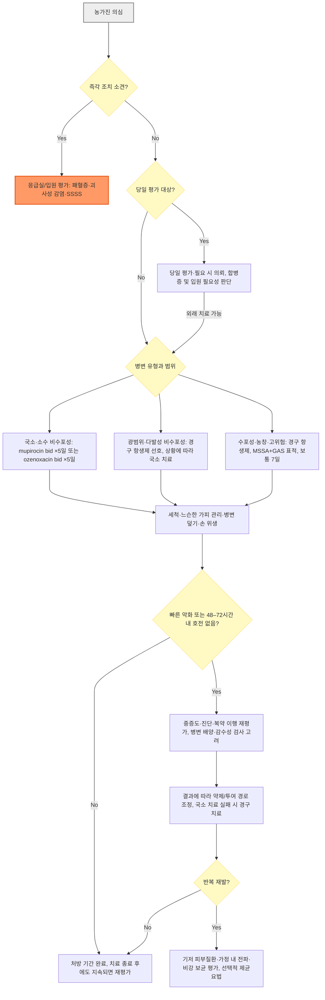

# 농가진 Impetigo

## <mark style="color:green;">일반 사항</mark>

* 세균에 의한 표재성 피부감염(pyoderma)
* 주 원인균 : **Staphylococcus aureus**, **Streptococcus pyogenes (GAS)**
* 잠복기 : GAS 농가진은 약 10일
* 경과 : 치료하지 않아도 수 주 내 자연 호전될 수 있으나, 병변의 치유를 촉진하고 전파를 줄이기 위해 항균 치료 권장. 항생제 치료가 PSGN을 확실히 예방하는 것은 아님
* 전파 : 병변과의 **직접 피부 접촉** 또는 수건·의류·침구 등 오염 물품을 통한 간접 접촉
* 피부 장벽 손상(긁힘, 벌레 물림, 찰과상, 습진, 옴 등)이 있으면 발생 위험 증가
* **농창(ecthyma)** : 표피를 넘어 진피까지 침범하는 깊은 궤양성 pyoderma. 농가진보다 깊고 흉터를 남길 수 있으며 **경구 항생제 치료가 필요**

## <mark style="color:green;">원인</mark>

* **S. aureus** : 비수포성 농가진의 주요 원인 중 하나이며, 수포성 농가진은 toxin-producing S. aureus에 의해 발생
* **S. pyogenes (GAS)** : 비수포성 농가진의 원인이 될 수 있으며 S. aureus와 혼합 감염도 가능
* 임상 병변의 형태만으로 원인 균주를 신뢰성 있게 구분하기는 어려움

### <mark style="color:orange;">위험 인자</mark>

* 2\~5세 소아
* 덥고 습한 환경, 여름\~가을
* 상처, 긁힘, 벌레 물림, 화상, 찰과상
* 위생 불량 및 밀집 환경(보육시설, 학교 등)
* 아토피피부염, 습진, 접촉피부염, 옴, 이(pediculosis), 피부사상균증, 수두, 단순포진 등 피부 장벽 손상 질환
* 면역저하 상태(전신 스테로이드, 항암치료, 당뇨병, HIV, 투석 등)
* 최근 항생제 사용
* 피부 접촉이 많은 운동 또는 활동

## <mark style="color:green;">임상 양상</mark>

### <mark style="color:orange;">비수포성 농가진 (Non-bullous impetigo)</mark>

* 전체 농가진의 약 70%를 차지
* 호발 연령 : 학령기 이전 소아
* 형태 : 작은 홍반성 구진/수포 또는 농포 → 파열 → 진물 → 특징적인 **노란 꿀색 가피(honey-colored crust)**
* 부위 : 얼굴(특히 코·입 주변), 사지 등 노출 부위 및 손상 피부
* 전파 : 손, 손톱, 옷, 수건 등을 통해 자가접종 또는 타인에게 전파
* 임상 양상 : 가려움이 있을 수 있으며 국소 림프절병증이 동반될 수 있음. 대개 통증과 전신 증상은 경미하거나 없음
* 경과 : 보통 흉터 없이 치유되나, 염증 후 과색소침착 또는 저색소침착이 일시적으로 남을 수 있음
* 합병증 : 연조직염, 림프관염, 화농성 림프절염, 드물게 **post-streptococcal glomerulonephritis (PSGN)**
  * PSGN은 사슬알균 피부감염 후 약 3주까지의 잠복기를 거쳐 발생할 수 있음(인두염 후의 약 10일과 구분). 눈두덩·하지 부종, 고혈압, 콜라색 소변 또는 소변량 감소 → **당일 소변검사·혈압·신기능 평가 및 필요 시 소아청소년과/신장내과 의뢰**
  * 현미경혈뇨만 보이는 무증상 PSGN도 가능. 혈뇨·단백뇨를 단순한 일과성 변화로 단정하지 않고 평가함. 합병증 증상이 없는 전형적 농가진에서 일률적인 소변검사는 필요하지 않음
* <div data-gb-custom-block data-tag="hint" data-style="info" class="hint hint-info"><p><strong>PSGN 예방에 대한 주의</strong> : GAS 농가진의 항생제 치료는 감염 치료와 전파 감소에 중요하지만, <strong>PSGN 발생을 확실히 예방한다는 근거는 불충분</strong>함.</p></div>

### <mark style="color:orange;">수포성 농가진 (Bullous impetigo)</mark>

* 주로 영유아에서 발생하며, 비수포성과 달리 **손상되지 않은 피부에도 발생**
* exfoliative toxin을 생성하는 **S. aureus**가 표피의 desmoglein 1을 분해하여 발생. 수포성도 접촉 전파가 가능하므로 동일한 위생·접촉 관리가 필요
* 형태 : 얇은 지붕의 이완성 수포(flaccid bullae) → 쉽게 파열 → 두꺼운 가피 없이 얕고 습한 미란과 얇은 갈색/황색 가피, 가장자리의 **인설 테(collarette of scale)**
* 부위 : 몸통, 겨드랑이, 사타구니·기저귀 부위, 사지 등
* 국소 홍반은 심하지 않을 수 있으며, 병변이 빠르게 퍼질 수 있음
* **구강·안구 점막 침범은 전형적이지 않음**. 점막 미란·궤양이 뚜렷하면 HSV, SJS/TEN 또는 면역수포질환 등 다른 진단을 평가. 국소 림프절병증은 드묾
* 영아의 광범위 병변은 발열·처짐 등 전신 증상을 동반할 수 있음. **신생아는 병변이 적더라도 당일 소아청소년과 평가**를 통해 침습성 감염과 입원 필요성을 판단함
* 영아에서 광범위한 수포·피부 압통·박리가 있으면 **staphylococcal scalded skin syndrome (SSSS)** 감별 필요

### <mark style="color:$danger;">🚩 Red Flags!</mark>

<mark style="color:$danger;">**즉각 조치**</mark>

* 빠르게 진행하는 광범위 홍반·부종에 병변에 비해 심한 통증, 피부 괴사·자색 변화 또는 심부 감염 소견 → 괴사성 연조직 감염 의심, 응급 평가
* 저혈압·의식 변화·말초 관류 저하 등 패혈증/전신 독성 소견(고열이 없어도 배제하지 않음)
* 광범위 수포·피부 압통·박리, 특히 영아 → **SSSS 의심**, 즉시 응급실/입원 평가
* 영아의 광범위 표피 박리와 수유 감소·소변량 감소·처짐 등 탈수 소견
* PSGN 의심 환자의 호흡곤란·폐부종, 심한 고혈압에 동반된 두통·의식 변화 또는 현저한 핍뇨

<mark style="color:$warning;">**당일 평가**</mark>

* **신생아의 농가진 또는 영아(≤1세)의 수포성 농가진** → 소아청소년과 평가/의뢰
* 면역저하자의 광범위 농가진
* 전신 상태 불량, 발열·활동 저하 또는 광범위 수포성 병변
* 병변 주변으로 퍼지는 홍반·열감·압통 등 연조직염 동반
* 적절한 치료 중에도 빠르게 악화함(전신 독성·괴사성 감염 소견이면 즉각 조치)
* 농가진 이후 수 주 내 부종, 고혈압, 육안적 혈뇨(콜라색 소변) 또는 소변량 감소 → **PSGN 의심**

<mark style="color:$info;">**외래 추적 / 추가 평가 계획**</mark>

* 전신 상태가 안정적인 농창(ecthyma) → 경구 항생제를 시작하고 반응 확인; 광범위·심부 진행 또는 치료 실패 시 의뢰
* 치료 시작 후 48\~72시간 내 호전이 없거나 치료 종료 후에도 지속됨 → 진단·복약 이행·내성을 재평가하고 배양 고려; 안정적인 치료 실패만으로 응급 의뢰하지 않음
* 잦은 재발 → 병변 배양, 필요 시 비강 보균 및 제균요법 평가
* MRSA 또는 집단 발생 의심 → 배양 및 감염관리 평가
* 반복적인 피부 장벽 손상 질환(아토피피부염, 옴 등) 동반

## <mark style="color:green;">진단</mark>

* 전형적인 경우는 임상적으로 진단하며 검사 없이 치료 가능
* 다음의 경우 병변의 농/삼출물에서 **배양 및 감수성 검사** 고려
  * 치료 실패 또는 악화
  * 반복 재발
  * MRSA 의심
  * 집단 발생
  * 중증·광범위 또는 비전형적 병변
* 재발이 반복되면 **병변 배양을 시행**하고, 임상 상황에 따라 **S. aureus 비강 보균 평가**를 고려. 정상 피부·비강의 보균 결과만으로 병변의 원인균을 단정하지 않음
* 반복 재발 또는 가정 내 반복 전파가 의심되면 **가족·동거인 내 동시/반복 피부감염 여부를 확인**하고, routine 검사는 아니지만 필요 시 접촉자의 보균 가능성 평가 및 decolonization 전략을 개별적으로 고려

### <mark style="color:orange;">감별</mark>

* 병변 형태만으로 S. aureus와 GAS를 구분하지 않음

<table><thead><tr><th width="170">질환</th><th>농가진과의 핵심 감별 포인트</th></tr></thead><tbody><tr><td>접촉피부염/아토피피부염</td><td>소양감과 습진성 병변이 우세</td></tr><tr><td>단순포진(HSV)/포진상 습진</td><td>통증성 군집 수포 또는 균일한 둥근 파인 미란(punched-out erosion). 아토피피부염 환자에서 급속 확산·발열이 있으면 포진상 습진을 의심하여 당일 평가; 세균감염 동반도 가능</td></tr><tr><td>수두/대상포진</td><td>다양한 단계의 수포 또는 피부절 분포</td></tr><tr><td>tinea</td><td>환상형 병변, 인설</td></tr><tr><td>SSSS</td><td>영유아, 광범위 압통성 홍반·표피 박리</td></tr><tr><td>cellulitis/erysipelas</td><td>더 깊은 홍반·열감·압통, 전신 증상 가능</td></tr></tbody></table>

***


```mermaid
flowchart TD
    A["농가진 의심"] ---> B{"즉각 조치 소견?"}
    B --->|Yes| C["응급실/입원 평가: 패혈증·괴사성 감염·SSSS"]
    B --->|No| D{"당일 평가 대상?"}
    D --->|Yes| E["당일 평가·필요 시 의뢰, 합병증 및 입원 필요성 판단"]
    D --->|No| F{"병변 유형과 범위"}
    E --->|외래 치료 가능| F
    F ---> G["국소·소수 비수포성: mupirocin bid ×5일 또는 ozenoxacin bid ×5일"]
    F ---> H["광범위·다발성 비수포성: 경구 항생제 선호, 상황에 따라 국소 치료"]
    F ---> I["수포성·농창·고위험: 경구 항생제, MSSA+GAS 표적, 보통 7일"]
    G ---> J["세척·느슨한 가피 관리·병변 덮기·손 위생"]
    H ---> J
    I ---> J
    J ---> K{"빠른 악화 또는 48–72시간 내 호전 없음?"}
    K --->|No| L["처방 기간 완료, 치료 종료 후에도 지속되면 재평가"]
    K --->|Yes| M["중증도·진단·복약 이행 재평가, 병변 배양·감수성 검사 고려"]
    M ---> N["결과에 따라 약제/투여 경로 조정, 국소 치료 실패 시 경구 치료"]
    N ---> O{"반복 재발?"}
    O --->|Yes| P["기저 피부질환·가정 내 전파·비강 보균 평가, 선택적 제균요법"]
    O --->|No| L

    style A fill:#eeeeee,stroke:#888888,stroke-width:2px
    style B fill:#fff9c4,stroke:#ffe082
    style D fill:#fff9c4,stroke:#ffe082
    style F fill:#fff9c4,stroke:#ffe082
    style K fill:#fff9c4,stroke:#ffe082
    style O fill:#fff9c4,stroke:#ffe082
    style C fill:#f96,stroke:#e65100,stroke-width:2px
```

<p align="center"><strong>농가진 진료 알고리듬</strong></p>

<p align="center"><em><mark style="color:$info;">Ref. NICE NG153 (2020); CDC Clinical Guidance for Group A Streptococcal Impetigo (2025)</mark></em></p>


**알고리듬 해설**

* NICE NG153의 핵심 분기(국소 비수포성 / 광범위 비수포성 / 수포성·고위험)는 유지하되, hydrogen peroxide 1% cream은 국내 실무의 주 치료 흐름에서 제외함.
* 실제 외래 진료에서 중요한 **즉각 조치/당일 평가, ecthyma, 치료 실패 시 배양, MRSA, 재발 시 제균요법 평가**를 반영함.
* 경구 항생제를 선택한 경우 국소 항생제를 일상적으로 병용하지 않음.


***

## <mark style="background-color:$warning;">Management</mark>

### <mark style="color:orange;">치료 원칙</mark>

* 병변 범위와 수포성 여부, 환자의 전신 상태에 따라 **국소 또는 경구 항생제 중 하나를 선택**
* **경구 항생제와 국소 항생제를 일상적으로 병용하지 않음**
* 국소·소수 병변의 비수포성 농가진 → 국소 항생제
* 광범위·다발성 비수포성 농가진 → 경구 항생제 또는 경우에 따라 국소 항생제
* 수포성 농가진, 농창, 전신 상태 불량 또는 합병증 고위험 → **경구 항생제 우선**. 중증·신생아·SSSS 의심에서는 입원 및 정주 치료 필요성을 먼저 평가
* 수포성의 국소 치료도 허용하는 IDSA와 달리 NICE는 모든 수포성 농가진에서 경구 치료를 권고. 본 챕터는 NICE에 따라 경구 치료를 우선 제시함
* 감염 부위는 청결하게 유지하고 노출 병변은 덮어 전파를 줄임
* **치료 시작 후 48\~72시간 내 호전 경향**을 확인함. 빠른 악화는 즉시 재평가하고, 호전이 없으면 진단·복약 이행·내성을 검토함. 처방 기간을 마친 뒤에도 활성 병변이 지속되면 배양·감수성 검사와 MRSA 여부 확인
* 국소 항생제 치료 실패 시 동일 연고를 반복·연장하기보다 병변 배양을 고려하고 경구 항생제로 전환함

## <mark style="color:green;">비-약물 치료 및 예방</mark>

* 병변을 미지근한 물과 순한 비누로 부드럽게 세척
* 세척 시 분비물과 느슨한 가피는 부드럽게 제거할 수 있으나, **가피를 억지로 제거할 필요는 없음**
* 병변을 긁지 않도록 손톱을 짧게 유지
* 보습과 기저 피부질환 조절로 긁기를 줄임. 항히스타민제를 농가진에 일률적으로 사용하지 않으며, 심한 소양감의 원인과 소아의 진정 등 부작용을 고려하여 개별 결정함
* 수건·의류·침구는 공유하지 않고 세척
* 일반적인 농가진에서 **전 가족의 표백제 목욕을 일률적으로 시행하지 않음**
* 반복성 S. aureus 피부감염에서 decolonization을 고려할 때 chlorhexidine 세정 또는 희석 표백제 목욕이 사용될 수 있으나, **근거는 제한적이며 routine으로 권고하지 않고** 개별적으로 결정
* 경구 rifampin 단독 제균요법은 일반적인 재발성 농가진에서 권고하지 않음

### <mark style="color:orange;">사회 복귀 및 접촉자 관리</mark>

(☞ [피부감염](165_-skin-and-soft-tissue-infection.md))

* 적절한 항생제 치료 시작 후 **필요한 제외 기간이 지나고**, 전신 상태가 양호하며 노출 병변을 덮을 수 있으면 학교·직장 복귀를 판단함
* 미국 CDC의 GAS 농가진 안내(AAP 기준 인용)는 **최소 12시간**을 제시하며, 집단 발생이나 의료종사자에서는 **최소 24시간**을 고려. 국내 공통 법정 복귀 기준으로 단정하지 않음
* 국내 학교·보육시설의 별도 규정이 있으면 해당 규정을 따름
* 무증상 접촉자에게 일률적인 항생제 치료는 필요하지 않음
* 접촉자도 수건, 의류, 침구 등의 공용 사용을 피함
* 가족/집단 내 다수 발생 시 위생 관리 강화 및 집단 발생 평가 고려
* **신생아 농가진**에서는 가족뿐 아니라 신생아실·산후조리원 종사자의 피부감염 또는 보균 가능성을 고려하고, 집단 발생이 의심되면 해당 기관 및 보건소와 공유
* 반복 재발 시 병변 배양 및 필요 시 비강 보균 평가 후 **선택적 decolonization** 고려

## <mark style="color:green;">약물 치료</mark>

### <mark style="color:orange;">국소 항생제</mark>

* **mupirocin 2%** <mark style="color:blue;">\[에스로반]</mark> : 국소·소수 비수포성 농가진의 대표적 선택
  * **지침 요법** : IDSA는 bid ×5일, NICE는 tid ×5일. 임상 반응에 따라 치료 기간을 판단하되, 반복·장기간 사용은 피함
  * **국내 허가 용법** : 에스로반은 1일 2\~3회, 10일간 소량 도포. 본문과 처방례의 **5일 요법은 지침에 따른 단기 요법이며 국내 허가 기간과 다름**
  * 피부용 연고를 눈·구강·비강 점막에 사용하지 않음. 제균 목적의 비강 투여는 별도 비강용 제형·허가사항을 확인함
  * 에스로반 국내 첨부문서상 **임부·임신 가능성이 있는 여성·수유부 및 신질환 환자는 투여금기**. 신질환 금기는 PEG 연고기제의 손상 피부 흡수·신장 배설과 관련됨. 임신·수유에서도 외국 지침만 근거로 국내 금기를 무시하지 않음
* **fusidic acid 2%** <mark style="color:blue;">\[후시딘]</mark> : 반복적 경험 사용은 피함. 국내 단일 대학병원 피부감염 유래 S. aureus 965주(2010\~2013년)의 내성률이 **44.0%**, mupirocin은 **8.4%**였음([Baek 등, 2016](https://pubmed.ncbi.nlm.nih.gov/26892888/)). **현재 전국 또는 지역사회 농가진만의 내성률로 일반화할 수 없음**. 과거 사용력·지역 감수성·배양 결과를 반영하여 선택함
* **ozenoxacin 1%** <mark style="color:blue;">\[오자넥스크림]</mark> : 농가진의 단기 국소 치료로 국내 허가된 **비불소화 quinolone계** 항생제
  * **bid ×5일**, 성인 및 **생후 2개월 이상** 소아
  * 적용 부위 **100 cm² 이내**이며, **12세 이하에서는 체표면적 2%도 초과하지 않음**
  * **3일 이내 임상 반응이 없으면 재평가하고 대체요법 고려**. 반응이 없다고 임의로 7일 이상 연장하지 않음
  * 눈·점막에 사용하지 않으며, 개봉 후 **45일 이내** 사용. 임신·수유 중 안전성은 확립되지 않아 개별 평가 필요
  * MRSA·다른 국소 항생제 내성균에 대한 활성 자료가 있으나, **광범위·전신성 MRSA 감염의 경구/정주 치료를 대체하지 않음**
* mupirocin도 내성이 발생할 수 있으므로, 장기간 예방 도포나 잦은 재사용을 피하고 치료 실패·반복 재발 시 배양을 고려함
* **hydrogen peroxide 1% cream** : NICE가 국소 비수포성 농가진의 선택지로 권고하는 제형. 국내 실무에서는 국소 항생제를 주로 제시하며, **일반 소독용 과산화수소수(예: 3%)로 임의 대체하지 않음**


**국소치료의 실제 적용**

소수의 국소 비수포성 병변은 국소 항생제를 단기간 사용함. 가피는 억지로 떼지 않으며, 오자넥스 허가사항에서도 제거할 필요가 없다고 명시함. 신생아·신질환·임신·수유 등에서는 제품별 국내 금기/주의와 의뢰 필요성을 먼저 확인함.


### <mark style="color:orange;">전신 항생제</mark>

**대상**

* 광범위 또는 다발성 병변
* 수포성 농가진
* 농창(ecthyma)
* 전신 상태 불량 또는 합병증 고위험
* 집단 발생 등에서 전파 감소를 위해 전신 치료가 필요한 경우
* 국소 치료 실패 후 경구 치료가 필요한 경우

**기간**

* NICE는 일반적으로 **5일**, 병변의 범위·중증도에 따라 **7일**까지 고려
* IDSA와 국내 2017 피부·연조직 감염 지침은 농가진·농창 경구 치료에 **7일** 요법을 제시. 본 처방례는 7일로 통일하되 반응에 따라 개별화함

**경험적 선택**

* MSSA + GAS를 함께 고려
* **1세대 cephalosporin 우선 고려** : cephalexin <mark style="color:blue;">\[팔렉신]</mark>, 소아 액제 사용이 필요하면 cefadroxil <mark style="color:blue;">\[보령듀리세프 건조시럽]</mark> 등. 정상 신기능 기준 용량을 사용하고 신장애에서는 조절함
* **amoxicillin/clavulanate**도 국내 지침의 선택지이나, 단순 MSSA/GAS 농가진에 광범위 약제를 일률적으로 우선 사용하지 않음
* amoxicillin 또는 penicillin 단독은 경험적 MSSA 치료에 부적절. **배양에서 GAS만 확인되면** 좁은 범위 penicillin계로 조정 가능
* MRSA 의심/확인 시 **clindamycin, doxycycline, TMP/SMX** 등을 배양 결과와 지역 내성률에 따라 선택
  * **clindamycin** : 배양 감수성과 **C. difficile 대장염 위험**을 확인. erythromycin 내성·clindamycin 감수성 S. aureus는 **D-test**로 유도성 내성을 확인하고 양성이면 피함
  * **doxycycline** : 농가진에서는 임신·수유 및 어린 소아의 국내 제품별 금기를 확인하고 대체약 우선. GAS에 대한 경험적 보장이 불확실하므로 연조직염 등 GAS 감염이 중요하면 적절한 β-lactam 병용 또는 다른 약제 선택
  * **TMP/SMX** : **생후 2개월 미만 금기**. IDSA는 MRSA 농가진의 선택지로 제시하나, GAS 동시 감염/연조직염이 임상적으로 중요하면 **β-lactam 병용 또는 두 균을 치료하는 다른 약제**를 고려. 신기능·고칼륨혈증 위험과 병용약, 임신·수유 관련 국내 금기/주의 확인
  * 국소 치료에 반응이 없다는 이유만으로 MRSA를 확진하지 않으며, 가능하면 약제를 바꾸기 전 병변 배양을 채취함
  * **소아 MRSA 치료는 실제 확보 가능한 제형과 국내 허가 용량을 확인**하여 결정. 국내에서 확인되지 않은 경구액 농도나 캡슐 분할량을 가정한 처방을 피함
* β-lactam allergy에서는 알레르기 유형과 지역 내성률에 따라 대체약 선택
* macrolide(erythromycin, clarithromycin, azithromycin)는 S. aureus와 GAS의 내성률이 높아 **경험적 1차 약으로 권하지 않음**

***

## <mark style="color:red;">질병코드</mark>

L01.0　농가진(Impetigo)

L01.1　농가진화(Impetiginization of other dermatoses) - 아토피피부염 등 기존 피부질환에 이차 세균감염이 동반된 경우

L08.0　농피증(Pyoderma) - 농창(ecthyma) 등에 해당; 괴저성 농창(ecthyma gangrenosum)은 임상적으로 별개 질환이므로 혼동하지 않음

✽정확한 하위 코드는 청구 전 KOICD(질병분류정보센터)에서 최신 KCD 개정판 기준으로 재확인할 것

***

## <mark style="color:purple;">처방례</mark>

> **처방례 1. 국소·소수 비수포성 농가진**
>
> ```
> 에스로반 연고 2% 10 g/tube　병변에 소량 bid ×5일
> ```
>
> _✽IDSA 단기 요법; 국내 허가 용법은 1일 2~3회 10일간으로 기간이 다름. 임부·임신 가능성이 있는 여성·수유부·신질환 환자는 에스로반 투여금기_

> **처방례 2. 성인, 광범위·다발성 비수포성 농가진**
>
> ```
> 팔렉신캡슐 500 ㎎　1C qid ×7일
> ```
>
> _✽Cephalexin 2 g/day, 정상 신기능 기준. 국소 항생제는 일상적으로 병용하지 않음. β-lactam 알레르기, MRSA 위험, 배양 결과에 따라 조정_

> **처방례 3. 20 ㎏ 소아, 다발성 농가진**
>
> ```
> 보령듀리세프 건조시럽 250 ㎎/5 mL　1회 6 mL bid ×7일
> ```
>
> _✽Cefadroxil 30 mg/kg/day를 2회 분할: 20 kg ×30 mg=600 mg/day, 1회 300 mg=6 mL(조제 후 50 mg/mL). 125 mg/5 mL 제품이면 1회 12 mL이므로 농도를 반드시 확인. 정상 신기능 기준; 조제 후 잘 흔들고 계량용 주사기로 투여. 국소 항생제는 일상적으로 병용하지 않음_

> **처방례 4. 국소·소수 비수포성 농가진의 다른 국소 선택지**
>
> ```
> 오자넥스크림 1% 10 g/tube　병변에 얇게 bid ×5일
> ```
>
> _✽성인 및 생후 2개월 이상 소아. 적용 부위 100 cm² 이내, 12세 이하에서는 체표면적 2% 이내 조건도 충족해야 함. 3일 내 호전이 없으면 재평가; 광범위/전신성 MRSA 감염에는 이 처방을 적용하지 않음_

### 참고 지침 및 주요 확인 자료

* NICE. [**Impetigo: antimicrobial prescribing (NG153)**](https://www.nice.org.uk/guidance/ng153/chapter/Recommendations). 2020.
* IDSA. [**Practice Guidelines for the Diagnosis and Management of Skin and Soft Tissue Infections: 2014 Update**](https://www.idsociety.org/practice-guideline/skin-and-soft-tissue-infections/). 2014.
* 대한감염학회 등. [**Clinical Guidelines for the Antibiotic Treatment for Community-Acquired Skin and Soft Tissue Infection**](https://doi.org/10.3947/ic.2017.49.4.301). 2017. 성인(16세 이상) 대상 지침으로 소아 용량의 직접 근거로 사용하지 않음.
* CDC. [**Clinical Guidance for Group A Streptococcal Impetigo**](https://www.cdc.gov/group-a-strep/hcp/clinical-guidance/impetigo.html). 2025.
* CDC. [**Clinical Guidelines for Post-Streptococcal Glomerulonephritis**](https://www.cdc.gov/group-a-strep/hcp/clinical-guidance/post-streptococcal-glomerulonephritis.html). 2025.
* Baek YS, et al. [**Antimicrobial resistance of Staphylococcus aureus isolated from skin infections and its implications in various clinical conditions in Korea**](https://pubmed.ncbi.nlm.nih.gov/26892888/). Int J Dermatol. 2016;55:e191–e197. 2010~2013년 단일기관 피부감염 분리주 연구.
* 국내 제품 정보 : [에스로반](https://www.jwbrand.co.kr/sroban/product), [에스로반 국내 첨부문서](https://common.health.kr/shared/images/insert_pdf/IN_A11A2190A0223_00.pdf), [팔렉신](https://m.dong-wha.co.kr/product/content.asp?t_d=09&t_idx=20&t_page=3), [보령듀리세프 건조시럽](https://pharm.boryung.co.kr/product/search_detail.do?SEQ=382), [오자넥스](https://www.bukwang.co.kr/product_view.php?ccode=001&idx=78).

***

### <mark style="color:$success;">핵심 복약 지도</mark>

> **국소 항생제(mupirocin/fusidic acid/ozenoxacin) 사용법**
>
> * 병변을 미지근한 물로 부드럽게 씻고 얇게 도포. 느슨한 가피만 제거하며 억지로 떼지 않음; 오자넥스는 가피 제거가 필요하지 않음
> * 약제별 처방 횟수와 기간을 따름. 오자넥스는 하루 2회 5일; mupirocin 단기 5일 요법과 국내 허가 기간은 구분함
> * mupirocin은 반복·장기간 사용 시 내성이 유발될 수 있으므로 단기간만 사용
> * 도포 전후 손 위생을 철저히 함. 눈·입·코 안에 바르지 않으며, 심한 자극·발진이 생기면 중단하고 상담함

> **경구 항생제 완료의 중요성**
>
> * 증상이 먼저 좋아져도 처방된 기간을 따르고 임의로 중단·연장하지 않도록 안내. 심한 설사·혈변·복통이 있으면 신속히 평가(특히 clindamycin)
> * 국소 항생제와 일상적으로 병용하지 않음
> * MRSA 확인/의심으로 clindamycin·doxycycline·TMP/SMX 등을 사용하는 경우 지역 내성률과 배양 결과를 반영해 선택했음을 설명

> **전파 차단 및 격리**
>
> * 노출 병변은 거즈 등으로 덮고, 수건·의류·침구는 다른 가족과 공유하지 않으며 매일 세탁
> * CDC/AAP 안내는 치료 시작 후 최소 12시간과 전신 상태 양호·병변 덮기를 제시함. 집단 발생·의료종사자는 최소 24시간 고려; 국내 기관별 규정 확인

> **언제 다시 병원을 방문해야 하나요?**
>
> * 치료 중에도 병변이 빠르게 넓어지거나 발열·전신 증상이 동반되는 경우 - 즉시 내원
> * 영아에서 넓은 범위의 수포·피부 압통·박리가 나타나는 경우 - 즉시 내원(SSSS 감별)
> * 치료 시작 후 수일 내 임상적 호전이 없거나, 처방 기간을 마친 뒤에도 병변이 지속되거나 악화되는 경우 - 재평가 및 필요 시 배양·감수성 검사
> * 농가진 후 수 주 내 눈두덩·다리 부종, 콜라색 소변 또는 소변량 감소 - 당일 소변검사·혈압·신기능 평가(PSGN 감별)

***

## <mark style="color:blue;">환자 안내서</mark>


**농가진, 전염성이 강하지만 대부분 잘 낫는 피부 감염입니다**

농가진은 세균에 의한 얕은 피부 감염으로, 어린아이에서 특히 흔합니다. 노란 꿀색 딱지나 물집으로 나타나며, 항생제 치료로 대개 잘 낫고 **일반적인 농가진은 흉터를 거의 남기지 않습니다.** 다만 피부 깊숙이 침범한 **농창(ecthyma)은 흉터를 남길 수 있습니다.** 딱지가 떨어진 자리에 일시적으로 색이 진하거나 옅어질 수 있으나, 대개 시간이 지나면서 서서히 옅어집니다.


#### <mark style="color:$primary;">왜 생기나요?</mark>

* 포도알균 또는 사슬알균이라는 세균이 상처, 벌레 물린 곳, 습진 등으로 손상된 피부를 통해 들어가 감염을 일으킵니다.
* 다른 사람의 병변에 직접 닿거나, 수건·옷·이불 등을 함께 써서 전염될 수 있습니다.

#### <mark style="color:$primary;">일상생활에서 어떻게 관리하나요?</mark>

* **병변을 미지근한 물과 순한 비누로 부드럽게 씻어 주세요.** 딱지는 억지로 떼지 말고, 쉽게 떨어지는 것만 부드럽게 제거하십시오.
* **긁지 않도록 손톱을 짧게 유지하십시오.** 긁으면 세균이 다른 부위나 다른 사람에게 옮겨갈 수 있습니다.
* **수건, 옷, 이불을 다른 가족과 함께 쓰지 마시고 매일 세탁하십시오.**
* **노출된 병변은 거즈 등으로 가볍게 덮어 주세요.** 다른 사람과의 접촉 전파를 줄일 수 있습니다.

#### <mark style="color:$primary;">약은 어떻게 써야 하나요?</mark>

* 연고나 크림은 의사가 지정한 횟수와 기간대로 바르십시오. 약에 따라 하루 2번 또는 3번이며, 오자넥스는 하루 2번 5일 사용합니다. 눈·입·코 안에는 바르지 마십시오.
* 먹는 항생제는 증상이 먼저 좋아져도 처방된 기간(보통 5\~7일)대로 복용하십시오. 심한 설사·혈변·복통, 호흡곤란 또는 입술·얼굴 부종이 생기면 바로 진료를 받으십시오.
* 연고와 먹는 약을 함께 사용하도록 처방받지 않은 이상, 임의로 둘 다 사용하지 마십시오.

#### <mark style="color:$primary;">이럴 때는 다시 진료받으세요</mark>

* 병변이 빠르게 넓어지거나, 열이 나거나, 전신 상태가 나빠지는 경우
* (특히 영아) 넓은 범위에 물집이 잡히고 피부가 벗겨지거나 만지면 아파하는 경우
* 치료 중 병변이 빠르게 악화하면 바로 진료받으십시오. 2~3일 내 호전이 없거나 항생제를 다 사용한 뒤에도 병변이 지속되면 재진하십시오.
* 농가진이 나은 뒤 몇 주 안에 눈 주위나 다리가 붓거나, 소변 색이 콜라처럼 진해지거나 소변량이 줄어드는 경우 → 당일 진료

#### <mark style="color:$primary;">등원·등교는 언제부터 가능한가요?</mark>

* 미국 CDC 안내에서는 적절한 항생제 치료 후 최소 12시간이 지나고 아이가 전반적으로 괜찮으며 병변을 덮을 수 있을 때 복귀할 수 있다고 합니다. 집단 발생에서는 최소 24시간을 고려하며, 실제 등원·등교는 해당 기관의 규정을 확인하십시오.
* 어린이집이나 학교에 별도 규정이 있다면 그 규정을 따르십시오. 필요한 경우 **보육교사·보건교사 또는 해당 기관에 복귀 기준을 확인**하십시오.
