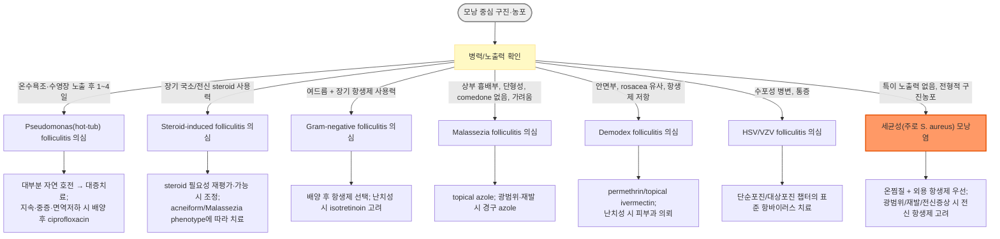

# 모낭염 Folliculitis

## <mark style="color:green;">일반 사항</mark>

* 모낭의 감염성 또는 비감염성 염증으로, 모낭을 중심으로 구진·농포가 발생함
* 호발 부위 : 두피, 얼굴/수염 부위, 몸통, 엉덩이, 사지
* 경과 : 표재성 세균성 모낭염은 대부분 흉터 없이 호전되지만(약 7\~10일), 재발성·심부 감염에서는 염증 후 색소침착 또는 흉터가 남을 수 있음
  * 깊어지면 furunculosis로 진행할 수 있음 (☞ [종기](170_-abscess-furunculosis.md))
* **Sycosis barbae** : 수염 부위에 발생하는 깊고 만성적인 세균성 모낭염으로, 흉터성 탈모를 남길 수 있음

## <mark style="color:green;">원인 및 위험 인자</mark>

### <mark style="color:orange;">감염성</mark>

#### <mark style="color:$primary;">세균</mark>

* *Staphylococcus aureus* : 가장 흔함
* *Pseudomonas aeruginosa* : 오염된 수영장·온수욕조(hot-tub folliculitis)
* *Aeromonas hydrophila* : 담수 노출 후 발생 가능
* 면역저하자에서는 *Klebsiella, Enterobacter, Proteus* 등 그람음성균 감염도 고려
* **Gram-negative folliculitis** : 여드름 환자가 장기간 항생제를 사용한 뒤 발생하는 경우가 대표적

#### <mark style="color:$primary;">진균/효모</mark>

* **Malassezia folliculitis**(과거 Pityrosporum folliculitis) : 청소년·젊은 성인, 고온다습·발한·폐쇄·항생제 사용과 관련; 상부 흉부·등·어깨·얼굴/헤어라인에 호발
* Candida

#### <mark style="color:$primary;">바이러스</mark>

* HSV, VZV

#### <mark style="color:$primary;">기생충</mark>

* Demodex

### <mark style="color:orange;">비감염성</mark>

* acneiform/drug-induced folliculitis
  * 주요 원인 약물 : systemic corticosteroids, androgens, lithium, iodide/bromide 등 halogens, EGFR inhibitors(erlotinib, gefitinib, cetuximab 등), MEK inhibitors, 일부 면역억제제·항경련제 등
* steroid-induced folliculitis
* occlusive folliculitis
* eosinophilic folliculitis
* pruritic folliculitis of pregnancy

### <mark style="color:orange;">위험 인자</mark>

* 제모 : 면도, 뽑기, 왁싱, 반복적인 피부 자극
* 마찰·발한·조이는 옷·드레싱 등에 의한 밀폐
* 오염된 수영장·온수욕조
* 장기간 항생제 사용
* 국소 또는 전신 steroid 사용
* 당뇨병, 영양실조, 면역저하
* MRSA 감염자와의 밀접 접촉

## <mark style="color:green;">임상 양상</mark>

* 모낭을 중심으로 주변 발적을 동반한 작은(약 1\~5 ㎜) 구진·농포가 발생
* **전형적 세균성 모낭염**은 비교적 급성으로 발생하고 단기간에 호전하는 경우가 흔함
* 가려움, 작열감, 경도의 압통이 동반될 수 있으며 심한 통증은 흔하지 않음
* **Pseudomonas(hot-tub) folliculitis** : 오염된 물 노출 후 수일 이내 가려움·압통을 동반한 구진농포가 발생하며, 수영복으로 덮인 부위에 흔함
* **Malassezia folliculitis** : 가려운 단형성(monomorphic) 모낭성 구진·농포가 상부 흉부·등·어깨·얼굴/헤어라인에 발생
  * 면포(comedone)가 없는 것이 acne vulgaris와의 중요한 감별점
  * 항생제 치료에 반응하지 않거나 악화될 수 있음
* **Steroid-induced acneiform eruption/folliculitis** : 얼굴·몸통에 비슷한 크기의 단형성 구진·구진농포가 국소 또는 전신 steroid 치료 중 발생

### <mark style="color:orange;">임상 아형 요약표</mark>

<table><thead><tr><th width="150">아형</th><th width="230">호발 부위 / 특징</th><th width="160">주요 원인</th><th>1차 치료 방향</th></tr></thead><tbody><tr><td>세균성(전형적)</td><td>부위 무관, 산발적 구진농포</td><td>S. aureus</td><td>온찜질 + 외용 항생제</td></tr><tr><td>Pseudomonas(hot-tub)</td><td>수영복 덮인 부위, 노출 1\~4일 후 발생</td><td>P. aeruginosa</td><td>대증치료(대부분 자연 호전)</td></tr><tr><td>Malassezia</td><td>상부 흉배부·어깨, 단형성, comedone 없음, 가려움 흔함</td><td>Malassezia spp.</td><td>topical/경구 azole</td></tr><tr><td>Gram-negative</td><td>여드름 환자, 장기 항생제 사용력</td><td>Klebsiella, Enterobacter, Proteus 등</td><td>배양 후 항생제; 난치성 isotretinoin</td></tr><tr><td>Demodex</td><td>안면부, rosacea 유사, 스테로이드/항생제 저항</td><td>Demodex spp.</td><td>permethrin/topical ivermectin</td></tr><tr><td>Steroid-induced</td><td>얼굴·몸통, 단형성, 국소/전신 steroid 사용력</td><td>비감염성</td><td>steroid 필요성 재평가·가능 시 조정 + phenotype별 치료</td></tr><tr><td>HSV/VZV</td><td>수포성, 통증 동반</td><td>HSV, VZV</td><td>항바이러스제</td></tr></tbody></table>

### <mark style="color:$danger;">🚩 Red Flags!</mark>

<mark style="color:$danger;">**즉각 조치 또는 의뢰**</mark>

* 빠르게 진행하는 cellulitis, 괴사, 저혈압·의식 변화 등 전신독성/패혈증 소견
* 안면 중심부의 중증 감염에서 안와 또는 두개내 합병증이 의심되는 경우

<mark style="color:$warning;">**당일 또는 조기 의뢰**</mark>

* 면역저하자의 광범위·빠르게 진행하는 병변
* 반복되는 깊은 농양·furunculosis, 광범위한 치료 실패
* 두피 모낭염에 흉터성 탈모가 동반되는 경우 → folliculitis decalvans, dissecting cellulitis 등 감별 위해 피부과 의뢰

<mark style="color:$info;">**외래 추적 / 추가 평가 계획**</mark> <mark style="color:$info;">- 즉각 위험 낮으나 호전 없으면 의뢰</mark>

* 반복되는 단순 모낭염 : 배양, 면도·마찰·폐쇄·항생제 사용 등 유발인자 및 필요 시 탈집락 여부 평가

## <mark style="color:green;">진단</mark>

* 전형적인 경증 모낭염은 임상적으로 진단하며 검사가 필요하지 않은 경우가 많음
* **세균 배양검사 고려**
  * 반복 재발 또는 적절한 치료에도 호전되지 않는 경우
  * 광범위·중증 또는 깊은 감염
  * MRSA, Pseudomonas 또는 비전형적 균이 의심되는 경우
  * 면역저하자
* Malassezia/진균 감염이 의심되면 농포 또는 모낭 내용물을 채취하여 KOH 또는 Gram/MGG(May-Grünwald-Giemsa) 염색 등을 고려
  * 다수의 원형·난원형 **unipolar budding yeast**가 관찰되면 Malassezia folliculitis 진단을 지지하며, hyphae는 흔하지 않음
* 반복·광범위·난치성 모낭염에서는 당뇨병, 면역억제 약물 등 기저 위험인자를 평가
  * HIV 검사는 위험요인, 다른 면역저하 소견 또는 eosinophilic folliculitis 등이 있을 때 고려

### <mark style="color:orange;">감별 진단</mark>

<table><thead><tr><th width="150">질환</th><th width="260">모낭염과의 차이점</th><th>핵심 감별 포인트</th></tr></thead><tbody><tr><td>Acne vulgaris</td><td>모낭피지선 단위의 만성 염증성 질환</td><td>comedone 동반이 acne vulgaris를 지지하며, 전형적 bacterial/Malassezia folliculitis에서는 없음</td></tr><tr><td>Pseudofolliculitis barbae</td><td>곱슬모가 피부를 뚫고 재진입하며 발생하는 이물 반응성 염증</td><td>면도 부위(주로 턱·목)에 국한, 배양 음성, 항생제 반응 없음</td></tr><tr><td>Rosacea</td><td>안면 중앙부의 만성 혈관·염증성 질환</td><td>홍조·모세혈관확장 동반, comedone 없음, 만성 재발 경과</td></tr><tr><td>Perioral dermatitis</td><td>입 주위 국한된 구진성 발진</td><td>입 주위 홍반성 구진, 국소 steroid 사용력 흔함</td></tr><tr><td>Keratosis pilaris</td><td>모낭 각화 이상에 의한 만성 양상</td><td>비염증성 각질성 구진, 상완 후면·대퇴부 호발, 만성 무통성</td></tr><tr><td>Tinea barbae</td><td>피부사상균에 의한 수염 부위 감염</td><td>KOH/진균 검사 양성, 부러지거나 쉽게 빠지는 수염, 염증성 plaque/kerion 양상, 항생제 무반응</td></tr><tr><td>Hidradenitis suppurativa</td><td>모낭 폐쇄와 아포크린샘 부위의 만성 화농성 질환</td><td>겨드랑이·서혜부·둔부에 반복되는 결절·동루(sinus tract), 흉터 형성</td></tr></tbody></table>

* 두피 병변에서 흉터성 탈모가 동반되면 folliculitis decalvans, dissecting cellulitis 등 반흉터성 모낭염 스펙트럼 고려 → 피부과 의뢰

***



<p align="center"><strong>모낭염 감별 및 치료 접근 알고리듬</strong></p>

<p align="center"><em><mark style="color:$info;">Ref. 저자 종합(임상 소견·노출력 기반 분류)</mark></em></p>

***

## <mark style="background-color:$warning;">Management</mark>


경증·국소 병변은 위생 관리와 대증치료만으로 대부분 호전되며, 원인(세균성/Pseudomonas/Malassezia/Demodex/HSV 등)에 따라 치료 방향이 달라짐


## <mark style="color:green;">비-약물 치료 및 예방</mark>

### <mark style="color:orange;">치료 방침</mark>

* 경증·국소 병변은 위생 관리, 마찰·폐쇄 회피, 온찜질 등의 보존적 치료만으로 호전될 수 있음
* 온찜질 또는 습윤 드레싱
* benzoyl peroxide : 세균성 모낭염의 보조 치료로 **5% wash를 샤워 시 5\~7일** 사용할 수 있음
  * 국내 제형에 따라 2.5\~10% benzoyl peroxide 겔 qd(hs)\~bid를 보조적으로 고려 <mark style="color:blue;">\[파티마 겔]</mark>(../%EB%B9%84%EB%B3%B4%ED%97%98/) (☞ p.944)

### <mark style="color:orange;">예방</mark>

* 발한·마찰·밀폐를 줄이고 유성(oily) 피부제품의 과도한 사용을 피함
* 면도 시
  * 깨끗하고 날카로운 면도기 사용
  * 털이 자라는 방향으로 면도
  * 지나치게 밀착 면도하지 않음
  * 면도기 공유 금지 및 정기적인 세척·교체
  * 반복되는 면도 관련 병변에서는 pseudofolliculitis barbae를 감별
* 피부 위생 관리 (☞ [피부감염](165_-skin-and-soft-tissue-infection.md))

### <mark style="color:orange;">반복되는 S. aureus 감염의 탈집락(decolonization)</mark>

* **routine으로 시행하지 않으며**, 위생 관리와 적절한 감염 치료에도 재발이 지속되는 경우 선택적으로 고려
* 비강 mupirocin bid ×5일
* chlorhexidine body wash 등 피부 소독 및 수건·침구·의복 등 개인 물품 세척
* 대안으로 희석 표백제 목욕을 고려할 수 있음
  * 예 : 가정용 표백제 ¼컵/13갤런(약 49 L), 15분, 주 2회
  * 제품별 sodium hypochlorite 농도가 다를 수 있으므로 임의로 더 진하게 사용하지 않도록 주의
* **경구 항생제는 활동성 감염 치료에 사용하며, routine decolonization 목적으로 장기간 사용하지 않음**
* 탈집락의 근거는 제한적이며 반복 감염의 임상 상황에 따라 개별적으로 판단

## <mark style="color:green;">약물 치료</mark>


아래 용량은 **성인 표준 용량의 예시**이며, 연령·체중·신기능·간기능·약물상호작용 및 배양/감수성 결과에 따라 조정한다.


### <mark style="color:orange;">세균성 모낭염</mark>

* 경증·국소 병변은 외용제를 우선 고려
* **전신 항생제는 routine으로 필요하지 않음**
  * 광범위 병변, 깊은 감염, 반복 재발, cellulitis 동반 또는 전신 증상이 있는 경우 고려

#### <mark style="color:$primary;">외용제</mark>

* mupirocin <mark style="color:blue;">\[에스로반]</mark>
* clindamycin <mark style="color:blue;">\[크레오신 티 액]</mark>(../%EB%B9%84%EB%B3%B4%ED%97%98/)
* 병변 범위와 임상 반응에 따라 보통 5\~10일 정도 사용

#### <mark style="color:$primary;">MSSA(methicillin-susceptible S. aureus)</mark>

* 광범위하거나 외용제만으로 부족한 경우 고려
* cephalexin : 250\~500 ㎎ qid ×5\~10d <mark style="color:blue;">\[팔렉신]</mark>
* dicloxacillin : 250\~500 ㎎ qid ×5\~10d

#### <mark style="color:$primary;">MRSA</mark>

* 단순 모낭염에서 일률적인 경험적 MRSA 치료는 필요하지 않음
* MRSA 위험이 높거나 배양에서 확인된 경우 감수성에 따라 선택
  * TMP/SMX : 160/800 ㎎ bid ×5\~10d <mark style="color:blue;">\[셉트린]</mark>
  * doxycycline : 100 ㎎ bid ×5\~10d
* 농양이 동반되면 절개배농 필요 여부를 우선 평가
* 상세한 MRSA 항생제 선택 및 치료 (☞ [피부감염](165_-skin-and-soft-tissue-infection.md))

#### <mark style="color:$primary;">Pseudomonas(hot-tub) folliculitis</mark>

* 대부분 자연 호전하므로 **항생제는 routine으로 필요하지 않음**
* 오염된 수영장·온수욕조 사용을 중단하고 냉·습포 등 대증치료
  * 희석 acetic acid compress는 증상 완화 목적으로 선택적으로 고려할 수 있음
* 지속되거나 중증인 경우, 면역저하 또는 전신 증상이 동반되는 경우 배양검사 및 감수성에 따른 항녹농균 치료를 고려
  * ciprofloxacin : 500\~750 ㎎ bid ×7\~14d <mark style="color:blue;">\[씨프로바이]</mark> — 선택적 사용

#### <mark style="color:$primary;">여드름 환자의 Gram-negative folliculitis</mark>

* 장기간 항생제 치료 중인 여드름 환자에서 발생하는 경우가 대표적
* 배양검사 후 원인균 및 감수성에 따라 치료
* 난치성에서는 isotretinoin을 고려할 수 있음 (☞ p.946)

### <mark style="color:orange;">Malassezia folliculitis</mark>

* acne vulgaris 또는 세균성 모낭염으로 오인하여 불필요한 항생제를 지속하지 않도록 주의
* 경증·국소 병변
  * ketoconazole 2% 샴푸 : 3\~5분간 유지, 2회/주 ×2\~4주, 이후 필요 시 유지요법 <mark style="color:blue;">\[니조랄]</mark>
  * selenium sulfide 2.5% 샴푸 : 2\~3분간 유지, 2회/주 ×2주, 이후 필요 시 유지요법
  * econazole 크림 : bid ×2\~3wk <mark style="color:blue;">\[에코라]</mark>
* 광범위·중등도 이상 또는 외용치료에 반응하지 않는 경우 경구 azole을 고려
  * itraconazole : 200 ㎎/d ×7\~14d <mark style="color:blue;">\[스포라녹스]</mark>
  * 또는 fluconazole : 100\~200 ㎎/d ×1\~3wk <mark style="color:blue;">\[푸루나졸]</mark>
  * 경구 azole 사용 전 간질환과 주요 약물상호작용을 확인
* 반복 재발 시 고온다습, 발한, 폐쇄, 장기간 항생제 사용 등의 유발인자를 교정

### <mark style="color:orange;">Demodex folliculitis</mark>

* 진단이 불확실하면 rosacea, perioral dermatitis 등과 감별
* permethrin 5% : 이환부 도포 후 세척 <mark style="color:blue;">\[오메크린 크림]</mark>(../%EB%B9%84%EB%B3%B4%ED%97%98/)
* topical ivermectin 1% <mark style="color:blue;">[수란트라크림]</mark>을 고려할 수 있음 — Demodex folliculitis에는 off-label
* 경구 ivermectin은 표준화된 단일 regimen이 확립되어 있지 않으므로 routine으로 제시하지 않으며, 중증·난치성 또는 진단이 불확실한 경우 피부과 진료를 권고

### <mark style="color:orange;">HSV/VZV folliculitis</mark>

* HSV 또는 VZV 감염이 의심되면 해당 질환의 표준 항바이러스 치료를 적용
* 구체적 치료 (☞ [단순포진](181_-herpes-simplex.md#management))

***

### <mark style="color:red;">질병코드</mark>

L73　기타 모낭장애

L73.1　수염 거짓모낭염(pseudofolliculitis barbae)

L73.8　기타 명시된 모낭장애 — sycosis barbae 포함

L73.9　상세불명의 모낭장애


**청구 시 주의** : 일반적인 세균성 모낭염에서 L73.8 또는 L73.9 중 어떤 코드를 적용할지는 기관별 진단명 매핑·청구 실무를 확인 후 선택한다.


***

## <mark style="color:purple;">처방례</mark>

> **처방례 1. 국소 경증 세균성 모낭염**
>
> ```
> 에스로반 연고 10 g/tube bid
> ```
>
> _✽경증·국소 병변은 외용 항생제만으로 충분한 경우가 많으며, 5\~10일 정도 사용 후 재평가한다._

> **처방례 2. 광범위 세균성 모낭염(MSSA 의심)**
>
> ```
> 에스로반 연고 10 g/tube  bid
> 팔렉신 500 ㎎/C  4C #4  qid
> ```
>
> _✽전신 항생제는 광범위 병변, 깊은 감염, cellulitis 동반 또는 전신 증상 등 적응증이 있을 때 사용한다._

> **처방례 3. MRSA 의심/배양 확인**
>
> ```
> 에스로반 연고 10 g/tube  bid
> 셉트린정 2정  bid #5
> ```
>
> _✽경험적 MRSA 커버는 routine이 아니며, MRSA 위험인자(과거력, 유행 지역, 배양 확인) 또는 치료 실패 시에 한해 감수성 결과에 따라 선택한다. 농양이 동반되면 절개배농을 우선 평가한다. 반복성 S. aureus 감염의 탈집락은 별도 탈집락 항목을 참조한다._

> **처방례 4. Malassezia folliculitis**
>
> ```
> 니조랄 샴푸  국소, 2회/주 ×2\~4주 (3\~5분 유지 후 세척)
> ```
>
> _✽상부 흉배부·어깨의 단형성 구진농포이면서 comedone이 없고 기존 항생제 치료에 반응하지 않거나 악화된 경우 우선 고려한다._

> **처방례 5. 지속·중증 Pseudomonas(hot-tub) folliculitis**
>
> ```
> 씨프로바이정 500 ㎎  bid #7
> ```
>
> _✽대부분 7\~10일 내 자연 호전하므로 1차로 대증치료를 우선하며, 본 처방은 지속·광범위·전신증상 동반·면역저하 등 예외적 상황에서 배양 결과와 함께 고려한다._

***

### <mark style="color:$success;">핵심 복약 지도</mark>

> **외용 항생제 사용법**
>
> * mupirocin(에스로반) 연고는 병변 부위에 1일 2\~3회 얇게 도포한다.
> * 증상이 먼저 호전되어도 처방된 기간(보통 5\~10일)은 채워 사용하도록 안내한다.

> **전신 항생제 처방 원칙**
>
> * 전신 항생제는 광범위·깊은 감염이나 전신 증상이 있을 때만 사용하며, 단순 국소 모낭염에는 routine으로 처방하지 않는다.
> * MRSA 경험적 커버가 필요한 상황인지 매번 재평가한다(배양 확인 또는 위험인자 존재 시에 한함).

> **면도·제모 관리 안내**
>
> * 날카롭고 청결한 면도기를 사용하고 털이 자라는 방향으로 면도하도록 지도한다.
> * 면도 후 알코올 등 자극적인 소독제 도포는 피부염을 악화시킬 수 있어 권하지 않는다.

> **탈집락(표백제 목욕) 처방 시 주의**
>
> * 희석 예시(가정용 표백제 ¼컵/물 13갤런)와 빈도(주 2회, 15분)를 초과하지 않도록 명확히 안내한다.
> * 제품별 sodium hypochlorite 농도가 다를 수 있으므로 임의로 더 진하게 사용하지 않도록 설명한다.
> * 피부 자극·탈색이 발생하면 즉시 중단하도록 설명한다.
> * 경구 항생제 장기 예방 투여는 시행하지 않음을 안내한다.

> **언제 다시 병원을 방문해야 하나요?**
>
> * 치료에도 5\~7일 이상 호전이 없거나 오히려 악화되는 경우
> * 발열, 광범위한 발적·부종 등 cellulitis가 의심되는 경우 — 즉시 내원
> * 두피 병변에서 탈모나 흉터가 진행되는 경우

***

### <mark style="color:blue;">환자 안내서</mark>


**모낭염은 모낭 주위에 생기는 흔한 염증으로, 세균 감염이 가장 흔한 원인입니다.**

모낭염은 털이 자라나오는 작은 구멍(모낭) 주위에 생기는 염증으로, 여드름처럼 보이는 작은 발진이 특징입니다. 대부분 저절로 좋아지지만, 관리 방법에 따라 회복 속도와 재발 여부가 달라질 수 있습니다. 반복되거나 깊은 염증이 생기는 경우 색소침착·흉터가 남을 수 있으므로 잘 낫지 않거나 자주 재발하면 진료를 받으십시오.


#### <mark style="color:$primary;">왜 모낭염이 생기나요?</mark>

* 세균(주로 포도알균)이 모낭에 감염을 일으키는 경우가 가장 흔합니다.
* 면도, 왁싱, 꽉 끼는 옷, 땀, 오염된 수영장·온수욕조 이용 등이 모낭을 자극하거나 균이 들어가기 쉬운 환경을 만듭니다.
* 스테로이드 연고나 항생제를 오래 사용한 경우에도 발생할 수 있습니다.

#### <mark style="color:$primary;">일상생활에서 어떻게 관리하나요?</mark>

* **따뜻한 물수건으로 하루 여러 번 찜질하십시오.** 고름 배출과 염증 완화에 도움이 됩니다.
* **꽉 끼는 옷이나 땀에 젖은 옷을 오래 입지 마십시오.** 마찰과 습기가 악화 요인입니다.
* **면도는 털이 자라는 방향으로, 날카롭고 깨끗한 면도날로 하십시오.** 면도날은 다른 사람과 함께 쓰지 마십시오.
* **온수욕조·수영장 이용 후 발진이 생겼다면 사용을 중단하십시오.** 대부분 며칠 안에 저절로 좋아집니다.

#### <mark style="color:$primary;">약은 어떻게 사용하나요?</mark>

* 연고를 처방받았다면 증상이 좋아 보여도 처방된 기간만큼 꾸준히 바르십시오.
* 먹는 항생제는 반드시 처방된 용법·기간을 지키고, 임의로 중단하거나 다음에 남겨 두었다가 재사용하지 마십시오.

#### <mark style="color:$primary;">이럴 때는 즉시 병원을 방문하세요</mark>

* 열이 나거나 발진 주위가 빠르게 붉어지고 부어오르는 경우
* 통증이 심해지거나 발진이 빠르게 넓어지는 경우
* 두피에 생긴 발진 부위에서 머리카락이 빠지거나 흉터가 생기는 것 같은 경우
