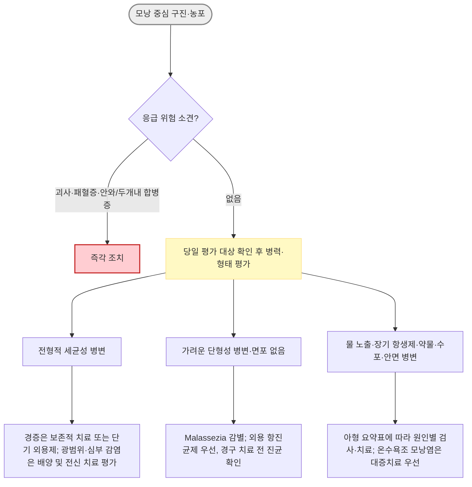

# 모낭염 Folliculitis

## <mark style="color:green;">일반 사항</mark>

* 모낭의 감염성 또는 비감염성 염증으로, 모낭을 중심으로 구진·농포가 발생함
* 호발 부위 : 두피, 얼굴/수염 부위, 몸통, 엉덩이, 사지
* 경과 : 표재성 세균성 모낭염은 대개 수일\~2주 내 흉터 없이 호전되지만, 재발성·심부 감염에서는 염증 후 색소침착 또는 흉터가 남을 수 있음
  * 깊어지면 furunculosis로 진행할 수 있음 (☞ [종기](170_-abscess-furunculosis.md))
* **Sycosis barbae** : 수염 부위에 발생하는 깊고 만성적인 세균성 모낭염으로, 흉터성 탈모를 남길 수 있음

## <mark style="color:green;">원인 및 위험 인자</mark>

### <mark style="color:orange;">감염성</mark>

#### <mark style="color:$primary;">세균</mark>

* *Staphylococcus aureus* : 가장 흔함
* *Pseudomonas aeruginosa* : 오염된 수영장·온수욕조(hot-tub folliculitis)
* *Aeromonas hydrophila* : 담수 노출 후 드물게 발생 가능; 빠르게 진행하는 통증·부종은 단순 모낭염보다 깊은 연조직 감염을 우선 평가
* 면역저하자에서는 *Klebsiella, Enterobacter, Proteus* 등 그람음성균 감염도 고려
* **Gram-negative folliculitis** : 여드름 환자가 장기간 항생제를 사용한 뒤 발생하는 경우가 대표적

#### <mark style="color:$primary;">진균/효모</mark>

* **Malassezia folliculitis**(과거 Pityrosporum folliculitis) : 청소년·젊은 성인, 고온다습·발한·폐쇄·항생제 사용과 관련; 상부 흉부·등·어깨·얼굴/헤어라인에 호발
* Candida; 피부사상균에 의한 모낭 감염(tinea barbae, Majocchi granuloma 등)도 감별

#### <mark style="color:$primary;">바이러스</mark>

* HSV, VZV

#### <mark style="color:$primary;">기생충</mark>

* Demodex

### <mark style="color:orange;">비감염성</mark>

* acneiform/drug-induced folliculitis
  * 주요 원인 약물 : systemic corticosteroids, androgens, lithium, iodide/bromide 등 halogens, EGFR inhibitors(erlotinib, gefitinib, cetuximab 등), MEK inhibitors, 일부 면역억제제·항경련제 등
* occlusive folliculitis
* eosinophilic folliculitis
* pruritic folliculitis of pregnancy
* steroid 사용 후 단형성 발진에는 비감염성 여드름모양 발진과 Malassezia 모낭염이 모두 가능하므로, 약물 사용력만으로 원인을 확정하지 않음

### <mark style="color:orange;">위험 인자</mark>

* 제모 : 면도, 뽑기, 왁싱, 반복적인 피부 자극
* 마찰·발한·조이는 옷·드레싱 등에 의한 밀폐
* 오염된 수영장·온수욕조
* 장기간 항생제 사용
* 국소 또는 전신 steroid 사용
* 당뇨병, 영양실조, 면역저하
* MRSA 감염자와의 밀접 접촉

## <mark style="color:green;">임상 양상</mark>

* 모낭을 중심으로 주변 발적을 동반한 작은(약 1\~5 ㎜) 구진·농포가 발생
* **전형적 세균성 모낭염**은 비교적 급성으로 발생하고 단기간에 호전하는 경우가 흔함
* 가려움, 작열감, 경도의 압통이 동반될 수 있으며 심한 통증은 흔하지 않음
* **Pseudomonas(hot-tub) folliculitis** : 오염된 물 노출 후 수일 이내 가려움·압통을 동반한 구진농포가 발생하며, 수영복으로 덮인 부위에 흔함
* **Malassezia folliculitis** : 가려운 단형성(monomorphic) 모낭성 구진·농포가 상부 흉부·등·어깨·얼굴/헤어라인에 발생
  * 면포(comedone)가 없는 것이 acne vulgaris와의 중요한 감별점
  * 항생제 치료에 반응하지 않거나 악화될 수 있음
* **Steroid-induced acneiform eruption/folliculitis** : 얼굴·몸통에 비슷한 크기의 단형성 구진·구진농포가 국소 또는 전신 steroid 치료 중 발생

### <mark style="color:orange;">임상 아형 요약표</mark>

<table><thead><tr><th width="150">아형</th><th width="230">호발 부위 / 특징</th><th width="160">주요 원인</th><th>1차 치료 방향</th></tr></thead><tbody><tr><td>세균성(전형적)</td><td>부위 무관, 산발적 구진농포</td><td>S. aureus</td><td>보존적 치료; 필요 시 단기 외용 항생제</td></tr><tr><td>Pseudomonas(hot-tub)</td><td>수영복 덮인 부위, 노출 후 수일 이내 발생</td><td>P. aeruginosa</td><td>대증치료(대부분 자연 호전)</td></tr><tr><td>Malassezia</td><td>상부 흉배부·어깨, 단형성, comedone 없음, 가려움 흔함</td><td>Malassezia spp.</td><td>외용 항진균제 우선; 광범위·난치성·면역저하 시 경구 azole 고려</td></tr><tr><td>Gram-negative</td><td>여드름 환자, 장기 항생제 사용력</td><td>Klebsiella, Enterobacter, Proteus 등</td><td>배양 후 항생제; 난치성 isotretinoin</td></tr><tr><td>Demodex</td><td>안면부, rosacea 유사, 스테로이드/항생제 저항</td><td>Demodex spp.</td><td>진단 확인 후 topical ivermectin 등; 허가 외 사용</td></tr><tr><td>Steroid-induced</td><td>얼굴·몸통, 단형성, 국소/전신 steroid 사용력</td><td>비감염성 발진 또는 Malassezia</td><td>steroid 필요성 재평가·가능 시 조정 + phenotype별 치료</td></tr><tr><td>HSV/VZV</td><td>수포성, 통증 동반</td><td>HSV, VZV</td><td>항바이러스제</td></tr></tbody></table>

### <mark style="color:$danger;">🚩 Red Flags!</mark>

<mark style="color:$danger;">**즉각 조치**</mark>

* 괴사·출혈성 수포, 외관에 비해 심한 통증, 수시간 단위의 빠른 진행 등 괴사성 연조직 감염 의심
* 저혈압·의식 변화 등 전신독성/패혈증 소견
* 안면 중심부 감염에서 안구운동통·시력 저하·안구돌출 또는 심한 두통·신경학적 이상 등 안와/두개내 합병증 의심

<mark style="color:$warning;">**당일 평가**</mark>

* 주변 발적·열감·부종이 빠르게 퍼지는 cellulitis 또는 발열을 동반한 광범위 병변
* 면역저하자의 광범위·빠르게 진행하는 병변; 호중구감소증에서 발열을 동반하면 즉각 조치
* 깊고 통증이 심한 결절·농양이 있어 절개배농 또는 전신 치료가 필요한 경우

<mark style="color:$info;">**조기 평가 및 추적**</mark>

* 두피 병변에 탈모·흉터가 진행하는 경우 : folliculitis decalvans, dissecting cellulitis 등 감별 위해 피부과 조기 의뢰
* 반복되는 깊은 감염 또는 적절한 치료에도 호전되지 않는 광범위 병변 : 배양 및 피부과 평가; 악화·전신 증상이 있으면 당일 평가
* 반복되는 단순 모낭염 : 면도·마찰·폐쇄·항생제 사용 등 유발인자와 배양 결과를 확인하고 필요 시 탈집락 여부 평가

## <mark style="color:green;">진단</mark>

* 전형적인 경증 모낭염은 임상적으로 진단하며 검사가 필요하지 않은 경우가 많음
* **세균 배양검사 고려**
  * 반복 재발 또는 적절한 치료에도 호전되지 않는 경우
  * 광범위·중증 또는 깊은 감염
  * MRSA, Pseudomonas 또는 비전형적 균이 의심되는 경우
  * 면역저하자
  * 가능하면 항생제 투여 전에 새 농포의 고름 또는 농양 내용물을 채취함
* Malassezia/진균 감염이 의심되면 농포 또는 모낭 내용물을 채취하여 KOH 또는 Gram/MGG(May-Grünwald-Giemsa) 염색 등을 고려
  * 다수의 원형·난원형 **unipolar budding yeast**가 관찰되면 진단을 지지하며, hyphae는 흔하지 않음
  * Malassezia는 정상 피부 상재균이므로 피부 표면에서 효모가 관찰되는 것만으로 확진하지 않으며, 모낭 내용물의 소견과 임상 양상을 함께 판단
  * 경구 항진균제를 시작하기 전에는 가능하면 직접 현미경검사로 확인; 진단이 불확실하거나 난치성이면 피부생검 등을 고려
* Demodex 의심 시 피부 긁기·표준화 피부표면생검 등으로 밀도를 평가; 진드기 검출만으로 원인 질환을 확정하지 않음
* 수포·미란·통증을 동반한 비전형적 병변은 HSV/VZV PCR을 고려
* 반복·광범위·난치성 모낭염에서는 당뇨병, 면역억제 약물 등 기저 위험인자를 평가
  * HIV 검사는 위험요인, 다른 면역저하 소견 또는 eosinophilic folliculitis 등이 있을 때 고려

### <mark style="color:orange;">감별 진단</mark>

<table><thead><tr><th width="150">질환</th><th width="260">모낭염과의 차이점</th><th>핵심 감별 포인트</th></tr></thead><tbody><tr><td>Acne vulgaris</td><td>모낭피지선 단위의 만성 염증성 질환</td><td>comedone 동반이 acne vulgaris를 지지하며, 전형적 bacterial/Malassezia folliculitis에서는 없음</td></tr><tr><td>Pseudofolliculitis barbae</td><td>곱슬모가 피부를 뚫고 재진입하며 발생하는 이물 반응성 염증</td><td>면도·제모 부위(주로 턱·목)의 매몰모가 핵심; 원래 비감염성이지만 이차 세균 감염이 동반될 수 있고 일부 외용 항생제는 염증 완화에 도움이 될 수 있음</td></tr><tr><td>Rosacea</td><td>안면 중앙부의 만성 혈관·염증성 질환</td><td>홍조·모세혈관확장 동반, comedone 없음, 만성 재발 경과</td></tr><tr><td>Perioral dermatitis</td><td>입·코·눈 주위의 구진성 발진</td><td>입 주위 홍반성 구진, 국소 steroid 사용력 흔함</td></tr><tr><td>Keratosis pilaris</td><td>모낭 각화 이상에 의한 만성 양상</td><td>각질성 구진, 상완 후면·대퇴부 호발, 만성 무통성; 모낭 주변 홍반이 동반될 수 있음</td></tr><tr><td>Tinea barbae</td><td>피부사상균에 의한 수염 부위 감염</td><td>KOH/진균 검사 양성, 부러지거나 쉽게 빠지는 수염, 염증성 plaque/kerion 양상, 항생제 무반응</td></tr><tr><td>Hidradenitis suppurativa</td><td>주로 피부가 접히는 부위에 발생하는 모낭 기원의 만성 염증성 질환</td><td>겨드랑이·서혜부·둔부에 반복되는 결절·동루(sinus tract), 흉터 형성</td></tr></tbody></table>

* 깊은 진균성 결절이나 steroid 사용 후 비전형적 병변에서는 Majocchi granuloma 등을 감별; 단순 외용제만으로 치료하지 않으며 피부과 평가
* 심한 가려움의 재발성 무균성 모낭성 발진에서는 eosinophilic folliculitis를 고려하고 피부생검 및 기저 면역저하 평가
* 두피 병변에서 흉터성 탈모가 동반되면 folliculitis decalvans, dissecting cellulitis 등 흉터성 탈모를 일으키는 질환 고려 → 피부과 의뢰

***


```mermaid
graph TD
    Start(["모낭 중심 구진·농포"]) ---> Risk{"응급 위험 소견?"}
    Risk --->|"괴사·패혈증·안와/두개내 합병증"| Urgent["즉각 조치"]
    Risk --->|"없음"| Assess["당일 평가 대상 확인 후 병력·형태 평가"]
    Assess ---> Bact["전형적 세균성 병변"]
    Assess ---> Malz["가려운 단형성 병변·면포 없음"]
    Assess ---> Special["물 노출·장기 항생제·약물·수포·안면 병변"]
    Bact ---> BactTx["경증은 보존적 치료 또는 단기 외용제; 광범위·심부 감염은 배양 및 전신 치료 평가"]
    Malz ---> MalzTx["Malassezia 감별; 외용 항진균제 우선, 경구 치료 전 진균 확인"]
    Special ---> OtherTx["아형 요약표에 따라 원인별 검사·치료; 온수욕조 모낭염은 대증치료 우선"]
    style Start fill:#eeeeee,stroke:#888888,stroke-width:2px
    style Urgent fill:#ffcdd2,stroke:#c62828,stroke-width:2px
    style Assess fill:#fff9c4,stroke:#ffe082
```

<p align="center"><strong>모낭염 감별 및 치료 접근 알고리듬</strong></p>

<p align="center"><em><mark style="color:$info;">Ref. 저자 종합(임상 소견·노출력 기반 분류)</mark></em></p>

***

## <mark style="background-color:$warning;">Management</mark>


경증·국소 세균성 병변은 위생 관리와 대증치료만으로 호전될 수 있으며, 원인(세균성/Pseudomonas/Malassezia/Demodex/HSV 등)에 따라 치료 방향이 달라짐


## <mark style="color:green;">비-약물 치료 및 예방</mark>

### <mark style="color:orange;">치료 방침</mark>

* 경증·국소 병변은 위생 관리, 마찰·폐쇄 회피, 온찜질 등의 보존적 치료만으로 호전될 수 있음
* 따뜻한 찜질을 10\~15분씩 하루 3\~4회 시행할 수 있음; 뜨거운 찜질과 장시간 밀폐 드레싱은 피함
* benzoyl peroxide : 세균성 모낭염의 보조 치료로 **5% wash를 샤워 시 5\~7일** 사용할 수 있음
  * 국내에서는 benzoyl peroxide 2.5% 겔을 소량 qd(hs)로 시작하고 내약성에 따라 bid로 증량 가능 <mark style="color:blue;">\[파티마겔2.5%]</mark>(../%EB%B9%84%EB%B3%B4%ED%97%98/); 모낭염에는 허가 외 사용
  * wash와 바른 채 두는 겔은 제형·사용법이 다름; 건조·자극과 모발·옷감 탈색에 주의 (☞ p.944)

### <mark style="color:orange;">예방</mark>

* 발한·마찰·밀폐를 줄이고 유성(oily) 피부제품의 과도한 사용을 피함
* 면도 시
  * 깨끗하고 날카로운 면도기 사용
  * 털이 자라는 방향으로 면도
  * 지나치게 밀착 면도하지 않음
  * 면도기 공유 금지 및 정기적인 세척·교체
  * 반복되는 면도 관련 병변에서는 pseudofolliculitis barbae를 감별
* 병변이 있는 동안 면도·왁싱을 쉬고, 고름을 짜거나 바늘로 터뜨리지 않음
* 온수욕조·수영장 이용 후 수영복을 벗고 비누로 씻으며 수영복도 세탁함
* 피부 위생 관리 (☞ [피부감염](165_-skin-and-soft-tissue-infection.md))

### <mark style="color:orange;">반복되는 S. aureus 감염의 탈집락(decolonization)</mark>

* **routine으로 시행하지 않으며**, 위생 관리와 적절한 감염 치료에도 재발이 지속되는 경우 선택적으로 고려
* 지침의 예 : 비강용 mupirocin 2% bid ×5일 + chlorhexidine body wash 매일 ×5일 + 수건·침구·의복 등 개인 물품 매일 세척
  * **에스로반 등 피부용 mupirocin 연고는 비강·점막 사용 제형이 아니며 국내 설명서에서 이러한 사용을 피하도록 안내함**; 피부용 연고를 비강용 제형과 동일하게 처방하지 않음
  * 국내 비강용 제형 예 : <mark style="color:blue;">\[에스와이무피로신나잘연고]</mark>; 국내 허가는 특정 고위험군의 비강 MRSA 제균이며, 용법은 tid·필요한 최소 기간(약 3일)임. 위 IDSA의 bid ×5일 요법 및 일반 재발성 MSSA 감염의 탈집락과 허가 범위가 다르므로 구분하여 사용함
  * chlorhexidine은 눈·귀·점막을 피하고 제품별 세척·희석 지시를 따름
* 대안으로 희석 표백제 목욕을 선택적으로 고려
  * 목표 sodium hypochlorite 농도 약 **0.005%**; 원액의 표시 농도와 물의 양을 확인하여 처방
  * 예 : 5% 무향 원액 1 ㎖/물 1 L(물 50 L에 원액 50 ㎖), 또는 6% 원액 약 0.83 ㎖/물 1 L
  * 5\~10분, 주 2회 정도의 요법을 고려하되 기간·빈도는 개별화함; 손잡이 달린 컵 등 부정확한 계량 대신 ㎖로 안내
  * 원액을 피부에 직접 바르거나 다른 세정제·산성 제품과 혼합하지 않으며, 얼굴·눈·점막 노출을 피함; 자극이 있으면 중단
* **경구 항생제는 활동성 감염 치료에 사용하며, 일상적인 탈집락 목적으로 장기간 사용하지 않음**
* 근거는 주로 재발성 S. aureus 피부 감염·농양에서 얻어졌고 권고 강도와 근거 수준은 낮음; 모든 재발성 모낭염에 일률적으로 적용하지 않음

<mark style="color:$info;">Ref. [IDSA SSTI Guideline 2014](https://www.idsociety.org/practice-guideline/skin-and-soft-tissue-infections/); 표백제 농도·방법은 [AAD Bleach bath therapy](https://www.aad.org/public/diseases/eczema/childhood/itch-relief/bleach-bath) 참고(아토피피부염 환자 안내이므로 모낭염의 직접 근거와 구분)</mark>

## <mark style="color:green;">약물 치료</mark>


아래 용량은 **성인 표준 용량의 예시**이며, 연령·체중·신기능·간기능·약물상호작용 및 배양/감수성 결과에 따라 조정함.


### <mark style="color:orange;">세균성 모낭염</mark>

* 경증·국소 병변은 외용제를 우선 고려
* **전신 항생제는 routine으로 필요하지 않음**
  * 광범위 병변, 깊은 감염, cellulitis 동반 또는 전신 증상이 있는 경우 고려
  * 반복 재발만으로 경구 항생제를 반복 처방하지 않으며 배양·원인 감별을 우선함

#### <mark style="color:$primary;">외용제</mark>

* mupirocin 2% 연고 : 얇게 도포, bid\~tid, 보통 5\~7일; 필요 시 최대 10일까지 <mark style="color:blue;">\[에스로반]</mark>
* clindamycin 1% 외용액 : bid, 보통 5\~7일 <mark style="color:blue;">\[크레오신티외용액1%]</mark>(../%EB%B9%84%EB%B3%B4%ED%97%98/); 국내 허가는 심상성여드름으로 모낭염에는 허가 외 사용
* 세균 감염이 의심되는 국소 병변에 단기간 사용; 장기·반복 사용은 내성 위험 때문에 피함
* 3\~5일 내 호전이 없거나 악화되면 배양·진단·치료를 재평가함

#### <mark style="color:$primary;">MSSA(methicillin-susceptible S. aureus)</mark>

* 광범위하거나 외용제만으로 부족한 경우 고려
* cephalexin : 250\~500 ㎎ qid ×5\~10d <mark style="color:blue;">\[팔렉신]</mark>
* dicloxacillin : 국외 지침의 선택지이며, 국내 처방례에서는 cephalexin을 우선 제시함

#### <mark style="color:$primary;">MRSA</mark>

* 단순 모낭염에서 일률적인 경험적 MRSA 치료는 필요하지 않음
* MRSA 위험이 높거나 배양에서 확인된 경우 감수성에 따라 선택
  * TMP/SMX : 160/800 ㎎ bid ×5\~10d <mark style="color:blue;">\[셉트린]</mark>; 1정은 TMP/SMX 80/400 ㎎이므로 **1회 2정**
    * 국내 모낭염 적응증은 허가사항에 포함되지 않으므로 허가 외 사용; 신기능·고칼륨혈증 위험 및 warfarin 등 상호작용 확인
  * doxycycline : 100 ㎎ bid ×5\~10d
* TMP/SMX·doxycycline의 연쇄구균 치료 효과는 불확실하므로 비화농성 cellulitis 동반 시 β-lactam 병용 등 별도 치료가 필요할 수 있음
* doxycycline은 임신 중 사용을 피하고, 소아는 연령·적응증에 따라 별도 판단함
* 농양이 동반되면 절개배농 필요 여부를 우선 평가
* 상세한 MRSA 항생제 선택 및 치료 (☞ [피부감염](165_-skin-and-soft-tissue-infection.md))

#### <mark style="color:$primary;">Pseudomonas(hot-tub) folliculitis</mark>

* 대부분 자연 호전하므로 **항생제는 routine으로 필요하지 않음**
* 오염된 수영장·온수욕조 사용을 중단하고 냉·습포 등 대증치료
* 지속되거나 중증인 경우, 면역저하 또는 전신 증상이 동반되는 경우 배양검사 및 감수성에 따른 항녹농균 치료를 고려
  * ciprofloxacin : 500\~750 ㎎ bid ×7\~14d <mark style="color:blue;">\[씨프로바이]</mark>; 경구 치료가 적절한 안정된 성인에서 감수성 확인 후 선택하고 반응에 따라 기간을 조정
  * 국내 씨프로바이정은 250 ㎎ 제형을 기준으로 1회 500 ㎎ = 2정; 750 ㎎ 증량은 중증 복합감염에서 별도로 판단함
  * 위 용법은 녹농균 피부·연조직 감염 치료를 참고한 예이며, 단순 hot-tub 모낭염의 표준 항생제 요법을 의미하지 않음
  * 건염·건파열, 말초신경병증 등 중대한 이상반응 위험과 신기능을 확인; tizanidine 병용 금기, 철분·칼슘·마그네슘 함유제와 투여 간격을 둠
  * 전신독성·패혈증 또는 중증 면역저하에서는 경구 처방에 그치지 않고 병원 평가 및 정주 치료를 고려

#### <mark style="color:$primary;">여드름 환자의 Gram-negative folliculitis</mark>

* 장기간 항생제 치료 중인 여드름 환자에서 발생하는 경우가 대표적
* 배양검사 후 원인균 및 감수성에 따라 치료
* 난치성에서는 피부과에서 isotretinoin을 고려할 수 있음(모낭염에는 허가 외 사용); 임신 예방·간기능/지질 평가가 필요하며 tetracycline계 항생제와 병용하지 않음 (☞ p.946)

### <mark style="color:orange;">Malassezia folliculitis</mark>

* acne vulgaris 또는 세균성 모낭염으로 오인하여 불필요한 항생제를 지속하지 않도록 주의
* 아래 요법은 **Malassezia 모낭염에 대한 허가 외 사용**이며, 비듬·지루피부염·어루러기 허가 용법과 구분함
* 면역정상자의 경증·국소 병변은 외용 항진균제 우선
  * ketoconazole 2% 또는 econazole 1% **단일성분 크림** : qd\~bid ×2\~4주; steroid 복합제를 일반적인 모낭염 치료로 사용하지 않음
  * ketoconazole 2% 샴푸 : 보조 또는 유지요법으로 주 2\~3회, 3\~5분 유지 후 세척 <mark style="color:blue;">\[니조랄2%액]</mark>; 급성 병변에서 반응이 부족하면 크림 제형 등으로 조정
  * selenium sulfide 외용제를 대안으로 고려할 수 있으며, 제형별 사용 가능 부위·접촉 시간을 확인함
* 광범위·중등도 이상, 외용치료 실패 또는 면역저하에서는 경구 azole 고려; 직접 현미경검사 등으로 진단을 뒷받침한 후 사용
  * 면역정상 성인 예 : itraconazole 200 ㎎ qd ×1\~2주 <mark style="color:blue;">\[스포라녹스]</mark>
  * 또는 fluconazole 200 ㎎ qd ×1\~2주 <mark style="color:blue;">\[푸루나졸]</mark>
  * 면역저하자에서는 용량·기간·상호작용을 개별화하고 피부과 평가
  * 간질환·임신 가능성과 주요 상호작용을 확인하고 간기능검사를 고려; 경구 ketoconazole은 사용하지 않음
  * itraconazole은 심부전/심실기능 저하 환자에서 피하며, simvastatin·lovastatin 등과의 병용 금기 확인; 일반 캡슐은 식사 직후 복용하고 위산억제제에 의한 흡수 감소에 주의
  * fluconazole은 신기능에 따른 용량 조정과 QT 연장·warfarin 등 상호작용 확인
* 재발 시 유발인자를 교정하고 외용 항진균제 유지요법을 고려; 예방 목적으로 경구 azole을 일률적으로 장기 투여하지 않음

<mark style="color:$info;">Ref. [EADV Position statement: Recommendations on the diagnosis and treatment of Malassezia folliculitis, 2023](https://doi.org/10.1111/jdv.18982)</mark>

### <mark style="color:orange;">Demodex folliculitis</mark>

* 진단이 불확실하면 rosacea, perioral dermatitis 등과 감별
* topical ivermectin 1% 크림 : 이환부에 얇게 qd 도포를 고려 <mark style="color:blue;">\[수란트라크림1%]</mark>; 국내 허가는 성인 주사의 염증성 병변으로, Demodex folliculitis에는 허가 외 사용
* permethrin 5% <mark style="color:blue;">\[오메크린크림]</mark>(../%EB%B9%84%EB%B3%B4%ED%97%98/)도 피부과에서 대안으로 고려할 수 있으나, 국내 허가는 옴 치료이며 모낭충증에는 허가 외 사용; 얼굴 자극에 주의하고 옴의 전신 도포·세척 용법을 그대로 적용하지 않음
* 눈·점막을 피하고 눈꺼풀 병변은 별도로 평가함; 치료 기간과 반응은 개별화하고 2\~4주 내 재평가
* 경구 ivermectin은 표준화된 단일 regimen이 확립되어 있지 않으므로 routine으로 제시하지 않으며, 중증·난치성 또는 진단이 불확실한 경우 피부과 진료를 권고

### <mark style="color:orange;">HSV/VZV folliculitis</mark>

* HSV 또는 VZV 감염이 의심되면 해당 질환의 표준 항바이러스 치료를 적용
* HSV 치료 (☞ [단순포진](181_-herpes-simplex.md#management)); VZV는 대상포진의 표준 치료를 적용하고 안부·파종성 병변은 긴급 평가

***

## <mark style="color:red;">질병코드</mark>

L73　기타 모낭장애　Other follicular disorders

L73.1　수염 거짓모낭염　Pseudofolliculitis barbae

L73.8　기타 명시된 모낭장애　Other specified follicular disorders (sycosis barbae 포함)

L73.9　상세불명의 모낭장애　Follicular disorder, unspecified


**코드 선택** : 진료기록에 명시된 진단에 따라 세부 코드를 선택함. 비특이적 모낭염은 L73.9, 구체적으로 명시된 기타 모낭장애는 L73.8을 검토하며, 농양·종기 또는 원인별 진균·바이러스 질환이 확인되면 해당 질환의 코드를 확인함. L73은 상위 분류이므로 세부 코드가 있는 경우 이를 사용함.


***

## <mark style="color:purple;">처방례</mark>

> **처방례 1. 국소 경증 세균성 모낭염**
>
> ```
> 에스로반연고 2% 10 g/tube  병변에 얇게 1일 2~3회  5~7일
> ```
>
> _✽아주 경미하면 보존적 치료만으로 호전될 수 있음. 3\~5일 내 호전이 없거나 악화되면 재평가하고, 외용 항생제를 장기간 반복 사용하지 않음._

> **처방례 2. 광범위 세균성 모낭염(MSSA 의심)**
>
> ```
> 팔렉신캡슐500㎎  1회 1캡슐  1일 4회  7일
> ```
>
> _✽광범위 병변, 깊은 감염, cellulitis 동반 또는 전신 증상 등 적응증이 있을 때 사용함. 48\~72시간 내 반응을 확인하고 5\~10일 범위에서 조정함. 국내 허가 용량은 성인 1일 1\~4 g, 통상 500 ㎎ bid\~tid이며 위 qid는 피부 감염 치료에 사용하는 용법의 예임. 경구 항생제에 외용 항생제를 일률적으로 병용하지 않음._

> **처방례 3. 전신 치료가 필요한 MRSA 모낭염**
>
> ```
> 셉트린정(TMP/SMX 80/400㎎)  1회 2정  1일 2회  5일
> ```
>
> _✽국내 모낭염에는 허가 외 사용. 배양·감수성 결과 또는 명확한 MRSA 위험과 전신 치료 적응증을 함께 확인함. 치료 실패 시 다른 원인도 감별하며, 임상 반응에 따라 5\~10일 범위에서 조정함. 농양은 절개배농을 우선 평가하고, 비화농성 cellulitis 동반 시 연쇄구균 치료를 추가 검토함._

> **처방례 4. 경증·국소 Malassezia 모낭염의 외용 보조요법**
>
> ```
> 니조랄2%액  병변 부위 주 2~3회  3~5분 유지 후 세척
> ```
>
> _✽모낭염에는 허가 외 사용. 2\~4주 내 반응을 확인하며 반응이 부족하면 외용 azole 크림 등으로 조정함. 상부 흉배부·어깨의 가려운 단형성 구진농포이면서 면포가 없는 경우 우선 고려하고, 경구 항진균제 사용 전에는 직접 현미경검사 등으로 진단을 확인함._

> **처방례 5. 경구 치료가 필요한 녹농균 피부 감염**
>
> ```
> 씨프로바이정250㎎  1회 2정(500㎎)  1일 2회  7일
> ```
>
> _✽단순 hot-tub 모낭염에는 통상 항생제가 필요하지 않음. 지속·중증 병변 중 경구 치료가 가능한 안정된 성인에서 배양·감수성과 위험인자를 확인한 뒤 선택함. 전신독성·중증 면역저하 시 병원 평가 및 정주 치료를 고려하며, tizanidine 병용 금기와 fluoroquinolone의 중대한 이상반응 위험을 확인함._

***

### <mark style="color:$success;">핵심 복약 지도</mark>

> **외용 항생제 사용법**
>
> * mupirocin(에스로반) 연고는 병변 부위에 1일 2\~3회 얇게 도포함.
> * 처방된 짧은 기간만 사용하고 임의로 연장하거나 반복 사용하지 않도록 안내함. 3\~5일 내 호전이 없거나 악화되면 재평가함.

> **전신 항생제 처방 원칙**
>
> * 전신 항생제는 광범위·깊은 감염이나 전신 증상이 있을 때만 사용하며, 단순 국소 모낭염에는 routine으로 처방하지 않음.
> * MRSA 경험적 커버가 필요한 상황인지 매번 재평가함(배양 결과·위험인자와 전신 치료 필요성을 함께 판단).

> **면도·제모 관리 안내**
>
> * 날카롭고 청결한 면도기를 사용하고 털이 자라는 방향으로 면도하도록 지도함.
> * 면도 후 알코올 등 자극적인 소독제 도포는 피부염을 악화시킬 수 있어 권하지 않음.

> **탈집락 처방 시 주의**
>
> * 피부용 mupirocin 연고를 임의로 콧속에 바르지 않도록 설명함.
> * 표백제 목욕은 선택된 재발 환자에서 처방에 따라 시행하며, 원액의 표시 농도·물의 양·원액의 ㎖를 명확히 안내함.
> * 목표 농도 약 0.005%를 임의로 높이지 않으며 눈·얼굴·점막을 피함. 자극이 있으면 중단하고 원액 도포나 다른 세정제와의 혼합은 하지 않음.
> * 경구 항생제 장기 예방 투여는 일상적으로 시행하지 않음.

> **언제 다시 병원을 방문해야 하나요?**
>
> * 치료 시작 후 3\~5일 내 호전이 없으면 재평가; 악화되면 기다리지 않고 내원
> * 발열, 광범위한 발적·부종 등 cellulitis가 의심되는 경우 - 즉시 내원
> * 두피 병변에서 탈모나 흉터가 진행되는 경우 - 피부과 조기 진료

***

## <mark style="color:blue;">환자 안내서</mark>


**모낭염은 모낭 주위에 생기는 흔한 염증으로, 세균 감염이 가장 흔한 원인입니다.**

모낭염은 털이 자라나오는 작은 구멍(모낭) 주위에 생기는 염증으로, 여드름처럼 보이는 작은 발진이 특징입니다. 가벼운 세균성 병변은 저절로 좋아질 수 있지만, 원인과 관리 방법에 따라 회복 속도와 재발 여부가 달라질 수 있습니다. 반복되거나 깊은 염증이 생기는 경우 색소침착·흉터가 남을 수 있으므로 잘 낫지 않거나 자주 재발하면 진료를 받으십시오.


#### <mark style="color:$primary;">왜 모낭염이 생기나요?</mark>

* 세균(주로 포도알균)이 모낭에 감염을 일으키는 경우가 가장 흔합니다.
* 면도, 왁싱, 꽉 끼는 옷, 땀, 오염된 수영장·온수욕조 이용 등이 모낭을 자극하거나 균이 들어가기 쉬운 환경을 만듭니다.
* 스테로이드 연고나 항생제를 오래 사용한 경우에도 발생할 수 있습니다.

#### <mark style="color:$primary;">일상생활에서 어떻게 관리하나요?</mark>

* **따뜻한 물수건으로 10\~15분씩 하루 3\~4회 찜질할 수 있습니다.** 뜨겁게 하거나 고름을 짜지 마십시오. 수영장 노출 후 가려운 발진에는 시원한 물수건이 도움이 될 수 있습니다.
* **꽉 끼는 옷이나 땀에 젖은 옷을 오래 입지 마십시오.** 마찰과 습기가 악화 요인입니다.
* **발진이 있는 동안 면도·제모를 쉬십시오.** 재개할 때는 털이 자라는 방향으로 면도하고 지나치게 밀착시키지 마십시오. 면도날을 다른 사람과 함께 쓰지 마십시오.
* **온수욕조·수영장 이용 후 발진이 생겼다면 사용을 중단하십시오.** 대부분 며칠 안에 저절로 좋아집니다.

#### <mark style="color:$primary;">약은 어떻게 사용하나요?</mark>

* 약마다 치료하는 원인이 다르므로 처방된 약과 기간을 지키십시오. 항생제 연고를 임의로 오래 바르거나 스테로이드 연고를 추가하지 마십시오.
* 먹는 항생제는 반드시 처방된 용법·기간을 지키고, 임의로 중단하거나 다음에 남겨 두었다가 재사용하지 마십시오.

#### <mark style="color:$primary;">이럴 때는 즉시 병원을 방문하세요</mark>

* 열이 나거나 발진 주위가 빠르게 붉어지고 부어오르는 경우
* 통증이 심해지거나 발진이 빠르게 넓어지는 경우
* 심한 통증, 피부가 검게 변하는 변화, 실신·의식 변화 또는 눈 통증·시력 저하가 있으면 응급 진료를 받으십시오.

#### <mark style="color:$primary;">빠른 예약 진료가 필요한 경우</mark>

* 두피 발진 부위에서 머리카락이 빠지거나 흉터가 생기는 경우
* 3\~5일 치료해도 호전이 없거나 자주 재발하는 경우

***

### <mark style="color:$info;">주요 참고 자료</mark>

* [EADV: Recommendations on the diagnosis and treatment of Malassezia folliculitis (2023)](https://doi.org/10.1111/jdv.18982)
* [IDSA: Skin and Soft Tissue Infections Guideline (2014)](https://www.idsociety.org/practice-guideline/skin-and-soft-tissue-infections/)
* [CDC: Preventing Hot Tub Rash](https://www.cdc.gov/healthy-swimming/prevention/preventing-hot-tub-rash.html)
* [JW신약 에스로반연고 제품설명서](https://common.health.kr/shared/images/insert_pdf/IN_A11A2190A0223_00.pdf), [한독 크레오신티외용액1%](https://handok.co.kr/product/detail?idx=70), [동화약품 팔렉신캡슐500㎎](https://dong-wha.co.kr/product/content.asp?b=10&s=11&t_idx=20), [휴온스 니조랄2%액 제품설명서](https://huons.com/file/item/329_1/%EB%8B%88%EC%A1%B0%EB%9E%842%25%EC%95%A1_insert_201223.pdf)
* [식약처 제공 셉트린정 허가정보](https://health.kr/searchDrug/result_drug.asp?drug_cd=A11A0500A0065), [식약처 제공 에스와이무피로신나잘연고 허가정보](https://health.kr/searchDrug/result_drug.asp?drug_cd=2015060300147)
* [씨프로바이정250㎎ 국내 제품설명서](https://www.bayer.com/sites/default/files/2021-07/Ciprobay%20tab%20250mg_KPC_16Feb2021_for%20homepage.pdf), [Sporanox 캡슐 허가사항(미국, 상호작용·안전성 참고)](https://dailymed.nlm.nih.gov/dailymed/drugInfo.cfm?setid=a4d555fa-787c-40fb-bb7d-b0d4f7318fd0)
* 약제 선택 시 최신 국내 품목별 허가사항·제형·공급 여부 및 급여 기준을 확인함. 본문의 허가 외 사용 표시는 급여 인정 여부를 뜻하지 않음.
