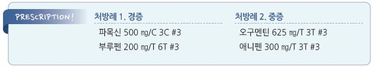

# 단독, 얕은 연조직염 Erysipelas

## 일반 사항

*   손상된 피부의 superficial(upper dermis) infection; 피부 림프계 침범

    ✽cellulitis는 deeper dermis, 피하 지방 침범; erysipelas는 cellulitis의 일종으로 취급되기도 함
* 호발 부위 : 다리(70~~80%), 얼굴(코, 귀, 뺨; 5~~20%)
* 12\~29%에서 재발(주로 첫 6개월, 동일 부위)
* 합병증 : 농양, necrotizing fasciitis, thrombophlebitis, gangrene, metastatic infection

## 원인

* 원인균 : Group A β-hemolytic Streptococcus (Streptococcus pyogenes )

### 위험 인자

* 긁음, 면도, 운동(발 손상), 비만

## 임상 양상

* 전구 증상 : 발열, 오한, 두통, malaise, 식욕 저하, 구역, 관절통
* 평평하게 부어오른 경계가 명확한 비화농성 선홍색 병소
* 통증 및 압통
* peau d’orange : 모낭들 주위로 부종이 발생하여 귤껍질 같은 표면 형성
* 수 시간에 걸친 빠른 진행 → 2~~3일 후 표재성 수포나 대수포 형성 → 5~~10일에 표피 탈락
* 간혹 림프관염, 국소 림프절병증
* 고령자에서 얼굴 이환 시 나비 형태를 보임

## 진단

* MRSA 의심 소견 : 병소 중앙 경화, 심한 통증, 농양 형성

### 검사

* 정상 면역 환자에서는 보통 필요 없음

#### 실험실 검사

* 검사 대상 : 심한 증상, 면역저하자, 물에 빠진 후 생긴 상처, 물린 상처
* 혈액 : WBC, ESR, CRP, 배양 검사
* 분비물 및 이환되지 않은 부위 그람염색 및 배양 검사

#### 영상 검사

* 대상 : 골수염의 가능성이 있는 경우, 괴사성 근막염 감별이 필요한 경우
* 초음파(DVT 의심 시), CT or MRI(necrotizing fasciitis 의심 시)

***

## Management

## 비-약물 치료

* 적당한 수분 보충
* 냉찜질
* 이환부 거상

## 약물 치료

### 통증, 발열

* NSAID

### 항생제

* penicillin : 500 ㎎ qid
* amoxicillin : 500 ㎎ tid \[파목신]
* 투여 기간 : 7\~10일(국내 지침에서는 합병증이 없는 경우 5일 권고)
* 경과 : 적당한 항생제 치료로 24\~48시간 후 호전
* 대수포 형성 시 S. aureus 고려(MRSA 해당 항생제 고려) (☞ p.901)
* 얼굴은 MRSA 감염이 사지보다 흔함

※ 적절한 항생제에 반응하지 않는 경우 피부 생검 고려

※ 괴사성 근막염이 의심되는 경우 조기에 수술적 치료 고려

## 예방

* 피부 위생, 면도 주의 (☞ p.900)

> **질병코드** A46 단독

