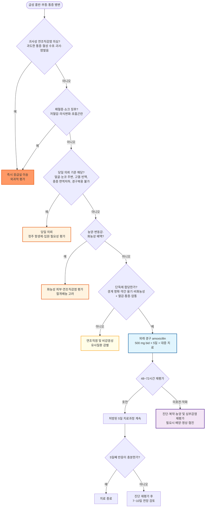

# 단독 Erysipelas

## <mark style="color:green;">일반 사항</mark>

* 상부 진피(upper dermis)와 표재 림프관을 침범하는 급성 비화농성 피부감염
* 연조직염/봉소염(cellulitis)과의 관계
  * 연조직염은 깊은 진피와 피하 지방층을 침범하여 병변 경계가 상대적으로 불명확함
  * 실제 임상에서는 두 질환이 겹치거나 명확히 구분되지 않을 수 있으며, 임상적 중복이 많아 IDSA 2014 지침에서도 erysipelas와 cellulitis를 같은 권고 항목에서 함께 다룸
* 호발 부위 : 하지(가장 흔함), 얼굴(코·뺨·귀 주변)
* 같은 부위에 재발하기 쉬움 : 국내 지침에서 하지 연조직염·단독의 재발 빈도는 약 8\~20%로 보고되며(곽이경 외, 2017), 만성 부종·림프부종과 피부 장벽 손상이 있으면 재발 위험이 뚜렷이 증가함
* 합병증 : 농양, 균혈증·패혈증, 심부 감염, 반복 재발에 따른 림프부종 악화, 드물게 괴사성 연조직감염

## <mark style="color:green;">원인</mark>

* 주로 β-용혈성 사슬알균
  * A군 사슬알균(*Streptococcus pyogenes*)이 대표적
  * C군·G군 사슬알균도 원인이 될 수 있음
* 전형적인 단독에서 *Staphylococcus aureus*와 MRSA는 주된 원인균이 아님

### <mark style="color:orange;">위험 인자</mark>

* 족부백선, 발가락 사이 균열·침연, 찰과상, 면도, 벌레물림 등 피부 장벽 손상
* 습진, 피부궤양, 수술 상처
* 만성 부종·림프부종, 정맥부전
* 과거 단독 또는 연조직염 (주요 재발 위험인자)
* 비만, 조절되지 않는 당뇨병, 면역저하

## <mark style="color:green;">임상 양상</mark>

* 피부 병변에 앞서 발열, 오한, 두통, 권태감, 식욕저하, 구역, 관절통 등이 나타날 수 있음
* 비교적 빠르게 확대되는 선홍색 또는 짙은 홍색의 부종성 병변
  * 주위 정상 피부와 경계가 비교적 명확하고 약간 융기함
  * 열감, 통증, 압통 동반
* **peau d'orange** : 모낭 주위 부종으로 귤껍질 같은 표면 형성
* 중증 병변에서는 수포·대수포가 형성되거나 회복기에 표피탈락이 나타날 수 있음
* 림프관염과 국소 림프절병증이 동반될 수 있음
* 얼굴 단독은 양측 뺨과 콧등을 연결하는 나비 모양 분포를 보일 수 있음
* **Milian 귀 징후(Milian's ear sign)** : 얼굴의 경계 명확한 홍반·부종이 귓바퀴까지 침범하면, 깊은 피하조직이 거의 없는 귓바퀴를 침범하기 어려운 전형적 cellulitis보다 단독을 지지함
  * 단독에 특이적인 확진 소견은 아니며 이개연골막염, 외이도염, 접촉피부염 등과 감별해야 함

### <mark style="color:$danger;">🚩 Red Flags!</mark>

<mark style="color:$danger;">**즉각 조치 또는 이송**</mark> <mark style="color:$danger;">- 생명 위협 또는 즉각적 위해 가능성</mark>

* 저혈압, 의식 변화, 호흡곤란 등 패혈증·쇼크 소견
* 피부 소견에 비해 과도한 통증, 매우 빠른 진행
* 혈성 수포, 피부괴사, 감각저하, 염발음 등 괴사성 연조직감염 의심 소견 → 영상검사 결과를 기다리지 말고 즉시 응급실 이송 및 외과적 평가
* 눈 주위 병변과 함께 시력저하, 안구운동통·안구운동장애 또는 안구돌출 동반 → 안와봉와직염 의심

<mark style="color:$warning;">**당일 또는 조기 의뢰**</mark>

* 눈·코 주변 또는 광범위한 얼굴 병변
* 고열·빈맥 등 뚜렷한 전신증상이나 빠르게 확대되는 병변
* 중증 면역저하, 항암치료 중, 호중구감소
* 침수 손상, 동물·사람 교상 등 비전형 병원체 가능성
* 농양, 골수염, 화농성 관절염 등 심부 감염 의심
* 경구 항생제를 복용할 수 없거나 외래 치료 순응도가 확보되지 않음

<mark style="color:$info;">**외래 치료·추적**</mark> <mark style="color:$info;">- 즉각 위험 낮으나 호전 없으면 의뢰</mark>

* 활력징후가 안정적이고 병변이 국소적이며 심부 감염이나 괴사성 감염 소견이 없음
* 병변 경계를 표시하고 48\~72시간 이내 치료 반응을 재평가함
* 적절한 경구 항생제 치료 후 48\~72시간에도 호전이 시작되지 않거나 계속 악화되면 재평가·의뢰
* 빠른 확대, 심한 통증, 전신상태 악화 시 즉시 재내원하도록 교육함

## <mark style="color:green;">진단</mark>

* 병력과 임상 소견을 바탕으로 진단함
* 하지 병변에서는 발가락 사이의 균열·인설·침연 및 족부백선을 확인함
* 병변의 범위를 피부 표시펜으로 표시하고 날짜를 기록하면 진행 여부 판단에 도움이 됨
* 농양, 변동감 또는 화농성 배액이 있으면 전형적인 단독이 아니므로 화농성 피부 및 연조직감염을 평가함

### <mark style="color:orange;">감별진단</mark>

<table><thead><tr><th width="150">질환</th><th>주요 감별점</th></tr></thead><tbody><tr><td>연조직염/봉소염</td><td>깊은 진피·피하조직 침범; 경계가 상대적으로 불명확</td></tr><tr><td>농양</td><td>변동감, 화농성 배액; 절개배농이 치료의 핵심</td></tr><tr><td>괴사성 연조직감염</td><td>소견에 비해 과도한 통증, 급속 진행, 혈성 수포·괴사·감각저하·염발음</td></tr><tr><td>이개연골막염</td><td>귓바퀴 연골부의 통증·부종; 귓불은 대개 보존되며 외상·피어싱 병력을 확인</td></tr><tr><td>정맥울혈피부염</td><td>대개 양측성, 만성 부종·인설·색소침착; 전신증상이 드묾</td></tr><tr><td>DVT·표재성 혈전정맥염</td><td>혈전 위험인자 또는 정맥을 따라 형성된 압통성 홍반; 필요시 압박 초음파</td></tr><tr><td>접촉피부염·벌레물림 반응</td><td>가려움이 두드러지고 노출 형태와 일치; 전신증상이 드묾</td></tr><tr><td>통풍·가성통풍</td><td>관절 중심의 급성 통증과 운동 제한</td></tr></tbody></table>

### <mark style="color:orange;">검사</mark>

* 전형적이고 경증인 단독에서는 보통 검사가 필요하지 않음

#### <mark style="color:$primary;">실험실 검사</mark>

* 중증 전신증상 또는 동반질환이 있으면 CBC, CRP, 신장·간기능 등을 선택적으로 시행함
* 전형적인 단독에서는 혈액배양, 병변 흡인배양·생검배양 또는 swab을 일상적으로 시행하지 않음 [IDSA 2014: strong recommendation, moderate evidence]
* 항암치료·호중구감소·중증 면역저하, 침수 손상, 동물 교상에서는 혈액배양과 병변 배양·흡인·생검을 고려함
* 피부가 온전한 병변 또는 이환되지 않은 피부의 표면배양은 원인균 확인에 도움이 되지 않음

#### <mark style="color:$primary;">영상 검사</mark>

* 단독 자체의 진단을 위한 영상검사는 대부분 필요하지 않음
* 연조직 초음파 : 농양 동반 여부가 불분명한 경우
* 압박 초음파 : DVT가 임상적으로 의심되는 경우
* CT 또는 MRI : 골수염·심부 감염의 범위를 평가해야 하는 경우

***


```mermaid
graph TD
    Start([급성 홍반·부종·통증 병변]) --> Q1{괴사성 연조직감염 의심?<br>과도한 통증·혈성 수포·괴사·염발음}
    Q1 -- 예 --> ER[즉시 응급실 이송<br>외과적 평가]
    Q1 -- 아니오 --> Q2{패혈증·쇼크 징후?<br>저혈압·의식변화·호흡곤란}
    Q2 -- 예 --> ER
    Q2 -- 아니오 --> Q3{당일 의뢰 기준 해당?<br>얼굴·눈코 주변, 고열·빈맥,<br>중증 면역저하, 경구복용 불가}
    Q3 -- 예 --> Refer[당일 의뢰<br>정주 항생제·입원 필요성 평가]
    Q3 -- 아니오 --> Q4{농양·변동감·<br>화농성 배액?}
    Q4 -- 예 --> Purulent[화농성 피부·연조직감염 평가<br>절개배농 고려]
    Q4 -- 아니오 --> QDx{단독에 합당한가?<br>경계 명확·약간 융기·비화농성<br>+ 열감·통증·압통}
    QDx -- 아니오 --> Mimic[연조직염 및 비감염성<br>유사질환 감별]
    QDx -- 예 --> Outpt[외래 경구 amoxicillin<br>500 mg bid × 5일 + 대증 치료]
    Outpt --> Reassess{48~72시간 재평가}
    Reassess -- 호전 --> Continue[처방된 5일 치료과정 계속]
    Reassess -- 미호전·악화 --> Refer2[진단·복약·농양 및 심부감염 재평가<br>필요시 배양·영상·협진]
    Continue --> Day5{5일째 반응이 충분한가?}
    Day5 -- 예 --> Complete[치료 종료]
    Day5 -- 아니오 --> Extend[진단 재평가 후<br>7~10일 연장 검토]

    style ER fill:#f96,stroke:#e65100,stroke-width:2px
    style Refer fill:#fff3e0,stroke:#e65100,stroke-width:2px
    style Purulent fill:#fff3e0,stroke:#e65100,stroke-width:2px
    style Mimic fill:#fffde7,stroke:#f9a825,stroke-width:2px
    style Outpt fill:#e1f5fe,stroke:#01579b,stroke-width:2px
    style Refer2 fill:#f3e5f5,stroke:#4a148c,stroke-width:2px
```

<p align="center"><strong>단독 진단 및 치료 알고리듬</strong></p>

<p align="center"><em><mark style="color:$info;">Ref. IDSA Clinical Practice Guidelines for Skin and Soft Tissue Infections (2014); CDC Clinical Guidance for Group A Streptococcal Cellulitis (2025)</mark></em></p>

***

## <mark style="color:green;">치료</mark>


**단계별 치료 전략** : Red flag 선별 → 유발 요인(족부백선, 만성 부종 등) 확인·동시 치료 → 경구 amoxicillin 500 ㎎ bid로 5일 + 대증치료 → 48\~72시간 재평가 → 재발성인 경우 예방요법 상담


### <mark style="color:orange;">비-약물 치료 및 예방</mark>

* 이환부를 심장보다 높게 거상하여 부종을 줄임
* 탈수를 피하도록 적절히 수분을 보충함
* 필요시 냉습포를 단기간 적용하여 불편감을 완화함
* 족부백선, 발가락 사이 균열, 습진 등 침입 경로와 유발요인을 함께 치료함
* 피부를 청결하게 유지하고 보습제를 사용하여 균열을 예방함
* 만성 부종·림프부종 및 정맥부전을 관리하고, 급성 염증이 가라앉은 뒤 필요시 압박요법을 고려함
* 면도·찰과상·벌레물림 등 피부 손상을 예방하고 작은 상처도 조기에 세척·보호함
* 자세한 공통 원칙은 (☞ [피부 및 연조직감염](165_-skin-and-soft-tissue-infection.md))을 참조함

### <mark style="color:orange;">약물 치료</mark>

#### <mark style="color:$primary;">통증·발열 조절</mark>

* acetaminophen을 우선 고려함
* NSAID는 신장애, 탈수, 위장관 출혈 위험, 고령자 및 항응고제 복용 여부를 확인한 후 선택적으로 사용함


**NSAID 사용 시 유의**\
NSAID 자체가 단독에서 금기인 것은 아니며, 신장기능·탈수·위장관 출혈 위험을 평가한 뒤 선택적으로 사용할 수 있음. NSAID가 괴사성 연조직감염을 유발한다는 인과관계는 확립되지 않았으나, 통증과 발열을 완화하여 초기 진단을 지연시킬 가능성이 제기되어 왔음. 소견에 비해 통증이 과도하거나 병변이 빠르게 진행하는 경우 NSAID 사용을 보류하고 재평가할 것.


#### <mark style="color:$primary;">항생제</mark>

* 전형적인 경증 단독 : 사슬알균을 표적으로 하는 경구 β-lactam 항생제
  * amoxicillin 500 ㎎ bid PO <mark style="color:blue;">\[파목신]</mark> [국내 SSTI 지침 2017]
* 중증 β-lactam 과민반응이 있으면 clindamycin 등 대체 항생제를 환자의 과거력과 지역 내성률에 따라 선택함
* 합병증이 없고 임상적 호전이 확인되면 우선 5일 치료함 [IDSA 2014]
  * 5일 이내 호전이 불충분하거나 병변이 광범위하면 7\~10일 등으로 연장함
* 중등도·중증 감염, 전신독성 또는 경구 투여 불가 시에는 당일 의뢰하여 cefazolin 등 정주 치료와 입원 필요성을 평가함
* 전형적인 단독에 경험적 MRSA 항생제를 일률적으로 추가하지 않음 [IDSA 2014] — MRSA 감염·보균 병력, 관통상, 주사약물 사용, 화농성 배액 또는 초기 치료 실패가 있으면 단독이 아닌 연조직염·화농성 SSTI 가능성을 재평가하고 MRSA 표적 치료 여부를 결정함

#### <mark style="color:$primary;">보조 치료 — 전신 스테로이드</mark>

* 전신 스테로이드는 단독에서 일상적으로 권고하지 않으며, 괴사성 감염을 배제한 일부 비당뇨 성인 cellulitis에서만 전문과 협진 후 선택적으로 고려함 [IDSA 2014: weak recommendation, moderate evidence]

#### <mark style="color:$primary;">재발 예방을 위한 항생제 예방요법</mark>

* 교정 가능한 위험인자(족부백선, 만성 부종, 정맥부전 등)를 관리해도 연 3\~4회 이상 재발하면 예방적 항생제 여부를 감염내과·피부과와 상의함
* 근거 : PATCH I 연구(Thomas et al., NEJM 2013) — 재발성 하지 단독/연조직염 환자에서 penicillin V 250 ㎎ bid 예방 투여 시, 투여 기간 중에는 재발이 유의하게 감소(NNT 약 5)하였으나 투약 중단 후에는 보호 효과가 점차 소실됨 (해당 연구는 12개월 투여를 평가한 것으로, 이것이 권장 상한 기간을 의미하지는 않음)
* 국내에서 실제 처방 가능한 예방요법(예: amoxicillin 저용량 요법, IM benzathine penicillin G 등)은 전문과 협진 후 선택함
* 예방요법 시작 전 급성기 염증이 충분히 가라앉았는지 확인하고, 투여 종료 후에도 유발 요인(부종·피부장벽) 관리를 지속해야 함을 설명함

### <mark style="color:orange;">치료 반응 평가</mark>

* 치료 초기 24시간 동안 홍반이 다소 확대될 수 있으나, 보통 48\~72시간 이내 전신증상과 국소 통증의 호전이 시작됨
* 피부색과 부종이 항생제 종료 시점까지 완전히 정상화되지 않을 수 있음
* 48\~72시간 내 호전되지 않으면 다음을 재평가함
  * 진단 오류 : 정맥울혈피부염, DVT, 접촉피부염, 통풍 등
  * 농양 또는 괴사성·심부 감염
  * 복약 순응도, 용량·흡수 문제
  * 내성균 또는 침수·교상 관련 비전형 병원체
* 비전형적 병변이나 면역저하자에서 진단이 불확실하면 피부과·감염내과 협진 및 흡인·생검을 고려함

***

### <mark style="color:red;">질병코드 (KCD)</mark>

A46 단독

***

## <mark style="color:purple;">처방례</mark>

> **처방례 1. 전형적인 경증 단독**
>
> ```
> 파목신 500 ㎎/C 2C #2 × 5일
> 타이레놀 500 ㎎/T 3T #3 × 3일, 통증·발열 시 복용
> ```
>
> _✽48\~72시간 이내 치료 반응을 확인하며, 빠른 확대·심한 통증·전신상태 악화가 있으면 즉시 재평가한다._

> **처방례 2. β-lactam 과민반응이 있는 경증 단독**
>
> ```
> 클린다마이신 300 ㎎/C 4C #4 × 5일
> 타이레놀 500 ㎎/T 3T #3 × 3일, 통증·발열 시 복용
> ```
>
> _✽즉시형·중증 β-lactam 과민반응(아나필락시스, 두드러기 등)에서 선택한다. 경증·비즉시형 반응이라면 교차반응률이 낮은 cephalosporin(예: cephalexin)도 고려할 수 있다. 위장관 부작용 및 Clostridioides difficile 감염 가능성을 설명한다._

> **처방례 3. 중등도·중증 단독**
>
> 경구 처방으로 치료하지 않고 당일 의뢰하여 정주 항생제 및 입원 필요성을 평가함

***

### <mark style="color:$success;">핵심 복약 지도</mark>

> **항생제 복용 원칙**
>
> * 증상이 좋아져도 처방된 5일 치료를 끝까지 완료하도록 안내함
> * 48\~72시간 이내 호전이 시작되지 않거나 병변이 오히려 확대되면 재내원하도록 함
> * amoxicillin 복용 시 발진, 설사 등 부작용 발생 여부를 확인하고, 페니실린 알레르기 과거력을 다시 한번 확인함

> **통증·발열 관리**
>
> * acetaminophen을 우선 사용하고, NSAID는 신장 기능·위장관 위험을 고려해 선택적으로 사용함
> * 통증이 병변 소견에 비해 과도하거나 빠르게 심해지면 NSAID 복용을 멈추고 즉시 재평가가 필요함을 설명함

> **재발 예방 상담**
>
> * 족부백선, 발가락 사이 균열, 만성 부종 관리의 중요성을 강조함
> * 연 3\~4회 이상 재발 시 예방적 항생제 상담이 가능함을 안내함

> **언제 다시 병원을 방문해야 하나요?**
>
> * 항생제 복용 48\~72시간이 지나도 발적·부종·통증이 나아지지 않거나 오히려 악화되는 경우
> * **극심한 통증**이 피부 소견에 비해 지나치게 심한 경우 — 즉시 내원
> * 물집이 피가 섞인 색을 띠거나 피부 감각이 둔해지는 경우 — 즉시 내원
> * 고열, 오한, 어지러움 등 전신 증상이 동반되는 경우 — 즉시 내원

***

### <mark style="color:blue;">환자 안내서</mark>


**단독(丹毒), 피부의 얕은 층에 생기는 세균 감염입니다**

단독은 피부 얕은 층과 그 아래 작은 림프관에 사슬알균이라는 세균이 들어가 생기는 급성 감염입니다. 다리나 얼굴에 경계가 뚜렷한 붉은 부위가 빠르게 넓어지며 열감과 통증을 동반하는 것이 특징입니다.


#### <mark style="color:$primary;">왜 단독이 생기나요?</mark>

* 작은 상처, 무좀으로 갈라진 발가락 사이, 습진 등을 통해 세균이 피부 안으로 들어가 생깁니다.
* 다리가 자주 붓거나(부종·림프부종) 정맥 순환이 좋지 않은 경우, 당뇨병이 있는 경우 더 잘 생기고 재발하기 쉽습니다.

#### <mark style="color:$primary;">일상생활에서 어떻게 관리하나요?</mark>

* **아픈 다리(또는 팔)를 심장보다 높게 올려 두십시오.** 부기를 줄이는 데 도움이 됩니다.
* **수분 제한을 지시받은 경우가 아니라면 적절히 물을 드십시오.** 특히 열이 나거나 식사량이 준 경우 탈수를 피해야 합니다.
* **필요하면 찬 수건을 짧게 대어 불편감을 줄이십시오.**
* **무좀이나 발가락 사이 갈라짐이 있다면 함께 치료하십시오.** 그대로 두면 단독이 자꾸 재발할 수 있습니다.

#### <mark style="color:$primary;">약은 어떻게 써야 하나요?</mark>

* 처방된 항생제는 증상이 좋아진 것 같아도 정해진 날짜(보통 5일)까지 빠짐없이 복용하십시오. 병변이 충분히 호전되지 않으면 의사의 판단에 따라 7\~10일로 연장할 수 있습니다.
* 통증이나 열에는 타이레놀(아세트아미노펜)을 우선 사용하는 것이 안전합니다.
* 소염진통제(NSAID)를 드시던 중 통증이 갑자기 심해지면 복용을 멈추고 바로 병원에 연락하십시오.
* 병변이 얼굴이나 눈 주위에 생겼다면 증상이 심하지 않더라도 당일 또는 조기에 의료진과 상의하십시오.

#### <mark style="color:$primary;">이럴 때는 즉시 병원을 방문하세요</mark>

* 항생제를 2\~3일 복용했는데도 붉은 부위가 계속 넓어지거나 나아지지 않을 때
* 피부 소견에 비해 통증이 너무 심하다고 느껴질 때
* 피가 섞인 물집이 생기거나 피부색이 검붉게 변할 때, 그 부위 감각이 둔해질 때
* 고열, 오한, 어지러움 등 온몸이 아픈 느낌이 들 때
* 얼굴이나 눈 주위 병변과 함께 시야가 흐려지거나, 눈을 움직일 때 아프거나, 눈이 튀어나와 보일 때

#### <mark style="color:$primary;">재발을 막으려면 어떻게 하나요?</mark>

* 발을 청결하고 건조하게 유지하고, 무좀이 있으면 꾸준히 치료하십시오.
* 보습제를 사용해 피부가 갈라지지 않도록 관리하십시오.
* 다리 부기가 자주 있다면 병원에서 압박 스타킹 등 관리 방법을 상담하십시오.
* 1년에 3\~4번 이상 반복된다면 예방적 항생제 복용이 도움이 될 수 있으니 담당의와 상의하십시오.
