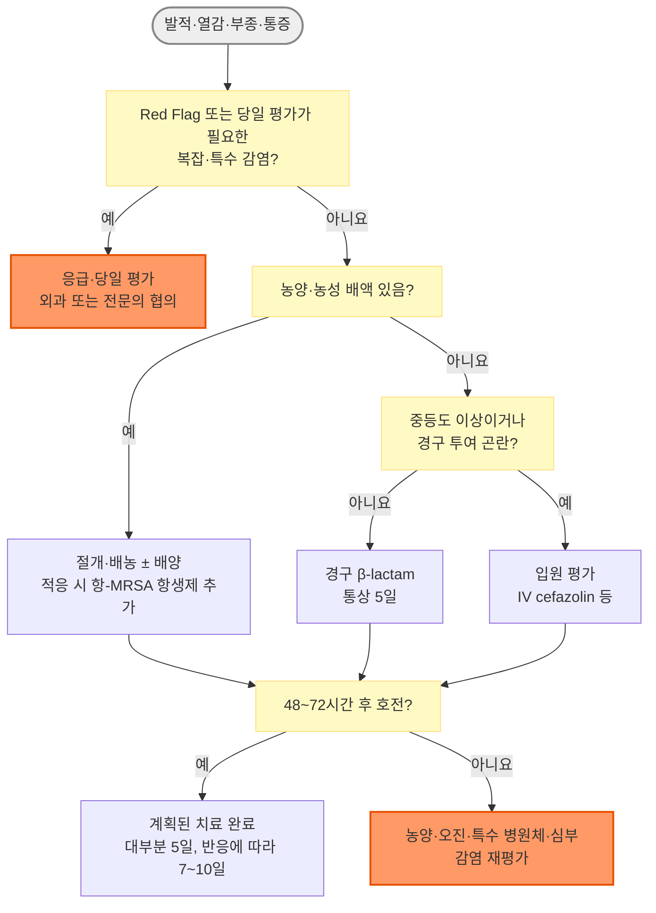

# 연조직염(봉와직염) Cellulitis

## <mark style="color:green;">일반 사항</mark>

* 진피 심부와 피하조직에 발생하는 급성 세균 감염
* 피부농양·종기·감염된 표피낭종 등의 **화농성 피부·연조직감염(purulent SSTI)**과 구분
* 성인에서는 하지에 가장 흔하며 대개 편측으로 발생
  * 양측 하지의 대칭적 발적은 정체피부염, 림프부종 등 비감염성 질환을 우선 고려
* 발가락 사이의 짓무름·균열, 발백선은 하지 연조직염의 흔한 침입 경로이자 재발 위험인자
* 병변의 크기와 전신증상의 정도가 항상 비례하지는 않으므로 활력징후와 전신상태를 별도로 평가


**용어 주의**\
Soft tissue infection은 농양, 괴사근막염, 근육염 등을 포함하는 상위 개념입니다. Phlegmon도 연조직염의 정확한 동의어가 아니므로 혼용하지 않습니다.


## <mark style="color:green;">원인 및 위험 인자</mark>

### <mark style="color:orange;">원인균</mark>

* **전형적인 비화농성 연조직염:** β-용혈성 사슬알균이 가장 흔함
* **S. aureus:** 개방성 창상, 관통상, 주사 약물 사용, 농성 병변이 있을 때 가능성 증가
* **특수 상황**
  * 담수 노출: *Aeromonas* spp.
  * 해수·어패류 노출: *Vibrio vulnificus* 등
    * 간질환 환자에서 빠르게 진행하는 통증·부종·출혈성 수포가 나타나면 즉시 응급 평가
  * 개·고양이 물림: *Pasteurella multocida*, *Capnocytophaga canimorsus* 및 혼합균
  * 사람 물림: *Eikenella corrodens* 및 혼합균
  * 귓바퀴 연골막염: *Pseudomonas aeruginosa* 고려
  * 심한 면역저하·호중구감소증: 그람음성균, 진균 등 비전형적 병원체 가능
* Hib 백신 도입 후 *Haemophilus influenzae*에 의한 협부 연조직염은 드묾


당뇨병이나 면역저하가 있다는 이유만으로 *P. aeruginosa*를 일률적으로 원인균으로 간주하지 않습니다.


### <mark style="color:orange;">유발·위험인자</mark>

* 피부 장벽 손상: 외상, 찰과상, 수술창, 주사, 피어싱, 문신, 벌레 물림
* 피부질환: 발백선, 습진, 피부균열, 궤양
* 만성 부종: 림프부종, 만성 정맥부전, 수술·방사선치료 후 림프손상
* 비만, 고령, 과거 연조직염
* 당뇨병, 말초동맥질환
* 면역억제 치료, 악성종양, 호중구감소증
* 동물·사람 물림, 담수·해수 노출

## <mark style="color:green;">임상 양상</mark>

* 경계가 명확하지 않은 편평한 홍반, 열감, 부종, 압통
* 림프관을 따라 근위부로 이어지는 선상 홍반(림프관염), 국소 림프절병증
* 중등도 이상에서는 발열, 오한, 권태감 동반 가능
* 물집이 생길 수 있으나, 파동·농성 배액·뚜렷한 고름집은 피부농양 등 화농성 SSTI를 시사
* 병변 가장자리를 펜으로 표시하거나 사진으로 기록하면 진행 여부 평가에 도움

### <mark style="color:orange;">단독(Erysipelas)과의 구분</mark>

* 단독은 표재성 진피와 표재 림프관을 침범하여 병변이 융기되고 경계가 비교적 명확함
* 연조직염은 진피 심부와 피하조직을 침범하여 경계가 불명확함
* 안면 감염에서 귓바퀴 침범은 단독을 지지하는 Milian's ear sign
  * 다만 외이 연조직염이나 귓바퀴 연골막염도 발생할 수 있으므로 "귓바퀴에는 연조직염이 발생하지 않는다"라고 절대적으로 표현하지 않음

### <mark style="color:$danger;">🚩 Red Flags!</mark>

<mark style="color:$danger;">**즉각 조치 또는 의뢰**</mark>

* 피부 소견에 비해 현저히 심한 통증 또는 시간 단위의 빠른 진행
* 자색·회색 변색, 출혈성 수포, 피부괴사, 염발음, 조직 내 가스, 피부 감각저하
* 저혈압, 의식 변화, 호흡곤란, 청색증, 핍뇨 등 패혈증·장기기능장애 소견
* 괴사성 근막염, 근괴사, 구획증후군 또는 Fournier gangrene 의심
* 안구운동통, 복시, 시력저하, 안구돌출을 동반한 안와 감염 의심


**⚠️ 괴사성 연조직감염을 영상검사로 배제하려 하지 마십시오**\
괴사성 연조직감염이 의심되면 LRINEC 점수가 낮거나 영상검사가 확정적이지 않아도 배제할 수 없습니다. 영상검사 때문에 외과 평가와 수술적 탐색이 지연되어서는 안 됩니다.


<mark style="color:$warning;">**당일 또는 조기 의뢰**</mark>

* 뚜렷한 발열·오한·빈맥·빈호흡 또는 전신상태 불량
* 빠르게 확산하거나 광범위한 병변
* 심한 면역저하, 호중구감소증, 조절되지 않는 중증 기저질환
* 동물·사람 물림, 담수·해수 노출
* 얼굴·손·생식기·관절 또는 인공관절 주변 감염
* 감염된 당뇨발 궤양, 괴사, 중증 하지허혈
* 경구 복용 불가, 흡수 장애 또는 외래 추적·복약 이행이 어려움
* 적절한 치료 후 48\~72시간에도 임상적 호전이 없거나 악화

<mark style="color:$info;">**외래 추적 / 추가 평가 계획**</mark> <mark style="color:$info;">- 즉각 위험 낮으나 호전 없으면 의뢰</mark>

* 활력징후가 안정적이고 병변이 국한된 경증 비화농성 연조직염
* 병변 경계를 표시하고 48\~72시간 이내 재평가
* 빠른 확대, 발열·오한, 통증 악화, 수포·괴사 또는 의식 변화가 생기면 즉시 재진

## <mark style="color:green;">진단</mark>

### <mark style="color:orange;">기본 평가</mark>

* 대부분 임상소견으로 진단하며 전형적인 경증에서는 영상검사나 배양검사가 필요하지 않음
* 병력에서 다음을 확인
  * 발생 속도, 외상·수술·주사·물림·수중 노출
  * 과거 MRSA 감염·보균, 최근 항생제·입원
  * 당뇨병, 부종·정맥질환, 면역저하, 간질환
* 진찰에서 병변 범위, 열감·압통, 파동, 농성 배액, 감각, 말초 맥박, 관절운동을 확인
* 농양 여부가 불확실하면 초음파를 고려
* 골수염이 의심되면 단순촬영을 시작으로 임상 상황에 따라 MRI 등 추가 영상검사 고려


**ALT-70 - 성인 하지 연조직염 진단 보조**\
급성 하지 발적에서 pseudocellulitis 감별을 위한 참고용 보조 도구로 활용할 수 있으나 국내 인구에서 별도 검증되지 않았습니다(Asymmetry 3점, Leukocytosis ≥10,000/µL 1점, Tachycardia ≥90/min 1점, Age ≥70세 2점). 0\~2점이면 다른 진단을 적극 재평가하고, 3\~4점이면 진단이 불확실하므로 전문의 협의 또는 조기 재평가를 고려합니다. 5\~7점도 연조직염을 확진하지 않으며(전문가 판정 기준 위양성 상당수 보고), 경증 외래 환자에게 점수 계산만을 목적으로 CBC를 일률적으로 시행할 근거는 부족합니다. 물림, 최근 외상·수술, 인공물, 농양·복잡창상 등은 주요 검증연구에서 제외되었으므로 적용 근거가 부족합니다.


### <mark style="color:orange;">배양 및 혈액검사</mark>

* 전형적인 경증 비화농성 연조직염: 배양검사 불필요
* 농양·농성 배액: 고름의 그람염색·배양 고려
* 혈액배양 고려
  * 저혈압·고열 등 중증 전신소견
  * 악성종양, 호중구감소증, 심한 세포매개 면역저하
  * 동물 물림, 담수·해수 노출 등 비전형적 병원체가 의심되는 경우
* CBC, Cr/eGFR, 전해질, CRP 등은 중등도·중증 환자의 장기기능과 중증도 평가에 선택적으로 시행
* CK는 근괴사·괴사성 감염이 의심될 때 고려
* 조직 생검과 진균·항산균 검사는 비전형적 경과 또는 역학적·면역학적 위험이 있을 때 선택

### <mark style="color:orange;">감별진단</mark>

<table><thead><tr><th width="180">질환</th><th>핵심 감별 포인트</th></tr></thead><tbody><tr><td>괴사성 근막염</td><td>불균형적으로 심한 통증, 빠른 진행, 독성 양상, 수포·괴사·감각저하·염발음</td></tr><tr><td>피부농양</td><td>국소 파동, 중심 농포 또는 농성 배액</td></tr><tr><td>정체피부염</td><td>흔히 양측성, 가려움·인설·만성 부종, 압통이 적음</td></tr><tr><td>급성 지방피부경화증(acute lipodermatosclerosis)</td><td>내측 하퇴의 압통성 홍반과 경결</td></tr><tr><td>표재성 혈전정맥염</td><td>정맥 주행을 따르는 압통성 줄 모양 경결</td></tr><tr><td>심부정맥혈전증</td><td>편측 부종·통증; 임상확률에 따라 D-dimer·초음파 평가</td></tr><tr><td>접촉피부염</td><td>가려움이 두드러지고 노출 부위에 경계가 비교적 뚜렷한 홍반·수포</td></tr><tr><td>곤충교상</td><td>중심 물림 자국, 가려움 우세</td></tr><tr><td>통풍·가성통풍, 화농성 관절염</td><td>관절 중심의 통증과 관절운동 제한</td></tr><tr><td>화농성 윤활낭염</td><td>윤활낭 부위의 국소 부종·파동</td></tr><tr><td>대상포진 초기</td><td>피부분절을 따르는 작열통 후 군집 수포</td></tr><tr><td>림프부종</td><td>만성 부종과 피부 변화, 급성 열감·전신증상이 없음</td></tr></tbody></table>

***



<p align="center"><strong>연조직염 진단·치료 흐름</strong></p>

<p align="center"><em>복잡·특수 감염: 물림·수중 노출, 감염된 당뇨발 궤양·괴사·중증 허혈, 심한 면역저하, 얼굴·손·생식기·관절 또는 인공관절 주변 감염 등</em></p>

***

## <mark style="background-color:$warning;">Management</mark>

* 경증 비화농성 연조직염은 streptococci를 표적으로 하는 경구 β-lactam을 우선 선택
* 합병증이 없는 비화농성 연조직염은 대부분 5일 치료
  * 5일까지 호전이 불충분하거나 병변이 광범위한 경우, 면역저하·허혈·심부감염 등 복잡 요인이 있으면 농양과 원인조절 여부를 재평가한 후 임상반응에 따라 통상 7\~10일까지 연장 가능
  * 피부색과 부종이 5\~7일 이내 완전히 정상화되지 않을 수 있음을 설명
* 치료 시작 후 처음 24\~48시간에는 염증 소견이 일시적으로 확대될 수 있음
  * 빠른 악화가 아니면 병변 경계, 전신상태와 통증을 함께 보면서 48\~72시간에 재평가
* 호전이 없으면 농양, 오진, 복약 불이행, 내성균, 특수 노출, 허혈, 골수염·괴사성 감염을 재검토
* IV 항생제는 중증도와 경구 복용 가능 여부에 따라 결정하고 48시간 전후에 재평가
  * 안정되고 호전되면 경구제로 전환하며 IV 기간과 경구 기간을 기계적으로 합산하지 않음
* 허가사항이 없는 "경구 항생제 초회 2배 용량"은 사용하지 않음
* 항생제 용량은 신기능, 간기능, 체중, 임신 여부와 약물상호작용에 따라 조정

## <mark style="color:green;">비-약물 치료 및 예방</mark>

* 환부를 거상하여 부종을 줄임
* 통증 범위 내에서 활동을 조절하되 불필요한 장기 고정은 피함
* 발백선, 습진, 피부균열, 궤양 등 침입 경로와 유발질환을 함께 치료
* 개방성 창상이나 삼출이 있을 때만 생리식염수 세척·적절한 드레싱 시행
* 파상풍 위험이 있는 창상은 예방접종력을 확인하고 지침에 따라 추가 접종
* 이뇨제는 연조직염이나 림프부종 자체의 치료가 아니며, 심부전 등 별도의 체액과다 적응증이 있을 때만 사용
* 압박요법은 만성 부종의 관리와 재발 예방에 유용함
  * 급성 통증·염증이 심하면 일시적으로 조절하고, 견딜 수 있을 때 재개
  * 압박요법 전 말초맥박, 허혈 증상 및 말초동맥질환 위험을 평가
  * 말초동맥질환이 의심되면 ABI 등으로 동맥 관류를 확인하고, 당뇨병·만성콩팥병에서는 혈관 석회화로 ABI가 거짓으로 높을 수 있으므로 필요시 toe-brachial index 또는 혈관검사를 고려

## <mark style="color:green;">약물 치료</mark>

### <mark style="color:orange;">비화농성 연조직염 - 성인, 정상 신기능</mark>

#### <mark style="color:$primary;">경증 경구 치료</mark>

* Cephalexin 500 mg qid <mark style="color:blue;">\[팔렉신]</mark> - 1차 선택
* Cefadroxil 500 mg bid <mark style="color:blue;">\[듀리세프]</mark> - 1차 선택
* Cephradine 500 mg qid <mark style="color:blue;">\[세프라딘]</mark> - 1차 선택(동급 대안)
* Clindamycin 300\~450 mg qid <mark style="color:blue;">\[훌그램]</mark> - 대체 선택
  * 즉시형 β-lactam 과민반응 등 대체제가 필요한 경우 고려
  * 설사·C. difficile 감염 위험 및 지역 내 감수성 고려 - 배양균이 erythromycin 내성·clindamycin 감수성으로 보고되면 inducible resistance 확인을 위한 D-test 결과를 확인

> Cephalexin, cefadroxil, cephradine은 병용하지 않고 환자 상태와 복약 편의, 신기능을 고려하여 하나를 선택한다. 해외 지침에 제시되는 dicloxacillin은 국내 미유통(2026년 8월 기준)이다.

#### <mark style="color:$primary;">중등도·중증 또는 경구 투여 곤란</mark>

* Cefazolin 1\~2 g IV q8h
* Clindamycin 600\~900 mg IV q8h - β-lactam 사용이 곤란하고 감수성이 적절한 경우 대체
* 중증 전신감염 또는 MRSA 위험이 높으면 vancomycin 기반 치료와 입원 평가

### <mark style="color:orange;">MRSA 치료를 고려할 상황</mark>

* 농성 배액 또는 농양
* 관통상, 특히 주사 약물 사용
* 과거 MRSA 감염·보균 또는 다른 부위의 동시 MRSA 감염
* 중증 전신감염
* 적절한 배농과 β-lactam 치료에도 실패


전형적인 비화농성 연조직염에서 MRSA는 흔한 원인이 아니므로 치료반응이 늦다는 이유만으로 자동으로 MRSA 약제로 변경하지 않습니다.


### <mark style="color:orange;">피부농양 및 화농성 피부·연조직감염</mark>

* 핵심 치료는 **절개·배농(I&D)**
* 가능하면 고름을 배양하고 배양·감수성 결과에 따라 항생제를 조정
* 다음 상황에서 항-MRSA 항생제 추가를 고려
  * 발열·빈맥 등 전신증상
  * 광범위한 주변 연조직염
  * 심한 면역저하, 다발성 병변, 치료하기 어려운 부위
  * 배농 후에도 악화하거나 재발

#### <mark style="color:$primary;">경구 항-MRSA 선택지 - 성인, 정상 신기능</mark>

* TMP/SMX 160/800 mg 1\~2T bid <mark style="color:blue;">\[셉트린]</mark>
* Doxycycline 100 mg bid <mark style="color:blue;">\[독시사이클린]</mark>
* Minocycline 100 mg bid <mark style="color:blue;">\[미노씬]</mark>
* Clindamycin 300\~450 mg qid <mark style="color:blue;">\[훌그램]</mark> - 대체 선택(감수성 확인 시)


TMP/SMX와 doxycycline의 β-용혈성 사슬알균 치료 신뢰도는 충분하지 않습니다. MRSA와 streptococci를 모두 치료해야 하면 clindamycin 단독(감수성 확인 시) 또는 TMP/SMX·doxycycline 중 하나에 cephalexin·amoxicillin 등 β-lactam을 병용합니다. Linezolid 등은 중증 β-lactam 알레르기, 다제내성 또는 전문의 치료 영역으로 국한합니다. 최근 미국 일부 기관에서는 침습성 GAS·GBS 및 지역 *S. aureus* 분리주의 clindamycin 내성 증가와 C. difficile 감염 위험을 이유로 경험적 치료에서 clindamycin 사용을 줄이고 있습니다. 이 수치를 국내 연조직염에 직접 적용할 수는 없으므로 지역별 감수성과 배양 결과를 우선합니다.


#### <mark style="color:$primary;">중증 MRSA 감염</mark>

* Vancomycin IV: 실제 체중과 신기능을 반영하여 투여
  * 중증 침습성 MRSA 감염에서는 AUC/MIC 400\~600을 목표로 모니터링 고려
* Daptomycin, linezolid, tedizolid, ceftaroline 등은 입원·전문의 치료 영역에서 감염 부위, 균혈증 여부, 신기능 및 약물상호작용에 따라 선택
* Tigecycline은 일반적인 연조직염의 통상적 경험 치료제로 사용하지 않음

### <mark style="color:orange;">특수 상황</mark>

* **당뇨병:** 당뇨병만으로 그람음성균·혐기성균을 모두 포함하는 광범위 항생제를 선택하지 않음
  * 감염된 당뇨발 궤양, 괴사·허혈, 심부농양 또는 골수염 의심 시 당뇨발 감염 지침에 따라 별도 평가
* **동물·사람 물림:** 일반적인 cephalexin 단독은 부적절할 수 있음
  * 창상 세척·탐색, 파상풍 및 광견병 위험 평가, amoxicillin/clavulanate 등 혼합균 치료 고려
* **담수·해수 노출:** 배양과 조기 전문치료를 고려하고 일반적인 β-lactam 단독에 의존하지 않음
* **얼굴·안와 주변, 손, 귓바퀴, 생식기:** 해부학적 합병증과 특수 원인균 가능성이 있어 조기 의뢰 기준을 낮춤

### <mark style="color:orange;">해열·진통제</mark>

* Acetaminophen 또는 NSAID를 필요시 단기간 사용
* NSAID는 고령자, 신장질환, 심부전, 소화성궤양, 항응고제 사용 환자에서 주의
* 진통제로 통증이 가려지더라도 병변이 빠르게 진행하거나 불균형적으로 심한 통증이 있으면 괴사성 감염을 재평가

## <mark style="color:green;">치료반응 평가</mark>

* 48\~72시간: 발열·통증·병변 확대 여부와 복약 이행 확인
* 5일: 뚜렷한 임상적 호전 여부를 평가하여 종료 또는 연장 결정
* 반응 불량 시 다음을 확인
  * 농양 또는 배농 불충분
  * 정체피부염, DVT, 통풍 등 오진
  * 복약 불이행, 흡수 장애, 부적절한 용량
  * MRSA 또는 물림·수중 노출 관련 병원체
  * 말초허혈, 이물, 골수염, 화농성 관절염
  * 괴사성 연조직감염

## <mark style="color:green;">재발 예방</mark>

* 발가락 사이를 포함한 피부를 정기적으로 관찰하고 발백선·습진·균열을 치료
* 만성 부종·림프부종과 정맥부전을 관리하고 적절한 압박요법 적용
* 피부 보습, 상처 예방, 체중 및 혈당 관리
* 위험인자를 충분히 교정했는데도 연 3\~4회 재발하면 감염내과·피부과 등 전문의와 예방적 항생제 고려
  * 해외 주요 근거: Penicillin V 250 mg bid PO
    * 국내 경구 제형 수급이 어려움
  * 국내 지침상 경구 대안: Amoxicillin 고려
    * 예방 목적의 최적 용량과 기간은 확립되지 않았으므로 전문의와 개별 결정
  * Benzathine penicillin G 120만 단위 IM every 2\~4 weeks
    * 국내 수급과 사용 가능 여부를 확인하고 전문의와 결정
  * 국내에서 예방적 항생제의 사용 경험은 제한적이며, 투여 기간은 재발 양상과 위험인자 지속 여부에 따라 개별화함. 예방요법 중단 후 재발할 수 있음

***

### <mark style="color:red;">질병코드</mark>

L03 연조직염(봉와직염) 및 급성 림프관염 - 병변 부위에 따라 가장 구체적인 하위 코드를 선택

H60.1 외이의 연조직염

N48.21 음경의 연조직염

N73.0 급성 자궁주위조직염 및 골반연조직염

***

## <mark style="color:purple;">처방례</mark>

> **처방례 1. 경증 비화농성 연조직염, 정상 신기능**
>
> ```
> 팔렉신 500 mg/C 4C  #4 × 5일
> 부루펜 200 mg/T 6T  #3 × 필요시 단기간
> ```
>
> _✽Cephalexin 500 mg qid, ibuprofen 400 mg tid PRN(위장관·신장·심혈관 위험 확인). 48\~72시간 후 재평가하고 5일까지 호전이 불충분하면 진단과 치료 기간을 재검토합니다._

> **처방례 2. 경증 비화농성 연조직염, 복약 횟수 단순화**
>
> ```
> 듀리세프 500 mg/C 2C  #2 × 5일
> 애니펜 300 mg/T 3T  #3 × 필요시 단기간
> ```
>
> _✽Cefadroxil 500 mg bid, dexibuprofen 300 mg tid PRN(위장관·신장·심혈관 위험 확인). β-lactam 즉시형 과민반응과 신기능을 확인하고 48\~72시간 후 재평가합니다._


**⚠️ 처방례 적용 제외**\
농양, 물림, 담수·해수 노출, 감염된 당뇨발 궤양, 안와·손·귓바퀴·생식기 감염, 심한 면역저하 또는 중증 전신감염에는 위 단순 처방례를 그대로 적용하지 않습니다.


***

### <mark style="color:$success;">핵심 복약 지도</mark>

> **항생제 복용**
>
> * 항생제는 정해진 횟수와 기간에 맞추어 복용합니다.
> * 피부색과 부종은 항생제를 시작한 뒤에도 며칠간 남을 수 있습니다.

> **재발 예방**
>
> * 발가락 사이의 무좀·균열과 만성 부종을 함께 관리해야 재발을 줄일 수 있습니다.

> **언제 다시 병원을 방문해야 하나요?**
>
> * 표시한 경계 밖으로 빠르게 번지는 경우
> * 발열·오한이 생기는 경우
> * 심한 통증이 동반되는 경우
> * 물집·검은 피부색이 나타나는 경우
> * 어지럼·의식 변화가 생기는 경우

***

### <mark style="color:blue;">환자 안내서</mark>


**연조직염, 피부 밑 조직에 생긴 세균 감염입니다**

연조직염은 피부 깊은 층과 그 아래 조직에 세균이 들어가 생기는 감염입니다. 주로 다리에 잘 생기며, 빨갛게 붓고 만지면 아프고 뜨거운 느낌이 드는 것이 특징입니다. 대부분 항생제로 잘 낫지만, 증상이 빠르게 나빠지면 즉시 병원을 다시 찾아야 합니다.


#### <mark style="color:$primary;">왜 생기나요?</mark>

* 작은 상처, 무좀으로 갈라진 발가락 사이, 습진 등 피부의 작은 틈으로 세균이 들어가 감염을 일으킵니다.
* 다리가 자주 붓거나(림프부종·정맥부전), 당뇨병·비만이 있으면 더 잘 생기고 재발하기 쉽습니다.
* 한 번 걸렸던 부위는 다시 걸릴 위험이 높습니다.

#### <mark style="color:$primary;">일상생활에서 어떻게 관리하나요?</mark>

* **아픈 부위를 심장보다 높게 올려두십시오.** 부기를 줄이는 데 도움이 됩니다.
* **발가락 사이를 깨끗하고 건조하게 유지하십시오.** 무좀이 있으면 함께 치료해야 재발을 막을 수 있습니다.
* **무리한 활동은 피하되, 다리를 아예 움직이지 않는 것도 좋지 않습니다.** 통증이 허락하는 범위에서 평소처럼 움직이십시오.
* 상처가 있으면 깨끗한 물로 씻고 청결하게 드레싱하십시오.

#### <mark style="color:$primary;">항생제는 어떻게 써야 하나요?</mark>

* 처방받은 항생제는 증상이 좋아진 것 같아도 정해진 기간까지 빠짐없이 복용하십시오.
* 피부의 붉은기와 부종은 치료가 효과적이어도 수일에서 1\~2주 정도 남을 수 있습니다. 다만 병변이 계속 확대되거나 통증·발열이 호전되지 않으면 다시 진료받으십시오.

#### <mark style="color:$primary;">이럴 때는 즉시 병원을 방문하세요</mark>

* 표시해 둔 경계 밖으로 빠르게 번지는 경우
* 열이 나거나 오한이 생기는 경우
* 통증이 갑자기 심해지는 경우
* 물집이 생기거나 피부색이 검붉게 변하는 경우
* 어지럽거나 의식이 흐려지는 경우
