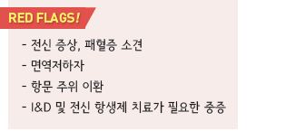
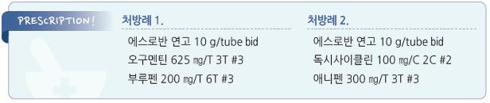

# 농양 Abscess, 종기증 Furunculosis


## 일반 사항

* 고름집, 농양 (Abscess) : 염증 조직으로 둘러싸인 고름의 집합
* 종기 (Furuncle) : 모낭 및 인접한 피하 조직의 감염에 의해, 단단한 중심과 고름이 형성되는 국소 염증성 부종
* 큰종기 (Carbuncle) : 인접한 모낭들에서 발생한 종기들이 합쳐져 형성된, 다발성 배농 부위를 가진 통증성 국소 염증
*   호발 부위 : 자극, 마찰, 압력, 습기에 노출된 털이 많은 부위; 하복부, 엉덩이, 다리

    •재발의 경우에는 얼굴, 목, 겨드랑이, 사타구니, 엉덩이 호발
*   경과 : 수일 내 치유(고름이 배출되며 자연 치유될 수 있음). 흉터를 남길 수 있음

    •재발(≥3회/12개월) 또는 만성 경과를 보일 수 있음

## 원인

### 원인균

*   S. aureus

    •소아에서는 community-acquired MRSA 감염이 보다 흔함

### 위험 인자

```
(☞ p.899)
```

## 임상 양상

*   국소 : 발적, 부종, 열감, 통증, 압통 → 홍반성 구진/결절(1\~5 ㎝), 중심부 농포(점차 커지며 파동성 변화)

    → 중심부 피부 괴사, 배농(고름 배출까지 수일\~2주); 주변 림프절병증
* 전신 : 보통 없으며, 중증에서 발열 동반

\*\* 화농성 병변의 소견\*\*

* 파동을 만질 수 있는 액상의 cavity
* 황색 또는 백색의 중심색
* 중심에 점 또는 ‘head’
* 자연 배농 또는 주사기로 고름이 흡인됨

## 진단

* 전형적인 경우 검사 없이 진단
* 당뇨병 등 기저 질환이 있는 경우 이를 평가

#### 실험실 검사

* 중증인 경우 농 검체로 그람염색 및 배양 검사
* 전신 발열 등 패혈증 증상이 있는 경우 혈액 배양 검사, lactate, RFT
* 근육염 의심 시 CK

#### 영상 검사

* 봉와직염 감별을 위하여 초음파 검사 고려, 심부 조직 이환 감별이 필요한 경우 CT/MRI 고려

### 감별

*   epidermal inclusion cyst : 갑자기 발생하여 빠르게 커지는(하루\~수일) 붉은 압통; 동일한 부위에 이전 발생 병력,

    악취가 나는 치즈 같은 분비물
* Tinea profunda : 모낭의 dermatophyte 감염; furunculosis와 비슷한 상태가 재발
* Hidradenitis suppurativa : 겨드랑이, groin, buttock, 또는 유방 아래의 재발성 압통성 sterile abscess

***

## Management

### 치료 방침

* 경증 : 배농 및 국소 치료
* 중증 : 배농 및 전신 항생제 치료
* 절개 및 배농 : 큰 종기는 내부 격막이 있으므로 sinus마다 배농하는 것이 필요
* 자연 배농 발생 시 따듯한 습성 찜질(배농을 도움) : 30분씩 qid

## 비-약물 치료 및 예방

* Vit C : 1 g/d ×4\~6주; neutrophil 산화 방지(neutrophil의 기능 장애를 방지)
* 항균 비누 세척 : chlorhexidine \[헥시딘]
* 손 씻기 등 위생 강화 (☞ p.900)

## 약물 치료

### 항생제

* 국소 항생제를 우선 선택; 전신 항생제는 보통 필요 없음

#### 국소

* mupirocin bid \[에스로반]

#### 전신

*   대상 : 전신 증상(예: 발열), 주변 조직으로 확대(cellulitis), 다발 병소, 면역 저하, 큰 병소(＞2 ㎝),

    국소 항생제 치료 48시간에 반응 없음
* 과거 MRSA 감염 또는 1차 치료에 실패한 경우에는 MRSA 고려 (☞ p.901)
*   투여 기간 : S. aureus을 대상으로 10\~14일간 투여; 국내 지침에서는 amox/clav. 1세대 cepha,

    또는 clindamycin 5일 투여를 권고
* amoxicillin/clav. : amox 500\~875 ㎎ bid \[오구멘틴]
* cephalexin : 500 ㎎ bid \[팔렉신]
* clindamycin : 300 ㎎ qid \[훌그램]
* dicloxacillin : 500 ㎎ qid

\*\* 중등증\*\*

* doxycycline : 100 ㎎ bid \[독시사이클린]
* TMP/SMX : 160/800 ㎎ 2T bid \[셉트린]

\*\* 중증\*\*

* vancomycin : 30 ㎎/㎏/d #2 IV \[반코마이신 주]
* linezolid : 600 ㎎ q12h IV \[자이복스 주] or 600 ㎎ bid PO \[자이복스]

\*\* 재발\*\*

*   cephalexin 250~~500 ㎎ qid or doxycycline 100 ㎎ bid × 2~~4주

    \[plus] rifampin 300 ㎎ bid ×5d or clindamycin 150~~300 ㎎ qd ×1~~2개월
*   경구 항생제 7\~14d

    \[plus] 매일 4% chlorhexidine 목욕 및 비내/겨드랑이/항문성기부 항생제 도포

### 진통제

* ibuprofen : 400 ㎎ tid\~qid \[부루펜]

> **질병코드** L02　피부의 농양, 종기 및 큰종기


