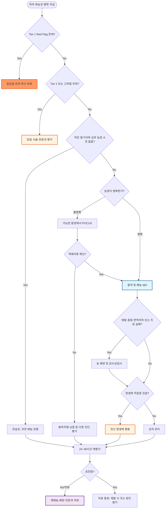

# 농양 Abscess, 종기증 Furunculosis

## <mark style="color:green;">일반 사항</mark>

* 고름집, 농양(abscess): 진피 또는 피하조직에 고름이 국한되어 고인 상태
* 종기(furuncle): 모낭 감염이 진피와 피하조직까지 깊어져 통증성 염증성 결절과 농포를 형성한 상태
* 큰종기(carbuncle): 인접한 여러 모낭의 종기가 융합되어 여러 배농구와 격벽을 형성한 깊은 감염
* 호발 부위 : 마찰·압력·습기에 노출되는 털이 많은 부위(목, 겨드랑이, 엉덩이, 사타구니, 허벅지 등)
* 작은 종기(furuncle)는 온습포 후 자연 배농되기도 하지만, 피부농양, 크기가 큰 종기(large furuncle) 및 모든 큰종기(carbuncle)는 충분한 절개 및 배농이 치료의 핵심이다 [IDSA SSTI Guideline, 2014].
* 흉터를 남기거나 재발할 수 있다. 재발성 종기증은 흔히 12개월에 3회 이상 발생하는 경우를 말한다. 재발은 드물지 않으며 보고율은 대상 집단, 원인균 및 추적기간에 따라 크게 다르다.

## <mark style="color:green;">원인</mark>

### <mark style="color:orange;">원인균</mark>

* 종기와 큰종기의 주된 원인균은 *Staphylococcus aureus*이다.
* 피부농양은 *S. aureus* 단독 감염이 가장 흔하지만, 항문주위·회음부 등에서는 피부 또는 인접 점막의 균이 관여한 복합감염일 수 있다.
* 과거 MRSA 감염·보균, 최근 입원·항생제 사용, 밀접 접촉 집단 내 발생 및 치료 실패 시 MRSA 가능성을 고려한다. 국내 지역사회 화농성 감염의 MRSA 역학 자료는 제한적이므로 가능한 경우 배양 및 지역 감수성 자료를 참고한다.

### <mark style="color:orange;">위험 인자</mark>

* 당뇨병, 비만, 흡연
* 아토피피부염·습진 등 피부장벽 손상
* 면역억제 질환 또는 면역억제제 사용
* 비강·피부의 *S. aureus* 보균
* 면도, 피부 외상, 마찰·발한·밀폐
* 수건·면도기·운동장비 공유, 가족 또는 밀접 접촉 집단 내 감염
* 화농성 한선염, 모소낭, 표피낭종, 잔류 이물질

## <mark style="color:green;">임상 양상</mark>

* 국소 : 발적, 부종, 열감, 통증 및 압통이 있는 구진·결절이 점차 커지며 중심 농포 또는 파동성을 보인다.
* 농양 : 압통성 결절 또는 종괴, 중심부 연화·파동, 자연 배농 및 주변 봉와직염
* 큰종기 : 여러 배농구, 격벽 및 보다 깊은 염증을 동반하며 당뇨병 환자에서 더 흔할 수 있다.
* 전신 증상은 보통 없지만 중증에서는 발열, 오한, 권태감 및 패혈증이 동반될 수 있다.

### <mark style="color:orange;">화농성 병변을 시사하는 소견</mark>

* 중심부 연화 또는 파동
* 황색·백색 농포 또는 배농구
* 자연 배농되는 농성 분비물
* 초음파에서 후방음향증강을 동반한 액체저류, 내부 debris 또는 격벽 - 임상적 파동성보다 민감도가 높아 판단이 애매할 때 도움이 된다.

### <mark style="color:$danger;">🚩 Red Flags!</mark>

<mark style="color:$danger;">**즉각 조치 또는 의뢰**</mark> <mark style="color:$danger;">- 생명 위협 또는 즉각적 위해 가능성</mark>

* 저혈압, 의식 변화, 빈호흡 등 패혈증 또는 혈역학적 불안정
* 외견에 비해 심한 통증, 빠른 진행, 긴장성 부종, 수포·자반·괴사, 염발음 또는 감각저하 등 괴사성 연조직 감염 의심
* 회음부 병변에서 심한 통증·빠른 진행·괴사 또는 전신독성 등 Fournier gangrene 의심
* 눈 주위 병변과 시력저하, 복시, 안구돌출 또는 안구운동통
* 심부 손 감염, 건초·관절·근육 침범 의심

<mark style="color:$warning;">**당일 또는 조기 의뢰**</mark>

* 얼굴 중앙부(danger triangle: 드물지만 해면정맥동 혈전증 등 심부 합병증 위험), 손, 유방 등 해부학적 고위험 부위
* 크거나 깊은 병변, 신경·혈관에 인접한 병변 또는 진료실에서 안전하고 충분한 배농이 어려운 경우
* 면역저하 또는 조절되지 않는 당뇨 환자에서 발생한 급성 농양, 다발성 병변
* 광범위하거나 빠르게 확대되는 주변 봉와직염
* 항문주위·회음부 농양 - 적절한 외과적 배농이 필요하며, 항문누공의 동반 또는 추후 형성 가능성을 고려하여 외과 평가

<mark style="color:$info;">**외래 추적 / 추가 평가 계획**</mark> <mark style="color:$info;">- 즉각 위험 낮으나 호전 없으면 의뢰</mark>

* 배농 후 통증·홍반·배농이 24\~48시간 내 호전되지 않거나 병변이 확대됨
* 새로운 발열 또는 전신 증상 발생
* 같은 부위에 반복되는 농양 - 화농성 한선염·모소낭·표피낭종 감별 필요


**⚠️ 괴사성 연조직 감염 및 Fournier gangrene 의심 시**\
피부 소견에 비해 통증이 현저히 심하거나 짧은 시간 내 급속히 진행하면 즉시 외과·응급 평가를 의뢰한다. 진단을 확인하기 위해 영상검사(CT/MRI)를 기다리며 수술적 평가를 지연하지 않는다.


## <mark style="color:green;">진단</mark>

* 전형적인 표재성 농양·종기는 병력과 진찰로 진단한다.
* 크기, 깊이, 파동성, 주변 홍반의 범위, 배농 여부 및 고위험 부위를 확인한다.
* 당뇨병, 면역저하, 과거 MRSA 감염·보균, 최근 항생제 사용, 반복 재발 및 가족·집단 내 동시 발생을 확인한다.

#### <mark style="color:$primary;">미생물 검사</mark>

* 농양과 큰종기의 농 검체로 그람염색 및 배양 검사를 권고할 수 있으나, 전형적인 단순 병변은 검사 없이 치료할 수 있다.
* 재발, 중증, 면역저하, 치료 실패, 집단발생 또는 비전형적 노출에서는 배농 시 배양 검사를 적극 시행한다.
* 염증성 표피낭종은 낭 내용물 유출에 따른 무균성 염증인 경우가 많으므로 routine culture를 시행하지 않는다.
* 패혈증, 중증 면역저하 또는 균혈증이 의심되는 경우 혈액배양, CBC, CRP, lactate, 신·간기능 등을 평가한다.
* 근육 침범이 의심되면 CK를 측정하고 pyomyositis를 평가한다.

#### <mark style="color:$primary;">영상 검사</mark>

* 파동성이 불명확하거나 심부·소형 농양이 의심될 때 point-of-care 초음파(POCUS)로 액체저류, 깊이, 격벽 및 주변 혈관·신경 구조를 확인한다. 임상적 촉진만으로는 파동성 판단이 부정확할 수 있어 POCUS를 사용할 수 있는 환경에서는 유용한 보조 수단이다.
* 골수염, pyomyositis, 심부 공간 감염 또는 괴사성 연조직 감염이 의심되면 CT 또는 MRI를 고려한다. 단, 괴사성 감염이 임상적으로 의심되면 영상검사 때문에 수술 평가를 지연하지 않는다.

### <mark style="color:orange;">감별</mark>

* 국소 화농성 결절·농양으로 나타날 수 있는 질환들의 감별

<table><thead><tr><th width="170">질환</th><th>핵심 감별 포인트</th></tr></thead><tbody><tr><td>염증성 표피낭종(epidermoid cyst)</td><td>기존 결절이 급성으로 붓고 아프며 중심 punctum, 치즈양·악취성 내용물을 보일 수 있음; 배농 시 routine culture 불필요. 급성 염증기에는 필요 시 I&D로 염증을 조절하고, 낭벽이 부서지기 쉬워 완전 적출이 어려우므로 염증이 가라앉은 뒤 낭벽을 포함한 완전절제를 시행</td></tr><tr><td>화농성 한선염(hidradenitis suppurativa)</td><td>겨드랑이, 사타구니, 엉덩이, 유방 아래 등 간찰부에 재발하는 통증성 결절·농양, draining tunnel 및 반흔을 보이는 모낭폐쇄성 만성 염증질환</td></tr><tr><td>모소낭(pilonidal disease)</td><td>둔부 틈새 상부의 반복되는 농양 또는 배농구</td></tr><tr><td>Kerion/tinea profunda</td><td>깊은 진균성 모낭염; 탈모, 인설 및 반복되는 농포성 병변 동반 가능</td></tr><tr><td>Pyomyositis</td><td>깊은 근육통·부종, 발열; 표재성 파동은 없는 경우가 많음</td></tr><tr><td>기타</td><td>감염된 이물반응, 화농성 림프절염, 감염성 점액낭염</td></tr></tbody></table>

***


```mermaid
graph TD
    Start([피부 화농성 병변 의심]) --> RF{Tier 1 Red Flag 존재?}
    RF -- Yes --> ER[응급실·외과 즉시 의뢰]
    RF -- No --> Risk{Tier 2 또는 고위험 부위?}
    Risk -- Yes --> SameDay[당일 시술·전문과 평가]
    Risk -- No --> Small{작은 종기이며 심부 농양 소견 없음?}
    Small -- Yes --> Warm[온습포, 자연 배농 관찰]
    Small -- No --> Fluct{농양이 명확한가?}
    Fluct -- 불명확 --> US[가능한 환경에서 POCUS]
    US --> Fluid{액체저류 확인?}
    Fluid -- No --> Other[봉와직염·낭종 등 다른 진단 평가]
    Fluid -- Yes --> ID[절개 및 배농 I&D]
    Fluct -- 명확 --> ID
    ID --> CultureQ{재발·중증·면역저하 또는 치료 실패?}
    CultureQ -- Yes --> Culture[농 배양 및 감수성검사]
    CultureQ -- No --> Abx{항생제 적응증 있음?}
    Culture --> Abx
    Abx -- Yes --> Sys[전신 항생제 병용]
    Abx -- No --> Wound[상처 관리]
    Sys --> Recheck
    Wound --> Recheck[24~48시간 재평가]
    Warm --> Recheck
    Other --> Recheck
    Recheck --> Better{호전됨?}
    Better -- No/악화 --> Refer[재배농·배양·전문과 의뢰]
    Better -- Yes --> Done[치료 종료; 재발 시 국소 원인 평가]

    style ER fill:#f96,stroke:#e65100,stroke-width:2px
    style SameDay fill:#fff3e0,stroke:#e65100,stroke-width:2px
    style ID fill:#e1f5fe,stroke:#01579b,stroke-width:2px
    style Sys fill:#fff3e0,stroke:#e65100,stroke-width:2px
    style Refer fill:#f3e5f5,stroke:#4a148c,stroke-width:2px
```

<p align="center"><strong>진단 및 치료 알고리듬</strong></p>

<p align="center"><em><mark style="color:$info;">Ref. IDSA SSTI Guideline (2014 update); BMJ Rapid Recommendation, Antibiotics after I&D for uncomplicated skin abscesses (2018)</mark></em></p>

***

## <mark style="background-color:$warning;">Management</mark>


**치료 원칙 - I&D가 핵심, 항생제는 보조**

전신 항생제는 절개 및 배농(I&D)을 대체하지 못하며, 충분한 배농이 이루어지지 않으면 항생제만으로 치유되지 않는다. 항생제 병용 여부는 병변 크기만으로 정하지 않고 전신 증상, 봉와직염 범위, 배농의 적절성, 숙주 위험 인자로 결정한다.


### <mark style="color:orange;">치료 방침</mark>

* 작은 종기 : 온습포로 자연 배농을 돕고 악화 여부를 추적한다. 화상 위험이 없도록 온도를 확인한다.
* 피부농양, 크기가 큰 종기(large furuncle) 및 모든 큰종기(carbuncle) : 충분한 절개 및 배농(I&D)이 핵심 치료이다.
* 국소 항생제는 농양강의 고름을 제거하지 못하므로 I&D를 대신할 수 없으며, 배농 후 상처에 mupirocin을 일률적으로 도포하지 않는다.
* 전신 항생제는 I&D의 보조 치료이며, 전신 증상, 광범위하거나 진행하는 봉와직염, 면역저하, 다발성·재발성 병변, 불완전 배농 또는 MRSA 위험 등을 고려하여 결정한다.
* 병변 크기만으로 항생제 투여를 결정하지 않는다. 비교적 큰 병변(예: ≥2 cm)은 주변 봉와직염, 배농의 적절성, 전신 증상 및 숙주 방어상태와 함께 판단하는 보조 요소이다.

### <mark style="color:orange;">절개 및 배농</mark>

* 적절한 국소마취 후 충분히 절개하여 고름을 배출하고, 격벽과 loculation을 조심스럽게 해체한다.
* 배양이 필요한 경우 가능하면 항생제 투여 전에 배농 검체를 채취한다.
* 단순 소농양에 routine packing은 치료 성공률을 높이지 못하고 통증을 증가시킬 수 있어 권고하지 않는다.
* 큰 공동, 지속 출혈, 불완전 배농 등에서는 선택적으로 packing 또는 loop drainage를 고려한다 (☞ 시술 및 기타 처치).
* 24\~48시간 후 상처, 배농 상태 및 주변 홍반을 재평가한다.

## <mark style="color:green;">시술 및 기타 처치</mark>

### <mark style="color:orange;">Loop drainage 기법</mark>

* 선택된 표재성 피부농양, 특히 소아에서 conventional I&D와 packing의 대안으로 loop drainage를 고려할 수 있다. 성인에서는 근거가 제한적이며 conventional I&D가 표준치료이다. 다만 선택된 환자에서는 통증과 상처관리 부담을 줄일 가능성이 있다.
* 병변 양 끝에 소절개(stab incision)를 가하고 vessel loop 또는 실리콘 드레인을 공동 내부로 통과시켜 양 절개창을 연결한 뒤 느슨하게 묶는다.
* 반복적인 packing 교환 없이 지속 배농이 가능해 통증과 재방문 부담을 줄일 수 있다.
* 배농이 멈추고 주변 염증이 호전되면 제거하며, 제거 시점은 병변과 기법에 따라 조정한다(대개 수일\~1주 전후).
* 대형·다격벽 병변, 안전한 처치가 어려운 부위는 외과 의뢰를 우선한다.

## <mark style="color:green;">비-약물 치료 및 예방</mark>

* 배농되는 상처는 깨끗한 드레싱으로 덮고, 분비물로 젖으면 교환한다. 배액구를 밀폐성 연고나 드레싱으로 막지 않는다.
* 병변을 짜거나 바늘로 임의 천자하지 않는다. 특히 얼굴 중앙부 병변은 조작하지 않는다.
* 상처 처치 전후 손 씻기를 시행한다.
* 수건, 면도기, 의복 및 운동장비를 공유하지 않는다.
* 재발 시 당뇨병, 화농성 한선염, 모소낭, 표피낭종, 이물질, 면역억제 상태·약물 및 가족·집단 내 전파 가능성을 평가한다.
* 비타민 C 고용량 투여는 재발성 종기증의 일반 치료로 권고하지 않는다.

## <mark style="color:green;">약물 치료</mark>

### <mark style="color:orange;">항생제 적응증</mark>

다음 중 하나 이상이면 I&D와 함께 전신 항생제를 적극 고려한다.

* 발열, 오한, 빈맥, 저혈압 등 전신 증상 또는 패혈증
* 광범위하거나 진행하는 주변 봉와직염
* 면역저하 또는 조절되지 않는 당뇨
* 다발성·재발성 병변
* 충분한 배농이 어렵거나 배농 후에도 악화
* 과거 MRSA 감염·보균, 밀접 접촉 집단 내 MRSA 발생 또는 초기 치료 실패
* 해부학적 고위험 부위 또는 심부 감염

충분히 배농된 단순 농양에서도 항생제를 병용하면 치료 성공률과 새로운 병변 발생을 소폭 개선할 수 있다 [Talan et al., NEJM 2016; Daum et al., NEJM 2017]. 다만 대부분은 I&D만으로 호전되므로 병변 범위, 재발 위험, 지역 MRSA 역학, 약물 부작용 및 환자 선호를 함께 고려한다 [BMJ Rapid Recommendation, 2018].

### <mark style="color:orange;">경구 항생제</mark>

#### <mark style="color:$primary;">MSSA 및 연쇄구균 치료가 필요한 경우</mark>

* amoxicillin/clavulanate 500/125 ㎎ tid 또는 875/125 ㎎ bid <mark style="color:blue;">\[오구멘틴 등]</mark>
* cephalexin 500 ㎎ tid <mark style="color:blue;">\[팔렉신 등]</mark>
  * 중증도와 총 일일용량에 따라 qid로 투여할 수 있으며 신기능에 따라 감량한다.
* clindamycin 300\~450 ㎎ tid\~qid <mark style="color:blue;">\[훌그램 등]</mark>
  * 지역 감수성 자료와 배양 결과를 확인하고, 유도성 내성이 의심되면 D-test 결과를 참고한다.

#### <mark style="color:$primary;">MRSA가 의심되거나 확인된 경우</mark>

* doxycycline 100 ㎎ bid <mark style="color:blue;">\[독시사이클린]</mark>
* TMP/SMX-DS 1\~2정 bid (160/800 ㎎/정) <mark style="color:blue;">\[셉트린 등]</mark>
  * 일반 처방례의 1정 bid는 하루 총 2정이며, 배농된 단순 농양 RCT에서는 2정 bid(하루 총 4정)를 사용하였다 [Talan et al., NEJM 2016]. 고용량 선택 시 신기능, 고칼륨혈증 위험 및 ACEi/ARB·spironolactone 병용을 확인한다.
* clindamycin 300\~450 ㎎ tid\~qid : 감수성이 확인되거나 지역 내 감수성이 충분한 경우

Doxycycline과 TMP/SMX는 동반된 연쇄구균성 비화농성 봉와직염에 대한 효과가 불확실할 수 있다. 광범위한 주변 봉와직염이 있으면 amoxicillin/clavulanate 또는 cephalexin 병용을 고려하거나, 배양·감수성에 따라 단일 약제를 선택한다. 임신·수유 및 소아에서는 약제별 허가사항과 위험을 별도로 확인한다. TMP/SMX는 생후 2개월 미만에서 사용하지 않으며, doxycycline은 임신 중 피한다. 8세 미만 소아의 일반 피부감염에서는 대체약을 우선 고려하되, 단기간 doxycycline의 치아 착색 위험은 과거에 평가된 것보다 낮다.

MRSA와 연쇄구균을 동시에 포괄해야 하면서 β-lactam 사용이 어려운 경우, 감수성이 확인되었거나 지역 내 감수성이 충분하다면 clindamycin 단독요법을 고려할 수 있다. 유도성 내성(D-test)과 *C. difficile* 감염 위험을 함께 고려한다.

### <mark style="color:orange;">치료 기간</mark>

* 항생제가 필요한 배농된 농양 : 대부분 5\~7일. 배농이 충분하고 임상 반응이 양호하면 5일로 종료할 수 있다.
* 치료 반응이 느리거나 병변이 광범위한 경우, 면역저하 환자 : 임상 반응에 따라 7\~10일까지 연장
* 재발성 농양 : 조기 배농·배양 후 확인된 원인균에 유효한 항생제를 5\~10일 투여

### <mark style="color:orange;">중증 감염</mark>

* 패혈증, 빠른 진행, 심부 감염, 괴사성 감염 의심 또는 경구치료 불가능 시 입원 및 외과·감염내과 평가가 필요하다.
* 배양, 신기능 및 지역 감수성에 따라 vancomycin, linezolid 등 MRSA 활성 정주 항생제와 필요한 광범위 항생제를 선택한다.
* 중증 침습성 MRSA 감염에서 vancomycin은 고정 용량보다 신기능·체중을 반영하여 투여하고, 가능한 경우 AUC/MIC 400\~600을 목표로 모니터링한다.

### <mark style="color:orange;">재발성 농양 및 집락제거</mark>

* 같은 부위에 재발하면 화농성 한선염, 모소낭, 표피낭종, 잔류 이물질 등 국소 원인을 먼저 찾는다.
* 당뇨병, 면역억제 질환·약물 및 HIV 위험요인 등 전신적 소인도 평가한다.
* 재발 병변은 조기에 배농·배양하고 배양 결과에 따라 5\~10일간 치료한다.
* 반복되는 *S. aureus* 감염 또는 가족·밀접 접촉 집단 내 반복 전파에서는 활동성 감염을 치료한 뒤 다음 5일 집락제거 요법을 고려한다.
  * 비강 mupirocin bid
  * 매일 4% chlorhexidine 세정 : 눈·귀·얼굴·점막 및 생식기 내부 접촉을 피하고 피부자극 여부를 확인
  * 수건, 침구, 잠옷 및 의복을 매일 세탁하고 개인위생 물품을 공유하지 않음
* 집락제거를 목적으로 rifampin이나 clindamycin 등 경구항생제를 일률적으로 장기간 투여하지 않는다.
* 집락제거는 재발 빈도를 줄이는 데는 도움이 될 수 있으나 완전한 재발 예방을 보장하지는 못하므로, 반복 재발 시에는 집락제거와 별도로 국소 원인(화농성 한선염, 모소낭 등)을 반드시 재평가한다.
* 성인에서 호중구 기능검사는 일반적으로 필요하지 않다. 소아기부터 재발했거나 비전형적·중증 감염, 다른 반복 감염 병력 또는 상처 치유 장애가 있으면 CBC with differential 및 면역·호중구 기능 이상 평가를 고려한다.

### <mark style="color:orange;">진통제</mark>

* ibuprofen 200\~400 ㎎ tid\~qid 필요 시 <mark style="color:blue;">\[부루펜]</mark>
  * 위장관 출혈, 신기능 저하, 심혈관질환 및 항응고제 사용 여부를 확인한다.
* NSAID 금기 시 acetaminophen을 사용한다.

***

### <mark style="color:red;">질병코드</mark>

L02.0　얼굴의 피부 고름집(농양), 종기 및 큰종기

L02.1　목의 피부 고름집(농양), 종기 및 큰종기

L02.2　몸통의 피부 고름집(농양), 종기 및 큰종기

L02.3　둔부의 피부 고름집(농양), 종기 및 큰종기

L02.4　사지의 피부 고름집(농양), 종기 및 큰종기

L02.8　기타 부위의 피부 고름집(농양), 종기 및 큰종기

L02.9　상세불명 부위의 피부 고름집(농양), 종기 및 큰종기

***

## <mark style="color:purple;">처방례</mark>

> **처방례 1. 충분히 배농된 단순 농양** (전신 증상·광범위 봉와직염 없음)
>
> ```
> 절개 및 배농, 청결 드레싱
> 부루펜 200 mg/T　3T #3　1T tid 필요 시
> ```
>
> _✽항생제 없이 I&D만으로 충분한 전형적인 경우. Routine packing이나 국소 항생제 도포는 권장하지 않는다. 24~48시간 후 상처 재평가._

> **처방례 2. 배농 후 주변 봉와직염 동반, MRSA 위험 낮음**
>
> ```
> 오구멘틴 625 mg/T　3T #3　5~7일
> 부루펜 200 mg/T　3T #3　1T tid 필요 시
> ```
>
> _✽광범위한 주변 봉와직염이 있거나 MRSA 위험이 낮을 때 β-lactam 단독으로 무난. cephalexin 500 mg tid로 대체 가능. 24~48시간 후 재평가._

> **처방례 3. 배농 후 MRSA 위험 또는 배양 확인**
>
> ```
> 셉트린DS정 160/800 mg/T　2T #2　1T bid × 7일
> 또는 독시사이클린 100 mg/C　2C #2　1C bid × 5~7일
> ```
>
> _✽위 처방은 TMP/SMX-DS 1T bid(하루 총 2정)의 일반 용량이다. Talan 연구에서는 2T bid(하루 총 4정)를 사용했으며, 고용량은 신기능·고칼륨혈증 위험·병변 범위를 고려하여 선택한다. 광범위한 주변 봉와직염이 있으면 연쇄구균을 포괄하는 β-lactam 병용을 고려하거나 배양·감수성에 따라 단일 약제를 선택한다. 임신·수유 및 소아에서는 약제별 허가사항을 확인한다._

> **처방례 4. 재발성 농양, 집락제거 병행** (활동성 감염 치료 완료 후 시작)
>
> ```
> 비강 mupirocin 연고  bid × 5일
> 4% chlorhexidine 전신 세정  1일 1회 × 5일
> ```
>
> _✽수건·침구·잠옷을 매일 세탁하고 개인위생 물품 공유를 금지. 집락제거만으로 재발을 완전히 막지 못하므로 국소 원인(화농성 한선염, 모소낭, 이물질 등) 평가가 우선._

> **처방례 5. 중증·전신독성 또는 심부·고위험 부위 감염**
>
> ```
> 외래 경구 처방 보류
> 당일 응급실·외과 평가 의뢰, 입원 정주치료 고려
> ```
>
> _✽Fournier gangrene, 괴사성 근막염 등이 의심되면 영상검사로 수술 평가를 지연하지 않는다._

***

### <mark style="color:$success;">핵심 복약 지도</mark>

> **절개 및 배농 후 상처 관리**
>
> * 배농된 상처는 깨끗한 드레싱으로 덮고 분비물로 젖으면 자주 교환하도록 안내합니다.
> * 배액구를 밀폐성 연고나 방수 드레싱으로 막지 않도록 설명합니다 - 배액이 막히면 재축적·재발 위험이 있습니다.
> * Packing이나 loop drain을 시행한 경우 제거 시점과 방법을 명확히 안내합니다.

> **항생제 처방 시**
>
> * 항생제가 처방된 경우 증상이 빨리 좋아지더라도 임의로 중단하지 말고 처방된 기간을 완료하도록 안내합니다. 배농이 충분하고 반응이 양호하면 5일로 종료할 수 있으나, 반응이 느리거나 감염이 광범위하면 7~10일까지 연장할 수 있습니다.
> * TMP/SMX·doxycycline은 연쇄구균 봉와직염 커버가 불완전할 수 있어, 주변 홍반이 넓어지면 재내원하도록 설명합니다.
> * TMP/SMX 복용 중 ACEi/ARB, spironolactone 병용 시 고칼륨혈증 위험이 있어 필요 시 전해질 검사를 안내합니다.

> **재발 예방 및 집락제거**
>
> * 같은 부위에 반복되면 화농성 한선염, 모소낭, 표피낭종 등 국소 원인을 먼저 평가해야 함을 설명합니다.
> * 집락제거 요법(비강 mupirocin + chlorhexidine 세정)은 반복 감염 또는 가족 내 전파가 있을 때만 시행하며, 일률적 장기 경구 항생제는 사용하지 않습니다.

> **언제 다시 병원을 방문해야 하나요?**
>
> * 배농 후 24~48시간이 지나도 통증·발적·배농이 호전되지 않거나 오히려 확대되는 경우
> * 새로운 발열, 오한 등 전신 증상이 발생하는 경우
> * 같은 부위에 농양이 반복되는 경우
> * 회음부·항문주위 병변에서 통증이 급격히 심해지거나 전신 증상이 동반되는 경우 - 즉시 내원

### <mark style="color:blue;">환자 안내서</mark>


**농양·종기, 절개 배농이 핵심 치료입니다**

고름이 피부 밑에 고인 상태를 농양(고름집)이라 하며, 모낭에서 시작된 염증이 깊어지면 종기가 됩니다. 항생제만으로는 이미 고인 고름이 빠지지 않으므로, 고름주머니가 형성되어 배농이 필요하다고 판단되는 경우 절개하여 고름을 빼내는 시술이 가장 중요한 치료입니다.


#### <mark style="color:$primary;">왜 농양·종기가 생기나요?</mark>

* 대부분 포도알균(Staphylococcus aureus)이라는 세균이 모낭이나 피부 안으로 들어가 염증을 일으키며 시작됩니다.
* 땀이 많이 차거나 마찰이 있는 부위(목, 겨드랑이, 엉덩이, 사타구니, 허벅지)에 잘 생깁니다.
* 당뇨병, 비만, 흡연, 피부 습진 등이 있으면 더 잘 생기고 잘 낫지 않을 수 있습니다.

#### <mark style="color:$primary;">절개 및 배농 후 어떻게 관리하나요?</mark>

* **상처를 깨끗하게 유지하십시오.** 드레싱이 분비물로 젖으면 새 것으로 교환합니다.
* **병변을 손으로 짜거나 바늘로 찌르지 마십시오.** 특히 코 주변, 입 주변 등 얼굴 중앙부는 절대 만지지 않도록 합니다.
* **수건, 면도기, 옷, 운동 장비를 다른 사람과 함께 쓰지 마십시오.** 세균이 옮을 수 있습니다.
* **상처를 만지기 전후에는 반드시 손을 씻으십시오.**

#### <mark style="color:$primary;">항생제는 어떻게 복용하나요?</mark>

* 항생제가 처방된 경우, 증상이 좋아진 것 같아도 처방된 기간을 다 채워 복용하십시오.
* 통증이 심하면 처방받은 소염진통제를 필요할 때 복용할 수 있습니다.

#### <mark style="color:$primary;">이럴 때는 즉시 병원을 방문하세요</mark>

* 배농 후 24~48시간이 지나도 붓기·통증·고름이 나아지지 않거나 더 심해지는 경우
* 열이 나거나 오한이 드는 경우
* 같은 부위에 농양이 반복해서 생기는 경우
* 항문주위·회음부 병변에서 외견보다 통증이 매우 심하거나, 통증·부종이 빠르게 악화되거나, 피부색 변화·괴사·발열이 동반되는 경우 - 즉시 응급실 방문

#### <mark style="color:$primary;">재발을 막으려면 어떻게 해야 하나요?</mark>

* 반복해서 생긴다면 원인이 될 수 있는 다른 피부 질환이 있는지 진료를 받으십시오.
* 필요한 경우 의사가 코 안에 바르는 연고와 몸 전체를 씻는 소독액(chlorhexidine)을 5일간 사용하도록 안내할 수 있습니다.
* Chlorhexidine 세정액은 눈·귀·얼굴·점막 및 생식기 내부에 닿지 않도록 하고, 심한 자극이나 발진이 생기면 사용을 중단하십시오.
* 수건, 침구, 잠옷은 자주 세탁하고 개인위생 물품은 다른 가족과 나눠 쓰지 마십시오.
