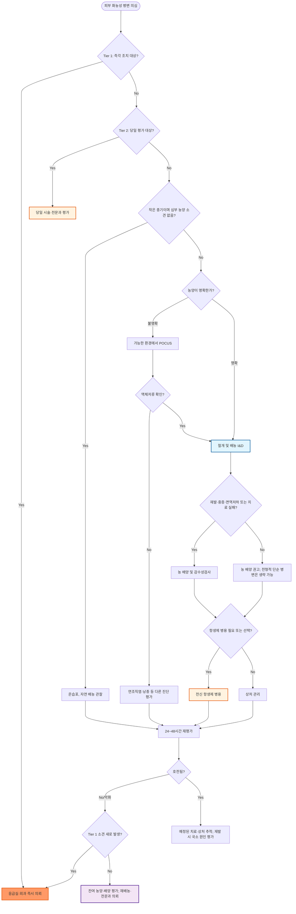

# 농양 Abscess, 종기증 Furunculosis

* 이 챕터는 주로 표재성 피부농양·종기·큰종기를 다룸. 항문주위농양, 유방 실질농양, 심부 손 감염 및 화농성 근육염은 부위별 전문 평가와 배농 방법이 필요함.

## <mark style="color:green;">일반 사항</mark>

* 고름집, 농양(abscess): 진피 또는 피하조직에 고름이 국한되어 고인 상태
* 종기(furuncle): 모낭 감염이 진피와 피하조직까지 깊어져 통증성 염증성 결절과 농포를 형성한 상태
* 큰종기(carbuncle): 인접한 여러 모낭의 종기가 융합되어 여러 배농구와 격벽을 형성한 깊은 감염
* 호발 부위 : 마찰·압력·습기에 노출되는 털이 많은 부위(목, 겨드랑이, 엉덩이, 사타구니, 허벅지 등)
* 작은 종기(furuncle)는 온습포 후 자연 배농되기도 하지만, 피부농양, 크기가 큰 종기(large furuncle) 및 모든 큰종기(carbuncle)는 충분한 절개 및 배농이 치료의 핵심임 [IDSA SSTI Guideline, 2014].
* 흉터를 남기거나 재발할 수 있음. 재발성 종기증은 흔히 12개월에 3회 이상 발생하는 경우를 말함. 재발은 드물지 않으며 보고율은 대상 집단, 원인균 및 추적기간에 따라 크게 다름.

## <mark style="color:green;">원인</mark>

### <mark style="color:orange;">원인균</mark>

* 종기와 큰종기의 주된 원인균은 *Staphylococcus aureus*임.
* 피부농양은 *S. aureus* 단독 감염이 가장 흔하지만, 항문주위·회음부 등에서는 피부 또는 인접 점막의 균이 관여한 복합감염일 수 있음.
* 과거 MRSA 감염·보균, 최근 입원·항생제 사용, 밀접 접촉 집단 내 발생 및 치료 실패 시 MRSA 가능성을 고려함. 국내 지역사회 화농성 감염의 MRSA 역학 자료는 제한적이므로 가능한 경우 배양 및 지역 감수성 자료를 참고함.

### <mark style="color:orange;">위험 인자</mark>

* 당뇨병, 비만, 흡연
* 아토피피부염·습진 등 피부장벽 손상
* 면역억제 질환 또는 면역억제제 사용
* 비강·피부의 *S. aureus* 보균
* 면도, 피부 외상, 마찰·발한·밀폐
* 수건·면도기·운동장비 공유, 가족 또는 밀접 접촉 집단 내 감염
* 화농성 한선염, 모소낭, 표피낭종, 잔류 이물질 : 반복되는 농양의 국소 원인으로 평가함

## <mark style="color:green;">임상 양상</mark>

* 국소 : 발적, 부종, 열감, 통증 및 압통이 있는 구진·결절이 점차 커지며 중심 농포 또는 파동성을 보임.
* 농양 : 압통성 결절 또는 종괴, 중심부 연화·파동, 자연 배농 및 주변 연조직염
* 큰종기 : 여러 배농구, 격벽 및 보다 깊은 염증을 동반하며 당뇨병 환자에서 더 흔할 수 있음.
* 전신 증상은 보통 없지만 중증에서는 발열, 오한, 권태감 및 패혈증이 동반될 수 있음.

### <mark style="color:orange;">화농성 병변을 시사하는 소견</mark>

* 중심부 연화 또는 파동
* 황색·백색 농포 또는 배농구
* 자연 배농되는 농성 분비물
* 초음파에서 후방음향증강을 동반한 액체저류, 내부 debris 또는 격벽 - 임상적 파동성보다 민감도가 높아 판단이 애매할 때 도움이 됨.

### <mark style="color:$danger;">🚩 Red Flags!</mark>

<mark style="color:$danger;">**즉각 조치**</mark> <mark style="color:$danger;">- 생명 위협 또는 즉각적 위해 가능성</mark>

* 저혈압, 의식 변화, 빈호흡 등 패혈증 또는 혈역학적 불안정
* 외견에 비해 심한 통증, 빠른 진행, 긴장성 부종, 수포·자반·괴사, 염발음 또는 감각저하 등 괴사성 연조직 감염 의심
* 회음부 병변에서 심한 통증·빠른 진행·괴사 또는 전신독성 등 Fournier gangrene 의심
* 눈 주위 병변과 시력저하, 복시, 안구돌출 또는 안구운동통
* 심부 손 감염, 건초·관절·근육 침범 의심

<mark style="color:$warning;">**당일 평가**</mark>

* 얼굴 중앙부(danger triangle: 드물지만 해면정맥동 혈전증 등 심부 합병증 위험), 손, 유방 등 해부학적 고위험 부위
* 크거나 깊은 병변, 신경·혈관에 인접한 병변 또는 진료실에서 안전하고 충분한 배농이 어려운 경우
* 면역저하 또는 조절되지 않는 당뇨 환자에서 발생한 급성 농양, 다발성 병변
* 광범위하거나 빠르게 확대되는 주변 연조직염
* 배농 후 병변 확대 또는 새로운 발열·오한 등 전신 증상 : 당일 재평가하며, 혈역학적 불안정·괴사성 감염 소견이 있으면 즉각 조치
* 항문주위·회음부 농양 - 적절한 외과적 배농이 필요하며, 항문누공의 동반 또는 추후 형성 가능성을 고려하여 외과 평가

<mark style="color:$info;">**외래 추적 / 추가 평가 계획**</mark> <mark style="color:$info;">- 즉각 위험 낮으나 호전 없으면 의뢰</mark>

* 배농 후 24\~48시간 내 호전 여부를 재평가함. 단순한 홍반·경결 또는 소량 배액의 잔존만으로 치료 실패를 판단하지 않음
* 통증·종창이 지속되거나 배액이 줄지 않으면 잔여 농양·격벽·배액구 폐쇄 여부를 확인하고 재배농 또는 의뢰를 고려함
* 같은 부위에 반복되는 농양 - 화농성 한선염·모소낭·표피낭종 감별 필요


**⚠️ 괴사성 연조직 감염 및 Fournier gangrene 의심 시**\
피부 소견에 비해 통증이 현저히 심하거나 짧은 시간 내 급속히 진행하면 즉시 외과·응급 평가를 의뢰함. 진단을 확인하기 위해 영상검사(CT/MRI)를 기다리며 수술적 평가를 지연하지 않음.


## <mark style="color:green;">진단</mark>

* 전형적인 표재성 농양·종기는 병력과 진찰로 진단함.
* 크기, 깊이, 파동성, 주변 홍반의 범위, 배농 여부 및 고위험 부위를 확인함.
* 당뇨병, 면역저하, 과거 MRSA 감염·보균, 최근 항생제 사용, 반복 재발 및 가족·집단 내 동시 발생을 확인함.

#### <mark style="color:$primary;">미생물 검사</mark>

* 농양과 큰종기의 농 검체로 그람염색 및 배양 검사를 권고함. 다만 전형적인 단순 병변은 배양 없이 치료할 수 있음 [IDSA SSTI Guideline, 2014; 질병관리청 피부·연조직 감염 지침, 2026년 4월 발행].
* 재발, 중증, 면역저하, 치료 실패, 집단발생 또는 비전형적 노출에서는 배농 시 배양 검사를 적극 시행함.
* 염증성 표피낭종은 낭 내용물 유출에 따른 무균성 염증인 경우가 많으므로 routine culture를 시행하지 않음.
* 패혈증, 중증 면역저하 또는 균혈증이 의심되는 경우 혈액배양, CBC, CRP, lactate, 신·간기능 등을 평가함.
* 근육 침범이 의심되면 MRI(불가능하면 CT 등), 혈액배양 및 농 배양으로 화농성 근육염(pyomyositis)을 평가함. CK는 정상인 경우가 흔하므로 정상 CK로 배제하지 않음 [IDSA SSTI Guideline, 2014].

#### <mark style="color:$primary;">영상 검사</mark>

* 파동성이 불명확하거나 심부·소형 농양이 의심될 때 point-of-care 초음파(POCUS)로 액체저류, 깊이, 격벽 및 주변 혈관·신경 구조를 확인함. 임상적 촉진만으로는 파동성 판단이 부정확할 수 있어 POCUS를 사용할 수 있는 환경에서는 유용한 보조 수단임.
* 골수염, pyomyositis, 심부 공간 감염 또는 괴사성 연조직 감염이 의심되면 CT 또는 MRI를 고려함. 단, 괴사성 감염이 임상적으로 의심되면 영상검사 때문에 수술 평가를 지연하지 않음.

### <mark style="color:orange;">감별</mark>

* 국소 화농성 결절·농양으로 나타날 수 있는 질환들의 감별

<table><thead><tr><th width="170">질환</th><th>핵심 감별 포인트</th></tr></thead><tbody><tr><td>염증성 표피낭종(epidermoid cyst)</td><td>기존 결절이 급성으로 붓고 아프며 중심 punctum, 치즈양·악취성 내용물을 보일 수 있음; 배농 시 routine culture 불필요. 급성 염증기에는 필요 시 I&D로 염증을 조절하고, 낭벽이 부서지기 쉬워 완전 적출이 어려우므로 염증이 가라앉은 뒤 낭벽을 포함한 완전절제를 시행</td></tr><tr><td>화농성 한선염(hidradenitis suppurativa)</td><td>겨드랑이, 사타구니, 엉덩이, 유방 아래 등 간찰부에 재발하는 통증성 결절·농양, draining tunnel 및 반흔을 보이는 모낭폐쇄성 만성 염증질환</td></tr><tr><td>모소낭(pilonidal disease)</td><td>둔부 틈새 상부의 반복되는 농양 또는 배농구</td></tr><tr><td>Kerion/tinea profunda</td><td>깊은 진균성 모낭염; 탈모, 인설 및 반복되는 농포성 병변 동반 가능</td></tr><tr><td>Pyomyositis</td><td>깊은 근육통·부종, 발열; 표재성 파동은 없는 경우가 많음</td></tr><tr><td>헤르페스성 손끝염(herpetic whitlow)</td><td>손가락 끝의 작열감·통증과 군집성 수포; 탁한 수포액을 고름으로 오인할 수 있음. 세균성 농양으로 오인하여 절개·배농하지 않음</td></tr><tr><td>기타</td><td>감염된 이물반응, 화농성 림프절염, 감염성 점액낭염</td></tr></tbody></table>

***


```mermaid
graph TD
    Start([피부 화농성 병변 의심]) ---> RF{Tier 1: 즉각 조치 대상?}
    RF -- Yes ---> ER[응급실·외과 즉시 의뢰]
    RF -- No ---> Risk{Tier 2: 당일 평가 대상?}
    Risk -- Yes ---> SameDay[당일 시술·전문과 평가]
    Risk -- No ---> Small{작은 종기이며 심부 농양 소견 없음?}
    Small -- Yes ---> Warm[온습포, 자연 배농 관찰]
    Small -- No ---> Fluct{농양이 명확한가?}
    Fluct -- 불명확 ---> US[가능한 환경에서 POCUS]
    US ---> Fluid{액체저류 확인?}
    Fluid -- No ---> Other[연조직염·낭종 등 다른 진단 평가]
    Fluid -- Yes ---> ID[절개 및 배농 I&D]
    Fluct -- 명확 ---> ID
    ID ---> CultureQ{재발·중증·면역저하 또는 치료 실패?}
    CultureQ -- Yes ---> Culture[농 배양 및 감수성검사]
    CultureQ -- No ---> OptionalCulture[농 배양 권고; 전형적 단순 병변은 생략 가능]
    OptionalCulture ---> Abx{항생제 병용 필요 또는 선택?}
    Culture ---> Abx
    Abx -- Yes ---> Sys[전신 항생제 병용]
    Abx -- No ---> Wound[상처 관리]
    Sys ---> Recheck
    Wound ---> Recheck[24~48시간 재평가]
    Warm ---> Recheck
    Other ---> Recheck
    Recheck ---> Better{호전됨?}
    Better -- No/악화 ---> Triage{Tier 1 소견 새로 발생?}
    Triage -- Yes ---> ER
    Triage -- No ---> Refer[잔여 농양·배양 평가; 재배농·전문과 의뢰]
    Better -- Yes ---> Done[예정된 치료·상처 추적; 재발 시 국소 원인 평가]

    style ER fill:#f96,stroke:#e65100,stroke-width:2px
    style SameDay fill:#fff3e0,stroke:#e65100,stroke-width:2px
    style ID fill:#e1f5fe,stroke:#01579b,stroke-width:2px
    style Sys fill:#fff3e0,stroke:#e65100,stroke-width:2px
    style Refer fill:#f3e5f5,stroke:#4a148c,stroke-width:2px
```

<p align="center"><strong>진단 및 치료 알고리듬</strong></p>

<p align="center"><em><mark style="color:$info;">Ref. 질병관리청 피부·연조직 감염 지침 (2026년 4월 발행); IDSA SSTI Guideline (2014 update); BMJ Rapid Recommendation, Antibiotics after I&D for uncomplicated skin abscesses (2018)</mark></em></p>

***

## <mark style="background-color:$warning;">Management</mark>


**치료 원칙 - I&D가 핵심, 항생제는 보조**

배농이 필요한 피부농양에서 전신 항생제는 절개 및 배농(I&D)을 대체하지 못함. 작은 종기는 온습포 후 자연 배농되기도 하지만, 배농이 필요한 농양에서 항생제만 처방하며 시술을 지연하지 않음. 항생제 병용 여부는 병변 크기만으로 정하지 않고 전신 증상, 연조직염 범위, 배농의 적절성, 숙주 위험 인자로 결정함.


### <mark style="color:orange;">치료 방침</mark>

* 작은 종기 : 온습포로 자연 배농을 돕고 악화 여부를 추적함. 화상 위험이 없도록 온도를 확인함.
* 피부농양, 크기가 큰 종기(large furuncle) 및 모든 큰종기(carbuncle) : 충분한 절개 및 배농(I&D)이 핵심 치료임.
* 국소 항생제는 농양강의 고름을 제거하지 못하므로 I&D를 대신할 수 없으며, 배농 후 상처에 mupirocin을 일률적으로 도포하지 않음.
* 전신 항생제는 I&D의 보조 치료이며, 전신 증상, 광범위하거나 진행하는 연조직염, 면역저하, 다발성·재발성 병변, 불완전 배농 또는 MRSA 위험 등을 고려하여 결정함.
* 병변 크기만으로 항생제 투여를 결정하지 않음. 비교적 큰 병변(예: ≥2 cm)은 주변 연조직염, 배농의 적절성, 전신 증상 및 숙주 방어상태와 함께 판단하는 보조 요소임.

### <mark style="color:orange;">절개 및 배농</mark>

* 적절한 국소마취 후 충분히 절개하여 고름을 배출하고, 격벽과 loculation을 조심스럽게 해체함.
* 배양이 필요한 경우 가능하면 항생제 투여 전에 배농 검체를 채취함.
* 단순 소농양에 routine packing은 치료 성공률을 높이지 못하고 통증을 증가시킬 수 있어 권고하지 않음.
* 큰 공동이나 배액구 유지가 필요한 경우에는 선택적으로 packing 또는 loop drainage를 고려함. 지속 출혈은 지혈을 우선하고, 불완전 배농은 잔여 농양·격벽을 평가하여 재배농 또는 외과 의뢰함. Packing으로 불완전 배농을 대신하지 않음 (☞ 시술 및 기타 처치).
* 일반 피부농양의 단순 바늘 흡인은 I&D의 대안으로 권고하지 않음. 유방 실질농양 등은 전문과에서 초음파 유도 흡인·카테터 배농 등 부위별 방법을 선택함.
* 24\~48시간 후 상처, 배농 상태 및 주변 홍반을 재평가함.

## <mark style="color:green;">시술 및 기타 처치</mark>

### <mark style="color:orange;">Loop drainage 기법</mark>

* 선택된 표재성 피부농양, 특히 소아에서 conventional I&D와 packing의 대안으로 loop drainage를 고려할 수 있음. 성인에서는 근거가 제한적이며 conventional I&D가 표준치료임. 다만 선택된 환자에서는 통증과 상처관리 부담을 줄일 가능성이 있음.
* 병변 양 끝에 소절개(stab incision)를 가하고 vessel loop 또는 실리콘 드레인을 공동 내부로 통과시켜 양 절개창을 연결한 뒤 느슨하게 묶음.
* 반복적인 packing 교환 없이 지속 배농이 가능해 통증과 재방문 부담을 줄일 수 있음.
* 배농이 멈추고 주변 염증이 호전되면 제거하며, 제거 시점은 병변과 기법에 따라 조정함(대개 수일\~1주 전후).
* 대형·다격벽 병변, 안전한 처치가 어려운 부위는 외과 의뢰를 우선함.

## <mark style="color:green;">비-약물 치료 및 예방</mark>

* 배농되는 상처는 깨끗한 드레싱으로 덮고, 분비물로 젖으면 교환함. 배액구를 밀폐성 연고나 드레싱으로 막지 않음.
* 병변을 짜거나 바늘로 임의 천자하지 않음. 특히 얼굴 중앙부 병변은 조작하지 않음.
* 상처 처치 전후 손 씻기를 시행함.
* 수건, 면도기, 의복 및 운동장비를 공유하지 않음.
* 재발 시 당뇨병, 화농성 한선염, 모소낭, 표피낭종, 이물질, 면역억제 상태·약물 및 가족·집단 내 전파 가능성을 평가함.
* 비타민 C 고용량 투여는 재발성 종기증의 일반 치료로 권고하지 않음.

## <mark style="color:green;">약물 치료</mark>

### <mark style="color:orange;">항생제 적응증</mark>

다음은 I&D와 함께 전신 항생제 병용을 권고하거나 적극 고려하는 상황임. 전신 증상, 광범위·진행성 연조직염 및 뚜렷한 면역저하가 있으면 병용을 권고함. 다발성·재발성 병변, MRSA 위험 또는 고위험 부위는 배농 상태·숙주 위험·배양 결과를 함께 평가하여 병용 여부와 약제를 결정함.

* 발열, 오한, 빈맥, 저혈압 등 전신 증상 또는 패혈증
* 광범위하거나 진행하는 주변 연조직염
* 면역저하 또는 조절되지 않는 당뇨
* 다발성·재발성 병변
* 충분한 배농이 어렵거나 배농 후에도 악화
* 과거 MRSA 감염·보균, 밀접 접촉 집단 내 MRSA 발생 또는 초기 치료 실패 : 항생제를 사용할 경우 MRSA 활성 약제 선택을 고려함
* 해부학적 고위험 부위 또는 심부 감염 : 당일 전문과 평가하며, 심부 손 감염·괴사성 감염 등은 즉각 조치

충분히 배농된 단순 농양에서도 항생제를 병용하면 치료 성공률과 새로운 병변 발생을 소폭 개선할 수 있음 [Talan et al., NEJM 2016; Daum et al., NEJM 2017]. 다만 대부분은 I&D만으로 호전됨. 질병관리청 지침은 충분히 배농된 단순 병변에서 항생제의 일률적 병용을 권고하지 않음. BMJ 2018은 TMP/SMX 또는 clindamycin 병용을 약하게 권고하므로, 이득·설사 등 부작용·국내 감수성 및 환자 선호를 설명하고 결정함. 이 근거는 MRSA가 흔한 국외 연구에서 도출되었으며 β-lactam 병용으로 같은 이득을 기대할 수는 없음. Doxycycline은 MRSA 활성 대안이나 위 두 RCT의 직접 시험 약제가 아님.

### <mark style="color:orange;">경구 항생제</mark>

* 아래 용량은 성인 기준임. 신기능·간기능, 약물 알레르기, 임신·수유 및 병용약을 확인하며, 소아는 체중과 제품별 허가사항에 따라 별도 산정함.

#### <mark style="color:$primary;">MSSA 및 연쇄구균 치료가 필요한 경우</mark>

* amoxicillin/clavulanate 500/125 ㎎ tid 또는 875/125 ㎎ bid <mark style="color:blue;">\[오구멘틴 등]</mark>
* cephalexin 500 ㎎ qid <mark style="color:blue;">\[팔렉신 등]</mark> : 신기능에 따라 감량함. 단순 MSSA·연쇄구균 감염에서는 1세대 cephalosporin을 우선 고려하고, amoxicillin/clavulanate는 복합감염 가능성 등을 함께 판단하여 선택함.
* clindamycin 300\~450 ㎎ qid(6시간마다) <mark style="color:blue;">\[훌그램 등]</mark>
  * β-lactam 사용이 어렵거나 배양·감수성에 따라 선택함. Erythromycin 내성·clindamycin 감수성 균주에서는 유도성 내성(D-test)을 확인하며, D-test 양성이면 사용하지 않음. 중증 설사·혈변 및 C. difficile 감염 위험을 고려함.

#### <mark style="color:$primary;">MRSA가 의심되거나 확인된 경우</mark>

* doxycycline 100 ㎎ bid <mark style="color:blue;">\[영풍독시사이클린정100㎎ 등]</mark>
  * MRSA 피부농양 치료는 제품별 국내 허가 적응증을 확인함. 영풍독시사이클린정의 피부농양 치료는 허가 외 사용임.
* TMP/SMX 160/800\~320/1,600 ㎎ bid <mark style="color:blue;">\[셉트린정]</mark> : 국내 피부농양 치료는 허가 외 사용이며 급여 인정 여부는 별도 확인함.
  * **국내 셉트린정은 TMP/SMX 80/400 ㎎/정임. 1회 2\~4정 bid에 해당하며, 국외 DS 1\~2정 bid와 정수·함량을 혼동하지 않음.**
  * 국내 허가 상용량은 1회 2정 bid임. 질병관리청 지침의 MRSA 확정 치료 용량 및 Talan 연구 용량은 TMP/SMX 320/1,600 ㎎ bid, 즉 셉트린정 1회 4정 bid에 해당함. 이 고용량은 국내 허가사항의 심한 감염 시 1회 최대 3정 범위도 초과하므로 일률적으로 적용하지 않음.
  * 신기능에 따라 감량함. 국내 허가 용량 기준 CrCl 15\~30 mL/min은 상용량의 1/2, <15 mL/min은 투여 금기임. 국외 고용량을 선택할 때는 적용 용량 기준을 명확히 하고 신기능·K를 확인함.
  * ACEi/ARB·spironolactone 병용에 따른 고칼륨혈증, warfarin 병용에 따른 INR 상승, methotrexate 병용에 따른 골수억제 위험을 확인함. 중증 발진·점막 병변이 발생하면 즉시 중단·평가함.
* clindamycin 300\~450 ㎎ qid(6시간마다) : 감수성이 확인되거나 지역 내 감수성이 충분한 경우

Doxycycline과 TMP/SMX는 동반된 연쇄구균성 비화농성 연조직염에 대한 효과가 불확실할 수 있음. 광범위한 주변 연조직염이 있으면 amoxicillin/clavulanate 또는 cephalexin 병용을 고려하거나, 배양·감수성에 따라 단일 약제를 선택함. 국내 셉트린정은 임부·임신 가능성이 있는 여성·수유부 및 생후 2개월 미만 영아에서 금기임. G6PD 결핍도 금기임. 국내 doxycycline 제품(예: 영풍독시사이클린정)은 임부·수유부 및 12세 미만 소아에서 원칙적으로 금기이며, 중증·생명 위협 질환에서만 예외를 둠. 단기간 doxycycline의 치아 착색 위험에 관한 국외 근거를 일반 피부농양의 소아 처방 근거로 확대하지 않음.

MRSA와 연쇄구균을 동시에 포괄해야 하면서 β-lactam 사용이 어려운 경우, 감수성이 확인되었거나 지역 내 감수성이 충분하다면 clindamycin 단독요법을 고려할 수 있음. 유도성 내성(D-test)과 *C. difficile* 감염 위험을 함께 고려함.

### <mark style="color:orange;">치료 기간</mark>

* 항생제가 필요한 배농된 표재성 피부농양 : 대체로 5\~10일 범위에서 반응에 따라 정함. 국내 지침은 약 5일 치료를 고려하므로, 충분히 배농되고 전신 증상·주변 연조직염이 호전되며 추가 배농이 필요 없으면 5일 종료를 고려함.
* MRSA 활성 항생제 병용 근거의 주요 RCT는 7일(Talan 2016) 또는 10일(Daum 2017) 치료임. MRSA 농양을 일률적으로 5일에 종료하지 않으며, 약제·배양 결과·임상 반응에 따라 결정함.
* 치료 반응이 느리거나 병변이 광범위한 경우, 면역저하 환자 : 임상 반응에 따라 7\~10일까지 연장
* 재발성 농양 : 조기 배농·배양 후 확인된 원인균에 유효한 항생제를 5\~10일 투여
* 균혈증·골관절 감염·화농성 근육염 등 심부 감염에는 위 기간을 적용하지 않으며, 감염 부위와 배양·배농 결과에 따라 별도로 결정함.

### <mark style="color:orange;">중증 감염</mark>

* 패혈증, 빠른 진행, 심부 감염, 괴사성 감염 의심 또는 경구치료 불가능 시 입원 및 외과·감염내과 평가가 필요함.
* 배양, 신기능 및 지역 감수성에 따라 vancomycin, linezolid 등 MRSA 활성 정주 항생제와 필요한 광범위 항생제를 선택함.
* 중증 침습성 MRSA 감염에서 vancomycin은 고정 용량보다 신기능·체중을 반영하여 투여하고, 가능한 경우 AUC/MIC 400\~600을 목표로 모니터링함.

### <mark style="color:orange;">재발성 농양 및 집락제거</mark>

* 같은 부위에 재발하면 화농성 한선염, 모소낭, 표피낭종, 잔류 이물질 등 국소 원인을 먼저 찾음.
* 당뇨병, 면역억제 질환·약물 및 HIV 위험요인 등 전신적 소인도 평가함.
* 재발 병변은 조기에 배농·배양하고 배양 결과에 따라 5\~10일간 치료함.
* 반복되는 *S. aureus* 감염 또는 가족·밀접 접촉 집단 내 반복 전파에서는 활동성 감염을 치료한 뒤 다음 5일 집락제거 요법을 고려함(IDSA: 약한 권고, 낮은 근거수준). 첫 단순 농양에서 일률적으로 시행하지 않음.
  * 비강용 mupirocin 2% bid : 양쪽 전비공에 적용하는 요법. **비강용 제형의 사용 가능 여부를 먼저 확인함. 국내 피부용 mupirocin 연고(예: 에스로반)는 허가사항상 코 등 점막 표면에 사용하지 않도록 되어 있으므로 임의로 비강용 제형을 대체하지 않음.** 피부용 제형의 비강 집락제거는 허가 외 사용이므로 전문과·감염관리팀과 상의하여 적용 여부를 결정함.
  * 매일 4% chlorhexidine 피부 세정 : 세정용 수성 제제를 사용하고 제품별 접촉 시간·헹굼 방법을 따름. 눈·귀·얼굴·점막·생식기 내부 및 열린 농양강에 닿지 않도록 함. 피부자극·과민반응을 확인하며 알코올 함유 수술용 소독액으로 대체하지 않음
  * 수건, 침구, 잠옷 및 의복을 매일 세탁하고 개인위생 물품을 공유하지 않음
* 가족 내 반복 전파가 있으면 활동성 병변이 있는 동거인도 평가하고, 동시 집락제거의 대상·시기를 개별 결정함. 무증상 동거인 모두에게 자동으로 처방하지 않음.
* 집락제거를 목적으로 rifampin이나 clindamycin 등 경구항생제를 일률적으로 장기간 투여하지 않음.
* 집락제거는 재발 빈도를 줄이는 데는 도움이 될 수 있으나 완전한 재발 예방을 보장하지는 못하므로, 반복 재발 시에는 집락제거와 별도로 국소 원인(화농성 한선염, 모소낭 등)을 반드시 재평가함.
* 성인에서 호중구 기능검사는 일반적으로 필요하지 않음. 소아기부터 재발했거나 비전형적·중증 감염, 다른 반복 감염 병력 또는 상처 치유 장애가 있으면 CBC with differential 및 면역·호중구 기능 이상 평가를 고려함.

### <mark style="color:orange;">진통제</mark>

* ibuprofen 200\~400 ㎎ tid\~qid 필요 시 <mark style="color:blue;">\[부루펜]</mark>
  * 위장관 출혈, 신기능 저하, 심혈관질환 및 항응고제 사용 여부를 확인함.
* NSAID 금기 시 acetaminophen을 사용함.

***

## <mark style="color:red;">질병코드</mark>

L02.0　얼굴의 피부 고름집(농양), 종기 및 큰종기

L02.1　목의 피부 고름집(농양), 종기 및 큰종기

L02.2　몸통의 피부 고름집(농양), 종기 및 큰종기

L02.3　둔부의 피부 고름집(농양), 종기 및 큰종기

L02.4　사지의 피부 고름집(농양), 종기 및 큰종기

L02.8　기타 부위의 피부 고름집(농양), 종기 및 큰종기

L02.9　상세불명 부위의 피부 고름집(농양), 종기 및 큰종기

***

## <mark style="color:purple;">처방례</mark>

* 성인 처방례임. 항생제 선택 전 배농 상태·배양·신기능·금기 및 허가 외 사용 여부를 확인함.

> **처방례 1. 충분히 배농된 단순 농양** (전신 증상·광범위 연조직염 없음)
>
> ```
> 절개 및 배농, 청결 드레싱
> 부루펜 200 mg/T　3T #3　1T tid 필요 시
> ```
>
> _✽항생제 병용의 소폭 이득과 부작용을 설명한 뒤 I&D 단독을 선택한 전형적인 단순 농양. Routine packing이나 국소 항생제 도포는 권장하지 않음. 24~48시간 후 상처 재평가._

> **처방례 2. 배농 후 주변 연조직염 동반, MRSA 위험 낮음**
>
> ```
> 오구멘틴 625 mg/T　3T #3　1T tid × 5일
> 부루펜 200 mg/T　3T #3　1T tid 필요 시
> ```
>
> _✽충분히 배농되었고 주변 연조직염이 항생제를 필요로 하며 MRSA 위험이 낮은 경우. cephalexin 500 mg qid로 대체 가능. 오구멘틴 625 mg은 amoxicillin/clavulanate 500/125 mg임. 24~48시간 후 재평가하고 5일 시점에 호전이 불충분하면 잔여 농양을 확인하여 7~10일까지 연장 여부를 결정함._

> **처방례 3. 배농 후 MRSA 위험 또는 배양 확인**
>
> ```
> 셉트린정 TMP/SMX 80/400 mg/T　4T #2　2T bid × 7일
> 또는 영풍독시사이클린정100mg　2T #2　1T bid × 7일
> ```
>
> _✽셉트린은 1회 2정, 하루 총 4정으로 TMP/SMX 160/800 mg bid에 해당함. Talan 연구의 TMP/SMX 320/1,600 mg bid는 국내 셉트린 1회 4정, 하루 총 8정이며 국내 허가 최대용량 범위를 초과함. 피부농양에 대한 셉트린·영풍독시사이클린정의 사용은 허가 외임. 신기능·고칼륨혈증 위험·금기·병용약 및 감수성을 확인함. 광범위한 비화농성 주변 연조직염이 있으면 연쇄구균을 포괄하는 β-lactam 병용 등을 고려함. Doxycycline 7일은 임상 반응에 따라 조정하는 처방례이며 위 TMP/SMX RCT와 동일한 직접 근거를 뜻하지 않음._

> **처방례 4. 재발성 농양, 집락제거 병행** (활동성 감염 치료 완료 후 시작)
>
> ```
> 비강용 mupirocin 2%　양쪽 전비공 bid × 5일 (비강용 제형 사용 가능 시)
> 4% chlorhexidine 피부 세정　1일 1회 × 5일 (세정용 수성 제제)
> ```
>
> _✽국내 피부용 mupirocin을 비강용으로 임의 대체하지 않음. 비강용 제형 확보가 어렵다면 전문과·감염관리팀과 대안을 상의함. Chlorhexidine은 열린 농양강에 사용하지 않으며 제품별 사용법을 따름. 수건·침구·잠옷을 매일 세탁하고 개인위생 물품 공유를 금지. 집락제거만으로 재발을 완전히 막지 못하므로 국소 원인(화농성 한선염, 모소낭, 이물질 등) 평가가 우선._

> **처방례 5. 중증·전신독성 또는 심부·고위험 부위 감염**
>
> ```
> 외래 경구 처방 보류
> 전신독성·혈역학적 불안정·괴사성 감염·심부 손 감염·건초/관절/근육 침범 의심 : 즉시 응급실·외과 평가
> 안정적인 고위험 부위·크거나 깊은 피부농양 : 당일 전문과 평가, 입원 정주치료 여부 결정
> ```
>
> _✽Fournier gangrene, 괴사성 근막염 등이 의심되면 영상검사로 수술 평가를 지연하지 않음._

***

### <mark style="color:$success;">핵심 복약 지도</mark>

> **절개 및 배농 후 상처 관리**
>
> * 배농된 상처는 깨끗한 드레싱으로 덮고 분비물로 젖으면 자주 교환하도록 안내합니다.
> * 배액구를 밀폐성 연고나 방수 드레싱으로 막지 않도록 설명합니다 - 배액이 막히면 재축적·재발 위험이 있습니다.
> * Packing이나 loop drain을 시행한 경우 제거 시점과 방법을 명확히 안내합니다.

> **항생제 처방 시**
>
> * 항생제가 처방된 경우 증상이 빨리 좋아지더라도 임의로 중단하지 말고 처방된 기간을 완료하도록 안내합니다. 치료 기간은 배농 상태·약제·배양·임상 반응을 재평가하여 의사가 조정합니다. 단순한 잔여 홍반만으로 항생제를 연장하지 않으며, 악화하면 잔여 농양 여부를 확인합니다.
> * TMP/SMX·doxycycline은 연쇄구균 연조직염 커버가 불완전할 수 있어, 주변 홍반이 넓어지면 재내원하도록 설명합니다.
> * TMP/SMX 복용 중 ACEi/ARB, spironolactone 병용 시 고칼륨혈증 위험이 있어 필요 시 신기능·전해질 검사를 안내합니다. Warfarin·methotrexate 병용 여부도 확인합니다.
> * Doxycycline은 충분한 물과 함께 복용하고 복용 후 바로 눕지 않도록 안내합니다. 철분·칼슘·마그네슘 함유 제제 및 제산제와 복용 간격을 두고 햇빛 노출을 줄이도록 설명합니다.
> * 새 발진·수포·점막 병변·호흡곤란은 즉시 투약 중단·평가 대상입니다. 심하거나 지속적인 설사·혈변, 특히 clindamycin 복용 중 또는 종료 후 발생한 경우 C. difficile 감염을 평가합니다.

> **재발 예방 및 집락제거**
>
> * 같은 부위에 반복되면 화농성 한선염, 모소낭, 표피낭종 등 국소 원인을 먼저 평가해야 함을 설명합니다.
> * 집락제거 요법은 재발성 S. aureus 감염 또는 가족 내 반복 전파에서 선택적으로 고려합니다. 코 안에 사용하는 약은 제형과 적용 부위를 확인하고, 피부용 mupirocin을 임의로 비강에 바르지 않도록 설명합니다.

> **언제 다시 병원을 방문해야 하나요?**
>
> * 배농 후 24~48시간에 통증·종창·배농 호전 여부 재평가; 확대되면 당일 진료
> * 새로운 발열, 오한 등 전신 증상이 발생하는 경우 - 당일 진료; 의식 변화·실신·빠른 악화는 즉시 응급실
> * 같은 부위에 농양이 반복되는 경우
> * 회음부·항문주위 병변에서 통증이 급격히 심해지거나 전신 증상이 동반되는 경우 - 즉시 내원

## <mark style="color:blue;">환자 안내서</mark>


**농양·종기, 절개 배농이 핵심 치료입니다**

고름이 피부 밑에 고인 상태를 농양(고름집)이라 하며, 모낭에서 시작된 염증이 깊어지면 종기가 됩니다. 항생제만으로는 이미 고인 고름이 빠지지 않으므로, 고름주머니가 형성되어 배농이 필요하다고 판단되는 경우 절개하여 고름을 빼내는 시술이 가장 중요한 치료입니다.


#### <mark style="color:$primary;">왜 농양·종기가 생기나요?</mark>

* 대부분 포도알균(Staphylococcus aureus)이라는 세균이 모낭이나 피부 안으로 들어가 염증을 일으키며 시작됩니다.
* 땀이 많이 차거나 마찰이 있는 부위(목, 겨드랑이, 엉덩이, 사타구니, 허벅지)에 잘 생깁니다.
* 당뇨병, 비만, 흡연, 피부 습진 등이 있으면 더 잘 생기고 잘 낫지 않을 수 있습니다.

#### <mark style="color:$primary;">절개 및 배농 후 어떻게 관리하나요?</mark>

* **상처를 깨끗하게 유지하십시오.** 드레싱이 분비물로 젖으면 새 것으로 교환합니다.
* **병변을 손으로 짜거나 바늘로 찌르지 마십시오.** 특히 코 주변, 입 주변 등 얼굴 중앙부는 절대 만지지 않도록 합니다.
* **수건, 면도기, 옷, 운동 장비를 다른 사람과 함께 쓰지 마십시오.** 세균이 옮을 수 있습니다.
* **상처를 만지기 전후에는 반드시 손을 씻으십시오.**

#### <mark style="color:$primary;">항생제는 어떻게 복용하나요?</mark>

* 항생제가 처방된 경우, 임의로 기간이나 용량을 바꾸지 말고 재진 때 안내받은 기간까지 복용하십시오. 새 발진·입안이나 눈의 헐음·물집·호흡곤란이 생기면 복용을 중단하고 즉시 진료를 받으십시오. 호흡곤란이나 실신이 있으면 119 또는 응급실을 이용하십시오.
* 심하거나 계속되는 설사 또는 혈변이 생기면 진료를 받으십시오. 항생제를 다 먹은 뒤에도 발생할 수 있습니다.
* 통증이 심하면 처방받은 소염진통제를 필요할 때 복용할 수 있습니다.

#### <mark style="color:$primary;">언제 다시 진료를 받아야 하나요?</mark>

* **예약된 재진:** 배농 후 24~48시간에 상처 상태를 확인하십시오. 붓기·통증·고름이 줄지 않으면 남아 있는 고름이 없는지 재평가가 필요합니다.
* **당일 진료:** 붓기·발적이 넓어지거나, 새로 열·오한이 생기면 당일 진료를 받으십시오.
* **추가 평가:** 같은 부위에 반복해서 생기면 다른 피부 질환이나 이물질이 원인인지 진료를 받으십시오.
* **즉시 응급실:** 외견보다 심한 통증·빠른 악화·검게 변하는 피부, 의식 변화·실신, 눈 주변 병변과 시력저하·안구운동통이 생기면 즉시 응급실을 방문하십시오.
* 항문주위·회음부 병변에서 외견보다 통증이 매우 심하거나, 통증·부종이 빠르게 악화되거나, 피부색 변화·괴사·발열이 동반되는 경우 - 즉시 응급실 방문

#### <mark style="color:$primary;">재발을 막으려면 어떻게 해야 하나요?</mark>

* 반복해서 생긴다면 원인이 될 수 있는 다른 피부 질환이 있는지 진료를 받으십시오.
* 반복되는 포도알균 감염에서는 의사가 집락제거 요법을 안내할 수 있습니다. 코 안에 사용하는 연고는 제형과 사용 부위를 확인해야 하며, 집에 있는 피부용 항생제 연고를 임의로 코 안에 바르지 마십시오.
* Chlorhexidine은 피부 세정용 제품을 지시대로 사용하고, 눈·귀·얼굴·점막·생식기 내부 및 열린 상처 안에 닿지 않도록 하십시오. 알코올 소독액으로 대체하지 마십시오. 심한 자극이나 발진이 생기면 사용을 중단하십시오.
* 수건, 침구, 잠옷은 자주 세탁하고 개인위생 물품은 다른 가족과 나눠 쓰지 마십시오.

***

### <mark style="color:$info;">주요 참고 근거</mark>

* [질병관리청, 피부·연조직 감염 항생제 지침(2026년 4월 발행)](https://www.kdca.go.kr/bbs/kdca/263/307011/download.do) : 화농성 감염 및 항생제 용량표.
* [IDSA, Skin and Soft Tissue Infections Guideline, 2014](https://www.idsociety.org/practice-guideline/skin-and-soft-tissue-infections/) : 배농, 배양, 재발성 농양, 집락제거 및 화농성 근육염.
* [BMJ Rapid Recommendation, 2018;360:k243](https://www.bmj.com/content/360/bmj.k243) : 단순 농양 배농 후 항생제 병용의 선택.
* [Talan et al., NEJM 2016;374:823–832](https://pubmed.ncbi.nlm.nih.gov/26962903/) 및 [Daum et al., NEJM 2017;376:2545–2555](https://pubmed.ncbi.nlm.nih.gov/28657870/) : TMP/SMX·clindamycin 병용 RCT.
* 국내 제품 허가정보(식약처 자료의 약학정보원 제공본): [셉트린정](https://health.kr/searchDrug/result_drug.asp?drug_cd=A11A0500A0065), [훌그램캡슐](https://health.kr/searchDrug/result_drug.asp?drug_cd=A11A1270A0184), [영풍독시사이클린정100㎎](https://health.kr/searchDrug/result_drug.asp?drug_cd=A11A2500A0389).
* [에스로반연고 제품설명서](https://common.health.kr/shared/images/insert_pdf/IN_A11A2190A0223_00.pdf) : 피부용 mupirocin의 비강·점막 사용 제한.
