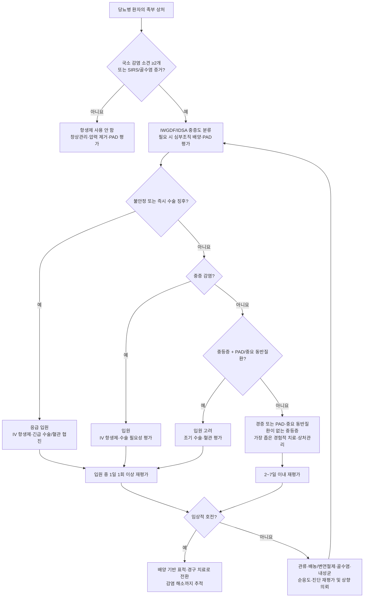

# 당뇨병성 족부감염 Diabetic Foot Infection

> **핵심 원칙**  당뇨병성 족부궤양은 모두 세균이 집락화되어 있으나, **감염은 배양 결과가 아니라 임상 소견으로 진단**한다. 감염 치료만으로는 충분하지 않으며, 배농·변연절제, 압력 제거(off-loading), 말초동맥질환 평가와 필요 시 재혈관화, 혈당 및 전신 상태 관리가 함께 이루어져야 한다.

## <mark style="color:green;">일반 사항</mark>

* 당뇨병 환자의 가장 흔한 입원 원인 중 하나이며, 말초신경병증과 반복적 외상으로 발생한 궤양에 감염이 동반되어 심부 연부조직 감염 및 골수염으로 진행할 수 있다.
* 당뇨병성 족부궤양의 평생 발생률은 19\~34%, 연간 발생률은 약 2%이며, 궤양에 감염이 동반되면 입원·절단·사망 위험이 크게 증가한다. \[IWGDF 2023]
* 감염된 당뇨병성 족부궤양 환자를 추적한 한 전향적 연구에서 1년 내 15%가 사망하고 17%가 하지 절단을 받았다. 이는 특정 코호트의 결과로, 모든 DFI 환자의 일반적 예후로 단정하지 않는다.
* 합병증 : 골수염, 화농성 관절염, 괴사성 연조직감염, 하지 절단, 패혈증

## <mark style="color:green;">원인 및 위험 인자</mark>

### <mark style="color:orange;">미생물</mark>

* 경증의 급성 감염에서는 **β-용혈성 연쇄상구균과 *Staphylococcus aureus***가 가장 흔하다.
* 만성·심부 감염, 최근 항생제 사용, 반복 입원 또는 괴사·허혈이 있으면 그람음성균과 혐기성균을 포함한 다균성 감염 가능성이 증가한다.
* 창상 배양에서 균이 검출되었다는 사실만으로 감염으로 진단하거나 치료하지 않는다.

### <mark style="color:orange;">위험 인자</mark>

* 혈당 조절 불량, 말초신경병증, 말초동맥질환(PAD)
* 발 변형·굳은살(callus)·티눈(corn), 발 궤양 또는 하지 절단 과거력
* 만성콩팥병(특히 투석), 시력 저하, 보호감각 소실, 부적절한 신발, 흡연

***

## <mark style="color:green;">임상 양상</mark>

* 국소 : 홍반, 통증, 압통, 온감, 경화, 농성 분비물
* 전신 : 식욕 저하, 오심/구토, 발열, 오한, 정신 상태 변화

#### <mark style="color:$primary;">IWGDF/IDSA 감염 진단 및 중증도 분류 (2023)</mark>

감염은 복사뼈 아래의 족부 병변에서 다른 비감염성 원인(외상, 골절, 통풍, 급성 Charcot 신경골관절병증, 혈전증, 정맥울혈 등)을 배제한 뒤, 다음 국소 소견 중 **2개 이상**이 있을 때 임상적으로 진단한다.

1. 국소 부종 또는 경결
2. 병변 주위 **>0.5 ㎝**의 홍반
3. 국소 통증 또는 압통
4. 국소 열감
5. 농성 분비물

<table><thead><tr><th width="150">IWGDF/IDSA 등급</th><th>기준</th></tr></thead><tbody><tr><td>1 (비감염)</td><td>감염의 국소 또는 전신 증상·징후가 없음</td></tr><tr><td>2 (경증)</td><td>전신 증상이 없고, 감염이 피부·피하조직에 국한되며 병변 주위 홍반이 <strong>&gt;0.5 ㎝이면서 &lt;2 ㎝</strong></td></tr><tr><td>3 (중등증)</td><td>전신 증상이 없으나 홍반이 병변 주위 <strong>≥2 ㎝</strong>로 확장되거나, 피부·피하조직보다 깊은 구조(건, 근육, 관절, 뼈 등)를 침범</td></tr><tr><td>4 (중증)</td><td>족부감염과 관련된 SIRS 소견이 ≥2개: ① 체온 &gt;38℃ 또는 &lt;36℃ ② 맥박 &gt;90회/분 ③ 호흡수 &gt;20회/분 또는 PaCO₂ &lt;32 ㎜Hg ④ WBC &gt;12,000/㎣ 또는 &lt;4,000/㎣ 또는 band form ≥10%</td></tr><tr><td>(O) 골수염</td><td>3(O), 4(O)처럼 해당 감염 등급 뒤에 골수염을 뜻하는 <strong>(O)</strong>를 덧붙임. 골수염 자체만으로 입원이 필수인 것은 아님</td></tr></tbody></table>

> **주의**  당뇨병성 신경병증, 말초동맥질환(PAD), 면역기능 저하가 있으면 통증·열감·홍반·발열이 미약할 수 있다. 정상 체온이나 정상 WBC만으로 중증 감염 또는 골수염을 배제하지 않는다.

### <mark style="color:$danger;">🚩 Red Flags!</mark>

<mark style="color:$danger;">**즉각 조치 또는 응급 이송**</mark>

* 저혈압, 의식 변화, 저산소증, 핍뇨 등 패혈증·장기기능장애 또는 혈역학적 불안정
* 빠르게 진행하는 감염, 진찰 소견에 비해 심한 통증, 자색 피부·반상출혈, 피부괴사, 출혈성 수포, 마찰음 또는 연조직 가스 — 괴사성 연조직감염 의심
* 광범위 습성 괴저, 근막 아래 심부 농양, 구획증후군
* 중증 하지허혈을 동반한 감염(창백·청색증, 휴식통, 조직소실, 차가운 발, 맥박 소실 등)

<mark style="color:$warning;">**당일 병원 평가 · 조기 전문과 협진**</mark>

* 모든 중증 감염 및 **PAD 또는 중요한 동반질환을 동반한 중등증 감염** — 입원 고려
* 심부 조직 침범, 골수염·화농성 관절염 의심, 노출된 뼈 또는 probe-to-bone 양성
* 배농·광범위 변연절제, 비경구 항생제, 특수 영상 또는 신속한 재혈관화 평가가 필요한 경우
* 감염과 PAD가 함께 있는 궤양·괴저 — 수술 전문과와 혈관 전문과에 긴급 협진
* ABI ＜0.4, 발목압 ＜50 ㎜Hg, 족지압 ＜30 ㎜Hg, TcPO₂ ＜30 ㎜Hg 또는 단상성·소실된 족부 Doppler 파형 — 중증 허혈을 시사하므로 긴급 혈관 전문 평가
* 외래 치료를 안전하게 수행할 수 없거나, 적절한 치료에도 악화·치료 실패

<mark style="color:$info;">**외래 추적 / 추가 평가 계획**</mark> <mark style="color:$info;">- 즉각 위험 낮으나 호전 없으면 의뢰</mark>

* 전신적으로 안정된 경증 감염: 당일 또는 가능한 한 빨리 치료를 시작하고 일반적으로 **2\~7일 이내** 재평가
* 호전하지 않거나 범위가 확대되면 배양 결과, 순응도, 압력 제거, 관류, 심부 농양·골수염 가능성을 재평가하고 상위 등급으로 격상

***

## <mark style="color:green;">진단</mark>

### <mark style="color:orange;">초기 평가</mark>

* 양측 발을 노출하고 궤양의 위치·크기·깊이, 홍반 범위, 농·괴사·악취, 파동감, 뼈 노출, 발 변형, 보호감각을 평가한다.
* 감염 중증도를 IWGDF/IDSA 분류로 기록한다.
* 족배·후경골동맥 맥박을 확인하되, 맥박 촉지만으로 PAD를 배제하지 않는다. 족부 Doppler 파형과 ABI를 평가하고 가능하면 TBI/족지압을 함께 측정한다.
* 감염+PAD에서는 WIfI(Wound, Ischaemia, foot Infection) 분류를 이용해 절단 위험과 혈관중재 필요성을 평가한다.
* 전신상태, 혈당, 신기능·간기능, 최근 항생제·입원력, 과거 MRSA/녹농균 배양, 약물 알레르기를 확인한다.

### <mark style="color:orange;">검사</mark>

* **혈액검사**: CBC, CRP/ESR, 신·간기능, 혈당을 임상 상황에 따라 시행한다. CRP·ESR·PCT는 진찰만으로 감염 여부가 불명확하거나 해석이 어려울 때 보조적으로 사용하며, 단독으로 감염을 확진·배제하지 않는다.
* **배양검사**: 가능하면 항생제 투여 전에 창상을 세척하고 변연절제한 뒤, 무균적으로 **심부 조직 검체(curettage 또는 biopsy)**를 채취한다. 표재성 면봉 배양은 오염·집락균 검출 위험 때문에 피한다.
  * 최근 항생제 노출이 없고 비전형·내성균 위험이 없는 급성 경증 감염은 배양 없이 경험적 치료를 시작할 수 있다.
  * 중등증·중증, 만성·재발성 감염, 최근 항생제 노출 또는 치료 실패에서는 배양을 적극 시행한다.
  * 패혈증 또는 중증 전신 소견이 있으면 혈액배양을 고려하되 항생제 시작을 지연하지 않는다.
* **골수염 초기검사**: probe-to-bone(PTB) 검사 + 단순 X선 + ESR 또는 CRP/PCT를 함께 평가한다.
  * PTB 양성은 깊고 오래된 궤양, 뼈 노출 등 골수염의 사전확률이 높은 환자에서 진단 가능성을 높이고, PTB 음성은 사전확률이 낮은 환자에서 골수염 배제에 도움이 된다. PTB 결과 하나만으로 확진하거나 배제하지 않으며, 검사자가 숙련되지 않았다면 결과에 의존하지 않는다.
  * 초기 X선이 정상이어도 의심이 높으면 2\~3주 뒤 반복할 수 있다.
* **MRI**: 임상 소견·단순 X선·검사실 결과 후에도 골수염 진단이 불확실할 때 우선 시행한다.
* MRI가 불가능하거나 해석이 어려우면 FDG-PET/CT, 백혈구 신티그래피 또는 SPECT를 대안으로 고려한다.
* 골수염이 의심될 때 원인균 확인의 표준 검체는 무균적으로 채취한 **골 검체(수술 중 또는 경피적)**이다. 창상 연조직 배양이 골 배양을 대신하지 못할 수 있다.

> 발 온도 측정이나 정량적 미생물 분석은 연조직 족부감염의 진단검사로 권고하지 않는다.

***



<p align="center"><strong>당뇨병성 족부감염 진료 알고리듬</strong></p>

<p align="center"><em><mark style="color:$info;">Ref. IWGDF/IDSA Guidelines on Diabetes-related Foot Infections (2023)</mark></em></p>

***

## <mark style="background-color:$warning;">Management</mark>

### <mark style="color:orange;">감염원 조절과 전신 관리</mark>

* 농양 배농, 감염·괴사 조직의 변연절제, 이물 제거를 시행한다. 허혈이 심하면 무리한 외래 변연절제 전에 혈관·수술 전문과와 상의한다.
* 압력 제거는 필수이다. 감염·허혈·삼출 정도에 따라 탈착식 장치, 맞춤 신발, 목발·휠체어 등 방법을 개별화한다.
* 생리식염수 또는 안전한 창상세정제로 세척하고, 삼출량과 창상 상태에 맞는 드레싱으로 습윤 균형을 유지한다.
* 혈당, 수분·전해질, 영양, 신기능을 교정하고 금연을 권고한다.
* 중증 감염, 혈역학적 불안정, 탈수, 케톤혈증·케톤뇨, 섭취 불량·장기 금식 또는 수술이 필요한 경우에는 SGLT2 억제제를 일시 중단한다. 응급수술에서는 즉시 중단하고 정상혈당 당뇨병성 케톤산증(eDKA)을 포함한 케톤산증을 감시한다. 선택수술 전에는 일반적으로 3일 전(ertugliflozin은 4일 전) 중단하며, 급성 위험이 해소되고 순환상태와 경구 섭취가 안정된 뒤 재개한다.
* 부종에 이뇨제를 일률적으로 사용하지 않는다. 심부전·신장질환 등 별도 적응증이 있을 때만 사용한다.
* 통각성 통증에는 아세트아미노펜을 우선 고려하되 간질환·과음 여부를 확인한다. NSAID는 신기능 저하, 탈수, PAD, 위장관 출혈 및 심혈관 위험을 평가한 뒤 필요한 경우에만 단기간 사용한다. 새로 발생하거나 빠르게 악화되는 심한 통증은 진통제를 증량하기 전에 허혈, 심부 감염 또는 괴사성 감염을 재평가한다.
* povidone-iodine packing, 은제제, 꿀, 국소 항생제, 음압창상치료를 **감염 치료 목적의 보조요법**으로 일률적으로 사용하지 않는다. 드레싱 선택 및 창상치유 목적의 별도 적응증은 구분한다.

### <mark style="color:orange;">입원 및 수술</mark>

* 모든 중증 감염과, PAD 등 중요한 동반질환이 있는 중등증 감염은 입원을 고려한다.
* 중증 감염 또는 광범위 괴저, 괴사성 감염, 근막 아래 농양, 구획증후군, 중증 하지허혈이 동반된 중등증 감염은 **긴급 수술 협진** 대상이다.
* 중등증·중증 감염에서는 감염·괴사 조직 제거를 위한 조기 수술(대개 24\~48시간 이내)을 항생제와 함께 고려한다.
* 감염과 PAD가 동반되면 배농/절제와 재혈관화의 순서를 결정하기 위해 수술 및 혈관 전문과가 함께 평가한다.

## <mark style="color:green;">비-약물 치료 및 예방</mark>

* 모든 당뇨병 환자에게 족부 궤양과 절단의 위험 인자를 확인하기 위해 매년 포괄적인 발 평가를 하고, 발 관리를 교육한다.
  * 10-g monofilament 검사(또는 Ipswich touch test) 이상 소견 + 다른 신경학적 검사(pinprick, 온도 감각, 128 Hz 진동 감각 등) 중 하나 이상 이상 소견이면 LOPS(loss of protective sensation)로 판정
* 매일 미지근한 물 + 중성 비누로 세족; 발가락 사이 완전히 건조하고 보습제는 바르지 않음; 건조한 피부에는 보습제 도포(발뒤꿈치 중점); 통풍되는 신발과 땀 배출이 잘되는 양말 사용; 지속적인 발가락 사이 짓무름이나 백선은 평가·치료; 굳은살·티눈 자가 제거 금지
* 발톱은 일자로 깎기; 맨발 금지(실내에서도 양말·실내화 착용)
* 꽉 끼거나 솔기가 있는 양말, 굽 높은/앞 좁은 신발 회피; 새 신발은 하루 1시간 이내로 시작
* 매일 발 자가 점검; 발 손상·발적·부종·감각 이상 시 즉시 주치의 연락
* PAD가 의심되면 족부 Doppler 파형, ABI와 TBI/족지압으로 우선 평가하고 혈관 전문과 의뢰를 고려한다. 재혈관화 적응증이 있거나 해부학적 평가가 필요한 경우 duplex ultrasound, CTA, MRA 또는 혈관조영술을 선택한다.
* 당뇨병 족부 궤양은 다학제 접근 치료 시행

#### <mark style="color:$primary;">발 관리 추적 주기</mark>

<table><thead><tr><th width="357">위험 분류</th><th>추적 주기</th></tr></thead><tbody><tr><td>모든 당뇨병 환자 - 발 관찰</td><td>매 방문</td></tr><tr><td>LOPS(-) &#x26; PAD(-)</td><td>매년</td></tr><tr><td>LOPS(+) or PAD(+)</td><td>6\~12개월</td></tr><tr><td>LOPS+PAD, LOPS+발 변형, PAD+발 변형</td><td>3\~6개월</td></tr><tr><td>LOPS 또는 PAD + 궤양 과거력/절단/말기 신부전</td><td>1\~3개월</td></tr><tr><td>Charcot 신경관절병증 과거력</td><td>1\~3개월 (급성기 해소 후 정형외과 공동 추적)</td></tr></tbody></table>


**WIfI 분류와 예방 모니터링** \[ADA 2026; IWGDF 2023]

* WIfI 병기 분류(Wound, Ischemia, foot Infection) : 상처·허혈·발 감염을 각각 0\~3등급으로 평가하여 병기를 결정하는 분류 체계. 절단 위험과 궤양 치유 가능성을 예측하고 혈관재건술(revascularization)의 필요성·우선순위를 결정하는 데 활용
* 자가 발 온도 모니터링 : IWGDF risk 2\~3 환자에서 족저궤양 예방을 위해 고려할 수 있다. 좌우 대응 부위 온도 차가 2일 연속 ＞2.2℃이면 보행 활동을 줄이고 의료진에게 상담하도록 교육한다. 이는 **궤양 예방 목적**이며, 이미 발생한 족부감염의 진단검사는 아니다. \[IWGDF 2023, 조건부 권고]


## <mark style="color:green;">약물 치료</mark>

### <mark style="color:orange;">선택 원칙</mark>

* 임상적으로 감염되지 않은 궤양에는 예방 또는 상처치유 촉진 목적으로 전신·국소 항생제를 사용하지 않는다.
* 감염 중증도, 과거 배양, 최근 항생제·입원력, MRSA/내성 그람음성균 위험, 신·간기능, 알레르기, 약물상호작용, 지역 감수성 자료를 반영한다.
* 가능한 가장 좁은 범위로 시작하고, 배양 결과와 임상 반응에 따라 **표적 치료 및 가능한 경구제로 단계 낮춤**을 시행한다.
* 경증 감염은 대부분 경구 치료가 가능하다. 중증 감염은 신속한 비경구 치료와 감염원 조절이 필요하다.
* 한국은 온대 기후이므로 녹농균을 일률적으로 경험적 표적으로 삼지 않는다. 다만 최근 수주 이내 해당 병변에서 녹농균이 배양된 중등증·중증 감염, 반복적 물 노출·침수, 또는 지역 역학상 위험이 높으면 고려한다.
* tigecycline은 임상시험에서 ertapenem보다 성적이 나빴으므로 권고 선택지에서 제외한다.

### <mark style="color:orange;">성인 경험적 치료 예</mark>

> 아래 용량은 정상 신·간기능 성인의 예이다. 신기능·간기능, 체중, 투석 여부, 약물상호작용에 따라 조절하고 중등증 이상은 병원 프로토콜 및 감염 전문의 자문을 우선한다.

<table><thead><tr><th width="170">임상 상황</th><th width="180">주요 표적</th><th>예시</th></tr></thead><tbody><tr><td>경증, 최근 항생제·내성균 위험 없음</td><td>MSSA, 연쇄상구균</td><td>cephalexin 500 ㎎ po qid <mark style="color:blue;">\[팔렉신]</mark> 또는 amoxicillin/clavulanate 500/125 ㎎ po tid <mark style="color:blue;">\[오구멘틴]</mark></td></tr><tr><td>경증, 즉시형 β-lactam 알레르기</td><td>MSSA, 연쇄상구균</td><td>clindamycin 300\~450 ㎎ po tid\~qid <mark style="color:blue;">\[훌그램]</mark>. 지역 내 내성률과 <em>C. difficile</em> 위험 확인</td></tr><tr><td>경증 + MRSA 위험</td><td>MRSA + 연쇄상구균</td><td>doxycycline 100 ㎎ po bid <strong>+ cephalexin 500 ㎎ po qid</strong>, 또는 TMP/SMX DS(160/800 ㎎) 1\~2T po bid <mark style="color:blue;">\[셉트린]</mark> <strong>+ cephalexin 500 ㎎ po qid</strong>. 즉시형 β-lactam 알레르기에서는 감수성 자료와 환자 위험에 따라 대체 약제를 선택</td></tr><tr><td>중등증·중증, 녹농균 위험 낮음</td><td>G(+), G(-), 필요 시 혐기성균</td><td>ampicillin/sulbactam 3 g IV q6h <mark style="color:blue;">\[유나신 주]</mark>, 또는 ceftriaxone 2 g IV q24h <mark style="color:blue;">\[트리악손 주]</mark> + metronidazole 500 ㎎ IV/po q8h, 또는 ertapenem 1 g IV q24h <mark style="color:blue;">\[인반즈 주]</mark> 등</td></tr><tr><td>중증·괴사/허혈 또는 녹농균 위험</td><td>광범위 G(+), G(-), 혐기성균 ± 녹농균</td><td>piperacillin/tazobactam 4.5 g IV q6\~8h 등. ESBL 위험이 높으면 배양·지역 역학에 따라 carbapenem 고려</td></tr><tr><td>MRSA 위험 추가</td><td>위 요법 + MRSA</td><td>vancomycin(AUC 기반 TDM 및 신기능 조절) <mark style="color:blue;">\[반코마이신 주]</mark>, linezolid 600 ㎎ IV/po q12h <mark style="color:blue;">\[자이복스]</mark> 또는 daptomycin 6 ㎎/㎏ IV q24h 중 하나를 상황에 맞게 추가·대체</td></tr></tbody></table>

MRSA 위험에는 과거 MRSA 감염·집락, 최근 입원·항생제 노출, 지역 내 높은 유병률 등이 포함된다. doxycycline과 TMP/SMX의 연쇄상구균 치료 신뢰도는 제한적이므로, 경증 감염에서 이를 MRSA 표적으로 선택하면서 연쇄상구균도 함께 표적해야 하면 cephalexin 등 β-lactam을 병용한다.

### <mark style="color:orange;">치료 기간</mark>

<table><thead><tr><th width="230">상황</th><th>권장 기간</th></tr></thead><tbody><tr><td>연조직 감염</td><td>대부분 1\~2주</td></tr><tr><td>광범위 감염이 호전 중이나 예상보다 느리게 해소되거나 중증 PAD 동반</td><td>필요 시 3\~4주까지 연장 고려</td></tr><tr><td>중등증·중증 연조직 감염의 수술적 변연절제 후</td><td>약 10일을 <strong>조건부로 고려</strong>. 근거 확실성은 낮으며, 비뚤림 위험이 높은 소규모 예비 연구 1건에 근거</td></tr><tr><td>감염된 골 완전 절제 후 잔존 골감염이 없음</td><td>2\~5일</td></tr><tr><td>소절단 후 골 절제면 배양 또는 조직검사 양성</td><td>최대 3주 고려</td></tr><tr><td>골 절제·절단 없이 치료하는 골수염</td><td>6주</td></tr></tbody></table>

* 적절한 치료 4주 후에도 감염 소견이 해소되지 않으면 단순히 항생제를 연장하지 말고 관류, 감염원 조절, 심부 농양·골수염, 내성균, 순응도와 진단 자체를 재평가한다.
* 골수염의 관해는 항생제 종료 후 최소 6개월 추적으로 판단한다.

### <mark style="color:orange;">골수염의 수술 여부</mark>

* 감염된 골의 수술적 절제와 전신 항생제 병용을 고려한다.
* 다음을 **모두** 만족하는 선택된 환자는 항생제 단독 치료를 고려할 수 있다.
  1. 전족부(forefoot) 골수염
  2. 감염 조절을 위한 즉각적인 절개·배농이 필요하지 않음
  3. PAD가 없음
  4. 노출된 뼈가 없음

***

### <mark style="color:red;">질병코드 (KCD)</mark>

E10.70 당뇨병성 족부궤양을 동반한 1형 당뇨병

E10.71 당뇨병성 족부궤양 및 괴저를 동반한 1형 당뇨병

E10.72 기타 및 상세불명의 당뇨병성 족부합병증을 동반한 1형 당뇨병

E11.70 당뇨병성 족부궤양을 동반한 2형 당뇨병

E11.71 당뇨병성 족부궤양 및 괴저를 동반한 2형 당뇨병

E11.72 기타 및 상세불명의 당뇨병성 족부합병증을 동반한 2형 당뇨병

병변에 따라 궤양의 해부학적 위치·중증도, 골수염, 연조직염 등 추가 코드를 함께 검토한다.

***

## <mark style="color:purple;">처방례</mark>

> **처방례 1. 안정된 경증 감염 - MRSA 위험 없음**
>
> ```
> 오구멘틴정 625 ㎎  1T  tid  7일
> ```
>
> _✽amoxicillin/clavulanate 500/125 ㎎; 48\~72시간 또는 늦어도 2\~7일 이내 임상 재평가._

> **처방례 2. 안정된 경증 감염 - MRSA 위험 있음**
>
> ```
> 독시사이클린정 100 ㎎  1T  bid
> 팔렉신캡슐 500 ㎎  1C  qid  (7일)
> ```
>
> _✽MRSA와 연쇄상구균을 함께 표적; 배양 결과·신기능·알레르기·지역 감수성에 따라 조정._

> **처방례 3. 중등증 감염 - 병원 평가 후 초기 경험적 치료 예시**
>
> ```
> Ceftriaxone(트리악손 주) 2 g  IV  q24h
> Metronidazole 500 ㎎  IV/po  q8h
> ```
>
> _✽전신 반응은 없으나 심부 조직 이환 또는 홍반 ≥2 ㎝인 경우; 배양 검체 채취, 배농·변연절제 및 입원 필요성 평가를 우선한다. 항생제 투여 때문에 응급 이송이나 감염원 조절을 지연하지 않으며, 배양 결과에 따라 표적 치료로 전환한다. 녹농균 위험 요인이 있으면 항균범위 확대를 고려한다._

> 위 처방례는 연조직 감염의 예이며, 골수염·중증 감염에는 그대로 적용하지 않는다.

***

### <mark style="color:$success;">핵심 복약 지도</mark>

* 처방된 항생제는 정해진 간격과 기간을 지키되, 발적이 번지거나 고름·악취가 증가하고 피부가 검거나 보라색으로 변하면 다음 예약일까지 기다리지 않는다.
* 발에 체중을 싣지 말라는 지시와 드레싱 방법을 지킨다. 감각이 둔해 통증이 없어도 감염이 악화될 수 있다.
* 발을 매일 직접 또는 거울로 확인한다. 임의로 굳은살을 깎거나 물집을 터뜨리지 않는다.
* 심한 설사, 전신 발진, 호흡곤란 등 항생제 이상반응이 있으면 즉시 의료진에게 알린다.

> **언제 다시 병원을 방문해야 하나요?**
>
> * 처방된 항생제 치료 2\~7일 이내에도 발적·부종·통증이 호전되지 않거나 오히려 번지는 경우
> * 발열, 오한, 의식 변화 등 전신 증상이 새로 생긴 경우 — 즉시 응급실
> * 상처에서 악취가 나거나 피부색이 검게 변하는 경우 — 즉시 내원

***

### <mark style="color:blue;">환자 안내서</mark>


**당뇨발 감염, 조기 발견과 압력 제거가 가장 중요합니다**

당뇨병으로 발의 감각이 둔해지면 상처가 생겨도 잘 느끼지 못하고, 혈당이 높으면 상처가 쉽게 곪고 잘 낫지 않습니다. 매일 발을 살피고 상처를 조기에 발견하는 것이 절단을 예방하는 가장 확실한 방법입니다.


#### <mark style="color:$primary;">왜 발에 감염이 잘 생기나요?</mark>

신경이 손상되면 상처가 나도 아픔을 느끼지 못해 늦게 발견하게 됩니다. 혈액순환이 나쁘면 상처에 산소와 영양이 충분히 공급되지 않아 치유가 늦어지고, 고혈당은 면역기능과 상처 치유를 저하시켜 감염 위험을 높입니다.

#### <mark style="color:$primary;">매일 발을 어떻게 점검하나요?</mark>

거울로 발바닥까지 확인하고, 혼자 보기 어려우면 가족에게 부탁하십시오. **상처·물집·발적·부종·감각 변화가 있으면 즉시 담당 의사에게 알리십시오.**

세족은 미지근한 물(40℃ 이하)로 매일 하고, 발가락 사이를 꼼꼼히 건조시키십시오. 피부가 건조하면 보습제를 바르되 발가락 사이에는 바르지 마십시오. 발톱은 일자로 깎고, 굳은살·티눈을 직접 자르거나 화학 물질로 제거하지 마십시오.

#### <mark style="color:$primary;">일상생활에서 어떻게 관리하나요?</mark>

**맨발로 다니지 마십시오.** 감각이 둔해 상처를 못 느낄 수 있습니다. 여름철 뜨거운 아스팔트나 백사장을 맨발로 걸으면 화상을 입어도 알아차리지 못할 수 있으니 특히 주의하십시오. 집 안에서도 항상 양말과 실내화를 신으십시오.

신발은 발가락이 눌리지 않도록 앞코가 넉넉하고, 뒤꿈치를 안정적으로 잡아주며, 미끄럽지 않은 밑창을 고르십시오. 신기 전에는 안쪽에 거친 봉제선이나 이물질이 없는지 손으로 확인하고, 발이 붓기 쉬운 오후 시간에 신어보고 구매하는 것이 좋습니다. 얇은 슬리퍼·샌들이나 굽이 높고 코가 뾰족한 신발은 피하십시오. 새 신발은 처음에는 하루 1시간 이내로 착용하고 서서히 늘리십시오.

발에 전기방석·핫팩 등 열을 직접 가하지 마십시오. 화상의 위험이 있습니다.

혈당 조절과 함께 매일 발 점검, 적절한 신발 착용, 압력 감소와 조기 진료가 중요합니다. 지시된 약을 빠짐없이 복용하고, 금연하며 과음을 피하십시오.

#### <mark style="color:$primary;">이럴 때는 즉시 병원을 방문하세요</mark>

* 상처 주위가 붉게 번지거나 붓고, 열감·통증이 심해지는 경우
* 고름이 나오거나 냄새가 나는 경우
* 피부가 검게 또는 보라색으로 변하는 경우
* 발열·오한이 있거나 정신이 흐려지는 경우 — 즉시 응급실
