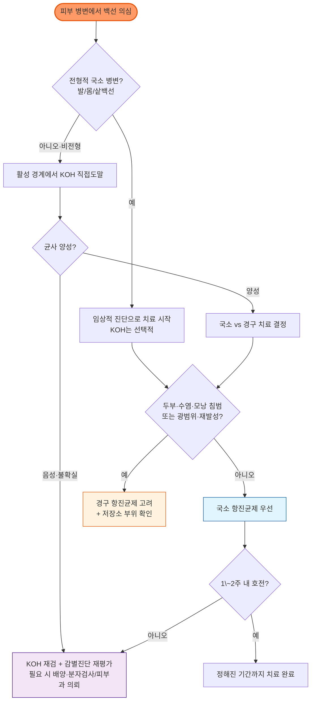

# 피부백선증 (백선) Dermatophytosis, Tinea

## <mark style="color:green;">일반 사항</mark>

* 피부사상균(dermatophyte)이 각질층, 모발, 조갑 등 케라틴 조직을 침범하여 발생하는 표재성 진균감염
* 다른 이름 : 백선, 흔히 "무좀·버짐"으로 불림, ringworm, tinea
* 주요 원인균은 *Trichophyton*, *Microsporum*, *Epidermophyton* 속이며, 호발 부위에 따라 발백선·손백선·몸백선·샅백선·두부백선 등으로 구분
* 유병률 : 전 세계적으로 매우 흔한 감염이며, 전 세계 인구의 약 20\~25%가 영향을 받는 것으로 추정한 역학 문헌이 있음. 지역·연령·환경에 따라 편차가 큼(Havlickova 등, *Mycoses* 2008)
* 전파 : 사람, 동물 또는 오염된 바닥·수건·의복·운동장비 등을 통해 전파될 수 있음
* 동거인 전원을 일률적으로 치료하지 않음. 밀접 접촉자는 증상과 병변을 확인하고 감염이 확인되거나 강하게 의심될 때 치료
* 어루러기(pityriasis versicolor)는 *Malassezia* 효모에 의한 질환으로 **피부사상균증이 아님**. 이 챕터에서는 감별과 실용적 치료를 위해 별도 항목으로 구분

***

## <mark style="color:green;">원인 및 위험 인자</mark>

* 고온다습한 환경, 다한증, 밀폐되거나 꽉 끼는 옷·양말·신발
* 공동 샤워실·수영장·찜질방·헬스장·라커룸 이용, 접촉 스포츠 및 밀집 생활
* 감염자와의 밀접 접촉, 감염된 반려동물·가축과의 접촉
* 피부·조갑의 외상, 짓무름, 발가락 사이 균열
* 발백선 또는 손발톱백선 등 다른 부위의 감염 병소
* 비만, 당뇨병, 말초혈관질환, 만성 부종
* 고령, 면역저하, 항암치료, 장기 면역억제제 사용
* 국소 corticosteroid, 항진균제–corticosteroid 복합제 또는 국소 calcineurin inhibitor(tacrolimus, pimecrolimus)의 부적절한 단독 사용

## <mark style="color:green;">임상 양상</mark>

### <mark style="color:orange;">손발톱백선증 Tinea unguium</mark>

(☞ [손발톱백선증](173_-onychomycosis-tinea-unguium.md))

### <mark style="color:orange;">발백선 Tinea pedis</mark>

* **지간형** : 발가락 사이의 비늘, 짓무름, 균열, 가려움. 특히 제4\~5족지 사이에 흔함
* **각화형(moccasin type)** : 발바닥과 발 측면에 미만성 건조·각질·미세한 비늘
* **수포형** : 발바닥 안쪽이나 발 측면에 소수포 또는 수포
* **급성 궤양형** : 심한 짓무름·미란·악취·삼출; 이차 세균감염 가능
* 만성·재발성 발백선에서는 손발톱백선을 감염 저장소로 함께 확인

### <mark style="color:orange;">손백선 Tinea manuum</mark>

* 대개 편측 손바닥의 광범위한 건조, 각질, 손금의 백색 비늘이 특징
* 양측 발백선과 한쪽 손백선이 동반되는 **two feet–one hand syndrome**이 전형적
* 손습진, 자극·알레르기 접촉피부염, 건선과 감별

### <mark style="color:orange;">몸백선·얼굴백선 Tinea corporis, Tinea faciei</mark>

* 가장자리가 융기되고 활성화된 인설성 홍반성 원형·타원형 판; 중심부는 비교적 깨끗해질 수 있음
* 반려동물에서 유래한 감염은 염증·구진·농포가 더 뚜렷할 수 있음
* 얼굴백선은 아토피피부염·접촉피부염·지루피부염·홍반루푸스로 오인되기 쉬움

### <mark style="color:orange;">샅백선 Tinea cruris</mark>

* 서혜부에서 시작하여 허벅지 안쪽·회음부·엉덩이 쪽으로 퍼지는 경계가 뚜렷한 인설성 홍반성 판
* 흔히 발백선 또는 손발톱백선에서 자가접종되어 발생
* 전형적으로 음낭을 비교적 보존하지만, **음낭 침범만으로 백선을 배제하지 않음**

### <mark style="color:orange;">두부백선 Tinea capitis</mark>

* 주로 사춘기 이전 소아에서 발생하지만 고령자·면역저하자에서도 발생 가능
* 인설성 반, 부러진 모발·black dot, 국소 탈모, 후두부·경부 림프절병증
* **Kerion** : 압통성·종창성 판, 농포·삼출·두꺼운 가피를 동반하며 반흔성 탈모 위험
* 국내 원인균은 연령·지역·노출에 따라 다름
  * 성인·동물 접촉 관련 : *Microsporum canis*가 중요
  * 청소년 접촉 스포츠 집단 : *Trichophyton tonsurans* 고려
* 균종을 임상 모양만으로 단정하지 않음

### <mark style="color:orange;">수염백선 Tinea barbae</mark>

* 수염 부위의 농포·가피·결절·모발 탈락; 세균성 모낭염으로 오인하기 쉬움
* 모낭을 침범하므로 일반적으로 경구 항진균제가 필요하며 조기 피부과 평가를 고려

### <mark style="color:orange;">Tinea incognito와 심부 모낭성 백선</mark>

* 국소 corticosteroid 또는 calcineurin inhibitor(tacrolimus, pimecrolimus) 등 항염증·면역조절제 사용 후 경계·인설이 흐려지고 병변이 넓어지거나 농포·결절이 나타난 백선
* **Majocchi granuloma** : 피부사상균이 모낭과 진피를 침범하여 구진·농포·결절을 형성; 면도·외상·steroid·면역저하가 위험 인자
* 국소제 단독으로 치료가 어려울 수 있으므로 진균검사와 경구치료·전문과 의뢰를 고려

### <mark style="color:$danger;">🚩 Red Flags!</mark>

<mark style="color:$danger;">**즉각 조치 또는 의뢰**</mark>

* 고열·저혈압·의식 변화 등 전신독성을 동반한 피부 병변
* 외견에 비해 심한 통증, 매우 빠른 진행, 수포·자반·괴사·감각저하 등 괴사성 연조직감염 의심
* 얼굴·눈 주위 병변과 시력저하, 복시, 안구돌출 또는 안구운동통
* 중증 면역저하자에서 발열과 함께 빠르게 확산되는 피부 병변

<mark style="color:$warning;">**당일 또는 조기 의뢰**</mark>

* Kerion, 압통성 두피 종창, 농포·삼출·가피 또는 빠르게 진행하는 탈모
* 수염 부위의 깊은 농포·결절, Majocchi granuloma 의심
* 광범위하고 심한 염증성 몸·샅·얼굴백선, 생식기·항문주위 병변
* 적절한 치료에도 악화하거나 terbinafine 내성이 의심되는 병변
* 면역저하, 조절되지 않는 당뇨, 반복적인 이차 세균감염
* **경구치료가 필요한 두부·수염·심부·광범위 백선이면서** 임신, 간질환, 심부전 또는 복잡한 약물 상호작용으로 경구제 선택이 어려운 경우

<mark style="color:$info;">**외래 추적 / 추가 평가 계획**</mark> <mark style="color:$info;">- 즉각 위험 낮으나 호전 없으면 의뢰</mark>

* 국소 치료 1\~2주 후 호전이 시작되지 않거나 치료 종료 시 임상적으로 남아 있는 경우
* 반복 재발, 가족·집단 내 동시 발생, 진단이 불확실한 경우
* 발백선과 손발톱백선이 반복적으로 서로 재감염시키는 경우

## <mark style="color:green;">진단</mark>

### <mark style="color:orange;">진단 원칙</mark>

* 전형적인 국소 피부백선은 임상적으로 치료를 시작할 수 있으나, 습진·건선·Candida 감염 등과 오진이 흔함
* 다음에서는 가능하면 치료 전에 진균학적 확인
  * 비전형적·광범위·재발성 병변
  * 국소 corticosteroid 또는 calcineurin inhibitor 사용 후 변형된 병변
  * 두부·수염·모낭 침범, 손발톱 침범
  * 경구 항진균제 투여 예정
  * 적절한 치료에도 반응하지 않는 경우
  * 항진균제 내성 또는 집단 발생 의심

### <mark style="color:orange;">KOH 직접도말</mark>

* 피부 병변의 **활성 경계**에서 인설을 채취
* 발백선은 인설·수포 지붕·짓무른 경계에서 채취
* 모발은 부러진 모발과 주변 인설을 함께 채취
* 분지하는 격벽성 균사를 확인
* 최근 국소 항진균제 사용은 검사 민감도를 낮출 수 있음

### <mark style="color:orange;">배양·분자검사</mark>

* 두부백선, 깊은 모낭성 병변, 광범위·난치·재발성 병변, 집단 발생 또는 내성 의심에서 진균배양·균종 동정 고려
* 일반 배양만으로 *T. indotineae* 등을 정확히 구분하기 어려울 수 있어 난치성에서는 피부과·진균검사 기관을 통한 분자 동정 및 감수성 검사를 고려
* EUCAST E.Def 11.0, CLSI M38 등 피부사상균 항진균제 감수성시험법은 존재하지만, 균종·약제별 **임상 breakpoint가 충분히 확립되지 않았고 MIC와 임상 반응의 상관성도 제한적**이므로 결과를 임상 경과와 함께 해석
* 치료 반응 불량만으로 내성으로 단정하지 않음. 오진, 순응도 부족, 재노출·자가접종, 모낭·심부 침범, 부적절한 투여기간, itraconazole 흡수 저하 또는 약물 상호작용 등을 먼저 재평가하고, 적절한 치료에도 실패하면 내성을 의심(Ferreira 등, JEADV 2025)

### <mark style="color:orange;">Wood lamp</mark>

* 일부 *Microsporum* 두부백선은 청록색 형광을 보일 수 있으나 *T. tonsurans*, *T. rubrum* 등 많은 균종은 형광을 보이지 않음
* 음성 결과로 백선을 배제하지 않으며 일상적인 피부백선 확진검사로 사용하지 않음
* 홍색음선은 산호색 형광, 어루러기는 황금색·황록색 형광을 보일 수 있으나 결과가 항상 나타나는 것은 아님

### <mark style="color:orange;">감별 진단</mark>

* 부위와 병변 양상에 따라 흔히 오인되는 질환들을 감별. 활성 경계에서의 KOH 검사가 가장 유용한 감별 도구

<table><thead><tr><th width="140">백선 유형</th><th width="230">주요 감별질환</th><th>핵심 감별 포인트</th></tr></thead><tbody><tr><td>발백선(지간형)</td><td>홍색음선(erythrasma), 자극·접촉피부염</td><td>Wood lamp 산호색 형광(홍색음선) vs KOH 균사 양성(백선)</td></tr><tr><td>손백선</td><td>손습진, 접촉피부염, 건선</td><td>two feet–one hand 패턴; 편측성; KOH</td></tr><tr><td>몸백선·얼굴백선</td><td>화폐상습진, 건선, 장미색비강진, 원심성환상홍반, 아토피피부염, 지루피부염, 육아종성 질환, 2기 매독</td><td>활성 경계의 인설 KOH; 반려동물 접촉력; 만성·비전형 경과 시 매독 혈청검사 고려</td></tr><tr><td>샅백선</td><td>Candida 간찰진, 홍색음선, 역위건선, 지루피부염, 접촉피부염</td><td>위성 농포·음낭 침범(Candida), 산호색 형광(홍색음선), 음낭 보존 경향(백선이나 배제 근거는 아님)</td></tr></tbody></table>

***



<p align="center"><strong>피부백선증 진단 및 치료 알고리듬</strong></p>

<p align="center"><em><mark style="color:$info;">Ref. KOH 직접도말 및 진균배양에 기반한 임상 접근 원칙을 저자가 정리</mark></em></p>

***

## <mark style="background-color:$warning;">Management</mark>

### <mark style="color:orange;">치료 선택</mark>

* **국소 항진균제 우선** : 국한된 발백선·손백선·몸백선·얼굴백선·샅백선
* **경구 항진균제 고려**
  * 두부백선·수염백선·Majocchi granuloma
  * 광범위·다발성·심한 염증성 병변
  * 각화형 발백선 또는 국소 치료 실패
  * 면역저하자
  * 동반 손발톱백선이 감염 저장소로 작용하는 경우
* 경구제 투여 전 진단을 확인하고 간질환·신장기능·심부전·임신 가능성·병용약을 검토
* 발백선과 손발톱백선 등 다른 부위의 감염 저장소를 함께 평가·치료

### <mark style="color:orange;">접촉자와 환경 관리</mark>

* 동거인과 밀접 접촉자는 병변·가려움·탈모 여부를 확인하고 감염이 확인되면 치료
* 두부백선에서는 가족·밀접 접촉자의 두피를 확인하며, 집단 발생 또는 무증상 보균 가능성이 높으면 항진균 샴푸를 제한적으로 고려
* 반려동물의 탈모·인설성 병변이 의심되면 수의사 평가
* 수건·의복·모자·빗·헤드기어·침구·운동장비를 공유하지 않음

### <mark style="color:orange;">Corticosteroid 사용</mark>


**백선이 의심되면 corticosteroid 단독제 또는 항진균제–corticosteroid 고정복합제를 routine으로 사용하지 않는다.** 병변이 퍼지고 형태가 변형되는 tinea incognito, 모낭성·심부 감염 및 치료 지연을 유발할 수 있다.


* 염증과 가려움이 매우 심하고 진단이 확인된 예외적 상황에서만 항진균제와 함께 **저역가 corticosteroid를 별도로 최대 5\~7일** 고려
* 중등도 이상 역가의 steroid 복합제는 단순 몸백선·샅백선 처방례에 포함하지 않음

### <mark style="color:orange;">국소 항진균제</mark>

* 병변과 주변 정상 피부 1\~2 ㎝까지 얇게 도포
* 부위·제형·제품별 허가 용법이 다르므로 실제 처방 시 국내 허가사항 확인
* 두부백선·수염백선·손발톱백선의 단독 치료로 사용하지 않음

<table><thead><tr><th width="220">성분 (대표 상품명)</th><th width="100">일반적 도포</th><th width="230">통상 치료 기간</th><th>임상적 특징</th></tr></thead><tbody><tr><td>terbinafine 1% <mark style="color:blue;">\[라미실]</mark></td><td>qd\~bid</td><td>몸·샅백선 1\~2주<br>지간형 발백선 약 1주<br>발바닥·측면/각화형 약 2주 이상</td><td>살진균성; azole보다 짧은 치료 과정 가능</td></tr><tr><td>butenafine <mark style="color:blue;">\[멘탁스]</mark></td><td>qd</td><td>약 2주</td><td>몸·샅·발백선</td></tr><tr><td>clotrimazole <mark style="color:blue;">\[카네스텐]</mark></td><td>bid</td><td>2\~4주</td><td>피부사상균과 Candida를 함께 고려할 때 유용</td></tr><tr><td>econazole <mark style="color:blue;">\[에코라]</mark></td><td>qd\~bid</td><td>2\~4주</td><td>몸·샅·발백선</td></tr><tr><td>ketoconazole <mark style="color:blue;">\[니조랄]</mark></td><td>qd\~bid</td><td>2\~4주</td><td>피부백선 및 *Malassezia* 질환</td></tr><tr><td>sertaconazole <mark style="color:blue;">\[더모픽스]</mark></td><td>bid</td><td>2\~4주</td><td>몸·샅·발백선</td></tr><tr><td>amorolfine cream <mark style="color:blue;">\[로세릴]</mark></td><td>qd, 저녁</td><td>2\~6주</td><td>피부백선; 조갑용 lacquer와 제형을 혼동하지 않음</td></tr><tr><td>ciclopirox <mark style="color:blue;">\[로푸록스]</mark></td><td>bid</td><td>2\~4주</td><td>피부백선 및 일부 효모 감염</td></tr></tbody></table>

### <mark style="color:orange;">경구 항진균제 안전성</mark>

<table><thead><tr><th width="120">약제</th><th width="200">투여 전 확인</th><th>주요 주의·상호작용</th></tr></thead><tbody><tr><td>terbinafine</td><td>간질환 병력, AST/ALT<br>신기능 저하 여부</td><td>활동성·만성 간질환 금기. 간손상 증상 발생 시 즉시 중단·검사. CYP2D6 억제로 일부 항우울제·항정신병약·β-blocker 등과 상호작용. <strong>CrCl &lt;50 ㎖/min에서는 가급적 대체 치료 또는 전문가 자문을 우선 고려</strong>. 국내 허가사항의 용법·용량에는 1일 용량 1/2 감량이 제시되어 있으나, 사용상의 주의사항에는 충분히 연구되지 않아 투여가 권장되지 않는다는 문구가 병존함. 불가피하게 투여할 때는 제품설명서를 확인하여 감량·모니터링. 중증 신부전은 금기</td></tr><tr><td>itraconazole</td><td>간기능, 심부전·부종, 병용약</td><td>심부전·심실기능장애에서 원칙적으로 회피. 강력한 CYP3A4 억제제로 다수의 병용금기. 캡슐은 충분한 식사 직후 복용하며 위산억제제는 흡수를 낮출 수 있음</td></tr><tr><td>fluconazole</td><td>신기능, 간기능, QT 연장 위험과 병용약</td><td>단회 투여는 일반적으로 신기능에 따른 용량조절이 필요하지 않음. 반복 투여 시 CrCl ≤50 ㎖/min인 비투석 환자는 첫날 상용량 투여 후 유지용량을 50%로 감량하거나 투여간격을 연장. 혈액투석 환자는 각 투석 후 상용량 투여. QT 연장 및 CYP2C9/2C19/3A4 관련 상호작용에 주의</td></tr></tbody></table>

* 경구 terbinafine 투여 전 AST/ALT를 확인. 국내 허가사항에 따라 장기 투여 시 투여 4\~6주 후를 포함하여 초기 2개월 동안 월 1회 간기능검사를 시행
* Itraconazole은 투여 전 간질환과 병용약을 확인. 장기 투여, 기존 간질환, 다른 간독성 약물 병용 또는 간손상 의심 증상이 있으면 정기적으로 간기능을 추적하며, 간독성이 치료 첫 1개월 이내에도 발생할 수 있음에 유의
* 지속되는 구역·식욕저하·심한 피로·우상복부 통증·황달·진한 소변·회색변이 발생하면 약을 중단하고 즉시 평가
* 임신 중 단순 피부백선은 국소치료를 우선하며 경구치료는 전문과와 상의

### <mark style="color:orange;">발백선·손백선</mark>

* 국소 terbinafine 또는 azole을 1차로 선택
* 수포·삼출이 심하면 aluminum acetate 습포를 단기간 병용할 수 있음
* 건조하고 두꺼운 각화형에서는 urea 제제를 보조적으로 고려하되 균열·미란 부위의 자극에 주의
* 각화형·광범위 병변, 국소치료 실패 또는 반복 재발에서는 KOH 확인 후 경구제 고려
  * terbinafine 250 ㎎ qd ×2\~6주
  * itraconazole 200 ㎎ bid ×7일 또는 100 ㎎ qd ×30일
  * fluconazole 150 ㎎ qwk ×2\~6주 — 허가사항과 신기능·상호작용 확인

### <mark style="color:orange;">몸백선·얼굴백선·샅백선</mark>

* 국소·경증 : 국소 terbinafine 1\~2주 또는 azole 2\~4주
* 병변이 소실되어도 제품별 권장 기간을 지키며, azole은 임상적 호전 후 1주 정도 추가 도포를 고려
* 광범위·다발성, 모낭 침범, 면역저하 또는 국소치료 실패에서 경구제 고려
  * itraconazole **100 ㎎ qd ×15일** — 국내 허가요법
  * itraconazole 200 ㎎ qd ×7일 — 문헌상 단기요법으로 보고되나 국내 허가 외 사용
  * terbinafine 250 ㎎ qd ×2\~4주
  * fluconazole 150 ㎎ qwk ×2\~4주
* 샅백선에서는 동반 발백선·손발톱백선을 반드시 확인

### <mark style="color:orange;">두부백선</mark>


두부백선은 국소 크림·로션·샴푸만으로 치료할 수 없다. 반흔성 탈모를 예방하기 위해 경구 항진균제를 조기에 시작하고 균종·임상 반응에 따라 치료 기간을 조정한다.


**Terbinafine — *Trichophyton* 감염에서 우선 고려**

<table><thead><tr><th width="120">체중</th><th width="150">1일 용량</th><th>국내 허가 치료기간</th></tr></thead><tbody><tr><td>&lt;20 ㎏</td><td>62.5 ㎎ qd</td><td rowspan="3">4주</td></tr><tr><td>20\~40 ㎏</td><td>125 ㎎ qd</td></tr><tr><td>&gt;40 ㎏</td><td>250 ㎎ qd</td></tr></tbody></table>

* 국내 허가사항상 2세 이상 소아에 사용. 2세 미만은 투여 경험이 없으며, 20 ㎏ 미만 소아는 사용 경험이 제한적이므로 유익성과 위험성을 검토
* 62.5 ㎎ 투여 시 분할선이 있는 125 ㎎ 제형은 1/2정으로 투여할 수 있으며, 제품별 분할 가능 여부를 확인
* 4주 치료 후 반응을 재평가. *Microsporum* 의심·확인 또는 반응이 느린 경우 치료 연장·대체약을 고려할 수 있으나, 허가사항 외 임상 판단임을 구분
* *Microsporum* 감염에서는 griseofulvin이 상대적으로 우수하지만 **국내에서는 현재 허가·유통되지 않음**
* *Microsporum* 의심·확인, terbinafine 반응 불충분 또는 복잡한 증례에서는 itraconazole 등 **국내 허가 외 대체요법**을 피부과와 상의
* Ketoconazole 2% 또는 selenium sulfide 1\~2.5% 샴푸를 주 2회 2\~4주 병용하여 표면 포자와 전파를 줄일 수 있으나 단독 치료로 사용하지 않음
* Kerion은 세균성 농양으로 오인하여 절개·배농하지 않으며 조기 피부과 평가

### <mark style="color:orange;">항진균제 내성·신종 백선</mark>

* *Trichophyton indotineae*는 광범위하고 염증이 심하며 재발성인 몸·샅·얼굴백선을 일으키고 terbinafine 내성을 보일 수 있음
* 남아시아 등 해외 여행·거주, 감염자와의 밀접 접촉, 반복적인 steroid 복합제 사용, 적절한 terbinafine 치료 실패를 확인
* 유럽에서는 다기관 자료를 통해 확산이 보고되었으며, 호주 등에서도 증례가 확인됨. 지역별 감시자료가 제한적이므로 모든 지역에서의 일률적인 '증가 추세'로 단정하지 않음(Ferreira 등, JEADV 2025; Jegathees 등, Australas J Dermatol 2025)
* 국내에서도 최초 분자확진 2례가 보고되었으나, 전국적인 감시자료가 부족하여 국내 유병률과 확산 범위는 아직 불명확함(Moon 등, J Mycol Infect 2025;30(4):154-159, Epub 2026)
* 생식기·항문주위·둔부의 통증성 염증성 병변에서는 성접촉 관련 *T. mentagrophytes* genotype VII 등도 고려
* 의심 시 치료 전 검체를 채취하고 **피부과·감염내과와 협진**하여 균종 동정·감수성 검사 및 대체 경구치료(주로 itraconazole)를 결정
* 단순히 항진균제 용량을 증량하거나 corticosteroid 복합제를 추가하지 않음

***

## <mark style="color:green;">비-약물 치료 및 예방</mark>

* 샤워 후 피부, 특히 발가락 사이를 완전히 건조
* 통풍이 되는 신발을 번갈아 신고 양말·속옷은 매일 교환
* 공동 샤워실·수영장·찜질방·라커룸에서 개인 슬리퍼 착용
* 수건·양말·신발·의복·면도기·빗·모자·헤드기어·운동장비를 공유하지 않음
* 의류·수건·침구는 세제로 세탁하고 섬유가 견딜 수 있는 온도의 세탁·건조 과정을 사용하여 완전히 건조
* 손발톱깎이·줄 등은 공유하지 않고 사용 후 세척·소독
* 병변을 긁거나 불필요하게 면도하지 않으며 병변을 만진 후 손을 씻음
* 발백선과 손발톱백선을 함께 관리하여 자가접종과 재발을 줄임
* 반려동물의 탈모·비늘성 병변은 수의사에게 평가
* 진단되지 않은 피부 발진에 corticosteroid 또는 항진균제–corticosteroid 복합제를 임의로 사용하지 않음

## <mark style="color:green;">관련 표재진균증 — 어루러기 Pityriasis versicolor</mark>


어루러기는 피부의 정상 상재 효모인 *Malassezia*가 증식하여 생기는 질환으로, 피부사상균에 의한 백선과 병태·전염성·치료가 다르다.


### <mark style="color:orange;">임상 양상과 진단</mark>

* 가슴·등·어깨·목에 미세한 인설을 동반한 저색소성·과색소성·갈색 반점 또는 반
* 전염성 질환이 아니며 가족을 치료할 필요 없음
* KOH에서 짧은 균사와 효모 형태를 확인할 수 있음
* 치료 후 균이 제거되어도 색소 회복에는 수주\~수개월이 걸릴 수 있음
* 감별 : 백반증, 진행성반상저색소증, 염증후저색소침착, 지루피부염

### <mark style="color:orange;">치료</mark>

* 대부분 국소치료 우선
  * ketoconazole 2% 샴푸 <mark style="color:blue;">\[니조랄]</mark> : 병변에 도포 후 5분 유지하고 세척, qd ×3\~5일
  * selenium sulfide 2\~2.5% : 병변에 도포 후 10분 유지하고 세척, qd ×7일
  * azole cream : qd\~bid ×2\~4주
* 광범위·빈번한 재발 또는 국소치료 실패에서만 경구치료 고려
  * itraconazole 200 ㎎ qd ×5\~7일
  * fluconazole 300 ㎎ qwk ×2회 또는 150\~300 ㎎ qwk ×2\~4주
* **경구 terbinafine과 griseofulvin은 어루러기에 효과적이지 않음**
* 경구 ketoconazole은 간독성 때문에 사용하지 않음

### <mark style="color:orange;">재발 예방</mark>

* 재발이 흔하므로 환자가 원하면 고온다습한 계절에 ketoconazole 또는 selenium sulfide 샴푸를 월 1회 전신 적용하는 방법을 고려
* 경구 itraconazole 예방요법은 반복적인 중증 재발에서 국소 유지요법 실패 후 상호작용·심부전·간기능을 검토하여 제한적으로 고려

***

### <mark style="color:red;">질병코드</mark>

B35.0　수염 및 두피 백선

B35.1　손발톱백선

B35.2　손백선

B35.3　발백선

B35.4　체부백선

B35.6　사타구니백선

B35.8　기타 피부백선증

B35.9　상세불명의 피부백선증

B36.0　어루러기 — 비피부사상균성 표재진균증

***

## <mark style="color:purple;">처방례</mark>


경구 항진균제 처방 전에는 가능하면 KOH 등으로 진단을 확인하고 간질환·신장기능·심부전·임신 가능성 및 병용약을 검토한다. 단순 국소 백선에는 경구제와 국소제를 일률적으로 병용하지 않는다.


> **처방례 1. 경증 지간형 발백선**
>
> ```
> 라미실크림 15 g/tube　qd\~bid ×1\~2주
> ```
>
> _✽발가락 사이를 씻은 뒤 완전히 건조하고 얇게 도포_

> **처방례 2. 광범위 각화형 발백선, KOH 양성**
>
> ```
> 테르비나핀정 250 ㎎ 1T　qd ×2\~6주
> 유리아크림　필요 시 qd\~bid
> ```
>
> _✽국내 허가 치료기간은 2\~6주; 균열·미란 부위에는 urea 자극에 주의하고 2주 후 임상 반응 및 간독성 증상을 재평가_

> **처방례 3. 국소 몸백선**
>
> ```
> 라미실크림 15 g/tube　qd ×1\~2주
> ```
>
> _✽또는 카네스텐크림 20 g/tube bid ×2\~4주로 대체 가능_

> **처방례 4. 샅백선**
>
> ```
> 라미실크림 15 g/tube　qd ×1\~2주
> ```
>
> _✽동반 발백선·손발톱백선 확인; corticosteroid 복합제는 routine으로 처방하지 않음_

> **처방례 5. 두부백선, 체중 20\~40 ㎏ 소아**
>
> ```
> 테르비나핀정 125 ㎎ 1T　qd ×4주
> 니조랄액 100 ㎖/tube　두피에 주 2회 ×2\~4주 (보조요법)
> ```
>
> _✽4주 후 재평가; Kerion 또는 *Microsporum* 의심·반응 불충분 시 피부과 조기 의뢰. 치료 연장은 허가사항 외 임상 판단_

> **처방례 6. 광범위 몸백선, 국소치료 실패 및 KOH 양성**
>
> ```
> 스포라녹스캡슐 100 ㎎ 1C　qd ×15일, 충분한 식사 직후
> ```
>
> _✽심부전·간질환·CYP3A4 병용약 확인_

> **처방례 7. 어루러기, 국소 병변**
>
> ```
> 니조랄액 100 ㎖/tube　병변에 도포 후 5분 뒤 세척 qd ×3\~5일
> ```
>
> _✽색소 회복에는 수주\~수개월이 걸릴 수 있음을 설명_

***

### <mark style="color:$success;">핵심 복약 지도</mark>

> **약 바르는 법**
>
> * 피부를 씻고 완전히 말린 뒤 병변과 주변 1\~2 ㎝까지 약을 얇게 바릅니다.
> * 가려움과 홍반이 먼저 좋아져도 정해진 치료 기간을 지킵니다.
> * steroid가 섞인 무좀약이나 피부염 연고를 임의로 추가하지 않습니다 — 겉으로 잠시 좋아 보이면서 실제 감염은 더 넓게 퍼질 수 있습니다(tinea incognito).

> **생활 관리**
>
> * 수건·양말·신발·의복·면도기·빗을 다른 사람과 함께 사용하지 않습니다.

> **경구 항진균제 복용 시**
>
> * 심한 피로, 식욕저하, 구역, 우상복부 통증, 황달, 진한 소변이 생기면 복용을 중단하고 즉시 진료받습니다.

> **언제 다시 병원을 방문해야 하나요?**
>
> * 적절히 사용했는데도 병변이 넓어지거나 1\~2주 내 호전이 시작되지 않는 경우
> * 두피에 비늘과 탈모가 생기거나 병변이 붓고 고름이 나는 경우
> * 치료 종료 후에도 병변이 임상적으로 남아 있는 경우

***

### <mark style="color:blue;">환자 안내서</mark>


**백선(무좀·버짐)은 치료할 수 있지만, 감염 부위를 건조하게 유지하고 정해진 기간 동안 약을 사용하는 것이 중요합니다.**

발가락 사이, 사타구니, 몸통 등에 생기는 백선은 피부 곰팡이 감염입니다. 습하고 따뜻한 환경에서 잘 자라며, 사람이나 동물, 오염된 물건을 통해 옮을 수 있습니다.


#### <mark style="color:$primary;">왜 백선이 생기나요?</mark>

* 피부 표면의 각질을 곰팡이(피부사상균)가 영양분으로 삼아 자라면서 생깁니다.
* 땀이 많거나 꽉 끼는 옷·신발을 신는 경우, 공동 샤워실·수영장·헬스장을 자주 이용하는 경우 잘 생깁니다.
* 감염된 사람이나 반려동물과 접촉하거나 수건·양말 등을 함께 써도 옮을 수 있습니다.

#### <mark style="color:$primary;">일상생활에서 어떻게 관리하나요?</mark>

* **씻은 후 피부, 특히 발가락 사이를 완전히 말리십시오.** 습기가 남아 있으면 곰팡이가 다시 자라기 쉽습니다.
* **양말과 속옷은 매일 갈아입고, 신발은 통풍이 되도록 번갈아 신으십시오.**
* **수건·양말·신발·빗·모자·운동장비는 다른 사람과 함께 쓰지 마십시오.**
* 병변을 긁거나 불필요하게 면도하지 마시고, 만진 후에는 손을 씻으십시오.

#### <mark style="color:$primary;">약은 어떻게 써야 하나요?</mark>

* 처방받은 항진균제 연고나 약을 의사가 안내한 기간 동안 빠짐없이 사용하십시오. 증상이 먼저 좋아져도 중간에 중단하면 재발하기 쉽습니다.
* 피부염 연고에 들어있는 **steroid 성분을 백선에 임의로 바르면** 겉보기에는 좋아지는 듯해도 병변의 모양이 흐려지고 범위가 넓어져 진단과 치료가 늦어질 수 있습니다. 반드시 처방된 약만 사용하십시오.

#### <mark style="color:$primary;">이럴 때는 즉시 병원을 방문하세요</mark>

* 두피에 비늘과 함께 머리카락이 빠지거나, 병변이 붓고 고름이 나는 경우
* 정해진 기간 동안 약을 발랐는데도 병변이 계속 넓어지거나 좋아지지 않는 경우
* 열이 나거나 피부 병변이 매우 빠르게 번지는 경우, 또는 겉으로 보이는 것보다 통증이 심한 경우 — 즉시 응급실
