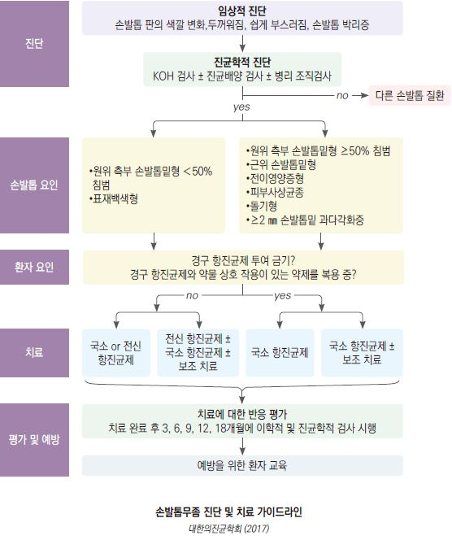
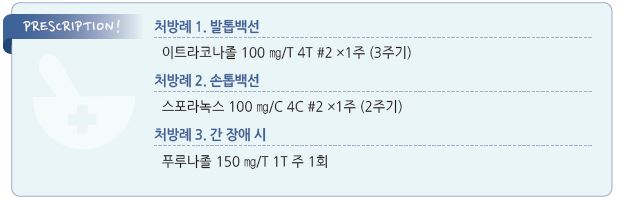

# 손발톱백선증 Onychomycosis, Tinea Unguium


## 원인

### 원인균

* dermatophytes : Trichophyton (대부분. 특히 발톱)
*   non-dermatophytes : 드묾

    •molds : 고령에서 보다 흔함. 주로 엄지발톱 이환; Aspergillus, Fusarium

    •yeasts : 손톱에 보다 흔함; C. albicans

    •non-dermatophytes는 직업/환경적 요인과 관련이 있기 때문에 보다 치료하기 어려움

※ nail dystrophy 환자의 50%가 fungus에 의한 것이 아님

### 위험 인자

* 발백선
* 환자와 동거, 옷장 공동 사용(예: 헬스클럽)
* 빈번한 습기 노출(예: 요식업 종사, 가사 도우미)
* 고령
* 유전
* 건선, 당뇨병, 암, 말초혈관 질환, 면역 저하

## 임상 양상

* 주로 원위부 또는 원위측부 이환

> ```
> ✽근위부만 이환된 경우는 외상 또는 면역 저하 상태를 고려
> ```

* 손톱의 혼탁/비후/부스러짐(onycholysis)
* nail bed와의 분리
* subungual hyperkeratosis

#### 칸디다 감염의 특징

* 발생 부위 : 주로 손톱, 특히 dominant hand, 중지 이환
* 위험 인자 : 지속적인 물 접촉
*   손톱 증상 : 손톱 주위 이환, cuticle detachment, 손톱 색상 변화(백색\~황백색)

    → 손톱 형태 변화(볼록하고 불규칙하고 거친 표면, 줄무늬, onycholysis)
* 손톱 주위 부종/홍반(club-shaped, bulbous fingertip)

## 진단

* KOH : 조갑 및 조갑하 debris; 조갑 백선이 의심되나 검사 결과가 음성인 경우에는 재검
* 배양 검사(위음성 30%), 조직 검사, PCR, fluorescence microscopy
* 주의 : 검사 1주 전 국소 치료제 사용 중지

> ✽육안으로 관찰되는 nail dystrophy의 50%는 조갑 백선이 아님

## 예후

* clinical cure rate : 경구제로 25\~50%, 도포제로 ＜10%
* 재발/재감염률 : 10\~50%

#### 나쁜 예후 인자

* 조갑의 ＞50% 이환
* 근위부/측부 이환
* 전체 조갑의 dystrophy(matrix involvement)
* 조갑하 과각화 ＞2 ㎜
* 조갑의 백색/황색/갈색 줄
* 면역저하자, 말초 혈행 장애

> **Management**

### 치료 방침

* 장기 치료가 필요하며 재발이 흔함을 설명
* 손발톱을 최대한 짧게 깎음
* 외용제는 치료율이 높지 않음을 감안하여 사용 시 최대한 조갑을 얇게 갈아내고 도포
*   경구제 사용 시 반드시 복용하고 있는 다른 약제와의 상호 작용을 확인

    

## 약물 치료

### 경구 항진균제

* 간염 시 금기; 투여 전 LFT 시행

#### Terbinafine

* 장점 : 일부 연구에서 타 제제보다 효과적
* 주의 : 신 기능 저하, 건선(✽건선을 악화시킬 수 있음)
* 부작용 : 두통, 어지럼, 소화불량, 간 효소 수치 상승, 시야 흐림
* 약물 상호 작용 : CYP2D6 억제; β-차단제, SSRI, TCA, warfarin
* 용법 : 250 ㎎ qd; 손톱 6주, 발톱 12주 \[라미실]

#### Itraconazole

* 장점 : Candida 및 molds에 대하여 타 제제보다 효과적. fluconazole에 비하여 넓은 적응증
* 음식/탄산음료와 함께 복용 시 흡수 증가 (✽산성에서 흡수 향상)
*   약물 상호 작용 : CYP3A4 억제; 항부정맥제, 당뇨병제, statin, CCB, hydrochlorothiazide, steroid, 경구 피임제, warfarin,

    ergot, benzodiazepine, zolpidem
* 부작용 : 간 독성, 심부전, 부종, 비염
*   주기 요법 : 200 ㎎ bid 1주 복용 후 3주 휴약하는 것을 1주기로 하여 손톱 2주기, 발톱 3(\~4)주기 치료;

    지속 요법 대비 동등 이상 효과
* 지속 요법 : 200 ㎎ qd; 손톱 6\~8주, 발톱 12주 \[스포라녹스]

#### Fluconazole

* 장점 : 독성이 적음 (간 이상, 음주에 대하여 상대적으로 안전)
* 대상 : 다른 경구제를 사용하기 어려운 경우 선택 (다른 제제보다 효과 낮음)
* 부작용 : 고용량에서 간 독성, 탈모, 근육 약화, 입마름
* 주의 : 신 기능 저하
* 약물 상호 작용 : itraconazole과 동일
* 용법 : 150 ㎎ qwk; 손톱 3~~6개월, 발톱 6~~12개월 \[푸루나졸]

### 국소 항진균제 (네일라카)

* 효과 : 단독 사용 시 효과 낮음; 경구제에 병용하여 약간(\~10%)의 치료율 상승을 기대
*   대상 : 1\~2개 조갑판의 원위 ＜50% 이환, 경구제 복용이 곤란한 상태(예: 상호 작용이 있는 약물 복용 중),

    경구제 치료 후 재발 예방
* 주의 : (손상된) 피부에 대한 약물 접촉을 피함
* 용법 : 1일 1회 ×\~48주; 7일마다 알코올로 약제 제거 및 두꺼워진 발톱의 윗면을 갈아내고 도포
* ciclopirox 8% : 치료율 10%; qod\~2/wk \[로푸록스]
* amorolfine 5% : 1\~2/wk \[로세릴] (✽ciclopirox보다 치료율이 다소 높다는 보고가 있음)
* tavaborole 5%, efinaconazole 10% [주블리아](../%EB%B9%84%EB%B3%B4%ED%97%98/); 치료율 15%

## 예방

```
(☞ p.927)
```

> **질병코드** B35.1 손발톱백선


