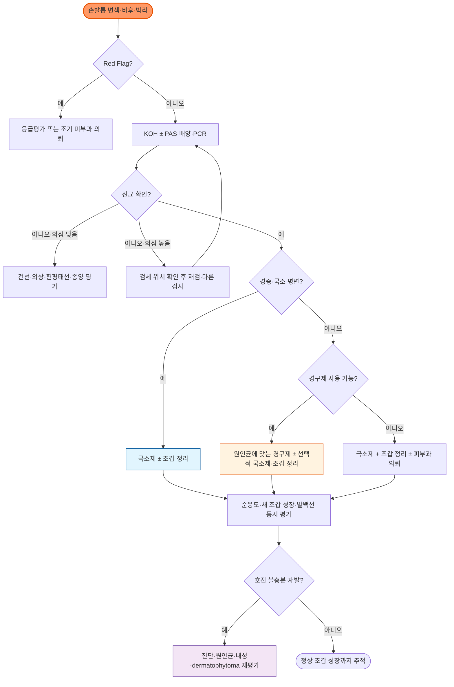

# 손발톱진균증 Onychomycosis

## <mark style="color:green;">일반 사항</mark>

* 피부사상균(dermatophytes), 효모(yeasts), 비피부사상균성 사상균(non-dermatophyte molds, NDM)에 의한 손발톱 감염을 모두 포함하는 개념
* 이 중 **피부사상균에 의한 감염만을 손발톱백선(tinea unguium)**이라 함

***

## <mark style="color:green;">원인 및 위험 인자</mark>

### <mark style="color:orange;">원인균</mark>

* **피부사상균** : 가장 흔하며 특히 발톱 감염의 대부분을 차지. 주로 *Trichophyton rubrum*, *T. interdigitale*이 원인
* **효모** : 손톱에서 상대적으로 흔하며 대표적으로 *Candida* spp.
* **비피부사상균성 사상균** : *Aspergillus*, *Fusarium*, *Scopulariopsis* 등이 있으며 고령, 외상 또는 기존 조갑질환이 있는 엄지발톱에서 상대적으로 흔함


임상적으로 관찰되는 조갑변형(nail dystrophy)의 약 절반은 진균 감염이 아니다. 건선, 반복 외상, 편평태선, 노화성 변화 및 조갑 종양을 감별하지 않고 경구 항진균제를 처방하지 않는다.


### <mark style="color:orange;">위험 인자</mark>

* 발백선(tinea pedis), 손백선(tinea manuum)
* 고령, 가족력 또는 유전적 소인
* 당뇨병, 말초혈관질환, 면역저하, 암
* 건선 또는 기존 조갑질환
* 반복적인 조갑 외상, 꽉 끼는 신발, 운동선수
* 다한증, 장기간의 습기·물·세제 노출
* 공동 샤워실·수영장 이용, 신발·양말·수건·손발톱 관리 도구의 공동 사용

## <mark style="color:green;">임상 양상</mark>

### <mark style="color:orange;">주요 소견</mark>

* 황색·백색·갈색의 조갑 변색과 혼탁
* 조갑 비후, 취약성 및 부스러짐
* 조갑박리(onycholysis) : 조갑판이 조갑상에서 분리됨
* 조갑하 과각화(subungual hyperkeratosis)
* 진행 시 조갑 전체의 변형과 소실

### <mark style="color:orange;">임상형</mark>

<table><thead><tr><th>임상형</th><th>특징</th><th>임상적 의미</th></tr></thead><tbody><tr><td>원위·측부 조갑하형(Distal and Lateral Subungual Onychomycosis, DLSO)</td><td>원위부 또는 측부에서 시작하는 조갑박리·조갑하 과각화</td><td>가장 흔한 형태</td></tr><tr><td>표재백색형(Superficial White Onychomycosis, SWO)</td><td>조갑판 표면의 분필 같은 백색 반점·반</td><td>표면 검체 채취가 유용</td></tr><tr><td>근위 조갑하형(Proximal Subungual Onychomycosis, PSO)</td><td>근위 조갑주름 쪽에서 시작하는 백색 변화</td><td>면역저하, 특히 HIV 위험을 평가하되 면역정상자에서도 발생 가능</td></tr><tr><td>조갑내형(Endonyx Onychomycosis, EO)</td><td>조갑판 내부의 유백색 변화와 층상 분리</td><td>조갑박리·조갑하 과각화가 두드러지지 않을 수 있음</td></tr><tr><td>전이영양형(Total Dystrophic Onychomycosis, TDO)</td><td>조갑판 전체의 비후·변형·파괴</td><td>중증 또는 장기간 지속된 감염</td></tr></tbody></table>

### <mark style="color:orange;">칸디다 감염과 만성 조갑주위염</mark>

* 주로 손톱, 특히 물·세제에 반복 노출되는 손에 발생
* 근위 조갑주름의 부종·홍반, 소피(cuticle) 소실, 조갑판의 횡구·불규칙·변색이 동반될 수 있음
* 만성 조갑주위염은 습기와 자극물질에 의한 피부염이 중심이고 *Candida*는 이차 집락일 수 있음. 배양 양성만으로 칸디다 조갑진균증으로 단정하지 않고 직접검경·조직검사와 임상 소견의 일치 여부를 확인

### <mark style="color:$danger;">🚩 Red Flags!</mark>

<mark style="color:$danger;">**즉각 조치 또는 의뢰**</mark>

* 발열·전신독성·저혈압과 함께 손발가락의 발적·부종이 빠르게 확산하거나 괴사·수포·심한 통증이 동반되는 경우
* 당뇨병 또는 말초혈관질환 환자에서 검게 변한 조직, 급성 허혈, 심부궤양 또는 중증 감염이 의심되는 경우

<mark style="color:$warning;">**당일 또는 조기 의뢰**</mark>

* 단일 조갑의 새로 발생한 불규칙 종선 색소, 폭 증가, Hutchinson sign, 출혈·궤양 또는 진행성 조갑 파괴
* 면역저하자에서 새로 발생한 근위 조갑하 병변
* 심한 조갑주위염, 농양, 보행을 방해하는 통증 또는 당뇨발 궤양 동반

<mark style="color:$info;">**외래 추적 / 추가 평가 계획**</mark> <mark style="color:$info;">- 즉각 위험 낮으나 호전 없으면 의뢰</mark>

* 적절한 치료와 순응도에도 호전하지 않거나 반복 재발하는 경우
* NDM·효모 감염이 의심되지만 원인균 확인이 어려운 경우
* 심한 조갑비후·dermatophytoma·matrix 침범 또는 다수 조갑 침범

## <mark style="color:green;">진단</mark>


**경구 항진균제를 처방하기 전에 진균 감염을 확인한다.** 임상 소견만으로 경구제를 시작하면 비진균성 조갑질환을 불필요하게 장기간 치료할 수 있다(AAD Choosing Wisely).


### <mark style="color:orange;">검체 채취</mark>

1. 조갑의 오염물과 매니큐어를 제거하고 70% 알코올로 닦은 후 충분히 건조
2. 원위·측부 조갑하형에서는 분리된 원위 조갑판을 잘라내고 **병변과 정상 조갑의 경계에 가까운 근위 조갑하 각질**을 충분히 긁어 채취
3. 표재백색형은 조갑판 표면 병변을 긁고, 근위 조갑하형은 가능한 한 근위 병변에 가깝게 채취
4. 최근 항진균제 사용은 특히 배양 양성률을 낮출 수 있음. 사용 제제와 기간을 확인하고 검사실 지침에 따라 충분히 중단한 뒤 채취. 음성이지만 의심이 높으면 다른 검사 또는 재채취를 시행

### <mark style="color:orange;">검사법</mark>

<table><thead><tr><th width="140">검사</th><th width="180">장점</th><th>한계·활용</th></tr></thead><tbody><tr><td>KOH 직접도말</td><td>신속하고 저렴함</td><td>검사자와 검체의 질에 따라 민감도가 달라짐. 균종·생존 여부는 알 수 없음</td></tr><tr><td>조갑 clipping PAS/GMS 염색</td><td>민감도가 높고 조갑판 내 균사 확인 가능</td><td>균종과 생존 여부는 알 수 없음</td></tr><tr><td>진균배양</td><td>생존균과 균종 확인 가능</td><td>결과가 늦고 위음성·오염 가능. NDM 의심 또는 치료 실패 시 특히 유용</td></tr><tr><td>PCR</td><td>신속하고 민감도가 높으며 일부 균종 확인 가능</td><td>비용·가용성 제한, 죽은 균도 검출 가능</td></tr></tbody></table>


비피부사상균성 사상균은 흔한 환경 오염균이므로 배양 1회 양성만으로 원인균으로 확정하지 않는다. 직접검경·조직검사에서 진균 요소가 확인되고 피부사상균이 배양되지 않으며 같은 NDM이 반복 배양되는지 평가한다.


### <mark style="color:orange;">감별 진단</mark>

<table><thead><tr><th width="150">질환</th><th>감별 단서</th></tr></thead><tbody><tr><td>조갑건선</td><td>점상함몰(pitting), oil-drop sign, 조갑박리, 두피·팔꿈치·무릎 병변</td></tr><tr><td>반복 외상·노화성 조갑변형</td><td>압박 부위 또는 특정 발가락에 국한, 진균검사 음성</td></tr><tr><td>조갑 편평태선</td><td>종주름·조갑판 얇아짐, 익상편(pterygium), 피부·구강 병변</td></tr><tr><td>만성 조갑주위염</td><td>근위 조갑주름 염증과 소피 소실, 습기·자극물질 노출</td></tr><tr><td>녹농균 감염</td><td>녹색 또는 녹흑색 조갑 변색, 조갑박리</td></tr><tr><td>조갑하 흑색종</td><td>단일 조갑의 새롭거나 넓어지는 불규칙 종선 색소, Hutchinson sign</td></tr><tr><td>조갑하 편평세포암 등 종양</td><td>단일 조갑의 지속적인 파괴·출혈·궤양, 표준치료 불응</td></tr></tbody></table>


단일 조갑의 진행성 색소·파괴·출혈·궤양을 진균 감염으로 간주하여 경험적 항진균제만 반복하면 조갑하 흑색종이나 편평세포암의 진단이 지연될 수 있다. 의심 소견이 있으면 진균검사 결과와 무관하게 조기 피부과 평가 및 필요 시 생검을 고려한다.


***


```mermaid
flowchart TB
    A([손발톱 변색·비후·박리]) --> B{Red Flag?}
    B -- 예 --> C[응급평가 또는 조기 피부과 의뢰]
    B -- 아니오 --> D[KOH ± PAS·배양·PCR]
    D --> E{진균 확인?}
    E -- 아니오·의심 낮음 --> F[건선·외상·편평태선·종양 평가]
    E -- 아니오·의심 높음 --> G[검체 위치 확인 후 재검·다른 검사]
    G --> D
    E -- 예 --> H{경증·국소 병변?}
    H -- 예 --> I[국소제 ± 조갑 정리]
    H -- 아니오 --> J{경구제 사용 가능?}
    J -- 예 --> K[원인균에 맞는 경구제 ± 선택적 국소제·조갑 정리]
    J -- 아니오 --> L[국소제 + 조갑 정리 ± 피부과 의뢰]
    I --> M[순응도·새 조갑 성장·발백선 동시 평가]
    K --> M
    L --> M
    M --> N{호전 불충분·재발?}
    N -- 예 --> O[진단·원인균·내성·dermatophytoma 재평가]
    N -- 아니오 --> P([정상 조갑 성장까지 추적])
    style A fill:#f96,stroke:#e65100,stroke-width:2px
    style I fill:#e1f5fe,stroke:#01579b
    style K fill:#fff3e0,stroke:#e65100
    style O fill:#f3e5f5,stroke:#4a148c
```

<p align="center"><strong>손발톱진균증 진단 및 치료 알고리듬</strong></p>

<p align="center"><em><mark style="color:$info;">Ref. 대한의진균학회 국내 알고리듬(2017)과 Nenoff 등 S1 guideline(2023) 및 최신 문헌을 바탕으로 재구성</mark></em></p>

***

## <mark style="background-color:$warning;">Management</mark>

### <mark style="color:orange;">치료 선택</mark>

<table><thead><tr><th width="140">치료</th><th>주요 대상</th></tr></thead><tbody><tr><td>국소 항진균제</td><td>대체로 1\~3개 조갑, 원위부 침범 &lt;50%, matrix/lunula 비침범, 경구제 사용이 곤란한 경우</td></tr><tr><td>경구 항진균제</td><td>조갑판 ≥50% 침범, matrix 침범, 다수 조갑, 조갑하 과각화 &gt;2 mm, dermatophytoma, 국소치료 실패</td></tr><tr><td>병용치료</td><td>중증·재발성 병변, dermatophytoma 또는 단독치료 실패에서 선택적으로 고려. 일률적인 병용은 권고하지 않음</td></tr><tr><td>경과관찰·조갑관리</td><td>증상이 거의 없고 치료 이득이 낮거나 환자가 약물치료를 원하지 않는 경우. 당뇨병·말초혈관질환에서는 합병증 위험을 함께 평가</td></tr></tbody></table>


알고리듬의 **경증·국소 병변**은 대체로 1\~3개 조갑, 원위부 침범 &lt;50%, matrix/lunula 비침범, dermatophytoma 없음에 해당한다. 조갑판 ≥50% 침범, matrix/lunula 침범, 다수 조갑, 근위 조갑하형·전이영양형, 조갑하 과각화 &gt;2 mm, dermatophytoma 또는 적절한 국소치료 실패는 경구제 적합성을 평가한다.


* 손발톱을 짧게 자르고 두꺼운 조갑은 안전하게 얇게 정리. 당뇨병·신경병증·말초혈관질환 환자는 자가 사포질·절삭 중 손상에 주의
* 조갑하 과각화가 심하거나 dermatophytoma가 있으면 약물 침투가 제한될 수 있다. 약물치료와 함께 전문가에 의한 기계적 조갑 삭제(debridement)를 고려하고, 선택된 환자에서는 주위 피부를 보호한 상태에서 40% 요소(urea)를 이용한 화학적 조갑연화·박리를 보조적으로 고려. 당뇨병·신경병증·말초혈관질환 환자의 자가 절삭·박리는 피함
* 동반 발백선·손백선을 함께 치료하여 재감염원을 줄임
* 조갑의 외형은 진균이 제거된 뒤에도 즉시 정상화되지 않음. 정상 조갑이 자라 나오는 데 손톱은 약 4\~6개월, 발톱은 12\~18개월이 걸릴 수 있음

## <mark style="color:green;">비-약물 치료 및 예방</mark>

* 발과 발가락 사이를 씻은 뒤 완전히 말리고 땀이 찬 양말은 교체
* 통풍이 잘되는 신발을 번갈아 신고 내부를 충분히 건조
* 수건, 신발, 양말, 손발톱깎이·줄을 공동 사용하지 않음
* 공동 샤워실·수영장에서는 개인 슬리퍼를 사용
* 손발톱을 너무 짧거나 둥글게 자르지 않고 조갑주위 피부 손상을 피함
* 동반 발백선·손백선을 치료하고 가족에게 의심 병변이 있으면 진료를 권함 (☞ [피부백선증](172_-dermatophytosis-tinea.md))

## <mark style="color:green;">약물 치료</mark>

### <mark style="color:orange;">경구 항진균제 공통 원칙</mark>

* 아래 용량과 치료기간은 성인에서 사용하는 대표적인 **예시**이다. 실제 처방은 원인균, 침범 범위, 간·신장 기능, 연령, 임신·수유 여부, 병용약물 및 제품별 국내 허가사항에 따라 조정
* 치료 전 간질환, 신기능, 심부전, 임신 가능성, 복용 중인 모든 처방약·일반약·건강기능식품을 확인
* Terbinafine 또는 itraconazole 투여 전 AST/ALT 등 기저 간기능검사(LFT)를 시행. 장기간 fluconazole을 투여하거나 간손상 위험인자가 있는 경우에도 기저 LFT를 확인
* 활동성 또는 만성 간질환에서는 terbinafine이 금기이며, 다른 경구 항진균제도 자동 대체하지 말고 치료 필요성과 위험을 재평가
* **임신·수유** : 손발톱진균증은 대개 비응급 질환이므로 임신 중에는 가능하면 약물치료를 출산 후로 연기하고 조갑관리·기계적 정리를 우선. 경구 항진균제는 원칙적으로 피함. 수유 중에도 경구제는 가급적 피하고 치료 필요성과 약제별 자료를 개별 평가. 국소제 역시 임신·수유 중 안전성이 확립된 것으로 단정하지 말고, 꼭 필요한 제한적 병변에서 제품별 허가사항과 이득–위험을 검토하여 고려
* 황달, 진한 소변, 회색변, 지속적인 오심·식욕저하·피로·우상복부 통증, 광범위 발진·점막병변이 발생하면 즉시 복용을 중단하고 평가
* 치료 중 LFT 반복검사는 약제 허가사항과 환자 위험도에 따름. 고령, 간질환 병력, 간독성 약물 병용, 장기치료 또는 간손상 의심 증상에서는 재검

### <mark style="color:orange;">Terbinafine</mark>

* **우선 선택** : 피부사상균성 손발톱백선의 1차 경구제
* **용법** : 250 ㎎ qd; 손톱 6주, 발톱 12주 <mark style="color:blue;">\[라미실정 등]</mark> — 국내 허가사항은 조갑진균증에 통상 6주\~3개월로 제시
* **금기** : 활동성 또는 만성 간질환, 경구 terbinafine 중증 과민반응 병력
* **주의** : 신기능 저하, 건선 또는 피부 홍반루푸스 악화 가능성
* **중요 이상반응** : 간손상, 미각·후각 변화 또는 소실, 식욕저하·체중감소, 우울 증상, 중증 피부반응, 드문 혈구감소
* **상호작용** : 임상적으로 유의한 CYP2D6 억제. TCA·SSRI·일부 β차단제·class 1C 항부정맥제 등은 농도 증가 가능성을 확인. Tamoxifen의 활성대사체(endoxifen) 생성을 감소시킬 수 있으므로 가능하면 병용을 피하고 대체 항진균제를 검토. Rifampin은 terbinafine 청소율을 약 2배 증가시켜 효과를 낮출 수 있음. Warfarin 병용 시 INR 변화를 관찰
* **카페인** : 카페인 청소율을 낮출 수 있으므로 카페인에 민감한 환자에서 불면·두근거림 등이 심해지면 커피·에너지음료 섭취를 줄임

### <mark style="color:orange;">Itraconazole</mark>

* **선택 대상** : *Candida* 또는 일부 NDM 감염, terbinafine을 사용할 수 없거나 효과가 불충분한 경우
* **주기요법** : 200 ㎎ bid 1주 복용 후 3주 휴약을 1주기로 하여 손톱 2주기, 발톱 3주기
* **지속요법** : 200 ㎎ qd × 3개월 <mark style="color:blue;">\[스포라녹스캡슐 등]</mark>
* **복용법** : 캡슐은 충분한 식사 직후 복용. PPI·H₂ 차단제 등 위산억제제는 흡수를 낮출 수 있으며 병용이 불가피하면 산성 음료를 고려. 경구액은 캡슐과 복용법·생체이용률이 다르므로 서로 임의 대체하지 않음
* **금기·중요 주의** : 손발톱진균증 치료 목적으로는 현재 또는 과거 울혈성심부전·심실기능장애 환자에게 사용하지 않음. 임신 중 또는 임신을 계획 중인 환자에게 사용하지 않음
* **상호작용** : 강력한 CYP3A4 억제제. Simvastatin·lovastatin, 일부 항부정맥제·진정수면제·항응고제 등 금기 또는 고위험 병용약이 많으므로 처방 전 상호작용을 반드시 확인
* **이상반응** : 간독성, 위장관 증상, 부종, 심부전 악화, 말초신경병증

### <mark style="color:orange;">Fluconazole</mark>

* **위치** : terbinafine·itraconazole을 사용할 수 없거나 효과가 불충분한 경우에 **제한적으로 고려하는 대안**
* **용법** : 150 ㎎ qwk, 감염되지 않은 새 손발톱이 자랄 때까지 투여 <mark style="color:blue;">\[푸루나졸 등]</mark> — 통상 손톱 3\~6개월, 발톱 6\~12개월을 예상하되 조갑 성장속도와 임상반응에 따라 조정
* **주의** : 간질환에서 안전한 대체약이 아님. 드물게 중증 간독성이 발생할 수 있으며 신기능 저하에서는 용량 조절이 필요
* **상호작용** : CYP2C9·CYP2C19 억제 및 중등도 CYP3A4 억제. Warfarin, sulfonylurea, phenytoin, 일부 statin 및 QT 연장 약물과의 상호작용을 확인
* **이상반응** : 두통, 위장관 증상, 발진, 간효소 상승; 장기·고용량에서 탈모 가능

### <mark style="color:orange;">국소 항진균제</mark>


네일라카·외용액은 제형마다 도포 횟수, 라카 제거법, 파일링 필요 여부와 최대 사용기간이 다르다. 같은 성분이라도 제형에 따라 사용법이 다르므로 **처방·판매 시 제품별 허가사항을 반드시 확인**하고, 모든 제품에 동일한 사용법을 적용하지 않는다.


<table><thead><tr><th width="210">제제</th><th width="260">용법·특징</th><th>치료기간·주의</th></tr></thead><tbody><tr><td>Ciclopirox 8% 일반 네일라카 <mark style="color:blue;">\[로푸록스]</mark></td><td>첫째 달 격일, 둘째 달 주 2회 이상, 셋째 달 이후 주 1회. 주 1회 라카막을 제거하고 조갑을 정리</td><td>국내 해당 제품 허가사항상 적용기간은 6개월을 초과하지 않음</td></tr><tr><td>Ciclopirox 8% 수용성 네일라카 <mark style="color:blue;">\[풀케어, 무조날에스네일라카 등]</mark></td><td>1일 1회, 가능하면 취침 전 손발톱 전체·주위 5 mm와 가능한 경우 조갑 끝 아랫면까지 도포. 약 30초 건조 후 최소 6시간 동안 씻지 않음. 파일링이나 유기용매를 이용한 제거는 불필요하며 이후 물로 제거 가능</td><td>건강한 손발톱이 자랄 때까지 사용하며 손톱 약 6개월, 발톱 9\~12개월 예상. 동일 성분 일반 네일라카와 용법이 다름</td></tr><tr><td>Amorolfine 5% 네일라카 <mark style="color:blue;">\[로세릴]</mark></td><td>주 1\~2회. 도포 전 감염 조갑을 갈아내고 기존 라카를 닦아냄</td><td>감염 조갑에 사용한 줄을 정상 조갑에 사용하지 않음</td></tr><tr><td>Efinaconazole 10% 외용액 <mark style="color:blue;">\[주블리아 및 제네릭]</mark></td><td>감염된 발톱 전체에 1일 1회 도포. 조갑판뿐 아니라 조갑주름·조갑상·hyponychium 및 가능한 조갑판 아랫면까지 도포</td><td>통상 48주 사용. 정기적 라카 제거·파일링은 필수 아님. 피부 자극, 접촉피부염, 내향성발톱에 주의</td></tr><tr><td>Terbinafine 고농도 조갑 외용액 <mark style="color:blue;">\[무조날맥스]</mark></td><td>처음 4주간 1일 1회, 이후 주 1회 감염된 손발톱에 도포</td><td>손톱 약 6개월, 발톱 9\~12개월 목표. 일반의약품이며 피부백선용 저농도 terbinafine 외용액과 혼동하지 않음</td></tr></tbody></table>

## <mark style="color:green;">치료반응과 예후</mark>

* 치료율을 비교할 때 **진균학적 완치**, **임상적 완치**, **완전완치(임상적+진균학적 완치)**를 구분
* 대표 연구에서 발톱의 완전완치율은 경구 terbinafine 약 38%, 경구 itraconazole 약 14%, ciclopirox 약 5.5\~8.5%, efinaconazole 약 15.2\~17.8%였음. 연구별 대상·중증도·평가시점이 달라 직접 비교에는 한계(Falotico & Lipner, Clin Cosmet Investig Dermatol 2022)
* 재발 또는 재감염은 흔하며 동반 발백선, 불완전한 복약, 남은 감염 조갑, 가족 내 감염원, 반복 외상·습기 노출이 위험을 높임


완치율은 연구별 환자군, 중증도, 치료기간, 완치 정의와 평가시점이 서로 다르므로 제제 간 수치를 단순 직접 비교하지 않는다.


### <mark style="color:orange;">불량한 치료반응의 위험 인자</mark>

* 조갑판 ≥50% 침범 또는 matrix 침범
* 전이영양형, 조갑하 과각화 >2 mm
* 조갑 내 세로 방향의 황색·백색 선 또는 반으로 보이는 dermatophytoma
* 다수 조갑 침범, 고령, 면역저하, 당뇨병, 말초혈행장애
* NDM 감염, 혼합감염, 부적절한 검체 채취 또는 잘못된 초기 진단

### <mark style="color:orange;">치료 실패 시 재평가</mark>

1. 복약·도포 순응도와 충분한 치료기간을 확인
2. 새 조갑의 근위부 성장 여부를 확인하고 단순히 남아 있는 원위 변형을 치료 실패로 판단하지 않음
3. KOH·PAS·배양 또는 PCR로 진단과 원인균을 다시 확인
4. 발백선, 신발·손발톱 도구, 가족 내 감염 등 재감염원을 평가
5. Dermatophytoma, NDM·혼합감염, 약물 흡수 저하 및 항진균제 내성을 고려


Terbinafine 내성 피부사상균과 *T. indotineae*가 국제적으로 보고되고 있으며 국내에서도 발생이 확인되었으나, 국내 손발톱진균증에서의 빈도와 확산 정도는 아직 불명확하다. 적절한 terbinafine 치료에도 실패하면 임의로 장기 연장하기보다 진단·균종·순응도·재감염원을 재평가하고, 가능한 경우 배양·균종 동정 및 전문의뢰를 고려한다.


***

### <mark style="color:red;">질병코드</mark>

B35.1　손발톱백선(tinea unguium) — 피부사상균에 의한 경우

B37.2　피부 및 손발톱의 칸디다증 — 칸디다에 의한 경우

***

## <mark style="color:purple;">처방례(성인 예시)</mark>


아래 처방은 교육을 위한 대표 예시이다. 실제 처방 전 진균 감염을 확인하고 간·신장 기능, 심부전, 임신·수유 여부, 병용약물과 제품별 국내 허가사항을 검토하여 조정한다.


> **처방례 1. 피부사상균성 발톱백선 — 1차 선택**
>
> ```
> 라미실정 250 ㎎　1T　qd ×12주
> ```
>
> _✽근위부에서 새로 자라는 조갑이 깨끗한지 확인하며 경과 관찰_

> **처방례 2. 피부사상균성 손톱백선**
>
> ```
> 라미실정 250 ㎎　1T　qd ×6주
> ```
>
> _✽치료 종료 후에도 손톱 완전 정상화까지 약 4\~6개월 소요될 수 있음을 설명_

> **처방례 3. Itraconazole 주기요법 — 발톱**
>
> ```
> 스포라녹스캡슐 100 ㎎/C 2C　bid ×7일 복용 후 21일 휴약 (1주기), 총 3주기
> ```
>
> _✽충분한 식사 직후 복용; 심부전·간질환·CYP3A4 병용약 확인_

> **처방례 4. Itraconazole 주기요법 — 손톱**
>
> ```
> 스포라녹스캡슐 100 ㎎/C 2C　bid ×7일 복용 후 21일 휴약 (1주기), 총 2주기
> ```
>
> _✽충분한 식사 직후 복용; 심부전·간질환·CYP3A4 병용약 확인_

> **처방례 5. Fluconazole 대안요법**
>
> ```
> 푸루나졸 150 ㎎　1T　qwk
> ```
>
> _✽손톱 3\~6개월, 발톱 6\~12개월을 예상하되 임상반응과 새 조갑 성장에 따라 조정_

> **처방례 6. 경증 손발톱진균증 — 국소치료**
>
> ```
> 주블리아외용액 10%　1병
> 감염된 손발톱 전체에 1일 1회 도포
> ```
>
> _✽조갑주름·조갑상·hyponychium 및 가능한 조갑판 아랫면까지 빠짐없이 도포_


Fluconazole은 "간 장애 시 대체약"이 아니다. 활동성 또는 유의한 간질환에서는 경구 항진균제의 필요성을 재평가하고 국소치료 또는 피부과 의뢰를 고려한다.


***

### <mark style="color:$success;">핵심 복약 지도</mark>

> **치료 기간과 경과**
>
> * 처방된 기간이 끝나도 변색된 조갑이 즉시 정상으로 바뀌지 않습니다. 근위부에서 깨끗한 새 조갑이 자라는지를 확인합니다.
> * 네일라카와 외용액은 제품마다 바르는 횟수와 손발톱을 갈거나 약을 제거하는 방법이 다르므로 제품별 지시를 따릅니다.

> **경구 항진균제 복용 시 주의**
>
> * **황달, 진한 소변, 심한 식욕저하·피로, 광범위 발진·물집 또는 입안 헐음이 생기면 경구약 복용을 중단하고 즉시 진료받습니다.**
> * Terbinafine 복용 중 맛이나 냄새가 달라지거나 사라지면 약을 중단하고 처방 의료진에게 알립니다.
> * Itraconazole 복용 중 숨참, 다리 부종, 갑작스러운 체중 증가가 생기면 심부전 가능성을 평가받습니다.

> **언제 다시 병원을 방문해야 하나요?**
>
> * 정해진 기간 복용·도포했는데도 새로 자라는 조갑 근위부가 깨끗해지지 않는 경우
> * 위에 언급한 간독성·과민반응·심부전 의심 증상이 나타나는 경우
> * 치료 종료 후에도 재발하거나 다른 손발톱으로 번지는 경우

***

### <mark style="color:blue;">환자 안내서</mark>


**손발톱무좀은 치료가 오래 걸리지만, 약이 듣지 않아서만은 아닙니다.**

감염이 제거된 뒤에도 손발톱은 뿌리에서부터 새로 자라야 겉모습이 좋아집니다. 손톱은 약 4\~6개월, 발톱은 12\~18개월이 걸릴 수 있습니다.


#### <mark style="color:$primary;">왜 손발톱에 무좀이 생기나요?</mark>

* 발가락 무좀(발백선)이 있던 자리에서 곰팡이가 손발톱으로 옮아가 자라는 경우가 가장 흔합니다.
* 고령, 당뇨병, 혈액순환장애, 반복적인 손발톱 외상이 있으면 더 잘 생깁니다.

#### <mark style="color:$primary;">일상생활에서 어떻게 관리하나요?</mark>

* **발가락 사이 무좀을 함께 치료하고 발을 잘 말리십시오.** 무좀을 그대로 두면 손발톱 감염이 반복됩니다.
* **신발·양말·수건·손발톱깎이를 다른 사람과 함께 사용하지 마십시오.**
* 당뇨병, 감각저하 또는 혈액순환장애가 있으면 두꺼운 발톱을 직접 깊게 자르거나 갈다가 상처를 만들지 않도록 주의하십시오.

#### <mark style="color:$primary;">약은 어떻게 써야 하나요?</mark>

* 약을 임의로 중단하거나 더 오래 복용하지 마시고, 처방받은 기간을 지키십시오.
* 네일라카와 외용액은 제품마다 바르는 횟수, 손발톱을 갈아내는 방법 및 약막 제거법이 다릅니다. **구입하거나 처방받은 제품의 설명서를 반드시 확인하십시오.**
* 진료 때마다 손발톱 뿌리 쪽에서 깨끗한 새 조갑이 자라는지 함께 확인합니다.

#### <mark style="color:$primary;">이럴 때는 즉시 병원을 방문하세요</mark>

* **경구약 복용 중 황달, 진한 소변, 심한 피로, 광범위 발진·물집, 입안 헐음, 숨참이나 다리 부종이 생기면 복용을 중단하고 즉시 진료받으십시오.**
* 손발톱 색이 새로 불규칙하게 짙어지거나 손톱 주변 피부까지 색소가 번지는 경우
