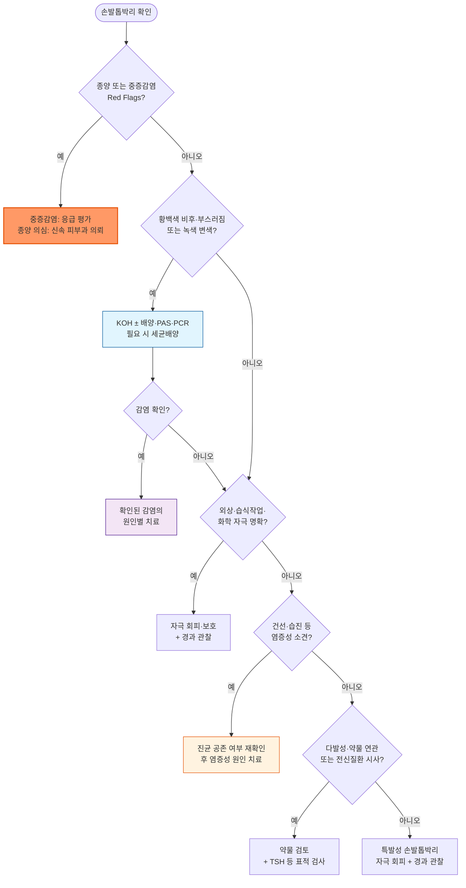

# 손발톱박리증 Onycholysis

## <mark style="color:green;">일반 사항</mark>

* 손발톱판(nail plate)이 손발톱바닥(nail bed)에서 분리되는 임상 소견
* 다른 이름 : 조갑박리증
* 대개 원위부에서 시작하여 근위부로 진행하며, 한 개 또는 여러 손발톱을 침범할 수 있음
* 손발톱 자체의 독립된 질환이라기보다 외상, 피부질환, 감염, 전신질환, 약물 또는 종양 등에 의해 발생하는 임상 징후인 경우가 많음
* 분류 : 원발성(특발성) - 성인 여성과 손톱에서 보다 흔함 / 속발성 - 명확한 원인 질환·자극·약물이 확인되는 경우
* 이미 분리된 손발톱판은 다시 붙지 않으며, 새로 자라는 손발톱이 손발톱바닥에 부착된 상태로 유지되어야 회복됨

***

## <mark style="color:green;">원인</mark>

#### <mark style="color:$primary;">외상·외부 자극</mark>

* 반복적 미세외상, 손발톱 밑을 기구로 파거나 청소하는 습관
* 잦은 매니큐어, 젤네일·인조손톱, 손발톱 연장술 및 제거 과정
* 꽉 끼는 신발, 반복적으로 발끝이 부딪히는 운동
* 물, 비누, 세제, 알칼리, 표백제, 용제 및 산업용 세정제에 대한 반복 노출

#### <mark style="color:$primary;">피부질환</mark>

* 건선(손발톱 건선), 손습진·접촉피부염, 편평태선

#### <mark style="color:$primary;">감염</mark>

* 피부사상균 조갑백선, Candida 감염
* 박리된 공간은 Candida 또는 *Pseudomonas aeruginosa*의 이차 집락화·감염에 취약함
  * 녹색 또는 녹흑색 변색은 Pseudomonas 이차감염(green nail syndrome)을 시사
  * 균이 검출되더라도 원발 질환인지 이차 집락화인지 임상 소견과 함께 판단

#### <mark style="color:$primary;">전신질환</mark>

* 갑상선기능항진증(Plummer nails), 갑상선기능저하증, 당뇨병, 임신 등
* 모든 환자에게 일률적인 전신검사를 시행하기보다 병력·진찰 소견에 따라 선별적으로 평가

#### <mark style="color:$primary;">약물·광독성</mark>

* Tetracycline계, fluoroquinolone계, 일부 NSAID, psoralen, 경구 retinoid 등 광과민 유발 약물
* Taxane계 등 항암제(docetaxel, paclitaxel)
* 약물 복용 후 햇빛에 노출된 손발톱에서 통증성 박리 또는 색소 변화가 동반되면 광손발톱박리증(photo-onycholysis)을 고려

#### <mark style="color:$primary;">종양</mark>

* 손발톱 단위 흑색종, 손발톱 단위 편평세포암 등
* 원인 불명의 단일 손발톱 병변이 지속되면 양성 질환으로 단정하지 않음

#### <mark style="color:$primary;">원발성</mark>

* 병력·진찰 및 필요한 검사에서 원인이 확인되지 않는 특발성 손발톱박리증

### <mark style="color:orange;">기전</mark>

* 손발톱판–손발톱바닥의 부착 구조와 원위 장벽(onychodermal/onychocorneal band, hyponychium)이 외상·염증·감염 등에 의해 손상되면 손발톱판이 분리됨
* 박리가 오래 지속되면 노출된 손발톱바닥이 각질화되어 새 손발톱이 다시 부착되지 못하는 disappearing nail bed로 진행할 수 있음

***

## <mark style="color:green;">임상 양상</mark>

* 분리된 부위는 공기가 들어가 흰색 또는 불투명하게 보이며, 부착 경계가 비교적 뚜렷함
* 대개 무증상이지만 급성 외상, 염증, 출혈 또는 이차감염이 있으면 통증·압통이 발생할 수 있음
* 손발톱 표면은 정상일 수도 있으나 원인에 따라 함몰점(pitting), 부스러짐, 변형, 조갑하 과각화 또는 출혈이 동반됨
* 건선에서는 oil-drop/salmon patch, 함몰점, 조갑하 과각화 및 박리 경계의 홍반을 확인
* 녹색·녹흑색 변색은 Pseudomonas 감염을, 황백색 변색·비후·조갑하 각질 부스러기는 조갑백선을 시사하지만 임상 소견만으로 확진하지 않음


**진단 pearl - 박리 경계의 피부경 소견**\
매끈하고 직선에 가까우며 홍반이 없는 근위 경계는 외상성 박리를, 불규칙한 톱니 모양 경계와 근위부를 향하는 spike·세로줄은 조갑백선을 시사합니다. 박리 경계의 홍반, salmon patch, 함몰점은 손발톱 건선을 지지합니다. 다만 조갑백선에서도 직선형 경계가 나타날 수 있으므로 피부경 소견은 보조 단서로만 활용하고, 조갑백선은 KOH·배양·PAS 등으로 확인합니다.


### <mark style="color:orange;">문진·진찰</mark>

* 발생 시점과 진행 속도, 단일 또는 다발성 침범, 통증·출혈·삼출 여부 확인
* 직업성 습식 작업, 세제·용제 노출, 손발톱 미용(매니큐어·젤네일), 반복 외상, 신발 및 운동력 확인
* 최근 시작하거나 증량한 약물, 항암치료 및 햇빛 노출과의 시간적 연관성 확인
* 모든 손발톱과 손·발 피부를 관찰하고, 건선이 의심되면 두피·피부 병변과 관절 증상도 확인
* 갑상선질환·당뇨병 등을 시사하는 전신 증상을 확인

***

### <mark style="color:$danger;">🚩 Red Flags!</mark>

<mark style="color:$danger;">**즉각 조치 또는 의뢰**</mark>

* 빠르게 번지는 손발톱주위 홍반·부종, 심한 통증, 발열·오한 또는 전신독성 소견
* 당뇨병·말초혈관질환·중증 면역저하 환자에서 발생한 진행성 감염 또는 조직 괴사 → 심부 농양·골수염 의심 시 응급 평가 및 배농·영상검사·전신 항균치료 필요성 판단

<mark style="color:$warning;">**당일 또는 조기 의뢰**</mark>

* 갈색·흑색 세로띠가 새로 생기거나 넓어지고, 색조·두께·경계가 불규칙한 경우
* 색소가 근위부 또는 측면 손발톱주름으로 번지는 Hutchinson sign
* 손발톱 밑 종괴, 사마귀 모양 병변, 궤양, 반복 출혈, 진행성 손발톱 파괴 또는 지속적 통증 → 악성 종양 의심 병변은 조갑백선으로 경험적 치료하지 말고 신속히 피부과에 의뢰하여 피부경검사·조직검사 필요성 평가

<mark style="color:$info;">**외래 추적 / 추가 평가 계획**</mark> <mark style="color:$info;">- 즉각 위험 낮으나 호전 없으면 의뢰</mark>

* 뚜렷한 원인 없이 한 손발톱에만 지속되거나 진행하는 박리
* 적절한 자극 회피와 원인 치료에도 호전되지 않거나 근위부로 계속 진행하는 병변
* 여러 손발톱이 동시에 침범되거나 전신질환을 시사하는 증상이 동반된 경우

***

## <mark style="color:green;">진단</mark>

* 손발톱박리는 임상적으로 진단하되, 병력과 진찰로 원인을 확인하는 것이 진단의 핵심
* 조갑백선이 의심되면 가능한 한 항진균제 치료 전에 박리 경계의 근위부에서 검체를 채취하여 KOH 직접검사 시행
  * KOH 음성이지만 의심이 높으면 진균배양, PAS 염색 또는 PCR 고려
  * 특히 장기간 경구 항진균제 투여 전에는 진균 감염 확인이 원칙
* 녹색 변색과 함께 통증, 홍반, 삼출 또는 악취가 있거나 치료 반응이 불량하면 세균배양 고려
* 원인이 불분명한 다발성 병변 또는 관련 증상이 있으면 TSH 등 표적 혈액검사 고려; 모든 환자에게 광범위 검사를 일률적으로 시행하지 않음
* 단일 손발톱의 비전형적 색소성 병변, 종괴, 궤양 또는 지속적 손발톱 파괴는 피부과 의뢰 후 피부경검사·조직검사 고려

### <mark style="color:orange;">감별 진단</mark>

* 흰색으로 보이는 손발톱이라고 모두 박리는 아니며, 손발톱 자체 변화(leukonychia)와 손발톱바탕질 성장 정지(onychomadesis)를 구분해야 함

<table><thead><tr><th width="140">질환/소견</th><th width="230">손발톱박리와의 차이</th><th>핵심 감별 포인트</th></tr></thead><tbody><tr><td>Leukonychia</td><td>손발톱판은 바닥에 정상 부착</td><td>손발톱판 자체의 백색 변화이며 손발톱판–손발톱바닥의 물리적 분리가 없음</td></tr><tr><td>Onychomadesis</td><td>근위부에서 손발톱판이 분리되어 원위부로 진행하며 때로 탈락</td><td>발열성 질환·수족구병 등 후 손발톱바탕질 성장 정지 병력</td></tr><tr><td>조갑하 혈종</td><td>외상 후 급성 발생, 압통 동반</td><td>보라~흑색 변색, 손발톱판 아래 혈액 저류</td></tr><tr><td>Pseudomonas green nail syndrome</td><td>이차감염으로 박리와 동반 가능</td><td>녹색·녹흑색 변색, 습한 환경 노출력</td></tr><tr><td>손발톱 단위 흑색종/편평세포암</td><td>박리가 종양의 이차 소견으로 동반될 수 있음</td><td>단일 손발톱, Hutchinson sign, 종괴·궤양·불규칙 색소</td></tr></tbody></table>

***



<p align="center"><strong>손발톱박리증 원인 감별 및 치료 알고리듬</strong></p>

<p align="center"><em><mark style="color:$info;">Ref. Medscape Onycholysis (2026 update); DermNet NZ Onycholysis; Dermoscopy of Onychomycosis systematic review; Rigopoulos et al. JAAD 2019</mark></em></p>

***

## <mark style="background-color:$warning;">Management</mark>


**손발톱박리증 치료의 핵심 원칙**\
손발톱박리 자체에 일률적으로 사용하는 표준 약물치료는 없습니다. 원인을 확인하고 그 원인을 교정·치료하는 것이 우선이며, 모든 환자에게 공통되는 것은 자극 회피와 손발톱 보호입니다.


### <mark style="color:orange;">치료 방침</mark>

* 박리된 부분을 부착 경계 가까이까지 무리하지 않게 자르고 손발톱을 짧게 유지
* 손발톱 밑을 기구로 파거나 청소하지 않으며, 붙어 있는 손발톱판까지 과도하게 제거하지 않음
* 원인 질환을 확인하여 치료하고, 의심 약물은 환자가 임의로 중단하지 말고 처방 의료진과 대체·중단 가능성을 검토

> 광손발톱박리증에서는 햇빛 노출을 줄이고 손발톱을 물리적으로 보호한다. 일반적으로 손발톱 화장품은 피하지만, 자외선 차단 목적으로 불투명 네일 에나멜을 제한적으로 고려할 수 있다.

***

## <mark style="color:green;">비-약물 치료 및 예방</mark>

* 반복 외상과 물, 비누, 세제, 알칼리, 표백제, 용제 노출을 최소화
* 물일을 할 때는 면장갑 위에 방수 장갑을 착용하고 작업 후 충분히 건조
* 매니큐어, 젤네일·인조손톱 및 리무버 사용을 피함(광손발톱박리증에서의 제한적 예외는 위 참조)
* 꽉 끼는 신발을 피하고, 발끝에 반복 충격이 가는 운동은 보호 장구 착용 또는 빈도 조절
* 손발톱은 짧고 일직선에 가깝게 다듬어 추가 손상을 줄임

***

## <mark style="color:green;">약물 치료</mark>

### <mark style="color:orange;">염증성 손발톱질환</mark>

* 손발톱 건선 등 염증성 원인이 확인된 경우 국소 corticosteroid를 고려할 수 있음
* Clobetasol 등 고역가 제제와 밀봉요법을 원인 미확인 손발톱박리증의 일반 치료로 사용하지 않음
* 손발톱바탕질 병변은 근위 손발톱주름에, 손발톱바닥 병변은 박리부를 짧게 정리한 뒤 hyponychium에 도포
* 초강력 국소 corticosteroid는 1일 1회를 초과하지 않고 간헐요법을 고려하며, 연속 사용 시 치료 효과와 피부 위축 등 부작용을 정기적으로 재평가
* 밀봉요법의 추가 효과에 관한 근거는 일관되지 않음. 선택적으로 시행할 수 있으나 1개월을 넘기지 않고 피부 위축·침연·이차감염 여부를 관찰

#### <mark style="color:$primary;">국소 Steroid</mark>

* clobetasol propionate 0.05% 연고를 병변 위치에 따라 근위 손발톱주름 또는 hyponychium에 얇게 qd <mark style="color:blue;">\[더모베이트]</mark>
  * 밀봉은 선택적으로 시행하되 1개월 이내로 제한하고, 장기 연속 사용보다 간헐요법과 정기 재평가를 고려
* tacrolimus 0.1% 연고는 손발톱바닥 또는 손발톱바탕질 건선의 대안으로 고려할 수 있음(국내 적응증 외 사용, 근거 제한적) <mark style="color:blue;">\[프로토픽]</mark>

### <mark style="color:orange;">감염성 원인</mark>

* 조갑백선은 진균검사로 확인한 뒤 침범 범위와 환자 상태에 따라 국소 또는 경구 항진균제를 선택
* Pseudomonas 등 세균성 이차감염은 건조 유지와 자극 회피가 기본이며, 염증·삼출·통증 또는 광범위 병변이 있으면 배양 결과와 임상 중증도에 따라 국소 또는 전신 항균치료

#### <mark style="color:$primary;">항진균제</mark>

* itraconazole 200 ㎎ bid × 1주, 매월 반복(pulse) - 손톱 2회, 발톱 3\~4회 <mark style="color:blue;">\[스포라녹스]</mark>
* terbinafine 250 ㎎ qd - 손톱 6주, 발톱 12주 <mark style="color:blue;">\[라미실]</mark>
  * ✽두 약제 모두 간기능 이상, 약물 상호작용(itraconazole은 CYP3A4 억제) 확인 후 처방; 치료 전후 간기능검사 고려

#### <mark style="color:$primary;">항균 치료(Pseudomonas)</mark>

* 경증은 박리부를 짧게 유지하고 완전히 건조하며, 물·세제·인조손발톱 등 유발 요인을 회피하는 것이 기본
* 초산 습포·침지는 보조적으로 사용된 사례가 있으나 효과를 확립한 근거가 부족하고 피부 자극을 일으킬 수 있음. 가정용 식초는 제품마다 농도가 다르므로 환자가 임의로 희석·사용하지 않도록 안내
* 국소 항균제가 필요한 경우 ciprofloxacin 또는 aminoglycoside 점안액을 손발톱바닥에 도포하는 방법이 활용되기도 함(적응증 외 사용, 주로 증례 보고 수준)
* 경구 fluoroquinolone은 일률적으로 사용하지 않으며, 광범위·중증 감염, 면역저하, 국소치료 실패 등에서 배양·감수성 결과와 약물 위해성을 고려하여 제한적으로 사용

### <mark style="color:orange;">치료 경과</mark>

* 분리된 손발톱판이 즉시 다시 붙지 않는다는 점을 설명하고 새 손발톱의 성장 경과를 관찰
* 손톱은 완전히 자라는 데 약 4\~6개월, 발톱은 그보다 약 2배 이상(약 12\~18개월) 걸릴 수 있음
* 진행 정도를 매 방문마다 사진으로 기록하거나 유성펜으로 박리 경계에 표시해두면 회복 여부를 객관적으로 추적하기 좋음
* 장기간 지속될수록 손발톱바닥이 영구적으로 각질화되어 재부착 가능성이 낮아질 수 있으므로(disappearing nail bed) 원인을 조기에 제거하는 것이 중요

***

### <mark style="color:red;">질병코드</mark>

L60.1 손발톱박리

***

## <mark style="color:purple;">처방례</mark>

> **처방례 1. 손발톱 건선에 의한 손발톱박리**
>
> ```
> 더모베이트 연고  박리부를 짧게 정리한 뒤 hyponychium에 얇게 도포  qd
> ```
>
> _✽손발톱 건선에 의한 손발톱바닥 병변이 확인되고 진균·세균 감염을 배제한 경우의 예시. 1일 1회를 초과하지 않으며, 장기 연속 사용을 피하고 반응과 국소 부작용을 재평가. 밀봉은 선택적으로 시행하되 1개월 이내로 제한_

> **처방례 2. 조갑백선 동반 손발톱박리(손톱)**
>
> ```
> 스포라녹스 100 ㎎/cap  2cap bid  1주 복용 후 3주 휴약, 총 2회 반복(pulse)
> ```
>
> _✽KOH 또는 진균배양으로 확진 후 처방; 간질환·약물 상호작용 확인_

> **처방례 3. Pseudomonas 이차감염(green nail syndrome)**
>
> ```
> 손발톱을 짧게 유지하고 완전히 건조
> ± 국소 fluoroquinolone/aminoglycoside 점안액
>    손발톱바닥에 도포(임상 소견·필요 시 배양 결과에 따라 선택)
> ```
>
> _✽국소 점안액 도포는 적응증 외 사용이며 근거는 주로 증례 보고 수준. 초산 습포·침지는 효과가 확립되지 않은 선택적 보조요법이고 피부 자극 위험이 있으므로 가정용 식초를 임의 희석하여 사용하지 않도록 안내. 광범위·중증 감염, 면역저하 또는 국소치료 실패 시 배양 후 전신 항균제 필요성을 판단_

> **처방례 4. 광손발톱박리증**
>
> ```
> 원인 약물 처방의와 대체 여부 상담
> 자외선 차단(불투명 네일 에나멜 또는 장갑) + 직사광선 회피
> ```
>
> _✽원인 약물(tetracycline계, fluoroquinolone계 등) 중단은 반드시 처방 의료진과 상의 후 결정_

***

### <mark style="color:$success;">핵심 복약 지도</mark>

> **국소 스테로이드(clobetasol 등) 사용 원칙**
>
> * 손발톱 건선 등 염증성 원인이 확인된 경우에 한해 사용하며, 원인 불명의 손발톱박리에 예방적으로 사용하지 않습니다.
> * 1일 1회를 초과하지 않으며, 장기 연속 사용보다 간헐요법과 정기적인 치료 반응·부작용 평가를 고려하십시오.
> * 밀봉요법의 추가 효과에 관한 근거는 일관되지 않습니다. 선택적으로 시행할 경우 1개월을 넘기지 않으며, 피부 위축·침연·이차감염 여부를 관찰하십시오.
> * 진균·세균 감염이 배제되지 않은 상태에서 고역가 스테로이드를 사용하면 증상이 악화되거나 진단이 지연될 수 있습니다.

> **항진균제 복용 순응도**
>
> * Pulse 요법은 복용 주기가 불규칙해 보이지만(1주 복용-3주 휴약) 처방된 횟수와 일정을 정확히 지키도록 안내하십시오.
> * 경구 항진균제는 정해진 투여 기간만 복용합니다. 약 복용이 끝난 뒤에도 건강한 손발톱이 자라면서 외관이 좋아지는 데 손톱은 수개월, 발톱은 1년 이상 걸릴 수 있으며, 완전히 자랄 때까지 경구약을 계속 복용하는 것은 아닙니다.
> * 치료 시작 전과 치료 중 간기능검사 일정을 안내하고, 병용 약물(특히 itraconazole의 CYP3A4 상호작용)을 확인하십시오.

> **언제 다시 병원을 방문해야 하나요?**
>
> * 손발톱 주위 발적·부종·통증이 빠르게 진행하거나 발열이 동반되는 경우 - 즉시 내원
> * 갈색·흑색 세로줄이 새로 생기거나 넓어지는 경우, 손발톱주름까지 색소가 번지는 경우 - 즉시 내원
> * 손발톱 밑 종괴, 궤양, 반복 출혈이 있는 경우 - 즉시 내원
> * 4\~6주간 자극 회피와 원인 치료를 시행해도 박리 범위가 계속 넓어지거나 새로운 통증·출혈·색소 변화가 나타나는 경우

***

### <mark style="color:blue;">환자 안내서</mark>


**손발톱박리증, 손발톱이 왜 들뜨나요?**

손발톱박리증은 손발톱이 그 아래 살(손발톱바닥)에서 떨어져 나오는 현상입니다. 대부분 손발톱 끝에서 시작해 안쪽으로 서서히 진행합니다. 원인을 조기에 교정하면 많은 경우 새로 자라는 손발톱이 다시 정상적으로 부착될 수 있지만, 오래 지속된 경우에는 완전히 회복되지 않을 수 있습니다.


#### <mark style="color:$primary;">왜 이런 일이 생기나요?</mark>

* 물, 세제, 매니큐어·젤네일 같은 자극에 반복적으로 노출되면 손발톱과 살 사이의 연결이 약해질 수 있습니다.
* 손발톱을 다치거나, 무좀균(진균)·세균 감염, 건선 같은 피부병, 갑상선 질환 등이 원인이 되기도 합니다.
* 일부 약을 복용한 뒤 햇빛에 노출되어 생기는 경우도 있습니다.

#### <mark style="color:$primary;">일상생활에서 어떻게 관리하나요?</mark>

* **손발톱을 짧게 유지하십시오.** 들뜬 부분이 걸려서 더 벌어지는 것을 막아줍니다. 붙어 있는 부분까지 억지로 파내지는 마십시오.
* **손발톱 밑을 뾰족한 도구로 파거나 청소하지 마십시오.** 상처를 통해 세균이 들어갈 수 있습니다.
* **물일을 할 때는 🧤 면장갑 위에 고무장갑을 끼십시오.** 끝난 뒤에는 손발톱 밑까지 완전히 말리십시오.
* **매니큐어, 젤네일, 인조손톱, 리무버 사용을 피하십시오.** (햇빛에 의한 손발톱박리는 예외적으로 불투명 매니큐어가 도움이 될 수 있어 담당의와 상의하십시오.)
* 꽉 끼는 신발을 피하고, 발끝에 충격이 가는 운동은 잠시 줄이십시오.

#### <mark style="color:$primary;">약은 어떻게 써야 하나요?</mark>

* 스테로이드 연고를 처방받았다면 의사가 정한 기간과 주기를 지키십시오. 임의로 오래 사용하면 피부가 얇아지거나 다른 감염이 생길 수 있습니다.
* 무좀약(항진균제)은 처방된 투여 기간과 일정만 정확히 지키십시오. 약 복용이 끝난 뒤에도 손발톱이 자라면서 외관이 좋아지는 데 수개월 이상 걸릴 수 있으며, 손발톱이 완전히 자랄 때까지 경구약을 계속 복용하는 것은 아닙니다.
* 녹색으로 변색되었다면 Pseudomonas 감염 가능성이 있으므로 진료를 받으십시오. 초산 습포·침지는 의료진이 적절한 농도와 방법을 안내한 경우에만 보조적으로 고려하며, 가정용 식초를 임의로 희석하여 사용하지 마십시오.

#### <mark style="color:$primary;">이럴 때는 병원을 방문하거나 의료진에게 연락하세요</mark>

* ☀️ 특정 약을 먹기 시작한 뒤 손발톱이 갑자기 아프면서 들뜨는 경우에는 원인 약물을 임의로 중단하지 말고 처방 의료진에게 조기에 연락하여 약물 조정과 광차단 방법을 상담하십시오.
* 손발톱 밑에 갈색·검은색 줄무늬가 새로 생기거나 점점 넓어지는 경우
* 손발톱 주변이 빨갛게 붓고 아프며 열이 나는 경우
* 손발톱 밑에 혹이 만져지거나 상처가 낫지 않고 자꾸 피가 나는 경우
* 4\~6주간 관리해도 박리 범위가 계속 넓어지거나 새로운 통증·출혈·색소 변화가 나타나는 경우

#### <mark style="color:$primary;">회복까지 얼마나 걸리나요?</mark>

* 들뜬 부분은 다시 붙지 않으며, 새로 자라 나오는 손발톱이 완전히 붙어야 정상으로 돌아옵니다.
* 손톱은 보통 4\~6개월, 발톱은 그보다 2배 이상(약 1년\~1년 반) 걸릴 수 있으므로 조급해하지 말고 원인 관리를 꾸준히 지속하십시오.
