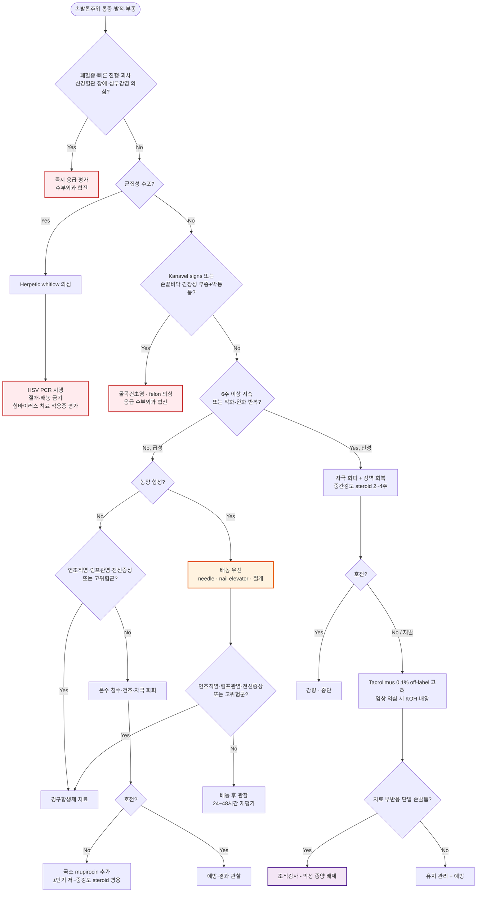

# 손발톱주위염 (조갑주위염) Paronychia

## <mark style="color:green;">일반 사항</mark>

* 손발톱 측부 또는 근위부 주름(nail fold)에 발생하는 염증
* **급성 손발톱주위염** : 손발톱주름 장벽 손상 후 발생하는 세균성 염증·감염으로, 보통 한 손발톱을 침범
* **만성 손발톱주위염** : **6주 이상** 지속되거나 악화와 완화를 반복하는 손발톱주름의 자극·알레르기 접촉피부염으로, 여러 손발톱을 침범하는 경우가 많음
  * 문헌에 따라 4\~6주로 기술되기도 하나, 본문은 AAFP 2017 기준 6주를 적용함
* Candida는 만성 병변에서 검출될 수 있으나 대개 손상된 장벽의 **이차 집락화**이며, 단순 만성 손발톱주위염 자체를 진균 감염으로 간주하지 않음
* 적절히 치료하면 급성 병변은 대개 수일\~1주 내 호전되지만, 만성 병변의 손발톱주름 장벽과 cuticle 회복에는 수 주\~수개월이 걸릴 수 있음
* 치료에 반응하지 않는 **단일 손발톱의 만성 병변**은 편평세포암·흑색종 등 악성 종양 감별이 필요함

✽ 근거 : Leggit JC. Acute and Chronic Paronychia. *American Family Physician*. 2017;96(1):44-51.

## <mark style="color:green;">원인 및 위험 인자</mark>

* 급성 : 손발톱주름 장벽 손상 후 *S. aureus*, *S. pyogenes* 등 세균 침입; 손톱 물어뜯기·손가락 빨기에서는 구강 상재균·혐기성균이 관여할 수 있음
* 만성 : 반복적인 물·세제·산·알칼리·화학물질 노출에 의한 자극접촉피부염이 주된 기전
* 외상, 거스러미 제거, manicure·인조손톱, cuticle 절제 또는 밀어내기
* 손톱 물어뜯기, 손가락 빨기
* 습진, 아토피피부염, 건선
* 손이 자주 젖는 직업 : 가사 종사자, 바텐더, 식당 종사자, 간호사, 미용사, 수영 선수
* 내향성 발톱(특히 발가락)
* 당뇨병, 말초혈관질환, 면역저하
* 약물 : retinoid, EGFR inhibitor, taxane계 항암제, protease inhibitor 등
  * EGFR inhibitor 유발 손발톱주위염은 경증에서는 항암제를 임의로 중단하지 않고 국소치료를 우선함 (☞ 만성 손발톱주위염, 시술 및 기타 처치 참고)

## <mark style="color:green;">임상 양상</mark>

* **급성** : 빠르게 발생하는 통증·압통, 홍반, 부종; 농양이 형성되면 파동감 또는 손발톱주름 아래 고름이 관찰됨
* **만성** : boggy nail fold, cuticle 소실, 손발톱주름과 nail plate의 분리, Beau's line, 손발톱 변색·변형
* 반복적인 습윤 환경과 함께 녹색 변색이 있으면 *Pseudomonas* 집락화 또는 감염을 시사
* 만성 병변에서 갑작스러운 고름·통증·홍반 악화는 급성 세균성 악화 동반 여부를 평가

### <mark style="color:$danger;">🚩 Red Flags!</mark>

<mark style="color:$danger;">**즉각 조치 또는 의뢰**</mark>

* 독성 외관, 패혈증 소견, 빠르게 진행하는 광범위 감염 또는 피부 괴사
* 굴곡건초염 의심 : 손가락 굴곡 자세, 건초를 따른 압통, 방추형 부종, 수동 신전 시 심한 통증(Kanavel signs)
* 신경혈관 장애, 구획증후군 또는 심부 공간 감염 의심

<mark style="color:$warning;">**당일 또는 조기 의뢰**</mark>

* 명확한 농양, 손발톱 아래 농양, 손발톱 양측으로 이어진 horseshoe abscess
* 손끝바닥의 긴장성 부종과 심한 박동성 통증(felon 의심)
* 주변 연조직염·림프관염, 발열 또는 전신 증상
* 면역저하, 조절 불량 당뇨병, 중증 말초혈관질환에서 발생한 급성 병변
* 이물질, 골수염 또는 심부감염 의심

<mark style="color:$info;">**외래 추적 / 추가 평가 계획**</mark> <mark style="color:$info;">- 즉각 위험 낮으나 호전 없으면 의뢰</mark>

* 적절한 치료에도 호전되지 않는 단일 손발톱 병변, 종괴·궤양·출혈·색소 병변 동반
* 반복 재발하거나 여러 손발톱을 침범하는 만성 병변
* 약물 유발 손발톱주위염이 의심되거나 손발톱 변형이 진행하는 경우

## <mark style="color:green;">진단</mark>

* 전형적인 급성 손발톱주위염은 임상적으로 진단하며 routine 검사는 필요하지 않음
* 농양 여부가 불명확하면 digital pressure test 또는 초음파를 고려
* **세균배양** : 중증·재발성 병변, 면역저하, 경험적 치료 실패, 비전형적 감염에서 고려
* **KOH·진균배양** : 동반 손발톱진균증 또는 칸디다 감염이 의심될 때 시행
* **HSV PCR** : 군집성 수포 또는 herpetic whitlow가 의심될 때 우선 고려; Tzanck 검사를 routine 선별검사로 사용하지 않음
* **단순 X선** : 이물질, 골수염 또는 심부감염이 의심될 때 고려
* **조직검사** : 치료에 반응하지 않는 단일 만성 병변 또는 악성 종양 의심 소견이 있을 때 시행·의뢰

### <mark style="color:orange;">감별 진단</mark>

* 통증·발적을 동반하는 손발톱주위 병변은 아래 질환을 함께 고려

<table><thead><tr><th width="150">질환</th><th width="260">핵심 감별 포인트</th><th>초기 대응 시 주의</th></tr></thead><tbody><tr><td>Herpetic whitlow</td><td>작열감·통증 후 군집성 수포, 반복 재발 가능</td><td><strong>절개·배농 금기</strong>; HSV PCR 우선</td></tr><tr><td>Felon</td><td>digital pulp space 감염; 손끝바닥의 긴장성 부종·박동성 통증</td><td>단순 손발톱주름 배농과 접근 다름; 수부외과 의뢰 고려</td></tr><tr><td>굴곡건초염</td><td>Kanavel signs(굴곡 자세, 건초 압통, 방추형 부종, 신전통)</td><td>응급 수부외과 평가</td></tr><tr><td>내향성 발톱</td><td>발톱 가장자리가 손발톱주름을 파고듦; 발가락 급성 병변의 흔한 원인</td><td>원인 교정 없이 항생제만 반복 처방하지 않음</td></tr><tr><td>Retronychia</td><td>손발톱판이 근위부 손발톱주름으로 밀려 들어가며 반복 근위부 염증</td><td>보존치료 무반응 시 근위부 손발톱판 발거 고려</td></tr><tr><td>접촉피부염·습진·건선</td><td>다른 부위 습진·건선 병력, 알레르겐/자극원 노출력</td><td>항생제보다 유발인자 회피·국소 스테로이드가 핵심</td></tr><tr><td>손발톱주위 사마귀</td><td>과각화성 구진, 만성 경과</td><td>급성 감염 소견 없으면 항생제 불필요</td></tr><tr><td>손발톱단위 종양(편평세포암·흑색종 등)</td><td>치료에 반응하지 않는 단일 손발톱의 만성 병변, 종괴·궤양·출혈·색소 병변</td><td>조직검사 지연 시 진단 지연 위험</td></tr></tbody></table>

***



<p align="center"><strong>진단 및 치료 알고리듬</strong></p>

<p align="center"><em><mark style="color:$info;">Ref. Leggit JC. Acute and Chronic Paronychia. Am Fam Physician. 2017;96(1):44-51.</mark></em></p>

***

## <mark style="background-color:$warning;">Management</mark>


**손발톱주위염 치료의 핵심 원칙**
급성은 배농이 항생제보다 우선이며, 만성은 항진균제가 아니라 자극 회피와 국소 스테로이드가 1차 치료다. Herpetic whitlow를 배제하기 전에는 절개·배농을 시행하지 않는다.


### <mark style="color:orange;">급성 손발톱주위염</mark>

#### <mark style="color:$primary;">농양·명백한 연조직염이 없는 경증 병변</mark>

* 온수 침수 또는 온찜질 10\~15분씩 하루 3\~4회, 보통 2\~3일간 시행
* 필요시 1% acetic acid 또는 Burow solution을 선택하여 사용할 수 있으나, 여러 소독제·침수법을 중복하지 않음
* 침수 후 충분히 건조하고 자극과 손발톱 조작을 피함
* 호전이 불충분하면 국소 항생제 추가
  * mupirocin 2% 연고 : 얇게 bid\~tid ×5\~10d <mark style="color:blue;">\[에스로반]</mark>
  * *Pseudomonas*가 의심되면 습윤 노출을 중단하고 배양 및 국소 gentamicin 등 감수성에 따른 치료 고려
* 염증이 뚜렷한 비농양성 병변에서는 국소 항생제에 저\~중간 강도 국소 steroid를 짧게 병용하면 증상 소실 기간을 줄일 수 있으나, 세균·진균·바이러스 감염이 조절되지 않은 상태에서 steroid 단독 사용은 피함
* 통증에는 acetaminophen 또는 NSAID를 사용하며, 통증이 심하거나 증가하면 진통제 강화보다 농양·felon·굴곡건초염 등 심부감염을 우선 재평가

#### <mark style="color:$primary;">농양이 있는 병변</mark>

* **배농이 우선** : needle, nail elevator 또는 작은 절개로 손발톱주름을 들어 배농
* 손발톱 아래 농양, 광범위한 eponychium 침범 또는 horseshoe abscess는 부분·전체 손발톱판 제거가 필요할 수 있으므로 숙련된 시술자에게 의뢰 (☞ 시술 및 기타 처치)
* 배농 후 온수 침수 10\~15분씩 하루 2\~3회, 2\~3일간 시행하고 24\~48시간 내 재평가
* 적절히 배농된 단순 농양에서는 경구항생제와 routine 배양을 일률적으로 추가하지 않음


**⚠️ Herpetic whitlow 감별 필수**\
군집성 수포가 있거나 herpetic whitlow가 의심되면 절개·배농하지 않는다. 필요시 수포액 HSV PCR을 시행하고 항바이러스 치료 적응증을 평가한다.


#### <mark style="color:$primary;">경구항생제가 필요한 경우</mark>

* 명백한 주변 연조직염 또는 림프관염
* 발열·전신 증상, 빠르게 진행하거나 중증인 감염
* 면역저하, 조절 불량 당뇨병 등 고위험군
* 적절한 배농 후에도 호전되지 않는 경우

**구강 상재균 노출이 없는 경우**

* cephalexin : 500 ㎎ qid ×5\~7d <mark style="color:blue;">\[팔렉신]</mark>

**손톱 물어뜯기·손가락 빨기 등 구강 상재균 노출이 있는 경우**

* amoxicillin/clavulanate : 500/125 ㎎ tid ×5\~7d <mark style="color:blue;">\[오구멘틴 625 ㎎]</mark>
* clindamycin 단독은 *Eikenella*를 포괄하지 못하므로 amoxicillin/clavulanate와 동등한 1차 대체약으로 사용하지 않음

**MRSA 위험 또는 화농성 감염이 있는 경우**

* TMP/SMX : 160/800 ㎎ bid ×5\~7d <mark style="color:blue;">\[셉트린]</mark>
* doxycycline : 100 ㎎ bid ×5\~7d <mark style="color:blue;">\[바이브라마이신]</mark>
* clindamycin : 300\~450 ㎎ tid\~qid ×5\~7d <mark style="color:blue;">\[훌그램]</mark> - 지역 내 감수성 자료 확인
* TMP/SMX와 doxycycline은 연쇄알균에 대한 활성이 불확실하므로 비농성 연조직염이 동반되면 cephalexin 등 β-lactam 병용을 고려

✽ 위 용량은 신기능이 정상인 성인의 일반적인 **예시 처방**이다. 신·간기능, 임신·수유, 연령, 약물 알레르기, 병용약물 및 지역 내성 자료에 따라 조정한다. 대부분 5\~7일 치료하며 임상 반응이 느리거나 중증이면 7\~10일까지 연장할 수 있다. Dicloxacillin은 국내 유통 제품이 없어 제외하였다.

### <mark style="color:orange;">만성 손발톱주위염</mark>

* 핵심 치료는 물·세제·화학물질 등 자극 노출을 차단하고 손발톱주름 장벽을 회복시키는 것
* 손 씻기 후 보습제를 바르고, 습한 작업 시 면장갑 위에 방수장갑을 착용
* 중간 강도 국소 corticosteroid 연고를 얇게 qd\~bid ×2\~4주 사용하고 호전 시 감량·중단; 악화 시 단기간 반복 가능
  * prednicarbate 0.25% <mark style="color:blue;">\[더마톱 연고]</mark>
* 국소 steroid에 반응하지 않거나 반복 재발하면 tacrolimus 0.1% 연고 bid ×3주를 2차 선택으로 제한적으로 고려(off-label) <mark style="color:blue;">\[프로토픽 연고]</mark>
  * 45명 대상 무작위 비맹검 비교연구에서 tacrolimus 0.1% 연고가 betamethasone 17-valerate 0.1%보다 높은 호전율을 보였으나, 소규모 단일 연구라는 한계가 있음(Rigopoulos D et al., 2009)
* 일반적인 자극성 만성 손발톱주위염에서는 clobetasol 0.05%, diflucortolone valerate 0.3% 같은 고역가\~초고역가 제제를 routine 1차 치료로 사용하지 않음
  * diflucortolone valerate 0.3%는 실제 세균·진균·바이러스 감염이 확인되거나 의심되는 병변에는 국내 허가사항상 투여 금기
* 항진균제는 routine으로 사용하지 않으며, KOH·배양 등으로 동반 Candida 감염 또는 손발톱진균증이 확인된 경우에만 치료
* thymol 4% 알코올 조제는 국내 표준 제형과 근거가 불명확하여 routine 처방하지 않음
* 약물 유발이 의심되면 원인 약제를 임의로 중단하지 말고 처방 전문과와 감량·대체 가능성을 협의

#### <mark style="color:$primary;">EGFR inhibitor 유발 손발톱주위염</mark>

* 일반적인 자극성 만성 손발톱주위염과 병태생리와 치료 강도가 다르므로 별도로 평가
* 경증에서는 항암제를 유지하면서 자극 회피·소독 침수·국소 항염치료를 우선
* 이차 세균·진균 감염이 의심되면 배양을 고려하고 결과와 임상 소견에 따라 항균치료; 항생제를 routine으로 병용하지 않음
* 중등도 이상, 기능장애, 심한 통증 또는 과증식 육아조직이 있으면 피부과·종양내과와 치료 강도 및 항암제 감량·일시 중단 여부를 협의
* 중증도에 따라 고역가 국소 steroid가 사용될 수 있으므로 일반 자극성 만성 손발톱주위염의 steroid 원칙을 일률적으로 적용하지 않음

### <mark style="color:orange;">파상풍 예방</mark>

* 손발톱주위염 자체는 파상풍 예방접종 적응증이 아님
* 오염된 자상·교상 등 실제 창상이 있고 예방접종력이 불완전하거나 추가접종 시기가 지난 경우, 상처 종류와 접종력에 따라 파상풍 백신 ± 면역글로불린을 시행

## <mark style="color:green;">비-약물 치료 및 예방</mark>

* 손톱·손가락 물기, 거스러미 뜯기, cuticle 절제·밀어내기 등 손발톱주름 손상을 피함
* 손발톱을 짧게 유지하되 가장자리를 지나치게 깊게 자르지 않음
* 장시간 물·세제·화학물질 노출을 피하고 손 세척 후 보습제를 바름
* 습한 작업 시 면장갑 위에 방수장갑을 착용하고 땀이 차면 교체
* 당뇨병 환자는 혈당을 적절히 관리하고 발가락 병변에서는 내향성 발톱과 당뇨발 감염을 함께 평가

## <mark style="color:green;">시술 및 기타 처치</mark>

* **손발톱주름 배농** : needle 또는 nail elevator로 손발톱판 위 손발톱주름을 들어올려 배농; 단순 배농은 무마취로 가능할 수 있으며, 절개 확대·손발톱판 제거가 필요하면 digital block을 고려
* **부분·전체 손발톱판 제거** : 손발톱 아래 농양, horseshoe abscess, 광범위 eponychium 침범에서 고려; 숙련되지 않으면 의뢰
* **질산은(silver nitrate) 소작** : EGFR inhibitor 유발 손발톱주위염이나 만성 내향성 발톱에서 과증식 육아조직(pyogenic granuloma양 병변) 동반 시 국소 소작으로 병변 축소에 도움
* **Phenol matrixectomy 등 부분 조갑기질 절제술** : 재발성 내향성 발톱과 동반된 만성 손발톱주위염에서 근본 치료가 필요하면 피부과·정형외과 의뢰

***

## 처방례

### <mark style="color:purple;">처방례 1. 온수 침수 후 호전이 불충분한 경증 급성 병변(농양·주변 연조직염 없음)</mark>

> ```
> 에스로반 연고 10 g/tube　얇게 tid
> 부루펜 200 ㎎/T　6T #3
> ```
>
> _✽온수 침수 10\~15분씩 하루 3\~4회, 2\~3일간 시행 후 충분히 건조. 48\~72시간 내 호전 없으면 재진._

### <mark style="color:purple;">처방례 2. 손톱 물어뜯기 후 주변 연조직염이 동반된 경우</mark>

> ```
> 오구멘틴 625 ㎎/T　3T #3　×5~7d
> 부루펜 200 ㎎/T　6T #3
> ```
>
> _✽농양이 있으면 위 처방보다 배농이 우선이다. 손톱을 물어뜯었다는 사실만으로 경구항생제를 투여하지 않으며, 주변 연조직염·전신 증상·고위험군 여부를 확인한다._

### <mark style="color:purple;">처방례 3. 손발톱주름 배농 후 처치</mark>

> ```
> 온수 침수 10~15분씩 1일 2~3회, 2~3일간
> ```
>
> _✽배농 후 세척·드레싱과 단기 침수를 시행하고 24\~48시간 내 재평가한다. 단순 농양이 적절히 배농되었다면 경구항생제를 일률적으로 추가하지 않는다. 국소 mupirocin은 잔여 표재성 감염 또는 배액이 지속될 때 선택적으로 고려한다._

### <mark style="color:purple;">처방례 4. 만성 손발톱주위염(6주 이상, 여러 손발톱 침범)</mark>

> ```
> 더마톱 연고 10 g/tube　얇게 bid　×2~4주
> ```
>
> _✽항진균제는 routine으로 병용하지 않는다. 자극 회피·보습·방수장갑 착용을 함께 지도한다. 4주 후에도 호전 없으면 진단과 자극 노출을 재평가하고, 임상적으로 진균 감염이 의심되면 KOH·배양을 시행한다. Tacrolimus 0.1% 연고 bid ×3주는 off-label 2차 선택으로 제한적으로 고려한다._

***

### <mark style="color:$success;">핵심 복약 지도</mark>

> **국소 항생제·소독**
>
> * mupirocin 연고는 병변 부위에 얇게 바르며, 정해진 기간(보통 5\~10일)을 넘겨 임의로 연장하지 않습니다.
> * 온수 침수는 정해진 시간(10\~15분)만 시행하고, 장시간 물에 담그면 오히려 피부 장벽이 약해질 수 있습니다.

> **경구항생제**
>
> * 처방받은 기간을 채워서 복용하고 증상이 좋아졌다고 임의로 중단하지 않습니다.
> * 손톱을 물어뜯거나 빤 뒤 발생한 경우라는 이유만으로 항생제가 자동으로 필요한 것은 아니며, 연조직염·전신증상이 없으면 국소치료만으로 충분한 경우가 많습니다.

> **국소 스테로이드(만성 병변)**
>
> * 의사가 지시한 기간(보통 2\~4주) 이상 임의로 연장하지 않습니다.
> * 고역가 제제를 장기간 사용하면 피부 위축·모세혈관확장이 생길 수 있어, 세균·진균·바이러스 감염이 조절되지 않은 상태에서는 사용하지 않습니다.

> **언제 다시 병원을 방문해야 하나요?**
>
> * 48\~72시간 내 호전되지 않거나 오히려 악화되는 경우
> * 고름이 잡히거나(파동감) 통증이 심해지는 경우 - 배농이 필요할 수 있음
> * 홍반이 넓게 퍼지거나 줄 모양의 발적, 발열, 오한이 동반되는 경우 - 즉시 내원
> * 군집성 수포가 새로 생긴 경우 - 배농을 시행하지 않고 재평가 필요

***

### <mark style="color:blue;">환자 안내서</mark>


**손발톱주위염, 물과 자극을 피하는 것이 치료의 시작입니다**

손발톱주위염은 손발톱 옆 피부(손발톱주름)에 생기는 염증입니다. 갑자기 생겨 빨갛게 붓고 아픈 **급성**과, 6주 이상 지속되며 여러 손발톱을 침범하는 **만성**으로 나뉘며 치료 방법이 다릅니다.


#### <mark style="color:$primary;">왜 손발톱주위염이 생기나요?</mark>

* 급성은 손톱을 물어뜯거나 거스러미를 뜯는 등 작은 상처를 통해 세균이 들어가 생깁니다.
* 만성은 대부분 세균 감염 자체가 아니라, 물·세제·화학물질에 반복적으로 노출되어 손발톱주름 피부 장벽이 약해진 상태입니다. 손을 자주 물에 담그는 직업(요리, 미용, 가사, 간호 등)에서 흔합니다. 다만 고름·통증·홍반이 갑자기 악화되면 이차 세균 감염이 동반될 수 있습니다.

#### <mark style="color:$primary;">일상생활에서 어떻게 관리하나요?</mark>

* **손발톱과 거스러미를 물어뜯거나 뜯지 마십시오.** 작은 상처가 반복되면 낫지 않고 계속 악화됩니다.
* **설거지·청소 등 물 작업 시 면장갑 위에 고무장갑을 끼십시오.** 땀이 차면 젖은 장갑을 바로 교체하십시오.
* **손 씻은 뒤에는 물기를 완전히 말리고 보습제를 바르십시오.**
* **손톱은 짧게 유지하되 가장자리를 너무 깊게 자르지 마십시오.**

#### <mark style="color:$primary;">약은 어떻게 써야 하나요?</mark>

* 연고는 정해진 기간만 바르십시오. 특히 스테로이드 연고를 임의로 오래 바르면 피부가 얇아질 수 있습니다.
* 경구항생제가 처방된 경우 증상이 좋아져도 처방된 날짜까지 복용하십시오.
* 물집(수포)이 여러 개 뭉쳐서 생긴 경우에는 짜거나 터뜨리지 말고 병원에 알리십시오.

#### <mark style="color:$primary;">이럴 때는 즉시 병원을 방문하세요</mark>

* 고름이 잡히거나 통증이 심해지는 경우
* 손·발가락이 광범위하게 붉어지거나 열이 나는 경우
* 손가락이 소시지처럼 붓고 구부러진 채 펴지지 않으며 심하게 아픈 경우
* 몇 주간 치료해도 낫지 않거나 오히려 손발톱 모양이 계속 변하는 경우

***

### <mark style="color:red;">질병코드</mark>

L03.00 손가락의 연조직염

L03.01 발가락의 연조직염
